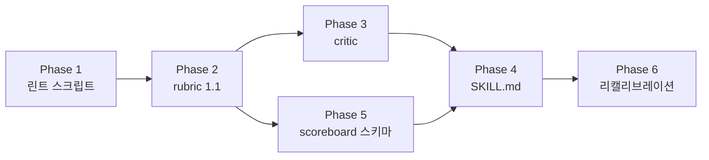

# post-quality-loop 개선 계획 (루브릭 1.1)

작성일: 2026-07-28

## 배경 — 왜 고치는가

스코어보드 228건 실측: 통과 226건(**99.1%**), 평균 **95.5점**, 100점 41건(18%), 97점 이상 88건(39%), 에스컬레이션 2건. 통과 행 중 **74건**이 `없음(경미: …)` 형태로 결함을 기록해놓고도 통과했다. 즉 채점자가 결함을 **발견하고도 점수에 반영하지 않는다**. 게이트가 99%를 통과시키면 루프의 정지 신호가 의미를 잃고, Revise 단계도 실질적으로 작동하지 않는다.

원인은 두 가지다.

1. **앵커 해상도와 임계값의 구조적 불일치**: 앵커가 `0/40/70/100` 4단계인데 통과선이 90점이다. 30점 배점인 항목 2에 70앵커를 주면 즉시 91점 — "한 항목만 70, 나머지 전부 100"이어야 겨우 통과다. 통과시키려면 거의 모든 항목에 100을 줄 수밖에 없는 구조이고, 그 결과가 "경미 결함을 적고도 100앵커" 74건이다.
2. **결정론적 검사를 LLM에 위임**: title 길이·description 길이·tags 개수·`data/tags.yaml` 승인 여부·`draft` 필드·문단 비율 ≥40%·로컬 파일 참조·Mermaid 문법은 전부 스크립트로 딱 떨어진다. 지금은 critic이 눈으로 세고 있어 "tags.yaml 미등재" 같은 항목 7 위반이 여러 행에 기록되었는데도 점수에 반영되지 않았다.

## 목표 (측정 가능한 종료 조건)

- 100점 비율 18% → **5% 미만**
- 통과 행에 `경미:` 결함이 기재된 상태로 해당 항목이 100앵커인 경우 **0건**
- 항목 6·7 및 항목 3의 문단 비율은 LLM 재량이 아니라 **린트 수치로 결정**
- 문서 간 논리적 모순 6건 해소

---

## Phase 1 — 결정론적 린트 스크립트

**산출물**: `script/post_lint.py` (Python 3.13 + pyyaml)

> **기존 자산 재사용**(계획 초안 수정): 저장소에는 이미 `script/lint_frontmatter.py`(CI `.github/workflows/lint-content.yml`에서 PR마다 실행), `script/find_broken_bold.py`, `script/fix_range_tilde.py`가 있다. 새 언어(Node)로 재구현하면 규칙이 두 벌로 갈라진다. 따라서 **같은 `script/` 디렉터리에 Python으로 작성하고 `lint_frontmatter.py`의 `load_approved_tag_index`·`_norm_tag`·`extract_tag_lines`·`FRONTMATTER_RE`를 import해 재사용**한다. CI와 채점 루프가 **같은 판정 코드**를 공유하는 것이 이 Phase의 부수 효과이자 핵심 이득이다.

**모드 2가지**

- `python script/post_lint.py <글경로>` — 글 1개 린트, JSON + 사람이 읽는 표 출력, 하드 위반 시 exit 1
- `python script/post_lint.py --scan` — 저장소 전체에서 게시 상태(`draft: false` 또는 `draft` 없음) 글을 수집해 스코어보드 미등록 목록만 출력 (Stage 0 스캔 대체)

**검사 항목**

| 검사 | 근거 | 매핑 항목 |
|------|------|-----------|
| frontmatter 파싱 가능 여부 | 치명결함 5 | 7 |
| title ≤70자 | `rubric.md` §7 | 7 |
| description 120–170자 | §7 | 7 |
| tags 개수 ≥25, `data/tags.yaml` 승인 태그 매칭 ≥10, 미승인 태그 목록 출력 | §7 | 7 |
| `draft` 필드 존재/값 | §7, 치명결함 5 | 7 |
| `image` 및 본문 상대경로 파일 실존 | 치명결함 1 | 7 |
| 내부 링크 `/post/...` 형식 + slug 인덱스 대비 대상 존재 | §7 | 7 |
| 외부 URL **목록 추출**(검증은 critic이 수행) | §7 | 7 |
| Mermaid: 특수문자 포함 라벨의 따옴표 누락, 라벨 내 `\n`(이 저장소 표준은 ` `), 예약어 노드 ID(`end`/`graph`/`subgraph`) | §6, 치명결함 2 | 6 |
| 산문 비율(코드블록·표·리스트·frontmatter 제외) ≥40% | §3 | 3 |
| 작성자용 메타블록 잔존("게시 전 자가 점검", "평가 기준 재확인") | 치명결함 3 | 4 |
| 범위 표기 물결표(§9), 문장부호 인접 `**` 깨짐(§10) — 기존 `fix_range_tilde.py`·`find_broken_bold.py`의 탐지 로직 재사용(dry-run 호출) | `rules-that-must-be-followed` §9·§10 | 7 |

**주의**: 스크립트는 **판정하지 않고 측정만** 한다. 앵커 환산은 루브릭이 정의하고 critic이 적용한다.

### Phase 1 결과 (완료, 2026-07-28)

산출물은 [`script/post_lint.py`](../../script/post_lint.py). 게시 상태 글 **1,559개 전수 측정**으로 오탐률을 검증한 뒤 확정했다.

**검증 절차에서 실제로 잡은 오탐 3종**(모두 수정 후 재측정):

1. Mermaid 다중문자 도형(`User(["user"])`, `DB[("Database")]`)을 미따옴표 라벨로 오인 → 도형 스캐너를 최장 구분자 우선으로 교체.
2. sequenceDiagram 메시지(`applyEvent(event, isNew=false)`)를 노드 정의로 오인 → 라벨 검사를 `flowchart`/`graph`에만 적용.
3. 따옴표 안의 대괄호(`A["x = [1,2,3]"]`)에서 종료 구분자를 조기 판정 → 따옴표 우선 스캔으로 교체.

수정 후 도형 18종 단위 케이스 전부 통과. `broken-bold` 검사는 기존 `find_broken_bold.py`와 동일 파일 집합에서 **97 files / 375 spans 정확히 일치** — 로직 재사용이 실측으로 확인됐다.

**전수 측정 결과** (건수 기준):

| 코드 | 건수 | 성격 |
|------|-----:|------|
| `prose-ratio` (<40%) | 873 | 항목 3 상한 70 |
| `desc-len` (120–170 이탈) | 459 | 항목 7 상한 85 |
| `broken-bold` (§10) | 259 | 항목 7 상한 85 |
| `mermaid-quote` (§5) | 239 | 항목 6 상한 70 |
| `asset-missing` | 201 | **치명** |
| `bom` | 20 | 항목 7 상한 85 |
| `range-tilde`·`mermaid-newline` | 각 7 | 항목 7·6 |
| `link-internal` | 5 | **치명** |
| 태그 관련 | 6 | 항목 7 |

산문 비율 분포: p25=19.1%, **중앙값 34.3%**, p75=56.2% — 40% 기준 충족은 686개(44.0%)로, 지표가 한쪽으로 쏠리지 않고 실제로 변별한다.

**부수적으로 발견된 실제 결함 3종** (현행 루브릭이 226개 글을 ≥90점으로 통과시키면서 단 한 건도 잡지 못한 것):

- **치명결함 보유 글 14개** — 예: `2025-01-10-rdp-explorer-hiding-issue`가 `Screenshot-...-152607.png`를 참조하나 실제 파일은 `...152606.png`(오프바이원 오타, 라이브 사이트에서 깨진 이미지).
- **깨진 내부 링크 10건** — `/post/2026/...`처럼 연도 세그먼트가 낀 링크, 폴더명(`19-concurrency-distributed-patterns`)을 slug 대신 쓴 링크, `clean-architecture/00-...`(실제 slug는 `getting-started-clean-architecture`).
- **UTF-8 BOM 20개 파일** — `lint_frontmatter.py`가 파일 선두에 정규식을 앵커링하므로 **CI가 이 20개 파일의 frontmatter 검사를 통째로 건너뛰고 있었다**. 전부 `optimization-02-cpp-language` 컬렉션.

> **Phase 2 캘리브레이션 주의**: `prose-ratio` 위반이 56%, `desc-len` 위반이 29%다. 이 둘의 상한을 그대로 적용하면 상당수 글이 90점 아래로 내려간다. 이는 의도된 디플레이션이지만, Phase 6 리캘리브레이션에서 통과율을 반드시 확인한다.

## Phase 2 — `rubric.md` 1.1 개정

1. **앵커 5단계화**: `0 / 40 / 70 / 85 / 100`. 85 앵커 문구를 항목 1~7 전부에 추가한다("결함이 경미하고 국소적이며 독자 오해를 유발하지 않음").
2. **100 앵커 부여 조건 명문화**: 해당 항목에 기록된 경미 결함이 **0개**일 때만 100. 경미 결함이 1개라도 있으면 **최대 85**. (인플레이션 차단의 핵심 장치)
3. **린트 연동 항목의 재량 제거**: 항목 6·7과 항목 3의 문단 비율은 린트 출력 수치 → 앵커 매핑 표로 고정한다. 예: 미승인 태그 1~3개 → 최대 85, 4개 이상 → 최대 70, tags <25 → 최대 70, 문단 비율 <40% → 최대 70.
4. **N/A 재분배 계산 순서 명문화**: (1) 항목 2 내부에서 4번째 요소 N/A면 3요소 균등 → 항목 2의 배점 30은 유지. (2) 항목 5 N/A면 10점을 항목 2·3에 **배점 비례** 재분배. 두 조건이 동시에 걸리는 경우(예: Vocabulary)의 계산 예시 1개를 표로 넣는다.
5. **"차단"과 "깨짐" 분리**: WAF/403 차단은 치명결함이 아니다. 치명결함 1은 404/5xx·존재하지 않는 파일로 한정하고, 폴백까지 실패한 URL은 **"검증 불가"**로 별도 기재(항목 7에서 85 상한 사유).
6. **만료 규칙 개정** (Phase 5와 짝):
   - `콘텐츠해시` 축 신설 — 채점 시점 파일 해시와 현재 해시가 다르면 만료.
   - **부분 만료**: 마이너 버전 업(1.0→1.1)은 변경된 항목만 재채점 대상으로 삼고, 큐 우선순위는 **최하위**. 메이저(2.0)에서만 전면 만료.
   - 버전 이력 표에 "이 버전에서 변경된 항목" 컬럼 추가(부분 만료 판정 근거).
7. **임계값**(확정): **통과 = 총점 ≥ 90 AND 치명결함 0 AND 모든 항목 앵커 ≥70**. 기존 90점을 유지하되 "단일 항목 붕괴 방지" 조건을 신설한다. 이는 의도적으로 엄격한 게이트다 — 5단계 앵커에서 85는 "경미 결함 있음"이므로, 90을 넘으려면 대부분의 항목이 **경미 결함 0(=100앵커)**이어야 한다. 파급은 아래 "임계값 90 유지의 파급" 절 참고.

### Phase 2·5 결과 (완료, 2026-07-29)

Phase 2와 5는 계획대로 한 번에 처리했다(앵커 변경 → 버전 1.1 → 기존 행 만료가 연쇄하므로 분리 불가).

**`rubric.md` 1.1** — 앵커 5단계화, 100 앵커 부여 조건("경미 결함 0일 때만"), [린트 → 앵커 상한 매핑](../skills/post-quality-loop/rubric.md#린트--앵커-상한-매핑) 표 신설(코드 23종이 `post_lint.py`의 `anchor_caps`와 1:1 대응), 통과 조건에 항목별 ≥70 추가, N/A 재분배 계산 순서·예시 명문화, 치명결함에 `link-internal` 추가 및 WAF 차단을 "검증 불가"로 분리.

**`scoreboard.md`** — `콘텐츠해시` 컬럼 추가(git blob 해시 7자리, `git hash-object <경로>`로 사람이 대조 가능). 1,559행 전부 10컬럼으로 정합, 채점 행 229개 전부 해시 기록. 만료 규칙을 이 파일로 일원화하고 **콘텐츠 변경** 축을 신설, 버전 불일치는 부분 만료(최하위 우선순위)로 분리.

마이그레이션 중 **중복 등록 행 1건**을 발견해 제거했다(`2022-03-16-there's-no-such-things-as-clean-code`가 `미채점`으로 두 번 등록 — 경로의 아포스트로피 때문으로 보인다). 1,560행 → 1,559행.

> **주의 — 전환 중 상태**: 루브릭은 1.1이지만 `quality-critic`은 아직 린트를 실행하지 않고(Phase 3), `SKILL.md`의 만료·스캔 서술도 갱신 전이다(Phase 4). Phase 3·4를 마치기 전에 루프를 돌리면 채점자가 린트 수치 없이 1.1 앵커를 적용하게 되므로, **그 사이에는 루프를 실행하지 않는다.**

## Phase 3 — `quality-critic.md` 개정

- **절차 0 신설**: `post-lint.mjs`를 Bash로 실행하고 그 출력을 **사실로 사용**한다. 린트가 잡은 값을 critic이 재해석하거나 봐주지 않는다.
- **출력 형식 확장**: `루브릭버전`, `린트요약`, `콘텐츠해시`를 출력에 추가한다. 현재 Stage 4는 `루브릭버전` 기록을 요구하는데 critic 출력에 그 필드가 없어 메인 에이전트가 추정해 적고 있다.
- **경미 결함 명시 필드 신설**: 항목별로 `경미결함[]`을 반환하게 하고, 비어 있지 않으면 100앵커를 줄 수 없게 한다(Phase 2-2와 연동).
- **링크 검증에 `insane-search` 폴백 적용**: 현재 폴백이 커리큘럼 조회에만 걸려 있다. 폴백 후에도 접근 불가면 "검증 불가"로 기록(치명결함 아님).
- **Bash 허용 범위 명문화**: 린트 스크립트 실행, `insane-search`, `git hash-object` 3가지로 한정(read-only 원칙 유지).

## Phase 4 — `SKILL.md` 개정

- **Stage 번호 정합**: Mermaid의 `"2. Build gate"` 라벨과 본문 Stage 2(Decide)가 충돌한다. Build gate를 **Stage 3.5**로 명명하고 Mermaid 라벨과 87번째 줄 "Stage 2의 Build gate" 문구를 함께 수정.
- **에스컬레이션 분기 신설**: 현재 "`draft: true`를 유지한 채"는 자율 모드가 다루는 **이미 게시된 글**(draft 없음)에는 수행 불가능한 지시다. `신규 초안 → draft: true 유지` / `게시글 → draft 미변경, 기록만`으로 분기.
- **반복수 정의**: `반복수`는 해당 글의 **누적** Revise 횟수(스코어보드에 12까지 존재), 최대 3회 제한은 **1회 실행 내부 카운터**임을 명시. 만료 재채점 시 내부 카운터는 0에서 시작.
- **Stage 0 스캔 위임**: 매 실행마다 약 1,550개 파일 frontmatter를 읽고 1,575줄 스코어보드를 로드하는 현재 방식을 `post-lint.mjs --scan` 호출로 대체.
- **Build gate 기본 명령 변경**: `hugo --gc --minify --renderToMemory`를 기본으로 올린다(콜드 빌드 10분 경고는 각주로 강등).
- **중복 서술 제거**: 스캔·만료 규칙이 Stage 0 / "점수판 운영" 절 / `scoreboard.md` 상단 3곳에 중복돼 드리프트 위험이 크다. **정본은 `scoreboard.md`**, 나머지는 링크만 남긴다.

## Phase 5 — `scoreboard.md` 스키마 확장 + 마이그레이션

- 컬럼 추가: `콘텐츠해시`(git blob short hash 7자리). 새 스키마: `| 글 경로 | 최신점수 | 채점일 | 반복수 | 상태 | 루브릭버전 | 콘텐츠해시 | 주요 미달항목 |`
- 기존 228개 채점 행의 해시를 일괄 채우는 1회성 마이그레이션 스크립트 실행(미채점 1,332행은 `-`).
- 만료 규칙 정본을 Phase 2-6에 맞춰 갱신.

### Phase 3·4 결과 (완료, 2026-07-29)

**`quality-critic.md`** — 절차 0에 `post_lint.py --json` 실행을 신설하고 "린트 출력은 사실이지 의견이 아니다"를 규율로 명문화. 출력 머리말에 `루브릭버전`·`콘텐츠해시`·`린트요약` 3줄 추가, 항목별 표에 **린트상한**·**경미결함** 칸 추가(경미결함이 비어 있어야만 100 가능). 링크 검증에서 404/5xx와 WAF 차단을 분리하고 차단은 `insane-search` 폴백 후 "검증 불가"로 기재. `Bash` 허용 범위를 3가지로 한정.

**`SKILL.md`** — 다음 결함을 수정했다.

| 결함 | 조치 |
|------|------|
| Mermaid의 `2. Build gate`와 본문 Stage 2(Decide) 충돌 | Build gate를 **Stage 3.5**로 승격, 다이어그램·본문 참조 모두 정정 |
| 에스컬레이션이 `draft: true` 유지를 지시(게시글엔 수행 불가) | **신규 초안 / 게시글** 분기 신설. 게시글은 draft 미변경, 기록만 |
| `반복수` 정의 부재(최대 3인데 실제 12까지 존재) | "3회"는 **1회 실행 내부 카운터**, 스코어보드 `반복수`는 **누적**임을 명문화 |
| Stage 0이 약 1,550개 파일을 직접 스캔 | `python script/post_lint.py --scan` 위임 |
| Build gate 기본 명령이 콜드 빌드 10분 | `--renderToMemory`를 기본으로 승격, 전체 빌드는 예외 경로로 강등 |
| 스캔·만료 규칙이 3곳에 중복 서술 | 정본을 `scoreboard.md`로 일원화, 나머지는 참조만 |

정합성 검증: 구 4단계 앵커 표현·"차단=치명" 오판·옛 Stage 참조·수동 스캔 잔존이 전부 해소됐고, `rubric.md`의 현재 버전(1.1)과 critic 출력 예시 버전이 일치한다.

## Phase 6 — 리캘리브레이션 검증

새 루브릭이 실제로 변별하는지 **5건 샘플 재채점**으로 확인한다.

- 100점 행 3건 (예: `content/post/2026/2026-07-25-omniroute-ai-gateway/`, 100점 그룹에서 임의 2건)
- 90~91점 행 2건 (예: `18-isp-interface-segregation-principle`, `01-architecture-history-evolution-introduction`)

**합격 기준**: 100점 3건 중 최소 2건이 85~95 구간으로 내려오고, 기존에 `경미:`로 기록됐던 결함이 점수에 반영될 것. 그렇지 않으면 Phase 2-2(100앵커 조건)를 강화한 뒤 재검증.

### Phase 6 결과 (완료, 2026-07-29)

| 글 | 1.0 점수 | 1.1 점수 | Δ | 판정 |
|----|-------:|-------:|----:|------|
| `post/2026/2026-07-25-omniroute-ai-gateway` | 100 | **82.3** | −17.7 | 미달 |
| `cleanarchitecture/30-business-rules-entities-usecases` | 100 | **79.6** | −20.4 | 미달 |
| `design-patterns/20-ddd-design-patterns` | 100 | **75.1** | −24.9 | 미달 |
| `cleanarchitecture/18-isp-interface-segregation-principle` | 90.1 | **81.1** | −9.0 | 미달 |
| `cleanarchitecture/01-architecture-history-evolution-introduction` | 91 | **83.5** | −7.5 | 미달 |

**디플레이션은 목표를 초과 달성했다** — 100점 3건이 전부 75~83 구간으로 내려왔다(목표는 85~95). 채점자들이 실제로 찾아낸 것도 사소하지 않다: 20-ddd는 서론이 예고한 Ubiquitous Language·Bounded Context를 본문에서 전혀 다루지 않고(00 챕터가 약속한 "DDD 맥락에서 GoF 패턴이 어떻게 변형되는지"도 표 1개로 처리), 01-architecture-history는 구조적 프로그램 정리를 Böhm–Jacopini(1966) 대신 Dijkstra에게 귀속했으며, 30-business-rules는 `loans.save(loan)`과 무관한 ID를 응답으로 반환하는 코드를 싣고 있었다. **1.0에서 100점을 받은 글들이다.**

**그러나 합격 기준의 가드 조건에 걸렸다** — 표본 통과율 0/5(0%)로 "30% 미만" 선을 밑돈다.

**원인은 산술이다.** 배점이 (18, 30, 13, 13, 10, 6, 10)이므로 전 항목 85면 총점은 정확히 85다. 90을 넘으려면 **최소 48점어치 항목이 100(=경미 결함 0)** 이어야 한다.

- 항목 2(30점)만 100, 나머지 85 → `30 + 0.85 × 70 = 89.5` — **여전히 미달**
- 항목 1(18점)+2(30점) 둘 다 100, 나머지 85 → `48 + 0.85 × 52 = 92.2` — 통과

즉 **가장 무거운 두 항목(정확성·깊이)에 경미 결함이 하나도 없어야** 통과한다. 그런데 정확성과 깊이는 성실한 채점자가 항상 무언가를 찾아내는 항목이다. 실제로 5건 모두 항목 1이 85였고, 01-architecture-history는 "6개 항목이 모두 85, 100 앵커가 하나도 없음"으로 83.5에 머물렀다.

**진단**: 인플레이션 차단 장치(100 = 경미 결함 0)는 의도대로 작동한다. 문제는 그 장치와 임계값 90의 조합이 사실상 도달 불가 지점을 만든다는 것이다. 99% 통과시키던 게이트를 0% 통과시키는 게이트로 바꾼 것은 변별력 회복이 아니다 — 방향만 반대인 같은 실패다.

**계획된 대응**(가드 조건이 지정한 순서대로 임계값이 아니라 앵커 정의부터 점검): "경미 결함"의 문턱이 없어 채점자가 **개선 여지**까지 결함으로 세고 있다. 위 5건의 경미결함 칸에는 "판단 기준이 표는 있으나 근거가 얕음", "다이어그램에 종단 노드가 없음"처럼 독자의 이해·판단을 바꾸지 않는 항목이 다수다. → **결함(anchor 상한 적용)과 개선 여지(상한 미적용)를 분리**하고, "독자의 이해나 판단을 바꾸는가?"를 문턱으로 삼는 안을 1.2로 제안한다. 이러면 실제 결함이 있는 항목은 그대로 85에 묶이고, 정말 깨끗한 항목만 100이 되어 90 통과선이 도달 가능해진다.

---

## 실행 순서와 의존성

Phase 2·5는 **반드시 같은 개정에 묶는다**. 앵커를 고치면 루브릭이 1.1이 되고, 현행 만료 규칙대로면 226개 통과 행이 한꺼번에 무효화된다. 실행당 1건 처리 속도로는 미채점 1,332건 + 재채점 226건이 영구 백로그가 되므로, 부분 만료 정책(Phase 2-6)이 같은 시점에 들어가야 한다.

## 확정된 결정 (2026-07-28)

1. **통과 임계값**: `총점 ≥ 90 AND 치명결함 0 AND 모든 항목 앵커 ≥70`. 기존 90 유지 + 항목별 하한 신설.
2. **기존 226행**: **부분 만료·후순위 재채점**. 1.1에서 실제로 바뀐 항목만 재채점 대상으로 표시하고, 큐 우선순위는 미채점 1,332건보다 뒤에 둔다. 기존 점수는 "구버전(1.0) 기준"임을 표에 남긴다.

## 임계값 90 유지의 파급 (설계상 수용)

새 앵커 체계에서 85는 "경미 결함이 있으나 국소적"인 정상 상태다. 따라서 90 통과선은 **대부분의 항목이 경미 결함 0**이어야 넘을 수 있는 엄격한 게이트가 되고, 다음 두 가지가 따라온다.

- **에스컬레이션 증가**: 현재 2건뿐인 에스컬레이션이 크게 늘어난다. 이는 실패가 아니라 설계 의도다 — 자동으로 못 고치는 결함을 사람에게 올리는 것이 에스컬레이션의 목적이다. 다만 [SKILL.md](../skills/post-quality-loop/SKILL.md) Stage 2의 에스컬레이션 기록에 **남은 미달 항목과 필요한 조치**를 구조화해 남겨, 사람이 목록만 보고 처리할 수 있게 한다(Phase 4에 포함).
- **"통과" 의미 변화**: 1.1의 통과는 1.0의 통과보다 훨씬 좁다. 스코어보드에서 두 버전을 섞어 비교하지 않도록 `루브릭버전` 컬럼을 반드시 함께 읽게 한다.

Phase 6 리캘리브레이션에서 **통과율이 30% 미만으로 떨어지면** 임계값이 아니라 앵커 문구(특히 85의 정의)가 과도하게 좁은지 먼저 점검한다.

---

## Phase 7 — 루브릭 1.2: 결함과 개선 여지의 분리 (완료, 2026-07-29)

### 왜 필요했나 (1.1 실측)

18-isp 한 편으로 루프를 끝까지 돌려 확인했다. Revise는 **작동했다** — 지적된 항목 3·4가 70에서 85로 올랐고 산문 비율도 40.6% → 46.6%로 개선됐다. 그러나 이미 85였던 항목들이 100으로 올라가지 못했다. 새 채점자가 **매번 다른 지적을 찾아냈기** 때문이다.

| 항목 | 1회차 경미결함(수정함) | 2회차에 새로 나온 경미결함 | 앵커 |
|:---:|---|---|:---:|
| 1 | Xerox 인용 오지정, ImmutableList 미표기 | "복사기"→프린터 오류, 정의 인용 출처 미부기 | 85 → 85 |
| 5 | 주석뿐인 코드 블록 | `import com.example.OPS` 컴파일 불가 | 85 → 85 |
| 6 | 구현/사용 화살표 미구분 | 정적 vs 동적 비교 절에 표 없음 | 85 → 85 |
| 7 | `Encapsulation` 태그 | `Polymorphism`·`Refactoring` 태그 | 85 → 85 |

2회차 총점은 **정확히 85.0**(7개 항목 전부 85)이었다. "더 좋게 만들 제안"은 무한히 생성 가능하므로, 그것까지 상한 사유로 삼으면 어떤 글도 100에 도달하지 못하고 전 항목이 85에서 포화된다. 전 항목 85 = 총점 85이므로 통과선 90은 구조적으로 도달 불가였다.

### 무엇을 바꿨나

지적을 **결함**(상한 85)과 **개선 여지**(상한 없음)로 나누고, 결함으로 분류하려면 셋 중 하나를 충족하게 했다 — ① `post_lint.py` 검출, ② 사실·코드 오류, ③ **위반 조항을 `스킬명 §절`로 인용**. 인용할 조항이 없고 사실 오류도 아니면 개선 여지다. 개선 여지는 반드시 기록하되 수정 우선순위에는 올리지 않는다(루프 반복을 소모하지 않기 위해).

규칙 조항 인용을 요구한 것이 핵심이다. "경미하다"는 주관을 "어느 규칙을 어겼는가"라는 검증 가능한 질문으로 바꾼다.

### 검증 결과 — 루프가 수렴한다

| 회차 | 루브릭 | 총점 | 판정 | 비고 |
|:---:|:---:|-----:|------|------|
| 1 | 1.1 | 81.1 | 미달 | 항목 3·4가 70 |
| 2 (Revise 1 후) | 1.1 | 85.0 | 미달 | **전 항목 85 포화** |
| 3 (본문 동일) | **1.2** | 89.4 | 미달 | 항목 4·6·7이 **100 도달** — 포화 해소 |
| 4 (Revise 2 후) | 1.2 | **91.5** | **통과** | 항목 2·5·6·7이 100 |

3회차는 **본문을 전혀 바꾸지 않고** 루브릭만 1.2로 올려 채점한 결과다(해시 `976f039` 동일). 85.0 → 89.4의 4.4점이 순수하게 분류 규칙 변경에서 나왔고, 개선 여지 칸으로 빠진 것은 "인접 챕터 링크 추가", "전파 다이어그램을 추가하면 대칭", "참고 자료에 URL 병기" 같은 항목이었다 — 전부 규칙 조항을 인용할 수 없는 취향 제안이다.

### 채점자 분리가 실제로 작동했다

Revise 과정에서 **작성자(메인 에이전트)가 새 결함을 두 번 만들었고 채점자가 두 번 다 잡았다**.

1. Xerox 사례를 "복사기"로 썼으나 원 사례는 프린터 시스템 — 본문이 "인쇄 작업"을 나열한 자기모순까지 지적됨.
2. 인용문을 "…메서드에 의존하도록 강제되어서는 안 된다"로 바꿔 C++ Report 1996에 귀속했으나, 정본은 "Clients should not be forced to depend upon **interfaces** that they do not use" — 실존 인물에게 원문에 없는 문장을 귀속한 것으로 `rules-that-must-be-followed §7` 위반.

두 번째는 통과 판정 이후 교정했으므로 콘텐츠해시가 어긋나 있다. 스코어보드에 그 사실을 기록했고, 콘텐츠 변경 만료 규칙에 따라 다음 실행에서 재채점된다 — 설계대로 동작하는 상태다.

### 남은 관찰

통과한 글의 최저 항목은 4(안티패딩, 70)였다. 내가 전략 절에 리드인 문단을 추가하면서 기존 후행 문단과 재진술이 3곳 생긴 것이 원인이다. **Revise가 한 항목을 올리면서 다른 항목을 떨어뜨릴 수 있다**는 뜻이므로, Revise 시 수정 대상 항목만 보지 말고 인접 항목 영향을 함께 봐야 한다. 이는 `SKILL.md` Stage 3의 후속 개선 후보다.

---

## 범위 밖 (별도 판단)

- 저장소 내 **중복·자기표절** 축 신설 — 1,500글 규모에서 컬렉션 챕터 간 중복은 실제 위험이나 루브릭에 축이 없다. 탐지 비용이 크므로 별도 과제로 분리.
- 유튜브 shortcode·대표이미지 규칙 등 `rules-that-must-be-followed` 잔여 항목의 채점 편입 — Phase 1 린트에 일부만 포함, 나머지는 후속.
