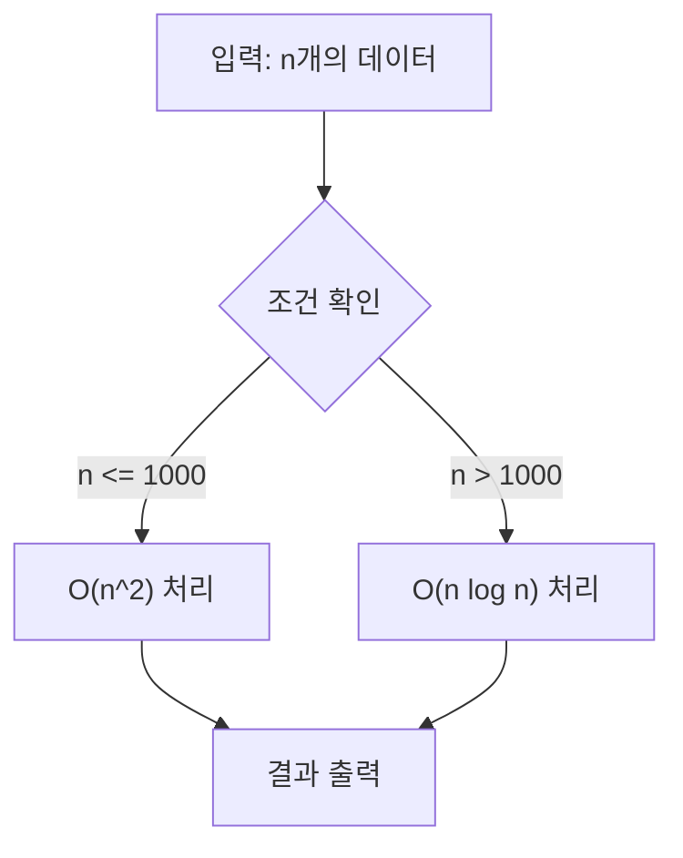

# 블로그 포스트 작성 레퍼런스

SKILL.md에서 참조하는 상세 템플릿, 태그 카테고리 가이드, 컬렉션별 예시를 포함한다.

---

## Frontmatter 상세 템플릿

### 컬렉션 포스트 (범용)

```yaml
---
title: "[카테고리] 핵심 키워드를 포함한 SEO 제목"
description: "150자 내외. 이 글에서 다루는 핵심 내용과 독자가 얻을 가치를 명확히 서술한다."
date: 2026-03-31
lastmod: 2026-03-31
draft: true
categories:
  - 주카테고리
  - 보조카테고리
tags:
  # data/tags.yaml에서 25개 이상 선정 (영/한 병용 개념은 Tag1(태그1) 형식의 단일 승인 태그)
  - Tag1(태그1)
  - Tag2
image: "image.png"
slug: "kebab-case-url-friendly-slug"
---
```

### 일반 포스트 (content/post/)

```yaml
---
title: "70자 이하 SEO 제목"
description: "150자 내외 요약"
date: 2026-03-31
lastmod: 2026-03-31
draft: true
categories:
  - 주카테고리
tags:
  # 25개 이상
  - Tag1(태그1)
  - Tag2
image: "image.png"
---
```

### 새 컬렉션 _index.md

```yaml
---
title: "컬렉션 표시 제목"
description: "컬렉션 전체를 설명하는 150자 내외 요약"
slug: "kebab-case-collection-slug"
---
```

### 시리즈 00 챕터 (인트로/커리큘럼)

```yaml
---
title: "[카테고리] 시리즈 소개 및 커리큘럼"
description: "시리즈 전체 개요와 학습 로드맵을 다루는 150자 내외 요약"
date: 2026-03-31
lastmod: 2026-03-31
draft: true
collection_order: 0
slug: "getting-started-시리즈키워드"
categories:
  - 주카테고리
tags:
  # 25개 이상
  - Tag1(태그1)
image: "image.png"
---
```

---

## 제목·날짜·카테고리 접두어 (전역)

포스트 `title`·날짜·접두어는 아래를 따른다. tags·description·draft·Mermaid·링크 검증 등 그 외 전역 메타는 [`rules-that-must-be-followed`](../rules-that-must-be-followed/SKILL.md) 스킬을 따른다.

### Title 형식

- **카테고리 접두어**: 대괄호로 적절한 카테고리를 붙인다 (예: `[Movie]`, `[TV Series]`, `[Algorithm]`, `[Vocabulary]`, `[Bash]`, `[CMD]`).
- **메인 제목**: 사람이 읽기 좋고 SEO에 유리한 제목.
- **길이**: 접두어 포함 **총 70자 이하**.

### 날짜

- **현재 날짜**: 반드시 터미널에서 확인한 오늘 날짜를 사용한다 (추측 금지). 예: PowerShell `Get-Date -Format "yyyy-MM-dd"`.
- **수정 시**: 내용을 크게 고치면 `lastmod`를 같은 방식으로 갱신한다.

---

## 태그 선정 가이드

`data/tags.yaml`의 카테고리별 태그 요약. 글 주제에 맞는 카테고리에서 태그를 선정한다.

### 카테고리 → 대표 태그 (발췌)

Phase 8 통합 이후 대부분의 영/한 병용 개념은 `Tag(태그)` 형식의 단일 승인 태그다(예: `Algorithm(알고리즘)`, `Testing(테스트)`). 언어·프레임워크·제품명(`Python`, `Docker`, `AWS` 등)은 한글 병기 없이 영어 단독이 승인 표기다. 아래는 카테고리별 대표 태그 발췌(정확한 표기는 항상 `data/tags.yaml` 원본을 확인한다):

| 카테고리 | 대표 태그(발췌) |
|----------|-----------------|
| `programming_languages` | Python, C++, Java, JavaScript, Go, Rust, ... |
| `frameworks_and_platforms` | .NET, Django, React, Docker, AWS, Hugo, ... |
| `algorithm_core` | Algorithm(알고리즘), BOJ(백준), Competitive-Programming(경쟁프로그래밍), Problem-Solving(문제해결), Coding-Test(코딩테스트) |
| `algorithm_topics` | Graph(그래프), DP(동적계획법), Greedy(그리디), BFS, Binary-Search(이분탐색), Tree(트리), ... |
| `data_structures` | Data-Structures(자료구조), Array(배열), Matrix(행렬), Set, Map |
| `complexity_analysis` | Time-Complexity(시간복잡도), Space-Complexity(공간복잡도), Complexity-Analysis(복잡도분석) |
| `code_quality` | Implementation(구현), Optimization(최적화), Testing(테스트), Clean-Code(클린코드), Performance(성능), ... |
| `software_engineering` | Software-Architecture(소프트웨어아키텍처), Design-Pattern(디자인패턴), OOP(객체지향), SOLID, Clean-Architecture(클린아키텍처), ... |
| `devops_and_tools` | Git, GitHub, CI-CD, Linux(리눅스), Docker, Shell(셸), Deployment(배포), Automation(자동화), ... |
| `web_and_backend` | Web(웹), Backend(백엔드), Frontend(프론트엔드), API, REST, Database(데이터베이스), Security(보안), ... |
| `ai_and_data` | AI(인공지능), Machine-Learning(머신러닝), Deep-Learning(딥러닝), NLP, LLM, GPT |
| `system_and_low_level` | Memory(메모리), CPU, Cache, Compiler(컴파일러), OS(운영체제), Thread |
| `english_vocabulary` | Vocabulary, English, Collocation(콜로케이션), Nuance(뉘앙스), Grammar(문법), Etymology(어원), ... |
| `movie_and_tv` | Movie(영화), TV-Show(드라마), Action(액션), Comedy(코미디), Drama, Thriller(스릴러), Sci-Fi, ... |
| `general_topics` | Tutorial(튜토리얼), Guide(가이드), Cheatsheet(치트시트), Open-Source(오픈소스), Career(커리어), Education(교육), ... |
| `python_specific` | asyncio, type-hints, pytest, venv, pip |

### 태그 25개 달성 전략

1. **직접 관련** (10-13개): 글의 핵심 주제 카테고리에서 선정(영/한 병용 개념은 `Tag(태그)` 단일 태그로 카운트)
2. **기술 스택** (5-8개): 사용된 언어, 프레임워크, 도구
3. **메타/범용** (5-8개): `general_topics`에서 Tutorial, Guide, How-To 등
4. **간접 관련** (3-5개): 글이 간접적으로 다루는 영역

---

## 본문 구조 상세 템플릿

### 기술 블로그 포스트

```markdown
(1-2문단: 독자 훅, 이 글의 가치)

---

## 배경 / 왜 필요한가
(동기, 문제 상황, 기존 방식의 한계)

## 핵심 개념
(용어 정의 — 첫 등장 시 **굵게** + 영어 병기)
(개념 설명 문단 → 다이어그램 또는 표로 보조)

## 구현 / 사용법
(단계별 설명)
(각 코드 블록 앞에 2문장 이상 설명)
(코드 블록 뒤에 주의점/대안 1-2문장)

## 비교 / 트레이드오프
(대안과의 비교 표, 장단점)

## 실전 팁 / 주의사항
(코너 케이스, 실수 포인트, 성능 팁)

## 마무리
(핵심 요약 표 또는 3줄 요약)
(다음 글 링크 또는 추천 리소스)

## 참고 및 출처
(접근 확인된 URL만)
```

### 리뷰형 포스트 (영화/드라마/서적)

```markdown
(도입: 작품 첫인상 또는 핵심 메시지 1-2문단)


## 개요
### 기본 정보
- **제목**: ...
- **감독/저자**: ...
- **출시일**: ...
- **장르**: ...

## 줄거리 (스포일러 포함)
(상세 줄거리)

## 분석
### 캐릭터 분석
### 주제/메시지
### 연출/기술적 요소

## 총평
(별점, 추천 대상, 한줄 요약)

## 참고 및 출처
```

### 단어/언어 학습 포스트

```markdown
(도입: 단어의 핵심 의미와 왜 중요한지 1-2문단)

---

## 핵심 의미
### 의미 1: ...
(영어 정의 + 한국어 해석)
- EN: 예문
- KR: 번역

### 의미 2: ...

## 콜로케이션
(자주 함께 쓰이는 표현)

## 유의어/반의어
| 유의어 | 뉘앙스 차이 |
|--------|------------|
| ... | ... |

## 문법 포인트
(용법 주의사항)

## 한눈에 정리
(요약 표)
```

---

## Hugo 컬렉션 내부 링크

컬렉션 글(`content/collection/**/index.md`)에서 사이트 내부 글로 링크할 때 다음을 따른다.

- 내부 링크 형식은 **`/post/<section-slug>/<page-slug-or-contentbasename>/`** 이다.
- **`<section-slug>`**: 디렉터리명이 아니라 대상 컬렉션의 **`_index.md`에 있는 `slug`**를 사용한다.
- **`<page-slug-or-contentbasename>`**: 대상 페이지 front matter에 `slug`가 있으면 그것을 쓰고, **없으면 폴더명(content basename)**을 사용한다.
- 링크를 추가하거나 수정하기 전에 **`config/_default/permalinks.yaml`**의 `collection: /post/:sectionslugs[last]/:slugorcontentbasename/` 규칙을 먼저 확인한다.
- **`/collection/...`** 또는 **`/post/<directory-name>/...`**처럼 폴더명만 보고 추측한 URL은 쓰지 않는다.
- 링크를 추가한 뒤에는 대상 **`_index.md`**와 대상 페이지 front matter를 다시 읽어 section slug와 page slug가 맞는지 확인하고, 가능하면 실제 접근 가능 여부도 확인한다.

### 마크다운 예시

```markdown
[링크 텍스트](/post/<section-slug>/<page-slug-or-contentbasename>/)
```

### 올바른지 대조할 때 (실제 사례)

- 잘못된 링크: `/post/optimization-01-cpp-language/getting-started-cpp-language-performance-tuning/`
- 올바른 링크: `/post/cpp-optimization/getting-started-cpp-language-performance-tuning/`

- 잘못된 링크: `/collection/optimization-00-series-overview/00-introduction/`
- 올바른 링크: `/post/low-latency-optimization-series/getting-started-low-latency-optimization-series-overview/`

---

## 시리즈·챕터 명명 규칙 (챕터형 컬렉션)

00~NN 번호로 이어지는 챕터형 시리즈 컬렉션은 아래 규칙을 따른다. **정본 예시**: [`content/collection/multithreading-design-patterns`](../../../content/collection/multithreading-design-patterns)(`_index.md` + `02-locking-idioms/index.md` 등).

### 시리즈 `_index.md`

```yaml
---
title: "[영문 짧은 접두어] 한글 시리즈 제목"
description: "..."
slug: "짧은-section-slug"
---
```

- **접두어**: 영문 대괄호(예: `[Concurrency Patterns]`, `[Clean Architecture]`, `[Software Architecture]`). 한글 접두어는 쓰지 않는다(사이트 전체에서 영문 접두어로 통일).
- **`slug`**: 짧고 안정적인 section-slug. 내부 링크(`/post/<section-slug>/...`)의 기준이 되므로 챕터가 늘어나도 값이 바뀌지 않게 한다.

### 각 챕터

```yaml
---
title: "[접두어] NN. 한글 챕터 제목"
slug: "설명적인-영문-kebab-case-slug"
collection_order: NN
---
```

- **번호 위치**: 대괄호 접두어 **다음에** `NN. `을 붙인다. `[LLM 05] 제목`처럼 번호를 대괄호 안에 넣거나, `05장.`처럼 단위를 붙이는 방식은 쓰지 않는다.
- **번호 자릿수**: 두 자리(`00`, `01`, ... `24`)로 통일.
- **이론/실습이 챕터를 나눠 갖는 경우**(예: design-patterns): 같은 번호를 재사용하고 실습 쪽 제목에 `— 실습`을 접미한다. 예: `[Design Patterns] 04. 팩토리 패턴의 진화` / `[Design Patterns] 04. 팩토리 패턴의 진화 — 실습`.
- **`slug`**: 폴더명을 그대로 반복하지 않고, 챕터의 핵심 키워드를 담아 설명적으로 작성한다(예: `cpp-locking-idioms-scoped-locking-thread-safe-interface`). 이미 배포된(`draft: false`) 챕터의 slug를 바꾸면 URL이 바뀌므로, 변경 전 사이트 전역에서 옛 slug를 참조하는 내부 링크를 grep으로 찾아 함께 갱신한다.
- 순차적 커리큘럼이 아닌 용어사전/참고자료형 컬렉션(예: `computerterms`)은 번호를 붙이지 않고 접두어만 통일한다.

---

## Mermaid 다이어그램 빠른 참조

### 안전한 작성 패턴



### 체크리스트
- 노드 ID: camelCase, 공백/예약어 금지
- 특수문자 라벨: `""` 감싸기
- 줄바꿈: `</br>` 사용
- 엣지 라벨 수식: `|"라벨"|` 형태

---

## 기존 컬렉션 목록 (참고)

| 컬렉션 | 접두어 | 전용 스킬 |
|--------|--------|----------|
| Algorithm | `[Algorithm]` | [`algorithm-post-writing`](../algorithm-post-writing/SKILL.md) |
| Movies | `[Movie]` | [`movie-review-writing`](../movie-review-writing/SKILL.md) |
| TV-Show | `[TV Series]` | [`tv-series-review-writing`](../tv-series-review-writing/SKILL.md) |
| Vocabulary | `[Vocabulary]` | [`vocabulary-post-writing`](../vocabulary-post-writing/SKILL.md) |
| bashshell | `[Bash Shell]` | [`shell-command-post-writing`](../shell-command-post-writing/SKILL.md) |
| cmd | `[CMD]` | [`shell-command-post-writing`](../shell-command-post-writing/SKILL.md) |
| design-patterns / designpattern | 주제별 | — |
| multithreading-design-patterns | 주제별 | — |
| clean-code | 주제별 | — |
| cleanarchitecture | 주제별 | — |
| python | `[Python]` | — |
| python-cheatsheet | `[Python]` | — |
| software-architecture | 주제별 | — |
| testing / unittesting | 주제별 | — |
| optimization-00-series-overview ~ 12 | 주제별 | — |
| computerterms | 주제별 | — |
| redux | `[Redux]` | — |
| ooad | 주제별 | — |
| android-hardware-development | 주제별 | — |

> `전용 스킬: —`인 시리즈형·커리큘럼형 컬렉션(예: design-patterns, cleanarchitecture, optimization-00-series-overview~12)은 [`educational-content-writing`](../educational-content-writing/SKILL.md)을 기본 적용 대상으로 한다.

## 일반 포스트(`content/post/`) 성격별 전용 스킬 (참고)

컬렉션에 속하지 않는 자유 주제 글은 아래 성격 분류에 따라 전용 스킬을 함께 적용한다. 실제 파일 이동 없이(폴더 구분 없음) 주제 성격만으로 판단한다.

| 성격 | 전용 스킬 | 예시 |
|------|----------|------|
| 개발·프로그래밍 | [`dev-programming-post-writing`](../dev-programming-post-writing/SKILL.md) | 언어 문법 해설, 자료구조·라이브러리 구현/최적화 |
| 시스템·인프라 | [`systems-infra-post-writing`](../systems-infra-post-writing/SKILL.md) | Hugo/CI-CD 빌드 최적화, OS·가상화·네트워킹·보안 |
| AI·도구 활용 | [`ai-tools-post-writing`](../ai-tools-post-writing/SKILL.md) | Claude Code·ChatGPT·AI 에이전트/플러그인 가이드 |
| 교양·생활 | [`life-knowledge-post-writing`](../life-knowledge-post-writing/SKILL.md) | 역사·과학 교양, 자기계발, 하드웨어·기기 리뷰 |
