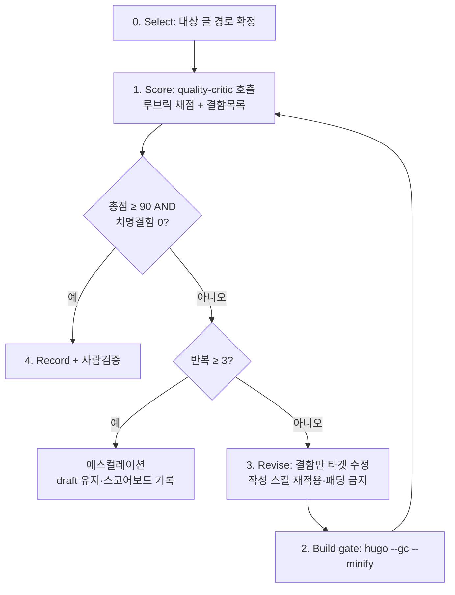

# 게시물 품질 개선 루프 (Quality Loop)

이 스킬은 글 1개를 입력받아 **평가 → 미달이면 수정 → 재평가**를 임계값까지 반복하는 evaluator-optimizer 루프를 수행한다. 직선 파이프라인([`blog-agent-pipeline`](../blog-agent-pipeline/SKILL.md))과 달리, **점수라는 신호**가 있어 "얼마나 좋아졌는지"를 측정하고 **언제 멈출지**를 정할 수 있다.

> **관계**: 전역 규칙은 [`rules-that-must-be-followed`](../rules-that-must-be-followed/SKILL.md)가 우선한다. 채점 기준은 [`rubric.md`](rubric.md), 채점자는 [`quality-critic`](../../agents/quality-critic.md) 서브에이전트, 상태는 [`scoreboard.md`](../../quality/scoreboard.md)에 둔다. 실제 글 수정 규칙은 [`blog-post-writing`](../blog-post-writing/SKILL.md)·컬렉션 스킬을 따른다.

---

## 루프 흐름



임계값·최대 반복은 [`rubric.md`](rubric.md)의 튜닝 파라미터를 단일 기준으로 따른다(기본: 총점 ≥ 90 AND 치명결함 0, 최대 3회).

---

## Stage 0 — Select (대상 선정)

두 진입 모드 중 하나로 대상 글 경로를 확정한다.

- **(a) 신규 초안**: 사용자가 글 경로를 직접 지정한다(보통 글 작성 직후의 품질 게이트). `blog-agent-pipeline`의 Draft 직후 이 루프를 이어서 돌릴 수 있다.
- **(b) 기존 게시글**: [`scoreboard.md`](../../quality/scoreboard.md)에서 `상태: 미채점` 또는 최저 점수 글을 1개 고른다. **야간 자율 모드는 항상 (b)**로 동작한다.

스코어보드가 비어 있으면 먼저 **시딩**(아래 "점수판 운영")을 1회 수행한다.

---

## Stage 1 — Score (채점)

[`quality-critic`](../../agents/quality-critic.md) 서브에이전트를 호출하고 대상 글 경로를 넘긴다. critic은 글을 **읽기만** 하며 다음을 반환한다.

- 항목별 환산 점수 표 + **총점**
- **치명결함** 목록 (`파일:라인` 포함)
- **수정 우선순위 3개** (파일·라인·구체적 행동)
- 판정(통과/미달)

> **분리 원칙**: 채점은 반드시 critic 서브에이전트가 한다. 글을 쓴(또는 직전 Revise한) 메인 에이전트가 자기 글을 채점하지 않는다 — 합리화한 결함을 놓친다.

---

## Stage 2 — Decide (정지조건)

critic의 판정으로 분기한다.

- **통과**(총점 ≥ 임계값 AND 치명결함 0) → **Stage 4 Record**로 간다.
- **미달이고 반복 횟수 ≥ 최대 반복** → **에스컬레이션**: `draft: true`를 유지한 채 스코어보드에 `상태: 에스컬레이션`과 남은 미달 항목을 기록하고, 사람에게 "자동 개선 한계 도달, 남은 결함 N개"를 보고하고 멈춘다.
- 그 외(미달, 반복 여유 있음) → **Stage 3 Revise**.

---

## Stage 3 — Revise (수정)

메인 에이전트가 **critic이 지적한 결함만** 수정한다.

1. critic의 "수정 우선순위"와 "치명결함"을 위에서부터 처리한다.
2. 수정은 [`blog-post-writing`](../blog-post-writing/SKILL.md)·해당 컬렉션 스킬·[`rules-that-must-be-followed`](../rules-that-must-be-followed/SKILL.md)를 따른다.
3. **패딩 금지**: 점수를 올리려 분량을 늘리지 않는다. 루브릭이 패딩을 항목 4에서 감점하므로 역효과다. 결함 자리에는 실제 코드·수치·사례·근거를 넣는다.
4. 외부 링크를 새로 추가하면 그 자리에서 접근 가능 여부를 확인한다.
5. 날짜가 필요하면 터미널로 확인(`Get-Date -Format "yyyy-MM-dd"`), `lastmod` 갱신.

수정이 끝나면 **Stage 2의 Build gate**로 간다.

### Build gate (비-LLM 객관 검증)

Revise 직후 반드시 Hugo 빌드가 깨지지 않는지 확인한다(CI와 동일):

```bash
hugo --gc --minify
```

> **속도 주의**: 콜드 빌드는 이미지 처리(수천 장) 때문에 전체 사이트가 10분 이상 걸릴 수 있다. 단, 처리 결과가 `resources/`·`.hugo_cache`에 캐시되므로 **두 번째 빌드부터는 빠르다**. 루프 반복 중에는 이 캐시를 지우지 말 것. 게이트의 목적(Mermaid·shortcode·frontmatter 오류 탐지)만 빠르게 보려면 `hugo --gc --minify --renderToMemory`로 디스크 쓰기를 생략할 수 있다.
빌드가 실패하면(주로 Mermaid·shortcode·frontmatter 오류) **재채점하지 않고** 먼저 빌드를 고친 뒤 진행한다. 로컬에 Hugo extended가 없으면 그 사실을 보고에 명시하고 빌드 검증은 CI에 위임한다. 빌드 통과 후 **Stage 1 Score로 돌아가 재채점**한다(반복 횟수 +1).

---

## Stage 4 — Record + 사람검증 (PublishPrep)

- 스코어보드에 최종 점수·채점일(터미널 오늘 날짜)·반복수·`상태: 통과`를 기록한다.
- **`draft: false`는 사람이 명시적으로 요청할 때만** 수행한다(기본은 `draft: true` 유지). 이는 [`blog-agent-pipeline`](../blog-agent-pipeline/SKILL.md) PublishPrep 원칙과 동일하다 — 최종 검증은 사람이 소유한다.
- 사람이 게시를 승인하면 `lastmod`를 오늘 날짜로 갱신하고 `draft: false`로 바꾼다.

---

## 점수판 운영 — `.claude/quality/scoreboard.md`

세션 간 상태(state)다. 표 형식:

```
| 글 경로 | 최신점수 | 채점일 | 반복수 | 상태 | 주요 미달항목 |
```

- `상태`: 미채점 / 진행중 / 통과 / 에스컬레이션.
- **시딩(최초 1회)**: 스코어보드 본문이 비어 있으면, `Glob`으로 `content/post/**/index.md`와 `content/collection/**/index.md`(및 `**/*.md`)를 수집해, `draft: false`이거나 `draft` 필드가 없는 **게시 상태** 글을 `상태: 미채점`으로 등록한다. 초안(`draft: true`)은 시딩 대상이 아니다(작성 중이므로 신규 초안 모드로 다룬다).
- 자율 모드는 `미채점` → 최저 `통과/에스컬레이션` 순으로 큐를 소진한다. 신규 초안은 루프 종료 시 행을 추가한다.

---

## 드라이버 / 실행 방법

- **수동(신규 초안)**: 글 경로를 지정해 이 스킬을 호출한다. 작성 직후 품질 게이트로 쓴다.
- **반복 실행**: 저장소의 `/loop` 스킬로 "스코어보드 미채점 글을 하나씩 루프" 작업을 큐 소진까지 반복한다.
- **야간 자율(스케줄)**: 사용자가 `/schedule`로 다음 작업을 등록한다 — "매일 1회: 스코어보드에서 미채점/최저점 글 1개를 골라 post-quality-loop를 돌리고, 결과를 스코어보드에 기록하고, 개선 요약을 보고한다. `draft`는 절대 바꾸지 않는다." 글마다 worktree로 격리하면 병렬화할 수 있다.

> 스케줄 작업은 자율·과금 실행이므로 **사용자가 직접 `/schedule`로 생성**한다. 이 스킬은 등록할 작업 내용만 위와 같이 제공한다.

---

## 오케스트레이션 규칙

1. 충돌 시 **전역 규칙**([`rules-that-must-be-followed`](../rules-that-must-be-followed/SKILL.md))이 우선한다.
2. 본 스킬은 **루프 제어**(선정·정지조건·기록·게이트)만 담당하고, 채점은 critic·작성은 작성 스킬에 위임한다.
3. 어떤 경우에도 루프가 스스로 `draft: false`로 바꾸지 않는다.
