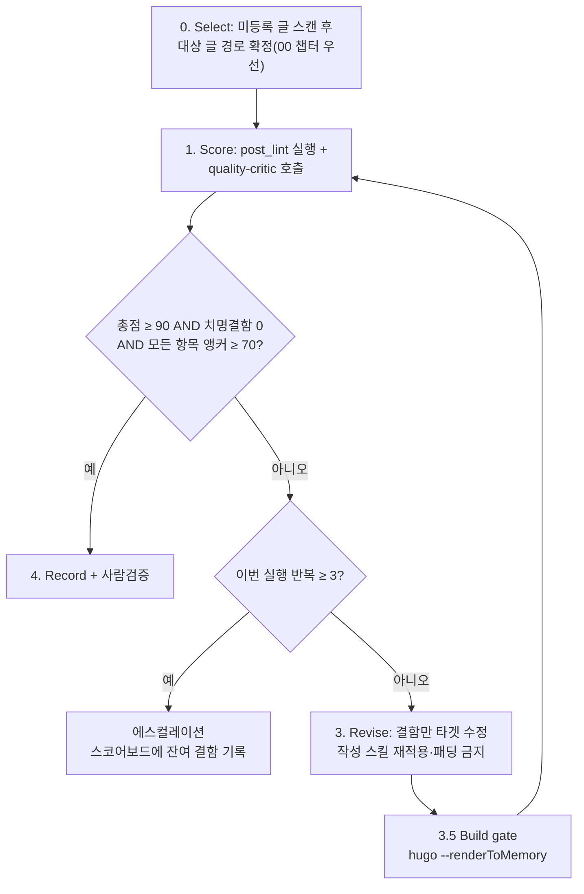

# 게시물 품질 개선 루프 (Quality Loop)

이 스킬은 글 1개를 입력받아 **평가 → 미달이면 수정 → 재평가**를 임계값까지 반복하는 evaluator-optimizer 루프를 수행한다. 직선 파이프라인([`blog-agent-pipeline`](../blog-agent-pipeline/SKILL.md))과 달리, **점수라는 신호**가 있어 "얼마나 좋아졌는지"를 측정하고 **언제 멈출지**를 정할 수 있다.

> **관계**: 전역 규칙은 [`rules-that-must-be-followed`](../rules-that-must-be-followed/SKILL.md)가 우선한다. 채점 기준은 [`rubric.md`](rubric.md), 채점자는 [`quality-critic`](../../agents/quality-critic.md) 서브에이전트, 상태는 [`scoreboard.md`](../../quality/scoreboard.md)에 둔다. 실제 글 수정 규칙은 [`blog-post-writing`](../blog-post-writing/SKILL.md)·컬렉션 스킬을 따른다.

---

## 루프 흐름


```mermaid
flowchart TD
    A["0. Select: 미등록 글 스캔 후<br/>대상 글 경로 확정(00 챕터 우선)"] --> B["1. Score: post_lint 실행 +<br/>quality-critic 호출"]
    B --> C{"총점 ≥ 90 AND 치명결함 0<br/>AND 모든 항목 앵커 ≥ 70?"}
    C -->|"예"| E["4. Record + 사람검증"]
    C -->|"아니오"| D{"이번 실행 반복 ≥ 3?"}
    D -->|"예"| F["에스컬레이션<br/>스코어보드에 잔여 결함 기록"]
    D -->|"아니오"| G["3. Revise: 결함만 타겟 수정<br/>작성 스킬 재적용·패딩 금지"]
    G --> H["3.5 Build gate<br/>hugo --renderToMemory"]
    H --> B
```

임계값·최대 반복은 [`rubric.md`](rubric.md)의 튜닝 파라미터를 단일 기준으로 따른다(기본: 총점 ≥ 90 AND 치명결함 0 AND 모든 항목 앵커 ≥ 70, 최대 3회).

> **반복 횟수의 정의**: "최대 3회"는 **1회 실행 내부의 Revise 카운터**다. 스코어보드의 `반복수` 컬럼은 그 글에 **누적된** Revise 횟수이므로 3을 넘을 수 있다(실제로 12까지 있다). 만료로 재채점에 들어간 글은 내부 카운터를 0에서 다시 시작하고, 누적 `반복수`에는 이번 실행분을 더한다.

---

## Stage 0 — Select (대상 선정)

두 진입 모드 중 하나로 대상 글 경로를 확정한다.

- **(a) 신규 초안**: 사용자가 글 경로를 직접 지정한다(보통 글 작성 직후의 품질 게이트). `blog-agent-pipeline`의 Draft 직후 이 루프를 이어서 돌릴 수 있다.
- **(b) 기존 게시글**: [`scoreboard.md`](../../quality/scoreboard.md)에서 대상을 고른다. **야간 자율 모드는 항상 (b)**로 동작하며, 이 스킬은 **컬렉션·일반 post 구분 없이 저장소 전체 게시글**을 대상으로 하고, 그중 **00 챕터(컬렉션 커리큘럼/개요 글) 중심으로 동작**하므로 다음 순서로 큐를 소진한다.

  **0단계 — 미등록 글 스캔(매 실행 시 수행)**: 선정에 앞서 매번 아래를 실행한다. 약 1,550개 파일의 frontmatter를 직접 읽지 않는다 — 스크립트가 게시 상태 판별과 스코어보드 대조까지 끝낸 목록만 돌려준다.

  ```bash
  python script/post_lint.py --scan
  ```

  출력된 경로들을 `상태: 미채점`, 나머지 컬럼은 `-`로 스코어보드에 새 행으로 추가한다(단순 등록이며 채점이 아니다 — 이 신규 행들의 커밋은 이번 실행에서 실제로 채점하는 대상 글의 변경분과 함께 Stage 4에서 처리한다). 초안(`draft: true`)과 `_index.md`는 스크립트가 제외하고, `index.md`가 아직 없는 챕터(이미지 자산만 존재)도 자연히 걸러진다.

  스캔 후, 선정에 앞서 각 행의 **만료 여부**를 판별한다. 만료 규칙의 정본은 [`scoreboard.md`](../../quality/scoreboard.md) 상단이다(콘텐츠 변경 / 365일 경과 / 버전 불일치). 표의 `상태` 값 자체는 재채점 전까지 그대로 둔다. 판별을 마친 뒤 아래 우선순위로 큐를 소진한다.

  1. `미채점`(및 **콘텐츠 변경·기간 만료**로 무효가 된 행) 중 frontmatter `collection_order: 0`(00 챕터)인 글을 먼저 채점한다(선정 시 대상 글의 frontmatter를 읽어 판별 — 스코어보드 스키마 자체에는 별도 컬럼을 두지 않는다).
  2. 00 챕터가 모두 유효한 `통과`/`에스컬레이션` 상태면, 나머지 `미채점`(및 콘텐츠 변경·기간 만료) 글로 넘어간다.
  3. 그것도 없으면 **버전 불일치로 부분 만료된 행**(구버전 기준 점수)을 점수 낮은 순으로 재채점한다.
  4. 마지막으로 최저 점수 글로 넘어간다(00 챕터든 일반 챕터든 동일하게). 동점이면 글 경로 오름차순으로 맨 앞 1개를 선택한다.

  > 3번이 2번보다 뒤인 이유: 버전 불일치는 "글이 나빠졌다"가 아니라 "잣대가 바뀌었다"는 신호이므로, 아직 한 번도 채점하지 않은 글보다 뒤에 둔다. 자세한 근거는 `scoreboard.md`의 부분 만료 설명 참고.

한 번 실행에는 이렇게 선정한 챕터 1개만 처리하고 종료한다. 0단계에서 새로 등록한 다른 미채점 행들은 이번 실행에서 건드리지 않고 `미채점`으로 남겨둔다. 스코어보드가 완전히 비어 있으면 0단계 스캔이 사실상 "점수판 운영 — 시딩"과 동일하게 전체를 등록한다.

---

## Stage 1 — Score (채점)

[`quality-critic`](../../agents/quality-critic.md) 서브에이전트를 호출하고 대상 글 경로를 넘긴다. critic은 글을 **읽기만** 하며, 먼저 [`script/post_lint.py`](../../../script/post_lint.py)를 실행해 기계 판정 결과를 확보한 뒤 다음을 반환한다.

- **루브릭버전 · 콘텐츠해시 · 린트요약** (스코어보드 기록에 그대로 쓴다)
- 항목별 환산 점수 표(앵커·린트상한·**경미결함**·근거·수정지시) + **총점**
- **치명결함** 목록 (`파일:라인` 포함)
- **검증 불가** 목록 (WAF 차단 등 — 치명결함이 아니다)
- **수정 우선순위 3개** (파일·라인·구체적 행동)
- 판정(통과/미달, 미달이면 어느 조건에서 걸렸는지)

> **분리 원칙**: 채점은 반드시 critic 서브에이전트가 한다. 글을 쓴(또는 직전 Revise한) 메인 에이전트가 자기 글을 채점하지 않는다 — 합리화한 결함을 놓친다.
>
> **기계 판정 우선**: 산문 비율·태그·링크·Mermaid 문법처럼 결정론적으로 판정되는 것은 린트가 정하고 채점자는 그 상한을 따른다. 채점자의 재량은 깊이·정확성·구조의 질처럼 **기계가 판정할 수 없는 것**에만 쓴다.

---

## Stage 2 — Decide (정지조건)

critic의 판정으로 분기한다.

- **통과**(총점 ≥ 90 AND 치명결함 0 AND 모든 항목 앵커 ≥ 70) → **Stage 4 Record**로 간다.
- **미달이고 이번 실행 반복 횟수 ≥ 3** → **에스컬레이션**(아래).
- 그 외(미달, 반복 여유 있음) → **Stage 3 Revise**.

### 에스컬레이션

임계값 90은 5단계 앵커에서 의도적으로 엄격한 게이트다(대부분 항목이 경미 결함 0이어야 넘는다). 따라서 에스컬레이션은 **실패가 아니라 설계된 출구**다 — 자동으로 못 고치는 결함을 사람에게 올리는 것이 목적이므로, 사람이 목록만 보고 처리할 수 있게 기록한다.

- **draft 처리는 글의 상태에 따라 갈린다.**
  - **신규 초안**(`draft: true`) → `draft: true`를 그대로 유지한다.
  - **이미 게시된 글**(`draft` 생략 또는 `draft: false`) → **`draft`를 건드리지 않는다.** 통과하지 못했다고 게시글을 내리지 않는다. 기록만 남긴다.
- 스코어보드에 `상태: 에스컬레이션`, 최신 점수, `루브릭버전`, `콘텐츠해시`를 기록하고, `주요 미달항목` 칸에는 **남은 결함을 "항목 — 무엇이 — 어떻게 고쳐야 하는지" 형태로** 적는다(critic의 "수정 우선순위"를 그대로 옮기면 된다). "미달 3건" 같은 요약만 남기지 않는다.
- 사람에게 "자동 개선 한계 도달, 남은 결함 N개"와 그 목록을 보고하고 멈춘다.

---

## Stage 3 — Revise (수정)

메인 에이전트가 **critic이 지적한 결함만** 수정한다.

1. critic의 "수정 우선순위"와 "치명결함"을 위에서부터 처리한다.
2. 수정은 [`blog-post-writing`](../blog-post-writing/SKILL.md)·해당 컬렉션 스킬·[`rules-that-must-be-followed`](../rules-that-must-be-followed/SKILL.md)를 따른다.
3. **패딩 금지**: 점수를 올리려 분량을 늘리지 않는다. 루브릭이 패딩을 항목 4에서 감점하므로 역효과다. 결함 자리에는 실제 코드·수치·사례·근거를 넣는다.
4. 외부 링크를 새로 추가하면 그 자리에서 접근 가능 여부를 확인한다.
5. 날짜가 필요하면 터미널로 확인(`Get-Date -Format "yyyy-MM-dd"`), `lastmod` 갱신.

수정이 끝나면 **Stage 3.5 Build gate**로 간다.

---

## Stage 3.5 — Build gate (비-LLM 객관 검증)

Revise 직후 반드시 Hugo 빌드가 깨지지 않는지 확인한다. 게이트의 목적은 Mermaid·shortcode·frontmatter 오류 탐지이므로 **디스크 쓰기를 생략한 형태를 기본으로 쓴다**:

```bash
hugo --gc --minify --renderToMemory
```

> **속도 주의**: 콜드 빌드는 이미지 처리(수천 장) 때문에 전체 사이트가 10분 이상 걸릴 수 있다. 단, 처리 결과가 `resources/`·`.hugo_cache`에 캐시되므로 **두 번째 빌드부터는 빠르다**. 루프 반복 중에는 이 캐시를 지우지 말 것. 배포 산출물까지 확인해야 할 때만 `--renderToMemory`를 빼고 `hugo --gc --minify`로 돌린다.

빌드가 실패하면(주로 Mermaid·shortcode·frontmatter 오류) **재채점하지 않고** 먼저 빌드를 고친 뒤 진행한다. 로컬에 Hugo extended가 없으면 그 사실을 보고에 명시하고 빌드 검증은 CI에 위임한다. 빌드 통과 후 **Stage 1 Score로 돌아가 재채점**한다(이번 실행 반복 횟수 +1).

---

## Stage 4 — Record + 사람검증 (PublishPrep)

- 스코어보드에 최종 점수·채점일(터미널 오늘 날짜)·반복수(누적)·`상태: 통과`·**`루브릭버전`**·**`콘텐츠해시`**를 기록한다. 뒤의 둘은 critic이 출력 머리말로 돌려준 값을 그대로 쓴다. 만료로 재채점 대상이 됐던 행도 재채점이 끝나면 `채점일`·`루브릭버전`·`콘텐츠해시`를 이번 채점 시점 값으로 갱신한다.
- `콘텐츠해시`는 **Revise를 모두 마친 최종 본문** 기준이어야 한다. 기록 직전 값이 맞는지 `git hash-object <글경로> | cut -c1-7`로 한 번 대조한다 — 어긋나면 다음 실행에서 곧바로 콘텐츠 변경 만료로 잡혀 무의미한 재채점이 발생한다.
- **`draft: false`는 사람이 명시적으로 요청할 때만** 수행한다(기본은 `draft: true` 유지). 이는 [`blog-agent-pipeline`](../blog-agent-pipeline/SKILL.md) PublishPrep 원칙과 동일하다 — 최종 검증은 사람이 소유한다.
- 사람이 게시를 승인하면 `lastmod`를 오늘 날짜로 갱신하고 `draft: false`로 바꾼다.

---

## 점수판 운영 — `.claude/quality/scoreboard.md`

세션 간 상태(state)다. 표 형식:

```
| 글 경로 | 최신점수 | 채점일 | 반복수 | 상태 | 루브릭버전 | 콘텐츠해시 | 주요 미달항목 |
```

**컬럼 의미와 만료 규칙의 정본은 [`scoreboard.md`](../../quality/scoreboard.md) 상단이다.** 이 절에 같은 내용을 다시 적지 않는다 — 예전에는 Stage 0·이 절·`scoreboard.md` 세 곳에 같은 규칙이 서술돼 있어 개정할 때마다 서로 어긋났다. 규칙을 바꿀 일이 있으면 `scoreboard.md`만 고친다.

이 스킬이 책임지는 부분만 남기면 다음과 같다.

- **미등록 글 스캔**: 대상 선정(Stage 0) 직전에 매번 `python script/post_lint.py --scan`을 실행하고, 출력된 경로를 `상태: 미채점`(나머지 컬럼 `-`)으로 등록한다. 게시 상태 판별·`_index.md` 제외·스코어보드 대조는 스크립트가 한다.
- **선정 순서**: 00 챕터(`collection_order: 0`) 우선 → 나머지 미채점·콘텐츠 변경·기간 만료 → 버전 불일치(부분 만료) → 최저 점수. 자세한 순서는 Stage 0 참고.
- **00 챕터 판별**: 표에 별도 컬럼을 두지 않는다. 선정 시점에 대상 글의 frontmatter `collection_order`를 읽어 판단한다.
- 신규 초안은 루프 종료 시 행을 추가한다.

---

## 드라이버 / 실행 방법

- **수동(신규 초안)**: 글 경로를 지정해 이 스킬을 호출한다. 작성 직후 품질 게이트로 쓴다.
- **반복 실행**: 저장소의 `/loop` 스킬로 "스코어보드 미채점 글을 하나씩 루프" 작업을 큐 소진까지 반복한다.
- **야간 자율(스케줄)**: 사용자가 `/schedule`로 다음 작업을 등록한다 — "매일 1회: 스코어보드에서 미채점/최저점 글 1개를 골라 post-quality-loop를 돌리고, 결과를 스코어보드에 기록하고, 개선 요약을 보고한다. `draft`는 절대 바꾸지 않는다." 글마다 worktree로 격리하면 병렬화할 수 있다.

> 스케줄 작업은 자율·과금 실행이므로 **사용자가 직접 `/schedule`로 생성**한다. 이 스킬은 등록할 작업 내용만 위와 같이 제공한다.

---

## 오케스트레이션 규칙

1. 충돌 시 **전역 규칙**([`rules-that-must-be-followed`](../rules-that-must-be-followed/SKILL.md))이 우선한다.
2. 본 스킬은 **루프 제어**(선정·정지조건·기록·게이트)만 담당한다. **기계 판정은 [`post_lint.py`](../../../script/post_lint.py), 재량 채점은 critic, 수정은 작성 스킬**에 위임한다 — 세 역할이 겹치면 결함을 발견하고도 감점하지 않는 상태로 되돌아간다.
3. 어떤 경우에도 루프가 스스로 `draft: false`로 바꾸지 않는다.
4. 신규 챕터 다수 추가·커리큘럼 개편 같은 **대규모 개정 작업**이라면, 정식 채점(Stage 1)에 들어가기 전에 [`collection-writing-standards`](../collection-writing-standards/SKILL.md) §6(대규모 개정의 다단계 검토 캐스케이드)을 먼저 적용하는 것을 권장한다 — 저렴하게 잡을 수 있는 결함(깨진 형제 참조, 오탈자, 코드 버그 등)을 quality-critic의 반복 채점으로 잡는 것은 비효율적이다.
