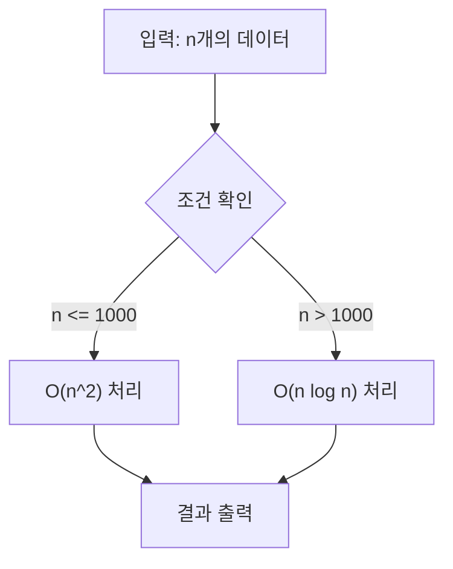

# 블로그 포스트 작성 레퍼런스

SKILL.md에서 참조하는 상세 템플릿, 태그 카테고리 가이드, 컬렉션별 예시를 포함한다.

---

## Frontmatter 상세 템플릿

### 컬렉션 포스트 (범용)

```yaml
---
title: "[카테고리] 핵심 키워드를 포함한 SEO 제목"
description: "150자 내외. 이 글에서 다루는 핵심 내용과 독자가 얻을 가치를 명확히 서술한다."
date: 2026-03-31
lastmod: 2026-03-31
draft: true
categories:
  - 주카테고리
  - 보조카테고리
tags:
  # data/tags.yaml에서 50개 이상 선정 (영어+한글 쌍)
  - Tag1
  - 태그1
image: "image.png"
slug: "kebab-case-url-friendly-slug"
---
```

### 일반 포스트 (content/post/)

```yaml
---
title: "70자 이하 SEO 제목"
description: "150자 내외 요약"
date: 2026-03-31
lastmod: 2026-03-31
draft: true
categories:
  - 주카테고리
tags:
  # 50개 이상
  - Tag1
  - 태그1
image: "image.png"
---
```

### 새 컬렉션 _index.md

```yaml
---
title: "컬렉션 표시 제목"
description: "컬렉션 전체를 설명하는 150자 내외 요약"
slug: "kebab-case-collection-slug"
---
```

### 시리즈 00 챕터 (인트로/커리큘럼)

```yaml
---
title: "[카테고리] 시리즈 소개 및 커리큘럼"
description: "시리즈 전체 개요와 학습 로드맵을 다루는 150자 내외 요약"
date: 2026-03-31
lastmod: 2026-03-31
draft: true
collection_order: 0
slug: "getting-started-시리즈키워드"
categories:
  - 주카테고리
tags:
  # 50개 이상
  - Tag1
image: "image.png"
---
```

---

## 제목·날짜·카테고리 접두어 (전역)

포스트 `title`·날짜·접두어는 아래를 따른다. tags·description·draft·Mermaid·링크 검증 등 그 외 전역 메타는 [`.cursor/rules/rules-that-must-be-followed.mdc`](../../rules/rules-that-must-be-followed.mdc)를 따른다.

### Title 형식

- **카테고리 접두어**: 대괄호로 적절한 카테고리를 붙인다 (예: `[Movie]`, `[TV Series]`, `[Algorithm]`, `[Vocabulary]`, `[Bash]`, `[CMD]`).
- **메인 제목**: 사람이 읽기 좋고 SEO에 유리한 제목.
- **길이**: 접두어 포함 **총 70자 이하**.

### 날짜

- **현재 날짜**: 반드시 터미널에서 확인한 오늘 날짜를 사용한다 (추측 금지). 예: PowerShell `Get-Date -Format "yyyy-MM-dd"`.
- **수정 시**: 내용을 크게 고치면 `lastmod`를 같은 방식으로 갱신한다.

---

## 태그 선정 가이드

`data/tags.yaml`의 카테고리별 태그 요약. 글 주제에 맞는 카테고리에서 태그를 선정한다.

### 카테고리 → 대표 태그 (발췌)

| 카테고리 | 대표 태그 (영어) | 대표 태그 (한글) |
|----------|-----------------|-----------------|
| `programming_languages` | Python, C++, Java, JavaScript, Go, Rust, ... | 파이썬 |
| `frameworks_and_platforms` | .NET, Django, React, Docker, AWS, Hugo, ... | — |
| `algorithm_core` | Algorithm, BOJ, Competitive-Programming, Problem-Solving, Coding-Test | 알고리즘, 백준, 코딩테스트, 문제해결 |
| `algorithm_topics` | Graph, DP, Greedy, BFS, DFS, Binary-Search, Tree, ... | 그래프, 동적계획법, 그리디, 이분탐색, 트리, ... |
| `data_structures` | Data-Structures, Array, Matrix, Set, Map | 자료구조, 배열, 행렬 |
| `complexity_analysis` | Time-Complexity, Space-Complexity, Complexity-Analysis | 시간복잡도, 공간복잡도, 복잡도분석 |
| `code_quality` | Implementation, Optimization, Testing, Clean-Code, Performance, ... | 구현, 최적화, 테스트, 클린코드, 성능, ... |
| `software_engineering` | Software-Architecture, Design-Pattern, OOP, SOLID, Clean-Architecture, ... | 소프트웨어아키텍처, 디자인패턴, 객체지향, ... |
| `devops_and_tools` | Git, GitHub, CI-CD, Linux, Docker, Shell, ... | 리눅스, 셸, 배포, 자동화, ... |
| `web_and_backend` | Web, Backend, Frontend, API, REST, Database, Security, ... | 웹, 백엔드, 프론트엔드, 데이터베이스, 보안, ... |
| `ai_and_data` | AI, Machine-Learning, Deep-Learning, NLP, LLM, GPT | 인공지능, 머신러닝, 딥러닝 |
| `system_and_low_level` | Memory, CPU, Cache, Compiler, OS, Thread | 메모리, 컴파일러, 운영체제 |
| `english_vocabulary` | Vocabulary, English, Collocation, Nuance, Grammar, Etymology, ... | 영단어, 콜로케이션, 뉘앙스, 문법, 어원, ... |
| `movie_and_tv` | Movie, TV-Show, Action, Comedy, Drama, Thriller, Sci-Fi, ... | 영화, 드라마, 액션, 코미디, 스릴러, SF, ... |
| `general_topics` | Tutorial, Guide, Cheatsheet, Open-Source, Career, Education, ... | 튜토리얼, 가이드, 치트시트, 오픈소스, 교육, ... |
| `python_specific` | asyncio, type-hints, pytest, venv, pip | — |

### 태그 50개 달성 전략

1. **직접 관련** (20-25개): 글의 핵심 주제 카테고리에서 영어+한글 쌍
2. **기술 스택** (10-15개): 사용된 언어, 프레임워크, 도구
3. **메타/범용** (10-15개): `general_topics`에서 Tutorial, Guide, How-To 등
4. **간접 관련** (5-10개): 글이 간접적으로 다루는 영역

---

## 본문 구조 상세 템플릿

### 기술 블로그 포스트

```markdown
(1-2문단: 독자 훅, 이 글의 가치)

---

## 배경 / 왜 필요한가
(동기, 문제 상황, 기존 방식의 한계)

## 핵심 개념
(용어 정의 — 첫 등장 시 **굵게** + 영어 병기)
(개념 설명 문단 → 다이어그램 또는 표로 보조)

## 구현 / 사용법
(단계별 설명)
(각 코드 블록 앞에 2문장 이상 설명)
(코드 블록 뒤에 주의점/대안 1-2문장)

## 비교 / 트레이드오프
(대안과의 비교 표, 장단점)

## 실전 팁 / 주의사항
(코너 케이스, 실수 포인트, 성능 팁)

## 마무리
(핵심 요약 표 또는 3줄 요약)
(다음 글 링크 또는 추천 리소스)

## 참고 및 출처
(접근 확인된 URL만)
```

### 리뷰형 포스트 (영화/드라마/서적)

```markdown
(도입: 작품 첫인상 또는 핵심 메시지 1-2문단)


## 개요
### 기본 정보
- **제목**: ...
- **감독/저자**: ...
- **출시일**: ...
- **장르**: ...

## 줄거리 (스포일러 포함)
(상세 줄거리)

## 분석
### 캐릭터 분석
### 주제/메시지
### 연출/기술적 요소

## 총평
(별점, 추천 대상, 한줄 요약)

## 참고 및 출처
```

### 단어/언어 학습 포스트

```markdown
(도입: 단어의 핵심 의미와 왜 중요한지 1-2문단)

---

## 핵심 의미
### 의미 1: ...
(영어 정의 + 한국어 해석)
- EN: 예문
- KR: 번역

### 의미 2: ...

## 콜로케이션
(자주 함께 쓰이는 표현)

## 유의어/반의어
| 유의어 | 뉘앙스 차이 |
|--------|------------|
| ... | ... |

## 문법 포인트
(용법 주의사항)

## 한눈에 정리
(요약 표)
```

---

## Hugo 컬렉션 내부 링크

컬렉션 글(`content/collection/**/index.md`)에서 사이트 내부 글로 링크할 때 다음을 따른다.

- 내부 링크 형식은 **`/post/<section-slug>/<page-slug-or-contentbasename>/`** 이다.
- **`<section-slug>`**: 디렉터리명이 아니라 대상 컬렉션의 **`_index.md`에 있는 `slug`**를 사용한다.
- **`<page-slug-or-contentbasename>`**: 대상 페이지 front matter에 `slug`가 있으면 그것을 쓰고, **없으면 폴더명(content basename)**을 사용한다.
- 링크를 추가하거나 수정하기 전에 **`config/_default/permalinks.yaml`**의 `collection: /post/:sectionslugs[last]/:slugorcontentbasename/` 규칙을 먼저 확인한다.
- **`/collection/...`** 또는 **`/post/<directory-name>/...`**처럼 폴더명만 보고 추측한 URL은 쓰지 않는다.
- 링크를 추가한 뒤에는 대상 **`_index.md`**와 대상 페이지 front matter를 다시 읽어 section slug와 page slug가 맞는지 확인하고, 가능하면 실제 접근 가능 여부도 확인한다.

### 마크다운 예시

```markdown
[링크 텍스트](/post/<section-slug>/<page-slug-or-contentbasename>/)
```

### 올바른지 대조할 때 (실제 사례)

- 잘못된 링크: `/post/optimization-01-cpp-language/getting-started-cpp-language-performance-tuning/`
- 올바른 링크: `/post/cpp-optimization/getting-started-cpp-language-performance-tuning/`

- 잘못된 링크: `/collection/optimization-00-series-overview/00-introduction/`
- 올바른 링크: `/post/low-latency-optimization-series/getting-started-low-latency-optimization-series-overview/`

---

## Mermaid 다이어그램 빠른 참조

### 안전한 작성 패턴



### 체크리스트
- 노드 ID: camelCase, 공백/예약어 금지
- 특수문자 라벨: `""` 감싸기
- 줄바꿈: `</br>` 사용
- 엣지 라벨 수식: `|"라벨"|` 형태

---

## 기존 컬렉션 목록 (참고)

| 컬렉션 | 접두어 | 전용 규칙 |
|--------|--------|----------|
| Algorithm | `[Algorithm]` | `algorithm-post-writing-rules.mdc` |
| Movies | `[Movie]` | `movie-review-writing-rules.mdc` |
| TV-Show | `[TV Series]` | `tv-series-review-writing-rules.mdc` |
| Vocabulary | `[Vocabulary]` | `vocabulary-post-writing-rules.mdc` |
| bashshell | `[Bash]` | `bashshell-post-writing-rules.mdc` |
| cmd | `[CMD]` | `cmd-post-writing-rules.mdc` |
| design-patterns | 주제별 | — |
| clean-code | 주제별 | — |
| cleanarchitecture | 주제별 | — |
| python | `[Python]` | — |
| python-cheatsheet | `[Python]` | — |
| software-architecture | 주제별 | — |
| testing / unittesting | 주제별 | — |
| optimization-* (01~12) | 주제별 | — |
| computerterms | 주제별 | — |
| redux | `[Redux]` | — |
| ooad | 주제별 | — |
| android-hardware-development | 주제별 | — |
