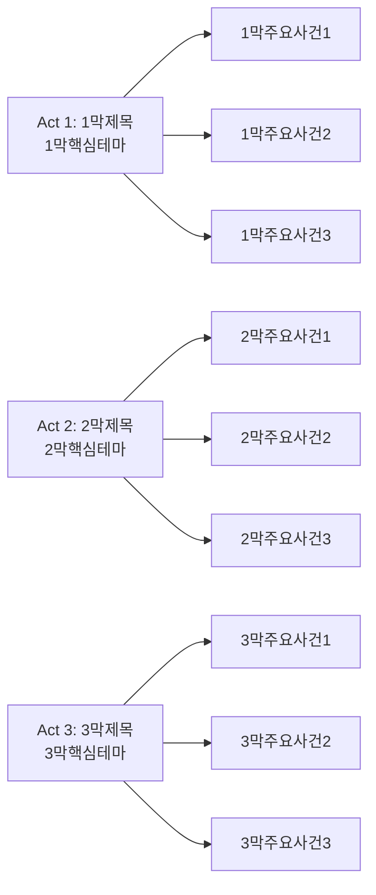

# AI 영화 리뷰 작성 가이드

## 📋 작성 규칙

### 필수 요구사항
- **글 길이**: 최소 10,000자 이상 (학술 논문급)
- **구조**: 반드시 아래 구조를 모두 포함
- **문체**: "~이다" 형태의 정중한 문체 사용
- **용어**: 기술용어는 영어 단어 그대로 사용

### 폴더 구조 규칙
```
content/collection/Movies/{연도}/{연도-월-일}-{영화제목-영어소문자}-{개봉연도}-{부제목-핵심키워드}/
```
예시: `content/collection/Movies/2025/2025-01-28-paddington-2017-kindness-justice-family-values/`

---

## 📝 Front Matter 템플릿

```yaml
---
title: "[Movie] 영화제목 (개봉연도) - 부제목"
description: "영화 소개 및 핵심 메시지 (300자 이내)"
date: {{ .Date }}
categories:
- Movie
- 주요장르
- 보조장르
- 제작사명
tags:
- 감독명
- 주연배우명
- 주연여배우명
- 조연배우명
- 음악감독명
- 주요장르
- 보조장르
- 세부장르
- 영화스타일
- 서사구조
- 시각스타일
- 톤앤매너
- 분위기
- 주제의식
- 특수효과
- 촬영기법
- 사운드디자인
- 음악스타일
- 기술혁신
- 제작방식
- 주인공유형
- 시대적배경
- 공간적배경
- 문화적요소
- 사회적이슈
- 타겟관객
- Director-Name
- Lead-Actor-Name
- Lead-Actress-Name  
- Supporting-Actor-Name
- Composer-Name
- Primary-Genre
- Secondary-Genre
- Film-Style
- Narrative-Structure
- Visual-Style
- Technical-Innovation
- Cultural-Element
- Social-Issue
- Target-Audience
image: "poster.png"
---
```

---

## 📖 본문 구조 가이드

### 1. 도입부
```markdown
영화 제목과 기본 정보를 소개하고, 독자의 관심을 끌 수 있는 흥미로운 문장으로 시작한다.

||
|:---:|
||
```

### 2. 개요 섹션
```markdown
## 개요

### 영화 정보
* 제목: 원제 / 한국 제목
* 감독: 감독명
* 주연: 주요 출연진
* 장르: 장르1, 장르2, 장르3
* 상영시간: XX분
* 개봉일: YYYY.MM.DD

### 추천 대상
* **대상1**: 추천 이유
* **대상2**: 추천 이유  
* **대상3**: 추천 이유
```

### 3. 스토리 분석 (필수)
```markdown
## 완전 스토리 로드맵

### 3막 구조 분석


### Act별 상세 분석
각 Act마다 주요 장면 3개씩 분석
```

### 4. 캐릭터 분석 (필수)
```markdown
## 등장인물 심층 분석

### 캐릭터 관계도
```mermaid
graph LR
    A[주요그룹] --> B[주인공(배우명)<br/>성장아크]
    A --> C[조연1(배우명)<br/>역할]
    D[대립세력] --> E[악역(배우명)<br/>동기]
```

### 주인공 분석
- 캐릭터 개요
- 성장 곡선
- 동기와 욕망
- 갈등 구조
- 상징적 의미
```

### 5. 기술적 분석 (필수)
```markdown
## 요소별 심층 분석

### 기술 요소 분석 테이블
| 기술 요소 | 혁신점/특징 | 시각적/청각적 효과 | 제작 의의 |
|-----------|-------------|-------------------|-----------|

### 연기 & 캐스팅 분석 테이블  
| 배우 | 캐릭터 | 연기력 평가 | 캐스팅 적합성 | 특별한 점 |
|------|---------|-------------|---------------|-----------|

### 연출 & 각본 분석
**연출의 강점과 약점 분석**
**각본의 강점과 약점 분석**

### 음악 & 사운드 분석
**특징적 음악 요소와 대표곡 분석**
```

### 6. 비교 분석 (필수)
```markdown
## 비교 분석

### 동일 감독/제작사 작품과의 비교
### 동일 장르 작품과의 비교  
### 동시대 경쟁작과의 비교
```

### 7. 심층 의미 분석 (필수)
```markdown
## 숨겨진 레이어

### 상징적 의미
### 사회적/문화적 맥락
### 현대적 메시지
```

### 8. 제작 비하인드
```markdown
## 제작 비하인드

### 제작 과정의 특별함
### 캐스팅 스토리
### 기술적 혁신
```

### 9. 종합 평가 (필수)
```markdown
## 종합 평가

**최종 평점: ★★★★☆ (X/5)**

### 한 줄 평
### 추천 작품
### 관람 전 체크리스트
```

---

## 🎯 AI 작성 시 주의사항

### ✅ 반드시 포함해야 할 요소
1. **Mermaid 다이어그램**: 스토리 구조와 캐릭터 관계도
2. **표 형식 분석**: 기술 요소, 연기 분석을 표로 정리
3. **구체적 장면 언급**: 추상적 분석이 아닌 구체적 예시
4. **영화 이론 적용**: 최소 2-3개의 영화 이론 개념 활용
5. **비교 분석**: 최소 3편의 다른 영화와 비교

### ❌ 피해야 할 요소
1. **주관적 감상문**: 객관적 분석 위주로 작성
2. **단순 줄거리 요약**: 분석과 해석에 집중
3. **기술 용어 남발**: 필요한 경우에만 사용하고 설명 추가

### 💡 품질 향상 팁
1. **구체적 장면 묘사**: "오프닝 시퀀스에서..."
2. **영화사적 맥락**: "1990년대 액션 영화 장르에서..."
3. **기술적 세부사항**: "특정 촬영 기법의 효과..."
4. **문화적 의미**: "현대 한국 사회에서 이 영화가 갖는 의미는..."

---

## 📚 참고 자료

### 영화 이론 키워드
- **Mise-en-scène**: 화면 구성 요소
- **Montage**: 편집 이론
- **Cinematography**: 촬영 기법
- **Auteur Theory**: 작가주의
- **Genre Theory**: 장르 이론
- **Representation Theory**: 재현 이론

### 분석 관점
- **형식주의적 분석**: 영화 기법 중심
- **작가주의 접근**: 감독의 스타일 중심  
- **장르 이론적 분석**: 장르 관습 중심
- **문화적 접근**: 사회적 맥락 중심

---

## 🎓 전문가급 확장 가이드

### 학술적 엄밀성 강화

#### 필수 인용 이론가
- **André Bazin** (리얼리즘 이론): "영화란 무엇인가"
- **Sergei Eisenstein** (몽타주 이론): "영화의 형식"
- **Laura Mulvey** (시선 이론): "시각적 쾌락과 내러티브 영화"
- **Christian Metz** (영화 기호학): "영화 언어"

#### 분석 심화 방법
1. **형식 분석 (Formal Analysis)**
   - Shot composition 세부 분석
   - Color palette의 심리적 효과
   - Camera movement의 의미론적 기능

2. **내러티브 분석 (Narrative Analysis)**
   - Fabula vs Syuzhet 구조 분석
   - Focalization과 관점의 정치학
   - 시간성과 인과관계 분석

3. **이데올로기 비평 (Ideological Critique)**
   - 지배 담론의 재생산과 저항
   - 성별/인종/계급 재현의 정치학
   - 문화적 헤게모니 분석

### 장르별 전문 분석법

#### 드라마 영화
- **Method Acting vs Classical Acting** 분석
- **Psychological Realism** 구현 방식
- **Character Arc Theory** 적용

#### 액션 영화
- **Kinetic Cinematography** 기법 분석
- **Violence Aesthetics** 윤리적 고찰
- **Spectacle Theory** 적용

#### 호러 영화
- **Psychoanalytic Horror Theory** 적용
- **Gothic Tradition** 연결성 분석
- **Cultural Anxiety** 표현 방식

#### 애니메이션
- **Animation Aesthetics** 고유성 분석
- **Metamorphosis Theory** 철학적 의미
- **Technology vs Artistry** 변증법

### 전문가급 문체 가이드

#### 학술적 표현 예시
```markdown
❌ 일반적: "이 영화는 좋다"
✅ 전문가급: "본 작품은 Bazin의 리얼리즘 이론 관점에서 볼 때, deep focus 기법을 통해 현실의 연속성을 효과적으로 구현하고 있다"

❌ 일반적: "액션이 흥미진진하다"  
✅ 전문가급: "kinetic cinematography를 통한 동적 몽타주는 Eisenstein의 충돌 이론을 현대적으로 재해석한 것으로 평가된다"
```

#### 비교 분석 심화
```markdown
### 영화사적 맥락에서의 위치
- **선행 영향**: [감독명]의 이전 작품군과의 연관성
- **동시대적 대화**: 같은 시기 [장르] 영화들과의 차별점
- **후속 영향**: 이후 영화 제작에 미친 파급효과
```

### 품질 평가 기준

#### 전문가급 리뷰 체크리스트
- [ ] 최소 3개 이상의 영화 이론 개념 적용
- [ ] 구체적 장면을 통한 textual evidence 제시  
- [ ] 최소 5편 이상의 작품과 비교 분석
- [ ] 사회문화적 맥락과의 연결
- [ ] 영화사적 의의와 미래 전망 제시
- [ ] 학술적 객관성과 개인적 통찰의 균형
- [ ] 전문 용어의 정확한 사용과 설명

### 고급 활용 팁

#### 인용과 참조 방식
- 직접 인용은 구체적 장면과 연결
- 이론 적용 시 원문 개념과 한국어 번역 병기
- 다른 비평가들의 관점 소개 후 자신의 분석 제시

#### 독창적 관점 개발
- 기존 해석과 다른 새로운 관점 제시
- 문화적 특수성을 고려한 해석
- 현재적 관점에서의 재평가