버블 정렬(Bubble Sort)은 가장 간단한 정렬 알고리즘 중 하나로, 인접한 두 요소를 비교하여 정렬하는 방식이다. 이 알고리즘은 리스트의 모든 요소를 반복적으로 순회하면서, 두 인접한 요소의 크기를 비교하고, 순서가 잘못된 경우 이들을 교환하는 방식으로 작동한다. 이러한 과정을 통해 가장 큰 요소가 리스트의 끝으로 "거품처럼" 떠오르게 되며, 이 과정을 여러 번 반복하여 모든 요소가 정렬될 때까지 진행된다. 버블 정렬은 구현이 간단하고 이해하기 쉬운 장점이 있지만, 평균 및 최악의 경우 시간 복잡도가 O(N^2)로, 대량의 데이터에 대해서는 비효율적이다. 따라서, 버블 정렬은 주로 교육적인 목적으로 사용되며, 실제 프로덕션 환경에서는 더 효율적인 정렬 알고리즘이 선호된다. 이 글에서는 버블 정렬의 개념, 작동 방식, 시간 복잡도, 그리고 다양한 프로그래밍 언어에서의 구현 예제를 살펴보겠다.


||
|:---:|
||


<!--
##### Outline #####
-->

<!--
# 목차

1. **개요**
   - 버블 정렬의 정의
   - 버블 정렬의 역사와 배경

2. **버블 정렬의 개념**
   - 버블 정렬의 원리
   - 버블 정렬의 특징

3. **버블 정렬의 과정 정리**
   - 정렬 과정 단계별 설명
   - 시각적 예시 (애니메이션 또는 그림)

4. **버블 정렬의 시간 복잡도**
   - 최악의 경우와 최선의 경우
   - 시간 복잡도 분석

5. **버블 정렬의 구현**
   - C 언어로 구현한 버블 정렬
   - C++로 구현한 버블 정렬
   - Java로 구현한 버블 정렬
   - Python으로 구현한 버블 정렬
   - JavaScript로 구현한 버블 정렬
   - C#로 구현한 버블 정렬
   - PHP로 구현한 버블 정렬

6. **버블 정렬의 최적화**
   - 최적화된 버블 정렬 알고리즘
   - 최적화의 필요성과 효과

7. **버블 정렬의 장단점**
   - 장점
   - 단점

8. **버블 정렬의 활용 사례**
   - 교육적 목적
   - 특정 알고리즘에서의 사용 예

9. **FAQ (자주 묻는 질문)**
   - 버블 정렬의 경계 사례는 무엇인가?
   - 버블 정렬은 제자리 정렬인가?
   - 버블 정렬 알고리즘은 안정적인가?
   - 버블 정렬은 어디에 사용되는가?

10. **관련 기술**
    - 다른 정렬 알고리즘 (선택 정렬, 삽입 정렬, 퀵 정렬 등)
    - 정렬 알고리즘의 비교

11. **결론**
    - 버블 정렬의 중요성
    - 정렬 알고리즘 선택 시 고려사항

12. **참고 자료**
    - 관련 링크 및 문헌
    - 추가 학습 자료

이 목차는 버블 정렬에 대한 포괄적인 이해를 돕기 위해 구성되었으며, 각 섹션은 독자가 버블 정렬의 개념, 구현, 장단점 및 활용 사례를 깊이 있게 이해할 수 있도록 돕습니다.
-->

<!--
1. **개요**
   - 버블 정렬의 정의
   - 버블 정렬의 역사와 배경
-->

## 개요

**버블 정렬의 정의**  

버블 정렬(Bubble Sort)은 가장 간단한 정렬 알고리즘 중 하나로, 인접한 두 요소를 비교하여 정렬하는 방식이다. 이 알고리즘은 리스트의 끝까지 반복적으로 진행되며, 각 반복에서 가장 큰 요소가 리스트의 끝으로 "버블"처럼 떠오르는 방식으로 동작한다. 이 과정은 리스트가 정렬될 때까지 계속된다. 버블 정렬은 구현이 간단하고 이해하기 쉬운 특성을 가지고 있지만, 효율성 면에서는 다른 정렬 알고리즘에 비해 떨어지는 경향이 있다.

**버블 정렬의 역사와 배경**  

버블 정렬은 1950년대에 처음 소개된 알고리즘으로, 그 기원은 컴퓨터 과학의 초기 시절로 거슬러 올라간다. 이 알고리즘은 그 단순함 덕분에 교육적인 목적으로 많이 사용되며, 정렬 알고리즘의 기본 개념을 이해하는 데 도움을 준다. 버블 정렬은 그 자체로는 효율적이지 않지만, 알고리즘의 기초를 배우는 데 유용한 도구로 자리 잡았다. 

버블 정렬은 다양한 프로그래밍 언어에서 쉽게 구현할 수 있으며, 그로 인해 많은 프로그래머들이 이 알고리즘을 접하게 된다. 또한, 버블 정렬은 다른 정렬 알고리즘과 비교할 때 시간 복잡도가 O(n^2)로 상대적으로 느리기 때문에, 실제로는 대규모 데이터 정렬에는 적합하지 않다. 그러나 그 단순함과 직관성 덕분에 여전히 많은 교육 과정에서 사용되고 있다.

**시각적 예시**

아래는 버블 정렬의 과정을 시각적으로 나타낸 다이어그램이다.

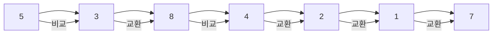

위의 다이어그램은 버블 정렬의 초기 상태를 보여준다. 각 요소는 인접한 요소와 비교되며, 필요에 따라 교환이 이루어진다. 이 과정이 반복되면서 리스트는 정렬된다.

<!--
2. **버블 정렬의 개념**
   - 버블 정렬의 원리
   - 버블 정렬의 특징
-->

## 버블 정렬의 개념

버블 정렬은 가장 간단한 정렬 알고리즘 중 하나로, 인접한 두 요소를 비교하여 정렬하는 방식이다. 이 알고리즘은 데이터가 정렬될 때까지 반복적으로 요소를 비교하고 교환하는 과정을 거친다. 

**버블 정렬의 원리**

버블 정렬의 기본 원리는 인접한 두 요소를 비교하여, 앞의 요소가 뒤의 요소보다 클 경우 두 요소의 위치를 교환하는 것이다. 이 과정을 배열의 끝까지 반복하면, 가장 큰 요소가 배열의 마지막으로 "버블"처럼 떠오르게 된다. 이 과정을 배열의 모든 요소에 대해 반복하면 최종적으로 정렬된 배열을 얻을 수 있다.

초기 배열 상태: \[5, 3, 2, 4, 6, 1\]

버블소트 알고리즘을 사용하여 이 배열을 순차적으로 정렬하는 과정을 다이어그램으로 표현하겠다.

**1단계: 첫 번째 패스**

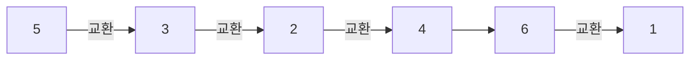

**2단계: 두 번째 패스**
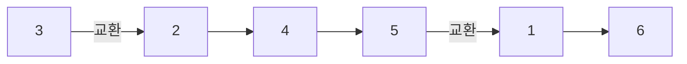

**3단계: 세 번째 패스**
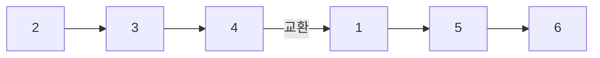

**4단계: 네 번째 패스**
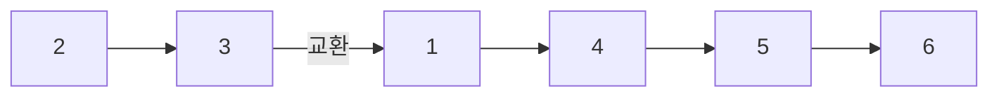

**5단계: 다섯 번째 패스**
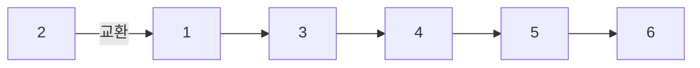

**6단계: 여섯 번째 패스 (최종 정렬 완료)**
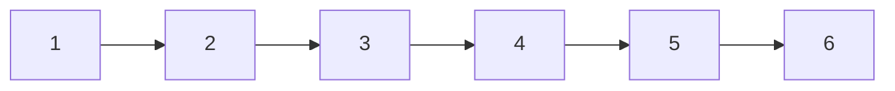

이 다이어그램들은 버블소트의 각 패스마다 어떻게 배열 요소들이 교환되고 정렬되어 가는지를 단계별로 보여준다. 최종적으로 배열이 완전히 정렬되는 과정을 확인할 수 있다.

이 다이어그램들은 버블소트가 실행되는 과정에서 배열 요소들이 교환되면서 정렬이 되어가는 모습을 단계별로 보여주고 있다. 각 패스마다 가장 큰 요소가 점점 뒤로 이동하면서 최종적으로 전체 배열이 정렬되는 모습을 확인할 수 있다.

위의 다이어그램은 배열의 요소들이 비교되고 교환되는 과정을 시각적으로 나타낸 것이다. 각 단계에서 인접한 요소들이 비교되고, 필요에 따라 교환이 이루어진다.

**버블 정렬의 특징**

버블 정렬의 주요 특징은 다음과 같다:

1. **단순성**: 버블 정렬은 구현이 간단하고 이해하기 쉬운 알고리즘이다. 초보자들이 정렬 알고리즘을 배우기에 적합하다.
   
2. **안정성**: 버블 정렬은 안정적인 정렬 알고리즘이다. 즉, 동일한 키를 가진 요소들의 상대적인 순서가 유지된다.

3. **제자리 정렬**: 버블 정렬은 추가적인 메모리 공간을 필요로 하지 않으며, 입력 배열 내에서 정렬이 이루어진다.

4. **시간 복잡도**: 최악의 경우 시간 복잡도는 O(n^2)이다. 이는 배열의 크기가 커질수록 성능이 저하될 수 있음을 의미한다.

5. **최선의 경우**: 이미 정렬된 배열의 경우, 시간 복잡도는 O(n)으로 줄어들 수 있다. 이 경우, 한 번의 패스만으로 모든 요소가 정렬되어 있음을 확인할 수 있다.

버블 정렬은 간단한 정렬 알고리즘이지만, 대규모 데이터에 대해서는 비효율적일 수 있다. 따라서, 실제 프로덕션 환경에서는 더 효율적인 정렬 알고리즘을 사용하는 것이 일반적이다.

<!--
3. **버블 정렬의 과정 정리**
   - 정렬 과정 단계별 설명
   - 시각적 예시 (애니메이션 또는 그림)
-->

## 버블 정렬의 과정 정리

버블 정렬은 간단한 정렬 알고리즘으로, 인접한 두 요소를 비교하여 정렬하는 방식이다. 이 과정은 배열의 끝까지 반복되며, 가장 큰 요소가 배열의 끝으로 "버블"처럼 떠오르는 방식으로 동작한다. 아래에서는 버블 정렬의 정렬 과정을 단계별로 설명하겠다.

**정렬 과정 단계별 설명**

1. **초기 배열 설정**: 정렬할 배열을 설정한다. 예를 들어, 배열이 [5, 3, 8, 4, 2]라고 가정하겠다.

2. **첫 번째 패스**: 배열의 첫 번째 요소부터 시작하여 인접한 두 요소를 비교한다. 만약 첫 번째 요소가 두 번째 요소보다 크면 두 요소의 위치를 교환한다. 이 과정을 배열의 끝까지 반복한다.
   - 비교: 5와 3 → 교환 → [3, 5, 8, 4, 2]
   - 비교: 5와 8 → 교환 없음 → [3, 5, 8, 4, 2]
   - 비교: 8과 4 → 교환 → [3, 5, 4, 8, 2]
   - 비교: 8과 2 → 교환 → [3, 5, 4, 2, 8]

3. **두 번째 패스**: 첫 번째 패스에서 가장 큰 요소가 배열의 끝으로 이동했으므로, 두 번째 패스에서는 마지막 요소를 제외하고 다시 비교를 시작한다.
   - 비교: 3와 5 → 교환 없음 → [3, 5, 4, 2, 8]
   - 비교: 5와 4 → 교환 → [3, 4, 5, 2, 8]
   - 비교: 5와 2 → 교환 → [3, 4, 2, 5, 8]

4. **반복**: 이 과정을 배열의 길이만큼 반복한다. 각 패스마다 가장 큰 요소가 정렬된 위치로 이동하게 된다. 최종적으로 배열이 정렬될 때까지 이 과정을 계속한다.

5. **종료 조건**: 모든 패스를 완료한 후, 배열이 정렬된 상태가 된다. 예를 들어, 최종적으로 [2, 3, 4, 5, 8]로 정렬된다.

**시각적 예시 (애니메이션 또는 그림)**

아래는 버블 정렬의 과정을 시각적으로 나타낸 다이어그램이다. 이 다이어그램은 각 패스에서 배열의 상태 변화를 보여준다.

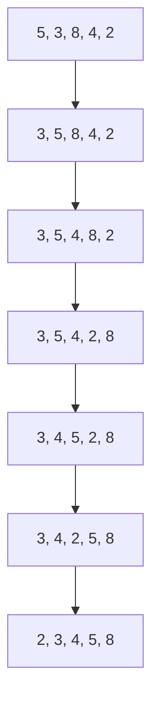

이 다이어그램은 각 단계에서 배열의 상태가 어떻게 변화하는지를 보여준다. 버블 정렬은 이러한 과정을 통해 배열을 정렬하게 된다.

<!--
4. **버블 정렬의 시간 복잡도**
   - 최악의 경우와 최선의 경우
   - 시간 복잡도 분석
-->

## 버블 정렬의 시간 복잡도

버블 정렬은 간단한 정렬 알고리즘으로, 시간 복잡도는 알고리즘의 성능을 평가하는 중요한 요소이다. 이 섹션에서는 버블 정렬의 최악의 경우와 최선의 경우 시간 복잡도에 대해 살펴보고, 이를 분석하는 데 필요한 내용을 정리하겠다.

**최악의 경우와 최선의 경우**

버블 정렬의 시간 복잡도는 입력 데이터의 상태에 따라 달라진다. 

- **최악의 경우**: 입력 데이터가 역순으로 정렬되어 있는 경우이다. 이 경우, 모든 요소를 비교하고 교환해야 하므로, n개의 요소에 대해 n-1번의 패스를 수행해야 한다. 따라서 최악의 경우 시간 복잡도는 O(n^2)이다.

- **최선의 경우**: 입력 데이터가 이미 정렬되어 있는 경우이다. 이 경우, 버블 정렬은 한 번의 패스만으로 모든 요소를 확인하고 더 이상 교환이 필요 없음을 알 수 있다. 따라서 최선의 경우 시간 복잡도는 O(n)이다.

**시간 복잡도 분석**

버블 정렬의 시간 복잡도를 분석하기 위해, 각 패스에서 수행되는 비교 횟수를 살펴보자. n개의 요소가 있을 때, 첫 번째 패스에서는 n-1번의 비교가 이루어지고, 두 번째 패스에서는 n-2번, 그리고 마지막 패스에서는 1번의 비교가 이루어진다. 이를 수식으로 나타내면 다음과 같다.

- 총 비교 횟수 = (n-1) + (n-2) + ... + 1 = n(n-1)/2

따라서, 최악의 경우와 평균적인 경우의 시간 복잡도는 O(n^2)로 나타낼 수 있다. 최선의 경우는 O(n)으로, 이미 정렬된 데이터에 대해 효율적으로 동작함을 알 수 있다.

버블 정렬의 시간 복잡도는 알고리즘의 효율성을 이해하는 데 중요한 요소이며, 최악의 경우와 최선의 경우를 고려하여 적절한 상황에서 사용해야 한다.

<!--
5. **버블 정렬의 구현**
   - C 언어로 구현한 버블 정렬
   - C++로 구현한 버블 정렬
   - Java로 구현한 버블 정렬
   - Python으로 구현한 버블 정렬
   - JavaScript로 구현한 버블 정렬
   - C#로 구현한 버블 정렬
   - PHP로 구현한 버블 정렬
-->

## 버블 정렬의 구현

버블 정렬은 간단한 정렬 알고리즘으로, 다양한 프로그래밍 언어에서 쉽게 구현할 수 있다. 이번 섹션에서는 C, C++, Java, Python, JavaScript, C# 등 여러 언어로 버블 정렬을 구현하는 방법을 살펴보겠다.

**C 언어로 구현한 버블 정렬**

C 언어로 버블 정렬을 구현하는 코드는 다음과 같다.

```c
#include <stdio.h>

void bubbleSort(int arr[], int n) {
    for (int i = 0; i < n-1; i++) {
        for (int j = 0; j < n-i-1; j++) {
            if (arr[j] > arr[j+1]) {
                // Swap arr[j] and arr[j+1]
                int temp = arr[j];
                arr[j] = arr[j+1];
                arr[j+1] = temp;
            }
        }
    }
}

void printArray(int arr[], int size) {
    for (int i = 0; i < size; i++)
        printf("%d ", arr[i]);
    printf("\n");
}

int main() {
    int arr[] = {64, 34, 25, 12, 22, 11, 90};
    int n = sizeof(arr)/sizeof(arr[0]);
    bubbleSort(arr, n);
    printf("Sorted array: \n");
    printArray(arr, n);
    return 0;
}
```

**C++로 구현한 버블 정렬**

C++에서는 다음과 같이 버블 정렬을 구현할 수 있다.

```cpp
#include <iostream>
using namespace std;

void bubbleSort(int arr[], int n) {
    for (int i = 0; i < n-1; i++) {
        for (int j = 0; j < n-i-1; j++) {
            if (arr[j] > arr[j+1]) {
                swap(arr[j], arr[j+1]);
            }
        }
    }
}

void printArray(int arr[], int size) {
    for (int i = 0; i < size; i++)
        cout << arr[i] << " ";
    cout << endl;
}

int main() {
    int arr[] = {64, 34, 25, 12, 22, 11, 90};
    int n = sizeof(arr)/sizeof(arr[0]);
    bubbleSort(arr, n);
    cout << "Sorted array: " << endl;
    printArray(arr, n);
    return 0;
}
```

**Java로 구현한 버블 정렬**

Java에서는 다음과 같이 구현할 수 있다.

```java
public class BubbleSort {
    void bubbleSort(int arr[]) {
        int n = arr.length;
        for (int i = 0; i < n-1; i++) {
            for (int j = 0; j < n-i-1; j++) {
                if (arr[j] > arr[j+1]) {
                    // Swap arr[j] and arr[j+1]
                    int temp = arr[j];
                    arr[j] = arr[j+1];
                    arr[j+1] = temp;
                }
            }
        }
    }

    void printArray(int arr[]) {
        for (int i : arr) {
            System.out.print(i + " ");
        }
        System.out.println();
    }

    public static void main(String args[]) {
        BubbleSort ob = new BubbleSort();
        int arr[] = {64, 34, 25, 12, 22, 11, 90};
        ob.bubbleSort(arr);
        System.out.println("Sorted array");
        ob.printArray(arr);
    }
}
```

**Python으로 구현한 버블 정렬**

Python에서는 다음과 같이 간단하게 구현할 수 있다.

```python
def bubble_sort(arr):
    n = len(arr)
    for i in range(n-1):
        for j in range(n-i-1):
            if arr[j] > arr[j+1]:
                arr[j], arr[j+1] = arr[j+1], arr[j]

arr = [64, 34, 25, 12, 22, 11, 90]
bubble_sort(arr)
print("Sorted array:", arr)
```

**JavaScript로 구현한 버블 정렬**

JavaScript에서는 다음과 같이 구현할 수 있다.

```javascript
function bubbleSort(arr) {
    let n = arr.length;
    for (let i = 0; i < n-1; i++) {
        for (let j = 0; j < n-i-1; j++) {
            if (arr[j] > arr[j+1]) {
                // Swap arr[j] and arr[j+1]
                [arr[j], arr[j+1]] = [arr[j+1], arr[j]];
            }
        }
    }
}

let arr = [64, 34, 25, 12, 22, 11, 90];
bubbleSort(arr);
console.log("Sorted array:", arr);
```

**C#로 구현한 버블 정렬**

C#에서는 다음과 같이 구현할 수 있다.

```csharp
using System;

class BubbleSort {
    void bubbleSort(int[] arr) {
        int n = arr.Length;
        for (int i = 0; i < n-1; i++) {
            for (int j = 0; j < n-i-1; j++) {
                if (arr[j] > arr[j+1]) {
                    // Swap arr[j] and arr[j+1]
                    int temp = arr[j];
                    arr[j] = arr[j+1];
                    arr[j+1] = temp;
                }
            }
        }
    }

    static void Main() {
        BubbleSort ob = new BubbleSort();
        int[] arr = {64, 34, 25, 12, 22, 11, 90};
        ob.bubbleSort(arr);
        Console.WriteLine("Sorted array: ");
        foreach (int value in arr) {
            Console.Write(value + " ");
        }
    }
}
```

이와 같이 다양한 프로그래밍 언어에서 버블 정렬을 쉽게 구현할 수 있다. 각 언어의 문법에 따라 약간의 차이는 있지만, 기본적인 알고리즘의 원리는 동일하다. 

다음은 버블 정렬의 과정을 시각적으로 나타낸 다이어그램이다.

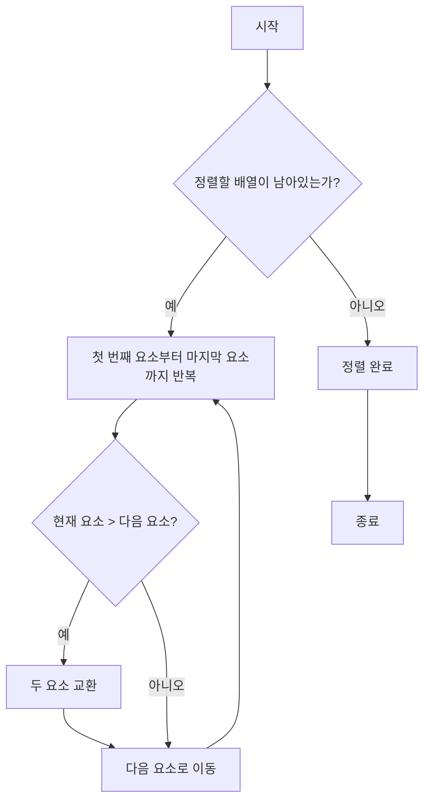

이 다이어그램은 버블 정렬의 기본적인 흐름을 나타내며, 각 단계에서의 조건과 동작을 시각적으로 이해하는 데 도움을 준다.

<!--
6. **버블 정렬의 최적화**
   - 최적화된 버블 정렬 알고리즘
   - 최적화의 필요성과 효과
-->

## 버블 정렬의 최적화

버블 정렬은 간단하고 직관적인 정렬 알고리즘이지만, 비효율적인 시간 복잡도로 인해 대규모 데이터에 대해서는 성능이 떨어진다. 따라서 버블 정렬을 최적화하는 방법이 필요하다. 이번 섹션에서는 최적화된 버블 정렬 알고리즘과 그 필요성 및 효과에 대해 살펴보겠다.

**최적화된 버블 정렬 알고리즘**

기본적인 버블 정렬 알고리즘은 매 반복마다 모든 요소를 비교하고 교환하는 방식으로 작동한다. 그러나 이미 정렬된 배열에 대해서는 불필요한 비교를 줄일 수 있는 방법이 있다. 이를 위해 '스왑이 발생했는지 여부'를 추적하는 변수를 도입할 수 있다. 만약 한 번의 패스에서 스왑이 발생하지 않았다면, 배열이 이미 정렬되었다고 판단하고 알고리즘을 조기에 종료할 수 있다.

아래는 최적화된 버블 정렬 알고리즘의 C 언어 구현 예시이다.

```c
#include <stdio.h>

void optimizedBubbleSort(int arr[], int n) {
    int i, j, temp;
    int swapped;

    for (i = 0; i < n - 1; i++) {
        swapped = 0; // 스왑 발생 여부 초기화
        for (j = 0; j < n - i - 1; j++) {
            if (arr[j] > arr[j + 1]) {
                // 스왑 발생
                temp = arr[j];
                arr[j] = arr[j + 1];
                arr[j + 1] = temp;
                swapped = 1; // 스왑 발생 표시
            }
        }
        // 스왑이 없으면 정렬 완료
        if (swapped == 0) {
            break;
        }
    }
}

int main() {
    int arr[] = {64, 34, 25, 12, 22, 11, 90};
    int n = sizeof(arr) / sizeof(arr[0]);
    optimizedBubbleSort(arr, n);
    printf("정렬된 배열: \n");
    for (int i = 0; i < n; i++) {
        printf("%d ", arr[i]);
    }
    return 0;
}
```

**최적화의 필요성과 효과**

버블 정렬의 최적화는 다음과 같은 이유로 필요하다.

1. **성능 향상**: 기본 버블 정렬은 O(n^2)의 시간 복잡도를 가지지만, 최적화된 버블 정렬은 이미 정렬된 배열에 대해 O(n)으로 동작할 수 있다. 이는 성능을 크게 향상시킨다.

2. **자원 절약**: 불필요한 비교와 스왑을 줄임으로써 CPU 자원을 절약할 수 있다. 이는 특히 대규모 데이터셋을 다룰 때 유용하다.

3. **사용자 경험 개선**: 정렬이 빠르게 완료되면 사용자에게 더 나은 경험을 제공할 수 있다. 이는 특히 실시간 데이터 처리와 같은 상황에서 중요하다.

아래는 최적화된 버블 정렬의 과정을 시각적으로 나타낸 다이어그램이다.

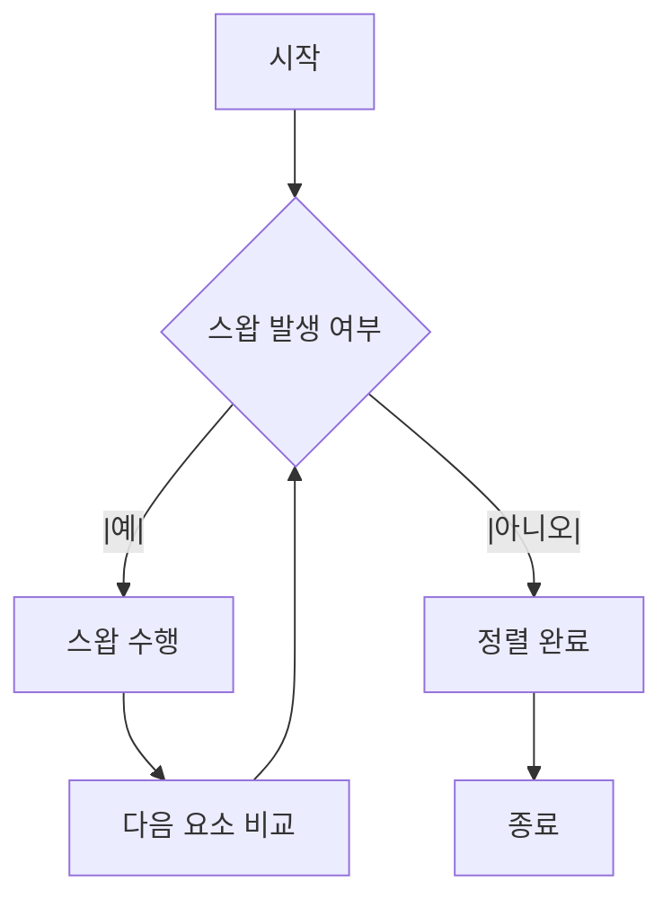

이와 같이 최적화된 버블 정렬 알고리즘은 기본 알고리즘의 단점을 보완하여 성능을 개선할 수 있다. 이러한 최적화는 특히 데이터가 이미 정렬되어 있는 경우에 큰 효과를 발휘한다.

<!--
7. **버블 정렬의 장단점**
   - 장점
   - 단점
-->

## 버블 정렬의 장단점

버블 정렬은 간단한 정렬 알고리즘으로, 그 특성상 장점과 단점이 뚜렷하다. 이 섹션에서는 버블 정렬의 장점과 단점을 살펴보도록 하겠다.

**장점**

1. **간단한 구현**: 버블 정렬은 알고리즘이 매우 간단하여, 초보자도 쉽게 이해하고 구현할 수 있다. 코드의 가독성이 높아 교육적 목적으로 많이 사용된다.

2. **제자리 정렬**: 버블 정렬은 추가적인 메모리 공간을 필요로 하지 않으며, 입력 배열 내에서 직접 정렬을 수행한다. 이는 메모리 사용을 최소화하는 데 도움이 된다.

3. **안정성**: 버블 정렬은 안정적인 정렬 알고리즘이다. 즉, 동일한 키를 가진 요소의 상대적인 순서가 유지된다. 이는 특정 상황에서 유용할 수 있다.

4. **최적화 가능성**: 이미 정렬된 배열에 대해 최적화된 버블 정렬을 사용할 수 있다. 이 경우, 정렬이 완료되었음을 확인하고 불필요한 반복을 줄일 수 있다.

**단점**

1. **비효율성**: 버블 정렬은 시간 복잡도가 O(n^2)로, 대량의 데이터에 대해 비효율적이다. 이는 다른 정렬 알고리즘에 비해 성능이 떨어지는 원인이다.

2. **많은 비교와 교환**: 버블 정렬은 모든 요소를 반복적으로 비교하고 교환하기 때문에, 데이터가 많을수록 성능 저하가 심해진다. 이는 특히 정렬할 데이터가 거의 정렬된 상태일 때 더욱 두드러진다.

3. **실제 사용에서의 한계**: 버블 정렬은 교육적 목적 외에는 실제 사용에서 잘 사용되지 않는다. 더 효율적인 정렬 알고리즘이 존재하기 때문이다.

**샘플 코드**

아래는 Python으로 구현한 버블 정렬의 예시 코드이다.

```python
def bubble_sort(arr):
    n = len(arr)
    for i in range(n):
        swapped = False
        for j in range(0, n-i-1):
            if arr[j] > arr[j+1]:
                arr[j], arr[j+1] = arr[j+1], arr[j]
                swapped = True
        if not swapped:
            break
    return arr

# 사용 예시
data = [64, 34, 25, 12, 22, 11, 90]
sorted_data = bubble_sort(data)
print("정렬된 배열:", sorted_data)
```

**다이어그램**

아래는 버블 정렬의 과정을 시각적으로 나타낸 다이어그램이다. 각 단계에서 인접한 요소들이 비교되고 교환되는 과정을 보여준다.

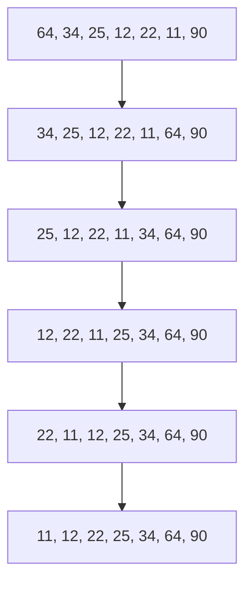

이와 같이 버블 정렬은 간단한 구현과 안정성 등의 장점을 가지지만, 비효율성과 많은 비교 및 교환으로 인해 실제 사용에서는 한계가 있다.

<!--
8. **버블 정렬의 활용 사례**
   - 교육적 목적
   - 특정 알고리즘에서의 사용 예
-->

## 버블 정렬의 활용 사례

버블 정렬은 그 단순함과 직관성 덕분에 여러 분야에서 활용되고 있다. 특히 교육적 목적과 특정 알고리즘에서의 사용 예를 통해 그 유용성을 살펴볼 수 있다.

**교육적 목적**

버블 정렬은 알고리즘 교육에서 자주 사용되는 정렬 알고리즘 중 하나이다. 그 이유는 다음과 같다.

1. **단순한 원리**: 버블 정렬은 인접한 두 요소를 비교하고 교환하는 방식으로 작동하므로, 학생들이 정렬 알고리즘의 기본 개념을 이해하는 데 도움이 된다.
2. **시각적 이해**: 버블 정렬의 과정은 시각적으로 쉽게 표현할 수 있어, 학생들이 알고리즘의 동작을 직관적으로 이해할 수 있다. 

**특정 알고리즘에서의 사용 예**

버블 정렬은 그 효율성이 떨어지는 경우가 많지만, 특정 상황에서는 여전히 유용하게 사용될 수 있다. 예를 들어, 데이터의 양이 적거나 거의 정렬된 상태일 때는 버블 정렬이 간단하고 빠르게 동작할 수 있다. 또한, 버블 정렬은 안정적인 정렬 알고리즘으로, 동일한 값의 요소들이 원래의 순서를 유지하는 특성을 가지고 있다. 이러한 특성 덕분에 다음과 같은 경우에 활용될 수 있다.

1. **소규모 데이터 정렬**: 데이터의 양이 적은 경우, 버블 정렬은 구현이 간단하고 오버헤드가 적어 유용하게 사용될 수 있다.
2. **정렬된 데이터의 유지**: 이미 정렬된 데이터에서 새로운 요소를 추가할 때, 버블 정렬을 사용하여 간단하게 정렬 상태를 유지할 수 있다.

결론적으로, 버블 정렬은 교육적 목적과 특정 알고리즘에서의 사용 예를 통해 그 유용성을 보여준다. 비록 대규모 데이터 정렬에는 적합하지 않지만, 그 단순함과 직관성 덕분에 여전히 많은 상황에서 활용될 수 있다.

<!--
9. **FAQ (자주 묻는 질문)**
   - 버블 정렬의 경계 사례는 무엇인가?
   - 버블 정렬은 제자리 정렬인가?
   - 버블 정렬 알고리즘은 안정적인가?
   - 버블 정렬은 어디에 사용되는가?
-->

## FAQ (자주 묻는 질문)

**버블 정렬의 경계 사례는 무엇인가?**  

버블 정렬의 경계 사례는 정렬할 데이터가 이미 정렬되어 있는 경우와 정렬할 데이터가 역순으로 정렬되어 있는 경우이다. 이미 정렬된 경우에는 알고리즘이 한 번의 패스를 통해 아무런 교환도 하지 않으므로 최선의 경우 시간 복잡도는 O(n)이다. 반면, 역순으로 정렬된 경우에는 모든 요소를 비교하고 교환해야 하므로 최악의 경우 시간 복잡도는 O(n^2)이다. 이러한 경계 사례는 버블 정렬의 성능을 이해하는 데 중요한 요소이다.

**버블 정렬은 제자리 정렬인가?**  

버블 정렬은 제자리 정렬(in-place sorting) 알고리즘이다. 이는 추가적인 메모리 공간을 거의 사용하지 않고, 주어진 배열 내에서 직접 정렬을 수행한다는 의미이다. 버블 정렬은 두 요소를 교환하는 방식으로 정렬을 진행하므로, 별도의 배열이나 리스트를 생성하지 않고도 정렬을 완료할 수 있다.

**버블 정렬 알고리즘은 안정적인가?**  

버블 정렬 알고리즘은 안정적인 정렬 알고리즘이다. 안정적인 정렬 알고리즘이란 동일한 키 값을 가진 요소들의 상대적인 순서가 정렬 후에도 유지되는 것을 의미한다. 버블 정렬은 인접한 두 요소를 비교하고 교환하는 방식으로 작동하기 때문에, 동일한 값의 요소들이 원래의 순서를 유지하게 된다.

**버블 정렬은 어디에 사용되는가?**  

버블 정렬은 주로 교육적 목적으로 사용된다. 알고리즘의 기본 개념을 이해하고, 정렬 알고리즘의 동작 방식을 시각적으로 학습하는 데 유용하다. 또한, 데이터의 양이 적거나 정렬이 자주 발생하지 않는 경우에는 간단한 구현으로 인해 사용될 수 있다. 그러나 대규모 데이터에 대해서는 비효율적이므로 다른 정렬 알고리즘을 사용하는 것이 바람직하다.

<!--
10. **관련 기술**
    - 다른 정렬 알고리즘 (선택 정렬, 삽입 정렬, 퀵 정렬 등)
    - 정렬 알고리즘의 비교
-->

## 관련 기술

정렬 알고리즘은 데이터 구조에서 데이터를 정렬하는 데 사용되는 알고리즘이다. 버블 정렬 외에도 다양한 정렬 알고리즘이 존재하며, 각 알고리즘은 특정 상황에서 더 효율적일 수 있다. 이 섹션에서는 다른 정렬 알고리즘과 그들의 비교를 다룰 것이다.

**다른 정렬 알고리즘**

1. **선택 정렬 (Selection Sort)**  
   선택 정렬은 주어진 리스트에서 가장 작은 요소를 찾아서 맨 앞의 요소와 교환하는 방식으로 정렬을 수행한다. 이 과정을 반복하여 리스트를 정렬한다. 선택 정렬의 시간 복잡도는 O(n^2)이다.

   ```python
   def selection_sort(arr):
       n = len(arr)
       for i in range(n):
           min_idx = i
           for j in range(i + 1, n):
               if arr[j] < arr[min_idx]:
                   min_idx = j
           arr[i], arr[min_idx] = arr[min_idx], arr[i]
       return arr
   ```

2. **삽입 정렬 (Insertion Sort)**  
   삽입 정렬은 리스트를 두 부분으로 나누고, 정렬된 부분에 새로운 요소를 삽입하는 방식으로 작동한다. 이 알고리즘은 작은 데이터 집합에 대해 효율적이며, 시간 복잡도는 평균 O(n^2)이다.

   ```python
   def insertion_sort(arr):
       for i in range(1, len(arr)):
           key = arr[i]
           j = i - 1
           while j >= 0 and key < arr[j]:
               arr[j + 1] = arr[j]
               j -= 1
           arr[j + 1] = key
       return arr
   ```

3. **퀵 정렬 (Quick Sort)**  
   퀵 정렬은 분할 정복 알고리즘으로, 리스트를 피벗을 기준으로 두 개의 부분으로 나누고, 각 부분을 재귀적으로 정렬하는 방식이다. 평균적으로 O(n log n)의 시간 복잡도를 가지며, 매우 효율적이다.

   ```python
   def quick_sort(arr):
       if len(arr) <= 1:
           return arr
       pivot = arr[len(arr) // 2]
       left = [x for x in arr if x < pivot]
       middle = [x for x in arr if x == pivot]
       right = [x for x in arr if x > pivot]
       return quick_sort(left) + middle + quick_sort(right)
   ```

**정렬 알고리즘의 비교**

**버블 정렬 (Bubble Sort)**
- **안정성: 안정적**
- **이유**: 버블 정렬은 인접한 두 요소를 비교하여 필요할 경우 교환하는 방식으로 동작한다. 이 과정에서 같은 값을 가진 요소들이 교환되지 않기 때문에, 원래의 순서가 유지된다. 따라서 버블 정렬은 안정적인 알고리즘이다.

**선택 정렬 (Selection Sort)**
- **안정성: 불안정**
- **이유**: 선택 정렬은 배열에서 가장 작은(또는 큰) 요소를 찾아 첫 번째 위치로 이동시키고, 다음 작은 요소를 두 번째 위치로 이동시키는 방식으로 동작한다. 이 과정에서 같은 값을 가진 요소들이 있을 때, 뒤에 있는 요소가 앞쪽으로 이동할 수 있어 상대적인 순서가 변경될 수 있다. 이로 인해 선택 정렬은 불안정한 알고리즘이다.

**삽입 정렬 (Insertion Sort)**
- **안정성: 안정적**
- **이유**: 삽입 정렬은 배열을 왼쪽부터 차례대로 정렬하면서, 각 요소를 그 요소보다 작은 값들과 비교하여 적절한 위치에 삽입한다. 이 과정에서 같은 값을 가진 요소들은 이미 정렬된 부분에서 위치가 유지되기 때문에 상대적인 순서가 변하지 않는다. 따라서 삽입 정렬은 안정적인 알고리즘이다.

**퀵 정렬 (Quick Sort)**
- **안정성: 불안정**
- **이유**: 퀵 정렬은 피벗(pivot) 요소를 기준으로 배열을 두 개의 하위 배열로 분할하고, 각각을 재귀적으로 정렬한다. 이 과정에서 같은 값을 가진 요소들이 피벗의 위치에 따라 서로 다른 하위 배열로 나뉘게 되면, 정렬 후 상대적인 순서가 변경될 수 있다. 그래서 퀵 정렬은 불안정한 알고리즘이다.

각 정렬 알고리즘은 고유의 특성과 장단점을 가지고 있다. 안정성은 특정 상황에서 매우 중요한 요소일 수 있으며, 예를 들어, 이미 정렬된 데이터를 처리하거나 데이터의 순서가 중요한 경우에는 안정적인 알고리즘을 선택하는 것이 좋다. 반면에, 데이터의 순서가 중요하지 않다면 불안정한 알고리즘도 효율적인 선택이 될 수 있다. 따라서 문제의 특성과 데이터의 크기에 따라 적절한 정렬 알고리즘을 선택하는 것이 중요하다.

<!--
11. **결론**
    - 버블 정렬의 중요성
    - 정렬 알고리즘 선택 시 고려사항
-->

## 결론

**버블 정렬의 중요성**

버블 정렬은 가장 간단한 정렬 알고리즘 중 하나로, 교육적 목적에서 매우 중요한 역할을 한다. 이 알고리즘은 정렬의 기본 개념을 이해하는 데 도움을 주며, 다른 복잡한 정렬 알고리즘을 배우기 위한 기초를 제공한다. 버블 정렬은 그 구현이 간단하고 직관적이기 때문에, 초보자들이 프로그래밍을 배우는 과정에서 자주 사용된다. 또한, 버블 정렬은 알고리즘의 성능을 비교하는 기준으로도 활용될 수 있다. 

버블 정렬의 작동 원리는 인접한 두 요소를 비교하여 정렬하는 방식으로, 이 과정이 반복되면서 가장 큰 값이 배열의 끝으로 "버블"처럼 떠오르는 형태를 띤다. 이러한 단순한 구조는 알고리즘의 이해를 돕고, 정렬의 기본 원리를 시각적으로 보여준다.

**정렬 알고리즘 선택 시 고려사항**

정렬 알고리즘을 선택할 때는 여러 가지 요소를 종합적으로 고려해야 한다.

첫째, **데이터의 크기와 특성**을 고려해야 한다. 작은 데이터셋에서는 버블 정렬과 같은 단순한 알고리즘도 충분히 빠르게 작동할 수 있지만, 대규모 데이터셋에서는 퀵 정렬이나 병합 정렬과 같은 더 효율적인 알고리즘이 필요하다.

둘째, **알고리즘의 안정성**도 중요한 요소이다. 안정적인 정렬 알고리즘은 동일한 값을 가진 요소들의 상대적인 순서를 유지한다. 예를 들어, 버블 정렬은 안정적인 알고리즘이므로, 데이터의 순서가 중요한 경우 적합한 선택이 될 수 있다.

셋째, **메모리 사용량**도 중요한 고려사항이다. 일부 정렬 알고리즘은 추가적인 메모리를 필요로 하며, 이는 메모리 제약이 있는 환경에서 문제가 될 수 있다. 버블 정렬은 제자리 정렬 알고리즘으로, 추가적인 메모리 사용이 적다는 장점이 있다.

마지막으로, **알고리즘의 구현 난이도와 가독성**도 고려해야 한다. 버블 정렬은 구현이 간단하고 이해하기 쉬운 반면, 퀵 정렬이나 병합 정렬은 상대적으로 복잡할 수 있다. 따라서 학습 목적이나 코드의 가독성을 중시하는 경우 버블 정렬과 같은 간단한 알고리즘이 적합할 수 있다.

이러한 요소들을 종합적으로 고려하여, 상황에 맞는 적절한 정렬 알고리즘을 선택하는 것이 중요하다.

<!--
12. **참고 자료**
    - 관련 링크 및 문헌
    - 추가 학습 자료
-->

## 참고 자료

버블 정렬에 대한 깊이 있는 이해를 위해 다음의 자료를 참고하면 좋다. 이 섹션에서는 관련 링크 및 문헌, 추가 학습 자료를 소개한다.

**관련 링크 및 문헌**

1. **Wikipedia - Bubble Sort**  
   [Bubble Sort - Wikipedia](https://en.wikipedia.org/wiki/Bubble_sort)  
   버블 정렬에 대한 기본적인 정의와 역사, 알고리즘의 작동 방식에 대한 설명이 포함되어 있다.

2. **GeeksforGeeks - Bubble Sort**  
   [Bubble Sort - GeeksforGeeks](https://www.geeksforgeeks.org/bubble-sort/)  
   버블 정렬의 구현 방법과 다양한 프로그래밍 언어로의 예제 코드가 제공된다.

3. **Khan Academy - Sorting Algorithms**  
   [Khan Academy - Sorting Algorithms](https://www.khanacademy.org/computing/computer-science/algorithms/sorting-algorithms)  
   다양한 정렬 알고리즘에 대한 설명과 함께 버블 정렬의 시각적 예시를 제공한다.

**추가 학습 자료**

1. **"Introduction to Algorithms" by Thomas H. Cormen et al.**  
   이 책은 알고리즘에 대한 포괄적인 내용을 다루며, 버블 정렬을 포함한 다양한 정렬 알고리즘에 대한 깊이 있는 설명이 있다.

2. **"Algorithms Unlocked" by Thomas H. Cormen**  
   알고리즘의 기본 개념을 쉽게 설명한 책으로, 버블 정렬을 포함한 여러 알고리즘을 이해하는 데 도움이 된다.


이 자료들을 통해 버블 정렬에 대한 이해를 더욱 깊이 있게 할 수 있을 것이다.

<!--
##### Reference #####
-->

## Reference


* [https://gmlwjd9405.github.io/2018/05/06/algorithm-bubble-sort.html](https://gmlwjd9405.github.io/2018/05/06/algorithm-bubble-sort.html)
* [https://www.geeksforgeeks.org/bubble-sort-algorithm/](https://www.geeksforgeeks.org/bubble-sort-algorithm/)
* [https://simple.wikipedia.org/wiki/Bubble_sort](https://simple.wikipedia.org/wiki/Bubble_sort)
* [https://khu98.tistory.com/106](https://khu98.tistory.com/106)
* [https://popbox.tistory.com/6](https://popbox.tistory.com/6)
* [https://gguzunhee.tistory.com/entry/%EC%95%8C%EA%B3%A0%EB%A6%AC%EC%A6%98-%EA%B0%9C%EB%85%90-%EB%B2%84%EB%B8%94-%EC%A0%95%EB%A0%AC-bubble-sort-c](https://gguzunhee.tistory.com/entry/%EC%95%8C%EA%B3%A0%EB%A6%AC%EC%A6%98-%EA%B0%9C%EB%85%90-%EB%B2%84%EB%B8%94-%EC%A0%95%EB%A0%AC-bubble-sort-c)

