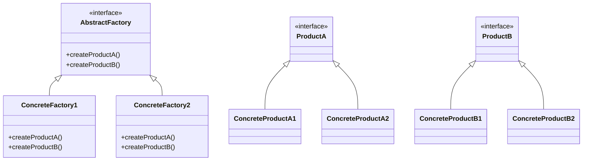
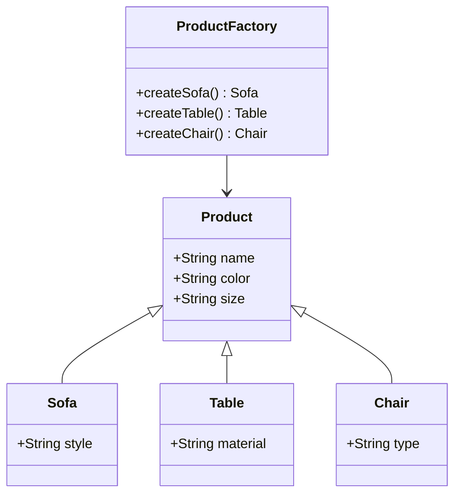
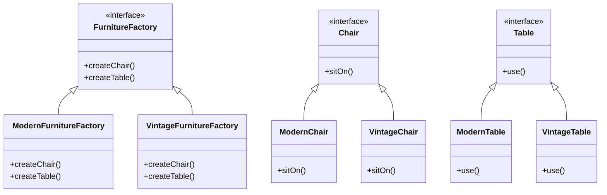
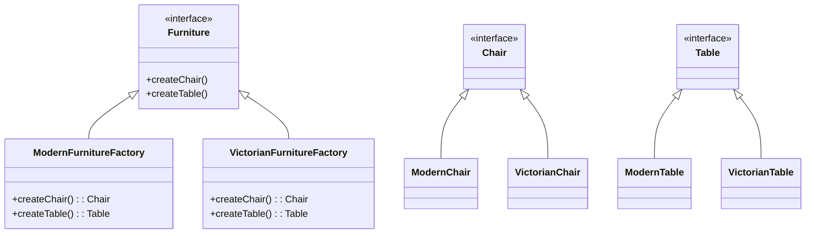
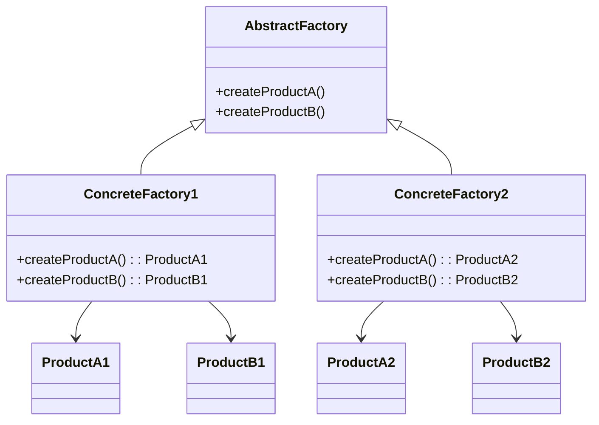
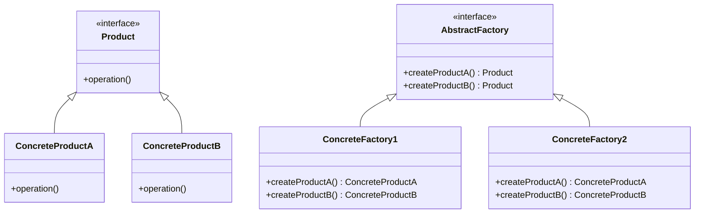
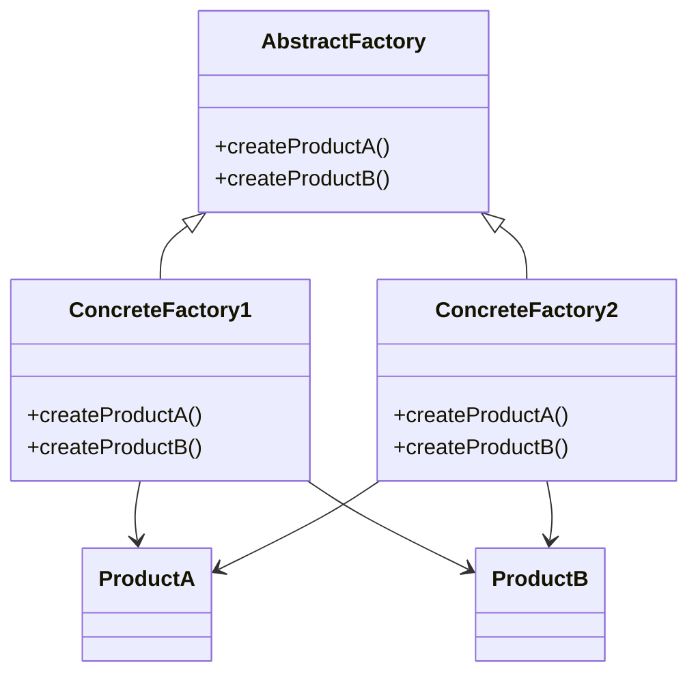
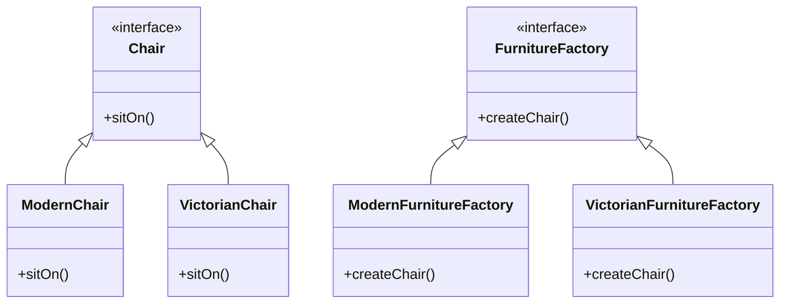

추상 팩토리 패턴은 객체 생성의 복잡성을 줄이고, 관련된 객체들을 일관된 방식으로 생성할 수 있도록 도와주는 디자인 패턴이다. 이 패턴은 특정 클래스에 의존하지 않고, 서로 연관된 객체들의 조합을 생성하는 인터페이스를 제공한다. 예를 들어, 가구 쇼핑몰 시뮬레이터를 생각해보자. 이 시뮬레이터는 의자, 소파, 커피 테이블과 같은 다양한 가구 제품을 다룬다. 각 제품은 현대적, 빅토리안, 아르데코와 같은 여러 스타일의 변형이 있을 수 있다. 고객은 서로 다른 스타일의 가구가 조화를 이루기를 원하기 때문에, 이러한 제품들을 생성할 때는 반드시 같은 스타일의 제품들끼리만 조합해야 한다. 

추상 팩토리 패턴을 사용하면, 각 제품의 변형을 생성하는 구체적인 팩토리 클래스를 만들 수 있다. 예를 들어, 현대식 가구를 생성하는 `ModernFurnitureFactory`와 빅토리안 스타일의 가구를 생성하는 `VictorianFurnitureFactory`가 있을 수 있다. 클라이언트 코드는 이러한 팩토리 클래스를 통해 제품을 생성하며, 구체적인 클래스에 의존하지 않고 추상 인터페이스를 통해 작업을 수행한다. 이로 인해 새로운 제품이나 변형을 추가할 때 기존 코드를 수정할 필요가 없고, 코드의 유연성과 재사용성을 높일 수 있다. 

결론적으로, 추상 팩토리 패턴은 객체 생성의 복잡성을 줄이고, 관련된 객체들을 일관된 방식으로 생성할 수 있도록 도와주는 강력한 도구이다. 이 패턴을 통해 소프트웨어의 유지보수성과 확장성을 높일 수 있으며, 다양한 제품군을 효과적으로 관리할 수 있다.


||
|:---:|
||


<!--
##### Outline #####
-->

<!--
# 목차

## 1. 개요
   - 추상 팩토리 패턴의 정의
   - 패턴의 필요성 및 사용 사례
   - 관련 디자인 패턴 소개 (팩토리 메서드 패턴, 싱글턴 패턴 등)

## 2. 문제 설명
   - 가구 상점 시뮬레이터의 필요성
   - 제품군 및 변형의 정의
   - 고객의 요구 사항: 일관성 있는 제품 조합

## 3. 솔루션
   - 추상 팩토리 패턴의 구조
     - 제품 인터페이스 정의
     - 추상 팩토리 인터페이스 설계
     - 구체적인 팩토리 클래스 구현
   - 제품 변형의 생성
   - 클라이언트 코드와의 상호작용

## 4. 예제
   - 가구 상점 시뮬레이터 구현 예제
     - 클래스 다이어그램
     - 코드 예제 (Java, C++)
   - UI 요소 생성 예제
     - 크로스 플랫폼 UI 요소 생성
     - 운영 체제에 따른 UI 요소의 일관성 유지

## 5. FAQ
   - 추상 팩토리 패턴과 팩토리 메서드 패턴의 차이점은 무엇인가요?
   - 이 패턴을 사용할 때의 장점과 단점은 무엇인가요?
   - 새로운 제품 변형을 추가할 때 기존 코드를 어떻게 수정해야 하나요?

## 6. 관련 기술
   - 객체 지향 프로그래밍 원칙
   - SOLID 원칙
   - 디자인 패턴의 중요성 및 활용

## 7. 결론
   - 추상 팩토리 패턴의 요약
   - 패턴의 실제 적용 사례
   - 향후 연구 및 개발 방향

## 8. 추가 자료
   - 추천 도서 및 자료
   - 온라인 강의 및 튜토리얼
   - 관련 블로그 및 커뮤니티 링크

## 9. 참고 문헌
   - 디자인 패턴 관련 서적
   - 온라인 자료 및 문서
   - 관련 연구 논문 및 기사

이 목차는 추상 팩토리 패턴에 대한 깊이 있는 이해를 제공하며, 관련된 기술과 예제를 통해 독자가 실질적인 적용 방법을 배울 수 있도록 구성되었습니다.
-->

<!--
## 1. 개요
   - 추상 팩토리 패턴의 정의
   - 패턴의 필요성 및 사용 사례
   - 관련 디자인 패턴 소개 (팩토리 메서드 패턴, 싱글턴 패턴 등)
-->

## 1. 개요

**추상 팩토리 패턴의 정의**  
추상 팩토리 패턴은 객체 생성 패턴 중 하나로, 관련된 객체들의 집합을 생성하는 인터페이스를 제공하는 패턴이다. 이 패턴은 구체적인 클래스에 의존하지 않고, 클라이언트가 원하는 객체를 생성할 수 있도록 도와준다. 즉, 클라이언트는 팩토리 인터페이스를 통해 객체를 생성하고, 구체적인 객체의 생성 과정은 팩토리 클래스에 위임된다. 이를 통해 객체 생성의 유연성과 일관성을 유지할 수 있다.

**패턴의 필요성 및 사용 사례**  
추상 팩토리 패턴은 다음과 같은 상황에서 필요하다. 첫째, 여러 제품군이 존재하고, 이들 제품군의 객체를 일관성 있게 생성해야 할 때 유용하다. 둘째, 제품군의 객체가 서로 의존성을 가질 때, 이를 관리하기 위해 이 패턴을 사용할 수 있다. 예를 들어, 가구 상점에서 의자와 테이블을 함께 판매할 때, 특정 스타일의 의자와 테이블을 일관성 있게 제공하기 위해 추상 팩토리 패턴을 적용할 수 있다.

**관련 디자인 패턴 소개 (팩토리 메서드 패턴, 싱글턴 패턴 등)**  
추상 팩토리 패턴은 다른 디자인 패턴과 함께 사용될 수 있다. 팩토리 메서드 패턴은 객체 생성의 책임을 서브클래스에 위임하는 패턴으로, 특정 클래스의 인스턴스를 생성하는 방법을 정의한다. 반면, 추상 팩토리 패턴은 여러 제품군의 객체를 생성하는 데 중점을 둔다. 싱글턴 패턴은 클래스의 인스턴스가 오직 하나만 존재하도록 보장하는 패턴으로, 특정한 상황에서 추상 팩토리 패턴과 함께 사용될 수 있다.

### 클래스 다이어그램
아래는 추상 팩토리 패턴의 기본 구조를 나타내는 클래스 다이어그램이다.



### 코드 예제 (Java)
아래는 추상 팩토리 패턴을 사용하여 가구를 생성하는 간단한 Java 코드 예제이다.

```java
// 제품 인터페이스
interface Chair {
    void sitOn();
}

interface Table {
    void use();
}

// 구체적인 제품 클래스
class ModernChair implements Chair {
    public void sitOn() {
        System.out.println("Sitting on a modern chair.");
    }
}

class ModernTable implements Table {
    public void use() {
        System.out.println("Using a modern table.");
    }
}

// 추상 팩토리 인터페이스
interface FurnitureFactory {
    Chair createChair();
    Table createTable();
}

// 구체적인 팩토리 클래스
class ModernFurnitureFactory implements FurnitureFactory {
    public Chair createChair() {
        return new ModernChair();
    }

    public Table createTable() {
        return new ModernTable();
    }
}

// 클라이언트 코드
public class Client {
    public static void main(String[] args) {
        FurnitureFactory factory = new ModernFurnitureFactory();
        Chair chair = factory.createChair();
        Table table = factory.createTable();

        chair.sitOn();
        table.use();
    }
}
```

이와 같이 추상 팩토리 패턴은 객체 생성의 유연성을 제공하며, 클라이언트 코드와의 결합도를 낮추는 데 기여한다.

<!--
## 2. 문제 설명
   - 가구 상점 시뮬레이터의 필요성
   - 제품군 및 변형의 정의
   - 고객의 요구 사항: 일관성 있는 제품 조합
-->

## 2. 문제 설명

**가구 상점 시뮬레이터의 필요성**  
가구 상점은 다양한 제품을 고객에게 제공하는 중요한 비즈니스 모델이다. 고객은 가구를 구매할 때, 단순히 개별 제품을 선택하는 것이 아니라, 전체적인 조화와 일관성을 고려하여 제품을 선택하는 경향이 있다. 따라서, 가구 상점 시뮬레이터는 고객이 원하는 스타일과 조합을 쉽게 시각화하고 선택할 수 있도록 도와주는 도구로 필요하다. 이러한 시뮬레이터는 고객의 구매 결정을 지원하고, 상점의 매출을 증가시키는 데 기여할 수 있다.

**제품군 및 변형의 정의**  
가구 상점에서 제품군은 특정 카테고리의 가구를 의미하며, 예를 들어 소파, 테이블, 의자 등이 있다. 각 제품군은 여러 가지 변형을 가질 수 있다. 예를 들어, 소파는 색상, 크기, 디자인에 따라 다양한 변형이 존재할 수 있다. 이러한 변형은 고객의 다양한 취향과 요구를 충족시키기 위해 필수적이다. 따라서, 제품군과 변형을 명확히 정의하는 것은 시뮬레이터의 설계에서 중요한 요소가 된다.

**고객의 요구 사항: 일관성 있는 제품 조합**  
고객은 가구를 선택할 때, 각 제품이 서로 잘 어울리는지, 즉 일관성 있는 조합을 원한다. 예를 들어, 현대적인 스타일의 소파는 같은 스타일의 테이블과 의자와 함께 배치되어야 한다. 따라서, 시뮬레이터는 고객이 선택한 제품군에 따라 자동으로 일관성 있는 변형을 제안해야 한다. 이를 통해 고객은 보다 쉽게 조화를 이루는 가구 조합을 찾을 수 있으며, 이는 고객 만족도를 높이는 데 기여할 수 있다.

### 클래스 다이어그램
아래는 가구 상점 시뮬레이터의 기본 구조를 나타내는 클래스 다이어그램이다.



### 샘플 코드 (Java)
아래는 제품군과 변형을 정의하는 간단한 Java 코드 예제이다.

```java
abstract class Product {
    protected String name;
    protected String color;
    protected String size;

    public abstract void displayInfo();
}

class Sofa extends Product {
    private String style;

    public Sofa(String name, String color, String size, String style) {
        this.name = name;
        this.color = color;
        this.size = size;
        this.style = style;
    }

    @Override
    public void displayInfo() {
        System.out.println("Sofa: " + name + ", Color: " + color + ", Size: " + size + ", Style: " + style);
    }
}

class Table extends Product {
    private String material;

    public Table(String name, String color, String size, String material) {
        this.name = name;
        this.color = color;
        this.size = size;
        this.material = material;
    }

    @Override
    public void displayInfo() {
        System.out.println("Table: " + name + ", Color: " + color + ", Size: " + size + ", Material: " + material);
    }
}

// 사용 예
public class Main {
    public static void main(String[] args) {
        Product sofa = new Sofa("Modern Sofa", "Blue", "Large", "Modern");
        Product table = new Table("Dining Table", "Brown", "Medium", "Wood");

        sofa.displayInfo();
        table.displayInfo();
    }
}
```

위의 내용은 가구 상점 시뮬레이터의 필요성과 제품군 및 변형의 정의, 고객의 요구 사항에 대한 설명을 포함하고 있다. 이를 통해 독자는 추상 팩토리 패턴이 어떻게 적용될 수 있는지를 이해할 수 있을 것이다.

<!--
## 3. 솔루션
   - 추상 팩토리 패턴의 구조
     - 제품 인터페이스 정의
     - 추상 팩토리 인터페이스 설계
     - 구체적인 팩토리 클래스 구현
   - 제품 변형의 생성
   - 클라이언트 코드와의 상호작용
-->

## 3. 솔루션

추상 팩토리 패턴은 객체 생성의 복잡성을 줄이고, 클라이언트 코드와의 결합도를 낮추는 데 유용한 디자인 패턴이다. 이 섹션에서는 추상 팩토리 패턴의 구조와 제품 변형의 생성, 클라이언트 코드와의 상호작용에 대해 설명하겠다.

** 추상 팩토리 패턴의 구조 **

추상 팩토리 패턴은 다음과 같은 주요 구성 요소로 이루어져 있다.

1. **제품 인터페이스 정의**: 제품 인터페이스는 생성될 객체의 공통적인 기능을 정의한다. 이를 통해 클라이언트는 구체적인 제품 클래스에 의존하지 않고, 인터페이스를 통해 제품을 사용할 수 있다.

   ```java
   public interface Chair {
       void sitOn();
   }

   public interface Table {
       void use();
   }
   ```

2. **추상 팩토리 인터페이스 설계**: 추상 팩토리 인터페이스는 제품을 생성하는 메서드를 정의한다. 이 인터페이스는 구체적인 팩토리 클래스에서 구현된다.

   ```java
   public interface FurnitureFactory {
       Chair createChair();
       Table createTable();
   }
   ```

3. **구체적인 팩토리 클래스 구현**: 구체적인 팩토리 클래스는 추상 팩토리 인터페이스를 구현하여 특정 제품군의 객체를 생성한다.

   ```java
   public class ModernFurnitureFactory implements FurnitureFactory {
       @Override
       public Chair createChair() {
           return new ModernChair();
       }

       @Override
       public Table createTable() {
           return new ModernTable();
       }
   }

   public class VintageFurnitureFactory implements FurnitureFactory {
       @Override
       public Chair createChair() {
           return new VintageChair();
       }

       @Override
       public Table createTable() {
           return new VintageTable();
       }
   }
   ```

** 제품 변형의 생성 **

제품 변형은 다양한 제품군을 생성할 수 있는 기능을 제공한다. 예를 들어, 현대적인 가구와 빈티지 가구를 생성할 수 있는 두 개의 팩토리를 구현하였다. 클라이언트는 원하는 스타일에 따라 적절한 팩토리를 선택하여 제품을 생성할 수 있다.

** 클라이언트 코드와의 상호작용 **

클라이언트 코드는 추상 팩토리 인터페이스를 통해 제품을 생성하고 사용할 수 있다. 클라이언트는 구체적인 팩토리 클래스에 의존하지 않기 때문에, 새로운 제품 변형을 추가할 때 기존 코드를 수정할 필요가 없다.

```java
public class Client {
    private Chair chair;
    private Table table;

    public Client(FurnitureFactory factory) {
        chair = factory.createChair();
        table = factory.createTable();
    }

    public void useFurniture() {
        chair.sitOn();
        table.use();
    }
}
```

### 클래스 다이어그램



위의 구조를 통해 추상 팩토리 패턴은 클라이언트 코드와 제품 생성 로직을 분리하여 유연성과 확장성을 제공한다. 새로운 제품 변형을 추가할 때, 기존 코드에 대한 영향을 최소화할 수 있는 장점이 있다.

<!--
## 4. 예제
   - 가구 상점 시뮬레이터 구현 예제
     - 클래스 다이어그램
     - 코드 예제 (Java, C++)
   - UI 요소 생성 예제
     - 크로스 플랫폼 UI 요소 생성
     - 운영 체제에 따른 UI 요소의 일관성 유지
-->

## 4. 예제

**가구 상점 시뮬레이터 구현 예제**

가구 상점 시뮬레이터는 다양한 가구 제품을 생성하고 조합할 수 있는 시스템이다. 이 예제에서는 추상 팩토리 패턴을 활용하여 가구 제품군을 정의하고, 이를 통해 일관성 있는 제품 조합을 생성하는 방법을 설명한다.

**클래스 다이어그램**

아래는 가구 상점 시뮬레이터의 클래스 다이어그램이다. 이 다이어그램은 추상 팩토리 패턴의 구조를 시각적으로 나타낸다.



**코드 예제 (Java)**

아래는 Java로 구현한 가구 상점 시뮬레이터의 코드 예제이다. 이 코드는 추상 팩토리 패턴을 사용하여 다양한 가구 제품을 생성하는 방법을 보여준다.

```java
// 제품 인터페이스
interface Chair {
    void sitOn();
}

interface Table {
    void use();
}

// 구체적인 제품 클래스
class ModernChair implements Chair {
    public void sitOn() {
        System.out.println("Sitting on a modern chair.");
    }
}

class VictorianChair implements Chair {
    public void sitOn() {
        System.out.println("Sitting on a Victorian chair.");
    }
}

class ModernTable implements Table {
    public void use() {
        System.out.println("Using a modern table.");
    }
}

class VictorianTable implements Table {
    public void use() {
        System.out.println("Using a Victorian table.");
    }
}

// 추상 팩토리 인터페이스
interface FurnitureFactory {
    Chair createChair();
    Table createTable();
}

// 구체적인 팩토리 클래스
class ModernFurnitureFactory implements FurnitureFactory {
    public Chair createChair() {
        return new ModernChair();
    }
    
    public Table createTable() {
        return new ModernTable();
    }
}

class VictorianFurnitureFactory implements FurnitureFactory {
    public Chair createChair() {
        return new VictorianChair();
    }
    
    public Table createTable() {
        return new VictorianTable();
    }
}

// 클라이언트 코드
public class FurnitureStore {
    private FurnitureFactory factory;

    public FurnitureStore(FurnitureFactory factory) {
        this.factory = factory;
    }

    public void displayFurniture() {
        Chair chair = factory.createChair();
        Table table = factory.createTable();
        chair.sitOn();
        table.use();
    }

    public static void main(String[] args) {
        FurnitureStore modernStore = new FurnitureStore(new ModernFurnitureFactory());
        modernStore.displayFurniture();

        FurnitureStore victorianStore = new FurnitureStore(new VictorianFurnitureFactory());
        victorianStore.displayFurniture();
    }
}
```

**UI 요소 생성 예제**

UI 요소 생성 예제에서는 크로스 플랫폼 UI 요소를 생성하는 방법을 설명한다. 추상 팩토리 패턴을 사용하여 운영 체제에 따라 일관성 있는 UI 요소를 생성할 수 있다.

**크로스 플랫폼 UI 요소 생성**

아래는 크로스 플랫폼 UI 요소를 생성하기 위한 코드 예제이다. 이 예제에서는 버튼과 텍스트 필드를 생성하는 방법을 보여준다.

```java
// UI 요소 인터페이스
interface Button {
    void render();
}

interface TextField {
    void render();
}

// 구체적인 UI 요소 클래스
class WindowsButton implements Button {
    public void render() {
        System.out.println("Rendering a Windows button.");
    }
}

class MacOSButton implements Button {
    public void render() {
        System.out.println("Rendering a MacOS button.");
    }
}

class WindowsTextField implements TextField {
    public void render() {
        System.out.println("Rendering a Windows text field.");
    }
}

class MacOSTextField implements TextField {
    public void render() {
        System.out.println("Rendering a MacOS text field.");
    }
}

// UI 팩토리 인터페이스
interface UIFactory {
    Button createButton();
    TextField createTextField();
}

// 구체적인 UI 팩토리 클래스
class WindowsUIFactory implements UIFactory {
    public Button createButton() {
        return new WindowsButton();
    }
    
    public TextField createTextField() {
        return new WindowsTextField();
    }
}

class MacOSUIFactory implements UIFactory {
    public Button createButton() {
        return new MacOSButton();
    }
    
    public TextField createTextField() {
        return new MacOSTextField();
    }
}

// 클라이언트 코드
public class Application {
    private Button button;
    private TextField textField;

    public Application(UIFactory factory) {
        button = factory.createButton();
        textField = factory.createTextField();
    }

    public void renderUI() {
        button.render();
        textField.render();
    }

    public static void main(String[] args) {
        Application windowsApp = new Application(new WindowsUIFactory());
        windowsApp.renderUI();

        Application macApp = new Application(new MacOSUIFactory());
        macApp.renderUI();
    }
}
```

**운영 체제에 따른 UI 요소의 일관성 유지**

위의 예제에서는 운영 체제에 따라 적절한 UI 요소를 생성하는 방법을 보여준다. 이를 통해 사용자는 각 운영 체제에서 일관성 있는 UI 경험을 제공받을 수 있다. 추상 팩토리 패턴을 사용하면 새로운 UI 요소를 추가할 때 기존 코드를 최소한으로 수정하면서도 다양한 플랫폼에 대응할 수 있는 유연성을 제공한다.

<!--
## 5. FAQ
   - 추상 팩토리 패턴과 팩토리 메서드 패턴의 차이점은 무엇인가요?
   - 이 패턴을 사용할 때의 장점과 단점은 무엇인가요?
   - 새로운 제품 변형을 추가할 때 기존 코드를 어떻게 수정해야 하나요?
-->

## 5. FAQ

**추상 팩토리 패턴과 팩토리 메서드 패턴의 차이점은 무엇인가요?**

추상 팩토리 패턴과 팩토리 메서드 패턴은 모두 객체 생성에 관련된 디자인 패턴이지만, 그 사용 목적과 구조에서 차이가 있다. 팩토리 메서드 패턴은 특정 제품의 인스턴스를 생성하는 메서드를 정의하고, 서브클래스에서 그 메서드를 구현하여 구체적인 제품을 생성하는 방식이다. 반면, 추상 팩토리 패턴은 관련된 제품군을 생성하기 위한 인터페이스를 제공하며, 클라이언트는 이 인터페이스를 통해 일관된 제품 조합을 생성할 수 있다. 즉, 팩토리 메서드는 단일 제품을 생성하는 데 중점을 두고, 추상 팩토리는 여러 제품을 함께 생성하는 데 중점을 둔다.

**이 패턴을 사용할 때의 장점과 단점은 무엇인가요?**

장점으로는 다음과 같은 점이 있다. 첫째, 제품군을 일관되게 생성할 수 있어 클라이언트 코드의 복잡성을 줄일 수 있다. 둘째, 새로운 제품 변형을 추가할 때 클라이언트 코드에 대한 영향을 최소화할 수 있다. 셋째, 코드의 유연성과 확장성을 높일 수 있다. 

단점으로는, 첫째, 패턴의 구조가 복잡해질 수 있어 초기 설계와 구현에 더 많은 시간이 소요될 수 있다. 둘째, 제품의 수가 많아질 경우, 팩토리 클래스의 수가 증가하여 관리가 어려워질 수 있다. 셋째, 모든 제품이 동일한 인터페이스를 구현해야 하므로, 제품 간의 다양성이 제한될 수 있다.

**새로운 제품 변형을 추가할 때 기존 코드를 어떻게 수정해야 하나요?**

새로운 제품 변형을 추가할 때는 다음과 같은 단계를 따르면 된다. 첫째, 새로운 제품 변형에 대한 클래스를 정의하고, 해당 제품 인터페이스를 구현한다. 둘째, 추상 팩토리 인터페이스에 새로운 제품 변형을 생성하는 메서드를 추가한다. 셋째, 구체적인 팩토리 클래스에서 새로운 제품 변형을 생성하는 로직을 구현한다. 마지막으로, 클라이언트 코드에서 새로운 제품 변형을 사용할 수 있도록 수정한다. 이 과정에서 기존 코드는 최소한으로 수정되며, 새로운 제품 변형이 추가되더라도 기존 제품과의 호환성을 유지할 수 있다.



위의 다이어그램은 추상 팩토리 패턴의 구조를 나타내며, 각 구체적인 팩토리 클래스가 어떻게 제품을 생성하는지를 보여준다. 이와 같은 구조를 통해 새로운 제품 변형을 쉽게 추가할 수 있다.

<!--
## 6. 관련 기술
   - 객체 지향 프로그래밍 원칙
   - SOLID 원칙
   - 디자인 패턴의 중요성 및 활용
-->

## 6. 관련 기술

** 객체 지향 프로그래밍 원칙 **  
객체 지향 프로그래밍(OOP)은 소프트웨어 설계 및 개발에서 중요한 원칙을 제공한다. OOP의 주요 원칙은 다음과 같다.

1. **캡슐화**: 데이터와 메서드를 하나의 단위로 묶어 외부에서 접근을 제한하는 원칙이다. 이를 통해 데이터의 무결성을 유지하고, 코드의 유지보수성을 높일 수 있다.
   
2. **상속**: 기존 클래스의 속성과 메서드를 새로운 클래스가 물려받는 기능이다. 이를 통해 코드의 재사용성을 높이고, 계층 구조를 통해 객체 간의 관계를 명확히 할 수 있다.

3. **다형성**: 동일한 인터페이스를 통해 서로 다른 객체를 처리할 수 있는 능력이다. 이는 코드의 유연성을 높이고, 다양한 객체를 일관된 방식으로 다룰 수 있게 해준다.

이러한 원칙들은 추상 팩토리 패턴을 포함한 다양한 디자인 패턴의 기초가 된다.

** SOLID 원칙 **  
SOLID 원칙은 객체 지향 설계의 다섯 가지 기본 원칙을 나타내며, 소프트웨어의 유지보수성과 확장성을 높이는 데 기여한다. SOLID는 다음과 같은 원칙으로 구성된다.

1. **단일 책임 원칙(SRP)**: 클래스는 하나의 책임만 가져야 하며, 그 책임을 완수하는 데 필요한 모든 기능을 포함해야 한다.
   
2. **개방-폐쇄 원칙(OCP)**: 소프트웨어 개체는 확장에는 열려 있어야 하지만, 수정에는 닫혀 있어야 한다. 즉, 기존 코드를 변경하지 않고도 새로운 기능을 추가할 수 있어야 한다.

3. **리스코프 치환 원칙(LSP)**: 자식 클래스는 부모 클래스를 대체할 수 있어야 하며, 이를 통해 프로그램의 정확성이 유지되어야 한다.

4. **인터페이스 분리 원칙(ISP)**: 클라이언트는 자신이 사용하지 않는 인터페이스에 의존하지 않아야 한다. 즉, 여러 개의 작은 인터페이스로 나누어야 한다.

5. **의존성 역전 원칙(DIP)**: 고수준 모듈은 저수준 모듈에 의존해서는 안 되며, 둘 다 추상화에 의존해야 한다. 이를 통해 모듈 간의 결합도를 낮출 수 있다.

이러한 SOLID 원칙은 추상 팩토리 패턴을 구현할 때도 중요한 역할을 한다.

** 디자인 패턴의 중요성 및 활용 **  
디자인 패턴은 소프트웨어 개발에서 자주 발생하는 문제를 해결하기 위한 일반적인 솔루션이다. 디자인 패턴을 활용하는 이유는 다음과 같다.

1. **재사용성**: 이미 검증된 패턴을 사용함으로써 코드의 재사용성을 높일 수 있다. 이는 개발 시간을 단축시키고, 코드의 품질을 향상시킨다.

2. **유지보수성**: 디자인 패턴은 코드의 구조를 명확히 하여 유지보수를 용이하게 한다. 패턴을 이해하고 있으면, 다른 개발자와의 협업도 수월해진다.

3. **문제 해결**: 디자인 패턴은 특정 문제를 해결하기 위한 구체적인 방법을 제공한다. 이를 통해 개발자는 문제를 보다 효과적으로 해결할 수 있다.

4. **커뮤니케이션**: 디자인 패턴은 개발자 간의 공통 언어를 제공하여, 의사소통을 원활하게 한다. 특정 패턴의 이름을 언급함으로써, 복잡한 개념을 간단히 전달할 수 있다.

아래는 추상 팩토리 패턴을 활용한 클래스 다이어그램의 예시이다.



위의 다이어그램은 추상 팩토리 패턴의 구조를 나타내며, 다양한 제품을 생성할 수 있는 팩토리 클래스를 보여준다. 이러한 구조는 객체 지향 프로그래밍 원칙과 SOLID 원칙을 잘 반영하고 있다.

<!--
## 7. 결론
   - 추상 팩토리 패턴의 요약
   - 패턴의 실제 적용 사례
   - 향후 연구 및 개발 방향
-->

## 7. 결론

**추상 팩토리 패턴의 요약**  
추상 팩토리 패턴은 관련된 객체들의 집합을 생성하는 인터페이스를 제공하는 디자인 패턴이다. 이 패턴은 클라이언트 코드가 구체적인 클래스에 의존하지 않도록 하여, 객체 생성의 일관성을 유지하고, 코드의 유연성을 높인다. 추상 팩토리 패턴은 다양한 제품군을 생성할 수 있는 능력을 제공하며, 제품의 변형을 쉽게 추가할 수 있는 구조를 갖추고 있다.

**패턴의 실제 적용 사례**  
추상 팩토리 패턴은 다양한 분야에서 활용될 수 있다. 예를 들어, 가구 상점 시뮬레이터에서는 다양한 스타일의 가구를 생성할 수 있는 팩토리를 구현하여, 고객이 원하는 스타일에 맞는 가구 조합을 제공할 수 있다. 또한, 크로스 플랫폼 UI 요소를 생성하는 데에도 이 패턴이 유용하다. 운영 체제에 따라 일관성 있는 UI 요소를 제공하기 위해, 각 운영 체제에 맞는 UI 요소를 생성하는 팩토리를 구현할 수 있다.



**향후 연구 및 개발 방향**  
향후 연구 및 개발 방향으로는 추상 팩토리 패턴의 변형 및 확장 가능성에 대한 탐구가 필요하다. 예를 들어, 비동기 프로그래밍 환경에서의 객체 생성 패턴이나, 마이크로서비스 아키텍처에서의 팩토리 패턴의 적용 가능성을 연구할 수 있다. 또한, 다양한 프로그래밍 언어에서의 구현 사례를 비교 분석하여, 각 언어의 특성에 맞는 최적의 구현 방법을 찾아내는 것도 중요한 연구 주제가 될 것이다. 이러한 연구는 추상 팩토리 패턴의 활용 범위를 넓히고, 소프트웨어 개발의 효율성을 높이는 데 기여할 수 있다.

<!--
## 8. 추가 자료
   - 추천 도서 및 자료
   - 온라인 강의 및 튜토리얼
   - 관련 블로그 및 커뮤니티 링크
-->

## 8. 추가 자료

** 추천 도서 및 자료 **  
추상 팩토리 패턴을 깊이 있게 이해하기 위해 다음과 같은 도서를 추천한다.  
- **"Design Patterns: Elements of Reusable Object-Oriented Software"** - Erich Gamma 외 저자들  
  이 책은 디자인 패턴의 기초를 다루며, 추상 팩토리 패턴을 포함한 다양한 패턴을 설명한다.  
- **"Head First Design Patterns"** - Eric Freeman 외 저자들  
  이 책은 디자인 패턴을 쉽게 이해할 수 있도록 다양한 예제와 그림을 통해 설명한다.  

** 온라인 강의 및 튜토리얼 **  
추상 팩토리 패턴을 배우기 위한 온라인 강의와 튜토리얼도 유용하다.  
- **Coursera**: "Design Patterns" 강의  
  이 강의는 다양한 디자인 패턴을 다루며, 추상 팩토리 패턴에 대한 실습도 포함되어 있다.  
- **Udemy**: "Java Design Patterns"  
  Java를 기반으로 한 디자인 패턴 강의로, 추상 팩토리 패턴을 실제 코드로 구현하는 방법을 배울 수 있다.  

** 관련 블로그 및 커뮤니티 링크 **  
추상 팩토리 패턴에 대한 논의와 자료를 찾기 위해 다음의 블로그와 커뮤니티를 방문할 수 있다.  
- **Refactoring Guru**: [Design Patterns](https://refactoring.guru/design-patterns)  
  다양한 디자인 패턴에 대한 설명과 예제를 제공하는 사이트이다.  
- **Stack Overflow**: [Design Patterns Tag](https://stackoverflow.com/questions/tagged/design-patterns)  
  디자인 패턴에 대한 질문과 답변을 찾을 수 있는 커뮤니티이다.  

** 샘플 코드 **  
아래는 Java로 구현한 추상 팩토리 패턴의 간단한 예제이다.  

```java
// 제품 인터페이스
interface Chair {
    void sitOn();
}

// 구체적인 제품 클래스
class ModernChair implements Chair {
    public void sitOn() {
        System.out.println("Sitting on a modern chair.");
    }
}

class VictorianChair implements Chair {
    public void sitOn() {
        System.out.println("Sitting on a Victorian chair.");
    }
}

// 추상 팩토리 인터페이스
interface FurnitureFactory {
    Chair createChair();
}

// 구체적인 팩토리 클래스
class ModernFurnitureFactory implements FurnitureFactory {
    public Chair createChair() {
        return new ModernChair();
    }
}

class VictorianFurnitureFactory implements FurnitureFactory {
    public Chair createChair() {
        return new VictorianChair();
    }
}

// 클라이언트 코드
public class Client {
    public static void main(String[] args) {
        FurnitureFactory factory = new ModernFurnitureFactory();
        Chair chair = factory.createChair();
        chair.sitOn(); // "Sitting on a modern chair." 출력
    }
}
```

** 클래스 다이어그램 **  
아래는 추상 팩토리 패턴의 클래스 다이어그램이다.  



이 자료들은 추상 팩토리 패턴을 이해하고 적용하는 데 큰 도움이 될 것이다.

<!--
## 9. 참고 문헌
   - 디자인 패턴 관련 서적
   - 온라인 자료 및 문서
   - 관련 연구 논문 및 기사
-->

## 9. 참고 문헌

**디자인 패턴 관련 서적**  
디자인 패턴에 대한 깊이 있는 이해를 위해 다음의 서적을 추천한다. 

1. **"Design Patterns: Elements of Reusable Object-Oriented Software"** - Erich Gamma, Richard Helm, Ralph Johnson, John Vlissides  
   이 책은 디자인 패턴의 기초를 다지기에 적합하며, 각 패턴의 정의와 사용 사례를 상세히 설명하고 있다.

2. **"Head First Design Patterns"** - Eric Freeman, Bert Bates, Kathy Sierra, Elisabeth Robson  
   이 책은 디자인 패턴을 쉽게 이해할 수 있도록 다양한 예제와 그림을 통해 설명하고 있어 초보자에게 적합하다.

3. **"Design Patterns in Modern C++"** - Dmitri Nesteruk  
   현대 C++에서 디자인 패턴을 어떻게 적용할 수 있는지를 다룬 책으로, 실용적인 예제를 통해 패턴의 활용을 보여준다.

**온라인 자료 및 문서**  
디자인 패턴에 대한 추가적인 자료를 찾고자 한다면 다음의 온라인 리소스를 참고할 수 있다.

- **Refactoring Guru**  
  이 웹사이트는 다양한 디자인 패턴에 대한 설명과 예제를 제공하며, 각 패턴의 사용 방법을 쉽게 이해할 수 있도록 돕는다.  
  [Refactoring Guru](https://refactoring.guru/design-patterns)

- **GeeksforGeeks**  
  디자인 패턴에 대한 다양한 기사를 제공하며, 각 패턴의 개념과 코드 예제를 포함하고 있다.  
  [GeeksforGeeks](https://www.geeksforgeeks.org/software-design-patterns/)

**관련 연구 논문 및 기사**  
디자인 패턴에 대한 심도 있는 연구를 원한다면 다음의 논문과 기사를 참고할 수 있다.

- **"Design Patterns: A New Perspective"**  
  이 논문은 디자인 패턴의 중요성과 그 적용에 대한 새로운 관점을 제시하고 있다. 

- **"The Role of Design Patterns in Software Development"**  
  이 기사는 소프트웨어 개발에서 디자인 패턴의 역할과 그 효과에 대해 논의하고 있다.

### 샘플 코드 및 다이어그램

아래는 추상 팩토리 패턴을 설명하기 위한 간단한 클래스 다이어그램이다.


위의 다이어그램은 추상 팩토리 패턴의 구조를 나타내며, 각 구체적인 팩토리 클래스가 어떤 제품을 생성하는지를 보여준다. 이러한 자료들은 디자인 패턴을 이해하고 적용하는 데 큰 도움이 될 것이다.

