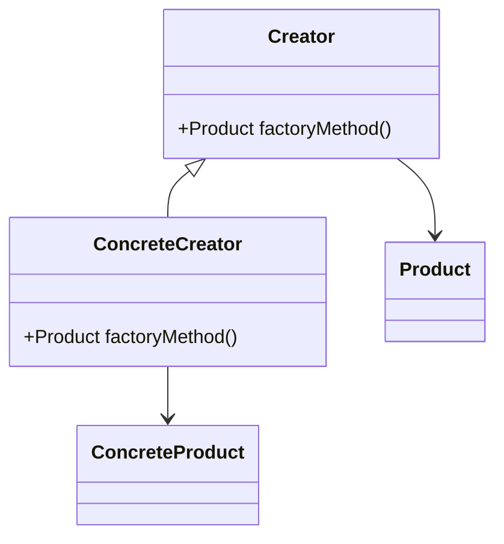
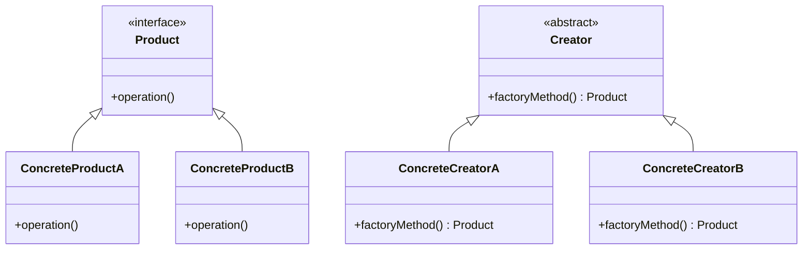
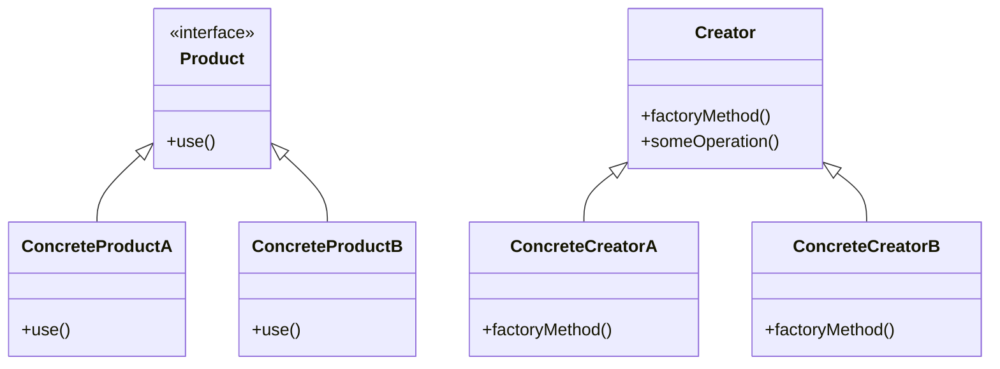
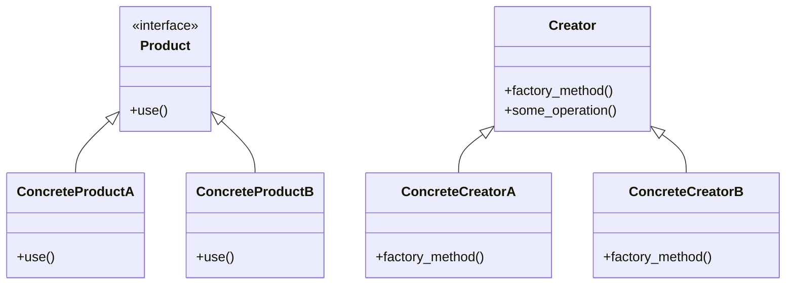
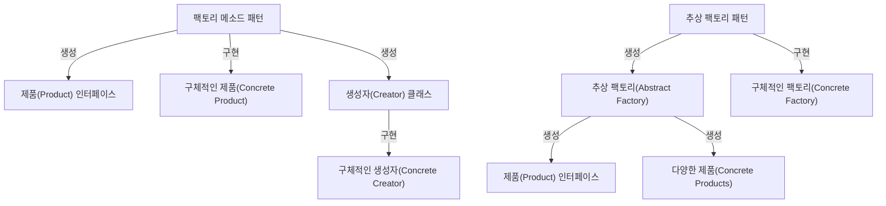
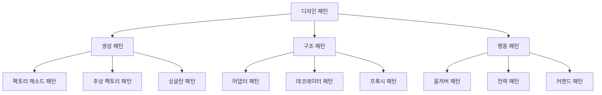
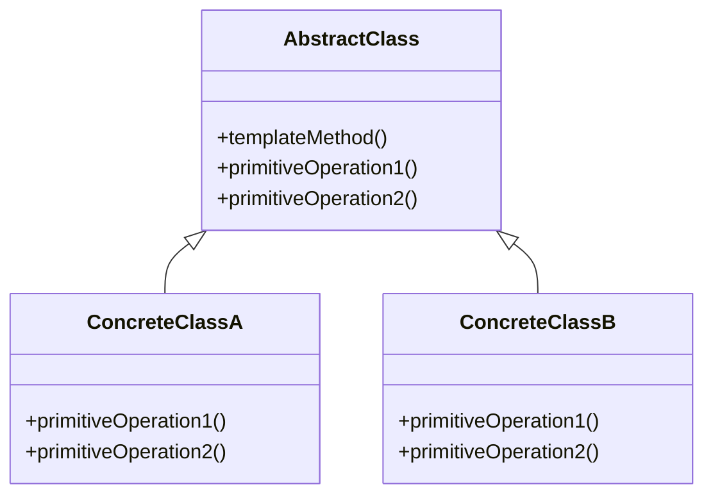
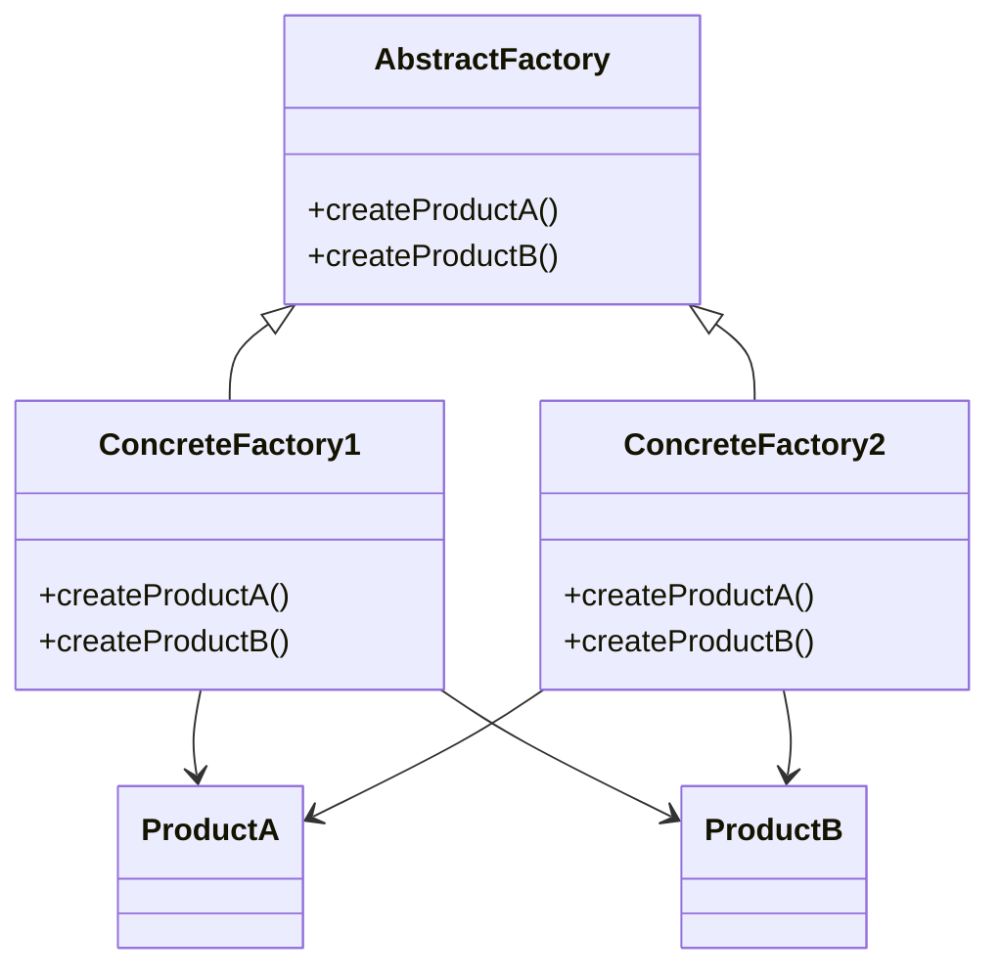
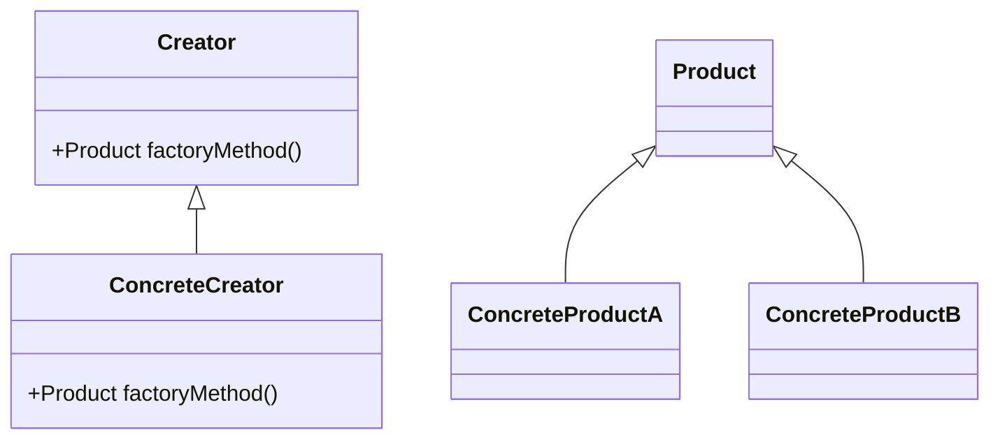

팩토리 메소드 패턴은 객체 지향 프로그래밍에서 객체 생성의 책임을 서브클래스에 위임하는 디자인 패턴이다. 이 패턴은 객체를 생성하는 인터페이스를 정의하되, 어떤 클래스의 인스턴스를 생성할지는 서브클래스에서 결정하도록 한다. 즉, 클라이언트는 구체적인 클래스에 의존하지 않고, 팩토리 메소드를 통해 객체를 생성하게 된다. 이로 인해 코드의 유연성과 확장성이 높아지며, 새로운 클래스가 추가되더라도 기존 코드를 수정할 필요가 없어진다. 팩토리 메소드 패턴은 23개의 디자인 패턴 중 하나로, 'Gang of Four'라는 책에서 소개되었다. 이 패턴은 객체 생성의 복잡성을 줄이고, 코드의 중복을 방지하며, 객체의 생성과 사용을 분리하여 코드의 가독성과 유지보수성을 향상시킨다. 또한, 이 패턴은 의존성 역전 원칙(Dependency Inversion Principle)과 개방-폐쇄 원칙(Open/Closed Principle)을 준수하여, 소프트웨어의 구조를 더욱 견고하게 만든다. 팩토리 메소드 패턴은 다양한 프로그래밍 언어에서 구현할 수 있으며, 자바, C#, 파이썬 등에서 널리 사용된다. 이 패턴을 통해 개발자는 객체 생성의 책임을 명확히 하고, 코드의 재사용성을 높일 수 있다.


||
|:---:|
||


<!--
##### Outline #####
-->

<!--
---
## 개요
**팩토리 메소드 패턴의 정의**  
**팩토리 메소드 패턴의 필요성**  
**팩토리 메소드 패턴의 장점**  

## 패턴의 구조
**팩토리 메소드 패턴의 구성 요소**  
**제품(Product) 인터페이스**  
**구체적인 제품(Concrete Product)**  
**생성자(Creator) 클래스**  
**구체적인 생성자(Concrete Creator)**  

## 패턴의 적용
**팩토리 메소드 패턴의 사용 사례**  
**팩토리 메소드 패턴의 예제**  
**팩토리 메소드 패턴의 장단점**  

## 예제
**C++ 예제 구현**  
**Java 예제 구현**  
**Python 예제 구현**  
**PHP 예제 구현**  

## FAQ
**팩토리 메소드 패턴과 추상 팩토리 패턴의 차이점은 무엇인가요?**  
**팩토리 메소드 패턴을 언제 사용해야 하나요?**  
**팩토리 메소드 패턴의 단점은 무엇인가요?**  

## 관련 기술
**디자인 패턴의 종류**  
**SOLID 원칙**  
**템플릿 메소드 패턴**  
**추상 팩토리 패턴**  

## 결론
**팩토리 메소드 패턴의 중요성**  
**팩토리 메소드 패턴의 미래**  
**디자인 패턴을 통한 소프트웨어 개발의 이점**  
---
-->

<!--
---
## 개요
**팩토리 메소드 패턴의 정의**  
**팩토리 메소드 패턴의 필요성**  
**팩토리 메소드 패턴의 장점**  
-->

## 개요

### 팩토리 메소드 패턴의 정의

팩토리 메소드 패턴은 객체 생성의 인터페이스를 정의하되, 어떤 클래스의 인스턴스를 생성할지는 서브클래스에서 결정하도록 하는 생성 패턴이다. 이 패턴은 객체 생성의 책임을 서브클래스에 위임함으로써, 코드의 유연성과 확장성을 높이는 데 기여한다. 즉, 클라이언트는 구체적인 클래스에 의존하지 않고, 인터페이스를 통해 객체를 생성할 수 있다.

다음은 팩토리 메소드 패턴의 구조를 나타내는 다이어그램이다.



### 팩토리 메소드 패턴의 필요성

팩토리 메소드 패턴은 다음과 같은 이유로 필요하다. 첫째, 객체 생성의 책임을 분리함으로써 코드의 결합도를 낮출 수 있다. 둘째, 새로운 제품을 추가할 때 기존 코드를 수정할 필요 없이 서브클래스를 통해 확장할 수 있다. 셋째, 클라이언트 코드가 구체적인 클래스에 의존하지 않기 때문에, 코드의 유지보수성이 향상된다. 이러한 특성 덕분에 대규모 소프트웨어 시스템에서 유용하게 사용된다.

### 팩토리 메소드 패턴의 장점

팩토리 메소드 패턴의 장점은 다음과 같다. 

1. **유연성**: 객체 생성 로직을 서브클래스에 위임함으로써, 클라이언트 코드의 변경 없이 새로운 제품을 추가할 수 있다.
2. **재사용성**: 공통된 인터페이스를 통해 다양한 제품을 생성할 수 있어 코드의 재사용성이 높아진다.
3. **결합도 감소**: 클라이언트는 구체적인 클래스에 의존하지 않기 때문에, 코드의 결합도가 낮아진다.
4. **유지보수 용이**: 새로운 제품을 추가하거나 기존 제품을 수정할 때, 기존 코드를 최소한으로 변경할 수 있어 유지보수가 용이하다.

이러한 장점들 덕분에 팩토리 메소드 패턴은 객체 생성에 대한 유연한 접근 방식을 제공하며, 소프트웨어 개발에서 널리 사용되고 있다.

<!--
## 패턴의 구조
**팩토리 메소드 패턴의 구성 요소**  
**제품(Product) 인터페이스**  
**구체적인 제품(Concrete Product)**  
**생성자(Creator) 클래스**  
**구체적인 생성자(Concrete Creator)**  
-->

## 패턴의 구조

팩토리 메소드 패턴은 객체 생성의 책임을 서브클래스에 위임하는 디자인 패턴이다. 이 패턴은 객체 생성의 복잡성을 줄이고, 코드의 유연성을 높이는 데 기여한다. 이번 섹션에서는 팩토리 메소드 패턴의 구성 요소에 대해 자세히 살펴보겠다.

### 팩토리 메소드 패턴의 구성 요소

팩토리 메소드 패턴은 주로 다음과 같은 구성 요소로 이루어져 있다.

1. **제품(Product) 인터페이스**: 생성될 객체의 공통 인터페이스를 정의한다. 이 인터페이스는 클라이언트가 사용할 수 있는 메소드를 포함한다.
   
2. **구체적인 제품(Concrete Product)**: 제품 인터페이스를 구현하는 클래스이다. 이 클래스는 실제로 생성될 객체의 구체적인 구현을 제공한다.

3. **생성자(Creator) 클래스**: 제품 객체를 생성하는 메소드를 정의하는 클래스이다. 이 클래스는 팩토리 메소드를 선언하고, 서브클래스에서 이 메소드를 구현하도록 한다.

4. **구체적인 생성자(Concrete Creator)**: 생성자 클래스를 상속받아, 팩토리 메소드를 구현하는 클래스이다. 이 클래스는 특정 제품 객체를 생성하는 로직을 포함한다.

### 다이어그램

다음은 팩토리 메소드 패턴의 구조를 나타내는 다이어그램이다.



### 샘플 코드

다음은 팩토리 메소드 패턴을 구현한 간단한 C++ 예제이다.

```cpp
#include <iostream>
using namespace std;

// 제품 인터페이스
class Product {
public:
    virtual void operation() = 0;
};

// 구체적인 제품 A
class ConcreteProductA : public Product {
public:
    void operation() override {
        cout << "ConcreteProductA operation" << endl;
    }
};

// 구체적인 제품 B
class ConcreteProductB : public Product {
public:
    void operation() override {
        cout << "ConcreteProductB operation" << endl;
    }
};

// 생성자 클래스
class Creator {
public:
    virtual Product* factoryMethod() = 0;

    void someOperation() {
        Product* product = factoryMethod();
        product->operation();
        delete product;
    }
};

// 구체적인 생성자 A
class ConcreteCreatorA : public Creator {
public:
    Product* factoryMethod() override {
        return new ConcreteProductA();
    }
};

// 구체적인 생성자 B
class ConcreteCreatorB : public Creator {
public:
    Product* factoryMethod() override {
        return new ConcreteProductB();
    }
};

int main() {
    Creator* creatorA = new ConcreteCreatorA();
    creatorA->someOperation();
    delete creatorA;

    Creator* creatorB = new ConcreteCreatorB();
    creatorB->someOperation();
    delete creatorB;

    return 0;
}
```

위의 예제에서는 `Product` 인터페이스와 이를 구현한 `ConcreteProductA`, `ConcreteProductB` 클래스가 있다. `Creator` 클래스는 팩토리 메소드를 정의하고, 이를 상속받은 `ConcreteCreatorA`와 `ConcreteCreatorB` 클래스는 각각의 제품을 생성하는 로직을 구현한다. 이와 같은 구조를 통해 클라이언트는 구체적인 제품 클래스에 의존하지 않고, 제품을 생성할 수 있다.

<!--
## 패턴의 적용
**팩토리 메소드 패턴의 사용 사례**  
**팩토리 메소드 패턴의 예제**  
**팩토리 메소드 패턴의 장단점**  
-->

## 패턴의 적용

### 팩토리 메소드 패턴의 사용 사례

팩토리 메소드 패턴은 객체 생성의 책임을 서브클래스에 위임하는 디자인 패턴이다. 이 패턴은 다양한 상황에서 유용하게 사용될 수 있다. 예를 들어, GUI 라이브러리에서 다양한 버튼이나 창을 생성할 때, 각 플랫폼에 맞는 구체적인 객체를 생성하기 위해 팩토리 메소드 패턴을 사용할 수 있다. 또한, 데이터베이스 연결을 관리하는 경우에도, 다양한 데이터베이스에 맞는 연결 객체를 생성하는 데 이 패턴이 활용될 수 있다.

### 팩토리 메소드 패턴의 예제

다음은 팩토리 메소드 패턴을 사용하여 다양한 형태의 도형을 생성하는 간단한 예제이다. 이 예제에서는 `Shape`라는 인터페이스와 이를 구현하는 `Circle`과 `Square`라는 구체적인 제품 클래스를 정의하고, `ShapeFactory`라는 생성자 클래스를 통해 도형 객체를 생성한다.

```python
from abc import ABC, abstractmethod

# 제품 인터페이스
class Shape(ABC):
    @abstractmethod
    def draw(self):
        pass

# 구체적인 제품 클래스
class Circle(Shape):
    def draw(self):
        return "Circle drawn"

class Square(Shape):
    def draw(self):
        return "Square drawn"

# 생성자 클래스
class ShapeFactory(ABC):
    @abstractmethod
    def create_shape(self) -> Shape:
        pass

# 구체적인 생성자 클래스
class CircleFactory(ShapeFactory):
    def create_shape(self) -> Shape:
        return Circle()

class SquareFactory(ShapeFactory):
    def create_shape(self) -> Shape:
        return Square()

# 클라이언트 코드
def client_code(factory: ShapeFactory):
    shape = factory.create_shape()
    print(shape.draw())

# 사용 예
client_code(CircleFactory())  # Circle drawn
client_code(SquareFactory())  # Square drawn
```

위의 예제에서 `ShapeFactory`는 도형 객체를 생성하는 메소드를 정의하고, `CircleFactory`와 `SquareFactory`는 각각 원과 정사각형 객체를 생성하는 구체적인 생성자 클래스이다. 클라이언트 코드는 팩토리 클래스를 통해 도형 객체를 생성하고, 이를 사용하여 도형을 그리는 작업을 수행한다.

### 팩토리 메소드 패턴의 장단점

#### 장점
1. **유연성**: 객체 생성의 책임을 서브클래스에 위임함으로써, 새로운 제품을 추가할 때 기존 코드를 수정할 필요가 없다.
2. **코드의 재사용성**: 공통된 인터페이스를 통해 다양한 제품을 생성할 수 있어 코드의 재사용성이 높아진다.
3. **의존성 감소**: 클라이언트는 구체적인 클래스에 의존하지 않고, 인터페이스에 의존하게 되어 의존성이 줄어든다.

#### 단점
1. **복잡성 증가**: 팩토리 메소드 패턴을 사용하면 클래스의 수가 증가하게 되어 시스템의 복잡성이 증가할 수 있다.
2. **추가적인 코드**: 새로운 제품을 추가할 때마다 새로운 팩토리 클래스를 만들어야 하므로 코드가 늘어날 수 있다.

이와 같이 팩토리 메소드 패턴은 다양한 상황에서 유용하게 사용될 수 있으며, 장단점을 고려하여 적절히 활용하는 것이 중요하다.

<!--
## 예제
**C++ 예제 구현**  
**Java 예제 구현**  
**Python 예제 구현**  
**PHP 예제 구현**  
-->

## 예제

### C++ 예제 구현

C++에서 팩토리 메소드 패턴을 구현하는 방법을 살펴보자. 아래의 예제에서는 `Product` 인터페이스와 이를 구현하는 `ConcreteProductA`, `ConcreteProductB` 클래스를 정의하고, `Creator` 클래스에서 팩토리 메소드를 통해 객체를 생성하는 구조를 보여준다.

```cpp
#include <iostream>
#include <memory>

// Product 인터페이스
class Product {
public:
    virtual void use() = 0;
};

// 구체적인 제품 A
class ConcreteProductA : public Product {
public:
    void use() override {
        std::cout << "Using ConcreteProductA" << std::endl;
    }
};

// 구체적인 제품 B
class ConcreteProductB : public Product {
public:
    void use() override {
        std::cout << "Using ConcreteProductB" << std::endl;
    }
};

// Creator 클래스
class Creator {
public:
    virtual std::unique_ptr<Product> factoryMethod() = 0;

    void someOperation() {
        auto product = factoryMethod();
        product->use();
    }
};

// 구체적인 생성자 A
class ConcreteCreatorA : public Creator {
public:
    std::unique_ptr<Product> factoryMethod() override {
        return std::make_unique<ConcreteProductA>();
    }
};

// 구체적인 생성자 B
class ConcreteCreatorB : public Creator {
public:
    std::unique_ptr<Product> factoryMethod() override {
        return std::make_unique<ConcreteProductB>();
    }
};

int main() {
    Creator* creatorA = new ConcreteCreatorA();
    creatorA->someOperation();

    Creator* creatorB = new ConcreteCreatorB();
    creatorB->someOperation();

    delete creatorA;
    delete creatorB;

    return 0;
}
```



### Java 예제 구현

Java에서도 유사한 방식으로 팩토리 메소드 패턴을 구현할 수 있다. 아래의 예제는 C++ 예제와 유사한 구조를 가지고 있다.

```java
// Product 인터페이스
interface Product {
    void use();
}

// 구체적인 제품 A
class ConcreteProductA implements Product {
    public void use() {
        System.out.println("Using ConcreteProductA");
    }
}

// 구체적인 제품 B
class ConcreteProductB implements Product {
    public void use() {
        System.out.println("Using ConcreteProductB");
    }
}

// Creator 클래스
abstract class Creator {
    public abstract Product factoryMethod();

    public void someOperation() {
        Product product = factoryMethod();
        product.use();
    }
}

// 구체적인 생성자 A
class ConcreteCreatorA extends Creator {
    public Product factoryMethod() {
        return new ConcreteProductA();
    }
}

// 구체적인 생성자 B
class ConcreteCreatorB extends Creator {
    public Product factoryMethod() {
        return new ConcreteProductB();
    }
}

public class Main {
    public static void main(String[] args) {
        Creator creatorA = new ConcreteCreatorA();
        creatorA.someOperation();

        Creator creatorB = new ConcreteCreatorB();
        creatorB.someOperation();
    }
}
```


### Python 예제 구현

Python에서도 팩토리 메소드 패턴을 간단하게 구현할 수 있다. 아래의 예제는 Python의 동적 타이핑을 활용하여 작성되었다.

```python
from abc import ABC, abstractmethod

# Product 인터페이스
class Product(ABC):
    @abstractmethod
    def use(self):
        pass

# 구체적인 제품 A
class ConcreteProductA(Product):
    def use(self):
        print("Using ConcreteProductA")

# 구체적인 제품 B
class ConcreteProductB(Product):
    def use(self):
        print("Using ConcreteProductB")

# Creator 클래스
class Creator(ABC):
    @abstractmethod
    def factory_method(self):
        pass

    def some_operation(self):
        product = self.factory_method()
        product.use()

# 구체적인 생성자 A
class ConcreteCreatorA(Creator):
    def factory_method(self):
        return ConcreteProductA()

# 구체적인 생성자 B
class ConcreteCreatorB(Creator):
    def factory_method(self):
        return ConcreteProductB()

if __name__ == "__main__":
    creator_a = ConcreteCreatorA()
    creator_a.some_operation()

    creator_b = ConcreteCreatorB()
    creator_b.some_operation()
```



### PHP 예제 구현

PHP에서도 팩토리 메소드 패턴을 쉽게 구현할 수 있다. 아래의 예제는 PHP의 클래스와 인터페이스를 활용하여 작성되었다.

```php
<?php

// Product 인터페이스
interface Product {
    public function use();
}

// 구체적인 제품 A
class ConcreteProductA implements Product {
    public function use() {
        echo "Using ConcreteProductA\n";
    }
}

// 구체적인 제품 B
class ConcreteProductB implements Product {
    public function use() {
        echo "Using ConcreteProductB\n";
    }
}

// Creator 클래스
abstract class Creator {
    abstract public function factoryMethod();

    public function someOperation() {
        $product = $this->factoryMethod();
        $product->use();
    }
}

// 구체적인 생성자 A
class ConcreteCreatorA extends Creator {
    public function factoryMethod() {
        return new ConcreteProductA();
    }
}

// 구체적인 생성자 B
class ConcreteCreatorB extends Creator {
    public function factoryMethod() {
        return new ConcreteProductB();
    }
}

// 사용 예
$creatorA = new ConcreteCreatorA();
$creatorA->someOperation();

$creatorB = new ConcreteCreatorB();
$creatorB->someOperation();

?>
```


위의 예제들은 각각의 언어에서 팩토리 메소드 패턴을 어떻게 구현할 수 있는지를 보여준다. 각 언어의 문법적 특성을 반영하여 작성되었으며, 패턴의 구조와 흐름을 이해하는 데 도움이 될 것이다.

<!--
## FAQ
**팩토리 메소드 패턴과 추상 팩토리 패턴의 차이점은 무엇인가요?**  
**팩토리 메소드 패턴을 언제 사용해야 하나요?**  
**팩토리 메소드 패턴의 단점은 무엇인가요?**  
-->

## FAQ

### 팩토리 메소드 패턴과 추상 팩토리 패턴의 차이점은 무엇인가요?

팩토리 메소드 패턴과 추상 팩토리 패턴은 모두 객체 생성에 관련된 디자인 패턴이지만, 그 사용 목적과 구조에서 차이가 있다. 

팩토리 메소드 패턴은 특정 제품을 생성하기 위한 인터페이스를 정의하고, 서브클래스에서 그 제품을 생성하는 방법을 결정하는 패턴이다. 즉, 팩토리 메소드 패턴은 하나의 제품 계열에 대한 객체를 생성하는 데 중점을 둔다.

반면, 추상 팩토리 패턴은 관련된 여러 제품군을 생성하기 위한 인터페이스를 제공한다. 이 패턴은 서로 관련된 여러 제품을 동시에 생성할 수 있도록 설계되어 있다. 따라서, 추상 팩토리 패턴은 여러 제품 계열을 다룰 때 유용하다.

아래는 두 패턴의 구조를 비교한 다이어그램이다.



### 팩토리 메소드 패턴을 언제 사용해야 하나요?

팩토리 메소드 패턴은 다음과 같은 상황에서 사용해야 한다. 

1. **객체 생성의 책임을 서브클래스에 위임하고 싶을 때**: 객체 생성 로직을 서브클래스에 맡김으로써, 코드의 유연성과 확장성을 높일 수 있다.
  
2. **클라이언트 코드와 구체적인 클래스 간의 결합도를 낮추고 싶을 때**: 클라이언트는 팩토리 메소드를 통해 객체를 생성하므로, 구체적인 클래스에 대한 의존성을 줄일 수 있다.

3. **객체 생성 과정이 복잡할 때**: 객체 생성 과정이 복잡하거나 다양한 조건에 따라 다르게 생성해야 할 경우, 팩토리 메소드를 사용하여 이를 간소화할 수 있다.

### 팩토리 메소드 패턴의 단점은 무엇인가요?

팩토리 메소드 패턴의 단점은 다음과 같다.

1. **클래스 수의 증가**: 팩토리 메소드 패턴을 사용하면 생성자와 제품 클래스가 추가로 필요하므로, 클래스 수가 증가하게 된다. 이는 코드의 복잡성을 높일 수 있다.

2. **디버깅의 어려움**: 객체 생성 과정이 여러 단계로 나뉘어져 있기 때문에, 디버깅 시 어떤 클래스에서 문제가 발생했는지 파악하기 어려울 수 있다.

3. **구현의 복잡성**: 간단한 객체 생성에는 오히려 불필요한 복잡성을 초래할 수 있다. 따라서, 간단한 객체 생성에는 팩토리 메소드 패턴을 사용하는 것이 적합하지 않을 수 있다.

이와 같은 장단점을 고려하여 팩토리 메소드 패턴을 적절히 활용하는 것이 중요하다.

<!--
## 관련 기술
**디자인 패턴의 종류**  
**SOLID 원칙**  
**템플릿 메소드 패턴**  
**추상 팩토리 패턴**  
-->

## 관련 기술

### 디자인 패턴의 종류
디자인 패턴은 소프트웨어 설계에서 자주 발생하는 문제를 해결하기 위한 일반적인 솔루션이다. 디자인 패턴은 크게 생성 패턴, 구조 패턴, 행동 패턴으로 나눌 수 있다. 생성 패턴은 객체 생성과 관련된 패턴으로, 팩토리 메소드 패턴, 추상 팩토리 패턴, 싱글턴 패턴 등이 있다. 구조 패턴은 클래스나 객체의 조합을 다루며, 어댑터 패턴, 데코레이터 패턴, 프록시 패턴 등이 포함된다. 마지막으로 행동 패턴은 객체 간의 상호작용을 다루며, 옵저버 패턴, 전략 패턴, 커맨드 패턴 등이 있다.



### SOLID 원칙
SOLID 원칙은 객체 지향 프로그래밍에서 소프트웨어 설계를 개선하기 위한 다섯 가지 원칙을 의미한다. 이 원칙들은 다음과 같다:

1. **단일 책임 원칙 (Single Responsibility Principle)**: 클래스는 하나의 책임만 가져야 하며, 그 책임을 완수하는 데 필요한 모든 기능을 포함해야 한다.
2. **개방-폐쇄 원칙 (Open/Closed Principle)**: 소프트웨어 개체는 확장에는 열려 있어야 하고, 수정에는 닫혀 있어야 한다.
3. **리스코프 치환 원칙 (Liskov Substitution Principle)**: 자식 클래스는 부모 클래스를 대체할 수 있어야 하며, 부모 클래스의 기능을 손상시키지 않아야 한다.
4. **인터페이스 분리 원칙 (Interface Segregation Principle)**: 클라이언트는 자신이 사용하지 않는 인터페이스에 의존하지 않아야 한다.
5. **의존 역전 원칙 (Dependency Inversion Principle)**: 고수준 모듈은 저수준 모듈에 의존해서는 안 되며, 둘 다 추상화에 의존해야 한다.

이 원칙들은 소프트웨어의 유지보수성과 확장성을 높이는 데 기여한다.

### 템플릿 메소드 패턴
템플릿 메소드 패턴은 알고리즘의 구조를 정의하고, 그 알고리즘의 일부 단계를 서브클래스에서 구현하도록 하는 패턴이다. 이 패턴은 코드의 중복을 줄이고, 알고리즘의 일관성을 유지하는 데 유용하다. 템플릿 메소드 패턴은 추상 클래스에서 템플릿 메소드를 정의하고, 서브클래스에서 구체적인 구현을 제공하는 방식으로 작동한다.



### 추상 팩토리 패턴
추상 팩토리 패턴은 관련된 객체들의 집합을 생성하기 위한 인터페이스를 제공하는 패턴이다. 이 패턴은 구체적인 클래스에 의존하지 않고, 클라이언트가 객체를 생성할 수 있도록 한다. 추상 팩토리 패턴은 다양한 제품군을 생성할 수 있는 유연성을 제공하며, 제품군 간의 일관성을 유지하는 데 유리하다.



이와 같이 관련 기술들은 소프트웨어 설계와 개발에 있어 중요한 역할을 하며, 각 패턴과 원칙을 이해하고 활용하는 것은 더 나은 소프트웨어를 만드는 데 기여한다.

<!--
## 결론
**팩토리 메소드 패턴의 중요성**  
**팩토리 메소드 패턴의 미래**  
**디자인 패턴을 통한 소프트웨어 개발의 이점**  
---
-->

## 결론

### 팩토리 메소드 패턴의 중요성

팩토리 메소드 패턴은 객체 생성의 책임을 서브클래스에 위임함으로써 코드의 유연성과 확장성을 높이는 데 중요한 역할을 한다. 이 패턴을 사용하면 클라이언트 코드가 구체적인 클래스에 의존하지 않게 되어, 새로운 제품을 추가할 때 기존 코드를 수정할 필요가 없어진다. 이는 유지보수성을 크게 향상시키며, 코드의 재사용성을 높이는 데 기여한다. 또한, 객체 생성 로직을 캡슐화하여 코드의 가독성을 높이고, 테스트 용이성을 증가시킨다.

### 팩토리 메소드 패턴의 미래

소프트웨어 개발의 복잡성이 증가함에 따라, 팩토리 메소드 패턴과 같은 디자인 패턴의 중요성은 더욱 커질 것으로 예상된다. 특히, 마이크로서비스 아키텍처와 같은 현대적인 개발 환경에서는 다양한 객체를 효율적으로 생성하고 관리하는 것이 필수적이다. 팩토리 메소드 패턴은 이러한 환경에서 객체 생성의 일관성을 유지하고, 서비스 간의 결합도를 낮추는 데 유용하게 사용될 것이다. 또한, 인공지능과 머신러닝의 발전으로 인해 다양한 객체를 동적으로 생성해야 하는 상황이 많아질 것이므로, 이 패턴의 활용 가능성은 더욱 높아질 것이다.

### 디자인 패턴을 통한 소프트웨어 개발의 이점

디자인 패턴은 소프트웨어 개발에서 반복적으로 발생하는 문제를 해결하기 위한 일반적인 솔루션을 제공한다. 이를 통해 개발자는 이미 검증된 방법론을 활용하여 코드의 품질을 높일 수 있다. 디자인 패턴을 사용하면 다음과 같은 이점이 있다:

1. **코드의 재사용성**: 디자인 패턴은 특정 문제를 해결하기 위한 일반적인 구조를 제공하므로, 이를 재사용하여 새로운 기능을 쉽게 추가할 수 있다.
2. **유지보수성 향상**: 패턴을 사용하면 코드의 구조가 명확해져, 유지보수가 용이해진다. 또한, 패턴의 사용으로 인해 코드의 변경이 다른 부분에 미치는 영향을 최소화할 수 있다.
3. **팀 간의 의사소통 개선**: 디자인 패턴은 공통의 언어를 제공하므로, 팀원 간의 의사소통이 원활해진다. 이는 협업을 더욱 효율적으로 만들어준다.

다음은 팩토리 메소드 패턴의 구조를 나타내는 다이어그램이다:



위의 다이어그램은 팩토리 메소드 패턴의 기본 구조를 보여준다. `Creator` 클래스는 `factoryMethod()`를 정의하고, 이를 상속받은 `ConcreteCreator` 클래스가 구체적인 제품을 생성한다. `Product` 인터페이스는 다양한 구체적인 제품 클래스(`ConcreteProductA`, `ConcreteProductB`)에 의해 구현된다. 이러한 구조는 객체 생성의 유연성을 제공하며, 새로운 제품을 추가할 때 기존 코드를 수정할 필요가 없도록 한다. 

결론적으로, 팩토리 메소드 패턴은 소프트웨어 개발에서 중요한 역할을 하며, 앞으로도 그 중요성은 계속해서 증가할 것이다. 디자인 패턴을 활용함으로써 개발자는 더 나은 품질의 소프트웨어를 만들 수 있다.

<!--
##### Reference #####
-->

## Reference


* [https://en.wikipedia.org/wiki/Factory_method_pattern](https://en.wikipedia.org/wiki/Factory_method_pattern)
* [https://refactoring.guru/design-patterns/factory-method](https://refactoring.guru/design-patterns/factory-method)
* [https://velog.io/@chojs28/Factory-Method-%ED%8C%A9%ED%86%A0%EB%A6%AC-%EB%A9%94%EC%84%9C%EB%93%9C](https://velog.io/@chojs28/Factory-Method-%ED%8C%A9%ED%86%A0%EB%A6%AC-%EB%A9%94%EC%84%9C%EB%93%9C)
* [https://readystory.tistory.com/117](https://readystory.tistory.com/117)
* [https://gdtbgl93.tistory.com/19](https://gdtbgl93.tistory.com/19)
* [https://inpa.tistory.com/entry/GOF-%F0%9F%92%A0-%ED%8C%A9%ED%86%A0%EB%A6%AC-%EB%A9%94%EC%84%9C%EB%93%9CFactory-Method-%ED%8C%A8%ED%84%B4-%EC%A0%9C%EB%8C%80%EB%A1%9C-%EB%B0%B0%EC%9B%8C%EB%B3%B4%EC%9E%90](https://inpa.tistory.com/entry/GOF-%F0%9F%92%A0-%ED%8C%A9%ED%86%A0%EB%A6%AC-%EB%A9%94%EC%84%9C%EB%93%9CFactory-Method-%ED%8C%A8%ED%84%B4-%EC%A0%9C%EB%8C%80%EB%A1%9C-%EB%B0%B0%EC%9B%8C%EB%B3%B4%EC%9E%90)

