팩토리 메소드 패턴은 객체 지향 프로그래밍에서 객체 생성의 책임을 서브클래스에 위임하는 디자인 패턴이다. 이 패턴은 객체를 생성하는 인터페이스를 정의하되, 어떤 클래스의 인스턴스를 생성할지는 서브클래스에서 결정하도록 한다. 즉, 클라이언트는 구체적인 클래스에 의존하지 않고, 팩토리 메소드를 통해 객체를 생성하게 된다. 이로 인해 코드의 유연성과 확장성이 높아지며, 새로운 클래스가 추가되더라도 기존 코드를 수정할 필요가 없게 된다. 팩토리 메소드 패턴은 23개의 디자인 패턴 중 하나로, 'Gang of Four'라는 책에서 소개되었다. 이 패턴은 객체 생성의 복잡성을 줄이고, 코드의 중복을 방지하며, 객체의 생성과 사용을 분리하는 데 도움을 준다. 또한, 이 패턴은 의존성 역전 원칙과 개방-폐쇄 원칙을 준수하여, 소프트웨어의 유지보수성과 확장성을 높이는 데 기여한다. 팩토리 메소드 패턴을 활용하면, 다양한 객체를 생성하는 데 필요한 로직을 중앙 집중화할 수 있으며, 클라이언트 코드가 구체적인 클래스에 의존하지 않도록 하여, 코드의 결합도를 낮출 수 있다. 이러한 특성 덕분에 팩토리 메소드 패턴은 소프트웨어 개발에서 널리 사용되고 있으며, 다양한 프로그래밍 언어에서 구현할 수 있다.

||
|:---:|
||


<!--
##### Outline #####
-->

<!--
## 개요
**팩토리 메소드 패턴의 정의**  
**팩토리 메소드 패턴의 필요성**  
**팩토리 메소드 패턴의 장점**  

## 디자인 패턴의 기본 개념
**객체 지향 프로그래밍의 원칙**  
**디자인 패턴의 분류**  
**생성 패턴의 중요성**  

## 팩토리 메소드 패턴의 구조
**팩토리 메소드 패턴의 구성 요소**  
**제품(Product)과 구체적인 제품(Concrete Product)**  
**생성자(Creator)와 구체적인 생성자(Concrete Creator)**  

## 팩토리 메소드 패턴의 적용 사례
**C++ 예제**  
**Java 예제**  
**C# 예제**  
**PHP 예제**  
**Python 예제**  

## 팩토리 메소드 패턴의 장단점
**장점**  
**단점**  

## FAQ
**팩토리 메소드 패턴과 추상 팩토리 패턴의 차이점은 무엇인가요?**  
**팩토리 메소드 패턴을 언제 사용해야 하나요?**  
**팩토리 메소드 패턴의 단점은 무엇인가요?**  

## 관련 기술
**템플릿 메소드 패턴**  
**추상 팩토리 패턴**  
**프로토타입 패턴**  
**빌더 패턴**  

## 결론
**팩토리 메소드 패턴의 중요성**  
**미래의 객체 생성 방식**  
**디자인 패턴의 지속적인 발전**  
-->

<!--
## 개요
**팩토리 메소드 패턴의 정의**  
**팩토리 메소드 패턴의 필요성**  
**팩토리 메소드 패턴의 장점**  
-->

## 개요

### 팩토리 메소드 패턴의 정의

팩토리 메소드 패턴은 객체 생성의 인터페이스를 정의하되, 어떤 클래스의 인스턴스를 만들지는 서브클래스에서 결정하도록 하는 생성 패턴이다. 이 패턴은 객체 생성의 책임을 서브클래스에 위임함으로써, 코드의 유연성과 확장성을 높이는 데 기여한다. 즉, 클라이언트는 구체적인 클래스에 의존하지 않고, 인터페이스를 통해 객체를 생성할 수 있다.

다음은 팩토리 메소드 패턴의 구조를 나타내는 다이어그램이다.

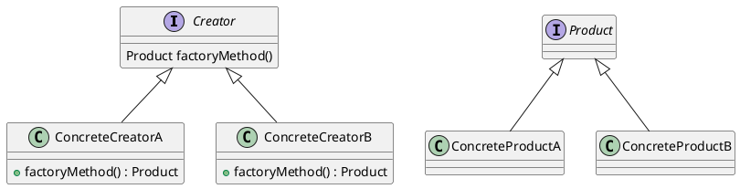

### 팩토리 메소드 패턴의 필요성

팩토리 메소드 패턴은 다음과 같은 이유로 필요하다. 첫째, 객체 생성의 책임을 분리함으로써 코드의 결합도를 낮출 수 있다. 둘째, 새로운 제품을 추가할 때 기존 코드를 수정하지 않고도 새로운 서브클래스를 추가함으로써 확장할 수 있다. 셋째, 클라이언트 코드가 구체적인 클래스에 의존하지 않기 때문에, 코드의 유지보수성이 향상된다. 이러한 특성 덕분에 대규모 시스템에서의 객체 생성 관리가 용이해진다.

### 팩토리 메소드 패턴의 장점

팩토리 메소드 패턴의 장점은 다음과 같다.

1. **유연성**: 객체 생성의 책임을 서브클래스에 위임함으로써, 클라이언트 코드가 구체적인 클래스에 의존하지 않게 된다. 이는 코드의 유연성을 높인다.
   
2. **확장성**: 새로운 제품을 추가할 때 기존 코드를 수정할 필요가 없으므로, 시스템의 확장성이 뛰어나다. 새로운 서브클래스를 추가하는 것만으로도 새로운 기능을 쉽게 구현할 수 있다.

3. **유지보수성**: 객체 생성 로직이 분리되어 있기 때문에, 코드의 유지보수가 용이하다. 객체 생성 방식이 변경되더라도 클라이언트 코드에 영향을 주지 않는다.

4. **일관성**: 객체 생성의 일관성을 유지할 수 있다. 모든 객체 생성이 팩토리 메소드를 통해 이루어지므로, 객체 생성 방식이 통일된다.

이와 같은 장점들 덕분에 팩토리 메소드 패턴은 객체 지향 프로그래밍에서 널리 사용되는 디자인 패턴 중 하나이다.

<!--
## 디자인 패턴의 기본 개념
**객체 지향 프로그래밍의 원칙**  
**디자인 패턴의 분류**  
**생성 패턴의 중요성**  
-->

## 디자인 패턴의 기본 개념

### 객체 지향 프로그래밍의 원칙

객체 지향 프로그래밍(OOP)은 소프트웨어 설계 및 개발에 있어 중요한 원칙들을 기반으로 한다. 이러한 원칙들은 코드의 재사용성, 유지보수성, 확장성을 높이는 데 기여한다. 주요 원칙으로는 다음과 같은 것들이 있다.

1. **캡슐화(Encapsulation)**: 객체의 상태를 외부에서 직접 접근하지 못하도록 숨기고, 필요한 메소드를 통해서만 접근할 수 있도록 하는 원칙이다. 이를 통해 데이터의 무결성을 유지할 수 있다.

2. **상속(Inheritance)**: 기존 클래스의 속성과 메소드를 새로운 클래스가 물려받는 기능이다. 이를 통해 코드의 중복을 줄이고, 계층적인 관계를 형성할 수 있다.

3. **다형성(Polymorphism)**: 동일한 인터페이스를 통해 서로 다른 객체를 다룰 수 있는 능력이다. 이는 코드의 유연성을 높이고, 다양한 객체를 일관된 방식으로 처리할 수 있게 한다.

이러한 원칙들은 디자인 패턴을 이해하고 적용하는 데 중요한 기초가 된다.

### 디자인 패턴의 분류

디자인 패턴은 일반적으로 세 가지 주요 카테고리로 분류된다.

1. **생성 패턴(Creational Patterns)**: 객체 생성과 관련된 패턴으로, 객체의 생성 과정을 추상화하여 클라이언트 코드와의 결합도를 낮춘다. 예를 들어, 팩토리 메소드 패턴, 추상 팩토리 패턴, 싱글턴 패턴 등이 있다.

2. **구조 패턴(Structural Patterns)**: 클래스나 객체의 조합을 통해 더 큰 구조를 형성하는 패턴이다. 이 패턴들은 객체 간의 관계를 정의하고, 복잡한 구조를 단순화하는 데 도움을 준다. 예를 들어, 어댑터 패턴, 데코레이터 패턴, 프록시 패턴 등이 있다.

3. **행위 패턴(Behavioral Patterns)**: 객체 간의 상호작용과 책임 분배를 정의하는 패턴이다. 이 패턴들은 객체 간의 통신을 효율적으로 관리하고, 복잡한 로직을 단순화하는 데 기여한다. 예를 들어, 옵저버 패턴, 전략 패턴, 커맨드 패턴 등이 있다.

### 생성 패턴의 중요성

생성 패턴은 객체 생성의 복잡성을 줄이고, 코드의 유연성을 높이는 데 중요한 역할을 한다. 객체를 생성하는 방법을 캡슐화함으로써, 클라이언트 코드가 객체 생성 방식에 의존하지 않도록 한다. 이는 코드의 유지보수성을 높이고, 새로운 객체 유형을 추가할 때 기존 코드를 수정할 필요가 없도록 한다.

예를 들어, 팩토리 메소드 패턴을 사용하면 객체 생성 로직을 별도의 클래스에 정의할 수 있다. 이를 통해 클라이언트는 객체 생성 방식에 대한 지식 없이도 객체를 사용할 수 있게 된다.

다음은 팩토리 메소드 패턴의 간단한 다이어그램이다.

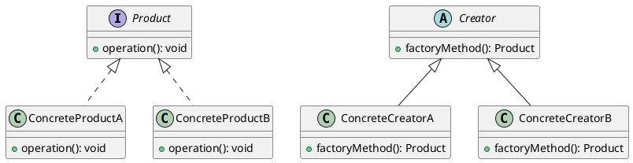

위의 다이어그램은 팩토리 메소드 패턴의 구조를 보여준다. `Creator` 클래스는 `factoryMethod`를 정의하고, 이를 상속받은 `ConcreteCreatorA`와 `ConcreteCreatorB` 클래스는 각각의 제품을 생성하는 방법을 구현한다. 이를 통해 클라이언트는 `Creator`를 통해 제품을 생성할 수 있으며, 구체적인 제품 클래스에 대한 의존성을 줄일 수 있다. 

이와 같이 디자인 패턴의 기본 개념을 이해하는 것은 소프트웨어 개발에 있어 매우 중요하다. 객체 지향 프로그래밍의 원칙을 바탕으로 디자인 패턴을 활용하면, 더 나은 소프트웨어 아키텍처를 구축할 수 있다.

<!--
## 팩토리 메소드 패턴의 구조
**팩토리 메소드 패턴의 구성 요소**  
**제품(Product)과 구체적인 제품(Concrete Product)**  
**생성자(Creator)와 구체적인 생성자(Concrete Creator)**  
-->

## 팩토리 메소드 패턴의 구조

팩토리 메소드 패턴은 객체 생성의 책임을 서브클래스에 위임하는 디자인 패턴이다. 이 패턴은 객체 생성의 구체적인 클래스를 지정하지 않고, 인터페이스를 통해 객체를 생성하는 방법을 제공한다. 이를 통해 코드의 유연성과 확장성을 높일 수 있다. 이제 팩토리 메소드 패턴의 구성 요소에 대해 살펴보겠다.

### 팩토리 메소드 패턴의 구성 요소

팩토리 메소드 패턴은 주로 다음과 같은 구성 요소로 이루어져 있다.

1. **제품(Product)**: 생성될 객체의 인터페이스 또는 추상 클래스이다. 이 인터페이스는 구체적인 제품이 구현해야 하는 메소드를 정의한다.
   
2. **구체적인 제품(Concrete Product)**: 제품 인터페이스를 구현한 클래스이다. 이 클래스는 실제로 생성될 객체의 구체적인 구현을 제공한다.

3. **생성자(Creator)**: 제품 객체를 생성하는 메소드를 정의하는 클래스이다. 이 클래스는 팩토리 메소드를 선언하고, 기본적으로는 `null`을 반환하는 메소드를 제공한다.

4. **구체적인 생성자(Concrete Creator)**: 생성자 클래스를 상속받아, 팩토리 메소드를 구현하여 구체적인 제품 객체를 생성하는 클래스이다.

이러한 구성 요소들은 서로 협력하여 객체를 생성하는 역할을 수행한다.

### 제품(Product)과 구체적인 제품(Concrete Product)

제품(Product) 인터페이스는 다양한 구체적인 제품들이 공통적으로 가져야 할 메소드를 정의한다. 예를 들어, 자동차를 생성하는 경우 `Car`라는 인터페이스를 정의할 수 있다. 이 인터페이스는 `drive()`와 같은 메소드를 포함할 수 있다.

구체적인 제품(Concrete Product)은 이 인터페이스를 구현하여 실제로 사용될 객체를 정의한다. 예를 들어, `Sedan`과 `SUV`라는 두 개의 클래스가 `Car` 인터페이스를 구현할 수 있다. 이 클래스들은 각각의 방식으로 `drive()` 메소드를 구현하여 서로 다른 동작을 수행할 수 있다.

```java
// 제품 인터페이스
public interface Car {
    void drive();
}

// 구체적인 제품 클래스
public class Sedan implements Car {
    @Override
    public void drive() {
        System.out.println("Sedan is driving.");
    }
}

public class SUV implements Car {
    @Override
    public void drive() {
        System.out.println("SUV is driving.");
    }
}
```

### 생성자(Creator)와 구체적인 생성자(Concrete Creator)

생성자(Creator) 클래스는 제품 객체를 생성하는 메소드를 정의한다. 이 클래스는 팩토리 메소드를 선언하고, 기본적으로는 `null`을 반환하는 메소드를 제공한다. 구체적인 생성자(Concrete Creator) 클래스는 이 메소드를 오버라이드하여 실제 제품 객체를 생성하는 역할을 한다.

```java
// 생성자 클래스
public abstract class CarCreator {
    public abstract Car createCar();
}

// 구체적인 생성자 클래스
public class SedanCreator extends CarCreator {
    @Override
    public Car createCar() {
        return new Sedan();
    }
}

public class SUVCreator extends CarCreator {
    @Override
    public Car createCar() {
        return new SUV();
    }
}
```

### 다이어그램

다음은 팩토리 메소드 패턴의 구조를 나타내는 다이어그램이다. 이 다이어그램은 각 구성 요소 간의 관계를 시각적으로 표현한다.

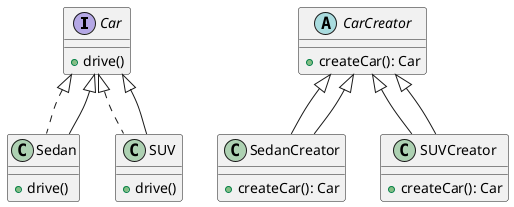

이와 같이 팩토리 메소드 패턴은 객체 생성의 책임을 분리하여 코드의 유연성과 확장성을 높이는 데 기여한다. 각 구성 요소는 명확한 역할을 가지고 있으며, 이를 통해 새로운 제품을 추가할 때 기존 코드를 수정하지 않고도 쉽게 확장할 수 있다.

<!--
## 팩토리 메소드 패턴의 적용 사례
**C++ 예제**  
**Java 예제**  
**C# 예제**  
**PHP 예제**  
**Python 예제**  
-->

## 팩토리 메소드 패턴의 적용 사례

팩토리 메소드 패턴은 다양한 프로그래밍 언어에서 객체 생성의 유연성을 제공하기 위해 널리 사용된다. 이번 섹션에서는 C++, Java, C#, PHP, Python의 예제를 통해 팩토리 메소드 패턴이 어떻게 적용되는지를 살펴보겠다.

### C++ 예제

C++에서 팩토리 메소드 패턴을 구현하는 방법은 다음과 같다. 아래의 예제에서는 `Product`라는 추상 클래스와 이를 상속받는 `ConcreteProductA`와 `ConcreteProductB`를 정의하고, `Creator`라는 추상 클래스에서 팩토리 메소드를 선언한다.

```cpp
#include <iostream>
using namespace std;

// Product
class Product {
public:
    virtual void use() = 0;
};

// ConcreteProductA
class ConcreteProductA : public Product {
public:
    void use() override {
        cout << "Using ConcreteProductA" << endl;
    }
};

// ConcreteProductB
class ConcreteProductB : public Product {
public:
    void use() override {
        cout << "Using ConcreteProductB" << endl;
    }
};

// Creator
class Creator {
public:
    virtual Product* factoryMethod() = 0;

    void someOperation() {
        Product* product = factoryMethod();
        product->use();
    }
};

// ConcreteCreatorA
class ConcreteCreatorA : public Creator {
public:
    Product* factoryMethod() override {
        return new ConcreteProductA();
    }
};

// ConcreteCreatorB
class ConcreteCreatorB : public Creator {
public:
    Product* factoryMethod() override {
        return new ConcreteProductB();
    }
};

int main() {
    Creator* creatorA = new ConcreteCreatorA();
    creatorA->someOperation();

    Creator* creatorB = new ConcreteCreatorB();
    creatorB->someOperation();

    delete creatorA;
    delete creatorB;

    return 0;
}
```

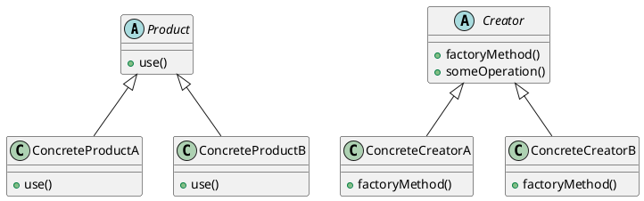

### Java 예제

Java에서도 유사한 방식으로 팩토리 메소드 패턴을 구현할 수 있다. 아래의 예제는 C++ 예제와 유사한 구조를 가지고 있다.

```java
// Product
interface Product {
    void use();
}

// ConcreteProductA
class ConcreteProductA implements Product {
    public void use() {
        System.out.println("Using ConcreteProductA");
    }
}

// ConcreteProductB
class ConcreteProductB implements Product {
    public void use() {
        System.out.println("Using ConcreteProductB");
    }
}

// Creator
abstract class Creator {
    public abstract Product factoryMethod();

    public void someOperation() {
        Product product = factoryMethod();
        product.use();
    }
}

// ConcreteCreatorA
class ConcreteCreatorA extends Creator {
    public Product factoryMethod() {
        return new ConcreteProductA();
    }
}

// ConcreteCreatorB
class ConcreteCreatorB extends Creator {
    public Product factoryMethod() {
        return new ConcreteProductB();
    }
}

public class Main {
    public static void main(String[] args) {
        Creator creatorA = new ConcreteCreatorA();
        creatorA.someOperation();

        Creator creatorB = new ConcreteCreatorB();
        creatorB.someOperation();
    }
}
```

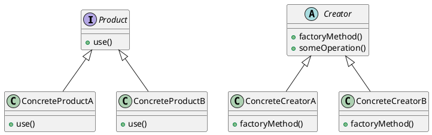

### C# 예제

C#에서도 팩토리 메소드 패턴을 쉽게 구현할 수 있다. 아래의 예제는 C++와 Java의 예제와 유사한 구조를 가지고 있다.

```csharp
// Product
public interface IProduct {
    void Use();
}

// ConcreteProductA
public class ConcreteProductA : IProduct {
    public void Use() {
        Console.WriteLine("Using ConcreteProductA");
    }
}

// ConcreteProductB
public class ConcreteProductB : IProduct {
    public void Use() {
        Console.WriteLine("Using ConcreteProductB");
    }
}

// Creator
public abstract class Creator {
    public abstract IProduct FactoryMethod();

    public void SomeOperation() {
        IProduct product = FactoryMethod();
        product.Use();
    }
}

// ConcreteCreatorA
public class ConcreteCreatorA : Creator {
    public override IProduct FactoryMethod() {
        return new ConcreteProductA();
    }
}

// ConcreteCreatorB
public class ConcreteCreatorB : Creator {
    public override IProduct FactoryMethod() {
        return new ConcreteProductB();
    }
}

class Program {
    static void Main() {
        Creator creatorA = new ConcreteCreatorA();
        creatorA.SomeOperation();

        Creator creatorB = new ConcreteCreatorB();
        creatorB.SomeOperation();
    }
}
```

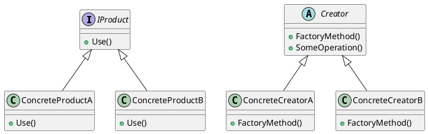

### PHP 예제

PHP에서도 팩토리 메소드 패턴을 쉽게 구현할 수 있다. 아래의 예제는 다른 언어와 유사한 구조를 가지고 있다.

```php
<?php

// Product
interface Product {
    public function use();
}

// ConcreteProductA
class ConcreteProductA implements Product {
    public function use() {
        echo "Using ConcreteProductA\n";
    }
}

// ConcreteProductB
class ConcreteProductB implements Product {
    public function use() {
        echo "Using ConcreteProductB\n";
    }
}

// Creator
abstract class Creator {
    abstract public function factoryMethod();

    public function someOperation() {
        $product = $this->factoryMethod();
        $product->use();
    }
}

// ConcreteCreatorA
class ConcreteCreatorA extends Creator {
    public function factoryMethod() {
        return new ConcreteProductA();
    }
}

// ConcreteCreatorB
class ConcreteCreatorB extends Creator {
    public function factoryMethod() {
        return new ConcreteProductB();
    }
}

$creatorA = new ConcreteCreatorA();
$creatorA->someOperation();

$creatorB = new ConcreteCreatorB();
$creatorB->someOperation();

?>
```


### Python 예제

Python에서도 팩토리 메소드 패턴을 쉽게 구현할 수 있다. 아래의 예제는 다른 언어와 유사한 구조를 가지고 있다.

```python
from abc import ABC, abstractmethod

# Product
class Product(ABC):
    @abstractmethod
    def use(self):
        pass

# ConcreteProductA
class ConcreteProductA(Product):
    def use(self):
        print("Using ConcreteProductA")

# ConcreteProductB
class ConcreteProductB(Product):
    def use(self):
        print("Using ConcreteProductB")

# Creator
class Creator(ABC):
    @abstractmethod
    def factory_method(self):
        pass

    def some_operation(self):
        product = self.factory_method()
        product.use()

# ConcreteCreatorA
class ConcreteCreatorA(Creator):
    def factory_method(self):
        return ConcreteProductA()

# ConcreteCreatorB
class ConcreteCreatorB(Creator):
    def factory_method(self):
        return ConcreteProductB()

if __name__ == "__main__":
    creator_a = ConcreteCreatorA()
    creator_a.some_operation()

    creator_b = ConcreteCreatorB()
    creator_b.some_operation()
```

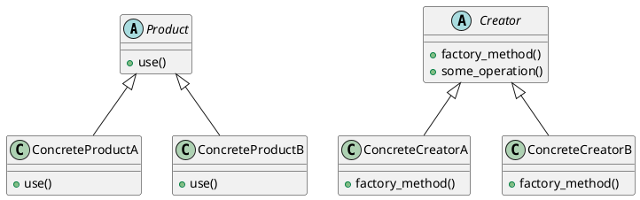

이와 같이 팩토리 메소드 패턴은 다양한 프로그래밍 언어에서 유사한 구조로 구현될 수 있으며, 객체 생성의 유연성을 제공하는 데 큰 도움이 된다. 각 언어의 문법에 맞춰 구현된 예제를 통해 팩토리 메소드 패턴의 적용 사례를 이해할 수 있다.

<!--
## 팩토리 메소드 패턴의 장단점
**장점**  
**단점**  
-->

## 팩토리 메소드 패턴의 장단점

### 장점

팩토리 메소드 패턴은 객체 생성의 책임을 서브클래스에 위임함으로써 여러 가지 장점을 제공한다. 첫 번째로, 코드의 유연성을 높인다. 클라이언트 코드가 구체적인 클래스에 의존하지 않기 때문에, 새로운 제품을 추가할 때 기존 코드를 수정할 필요가 없다. 이는 유지보수성을 크게 향상시킨다.

두 번째로, 객체 생성 로직을 캡슐화하여 코드의 가독성을 높인다. 생성자에서 복잡한 로직이 필요할 경우, 이를 팩토리 메소드로 분리함으로써 코드의 명확성을 유지할 수 있다.

세 번째로, 테스트 용이성을 제공한다. 팩토리 메소드를 사용하면 Mock 객체를 쉽게 생성할 수 있어, 단위 테스트를 수행할 때 유용하다.

다음은 팩토리 메소드 패턴의 장점을 설명하는 간단한 다이어그램이다.

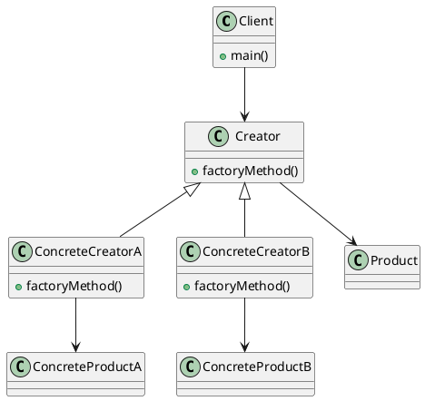

### 단점

팩토리 메소드 패턴은 여러 장점이 있지만, 단점도 존재한다. 첫 번째로, 클래스의 수가 증가한다는 점이다. 팩토리 메소드를 사용하면 각 제품에 대해 별도의 생성자가 필요하므로, 클래스의 수가 많아질 수 있다. 이는 코드의 복잡성을 증가시킬 수 있다.

두 번째로, 시스템의 구조가 복잡해질 수 있다. 팩토리 메소드 패턴을 잘못 사용하면, 객체 생성 로직이 분산되어 관리하기 어려운 상황이 발생할 수 있다. 따라서, 패턴을 적용할 때는 신중해야 한다.

세 번째로, 성능 저하가 발생할 수 있다. 팩토리 메소드를 통해 객체를 생성하는 과정에서 추가적인 메소드 호출이 발생하므로, 성능에 민감한 애플리케이션에서는 주의가 필요하다.

이와 같은 장단점을 고려하여 팩토리 메소드 패턴을 적절히 활용하는 것이 중요하다.

<!--
## FAQ
**팩토리 메소드 패턴과 추상 팩토리 패턴의 차이점은 무엇인가요?**  
**팩토리 메소드 패턴을 언제 사용해야 하나요?**  
**팩토리 메소드 패턴의 단점은 무엇인가요?**  
-->

## FAQ

### 팩토리 메소드 패턴과 추상 팩토리 패턴의 차이점은 무엇인가요?

팩토리 메소드 패턴과 추상 팩토리 패턴은 모두 객체 생성에 관련된 디자인 패턴이지만, 그 사용 목적과 구조에서 차이가 있다. 

팩토리 메소드 패턴은 특정 제품을 생성하기 위한 인터페이스를 제공하고, 서브클래스에서 그 제품을 생성하는 방법을 정의하는 패턴이다. 즉, 팩토리 메소드 패턴은 하나의 제품 계열에 대한 객체를 생성하는 데 중점을 둔다.

반면, 추상 팩토리 패턴은 관련된 여러 제품군을 생성하기 위한 인터페이스를 제공하는 패턴이다. 이 패턴은 서로 관련된 여러 제품을 함께 생성할 수 있도록 하여, 클라이언트가 구체적인 클래스에 의존하지 않도록 한다. 

아래의 다이어그램은 두 패턴의 구조적 차이를 보여준다.

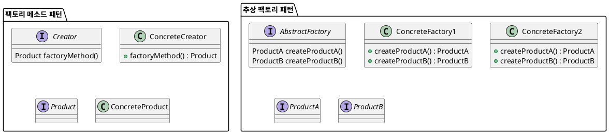

### 팩토리 메소드 패턴을 언제 사용해야 하나요?

팩토리 메소드 패턴은 다음과 같은 상황에서 사용해야 한다. 

1. **객체 생성의 복잡성**: 객체 생성 과정이 복잡하거나 여러 단계가 필요한 경우, 팩토리 메소드 패턴을 사용하여 생성 과정을 캡슐화할 수 있다.
   
2. **구체적인 클래스에 대한 의존성 감소**: 클라이언트 코드가 구체적인 클래스에 의존하지 않도록 하여, 코드의 유연성과 확장성을 높일 수 있다.

3. **서브클래스에서 객체 생성**: 객체 생성 로직을 서브클래스에서 구현하고자 할 때 유용하다. 이로 인해 새로운 제품을 추가할 때 기존 코드를 수정하지 않고도 확장이 가능하다.

아래는 팩토리 메소드 패턴을 사용하는 간단한 C++ 예제이다.

```cpp
#include <iostream>
using namespace std;

class Product {
public:
    virtual void use() = 0;
};

class ConcreteProductA : public Product {
public:
    void use() override {
        cout << "Using ConcreteProductA" << endl;
    }
};

class ConcreteProductB : public Product {
public:
    void use() override {
        cout << "Using ConcreteProductB" << endl;
    }
};

class Creator {
public:
    virtual Product* factoryMethod() = 0;
};

class ConcreteCreatorA : public Creator {
public:
    Product* factoryMethod() override {
        return new ConcreteProductA();
    }
};

class ConcreteCreatorB : public Creator {
public:
    Product* factoryMethod() override {
        return new ConcreteProductB();
    }
};

int main() {
    Creator* creatorA = new ConcreteCreatorA();
    Product* productA = creatorA->factoryMethod();
    productA->use();

    Creator* creatorB = new ConcreteCreatorB();
    Product* productB = creatorB->factoryMethod();
    productB->use();

    delete productA;
    delete productB;
    delete creatorA;
    delete creatorB;

    return 0;
}
```

### 팩토리 메소드 패턴의 단점은 무엇인가요?

팩토리 메소드 패턴은 유용하지만 몇 가지 단점이 있다.

1. **클래스 수 증가**: 팩토리 메소드 패턴을 사용하면 생성자와 제품 클래스의 수가 증가하게 된다. 이는 코드의 복잡성을 증가시킬 수 있다.

2. **디버깅의 어려움**: 객체 생성 과정이 여러 단계로 나뉘어져 있기 때문에, 디버깅이 어려워질 수 있다. 특히, 생성자와 제품 간의 관계를 추적하는 것이 복잡할 수 있다.

3. **구현의 복잡성**: 패턴을 구현하는 데 있어 추가적인 코드가 필요하므로, 간단한 객체 생성에는 오히려 비효율적일 수 있다.

이러한 단점들을 고려하여, 팩토리 메소드 패턴을 사용할지 여부를 결정해야 한다.

<!--
## 관련 기술
**템플릿 메소드 패턴**  
**추상 팩토리 패턴**  
**프로토타입 패턴**  
**빌더 패턴**  
-->

## 관련 기술

### 템플릿 메소드 패턴
템플릿 메소드 패턴은 알고리즘의 구조를 정의하고, 그 알고리즘의 일부 단계를 서브클래스에서 구현하도록 허용하는 패턴이다. 이 패턴은 코드의 중복을 줄이고, 알고리즘의 일관성을 유지하는 데 도움을 준다. 템플릿 메소드 패턴은 주로 상위 클래스에서 알고리즘의 뼈대를 정의하고, 하위 클래스에서 구체적인 구현을 제공하는 방식으로 작동한다.

#### 샘플 코드 (Java)
```java
abstract class AbstractClass {
    // 템플릿 메소드
    public final void templateMethod() {
        stepOne();
        stepTwo();
        stepThree();
    }

    protected abstract void stepOne();
    protected abstract void stepTwo();

    private void stepThree() {
        System.out.println("Step Three: Common implementation");
    }
}

class ConcreteClassA extends AbstractClass {
    @Override
    protected void stepOne() {
        System.out.println("ConcreteClassA: Step One implementation");
    }

    @Override
    protected void stepTwo() {
        System.out.println("ConcreteClassA: Step Two implementation");
    }
}

class ConcreteClassB extends AbstractClass {
    @Override
    protected void stepOne() {
        System.out.println("ConcreteClassB: Step One implementation");
    }

    @Override
    protected void stepTwo() {
        System.out.println("ConcreteClassB: Step Two implementation");
    }
}
```

#### 다이어그램 (PlantUML)
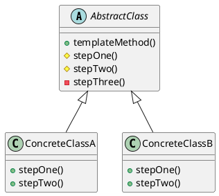

### 추상 팩토리 패턴
추상 팩토리 패턴은 관련된 객체들의 집합을 생성하는 인터페이스를 제공하는 패턴이다. 이 패턴은 구체적인 클래스에 의존하지 않고, 객체의 생성과 관련된 코드를 클라이언트에서 분리할 수 있도록 해준다. 이를 통해 코드의 유연성과 확장성을 높일 수 있다.

#### 샘플 코드 (Java)
```java
interface AbstractFactory {
    ProductA createProductA();
    ProductB createProductB();
}

class ConcreteFactory1 implements AbstractFactory {
    public ProductA createProductA() {
        return new ProductA1();
    }
    public ProductB createProductB() {
        return new ProductB1();
    }
}

class ConcreteFactory2 implements AbstractFactory {
    public ProductA createProductA() {
        return new ProductA2();
    }
    public ProductB createProductB() {
        return new ProductB2();
    }
}
```

#### 다이어그램 (PlantUML)
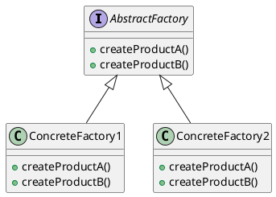

### 프로토타입 패턴
프로토타입 패턴은 객체를 복제하는 방식으로 새로운 객체를 생성하는 패턴이다. 이 패턴은 객체의 생성 비용이 클 때 유용하며, 기존 객체를 복제하여 새로운 객체를 생성함으로써 성능을 향상시킬 수 있다.

#### 샘플 코드 (Java)
```java
interface Prototype {
    Prototype clone();
}

class ConcretePrototype implements Prototype {
    private String field;

    public ConcretePrototype(String field) {
        this.field = field;
    }

    @Override
    public Prototype clone() {
        return new ConcretePrototype(this.field);
    }
}
```

#### 다이어그램 (PlantUML)
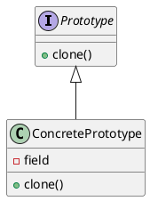

### 빌더 패턴
빌더 패턴은 복잡한 객체의 생성 과정을 분리하여, 동일한 생성 절차에서 서로 다른 표현을 생성할 수 있도록 하는 패턴이다. 이 패턴은 객체의 생성 과정을 단계별로 구성할 수 있게 해주며, 가독성을 높이고 유지보수를 용이하게 한다.

#### 샘플 코드 (Java)
```java
class Product {
    private String partA;
    private String partB;

    public void setPartA(String partA) {
        this.partA = partA;
    }

    public void setPartB(String partB) {
        this.partB = partB;
    }
}

class Builder {
    private Product product;

    public Builder() {
        product = new Product();
    }

    public Builder buildPartA(String partA) {
        product.setPartA(partA);
        return this;
    }

    public Builder buildPartB(String partB) {
        product.setPartB(partB);
        return this;
    }

    public Product build() {
        return product;
    }
}
```

#### 다이어그램 (PlantUML)
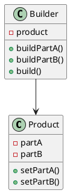

이와 같이 관련 기술들은 각각의 목적과 사용 사례에 따라 객체 생성 및 관리에 도움을 주는 디자인 패턴이다. 각 패턴의 특징을 이해하고 적절히 활용하면, 소프트웨어 개발의 효율성을 높일 수 있다.

<!--
## 결론
**팩토리 메소드 패턴의 중요성**  
**미래의 객체 생성 방식**  
**디자인 패턴의 지속적인 발전**
-->

## 결론

### 팩토리 메소드 패턴의 중요성

팩토리 메소드 패턴은 객체 생성의 책임을 서브클래스에 위임함으로써 코드의 유연성과 확장성을 높이는 데 중요한 역할을 한다. 이 패턴은 객체 지향 프로그래밍에서의 다형성을 활용하여, 클라이언트 코드가 구체적인 클래스에 의존하지 않도록 해준다. 결과적으로, 새로운 제품을 추가할 때 기존 코드를 수정할 필요가 없으므로 유지보수성이 향상된다. 이러한 특성 덕분에 팩토리 메소드 패턴은 대규모 소프트웨어 시스템에서 특히 유용하게 사용된다.

### 미래의 객체 생성 방식

앞으로의 객체 생성 방식은 더욱더 유연하고 효율적으로 발전할 것으로 예상된다. 특히, 마이크로서비스 아키텍처와 클라우드 네이티브 환경에서의 객체 생성은 더욱 중요해질 것이다. 이러한 환경에서는 다양한 서비스가 서로 상호작용하며, 각 서비스가 독립적으로 객체를 생성하고 관리해야 한다. 팩토리 메소드 패턴은 이러한 요구사항을 충족시키는 데 적합한 솔루션이 될 수 있다. 또한, 인공지능과 머신러닝의 발전으로 인해 객체 생성 과정에서의 자동화와 최적화가 이루어질 가능성도 높다.

### 디자인 패턴의 지속적인 발전

디자인 패턴은 소프트웨어 개발의 모범 사례를 정리한 것으로, 시간이 지남에 따라 새로운 패턴이 등장하고 기존 패턴이 발전해왔다. 팩토리 메소드 패턴 또한 다양한 변형과 확장을 통해 진화하고 있다. 예를 들어, 함수형 프로그래밍의 대두로 인해 팩토리 메소드 패턴이 함수형 스타일로 구현되는 경우도 늘어나고 있다. 이러한 변화는 개발자들이 더 나은 소프트웨어를 만들 수 있도록 돕고 있으며, 디자인 패턴의 중요성을 더욱 부각시키고 있다.

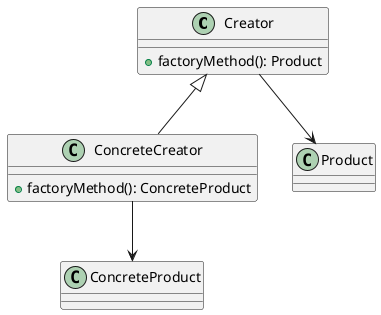

위의 다이어그램은 팩토리 메소드 패턴의 기본 구조를 나타낸다. `Creator` 클래스는 `factoryMethod()`를 정의하고, 이를 상속받은 `ConcreteCreator` 클래스가 구체적인 제품을 생성하는 방식이다. 이러한 구조는 객체 생성의 유연성을 제공하며, 새로운 제품을 추가할 때 기존 코드를 수정할 필요가 없음을 보여준다. 

결론적으로, 팩토리 메소드 패턴은 객체 지향 프로그래밍에서 중요한 디자인 패턴으로 자리 잡고 있으며, 앞으로도 소프트웨어 개발의 다양한 요구를 충족시키는 데 기여할 것이다.

<!--
##### Reference #####
-->

## Reference


* [https://en.wikipedia.org/wiki/Factory_method_pattern](https://en.wikipedia.org/wiki/Factory_method_pattern)
* [https://refactoring.guru/design-patterns/factory-method](https://refactoring.guru/design-patterns/factory-method)
* [https://velog.io/@chojs28/Factory-Method-%ED%8C%A9%ED%86%A0%EB%A6%AC-%EB%A9%94%EC%84%9C%EB%93%9C](https://velog.io/@chojs28/Factory-Method-%ED%8C%A9%ED%86%A0%EB%A6%AC-%EB%A9%94%EC%84%9C%EB%93%9C)
* [https://readystory.tistory.com/117](https://readystory.tistory.com/117)
* [https://gdtbgl93.tistory.com/19](https://gdtbgl93.tistory.com/19)
* [https://inpa.tistory.com/entry/GOF-%F0%9F%92%A0-%ED%8C%A9%ED%86%A0%EB%A6%AC-%EB%A9%94%EC%84%9C%EB%93%9CFactory-Method-%ED%8C%A8%ED%84%B4-%EC%A0%9C%EB%8C%80%EB%A1%9C-%EB%B0%B0%EC%9B%8C%EB%B3%B4%EC%9E%90](https://inpa.tistory.com/entry/GOF-%F0%9F%92%A0-%ED%8C%A9%ED%86%A0%EB%A6%AC-%EB%A9%94%EC%84%9C%EB%93%9CFactory-Method-%ED%8C%A8%ED%84%B4-%EC%A0%9C%EB%8C%80%EB%A1%9C-%EB%B0%B0%EC%9B%8C%EB%B3%B4%EC%9E%90)


<!--
Object-oriented software design pattern

In [ object oriented programming ](/wiki/Object_oriented_programming "Object
oriented programming") , the **factory method pattern** is a [ design pattern
](/wiki/Software_design_pattern "Software design pattern") that uses factory
methods to deal with the problem of [ creating objects ](/wiki/Object_creation
"Object creation") without having to specify their exact [ class
](/wiki/Class_\(computer_programming\) "Class \(computer programming\)") .
Rather than by calling a [ constructor ](/wiki/Constructor_\(object-
oriented_programming\) "Constructor \(object-oriented programming\)") , this
is done by calling a factory method to create an object. Factory methods can
either be specified in an [ interface ](/wiki/Interface_\(object-
oriented_programming\) "Interface \(object-oriented programming\)") and
implemented by child classes, or implemented in a base class and optionally [
overridden ](/wiki/Method_overriding "Method overriding") by [ derived classes
](/wiki/Derived_class "Derived class") . It is one of the 23 classic design
patterns described in the book _[ Design Patterns ](/wiki/Design_Patterns
"Design Patterns") _ (often referred to as the "Gang of Four" or simply "GoF")
and is sub-categorized as a [ creational pattern ](/wiki/Creational_pattern
"Creational pattern") .

The Factory Method design pattern solves problems like:

  * How can an object be created so that [ subclasses ](/wiki/Subclass_\(computer_science\) "Subclass \(computer science\)") can redefine its subsequent and distinct implementation? 
  * How can an object's instantiation be deferred to a subclass? 

The Factory Method design pattern describes how to solve such problems:

  * Define a _factory method_ within the [ superclass ](/wiki/Superclass_\(computer_science\) "Superclass \(computer science\)") that defers the object's creation to a subclass's _factory method_ . 
  * Create an object by calling a _factory method_ instead of directly calling a constructor. 

This enables the writing of subclasses that can change the way an object is
created (e.g. by redefining which class to instantiate).  
See also the UML class diagram below.

"Define an interface for creating an object, but let subclasses decide which
class to instantiate. The Factory method lets a class defer instantiation it
uses to subclasses." ( [ Gang Of Four ](/wiki/Gang_of_Four_\(software\) "Gang
of Four \(software\)") )

Creating an object often requires complex processes not appropriate to include
within a composing object. The object's creation may lead to a significant
duplication of code, may require information not accessible to the composing
object, may not provide a sufficient level of abstraction, or may otherwise
not be part of the composing object's [ concerns
](/wiki/Concern_\(computer_science\) "Concern \(computer science\)") . The
factory method design pattern handles these problems by defining a separate [
method ](/wiki/Method_\(computer_science\) "Method \(computer science\)") for
creating the objects, which subclasses can then override to specify the [
derived type ](/wiki/Subtyping "Subtyping") of product that will be created.

The factory method pattern relies on inheritance, as object creation is
delegated to subclasses that implement the factory method to create objects.
[  2  ]  As shown in the C# example below, the factory method pattern can also
rely on an Interface - in this case IPerson - to be implemented.

[

](/wiki/File:W3sDesign_Factory_Method_Design_Pattern_UML.jpg) A sample UML
class diagram for the Factory Method design pattern.  [  3  ]

In the above [ UML ](/wiki/Unified_Modeling_Language "Unified Modeling
Language") [ class diagram ](/wiki/Class_diagram "Class diagram") , the `
Creator ` class that requires a ` Product ` object does not instantiate the `
Product1 ` class directly. Instead, the ` Creator ` refers to a separate `
factoryMethod() ` to create a product object, which makes the ` Creator `
independent of which concrete class is instantiated. Subclasses of ` Creator `
can redefine which class to instantiate. In this example, the ` Creator1 `
subclass implements the abstract ` factoryMethod() ` by instantiating the `
Product1 ` class.

This C++14 implementation is based on the pre C++98 implementation in the
book.

    
    
    #include <iostream>
    #include <memory>
    
    enum ProductId {MINE, YOURS};
    
    // defines the interface of objects the factory method creates.
    class Product {
    public:
      virtual void print() = 0;
      virtual ~Product() = default;
    };
    
    // implements the Product interface.
    class ConcreteProductMINE: public Product {
    public:
      void print() {
        std::cout << "this=" << this << " print MINE\n";
      }
    };
    
    // implements the Product interface.
    class ConcreteProductYOURS: public Product {
    public:
      void print() {
        std::cout << "this=" << this << " print YOURS\n";
      }
    };
    
    // declares the factory method, which returns an object of type Product.
    class Creator {
    public:
      virtual std::unique_ptr<Product> create(ProductId id) {
        if (ProductId::MINE == id) return std::make_unique<ConcreteProductMINE>();
        if (ProductId::YOURS == id) return std::make_unique<ConcreteProductYOURS>();
        // repeat for remaining products...
    
        return nullptr;
      }
      virtual ~Creator() = default;
    };
    
    int main() {
      // The unique_ptr prevent memory leaks.
      std::unique_ptr<Creator> creator = std::make_unique<Creator>();
      std::unique_ptr<Product> product = creator->create(ProductId::MINE);
      product->print();
    
      product = creator->create(ProductId::YOURS);
      product->print();
    }
    

The program output is like

    
    
    this=0x6e5e90 print MINE
    this=0x6e62c0 print YOURS
    

A maze game may be played in two modes, one with regular rooms that are only
connected with adjacent rooms, and one with magic rooms that allow players to
be transported at random.

[
 ](/wiki/File:New_WikiFactoryMethod.png)

` Room ` is the base class for a final product ( ` MagicRoom ` or `
OrdinaryRoom ` ). ` MazeGame ` declares the abstract factory method to produce
such a base product. ` MagicRoom ` and ` OrdinaryRoom ` are subclasses of the
base product implementing the final product. ` MagicMazeGame ` and `
OrdinaryMazeGame ` are subclasses of ` MazeGame ` implementing the factory
method producing the final products. Thus factory methods decouple callers ( `
MazeGame ` ) from the implementation of the concrete classes. This makes the
"new" Operator redundant, allows adherence to the [ Open/closed principle
](/wiki/Open/closed_principle "Open/closed principle") and makes the final
product more flexible in the event of change.

###  Example implementations

[  [ edit  ](/w/index.php?title=Factory_method_pattern&action=edit&section=7
"Edit section: Example implementations") ]

    
    
    // Empty vocabulary of actual object
    public interface IPerson
    {
        string GetName();
    }
    
    public class Villager : IPerson
    {
        public string GetName()
        {
            return "Village Person";
        }
    }
    
    public class CityPerson : IPerson
    {
        public string GetName()
        {
            return "City Person";
        }
    }
    
    public enum PersonType
    {
        Rural,
        Urban
    }
    
    /// <summary>
    /// Implementation of Factory - Used to create objects.
    /// </summary>
    public class PersonFactory
    {
        public IPerson GetPerson(PersonType type)
        {
            switch (type)
            {
                case PersonType.Rural:
                    return new Villager();
                case PersonType.Urban:
                    return new CityPerson();
                default:
                    throw new NotSupportedException();
            }
        }
    }
    

In the above code you can see the creation of one interface called ` IPerson `
and two implementations called ` Villager ` and ` CityPerson ` . Based on the
type passed into the ` PersonFactory ` object, we are returning the original
concrete object as the interface ` IPerson ` .

A factory method is just an addition to ` PersonFactory ` class. It creates
the object of the class through interfaces but on the other hand, it also lets
the subclass decide which class is instantiated.

    
    
    public interface IProduct
    {
        string GetName();
        bool SetPrice(double price);
    }
    
    public class Phone : IProduct
    {
        private double _price;
    
        public string GetName()
        {
            return "Apple TouchPad";
        }
    
        public bool SetPrice(double price)
        {
            _price = price;
            return true;
        }
    }
    
    /* Almost same as Factory, just an additional exposure to do something with the created method */
    public abstract class ProductAbstractFactory
    {
        protected abstract IProduct MakeProduct();
    
        public IProduct GetObject() // Implementation of Factory Method.
        {
            return this.MakeProduct();
        }
    }
    
    public class PhoneConcreteFactory : ProductAbstractFactory
    {
        protected override IProduct MakeProduct()
        {
            IProduct product = new Phone();
            // Do something with the object after you get the object.
            product.SetPrice(20.30);
            return product;
        }
    }
    

You can see we have used ` MakeProduct ` in concreteFactory. As a result, you
can easily call ` MakeProduct() ` from it to get the ` IProduct ` . You might
also write your custom logic after getting the object in the concrete Factory
Method. The GetObject is made abstract in the Factory interface.

This [ Java ](/wiki/Java_\(programming_language\) "Java \(programming
language\)") example is similar to one in the book _[ Design Patterns
](/wiki/Design_Patterns "Design Patterns") . _

[
 ](/wiki/File:Maze_game_UML.svg)

The MazeGame uses Rooms but it puts the responsibility of creating Rooms to
its subclasses which create the concrete classes. The regular game mode could
use this template method:

    
    
    public abstract class Room {
        abstract void connect(Room room);
    }
    
    public class MagicRoom extends Room {
        public void connect(Room room) {}
    }
    
    public class OrdinaryRoom extends Room {
        public void connect(Room room) {}
    }
    
    public abstract class MazeGame {
         private final List<Room> rooms = new ArrayList<>();
    
         public MazeGame() {
              Room room1 = makeRoom();
              Room room2 = makeRoom();
              room1.connect(room2);
              rooms.add(room1);
              rooms.add(room2);
         }
    
         abstract protected Room makeRoom();
    }
    

In the above snippet, the ` MazeGame ` constructor is a [ template method
](/wiki/Template_method_pattern "Template method pattern") that makes some
common logic. It refers to the ` makeRoom ` factory method that encapsulates
the creation of rooms such that other rooms can be used in a subclass. To
implement the other game mode that has magic rooms, it suffices to override
the ` makeRoom ` method:

    
    
    public class MagicMazeGame extends MazeGame {
        @Override
        protected MagicRoom makeRoom() {
            return new MagicRoom();
        }
    }
    
    public class OrdinaryMazeGame extends MazeGame {
        @Override
        protected OrdinaryRoom makeRoom() {
            return new OrdinaryRoom();
        }
    }
    
    MazeGame ordinaryGame = new OrdinaryMazeGame();
    MazeGame magicGame = new MagicMazeGame();
    

Another example in [ PHP ](/wiki/PHP "PHP") follows, this time using interface
implementations as opposed to subclassing (however, the same can be achieved
through subclassing). It is important to note that the factory method can also
be defined as public and called directly by the client code (in contrast with
the Java example above).

    
    
    /* Factory and car interfaces */
    
    interface CarFactory
    {
        public function makeCar(): Car;
    }
    
    interface Car
    {
        public function getType(): string;
    }
    
    /* Concrete implementations of the factory and car */
    
    class SedanFactory implements CarFactory
    {
        public function makeCar(): Car
        {
            return new Sedan();
        }
    }
    
    class Sedan implements Car
    {
        public function getType(): string
        {
            return 'Sedan';
        }
    }
    
    /* Client */
    
    $factory = new SedanFactory();
    $car = $factory->makeCar();
    print $car->getType();
    

Same as Java example.

    
    
    from abc import ABC, abstractmethod
    
    
    class MazeGame(ABC):
        def __init__(self) -> None:
            self.rooms = []
            self._prepare_rooms()
    
        def _prepare_rooms(self) -> None:
            room1 = self.make_room()
            room2 = self.make_room()
    
            room1.connect(room2)
            self.rooms.append(room1)
            self.rooms.append(room2)
    
        def play(self) -> None:
            print(f"Playing using {self.rooms[0]}")
    
        @abstractmethod
        def make_room(self):
            raise NotImplementedError("You should implement this!")
    
    
    class MagicMazeGame(MazeGame):
        def make_room(self) -> "MagicRoom":
            return MagicRoom()
    
    
    class OrdinaryMazeGame(MazeGame):
        def make_room(self) -> "OrdinaryRoom":
            return OrdinaryRoom()
    
    
    class Room(ABC):
        def __init__(self) -> None:
            self.connected_rooms = []
    
        def connect(self, room: "Room") -> None:
            self.connected_rooms.append(room)
    
    
    class MagicRoom(Room):
        def __str__(self) -> str:
            return "Magic room"
    
    
    class OrdinaryRoom(Room):
        def __str__(self) -> str:
            return "Ordinary room"
    
    
    ordinaryGame = OrdinaryMazeGame()
    ordinaryGame.play()
    
    magicGame = MagicMazeGame()
    magicGame.play()
    


-->

<!--


-->

<!--
#  Factory Method

Also known as:  Virtual Constructor

##  Intent

**Factory Method** is a creational design pattern that provides an interface
for creating objects in a superclass, but allows subclasses to alter the type
of objects that will be created.


##  __ Problem

Imagine that you’re creating a logistics management application. The first
version of your app can only handle transportation by trucks, so the bulk of
your code lives inside the ` Truck ` class.

After a while, your app becomes pretty popular. Each day you receive dozens of
requests from sea transportation companies to incorporate sea logistics into
the app.


Adding a new class to the program isn’t that simple if the rest of the code is
already coupled to existing classes.

Great news, right? But how about the code? At present, most of your code is
coupled to the ` Truck ` class. Adding ` Ships ` into the app would require
making changes to the entire codebase. Moreover, if later you decide to add
another type of transportation to the app, you will probably need to make all
of these changes again.

As a result, you will end up with pretty nasty code, riddled with conditionals
that switch the app’s behavior depending on the class of transportation
objects.

##  __ Solution

The Factory Method pattern suggests that you replace direct object
construction calls (using the ` new ` operator) with calls to a special
_factory_ method. Don’t worry: the objects are still created via the ` new `
operator, but it’s being called from within the factory method. Objects
returned by a factory method are often referred to as _products._


Subclasses can alter the class of objects being returned by the factory
method.

At first glance, this change may look pointless: we just moved the constructor
call from one part of the program to another. However, consider this: now you
can override the factory method in a subclass and change the class of products
being created by the method.

There’s a slight limitation though: subclasses may return different types of
products only if these products have a common base class or interface. Also,
the factory method in the base class should have its return type declared as
this interface.


All products must follow the same interface.

For example, both ` Truck ` and ` Ship ` classes should implement the `
Transport ` interface, which declares a method called ` deliver ` . Each class
implements this method differently: trucks deliver cargo by land, ships
deliver cargo by sea. The factory method in the ` RoadLogistics ` class
returns truck objects, whereas the factory method in the ` SeaLogistics `
class returns ships.


As long as all product classes implement a common interface, you can pass
their objects to the client code without breaking it.

The code that uses the factory method (often called the _client_ code) doesn’t
see a difference between the actual products returned by various subclasses.
The client treats all the products as abstract ` Transport ` . The client
knows that all transport objects are supposed to have the ` deliver ` method,
but exactly how it works isn’t important to the client.

##  __ Structure

 

  1. The **Product** declares the interface, which is common to all objects that can be produced by the creator and its subclasses. 

  2. **Concrete Products** are different implementations of the product interface. 

  3. The **Creator** class declares the factory method that returns new product objects. It’s important that the return type of this method matches the product interface. 

You can declare the factory method as ` abstract ` to force all subclasses to
implement their own versions of the method. As an alternative, the base
factory method can return some default product type.

Note, despite its name, product creation is **not** the primary responsibility
of the creator. Usually, the creator class already has some core business
logic related to products. The factory method helps to decouple this logic
from the concrete product classes. Here is an analogy: a large software
development company can have a training department for programmers. However,
the primary function of the company as a whole is still writing code, not
producing programmers.

  4. **Concrete Creators** override the base factory method so it returns a different type of product. 

Note that the factory method doesn’t have to **create** new instances all the
time. It can also return existing objects from a cache, an object pool, or
another source.

##  __ Pseudocode

This example illustrates how the **Factory Method** can be used for creating
cross-platform UI elements without coupling the client code to concrete UI
classes.


The cross-platform dialog example.

The base ` Dialog ` class uses different UI elements to render its window.
Under various operating systems, these elements may look a little bit
different, but they should still behave consistently. A button in Windows is
still a button in Linux.

When the factory method comes into play, you don’t need to rewrite the logic
of the ` Dialog ` class for each operating system. If we declare a factory
method that produces buttons inside the base ` Dialog ` class, we can later
create a subclass that returns Windows-styled buttons from the factory method.
The subclass then inherits most of the code from the base class, but, thanks
to the factory method, can render Windows-looking buttons on the screen.

For this pattern to work, the base ` Dialog ` class must work with abstract
buttons: a base class or an interface that all concrete buttons follow. This
way the code within ` Dialog ` remains functional, whichever type of buttons
it works with.

Of course, you can apply this approach to other UI elements as well. However,
with each new factory method you add to the ` Dialog ` , you get closer to the
[ Abstract Factory ](/design-patterns/abstract-factory) pattern. Fear not,
we’ll talk about this pattern later.

    
    
    // The creator class declares the factory method that must
    // return an object of a product class. The creator's subclasses
    // usually provide the implementation of this method.
    class Dialog is
        // The creator may also provide some default implementation
        // of the factory method.
        abstract method createButton():Button
    
        // Note that, despite its name, the creator's primary
        // responsibility isn't creating products. It usually
        // contains some core business logic that relies on product
        // objects returned by the factory method. Subclasses can
        // indirectly change that business logic by overriding the
        // factory method and returning a different type of product
        // from it.
        method render() is
            // Call the factory method to create a product object.
            Button okButton = createButton()
            // Now use the product.
            okButton.onClick(closeDialog)
            okButton.render()
    
    
    // Concrete creators override the factory method to change the
    // resulting product's type.
    class WindowsDialog extends Dialog is
        method createButton():Button is
            return new WindowsButton()
    
    class WebDialog extends Dialog is
        method createButton():Button is
            return new HTMLButton()
    
    
    // The product interface declares the operations that all
    // concrete products must implement.
    interface Button is
        method render()
        method onClick(f)
    
    // Concrete products provide various implementations of the
    // product interface.
    class WindowsButton implements Button is
        method render(a, b) is
            // Render a button in Windows style.
        method onClick(f) is
            // Bind a native OS click event.
    
    class HTMLButton implements Button is
        method render(a, b) is
            // Return an HTML representation of a button.
        method onClick(f) is
            // Bind a web browser click event.
    
    
    class Application is
        field dialog: Dialog
    
        // The application picks a creator's type depending on the
        // current configuration or environment settings.
        method initialize() is
            config = readApplicationConfigFile()
    
            if (config.OS == "Windows") then
                dialog = new WindowsDialog()
            else if (config.OS == "Web") then
                dialog = new WebDialog()
            else
                throw new Exception("Error! Unknown operating system.")
    
        // The client code works with an instance of a concrete
        // creator, albeit through its base interface. As long as
        // the client keeps working with the creator via the base
        // interface, you can pass it any creator's subclass.
        method main() is
            this.initialize()
            dialog.render()
    

##  __ Applicability

__ Use the Factory Method when you don’t know beforehand the exact types and
dependencies of the objects your code should work with.

__ The Factory Method separates product construction code from the code that
actually uses the product. Therefore it’s easier to extend the product
construction code independently from the rest of the code.

For example, to add a new product type to the app, you’ll only need to create
a new creator subclass and override the factory method in it.

__ Use the Factory Method when you want to provide users of your library or
framework with a way to extend its internal components.

__ Inheritance is probably the easiest way to extend the default behavior of a
library or framework. But how would the framework recognize that your subclass
should be used instead of a standard component?

The solution is to reduce the code that constructs components across the
framework into a single factory method and let anyone override this method in
addition to extending the component itself.

Let’s see how that would work. Imagine that you write an app using an open
source UI framework. Your app should have round buttons, but the framework
only provides square ones. You extend the standard ` Button ` class with a
glorious ` RoundButton ` subclass. But now you need to tell the main `
UIFramework ` class to use the new button subclass instead of a default one.

To achieve this, you create a subclass ` UIWithRoundButtons ` from a base
framework class and override its ` createButton ` method. While this method
returns ` Button ` objects in the base class, you make your subclass return `
RoundButton ` objects. Now use the ` UIWithRoundButtons ` class instead of `
UIFramework ` . And that’s about it!

__ Use the Factory Method when you want to save system resources by reusing
existing objects instead of rebuilding them each time.

__ You often experience this need when dealing with large, resource-intensive
objects such as database connections, file systems, and network resources.

Let’s think about what has to be done to reuse an existing object:

  1. First, you need to create some storage to keep track of all of the created objects. 
  2. When someone requests an object, the program should look for a free object inside that pool. 
  3. … and then return it to the client code. 
  4. If there are no free objects, the program should create a new one (and add it to the pool). 

That’s a lot of code! And it must all be put into a single place so that you
don’t pollute the program with duplicate code.

Probably the most obvious and convenient place where this code could be placed
is the constructor of the class whose objects we’re trying to reuse. However,
a constructor must always return **new objects** by definition. It can’t
return existing instances.

Therefore, you need to have a regular method capable of creating new objects
as well as reusing existing ones. That sounds very much like a factory method.

##  __ How to Implement

  1. Make all products follow the same interface. This interface should declare methods that make sense in every product. 

  2. Add an empty factory method inside the creator class. The return type of the method should match the common product interface. 

  3. In the creator’s code find all references to product constructors. One by one, replace them with calls to the factory method, while extracting the product creation code into the factory method. 

You might need to add a temporary parameter to the factory method to control
the type of returned product.

At this point, the code of the factory method may look pretty ugly. It may
have a large ` switch ` statement that picks which product class to
instantiate. But don’t worry, we’ll fix it soon enough.

  4. Now, create a set of creator subclasses for each type of product listed in the factory method. Override the factory method in the subclasses and extract the appropriate bits of construction code from the base method. 

  5. If there are too many product types and it doesn’t make sense to create subclasses for all of them, you can reuse the control parameter from the base class in subclasses. 

For instance, imagine that you have the following hierarchy of classes: the
base ` Mail ` class with a couple of subclasses: ` AirMail ` and ` GroundMail
` ; the ` Transport ` classes are ` Plane ` , ` Truck ` and ` Train ` . While
the ` AirMail ` class only uses ` Plane ` objects, ` GroundMail ` may work
with both ` Truck ` and ` Train ` objects. You can create a new subclass (say
` TrainMail ` ) to handle both cases, but there’s another option. The client
code can pass an argument to the factory method of the ` GroundMail ` class to
control which product it wants to receive.

  6. If, after all of the extractions, the base factory method has become empty, you can make it abstract. If there’s something left, you can make it a default behavior of the method. 

##  __ Pros and Cons

  * __ You avoid tight coupling between the creator and the concrete products. 
  * __ _Single Responsibility Principle_ . You can move the product creation code into one place in the program, making the code easier to support. 
  * __ _Open/Closed Principle_ . You can introduce new types of products into the program without breaking existing client code. 

  * __ The code may become more complicated since you need to introduce a lot of new subclasses to implement the pattern. The best case scenario is when you’re introducing the pattern into an existing hierarchy of creator classes. 

##  __ Relations with Other Patterns

  * Many designs start by using [ Factory Method ](/design-patterns/factory-method) (less complicated and more customizable via subclasses) and evolve toward [ Abstract Factory ](/design-patterns/abstract-factory) , [ Prototype ](/design-patterns/prototype) , or [ Builder ](/design-patterns/builder) (more flexible, but more complicated). 

  * [ Abstract Factory ](/design-patterns/abstract-factory) classes are often based on a set of [ Factory Methods ](/design-patterns/factory-method) , but you can also use [ Prototype ](/design-patterns/prototype) to compose the methods on these classes. 

  * You can use [ Factory Method ](/design-patterns/factory-method) along with [ Iterator ](/design-patterns/iterator) to let collection subclasses return different types of iterators that are compatible with the collections. 

  * [ Prototype ](/design-patterns/prototype) isn’t based on inheritance, so it doesn’t have its drawbacks. On the other hand, _Prototype_ requires a complicated initialization of the cloned object. [ Factory Method ](/design-patterns/factory-method) is based on inheritance but doesn’t require an initialization step. 

  * [ Factory Method ](/design-patterns/factory-method) is a specialization of [ Template Method ](/design-patterns/template-method) . At the same time, a _Factory Method_ may serve as a step in a large _Template Method_ . 


-->

<!--


-->

<!--
#  Factory Method (íŒ©í† ë¦¬ 메서드)

##  Factory Method 패턴 ��?

ê°�체를 만들기 위한 ì�¸í„°í�˜ì�´ìŠ¤ë¥¼ ì •ì�˜í•˜ë‚˜, ì–´ë–¤
í�´ë�˜ìŠ¤ì�˜ ì�¸ìŠ¤í„´ìŠ¤ë¥¼ ìƒ�ì„±í• ì§€ì—� 대한 ê²°ì •ì�€ 하위
í�´ë�˜ìŠ¤ê°€ ì •í•˜ë�„ë¡� 하는 패턴. 즉, **ê°�ì²´ ìƒ�성 처리를
서브��스로 분리** 해 처리하�� 캡�화 하는 패턴.

##  Factory Method 패턴� 구조


  * **Creator**
    * Product 타ì�…ì�˜ ê°�체를 반환하는 FactoryMethod를 ì„ ì–¸í•œë‹¤. 
    * 기본ì �ì�¸ FactoryMethod를 êµ¬í˜„í•˜ê³ , ConcreteProduct를 반환한다. 
    * **AnOperation** \- Product �체 �성� 위해 FactoryMethod를 호출한다. 
  * **ConcreteCreator** \- FactoryMethod를 ì�¬ì •ì�˜ 하여 ConcreteProduct ì�¸ìŠ¤í„´ìŠ¤ë¥¼ 반환한다. 
  * **ConcreteProduct** \- Productì—� ì •ì�˜ë�œ ì�¸í„°í�˜ì�´ìŠ¤ë¥¼ ì‹¤ì œë¡œ 구현한다. 
  * **Product** \- FactoryMethodê°€ ìƒ�성하는 ê°�ì²´ì�˜ ì�¸í„°í�˜ì�´ìŠ¤ë¥¼ ì •ì�˜í•œë‹¤. 

##  Factory Method 패턴ì�„ 사용하는 ì�´ìœ

  * ��스� �성과 사용� 처리 로�� 분리하여 **결합�를 낮추기 위함** . 
  * ê°�ì²´ ìƒ�성 처리를 서브í�´ë�˜ìŠ¤ë¡œ 분리 함으로ì�¨, ì§�ì ‘ ê°�체를 사용하는 것ì�„ 방지하며 ì�´ëŠ” 효율ì �ì�¸ 코드 ì œì–´ë¥¼ í• ìˆ˜ ì�ˆê³ **ì�˜ì¡´ì„±ì�„ ì œê±°** í• ìˆ˜ ì�ˆë‹¤. 

##  Factory Method 패턴ì�˜ ì�¥ì �ê³¼ 단ì �

###  ì�¥ì �

  * **ê°�ì²´ì�˜ ì��료형ì�´ 서브 í�´ë�˜ìŠ¤ì—� ì�˜í•´ì„œ ê²°ì •ë�˜ë¯€ë¡œ 확ì�¥ì—� ìš©ì�´í•˜ë‹¤.**
    * 서브 í�´ë�˜ìŠ¤ì—�ì„œ ê°�체를 ìƒ�ì„±í• ë•Œ, ìƒ�위 í�´ë�˜ìŠ¤ì—�ì„œ ìƒ�성ë�˜ëŠ” ê°�ì²´ì—� 대한 ì •í™•í•œ 타ì�…ì�„ 몰ë�¼ë�„ ë�˜ê¸° 때문. 
  * **DIP (Dependency Inversion Principle, ì�˜ì¡´ 관계 ì—­ì „ì�˜ ì›�ì¹™)를 성립한다.**

> DIP (Dependency Inversion Principle, ì�˜ì¡´ 관계 ì—­ì „ì�˜ ì›�ì¹™) ë�€?  
>  [ �체 지향 설계� 5대 �칙(SOLID) ](https://dev-
> momo.tistory.com/entry/SOLID-%EC%9B%90%EC%B9%99) 중 하나로�,  
>  �존 관계를 맺� 때, **변화하기 쉬운것 보단 변화하기
> ì–´ë ¤ìš´ 것ì—� ì�˜ì¡´** 해야 한다는 ì›�ì¹™.  
>  **변화하기 ì–´ë ¤ìš´ 것** \- ì •ì±…, ì „ë ¥ê³¼ ê°™ì�€ ì–´ë–¤ í�°
> í��름ì�´ë‚˜ ê°œë…�처럼 추ìƒ�ì �ì�¸ 것.  
>  **변화하기 쉬운 것** \- 구체ì �ì�¸ ë°©ì‹�, 사물 등과 ê°™ì�€
> 것.  
>  으로 ��하면 �해하기 조금 � 수월하다.

ì°¸ê³ - [ https://defacto-standard.tistory.com/113 ](https://defacto-
standard.tistory.com/113)

###  단ì �

  * **새로 ìƒ�ì„±í• ê°�ì²´ì�˜ 종류가 ëŠ˜ì–´ë‚ ë•Œ 마다 서브 í�´ë�˜ìŠ¤ ì�¬ì •ì�˜ë¡œ ì�¸í•œ 불필요한 í�´ë�˜ìŠ¤ë“¤ì�˜ ìƒ�성 가능성ì�´ ì�ˆë‹¤.**

##  ì˜ˆì œ 코드

구현 ì˜ˆì œëŠ” 스타í�¬ë�˜í”„트ì�˜ íŒ©í† ë¦¬ì—�ì„œ ìœ ë‹›ì�„ 뽑기 위해
필요한 ì��ì›� ê°�체를 Factory Method를 ì�´ìš©í•´ ë§Œë“ ì˜ˆì œ ì�…니다.  
Typescript로 abstract class(추� ��스)와 abstract method(추�
메서드)를 �용해서 구현했습니다.

💡 Javascript는 í”„ë¡œí† íƒ€ì�… 언어ì�´ê¸° 때문ì—�, 기본ì �으로
í�´ë�˜ìŠ¤ë�¼ëŠ” ê°œë…�ì�„ ì œê³µí•˜ì§€ 않는다. ES5 ì�´í›„ì—� 나온
class는 문법ì �으로만 지ì›�í•˜ê³ , ì—„ë°€í�ˆ ë§�하면 í”„ë¡œí† íƒ€ì�…
기반으로 ��스를 �내낸 함수 �다. �한, Javascript�서는
abstract (추ìƒ�í™”)를 ì§�ì ‘ 구현해야 한다.

    
    
    abstract class Factory {
      
    		
        public abstract createUnit(): Unit;
    
        
        public getUnit(): Unit {
    				return this.createUnit();
        }
    }
    
    
    
    class CreateSiegeTank extends Factory {
        public createUnit(): Unit {
    				console.log('SiegeTank를 만들었습니다.');
            return new SiegeTank();
        }
    }
    
    class CreateGoliath extends Factory {
        public createUnit(): Unit {
    				console.log('Goliath� 만들었습니다.');		
            return new Goliath();
        }
    }
    
    
    interface Unit {
    		mineral: number;
    		gas: number;
    		food: number;
    }
    
    
    class SiegeTank implements Unit {
        mineral: number = 0;
    		gas: number = 0;
    		food: number = 0;
    
    		constructor() {
    				this.mineral = 150;
    				this.gas = 100;
    				this.food = 2;
    		}
    }
    
    class Goliath implements Unit {
        mineral: number = 0;
    		gas: number = 0;
    		food: number = 0;
    
    		constructor() {
    				this.mineral = 100;
    				this.gas = 50;
    				this.food = 2;
    		}
    }
    
    
    function callUnit(factory: Factory): void {
    		const unitInfo = factory.getUnit();
    		console.log(`
    				미네� : ${unitInfo.mineral}
    				가스 : ${unitInfo.gas}
    				�구수 : ${unitInfo.food}
    				를 소모 하였습니다.
    		`);
    }
    
    callUnit(new CreateSiegeTank());
    callUnit(new CreateGoliath());
    
    
    
    
    
    
    
    
    
    
    
    
    


-->

<!--


-->

<!--
이번에 살펴볼 디자인 패턴은 가장 유명한 디자인 패턴 중 하나인 ** 팩토리 패턴(Factory Pattern)  ** 입니다.

이 팩토리 패턴은 조금 더 구체적인 용어인 **팩토리 메소드 패턴(Factory Method Pattern)** 으로도 널리 알려져
있습니다.

###  **팩토리 패턴은 생성 패턴(Creational Pattern) 중 하나이다.**

생성 패턴은 인스턴스를 만드는 절차를 추상화하는 패턴입니다.

생성 패턴에 속하는 패턴들은 객체를 생성, 합성하는 방법이나 객체의 표현 방법을 시스템과 분리해줍니다.

생성 패턴은 시스템이 상속(inheritance) 보다 복합(composite) 방법을 사용하는 방향으로 진화되어 가면서 더 중요해지고
있습니다.

생성 패턴에서는 중요한 이슈가 두 가지 있습니다.

  1. **생성 패턴은 시스템이 어떤 Concrete Class를 사용하는지에 대한 정보를 캡슐화합니다.**
  2. **생성 패턴은 이들 클래스의 인스턴스들이 어떻게 만들고 어떻게 결합하는지에 대한 부분을 완전히 가려줍니다.**

쉬운 말로 정리하자면, 생성 패턴을 이용하면 무엇이 생성되고, 누가 이것을 생성하며, 이것이 어떻게 생성되는지, 언제 생성할 것인지 결정하는
데 유연성을 확보할 수 있게 됩니다.

생성 패턴에 어떤 패턴들이 있는지 궁금하신 분들은  [ 이전 글 ](https://readystory.tistory.com/114) 을
참고하시기 바랍니다.

###  **팩토리 패턴이란?**

팩토리 패턴은 객체를 생성하는 인터페이스는 미리 정의하되, 인스턴스를 만들 클래스의 결정은 서브 클래스 쪽에서 내리는 패턴입니다. 다시 말해
**여러 개의 서브 클래스를 가진 슈퍼 클래스가 있을 때 인풋에 따라 하나의 자식 클래스의 인스턴스를 리턴해주는 방식** 입니다.

팩토리 패턴에서는 클래스의 인스턴스를 만드는 시점을 서브 클래스로 미룹니다.

이 패턴은 인스턴스화에 대한 책임을 객체를 사용하는 클라이언트에서 팩토리 클래스로 가져옵니다.

**활용성**

  * **어떤 클래스가 자신이 생성해야 하는 객체의 클래스를 예측할 수 없을 때**
  * **생성할 객체를 기술하는 책임을 자신의 서브클래스가 지정했으면 할 때** ****

###  **Java Example**

팩토리 패턴에 사용되는 슈퍼 클래스는 인터페이스나 추상 클래스, 혹은 그냥 평범한 자바 클래스여도 상관없습니다.

그러나 이번 예제에서는 추상 클래스로 만들어 toString()을 오버라이딩 하여 코드를 작성해보도록 하겠습니다.

**Super Class**

    
    
    public abstract class Computer {
    	
        public abstract String getRAM();
        public abstract String getHDD();
        public abstract String getCPU();
    	
        @Override
        public String toString(){
            return "RAM= "+this.getRAM()+", HDD="+this.getHDD()+", CPU="+this.getCPU();
        }
    }

슈퍼 클래스를 만들었으니 이번에는 PC와 Server라는 이름의 두 서브 클래스를 만들어 보겠습니다.

**Sub Class - 1**

    
    
    public class PC extends Computer {
    
        private String ram;
        private String hdd;
        private String cpu;
    	
        public PC(String ram, String hdd, String cpu){
            this.ram=ram;
            this.hdd=hdd;
            this.cpu=cpu;
        }
        @Override
        public String getRAM() {
            return this.ram;
        }
    
        @Override
        public String getHDD() {
        return this.hdd;
        }
    
        @Override
        public String getCPU() {
            return this.cpu;
        }
    
    }

**Sub Class - 2**

    
    
    public class Server extends Computer {
    
        private String ram;
        private String hdd;
        private String cpu;
    	
        public Server(String ram, String hdd, String cpu){
            this.ram=ram;
            this.hdd=hdd;
            this.cpu=cpu;
        }
        @Override
        public String getRAM() {
            return this.ram;
        }
    
        @Override
        public String getHDD() {
            return this.hdd;
        }
    
        @Override
        public String getCPU() {
            return this.cpu;
        }
    
    }

_여기서 주의할 점은 PC 클래스와 Server 클래스 모두 Computer 클래스를 상속한다는 것입니다._

자, 이제 마지막으로 팩토리 클래스를 만들어보도록 하겠습니다.

**Factory Class**

    
    
    public class ComputerFactory {
    
        public static Computer getComputer(String type, String ram, String hdd, String cpu){
            if("PC".equalsIgnoreCase(type))
                return new PC(ram, hdd, cpu);
            else if("Server".equalsIgnoreCase(type))
                return new Server(ram, hdd, cpu);
    		
            return null;
        }
    }

자, 이제 코드를 살펴보겠습니다. ComputerFactory 클래스의 getComputer 메소드를 살펴보면  static  메소드  로
구현되었다는 점을 살펴볼 수 있고, 메소드 내부 코드를 보면 type의 값이 "PC"일 경우 PC 클래스의 인스턴스를, "Server"일
경우 Server 클래스의 인스턴스를 리턴하는 것을 볼 수 있습니다.

** 이렇듯 팩토리 메소드 패턴을 사용하게 된다면 인스턴스를 필요로 하는 Application에서 Computer의 Sub 클래스에 대한
정보는 모른 채 인스턴스를 생성할 수 있게 됩니다.  **

이렇게 구현한다면 앞으로 Computer 클래스에 더 많은 Sub 클래스가 추가된다 할지라도 getComputer()를 통해 인스턴스를
제공받던 Application의 코드는 수정할 필요가 없게 됩니다.

팩토리 메소드 패턴을 구현하는 데 중요한 점이 **두 가지** 가 있습니다.

  1. **Factory class를[ Singleton ](https://readystory.tistory.com/116) 으로 구현해도 되고, 서브클래스를 리턴하는 static 메소드로 구현해도 됩니다. **
  2. **팩토리 메소드는 위 예제의 getComputer()와 같이 입력된 파라미터에 따라 다른 서브 클래스의 인스턴스를 생성하고 리턴합니다.**

마지막으로, 위 예제에서 작성한 ComputerFactory 클래스를 사용하여 PC와 Server 클래스의 인스턴스를 생성해보겠습니다.

    
    
    public class TestFactory {
    
        public static void main(String[] args) {
            Computer pc = ComputerFactory.getComputer("pc","2 GB","500 GB","2.4 GHz");
            Computer server = ComputerFactory.getComputer("server","16 GB","1 TB","2.9 GHz");
            System.out.println("Factory PC Config::"+pc);
            System.out.println("Factory Server Config::"+server);
        }
    
    }
    
    
    Factory PC Config::RAM= 2 GB, HDD=500 GB, CPU=2.4 GHz
    Factory Server Config::RAM= 16 GB, HDD=1 TB, CPU=2.9 GHz

###  **팩토리 패턴의 장점**

  1. 팩토리 패턴은 클라이언트 코드로부터 서브 클래스의 인스턴스화를 제거하여 **서로 간의 종속성을 낮추고, 결합도를 느슨하게 하며(Loosely Coupled), 확장을 쉽게 합니다.**   
예를 들어, 위 예제에서 작성한 클래스 중 PC class에 대해 수정 혹은 삭제가 일어나더라도 클라이언트는 알 수 없기 때문에 코드를
변경할 필요도 없습니다.

  2. 팩토리 패턴은 클라이언트와 구현 객체들 사이에 추상화를 제공합니다. 

###  **사용 예**

  1. java.util 패키지에 있는 Calendar, ResourceBundle, NumberFormat 등의 클래스에서 정의된 **getInstance()** 메소드가 팩토리 패턴을 사용하고 있습니다. 
  2. Boolean, Integer, Long 등 Wrapper class 안에 정의된 **valueOf()** 메소드 또한 팩토리 패턴을 사용했습니다. 


-->

<!--


-->

<!--
public  class  ShoesTest {

public  static  void  main(  String  [] args) {

ShoesStore jpStore  =  new  JapanShoesStore();

ShoesStore frStore  =  new  FranceShoesStore();

Shoes shoes  =  jpStore.orderShoes(  "blackShoes"  );

System  .  out  .  println  (  "일본 매장에서 산 구두는 ? --> "  \+  shoes.getName());

System  .  out  .  println  ();

shoes  =  frStore.orderShoes(  "blackShoes"  );

System  .  out  .  println  (  "프랑스 매장에서 산 구두는 ? --> "  \+  shoes.getName());

}

}

/*-------------- 신발 매장 추상 클래스 ---------------*/

abstract  class  ShoesStore {

public  Shoes orderShoes(  String  name) {

Shoes shoes;

shoes  =  makeShoes(name);

shoes.prepare();

shoes.packing();

return  shoes;

}

abstract  Shoes makeShoes(  String  name);

}

/*-------------- 구두 추상 클래스 ---------------*/

abstract  class  Shoes {

String  name;

String  bottom;

String  leather;

boolean  hasPattern;

void  prepare() {

System  .  out  .  println  (  "완성된 신발을 준비 중 입니다.."  );

}

void  packing() {

System  .  out  .  println  (  "신발을 포장 하고 있습니다.."  );

}

public  String  getName() {

return  name;

}

}

/*-------------- 구체화 시킨 확장 매장 클래스 ---------------*/

class  JapanShoesStore  extends  ShoesStore {

@Override

Shoes makeShoes(  String  name) {

// TODO Auto-generated method stub

if  (name.  equals  (  "blackShoes"  )) {

return  new  JPStyleBlackShoes();

}  else  if  (name.  equals  (  "brownShoes"  )) {

return  new  JPStyleBrownShoes();

}  else  if  (name.  equals  (  "redShoes"  )) {

return  new  JPStyleRedShoes();

}  else  {

return  null  ;

} }

}

class  FranceShoesStore  extends  ShoesStore {

@Override

Shoes makeShoes(  String  name) {

// TODO Auto-generated method stub

if  (name.  equals  (  "blackShoes"  )) {

return  new  FRStyleBlackShoes();

}  else  if  (name.  equals  (  "brownShoes"  )) {

return  new  FRStyleBrownShoes();

}  else  if  (name.  equals  (  "redShoes"  )) {

return  new  FRStyleRedShoes();

}  else  {

return  null  ;

}

}

}

/*-------------- 구체화 시킨 구두 클래스 ---------------*/

class  JPStyleBlackShoes  extends  Shoes {

public  JPStyleBlackShoes() {

// TODO Auto-generated constructor stub

name  =  "일본 스타일의 검은 구두"  ;

bottom  =  "검은색 고무 밑창"  ;

leather  =  "소가죽"  ;

hasPattern  =  false  ;

}

}

class  FRStyleBlackShoes  extends  Shoes {

public  FRStyleBlackShoes() {

// TODO Auto-generated constructor stub

name  =  "프랑스 스타일의 검은 구두"  ;

bottom  =  "옅은 검은색의 플라스틱과 고무 혼용"  ;

leather  =  "양가죽"  ;

hasPattern  =  true  ;

}

}

class  JPStyleBrownShoes  extends  Shoes {

public  JPStyleBrownShoes() {

// TODO Auto-generated constructor stub

name  =  "일본 스타일의 갈색 구두"  ;

bottom  =  "진 갈색 고무 밑창"  ;

leather  =  "소가죽"  ;

hasPattern  =  false  ;

}

}

class  FRStyleBrownShoes  extends  Shoes {

public  FRStyleBrownShoes() {

// TODO Auto-generated constructor stub

name  =  "프랑스 스타일의 검은 구두"  ;

bottom  =  "밝은 갈색에 플라스틱과 고무 혼용"  ;

leather  =  "양가죽"  ;

hasPattern  =  true  ;

}

}

class  JPStyleRedShoes  extends  Shoes {

public  JPStyleRedShoes() {

// TODO Auto-generated constructor stub

name  =  "일본 스타일의 빨간색과 와인색 중간의 구두"  ;

bottom  =  "와인색 고무 밑창"  ;

leather  =  "소가죽"  ;

hasPattern  =  false  ;

}

}

class  FRStyleRedShoes  extends  Shoes {

public  FRStyleRedShoes() {

// TODO Auto-generated constructor stub

name  =  "프랑스 스타일의 버건디 색에 가까운 구두"  ;

bottom  =  "빨간 검은색의 플라스틱과 고무 혼용"  ;

leather  =  "양가죽"  ;

hasPattern  =  true  ;

}

}


-->

<!--


-->

<!--


##  **Factory Method Pattern**

**íŒ©í† ë¦¬ 메소드 패턴** ì�€ ê°�ì²´ ìƒ�성ì�„ ê³µì�¥(Factory)
í�´ë�˜ìŠ¤ë¡œ 캡ìŠ�í™” 처리하여 ëŒ€ì‹ ìƒ�성하게 하는 ìƒ�성 ë””ì��ì�¸
패턴�다.

즉, í�´ë�¼ì�´ì–¸íŠ¸ì—�ì„œ ì§�ì ‘ ~~new~~ ì—°ì‚°ì��를 통해 ì œí’ˆ ê°�체를
ìƒ�성하는 것ì�´ ì•„ë‹Œ, ì œí’ˆ ê°�체들ì�„ ë�„맡아 ìƒ�성하는 ê³µì�¥
í�´ë�˜ìŠ¤ë¥¼ ë§Œë“¤ê³ , ì�´ë¥¼ ìƒ�ì†�하는 서브 ê³µì�¥ í�´ë�˜ìŠ¤ì�˜
메서드ì—�ì„œ 여러가지 ì œí’ˆ ê°�ì²´ ìƒ�성ì�„ ê°�ê°� ì±…ì�„ 지는
것�다.

ë˜�í•œ ê°�ì²´ ìƒ�성ì—� 필요한 ê³¼ì •ì�„ 템플릿 처럼 미리
êµ¬ì„±í•´ë†“ê³ , ê°�ì²´ ìƒ�성ì—� 관한 ì „ì²˜ë¦¬ë‚˜ 후처리를 통해
ìƒ�성 ê³¼ì •ì�„ 다양하게 처리하여 ê°�체를 ìœ ì—°í•˜ê²Œ ì •í• ìˆ˜
�는 특징� �다.

###  **íŒ©í† ë¦¬ 메서드 패턴 구조**


íŒ©í† ë¦¬ ê°�체와 ì œí’ˆ ê°�ì²´ ê°„ì—� ëŠ�슨한 ê²°í•© 구조로
�어�다

  * Creator  : 최ìƒ�위 ê³µì�¥ í�´ë�˜ìŠ¤ë¡œì„œ, íŒ©í† ë¦¬ 메서드를 추ìƒ�화하여 서브 í�´ë�˜ìŠ¤ë¡œ 하여금 구현하ë�„ë¡œ 함 
    * ê°�ì²´ ìƒ�성 처리 메서드(someOperartion)  : ê°�ì²´ ìƒ�성ì—� 관한 ì „ì²˜ë¦¬, 후처리를 템플릿화한 메소드 
    * íŒ©í† ë¦¬ 메서드  (createProduct)  : 서브 ê³µì�¥ í�´ë�˜ìŠ¤ì—�ì„œ ì�¬ì •ì�˜í• ê°�ì²´ ìƒ�성 추ìƒ� 메서드 
  * ConcreteCreator  : ê°� 서브 ê³µì�¥ í�´ë�˜ìŠ¤ë“¤ì�€ ì�´ì—� ë§�는 ì œí’ˆ ê°�체를 반환하ë�„ë¡� ìƒ�성 추ìƒ� 메소드를 ì�¬ì •ì�˜í•œë‹¤. 즉, ì œí’ˆ ê°�ì²´ 하나당 ê·¸ì—� 걸ë§�는 ìƒ�ì‚° ê³µì�¥ ê°�ì²´ê°€ 위치ë�œë‹¤. 
  * Product  : ì œí’ˆ 구현체를 추ìƒ�í™” 
  * ConcreteProduct  : ì œí’ˆ 구현체 

ì •ë¦¬í•˜ì��ë©´, íŒ©í† ë¦¬ 메소드 패턴ì�€ ê°�체를 만들어내는
ê³µì�¥(Factory ê°�ì²´)ì�„ 만드는 패턴ì�´ë�¼ê³ ë³´ë©´ ë�œë‹¤. 그리ê³
ì–´ë–¤ í�´ë�˜ìŠ¤ì�˜ ì�¸ìŠ¤í„´ìŠ¤ë¥¼ 만들지는 미리 ì •ì�˜í•œ ê³µì�¥
서브 í�´ë�˜ìŠ¤ì—�ì„œ ê²°ì •í•œë‹¤.

겨우 ê°�ì²´ ìƒ�성 ê°€ì§€ê³ ì�´ëŸ°ì‹�으로 번거롭게(?) 구성하는
ì�´ìœ 는 ê°�ì²´ê°„ì�˜  [ ê²°í•©ë�„
](https://inpa.tistory.com/entry/OOP-%F0%9F%92%A0-%EA%B0%9D%EC%B2%B4%EC%9D%98-%EA%B2%B0%ED%95%A9%EB%8F%84-%EC%9D%91%EC%A7%91%EB%8F%84-%EC%9D%98%EB%AF%B8%EC%99%80-%EB%8B%A8%EA%B3%84-%EC%9D%B4%ED%95%B4%ED%95%98%EA%B8%B0-%EC%89%BD%EA%B2%8C-%EC%A0%95%EB%A6%AC)
ê°€ ë‚®ì•„ì§€ê³ ìœ ì§€ë³´ìˆ˜ì—� ìš©ì�´í•´ì§€ê¸° 때문ì�´ë‹¤.

> ê°�체는 사ë�Œ / 사물과 ê°™ì�€ ìœ í˜•ì�˜ 형태가 ë� 수ë�„ ì�ˆê³ , ì
> „ë�µ / ìƒ�태 와 ê°™ì�€ 무형ì�˜ 형태가 ë� 수ë�„ ì�ˆê³ , ê³µì�¥ ê³¼
> ê°™ì�€ 중간 ìƒ�성ì�� ì—­í• ë�„ í•œë‹¤ê³ ë³´ë©´ ë�œë‹¤.

> **[ Template Method 패턴과 Factory Method 패턴과� 관계 ]**  
>  
>  뭔가 ì�´ë¦„ 구성ì�´ 비슷해서 둘ì�´ ì–´ë– í•œ 관계가 ì�ˆì–´
> ë³´ì�´ëŠ”ë�°, 템플릿 메서드는 í–‰ë�™ 패턴ì�´ê³ íŒ©í† ë¦¬
> 메서드는 ìƒ�성 패턴ì�´ë�¼ 둘ì�€ ì „í˜€ 다른 패턴ì�´ë‹¤.  
>  다만 í�´ë�˜ìŠ¤ 구조ì�˜ ê²°ì�€ 둘ì�´ ê°™ë‹¤ê³ ë³´ë©´ ë�˜ëŠ”ë�°,
> �스턴스를 �성하는 공�� Template Method 패턴으로
> 구성한 것� Factory Method 패턴� �기 때문�다.  
>  Template Method 패턴ì—�서는 하위 í�´ë�˜ìŠ¤ì—�ì„œ 구체ì �ì�¸ 처리
> ì•Œê³ ë¦¬ì¦˜ì�˜ ë‚´ìš©ì�„ 만들ë�„ë¡� 추ìƒ� 메소드를 ìƒ�ì†�
> 시켰었다. ì�´ ë¡œì§�ì�„ ì•Œê³ ë¦¬ì¦˜ ë‚´ìš©ì�´ ì•„ë‹Œ ì�¸ìŠ¤í„´ìŠ¤
> ìƒ�성ì—� ì �ìš©í•œ 것ì�´ Factory Method 패턴 ì�¸ 것ì�´ë‹¤.

* * *

###  **íŒ©í† ë¦¬ 메서드 패턴 í��름**

####  **��스 구성**


**ì œí’ˆ(Product) í�´ë�˜ìŠ¤**

    
    
    // 제품 �체 추�화 (�터��스)
    interface IProduct {
        void setting();
    }
    
    // 제품 구현체
    class ConcreteProductA implements IProduct {
        public void setting() {
        }
    }
    
    class ConcreteProductB implements IProduct {
        public void setting() {
        }
    }

**공�(Factory) ��스**

    
    
    // 공� �체 추�화 (추� ��스)
    abstract class AbstractFactory {
    
        // �체 �성 전처리 후처리 메소드 (final로 오버��딩 방지, 템플릿화)
        final IProduct createOperation() {
            IProduct product = createProduct(); // 서브 ��스�서 구체화한 팩토리 메서드 실행
            product.setting(); // .. �밖� �체 �성� 가미할 로� 실행
            return product; // 제품 �체를 �성하고 추가 설정하고 완성� 제품� 반환
        }
    
        // 팩토리 메소드 : 구체�� �체 �성 종류는 � 서브 ��스� 위�
        // protected �기 때문� 외부� 노출� 안�
        abstract protected IProduct createProduct();
    }
    
    // 공� �체 A (ProductA를 �성하여 반환)
    class ConcreteFactoryA extends AbstractFactory {
        @Override
        public IProduct createProduct() {
            return new ConcreteProductA();
        }
    }
    
    // 공� �체 B (ProductB를 �성하여 반환)
    class ConcreteFactoryB extends AbstractFactory {
        @Override
        public IProduct createProduct() {
            return new ConcreteProductB();
        }
    }

> 최ìƒ�위 ê³µì�¥ í�´ë�˜ìŠ¤ëŠ” 반드시 추ìƒ� í�´ë�˜ìŠ¤ë¡œ ì„ ì–¸í• í•„ìš”
> 없다.  
>  Java 8 ë²„ì „ ì�´í›„ 추가ë�œ ì�¸í„°í�˜ì�´ìŠ¤ì�˜ [ ë””í�´íŠ¸ 메서드
> ](https://inpa.tistory.com/entry/JAVA-%E2%98%95-%EC%9D%B8%ED%84%B0%ED%8E%98%EC%9D%B4%EC%8A%A4Interface%EC%9D%98-%EC%A0%95%EC%84%9D-%ED%83%84%ED%83%84%ED%95%98%EA%B2%8C-%EA%B0%9C%EB%85%90-%EC%A0%95%EB%A6%AC)
> 를 통해 íŒ©í† ë¦¬ 메서드를 ì„ ì–¸í•˜ë©´ ë�˜ê¸° 때문ì�´ë‹¤.
> 

####  **��스 �름**


    
    
    class Client {
        public static void main(String[] args) {
            // 1. 공� �체 �성 (리스트)
            AbstractFactory[] factory = {
                    new ConcreteFactoryA(),
                    new ConcreteFactoryB()
            };
    
            // 2. 제품A �성 (안�서 createProduct() 와 �성 후처리 실행)
            IProduct productA = factory[0].createOperation();
    
            // 3. 제품B �성 (안�서 createProduct() 와 �성 후처리 실행)
            IProduct productB = factory[1].createOperation();
        }
    }


* * *

###  **íŒ©í† ë¦¬ 메서드 패턴 특징  **

####  **패턴 사용 시기**

  * í�´ë�˜ìŠ¤ ìƒ�성과 사용ì�˜ 처리 ë¡œì§�ì�„ 분리하여  ê²°í•©ë�„를 ë‚®ì¶”ê³ ì��  í• ë•Œ 
  * 코드가 ë�™ì�‘해야 하는 ê°�ì²´ì�˜ ìœ í˜•ê³¼ 종ì†�성ì�„ 캡ìŠ�화를 통해  ì •ë³´ ì�€ë‹‰ 처리  í• ê²½ìš° 
  * ë�¼ì�´ë¸ŒëŸ¬ë¦¬ 혹ì�€ í”„ë ˆì�„워í�¬ 사용ì��ì—�게 구성 요소를 확ì�¥í•˜ëŠ” 방법ì�„ ì œê³µí•˜ë ¤ëŠ” 경우 
  * 기존 ê°�체를 ì�¬êµ¬ì„±í•˜ëŠ” ëŒ€ì‹ ê¸°ì¡´ ê°�체를 ì�¬ì‚¬ìš©í•˜ì—¬ 리소스를 ì ˆì•½í•˜ê³ ì�� 하는 경우 
    * ìƒ�황ì—� ë”°ë�¼ ì �ì ˆí•œ ê°�체를 ìƒ�성하는 코드는 ì��주 중복ë� 수 ì�ˆë‹¤. ê·¸ë¦¬ê³ ê°�ì²´ ìƒ�성 ë°©ì‹�ì�˜ 변화는 해당ë�˜ëŠ” ëª¨ë“ ì½”ë“œ 부분ì�„ 변경해야 하는 ë¬¸ì œê°€ ë°œìƒ�한다. 
    * ë”°ë�¼ì„œ ê°�ì²´ì�˜ ìƒ�성 코드를 별ë�„ì�˜ í�´ë�˜ìŠ¤ / 메서드로 분리 함으로ì�¨ ê°�ì²´ ìƒ�성ì�˜ 변화ì—� 대해 대비를 하기 위해 íŒ©í† ë¦¬ 메서드 패턴ì�„ ì�´ìš©í•œë‹¤ê³ ë³´ë©´ ë�œë‹¤. 
    * íŠ¹ì • 기능ì�˜ 구현ì�€ 별개ì�˜ í�´ë�˜ìŠ¤ë¡œ ì œê³µë�˜ëŠ” 것ì�´ ë°”ë�Œì§�í•œ 설계ì�´ê¸° 때문ì�´ë‹¤. 

####  **패턴 ì�¥ì �**

  * ìƒ�성ì��(Creator)와 구현 ê°�ì²´(concrete product)ì�˜ ê°•í•œ ê²°í•©ì�„ í”¼í• ìˆ˜ ì�ˆë‹¤. 
  * íŒ©í† ë¦¬ 메서드를 통해 ê°�ì²´ì�˜ ìƒ�성 후 공통으로 í• ì�¼ì�„ 수행하ë�„ë¡� ì§€ì •í•´ì¤„ 수 ì�ˆë‹¤. 
  * 캡ìŠ�í™”, 추ìƒ�화를 통해 ìƒ�성ë�˜ëŠ” ê°�ì²´ì�˜ 구체ì �ì�¸ 타ì�…ì�„ ê°�출 수 ì�ˆë‹¤. 
  * [ 단ì�¼ ì±…ì�„ ì›�ì¹™ ](https://inpa.tistory.com/entry/OOP-%F0%9F%92%A0-%EC%95%84%EC%A3%BC-%EC%89%BD%EA%B2%8C-%EC%9D%B4%ED%95%B4%ED%95%98%EB%8A%94-SRP-%EB%8B%A8%EC%9D%BC-%EC%B1%85%EC%9E%84-%EC%9B%90%EC%B9%99) 준수 : ê°�ì²´ ìƒ�성 코드를 í•œ ê³³ (패키지, í�´ë�˜ìŠ¤ 등)으로 ì�´ë�™í•˜ì—¬ 코드를 ìœ ì§€ë³´ìˆ˜í•˜ê¸° 쉽게 í• ìˆ˜ ì�ˆìœ¼ë¯€ë¡œ ì›�ì¹™ì�„ 만족 
  * [ 개방/í��쇄 ì›�ì¹™ ](https://inpa.tistory.com/entry/OOP-%F0%9F%92%A0-%EC%95%84%EC%A3%BC-%EC%89%BD%EA%B2%8C-%EC%9D%B4%ED%95%B4%ED%95%98%EB%8A%94-OCP-%EA%B0%9C%EB%B0%A9-%ED%8F%90%EC%87%84-%EC%9B%90%EC%B9%99) 준수 : 기존 코드를 ìˆ˜ì •í•˜ì§€ ì•Šê³ ìƒˆë¡œìš´ ìœ í˜•ì�˜ ì œí’ˆ ì�¸ìŠ¤í„´ìŠ¤ë¥¼ 프로그ë�¨ì—� ë�„ì�…í• ìˆ˜ ì�ˆì–´ ì›�ì¹™ì�„ 만족 (확ì�¥ì„± ì�ˆëŠ” ì „ì²´ 프로ì �트 구성ì�´ 가능) 
  * �성� 대한 �터��스 부분과 �성� 대한 구현 부분� 따로 나뉘었기 때문� 패키지 분리하여 개별로 여러 개발�가 협업� 통해 개발 


####  **패턴 단ì �**

  * ê°� ì œí’ˆ 구현체마다 íŒ©í† ë¦¬ ê°�체들ì�„ 모ë‘� 구현해주어야 하기 때문ì—�, 구현체가 ëŠ˜ì–´ë‚ ë•Œ 마다 íŒ©í† ë¦¬ í�´ë�˜ìŠ¤ê°€ ì¦�가하여 서브 í�´ë�˜ìŠ¤ 수가 í�­ë°œí•œë‹¤. 
  * 코드� 복�성� �가한다. 

* * *

##  **ì˜ˆì œë¥¼ 통해 알아보는 Factory Method  **패턴** **

###  ** 다양한 ì„ ë°• íŒ©í† ë¦¬ 구성하기  **

ì˜ˆì œë¡œ ì„ ë°•(Ship) ì œí’ˆì�„ 만드는 ë¡œì§�ì�„ êµ¬ì„±í•œë‹¤ê³ ê°€ì
•í•˜ì��.

####  **í�´ë¦°í•˜ì§€ ì•Šì�€ ë¬¸ì œì�˜ 코드 â�Œ**

가� 심플한 방법� Ship �체를 만들어 반환하는 메서드를
ì •ì�˜í•˜ëŠ” 것ì�´ë‹¤. 매개변수ì�˜ ì�…ë ¥ê°’ì—� ë”°ë�¼ ê°�기 다른
타ì�…ì�˜ ì„ ë°•ë�„ 분기문으로 ìƒ�성하ë�„ë¡� 하였다.

    
    
    class Ship {
        String name, color, capacity;
    
        @Override
        public String toString() {
            return String.format("Ship { name: '%s', color: '%s', logo: '%s' }", name, color, capacity);
        }
    }
    
    
    public static Ship orderShip(String name, String email) {
        if (name == null) {
            throw new IllegalArgumentException("배 �름� 지어주세요");
        }
        if (email == null) {
            throw new IllegalArgumentException("�메�� 남겨주세요");
        }
    
        // 선박 �체 �성
        Ship ship = new Ship();
    
        // 선박 �체 �성 후처리
        ship.name = name;
    
        if (name.equalsIgnoreCase("ContainerShip")) {
            ship.capacity = "20t";
        } else if (name.equalsIgnoreCase("OilTankerShip")) {
            ship.capacity = "15t";
        }
    
        if (name.equalsIgnoreCase("ContainerShip")) {
            ship.color = "green";
        } else if (name.equalsIgnoreCase("OilTankerShip")) {
            ship.color = "blue";
        }
    
        System.out.println(ship.name + " 다 만들었다고 " + email + "로 메�� 보냈습니다.");
    
        return ship;
    }
    
    public static void main(String[] args) {
        Ship containerShip = orderShip("ContainerShip", "inpa.naver.com");
        System.out.println(containerShip);
    
        Ship oilTankerShip = orderShip("OilTankerShip", "inpa.naver.com");
        System.out.println(oilTankerShip);
    }


하지만 위� 방법� �린하지 않� 코드�다.

만ì�¼ 컨테ì�´ë„ˆ ì„ ë°•ì�´ë‚˜ ìœ ì¡°ì„ ì™¸ì—� 다른 종류ì�˜ ì„ ë°•ë“¤ì�´
계ì†� 추가가 ë�œë‹¤ë©´ 분기문ì�´ ì„ í˜•ì �으로 늘어나 ë³µì�¡í•´ì§ˆ
것�다. �한 향후� Ship ��스 구성 �체가 변화한다면
분기문 ë¡œì§�ë�„ 통째로 바꿔줘야 í• ê²ƒì�´ë‹¤.

####  ** 심플 íŒ©í† ë¦¬ 메서드 패턴ì�„ ì �ìš©í•œ 코드 â­•  **

심플 íŒ©í† ë¦¬ 메서드 패턴ì�´ë�€, ê°�ì²´ ìƒ�성ì�„ 담당하는 팩í†
리 ��스를 심플하게 하나만 구성하는 방법� �한다.

ì•„ë�˜ 코드와 ê°™ì�´ ìš°ì„ ê°� ì„ ë°• 타ì�…ì—� 따른 ì„ ë°• ê°�체들ì�„
ìƒ�ì†� 관계로 êµ¬ì„±í•´ì£¼ê³ , ShipFactory í�´ë�˜ìŠ¤ë¥¼ ë§Œë“¤ê³ ëª¨ë“ ì„
박 �체 �성� � 공� ��스� 위�한다.


    
    
    // 제품 �체
    class Ship {
        String name, color, capacity;
    
        @Override
        public String toString() {
            return String.format("Ship { name: '%s', color: '%s', logo: '%s' }\n", name, color, capacity);
        }
    }
    
    class ContainerShip extends Ship {
        ContainerShip() {
            name = "ContainerShip";
            capacity = "20t";
            color = "green";
        }
    }
    
    class OilTankerShip extends Ship {
        OilTankerShip() {
            name = "OilTankerShip";
            capacity = "15t";
            color = "blue";
        }
    }
    
    
    // 공� �체
    class ShipFactory {
    
        final Ship orderShip(String name, String email) {
            validate(name, email);
    
            Ship ship = createShip(name); // 선박 �체 �성
    
            sendEmailTo(email, ship);
    
            return ship;
        }
    
        private Ship createShip(String name) {
            Ship ship = null;
            if (name.equalsIgnoreCase("ContainerShip")) {
                ship = new ContainerShip();
            } else if (name.equalsIgnoreCase("OilTankerShip")) {
                ship = new OilTankerShip();
            }
            return ship;
        }
    
        private void validate(String name, String email) {
            if (name == null) {
                throw new IllegalArgumentException("배 �름� 지어주세요");
            }
            if (email == null) {
                throw new IllegalArgumentException("�메�� 남겨주세요");
            }
        }
    
        private void sendEmailTo(String email, Ship ship) {
            System.out.println(ship.name + " 다 만들었다고 " + email + "로 메�� 보냈습니다.");
        }
    }
    
    
    class Client {
        public static void main(String[] args) {
            ShipFactory factory = new ShipFactory();
    
            Ship containerShip = factory.orderShip("ContainerShip", "inpa.naver.com");
            System.out.println(containerShip);
    
            Ship oilTankerShip = factory.orderShip("OilTankerShip", "inpa.naver.com");
            System.out.println(oilTankerShip);
        }
    }

하지만 아무리 �체 �성� 공� ��스로 위�했���,
ê³µì�¥ í�´ë�˜ìŠ¤ ë‚´ì—�ì„œ ì—¬ì „í�ˆ 분기 ë¡œì§�ì�´ ì�”ì¡´í•´ ì�ˆë‹¤.

즉, 확ì�¥ì—” ì—´ë ¤ì�ˆê³ ìˆ˜ì •ì—” ë‹«í�Œ [ 개방-í��쇄 ì›�ì¹™
](https://inpa.tistory.com/entry/OOP-%F0%9F%92%A0-%EC%95%84%EC%A3%BC-%EC%89%BD%EA%B2%8C-%EC%9D%B4%ED%95%B4%ED%95%98%EB%8A%94-OCP-%EA%B0%9C%EB%B0%A9-%ED%8F%90%EC%87%84-%EC%9B%90%EC%B9%99)
ì�„ 만족하지 못하게 ë�œë‹¤. ë”°ë�¼ì„œ 새로운 종류ì�˜ 배를 만ë“
다거나 배를 만드는 ê³µì •ì�„ ë³€ê²½í• ìˆ˜ ì�ˆìœ¼ë©´ì„œë�„ 기존ì—�
ì�‘성했ë�˜ 코드를 ìœ ì§€í• ìˆ˜ ì�ˆëŠ” 구조로 변경해야 한다.

> 만ì�¼ ìƒ�ì„±í• ì œí’ˆ 구현체가 몇개 안ë�˜ê³ ì•�으로ë�„ ì œí’ˆ
> 종류가 추가ë�˜ì§€ 않는다면, 그냥 심플하게 심플 íŒ©í† ë¦¬
> 메서드 패턴으로 구성하는 것� 나�지 않� 방법�다.

####  ** íŒ©í† ë¦¬ 메서드 패턴ì�„ ì �ìš©í•œ 코드 ✔ï¸�  **

ì�”ì¡´í•´ ì�ˆëŠ” 분기문ì�„ ì œê±°í•˜ê³ ê°�ì²´ 지향으로 íŒ©í† ë¦¬ë¥¼
구성해보�.

ë¨¼ì € ShipFactory í�´ë�˜ìŠ¤ë¥¼ 추ìƒ� í�´ë�˜ìŠ¤ë¡œ ë³€í™˜í•˜ê³ Ship
�스턴스 �성� 책�지는 ~~createShip()~~ 메서드를 추�
메서드로 추ìƒ�í™” 시킨다. ê·¸ë¦¬ê³ ê°� ì„ ë°• 종류ì—� ë§�게
ShipFactory í�´ë�˜ìŠ¤ë¥¼ ìƒ�ì†�하는 서브 íŒ©í† ë¦¬ í�´ë�˜ìŠ¤ë“¤ì�„
ë§Œë“¤ê³ ~~createShip()~~ 추ìƒ� 메서드를 ê°� ê°�ì²´ 특징ì—� ë§�게 ì�¬ì
•ì�˜ 하ë�„ë¡� 한다.

즉, orderShip() 메서드ì�˜ 공통 코드는 냅ë‘�ê³ Ship ì�¸ìŠ¤í„´ìŠ¤ë¥¼
만드는 ì�‘ì—… 코드는 서브 í�´ë�˜ìŠ¤ê°€ ê²°ì •í•˜ë�„ë¡� 하는
것ì�´ë‹¤. (ì–´ì°Œ ë³´ë©´ 템플릿 메서드와 ê²°ì�´ 비슷하다 ë�¼ê³ ë³¼
수 �다)

ë˜�í•œ ê³µì�¥ ìƒ�성 메소드 내부ì—�서는 필요한 ë�™ì�‘ì�„ ì��ìœ
롭게 êµ¬í˜„í• ìˆ˜ ì�ˆëŠ”ë�°, ì�¸ì��를 받거나 ìƒ�태ì—� ë”°ë�¼ì„œ
ìƒ�ì„±í• ê°�체를 바꿀 수ë�„ ì�ˆë‹¤. ì�´ë ‡ê²Œ 하면 좀 ë�” 다양한
기능ì�„ 수행하거나 ìˆ˜ì •ì—� ìš©ì�´í•œ 구조를 만들어 낼 수
�다


    
    
    class Ship {
        String name, color, capacity;
    
        @Override
        public String toString() {
            return String.format("Ship { name: '%s', color: '%s', logo: '%s' }\n", name, color, capacity);
        }
    }
    
    class ContainerShip extends Ship {
        ContainerShip(String name, String capacity, String color) {
            this.name = name;
            this.capacity = capacity;
            this.color = color;
        }
    }
    
    class OilTankerShip extends Ship {
        OilTankerShip(String name, String capacity, String color) {
            this.name = name;
            this.capacity = capacity;
            this.color = color;
        }
    }
    
    
    abstract class ShipFactory {
    
        // �체 �성 전처리 / 후처리 메서드 (�� 불가)
        final Ship orderShip(String email) {
            validate(email);
    
            Ship ship = createShip(); // 선박 �체 �성
    
            sendEmailTo(email, ship);
    
            return ship;
        }
    
        // 팩토리 메서드
        abstract protected Ship createShip();
    
        private void validate(String email) {
            if (email == null) {
                throw new IllegalArgumentException("�메�� 남겨주세요");
            }
        }
    
        private void sendEmailTo(String email, Ship ship) {
            System.out.println(ship.name + " 다 만들었다고 " + email + "로 메�� 보냈습니다.");
        }
    }
    
    class ContainerShipFactory extends ShipFactory {
        @Override
        protected Ship createShip() {
            return new ContainerShip("ContainerShip", "20t", "green");
        }
    }
    
    class OilTankerShipFactory extends ShipFactory {
        @Override
        protected Ship createShip() {
            return new OilTankerShip("OilTankerShip", "15t", "blue");
        }
    }
    
    
    class Client {
        public static void main(String[] args) {
            // 전용 선박 �산 공� �체를 통해 선박� �성
            Ship containerShip = new ContainerShipFactory().orderShip("inpa.naver.com");
            System.out.println(containerShip);
    
            Ship oilTankerShip = new OilTankerShipFactory().orderShip("inpa.naver.com");
            System.out.println(oilTankerShip);
        }
    }

ì„ ë°• 타ì�…명ì�„ ì�…ë ¥ê°’ìœ¼ë¡œ 줘서 분기문ì�„ 통해 ì„ ë°• ì
œí’ˆì�„ ìƒ�성하는 것ì�´ ì•„ë‹Œ, ì „ìš© ì„ ë°• ìƒ�ì‚° ê³µì�¥ ê°�체를
통해 ì„ ë°•ì�„ ìƒ�성함으로ì�¨, ìˆ˜ì •ì—� 닫혀ì�ˆê³ 확ì�¥ì—� ì—´ë
¤ì�ˆëŠ” 구조를 êµ¬ì„±í• ìˆ˜ ì�ˆê²Œ ë�œë‹¤.

만ì�¼ BattleShip ì�´ë�¼ëŠ” 새로운 종류ì�˜ ì„ ë°• ì œí’ˆì�„
추가한다ë�¼ê³ ê°€ì •í•˜ë©´, 간단하게 ì œí’ˆ ê°�체와 ê³µì�¥ ê°�체를
ê°�ê°� ì •ì�˜í•˜ê³ ìƒ�ì†� 시키기만 하면 기존ì—� ì�‘성 í–ˆë�˜ 코드
ìˆ˜ì •ì—†ì�´ 확ì�¥ë�œë‹¤.

    
    
    // 제품 �체
    class BattleShip extends Ship {
        BattleShip(String name, String capacity, String color) {
            this.name = name;
            this.capacity = capacity;
            this.color = color;
        }
    }
    
    // 제품� �성하는 공� �체
    class BattleShipFactory extends ShipFactory {
        @Override
        protected Ship createShip() {
            return new BattleShip("BattleShip", "10t", "black");
        }
    }

####  **íŒ©í† ë¦¬ ê°�체를 싱글톤화 하기 🛠ï¸�**

�체를 �성하는 공� �체는 여러개 �� 필요성� 없다.

ë”°ë�¼ì„œ 싱글톤 ê°�ì²´ë¡œ 구성하여 ìœ ì�¼í•œ ì�¸ìŠ¤í„´ìŠ¤ë¡œ 만들어
ë‘�는 것ì�´ ë² ìŠ¤íŠ¸ ì´ˆì�´ìŠ¤ì�´ë‹¤.


ë¬¼ë¡ ìœ„ì™€ ê°™ì�´ 메서드 호출용으로 ì�¼íšŒìš©ìœ¼ë¡œ ì“°ì�¸
ì�¸ìŠ¤í„´ìŠ¤ëŠ” JVMì�˜ [ 가비지 ì»¬ë ‰ì…˜(GC)
](https://inpa.tistory.com/entry/JAVA-%E2%98%95-%EA%B0%80%EB%B9%84%EC%A7%80-%EC%BB%AC%EB%A0%89%EC%85%98GC-%EB%8F%99%EC%9E%91-%EC%9B%90%EB%A6%AC-%EC%95%8C%EA%B3%A0%EB%A6%AC%EC%A6%98-%F0%9F%92%AF-%EC%B4%9D%EC%A0%95%EB%A6%AC)
� �해 ��으로 지워지지만, �런 가비지 값�
늘어나게ë�˜ë©´ 나중ì—� ê°�ì²´ ì œê±° ê³¼ì •ì—�ì„œ Stop-the-world ê°€
ì�¼ì–´ë‚˜ê²Œ ë�œë‹¤. (프로그ë�¨ì�´ ë ‰ê±¸ë¦¼)

ë”°ë�¼ì„œ ê°� íŒ©í† ë¦¬ í�´ë�˜ìŠ¤ë“¤ì�„  [ 싱글톤(Singleton)
](https://inpa.tistory.com/entry/GOF-%F0%9F%92%A0-%EC%8B%B1%EA%B8%80%ED%86%A4Singleton-%ED%8C%A8%ED%84%B4-%EA%BC%BC%EA%BC%BC%ED%95%98%EA%B2%8C-%EC%95%8C%EC%95%84%EB%B3%B4%EC%9E%90)
í™” 시켜 메모리 ì �으로 최ì �화를 시킨다.


    
    
    class ContainerShipFactory extends ShipFactory {
    
        // Thread-Safe 한 싱글톤 �체화
        private ContainerShipFactory() {}
        private static class SingleInstanceHolder {
            private static final ContainerShipFactory INSTANCE = new ContainerShipFactory();
        }
        public static ContainerShipFactory getInstance() {
            return SingleInstanceHolder.INSTANCE;
        }
    
        @Override
        protected Ship createShip() {
            return new ContainerShip("ContainerShip", "20t", "green");
        }
    }
    
    class OilTankerShipFactory extends ShipFactory {
    
        // Thread-Safe 한 싱글톤 �체화
        private OilTankerShipFactory() {}
        private static class SingleInstanceHolder {
            private static final OilTankerShipFactory INSTANCE = new OilTankerShipFactory();
        }
        public static OilTankerShipFactory getInstance() {
            return OilTankerShipFactory.SingleInstanceHolder.INSTANCE;
        }
    
        @Override
        protected Ship createShip() {
            return new OilTankerShip("OilTankerShip", "15t", "blue");
        }
    }
    
    class Client {
        public static void main(String[] args) {
            // 전용 선박 �산 공� �체를 통해 선박� �성
            Ship containerShip = ContainerShipFactory.getInstance().orderShip("inpa.naver.com");
            System.out.println(containerShip);
    
            Ship oilTankerShip = OilTankerShipFactory.getInstance().orderShip("inpa.naver.com");
            System.out.println(oilTankerShip);
        }
    }

####  ** 최ìƒ�위 íŒ©í† ë¦¬ë¥¼ ì�¸í„°í�˜ì�´ìŠ¤ë¡œ 구성하기 🛠ï¸�  **

최ìƒ�위 íŒ©í† ë¦¬ í�´ë�˜ìŠ¤ëŠ” 반드시 추ìƒ� í�´ë�˜ìŠ¤ë¡œ ì„ ì–¸í• í•„ìš”
없다.

Java 8 ë²„ì „ ì�´í›„ 추가ë�œ ì�¸í„°í�˜ì�´ìŠ¤ì�˜ [ ë””í�´íŠ¸ 메서드
](https://inpa.tistory.com/entry/JAVA-%E2%98%95-%EC%9D%B8%ED%84%B0%ED%8E%98%EC%9D%B4%EC%8A%A4Interface%EC%9D%98-%EC%A0%95%EC%84%9D-%ED%83%84%ED%83%84%ED%95%98%EA%B2%8C-%EA%B0%9C%EB%85%90-%EC%A0%95%EB%A6%AC)
와 Java 9 ë²„ì „ ì�´í›„ 추가ë�œ private 메서드를 통해 그대로
ì�¸í„°í�˜ì�´ìŠ¤ë¡œ êµ¬ì„±í• ìˆ˜ ì�ˆê¸° 때문ì�´ë‹¤.

    
    
    interface ShipFactory {
    
        // java8� 추가� 디�트 메서드
        default Ship orderShip(String email) {
            validate(email);
    
            Ship ship = createShip(); // 선박 �체 �성
    
            sendEmailTo(email, ship);
    
            return ship;
        }
    
        // 팩토리 추� 메서드
        Ship createShip();
    	
        // java9� 추가� private 메서드
        private void validate(String email) {
            if (email == null) {
                throw new IllegalArgumentException("�메�� 남겨주세요");
            }
        }
    
        private void sendEmailTo(String email, Ship ship) {
            System.out.println(ship.name + " 다 만들었다고 " + email + "로 메�� 보냈습니다.");
        }
    }

* * *

##  **실무�서 찾아보는 Factory Method 패턴**

###  **Java**

매개변수� 값� 따� �는 메서드� 따� �기 다른
ì�¸ìŠ¤í„´ìŠ¤ë¥¼ 리턴하는 단순한 ë²„ì „ì�˜ íŒ©í† ë¦¬ 패턴으로서
íŒ©í† ë¦¬ 메서드 패턴과는 조금 다르다.

  * java.util.Calendar � getInstance() 
  * java.util.ResourceBundle � getBundle() 
  * java.text.NumberFormat � getInstance() 
  * java.nio.charset.Charset � forName() 
  * java.net.URLStreamHandlerFactory � createURLStreamHandler(String) 
  * java.util.EnumSet � of() 
  * javax.xml.bind.JAXBContext � createMarshaller() and other similar methods 

####  **NumberFormat� getInstance()**

  * êµ­ê°€ ë˜�는 í™”í��ì—� ë”°ë�¼ 다른 표현 ë°©ì‹�ì�„ 커버하기 위해 íŒ©í† ë¦¬ 메소드 패턴으로 ë””ì��ì�¸ ë�˜ì—ˆë‹¤. 
  * NumberFormat� 구현하는 ��스는 DecimalFormat, ExponentialFormat 등� �다. 

    
    
    public static void main(String[] args) {
        // 팩토리 메서드로 구현체를 �성하여 반환
        NumberFormat currencyFormatter = NumberFormat.getCurrencyInstance();
        NumberFormat percentFormatter = NumberFormat.getPercentInstance();
    
        double x = 0.1;
    
        System.out.println(currencyFormatter.format(x)); // $0.10를 출력한다.
        System.out.println(percentFormatter.format(x)); // 10%를 출력한다.
    }

####  **Calendar� getInstance()**

  * ~~getInstance()~~ 를 í˜¸ì¶œí• ë•Œë§ˆë‹¤ 새로운 Calendar ê°�ì²´ê°€ ìƒ�성 
  * Calendar는 Gregorian 형ì‹� Julian 형ì‹�ì�´ ì�ˆëŠ”ë�°, ì�´ ë‘�가지 경우를 모ë‘� 커버하기 위해 íŒ©í† ë¦¬ 메소드 패턴으로 ë””ì��ì�¸ ë�˜ì—ˆë‹¤. 

    
    
    public static void main(String[] args) {
        // 팩토리 메서드로 구현체를 �성하여 반환
        System.out.println("Calendar 예시 : ", Calendar.getInstance());
    }

* * *

###  **Spring Framework**

####  **BeanFactory**

  * Object 타�� Product 를 만드는 BeanFactory �는 Creator 
  * BeanFactory ê°€ Creator ì�¸í„°í�˜ì�´ìŠ¤ì�´ê³ ì�´ë¥¼ 구현한 ClassPathXmlApplicationContext, AnnotationConfigApplicationContext ê°€ ConcreteCreator ì�´ë‹¤. 
  * 여기서 넘겨주는 Product 는 Object 타ì�…ì�´ê³ ì�´ë¥¼ 넘겨 받는 ì�¸ìŠ¤í„´ìŠ¤ê°€ ConcreateProduct ê°€ ë�œë‹¤. 
  * ì»´í�¬ë„ŒíŠ¸ 스캔, bean ì„¤ì • 어노테ì�´ì…˜, xml 파ì�¼ 등ì�˜ bean 들ì�´ ê²°êµ­ ConcreateProduct ì—� 해당ë�˜ëŠ” 것 
  * ioc 컨테ì�´ë„ˆì—� 해당ë�˜ëŠ” í�´ë�˜ìŠ¤ê°€ bean íŒ©í† ë¦¬ ì�¸ë�° ì�´ë¶€ë¶„ì—� ë…¹ì•„ì ¸ ì�ˆëŠ” 패턴ì�´ íŒ©í† ë¦¬ 메서드 패턴ì�´ë‹¤. 

    
    
    // 컴�넌트 스캔, bean 설정 어노테�션, xml 파� 등� bean 들� 매개변수로 주어 ConcreateProduct 를 반환
    BeanFactory xmlFactory = new ClassPathXmlApplicationContext("config.xml");
    String hello = xmlFactory.getBean("hello", String.class);
    
    BeanFactory javaFactory = new AnnotationConfigApplicationContext(Config.class);
    String hi = javaFactory.getBean("hi", String.class);

* * *

##  **Factory Method 변형 패턴**

GOF ë””ì��ì�¸ 패턴ì�€ 1995ë…„ì—� ì „í˜•í™”ë�œ 코드 패턴ì�´ë‹¤. 시대가
지남� 따� �바 프로그�� 언어� 여러 기능들�
추가ë�˜ì—ˆê³ ì�´ë¥¼ ì�‘ìš©í•´ 기존ì�˜ íŒ©í† ë¦¬ 메서드를 좀ë�” ê°œì„
시킨 �종� GOF 변형 패턴� 존�한다.

###  **Enum Factory Method 패턴**

íŒ©í† ë¦¬ í�´ë�˜ìŠ¤ë¥¼ ì��ë°” Enum으로 구성한 패턴ì�´ë‹¤.

[ [GOF+] 💠Enum Factory Method 변형 패턴 알아보기  Enum Factory
Method Pattern Enum Factory Method 변형 패턴� GOF� Factory Method
패턴ì�˜ 단ì �ì�„ 보완하기 위한 패턴ì�´ë‹¤. Factory Method 패턴ì�˜
ê°€ì�¥ í�° 단ì �ì�€ ì œí’ˆ ê°�ì²´ì�˜ 갯수마다 ê³µì�¥ 서브 í�´ë�˜ìŠ¤ë¥¼
모� 구  inpa.tistory.com
](https://inpa.tistory.com/entry/GOF-%F0%9F%92%A0-Enum-Factory-
Method-%EB%B3%80%ED%98%95-%ED%8C%A8%ED%84%B4)

###  **Dinamic Facory 패턴**

íŒ©í† ë¦¬ 메서드 패턴ì�˜ í�° 단ì �ì�€ ì œí’ˆ ê°�ì²´ì�˜ 갯수마다
공� 서브 ��스를 모� 구현해야�서 ��스 �발�
ì�¼ì–´ë‚ 수 ì�ˆë‹¤ëŠ” ì �ì�¸ë�°, ì�´ë¥¼ Reflection API를 ì�´ìš©í•´ ë�™ì
�으로 처리하여 서브 ��스 �발� 막는 패턴�다.

[ [GOF+] 💠Dynamic Factory 변형 패턴 알아보기  Dynamic Factory
Pattern Dynamic Factory 변형 패턴ì�€ GOFì�˜ Factory Method 패턴ì�˜ 단ì
�ì�„ 보완하기 위한 패턴ì�´ë‹¤. 기존 íŒ©í† ë¦¬ 메서드 패턴
ì˜¤ë¦¬ì§€ë‚ Factory Method 패턴ì�˜ ê°€ì�¥ í�° 단ì �ì�€ ì œí’ˆ ê°�ì²´ì�˜
갯수마다  inpa.tistory.com
](https://inpa.tistory.com/entry/GOF-%F0%9F%92%A0-Dynamic-
Factory-%EB%B3%80%ED%98%95-%ED%8C%A8%ED%84%B4-%EC%95%8C%EC%95%84%EB%B3%B4%EA%B8%B0)

* * *

##  **비슷한 디�� 패턴 비�**

###  ****Factory Method** vs  Abstract Factory  **

  * Abstract Factory 패턴� Factory Method 패턴보다 한 단계 높� 추�화 수준�다. 
  * ìœ ì‚¬ì �ê³¼ ì°¨ì�´ì �ì�„ ì¡°í•©í•´ì„œ 복합 패턴ì�„ 구성하는 것ë�„ 가능하다. 

|  **íŒ©í† ë¦¬ 메서드 패턴** |  ****추ìƒ� íŒ©í† ë¦¬ 패턴** **  
---|---|---  
공통ì �  |  ê°�ì²´ ìƒ�성ì�„ 캡ìŠ�화함으로ì�¨ 구체ì �ì�¸ 타ì�…ì�„ ê°�ì¶”ê³ ëŠ�슨한 ê²°í•© 구조를 표방   
ì°¨ì�´ì �  |  구체ì �ì�¸ ê°�ì²´ ìƒ�ì„±ê³¼ì •ì�„ 하위 ë˜�는 구체ì �ì�¸ í�´ë�˜ìŠ¤ë¡œ 옮기는 것ì�´ 목ì �  |  ê´€ë ¨ ì�ˆëŠ” 여러 ê°�체를 구체ì �ì�¸ í�´ë�˜ìŠ¤ì—� ì�˜ì¡´í•˜ì§€ ì•Šê³ ë§Œë“¤ 수 ì�ˆê²Œ 해주는 것ì�´ 목ì �   
í•œ Factory당 í•œ 종류ì�˜ ê°�ì²´ ìƒ�성 지ì›�  |  í•œ Factoryì—�ì„œ 서로 ì—°ê´€ë�œ 여러 종류ì�˜ ê°�ì²´ ìƒ�성ì�„ 지ì›�. (ì œí’ˆêµ° ìƒ�성 지ì›�)   
ì�¸ì��ì—� ë”°ë�¼ ìƒ�성ë�˜ëŠ” ê°�ì²´ì�˜ 종류가 ê²°ì •  |  ì�¸ì��ì—� ë”°ë�¼ ê°�체들ì�„ ìƒ�성하는 Factoryì�˜ 종류가 ê²°ì •. (다수ì�˜ Factory ì¡´ì�¬)   
메소드 ë ˆë²¨ì—�ì„œ í�¬ì»¤ìŠ¤ë¥¼ ë§�춤으로ì�¨, í�´ë�¼ì�´ì–¸íŠ¸ì�˜ ConcreteProduct ì�¸ìŠ¤í„´ìŠ¤ì�˜ ìƒ�성 ë°� 구성ì—� 대한 ì�˜ì¡´ì�„ ê°�소  |  í�´ë�˜ìŠ¤(Factory) ë ˆë²¨ì—�ì„œ í�¬ì»¤ìŠ¤ë¥¼ ë§�춤으로ì�¨, í�´ë�¼ì�´ì–¸íŠ¸ì�˜ ConcreteProduct ì�¸ìŠ¤í„´ìŠ¤ êµ°ì�˜ ìƒ�성 ë°� 구성ì—� 대한 ì�˜ì¡´ì�„ ê°�소   
  
* * *

###  ****Factory Method ** vs  Template Method  **

  * 사실 패턴 �름� Method는 본� Template Method 패턴�서 차용한 단어�다. 
  * 어찌 보면 Factory Method는 Template Method� 특수화�다. 

|  **íŒ©í† ë¦¬ 메소드 패턴** |  **템플릿 메서드 패턴**  
---|---|---  
공통ì �  |  추ìƒ� 메서드를 ì •ì�˜í•˜ê³ 서브 í�´ë�˜ìŠ¤ê°€ 추ìƒ� 메서드를 구현화   
템플릿화 � 메서드�서 로�� 공통화 하기� 함  
ì°¨ì�´ì �  |  êµ¬í˜„í• ëŒ€ìƒ�ì�€  ê°�ì²´ ìƒ�성 ì•Œê³ ë¦¬ì¦˜ì�„ ì§€ì •  |  êµ¬í˜„í• ëŒ€ìƒ�ì�€ ì‹¤í–‰í• ì „ë�µ ì•Œê³ ë¦¬ì¦˜ì�„ ì§€ì •   
  
* * *

# ì°¸ê³ ì��료

코딩으로 학습하는 GoF� 디�� 패턴 - 백기션

https://refactoring.guru/ko/design-patterns/factory-method

ì�¸ìš©í•œ 부분ì—� ì�ˆì–´ 만ì�¼ 누ë�½ë�œ 출처가 ì�ˆë‹¤ë©´ 반드시 ì•Œë
¤ì£¼ì‹œë©´ ê°�ì‚¬í•˜ê² ìŠµë‹ˆë‹¤


-->

<!--


-->

