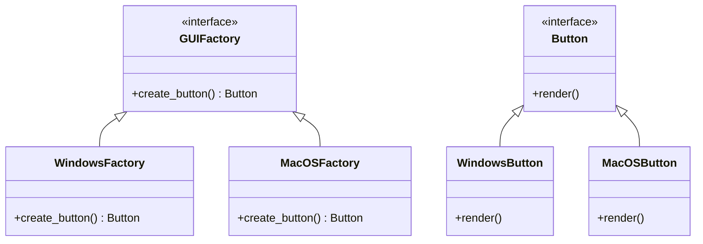
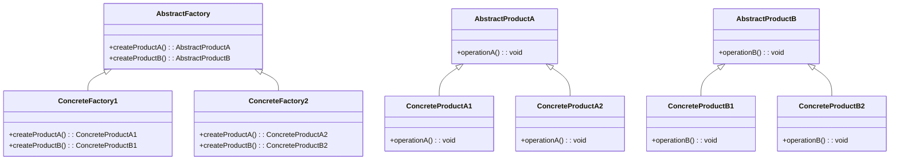
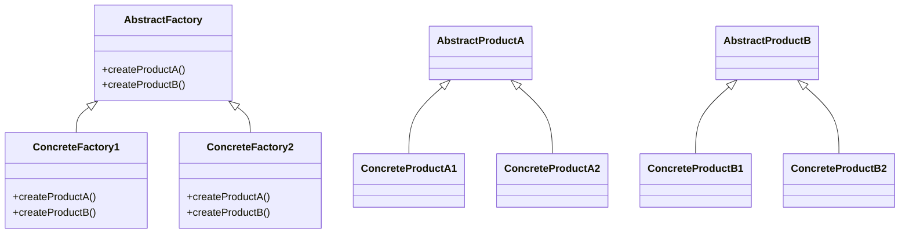
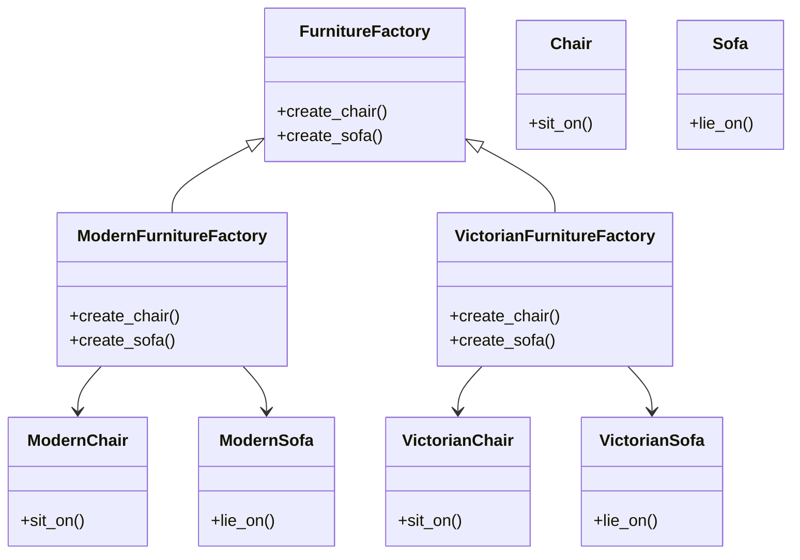
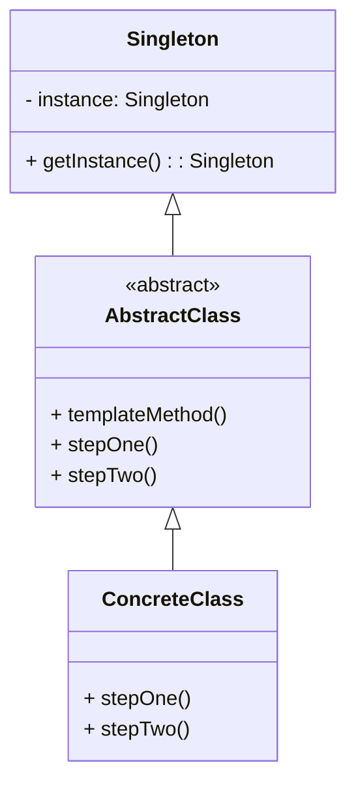
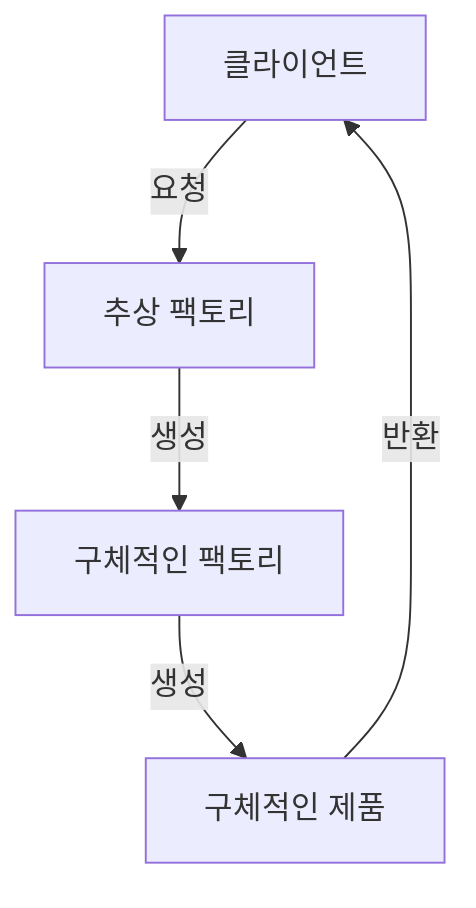
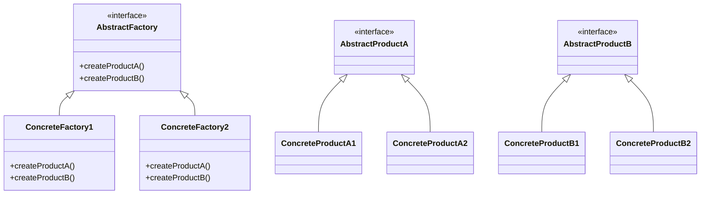
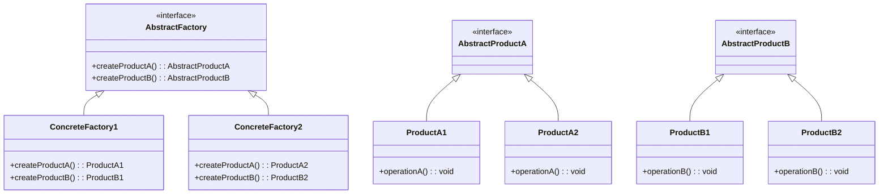

추상 팩토리 패턴은 객체 생성의 유연성을 제공하는 디자인 패턴으로, 서로 관련된 객체들을 일관된 방식으로 생성할 수 있도록 돕는다. 이 패턴은 구체적인 클래스에 의존하지 않고, 제품군을 정의하고 이를 생성하는 인터페이스를 제공함으로써, 클라이언트 코드가 구체적인 제품의 생성 방식에 대해 알 필요가 없도록 한다. 예를 들어, 가구 쇼핑몰 시뮬레이터를 생각해보자. 이 시뮬레이터는 의자, 소파, 커피 테이블과 같은 가구 제품을 다루며, 각 제품은 현대적, 빅토리안, 아르데코와 같은 다양한 스타일로 제공된다. 이때, 각 스타일에 맞는 제품을 생성하기 위해 추상 팩토리 패턴을 활용하면, 클라이언트는 특정 스타일의 제품을 요청할 수 있으며, 해당 스타일에 맞는 제품이 생성된다. 이 패턴의 장점은 새로운 제품이나 스타일이 추가될 때 기존 코드를 수정할 필요 없이 새로운 팩토리 클래스를 추가함으로써 쉽게 확장할 수 있다는 점이다. 따라서, 추상 팩토리 패턴은 객체 생성의 복잡성을 줄이고, 코드의 재사용성을 높이며, 유지보수를 용이하게 하는 데 큰 도움이 된다.


||
|:---:|
||


<!--
##### Outline #####
-->

<!--
# 목차

## 1. 개요
   - 추상 팩토리 패턴의 정의
   - 패턴의 필요성 및 사용 사례
   - 패턴의 장점과 단점

## 2. 추상 팩토리 패턴의 구성 요소
   - AbstractFactory: 인터페이스 정의
   - ConcreteFactory: 구체적인 팩토리 클래스
   - AbstractProduct: 제품 인터페이스
   - ConcreteProduct: 구체적인 제품 클래스

## 3. 추상 팩토리 패턴의 동작 원리
   - 객체 생성 과정 설명
   - 클라이언트 코드와의 관계
   - 환경 설정에 따른 팩토리 선택

## 4. 예제
   - 가구 쇼핑몰 시뮬레이터 예제
     - 가구 제품군: 의자, 소파, 커피 테이블
     - 제품 변형: 현대식, 빅토리안, 아르데코
   - UI 요소 생성 예제
     - 운영 체제에 따른 UI 요소 생성
   - 엘리베이터 부품 예제
     - 다양한 제조업체의 부품 생성

## 5. FAQ
   - Q1: 추상 팩토리 패턴과 팩토리 메서드 패턴의 차이점은 무엇인가요?
   - Q2: 추상 팩토리 패턴을 사용할 때의 주의사항은 무엇인가요?
   - Q3: 새로운 제품 변형을 추가할 때 어떤 절차를 따라야 하나요?
   - Q4: 추상 팩토리 패턴의 성능은 어떤가요?

## 6. 관련 기술
   - 디자인 패턴 개요
   - 생성 패턴(Creational Patterns)
   - 싱글턴 패턴(Singleton Pattern)
   - 템플릿 메서드 패턴(Template Method Pattern)

## 7. 결론
   - 추상 팩토리 패턴의 중요성
   - 패턴의 활용 가능성
   - 향후 연구 및 개발 방향

## 8. 참고 문헌
   - 관련 서적 및 자료
   - 온라인 리소스 및 링크

## 9. 추가 자료
   - UML 다이어그램 예시
   - 코드 예제 및 설명
   - 패턴 적용 사례 연구

이 목차는 추상 팩토리 패턴에 대한 포괄적인 이해를 돕고, 관련된 기술 및 예제를 통해 독자가 실질적인 적용 방법을 배울 수 있도록 구성되었습니다.
-->

<!--
## 1. 개요
   - 추상 팩토리 패턴의 정의
   - 패턴의 필요성 및 사용 사례
   - 패턴의 장점과 단점
-->

## 1. 개요

**추상 팩토리 패턴의 정의**  
추상 팩토리 패턴은 객체 생성에 관련된 디자인 패턴 중 하나로, 구체적인 클래스에 의존하지 않고 관련된 객체들의 집합을 생성하는 인터페이스를 제공하는 패턴이다. 이 패턴은 클라이언트가 어떤 구체적인 클래스의 인스턴스를 생성할지 결정하지 않고, 팩토리 인터페이스를 통해 객체를 생성할 수 있도록 한다. 이를 통해 코드의 유연성과 확장성을 높일 수 있다.

**패턴의 필요성 및 사용 사례**  
추상 팩토리 패턴은 다양한 제품군을 생성해야 할 때 유용하다. 예를 들어, UI 라이브러리에서 운영 체제에 따라 다른 버튼이나 텍스트 박스를 생성해야 할 경우, 추상 팩토리 패턴을 사용하여 각 운영 체제에 맞는 UI 요소를 생성할 수 있다. 또한, 가구 쇼핑몰과 같은 시뮬레이터에서 다양한 스타일의 가구를 생성할 때도 이 패턴이 적합하다.

**패턴의 장점과 단점**  
장점으로는 코드의 유연성과 확장성이 있다. 새로운 제품 변형을 추가할 때 기존 코드를 수정할 필요 없이 새로운 팩토리 클래스를 추가하면 되기 때문이다. 또한, 클라이언트 코드가 구체적인 클래스에 의존하지 않기 때문에 코드의 재사용성이 높아진다. 반면, 단점으로는 시스템의 복잡성이 증가할 수 있다는 점이다. 여러 개의 팩토리 클래스와 제품 클래스가 필요하기 때문에 코드가 복잡해질 수 있다.

**샘플 코드**

아래는 추상 팩토리 패턴의 간단한 예제 코드이다.

```python
from abc import ABC, abstractmethod

# Abstract Product
class Button(ABC):
    @abstractmethod
    def render(self):
        pass

# Concrete Products
class WindowsButton(Button):
    def render(self):
        return "Windows Button"

class MacOSButton(Button):
    def render(self):
        return "MacOS Button"

# Abstract Factory
class GUIFactory(ABC):
    @abstractmethod
    def create_button(self) -> Button:
        pass

# Concrete Factories
class WindowsFactory(GUIFactory):
    def create_button(self) -> Button:
        return WindowsButton()

class MacOSFactory(GUIFactory):
    def create_button(self) -> Button:
        return MacOSButton()

# Client Code
def client_code(factory: GUIFactory):
    button = factory.create_button()
    print(button.render())

# Usage
if __name__ == "__main__":
    os_type = "Windows"  # or "MacOS"
    factory = WindowsFactory() if os_type == "Windows" else MacOSFactory()
    client_code(factory)
```

**UML 다이어그램**

아래는 추상 팩토리 패턴의 UML 다이어그램이다.



이와 같이 추상 팩토리 패턴은 객체 생성의 유연성을 제공하며, 다양한 제품군을 효과적으로 관리할 수 있는 방법을 제시한다.

<!--
## 2. 추상 팩토리 패턴의 구성 요소
   - AbstractFactory: 인터페이스 정의
   - ConcreteFactory: 구체적인 팩토리 클래스
   - AbstractProduct: 제품 인터페이스
   - ConcreteProduct: 구체적인 제품 클래스
-->

## 2. 추상 팩토리 패턴의 구성 요소

추상 팩토리 패턴은 객체 생성의 인터페이스를 정의하고, 구체적인 객체 생성은 서브클래스에서 처리하도록 하는 디자인 패턴이다. 이 패턴은 여러 제품군을 생성할 수 있는 구조를 제공하며, 각 구성 요소는 다음과 같은 역할을 한다.

**AbstractFactory: 인터페이스 정의**  
AbstractFactory는 제품 객체를 생성하기 위한 인터페이스를 정의한다. 이 인터페이스는 다양한 제품을 생성하는 메서드를 포함하고 있으며, 클라이언트는 이 인터페이스를 통해 제품을 생성할 수 있다. 이를 통해 클라이언트는 구체적인 클래스에 의존하지 않고, 다양한 제품군을 사용할 수 있는 유연성을 제공받는다.

**ConcreteFactory: 구체적인 팩토리 클래스**  
ConcreteFactory는 AbstractFactory 인터페이스를 구현하는 클래스이다. 이 클래스는 특정 제품군에 대한 구체적인 객체를 생성하는 메서드를 제공한다. 예를 들어, 현대식 가구를 생성하는 ConcreteFactory는 현대식 의자, 소파, 커피 테이블을 생성하는 메서드를 포함할 수 있다.

**AbstractProduct: 제품 인터페이스**  
AbstractProduct는 생성될 제품의 인터페이스를 정의한다. 이 인터페이스는 제품이 가져야 할 공통적인 메서드를 포함하고 있으며, 이를 통해 클라이언트는 제품의 구체적인 구현에 의존하지 않고도 제품을 사용할 수 있다.

**ConcreteProduct: 구체적인 제품 클래스**  
ConcreteProduct는 AbstractProduct 인터페이스를 구현하는 클래스이다. 이 클래스는 실제로 생성될 제품의 구체적인 구현을 제공한다. 예를 들어, 현대식 의자, 빅토리안 소파, 아르데코 커피 테이블 등이 ConcreteProduct로 구현될 수 있다.

다음은 추상 팩토리 패턴의 구성 요소를 나타내는 UML 다이어그램이다.



위의 다이어그램은 추상 팩토리 패턴의 구성 요소 간의 관계를 보여준다. AbstractFactory는 ConcreteFactory에 의해 구현되며, 각 ConcreteFactory는 AbstractProduct의 구체적인 구현체인 ConcreteProduct를 생성한다. 이러한 구조는 클라이언트가 구체적인 클래스에 의존하지 않고도 다양한 제품을 생성할 수 있도록 한다.

<!--
## 3. 추상 팩토리 패턴의 동작 원리
   - 객체 생성 과정 설명
   - 클라이언트 코드와의 관계
   - 환경 설정에 따른 팩토리 선택
-->

## 3. 추상 팩토리 패턴의 동작 원리

**객체 생성 과정 설명**  
추상 팩토리 패턴은 객체 생성의 책임을 팩토리 클래스에 위임하여 클라이언트 코드가 구체적인 클래스에 의존하지 않도록 하는 디자인 패턴이다. 이 패턴은 여러 제품군을 생성할 수 있는 인터페이스를 제공하며, 클라이언트는 이 인터페이스를 통해 제품을 생성한다. 

객체 생성 과정은 다음과 같은 단계로 이루어진다:

1. 클라이언트는 추상 팩토리 인터페이스를 통해 제품을 요청한다.
2. 구체적인 팩토리 클래스가 선택되어 인스턴스화된다.
3. 선택된 팩토리 클래스는 요청된 제품의 인스턴스를 생성하여 반환한다.

이 과정에서 클라이언트는 구체적인 제품 클래스에 대한 정보를 알 필요가 없으며, 오직 추상 팩토리 인터페이스만을 통해 상호작용한다.

**클라이언트 코드와의 관계**  
클라이언트 코드는 추상 팩토리 인터페이스에 의존하며, 이를 통해 다양한 제품을 생성할 수 있다. 클라이언트는 구체적인 팩토리 클래스에 대한 정보를 알지 못하므로, 새로운 제품 변형이 추가되더라도 클라이언트 코드는 변경되지 않는다. 이는 코드의 유연성과 확장성을 높여준다.

예를 들어, 클라이언트는 다음과 같이 팩토리를 사용하여 제품을 생성할 수 있다:

```python
class Client:
    def __init__(self, factory: AbstractFactory):
        self.factory = factory

    def create_product(self):
        product = self.factory.create_product()
        return product
```

**환경 설정에 따른 팩토리 선택**  
추상 팩토리 패턴은 환경 설정에 따라 적절한 팩토리를 선택할 수 있는 유연성을 제공한다. 예를 들어, 운영 체제나 사용자 설정에 따라 서로 다른 팩토리를 선택하여 제품을 생성할 수 있다. 

다음은 환경 설정에 따라 팩토리를 선택하는 예시 코드이다:

```python
def get_factory(os_type: str) -> AbstractFactory:
    if os_type == "Windows":
        return WindowsFactory()
    elif os_type == "Linux":
        return LinuxFactory()
    else:
        raise ValueError("Unsupported OS type")
```

이와 같은 방식으로 클라이언트는 환경에 맞는 팩토리를 선택하여 제품을 생성할 수 있다.

**다이어그램**  
아래는 추상 팩토리 패턴의 동작 원리를 나타내는 UML 다이어그램이다:



이 다이어그램은 추상 팩토리 패턴의 구조와 객체 간의 관계를 시각적으로 나타내며, 각 클래스의 역할을 명확히 보여준다.

<!--
## 4. 예제
   - 가구 쇼핑몰 시뮬레이터 예제
     - 가구 제품군: 의자, 소파, 커피 테이블
     - 제품 변형: 현대식, 빅토리안, 아르데코
   - UI 요소 생성 예제
     - 운영 체제에 따른 UI 요소 생성
   - 엘리베이터 부품 예제
     - 다양한 제조업체의 부품 생성
-->

## 4. 예제

**가구 쇼핑몰 시뮬레이터 예제**  
추상 팩토리 패턴을 활용한 가구 쇼핑몰 시뮬레이터는 다양한 가구 제품군을 생성하는 데 유용하다. 이 예제에서는 의자, 소파, 커피 테이블과 같은 가구 제품군을 다룬다. 각 제품군은 현대식, 빅토리안, 아르데코와 같은 다양한 제품 변형을 가질 수 있다.

다음은 가구 쇼핑몰 시뮬레이터의 간단한 코드 예제이다.

```python
from abc import ABC, abstractmethod

# Abstract Product
class Chair(ABC):
    @abstractmethod
    def sit_on(self):
        pass

class Sofa(ABC):
    @abstractmethod
    def lie_on(self):
        pass

class CoffeeTable(ABC):
    @abstractmethod
    def place_items(self):
        pass

# Concrete Products
class ModernChair(Chair):
    def sit_on(self):
        return "Sitting on a modern chair."

class VictorianChair(Chair):
    def sit_on(self):
        return "Sitting on a Victorian chair."

class ModernSofa(Sofa):
    def lie_on(self):
        return "Lying on a modern sofa."

class VictorianSofa(Sofa):
    def lie_on(self):
        return "Lying on a Victorian sofa."

class ModernCoffeeTable(CoffeeTable):
    def place_items(self):
        return "Placing items on a modern coffee table."

class VictorianCoffeeTable(CoffeeTable):
    def place_items(self):
        return "Placing items on a Victorian coffee table."

# Abstract Factory
class FurnitureFactory(ABC):
    @abstractmethod
    def create_chair(self):
        pass

    @abstractmethod
    def create_sofa(self):
        pass

    @abstractmethod
    def create_coffee_table(self):
        pass

# Concrete Factory
class ModernFurnitureFactory(FurnitureFactory):
    def create_chair(self):
        return ModernChair()

    def create_sofa(self):
        return ModernSofa()

    def create_coffee_table(self):
        return ModernCoffeeTable()

class VictorianFurnitureFactory(FurnitureFactory):
    def create_chair(self):
        return VictorianChair()

    def create_sofa(self):
        return VictorianSofa()

    def create_coffee_table(self):
        return VictorianCoffeeTable()

# Client Code
def client_code(factory: FurnitureFactory):
    chair = factory.create_chair()
    sofa = factory.create_sofa()
    coffee_table = factory.create_coffee_table()

    print(chair.sit_on())
    print(sofa.lie_on())
    print(coffee_table.place_items())

# Usage
print("Modern Furniture:")
client_code(ModernFurnitureFactory())

print("\nVictorian Furniture:")
client_code(VictorianFurnitureFactory())
```

**UI 요소 생성 예제**  
운영 체제에 따라 UI 요소를 생성하는 예제는 추상 팩토리 패턴의 또 다른 활용 사례이다. 이 예제에서는 Windows와 macOS에 따라 버튼과 텍스트 필드를 생성하는 방법을 보여준다.

```python
# Abstract Product
class Button(ABC):
    @abstractmethod
    def click(self):
        pass

class TextField(ABC):
    @abstractmethod
    def type(self):
        pass

# Concrete Products
class WindowsButton(Button):
    def click(self):
        return "Windows Button clicked."

class MacOSButton(Button):
    def click(self):
        return "MacOS Button clicked."

class WindowsTextField(TextField):
    def type(self):
        return "Typing in Windows TextField."

class MacOSTextField(TextField):
    def type(self):
        return "Typing in MacOS TextField."

# Abstract Factory
class GUIFactory(ABC):
    @abstractmethod
    def create_button(self):
        pass

    @abstractmethod
    def create_text_field(self):
        pass

# Concrete Factory
class WindowsFactory(GUIFactory):
    def create_button(self):
        return WindowsButton()

    def create_text_field(self):
        return WindowsTextField()

class MacOSFactory(GUIFactory):
    def create_button(self):
        return MacOSButton()

    def create_text_field(self):
        return MacOSTextField()

# Client Code
def client_code(factory: GUIFactory):
    button = factory.create_button()
    text_field = factory.create_text_field()

    print(button.click())
    print(text_field.type())

# Usage
print("Windows UI:")
client_code(WindowsFactory())

print("\nMacOS UI:")
client_code(MacOSFactory())
```

**엘리베이터 부품 예제**  
엘리베이터 시스템에서 다양한 제조업체의 부품을 생성하는 예제는 추상 팩토리 패턴의 유용성을 잘 보여준다. 이 예제에서는 엘리베이터의 버튼과 모니터를 생성하는 두 개의 제조업체를 다룬다.

```python
# Abstract Product
class ElevatorButton(ABC):
    @abstractmethod
    def press(self):
        pass

class ElevatorMonitor(ABC):
    @abstractmethod
    def display(self):
        pass

# Concrete Products
class ManufacturerAButton(ElevatorButton):
    def press(self):
        return "Manufacturer A Button pressed."

class ManufacturerBButton(ElevatorButton):
    def press(self):
        return "Manufacturer B Button pressed."

class ManufacturerAMonitor(ElevatorMonitor):
    def display(self):
        return "Displaying on Manufacturer A Monitor."

class ManufacturerBMonitor(ElevatorMonitor):
    def display(self):
        return "Displaying on Manufacturer B Monitor."

# Abstract Factory
class ElevatorPartsFactory(ABC):
    @abstractmethod
    def create_button(self):
        pass

    @abstractmethod
    def create_monitor(self):
        pass

# Concrete Factory
class ManufacturerAFactory(ElevatorPartsFactory):
    def create_button(self):
        return ManufacturerAButton()

    def create_monitor(self):
        return ManufacturerAMonitor()

class ManufacturerBFactory(ElevatorPartsFactory):
    def create_button(self):
        return ManufacturerBButton()

    def create_monitor(self):
        return ManufacturerBMonitor()

# Client Code
def client_code(factory: ElevatorPartsFactory):
    button = factory.create_button()
    monitor = factory.create_monitor()

    print(button.press())
    print(monitor.display())

# Usage
print("Manufacturer A Parts:")
client_code(ManufacturerAFactory())

print("\nManufacturer B Parts:")
client_code(ManufacturerBFactory())
```

이와 같은 예제들은 추상 팩토리 패턴이 다양한 상황에서 어떻게 활용될 수 있는지를 보여준다. 각 예제는 특정 도메인에 맞춰 설계되었으며, 이를 통해 독자는 패턴의 실질적인 적용 방법을 이해할 수 있다.

<!--
## 5. FAQ
   - Q1: 추상 팩토리 패턴과 팩토리 메서드 패턴의 차이점은 무엇인가요?
   - Q2: 추상 팩토리 패턴을 사용할 때의 주의사항은 무엇인가요?
   - Q3: 새로운 제품 변형을 추가할 때 어떤 절차를 따라야 하나요?
   - Q4: 추상 팩토리 패턴의 성능은 어떤가요?
-->

## 5. FAQ

**Q1: 추상 팩토리 패턴과 팩토리 메서드 패턴의 차이점은 무엇인가요?**  
추상 팩토리 패턴과 팩토리 메서드 패턴은 모두 객체 생성에 관련된 디자인 패턴이지만, 그 사용 목적과 구조에서 차이가 있다. 팩토리 메서드 패턴은 하나의 제품을 생성하는 데 초점을 맞추고 있으며, 서브클래스에서 구체적인 제품을 결정한다. 반면, 추상 팩토리 패턴은 관련된 여러 제품군을 생성하는 데 사용되며, 클라이언트는 구체적인 제품 클래스에 의존하지 않고 인터페이스를 통해 제품을 사용한다. 즉, 추상 팩토리 패턴은 여러 제품을 동시에 생성할 수 있는 반면, 팩토리 메서드 패턴은 단일 제품에 집중한다.

**Q2: 추상 팩토리 패턴을 사용할 때의 주의사항은 무엇인가요?**  
추상 팩토리 패턴을 사용할 때는 몇 가지 주의사항이 있다. 첫째, 제품군이 명확하게 정의되어야 하며, 각 제품 간의 관계를 이해해야 한다. 둘째, 새로운 제품 변형을 추가할 때 기존 코드에 영향을 최소화하도록 설계해야 한다. 셋째, 클라이언트 코드가 구체적인 제품 클래스에 의존하지 않도록 인터페이스를 통해 제품을 사용해야 한다. 마지막으로, 패턴의 복잡성으로 인해 코드가 지나치게 복잡해질 수 있으므로, 필요에 따라 패턴을 적용하는 것이 중요하다.

**Q3: 새로운 제품 변형을 추가할 때 어떤 절차를 따라야 하나요?**  
새로운 제품 변형을 추가할 때는 다음과 같은 절차를 따르면 좋다. 첫째, 새로운 제품 변형에 대한 요구사항을 명확히 정의한다. 둘째, 기존의 `AbstractProduct` 인터페이스를 구현하는 새로운 `ConcreteProduct` 클래스를 생성한다. 셋째, 새로운 제품 변형을 생성할 수 있는 `ConcreteFactory` 클래스를 추가한다. 넷째, 클라이언트 코드에서 새로운 제품 변형을 사용할 수 있도록 수정한다. 마지막으로, 모든 변경 사항이 잘 작동하는지 테스트하여 기존 기능에 영향을 미치지 않도록 확인해야 한다.

**Q4: 추상 팩토리 패턴의 성능은 어떤가요?**  
추상 팩토리 패턴의 성능은 일반적으로 객체 생성에 필요한 오버헤드가 발생할 수 있지만, 이는 설계의 유연성과 유지보수성을 고려할 때 충분히 감수할 만한 부분이다. 객체 생성 과정에서 인터페이스를 통해 제품을 생성하므로, 런타임에 어떤 제품이 생성될지 결정할 수 있는 장점이 있다. 그러나, 너무 많은 제품 변형이 존재할 경우, 팩토리 클래스의 수가 증가하여 코드가 복잡해질 수 있으므로, 성능과 유지보수성 간의 균형을 잘 맞추는 것이 중요하다.

**샘플 코드**

아래는 추상 팩토리 패턴을 사용하여 가구 제품을 생성하는 예제 코드이다.

```python
# 제품 인터페이스
class Chair:
    def sit_on(self):
        pass

class Sofa:
    def lie_on(self):
        pass

# 구체적인 제품 클래스
class ModernChair(Chair):
    def sit_on(self):
        return "Modern Chair: You can sit comfortably."

class VictorianChair(Chair):
    def sit_on(self):
        return "Victorian Chair: You can sit elegantly."

class ModernSofa(Sofa):
    def lie_on(self):
        return "Modern Sofa: You can lie down comfortably."

class VictorianSofa(Sofa):
    def lie_on(self):
        return "Victorian Sofa: You can lie down elegantly."

# 팩토리 인터페이스
class FurnitureFactory:
    def create_chair(self):
        pass

    def create_sofa(self):
        pass

# 구체적인 팩토리 클래스
class ModernFurnitureFactory(FurnitureFactory):
    def create_chair(self):
        return ModernChair()

    def create_sofa(self):
        return ModernSofa()

class VictorianFurnitureFactory(FurnitureFactory):
    def create_chair(self):
        return VictorianChair()

    def create_sofa(self):
        return VictorianSofa()

# 클라이언트 코드
def client_code(factory: FurnitureFactory):
    chair = factory.create_chair()
    sofa = factory.create_sofa()
    print(chair.sit_on())
    print(sofa.lie_on())

# 사용 예
print("Modern Furniture:")
client_code(ModernFurnitureFactory())

print("\nVictorian Furniture:")
client_code(VictorianFurnitureFactory())
```

**UML 다이어그램**



위의 내용은 추상 팩토리 패턴에 대한 자주 묻는 질문과 그에 대한 답변을 포함하고 있으며, 샘플 코드와 UML 다이어그램을 통해 패턴의 구조와 동작 방식을 시각적으로 이해할 수 있도록 돕는다.

<!--
## 6. 관련 기술
   - 디자인 패턴 개요
   - 생성 패턴(Creational Patterns)
   - 싱글턴 패턴(Singleton Pattern)
   - 템플릿 메서드 패턴(Template Method Pattern)
-->

## 6. 관련 기술

**디자인 패턴 개요**  
디자인 패턴은 소프트웨어 설계에서 자주 발생하는 문제를 해결하기 위한 일반적인 솔루션이다. 이러한 패턴은 코드의 재사용성을 높이고, 유지보수를 용이하게 하며, 팀 간의 의사소통을 개선하는 데 도움을 준다. 디자인 패턴은 크게 생성 패턴(Creational Patterns), 구조 패턴(Structural Patterns), 행동 패턴(Behavioral Patterns)으로 나눌 수 있다.

**생성 패턴(Creational Patterns)**  
생성 패턴은 객체 생성 메커니즘을 다루며, 객체 생성의 복잡성을 줄이고, 코드의 유연성을 높이는 데 중점을 둔다. 대표적인 생성 패턴으로는 추상 팩토리 패턴, 팩토리 메서드 패턴, 싱글턴 패턴, 빌더 패턴 등이 있다. 이러한 패턴들은 객체의 생성 과정을 캡슐화하여 클라이언트 코드가 구체적인 클래스에 의존하지 않도록 한다.

**싱글턴 패턴(Singleton Pattern)**  
싱글턴 패턴은 클래스의 인스턴스가 오직 하나만 존재하도록 보장하는 패턴이다. 이 패턴은 전역 상태를 관리하거나, 자원 관리가 필요한 경우에 유용하다. 싱글턴 패턴을 구현하기 위해서는 생성자를 private으로 설정하고, 클래스 내부에 static 변수를 두어 인스턴스를 관리한다. 아래는 싱글턴 패턴의 간단한 예제 코드이다.

```java
public class Singleton {
    private static Singleton instance;

    private Singleton() {
        // private constructor to prevent instantiation
    }

    public static Singleton getInstance() {
        if (instance == null) {
            instance = new Singleton();
        }
        return instance;
    }
}
```

**템플릿 메서드 패턴(Template Method Pattern)**  
템플릿 메서드 패턴은 알고리즘의 구조를 정의하고, 일부 단계를 서브클래스에서 구현하도록 하는 패턴이다. 이 패턴은 코드의 중복을 줄이고, 알고리즘의 일관성을 유지하는 데 도움을 준다. 템플릿 메서드는 일반적으로 추상 클래스에서 정의되며, 서브클래스에서 구체적인 구현을 제공한다. 아래는 템플릿 메서드 패턴의 예제 코드이다.

```java
abstract class AbstractClass {
    // 템플릿 메서드
    public final void templateMethod() {
        stepOne();
        stepTwo();
        stepThree();
    }

    protected abstract void stepOne();
    protected abstract void stepTwo();

    private void stepThree() {
        System.out.println("Step Three: Common step");
    }
}

class ConcreteClass extends AbstractClass {
    @Override
    protected void stepOne() {
        System.out.println("Step One: Implementation in ConcreteClass");
    }

    @Override
    protected void stepTwo() {
        System.out.println("Step Two: Implementation in ConcreteClass");
    }
}
```

**UML 다이어그램**  
아래는 싱글턴 패턴과 템플릿 메서드 패턴의 UML 다이어그램이다.



이와 같이 관련 기술을 이해하면 추상 팩토리 패턴을 포함한 다양한 디자인 패턴을 효과적으로 활용할 수 있다. 각 패턴의 특징과 사용 사례를 숙지함으로써 소프트웨어 설계의 품질을 높일 수 있다.

<!--
## 7. 결론
   - 추상 팩토리 패턴의 중요성
   - 패턴의 활용 가능성
   - 향후 연구 및 개발 방향
-->

## 7. 결론

**추상 팩토리 패턴의 중요성**  
추상 팩토리 패턴은 객체 생성의 복잡성을 줄이고, 코드의 유연성을 높이는 데 중요한 역할을 한다. 이 패턴을 사용하면 클라이언트 코드가 구체적인 클래스에 의존하지 않게 되어, 새로운 제품 변형을 추가하거나 기존 제품을 변경할 때 클라이언트 코드를 수정할 필요가 없어진다. 이는 유지보수성을 크게 향상시키며, 코드의 재사용성을 높이는 데 기여한다.

**패턴의 활용 가능성**  
추상 팩토리 패턴은 다양한 분야에서 활용될 수 있다. 예를 들어, UI 프레임워크에서 운영 체제에 따라 다른 UI 요소를 생성할 때, 또는 게임 개발에서 다양한 캐릭터나 아이템을 생성할 때 이 패턴을 적용할 수 있다. 또한, 대규모 시스템에서 다양한 구성 요소를 통합할 때도 유용하게 사용될 수 있다. 이처럼 추상 팩토리 패턴은 다양한 상황에서 유연한 객체 생성을 가능하게 하여, 개발자에게 많은 이점을 제공한다.

**향후 연구 및 개발 방향**  
향후 연구 및 개발 방향으로는 추상 팩토리 패턴을 다른 디자인 패턴과 결합하여 사용하는 방법에 대한 연구가 필요하다. 예를 들어, 전략 패턴이나 옵저버 패턴과의 결합을 통해 더욱 복잡한 시스템을 설계할 수 있을 것이다. 또한, 현대의 소프트웨어 개발 환경에서는 마이크로서비스 아키텍처와 같은 새로운 패러다임이 등장하고 있으므로, 이러한 환경에서 추상 팩토리 패턴이 어떻게 적용될 수 있는지에 대한 연구도 중요하다.



위의 다이어그램은 추상 팩토리 패턴의 기본적인 구조를 나타낸다. 클라이언트는 추상 팩토리를 통해 구체적인 팩토리를 요청하고, 구체적인 팩토리는 필요한 제품을 생성하여 클라이언트에 반환한다. 이러한 구조는 클라이언트가 구체적인 클래스에 의존하지 않도록 하여, 코드의 유연성을 높인다. 

결론적으로, 추상 팩토리 패턴은 소프트웨어 설계에서 중요한 역할을 하며, 다양한 활용 가능성을 지니고 있다. 앞으로의 연구와 개발을 통해 이 패턴의 적용 범위가 더욱 넓어질 것으로 기대된다.

<!--
## 8. 참고 문헌
   - 관련 서적 및 자료
   - 온라인 리소스 및 링크
-->

## 8. 참고 문헌

**관련 서적 및 자료**

1. **"Design Patterns: Elements of Reusable Object-Oriented Software"** - Erich Gamma, Richard Helm, Ralph Johnson, John Vlissides
   - 이 책은 디자인 패턴의 기초를 다루며, 다양한 패턴에 대한 설명과 예제를 제공한다. 추상 팩토리 패턴을 포함한 여러 생성 패턴에 대한 깊이 있는 이해를 돕는다.

2. **"Head First Design Patterns"** - Eric Freeman, Bert Bates, Kathy Sierra, Elisabeth Robson
   - 이 책은 디자인 패턴을 쉽게 이해할 수 있도록 다양한 비유와 그림을 사용하여 설명한다. 추상 팩토리 패턴을 실생활의 예와 함께 설명하여 독자가 쉽게 접근할 수 있도록 돕는다.

3. **"Design Patterns in Modern C++"** - Dmitri Nesteruk
   - 현대 C++에서 디자인 패턴을 구현하는 방법을 다룬 책으로, 추상 팩토리 패턴을 포함한 여러 패턴의 실제 구현 예제를 제공한다.

**온라인 리소스 및 링크**

1. **Refactoring Guru** - [Abstract Factory](https://refactoring.guru/design-patterns/abstract-factory)
   - 이 사이트는 다양한 디자인 패턴에 대한 설명과 예제를 제공하며, 추상 팩토리 패턴에 대한 명확한 설명과 함께 코드 예제를 포함하고 있다.

2. **GeeksforGeeks** - [Abstract Factory Design Pattern](https://www.geeksforgeeks.org/abstract-factory-design-pattern-introduction/)
   - GeeksforGeeks는 추상 팩토리 패턴에 대한 기초적인 설명과 함께 다양한 프로그래밍 언어에서의 구현 예제를 제공한다.

3. **YouTube** - "Abstract Factory Design Pattern" 검색
   - YouTube에는 추상 팩토리 패턴에 대한 다양한 강의와 튜토리얼이 존재한다. 시각적으로 이해하기 쉽게 설명하는 영상들이 많아 학습에 도움이 된다.

**샘플 코드 및 다이어그램**

아래는 추상 팩토리 패턴의 간단한 UML 다이어그램과 샘플 코드이다.



```python
# 추상 팩토리 패턴의 샘플 코드
class AbstractFactory:
    def create_product_a(self):
        pass

    def create_product_b(self):
        pass

class ConcreteFactory1(AbstractFactory):
    def create_product_a(self):
        return ConcreteProductA1()

    def create_product_b(self):
        return ConcreteProductB1()

class ConcreteFactory2(AbstractFactory):
    def create_product_a(self):
        return ConcreteProductA2()

    def create_product_b(self):
        return ConcreteProductB2()

class AbstractProductA:
    pass

class ConcreteProductA1(AbstractProductA):
    pass

class ConcreteProductA2(AbstractProductA):
    pass

class AbstractProductB:
    pass

class ConcreteProductB1(AbstractProductB):
    pass

class ConcreteProductB2(AbstractProductB):
    pass

# 클라이언트 코드
def client_code(factory: AbstractFactory):
    product_a = factory.create_product_a()
    product_b = factory.create_product_b()
    # 제품 사용 코드

# 사용 예
factory1 = ConcreteFactory1()
client_code(factory1)

factory2 = ConcreteFactory2()
client_code(factory2)
```

위의 자료들은 추상 팩토리 패턴을 이해하고 적용하는 데 유용한 참고 자료가 될 것이다.

<!--
## 9. 추가 자료
   - UML 다이어그램 예시
   - 코드 예제 및 설명
   - 패턴 적용 사례 연구
-->

## 9. 추가 자료

**UML 다이어그램 예시**  
추상 팩토리 패턴의 구조를 이해하기 위해 UML 다이어그램을 활용할 수 있다. 아래는 추상 팩토리 패턴의 기본적인 UML 다이어그램 예시이다.



이 다이어그램은 추상 팩토리 패턴의 주요 구성 요소와 그들 간의 관계를 보여준다. `AbstractFactory`는 제품을 생성하는 인터페이스를 정의하고, `ConcreteFactory`는 구체적인 제품을 생성하는 역할을 한다. 각 제품은 `AbstractProduct` 인터페이스를 구현하여 다양한 변형을 제공한다.

**코드 예제 및 설명**  
아래는 추상 팩토리 패턴을 사용하여 가구 쇼핑몰을 구현한 간단한 코드 예제이다.

```python
from abc import ABC, abstractmethod

# 제품 인터페이스
class Chair(ABC):
    @abstractmethod
    def sit_on(self):
        pass

class Sofa(ABC):
    @abstractmethod
    def lie_on(self):
        pass

# 구체적인 제품 클래스
class ModernChair(Chair):
    def sit_on(self):
        return "Modern Chair: You can sit comfortably."

class VictorianChair(Chair):
    def sit_on(self):
        return "Victorian Chair: A classic touch."

class ModernSofa(Sofa):
    def lie_on(self):
        return "Modern Sofa: Relax in style."

class VictorianSofa(Sofa):
    def lie_on(self):
        return "Victorian Sofa: Elegance and comfort."

# 추상 팩토리 인터페이스
class FurnitureFactory(ABC):
    @abstractmethod
    def create_chair(self) -> Chair:
        pass

    @abstractmethod
    def create_sofa(self) -> Sofa:
        pass

# 구체적인 팩토리 클래스
class ModernFurnitureFactory(FurnitureFactory):
    def create_chair(self) -> Chair:
        return ModernChair()

    def create_sofa(self) -> Sofa:
        return ModernSofa()

class VictorianFurnitureFactory(FurnitureFactory):
    def create_chair(self) -> Chair:
        return VictorianChair()

    def create_sofa(self) -> Sofa:
        return VictorianSofa()

# 클라이언트 코드
def client_code(factory: FurnitureFactory):
    chair = factory.create_chair()
    sofa = factory.create_sofa()
    print(chair.sit_on())
    print(sofa.lie_on())

# 사용 예
print("Modern Furniture:")
client_code(ModernFurnitureFactory())

print("\nVictorian Furniture:")
client_code(VictorianFurnitureFactory())
```

위의 코드 예제는 두 가지 스타일의 가구를 생성하는 추상 팩토리 패턴을 보여준다. `FurnitureFactory` 인터페이스를 통해 가구를 생성하는 방법을 정의하고, `ModernFurnitureFactory`와 `VictorianFurnitureFactory`는 각각 현대식과 빅토리안 스타일의 가구를 생성한다. 클라이언트 코드는 팩토리를 통해 가구를 생성하고, 각 가구의 기능을 호출하여 결과를 출력한다.

**패턴 적용 사례 연구**  
추상 팩토리 패턴은 다양한 분야에서 활용될 수 있다. 예를 들어, UI 프레임워크에서 운영 체제에 따라 다른 UI 요소를 생성하는 데 사용될 수 있다. 각 운영 체제에 맞는 UI 요소를 생성하는 팩토리를 구현함으로써, 코드의 재사용성과 유지보수성을 높일 수 있다. 또한, 게임 개발에서도 다양한 캐릭터나 아이템을 생성하는 데 유용하게 사용될 수 있다. 이러한 사례들은 추상 팩토리 패턴의 유연성과 확장성을 잘 보여준다.

<!--
##### Reference #####
-->

## Reference


* [https://refactoring.guru/design-patterns/abstract-factory](https://refactoring.guru/design-patterns/abstract-factory)
* [https://en.wikipedia.org/wiki/Abstract_factory_pattern](https://en.wikipedia.org/wiki/Abstract_factory_pattern)
* [https://gmlwjd9405.github.io/2018/08/08/abstract-factory-pattern.html](https://gmlwjd9405.github.io/2018/08/08/abstract-factory-pattern.html)
* [https://huisam.tistory.com/entry/AbstractFactory](https://huisam.tistory.com/entry/AbstractFactory)
* [https://johngrib.github.io/wiki/pattern/abstract-factory/](https://johngrib.github.io/wiki/pattern/abstract-factory/)
* [https://blog.naver.com/jvioonpe/220227450135](https://blog.naver.com/jvioonpe/220227450135)

