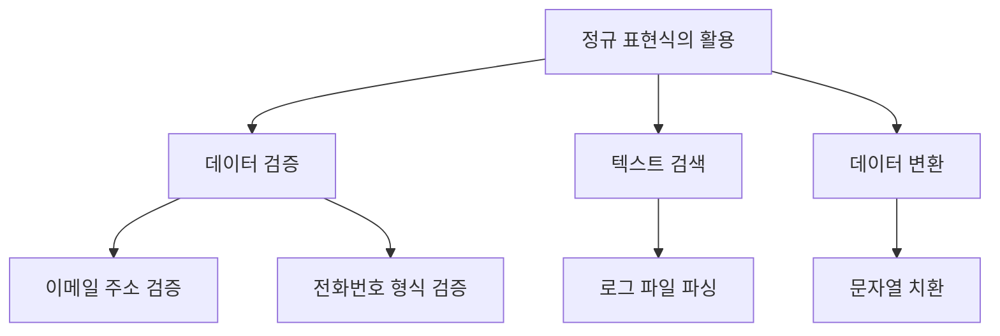
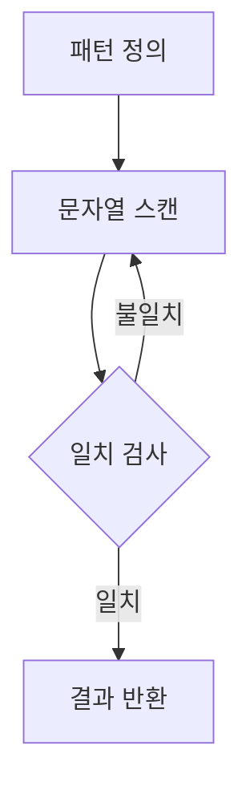
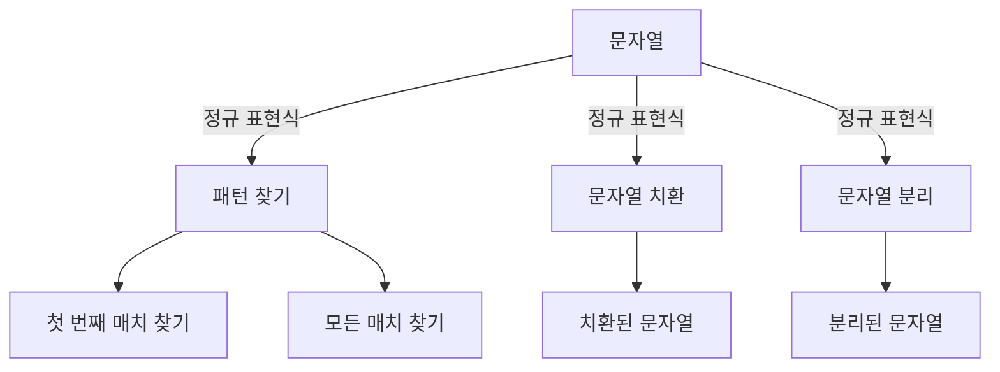
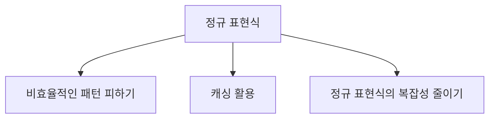
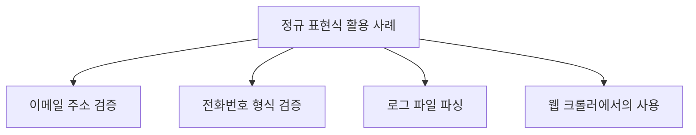
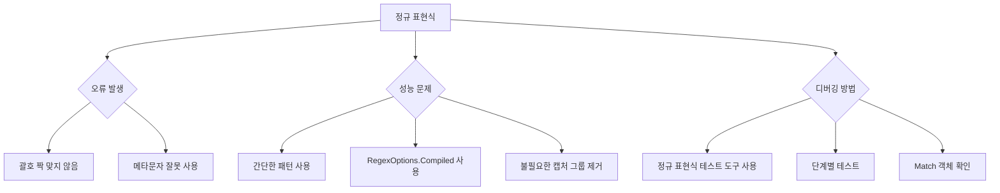
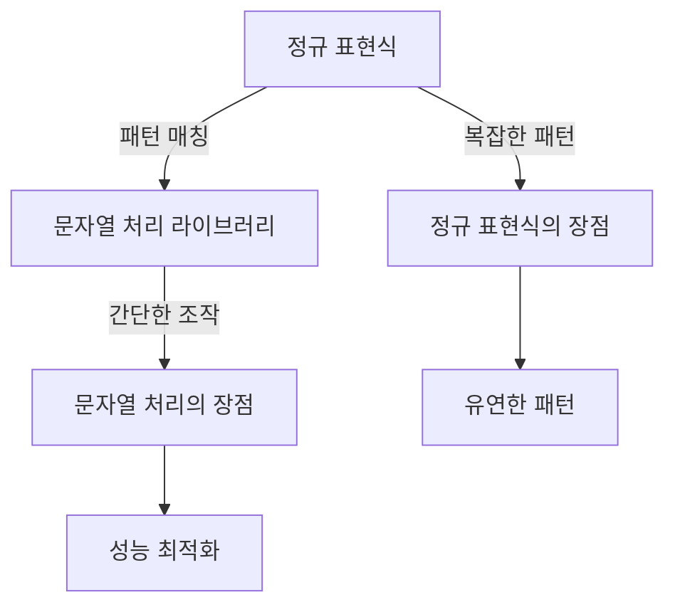
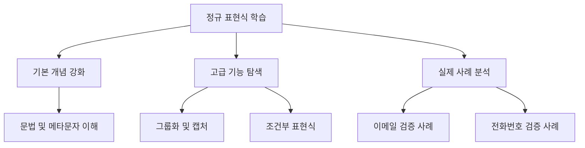
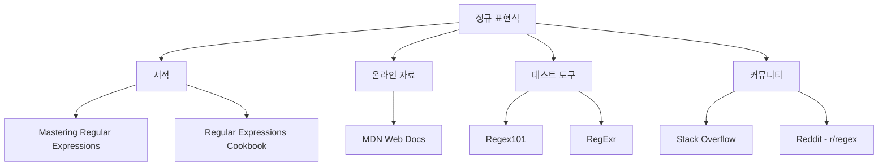

정규 표현식(Regular Expression, Regex)은 문자열에서 특정 패턴을 찾거나, 대체하거나, 검증하는 데 매우 유용한 도구이다. .NET에서는 `System.Text.RegularExpressions` 네임스페이스를 통해 정규 표현식 기능을 제공하며, 이를 통해 복잡한 문자열 처리 작업을 간편하게 수행할 수 있다. 정규 표현식은 Perl에서 발전된 개념으로, 다양한 메타 문자와 패턴을 사용하여 문자열을 검색하고 조작하는 데 강력한 기능을 발휘한다. 예를 들어, 특정 문자열이 포함되어 있는지 확인하거나, 문자열 내에서 특정 패턴을 찾아내어 대체하는 작업을 쉽게 수행할 수 있다. 이러한 기능은 웹 크롤러, 로그 파일 분석, 데이터 검증 등 다양한 분야에서 활용된다. 정규 표현식을 잘 활용하면 대량의 데이터에서 필요한 정보를 신속하게 추출할 수 있으며, 코드의 가독성과 유지보수성을 높이는 데 기여할 수 있다. 정규 표현식의 기본적인 사용법과 메타 문자, 패턴 매칭 방법에 대해 알아보면, 문자열 처리의 효율성을 크게 향상시킬 수 있다.


||
|:---:|
||


<!--
##### Outline #####
-->

<!--
# 목차

## 1. 개요
   - 정규 표현식(Regex)의 정의
   - .NET에서의 Regex 클래스 소개
   - 정규 표현식의 필요성과 활용 사례

## 2. 정규 표현식의 기본 개념
   - 정규 표현식의 구성 요소
   - 메타문자와 그 의미
   - 정규 표현식의 작동 방식

## 3. .NET의 Regex 클래스
   - Regex 클래스의 주요 메서드
     - CompileToAssembly
     - Count
     - EnumerateMatches
     - Split
     - Replace
   - RegexOptions의 사용법
   - Regex 클래스의 예제 코드

## 4. 정규 표현식 사용 예제
   - 문자열에서 패턴 찾기
     - 첫 번째 매치 찾기
     - 모든 매치 찾기
   - 문자열 치환하기
     - 특정 패턴을 다른 문자열로 치환
   - 문자열 분리하기
     - 특정 구분자를 기준으로 문자열 분리

## 5. 정규 표현식의 고급 기능
   - 그룹화와 캡처
   - 조건부 표현식
   - 동적 정규식 생성
   - 성능 최적화 및 주의사항

## 6. 정규 표현식의 활용 사례
   - 이메일 주소 검증
   - 전화번호 형식 검증
   - 로그 파일 파싱
   - 웹 크롤러에서의 사용

## 7. FAQ
   - 정규 표현식에서 자주 발생하는 오류
   - 정규 표현식의 성능 문제 해결 방법
   - 정규 표현식의 디버깅 방법

## 8. 관련 기술
   - 다른 프로그래밍 언어에서의 정규 표현식 사용
   - 정규 표현식과 문자열 처리 라이브러리 비교
   - 정규 표현식의 대안 기술

## 9. 결론
   - 정규 표현식의 중요성 요약
   - 정규 표현식을 활용한 효율적인 문자열 처리 방법
   - 향후 정규 표현식 학습 방향

## 10. 참고 자료
   - 정규 표현식 관련 서적 및 온라인 자료
   - 정규 표현식 테스트 도구 소개
   - 정규 표현식 관련 커뮤니티 및 포럼 링크

이 목차는 정규 표현식에 대한 포괄적인 이해를 돕고, .NET에서의 활용 방법을 중심으로 구성되었습니다. 각 섹션은 독자가 정규 표현식을 효과적으로 사용할 수 있도록 다양한 예제와 설명을 포함하고 있습니다.
-->

<!--
## 1. 개요
   - 정규 표현식(Regex)의 정의
   - .NET에서의 Regex 클래스 소개
   - 정규 표현식의 필요성과 활용 사례
-->

## 1. 개요

**정규 표현식(Regex)의 정의**  

정규 표현식(Regular Expression, Regex)은 문자열에서 특정 패턴을 찾거나 조작하기 위해 사용하는 강력한 도구이다. 정규 표현식은 문자, 숫자, 기호 등으로 구성된 패턴을 정의하여, 해당 패턴과 일치하는 문자열을 검색하거나 변환하는 데 사용된다. 예를 들어, 이메일 주소, 전화번호, 특정 형식의 데이터 등을 검증하는 데 유용하다.

**.NET에서의 Regex 클래스 소개**  

.NET 프레임워크에서는 `System.Text.RegularExpressions` 네임스페이스에 포함된 `Regex` 클래스를 통해 정규 표현식을 사용할 수 있다. 이 클래스는 정규 표현식을 컴파일하고, 문자열에서 패턴을 검색하거나 치환하는 다양한 메서드를 제공한다. `Regex` 클래스는 성능이 뛰어나고, 복잡한 패턴을 처리할 수 있는 기능을 갖추고 있어, .NET 환경에서 정규 표현식을 활용하는 데 매우 유용하다.

**정규 표현식의 필요성과 활용 사례**  

정규 표현식은 데이터 검증, 텍스트 검색 및 변환 등 다양한 분야에서 활용된다. 예를 들어, 웹 애플리케이션에서 사용자 입력을 검증할 때 정규 표현식을 사용하여 이메일 주소나 전화번호의 형식을 확인할 수 있다. 또한, 로그 파일에서 특정 패턴을 찾아내거나, 대량의 텍스트 데이터에서 필요한 정보를 추출하는 데에도 유용하다.

다음은 정규 표현식의 활용 사례를 나타내는 다이어그램이다.



정규 표현식은 이러한 다양한 활용 사례를 통해 개발자에게 강력한 도구가 된다. 이를 통해 복잡한 문자열 처리 작업을 간단하게 수행할 수 있으며, 코드의 가독성과 유지보수성을 높일 수 있다.

<!--
## 2. 정규 표현식의 기본 개념
   - 정규 표현식의 구성 요소
   - 메타문자와 그 의미
   - 정규 표현식의 작동 방식
-->

## 2. 정규 표현식의 기본 개념

정규 표현식은 문자열에서 특정 패턴을 찾거나 조작하기 위해 사용되는 강력한 도구이다. 이 섹션에서는 정규 표현식의 구성 요소, 메타문자, 그리고 정규 표현식의 작동 방식에 대해 살펴보겠다.

**정규 표현식의 구성 요소**

정규 표현식은 다양한 구성 요소로 이루어져 있다. 기본적으로는 문자, 메타문자, 그리고 특수 기호들이 조합되어 패턴을 형성한다. 다음은 정규 표현식의 주요 구성 요소이다.

- **문자**: 일반적인 문자로, 해당 문자가 문자열에 존재하는지를 검사한다.
- **메타문자**: 특정한 의미를 가지는 문자로, 패턴을 정의하는 데 사용된다.
- **수량자**: 특정 문자나 그룹이 몇 번 나타나는지를 정의한다.
- **그룹화**: 괄호를 사용하여 특정 부분을 그룹으로 묶어 패턴을 정의할 수 있다.

**메타문자와 그 의미**

메타문자는 정규 표현식에서 특별한 의미를 가지는 문자들이다. 다음은 자주 사용되는 메타문자와 그 의미이다.

| 메타문자 | 의미                          |
|----------|-------------------------------|
| `.`      | 임의의 한 문자               |
| `^`      | 문자열의 시작                |
| `$`      | 문자열의 끝                  |
| `*`      | 0회 이상 반복                |
| `+`      | 1회 이상 반복                |
| `?`      | 0회 또는 1회 발생            |
| `{n}`    | 정확히 n회 발생              |
| `{n,}`   | n회 이상 발생                |
| `{n,m}`  | n회 이상 m회 이하 발생      |
| `[]`     | 문자 클래스 (여러 문자 중 하나) |
| `\|`      | OR 연산자                    |
| `()`     | 그룹화                       |

**정규 표현식의 작동 방식**

정규 표현식은 주어진 문자열을 스캔하면서 패턴과 일치하는 부분을 찾는다. 이 과정은 다음과 같은 단계로 이루어진다.

1. **패턴 정의**: 사용자가 원하는 패턴을 정규 표현식으로 정의한다.
2. **문자열 스캔**: 정규 표현식 엔진이 문자열을 처음부터 끝까지 스캔한다.
3. **일치 검사**: 각 문자에 대해 패턴과 일치하는지를 검사한다.
4. **결과 반환**: 일치하는 부분이 발견되면 해당 결과를 반환한다.

다음은 정규 표현식의 작동 방식을 나타내는 다이어그램이다.



이와 같은 방식으로 정규 표현식은 문자열에서 원하는 패턴을 찾아내고, 이를 통해 다양한 문자열 조작 작업을 수행할 수 있다. 정규 표현식의 기본 개념을 이해하면, 이후의 고급 기능과 활용 사례를 보다 쉽게 이해할 수 있을 것이다.

<!--
## 3. .NET의 Regex 클래스
   - Regex 클래스의 주요 메서드
     - CompileToAssembly
     - Count
     - EnumerateMatches
     - Split
     - Replace
   - RegexOptions의 사용법
   - Regex 클래스의 예제 코드
-->

## 3. .NET의 Regex 클래스

정규 표현식을 사용하기 위해 .NET에서는 `Regex` 클래스를 제공한다. 이 클래스는 정규 표현식을 처리하는 데 필요한 다양한 메서드를 포함하고 있으며, 이를 통해 문자열 검색, 치환, 분리 등의 작업을 손쉽게 수행할 수 있다.

**Regex 클래스의 주요 메서드**

`.NET Core 8.0` 기준으로 `Regex` 클래스의 주요 메서드에 대한 설명과 함께 각각의 예제를 추가하여 다시 작성하겠다.

**Count**

`Count` 메서드는 주어진 문자열에서 정규 표현식과 일치하는 패턴의 수를 반환한다. 이 메서드는 특정 패턴이 문자열 내에서 얼마나 자주 나타나는지를 확인하는 데 유용하다.

**예제:**
```csharp
using System;
using System.Text.RegularExpressions;

class Program
{
    static void Main()
    {
        string input = "The rain in Spain falls mainly in the plain.";
        string pattern = @"\bin\b";
        
        int count = Regex.Matches(input, pattern).Count;
        Console.WriteLine($"'in'이 나타나는 횟수: {count}");
    }
}
```
이 예제에서는 "in"이라는 단어가 문자열에서 몇 번 나타나는지를 계산한다. 출력 결과는 `'in'이 나타나는 횟수: 2`이 된다.

---

**EnumerateMatches**

`EnumerateMatches` 메서드는 주어진 문자열에서 정규 표현식과 일치하는 모든 매치를 열거하는 기능을 제공한다. 이 메서드는 각 매치에 대해 추가적인 처리를 할 수 있도록 도와준다.

**예제:**
```csharp
using System;
using System.Text.RegularExpressions;

class Program
{
    static void Main()
    {
        string input = "My email is example@example.com and yours is test@test.com.";
        string pattern = @"\b\w+@\w+\.\w+\b";

        foreach (Match match in Regex.Matches(input, pattern))
        {
            Console.WriteLine($"이메일 주소 발견: {match.Value}");
        }
    }
}
```
이 예제에서는 문자열에서 이메일 주소 형식의 모든 매치를 찾아 출력한다. 결과는 `이메일 주소 발견: example@example.com`과 `이메일 주소 발견: test@test.com`이 된다.

---

**Split**

`Split` 메서드는 주어진 문자열을 정규 표현식에 따라 분리하는 기능을 제공한다. 이 메서드는 특정 구분자를 기준으로 문자열을 나누고, 결과를 배열로 반환한다.

**예제:**
```csharp
using System;
using System.Text.RegularExpressions;

class Program
{
    static void Main()
    {
        string input = "apple,orange;banana|grape";
        string pattern = @"[,;|]";

        string[] result = Regex.Split(input, pattern);

        Console.WriteLine("Split 결과:");
        foreach (string s in result)
        {
            Console.WriteLine(s);
        }
    }
}
```
이 예제에서는 쉼표, 세미콜론, 또는 파이프 문자를 기준으로 문자열을 분리한다. 결과 배열은 `apple`, `orange`, `banana`, `grape`가 된다.

---

**Replace**

`Replace` 메서드는 주어진 문자열에서 정규 표현식과 일치하는 부분을 다른 문자열로 치환하는 기능을 제공한다. 이 메서드는 문자열 내에서 특정 패턴을 쉽게 변경할 수 있도록 도와준다.

**예제:**
```csharp
using System;
using System.Text.RegularExpressions;

class Program
{
    static void Main()
    {
        string input = "Hello 123, this is a test 456.";
        string pattern = @"\d+";
        string replacement = "#";

        string result = Regex.Replace(input, pattern, replacement);
        Console.WriteLine(result);
    }
}
```
이 예제에서는 모든 숫자를 "#" 문자로 치환한다. 결과는 `Hello #, this is a test #.`이 된다.

---

이처럼 `Regex` 클래스의 다양한 메서드는 정규 표현식을 활용한 문자열 처리 작업을 더욱 효율적이고 유연하게 만들어준다. `.NET Core 8.0` 환경에서 이러한 기능들을 적절히 활용하면 복잡한 문자열 분석과 변환 작업을 손쉽게 수행할 수 있다.

**RegexOptions의 사용법**

`RegexOptions`는 정규 표현식의 동작 방식을 제어하는 다양한 옵션을 제공한다. 예를 들어, 대소문자를 구분하지 않거나, 멀티라인 모드를 활성화하는 등의 설정을 통해 정규 표현식의 동작을 조정할 수 있다. 다음은 `RegexOptions`의 사용 예시이다.

```csharp
using System;
using System.Text.RegularExpressions;

class Program
{
    static void Main()
    {
        string input = "Hello World";
        string pattern = "hello";
        
        // 대소문자 구분하지 않음
        Regex regex = new Regex(pattern, RegexOptions.IgnoreCase);
        bool isMatch = regex.IsMatch(input);
        
        Console.WriteLine($"Is match: {isMatch}"); // 출력: Is match: True
    }
}
```

**Regex 클래스의 예제 코드**

다음은 `Regex` 클래스를 사용하여 문자열에서 패턴을 찾고, 치환하며, 분리하는 간단한 예제 코드이다.

```csharp
using System;
using System.Text.RegularExpressions;

class Program
{
    static void Main()
    {
        string input = "apple, banana, cherry";
        string pattern = @"\s*,\s*"; // 쉼표와 공백을 기준으로 분리
        
        // 문자열 분리
        string[] fruits = Regex.Split(input, pattern);
        Console.WriteLine("Fruits: " + string.Join(", ", fruits)); // 출력: Fruits: apple, banana, cherry
        
        // 문자열 치환
        string replaced = Regex.Replace(input, "banana", "orange");
        Console.WriteLine("Replaced: " + replaced); // 출력: Replaced: apple, orange, cherry
        
        // 패턴 찾기
        MatchCollection matches = Regex.Matches(input, @"\w+");
        Console.WriteLine("Matches:");
        foreach (Match match in matches)
        {
            Console.WriteLine(match.Value); // 출력: apple, banana, cherry
        }
    }
}
```

위의 예제 코드는 `Regex` 클래스를 활용하여 문자열을 분리하고, 특정 단어를 치환하며, 패턴을 찾아내는 방법을 보여준다. 이러한 기능들은 문자열 처리 작업에서 매우 유용하게 사용될 수 있다.

<!--
## 4. 정규 표현식 사용 예제
   - 문자열에서 패턴 찾기
     - 첫 번째 매치 찾기
     - 모든 매치 찾기
   - 문자열 치환하기
     - 특정 패턴을 다른 문자열로 치환
   - 문자열 분리하기
     - 특정 구분자를 기준으로 문자열 분리
-->

## 4. 정규 표현식 사용 예제

정규 표현식은 문자열 처리에서 매우 유용한 도구이다. 이 섹션에서는 정규 표현식을 사용하여 문자열에서 패턴을 찾고, 문자열을 치환하며, 문자열을 분리하는 방법에 대해 설명하겠다.

**문자열에서 패턴 찾기**

정규 표현식을 사용하여 문자열에서 특정 패턴을 찾는 것은 매우 일반적인 작업이다. 이 과정은 주로 두 가지 방법으로 나뉜다: 첫 번째 매치 찾기와 모든 매치 찾기이다.

**첫 번째 매치 찾기**

첫 번째 매치를 찾기 위해서는 `Regex.Match` 메서드를 사용할 수 있다. 이 메서드는 주어진 문자열에서 정규 표현식과 일치하는 첫 번째 부분을 반환한다. 다음은 간단한 예제 코드이다.

```csharp
using System;
using System.Text.RegularExpressions;

class Program
{
    static void Main()
    {
        string input = "Hello, my email is example@example.com.";
        string pattern = @"\w+@\w+\.\w+";

        Match match = Regex.Match(input, pattern);
        if (match.Success)
        {
            Console.WriteLine("첫 번째 매치: " + match.Value); //첫 번째 매치: example@example.com
        }
    }
}
```

**모든 매치 찾기**

모든 매치를 찾기 위해서는 `Regex.Matches` 메서드를 사용할 수 있다. 이 메서드는 주어진 문자열에서 정규 표현식과 일치하는 모든 부분을 반환한다. 다음은 모든 매치를 찾는 예제 코드이다.

```csharp
using System;
using System.Text.RegularExpressions;

class Program
{
    static void Main()
    {
        string input = "Contact: example@example.com, test@test.com";
        string pattern = @"\w+@\w+\.\w+";

        MatchCollection matches = Regex.Matches(input, pattern);
        foreach (Match match in matches)
        {
            Console.WriteLine("매치: " + match.Value);
        }
    }
}
```

위 코드를 실행하면 다음과 같은 결과를 얻을 수 있다.

```
매치: example@example.com
매치: test@test.com
```

**문자열 치환하기**

정규 표현식을 사용하여 문자열의 특정 패턴을 다른 문자열로 치환할 수 있다. 이를 위해 `Regex.Replace` 메서드를 사용한다. 다음은 특정 패턴을 다른 문자열로 치환하는 예제 코드이다.

```csharp
using System;
using System.Text.RegularExpressions;

class Program
{
    static void Main()
    {
        string input = "My phone number is 123-456-7890.";
        string pattern = @"\d{3}-\d{3}-\d{4}";
        string replacement = "XXX-XXX-XXXX";

        string result = Regex.Replace(input, pattern, replacement);
        Console.WriteLine("치환된 문자열: " + result);
    }
}
```

위 코드를 실행하면 다음과 같은 결과를 얻을 수 있다.

```
치환된 문자열: My phone number is XXX-XXX-XXXX.
```

**문자열 분리하기**

정규 표현식을 사용하여 문자열을 특정 구분자를 기준으로 분리할 수 있다. 이를 위해 `Regex.Split` 메서드를 사용한다. 다음은 특정 구분자를 기준으로 문자열을 분리하는 예제 코드이다.

```csharp
using System;
using System.Text.RegularExpressions;

class Program
{
    static void Main()
    {
        string input = "apple,banana,orange";
        string pattern = @",";
        
        string[] result = Regex.Split(input, pattern);
        Console.WriteLine("분리된 문자열:");
        foreach (string fruit in result)
        {
            Console.WriteLine(fruit);
        }
    }
}
```

위 코드를 실행하면 다음과 같은 결과를 얻을 수 있다.

```
분리된 문자열:
apple
banana
orange
```



이와 같이 정규 표현식을 활용하면 문자열에서 패턴을 찾고, 치환하며, 분리하는 작업을 효율적으로 수행할 수 있다. 이러한 기능들은 데이터 처리 및 텍스트 분석에서 매우 유용하게 사용된다.

<!--
## 5. 정규 표현식의 고급 기능
   - 그룹화와 캡처
   - 조건부 표현식
   - 동적 정규식 생성
   - 성능 최적화 및 주의사항
-->

## 5. 정규 표현식의 고급 기능

정규 표현식은 기본적인 패턴 매칭을 넘어 다양한 고급 기능을 제공한다. 이 섹션에서는 그룹화와 캡처, 조건부 표현식, 동적 정규식 생성, 성능 최적화 및 주의사항에 대해 다룰 것이다.

**그룹화와 캡처**  
그룹화는 정규 표현식에서 특정 부분을 묶어주는 기능이다. 이를 통해 패턴의 일부를 캡처하거나 반복할 수 있다. 그룹은 괄호 `()`로 정의되며, 캡처된 그룹은 후속 작업에서 참조할 수 있다. 예를 들어, 다음과 같은 정규 표현식을 고려해보자.

```csharp
using System;
using System.Text.RegularExpressions;

class Program
{
    static void Main()
    {
        string pattern = @"(\d{3})-(\d{2})-(\d{4})";
        string input = "123-45-6789";
        Match match = Regex.Match(input, pattern);

        if (match.Success)
        {
            Console.WriteLine($"Area Code: {match.Groups[1].Value}");
            Console.WriteLine($"Central Office Code: {match.Groups[2].Value}");
            Console.WriteLine($"Line Number: {match.Groups[3].Value}");
        }
    }
}
```

위 코드를 실행하면 다음과 같은 결과를 얻을 수 있다.

```
Area Code: 123
Central Office Code: 45
Line Number: 6789
```

위의 코드에서 `(\d{3})`, `(\d{2})`, `(\d{4})`는 각각 그룹으로 정의되어 있으며, `match.Groups`를 통해 각 그룹의 값을 추출할 수 있다.

**조건부 표현식**  
조건부 표현식은 특정 조건에 따라 다른 패턴을 선택할 수 있는 기능이다. 이는 `(?=...)`와 `(?!)`와 같은 전방 탐색 및 후방 탐색을 통해 구현할 수 있다. 예를 들어, 다음과 같은 정규 표현식을 사용하여 특정 조건을 만족하는 경우에만 매칭할 수 있다.

```csharp
using System;
using System.Text.RegularExpressions;

class Program
{
    static void Main()
    {
        string pattern = @"\d+(?= dollars)";
        string input = "I have 100 dollars and 50 cents.";
        Match match = Regex.Match(input, pattern);

        if (match.Success)
        {
            Console.WriteLine($"Matched Amount: {match.Value}");
        }
    }
}
```

위 코드를 실행하면 다음과 같은 결과를 얻을 수 있다.

```
Matched Amount: 100
```

위의 예제에서 `(?= dollars)`는 "dollars"라는 단어가 뒤따르는 경우에만 숫자를 매칭하도록 한다.

**동적 정규식 생성**  
동적 정규식 생성은 런타임에 정규 표현식을 생성하는 기능이다. 이는 사용자 입력이나 외부 데이터에 따라 정규 표현식을 동적으로 변경할 수 있게 해준다. 다음은 동적 정규식을 생성하는 예제이다.

```csharp
using System;
using System.Text.RegularExpressions;

class Program
{
    static void Main()
    {
        string userInput = "abc";
        string pattern = $@"{Regex.Escape(userInput)}\d+";
        string input = "abc123 and abc456";
        MatchCollection matches = Regex.Matches(input, pattern);

        foreach (Match match in matches)
        {
            Console.WriteLine($"Matched: {match.Value}");
        }
    }
}
```

위 코드를 실행하면 다음과 같은 결과를 얻을 수 있다.

```
Matched: abc123
Matched: abc456
```

위의 코드에서 `Regex.Escape`를 사용하여 사용자 입력을 안전하게 정규 표현식으로 변환하고, 이를 통해 동적으로 패턴을 생성한다.

**성능 최적화 및 주의사항**  
정규 표현식은 강력하지만, 잘못 사용하면 성능 저하를 초래할 수 있다. 다음은 성능 최적화를 위한 몇 가지 팁이다.

1. **비효율적인 패턴 피하기**: `.*`와 같은 패턴은 많은 백트래킹을 유발할 수 있으므로, 가능한 한 구체적인 패턴을 사용하는 것이 좋다.
2. **캐싱 활용**: 정규 표현식을 자주 사용하는 경우, `Regex` 객체를 미리 컴파일하여 재사용하는 것이 성능을 향상시킬 수 있다.
3. **정규 표현식의 복잡성 줄이기**: 복잡한 정규 표현식은 이해하기 어렵고, 유지보수에 어려움을 줄 수 있다. 가능한 한 간단하게 유지하는 것이 좋다.

다음은 정규 표현식의 성능을 최적화하는 다이어그램이다.



이와 같은 고급 기능을 활용하면 정규 표현식을 더욱 효과적으로 사용할 수 있으며, 복잡한 문자열 처리 작업을 간소화할 수 있다.

<!--
## 6. 정규 표현식의 활용 사례
   - 이메일 주소 검증
   - 전화번호 형식 검증
   - 로그 파일 파싱
   - 웹 크롤러에서의 사용
-->

## 6. 정규 표현식의 활용 사례

정규 표현식은 다양한 분야에서 유용하게 활용될 수 있다. 이 섹션에서는 이메일 주소 검증, 전화번호 형식 검증, 로그 파일 파싱, 그리고 웹 크롤러에서의 사용 사례를 살펴보겠다.

**이메일 주소 검증**

이메일 주소는 특정 형식을 따라야 하며, 정규 표현식을 사용하여 이를 검증할 수 있다. 일반적으로 이메일 주소는 사용자 이름, '@' 기호, 도메인 이름으로 구성된다. 다음은 이메일 주소를 검증하기 위한 정규 표현식의 예시이다.

```csharp
using System;
using System.Text.RegularExpressions;

class Program
{
    static void Main()
    {
        string pattern = @"^[^@\s]+@[^@\s]+\.[^@\s]+$";
        string email = "example@example.com";

        bool isValidEmail = Regex.IsMatch(email, pattern);
        Console.WriteLine(isValidEmail);
    }
}
```

위의 코드에서 `pattern` 변수는 이메일 주소의 형식을 정의하고, `Regex.IsMatch` 메서드를 사용하여 주어진 이메일이 유효한지 확인한다.

**전화번호 형식 검증**

전화번호는 국가마다 형식이 다르지만, 일반적으로 숫자와 특정 기호로 구성된다. 다음은 한국의 전화번호 형식을 검증하기 위한 정규 표현식의 예시이다.

```csharp
using System;
using System.Text.RegularExpressions;

class Program
{
    static void Main()
    {
        string pattern = @"^(\+82-)?(1[0-9]-[0-9]{3,4}-[0-9]{4})$";
        string phoneNumber = "+82-10-1234-5678";

        bool isValidPhoneNumber = Regex.IsMatch(phoneNumber, pattern);
        Console.WriteLine(isValidPhoneNumber);
    }
}
```

이 코드에서는 한국의 전화번호 형식을 정의하고, 주어진 전화번호가 유효한지 확인한다.

**로그 파일 파싱**

로그 파일은 다양한 형식으로 기록되며, 정규 표현식을 사용하여 특정 패턴을 추출할 수 있다. 예를 들어, 웹 서버 로그에서 IP 주소와 요청 메서드를 추출하는 정규 표현식은 다음과 같다.

```csharp
using System;
using System.Text.RegularExpressions;

class Program
{
    static void Main()
    {
        string pattern = @"(?<ip>\d{1,3}\.\d{1,3}\.\d{1,3}\.\d{1,3}) - - \[(?<date>.+?)\] ""(?<method>GET|POST|PUT|DELETE) (?<url>.+?) HTTP/1.1""";
        string logEntry = "192.168.1.1 - - [10/Oct/2000:13:55:36 -0700] \"GET /apache_pb.gif HTTP/1.1\"";

        Match match = Regex.Match(logEntry, pattern);
        if (match.Success)
        {
            string ip = match.Groups["ip"].Value;
            string method = match.Groups["method"].Value;

            // 추가적인 처리
        }
    }
}
```

위의 코드에서는 로그 파일의 특정 형식에 맞춰 IP 주소와 요청 메서드를 추출하는 방법을 보여준다.

**웹 크롤러에서의 사용**

웹 크롤러는 웹 페이지의 내용을 수집하고 분석하는 도구이다. 정규 표현식을 사용하여 HTML 문서에서 특정 정보를 추출할 수 있다. 예를 들어, 웹 페이지에서 모든 링크를 추출하는 정규 표현식은 다음과 같다.

```csharp
string pattern = @"<a\s+(?:[^>]*?\s+)?href=""([^""]*)""";
string htmlContent = "<a href=\"http://example.com\">Example</a>";

MatchCollection matches = Regex.Matches(htmlContent, pattern);
foreach (Match match in matches)
{
    string url = match.Groups[1].Value;
    // 추가적인 처리
}
```

위의 코드에서는 HTML 문서에서 모든 링크를 추출하는 방법을 보여준다.



정규 표현식은 다양한 분야에서 유용하게 활용될 수 있으며, 위의 사례들은 그 중 일부에 불과하다. 각 사례에서 제시한 정규 표현식을 통해 특정 패턴을 검증하거나 추출하는 방법을 이해할 수 있다.

<!--
## 7. FAQ
   - 정규 표현식에서 자주 발생하는 오류
   - 정규 표현식의 성능 문제 해결 방법
   - 정규 표현식의 디버깅 방법
-->

## 7. FAQ

**정규 표현식에서 자주 발생하는 오류**

정규 표현식을 사용할 때 자주 발생하는 오류는 다음과 같다. 첫 번째로, 괄호의 짝이 맞지 않는 경우가 있다. 이는 그룹화나 캡처를 위해 괄호를 사용할 때 발생할 수 있으며, 이로 인해 예상치 못한 결과가 나타날 수 있다. 두 번째로, 메타문자를 잘못 사용하여 의도한 패턴과 다른 결과를 얻는 경우가 있다. 예를 들어, `.` 메타문자는 모든 문자를 의미하므로, 특정 문자만을 찾고자 할 때는 이를 주의해야 한다.

```csharp
// 잘못된 정규 표현식 예시
string pattern = "(abc"; // 괄호가 닫히지 않음
```

**정규 표현식의 성능 문제 해결 방법**

정규 표현식의 성능 문제는 주로 복잡한 패턴이나 대량의 데이터에 대해 검색할 때 발생한다. 이를 해결하기 위해 다음과 같은 방법을 고려할 수 있다. 첫째, 가능한 한 간단한 패턴을 사용하여 성능을 최적화할 수 있다. 둘째, `RegexOptions.Compiled` 옵션을 사용하여 정규 표현식을 미리 컴파일하면 성능을 향상시킬 수 있다. 셋째, 불필요한 캡처 그룹을 제거하여 성능을 개선할 수 있다.

```csharp
// 성능 최적화를 위한 정규 표현식 예시
string pattern = @"\d{3}-\d{2}-\d{4}"; // 간단한 패턴
Regex regex = new Regex(pattern, RegexOptions.Compiled);
```

**정규 표현식의 디버깅 방법**

정규 표현식을 디버깅하는 방법으로는 여러 가지가 있다. 첫 번째로, 정규 표현식 테스트 도구를 사용하는 것이 좋다. 이러한 도구는 입력 문자열과 정규 표현식을 입력하면 매칭 결과를 즉시 확인할 수 있다. 두 번째로, 정규 표현식의 각 부분을 단계별로 테스트하여 문제를 파악할 수 있다. 마지막으로, `Regex.Match` 메서드를 사용하여 매칭 결과를 확인하고, `Match` 객체의 `Groups` 속성을 통해 캡처된 그룹을 확인할 수 있다.

```csharp
// 정규 표현식 디버깅 예시
string input = "My phone number is 123-45-6789.";
string pattern = @"(\d{3})-(\d{2})-(\d{4})";
Match match = Regex.Match(input, pattern);

if (match.Success)
{
    Console.WriteLine($"Matched: {match.Value}");
    Console.WriteLine($"Area Code: {match.Groups[1].Value}");
}
```



이와 같은 방법들을 통해 정규 표현식에서 발생할 수 있는 오류를 예방하고, 성능 문제를 해결하며, 효과적으로 디버깅할 수 있다.

<!--
## 8. 관련 기술
   - 다른 프로그래밍 언어에서의 정규 표현식 사용
   - 정규 표현식과 문자열 처리 라이브러리 비교
   - 정규 표현식의 대안 기술
-->

## 8. 관련 기술

**다른 프로그래밍 언어에서의 정규 표현식 사용**  

정규 표현식은 다양한 프로그래밍 언어에서 지원되며, 각 언어마다 약간의 문법 차이가 존재한다. 예를 들어, Python에서는 `re` 모듈을 사용하여 정규 표현식을 다룬다. JavaScript에서는 `RegExp` 객체를 통해 정규 표현식을 사용할 수 있다. 아래는 Python과 JavaScript에서 정규 표현식을 사용하는 간단한 예제이다.

**Python 예제**

```python
import re

# 문자열에서 이메일 주소 찾기
text = "문의는 example@example.com으로 해주세요."
pattern = r'\b[A-Za-z0-9._%+-]+@[A-Za-z0-9.-]+\.[A-Z|a-z]{2,}\b'
matches = re.findall(pattern, text)

print(matches)  # ['example@example.com']
```

**JavaScript 예제**

```javascript
const text = "문의는 example@example.com으로 해주세요.";
const pattern = /\b[A-Za-z0-9._%+-]+@[A-Za-z0-9.-]+\.[A-Z|a-z]{2,}\b/g;
const matches = text.match(pattern);

console.log(matches);  // ['example@example.com']
```

**정규 표현식과 문자열 처리 라이브러리 비교**  

정규 표현식은 문자열 처리의 강력한 도구이지만, 특정 상황에서는 문자열 처리 라이브러리를 사용하는 것이 더 효율적일 수 있다. 예를 들어, Python의 `str` 메서드나 Java의 `String` 클래스는 문자열을 조작하는 데 유용한 다양한 메서드를 제공한다. 아래는 정규 표현식과 문자열 처리 라이브러리를 비교한 다이어그램이다.



**정규 표현식의 대안 기술**  

정규 표현식은 강력하지만, 가독성이 떨어지거나 복잡한 패턴을 다룰 때는 대안 기술을 고려할 수 있다. 예를 들어, 파서 생성기(Parsing Generator)나 문자열 처리 라이브러리(예: ANTLR, PLY 등)를 사용하여 복잡한 구문을 처리할 수 있다. 이러한 도구들은 정규 표현식보다 더 명확한 구조를 제공하며, 유지보수성을 높일 수 있다.

정리하자면, 정규 표현식은 다양한 프로그래밍 언어에서 사용되며, 문자열 처리 라이브러리와의 비교를 통해 각 기술의 장단점을 이해하는 것이 중요하다. 또한, 복잡한 패턴을 다룰 때는 대안 기술을 고려하는 것이 좋다.

<!--
## 9. 결론
   - 정규 표현식의 중요성 요약
   - 정규 표현식을 활용한 효율적인 문자열 처리 방법
   - 향후 정규 표현식 학습 방향
-->

## 9. 결론

**정규 표현식의 중요성 요약**  

정규 표현식은 문자열 처리에서 매우 중요한 도구이다. 다양한 패턴을 정의하고 이를 기반으로 문자열을 검색, 치환, 분리하는 데 유용하다. 특히, 데이터 검증, 로그 분석, 웹 크롤링 등 여러 분야에서 정규 표현식의 활용이 두드러진다. 정규 표현식을 통해 복잡한 문자열 처리 작업을 간결하고 효율적으로 수행할 수 있다.

**정규 표현식을 활용한 효율적인 문자열 처리 방법**  

정규 표현식을 사용하면 문자열에서 특정 패턴을 쉽게 찾고, 이를 기반으로 다양한 작업을 수행할 수 있다. 예를 들어, 이메일 주소나 전화번호와 같은 형식을 검증할 때 정규 표현식을 활용하면 코드의 가독성과 유지보수성을 높일 수 있다. 아래는 정규 표현식을 사용하여 이메일 주소를 검증하는 간단한 예제 코드이다.

```csharp
using System;
using System.Text.RegularExpressions;

class Program
{
    static void Main()
    {
        string emailPattern = @"^[^@\s]+@[^@\s]+\.[^@\s]+$";
        string email = "example@example.com";

        if (Regex.IsMatch(email, emailPattern))
        {
            Console.WriteLine("유효한 이메일 주소입니다.");
        }
        else
        {
            Console.WriteLine("유효하지 않은 이메일 주소입니다.");
        }
    }
}
```

**향후 정규 표현식 학습 방향**  

정규 표현식은 매우 강력한 도구이지만, 그만큼 복잡할 수 있다. 따라서, 정규 표현식을 더욱 효과적으로 활용하기 위해서는 지속적인 학습이 필요하다. 다음과 같은 방향으로 학습을 진행할 수 있다.

1. **기본 개념 강화**: 정규 표현식의 기본 문법과 메타문자를 충분히 이해하고 연습하는 것이 중요하다.
2. **고급 기능 탐색**: 그룹화, 캡처, 조건부 표현식 등 고급 기능을 학습하여 복잡한 패턴을 처리할 수 있는 능력을 기르는 것이 필요하다.
3. **실제 사례 분석**: 다양한 실제 사례를 분석하고, 이를 통해 정규 표현식의 활용 방법을 익히는 것이 좋다.

아래는 정규 표현식의 학습 방향을 나타내는 다이어그램이다.



정규 표현식은 문자열 처리의 강력한 도구로, 이를 통해 효율적인 데이터 처리가 가능하다. 지속적인 학습과 실습을 통해 정규 표현식의 활용 능력을 높여 나가길 바란다.

<!--
## 10. 참고 자료
   - 정규 표현식 관련 서적 및 온라인 자료
   - 정규 표현식 테스트 도구 소개
   - 정규 표현식 관련 커뮤니티 및 포럼 링크
-->

## 10. 참고 자료

**정규 표현식 관련 서적 및 온라인 자료**

정규 표현식에 대한 깊이 있는 이해를 위해 다음과 같은 서적과 온라인 자료를 추천한다. 

1. **"Mastering Regular Expressions" by Jeffrey E.F. Friedl**: 이 책은 정규 표현식의 기초부터 고급 개념까지 폭넓게 다루고 있으며, 다양한 프로그래밍 언어에서의 활용 사례를 포함하고 있다.
2. **"Regular Expressions Cookbook" by Jan Goyvaerts and Steven Levithan**: 실용적인 예제와 함께 정규 표현식을 사용하는 방법을 설명하는 책으로, 다양한 패턴을 다루고 있다.
3. **MDN Web Docs**: Mozilla의 개발자 네트워크에서 제공하는 정규 표현식에 대한 문서로, 기본 개념부터 고급 기능까지 상세히 설명하고 있다. [MDN Regular Expressions](https://developer.mozilla.org/en-US/docs/Web/JavaScript/Guide/Regular_Expressions)

**정규 표현식 테스트 도구 소개**

정규 표현식을 테스트하고 실험할 수 있는 도구는 다음과 같다.

1. **Regex101**: 다양한 프로그래밍 언어의 정규 표현식을 지원하며, 실시간으로 패턴을 테스트할 수 있는 웹 기반 도구이다. [Regex101](https://regex101.com)
2. **RegExr**: 정규 표현식을 작성하고 테스트할 수 있는 온라인 도구로, 다양한 예제와 설명을 제공하여 학습에 도움을 준다. [RegExr](https://regexr.com)
3. **Regex Pal**: 간단한 인터페이스를 제공하여 정규 표현식을 테스트할 수 있는 도구로, 실시간으로 결과를 확인할 수 있다. [Regex Pal](http://www.regexpal.com)

** 정규 표현식 관련 커뮤니티 및 포럼 링크**

정규 표현식에 대한 질문이나 정보를 공유할 수 있는 커뮤니티와 포럼은 다음과 같다.

1. **Stack Overflow**: 정규 표현식 관련 질문과 답변을 찾을 수 있는 가장 큰 프로그래밍 커뮤니티이다. [Stack Overflow](https://stackoverflow.com/questions/tagged/regex)
2. **Reddit - r/regex**: 정규 표현식에 대한 다양한 주제를 다루는 Reddit 커뮤니티로, 사용자들이 질문하고 정보를 공유할 수 있다. [r/regex](https://www.reddit.com/r/regex/)
3. **RegexOne**: 정규 표현식을 배우고 연습할 수 있는 사이트로, 커뮤니티와 함께 학습할 수 있는 자료를 제공한다. [RegexOne](https://regexone.com)



위의 자료들은 정규 표현식을 배우고 활용하는 데 큰 도움이 될 것이다. 각 자료를 통해 정규 표현식의 다양한 측면을 이해하고, 실무에서 효과적으로 활용할 수 있는 능력을 기를 수 있다.

<!--
##### Reference #####
-->

## Reference


* [https://learn.microsoft.com/ko-kr/dotnet/api/system.text.regularexpressions.regex?view=net-8.0](https://learn.microsoft.com/ko-kr/dotnet/api/system.text.regularexpressions.regex?view=net-8.0)
* [http://www.csharpstudy.com/Practical/Prac-regex-1.aspx](http://www.csharpstudy.com/Practical/Prac-regex-1.aspx)
* [https://hijuworld.tistory.com/22](https://hijuworld.tistory.com/22)
* [https://learn.microsoft.com/ko-kr/dotnet/standard/base-types/regular-expressions](https://learn.microsoft.com/ko-kr/dotnet/standard/base-types/regular-expressions)
* [https://rito15.github.io/posts/memo-cs-regex/](https://rito15.github.io/posts/memo-cs-regex/)
* [https://m.blog.naver.com/dnjswls23/222253252733](https://m.blog.naver.com/dnjswls23/222253252733)
* [https://jacking75.github.io/csharp_RegularExpression/](https://jacking75.github.io/csharp_RegularExpression/)
* [https://myoung-min.tistory.com/51](https://myoung-min.tistory.com/51)
* [https://velog.io/@blimeyoops/Regular-Expression](https://velog.io/@blimeyoops/Regular-Expression)


<!--
[ CompileToAssembly(RegexCompilationInfo[], AssemblyName) ](system.text.regularexpressions.regex.compiletoassembly?view=net-8.0#system-text-regularexpressions-regex-compiletoassembly\(system-text-regularexpressions-regexcompilationinfo\(\)-system-reflection-assemblyname\)) |  **사용되지 않음.** 하나 이상의 지정된 [ Regex ](system.text.regularexpressions.regex?view=net-8.0) 개체를 명명된 어셈블리로 컴파일합니다.   
[ CompileToAssembly(RegexCompilationInfo[], AssemblyName, CustomAttributeBuilder[]) ](system.text.regularexpressions.regex.compiletoassembly?view=net-8.0#system-text-regularexpressions-regex-compiletoassembly\(system-text-regularexpressions-regexcompilationinfo\(\)-system-reflection-assemblyname-system-reflection-emit-customattributebuilder\(\)\)) |  **사용되지 않음.** 지정된 특성이 있는 명명된 어셈블리에 지정된 [ Regex ](system.text.regularexpressions.regex?view=net-8.0) 개체를 하나 이상 컴파일합니다.   
[ CompileToAssembly(RegexCompilationInfo[], AssemblyName, CustomAttributeBuilder[], String) ](system.text.regularexpressions.regex.compiletoassembly?view=net-8.0#system-text-regularexpressions-regex-compiletoassembly\(system-text-regularexpressions-regexcompilationinfo\(\)-system-reflection-assemblyname-system-reflection-emit-customattributebuilder\(\)-system-string\)) |  **사용되지 않음.** 하나 이상의 지정된 [ Regex ](system.text.regularexpressions.regex?view=net-8.0) 개체와 지정된 리소스 파일을 지정된 특성이 있는 명명된 어셈블리로 컴파일합니다.   
[ Count(ReadOnlySpan<Char>) ](system.text.regularexpressions.regex.count?view=net-8.0#system-text-regularexpressions-regex-count\(system-readonlyspan\(\(system-char\)\)\)) |  정규식의 모든 발생에 대한 입력 범위를 검색하고 일치 항목 수를 반환합니다.   
[ Count(ReadOnlySpan<Char>, Int32) ](system.text.regularexpressions.regex.count?view=net-8.0#system-text-regularexpressions-regex-count\(system-readonlyspan\(\(system-char\)\)-system-int32\)) |  정규식의 모든 발생에 대한 입력 범위를 검색하고 일치 항목 수를 반환합니다.   
[ Count(ReadOnlySpan<Char>, String) ](system.text.regularexpressions.regex.count?view=net-8.0#system-text-regularexpressions-regex-count\(system-readonlyspan\(\(system-char\)\)-system-string\)) |  정규식의 모든 발생에 대한 입력 범위를 검색하고 일치 항목 수를 반환합니다.   
[ Count(ReadOnlySpan<Char>, String, RegexOptions) ](system.text.regularexpressions.regex.count?view=net-8.0#system-text-regularexpressions-regex-count\(system-readonlyspan\(\(system-char\)\)-system-string-system-text-regularexpressions-regexoptions\)) |  정규식의 모든 발생에 대한 입력 범위를 검색하고 일치 항목 수를 반환합니다.   
[ Count(ReadOnlySpan<Char>, String, RegexOptions, TimeSpan) ](system.text.regularexpressions.regex.count?view=net-8.0#system-text-regularexpressions-regex-count\(system-readonlyspan\(\(system-char\)\)-system-string-system-text-regularexpressions-regexoptions-system-timespan\)) |  정규식의 모든 발생에 대한 입력 범위를 검색하고 일치 항목 수를 반환합니다.   
[ Count(String) ](system.text.regularexpressions.regex.count?view=net-8.0#system-text-regularexpressions-regex-count\(system-string\)) |  입력 문자열에서 정규식의 모든 항목을 검색하고 일치 항목 수를 반환합니다.   
[ Count(String, String) ](system.text.regularexpressions.regex.count?view=net-8.0#system-text-regularexpressions-regex-count\(system-string-system-string\)) |  입력 문자열에서 정규식의 모든 항목을 검색하고 일치 항목 수를 반환합니다.   
[ Count(String, String, RegexOptions) ](system.text.regularexpressions.regex.count?view=net-8.0#system-text-regularexpressions-regex-count\(system-string-system-string-system-text-regularexpressions-regexoptions\)) |  입력 문자열에서 정규식의 모든 항목을 검색하고 일치 항목 수를 반환합니다.   
[ Count(String, String, RegexOptions, TimeSpan) ](system.text.regularexpressions.regex.count?view=net-8.0#system-text-regularexpressions-regex-count\(system-string-system-string-system-text-regularexpressions-regexoptions-system-timespan\)) |  입력 문자열에서 정규식의 모든 항목을 검색하고 일치 항목 수를 반환합니다.   
[ EnumerateMatches(ReadOnlySpan<Char>) ](system.text.regularexpressions.regex.enumeratematches?view=net-8.0#system-text-regularexpressions-regex-enumeratematches\(system-readonlyspan\(\(system-char\)\)\)) |  입력 범위에서 정규식이 발생하는 모든 항목을 검색하고 일치 항목을 반복하는 [ Regex.ValueMatchEnumerator ](system.text.regularexpressions.regex.valuematchenumerator?view=net-8.0) 반환합니다.   
[ EnumerateMatches(ReadOnlySpan<Char>, Int32) ](system.text.regularexpressions.regex.enumeratematches?view=net-8.0#system-text-regularexpressions-regex-enumeratematches\(system-readonlyspan\(\(system-char\)\)-system-int32\)) |  입력 범위에서 정규식이 발생하는 모든 항목을 검색하고 일치 항목을 반복하는 [ Regex.ValueMatchEnumerator ](system.text.regularexpressions.regex.valuematchenumerator?view=net-8.0) 반환합니다.   
[ EnumerateMatches(ReadOnlySpan<Char>, String) ](system.text.regularexpressions.regex.enumeratematches?view=net-8.0#system-text-regularexpressions-regex-enumeratematches\(system-readonlyspan\(\(system-char\)\)-system-string\)) |  입력 범위에서 정규식이 발생하는 모든 항목을 검색하고 일치 항목을 반복하는 [ Regex.ValueMatchEnumerator ](system.text.regularexpressions.regex.valuematchenumerator?view=net-8.0) 반환합니다.   
[ EnumerateMatches(ReadOnlySpan<Char>, String, RegexOptions) ](system.text.regularexpressions.regex.enumeratematches?view=net-8.0#system-text-regularexpressions-regex-enumeratematches\(system-readonlyspan\(\(system-char\)\)-system-string-system-text-regularexpressions-regexoptions\)) |  입력 범위에서 정규식이 발생하는 모든 항목을 검색하고 일치 항목을 반복하는 [ Regex.ValueMatchEnumerator ](system.text.regularexpressions.regex.valuematchenumerator?view=net-8.0) 반환합니다.   
[ EnumerateMatches(ReadOnlySpan<Char>, String, RegexOptions, TimeSpan) ](system.text.regularexpressions.regex.enumeratematches?view=net-8.0#system-text-regularexpressions-regex-enumeratematches\(system-readonlyspan\(\(system-char\)\)-system-string-system-text-regularexpressions-regexoptions-system-timespan\)) |  입력 범위에서 정규식이 발생하는 모든 항목을 검색하고 일치 항목을 반복하는 [ Regex.ValueMatchEnumerator ](system.text.regularexpressions.regex.valuematchenumerator?view=net-8.0) 반환합니다.   
[ EnumerateSplits(ReadOnlySpan<Char>) ](system.text.regularexpressions.regex.enumeratesplits?view=net-8.0#system-text-regularexpressions-regex-enumeratesplits\(system-readonlyspan\(\(system-char\)\)\)) |  입력 범위에서 정규식의 모든 발생을 검색하고 일치 항목 주위의 분할을 반복하는 [ Regex.ValueSplitEnumerator ](system.text.regularexpressions.regex.valuesplitenumerator?view=net-8.0) 반환합니다.   
[ EnumerateSplits(ReadOnlySpan<Char>, Int32) ](system.text.regularexpressions.regex.enumeratesplits?view=net-8.0#system-text-regularexpressions-regex-enumeratesplits\(system-readonlyspan\(\(system-char\)\)-system-int32\)) |  입력 범위에서 정규식의 모든 발생을 검색하고 일치 항목 주위의 분할을 반복하는 [ Regex.ValueSplitEnumerator ](system.text.regularexpressions.regex.valuesplitenumerator?view=net-8.0) 반환합니다.   
[ EnumerateSplits(ReadOnlySpan<Char>, Int32, Int32) ](system.text.regularexpressions.regex.enumeratesplits?view=net-8.0#system-text-regularexpressions-regex-enumeratesplits\(system-readonlyspan\(\(system-char\)\)-system-int32-system-int32\)) |  입력 범위에서 정규식의 모든 발생을 검색하고 일치 항목 주위의 분할을 반복하는 [ Regex.ValueSplitEnumerator ](system.text.regularexpressions.regex.valuesplitenumerator?view=net-8.0) 반환합니다.   
[ EnumerateSplits(ReadOnlySpan<Char>, String) ](system.text.regularexpressions.regex.enumeratesplits?view=net-8.0#system-text-regularexpressions-regex-enumeratesplits\(system-readonlyspan\(\(system-char\)\)-system-string\)) |  입력 범위에서 정규식의 모든 발생을 검색하고 일치 항목 주위의 분할을 반복하는 [ Regex.ValueSplitEnumerator ](system.text.regularexpressions.regex.valuesplitenumerator?view=net-8.0) 반환합니다.   
[ EnumerateSplits(ReadOnlySpan<Char>, String, RegexOptions) ](system.text.regularexpressions.regex.enumeratesplits?view=net-8.0#system-text-regularexpressions-regex-enumeratesplits\(system-readonlyspan\(\(system-char\)\)-system-string-system-text-regularexpressions-regexoptions\)) |  입력 범위에서 정규식의 모든 발생을 검색하고 일치 항목 주위의 분할을 반복하는 [ Regex.ValueSplitEnumerator ](system.text.regularexpressions.regex.valuesplitenumerator?view=net-8.0) 반환합니다.   
[ EnumerateSplits(ReadOnlySpan<Char>, String, RegexOptions, TimeSpan) ](system.text.regularexpressions.regex.enumeratesplits?view=net-8.0#system-text-regularexpressions-regex-enumeratesplits\(system-readonlyspan\(\(system-char\)\)-system-string-system-text-regularexpressions-regexoptions-system-timespan\)) |  입력 범위에서 정규식의 모든 발생을 검색하고 일치 항목 주위의 분할을 반복하는 [ Regex.ValueSplitEnumerator ](system.text.regularexpressions.regex.valuesplitenumerator?view=net-8.0) 반환합니다.   
[ Equals(Object) ](system.object.equals?view=net-8.0#system-object-equals\(system-object\)) |  지정된 개체가 현재 개체와 같은지 여부를 확인합니다.  (다음에서 상속됨 [ Object ](system.object?view=net-8.0) )   
[ Escape(String) ](system.text.regularexpressions.regex.escape?view=net-8.0#system-text-regularexpressions-regex-escape\(system-string\)) |  최소 문자 집합(\, *, +, ?, |, {, [, (,), ^, $, ., #및 공백)을 이스케이프 코드로 바꿔서 이스케이프합니다. 이렇게 하면 정규식 엔진이 이러한 문자를 메타 문자가 아닌 문자 그대로 해석하도록 지시합니다.   
[ Finalize() ](system.text.regularexpressions.regex.finalize?view=net-8.0#system-text-regularexpressions-regex-finalize) |  이 멤버는 [ Finalize() ](system.object.finalize?view=net-8.0#system-object-finalize) 재정의하고 해당 항목에서 보다 완전한 설명서를 사용할 수 있습니다.  [ Object ](system.object?view=net-8.0) 가비지 수집에서 [ Object ](system.object?view=net-8.0) 회수하기 전에 리소스를 해제하고 다른 정리 작업을 수행할 수 있습니다.   
[ GetGroupNames() ](system.text.regularexpressions.regex.getgroupnames?view=net-8.0#system-text-regularexpressions-regex-getgroupnames) |  정규식에 대한 캡처링 그룹 이름의 배열을 반환합니다.   
[ GetGroupNumbers() ](system.text.regularexpressions.regex.getgroupnumbers?view=net-8.0#system-text-regularexpressions-regex-getgroupnumbers) |  배열의 그룹 이름에 해당하는 캡처링 그룹 번호의 배열을 반환합니다.   
[ GetHashCode() ](system.object.gethashcode?view=net-8.0#system-object-gethashcode) |  기본 해시 함수로 사용됩니다.  (다음에서 상속됨 [ Object ](system.object?view=net-8.0) )   
[ GetType() ](system.object.gettype?view=net-8.0#system-object-gettype) |  현재 인스턴스의 [ Type ](system.type?view=net-8.0) 가져옵니다.  (다음에서 상속됨 [ Object ](system.object?view=net-8.0) )   
[ GroupNameFromNumber(Int32) ](system.text.regularexpressions.regex.groupnamefromnumber?view=net-8.0#system-text-regularexpressions-regex-groupnamefromnumber\(system-int32\)) |  지정된 그룹 번호에 해당하는 그룹 이름을 가져옵니다.   
[ GroupNumberFromName(String) ](system.text.regularexpressions.regex.groupnumberfromname?view=net-8.0#system-text-regularexpressions-regex-groupnumberfromname\(system-string\)) |  지정된 그룹 이름에 해당하는 그룹 번호를 반환합니다.   
[ InitializeReferences() ](system.text.regularexpressions.regex.initializereferences?view=net-8.0#system-text-regularexpressions-regex-initializereferences) |  **사용되지 않음.** [ CompileToAssembly ](system.text.regularexpressions.regex.compiletoassembly?view=net-8.0) 메서드에서 생성된 [ Regex ](system.text.regularexpressions.regex?view=net-8.0) 개체에서 사용됩니다.   
[ IsMatch(ReadOnlySpan<Char>) ](system.text.regularexpressions.regex.ismatch?view=net-8.0#system-text-regularexpressions-regex-ismatch\(system-readonlyspan\(\(system-char\)\)\)) |  Regex 생성자에 지정된 정규식이 지정된 입력 범위에서 일치하는 항목을 찾을지 여부를 나타냅니다.   
[ IsMatch(ReadOnlySpan<Char>, Int32) ](system.text.regularexpressions.regex.ismatch?view=net-8.0#system-text-regularexpressions-regex-ismatch\(system-readonlyspan\(\(system-char\)\)-system-int32\)) |  Regex 생성자에 지정된 정규식이 지정된 입력 범위에서 일치하는 항목을 찾을지 여부를 나타냅니다.   
[ IsMatch(ReadOnlySpan<Char>, String) ](system.text.regularexpressions.regex.ismatch?view=net-8.0#system-text-regularexpressions-regex-ismatch\(system-readonlyspan\(\(system-char\)\)-system-string\)) |  지정된 정규식이 지정된 입력 범위에서 일치 항목을 찾을지 여부를 나타냅니다.   
[ IsMatch(ReadOnlySpan<Char>, String, RegexOptions) ](system.text.regularexpressions.regex.ismatch?view=net-8.0#system-text-regularexpressions-regex-ismatch\(system-readonlyspan\(\(system-char\)\)-system-string-system-text-regularexpressions-regexoptions\)) |  지정된 정규식이 지정된 일치 옵션을 사용하여 지정된 입력 범위에서 일치 항목을 찾을지 여부를 나타냅니다.   
[ IsMatch(ReadOnlySpan<Char>, String, RegexOptions, TimeSpan) ](system.text.regularexpressions.regex.ismatch?view=net-8.0#system-text-regularexpressions-regex-ismatch\(system-readonlyspan\(\(system-char\)\)-system-string-system-text-regularexpressions-regexoptions-system-timespan\)) |  지정된 정규식이 지정된 일치 옵션 및 제한 시간 간격을 사용하여 지정된 입력 범위에서 일치 항목을 찾을지 여부를 나타냅니다.   
[ IsMatch(String) ](system.text.regularexpressions.regex.ismatch?view=net-8.0#system-text-regularexpressions-regex-ismatch\(system-string\)) |  [ Regex ](system.text.regularexpressions.regex?view=net-8.0) 생성자에 지정된 정규식이 지정된 입력 문자열에서 일치하는 항목을 찾을지 여부를 나타냅니다.   
[ IsMatch(String, Int32) ](system.text.regularexpressions.regex.ismatch?view=net-8.0#system-text-regularexpressions-regex-ismatch\(system-string-system-int32\)) |  [ Regex ](system.text.regularexpressions.regex?view=net-8.0) 생성자에 지정된 정규식이 문자열의 지정된 시작 위치에서 시작하여 지정된 입력 문자열에서 일치하는 항목을 찾을지 여부를 나타냅니다.   
[ IsMatch(String, String) ](system.text.regularexpressions.regex.ismatch?view=net-8.0#system-text-regularexpressions-regex-ismatch\(system-string-system-string\)) |  지정된 정규식이 지정된 입력 문자열에서 일치 항목을 찾을지 여부를 나타냅니다.   
[ IsMatch(String, String, RegexOptions) ](system.text.regularexpressions.regex.ismatch?view=net-8.0#system-text-regularexpressions-regex-ismatch\(system-string-system-string-system-text-regularexpressions-regexoptions\)) |  지정된 정규식이 지정된 일치 옵션을 사용하여 지정된 입력 문자열에서 일치 항목을 찾을지 여부를 나타냅니다.   
[ IsMatch(String, String, RegexOptions, TimeSpan) ](system.text.regularexpressions.regex.ismatch?view=net-8.0#system-text-regularexpressions-regex-ismatch\(system-string-system-string-system-text-regularexpressions-regexoptions-system-timespan\)) |  지정된 정규식이 지정된 일치 옵션 및 제한 시간 간격을 사용하여 지정된 입력 문자열에서 일치 항목을 찾을지 여부를 나타냅니다.   
[ Match(String) ](system.text.regularexpressions.regex.match?view=net-8.0#system-text-regularexpressions-regex-match\(system-string\)) |  지정된 입력 문자열에서 [ Regex ](system.text.regularexpressions.regex?view=net-8.0) 생성자에 지정된 정규식의 첫 번째 항목을 검색합니다.   
[ Match(String, Int32) ](system.text.regularexpressions.regex.match?view=net-8.0#system-text-regularexpressions-regex-match\(system-string-system-int32\)) |  입력 문자열에서 문자열의 지정된 시작 위치에서 시작하여 정규식의 첫 번째 발생을 검색합니다.   
[ Match(String, Int32, Int32) ](system.text.regularexpressions.regex.match?view=net-8.0#system-text-regularexpressions-regex-match\(system-string-system-int32-system-int32\)) |  입력 문자열에서 지정된 시작 위치에서 시작하여 지정된 문자 수만 검색하는 정규식의 첫 번째 발생을 검색합니다.   
[ Match(String, String) ](system.text.regularexpressions.regex.match?view=net-8.0#system-text-regularexpressions-regex-match\(system-string-system-string\)) |  지정된 입력 문자열에서 지정된 정규식의 첫 번째 항목을 검색합니다.   
[ Match(String, String, RegexOptions) ](system.text.regularexpressions.regex.match?view=net-8.0#system-text-regularexpressions-regex-match\(system-string-system-string-system-text-regularexpressions-regexoptions\)) |  지정된 일치 옵션을 사용하여 입력 문자열에서 지정된 정규식의 첫 번째 항목을 검색합니다.   
[ Match(String, String, RegexOptions, TimeSpan) ](system.text.regularexpressions.regex.match?view=net-8.0#system-text-regularexpressions-regex-match\(system-string-system-string-system-text-regularexpressions-regexoptions-system-timespan\)) |  지정된 일치 옵션 및 시간 제한 간격을 사용하여 입력 문자열에서 지정된 정규식의 첫 번째 항목을 검색합니다.   
[ Matches(String) ](system.text.regularexpressions.regex.matches?view=net-8.0#system-text-regularexpressions-regex-matches\(system-string\)) |  지정된 입력 문자열에서 정규식의 모든 항목을 검색합니다.   
[ Matches(String, Int32) ](system.text.regularexpressions.regex.matches?view=net-8.0#system-text-regularexpressions-regex-matches\(system-string-system-int32\)) |  문자열의 지정된 시작 위치에서 시작하여 지정된 입력 문자열에서 정규식이 발생하는 모든 항목을 검색합니다.   
[ Matches(String, String) ](system.text.regularexpressions.regex.matches?view=net-8.0#system-text-regularexpressions-regex-matches\(system-string-system-string\)) |  지정된 정규식의 모든 발생에 대해 지정된 입력 문자열을 검색합니다.   
[ Matches(String, String, RegexOptions) ](system.text.regularexpressions.regex.matches?view=net-8.0#system-text-regularexpressions-regex-matches\(system-string-system-string-system-text-regularexpressions-regexoptions\)) |  지정된 일치 옵션을 사용하여 지정된 입력 문자열에서 지정된 정규식의 모든 항목을 검색합니다.   
[ Matches(String, String, RegexOptions, TimeSpan) ](system.text.regularexpressions.regex.matches?view=net-8.0#system-text-regularexpressions-regex-matches\(system-string-system-string-system-text-regularexpressions-regexoptions-system-timespan\)) |  지정된 일치 옵션 및 제한 시간 간격을 사용하여 지정된 입력 문자열에서 지정된 정규식의 모든 발생을 검색합니다.   
[ MemberwiseClone() ](system.object.memberwiseclone?view=net-8.0#system-object-memberwiseclone) |  현재 [ Object ](system.object?view=net-8.0) 단순 복사본을 만듭니다.  (다음에서 상속됨 [ Object ](system.object?view=net-8.0) )   
[ Replace(String, MatchEvaluator) ](system.text.regularexpressions.regex.replace?view=net-8.0#system-text-regularexpressions-regex-replace\(system-string-system-text-regularexpressions-matchevaluator\)) |  지정된 입력 문자열에서 지정된 정규식과 일치하는 모든 문자열을 [ MatchEvaluator ](system.text.regularexpressions.matchevaluator?view=net-8.0) 대리자가 반환한 문자열로 대체합니다.   
[ Replace(String, MatchEvaluator, Int32) ](system.text.regularexpressions.regex.replace?view=net-8.0#system-text-regularexpressions-regex-replace\(system-string-system-text-regularexpressions-matchevaluator-system-int32\)) |  지정된 입력 문자열에서 정규식 패턴과 일치하는 지정된 최대 문자열 수를 [ MatchEvaluator ](system.text.regularexpressions.matchevaluator?view=net-8.0) 대리자가 반환한 문자열로 대체합니다.   
[ Replace(String, MatchEvaluator, Int32, Int32) ](system.text.regularexpressions.regex.replace?view=net-8.0#system-text-regularexpressions-regex-replace\(system-string-system-text-regularexpressions-matchevaluator-system-int32-system-int32\)) |  지정된 입력 부분 문자열에서 정규식 패턴과 일치하는 지정된 최대 문자열 수를 [ MatchEvaluator ](system.text.regularexpressions.matchevaluator?view=net-8.0) 대리자가 반환한 문자열로 대체합니다.   
[ Replace(String, String) ](system.text.regularexpressions.regex.replace?view=net-8.0#system-text-regularexpressions-regex-replace\(system-string-system-string\)) |  지정된 입력 문자열에서 정규식 패턴과 일치하는 모든 문자열을 지정된 대체 문자열로 대체합니다.   
[ Replace(String, String, Int32) ](system.text.regularexpressions.regex.replace?view=net-8.0#system-text-regularexpressions-regex-replace\(system-string-system-string-system-int32\)) |  지정된 입력 문자열에서 정규식 패턴과 일치하는 지정된 최대 문자열 수를 지정된 대체 문자열로 대체합니다.   
[ Replace(String, String, Int32, Int32) ](system.text.regularexpressions.regex.replace?view=net-8.0#system-text-regularexpressions-regex-replace\(system-string-system-string-system-int32-system-int32\)) |  지정된 입력 부분 문자열에서 정규식 패턴과 일치하는 지정된 최대 문자열 수를 지정된 대체 문자열로 대체합니다.   
[ Replace(String, String, MatchEvaluator) ](system.text.regularexpressions.regex.replace?view=net-8.0#system-text-regularexpressions-regex-replace\(system-string-system-string-system-text-regularexpressions-matchevaluator\)) |  지정된 입력 문자열에서 지정된 정규식과 일치하는 모든 문자열을 [ MatchEvaluator ](system.text.regularexpressions.matchevaluator?view=net-8.0) 대리자가 반환한 문자열로 대체합니다.   
[ Replace(String, String, MatchEvaluator, RegexOptions) ](system.text.regularexpressions.regex.replace?view=net-8.0#system-text-regularexpressions-regex-replace\(system-string-system-string-system-text-regularexpressions-matchevaluator-system-text-regularexpressions-regexoptions\)) |  지정된 입력 문자열에서 지정된 정규식과 일치하는 모든 문자열을 [ MatchEvaluator ](system.text.regularexpressions.matchevaluator?view=net-8.0) 대리자가 반환한 문자열로 대체합니다. 지정한 옵션은 일치 작업을 수정합니다.   
[ Replace(String, String, MatchEvaluator, RegexOptions, TimeSpan) ](system.text.regularexpressions.regex.replace?view=net-8.0#system-text-regularexpressions-regex-replace\(system-string-system-string-system-text-regularexpressions-matchevaluator-system-text-regularexpressions-regexoptions-system-timespan\)) |  지정된 입력 문자열에서 지정된 정규식과 일치하는 모든 부분 문자열을 [ MatchEvaluator ](system.text.regularexpressions.matchevaluator?view=net-8.0) 대리자가 반환한 문자열로 대체합니다. 일치 작업을 수정하는 옵션과 일치하는 항목이 없는 경우 시간 제한 간격을 지정하는 추가 매개 변수가 있습니다.   
[ Replace(String, String, String) ](system.text.regularexpressions.regex.replace?view=net-8.0#system-text-regularexpressions-regex-replace\(system-string-system-string-system-string\)) |  지정된 입력 문자열에서 지정된 정규식과 일치하는 모든 문자열을 지정된 대체 문자열로 대체합니다.   
[ Replace(String, String, String, RegexOptions) ](system.text.regularexpressions.regex.replace?view=net-8.0#system-text-regularexpressions-regex-replace\(system-string-system-string-system-string-system-text-regularexpressions-regexoptions\)) |  지정된 입력 문자열에서 지정된 정규식과 일치하는 모든 문자열을 지정된 대체 문자열로 대체합니다. 지정한 옵션은 일치 작업을 수정합니다.   
[ Replace(String, String, String, RegexOptions, TimeSpan) ](system.text.regularexpressions.regex.replace?view=net-8.0#system-text-regularexpressions-regex-replace\(system-string-system-string-system-string-system-text-regularexpressions-regexoptions-system-timespan\)) |  지정된 입력 문자열에서 지정된 정규식과 일치하는 모든 문자열을 지정된 대체 문자열로 대체합니다. 일치 작업을 수정하는 옵션과 일치하는 항목이 없는 경우 시간 제한 간격을 지정하는 추가 매개 변수가 있습니다.   
[ Split(String) ](system.text.regularexpressions.regex.split?view=net-8.0#system-text-regularexpressions-regex-split\(system-string\)) |  입력 문자열을 [ Regex ](system.text.regularexpressions.regex?view=net-8.0) 생성자에 지정된 정규식 패턴으로 정의된 위치에 있는 부분 문자열 배열로 분할합니다.   
[ Split(String, Int32) ](system.text.regularexpressions.regex.split?view=net-8.0#system-text-regularexpressions-regex-split\(system-string-system-int32\)) |  입력 문자열을 지정된 최대 횟수만큼 하위 문자열 배열로 분할하고 [ Regex ](system.text.regularexpressions.regex?view=net-8.0) 생성자에 지정된 정규식으로 정의된 위치에 분할합니다.   
[ Split(String, Int32, Int32) ](system.text.regularexpressions.regex.split?view=net-8.0#system-text-regularexpressions-regex-split\(system-string-system-int32-system-int32\)) |  입력 문자열을 지정된 최대 횟수만큼 하위 문자열 배열로 분할하고 [ Regex ](system.text.regularexpressions.regex?view=net-8.0) 생성자에 지정된 정규식으로 정의된 위치에 분할합니다. 정규식 패턴에 대한 검색은 입력 문자열의 지정된 문자 위치에서 시작됩니다.   
[ Split(String, String) ](system.text.regularexpressions.regex.split?view=net-8.0#system-text-regularexpressions-regex-split\(system-string-system-string\)) |  입력 문자열을 정규식 패턴으로 정의된 위치에 있는 부분 문자열 배열로 분할합니다.   
[ Split(String, String, RegexOptions) ](system.text.regularexpressions.regex.split?view=net-8.0#system-text-regularexpressions-regex-split\(system-string-system-string-system-text-regularexpressions-regexoptions\)) |  입력 문자열을 지정된 정규식 패턴으로 정의된 위치에 있는 부분 문자열 배열로 분할합니다. 지정한 옵션은 일치 작업을 수정합니다.   
[ Split(String, String, RegexOptions, TimeSpan) ](system.text.regularexpressions.regex.split?view=net-8.0#system-text-regularexpressions-regex-split\(system-string-system-string-system-text-regularexpressions-regexoptions-system-timespan\)) |  입력 문자열을 지정된 정규식 패턴으로 정의된 위치에 있는 부분 문자열 배열로 분할합니다. 일치 작업을 수정하는 옵션과 일치하는 항목이 없는 경우 시간 제한 간격을 지정하는 추가 매개 변수가 있습니다.   
[ ToString() ](system.text.regularexpressions.regex.tostring?view=net-8.0#system-text-regularexpressions-regex-tostring) |  ` Regex ` 생성자에 전달된 정규식 패턴을 반환합니다.   
[ Unescape(String) ](system.text.regularexpressions.regex.unescape?view=net-8.0#system-text-regularexpressions-regex-unescape\(system-string\)) |  입력 문자열에서 이스케이프된 문자를 변환합니다.   
[ UseOptionC() ](system.text.regularexpressions.regex.useoptionc?view=net-8.0#system-text-regularexpressions-regex-useoptionc) |  **사용되지 않음.** [ CompileToAssembly ](system.text.regularexpressions.regex.compiletoassembly?view=net-8.0) 메서드에서 생성된 [ Regex ](system.text.regularexpressions.regex?view=net-8.0) 개체에서 사용됩니다.   
[ UseOptionR() ](system.text.regularexpressions.regex.useoptionr?view=net-8.0#system-text-regularexpressions-regex-useoptionr) |  **사용되지 않음.** [ CompileToAssembly ](system.text.regularexpressions.regex.compiletoassembly?view=net-8.0) 메서드에서 생성된 [ Regex ](system.text.regularexpressions.regex?view=net-8.0) 개체에서 사용됩니다.   
[ ValidateMatchTimeout(TimeSpan) ](system.text.regularexpressions.regex.validatematchtimeout?view=net-8.0#system-text-regularexpressions-regex-validatematchtimeout\(system-timespan\)) |  제한 시간 간격이 허용 가능한 범위 내에 있는지 여부를 확인합니다. 


-->

<!--


-->

<!--
Regular Expression (Regex 클래스)  
  

흔히 복잡한 문자열 처리를 위해 Regular Expression을 사용하는데, .NET에서는 이 기능을 Regex 클래스를 중심으로
구현하고 있다. .NET의 Regular Expression기능은 대부분 Perl에서 진화한 것으로 Perl 5 Regular
Expression과 호환되도록 설계되었다. ** Regular Expression을 사용하면, 대량의 문자열 데이타에서 특정 패턴을
찾아내거나 특정 패턴 문자열을 다른 것으로 치환하는 등의 일을 쉽게 구현할 수 있다.  ** 따라서 Regular Expression은
Web Crawler나 로그 파싱 등에 매우 유용한 기능이라 할 수 있다.  
  

* * *

Regex 문자열 패턴 찾기  
  

가장 초보적인 Regualr Expression 사용 예로써 **Regex 클래스를 사용하여 특정 문자 패턴을 찾는** 몇가지 예들을 들어
보자. 아래 Ex1 예제는 [강남]이라는 문자열을 입력문자열(str)에서 찾는 단순한 코드이다. Regex클래스 객체를 생성할 때, 특정
문자 패턴을 파라미터로 전달하며, Regex 객체의 Match() 메서드를 사용하여 특정 패턴이 입력 문자열에 존재하는지 체크하게 된다.
Regex.Match() 메서드는 매치된 정보를 갖는 Match 클래스 객체를 리턴한다. 만약 매치된 문자열이 존재하면
Match.Success 속성이 True가 되고, Match.Index 속성을 통해 문자 패턴 위치를 알 수 있다.  
Ex1은 첫 번째 매칭 문자열만을 리턴하는데, 복수개의 매칭 문자열이 존재할 수 있으므로, Ex2에서 처럼 계속 루프를 돌며
NextMatch()를 호출 모든 매칭 데이타를 찾아낼 수 있다.  
Match클래스는 하나의 매칭 데이타만을 갖는데, 이와 상응하는 컬렉션 클래스로 MatchCollection 클래스가 있다. Ex3 예제는
Regex.Matches() 메서드를 통해 모든 매칭 문자열들을 한꺼번에 MatchCollection 객체로 리턴하는 예를 보여주고 있다.  
  

##  예제

    
    

    // Ex1. 첫 매치 문자열 출력

    string str = "서울시 강남구 역삼동 강남아파트";

    Regex regex = new Regex("강남");

    Match m = regex.Match(str);

    if (m.Success)

    {

        Debug.WriteLine("{0}:{1}", m.Index, m.Value);

    }

    

    // Ex2. 매치된 문자열 계속 출력

    Regex regex = new Regex("강남");

    Match m = regex.Match(str);

    while (m.Success)

    {

        Debug.WriteLine("{0}:{1}", m.Index, m.Value);

        m = m.NextMatch();

    }

    

    // Ex3. Matches() 메서드

    Regex regex = new Regex("강남");

    MatchCollection mc = regex.Matches(str);

    foreach (Match m in mc)

    {

        Debug.WriteLine("{0}:{1}", m.Index, m.Value);                

    }

    

* * *

Regex 메타문자  
  

**Regular Expression에는 일반 문자 리터럴(literal)과 특별한 의미를 갖는 메타문자(metacharacter)를 사용할
수 있다.** 메타문자에는 외우기 힘들 정도로 매우 많은 문자들이 있는데, 그 중 많이 사용되는 몇 가지를 예로 들면 다음과 같다. 예를
만약 문자패턴을 ^강\w*구$ 와 같이 정하면, 이는 한 라인에서 강으로 시작해서 구로 끝나는 문자열들을 찾게 된다.  
  

##  예제

    
    

    MatchCollection mc = Regex.Matches(str, @"^강\w*구$");

    

    메타문자  의미            

    ------------------------

    ^        라인의 처음      

    $        라인의 마지막    

    \w       문자(영숫자) [a-zA-Z_0-9]

    \s       Whitespace (공백,뉴라인,탭..)

    \d       숫자

    *        Zero 혹은 그 이상

    +        하나 이상

    ?        Zero 혹은 하나

    .        Newline을 제외한 한 문자

    [ ]      가능한 문자들

    [^ ]     가능하지 않은 문자들

    [ - ]    가능 문자 범위

    {n,m}    최소 n개, 최대 m개

    (  )     그룹

    |        논리 OR

    

    

* * *

Regex 문자열 분리(Split)  
  

**Regex 클래스 Split() 메서드는 특정 패턴의 문자열을 기준으로 입력문자열을 분리하는데 사용된다.** 예를 들어, 아래 예제는
공백(blank)을 기준으로 입력주소를 분리(split)하여 문자배열을 담아 리턴하는 예이다.  
  

##  예제

    
    

    string str = "서울시 강남구 역삼동 강남아파트";

    

    Regex regex = new Regex(" ");

    string[] vals = regex.Split(str);

    foreach (string s in vals)

    {

        Debug.WriteLine(s);

    }

    

* * *

본 웹사이트는 광고를 포함하고 있습니다. 광고 클릭에서 발생하는 수익금은 모두 웹사이트 서버의 유지 및 관리, 그리고 기술 콘텐츠 향상을
위해 쓰여집니다.




-->

<!--


-->

<!--


정규표현식이라는 표현식을 이용하여 패턴이 일치 하는지 검사 할 수 있다. 예를들어 어떤 문자열이 A부터 C사이에 글자로 시작하면서
5글자이내의 글자인지를 검사하거나 해당 문자열이 숫자로만 이루어지고 10글자 이내의 글자인자를 검사할 수 있다. 정규표현식을 잘 작성하면
해당 문자열이 전화번호형식인지 이메일 형식인지 등을 쉽게 검사할 수 있다. 구글링을 통해 해당 정규표현식은 쉽게 찾을 수 있다.

정규 표현식을 사용하여 패턴 매칭을 하는 것이 속도가 빠르고 정확하다. 사용자가 코드를 잘작성 하더라도 정규표현식을 이용하여 패턴 매칭을
하는 것보다 빠르기는 힘들다.

  

  

  

정규 표현식을 정리한 위키백과이다. 자세한내용은 아래 링크를 참고하도록 하자.

_[
https://ko.wikipedia.org/wiki/%EC%A0%95%EA%B7%9C_%ED%91%9C%ED%98%84%EC%8B%9D
](https://ko.wikipedia.org/wiki/%EC%A0%95%EA%B7%9C_%ED%91%9C%ED%98%84%EC%8B%9D)
_

  

간단히 정리하자면 아래와 같다. 아래의 표현들만 알아도 어느정도 사용하는데 문제가 없다. 더 필요한 것이 있다면 위키를 참고하자.

  

** . :  ** ** 하나의 문자  ** 를 의미한다.

예제 :  A.B 패턴은 AAB(일치  ), A1B(일치  ), AB(불일치  ), AAB(불일치) 이다.

  

** ? :  ** ** 아무문자도 없거나 하나의 문자  ** 가 있는 것을 의미한다.

예제 :  A?B 패턴은 AAB(일치  ), AB(일치  ), AAA(불일치  ), AAAB(불일치  ) 이다.

  

** * :  ** ** 0개나  ** ** 하나이상의 문자  ** 가 있는 것을 의미한다.

예제 : A*B 패턴은 AB(일치), AAAAAAAAAB(일치  ),  A123B(일치), AAAAAAAA(불일치) 이다.

  

** \+ :  ** +앞에있는 문자가  ** 한번이상 반복됨  ** 을 의미한다.

예제 : AB+ 패턴은 AB(일치), ABBBB(일치), ABC(불일치), A  (불일치) 이다.

  

** [] :  ** [ ] 사이에 있는  ** 형식이 일치하는것  ** 을 의미한다. 즉 [AB] 는 A, B만일치, [A-Z] 는 A부터
Z중 하나의 문자와 일치한다.

예제 : [A-C  ] 패턴은 A(일치), B(일치  ), AB(불일치  ), BC(불일치  ) 이다.

  

** [^] :  ** ^다음에 문자를 쓰면  ** 해당 문자를 제외  ** 한다는 것을 의미한다.

예제 : [^A-C]D 패턴은 DD(일치  ), AD(불일치  ), DDD(불일치  ), D(불일치  ) 이다.

  

** () :  ** ( ) 사이에 문자가  ** 하나의 묶음  ** 이된다. 즉 (ab)+ 는 abababab 와 일치한다.

예제 : (ab) 패턴은 ab(일치  ), ba(불일치  ) 이다.

  

** {}  ** : { } 사이에 숫자를 쓰면 그  ** 숫자 만큼 패턴이 반복됨  ** 을 의미한다.

[A-C]{1,4}는 A,B,C 를 1개에서 4개 조합하면 된다. AAAA도 가능하고 A, BA, ABC, ACBA도 가능하다.

예제 : [A-C]{1,3} 패턴은 AA(일치  ), CBC(일치  ), ADA(불일치  ), ACCC(불일치  )이다.

  

** ^ :  ** 문자열의 시작을 의미한다.

  

** @  ** : 문자열의 끝을 의미한다.

  

  

* * *

C#에서도 정규식을 사용하여 패턴 매칭을 할 수 있다. C#에서 제공해주는 정규식 관련 라이브러리는 사용하기 간단하다. 따로 라이브러리를
추가할 필요가 없기때문에 적극 활용하도록 하자.

  

정규 표현식 앞에 @를 쓰는거는 이스케이프(escape) 문자 기능을 동작하지 않게한다.  꼭 써주는 것이 좋다.

  

정규표현식을 위해선 Regex 클래스를 사용한다. 해당 클래스에 정규식표현을 가지고 객체를 만들면 된다. 그리고 Regex의 IsMatch
함수를 써서 패턴매칭을 한다. IsMatch 함수는 해당 패턴과 매칭하여 결과를 Bool 형식으로 반환한다.  일치하면 true, 일치하지
않으면 false를 반환한다.

  

아래는 사용 예제이다.  첫번째는 휴대폰 번호를 검사하는 것이고  두번째는 한글 이름 3글자를 검사하는 패턴 매칭이다.

휴대전화 예제는 01 로 시작을 하고 그다음에 0,1,6,7,8 이 세번째 자리에 오고 그다음에 - 문자오고 0부터 9까지의 숫자로 4개의
조합을 만들고 다시 -가 오고 그다음에 0부터 9까지의 숫자로 4글자를 만든다.

3글자 이름을 검사하는 것은 가부터 힣까지의 글자(한글 전체)를 가지고 3가지 조합을 만들면 된다.

  

추가로 소문자는 a-z 라고하면 되고 대문자는 A-Z로 표현하면 된다.

  

  

** 네임스페이스  using System.Text.RegularExpressions;  ** 을 추가해주어야 한다.

  

1  2  3  4  5  6  7  8  9  10  11  12  13  14  15  16  17  18  19  20  21  |  String  phoneNumber  =  "010-1234-5555"  ;  //"010-a234-b123"는 miss match  Regex regex  =  new  Regex(@  "^01[01678]-[0-9]{4}-[0-9]{4}$"  );  if  (regex.IsMatch(phoneNumber))  {  Console  .  WriteLine  (  "Match"  );  }  else  {  Console  .  WriteLine  (  "Miss Match"  );  }  String  name  =  "김공돌"  ;  //"김공1"는 miss match  regex  =  new  Regex(@  "^[가-힣]{3}$"  );  //한글 3글자  if  (regex.IsMatch(name))  {  Console  .  WriteLine  (  "Match"  );  }  else  {  Console  .  WriteLine  (  "Miss Match"  );  }  |    
  
---|---|---  
  
  

  

JAVA에서 정규식을 사용하여 패턴 매칭에 관한 포스팅이다. 참고하도록 하자.

[ http://hijuworld.tistory.com/58  ](http://hijuworld.tistory.com/58)


-->

<!--


-->

<!--
#  .NET 정규식

##  이 문서의 내용

정규식은 텍스트를 처리하는 강력하고 유연하며 효율적인 방법을 제공합니다. 정규식의 광범위한 패턴 일치 표기법을 사용하면 많은 양의 텍스트를
빠르게 구문 분석하여 다음을 할 수 있습니다.

  * 특정 문자 패턴을 찾습니다. 
  * 텍스트의 유효성을 검사하여 미리 정의된 패턴(예: 전자 메일 주소)과 일치하는지 확인합니다. 
  * 텍스트 하위 문자열을 추출, 편집, 바꾸기 또는 삭제합니다. 
  * 보고서를 생성하기 위해 추출된 문자열을 컬렉션에 추가합니다. 

문자열을 처리하거나 텍스트의 큰 블록을 구문 분석하는 많은 애플리케이션의 경우 정규식은 필수적인 도구입니다.

##  정규식의 작동 방식

정규식을 사용하여 텍스트를 처리하는 중심에는 .NET에서 [ System.Text.RegularExpressions.Regex ](/ko-
kr/dotnet/api/system.text.regularexpressions.regex) 개체로 표현되는 정규식 엔진이 있습니다.
정규식을 사용하여 텍스트를 처리하려면 최소한 정규식 엔진이 다음과 같은 두 가지 정보 항목과 함께 제공되어야 합니다.

[ Regex ](/ko-kr/dotnet/api/system.text.regularexpressions.regex) 클래스의 메서드를
사용하여 다음과 같은 작업을 수행할 수 있습니다.

정규식 개체 모델의 개요는 [ 정규식 개체 모델 ](the-regular-expression-object-model) 을 참조하세요.

정규식 언어에 관한 자세한 내용은 [ 정규식 언어 - 빠른 참조 ](regular-expression-language-quick-
reference) 를 참조하거나, 다음 브로슈어 중 하나를 다운로드하여 인쇄하세요.

##  정규식 예제

[ String ](/ko-kr/dotnet/api/system.string) 클래스에는 큰 문자열에서 리터럴 문자열을 찾을 때 사용할 수
있는 다양한 문자열 검색 및 바꾸기 메서드가 포함되어 있습니다. 정규식은 다음 예제에서 보여 주는 것처럼 큰 문자열에서 여러 부분 문자열 중
하나를 찾거나 문자열에서 패턴을 식별할 때 가장 유용합니다.

경고

[ System.Text.RegularExpressions ](/ko-
kr/dotnet/api/system.text.regularexpressions) 를 사용하여 신뢰할 수 없는 입력을 처리하는 경우 시간
제한을 전달합니다. 악의적인 사용자가 ` RegularExpressions ` 에 대한 입력을 제공하여 [ 서비스 거부 공격
](https://www.cisa.gov/news-events/news/understanding-denial-service-attacks)
을 일으킬 수 있습니다. ` RegularExpressions ` 를 사용하는 ASP.NET Core Framework API는 시간 제한을
전달합니다.

###  예제 1: 하위 문자열 바꾸기

메일 그룹에 경우에 따라 호칭(Mr., Mrs., Miss 또는 Ms.)이 이름 및 성과 함께 포함되어 있는 이름이 들어 있다고 가정합니다.
목록에서 봉투 레이블을 생성할 때 제목을 포함하지 않으려는 경우를 가정해 보겠습니다. 이 경우 다음 예제와 같이 정규식을 사용하여 제목을
제거할 수 있습니다.

    
    
    using System;
    using System.Text.RegularExpressions;
    
    public class Example
    {
       public static void Main()
       {
          string pattern = "(Mr\\.? |Mrs\\.? |Miss |Ms\\.? )";
          string[] names = { "Mr. Henry Hunt", "Ms. Sara Samuels",
                             "Abraham Adams", "Ms. Nicole Norris" };
          foreach (string name in names)
             Console.WriteLine(Regex.Replace(name, pattern, String.Empty));
       }
    }
    // The example displays the following output:
    //    Henry Hunt
    //    Sara Samuels
    //    Abraham Adams
    //    Nicole Norris
    
    
    
    Imports System.Text.RegularExpressions
    
    Module Example
        Public Sub Main()
            Dim pattern As String = "(Mr\.? |Mrs\.? |Miss |Ms\.? )"
            Dim names() As String = {"Mr. Henry Hunt", "Ms. Sara Samuels", _
                                      "Abraham Adams", "Ms. Nicole Norris"}
            For Each name As String In names
                Console.WriteLine(Regex.Replace(name, pattern, String.Empty))
            Next
        End Sub
    End Module
    ' The example displays the following output:
    '    Henry Hunt
    '    Sara Samuels
    '    Abraham Adams
    '    Nicole Norris
    

정규식 패턴 ` (Mr\.? |Mrs\.? |Miss |Ms\.? ) ` 는 모든 "Mr ", "Mr. ", "Mrs ", "Mrs. ",
"Miss ", "Ms ", or "Ms. "가 발생하는 것과 일치합니다. [ Regex.Replace ](/ko-
kr/dotnet/api/system.text.regularexpressions.regex.replace) 메서드에 대한 호출은 일치하는
문자열을 [ String.Empty ](/ko-kr/dotnet/api/system.string.empty#system-string-
empty) 로 바꿉니다. 즉, 원래 문자열에서 일치하는 문자열을 제거합니다.

###  예제 2: 중복된 단어 식별

실수로 단어를 중복하는 것은 작성자가 흔히 하는 실수입니다. 다음 예제에서 보여 주는 것처럼 정규식을 사용하여 중복된 단어를 식별합니다.

    
    
    using System;
    using System.Text.RegularExpressions;
    
    public class Class1
    {
       public static void Main()
       {
          string pattern = @"\b(\w+?)\s\1\b";
          string input = "This this is a nice day. What about this? This tastes good. I saw a a dog.";
          foreach (Match match in Regex.Matches(input, pattern, RegexOptions.IgnoreCase))
             Console.WriteLine("{0} (duplicates '{1}') at position {2}",
                               match.Value, match.Groups[1].Value, match.Index);
       }
    }
    // The example displays the following output:
    //       This this (duplicates 'This') at position 0
    //       a a (duplicates 'a') at position 66
    
    
    
    Imports System.Text.RegularExpressions
    
    Module modMain
        Public Sub Main()
            Dim pattern As String = "\b(\w+?)\s\1\b"
            Dim input As String = "This this is a nice day. What about this? This tastes good. I saw a a dog."
            For Each match As Match In Regex.Matches(input, pattern, RegexOptions.IgnoreCase)
                Console.WriteLine("{0} (duplicates '{1}') at position {2}", _
                                  match.Value, match.Groups(1).Value, match.Index)
            Next
        End Sub
    End Module
    ' The example displays the following output:
    '       This this (duplicates 'This') at position 0
    '       a a (duplicates 'a') at position 66
    

정규식 패턴 ` \b(\w+?)\s\1\b ` 는 다음과 같이 해석될 수 있습니다.

무늬  |  해석   
---|---  
` \b ` |  단어 경계를 시작합니다.   
` (\w+?) ` |  하나 이상의 단어 문자(가능한 한 적은 문자)를 찾습니다. 이러한 단어 문자는 함께 ` \1 ` 이라고 할 수 있는 그룹을 형성합니다.   
` \s ` |  공백 문자를 찾습니다.   
` \1 ` |  ` \1 ` 이라는 그룹과 같은 부분 문자열을 찾습니다.   
` \b ` |  단어 경계를 찾습니다.   
  
[ Regex.Matches ](/ko-
kr/dotnet/api/system.text.regularexpressions.regex.matches) 메서드가 정규식 옵션이 [
RegexOptions.IgnoreCase ](/ko-
kr/dotnet/api/system.text.regularexpressions.regexoptions#system-text-
regularexpressions-regexoptions-ignorecase) 로 설정된 상태로 호출됩니다. 따라서 찾기 작업은 대/소문자를
구분하지 않으며, 이 예제에서는 부분 문자열 "This this"를 중복으로 식별합니다.

입력 문자열에 하위 문자열 “this? This"가 포함되어 있습니다. 그러나 문장 부호가 중간에 있어 이는 중복으로 식별되지 않습니다.

###  예제 3: 동적으로 문화권 구분 정규식 작성

다음 예제에서는 정규식이 .NET의 전역화 기능에서 제공하는 유연성과 결합되었을 때의 성능을 설명합니다. 이 예제에서는 [
NumberFormatInfo ](/ko-kr/dotnet/api/system.globalization.numberformatinfo)
개체를 사용하여 시스템의 현재 문화권의 통화 값 형식을 확인합니다. 그런 다음 해당 정보를 사용하여 텍스트에서 통화 값을 추출하는 정규식을
동적으로 구성합니다. 각 일치 항목에 대해 숫자 문자열만 포함된 하위 그룹을 추출하여 [ Decimal ](/ko-
kr/dotnet/api/system.decimal) 값으로 변환하고 누계를 계산합니다.

    
    
    using System;
    using System.Collections.Generic;
    using System.Globalization;
    using System.Text.RegularExpressions;
    
    public class Example
    {
       public static void Main()
       {
          // Define text to be parsed.
          string input = "Office expenses on 2/13/2008:\n" +
                         "Paper (500 sheets)                      $3.95\n" +
                         "Pencils (box of 10)                     $1.00\n" +
                         "Pens (box of 10)                        $4.49\n" +
                         "Erasers                                 $2.19\n" +
                         "Ink jet printer                        $69.95\n\n" +
                         "Total Expenses                        $ 81.58\n";
    
          // Get current culture's NumberFormatInfo object.
          NumberFormatInfo nfi = CultureInfo.CurrentCulture.NumberFormat;
          // Assign needed property values to variables.
          string currencySymbol = nfi.CurrencySymbol;
          bool symbolPrecedesIfPositive = nfi.CurrencyPositivePattern % 2 == 0;
          string groupSeparator = nfi.CurrencyGroupSeparator;
          string decimalSeparator = nfi.CurrencyDecimalSeparator;
    
          // Form regular expression pattern.
          string pattern = Regex.Escape( symbolPrecedesIfPositive ? currencySymbol : "") +
                           @"\s*[-+]?" + "([0-9]{0,3}(" + groupSeparator + "[0-9]{3})*(" +
                           Regex.Escape(decimalSeparator) + "[0-9]+)?)" +
                           (! symbolPrecedesIfPositive ? currencySymbol : "");
          Console.WriteLine( "The regular expression pattern is:");
          Console.WriteLine("   " + pattern);
    
          // Get text that matches regular expression pattern.
          MatchCollection matches = Regex.Matches(input, pattern,
                                                  RegexOptions.IgnorePatternWhitespace);
          Console.WriteLine("Found {0} matches.", matches.Count);
    
          // Get numeric string, convert it to a value, and add it to List object.
          List<decimal> expenses = new List<Decimal>();
    
          foreach (Match match in matches)
             expenses.Add(Decimal.Parse(match.Groups[1].Value));
    
          // Determine whether total is present and if present, whether it is correct.
          decimal total = 0;
          foreach (decimal value in expenses)
             total += value;
    
          if (total / 2 == expenses[expenses.Count - 1])
             Console.WriteLine("The expenses total {0:C2}.", expenses[expenses.Count - 1]);
          else
             Console.WriteLine("The expenses total {0:C2}.", total);
       }
    }
    // The example displays the following output:
    //       The regular expression pattern is:
    //          \$\s*[-+]?([0-9]{0,3}(,[0-9]{3})*(\.[0-9]+)?)
    //       Found 6 matches.
    //       The expenses total $81.58.
    
    
    
    Imports System.Collections.Generic
    Imports System.Globalization
    Imports System.Text.RegularExpressions
    
    Public Module Example
        Public Sub Main()
            ' Define text to be parsed.
            Dim input As String = "Office expenses on 2/13/2008:" + vbCrLf + _
                                  "Paper (500 sheets)                      $3.95" + vbCrLf + _
                                  "Pencils (box of 10)                     $1.00" + vbCrLf + _
                                  "Pens (box of 10)                        $4.49" + vbCrLf + _
                                  "Erasers                                 $2.19" + vbCrLf + _
                                  "Ink jet printer                        $69.95" + vbCrLf + vbCrLf + _
                                  "Total Expenses                        $ 81.58" + vbCrLf
            ' Get current culture's NumberFormatInfo object.
            Dim nfi As NumberFormatInfo = CultureInfo.CurrentCulture.NumberFormat
            ' Assign needed property values to variables.
            Dim currencySymbol As String = nfi.CurrencySymbol
            Dim symbolPrecedesIfPositive As Boolean = CBool(nfi.CurrencyPositivePattern Mod 2 = 0)
            Dim groupSeparator As String = nfi.CurrencyGroupSeparator
            Dim decimalSeparator As String = nfi.CurrencyDecimalSeparator
    
            ' Form regular expression pattern.
            Dim pattern As String = Regex.Escape(CStr(IIf(symbolPrecedesIfPositive, currencySymbol, ""))) + _
                                    "\s*[-+]?" + "([0-9]{0,3}(" + groupSeparator + "[0-9]{3})*(" + _
                                    Regex.Escape(decimalSeparator) + "[0-9]+)?)" + _
                                    CStr(IIf(Not symbolPrecedesIfPositive, currencySymbol, ""))
            Console.WriteLine("The regular expression pattern is: ")
            Console.WriteLine("   " + pattern)
    
            ' Get text that matches regular expression pattern.
            Dim matches As MatchCollection = Regex.Matches(input, pattern, RegexOptions.IgnorePatternWhitespace)
            Console.WriteLine("Found {0} matches. ", matches.Count)
    
            ' Get numeric string, convert it to a value, and add it to List object.
            Dim expenses As New List(Of Decimal)
    
            For Each match As Match In matches
                expenses.Add(Decimal.Parse(match.Groups.Item(1).Value))
            Next
    
            ' Determine whether total is present and if present, whether it is correct.
            Dim total As Decimal
            For Each value As Decimal In expenses
                total += value
            Next
    
            If total / 2 = expenses(expenses.Count - 1) Then
                Console.WriteLine("The expenses total {0:C2}.", expenses(expenses.Count - 1))
            Else
                Console.WriteLine("The expenses total {0:C2}.", total)
            End If
        End Sub
    End Module
    ' The example displays the following output:
    '       The regular expression pattern is:
    '          \$\s*[-+]?([0-9]{0,3}(,[0-9]{3})*(\.[0-9]+)?)
    '       Found 6 matches.
    '       The expenses total $81.58.
    

현재 문화권이 영어 - 미국(en-US)인 컴퓨터에서 이 예제를 실행할 경우 정규식 `
\$\s*[-+]?([0-9]{0,3}(,[0-9]{3})*(\.[0-9]+)?) ` 가 동적으로 작성됩니다. 이 정규식 패턴은 다음과 같이
해석될 수 있습니다.

무늬  |  해석   
---|---  
` \$ ` |  입력 문자열에서 단일 달러 기호( ` $ ` )를 찾습니다. 정규식 패턴 문자열에는 백슬래시가 포함되어 달러 기호가 정규식 앵커로 해석되는 것이 아니라 리터럴로 해석될 것임을 나타냅니다. ` $ ` 기호 단독으로는 정규식 엔진이 문자열의 끝 부분에서 찾기를 시작하려고 해야 한다는 사실을 나타냅니다. 현재 문화권의 통화 기호가 정규식 기호로 잘못 해석되지 않도록 하기 위해 이 예제에서는 [ Regex.Escape ](/ko-kr/dotnet/api/system.text.regularexpressions.regex.escape) 메서드를 호출하여 문자를 이스케이프합니다.   
` \s* ` |  0개 이상의 공백 문자를 찾습니다.   
` [-+]? ` |  0개 또는 1개의 더하기 기호 또는 빼기 기호를 찾습니다.   
` ([0-9]{0,3}(,[0-9]{3})*(\.[0-9]+)?) ` |  바깥쪽 괄호는 이 식을 캡처링 그룹 또는 하위 식으로 정의합니다. 일치 항목을 찾은 경우 일치하는 문자열의 이 부분에 대한 정보는 [ Group ](/ko-kr/dotnet/api/system.text.regularexpressions.group) 속성에서 반환하는 [ GroupCollection ](/ko-kr/dotnet/api/system.text.regularexpressions.groupcollection) 개체의 두 번째 [ Match.Groups ](/ko-kr/dotnet/api/system.text.regularexpressions.match.groups) 개체에서 검색할 수 있습니다. 컬렉션의 첫 번째 요소는 전체 일치를 나타냅니다.   
` [0-9]{0,3} ` |  10진수 0-9를 0~3개 찾습니다.   
` (,[0-9]{3})* ` |  그룹 구분 기호 하나 다음에 세 개의 10진수가 있는 0개 이상의 일치 항목을 찾습니다.   
` \. ` |  단일 소수 구분 기호를 찾습니다.   
` [0-9]+ ` |  하나 이상의 10진수를 찾습니다.   
` (\.[0-9]+)? ` |  소수 구분 기호 다음에 하나 이상의 10진수가 있는 0개 이상의 일치 항목을 찾습니다.   
  
입력 문자열에서 이러한 각 하위 패턴을 찾은 경우 찾기가 성공하고 일치 항목에 관한 정보가 포함된 [ Match ](/ko-
kr/dotnet/api/system.text.regularexpressions.match) 개체가 [ MatchCollection
](/ko-kr/dotnet/api/system.text.regularexpressions.matchcollection) 개체에 추가됩니다.

##  관련 문서

##  참고


-->

<!--


-->

<!--
Summary 재귀를 이용하여 특정 폴더 하위 경로에 있는 파일, 폴더 전체 경로 찾기 Source Code Usage 1 2 string
folder = FindFolderAbsPath(@"c:\MyFolder", "FolderName"); string file =
FindFileAbsPath(@"c:\MyFolder", "Fil...


-->

<!--


-->

<!--
Example 1은 문자열에서 공백이 들어가는 부분을 찾아내어 모두 삭제하는 코드이며, 앞부분 공백을 지우는 ^\s+ 패턴과 뒷부분 공백을 지우는 \s+$ 패턴을 함께 | (OR) 로 묶어 사용한 예제입니다. 

Example 2는 ###-###-#### 로 표현된 전화번호를 (###) ###-#### 형식으로 변경하는 예제로, 기존 패턴의 내용을
그룹명으로 지정하면 이를 ${그룹명} 형식으로 치환표현식으로 지정할 수 있습니다.

​

※ 참고사이트


-->

<!--


-->

<!--
##  문자 집합

  * [] 안에 일치시키려는 문자를 일일이 나열해주거나 범위 지정이 가능할 경우 그 범위만큼만 지정해 주면 된다. 
  * [a-z] : 영어 소문자 
  * [A-Z] : 영어 대문자 
  * [0-9] : 숫자 
  *   * [k-p] : 알파벳에서 k 부터 p 까지만. 
  * [4-8] : 숫자 4에서 8까지만. 
  * m [ aeiou ](%EB%AA%A8%EC%9D%8C) n 이라고 정규식 패턴을 쓰면 man, mon, min, men, min, mun 식의 단어를 찾아준다. 1[4-7]8 이라고 하면 148, 158, 168, 178 을 찾아주는 식이다. 
  * 문자집합에서 [a-z] 나 [5-8]처럼 범위를 지정하는 경우는 상식적으로 순서가 매겨질때 가능하다 

##  한글 찾기

  * [가-힣] : 한글 한글자면 뭐든지 okay. 
    * 그래서 최[가-힣]규이라고 하면 최완규도 되고 최상규도 되고 최원규도 되고… 최홍규까지 된다. 최와 규자 사이에 어떤 글자가 와도 상관없다는 말이다. 물론, 우리 삼형제 처렴 규자 돌림에 완-상자까지만 있다면 최[완원상]규 라고 하거나 최[사-자]규 처럼 완원상이 포함될 범위를 지정해 주면 된다. 
  * . _[가-힣]+._ : 앞에 주절주절 영어든 숫자든 한글이든 마구 반복돼도 상관 없고 가운데 한글이 한 글자 이상 반복된 다음 또 무슨 문자가 반복돼도 상관없다. 
    * .* 는 어떤 한 문자가 0개 이상 반복돼도 상관없다는 말이라고 했다. 따라서 그 가운데 [가-힣]+ 라는 것만 신경쓰면 된다. 이 패턴은 한글 한 글자에 해당한다. 

    
    
    // Java
    String strText = "aaa한글 테스트aaa";
    if(strText.matches(".*[ㄱ-ㅎㅏ-ㅣ가-힣]+.*")) {
        System.out.println("한글포함");
    }
    

##  영문 자막/한글 자막 두줄 찾기 패턴

  * (^[ a-zA-Z0-9,.!?’]+$)\n(. _[가-힣]+._ ) 

##  4.6%를 찾는다

##  전화번호를 찾는다.

    
    
    \d{2,3}-\d{3,4}-\d{4}
    [0-9]{2,3}-[0-9]{3,4}-[0-9]{4}
    

##  Url 주소를 가져온다.

    
    
    http://([\w-]+\.)+[\w-]+(/[\w-./?%&=]*)?
    

##  나이(textBox)

##  주민등록번호

    
    
    [0-9]{6}-[0-9]{7}
    [0-9][0-9][01][0-9][0123][0-9]-[1234][0-9]{6}
    

##  특수 문자 제거

    
    
    // C#
    string input = @"특수문자 !@#$%^& 제거 합시다~~...!!!";
    input = Regex.Replace(input, @"[^a-zA-Z0-9가-힣]", "", RegexOptions.Singleline);
    Debug.WriteLine(input);
    

##  대-소문자 알파벳, 숫자, 한글만 있는 문자열인지 조사

    
    
    // C#
    string pattern = @"^[a-zA-Z0-9가-힣]*$";
    Regex.IsMatch(strText, pattern);
    
    
    
    < 설명 >
    ^
    입력의 시작 위치를 의미한다. 여러 줄 모드에서는 줄바꿈 뒤도 의미한다
    /^A/
    "An A"에서 시작 위치 바로 뒤의 A는 일치하지만 마지막의 A는 일치하지 않는다.
    ^[a-z]
     첫 글자는 반드시 소문자 a-z 사이의 문자를 뜻한다
    
    $
    입력의 마지막 위치를 의미한다. 여러 줄 모드에서는 줄바꿈 앞도 의미한다.
    /a$/
    "Cocoa"에서 마지막에 있는 'a'와 일치한다.
    [a-z]$
    마지막 글자는 반드시 소문자 a-z사이의 문자를 뜻한다
    
    *
    * 앞의 문자가 0번 이상 반복됨을 의미한다.
    
    선택 기호: "|" 기호는 여러 식 중에서 하나를 선택한다.
     "abc|adc"는 abc라는 문자열과 adc라는 문자열을 모두 포함한다.
    묶기 기호: (와 )로 여러 식을 하나로 묶을 수 있다.
     "abc|adc"와 "a(b|d)c"는 같은 의미를 가진다.
    
    [] : [과 ] 사이의 문자 중 하나를 선택한다. "|"를 여러 개 쓴 것과 같은 의미를 가진다.
    [abc]d는 ad, bd, cd를 뜻한다. 또한, "-" 기호와 함께 쓰면 문자의 범위를 지정할 수 있다.
    [a-z]는 a부터 z까지 중 하나, [1-9]는 1부터 9까지 중의 하나를 뜻한다.
    [^] : [^과 ]  사이의 문자를 제외한 나머지 하나를 선택한다.
    [^abc]d는 ad, bd, cd는 포함하지 않고 ed, fd 등을 포함한다.
    [^a-z]는 알파벳 소문자로 시작하지 않는 모든 문자를 나타낸다.
    

##  문자열이 알파벳으로만 구성되어 있는지를 확인하는 함수

    
    
    public bool IsAlpabet(string strValue)
    {
       if (strValue == null || strValue.Length < 1)
          return false;
    
       Regex reg = new Regex(@"^[a-zA-Z]+$");
       return reg.IsMatch(strValue);
    }
    

##  시작문자열이 알파벳이고, 알파벳과 숫자로 이루어진 문자열인지 여부 확인하는 함수

    
    
    public bool IsAlpaNumber(string strValue)
    {
       if (strValue == null || strValue.Length < 1)
          return false;
    
       Regex reg = new Regex(@"^[a-zA-Z]+[0-9]*$");
       return reg.IsMatch(strValue);
    }
    

##  숫자, 영문자, 한글, 숫자+영문자, 숫자+영문자+한자, 숫자+영문자+한자+한글

    
    
    /// <summary>
    /// 정규식 조건에 맞는 문자열인지 체크합니다.
    /// </summary>
    /// <param name="type">1 : 숫자, 2 : 영문자, 3 : 한글, 4 : 숫자+영문자,
    ///                             5 : 숫자+영문자+한자, 6 : 숫자+영문자+한자+한글</param>
    /// <param name="plainText">문자열</param>
    /// <returns></returns>
    public static bool IsRegexMatch(int type, string plainText)
    {
               Regex rx;
    
               switch (type)
               {
                         case 1 :
                                    rx = new Regex(@"^[0-9]*$", RegexOptions.None);
                                    break;
                         case 2 :
                                    rx = new Regex(@"^[a-zA-Z]*$", RegexOptions.None);
                                    break;
                         case 3:
                                    rx = new Regex(@"^[가-힣]*$", RegexOptions.None);
                                    break;
                         case 4:
                                    rx = new Regex(@"^[a-zA-Z0-9]*$", RegexOptions.None);
                                    break;
                         case 5:
                                    rx = new Regex(@"^[a-zA-Z0-9一-龥]*$", RegexOptions.None);
                                    break;
                         case 6:
                                    rx = new Regex(@"^[a-zA-Z0-9가-힣一-龥]*$", RegexOptions.None);
                                    break;
                         default :
                                    return false;
               }
    
               return (string.IsNullOrEmpty(plainText)) ? false : rx.IsMatch(plainText);
    }
    

##  참고

  * 정규식 소개 [http://www.nextree.co.kr/p4327/] 
  * 正規表現入門 星の高さを求めて [http://www.slideshare.net/sinya8282/ss-32629428] 
  * 정규표현식(Regular Expression) [http://www.hoons.net/Lecture/View/635] 
  * 정규 표현식(Regular expression) [http://j07051.tistory.com/554] 
  * C# 정규 표현식에 대해서 알아보자 [http://durubiz.tistory.com/entry/C-%EC%97%90%EC%84%9C-%EC%A0%95%EA%B7%9C%ED%91%9C%ED%98%84%EC%8B%9D-RegexIsMatch-%EC%9D%B4%EC%9A%A9] 
  * [連載:正規表現] Unicode文字プロパティについて(1) 
    * http://techracho.bpsinc.jp/hachi8833/2013_09_13/13433 
    * http://techracho.bpsinc.jp/hachi8833/2013_09_27/13713 
    * http://techracho.bpsinc.jp/hachi8833/2013_10_15/13889 
    * http://techracho.bpsinc.jp/hachi8833/2014_01_28/15246 


-->

<!--


-->

<!--
##  **1\. Regex.Replace 메서드를 사용하여 문자열 치환 방법**

**정규 표현식** 은 String.Replace 메서드로는 할 수 없는  **유연한 처리를 수행** 할 수 있다.

정규 표현식을 사용해서 치환하려면  **Regex 클래스** 에 있는  **Replace 메서드** 를 사용한다.

###  **1) 서로 약간 다른 표기를 원하는 표기로 수정**

“쪼금씩”, “쪼끔씩”, “쬐끔씩”과 같이 서로 약간 다른 표기들을 모두 “조금씩”으로 수정하려고 한다.

> var text = “C# 공부한 내용을 쪼끔씩 정리하자.”;  
>  var pattern = @”쪼금씩|쪼끔씩|쬐끔씩”;  
>  var replaced = Regex.Replace(text, pattern, “조금씩”);  
>  Console.WriteLine(replaced);

**Regex.Replace 메서드** 는 지정할 입력 문자열(첫 번째 인수) 안에서 **정규 표현식(두 번째 인수)에 일치하는 모든 부분
문자열** 을 세 번째 인수에 지정한 문자열로 치환한다.

> 결과 : "C# 공부한 내용을 조금씩 정리하자."

###  **2) 콤마 뒤에 항상 공백을 두도록 수정**

“Sword, Spear ,Bow , Shield,Gun”

이 문자열은 ‘,’ 앞뒤에 있는 공백 개수가 일정하지 않다.

콤마 앞뒤의 공백을 정규 표현식으로 정리한다.

> var text = “Sword, Spear ,Bow , Shield,Gun”;  
>  var pattern = @”\s*,\s*”;  
>  var replaced = Regex.Replace(text, pattern, “, “);  
>  Console.WriteLine(replaced);

> 결과 : “Sword, Spear, Bow, Shield, Gun”

####  **@”\s*,\s*”**

**\s** 는 **공백 문자** 를 나타내고  ***** 는 **직전의 요소가 0번 이상 반복** 됨을 나타낸다.

그래서 다음과 같은 문자열과 일치한다.

> “,” //앞 뒤로 공백 없음  
>  “, “ //뒤에 공백  
>  “ ,” //앞에 공백  
>  “ , “ //앞 뒤로 공백

String 클래스에 있는 Replace 메서드로는 **고정적인 문자열만 치환** 할 수 있지만 **정규 표현식을 사용하면 매우 유연하게
문자열을 치환할 수 있다.**

###  **3) “.htm”을 “.html”로 수정**

“html”이라는 부분 문자열은 “htmll”처럼 ‘l’이 연속되지 않게한다.

> var text = “ex1.htm ex2.html ex3.htm”;  
>  var pattern = @”\\.(htm)\b”;  
>  var replaced = Regex.Replace(text, pattern, “.html”);

이 코드에서 사용된 정규 표현식에  **‘\b’는 단어의 경계** 를 나타낸다.

대상 문자열에 포함된 “  ex2  .html”은 **매칭하지 않으므로 치환대상에서 제외** 된다.

##  **2\. 그룹화 기능을 이용한 문자열 치환 방법**

###  **1) 숫자의 바로 뒤에 있는 “바이트”라는 문자열을 “byte”로 수정**

정규 표현식으로 나타내면 @”\d+바이트”일 때만 “바이트”라는 문자열을 “byte”로 변환한다.

> var text = “1024바이트, 8바이트 문자, 바이트, 킬로바이트”;  
>  var pattern = @”(\d+)바이트”;  
>  var replaced = Regex.Replace(text, pattern, “  **$1** byte”);  
>  Console.WriteLine(replaced);

> 결과 : 1024byte, 8byte 문자, 바이트, 킬로바이트

치환 문자열 안에 있는  **“$1”** 라는 부분이 이 프로그램에서 가장 중요한 부분이다.

**$1, $2, ...은 정규 표현식의 그룹화 기능에서 ()에 대응되며 “$1”이라고 쓰면 “(\d+)”에 일치하는 부분 문자열을
치환한다.**

위의 예에서는 처음 일치하는 위치에서는 “1024”가 $1로 치환되고 두 번째 일치하는 위치에서는 “8”이 $1로 치환된다.

###  **2) 16자리의 숫자 문자열을 4자리마다 하이픈(-)으로 구분**

> var text = “1234567890123456”;  
>  var pattern = @”(\d{4})(\d{4})(\d{4})(\d{4})”;  
>  var placed = Regex.Replace(text, pattern, “$1-$2-$3-$4”);  
>  Console.WriteLine(replaced);

> 결과 : 1234-5678-9012-3456

**{4}라고 지정한 것은 ‘직전의 요소와 정확히 네 번 일치한다’라는 것을 나타낸다.**

이 코드에서는  **\d{4} 숫자가 네 번 연속됨** 을 나타낸다.


-->

<!--


-->

<!--
###  정규식 구성

정규식 구성 코드 슬래쉬 문자 두개 사이로 정규식 기호가 들어가는 형태이고 뒤에 정규식 플래그를 작성한다.  


###  정규식 플래그(flag)

flag  |  의미  |  설명   
---|---|---  
i  |  Ignore Case  |  대소문자를 구별하지 않고 검색한다.   
g  |  Global  |  문자열 내의 모든 패턴의 정규식을 검색한다.   
m  |  Multi Line  |  문자열의 행이 바뀌어도 정규식을 검색한다.   
s  |  |  정규식 검색 시 \n도 포함해 정규식을 검색한다.   
u  |  unicode  |  정규식 검색 시 유니코드를 지원한다.   
y  |  sticky  |  문자 내 특정 위치에서 검색을 진행하는 ‘sticky’ 모드를 활성화한다.   
  
###  정규식 패턴

####  문자 숫자 패턴

패턴  |  의미   
---|---  
a-zA-Z  |  -로 범위를 지정하고 소문자 a부터 z, 대문자 A부터 Z까지의 패턴을 의미   
ㄱ-ㅎ가-힣  |  -로 범위를 지정하고 한글 패턴을 의미   
0-9  |  -로 범위를 지정하고 숫자 패턴을 의미   
.  |  모든 문자열 패턴(숫자, 한글, 영어, 특수기호, 공백 모두)   
\d  |  숫자 패턴   
\D  |  숫자가 아닌 패턴   
\w  |  밑줄을 포함한 영어,숫자 문자 패턴   
\W  |  \w가 아닌 패턴   
\s  |  공백 패턴   
\S  |  공백이 아닌 패턴   
\특수기호  |  특수기호 패턴   
  
####  검색 패턴

패턴  |  의미   
---|---  
|  |  OR   
[ ]  |  대괄호 안에 지정된 문자, 숫자로 OR로 문자를 검색   
ex, [abc]이면 a또는 b또는 c  
[^문자]  |  대괄호 안에 지정된 문자를 제외   
^문자열  |  특정 문자열로 시작   
문자열$  |  특정 문자열로 끝남   
  
####  갯수 반복 패턴

패턴  |  의미   
---|---  
*  |  지정한 문자별로 없거나 있는 패턴을 의미   
ex, ab* 정규식은 a 또는 b가 있는 패턴을 찾는다.  
\+  |  지정한 문자가 최소 한개 또는 여러개 있는 패턴을 의미   
ex, ab+ 정규식은 ab가 있는 패턴을 찾는다.  
?  |  ?앞에 입력된 문자가 없거나 최대 하나인 반복 패턴을 의미   
\+  |  +앞에 입력된 문자가 하나에서 여러개인 반복 패턴을 의미   
*  |  *앞에 입력된 문자가 있거나 없는 반복 패턴을 의미   
{n}  |  n개 반복 패턴   
{n,}  |  최소 n개 이상 반복 패턴   
{n,m}  |  최소 n개 이상, 최대 m개 이하 반복 패턴   
  
###  c# 정규식 사용법

c#에서 정규식을 사용해 지정한 패턴과 일치하는 문자 추출 및 일치 여부를 확인하기 위해서는 [
System.Text.RegularExpressions Namespace ](https://learn.microsoft.com/ko-
kr/dotnet/api/system.text.regularexpressions?view=net-7.0) 를 사용한다.

Regex 클래스 객체를 선언할때 Regex 생성자의 1개 또는 2개의 parameter를 전달하는데 정규식 패턴과 정규식 옵션을 전달한다.

  * 정규식 패턴   
parameter로 전달하는 정규식 패턴은 정규식 구성에서 패턴 부분만 전달하면 되고 시작, 종료 기호는 작성하지 않는다.

  * 정규식 옵션   
정규식 옵션은 정규식 구성에서 정규식 flag에 해당하는 부분으로 글로벌 옵션을 제외하고는 [ RegexOptions enum 타입
](https://learn.microsoft.com/ko-
kr/dotnet/api/system.text.regularexpressions.regexoptions?view=net-7.0) 으로 설정이
가능하다.

####  정규식 예시-1

    
    
    internal class Program
    {
        public static void Main(string[] args)
        {
            string str = "I like apple. Apple is very sweet.";
            
            Regex regex = new Regex(@"apple", RegexOptions.IgnoreCase);
            
            var m = regex.Match(str);
            Console.WriteLine($"Regex match - {m}");
    
            var mcs = regex.Matches(str);
            foreach (var mc in mcs)
            {
                Console.WriteLine($"Regex matches - {mc}");
            }
    
            Console.ReadLine();        
        }
    }
    
    
    
    
    

변수 str에 정규식 패턴과 일치하는 문자열을 찾기 위해 Match와 Matches 메서드를 사용한다. Match 메서드는 정규식으로 찾은
단일 일치 항목의 결과를 Matches는 정규식으로 찾은 다중 일치 항목의 결과를 반환하는데 Matches는 정규식 플래그의 Global에
해당한다.

####  정규식 예시-2

    
    
    internal class Program
    {
        public static void Main(string[] args)
        {
            string str = "Apple is very sweet.\nBanana is terrible.";
            
            var m = Regex.Match(str, @"^apple", RegexOptions.IgnoreCase);
            Console.WriteLine($"Regex match - {m}");
    
            m = Regex.Match(str, @"^banana", RegexOptions.IgnoreCase);
            Console.WriteLine($"Regex match - {m}");
    
            m = Regex.Match(str, @"^banana", RegexOptions.Multiline);
            Console.WriteLine($"Regex match - {m}");
    
            m = Regex.Match(str, @"^banana", RegexOptions.IgnoreCase | RegexOptions.Multiline);
            Console.WriteLine($"Regex match - {m}");
    
            Console.ReadLine();        
        }
    }
    
    
    
    
    
    

위 코드는 문자열의 행이 바뀌어도 정규식을 검색하는 코드로 RegexOptions에 Multiline과 IgnoreCase를 설정해
banana로 검색되게 패턴을 지정한다. 만약 여러개의 banana의 패턴과 일치하는 결과를 찾고 싶으면 Matches 메서드를 사용하면
된다.

####  정규식 예시-3

    
    
    internal class Program
    {
        public static void Main(string[] args)
        {
            string str = "Monday Tuesday Wendesday Thursday";
            
            var mcs = Regex.Matches(str, @"(mon|tues|wendes)day", RegexOptions.IgnoreCase);
    
            foreach (var mc in mcs)
            {
                Console.WriteLine($"Regex matches - {mc}");
            }
    
            Console.ReadLine();        
        }
    }
    
    
    
    
    

( ) 안에 들어간 문자를 선택 |(파이프라인)을 이용해 나눠 일치하는 패턴을 검색한다.

####  정규식 예시-4

    
    
    internal class Program
    {
        public static void Main(string[] args)
        {
            string str = "Monday Tuesday Wendesday Thursday MonMonday";
            
            var mcs = Regex.Matches(str, @"(mon)*day", RegexOptions.Multiline);
    
            foreach (var mc in mcs)
            {
                Console.WriteLine($"Regex * matches - {mc}");
            }
    
            mcs = Regex.Matches(str, @"(mon)+day", RegexOptions.Multiline);
    
            foreach (var mc in mcs)
            {
                Console.WriteLine($"Regex + matches - {mc}");
            }
    
            mcs = Regex.Matches(str, @"(mon)?day", RegexOptions.Multiline);
    
            foreach (var mc in mcs)
            {
                Console.WriteLine($"Regex ? matches - {mc}");
            }
    
            Console.ReadLine();        
        }
    }
    
    
    
    
    
    
    
    
    
    
    
    
    
    

첫번째 정규식 "(mon)*day"은 * 앞에 입력된 문자가 있든 없든 상관없이 매칭하고 두번째 정규식 "(mon)+day"는 + 앞에
입력된 문자가 하나거나 또는 여러개거나 상관없이 매칭한다. 세번째 정규식 "(mon)?day"는 앞에 입력된 문자가 없거나 최대 하나인
경우만 매칭한다.

####  정규식 예시-5

    
    
    internal class Program
    {
        public static void Main(string[] args)
        {
            string str = "Apple is very sweet.(Banana is terrible.)";
            
            var mcs = Regex.Matches(str, @"\(.+\)", RegexOptions.IgnoreCase);
    
            foreach (var mc in mcs)
            {
                Console.WriteLine($"Regex ( ) matches - {mc}");
            }
    
            Console.ReadLine();        
        }
    }
    
    
    

( )안의 모든 텍스트를 찾기 위해 특수문자를 나타내는 ( 와 )를 양끝쪽에 넣고 ( )사이는 모든 문자를 찾되 최소 한개 또는 여러개를
매칭하는 + 반복 패턴을 넣는다.

####  정규식 예시-6

    
    
    internal class Program
    {
        public static void Main(string[] args)
        {
            string str = "Apple is very sweet.(Banana is terrible.)\n포도는 보통이다.";
            
            var mcs = Regex.Matches(str, @"[가-핳]{2}", RegexOptions.IgnoreCase);
    
            foreach (var mc in mcs)
            {
                Console.WriteLine($"Regex {{2}} matches - {mc}");
            }
    
            mcs = Regex.Matches(str, @"[가-핳]{2,}", RegexOptions.IgnoreCase);
    
            foreach (var mc in mcs)
            {
                Console.WriteLine($"Regex {{2,}} matches - {mc}");
            }
    
            mcs = Regex.Matches(str, @"[가-핳]{2,3}", RegexOptions.IgnoreCase);
    
            foreach (var mc in mcs)
            {
                Console.WriteLine($"Regex {{2,3}} matches - {mc}");
            }
    
            Console.ReadLine();        
        }
    }
    
    
    
    
    
    
    
    
    

첫번째 정규식 패턴은 한글을 찾기위한 [가-핳] 정규식 패턴과 숫자 반복 {2} 패턴을 이용해 매칭되는 문자를 찾는다. 두번째 정규식은
{2,} 반복 패턴으로 최소 문자가 2개 이상인 매칭되는 문자를 찾고 세번재 정규식은 2이상 3이하인 문자 반복 패턴은 찾는다.


-->

<!--


-->

