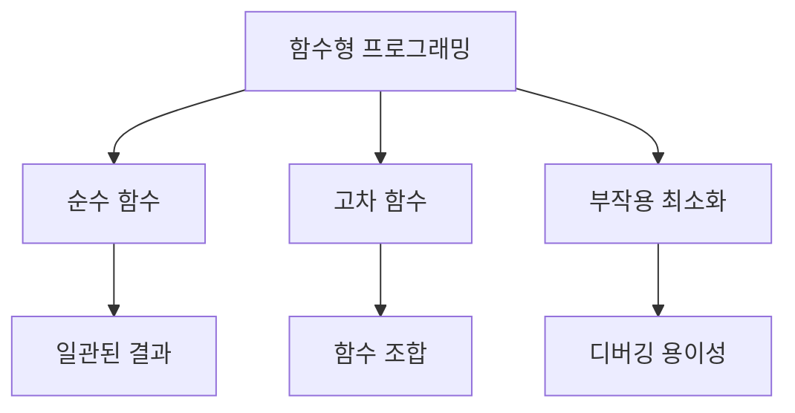
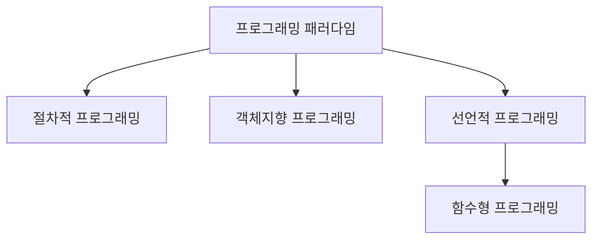
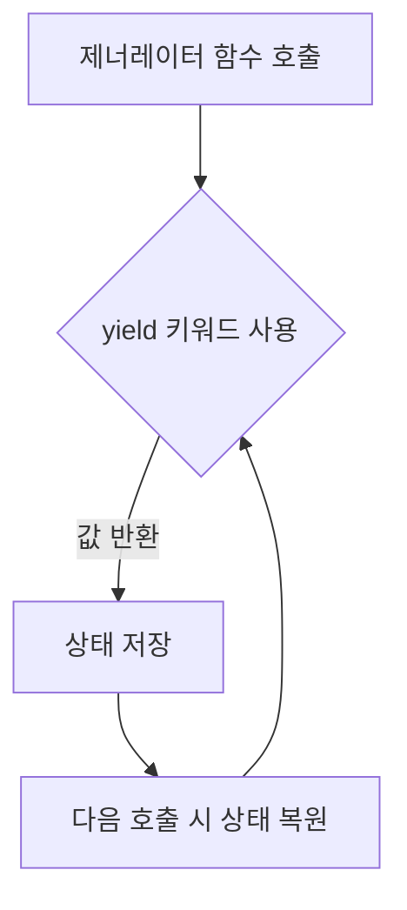
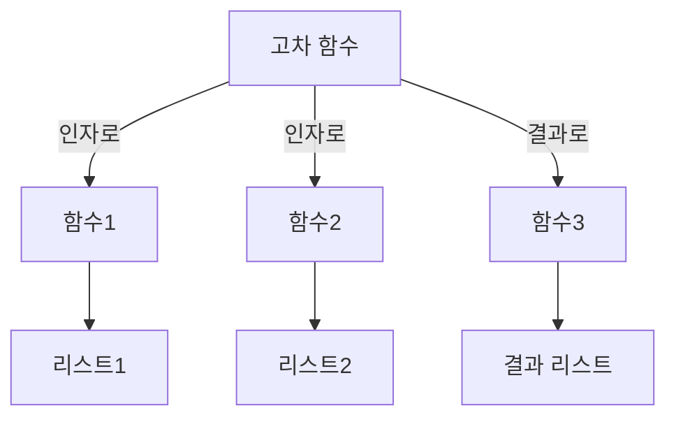
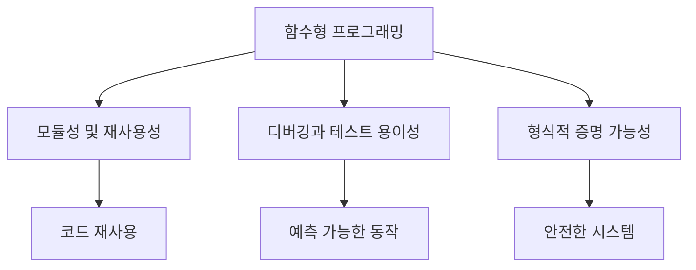
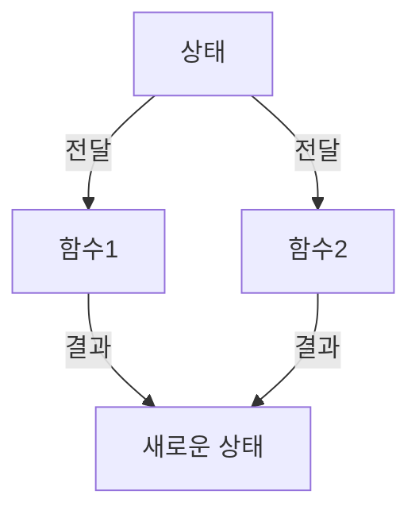
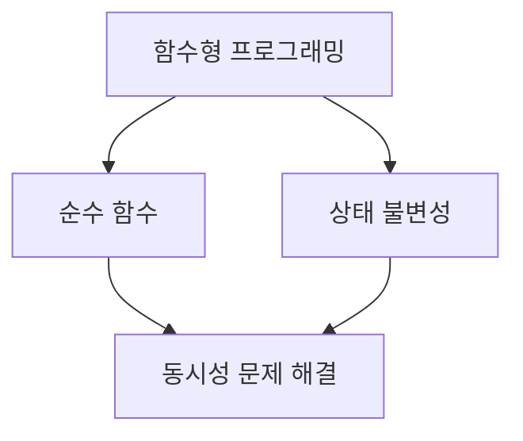
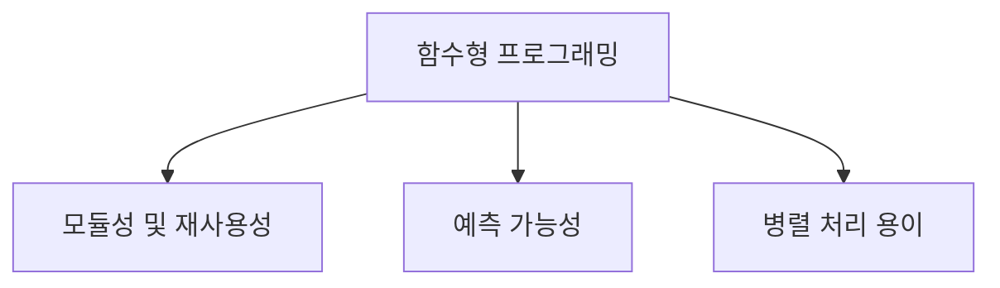
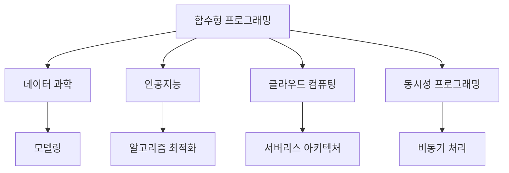
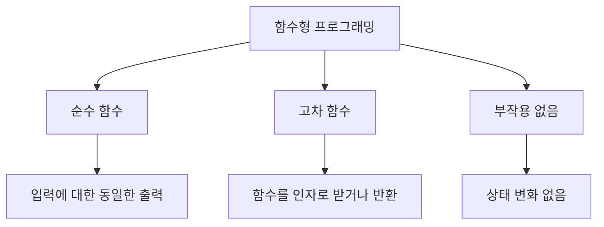

함수형 프로그래밍은 프로그래밍 언어의 한 패러다임으로, 프로그램을 함수의 적용과 조합을 통해 구성하는 방식이다. 이 방식은 수학적 함수의 개념에 뿌리를 두고 있으며, 함수는 일급 시민으로 취급되어 변수에 바인딩되거나 다른 함수의 인자로 전달될 수 있다. 함수형 프로그래밍의 주요 특징 중 하나는 부작용을 피하고, 모든 함수가 순수함수로 정의된다는 점이다. 순수함수는 주어진 입력에 대해 항상 동일한 출력을 생성하며, 외부 상태에 영향을 미치지 않는다. 이러한 특성 덕분에 함수형 프로그래밍은 코드의 모듈성과 재사용성을 높이고, 디버깅과 테스트를 용이하게 하며, 프로그램의 정확성을 수학적으로 증명할 수 있는 가능성을 제공한다. 이 글에서는 파이썬을 활용하여 함수형 프로그래밍의 기본 개념과 이론을 살펴보고, 이터레이터, 제너레이터, 그리고 관련 라이브러리 모듈을 통해 함수형 프로그래밍을 구현하는 방법에 대해 알아보겠다. 함수형 프로그래밍의 장점과 함께, 이를 통해 얻을 수 있는 소프트웨어 개발의 효율성과 품질 향상에 대해서도 논의할 것이다.


||
|:---:|
||


<!--
##### Outline #####
-->

<!--
# 함수형 프로그래밍 HOWTO 목차

## 1. 개요
   - 함수형 프로그래밍의 정의
   - 함수형 프로그래밍의 역사와 발전
   - 함수형 프로그래밍의 중요성

## 2. 함수형 프로그래밍의 기본 개념
   - 절차적, 객체지향, 선언적 프로그래밍과의 비교
   - 순수 함수와 부작용
   - 고차 함수와 일급 함수

## 3. 파이썬에서의 함수형 프로그래밍
   - 파이썬의 함수형 프로그래밍 지원
   - 이터레이터와 제너레이터
   - `itertools`와 `functools` 모듈 활용

## 4. 이터레이터
   - 이터레이터의 정의와 사용법
   - 이터레이터를 지원하는 데이터형
   - 이터레이터의 예제

## 5. 제너레이터
   - 제너레이터의 정의와 특징
   - 제너레이터 표현식과 리스트 컴프리헨션
   - 제너레이터의 예제

## 6. 고차 함수
   - 고차 함수의 개념과 예제
   - `map()`, `filter()`, `reduce()` 함수 사용법
   - 고차 함수의 장점

## 7. 커링과 부분 적용
   - 커링의 정의와 예제
   - 부분 적용의 개념
   - 커링과 부분 적용의 차이점

## 8. 함수형 프로그래밍의 장점
   - 모듈성 및 재사용성
   - 디버깅과 테스트 용이성
   - 형식적 증명 가능성

## 9. 함수형 프로그래밍의 단점
   - 성능 문제
   - 학습 곡선
   - 상태 관리의 복잡성

## 10. 관련 기술
   - 함수형 프로그래밍 언어 (Haskell, Scala, Clojure 등)
   - 함수형 프로그래밍 패러다임의 응용 (Erlang, F# 등)
   - 함수형 프로그래밍과 동시성

## 11. FAQ
   - 함수형 프로그래밍은 왜 중요한가?
   - 함수형 프로그래밍을 배우기 위한 추천 자료는?
   - 파이썬에서 함수형 프로그래밍을 어떻게 시작할 수 있는가?

## 12. 결론
   - 함수형 프로그래밍의 미래
   - 함수형 프로그래밍의 지속적인 발전과 응용

## 13. 참고 문헌
   - 관련 서적 및 자료
   - 온라인 리소스 및 커뮤니티

이 목차는 함수형 프로그래밍의 개념과 파이썬에서의 적용을 포괄적으로 다루며, 관련 기술과 자주 묻는 질문을 포함하여 독자가 함수형 프로그래밍에 대한 깊이 있는 이해를 할 수 있도록 돕습니다.
-->

<!--
## 1. 개요
   - 함수형 프로그래밍의 정의
   - 함수형 프로그래밍의 역사와 발전
   - 함수형 프로그래밍의 중요성
-->

## 1. 개요

함수형 프로그래밍은 프로그래밍 패러다임 중 하나로, 수학적 함수의 개념을 기반으로 하여 프로그램을 구성하는 방식이다. 이 패러다임은 상태와 변수를 최소화하고, 함수의 조합을 통해 프로그램을 작성하는 데 중점을 둔다. 함수형 프로그래밍은 코드의 가독성과 유지보수성을 높이는 데 기여하며, 부작용을 줄이는 데 도움을 준다.

**함수형 프로그래밍의 정의**  

함수형 프로그래밍은 프로그램을 함수의 조합으로 구성하는 프로그래밍 스타일이다. 이 스타일에서는 함수가 일급 시민으로 취급되며, 다른 함수의 인자로 전달되거나 반환값으로 사용될 수 있다. 또한, 순수 함수(pure function)를 강조하여, 동일한 입력에 대해 항상 동일한 출력을 보장하고, 외부 상태를 변경하지 않는 특성을 가진다.

**함수형 프로그래밍의 역사와 발전**  

함수형 프로그래밍의 뿌리는 1950년대의 람다 계산(lambda calculus)으로 거슬러 올라간다. 이후 1970년대에 Haskell과 같은 함수형 프로그래밍 언어가 등장하면서 이 패러다임은 더욱 발전하게 되었다. 2000년대 들어서는 JavaScript, Python, Scala 등 다양한 언어에서 함수형 프로그래밍의 개념이 도입되면서, 현대 소프트웨어 개발에서 중요한 역할을 차지하게 되었다.

**함수형 프로그래밍의 중요성**  

함수형 프로그래밍은 코드의 모듈성과 재사용성을 높이는 데 기여한다. 또한, 부작용을 최소화하여 디버깅과 테스트를 용이하게 하며, 병렬 처리와 같은 동시성 문제를 해결하는 데 유리하다. 이러한 특성 덕분에 함수형 프로그래밍은 대규모 소프트웨어 시스템에서 점점 더 많이 채택되고 있다.

다음은 함수형 프로그래밍의 기본 개념을 설명하는 간단한 다이어그램이다.



위의 다이어그램은 함수형 프로그래밍의 주요 개념들을 시각적으로 나타낸 것이다. 이러한 개념들은 함수형 프로그래밍의 핵심 원칙을 이해하는 데 도움을 준다.

<!--
## 2. 함수형 프로그래밍의 기본 개념
   - 절차적, 객체지향, 선언적 프로그래밍과의 비교
   - 순수 함수와 부작용
   - 고차 함수와 일급 함수
-->

## 2. 함수형 프로그래밍의 기본 개념

함수형 프로그래밍은 프로그래밍 패러다임 중 하나로, 수학적 함수의 개념을 기반으로 하여 프로그램을 구성하는 방식이다. 이 장에서는 함수형 프로그래밍의 기본 개념을 이해하기 위해 절차적, 객체지향, 선언적 프로그래밍과의 비교, 순수 함수와 부작용, 고차 함수와 일급 함수에 대해 살펴보겠다.

**절차적, 객체지향, 선언적 프로그래밍과의 비교**

프로그래밍 패러다임은 문제를 해결하는 방법론을 정의한다. 절차적 프로그래밍은 명령어의 순서에 따라 프로그램을 작성하는 방식으로, 주로 상태와 변수를 사용하여 프로그램의 흐름을 제어한다. 객체지향 프로그래밍은 데이터와 그 데이터를 처리하는 메서드를 객체로 묶어 관리하는 방식이다. 반면, 선언적 프로그래밍은 '무엇을 할 것인가'에 중점을 두고, 그 결과를 명시하는 방식이다. 함수형 프로그래밍은 선언적 프로그래밍의 한 형태로, 함수의 조합을 통해 프로그램을 구성한다.



**순수 함수와 부작용**

순수 함수는 동일한 입력에 대해 항상 동일한 출력을 반환하며, 외부 상태를 변경하지 않는 함수이다. 이러한 특성 덕분에 순수 함수는 테스트와 디버깅이 용이하다. 반면, 부작용이 있는 함수는 외부 상태를 변경하거나, 입력 외의 값을 참조하는 경우를 말한다. 부작용은 프로그램의 예측 가능성을 떨어뜨리므로, 함수형 프로그래밍에서는 가능한 한 순수 함수를 사용하는 것이 권장된다.

```python
# 순수 함수 예제
def add(x, y):
    return x + y

# 부작용이 있는 함수 예제
total = 0
def add_with_side_effect(x, y):
    global total
    total += x + y
    return total
```

**고차 함수와 일급 함수**

고차 함수는 다른 함수를 인자로 받거나, 함수를 반환하는 함수를 의미한다. 이러한 특성 덕분에 고차 함수는 코드의 재사용성과 모듈성을 높이는 데 기여한다. 일급 함수는 함수를 변수에 할당하거나, 함수의 인자로 전달할 수 있는 함수를 말한다. 함수형 프로그래밍에서는 함수가 일급 시민으로 취급되므로, 함수의 조합과 재사용이 용이하다.

```python
# 고차 함수 예제
def apply_function(func, value):
    return func(value)

def square(x):
    return x * x

result = apply_function(square, 5)  # 25
```

이와 같이 함수형 프로그래밍의 기본 개념을 이해하면, 이후의 내용에서 더 깊이 있는 논의를 진행할 수 있다. 함수형 프로그래밍은 코드의 가독성과 유지보수성을 높이는 데 큰 장점을 제공하므로, 이를 잘 활용하는 것이 중요하다.

<!--
## 3. 파이썬에서의 함수형 프로그래밍
   - 파이썬의 함수형 프로그래밍 지원
   - 이터레이터와 제너레이터
   - `itertools`와 `functools` 모듈 활용
-->

## 3. 파이썬에서의 함수형 프로그래밍

파이썬은 함수형 프로그래밍을 지원하는 여러 기능을 제공하여 개발자들이 함수형 프로그래밍 패러다임을 쉽게 적용할 수 있도록 돕는다. 이 장에서는 파이썬의 함수형 프로그래밍 지원, 이터레이터와 제너레이터, 그리고 `itertools`와 `functools` 모듈의 활용에 대해 살펴보겠다.

**파이썬의 함수형 프로그래밍 지원**

파이썬은 함수형 프로그래밍의 여러 개념을 지원한다. 예를 들어, 함수는 일급 객체로 취급되며, 이는 함수를 변수에 할당하거나 다른 함수의 인자로 전달할 수 있음을 의미한다. 또한, 파이썬은 고차 함수를 지원하여, 함수를 인자로 받거나 함수를 반환하는 함수를 작성할 수 있다. 이러한 특성 덕분에 파이썬은 함수형 프로그래밍을 쉽게 구현할 수 있는 언어로 자리 잡았다.

**이터레이터와 제너레이터**

이터레이터는 순회 가능한 객체를 생성하는 객체로, `__iter__()`와 `__next__()` 메서드를 구현하여 사용된다. 이터레이터는 메모리를 효율적으로 사용하며, 대량의 데이터를 처리할 때 유용하다. 제너레이터는 이터레이터를 생성하는 간편한 방법으로, `yield` 키워드를 사용하여 값을 반환한다. 제너레이터는 상태를 유지할 수 있어, 복잡한 상태 관리 없이도 이터레이션을 수행할 수 있다.

다음은 이터레이터와 제너레이터의 간단한 예제이다.

```python
# 이터레이터 예제
class MyIterator:
    def __init__(self, limit):
        self.limit = limit
        self.current = 0

    def __iter__(self):
        return self

    def __next__(self):
        if self.current < self.limit:
            self.current += 1
            return self.current
        else:
            raise StopIteration

# 제너레이터 예제
def my_generator(limit):
    current = 0
    while current < limit:
        current += 1
        yield current

# 이터레이터 사용
for value in MyIterator(5):
    print(value)

# 제너레이터 사용
for value in my_generator(5):
    print(value)
```

**`itertools`와 `functools` 모듈 활용**

파이썬의 `itertools` 모듈은 이터레이터를 생성하는 다양한 함수를 제공한다. 예를 들어, `count()`, `cycle()`, `repeat()`와 같은 함수는 무한 이터레이터를 생성할 수 있다. 이러한 기능은 복잡한 데이터 처리 작업을 간단하게 만들어준다.

`functools` 모듈은 고차 함수와 관련된 여러 유용한 기능을 제공한다. 예를 들어, `reduce()` 함수는 리스트의 모든 요소를 누적하여 단일 값을 반환하는 데 사용된다. 또한, `partial()` 함수를 사용하면 기존 함수를 부분적으로 적용하여 새로운 함수를 생성할 수 있다.

다음은 `itertools`와 `functools` 모듈을 활용한 예제이다.

```python
import itertools
from functools import reduce

# itertools 예제
for value in itertools.count(1):
    if value > 5:
        break
    print(value)

# functools 예제
numbers = [1, 2, 3, 4, 5]
result = reduce(lambda x, y: x + y, numbers)
print(result)
```

이와 같이 파이썬은 함수형 프로그래밍을 지원하는 다양한 기능을 제공하여, 개발자들이 효율적이고 간결한 코드를 작성할 수 있도록 돕는다. 이러한 기능들을 활용하면, 복잡한 문제를 보다 쉽게 해결할 수 있다.

<!--
## 4. 이터레이터
   - 이터레이터의 정의와 사용법
   - 이터레이터를 지원하는 데이터형
   - 이터레이터의 예제
-->

## 4. 이터레이터

**이터레이터의 정의와 사용법**  

이터레이터는 데이터 컬렉션을 순회할 수 있는 객체이다. 이터레이터는 `__iter__()`와 `__next__()` 메서드를 구현하여, 반복 가능한 객체를 생성할 수 있도록 한다. 이터레이터를 사용하면 메모리를 효율적으로 사용할 수 있으며, 대량의 데이터를 처리할 때 유용하다. 이터레이터는 `for` 루프와 함께 사용되며, 각 반복에서 다음 값을 반환한다.

이터레이터의 기본 사용법은 다음과 같다.

```python
class MyIterator:
    def __init__(self, limit):
        self.limit = limit
        self.current = 0

    def __iter__(self):
        return self

    def __next__(self):
        if self.current < self.limit:
            self.current += 1
            return self.current
        else:
            raise StopIteration

# 이터레이터 사용 예
my_iter = MyIterator(5)
for value in my_iter:
    print(value)
```

위의 코드에서 `MyIterator` 클래스는 이터레이터를 구현하고 있으며, `for` 루프를 통해 1부터 5까지의 값을 출력한다.

**이터레이터를 지원하는 데이터형** 

파이썬에서 이터레이터를 지원하는 데이터형에는 리스트, 튜플, 세트, 딕셔너리 등이 있다. 이러한 데이터형은 기본적으로 이터레이터를 제공하며, `iter()` 함수를 사용하여 이터레이터 객체를 생성할 수 있다. 예를 들어, 리스트의 경우 다음과 같이 이터레이터를 생성할 수 있다.

```python
my_list = [1, 2, 3, 4, 5]
list_iter = iter(my_list)

print(next(list_iter))  # 1
print(next(list_iter))  # 2
```

**이터레이터의 예제**  

이터레이터의 활용 예제로는 무한 수열을 생성하는 이터레이터를 들 수 있다. 다음은 피보나치 수열을 생성하는 이터레이터의 예이다.

```python
class FibonacciIterator:
    def __init__(self):
        self.a, self.b = 0, 1

    def __iter__(self):
        return self

    def __next__(self):
        value = self.a
        self.a, self.b = self.b, self.a + self.b
        return value

# 피보나치 이터레이터 사용 예
fib_iter = FibonacciIterator()
for _ in range(10):
    print(next(fib_iter))
```

위의 코드에서 `FibonacciIterator` 클래스는 피보나치 수열을 생성하는 이터레이터를 구현하고 있으며, `for` 루프를 통해 첫 10개의 피보나치 수를 출력한다.

```mermaid
graph TD;
    A[이터레이터] --> B[__iter__() 메서드]
    A --> C[__next__() 메서드]
    B --> D[이터레이터 객체 반환]
    C --> E[다음 값 반환]
    C --> F[StopIteration 예외 발생]
```

위의 다이어그램은 이터레이터의 기본 구조를 나타내며, `__iter__()`와 `__next__()` 메서드의 역할을 설명한다. 이터레이터는 이러한 메서드를 통해 데이터 컬렉션을 순회할 수 있는 기능을 제공한다.

<!--
## 5. 제너레이터
   - 제너레이터의 정의와 특징
   - 제너레이터 표현식과 리스트 컴프리헨션
   - 제너레이터의 예제
-->

## 5. 제너레이터

**제너레이터의 정의와 특징**  

제너레이터는 이터레이터를 생성하는 간편한 방법으로, 함수의 실행을 일시 중지하고 나중에 다시 시작할 수 있는 기능을 제공한다. 제너레이터는 `yield` 키워드를 사용하여 값을 반환하며, 이로 인해 메모리 효율성이 높아진다. 일반적인 함수와 달리 제너레이터는 호출될 때마다 상태를 유지하며, 다음 값을 요청할 때마다 이전 상태에서 계속 실행된다. 이러한 특성 덕분에 대량의 데이터를 처리할 때 유용하게 사용될 수 있다.

**제너레이터 표현식과 리스트 컴프리헨션** 

제너레이터 표현식은 리스트 컴프리헨션과 유사하지만, 메모리를 절약할 수 있는 점에서 차이가 있다. 리스트 컴프리헨션은 모든 요소를 메모리에 저장하는 반면, 제너레이터 표현식은 필요할 때마다 요소를 생성한다. 제너레이터 표현식은 소괄호 `()`를 사용하여 정의된다.

예를 들어, 0부터 9까지의 제곱수를 생성하는 제너레이터 표현식은 다음과 같다:

```python
squares = (x**2 for x in range(10))
```

이와 같은 방식으로 제너레이터를 사용하면 메모리 사용량을 줄일 수 있다.

**제너레이터의 예제**  

다음은 제너레이터를 사용하여 피보나치 수열을 생성하는 간단한 예제이다:

```python
def fibonacci(n):
    a, b = 0, 1
    for _ in range(n):
        yield a
        a, b = b, a + b

# 제너레이터 사용
fib_gen = fibonacci(10)
for num in fib_gen:
    print(num)
```

위의 코드는 0부터 9까지의 피보나치 수열을 생성하여 출력한다. `yield` 키워드를 사용하여 각 호출 시마다 다음 피보나치 수를 반환하며, 상태를 유지하기 때문에 메모리 효율적이다.



위의 다이어그램은 제너레이터의 작동 방식을 시각적으로 나타낸 것이다. 제너레이터 함수가 호출되면 `yield` 키워드에서 값을 반환하고, 상태를 저장한 후 다음 호출 시 저장된 상태에서 실행을 재개한다. 이러한 방식으로 제너레이터는 메모리 효율성을 극대화하며, 대량의 데이터를 처리하는 데 유용하다.

<!--
## 6. 고차 함수
   - 고차 함수의 개념과 예제
   - `map()`, `filter()`, `reduce()` 함수 사용법
   - 고차 함수의 장점
-->

## 6. 고차 함수

고차 함수는 다른 함수를 인자로 받거나, 함수를 결과로 반환하는 함수를 의미한다. 이러한 특성 덕분에 고차 함수는 함수형 프로그래밍에서 매우 중요한 역할을 한다. 고차 함수를 사용하면 코드의 재사용성과 가독성을 높일 수 있으며, 복잡한 로직을 간결하게 표현할 수 있다.

**고차 함수의 개념과 예제**

고차 함수의 가장 간단한 예로는 `map()`, `filter()`, `reduce()` 함수가 있다. 이들 함수는 각각 리스트의 요소를 변형하거나, 특정 조건에 맞는 요소를 필터링하거나, 리스트의 요소를 집계하는 데 사용된다.

예를 들어, `map()` 함수를 사용하여 리스트의 모든 요소에 2를 곱하는 코드는 다음과 같다.

```python
numbers = [1, 2, 3, 4, 5]
doubled = list(map(lambda x: x * 2, numbers))
print(doubled)  # 출력: [2, 4, 6, 8, 10]
```

**`map()`, `filter()`, `reduce()` 함수 사용법**

- `map(function, iterable)`: 주어진 함수 `function`을 iterable의 각 요소에 적용하여 새로운 iterable을 반환한다.
  
- `filter(function, iterable)`: 주어진 함수 `function`이 True를 반환하는 요소만 포함하는 새로운 iterable을 반환한다.

예를 들어, 짝수만 필터링하는 코드는 다음과 같다.

```python
even_numbers = list(filter(lambda x: x % 2 == 0, numbers))
print(even_numbers)  # 출력: [2, 4]
```

- `reduce(function, iterable)`: `functools` 모듈에서 제공되며, iterable의 요소를 누적하여 단일 값을 반환한다.

```python
from functools import reduce

sum_of_numbers = reduce(lambda x, y: x + y, numbers)
print(sum_of_numbers)  # 출력: 15
```

**고차 함수의 장점**

고차 함수는 여러 가지 장점을 제공한다. 첫째, 코드의 재사용성을 높인다. 동일한 로직을 여러 번 작성할 필요 없이, 고차 함수를 통해 간결하게 표현할 수 있다. 둘째, 가독성을 향상시킨다. 복잡한 로직을 함수로 분리함으로써, 코드의 흐름을 쉽게 이해할 수 있다. 셋째, 함수형 프로그래밍의 패러다임을 활용하여 부작용을 줄이고, 순수 함수를 통해 예측 가능한 코드를 작성할 수 있다.

다음은 고차 함수의 흐름을 나타내는 다이어그램이다.



이와 같이 고차 함수는 함수형 프로그래밍에서 중요한 역할을 하며, 파이썬에서도 그 활용도가 높다. 고차 함수를 적절히 사용하면 코드의 품질을 크게 향상시킬 수 있다.

<!--
## 7. 커링과 부분 적용
   - 커링의 정의와 예제
   - 부분 적용의 개념
   - 커링과 부분 적용의 차이점
-->

## 7. 커링과 부분 적용

**커링의 정의와 예제**  

커링(Currying)은 다수의 인자를 받는 함수를 단일 인자를 받는 함수의 연속으로 변환하는 기법이다. 즉, 여러 개의 인자를 받는 함수를 여러 개의 단일 인자를 받는 함수로 변환하여, 각 인자를 하나씩 적용할 수 있도록 한다. 커링을 사용하면 함수의 재사용성을 높이고, 특정 인자를 고정하여 새로운 함수를 생성할 수 있다.

예를 들어, 두 개의 숫자를 더하는 함수를 커링을 통해 구현할 수 있다.

```python
def add(x):
    def inner(y):
        return x + y
    return inner

add_five = add(5)  # x를 5로 고정
result = add_five(3)  # y에 3을 적용
print(result)  # 출력: 8
```

**부분 적용의 개념**  

부분 적용(Partial Application)은 함수의 일부 인자를 미리 고정하여 새로운 함수를 생성하는 기법이다. 커링과 유사하지만, 부분 적용은 여러 인자를 동시에 고정할 수 있다. 이를 통해 특정 인자를 미리 설정한 함수를 쉽게 만들 수 있다.

예를 들어, 세 개의 인자를 받는 함수를 부분 적용을 통해 구현할 수 있다.

```python
def multiply(x, y, z):
    return x * y * z

def partial_multiply(x):
    return lambda y, z: multiply(x, y, z)

double = partial_multiply(2)  # x를 2로 고정
result = double(3, 4)  # y에 3, z에 4를 적용
print(result)  # 출력: 24
```

**커링과 부분 적용의 차이점**

커링과 부분 적용은 비슷한 개념이지만, 그 사용 방식에 있어 차이가 있다. 커링은 모든 인자를 하나씩 순차적으로 적용하는 반면, 부분 적용은 여러 인자를 동시에 고정할 수 있다. 커링은 주로 함수형 프로그래밍에서 사용되며, 부분 적용은 더 일반적인 프로그래밍 패턴으로 사용된다.

다음은 커링과 부분 적용의 차이를 시각적으로 나타낸 다이어그램이다.

```mermaid
graph TD;
    A[함수 f(x, y, z)] --> B[커링: f(x)(y)(z)];
    A --> C[부분 적용: f(x)(y, z)];
```

이와 같이 커링과 부분 적용은 함수형 프로그래밍에서 매우 유용한 기법으로, 코드의 가독성과 재사용성을 높이는 데 기여한다.

<!--
## 8. 함수형 프로그래밍의 장점
   - 모듈성 및 재사용성
   - 디버깅과 테스트 용이성
   - 형식적 증명 가능성
-->

## 8. 함수형 프로그래밍의 장점

함수형 프로그래밍은 여러 가지 장점을 제공하여 소프트웨어 개발에 긍정적인 영향을 미친다. 이 장에서는 함수형 프로그래밍의 주요 장점인 모듈성 및 재사용성, 디버깅과 테스트 용이성, 형식적 증명 가능성에 대해 살펴보겠다.

**모듈성 및 재사용성**

함수형 프로그래밍은 프로그램을 작은 단위의 함수로 나누어 구성하는 것을 장려한다. 이러한 접근 방식은 코드의 모듈성을 높이고, 각 함수가 독립적으로 동작할 수 있도록 한다. 결과적으로, 특정 기능을 수행하는 함수를 다른 프로그램이나 프로젝트에서 재사용할 수 있는 가능성이 높아진다. 

예를 들어, 두 수를 더하는 간단한 함수를 정의해 보겠다.

```python
def add(x, y):
    return x + y
```

이 함수는 다양한 상황에서 재사용될 수 있으며, 다른 함수와 조합하여 더 복잡한 기능을 구현할 수 있다.

**디버깅과 테스트 용이성**

함수형 프로그래밍에서는 순수 함수의 개념이 중요한 역할을 한다. 순수 함수는 동일한 입력에 대해 항상 동일한 출력을 반환하며, 외부 상태에 의존하지 않는다. 이러한 특성 덕분에 함수의 동작을 예측하기 쉬워지고, 디버깅과 테스트가 용이해진다.

예를 들어, 다음과 같은 순수 함수를 고려해 보겠다.

```python
def square(x):
    return x * x
```

이 함수는 입력값이 2일 때 항상 4를 반환하므로, 테스트가 간단하다. 이러한 특성은 코드의 신뢰성을 높이고, 버그를 찾는 데 드는 시간을 줄여준다.

**형식적 증명 가능성**

함수형 프로그래밍은 수학적 원리에 기반한 프로그래밍 패러다임으로, 프로그램의 동작을 수학적으로 증명할 수 있는 가능성을 제공한다. 이는 특히 안전성과 신뢰성이 중요한 시스템에서 유용하다. 형식적 증명을 통해 특정 조건이 충족될 때 프로그램이 올바르게 동작함을 보장할 수 있다.

다음은 간단한 다이어그램을 통해 함수형 프로그래밍의 장점을 시각적으로 표현한 것이다.



이와 같이 함수형 프로그래밍은 모듈성, 재사용성, 디버깅 용이성, 형식적 증명 가능성 등 여러 장점을 통해 소프트웨어 개발의 효율성을 높인다. 이러한 특성들은 개발자들이 더 나은 품질의 코드를 작성할 수 있도록 돕는다.

<!--
## 9. 함수형 프로그래밍의 단점
   - 성능 문제
   - 학습 곡선
   - 상태 관리의 복잡성
-->

## 9. 함수형 프로그래밍의 단점

함수형 프로그래밍은 많은 장점을 가지고 있지만, 몇 가지 단점도 존재한다. 이 단점들은 개발자가 함수형 프로그래밍을 선택할 때 고려해야 할 중요한 요소이다.

**성능 문제**  

함수형 프로그래밍은 불변성을 강조하고, 데이터의 복사본을 생성하는 경향이 있다. 이로 인해 메모리 사용량이 증가하고, 성능 저하가 발생할 수 있다. 특히, 대량의 데이터를 처리할 때는 이러한 성능 문제가 더욱 두드러질 수 있다. 예를 들어, 리스트의 모든 요소를 변환하는 경우, 각 요소에 대해 새로운 리스트를 생성해야 하므로 메모리와 CPU 자원을 더 많이 소모하게 된다.

```python
# 예시: 리스트의 모든 요소를 제곱하는 함수형 프로그래밍
numbers = [1, 2, 3, 4, 5]
squared_numbers = list(map(lambda x: x ** 2, numbers))
print(squared_numbers)  # [1, 4, 9, 16, 25]
```

**학습 곡선**  

함수형 프로그래밍은 절차적 또는 객체지향 프로그래밍에 비해 상대적으로 학습 곡선이 가파르다. 특히, 고차 함수, 커링, 부분 적용 등의 개념은 초보자에게는 다소 어려울 수 있다. 이러한 개념들을 이해하고 활용하기 위해서는 일정한 시간과 노력이 필요하다. 따라서, 팀 내에서 함수형 프로그래밍을 도입할 경우, 팀원들이 이러한 개념을 충분히 이해하고 익힐 수 있도록 교육이 필요하다.

**상태 관리의 복잡성**  

함수형 프로그래밍에서는 상태를 변경하지 않고, 불변성을 유지하는 것이 중요하다. 그러나 이로 인해 상태 관리가 복잡해질 수 있다. 특히, 애플리케이션의 상태를 여러 함수에서 공유해야 할 경우, 상태를 전달하는 방식이 복잡해질 수 있다. 이러한 문제를 해결하기 위해서는 상태를 관리하는 별도의 구조를 도입해야 할 수도 있다.



위의 다이어그램은 상태가 여러 함수에 전달되는 과정을 나타낸다. 각 함수는 상태를 변경하지 않고, 새로운 상태를 생성하여 반환하는 방식으로 동작한다. 이러한 방식은 코드의 가독성을 높이지만, 상태 관리의 복잡성을 증가시킬 수 있다.

결론적으로, 함수형 프로그래밍은 강력한 패러다임이지만, 성능 문제, 학습 곡선, 상태 관리의 복잡성 등의 단점이 존재한다. 이러한 단점을 이해하고 적절히 대처하는 것이 중요하다.

<!--
## 10. 관련 기술
   - 함수형 프로그래밍 언어 (Haskell, Scala, Clojure 등)
   - 함수형 프로그래밍 패러다임의 응용 (Erlang, F# 등)
   - 함수형 프로그래밍과 동시성
-->

## 10. 관련 기술

**함수형 프로그래밍 언어 (Haskell, Scala, Clojure 등)**  

함수형 프로그래밍 언어는 함수형 프로그래밍 패러다임을 중심으로 설계된 언어들이다. Haskell은 순수 함수형 언어로, 부작용을 철저히 배제하고 수학적 함수의 개념을 강조한다. Scala는 객체지향 프로그래밍과 함수형 프로그래밍을 혼합한 언어로, Java와의 호환성을 제공하며, 함수형 프로그래밍의 장점을 활용할 수 있다. Clojure는 JVM 위에서 실행되는 함수형 언어로, 동시성 프로그래밍을 쉽게 할 수 있도록 설계되었다.

```haskell
-- Haskell의 예제: 순수 함수
double :: Int -> Int
double x = x * 2
```

**함수형 프로그래밍 패러다임의 응용 (Erlang, F# 등)**  

Erlang은 분산 시스템과 동시성 프로그래밍에 강점을 가진 함수형 언어로, 높은 가용성과 신뢰성을 제공한다. F#은 .NET 플랫폼에서 사용되는 함수형 언어로, 객체지향과 명령형 프로그래밍을 지원하면서도 함수형 프로그래밍의 장점을 잘 살리고 있다. 이러한 언어들은 특정 도메인에서 함수형 프로그래밍의 이점을 극대화할 수 있도록 설계되었다.

```fsharp
// F#의 예제: 고차 함수
let add x y = x + y
let addFive = add 5
let result = addFive 10 // result는 15
```

**함수형 프로그래밍과 동시성**  

함수형 프로그래밍은 상태를 변경하지 않는 순수 함수를 사용하기 때문에 동시성 문제를 자연스럽게 해결할 수 있는 장점을 가진다. 여러 스레드가 동일한 데이터를 공유할 필요가 없으므로, 데이터 경합이나 상태 불일치 문제를 피할 수 있다. 이러한 특성 덕분에 함수형 프로그래밍은 동시성 프로그래밍에 적합한 패러다임으로 자리 잡고 있다.



이와 같이 함수형 프로그래밍은 다양한 언어와 응용 분야에서 그 장점을 발휘하고 있으며, 동시성 프로그래밍에서도 효과적으로 활용될 수 있다.

<!--
## 11. FAQ
   - 함수형 프로그래밍은 왜 중요한가?
   - 함수형 프로그래밍을 배우기 위한 추천 자료는?
   - 파이썬에서 함수형 프로그래밍을 어떻게 시작할 수 있는가?
-->

## 11. FAQ

**함수형 프로그래밍은 왜 중요한가?**

함수형 프로그래밍은 현대 소프트웨어 개발에서 중요한 역할을 한다. 그 이유는 다음과 같다. 첫째, 함수형 프로그래밍은 코드의 모듈성과 재사용성을 높인다. 함수는 독립적으로 작성되고 테스트될 수 있어, 코드의 유지보수성을 향상시킨다. 둘째, 부작용이 없는 순수 함수를 사용함으로써, 프로그램의 예측 가능성이 높아진다. 이는 디버깅과 테스트를 용이하게 만든다. 셋째, 함수형 프로그래밍은 병렬 처리와 동시성 프로그래밍에 유리하다. 상태를 공유하지 않기 때문에, 여러 스레드가 동시에 실행될 때 발생할 수 있는 문제를 줄일 수 있다.



**함수형 프로그래밍을 배우기 위한 추천 자료는?**

함수형 프로그래밍을 배우기 위해서는 다양한 자료를 활용할 수 있다. 다음은 추천하는 자료들이다.

1. **서적**
   - "Functional Programming in Scala" - 스칼라 언어를 통해 함수형 프로그래밍의 개념을 깊이 있게 다룬다.
   - "Learn You a Haskell for Great Good!" - Haskell을 통해 함수형 프로그래밍의 기초를 쉽게 설명한다.

2. **온라인 강의**
   - Coursera, edX와 같은 플랫폼에서 제공하는 함수형 프로그래밍 관련 강의를 수강할 수 있다.
   - Udemy에서는 파이썬을 이용한 함수형 프로그래밍 강의도 많이 제공된다.

3. **커뮤니티**
   - Stack Overflow와 같은 Q&A 사이트에서 질문하고 답변을 통해 학습할 수 있다.
   - GitHub에서 오픈 소스 프로젝트를 통해 실제 코드를 분석하고 기여하는 것도 좋은 방법이다.

**파이썬에서 함수형 프로그래밍을 어떻게 시작할 수 있는가?**

파이썬에서 함수형 프로그래밍을 시작하기 위해서는 다음과 같은 단계를 따르면 좋다.

1. **기본 개념 이해하기**
   - 함수형 프로그래밍의 기본 개념인 순수 함수, 고차 함수, 커링 등을 이해한다.

2. **파이썬의 함수형 프로그래밍 기능 활용하기**
   - `map()`, `filter()`, `reduce()`와 같은 내장 함수를 사용하여 데이터를 처리하는 방법을 익힌다.
   - `functools`와 `itertools` 모듈을 활용하여 고차 함수와 이터레이터를 사용하는 방법을 배운다.

3. **실습하기**
   - 간단한 프로젝트를 통해 함수형 프로그래밍을 적용해본다. 예를 들어, 리스트의 요소를 변환하거나 필터링하는 프로그램을 작성해볼 수 있다.

4. **코드 리뷰 및 피드백 받기**
   - 작성한 코드를 다른 개발자와 공유하고 피드백을 받아 개선해 나간다.

이러한 단계를 통해 파이썬에서 함수형 프로그래밍을 효과적으로 시작할 수 있다.

<!--
## 12. 결론
   - 함수형 프로그래밍의 미래
   - 함수형 프로그래밍의 지속적인 발전과 응용
-->

## 12. 결론

**함수형 프로그래밍의 미래**

함수형 프로그래밍은 현대 소프트웨어 개발에서 점점 더 중요한 역할을 차지하고 있다. 특히, 데이터 과학, 인공지능, 클라우드 컴퓨팅과 같은 분야에서 함수형 프로그래밍의 장점이 두드러지기 때문이다. 이러한 분야에서는 불변성, 고차 함수, 그리고 병렬 처리와 같은 함수형 프로그래밍의 특성이 매우 유용하게 활용된다. 앞으로도 함수형 프로그래밍은 다양한 언어와 플랫폼에서 더욱 널리 사용될 것으로 예상된다.

**함수형 프로그래밍의 지속적인 발전과 응용**

함수형 프로그래밍은 단순히 이론적인 개념에 그치지 않고, 실제로 다양한 프로그래밍 언어와 프레임워크에 통합되고 있다. 예를 들어, 자바스크립트에서는 ES6부터 화살표 함수와 같은 함수형 프로그래밍의 요소가 도입되었고, 자바에서도 람다 표현식이 추가되었다. 이러한 변화는 개발자들이 함수형 프로그래밍의 장점을 쉽게 활용할 수 있도록 돕고 있다.

또한, 함수형 프로그래밍은 동시성 프로그래밍과의 결합을 통해 더욱 발전하고 있다. 비동기 프로그래밍 모델과 결합하여, 복잡한 상태 관리를 단순화하고, 코드의 가독성을 높이는 데 기여하고 있다. 이러한 경향은 앞으로도 계속될 것이며, 함수형 프로그래밍의 응용 범위는 더욱 넓어질 것이다.

다음은 함수형 프로그래밍의 미래와 발전을 시각적으로 나타낸 다이어그램이다.



이와 같은 흐름은 함수형 프로그래밍이 앞으로도 계속해서 진화하고, 다양한 분야에서 응용될 것임을 보여준다. 따라서 개발자들은 함수형 프로그래밍의 개념과 기술을 익히고, 이를 실제 프로젝트에 적용하는 것이 중요하다.

<!--
## 13. 참고 문헌
   - 관련 서적 및 자료
   - 온라인 리소스 및 커뮤니티
-->

## 13. 참고 문헌

**관련 서적 및 자료** 

함수형 프로그래밍에 대한 깊이 있는 이해를 위해 다음과 같은 서적과 자료를 추천한다.

1. **"Functional Programming in Scala"**  
   이 책은 스칼라 언어를 통해 함수형 프로그래밍의 개념을 깊이 있게 다룬다. 함수형 프로그래밍의 기초부터 고급 개념까지 폭넓게 설명하고 있어, 스칼라를 배우고자 하는 개발자에게 유용하다.

2. **"Haskell Programming from First Principles"**  
   Haskell 언어를 기반으로 한 이 책은 함수형 프로그래밍의 기초를 체계적으로 설명한다. Haskell의 문법과 개념을 통해 함수형 프로그래밍의 원리를 이해할 수 있다.

3. **"JavaScript: The Good Parts"**  
   자바스크립트에서 함수형 프로그래밍을 적용하는 방법을 다룬 이 책은, 자바스크립트의 장점을 살리면서 함수형 프로그래밍 패러다임을 활용하는 방법을 제시한다.

4. **"Programming in Haskell"**  
   Haskell 언어의 기초부터 고급 개념까지 포괄적으로 다루는 이 책은 함수형 프로그래밍의 이론과 실제를 함께 배울 수 있는 좋은 자료이다.

**온라인 리소스 및 커뮤니티** 

함수형 프로그래밍에 대한 최신 정보와 커뮤니티 활동을 위해 다음의 온라인 리소스를 추천한다.

1. **Haskell.org**  
   Haskell 언어의 공식 웹사이트로, 다양한 자료와 튜토리얼을 제공한다. Haskell 커뮤니티와의 연결도 가능하다.

2. **Scala Exercises**  
   스칼라 언어를 배우기 위한 무료 온라인 플랫폼으로, 함수형 프로그래밍의 기초를 실습할 수 있는 다양한 연습문제를 제공한다.

3. **Functional Programming in JavaScript**  
   자바스크립트에서 함수형 프로그래밍을 배우고자 하는 개발자를 위한 블로그와 튜토리얼이 모여 있는 사이트이다.

4. **Stack Overflow**  
   함수형 프로그래밍 관련 질문과 답변을 찾을 수 있는 커뮤니티로, 다양한 언어에서의 함수형 프로그래밍에 대한 논의가 이루어진다.

5. **Reddit - r/functionalprogramming**  
   함수형 프로그래밍에 대한 다양한 주제를 논의하는 Reddit 커뮤니티로, 최신 트렌드와 자료를 공유할 수 있다.

다음은 함수형 프로그래밍의 개념을 시각적으로 나타낸 다이어그램이다.



이 다이어그램은 함수형 프로그래밍의 핵심 개념들을 간단하게 정리한 것이다. 각 개념은 서로 연결되어 있으며, 함수형 프로그래밍의 특징을 잘 보여준다.

<!--
##### Reference #####
-->

## Reference


* [https://docs.python.org/ko/3/howto/functional.html](https://docs.python.org/ko/3/howto/functional.html)
* [https://www.defmacro.org/2006/06/19/fp.html](https://www.defmacro.org/2006/06/19/fp.html)
* [https://en.wikipedia.org/wiki/Functional_programming](https://en.wikipedia.org/wiki/Functional_programming)
* [https://en.wikipedia.org/wiki/Coroutine](https://en.wikipedia.org/wiki/Coroutine)
* [https://en.wikipedia.org/wiki/Partial_application](https://en.wikipedia.org/wiki/Partial_application)
* [https://en.wikipedia.org/wiki/Currying](https://en.wikipedia.org/wiki/Currying)


<!--
#  함수형 프로그래밍 HOWTO

저자  :

    

A. M. Kuchling

버전  :

    

0.32

이 문서에서는, 함수형 방식으로 프로그램을 구현하는데 적합한 파이썬의 특성에 대해 알아볼 것입니다. 함수형 프로그래밍의 개념을 소개한 뒤에,
[ 이터레이터  ](../glossary.html#term-iterator) , [ 제너레이터  ](../glossary.html#term-
generator) 와 같은 언어의 특성과 [ ` itertools  ` ](../library/itertools.html#module-
itertools "itertools: Functions creating iterators for efficient looping.") ,
[ ` functools  ` ](../library/functools.html#module-functools "functools:
Higher-order functions and operations on callable objects.") 와 같은 관련 라이브러리 모듈을
살펴볼 것입니다.

##  소개

이 절에서는 함수형 프로그래밍의 기본적인 개념을 설명합니다; 만약 단순히 파이썬의 언어적 특성에 관해서만 관심이 있으시다면,  이터레이터
절로 건너뛰세요.

프로그래밍 언어들은 다음과 같이 각각 다른 방식으로 문제를 더 작은 부분으로 분할하는 방법을 지원합니다:

  * 대부분의 프로그래밍 언어들은 **절차적** 입니다: 프로그램은 컴퓨터에 프로그램의 입력을 어떻게 할지 알려주는 명령 목록입니다. C, 파스칼, 유닉스 셸과 같은 것들은 절차적 언어입니다. 

  * **선언적** 언어에서는 해결해야 할 문제를 설명하는 명세서를 작성하고, 언어 구현은 계산을 효과적으로 수행하는 방법을 파악합니다. SQL은 가장 친숙한 선언적 언어입니다; SQL 질의는 검색하고 싶은 데이터 세트를 설명하고, SQL 엔진은 테이블을 스캔하거나 인덱스를 사용할 것인지, 어떤 하위 구문을 먼저 수행해야 하는지 등을 결정합니다. 

  * **객체지향** 프로그램은 객체들의 컬렉션을 다룹니다. 객체는 내부적인 상태를 갖고 있으며 이 내부적인 상태를 어떤 방식으로 가져오거나 수정하는 메서드를 제공합니다. 스몰토크와 자바는 객체지향 언어입니다. C++ 와 파이썬은 객체지향 프로그래밍을 지원하는 언어이지만, 객체 지향적인 특성들을 사용하도록 강제하지는 않습니다. 

  * **함수형** 프로그래밍은 함수들의 세트로 문제를 분해합니다. 이상적으로 말하면, 함수들은 입력을 받아서 출력을 만들어내기만 하며, 주어진 입력에 대해 생성된 출력에 영향을 끼칠만한 어떠한 내부적인 상태도 가지지 않습니다. 잘 알려진 함수형 언어로는 ML 계열(Standard ML, OCaml 및 다른 변형)과 하스켈이 있습니다. 

일부 컴퓨터 언어의 설계자들은 프로그래밍에 대한 한 가지의 특별한 접근 방식을 강조합니다. 이것은 종종 다른 접근 방식으로 프로그램을
작성하는 것을 어렵게 만듭니다. 다른 언어들은 다양한 접근 방법을 지원하는 다중 패러다임 언어입니다. Lisp, C++, 파이썬 등은 다중
패러다임 언어입니다; 이러한 언어에서는 절차적, 객체 지향적 혹은 함수형으로 프로그램이나 라이브러리를 작성할 수 있습니다. 거대한
프로그램에서, 각 구역은 서로 다른 접근 방법을 사용하여 작성될 수 있습니다; 예를 들어 처리 로직이 절차적 혹은 함수형으로 작성되었을 때,
GUI는 객체 지향적으로 작성될 수 있습니다.

함수형 프로그램에서, 입력은 여러 함수의 세트를 통해 흘러 다닙니다. 각 함수는 입력으로부터 동작해서 출력을 만들어냅니다. 함수형 방식은
내부 상태를 수정하거나 함수의 반환 값에서 보이지 않는 다른 변경사항들을 만드는 부작용이 있는 함수를 사용하지 않습니다. 부작용이 전혀 없는
함수를 **순수 함수** 라고 합니다. 부작용을 피한다는 것은 프로그램이 실행될 때 수정될 수 있는 자료 구조를 사용하지 않는다는
의미입니다; 모든 함수의 출력은 입력에만 의존해야 합니다.

Some languages are very strict about purity and don’t even have assignment
statements such as ` a=3  ` or ` c  =  a  +  b  ` , but it’s difficult to
avoid all side effects, such as printing to the screen or writing to a disk
file. Another example is a call to the [ ` print()  `
](../library/functions.html#print "print") or [ ` time.sleep()  `
](../library/time.html#time.sleep "time.sleep") function, neither of which
returns a useful value. Both are called only for their side effects of sending
some text to the screen or pausing execution for a second.

함수형 방식으로 작성된 파이썬 프로그램은 보통 극단적으로 모든 I/O 혹은 대입문을 회피하는 방식으로 나아가지는 않습니다; 대신 함수형처럼
보이는 인터페이스를 제공하며 내부적으로는 함수형이 아닌 기능들을 사용합니다. 예를 들어 함수의 구현은 여전히 지역 변수에 값을 대입하는
방식이 사용되지만 전역 변수를 수정하거나 다른 부작용을 발생시키지는 않습니다.

함수형 프로그래밍은 객체 지향 프로그래밍의 반대라고 생각할 수 있습니다. 객체는 내부 상태들을 갖고 있으며 이 상태들을 수정할 수 있는
메서드의 호출 모음이 포함된 작은 캡슐이며, 프로그램은 올바른 상태 변경 집합을 구성합니다. 함수형 프로그래밍은 가능한 한 상태 변경을
피하고자 하며 함수 간의 데이터 흐름을 사용합니다. 파이썬에서는 응용 프로그램의 객체를 나타내는 인스턴스(전자 우편 메시지, 트랜잭션 등)를
가져와서 반환하는 함수를 작성함으로써 두 가지 접근 방식을 결합할 수 있습니다.

함수형 설계는 동작 방식에 이상한 제약이 있는 것처럼 보일 수 있습니다. 왜 객체와 부작용을 피해야만 할까요? 함수형 방식은 이론적으로도,
실질적으로도 다음과 같은 장점이 있습니다:

  * 형식적 증명 가능성. 

  * 모듈성. 

  * 결합성. 

  * 디버깅과 테스트 용이성. 

###  형식적 증명 가능성

이론적인 장점은 함수형 프로그램이 정확하다는 수학적 증명을 만드는 것이 더 쉽다는 것입니다.

오랫동안 연구자들은 수학적으로 프로그램이 정확하다는 것을 증명하는 방법을 찾는 데 관심을 보여왔습니다. 이것은 수많은 입력에 대해 프로그램을
테스트하고 출력이 정확하다고 결론짓거나, 프로그램의 소스코드를 읽어보고 코드가 올바르다고 결론짓는 것과는 다릅니다; 그들의 목표는 입력
가능한 모든 것에 대해 프로그램이 올바른 결과를 산출한다는 엄격한 증거를 찾는 것입니다.

프로그램이 올바른지 증명하기 위해 사용하는 기술은 항상 참인 입력 데이터와 프로그램의 변수라는 특성을 지닌 **불변자** 를 작성하는
것입니다. 각 코드 행에 대해, 그 행이 실행되기 **전에** 불변자 X와 Y가 참이라면, 그 행이 실행된 **후에** 약간 다른 불변자
X’ 및 Y’가 참이라는 것을 보여줍니다. 이 작업은 프로그램이 종료될 때까지 계속되며, 종료 시점에서 불변자는 프로그램의 출력으로써 원하는
조건과 일치해야만 합니다.

함수형 프로그래밍에서 값 대입을 피하려는 이유는 값 대입이 이러한 기법을 활용하는 것을 어렵게 만들기 때문입니다; 대입은 다음 단계로 나아갈
수 있는 새 불변자를 만들지 않은 채로, 대입전에 참이었던 불변자를 무너뜨릴 수 있습니다.

불행하게도, 정확한 프로그램임을 증명하는 것은 실제로는 비실용적이며 파이썬 소프트웨어와 관련이 없습니다. 사소한 프로그램일지라도 여러 페이지
분량의 증명이 필요합니다; 적당히 복잡한 프로그램에 대한 정확성의 증명은 엄청난 양일 것이며, 매일 사용하는 프로그램 (파이썬 인터프리터,
XML 파서, 웹 브라우저)의 정확성은 거의 증명이 불가능할 수도 있습니다. 만약 증명을 작성하거나 만들었더라도, 그 증명이 검증된 것인지
의구심이 들 것입니다; 어쩌면 그 증명에 오류가 있을 수도 있고, 프로그램의 정확성이 증명되었다고 잘못 믿고 있을 수도 있습니다.

###  모듈성

함수형 프로그래밍의 실질적인 이점은 문제를 작은 조각으로 분해하도록 강제한다는 점입니다. 결과적으로 프로그램은 더욱 모듈화가 됩니다. 복잡한
변환을 수행하는 거대한 함수보다, 한 가지 작업을 수행하는 작은 함수를 명시하고 작성하기가 더 쉽습니다. 작은 함수는 읽기에도 더 쉽고
오류를 확인하기도 쉽습니다.

###  디버깅과 테스트 용이성

함수형 방식 프로그램은 테스트하고 디버깅하는 것이 더 쉽습니다.

일반적으로 함수가 작고 분명하게 명시되기 때문에 디버깅이 단순화됩니다. 프로그램이 동작하지 않는다면, 각 함수는 데이터가 올바른지 확인할 수
있는 접점이 됩니다. 중간 지점의 입력과 출력을 살펴보면 버그가 있는 함수를 빠르게 분간할 수 있습니다.

각 함수는 잠재적으로 단위 테스트의 대상이기 때문에 테스트가 더 쉽습니다. 함수는 테스트를 실행하기 전에 복제해야 하는 시스템 상태에
의존하지 않습니다; 올바른 입력을 만들고 결과가 예상과 일치하는지 확인만 하면 됩니다.

###  결합성

함수형 방식의 프로그램을 만들 때, 다양한 입력과 출력으로 여러 가지 함수를 작성하게 됩니다. 이러한 함수 중 일부는 불가피하게 특정 응용
프로그램에 특화될 수 있지만, 대체로 다양한 프로그램에서 유용하게 사용할 수 있습니다. 예를 들어 디렉터리 경로를 받아서 그 디렉터리 내의
모든 XML 파일을 반환하는 함수나, 혹은 파일명을 받아서 그 내용을 반환하는 함수는 다양한 상황에 적용할 수 있습니다.

시간이 흐르면, 여러분은 개인적인 유틸리티 라이브러리를 구성하게 될 것입니다. 보통, 새로운 구성으로 기존 함수를 배치하고 현재 작업에
특화된 몇 가지 함수만을 작성해서 새로운 프로그램을 구성하게 됩니다.

##  이터레이터

함수형 방식의 프로그램을 작성하는 중요한 토대가 되는 파이썬 언어의 기능을 살펴보겠습니다: 이터레이터.

이터레이터는 데이터 스트림을 나타내는 객체입니다; 이 객체는 한 번에 한 요소씩 데이터를 반환합니다. 파이썬 이터레이터는 반드시 [ `
__next__()  ` ](../library/stdtypes.html#iterator.__next__
"iterator.__next__") 라는 메서드를 지원해야 합니다. 이 메서드는 인자를 취하지 않고 항상 스트림의 다음 요소를 반환합니다.
만약 스트림에 더는 요소가 없다면, [ ` __next__()  `
](../library/stdtypes.html#iterator.__next__ "iterator.__next__") 는 [ `
StopIteration  ` ](../library/exceptions.html#StopIteration "StopIteration")
예외를 발생시켜야 합니다. 이터레이터가 유한할 필요는 없습니다; 무한한 데이터 스트림을 생성하는 이터레이터를 작성하는 것도 합리적인
방법입니다.

내장 함수 [ ` iter()  ` ](../library/functions.html#iter "iter") 는 임의의 객체를 취하여 객체의
내용이나 요소를 반환하는 이터레이터를 반환합니다. 객체가 이터레이션을 지원하지 않으면 [ ` TypeError  `
](../library/exceptions.html#TypeError "TypeError") 를 발생시킵니다. 파이썬의 내장 데이터형 중 몇
가지가 이터레이션을 지원하는데, 가장 일반적인 것은 리스트와 딕셔너리입니다. 이터레이터를 얻을 수 있는 객체는 [ 이터러블
](../glossary.html#term-iterable) 이라고 불립니다.

수동으로 이터레이션 인터페이스를 실험해볼 수 있습니다:

    
    
    >>> L = [1, 2, 3]
    >>> it = iter(L)
    >>> it  
    <...iterator object at ...>
    >>> it.__next__()  # same as next(it)
    1
    >>> next(it)
    2
    >>> next(it)
    3
    >>> next(it)
    Traceback (most recent call last):
      File "<stdin>", line 1, in <module>
    StopIteration
    >>>
    

파이썬은 여러 다른 컨텍스트에서 이터러블 객체를 기대하며, 가장 중요한 것은 [ ` for  `
](../reference/compound_stmts.html#for) 문입니다. ` for  X  in  Y  ` 문에서 Y는 반드시
이터레이터 혹은 [ ` iter()  ` ](../library/functions.html#iter "iter") 가 이터레이터를 생성할 수
있는 객체이어야 합니다. 다음 두 문장은 같은 의미입니다:

    
    
    for i in iter(obj):
        print(i)
    
    for i in obj:
        print(i)
    

이터레이터는 [ ` list()  ` ](../library/stdtypes.html#list "list") 또는 [ ` tuple()  `
](../library/stdtypes.html#tuple "tuple") 생성자 함수를 사용하여 리스트나 튜플로 나타낼 수 있습니다:

    
    
    >>> L = [1, 2, 3]
    >>> iterator = iter(L)
    >>> t = tuple(iterator)
    >>> t
    (1, 2, 3)
    

시퀀스 언 패킹 또한 이터레이터를 지원합니다: 이터레이터가 N개의 요소를 반환한다는 것을 알고 있다면, 그것들을 N-튜플로 언 패킹할 수
있습니다:

    
    
    >>> L = [1, 2, 3]
    >>> iterator = iter(L)
    >>> a, b, c = iterator
    >>> a, b, c
    (1, 2, 3)
    

[ ` max()  ` ](../library/functions.html#max "max") 및 [ ` min()  `
](../library/functions.html#min "min") 과 같은 내장 함수는 하나의 이터레이터 인자를 취할 수 있으며 가장 큰
혹은 가장 작은 요소를 반환합니다. ` "in"  ` 과 ` "not  in"  ` 연산자 또한 이터레이터를 지원합니다: 이터레이터가 반환한
스트림에서 X가 발견되면 ` X  in  iterator  ` 는 참입니다. 이터레이터가 무한하다면 명백한 문제에 부딪힙니다; [ `
max()  ` ](../library/functions.html#max "max") 와 [ ` min()  `
](../library/functions.html#min "min") 는 영원히 결과를 반환하지 않으며, 요소 X가 스트림에서 나타나지
않으면 ` "in"  ` 과 ` "not  in"  ` 연산자 역시 영원히 결과를 반환하지 않을 것입니다.

이터레이터에서는 오직 앞으로만 나아갈 수 있다는 점에 유의하세요; 이전 요소를 가져오거나, 이터레이터를 재설정하거나, 사본을 만들 방법은
없습니다. 이터레이터 객체는 선택적으로 이러한 추가 기능을 제공할 수 있지만, 이터레이터 프로토콜은 [ ` __next__()  `
](../library/stdtypes.html#iterator.__next__ "iterator.__next__") 메서드만
명시해두었습니다. 함수는 모든 이터레이터의 출력을 소비할 수 있으므로 같은 스트림에서 다른 작업을 수행해야 하는 경우 새로운 이터레이터를
만들어야 합니다.

###  이터레이터를 지원하는 데이터형

리스트와 튜플이 이터레이터를 어떻게 지원하는지 이미 살펴보았습니다. 실제로 문자열과 같은 파이썬 시퀀스형은 이터레이터의 생성을 자동으로
지원합니다.

[ ` iter()  ` ](../library/functions.html#iter "iter") 를 딕셔너리에 적용하면 딕셔너리의 키를
반복하는 이터레이터를 반환합니다:

    
    
    >>> m = {'Jan': 1, 'Feb': 2, 'Mar': 3, 'Apr': 4, 'May': 5, 'Jun': 6,
    ...      'Jul': 7, 'Aug': 8, 'Sep': 9, 'Oct': 10, 'Nov': 11, 'Dec': 12}
    >>> for key in m:
    ...     print(key, m[key])
    Jan 1
    Feb 2
    Mar 3
    Apr 4
    May 5
    Jun 6
    Jul 7
    Aug 8
    Sep 9
    Oct 10
    Nov 11
    Dec 12
    

파이썬 3.7부터는, 딕셔너리 이터레이션 순서가 삽입 순서와 같음을 보장합니다. 이전 버전에서는, 동작이 지정되지 않았고 구현마다 다를 수
있었습니다.

[ ` iter()  ` ](../library/functions.html#iter "iter") 를 딕셔너리에 적용하는 것은 항상 키를
반복하지만, 딕셔너리에는 다른 이터레이터를 반환하는 메서드가 있습니다. 값이나 키/값 쌍을 반복하는 경우에는 명시적으로 [ `
values()  ` ](../library/stdtypes.html#dict.values "dict.values") 혹은 [ `
items()  ` ](../library/stdtypes.html#dict.items "dict.items") 메서드를 사용하여 적절한
이터레이터를 얻을 수 있습니다.

[ ` dict()  ` ](../library/stdtypes.html#dict "dict") 생성자는 ` (키,  값)  ` 튜플의
유한한 스트림을 반환하는 이터레이터를 받을 수 있습니다:

    
    
    >>> L = [('Italy', 'Rome'), ('France', 'Paris'), ('US', 'Washington DC')]
    >>> dict(iter(L))
    {'Italy': 'Rome', 'France': 'Paris', 'US': 'Washington DC'}
    

또한 파일은 더는 새로운 줄이 없을 때까지 [ ` readline()  `
](../library/io.html#io.TextIOBase.readline "io.TextIOBase.readline") 메서드를
호출하여 이터레이션을 지원합니다. 즉, 다음과 같이 파일의 각 행을 읽을 수 있습니다:

    
    
    for line in file:
        # do something for each line
        ...
    

집합은 이터러블에서 내용을 가져와서 집합의 원소를 반복할 수 있습니다:

    
    
    >>> S = {2, 3, 5, 7, 11, 13}
    >>> for i in S:
    ...     print(i)
    2
    3
    5
    7
    11
    13
    

##  제너레이터 표현식과 리스트 컴프리헨션

이터레이터의 출력에 대한 두 가지 일반적인 연산은 1) 모든 요소에 대해 어떤 연산을 수행하고, 2) 어떤 조건을 만족하는 요소의 부분
집합을 선택하는 것입니다. 예를 들어 문자열 리스트가 있으면 각 줄에서 후미 공백을 제거하거나, 주어진 부분 문자열을 포함하는 모든 문자열을
추출할 수 있습니다.

리스트 컴프리헨션과 제너레이터 표현식(줄임말: “listcomps” 및 “genexps”)은 함수형 프로그래밍 언어 하스켈( [
https://www.haskell.org/ ](https://www.haskell.org/) )에서 빌린 이러한 작업을 위한 간결한
표기법입니다. 다음 코드를 사용하여 문자열 스트림에서 모든 공백을 제거할 수 있습니다:

    
    
    >>> line_list = ['  line 1\n', 'line 2  \n', ' \n', '']
    
    >>> # Generator expression -- returns iterator
    >>> stripped_iter = (line.strip() for line in line_list)
    
    >>> # List comprehension -- returns list
    >>> stripped_list = [line.strip() for line in line_list]
    

` "if"  ` 조건을 추가하여 특정 요소만 선택할 수도 있습니다:

    
    
    >>> stripped_list = [line.strip() for line in line_list
    ...                  if line != ""]
    

리스트 컴프리헨션을 사용하면 파이썬 리스트를 얻을 수 있습니다; ` stripped_list  ` 는 이터레이터가 아니라 결과 행을 담고
있는 리스트입니다. 제너레이터 표현식은 필요에 따라 값을 계산하는 이터레이터를 반환하며 모든 값을 한 번에 구체화할 필요가 없습니다. 즉,
무한 스트림이나 매우 많은 양의 데이터를 반환하는 이터레이터로 작업하는 경우 리스트 컴프리헨션은 유용하지 않습니다. 제너레이터 표현식은
이러한 상황에서 유용합니다.

제너레이터 표현식은 괄호(“()”)로 묶여 있으며 리스트 컴프리헨션은 대괄호(“[]”)로 묶여 있습니다. 제너레이터 표현식은 다음과 같은
형식입니다:

    
    
    ( expression for expr in sequence1
                 if condition1
                 for expr2 in sequence2
                 if condition2
                 for expr3 in sequence3
                 ...
                 if condition3
                 for exprN in sequenceN
                 if conditionN )
    

다시 말하면, 리스트 컴프리헨션을 위해서는 바깥쪽 괄호만 다릅니다(괄호 대신 대괄호).

생성된 출력의 요소는 ` expression  ` 의 연속적인 값이 될 것입니다. ` if  ` 절은 모두 선택적입니다; if 절이
존재한다면, ` expression  ` 은 ` condition  ` 이 참일 때만 평가되고 결과에 추가됩니다.

제너레이터 표현식은 항상 괄호 안에 작성해야 하지만 함수 호출을 알리는 괄호도 포함됩니다. 함수에 즉시 전달되는 이터레이터를 만들고 싶다면
다음과 같이 작성할 수 있습니다:

    
    
    obj_total = sum(obj.count for obj in list_all_objects())
    

` for...in  ` 절은 반복할 시퀀스를 포함합니다. 시퀀스는 왼쪽에서 오른쪽으로 반복되며 병렬로 처리되지 **않기** 때문에 같은
길이일 필요는 없습니다. ` sequence1  ` 의 각 요소에 대해 ` sequence2  ` 는 처음부터 반복됩니다. `
sequence3  ` 은 ` sequence1  ` 과 ` sequence2  ` 의 각각 모든 결과에 대해 반복됩니다.

다른 식으로 표현하면, 리스트 컴프리헨션 혹은 제너레이터 표현식은 다음 파이썬 코드와 같습니다:

    
    
    for expr1 in sequence1:
        if not (condition1):
            continue   # Skip this element
        for expr2 in sequence2:
            if not (condition2):
                continue   # Skip this element
            ...
            for exprN in sequenceN:
                if not (conditionN):
                    continue   # Skip this element
    
                # Output the value of
                # the expression.
    

이것은 여러 개의 ` for...in  ` 절이 있지만 ` if  ` 절이 없을 때 결과 출력의 길이가 모든 시퀀스 길이의 곱과 같음을
의미합니다. 길이가 3인 두 개의 리스트가 있는 경우 출력 목록의 길이는 9개입니다:

    
    
    >>> seq1 = 'abc'
    >>> seq2 = (1, 2, 3)
    >>> [(x, y) for x in seq1 for y in seq2]  
    [('a', 1), ('a', 2), ('a', 3),
     ('b', 1), ('b', 2), ('b', 3),
     ('c', 1), ('c', 2), ('c', 3)]
    

파이썬 문법의 모호함을 피하고자, ` expression  ` 이 튜플을 생성하고 있다면, 괄호로 묶어야 합니다. 아래의 첫 번째 리스트
컴프리헨션은 구문 오류이며, 두 번째는 올바릅니다:

    
    
    # Syntax error
    [x, y for x in seq1 for y in seq2]
    # Correct
    [(x, y) for x in seq1 for y in seq2]
    

##  제너레이터

제너레이터는 이터레이터를 작성하는 작업을 단순화하는 특별한 클래스의 함수입니다. 일반 함수는 값을 계산하여 반환하지만, 제너레이터는 값의
스트림을 반환하는 이터레이터를 반환합니다.

파이썬이나 C에서 정규 함수 호출이 어떻게 작동하는지 잘 알고 있을 것입니다. 함수를 호출하면 지역 변수가 생성되는 비공개 이름 공간이
생깁니다. 함수가 ` return  ` 문에 도달하면 지역 변수가 소멸하고 그 값이 호출자에게 반환됩니다. 같은 함수를 나중에 호출하면
새로운 비공개 이름 공간과 새로운 지역 변수 집합이 만들어집니다. 그러나 지역 변수가 함수를 빠져나갈 때 버려지지 않으면 어떻게 될까요?
나중에 중단했던 곳에서 함수를 다시 시작할 수 있다면 어떨까요? 이것이 제너레이터가 제공하는 것입니다; 그들은 재개 가능한 함수라고 생각할
수 있습니다.

다음은 제너레이터 함수의 가장 간단한 예입니다:

    
    
    >>> def generate_ints(N):
    ...    for i in range(N):
    ...        yield i
    

[ ` yield  ` ](../reference/simple_stmts.html#yield) 키워드를 포함하는 함수는 제너레이터
함수입니다; 이것은 파이썬의 [ 바이트 코드  ](../glossary.html#term-bytecode) 컴파일러에 의해 감지됩니다.
결과적으로 컴파일러는 특별하게 함수를 컴파일합니다.

제너레이터 함수를 호출하면 단일 값을 반환하지 않습니다; 대신 이터레이터 프로토콜을 지원하는 제너레이터 객체를 반환합니다. ` yield
` 표현식을 실행하면 제너레이터는 ` return  ` 문과 비슷하게 ` i  ` 의 값을 출력합니다. ` yield  ` 와 `
return  ` 의 큰 차이점은 ` yield  ` 에 도달하면 제너레이터의 실행 상태가 일시 중단되고 지역 변수가 보존된다는 것입니다.
제너레이터의 [ ` __next__()  ` ](../reference/expressions.html#generator.__next__
"generator.__next__") 메서드가 다음에 실행될 때, 함수가 다시 실행됩니다.

다음은 ` generate_ints()  ` 제너레이터의 사용 예입니다:

    
    
    >>> gen = generate_ints(3)
    >>> gen  
    <generator object generate_ints at ...>
    >>> next(gen)
    0
    >>> next(gen)
    1
    >>> next(gen)
    2
    >>> next(gen)
    Traceback (most recent call last):
      File "stdin", line 1, in <module>
      File "stdin", line 2, in generate_ints
    StopIteration
    

여러분은 똑같이 ` for  i  in  generate_ints(5)  ` 또는 ` a,  b,  c  =  generate_ints(3)
` 라고 쓸 수 있습니다.

제너레이터 함수 내에서, ` return  value  ` 는 [ ` __next__()  `
](../reference/expressions.html#generator.__next__ "generator.__next__") 메서드에서
` StopIteration(value)  ` 를 발생시킵니다. 이런 일이 발생하거나 함수의 맨 아래에 도달하면 값의 행렬이 끝나고
제너레이터는 더는 값을 산출할 수 없습니다.

직접 클래스를 작성하고 제너레이터의 모든 지역 변수를 인스턴스 변수로 저장하여 제너레이터의 효과를 수동으로 얻을 수 있습니다. 예를 들어,
정수 리스트를 반환하는 것은 ` self.count  ` 를 0으로 설정하고 [ ` __next__()  `
](../library/stdtypes.html#iterator.__next__ "iterator.__next__") 메서드로 `
self.count  ` 를 증가시켜 반환하는 식으로 수행할 수 있습니다. 그러나, 다소 복잡한 제너레이터의 경우에는 해당 클래스를 작성하는
것이 훨씬 더 복잡할 수 있습니다.

파이썬의 라이브러리인 [ Lib/test/test_generators.py
](https://github.com/python/cpython/tree/3.12/Lib/test/test_generators.py) 에
포함된 테스트 묶음에는 더 많은 흥미로운 예제들이 있습니다. 제너레이터를 재귀적으로 사용하여 트리를 중위 순회하는 것을 구현하는 하나의
제너레이터가 있습니다.

    
    
    # A recursive generator that generates Tree leaves in in-order.
    def inorder(t):
        if t:
            for x in inorder(t.left):
                yield x
    
            yield t.label
    
            for x in inorder(t.right):
                yield x
    

` test_generators.py  ` 의 다른 두 가지 예는, N-여왕 문제(NxN 체스판에 서로 다른 왕비를 위협할 수 없도록 N개의
왕비를 배치하는 문제)와 기사의 여행(기사가 NxN 체스판의 모든 칸을 정확히 한 번씩 갈 수 있도록 하는 방법을 찾는 문제)입니다.

###  제너레이터에 값 전달하기

파이썬 2.4 및 그 이전 버전에서 제너레이터는 출력만 생성했습니다. 제너레이터의 코드가 이터레이터를 만들기 위해 호출된 후에는 그 실행이
다시 시작될 때 함수에 새로운 정보를 전달할 방법이 없었습니다. 제너레이터가 전역 변수를 보거나 호출자가 수정할 수 있는 변경 가능한 객체를
전달함으로써 이 기능을 해킹할 수 있지만, 이러한 접근법은 지저분한 방식입니다.

파이썬 2.5에서는 제너레이터에 값을 전달하는 간단한 방법이 있습니다. [ ` yield  `
](../reference/simple_stmts.html#yield) 는 표현식이 되어 변수에 대입하거나 다른 식으로 조작할 수 있는 값을
반환합니다:

위 예제처럼 반환 값으로 무엇인가를 할 때 ` yield  ` 표현식 주위에 **항상** 괄호를 넣는 것이 좋습니다. 괄호는 항상 필요한
것은 아니지만 필요한 시점을 기억하지 않고 항상 추가하기가 더 쉽습니다.

(  [ **PEP 342** ](https://peps.python.org/pep-0342/) 는 정확한 규칙을 설명합니다. 이것은 대입의
오른쪽에 있는 최상위 표현식에서 발생하는 경우를 제외하고 항상 ` yield  ` 표현식을 괄호로 묶어야 한다는 것입니다. ` val  =
yield  i  ` 라고 쓸 수도 있지만, ` val  =  (yield  i)  +  12  ` 처럼 연산이 있을 때는 괄호를
써야합니다.)

값은 [ ` send(value)  ` ](../reference/expressions.html#generator.send
"generator.send") 메서드를 호출하여 제너레이터로 보내집니다. 이 메서드는 제너레이터의 코드를 다시 시작하고 ` yield  `
표현식은 지정된 값을 반환합니다. 만약 정규 [ ` __next__()  `
](../reference/expressions.html#generator.__next__ "generator.__next__") 메서드가
호출되면 ` yield  ` 는 ` None  ` 을 반환합니다.

다음은 1씩 증가하며 내부 카운터값을 변경할 수 있는 간단한 카운터입니다.

    
    
    def counter(maximum):
        i = 0
        while i < maximum:
            val = (yield i)
            # If value provided, change counter
            if val is not None:
                i = val
            else:
                i += 1
    

다음은 카운터 변경의 예시입니다:

    
    
    >>> it = counter(10)  
    >>> next(it)  
    0
    >>> next(it)  
    1
    >>> it.send(8)  
    8
    >>> next(it)  
    9
    >>> next(it)  
    Traceback (most recent call last):
      File "t.py", line 15, in <module>
        it.next()
    StopIteration
    

` yield  ` 가 종종 ` None  ` 을 반환할 것이므로, 항상 이 경우를 확인해야 합니다. [ ` send()  `
](../reference/expressions.html#generator.send "generator.send") 메서드가 제너레이터
함수를 다시 시작하는데 사용되는 유일한 메서드가 아니라면, 표현식의 결괏값을 확인없이 사용하지 마세요.

[ ` send()  ` ](../reference/expressions.html#generator.send "generator.send")
외에도 제너레이터에 대한 두 가지 다른 메서드가 있습니다:

이러한 변화의 누적 효과는 제너레이터를 일방적인 정보 생산자에서 생산자와 소비자 모두로 전환하는 것입니다.

제너레이터는 **코루틴** 이 되어 더 일반적인 형태의 서브루틴이 됩니다. 서브루틴은 한 지점에서 시작되고 다른 한 지점(함수의 맨 위와 `
return  ` 문)에서 빠져나옵니다. 그러나 여러 다른 지점에서 코루틴을 시작하고 빠져나오고 다시 시작할 수 있습니다( ` yield
` 문).

##  내장 함수

이터레이터에서 자주 사용되는 내장 함수를 자세히 살펴보겠습니다.

파이썬의 두 가지 내장 함수인 [ ` map()  ` ](../library/functions.html#map "map") 와 [ `
filter()  ` ](../library/functions.html#filter "filter") 는 제너레이터 표현식의 기능을
복제합니다:

[ ` map(f,  iterA,  iterB,  ...)  ` ](../library/functions.html#map "map") 은
다음과 같은 시퀀스에 대한 이터레이터를 반환합니다.

    

` f(iterA[0],  iterB[0]),  f(iterA[1],  iterB[1]),  f(iterA[2],  iterB[2]),
...  ` .

    
    
    >>> def upper(s):
    ...     return s.upper()
    
    
    
    >>> list(map(upper, ['sentence', 'fragment']))
    ['SENTENCE', 'FRAGMENT']
    >>> [upper(s) for s in ['sentence', 'fragment']]
    ['SENTENCE', 'FRAGMENT']
    

물론 리스트 컴프리헨션으로 같은 효과를 얻을 수 있습니다.

[ ` filter(predicate,  iter)  ` ](../library/functions.html#filter "filter") 는
특정 조건을 만족하는 모든 시퀀스 요소에 대한 이터레이터를 반환하며, 마찬가지로 리스트 컴프리헨션에 의해 복제됩니다.
**predicate** 는 어떤 조건의 진릿값을 반환하는 함수입니다; [ ` filter()  `
](../library/functions.html#filter "filter") 와 함께 사용하는 경우, predicate는 단일 값을
받아들여야 합니다.

    
    
    >>> def is_even(x):
    ...     return (x % 2) == 0
    
    
    
    >>> list(filter(is_even, range(10)))
    [0, 2, 4, 6, 8]
    

또한 이것은 리스트 컴프리헨션으로 작성될 수 있습니다:

    
    
    >>> list(x for x in range(10) if is_even(x))
    [0, 2, 4, 6, 8]
    

[ ` enumerate(iter,  start=0)  ` ](../library/functions.html#enumerate
"enumerate") 는 카운트( _start_ 부터)와 각 요소를 포함하는 2-튜플을 반환하는 이터러블의 요소를 계산합니다.

    
    
    >>> for item in enumerate(['subject', 'verb', 'object']):
    ...     print(item)
    (0, 'subject')
    (1, 'verb')
    (2, 'object')
    

[ ` enumerate()  ` ](../library/functions.html#enumerate "enumerate") 는 리스트를
반복하고 특정 조건이 충족되는 인덱스를 기록할 때 자주 사용됩니다:

    
    
    f = open('data.txt', 'r')
    for i, line in enumerate(f):
        if line.strip() == '':
            print('Blank line at line #%i' % i)
    

[ ` sorted(iterable,  key=None,  reverse=False)  `
](../library/functions.html#sorted "sorted") 는 이터러블의 모든 요소를 리스트로 모으고, 리스트를
정렬하고, 정렬된 결과를 반환합니다. _key_ 와 _reverse_ 인자는 생성된 리스트의 [ ` sort()  `
](../library/stdtypes.html#list.sort "list.sort") 메서드로 전달됩니다.

    
    
    >>> import random
    >>> # Generate 8 random numbers between [0, 10000)
    >>> rand_list = random.sample(range(10000), 8)
    >>> rand_list  
    [769, 7953, 9828, 6431, 8442, 9878, 6213, 2207]
    >>> sorted(rand_list)  
    [769, 2207, 6213, 6431, 7953, 8442, 9828, 9878]
    >>> sorted(rand_list, reverse=True)  
    [9878, 9828, 8442, 7953, 6431, 6213, 2207, 769]
    

(정렬에 대한 자세한 설명은 [ Sorting Techniques  ](sorting.html#sortinghowto) 를 참고하세요.)

[ ` any(iter)  ` ](../library/functions.html#any "any") 및 [ ` all(iter)  `
](../library/functions.html#all "all") 내장 함수는 이터러블의 진릿값을 봅니다. [ ` any()  `
](../library/functions.html#any "any") 는 이터러블의 어떤 요소가 참이면 ` True  ` 를 반환하고, [
` all()  ` ](../library/functions.html#all "all") 은 모든 요소가 참이면 ` True  ` 를
반환합니다:

    
    
    >>> any([0, 1, 0])
    True
    >>> any([0, 0, 0])
    False
    >>> any([1, 1, 1])
    True
    >>> all([0, 1, 0])
    False
    >>> all([0, 0, 0])
    False
    >>> all([1, 1, 1])
    True
    

[ ` zip(iterA,  iterB,  ...)  ` ](../library/functions.html#zip "zip") 은 각
이터러블에서 하나의 요소를 취하여 튜플로 반환합니다:

    
    
    zip(['a', 'b', 'c'], (1, 2, 3)) =>
      ('a', 1), ('b', 2), ('c', 3)
    

이 함수는 결과를 반환하기 전에 메모리 내의 리스트를 구성하거나 모든 입력 이터레이터를 처리하지 않습니다; 대신 튜플은 요청된 경우에만
생성하여 반환합니다. (이 동작의 전문 용어는 [ 느긋한 평가
](https://en.wikipedia.org/wiki/Lazy_evaluation) 입니다.)

이 이터레이터는 모두 같은 길이의 이터러블과 함께 사용하기 위한 것입니다. 이터러블의 길이가 다른 경우 결과 스트림은 가장 짧은 이터러블과
같은 길이가 됩니다.

    
    
    zip(['a', 'b'], (1, 2, 3)) =>
      ('a', 1), ('b', 2)
    

더 긴 이터레이터에서 나머지 요소는 버려질 수 있기 때문에 이런 방식은 피해야 합니다. 즉, 삭제된 요소를 건너뛸 위험이 있으므로
이터레이터를 계속 사용할 수 없습니다.

##  itertools 모듈

The [ ` itertools  ` ](../library/itertools.html#module-itertools "itertools:
Functions creating iterators for efficient looping.") module contains a number
of commonly used iterators as well as functions for combining several
iterators. This section will introduce the module’s contents by showing small
examples.

모듈의 기능은 몇 가지 광범위한 클래스로 분류됩니다:

###  새로운 이터레이터 만들기

[ ` itertools.count(start,  step)  `
](../library/itertools.html#itertools.count "itertools.count") 는 균등하게 간격을 둔
값들의 무한한 스트림을 반환합니다. 선택적으로 기본값이 0인 시작 번호와 기본값이 1인 숫자 사이의 간격을 제공할 수 있습니다:

    
    
    itertools.count() =>
      0, 1, 2, 3, 4, 5, 6, 7, 8, 9, ...
    itertools.count(10) =>
      10, 11, 12, 13, 14, 15, 16, 17, 18, 19, ...
    itertools.count(10, 5) =>
      10, 15, 20, 25, 30, 35, 40, 45, 50, 55, ...
    

[ ` itertools.cycle(iter)  ` ](../library/itertools.html#itertools.cycle
"itertools.cycle") 은 제공된 이터러블의 내용 사본을 저장하고 처음부터 마지막까지 요소를 반환하는 새로운 이터레이터를
반환합니다. 새로운 이터레이터는 이러한 요소를 무한히 반복합니다.

    
    
    itertools.cycle([1, 2, 3, 4, 5]) =>
      1, 2, 3, 4, 5, 1, 2, 3, 4, 5, ...
    

[ ` itertools.repeat(elem,  [n])  `
](../library/itertools.html#itertools.repeat "itertools.repeat") 는 제공된 요소를 _n_
번 반환하거나, _n_ 이 제공되지 않으면 끝없이 요소를 반환합니다.

    
    
    itertools.repeat('abc') =>
      abc, abc, abc, abc, abc, abc, abc, abc, abc, abc, ...
    itertools.repeat('abc', 5) =>
      abc, abc, abc, abc, abc
    

[ ` itertools.chain(iterA,  iterB,  ...)  `
](../library/itertools.html#itertools.chain "itertools.chain") 은 임의의 수의 이터러블을
입력으로 취하여, 첫 번째 이터러블의 모든 요소를 반환한 다음 두 번째 요소의 모든 요소를 반환하고, 모든 이터러블이 다 소모될 때까지 이
동작을 반복합니다.

    
    
    itertools.chain(['a', 'b', 'c'], (1, 2, 3)) =>
      a, b, c, 1, 2, 3
    

[ ` itertools.islice(iter,  [start],  stop,  [step])  `
](../library/itertools.html#itertools.islice "itertools.islice") 는 이터레이터의 조각
스트림을 반환합니다. 단일 _stop_ 인자를 사용하면 처음 _stop_ 개 요소가 반환됩니다. 시작 인덱스를 지정하면 _stop-
start_ 요소가 생기고, _step_ 에 값을 지정하면 요소는 그에 따라 생략됩니다. 파이썬의 문자열 및 리스트 슬라이싱과 달리,
_start_ , _stop_ , _step_ 에 음수값을 사용할 수 없습니다.

    
    
    itertools.islice(range(10), 8) =>
      0, 1, 2, 3, 4, 5, 6, 7
    itertools.islice(range(10), 2, 8) =>
      2, 3, 4, 5, 6, 7
    itertools.islice(range(10), 2, 8, 2) =>
      2, 4, 6
    

[ ` itertools.tee(iter,  [n])  ` ](../library/itertools.html#itertools.tee
"itertools.tee") 는 이터레이터를 복제합니다; 원본 이터레이터의 내용을 모두 반환하는 _n_ 개의 독립적인 이터레이터를
반환합니다. _n_ 에 대한 값을 제공하지 않으면 기본값은 2입니다. 이터레이터를 복제하려면 원본 이터레이터의 일부 내용을 저장해야 하므로
이터레이터가 크고 새로운 이터레이터 중 하나가 다른 것보다 많이 소비된다면 이것은 상당한 메모리를 소비할 수 있습니다.

    
    
    itertools.tee( itertools.count() ) =>
       iterA, iterB
    
    where iterA ->
       0, 1, 2, 3, 4, 5, 6, 7, 8, 9, ...
    
    and   iterB ->
       0, 1, 2, 3, 4, 5, 6, 7, 8, 9, ...
    

###  요소에 대한 함수 호출

[ ` operator  ` ](../library/operator.html#module-operator "operator:
Functions corresponding to the standard operators.") 모듈은 파이썬의 연산자에 대응하는 함수 집합을
포함합니다. 예를 들어 [ ` operator.add(a,  b)  `
](../library/operator.html#operator.add "operator.add") (두 개의 값을 더하기), [ `
operator.ne(a,  b)  ` ](../library/operator.html#operator.ne "operator.ne") (
` a  !=  b  ` 와 동일) 및 [ ` operator.attrgetter('id')  `
](../library/operator.html#operator.attrgetter "operator.attrgetter") ( ` .id
` 어트리뷰트를 가져오는 콜러블을 반환)와 같은 함수가 있습니다.

[ ` itertools.starmap(func,  iter)  `
](../library/itertools.html#itertools.starmap "itertools.starmap") 은 이터러블이 튜플의
스트림을 반환할 것이라고 가정하고, 이 튜플을 인자로 사용하여 _func_ 를 호출합니다:

    
    
    itertools.starmap(os.path.join,
                      [('/bin', 'python'), ('/usr', 'bin', 'java'),
                       ('/usr', 'bin', 'perl'), ('/usr', 'bin', 'ruby')])
    =>
      /bin/python, /usr/bin/java, /usr/bin/perl, /usr/bin/ruby
    

###  요소 선택하기

또 다른 함수 모음은 서술자에 기초하여 이터러블 요소의 부분 집합을 선택합니다.

[ ` itertools.filterfalse(predicate,  iter)  `
](../library/itertools.html#itertools.filterfalse "itertools.filterfalse") 는 [
` filter()  ` ](../library/functions.html#filter "filter") 의 반대이며, predicate가
거짓을 반환하는 모든 요소를 반환합니다:

    
    
    itertools.filterfalse(is_even, itertools.count()) =>
      1, 3, 5, 7, 9, 11, 13, 15, ...
    

[ ` itertools.takewhile(predicate,  iter)  `
](../library/itertools.html#itertools.takewhile "itertools.takewhile") 은
predicate가 참을 반환하는 한, 요소를 반환합니다. predicate가 거짓을 반환하면 이터레이터는 결과의 종료를 알립니다.

    
    
    def less_than_10(x):
        return x < 10
    
    itertools.takewhile(less_than_10, itertools.count()) =>
      0, 1, 2, 3, 4, 5, 6, 7, 8, 9
    
    itertools.takewhile(is_even, itertools.count()) =>
      0
    

[ ` itertools.dropwhile(predicate,  iter)  `
](../library/itertools.html#itertools.dropwhile "itertools.dropwhile") 은
predicate가 참을 반환하는 동안 요소를 버리고, 나머지 이터러블의 결과를 반환합니다.

    
    
    itertools.dropwhile(less_than_10, itertools.count()) =>
      10, 11, 12, 13, 14, 15, 16, 17, 18, 19, ...
    
    itertools.dropwhile(is_even, itertools.count()) =>
      1, 2, 3, 4, 5, 6, 7, 8, 9, 10, ...
    

[ ` itertools.compress(data,  selectors)  `
](../library/itertools.html#itertools.compress "itertools.compress") 는 두 개의
이터레이터를 취하고 _selectors_ 의 해당 요소가 참인 _data_ 의 요소만을 반환하고, 한쪽이 고갈될 때마다 중단합니다:

    
    
    itertools.compress([1, 2, 3, 4, 5], [True, True, False, False, True]) =>
       1, 2, 5
    

###  조합 함수

[ ` itertools.combinations(iterable,  r)  `
](../library/itertools.html#itertools.combinations "itertools.combinations") 는
_iterable_ 에 포함된 모든 요소의 가능한 _r_ -튜플 조합을 제공하는 이터레이터를 반환합니다.

    
    
    itertools.combinations([1, 2, 3, 4, 5], 2) =>
      (1, 2), (1, 3), (1, 4), (1, 5),
      (2, 3), (2, 4), (2, 5),
      (3, 4), (3, 5),
      (4, 5)
    
    itertools.combinations([1, 2, 3, 4, 5], 3) =>
      (1, 2, 3), (1, 2, 4), (1, 2, 5), (1, 3, 4), (1, 3, 5), (1, 4, 5),
      (2, 3, 4), (2, 3, 5), (2, 4, 5),
      (3, 4, 5)
    

각 튜플 내의 원소들은 _iterable_ 이 반환한 것과 같은 순서로 유지됩니다. 예를 들어 위의 예시에서 숫자 1은 항상 2, 3, 4
또는 5 앞에 옵니다. 비슷한 함수인 [ ` itertools.permutations(iterable,  r=None)  `
](../library/itertools.html#itertools.permutations "itertools.permutations") 은
제약 조건을 제거하여 길이 _r_ 의 가능한 모든 순열을 반환합니다:

    
    
    itertools.permutations([1, 2, 3, 4, 5], 2) =>
      (1, 2), (1, 3), (1, 4), (1, 5),
      (2, 1), (2, 3), (2, 4), (2, 5),
      (3, 1), (3, 2), (3, 4), (3, 5),
      (4, 1), (4, 2), (4, 3), (4, 5),
      (5, 1), (5, 2), (5, 3), (5, 4)
    
    itertools.permutations([1, 2, 3, 4, 5]) =>
      (1, 2, 3, 4, 5), (1, 2, 3, 5, 4), (1, 2, 4, 3, 5),
      ...
      (5, 4, 3, 2, 1)
    

_r_ 에 값을 지정하지 않으면 이터러블의 길이가 사용됩니다. 즉, 모든 요소가 치환됩니다.

이 함수는 위치별로 가능한 모든 조합을 생성하며 _iterable_ 의 내용이 고유해야 할 필요는 없습니다:

    
    
    itertools.permutations('aba', 3) =>
      ('a', 'b', 'a'), ('a', 'a', 'b'), ('b', 'a', 'a'),
      ('b', 'a', 'a'), ('a', 'a', 'b'), ('a', 'b', 'a')
    

같은 튜플 ` ('a',  'a',  'b')  ` 가 두 번 발생하지만, 두 개의 ‘a’ 문자열은 다른 위치에서 왔습니다.

[ ` itertools.combinations_with_replacement(iterable,  r)  `
](../library/itertools.html#itertools.combinations_with_replacement
"itertools.combinations_with_replacement") 함수는 다른 제약을 완화합니다: 요소는 단일 튜플 내에서 반복될
수 있습니다. 개념적으로 요소는 각 튜플의 첫 번째 위치에 대해 선택되고 두 번째 요소가 선택되기 전에 대체됩니다.

    
    
    itertools.combinations_with_replacement([1, 2, 3, 4, 5], 2) =>
      (1, 1), (1, 2), (1, 3), (1, 4), (1, 5),
      (2, 2), (2, 3), (2, 4), (2, 5),
      (3, 3), (3, 4), (3, 5),
      (4, 4), (4, 5),
      (5, 5)
    

###  요소 분류

마지막으로 소개할 [ ` itertools.groupby(iter,  key_func=None)  `
](../library/itertools.html#itertools.groupby "itertools.groupby") 함수는 가장
복잡합니다. ` key_func(elem)  ` 는 이터러블에 의해 반환된 각 요소에 대한 키값을 계산할 수 있는 함수입니다. 키 함수를
제공하지 않으면 키는 단순히 각 요소 자체입니다.

[ ` groupby()  ` ](../library/itertools.html#itertools.groupby
"itertools.groupby") 는 이터러블 내부에서 키값이 같은 연속된 모든 요소를 수집하여 키값과 해당 키를 가진 요소의 이터러블을
포함하는 2-튜플의 스트림을 반환합니다.

    
    
    city_list = [('Decatur', 'AL'), ('Huntsville', 'AL'), ('Selma', 'AL'),
                 ('Anchorage', 'AK'), ('Nome', 'AK'),
                 ('Flagstaff', 'AZ'), ('Phoenix', 'AZ'), ('Tucson', 'AZ'),
                 ...
                ]
    
    def get_state(city_state):
        return city_state[1]
    
    itertools.groupby(city_list, get_state) =>
      ('AL', iterator-1),
      ('AK', iterator-2),
      ('AZ', iterator-3), ...
    
    where
    iterator-1 =>
      ('Decatur', 'AL'), ('Huntsville', 'AL'), ('Selma', 'AL')
    iterator-2 =>
      ('Anchorage', 'AK'), ('Nome', 'AK')
    iterator-3 =>
      ('Flagstaff', 'AZ'), ('Phoenix', 'AZ'), ('Tucson', 'AZ')
    

[ ` groupby()  ` ](../library/itertools.html#itertools.groupby
"itertools.groupby") 는 이터러블 내부의 내용이 키에 따라 이미 정렬되었다고 가정합니다. 반환된 이터레이터 역시 이터러블
내부를 사용하므로 이터레이터-2와 해당 키를 요청하기 전에 이터레이터-1의 결과를 소진해야 합니다.

##  작은 함수와 람다 표현식

함수형 방식의 프로그램을 작성할 때, 서술자로 동작하거나 어떤 식으로든 요소를 결합하는 작은 함수가 필요할 것입니다.

파이썬 내장 함수나 적당한 모듈 함수가 있다면, 새로운 함수를 정의할 필요가 전혀 없습니다:

    
    
    stripped_lines = [line.strip() for line in lines]
    existing_files = filter(os.path.exists, file_list)
    

필요한 기능이 없다면 작성해야 합니다. 작은 함수를 작성하는 한 가지 방법은 [ ` lambda  `
](../reference/expressions.html#lambda) 표현식을 사용하는 것입니다. ` lambda  ` 는 여러 매개
변수와 이들 매개 변수를 결합하는 표현식을 취해 표현식의 값을 반환하는 익명의 함수를 만듭니다:

    
    
    adder = lambda x, y: x+y
    
    print_assign = lambda name, value: name + '=' + str(value)
    

다른 방법은 ` def  ` 문을 사용하고 일반적인 방식으로 함수를 정의하는 것입니다:

    
    
    def adder(x, y):
        return x + y
    
    def print_assign(name, value):
        return name + '=' + str(value)
    

어떤 대안이 바람직할까요? 이것은 스타일에 대한 질문입니다; 필자가 평소에 사용하는 방법은 ` lambda  ` 사용을 피하는 것입니다.

필자가 선호하는 방식에 대한 이유 중 하나는 ` lambda  ` 가 정의할 수 있는 함수가 상당히 제한적이기 때문입니다. 결과는 단일
표현식으로 계산할 수 있어야 합니다. 즉, ` if...  elif...  else  ` 비교 또는 ` try...  except  ` 문을
가질 수 없습니다. ` lambda  ` 문에서 너무 많은 것을 하려고 하면, 읽기 어려운 복잡한 표현으로 끝날 것입니다. 다음 코드가
무엇을 하는지 빠르게 알아보세요.

    
    
    import functools
    total = functools.reduce(lambda a, b: (0, a[1] + b[1]), items)[1]
    

여러분은 이해할 수 있지만, 어떻게 동작하는지 이해하기 위해 표현식을 풀어내는 데 시간이 걸립니다. 짧게 중첩된 ` def  ` 문을
사용하면 좀 더 나은 것을 만들 수 있습니다:

    
    
    import functools
    def combine(a, b):
        return 0, a[1] + b[1]
    
    total = functools.reduce(combine, items)[1]
    

그러나 단순히 ` for  ` 루프를 사용했다면 가장 좋았을 것입니다:

    
    
    total = 0
    for a, b in items:
        total += b
    

혹은 [ ` sum()  ` ](../library/functions.html#sum "sum") 내장 함수와 제너레이터 표현식이었어도
좋았을 것입니다:

    
    
    total = sum(b for a, b in items)
    

[ ` functools.reduce()  ` ](../library/functools.html#functools.reduce
"functools.reduce") 를 사용하는 많은 경우, ` for  ` 루프로 작성했을 때 더 명확합니다.

Fredrik Lundh는 한때 ` lambda  ` 사용법의 리팩토링을 위해 다음과 같은 규칙 집합을 제안했습니다:

  1. 람다 함수를 작성하세요. 

  2. 람다가 하는 일에 관해 설명하는 글을 쓰세요. 

  3. 잠깐 설명을 검토하고 설명의 본질을 포착하는 이름을 생각해보세요. 

  4. 해당 이름을 사용하여 람다를 def 문으로 변환합니다. 

  5. 설명을 삭제하세요. 

필자는 이 규칙을 정말 좋아하지만, 여러분은 이렇게 람다가 없는 방식이 더 나은지에 대해 동의하지 않을 수 있습니다.

##  개정내역 및 감사의 글

필자는 이 글의 다양한 초안을 제안하고 수정하고 도와준 다음 사람들에게 감사하고 싶습니다: Ian Bicking, Nick Coghlan,
Nick Efford, Raymond Hettinger, Jim Jewett, Mike Krell, Leandro Lameiro, Jussi
Salmela, Collin Winter, Blake Winton.

버전 0.1: 2006년 6월 30일 게시.

버전 0.11: 2006년 7월 1일 게시. 오타 수정.

버전 0.2: 2006년 7월 10일 게시. 제너레이터 표현식과 리스트 컴프리헨션 섹션을 하나로 통합. 오타 수정.

버전 0.21: 튜터 메일링 리스트에서 추천된 참고 문헌을 추가.

버전 0.30: Collin Winter가 작성한 ` functional  ` 모듈에 대한 섹션 추가; 연산자 모듈에 대한 짧은 섹션 추가;
몇 가지 다른 편집.

##  참고 문헌

###  파이썬 특정

[ https://gnosis.cx/TPiP/ ](https://gnosis.cx/TPiP/) : The first chapter of
David Mertz’s book  Text Processing in Python  discusses functional
programming for text processing, in the section titled “Utilizing Higher-Order
Functions in Text Processing”.

Mertz는 또한 IBM의 DeveloperWorks 사이트에서 함수형 프로그래밍 기사 시리즈 3부작을 작성했습니다; [ part 1
](https://developer.ibm.com/articles/l-prog/) , [ part 2
](https://developer.ibm.com/tutorials/l-prog2/) , [ part 3
](https://developer.ibm.com/tutorials/l-prog3/) ,


-->

<!--


-->

<!--
Programmers are procrastinators. Get in, get some coffee, check the mailbox,
read the RSS feeds, read the news, check out latest articles on techie
websites, browse through political discussions on the designated sections of
the programming forums. Rinse and repeat to make sure nothing is missed. Go to
lunch. Come back, stare at the IDE for a few minutes. Check the mailbox. Get
some coffee. Before you know it, the day is over.

The only thing, every once in a while challenging articles actually do pop up.
If you're looking at the right places you'll find at least one of these every
couple of days. These articles are hard to get through and take some time, so
they start piling up. Before you know it, you have a list of links and a
folder full of PDF files and you wish you had a year in a small hut in the
middle of the forest with nobody around for miles so you could catch up. Would
be nice if someone came in every morning while you're taking a walk down the
river to bring some food and take out the garbage.

I don't know about your list, but a large chunk of the articles in mine are
about functional programming. These generally are the hardest to get through.
Written in a dry academic language, even the "ten year Wall Street industry
veterans" don't understand what functional programming (also referred to as
_FP_ ) articles are all about. If you ask a project manager in Citi Group or
in Deutsche Bank  1  why they chose to use JMS instead of Erlang they'll say
they can't use academic languages for industrial strength applications. The
problem is, some of the most complex systems with the most rigid requirements
are written using functional programming elements. Something doesn't add up.

It's true that FP articles and papers are hard to understand, but they don't
have to be. The reasons for the knowledge gap are purely historical. There is
nothing inherently hard about FP concepts. Consider this article "an
accessible guide to FP", a bridge from our imperative minds into the world of
FP. Grab a coffee and keep on reading. With any luck your coworkers will start
making fun of you for your FP comments in no time.

So what is FP? How did it come about? Is it edible? If it's as useful as its
advocates claim, why isn't it being used more often in the industry? Why is it
that only people with PhDs tend to use it? Most importantly, why is it so damn
hard to learn? What is all this closure, continuation, currying, lazy
evaluation and no side effects business? How can it be used in projects that
don't involve a university? Why does it seem to be so different from
everything good, and holy, and dear to our imperative hearts? We'll clear this
up very soon. Let's start with explaining the reasons for the huge gap between
the real world and academic articles. The answer is as easy as taking a walk
in the park.

Fire up the time machine. Our walk in the park took place more than two
thousand years ago, on a beautiful sunny day of a long forgotten spring in 380
B.C. Outside the city walls of Athens, under the pleasant shade of olive trees
Plato was walking towards the Academy with a beautiful slave boy. The weather
was lovely, the dinner was filling, and the conversation turned to philosophy.

"Look at these two students", said Plato carefully picking words to make the
question educational. "Who do you think is taller?" The slave boy looked
towards the basin of water where two men were standing. "They're about the
same height", he said. "What do you mean 'about the same'?", asked Plato.
"Well, they look the same from here but I'm sure if I were to get closer I'd
see that there is some difference."

Plato smiled. He was leading the boy in the right direction. "So you would say
that there is nothing perfectly equal in our world?" After some thinking the
boy replied: "I don't think so. Everything is at least a little different,
even if we can't see it." The point hit home! "Then if nothing is perfectly
equal in this world, how do you think you understand the concept of 'perfect'
equality?" The slave boy looked puzzled. "I don't know", he replied.

So was born the first attempt to understand the nature of mathematics. Plato
suggested that everything in our world is just an approximation of perfection.
He also realized that we understand the concept of perfection even though we
never encountered it. He came to conclusion that perfect mathematical forms
must live in another world and that we somehow know about them by having a
connection to that "alternative" universe. It's fairly clear that there is no
perfect circle that we can observe. But we also understand what a perfect
circle is and can describe it via equations. What is mathematics, then? Why is
the universe described with mathematical laws? Can all of the phenomena of our
universe be described by mathematics?  2

[ Philosophy of mathematics
](http://en.wikipedia.org/wiki/Philosophy_of_mathematics) is a very complex
subject. Like most philosophical disciplines it is far more adept at posing
questions rather than providing answers. Much of the consensus revolves around
the fact that mathematics is really a puzzle: we set up a set of basic non-
conflicting principles and a set of rules on how to operate with these
principles. We can then stack these rules together to come up with more
complex rules. Mathematicians call this method a "formal system" or a
"calculus". We can effectively write a formal system for Tetris if we wanted
to. In fact, a working implementation of Tetris _is_ a formal system, just
specified using an unusual representation.

A civilization of furry creatures on Alpha Centauri would not be able to read
our formalisms of Tetris and circles because their only sensory input might be
an organ that senses smells. They likely will never find out about the Tetris
formalism, but they very well might have a formalism for circles. We probably
wouldn't be able to read it because our sense of smell isn't that
sophisticated, but once you get past the _representation_ of the formalism
(via various sensory instruments and standard code breaking techniques to
understand the _language_ ), the concepts underneath are understandable to any
intelligent civilization.

Interestingly if no intelligent civilization ever existed in the universe the
formalisms for Tetris and circles would still hold water, it's just that
nobody would be around to find out about them. If an intelligent civilization
popped up, it would likely discover some formalisms that help describe the
laws of our universe. They also would be very unlikely to ever find out about
Tetris because there is nothing in the universe that resembles it. Tetris is
one of countless examples of a formal system, a puzzle, that has nothing to do
with the real world. We can't even be sure that natural numbers have full
resemblance to the real world, after all one can easily think of a number so
big that it cannot describe anything in our universe since it might actually
turn out to be finite.

Let's shift gears in our time machine. This time we'll travel a lot closer, to
the 1930s. The Great Depression was ravaging the New and the Old worlds.
Almost every family from every social class was affected by the tremendous
economic downturn. Very few sanctuaries remained where people were safe from
the perils of poverty. Few people were fortunate enough to be in these
sanctuaries, but they did exist. Our interest lies in mathematicians in
Princeton University.

The new offices constructed in gothic style gave Princeton an aura of a safe
haven. Logicians from all over the world were invited to Princeton to build
out a new department. While most of America couldn't find a piece of bread for
dinner, high ceilings, walls covered with elaborately carved wood, daily
discussions by a cup of tea, and walks in the forest were some of the
conditions in Princeton.

One mathematician living in such lavish lifestyle was a young man named Alonzo
Church. Alonzo received a B.S. degree from Princeton and was persuaded to stay
for graduate school. Alonzo felt the architecture was fancier than necessary.
He rarely showed up to discuss mathematics with a cup of tea and he didn't
enjoy the walks in the woods. Alonzo was a loner: he was most productive when
working on his own. Nevertheless Alonzo had regular contacts with other
Princeton inhabitants. Among them were Alan Turing, John von Neumann, and Kurt
Gödel.

The four men were interested in formal systems. They didn't pay much heed to
the physical world, they were interested in dealing with abstract mathematical
puzzles instead. Their puzzles had something in common: the men were working
on answering questions about _computation._ If we had machines that had
infinite computational power, what problems would we be able to solve? Could
we solve them automatically? Could some problems remain unsolved and why?
Would various machines with different designs be equal in power?

In cooperation with other men Alonzo Church developed a formal system called
_lambda calculus._ The system was essentially a programming language for one
of these imaginary machines. It was based on functions that took other
functions as parameters and returned functions as results. The function was
identified by a Greek letter lambda, hence the system's name  4  . Using this
formalism Alonzo was able to reason about many of the above questions and
provide conclusive answers.

Independently of Alonzo Church, Alan Turing was performing similar work. He
developed a different formalism (now referred to as the Turing machine), and
used it to independently come to similar conclusions as Alonzo. Later it was
shown that Turing machines and lambda calculus were equivalent in power.

This is where the story would stop, I'd wrap up the article, and you'd
navigate to another page, if not for the beginning of World War II. The world
was in flames. The U.S. Army and Navy used artillery more often than ever. In
attempts to improve accuracy the Army employed a large group of mathematicians
to continuously calculate differential equations required for solving
ballistic firing tables. It was becoming obvious that the task was too great
for being solved manually and various equipment was developed in order to
overcome this problem. The first machine to solve ballistic tables was a Mark
I built by IBM - it weighed five tons, had 750,000 parts and could do three
operations per second.

The race, of course, wasn't over. In 1949 an Electronic Discrete Variable
Automatic Computer ( _EDVAC_ ) was unveiled and had tremendous success. It was
a first example of von Neumann's architecture and was effectively a real world
implementation of a Turing machine. For the time being Alonzo Church was out
of luck.

In late 1950s an MIT professor John McCarthy (also a Princeton graduate)
developed interest in Alonzo Church's work. In 1958 he unveiled a List
Processing language (Lisp). Lisp was an implementation of Alonzo's lambda
calculus that worked on von Neumann computers! Many computer scientists
recognized the expressive power of Lisp. In 1973 a group of programmers at
MIT's Artificial Intelligence Lab developed hardware they called a Lisp
machine - effectively a native hardware implementation of Alonzo's lambda
calculus!

Functional programming is a practical implementation of Alonzo Church's ideas.
Not all lambda calculus ideas transform to practice because lambda calculus
was not designed to work under physical limitations. Therefore, like object
oriented programming, functional programming is a set of ideas, not a set of
strict guidelines. There are many functional programming languages, and most
of them do many things very differently. In this article I will explain the
most widely used ideas from functional languages using examples written in
Java (yes, you could write functional programs in Java if you felt
particularly masochistic). In the next couple of sections we'll take Java as
is, and will make modifications to it to transform it into a useable
functional language. Let's begin our quest.

Lambda calculus was designed to investigate problems related to _calculation._
Functional programming, therefore, primarily deals with calculation, and,
surprisingly, uses functions to do so. A function is a very basic unit in
functional programming. Functions are used for almost everything, even the
simplest of calculations. Even variables are replaced with functions. In
functional programming variables are simply aliases for expressions (so we
don't have to type everything on one line). They cannot be modified. All
variables can only be assigned to once. In Java terms this means that every
single variable is declared as _final_ (or _const_ if we're dealing with C++).
There are no non-final variables in FP.

    
    
    final int i = 5;
    final int j = i + 3;
    

Since every variable in FP is final two fairly interesting statements can be
made. It does not make sense to always write the keyword _final_ and it does
not make sense to call variables, well... variables. We will now make two
modifications to Java: every variable declared in our functional Java will be
final by default, and we will refer to variables as _symbols._

By now you are probably wondering how you could possibly write anything
reasonably complicated in our newly created language. If every symbol is non-
mutable we cannot change the state of anything! This isn't strictly true. When
Alonzo was working on lambda calculus he wasn't interested in maintaining
state over periods of time in order to modify it later. He was interested in
performing operations on data (also commonly referred to as "calculating
stuff"). However, it was proved that lambda calculus is equivalent to a Turing
machine. It can do all the same things an imperative programming language can.
How, then, can we achieve the same results?

It turns out that functional programs can keep state, except they don't use
variables to do it. They use functions instead. The state is kept in function
parameters, on the stack. If you want to keep state for a while and every now
and then modify it, you write a recursive function. As an example, let's write
a function that reverses a Java string. Remember, every variable we declare is
final by default  5  .

    
    
    String reverse(String arg) {
        if(arg.length == 0) {
            return arg;
        }
        else {
            return reverse(arg.substring(1, arg.length)) + arg.substring(0, 1);
        }
    }
    

This function is slow because it repeatedly calls itself  6  . It's a memory
hog because it repeatedly allocates objects. But it's functional in style. You
may be interested why someone would want to program in this manner. Well, I
was just about to tell you.

You're probably thinking that there's no way I can rationalize the monstrosity
of a function above. When I was learning functional programming I was thinking
that too. I was wrong. There are very good arguments for using this style.
Some of them are subjective. For example, people claim that functional
programs are easier to understand. I will leave out these arguments because
every kid on the block knows that ease of understanding is in the eye of the
beholder. Fortunately for me, there are plenty of objective arguments.

###  Unit Testing

Since every symbol in FP is final, no function can ever cause side effects.
You can never modify things in place, nor can one function modify a value
outside of its scope for another function to use (like a class member or a
global variable). That means that the only effect of evaluating a function is
its return value and the only thing that affects the return value of a
function is its arguments.

This is a unit tester's wet dream. You can test every function in your program
only worrying about its arguments. You don't have to worry about calling
functions in the right order, or setting up external state properly. All you
need to do is pass arguments that represent edge cases. If every function in
your program passes unit tests you can be a lot more confident about quality
of your software than if you were using an imperative language. In Java or C++
checking a return value of a function is not sufficient - it may modify
external state that we would need to verify. Not so in a functional language.

###  Debugging

If a functional program doesn't behave the way you expect it to, debugging it
is a breeze. You will always be able to reproduce your problem because a bug
in a functional program doesn't depend on unrelated code paths that were
executed before it. In an imperative program a bug resurfaces only some of the
time. Because functions depend on external state produced by side effects from
other functions you may have to go through a series of steps in no way related
to the bug. In a functional program this isn't the case - if a return value of
a function is wrong, it is _always_ wrong, regardless of what code you execute
before running the function.

Once you reproduce the problem, getting to the bottom of it is trivial. It is
almost pleasant. You break the execution of your program and examine the
stack. Every argument in every function call in the stack is available for
your inspection, just like in an imperative program. Except in an imperative
program that's not enough because functions depend on member variables, global
variables, and the state of other classes (which in turn depend on these very
same things). A function in a functional program depends _only_ on its
arguments, and that information is right before your eyes! Furthermore, in an
imperative program examining a return value of a function will not give you a
good idea of whether the function behaves properly. You need to hunt down
dozens of objects outside its scope to verify that it performed correct
actions. In a functional program all you have to do is look at the return
value!

Walking through the stack you look at arguments passed to functions and their
return values. The minute a return value doesn't make sense you step into the
offending function and walk through it. You repeat this recursively until the
process leads you to the source of the bug!

###  Concurrency

A functional program is ready for concurrency without any further
modifications. You never have to worry about deadlocks and race conditions
because you don't need to use locks! No piece of data in a functional program
is modified twice by the same thread, let alone by two different threads. That
means you can easily add threads without ever giving conventional problems
that plague concurrency applications a second thought!

If this is the case, why doesn't anybody use functional programs for highly
concurrent applications? Well, it turns out that they do. Ericsson designed a
functional language called [ Erlang ](http://www.erlang.org/) for use in its
highly tolerant and scalable telecommunication switches. Many others
recognized the benefits provided by Erlang and started [ using it
](http://www.erlang.org/faq/faq.html#AEN50) . We're talking about
telecommunication and traffic control systems that are far more scalable and
reliable than typical systems designed on Wall Street. Actually, Erlang
systems are not scalable and reliable. Java systems are. Erlang systems are
simply rock solid.

The concurrency story doesn't stop here. If your application is inherently
single threaded the compiler can still optimize functional programs to run on
multiple CPUs. Take a look at the following code fragment:

    
    
    String s1 = somewhatLongOperation1();
    String s2 = somewhatLongOperation2();
    String s3 = concatenate(s1, s2);
    

In a functional language the compiler could analyze the code, classify the
functions that create strings _s1_ and _s2_ as potentially time consuming
operations, and run them concurrently. This is impossible to do in an
imperative language because each function may modify state outside of its
scope and the function following it may depend on it. In functional languages
automatic analysis of functions and finding good candidates for concurrent
execution is as trivial as automatic inlining! In this sense functional style
programs are "future proof" (as much as I hate buzzwords, I'll indulge this
time). Hardware manufacturers can no longer make CPUs run any faster. Instead
they increase the number of cores and attribute quadruple speed increases to
concurrency. Of course they conveniently forget to mention that we get our
money's worth only on software that deals with parallelizable problems. This
is a very small fraction of imperative software but 100% of functional
software because functional programs are all parallelizable out of the box.

###  Hot Code Deployment

In the old days of Windows in order to install updates it was necessary to
restart the computer. Many times. After installing a newer version of a media
players. With Windows XP the situation has improved significantly, yet it
still isn't ideal (I ran Windows Update at work today and now an annoying
system tray icon won't go away until I restart). Unix systems have had a
better model for a while. In order to install an update you only need to stop
relevant components, not the whole OS. While it is a better situation, for a
large class of server applications it still isn't acceptable.
Telecommunication systems need to be up 100% of the time because if dialing
emergency is not available due to upgrades, lives may be lost. There is no
reason Wall Street firms need to bring down their systems to install software
updates over the weekend.

An ideal situation is updating relevant parts of the code without stopping any
part of the system at all. In an imperative world this isn't possible.
Consider unloading a Java class at runtime and reloading a new definition. If
we were to do that every instance of a class would become unusable because the
state it holds would be lost. We would need to resort to writing tricky
version control code. We'd need to serialize all running instances of the
class, destroy them, create instances of the new class, try to load serialized
data into them hoping the loading code properly migrates the data to work with
the new instance. On top of that, every time we change something we'd have to
write our migration code manually. And our migration code would have to take
special care not to break relationships between objects. Nice in theory, but
would never work well in practice.

In a functional program all state is stored on the stack in the arguments
passed to functions. This makes hot deployment significantly easier! In fact,
all we'd really have to do is run a diff between the code in production and
the new version, and deploy the new code. The rest could be done by language
tools automatically! If you think this is science fiction, think again. Erlang
engineers have been [ upgrading
](http://www.erlang.org/doc/reference_manual/code_loading.html#12.3) live
systems without stopping them for years.

###  Machine Assisted Proofs and Optimizations

An interesting property of functional languages is that they can be reasoned
about mathematically. Since a functional language is simply an implementation
of a formal system, all mathematical operations that could be done on paper
still apply to the programs written in that language. The compiler could, for
example, convert pieces of code into equivalent but more efficient pieces with
a mathematical proof that two pieces of code are equivalent  7  . Relational
databases have been performing these optimizations for years. There is no
reason the same techniques can't apply to regular software.

Additionally, you can use these techniques to prove that parts of your program
are correct. It is even possible to create tools that analyze code and
generate edge cases for unit tests automatically! This functionality is
invaluable for rock solid systems. If you are designing pace makers and air
traffic control systems such tools are almost always a requirement. If you are
writing an application outside of truly mission critical industries, these
tools can give you a tremendous edge over your competitors.

I remember learning about the benefits I outlined above and thinking "that's
all very nice but it's useless if I have to program in a crippled language
where everything is final." This was a misconception. Making all variables
final _is_ crippled in a context of an imperative language like Java but it
isn't in a context of functional languages. Functional languages offer a
different kind of abstraction tools that make you forget you've ever _liked_
modifying variables. One such tool is capability to work with _higher order
functions._

A function in such languages is different from a function in Java or C. It is
a superset - it can do all the things a Java function can do, and more. We
create a function in the same manner we do in C:

    
    
    int add(int i, int j) {
        return i + j;
    }
    

This means something different from equivalent C code. Let's extend our Java
compiler to support this notation. When we type something like this our
compiler will convert it to the following Java code (don't forget, everything
is final):

    
    
    class add_function_t {
        int add(int i, int j) {
            return i + j;
        }
    }
    
    add_function_t add = new add_function_t();
    

The symbol _add_ isn't really a function. It is a small class with one
function as its member. We can now pass _add_ around in our code as an
argument to other functions. We can assign it to another symbol. We can create
instances of _add_function_t_ at runtime and they will be garbage collected
when we no longer need them. This makes functions _first class objects_ no
different from integers or strings. Functions that operate on other functions
(accept them as arguments) are called _higher order functions._ Don't let this
term intimidate you, it's no different from Java classes that operate on each
other (we can pass class instances to other classes). We can call them "higher
order classes" but nobody cares to because there is no strong academic
community behind Java.

How, and when, do you use higher order functions? Well, I'm glad you asked.
You write your program as a big monolithic blob of code without worrying about
class hierarchies. When you see that a particular piece of code is repeated,
you break it out into a function (fortunately they still teach this in
schools). If you see that a piece of logic within your function needs to
behave differently in different situations, you break it out into a higher
order function. Confused? Here's a real life example from my work.

Suppose we have a piece of Java code that receives a message, transforms it in
various ways, and forwards it to another server.

    
    
    class MessageHandler {
        void handleMessage(Message msg) {
            // ...
            msg.setClientCode("ABCD_123");
            // ...
            
            sendMessage(msg);
        }
        
        // ...
    }
    

Now imagine that our system has changed and we now route messages to two
servers instead of one. Everything is handled in exactly the same way except
the client code - the second server wants it in a different format. How do we
handle this situation? We could check where the message is headed and format
the client code differently, like this:

    
    
    class MessageHandler {
        void handleMessage(Message msg) {
            // ...
            if(msg.getDestination().equals("server1") {
                msg.setClientCode("ABCD_123");
            } else {
                msg.setClientCode("123_ABC");
            }
            // ...
            
            sendMessage(msg);
        }
        
        // ...
    }
    

This approach, however, isn't scalable. If more servers are added our function
will grow linearly and we'll have a nightmare updating it. An object oriented
approach is to make _MessageHandler_ a base class and specialize the client
code operation in derived classes:

    
    
    abstract class MessageHandler {
        void handleMessage(Message msg) {
            // ...
            msg.setClientCode(getClientCode());
            // ...
            
            sendMessage(msg);
        }
        
        abstract String getClientCode();
        
        // ...
    }
    
    class MessageHandlerOne extends MessageHandler {
        String getClientCode() {
            return "ABCD_123";
        }
    }
    
    class MessageHandlerTwo extends MessageHandler {
        String getClientCode() {
            return "123_ABCD";
        }
    }
    

We can now instantiate an appropriate class for each server. Adding servers
becomes much more maintainable. That's a lot of code for such a simple
modification though. We have to create two new types just to support different
client codes! Now let's do the same thing in our language that supports higher
order functions:

    
    
    class MessageHandler {
        void handleMessage(Message msg, Function getClientCode) {
            // ...
            Message msg1 = msg.setClientCode(getClientCode());
            // ...
            
            sendMessage(msg1);
        }
        
        // ...
    }
    
    String getClientCodeOne() {
        return "ABCD_123";
    }
    
    String getClientCodeTwo() {
        return "123_ABCD";
    }
    
    MessageHandler handler = new MessageHandler();
    handler.handleMessage(someMsg, getClientCodeOne);
    

We've created no new types and no class hierarchy. We simply pass appropriate
functions as a parameter. We've achieved the same thing as the object oriented
counterpart with a number of advantages. We don't restrict ourselves to class
hierarchies: we can pass new functions at runtime and change them at any time
with a much higher degree of granularity with less code. Effectively the
compiler has written object oriented "glue" code for us! In addition we get
all the other benefits of FP. Of course the abstractions provided by
functional languages don't stop here. Higher order functions are just the
beginning.

Most people I've met have read the [ Design Patterns
](http://www.amazon.com/gp/product/0201633612/103-9055240-2348603) book by the
Gang of Four. Any self respecting programmer will tell you that the book is
language agnostic and the patterns apply to software engineering in general,
regardless of which language you use. This is a noble claim. Unfortunately it
is far removed from the truth.

Functional languages are extremely expressive. In a functional language one
does not need design patterns because the language is likely so high level,
you end up programming in concepts that eliminate design patterns all
together. Once such pattern is an Adapter pattern (how is it different from
Facade again? Sounds like somebody needed to fill more pages to satisfy their
contract). It is eliminated once a language supports a technique called
_currying_ .

Adapter pattern is best known when applied to the "default" abstraction unit
in Java - a class. In functional languages the pattern is applied to
functions. The pattern takes an interface and transforms it to another
interface someone else expects. Here's an example of an adapter pattern:

    
    
    int pow(int i, int j);
    int square(int i)
    {
        return pow(i, 2);
    }
    

The code above adapts an interface of a function that raises an integer to an
integer power to an interface of a function that squares an integer. In
academic circles this trivial technique is called currying (after a logician
Haskell Curry who performed mathematical acrobatics necessary to formalize
it). Because in FP functions (as opposed to classes) are passed around as
arguments, currying is used very often to adapt functions to an interface that
someone else expects. Since the interface to functions is its arguments,
currying is used to reduce the number of arguments (like in the example
above).

Functional languages come with this technique built in. You don't need to
manually create a function that wraps the original, functional languages will
do that for you. As usual, let's extend our language to support this
technique.

    
    
    square = int pow(int i, 2);
    
    
    
                <p>This will automatically create a function <em>square</em> for us with one argument. It will call <em>pow</em> function with
                the second argument set to <em>2</em>. This will get compiled to the following Java code:</p>
    
    
    
    class square_function_t {
        int square(int i) {
            return pow(i, 2);
        }
    }
    square_function_t square = new square_function_t();
    

As you can see, we've simply created a wrapper for the original function. In
FP currying is just that - a shortcut to quickly and easily create wrappers.
You concentrate on your task, and the compiler writes the appropriate code for
you! When do you use currying? This should be easy. Any time you'd like to use
an adapter pattern (a wrapper).

Lazy (or delayed) evaluation is an interesting technique that becomes possible
once we adopt a functional philosophy. We've already seen the following piece
of code when we were talking about concurrency:

    
    
    String s1 = somewhatLongOperation1();
    String s2 = somewhatLongOperation2();
    String s3 = concatenate(s1, s2);
    

In an imperative language the order of evaluation would be clear. Because each
function may affect or depend on an external state it would be necessary to
execute them in order: first _somewhatLongOperation1_ , then
_somewhatLongOperation2_ , followed by _concatenate_ . Not so in functional
languages.

As we saw earlier _somewhatLongOperation1_ and _somewhatLongOperation2_ can be
executed concurrently because we're guaranteed no function affects or depends
on global state. But what if we don't want to run the two concurrently, do we
need to run them in order? The answer is no. We only need to run these
operations when another function depends on _s1_ and _s2_ . We don't even have
to run them before _concatenate_ is called - we can delay their evaluation
until they're required within _concatenate_ . If we replace _concatenate_ with
a function that has a conditional and uses only one of its two parameters we
may never evaluate one of the parameters at all! [ _Haskell_
](http://www.haskell.org/) is an example of a delayed evaluation language. In
_Haskell_ you are not guaranteed that anything will be executed in order (or
at all) because _Haskell_ only executes code when it's required.

Lazy evaluation has numerous advantages as well as disadvantages. We will
discuss the advantages here and will explain how to counter the disadvantages
in the next section.

###  Optimization

Lazy evaluation provides a tremendous potential for optimizations. A lazy
compiler thinks of functional code exactly as mathematicians think of an
algebra expression - it can cancel things out and completely prevent
execution, rearrange pieces of code for higher efficiency, even arrange code
in a way that reduces errors, all guaranteeing optimizations won't break the
code. This is the biggest benefit of representing programs strictly using
formal primitives - code adheres to mathematical laws and can be reasoned
about mathematically.

###  Abstracting Control Structures

Lazy evaluation provides a higher order of abstraction that allows
implementing things in a way that would otherwise be impossible. For example
consider implementing the following control structure:

    
    
    unless(stock.isEuropean()) {
        sendToSEC(stock);
    }
    

We want _sendToSEC_ executed unless the stock is European. How can we
implement _unless_ ? Without lazy evaluation we'd need some form of a macro
system, but in a language like Haskell that's unnecessary. We can implement
_unless_ as a function!

    
    
    void unless(boolean condition, List code) {
        if(!condition)
            code;
    }
    

Note that _code_ is never evaluated if the condition is true. We cannot
reproduce this behavior in a strict language because the arguments would be
evaluated before _unless_ is entered.

###  Infinite Data Structures

Lazy languages allow for definition of infinite data structures, something
that's much more complicated in a strict language. For example, consider a
list with Fibonacci numbers. We clearly can't compute and infinite list in a
reasonable amount of time or store it in memory. In strict languages like Java
we simply define a Fibonacci function that returns a particular member from
the sequence. In a language like Haskell we can abstract it further and simply
define an infinite list of Fibonacci numbers. Because the language is lazy,
only the necessary parts of the list that are actually used by the program are
ever evaluated. This allows for abstracting a lot of problems and looking at
them from a higher level (for example, we can use list processing functions on
an infinite list).

###  Disadvantages

Of course there ain't no such thing as a free lunch(tm). Lazy evaluation comes
with a number of disadvantages. Mainly that it is, well, lazy. Many real world
problems require strict evaluation. For example consider the following:

    
    
    System.out.println("Please enter your name: ");
    System.in.readLine();
    

In a lazy language you have no guarantee that the first line will be executed
before the second! This means we can't do IO, can't use native functions in
any meaningful way (because they need to be called in order since they depend
on side effects), and can't interact with the outside world! If we were to
introduce primitives that allow ordered code execution we'd lose the benefits
of reasoning about our code mathematically (which would take all of the
benefits of functional programming with it). Fortunately not all is lost.
Mathematicians got to work and developed a number of tricks to ensure code
gets executed in particular order in a functional setting. We get the best of
both worlds! These techniques include continuations, monads, and uniqueness
typing. In this article we'll only deal with continuations. We'll leave monads
and uniqueness typing for another time. Interestingly, continuations are
useful for many things other than enforcing a particular order of evaluation.
We'll talk about that as well.

Continuations to programming are what Da Vinci Code is to human history: an
amazing revelation of the greatest cover-up known to man. Well, may be not,
but they're certainly revealing of deceit in the same sense as square roots of
negative numbers.

When we learned about functions we only learned half truths based on a faulty
assumption that functions must return their value to the original caller. In
this sense continuations are a generalization of functions. A function must
not necessarily return to its caller and may return to any part of the
program. A "continuation" is a parameter we may choose to pass to our function
that specifies where the function should return. The description may be more
complicated than it sounds. Take a look at the following code:

    
    
    int i = add(5, 10);
    int j = square(i);
    

The function _add_ returns _15_ to be assigned to _i_ , the place where _add_
was originally called. After that the value of _i_ is used to call _square_ .
Note that a lazy compiler can't rearrange these lines of code because the
second line depends on successful evaluation of the first. We can rewrite this
code block using _Continuation Passing Style_ or _CPS_ , where the function
_add_ doesn't return to the original caller but instead returns its result to
_square_ .

    
    
    int j = add(5, 10, square);
    

In this case _add_ gets another parameter - a function that _add_ must call
with its result upon completion. In this case _square_ is a continuation of
_add_ . In both cases _j_ will equal _225_ .

Here lays the first trick to force a lazy language to evaluate two expressions
in order. Consider the following (familiar) IO code:

    
    
    System.out.println("Please enter your name: ");
    System.in.readLine();
    

The two lines don't depend on each other and the compiler is free to rearrange
them as it wishes. However, if we rewrite this code in CPS, there will be a
dependency and the compiler will be forced to evaluate the two lines in order!

    
    
    System.out.println("Please enter your name: ", System.in.readLine);
    

In this case _println_ needs to call _readLine_ with its result and return the
result of _readLine_ . This allows us to ensure that the two lines are
executed in order _and_ that _readLine_ is evaluated at all (because the whole
computation expects the last value as a result). In case of Java _println_
returns _void_ but if it were to return an abstract value (that _readLine_
would accept), we'd solve our problem! Of course chaining function calls like
that will quickly become unreadable, but it isn't necessary. We could add
syntactic sugar to the language that will allow us to simply type expressions
in order, and the compiler would chain the calls for us automatically. We can
now evaluate expressions in any order we wish without losing any of the
benefits of FP (including the ability to reason about our programs
mathematically)! If this is still confusing, remember that a function is just
an instance of a class with one member. Rewrite above two lines so that
_println_ and _readLine_ are instances of classes and everything will become
clear.

I would now wrap up this section, except that we've only scratched the surface
of continuations and their usefulness. We can write entire programs in CPS,
where every function takes an extra continuation argument and passes the
result to it. We can also convert any program to CPS simply by treating
functions as special cases of continuations (functions that always return to
their caller). This conversion is trivial to do automatically (in fact, many
compilers do just that).

Once we convert a program to CPS it becomes clear that every instruction has
some continuation, a function it will call with the result, which in a regular
program would be a place it must return to. Let's pick any instruction from
above code, say _add(5, 10)_ . In a program written in CPS style it's clear
what _add_ 's continuation is - it's a function that _add_ calls once it's
done. But what is it in a non-CPS program? We could, of course, convert the
program to CPS, but do we have to?

It turns out that we don't. Look carefully at our CPS conversion. If you try
to write a compiler for it and think about it long enough you'll realize that
the CPS version needs no stack! No function ever "returns" in the traditional
sense, it just calls another function with the result instead. We don't need
to push function arguments on the stack with every call and then pop them
back, we can simply store them in some block of memory and use a jump
instruction instead. We'll never need the original arguments - they'll never
be used again since no function ever returns!

So, programs written in CPS style have no stack but have an extra argument
with a function to call. Programs not written in CPS style have no argument
with a function to call, but have the stack instead. What does the stack
contain? Simply the arguments, and a pointer to memory where the function
should return. Do you see a light bulb? The stack simply contains continuation
information! The pointer to the return instruction in the stack is essentially
the same thing as the function to call in CPS programs! If you wanted to find
out what continuation for _add(5, 10)_ is, you'd simply have to examine the
stack at the point of its execution!

So that was easy. A continuation and a pointer to the return instruction in
the stack are really the same thing, only a continuation is passed explicitly,
so that it doesn't need to be the same place where the function was called
from. If you remember that a continuation is a function, and a function in our
language is compiled to an instance of a class, you'll realize that a pointer
to the return instruction in the stack and the continuation argument are
_really_ the same thing, since our function (just like an instance of a class)
is simply a pointer. This means that at any given point in time in your
program you can ask for a _current continuation_ (which is simply the
information on the stack).

Ok, so we know what a current continuation is. What does it mean? When we get
a current continuation and store it somewhere, we end up storing the current
state of our program - freezing it in time. This is similar to an OS putting
itself into hibernation. A continuation object contains the information
necessary to restart the program from the point where the continuation object
was acquired. An operating system does this to your program all the time when
it context switches between the threads. The only difference is that it keeps
all the control. If you ask for a continuation object (in Scheme this is done
by calling _call-with-current-continuation_ function) you'll get an object
that contains the current continuation - the stack (or in a CPS case the
function to call next). You can store this object in a variable (or
alternatively, on disk). When you choose to "restart" your program with this
continuation object you will "transform" to the state of the program when you
grabbed the continuation object. It's the same thing as switching back to a
suspended thread or waking up an OS from hibernation, except you can do it
again and again. When an OS wakes up, the hibernation information is
destroyed. If it wasn't, you'd be able to wake up from the same point over and
over again, almost like going back in time. You have that control with
continuations!

In what situations are continuations useful? Usually when you're trying to
simulate state in an application of inherently stateless nature to ease your
life. A great application of continuations are [ web applications
](http://www.seaside.st/) . Microsoft's ASP.NET goes to tremendous lengths to
try and simulate state so that you can write your application with less
hassle. If C# supported continuations half of ASP.NET's complexity would
disappear - you'd simply store a continuation and restart it when a user makes
the web request again. To a programmer of the web application there would be
no interruption - the program would simply start from the next line!
Continuations are an incredibly useful abstraction for some problems.
Considering that many of the traditional fat clients are moving to the web,
continuations will become more and more important in the future.

    
    
    	<h2><a id="part_10">Pattern Matching</a></h2>
    

Pattern matching is not a new or innovative feature. In fact, it has little to
do with functional programming. The only reason why it's usually attributed to
FP is that functional languages have had pattern matching for some time, while
modern imperative languages still don't.

Let's dive into pattern matching with an example. Here's a Fibonacci function
in Java:

    
    
    int fib(int n) {
        if(n == 0) return 1;
        if(n == 1) return 1;
            
        return fib(n - 2) + fib(n - 1);
    }
    

And here's an example of a Fibonacci function in our Java-derived language
that supports pattern matching:

    
    
    int fib(0) {
        return 1;
    }
    int fib(1) {
        return 1;
    }
    int fib(int n) {
        return fib(n - 2) + fib(n - 1);
    }
    

What's the difference? The compiler implements branching for us.

What's the big deal? There isn't any. Someone noticed that a large number of
functions contain very complicated switch statements (this is particularly
true about functional programs) and decided that it's a good idea to abstract
that away. We split the function definition into multiple ones, and put
patterns in place of some arguments (sort of like overloading). When the
function is called, the compiler compares the arguments with the definitions
at runtime, and picks the correct one. This is usually done by picking the
most specific definition available. For example, _int fib(int n)_ can be
called with _n_ equal to _1_ , but it isn't because _int fib(1)_ is more
specific.

Pattern matching is usually more complex than our example reveals. For
example, an advanced pattern matching system will allow us to do the
following:

    
    
    int f(int n < 10) { ... }
    int f(int n) { ... }
    

When is pattern matching useful? In a surprisingly large number of cases!
Every time you have a complex structure of nested _if_ s, pattern matching can
do a better job with less code on your part. A good function that comes to
mind is a standard _WndProc_ function that all Win32 applications must provide
(even though it's often abstracted away). Usually a pattern matching system
can examine collections as well as simple values. For example, if you pass an
array to your function you could pick out all arrays in which the first
element is equal to _1_ and the third element is greater than _3_ .

Another benefit of pattern matching is that if you need to add or modify
conditions, you don't have to go into one huge function. You simply add (or
modify) appropriate definitions. This eliminates the need for a whole range of
design patterns from the GoF book. The more complex your conditions are, the
more pattern matching will help you. Once you're used to it, you start
wondering how you ever got through your day without it.

So far we've discussed features in the context of "pure" functional languages
- languages that are implementations of lambda calculus and don't include
features that conflict with Church's formalism. However, many of the features
of functional languages are useful outside of lambda calculus framework. While
an implementation of an axiomatic system is useful because it allows thinking
about programs in terms of mathematical expressions, it may or may not always
be practical. Many languages choose to incorporate functional elements without
strictly adhering to functional doctrine. Many such languages (like Common
Lisp) don't require variables to be final \- you can modify things in place.
They also don't require functions to depend only on their arguments -
functions are allowed to access state outside of their boundaries. But they do
include functional features - like higher order functions. Passing functions
around in impure languages is a little bit different than doing it in the
confines of lambda calculus and requires support for an interesting feature
often referred to as lexical closure. Let's take a look at some sample code.
Remember, in this case variables aren't final and functions can refer to
variables outside of their scope:

    
    
    Function makePowerFn(int power) {
       int powerFn(int base) {
           return pow(base, power);
       }
    
       return powerFn;
    }
    
    Function square = makePowerFn(2);
    square(3); // returns 9
    

The function _make-power-fn_ returns a function that takes a single argument
and raises it to a certain power. What happens when we try to evaluate
_square(3)_ ? The variable _power_ isn't anywhere in scope of _powerFn_
because _makePowerFn_ has returned and its stack is long gone. How can
_square_ work, then? The language must, somehow, store the value of _power_
somewhere for _square_ to work. What if we create another function, _cube_ ,
that raises something to the third power? The runtime must now store two
copies of power, one for each function we generated using _make-power-fn_ .
The phenomenon of storing these values is called a _closure_ . Closures don't
only store arguments of a host function. For example, a closure can look like
this:

    
    
    Function makeIncrementer() {
       int n = 0;
    
       int increment() {
           return ++n;
       }
    }
    
    Function inc1 = makeIncrementer();
    Function inc2 = makeIncrementer();
    
    inc1(); // returns 1;
    inc1(); // returns 2;
    inc1(); // returns 3;
    inc2(); // returns 1;
    inc2(); // returns 2;
    inc2(); // returns 3;
    

The runtime manages to store _n_ , so incrementers can access it. Furthermore,
it stores various copies, one for each incrementer, even though they're
supposed to disappear when _makeIncrementer_ returns. What does this code
compile to? How do closures work behind the scenes? Fortunately, we have a
back stage pass.

A little common sense goes a long way. The first observation is that local
variables are no longer limited to simple scope rules and have an undefined
lifetime. The obvious conclusion is that they're no longer stored on the stack
- they must be stored on the heap instead  8  . A closure, then, is
implemented just like a function we discussed earlier, except that it has an
additional reference to the surrounding variables:

    
    
    class some_function_t {
       SymbolTable parentScope;
       
       // ...
    }
    

When a closure references a variable that's not in its local scope, it
consults this reference for a parent scope. That's it! Closures bring
functional and OO worlds closer together. Every time you create a class that
holds some state and pass it to somewhere else, think of closures. A closure
is just an object that creates "member variables" on the fly by grabbing them
from the scope, so you don't have to!

This article only scratches the surface of functional programming. Sometimes a
small scratch can progress to something bigger and in our case it's a good
thing. In the future I plan to write about category theory, monads, functional
data structures, type systems in functional languages, functional concurrency,
functional databases and much more. If I get to write (and in the process
learn) about half of these topics my life will be complete. In the meantime, [
Google ](http://www.google.com) is our friend.

If you have any questions, comments, or suggestions, please drop a note at [
coffeemug@gmail.com ](mailto:coffeemug@gmail.com) . I'll be glad to hear your
feedback.

* * *


-->

<!--


-->

<!--
Programming paradigm based on applying and composing functions

In [ computer science ](/wiki/Computer_science "Computer science") ,
**functional programming** is a [ programming paradigm
](/wiki/Programming_paradigm "Programming paradigm") where programs are
constructed by [ applying ](/wiki/Function_application "Function application")
and [ composing ](/wiki/Function_composition_\(computer_science\) "Function
composition \(computer science\)") [ functions
](/wiki/Function_\(computer_science\) "Function \(computer science\)") . It is
a [ declarative programming ](/wiki/Declarative_programming "Declarative
programming") paradigm in which function definitions are [ trees
](/wiki/Tree_\(data_structure\) "Tree \(data structure\)") of [ expressions
](/wiki/Expression_\(computer_science\) "Expression \(computer science\)")
that map [ values ](/wiki/Value_\(computer_science\) "Value \(computer
science\)") to other values, rather than a sequence of [ imperative
](/wiki/Imperative_programming "Imperative programming") [ statements
](/wiki/Statement_\(computer_science\) "Statement \(computer science\)") which
update the [ running state ](/wiki/State_\(computer_science\) "State
\(computer science\)") of the program.

In functional programming, functions are treated as [ first-class citizens
](/wiki/First-class_citizen "First-class citizen") , meaning that they can be
bound to names (including local [ identifiers
](/wiki/Identifier_\(computer_languages\) "Identifier \(computer languages\)")
), passed as [ arguments ](/wiki/Parameter_\(computer_programming\) "Parameter
\(computer programming\)") , and [ returned ](/wiki/Return_value "Return
value") from other functions, just as any other [ data type ](/wiki/Data_type
"Data type") can. This allows programs to be written in a [ declarative
](/wiki/Declarative_programming "Declarative programming") and [ composable
](/wiki/Composability "Composability") style, where small functions are
combined in a [ modular ](/wiki/Modular_programming "Modular programming")
manner.

Functional programming is sometimes treated as synonymous with [ purely
functional programming ](/wiki/Purely_functional_programming "Purely
functional programming") , a subset of functional programming which treats all
functions as [ deterministic ](/wiki/Deterministic_system "Deterministic
system") mathematical [ functions ](/wiki/Function_\(mathematics\) "Function
\(mathematics\)") , or [ pure functions ](/wiki/Pure_function "Pure function")
. When a pure function is called with some given arguments, it will always
return the same result, and cannot be affected by any mutable [ state
](/wiki/State_\(computer_science\) "State \(computer science\)") or other [
side effects ](/wiki/Side_effect_\(computer_science\) "Side effect \(computer
science\)") . This is in contrast with impure [ procedures
](/wiki/Procedure_\(computer_science\) "Procedure \(computer science\)") ,
common in [ imperative programming ](/wiki/Imperative_programming "Imperative
programming") , which can have side effects (such as modifying the program's
state or taking input from a user). Proponents of purely functional
programming claim that by restricting side effects, programs can have fewer [
bugs ](/wiki/Software_bug "Software bug") , be easier to [ debug
](/wiki/Debugging "Debugging") and [ test ](/wiki/Software_testing "Software
testing") , and be more suited to [ formal verification
](/wiki/Formal_verification "Formal verification") .  [  1  ]  [  2  ]

Functional programming has its roots in [ academia ](/wiki/Academia
"Academia") , evolving from the [ lambda calculus ](/wiki/Lambda_calculus
"Lambda calculus") , a formal system of computation based only on functions.
Functional programming has historically been less popular than imperative
programming, but many functional languages are seeing use today in industry
and education, including [ Common Lisp ](/wiki/Common_Lisp "Common Lisp") , [
Scheme ](/wiki/Scheme_\(programming_language\) "Scheme \(programming
language\)") ,  [  3  ]  [  4  ]  [  5  ]  [  6  ]  [ Clojure ](/wiki/Clojure
"Clojure") , [ Wolfram Language ](/wiki/Wolfram_Language "Wolfram Language") ,
[  7  ]  [  8  ]  [ Racket ](/wiki/Racket_\(programming_language\) "Racket
\(programming language\)") ,  [  9  ]  [ Erlang
](/wiki/Erlang_\(programming_language\) "Erlang \(programming language\)") ,
[  10  ]  [  11  ]  [  12  ]  [ Elixir ](/wiki/Elixir_\(programming_language\)
"Elixir \(programming language\)") ,  [  13  ]  [ OCaml ](/wiki/OCaml "OCaml")
,  [  14  ]  [  15  ]  [ Haskell ](/wiki/Haskell "Haskell") ,  [  16  ]  [  17
]  and [ F# ](/wiki/F_Sharp_\(programming_language\) "F Sharp \(programming
language\)") .  [  18  ]  [  19  ]  [ Lean ](/wiki/Lean_\(proof_assistant\)
"Lean \(proof assistant\)") is a functional programming language commonly used
for verifying mathematical theorems.  [  20  ]  Functional programming is also
key to some languages that have found success in specific domains, like [
JavaScript ](/wiki/JavaScript "JavaScript") in the Web,  [  21  ]  [ R
](/wiki/R_\(programming_language\) "R \(programming language\)") in
statistics,  [  22  ]  [  23  ]  [ J ](/wiki/J_\(programming_language\) "J
\(programming language\)") , [ K ](/wiki/K_\(programming_language\) "K
\(programming language\)") and [ Q
](/wiki/Q_\(programming_language_from_Kx_Systems\) "Q \(programming language
from Kx Systems\)") in financial analysis, and [ XQuery ](/wiki/XQuery
"XQuery") / [ XSLT ](/wiki/XSLT "XSLT") for [ XML ](/wiki/XML "XML") .  [  24
]  [  25  ]  Domain-specific declarative languages like [ SQL ](/wiki/SQL
"SQL") and [ Lex ](/wiki/Lex_\(software\) "Lex \(software\)") / [ Yacc
](/wiki/Yacc "Yacc") use some elements of functional programming, such as not
allowing [ mutable values ](/wiki/Mutable_object "Mutable object") .  [  26  ]
In addition, many other programming languages support programming in a
functional style or have implemented features from functional programming,
such as [ C++11 ](/wiki/C%2B%2B11 "C++11") , [ C#
](/wiki/C_Sharp_\(programming_language\) "C Sharp \(programming language\)") ,
[  27  ]  [ Kotlin ](/wiki/Kotlin_\(programming_language\) "Kotlin
\(programming language\)") ,  [  28  ]  [ Perl ](/wiki/Perl "Perl") ,  [  29
]  [ PHP ](/wiki/PHP "PHP") ,  [  30  ]  [ Python
](/wiki/Python_\(programming_language\) "Python \(programming language\)") ,
[  31  ]  [ Go ](/wiki/Go_\(programming_language\) "Go \(programming
language\)") ,  [  32  ]  [ Rust ](/wiki/Rust_\(programming_language\) "Rust
\(programming language\)") ,  [  33  ]  [ Raku
](/wiki/Raku_\(programming_language\) "Raku \(programming language\)") ,  [
34  ]  [ Scala ](/wiki/Scala_\(programming_language\) "Scala \(programming
language\)") ,  [  35  ]  and [ Java (since Java 8)
](/wiki/Java_\(programming_language\) "Java \(programming language\)") .  [
36  ]

The [ lambda calculus ](/wiki/Lambda_calculus "Lambda calculus") , developed
in the 1930s by [ Alonzo Church ](/wiki/Alonzo_Church "Alonzo Church") , is a
[ formal system ](/wiki/Formal_system "Formal system") of [ computation
](/wiki/Computation "Computation") built from [ function application
](/wiki/Function_application "Function application") . In 1937 [ Alan Turing
](/wiki/Alan_Turing "Alan Turing") proved that the lambda calculus and [
Turing machines ](/wiki/Turing_machines "Turing machines") are equivalent
models of computation,  [  37  ]  showing that the lambda calculus is [ Turing
complete ](/wiki/Turing_complete "Turing complete") . Lambda calculus forms
the basis of all functional programming languages. An equivalent theoretical
formulation, [ combinatory logic ](/wiki/Combinatory_logic "Combinatory
logic") , was developed by [ Moses Schönfinkel ](/wiki/Moses_Sch%C3%B6nfinkel
"Moses Schönfinkel") and [ Haskell Curry ](/wiki/Haskell_Curry "Haskell
Curry") in the 1920s and 1930s.  [  38  ]

Church later developed a weaker system, the [ simply-typed lambda calculus
](/wiki/Simply-typed_lambda_calculus "Simply-typed lambda calculus") , which
extended the lambda calculus by assigning a [ data type ](/wiki/Data_type
"Data type") to all terms.  [  39  ]  This forms the basis for statically
typed functional programming.

The first [ high-level ](/wiki/High-level_programming_language "High-level
programming language") functional programming language, [ Lisp
](/wiki/Lisp_\(programming_language\) "Lisp \(programming language\)") , was
developed in the late 1950s for the [ IBM 700/7000 series
](/wiki/IBM_700/7000_series#Scientific_Architecture "IBM 700/7000 series") of
scientific computers by [ John McCarthy
](/wiki/John_McCarthy_\(computer_scientist\) "John McCarthy \(computer
scientist\)") while at [ Massachusetts Institute of Technology
](/wiki/Massachusetts_Institute_of_Technology "Massachusetts Institute of
Technology") (MIT).  [  40  ]  Lisp functions were defined using Church's
lambda notation, extended with a label construct to allow [ recursive
](/wiki/Recursion_\(computer_science\) "Recursion \(computer science\)")
functions.  [  41  ]  Lisp first introduced many paradigmatic features of
functional programming, though early Lisps were [ multi-paradigm languages
](/wiki/Programming_paradigm#Multi-paradigm "Programming paradigm") , and
incorporated support for numerous programming styles as new paradigms evolved.
Later dialects, such as [ Scheme ](/wiki/Scheme_\(programming_language\)
"Scheme \(programming language\)") and [ Clojure ](/wiki/Clojure "Clojure") ,
and offshoots such as [ Dylan ](/wiki/Dylan_\(programming_language\) "Dylan
\(programming language\)") and [ Julia ](/wiki/Julia_\(programming_language\)
"Julia \(programming language\)") , sought to simplify and rationalise Lisp
around a cleanly functional core, while [ Common Lisp ](/wiki/Common_Lisp
"Common Lisp") was designed to preserve and update the paradigmatic features
of the numerous older dialects it replaced.  [  42  ]

[ Information Processing Language ](/wiki/Information_Processing_Language
"Information Processing Language") (IPL), 1956, is sometimes cited as the
first computer-based functional programming language.  [  43  ]  It is an [
assembly-style language ](/wiki/Assembly_language "Assembly language") for
manipulating lists of symbols. It does have a notion of _generator_ , which
amounts to a function that accepts a function as an argument, and, since it is
an assembly-level language, code can be data, so IPL can be regarded as having
higher-order functions. However, it relies heavily on the mutating list
structure and similar imperative features.

[ Kenneth E. Iverson ](/wiki/Kenneth_E._Iverson "Kenneth E. Iverson")
developed [ APL ](/wiki/APL_\(programming_language\) "APL \(programming
language\)") in the early 1960s, described in his 1962 book _A Programming
Language_ ( [ ISBN ](/wiki/ISBN_\(identifier\) "ISBN \(identifier\)") [
9780471430148 ](/wiki/Special:BookSources/9780471430148
"Special:BookSources/9780471430148") ). APL was the primary influence on [
John Backus ](/wiki/John_Backus "John Backus") 's [ FP
](/wiki/FP_\(programming_language\) "FP \(programming language\)") . In the
early 1990s, Iverson and [ Roger Hui ](/wiki/Roger_Hui "Roger Hui") created [
J ](/wiki/J_\(programming_language\) "J \(programming language\)") . In the
mid-1990s, [ Arthur Whitney ](/wiki/Arthur_Whitney_\(computer_scientist\)
"Arthur Whitney \(computer scientist\)") , who had previously worked with
Iverson, created [ K ](/wiki/K_\(programming_language\) "K \(programming
language\)") , which is used commercially in financial industries along with
its descendant [ Q ](/wiki/Q_\(programming_language_from_Kx_Systems\) "Q
\(programming language from Kx Systems\)") .

In the mid-1960s, [ Peter Landin ](/wiki/Peter_Landin "Peter Landin") invented
[ SECD machine ](/wiki/SECD_machine "SECD machine") ,  [  44  ]  the first [
abstract machine ](/wiki/Abstract_machine "Abstract machine") for a functional
programming language,  [  45  ]  described a correspondence between [ ALGOL 60
](/wiki/ALGOL_60 "ALGOL 60") and the [ lambda calculus ](/wiki/Lambda_calculus
"Lambda calculus") ,  [  46  ]  [  47  ]  and proposed the [ ISWIM
](/wiki/ISWIM "ISWIM") programming language.  [  48  ]

[ John Backus ](/wiki/John_Backus "John Backus") presented [ FP
](/wiki/FP_\(programming_language\) "FP \(programming language\)") in his 1977
[ Turing Award ](/wiki/Turing_Award "Turing Award") lecture "Can Programming
Be Liberated From the [ von Neumann ](/wiki/Von_Neumann_architecture "Von
Neumann architecture") Style? A Functional Style and its Algebra of Programs".
[  49  ]  He defines functional programs as being built up in a hierarchical
way by means of "combining forms" that allow an "algebra of programs"; in
modern language, this means that functional programs follow the [ principle of
compositionality ](/wiki/Principle_of_compositionality "Principle of
compositionality") .  [ _[ citation needed  ](/wiki/Wikipedia:Citation_needed
"Wikipedia:Citation needed") _ ]  Backus's paper popularized research into
functional programming, though it emphasized [ function-level programming
](/wiki/Function-level_programming "Function-level programming") rather than
the lambda-calculus style now associated with functional programming.

The 1973 language [ ML ](/wiki/ML_\(programming_language\) "ML \(programming
language\)") was created by [ Robin Milner ](/wiki/Robin_Milner "Robin
Milner") at the [ University of Edinburgh ](/wiki/University_of_Edinburgh
"University of Edinburgh") , and [ David Turner
](/wiki/David_Turner_\(computer_scientist\) "David Turner \(computer
scientist\)") developed the language [ SASL
](/wiki/SASL_\(programming_language\) "SASL \(programming language\)") at the
[ University of St Andrews ](/wiki/University_of_St_Andrews "University of St
Andrews") . Also in Edinburgh in the 1970s, Burstall and Darlington developed
the functional language [ NPL ](/wiki/NPL_\(programming_language\) "NPL
\(programming language\)") .  [  50  ]  NPL was based on [ Kleene Recursion
Equations ](/wiki/Kleene%27s_recursion_theorem "Kleene's recursion theorem")
and was first introduced in their work on program transformation.  [  51  ]
Burstall, MacQueen and Sannella then incorporated the polymorphic type
checking from ML to produce the language [ Hope
](/wiki/Hope_\(programming_language\) "Hope \(programming language\)") .  [
52  ]  ML eventually developed into several dialects, the most common of which
are now [ OCaml ](/wiki/OCaml "OCaml") and [ Standard ML ](/wiki/Standard_ML
"Standard ML") .

In the 1970s, [ Guy L. Steele ](/wiki/Guy_L._Steele "Guy L. Steele") and [
Gerald Jay Sussman ](/wiki/Gerald_Jay_Sussman "Gerald Jay Sussman") developed
[ Scheme ](/wiki/Scheme_\(programming_language\) "Scheme \(programming
language\)") , as described in the [ Lambda Papers ](/wiki/Lambda_Papers
"Lambda Papers") and the 1985 textbook _[ Structure and Interpretation of
Computer Programs ](/wiki/Structure_and_Interpretation_of_Computer_Programs
"Structure and Interpretation of Computer Programs") _ . Scheme was the first
dialect of lisp to use [ lexical scoping ](/wiki/Lexical_scope "Lexical
scope") and to require [ tail-call optimization ](/wiki/Tail-call_optimization
"Tail-call optimization") , features that encourage functional programming.

In the 1980s, [ Per Martin-Löf ](/wiki/Per_Martin-L%C3%B6f "Per Martin-Löf")
developed [ intuitionistic type theory ](/wiki/Intuitionistic_type_theory
"Intuitionistic type theory") (also called _constructive_ type theory), which
associated functional programs with [ constructive proofs
](/wiki/Constructive_proof "Constructive proof") expressed as [ dependent
types ](/wiki/Dependent_type "Dependent type") . This led to new approaches to
[ interactive theorem proving ](/wiki/Interactive_theorem_proving "Interactive
theorem proving") and has influenced the development of subsequent functional
programming languages.  [ _[ citation needed
](/wiki/Wikipedia:Citation_needed "Wikipedia:Citation needed") _ ]

The lazy functional language, [ Miranda
](/wiki/Miranda_\(programming_language\) "Miranda \(programming language\)") ,
developed by David Turner, initially appeared in 1985 and had a strong
influence on [ Haskell ](/wiki/Haskell "Haskell") . With Miranda being
proprietary, Haskell began with a consensus in 1987 to form an [ open standard
](/wiki/Open_standard "Open standard") for functional programming research;
implementation releases have been ongoing as of 1990.

More recently it has found use in niches such as parametric [ CAD
](/wiki/Computer_Aided_Design "Computer Aided Design") in the [ OpenSCAD
](/wiki/OpenSCAD "OpenSCAD") language built on the [ CGAL ](/wiki/CGAL "CGAL")
framework, although its restriction on reassigning values (all values are
treated as constants) has led to confusion among users who are unfamiliar with
functional programming as a concept.  [  53  ]

Functional programming continues to be used in commercial settings.  [  54  ]
[  55  ]  [  56  ]

A number of concepts  [  57  ]  and paradigms are specific to functional
programming, and generally foreign to [ imperative programming
](/wiki/Imperative_programming "Imperative programming") (including [ object-
oriented programming ](/wiki/Object-oriented_programming "Object-oriented
programming") ). However, programming languages often cater to several
programming paradigms, so programmers using "mostly imperative" languages may
have utilized some of these concepts.  [  58  ]

###  First-class and higher-order functions

[  [ edit  ](/w/index.php?title=Functional_programming&action=edit&section=3
"Edit section: First-class and higher-order functions") ]

[ Higher-order functions ](/wiki/Higher-order_function "Higher-order
function") are functions that can either take other functions as arguments or
return them as results. In calculus, an example of a higher-order function is
the [ differential operator ](/wiki/Differential_operator "Differential
operator") d  /  d  x  {\displaystyle d/dx}  
, which returns the [ derivative ](/wiki/Derivative "Derivative") of a
function  f  {\displaystyle f}  
.

Higher-order functions are closely related to [ first-class functions
](/wiki/First-class_function "First-class function") in that higher-order
functions and first-class functions both allow functions as arguments and
results of other functions. The distinction between the two is subtle:
"higher-order" describes a mathematical concept of functions that operate on
other functions, while "first-class" is a computer science term for
programming language entities that have no restriction on their use (thus
first-class functions can appear anywhere in the program that other first-
class entities like numbers can, including as arguments to other functions and
as their return values).

Higher-order functions enable [ partial application
](/wiki/Partial_application "Partial application") or [ currying
](/wiki/Currying "Currying") , a technique that applies a function to its
arguments one at a time, with each application returning a new function that
accepts the next argument. This lets a programmer succinctly express, for
example, the [ successor function ](/wiki/Successor_function "Successor
function") as the addition operator partially applied to the [ natural number
](/wiki/Natural_number "Natural number") one.

[ Pure functions ](/wiki/Pure_function "Pure function") (or expressions) have
no [ side effects ](/wiki/Side_effect_\(computer_science\) "Side effect
\(computer science\)") (memory or I/O). This means that pure functions have
several useful properties, many of which can be used to optimize the code:

  * If the result of a pure expression is not used, it can be removed without affecting other expressions. 
  * If a pure function is called with arguments that cause no side-effects, the result is constant with respect to that argument list (sometimes called [ referential transparency ](/wiki/Referential_transparency "Referential transparency") or [ idempotence ](/wiki/Idempotence "Idempotence") ), i.e., calling the pure function again with the same arguments returns the same result. (This can enable caching optimizations such as [ memoization ](/wiki/Memoization "Memoization") .) 
  * If there is no data dependency between two pure expressions, their order can be reversed, or they can be performed in [ parallel ](/wiki/Parallelization "Parallelization") and they cannot interfere with one another (in other terms, the evaluation of any pure expression is [ thread-safe ](/wiki/Thread-safe "Thread-safe") ). 
  * If the entire language does not allow side-effects, then any evaluation strategy can be used; this gives the compiler freedom to reorder or combine the evaluation of expressions in a program (for example, using [ deforestation ](/wiki/Deforestation_\(computer_science\) "Deforestation \(computer science\)") ). 

While most compilers for imperative programming languages detect pure
functions and perform common-subexpression elimination for pure function
calls, they cannot always do this for pre-compiled libraries, which generally
do not expose this information, thus preventing optimizations that involve
those external functions. Some compilers, such as [ gcc
](/wiki/GNU_Compiler_Collection "GNU Compiler Collection") , add extra
keywords for a programmer to explicitly mark external functions as pure, to
enable such optimizations. [ Fortran 95 ](/wiki/Fortran_95 "Fortran 95") also
lets functions be designated _pure_ .  [  59  ]  C++11 added ` constexpr `
keyword with similar semantics.

[ Iteration ](/wiki/Iteration "Iteration") (looping) in functional languages
is usually accomplished via [ recursion ](/wiki/Recursion "Recursion") . [
Recursive functions ](/wiki/Recursion_\(computer_science\) "Recursion
\(computer science\)") invoke themselves, letting an operation be repeated
until it reaches the [ base case ](/wiki/Recursion_\(computer_science\)
"Recursion \(computer science\)") . In general, recursion requires maintaining
a [ stack ](/wiki/Call_stack "Call stack") , which consumes space in a linear
amount to the depth of recursion. This could make recursion prohibitively
expensive to use instead of imperative loops. However, a special form of
recursion known as [ tail recursion ](/wiki/Tail_recursion "Tail recursion")
can be recognized and optimized by a compiler into the same code used to
implement iteration in imperative languages. Tail recursion optimization can
be implemented by transforming the program into [ continuation passing style
](/wiki/Continuation_passing_style "Continuation passing style") during
compiling, among other approaches.

The [ Scheme ](/wiki/Scheme_\(programming_language\) "Scheme \(programming
language\)") language standard requires implementations to support proper tail
recursion, meaning they must allow an unbounded number of active tail calls.
[  60  ]  [  61  ]  Proper tail recursion is not simply an optimization; it is
a language feature that assures users that they can use recursion to express a
loop and doing so would be safe-for-space.  [  62  ]  Moreover, contrary to
its name, it accounts for all tail calls, not just tail recursion. While
proper tail recursion is usually implemented by turning code into imperative
loops, implementations might implement it in other ways. For example, [
Chicken ](/wiki/Chicken_\(Scheme_implementation\) "Chicken \(Scheme
implementation\)") intentionally maintains a stack and lets the [ stack
overflow ](/wiki/Stack_overflow "Stack overflow") . However, when this
happens, its [ garbage collector
](/wiki/Garbage_collection_\(computer_science\) "Garbage collection \(computer
science\)") will claim space back,  [  63  ]  allowing an unbounded number of
active tail calls even though it does not turn tail recursion into a loop.

Common patterns of recursion can be abstracted away using higher-order
functions, with [ catamorphisms ](/wiki/Catamorphism "Catamorphism") and [
anamorphisms ](/wiki/Anamorphism "Anamorphism") (or "folds" and "unfolds")
being the most obvious examples. Such recursion schemes play a role analogous
to built-in control structures such as [ loops ](/wiki/Program_loops "Program
loops") in [ imperative languages ](/wiki/Imperative_languages "Imperative
languages") .

Most general purpose functional programming languages allow unrestricted
recursion and are [ Turing complete ](/wiki/Turing_complete "Turing complete")
, which makes the [ halting problem ](/wiki/Halting_problem "Halting problem")
[ undecidable ](/wiki/Undecidable_problem "Undecidable problem") , can cause
unsoundness of [ equational reasoning ](/wiki/Equational_reasoning "Equational
reasoning") , and generally requires the introduction of [ inconsistency
](/wiki/Inconsistency "Inconsistency") into the logic expressed by the
language's [ type system ](/wiki/Type_system "Type system") . Some special
purpose languages such as [ Coq ](/wiki/Coq_\(software\) "Coq \(software\)")
allow only [ well-founded ](/wiki/Well-founded "Well-founded") recursion and
are [ strongly normalizing ](/wiki/Strongly_normalizing "Strongly
normalizing") (nonterminating computations can be expressed only with infinite
streams of values called [ codata ](/wiki/Codata_\(computer_science\) "Codata
\(computer science\)") ). As a consequence, these languages fail to be Turing
complete and expressing certain functions in them is impossible, but they can
still express a wide class of interesting computations while avoiding the
problems introduced by unrestricted recursion. Functional programming limited
to well-founded recursion with a few other constraints is called [ total
functional programming ](/wiki/Total_functional_programming "Total functional
programming") .  [  64  ]

###  Strict versus non-strict evaluation

[  [ edit  ](/w/index.php?title=Functional_programming&action=edit&section=6
"Edit section: Strict versus non-strict evaluation") ]

Functional languages can be categorized by whether they use _strict (eager)_
or _non-strict (lazy)_ evaluation, concepts that refer to how function
arguments are processed when an expression is being evaluated. The technical
difference is in the [ denotational semantics ](/wiki/Denotational_semantics
"Denotational semantics") of expressions containing failing or divergent
computations. Under strict evaluation, the evaluation of any term containing a
failing subterm fails. For example, the expression:

    
    
    print length([2+1, 3*2, 1/0, 5-4])
    

fails under strict evaluation because of the division by zero in the third
element of the list. Under lazy evaluation, the length function returns the
value 4 (i.e., the number of items in the list), since evaluating it does not
attempt to evaluate the terms making up the list. In brief, strict evaluation
always fully evaluates function arguments before invoking the function. Lazy
evaluation does not evaluate function arguments unless their values are
required to evaluate the function call itself.

The usual implementation strategy for lazy evaluation in functional languages
is [ graph reduction ](/wiki/Graph_reduction "Graph reduction") .  [  65  ]
Lazy evaluation is used by default in several pure functional languages,
including [ Miranda ](/wiki/Miranda_\(programming_language\) "Miranda
\(programming language\)") , [ Clean ](/wiki/Clean_\(programming_language\)
"Clean \(programming language\)") , and [ Haskell ](/wiki/Haskell "Haskell") .

Hughes 1984  argues for lazy evaluation as a mechanism for improving program
modularity through [ separation of concerns ](/wiki/Separation_of_concerns
"Separation of concerns") , by easing independent implementation of producers
and consumers of data streams.  [  2  ]  Launchbury 1993 describes some
difficulties that lazy evaluation introduces, particularly in analyzing a
program's storage requirements, and proposes an [ operational semantics
](/wiki/Operational_semantics "Operational semantics") to aid in such
analysis.  [  66  ]  Harper 2009 proposes including both strict and lazy
evaluation in the same language, using the language's type system to
distinguish them.  [  67  ]

Especially since the development of [ Hindley–Milner type inference
](/wiki/Hindley%E2%80%93Milner_type_inference "Hindley–Milner type inference")
in the 1970s, functional programming languages have tended to use [ typed
lambda calculus ](/wiki/Typed_lambda_calculus "Typed lambda calculus") ,
rejecting all invalid programs at compilation time and risking [ false
positive errors
](/wiki/False_positives_and_false_negatives#False_positive_error "False
positives and false negatives") , as opposed to the [ untyped lambda calculus
](/wiki/Untyped_lambda_calculus "Untyped lambda calculus") , that accepts all
valid programs at compilation time and risks [ false negative errors
](/wiki/False_positives_and_false_negatives#False_negative_error "False
positives and false negatives") , used in Lisp and its variants (such as [
Scheme ](/wiki/Scheme_\(programming_language\) "Scheme \(programming
language\)") ), as they reject all invalid programs at runtime when the
information is enough to not reject valid programs. The use of [ algebraic
datatypes ](/wiki/Algebraic_datatypes "Algebraic datatypes") makes
manipulation of complex data structures convenient; the presence of strong
compile-time type checking makes programs more reliable in absence of other
reliability techniques like [ test-driven development ](/wiki/Test-
driven_development "Test-driven development") , while [ type inference
](/wiki/Type_inference "Type inference") frees the programmer from the need to
manually declare types to the compiler in most cases.

Some research-oriented functional languages such as [ Coq
](/wiki/Coq_\(software\) "Coq \(software\)") , [ Agda
](/wiki/Agda_\(theorem_prover\) "Agda \(theorem prover\)") , [ Cayenne
](/wiki/Cayenne_\(programming_language\) "Cayenne \(programming language\)") ,
and [ Epigram ](/wiki/Epigram_\(programming_language\) "Epigram \(programming
language\)") are based on [ intuitionistic type theory
](/wiki/Intuitionistic_type_theory "Intuitionistic type theory") , which lets
types depend on terms. Such types are called [ dependent types
](/wiki/Dependent_type "Dependent type") . These type systems do not have
decidable type inference and are difficult to understand and program with.  [
68  ]  [  69  ]  [  70  ]  [  71  ]  But dependent types can express arbitrary
propositions in [ higher-order logic ](/wiki/Higher-order_logic "Higher-order
logic") . Through the [ Curry–Howard isomorphism
](/wiki/Curry%E2%80%93Howard_isomorphism "Curry–Howard isomorphism") , then,
well-typed programs in these languages become a means of writing formal [
mathematical proofs ](/wiki/Mathematical_proof "Mathematical proof") from
which a compiler can generate [ certified code ](/wiki/Formal_verification
"Formal verification") . While these languages are mainly of interest in
academic research (including in [ formalized mathematics
](/wiki/Formalized_mathematics "Formalized mathematics") ), they have begun to
be used in engineering as well. [ Compcert ](/wiki/Compcert "Compcert") is a [
compiler ](/wiki/Compiler "Compiler") for a subset of the [ C programming
language ](/wiki/C_\(programming_language\) "C \(programming language\)") that
is written in Coq and formally verified.  [  72  ]

A limited form of dependent types called [ generalized algebraic data types
](/wiki/Generalized_algebraic_data_type "Generalized algebraic data type")
(GADT's) can be implemented in a way that provides some of the benefits of
dependently typed programming while avoiding most of its inconvenience.  [  73
]  GADT's are available in the [ Glasgow Haskell Compiler
](/wiki/Glasgow_Haskell_Compiler "Glasgow Haskell Compiler") , in [ OCaml
](/wiki/OCaml "OCaml") [  74  ]  and in [ Scala
](/wiki/Scala_\(programming_language\) "Scala \(programming language\)") ,  [
75  ]  and have been proposed as additions to other languages including Java
and C#.  [  76  ]

###  Referential transparency

[  [ edit  ](/w/index.php?title=Functional_programming&action=edit&section=8
"Edit section: Referential transparency") ]

Functional programs do not have assignment statements, that is, the value of a
variable in a functional program never changes once defined. This eliminates
any chances of side effects because any variable can be replaced with its
actual value at any point of execution. So, functional programs are
referentially transparent.  [  77  ]

Consider [ C ](/wiki/C_\(programming_language\) "C \(programming language\)")
assignment statement ` x=x * 10 ` , this changes the value assigned to the
variable ` x ` . Let us say that the initial value of ` x ` was ` 1 ` , then
two consecutive evaluations of the variable ` x ` yields ` 10 ` and ` 100 `
respectively. Clearly, replacing ` x=x * 10 ` with either ` 10 ` or ` 100 `
gives a program a different meaning, and so the expression _is not_
referentially transparent. In fact, assignment statements are never
referentially transparent.

Now, consider another function such as ` int  plusone  (  int  x  )  {  return
x  +  1  ;}  ` _is_ transparent, as it does not implicitly change the input x
and thus has no such [ side effects ](/wiki/Side_effect_\(computer_science\)
"Side effect \(computer science\)") . Functional programs exclusively use this
type of function and are therefore referentially transparent.

Purely functional [ data structures ](/wiki/Data_structure "Data structure")
are often represented in a different way to their [ imperative
](/wiki/Imperative_programming "Imperative programming") counterparts.  [  78
]  For example, the [ array ](/wiki/Array_data_structure "Array data
structure") with constant access and update times is a basic component of most
imperative languages, and many imperative data-structures, such as the [ hash
table ](/wiki/Hash_table "Hash table") and [ binary heap ](/wiki/Binary_heap
"Binary heap") , are based on arrays. Arrays can be replaced by [ maps
](/wiki/Map_\(computer_science\) "Map \(computer science\)") or random access
lists, which admit purely functional implementation, but have [ logarithmic
](/wiki/Logarithm "Logarithm") access and update times. Purely functional data
structures have [ persistence ](/wiki/Persistent_data_structure "Persistent
data structure") , a property of keeping previous versions of the data
structure unmodified. In Clojure, persistent data structures are used as
functional alternatives to their imperative counterparts. Persistent vectors,
for example, use trees for partial updating. Calling the insert method will
result in some but not all nodes being created.  [  79  ]

##  Comparison to imperative programming

[  [ edit  ](/w/index.php?title=Functional_programming&action=edit&section=10
"Edit section: Comparison to imperative programming") ]

Functional programming is very different from [ imperative programming
](/wiki/Imperative_programming "Imperative programming") . The most
significant differences stem from the fact that functional programming avoids
[ side effects ](/wiki/Side_effect_\(computer_science\) "Side effect
\(computer science\)") , which are used in imperative programming to implement
state and I/O. Pure functional programming completely prevents side-effects
and provides referential transparency.

Higher-order functions are rarely used in older imperative programming. A
traditional imperative program might use a loop to traverse and modify a list.
A functional program, on the other hand, would probably use a higher-order
"map" function that takes a function and a list, generating and returning a
new list by applying the function to each list item.

###  Imperative vs. functional programming

[  [ edit  ](/w/index.php?title=Functional_programming&action=edit&section=11
"Edit section: Imperative vs. functional programming") ]

The following two examples (written in [ JavaScript
](/wiki/JavaScript_\(programming_language\) "JavaScript \(programming
language\)") ) achieve the same effect: they multiply all even numbers in an
array by 10 and add them all, storing the final sum in the variable "result".

Traditional imperative loop:

    
    
    const numList = [1, 2, 3, 4, 5, 6, 7, 8, 9, 10];
    let result = 0;
    for (let i = 0; i < numList.length; i++) {
      if (numList[i] % 2 === 0) {
        result += numList[i] * 10;
      }
    }
    

Functional programming with higher-order functions:

    
    
    const result = [1, 2, 3, 4, 5, 6, 7, 8, 9, 10]
                   .filter(n => n % 2 === 0)
                   .map(a => a * 10)
                   .reduce((a, b) => a + b, 0);
    

Sometimes the abstractions offered by functional programming might lead to
development of more robust code that avoids certain issues that might arise
when building upon large amount of complex, imperative code, such as [ off-by-
one errors ](/wiki/Off-by-one_error "Off-by-one error") (see [ Greenspun's
tenth rule ](/wiki/Greenspun%27s_tenth_rule "Greenspun's tenth rule") ).

There are tasks (for example, maintaining a bank account balance) that often
seem most naturally implemented with state. Pure functional programming
performs these tasks, and I/O tasks such as accepting user input and printing
to the screen, in a different way.

The pure functional programming language [ Haskell ](/wiki/Haskell "Haskell")
implements them using [ monads ](/wiki/Monad_\(functional_programming\) "Monad
\(functional programming\)") , derived from [ category theory
](/wiki/Category_theory "Category theory") .  [  80  ]  Monads offer a way to
abstract certain types of computational patterns, including (but not limited
to) modeling of computations with mutable state (and other side effects such
as I/O) in an imperative manner without losing purity. While existing monads
may be easy to apply in a program, given appropriate templates and examples,
many students find them difficult to understand conceptually, e.g., when asked
to define new monads (which is sometimes needed for certain types of
libraries).  [  81  ]

Functional languages also simulate states by passing around immutable states.
This can be done by making a function accept the state as one of its
parameters, and return a new state together with the result, leaving the old
state unchanged.  [  82  ]

Impure functional languages usually include a more direct method of managing
mutable state. [ Clojure ](/wiki/Clojure "Clojure") , for example, uses
managed references that can be updated by applying pure functions to the
current state. This kind of approach enables mutability while still promoting
the use of pure functions as the preferred way to express computations.  [ _[
citation needed  ](/wiki/Wikipedia:Citation_needed "Wikipedia:Citation
needed") _ ]

Alternative methods such as [ Hoare logic ](/wiki/Hoare_logic "Hoare logic")
and [ uniqueness ](/wiki/Uniqueness_type "Uniqueness type") have been
developed to track side effects in programs. Some modern research languages
use [ effect systems ](/wiki/Effect_system "Effect system") to make the
presence of side effects explicit.  [ _[ citation needed
](/wiki/Wikipedia:Citation_needed "Wikipedia:Citation needed") _ ]

Functional programming languages are typically less efficient in their use of
[ CPU ](/wiki/Central_processing_unit "Central processing unit") and memory
than imperative languages such as [ C ](/wiki/C_\(programming_language\) "C
\(programming language\)") and [ Pascal
](/wiki/Pascal_\(programming_language\) "Pascal \(programming language\)") .
[  83  ]  This is related to the fact that some mutable data structures like
arrays have a very straightforward implementation using present hardware. Flat
arrays may be accessed very efficiently with deeply pipelined CPUs, prefetched
efficiently through caches (with no complex [ pointer chasing
](/w/index.php?title=Pointer_chasing&action=edit&redlink=1 "Pointer chasing
\(page does not exist\)") ), or handled with SIMD instructions. It is also not
easy to create their equally efficient general-purpose immutable counterparts.
For purely functional languages, the worst-case slowdown is logarithmic in the
number of memory cells used, because mutable memory can be represented by a
purely functional data structure with logarithmic access time (such as a
balanced tree).  [  84  ]  However, such slowdowns are not universal. For
programs that perform intensive numerical computations, functional languages
such as [ OCaml ](/wiki/OCaml "OCaml") and [ Clean
](/wiki/Clean_\(programming_language\) "Clean \(programming language\)") are
only slightly slower than C according to [ The Computer Language Benchmarks
Game ](/wiki/The_Computer_Language_Benchmarks_Game "The Computer Language
Benchmarks Game") .  [  85  ]  For programs that handle large [ matrices
](/wiki/Matrix_\(mathematics\) "Matrix \(mathematics\)") and multidimensional
[ databases ](/wiki/Database "Database") , [ array ](/wiki/Array_programming
"Array programming") functional languages (such as [ J
](/wiki/J_\(programming_language\) "J \(programming language\)") and [ K
](/wiki/K_\(programming_language\) "K \(programming language\)") ) were
designed with speed optimizations.

Immutability of data can in many cases lead to execution efficiency by
allowing the compiler to make assumptions that are unsafe in an imperative
language, thus increasing opportunities for [ inline expansion
](/wiki/Inline_expansion "Inline expansion") .  [  86  ]  Even if the involved
copying that may seem implicit when dealing with persistent immutable data
structures might seem computationally costly, some functional programming
languages, like [ Clojure ](/wiki/Clojure "Clojure") solve this issue by
implementing mechanisms for safe memory sharing between _formally_ _immutable_
data.  [  87  ]  [ Rust ](/wiki/Rust_\(programming_language\) "Rust
\(programming language\)") distinguishes itself by its approach to data
immutability which involves immutable [ references
](/wiki/Reference_\(computer_science\) "Reference \(computer science\)") [  88
]  and a concept called _lifetimes._ [  89  ]

Immutable data with separation of identity and state and [ shared-nothing
](/wiki/Shared-nothing_architecture "Shared-nothing architecture") schemes can
also potentially be more well-suited for [ concurrent and parallel
](/wiki/Parallel_computing "Parallel computing") programming by the virtue of
reducing or eliminating the risk of certain concurrency hazards, since
concurrent operations are usually [ atomic ](/wiki/Linearizability
"Linearizability") and this allows eliminating the need for locks. This is how
for example ` java.util.concurrent ` classes are implemented, where some of
them are immutable variants of the corresponding classes that are not suitable
for concurrent use.  [  90  ]  Functional programming languages often have a
concurrency model that instead of shared state and synchronization, leverages
[ message passing ](/wiki/Message_passing "Message passing") mechanisms (such
as the [ actor model ](/wiki/Actor_model "Actor model") , where each actor is
a container for state, behavior, child actors and a message queue).  [  91  ]
[  92  ]  This approach is common in [ Erlang
](/wiki/Erlang_\(programming_language\) "Erlang \(programming language\)") / [
Elixir ](/wiki/Elixir_\(programming_language\) "Elixir \(programming
language\)") or [ Akka ](/wiki/Akka_\(toolkit\) "Akka \(toolkit\)") .

[ Lazy evaluation ](/wiki/Lazy_evaluation "Lazy evaluation") may also speed up
the program, even asymptotically, whereas it may slow it down at most by a
constant factor (however, it may introduce [ memory leaks ](/wiki/Memory_leak
"Memory leak") if used improperly). Launchbury 1993  [  66  ]  discusses
theoretical issues related to memory leaks from lazy evaluation, and
O'Sullivan _et al._ 2008  [  93  ]  give some practical advice for analyzing
and fixing them. However, the most general implementations of lazy evaluation
making extensive use of dereferenced code and data perform poorly on modern
processors with deep pipelines and multi-level caches (where a cache miss may
cost hundreds of cycles)  [ _[ citation needed
](/wiki/Wikipedia:Citation_needed "Wikipedia:Citation needed") _ ]  .

Some functional programming languages might not optimize abstractions such as
higher order functions like " [ map ](/wiki/Map_\(higher-order_function\) "Map
\(higher-order function\)") " or " [ filter ](/wiki/Filter_\(higher-
order_function\) "Filter \(higher-order function\)") " as efficiently as the
underlying imperative operations. Consider, as an example, the following two
ways to check if 5 is an even number in [ Clojure ](/wiki/Clojure "Clojure") :

    
    
    (even? 5)
    (.equals (mod 5 2) 0)
    

When [ benchmarked ](/wiki/Benchmarking "Benchmarking") using the [ Criterium
](https://clojars.org/criterium) tool on a [ Ryzen 7900X ](/wiki/Zen_3 "Zen
3") GNU/Linux PC in a [ Leiningen ](/wiki/Leiningen_\(software\) "Leiningen
\(software\)") [ REPL ](/wiki/REPL "REPL") 2.11.2, running on [ Java VM
](/wiki/JVM "JVM") version 22 and Clojure version 1.11.1, the first
implementation, which is implemented as:

    
    
    (defn even?
      "Returns true if n is even, throws an exception if n is not an integer"
      {:added "1.0"
       :static true}
       [n] (if (integer? n)
            (zero? (bit-and (clojure.lang.RT/uncheckedLongCast n) 1))
            (throw (IllegalArgumentException. (str "Argument must be an integer: " n)))))
    

has the mean execution time of 4.76 ms, while the second one, in which `
.equals  ` is a direct invocation of the underlying [ Java
](/wiki/Java_\(programming_language\) "Java \(programming language\)") method,
has a mean execution time of 2.8 μs – roughly 1700 times faster. Part of that
can be attributed to the type checking and exception handling involved in the
implementation of ` even?  ` , so let's take for instance the [ lo library
](https://github.com/samber/lo) for [ Go ](/wiki/Go_\(programming_language\)
"Go \(programming language\)") , which implements various higher-order
functions common in functional programming languages using [ generics
](/wiki/Generic_programming "Generic programming") . In a benchmark provided
by the library's author, calling ` map ` is 4% slower than an equivalent ` for
` loop and has the same [ allocation ](/wiki/Memory_management "Memory
management") profile,  [  94  ]  which can be attributed to various compiler
optimizations, such as [ inlining ](/wiki/Inlining "Inlining") .  [  95  ]

One distinguishing feature of [ Rust ](/wiki/Rust_\(programming_language\)
"Rust \(programming language\)") are _zero-cost abstractions_ . This means
that using them imposes no additional runtime overhead. This is achieved
thanks to the compiler using [ loop unrolling ](/wiki/Loop_unrolling "Loop
unrolling") , where each iteration of a loop, be it imperative or using
iterators, is converted into a standalone [ Assembly ](/wiki/Assembly_language
"Assembly language") instruction, without the overhead of the loop controlling
code. If an iterative operation writes to an array, the resulting array's
elements [ will be stored in specific CPU registers
](/wiki/Register_allocation "Register allocation") , allowing for [ constant-
time access ](/wiki/Time_complexity "Time complexity") at runtime.  [  96  ]

###  Functional programming in non-functional languages

[  [ edit  ](/w/index.php?title=Functional_programming&action=edit&section=15
"Edit section: Functional programming in non-functional languages") ]

It is possible to use a functional style of programming in languages that are
not traditionally considered functional languages.  [  97  ]  For example,
both [ D ](/wiki/D_\(programming_language\) "D \(programming language\)") [
98  ]  and [ Fortran 95 ](/wiki/Fortran_95 "Fortran 95") [  59  ]  explicitly
support pure functions.

[ JavaScript ](/wiki/JavaScript "JavaScript") , [ Lua
](/wiki/Lua_\(programming_language\) "Lua \(programming language\)") ,  [  99
]  [ Python ](/wiki/Python_\(programming_language\) "Python \(programming
language\)") and [ Go ](/wiki/Go_\(programming_language\) "Go \(programming
language\)") [  100  ]  had [ first class functions ](/wiki/First-
class_function "First-class function") from their inception.  [  101  ]
Python had support for " [ lambda ](/wiki/Anonymous_function "Anonymous
function") ", " [ map ](/wiki/Map_\(higher-order_function\) "Map \(higher-
order function\)") ", " [ reduce ](/wiki/Fold_\(higher-order_function\) "Fold
\(higher-order function\)") ", and " [ filter ](/wiki/Filter_\(higher-
order_function\) "Filter \(higher-order function\)") " in 1994, as well as
closures in Python 2.2,  [  102  ]  though Python 3 relegated "reduce" to the
` functools ` standard library module.  [  103  ]  First-class functions have
been introduced into other mainstream languages such as [ PHP ](/wiki/PHP
"PHP") 5.3, [ Visual Basic 9 ](/wiki/Visual_Basic_9 "Visual Basic 9") , [ C#
](/wiki/C_Sharp_\(programming_language\) "C Sharp \(programming language\)")
3.0, [ C++11 ](/wiki/C%2B%2B11 "C++11") , and [ Kotlin
](/wiki/Kotlin_\(programming_language\) "Kotlin \(programming language\)") .
[  28  ]  [ _[ citation needed  ](/wiki/Wikipedia:Citation_needed
"Wikipedia:Citation needed") _ ]

In PHP, [ anonymous classes ](/wiki/Anonymous_class "Anonymous class") , [
closures ](/wiki/Closure_\(computer_science\) "Closure \(computer science\)")
and lambdas are fully supported. Libraries and language extensions for
immutable data structures are being developed to aid programming in the
functional style.

In [ Java ](/wiki/Java_\(programming_language\) "Java \(programming
language\)") , anonymous classes can sometimes be used to simulate closures;
[  104  ]  however, anonymous classes are not always proper replacements to
closures because they have more limited capabilities.  [  105  ]  Java 8
supports lambda expressions as a replacement for some anonymous classes.  [
106  ]

In [ C# ](/wiki/C_Sharp_\(programming_language\) "C Sharp \(programming
language\)") , anonymous classes are not necessary, because closures and
lambdas are fully supported. Libraries and language extensions for immutable
data structures are being developed to aid programming in the functional style
in C#.

Many [ object-oriented ](/wiki/Object-oriented "Object-oriented") [ design
patterns ](/wiki/Design_pattern_\(computer_science\) "Design pattern
\(computer science\)") are expressible in functional programming terms: for
example, the [ strategy pattern ](/wiki/Strategy_pattern "Strategy pattern")
simply dictates use of a higher-order function, and the [ visitor
](/wiki/Visitor_\(design_pattern\) "Visitor \(design pattern\)") pattern
roughly corresponds to a [ catamorphism ](/wiki/Catamorphism "Catamorphism") ,
or [ fold ](/wiki/Fold_\(higher-order_function\) "Fold \(higher-order
function\)") .

Similarly, the idea of immutable data from functional programming is often
included in imperative programming languages,  [  107  ]  for example the
tuple in Python, which is an immutable array, and Object.freeze() in
JavaScript.  [  108  ]

##  Comparison to logic programming

[  [ edit  ](/w/index.php?title=Functional_programming&action=edit&section=16
"Edit section: Comparison to logic programming") ]

[ Logic programming ](/wiki/Logic_programming "Logic programming") can be
viewed as a generalisation of functional programming, in which functions are a
special case of relations.  [  109  ]  For example, the function, mother(X) =
Y, (every X has only one mother Y) can be represented by the relation
mother(X, Y). Whereas functions have a strict input-output pattern of
arguments, relations can be queried with any pattern of inputs and outputs.
Consider the following logic program:

    
    
    mother(charles, elizabeth).
    mother(harry, diana).
    

The program can be queried, like a functional program, to generate mothers
from children:

    
    
    ?- mother(harry, X).
    X = diana.
    ?- mother(charles, X).
    X = elizabeth.
    

But it can also be queried _backwards_ , to generate children:

    
    
    ?- mother(X, elizabeth).
    X = charles.
    ?- mother(X, diana).
    X = harry.
    

It can even be used to generate all instances of the mother relation:

    
    
    ?- mother(X, Y).
    X = charles,
    Y = elizabeth.
    X = harry,
    Y = diana.
    

Compared with relational syntax, functional syntax is a more compact notation
for nested functions. For example, the definition of maternal grandmother in
functional syntax can be written in the nested form:

    
    
    maternal_grandmother(X) = mother(mother(X)).
    

The same definition in relational notation needs to be written in the unnested
form:

    
    
    maternal_grandmother(X, Y) :- mother(X, Z), mother(Z, Y).
    

Here ` :- ` means _if_ and ` , ` means _and_ .

However, the difference between the two representations is simply syntactic.
In [ Ciao ](/wiki/Ciao_\(programming_language\) "Ciao \(programming
language\)") Prolog, relations can be nested, like functions in functional
programming:  [  110  ]

    
    
    grandparent(X) := parent(parent(X)).
    parent(X) := mother(X).
    parent(X) := father(X).
    
    mother(charles) := elizabeth.
    father(charles) := phillip.
    mother(harry) := diana.
    father(harry) := charles.
    
    ?- grandparent(X,Y).
    X = harry,
    Y = elizabeth.
    X = harry,
    Y = phillip.
    

Ciao transforms the function-like notation into relational form and executes
the resulting logic program using the standard Prolog execution strategy.

[ Emacs ](/wiki/Emacs "Emacs") , a highly extensible text editor family uses
its own [ Lisp dialect ](/wiki/Emacs_Lisp "Emacs Lisp") for writing plugins.
The original author of the most popular Emacs implementation, [ GNU Emacs
](/wiki/GNU_Emacs "GNU Emacs") and Emacs Lisp, [ Richard Stallman
](/wiki/Richard_Stallman "Richard Stallman") considers Lisp one of his
favorite programming languages.  [  111  ]

[ Helix ](/w/index.php?title=Helix_\(text_editor\)&action=edit&redlink=1
"Helix \(text editor\) \(page does not exist\)") , since version 24.03
supports previewing [ AST ](/wiki/Abstract_syntax_tree "Abstract syntax tree")
as [ S-expressions ](/wiki/S-expression "S-expression") , which are also the
core feature of the Lisp programming language family.  [  112  ]

[ Spreadsheets ](/wiki/Spreadsheet "Spreadsheet") can be considered a form of
pure, [ zeroth-order ](/wiki/Higher-order_function "Higher-order function") ,
strict-evaluation functional programming system.  [  113  ]  However,
spreadsheets generally lack higher-order functions as well as code reuse, and
in some implementations, also lack recursion. Several extensions have been
developed for spreadsheet programs to enable higher-order and reusable
functions, but so far remain primarily academic in nature.  [  114  ]

Functional programming is an active area of research in the field of [
programming language theory ](/wiki/Programming_language_theory "Programming
language theory") . There are several [ peer-reviewed ](/wiki/Peer-review
"Peer-review") publication venues focusing on functional programming,
including the [ International Conference on Functional Programming
](/wiki/International_Conference_on_Functional_Programming "International
Conference on Functional Programming") , the [ Journal of Functional
Programming ](/wiki/Journal_of_Functional_Programming "Journal of Functional
Programming") , and the [ Symposium on Trends in Functional Programming
](/wiki/Symposium_on_Trends_in_Functional_Programming "Symposium on Trends in
Functional Programming") .

Functional programming has been employed in a wide range of industrial
applications. For example, [ Erlang ](/wiki/Erlang_\(programming_language\)
"Erlang \(programming language\)") , which was developed by the [ Swedish
](/wiki/Sweden "Sweden") company [ Ericsson ](/wiki/Ericsson "Ericsson") in
the late 1980s, was originally used to implement [ fault-tolerant
](/wiki/Fault_tolerance "Fault tolerance") [ telecommunications
](/wiki/Telecommunications "Telecommunications") systems,  [  11  ]  but has
since become popular for building a range of applications at companies such as
[ Nortel ](/wiki/Nortel "Nortel") , [ Facebook ](/wiki/Facebook "Facebook") ,
[ Électricité de France ](/wiki/%C3%89lectricit%C3%A9_de_France "Électricité
de France") and [ WhatsApp ](/wiki/WhatsApp "WhatsApp") .  [  10  ]  [  12  ]
[  115  ]  [  116  ]  [  117  ]  [ Scheme
](/wiki/Scheme_\(programming_language\) "Scheme \(programming language\)") , a
dialect of [ Lisp ](/wiki/Lisp_\(programming_language\) "Lisp \(programming
language\)") , was used as the basis for several applications on early [ Apple
Macintosh ](/wiki/Apple_Macintosh "Apple Macintosh") computers  [  3  ]  [  4
]  and has been applied to problems such as training- [ simulation software
](/wiki/Computer_simulation "Computer simulation") [  5  ]  and [ telescope
](/wiki/Telescope "Telescope") control.  [  6  ]  [ OCaml ](/wiki/OCaml
"OCaml") , which was introduced in the mid-1990s, has seen commercial use in
areas such as financial analysis,  [  14  ]  [ driver ](/wiki/Software_driver
"Software driver") verification, industrial [ robot ](/wiki/Robot "Robot")
programming and static analysis of [ embedded software
](/wiki/Embedded_software "Embedded software") .  [  15  ]  [ Haskell
](/wiki/Haskell "Haskell") , though initially intended as a research language,
[  17  ]  has also been applied in areas such as aerospace systems, hardware
design and web programming.  [  16  ]  [  17  ]

Other functional programming languages that have seen use in industry include
[ Scala ](/wiki/Scala_\(programming_language\) "Scala \(programming
language\)") ,  [  118  ]  [ F# ](/wiki/F_Sharp_\(programming_language\) "F
Sharp \(programming language\)") ,  [  18  ]  [  19  ]  [ Wolfram Language
](/wiki/Wolfram_Language "Wolfram Language") ,  [  7  ]  [ Lisp
](/wiki/Lisp_\(programming_language\) "Lisp \(programming language\)") ,  [
119  ]  [ Standard ML ](/wiki/Standard_ML "Standard ML") [  120  ]  [  121  ]
and Clojure.  [  122  ]  Scala has been widely used in [ Data science
](/wiki/Data_science "Data science") ,  [  123  ]  while [ ClojureScript
](/wiki/ClojureScript "ClojureScript") ,  [  124  ]  [ Elm
](/wiki/Elm_\(programming_language\) "Elm \(programming language\)") [  125  ]
or [ PureScript ](/wiki/PureScript "PureScript") [  126  ]  are some of the
functional frontend programming languages used in production. [ Elixir
](/wiki/Elixir_\(programming_language\) "Elixir \(programming language\)") 's
Phoenix framework is also used by some relatively popular commercial projects,
such as [ Font Awesome ](/wiki/Font_Awesome "Font Awesome") or [ Allegro
](/wiki/Allegro_Platform "Allegro Platform") (one of the biggest e-commerce
platforms in Poland)  [  127  ]  's classified ads platform _Allegro
Lokalnie._ [  128  ]

Functional "platforms" have been popular in finance for risk analytics
(particularly with large investment banks). Risk factors are coded as
functions that form interdependent graphs (categories) to measure correlations
in market shifts, similar in manner to [ Gröbner basis
](/wiki/Gr%C3%B6bner_basis "Gröbner basis") optimizations but also for
regulatory frameworks such as [ Comprehensive Capital Analysis and Review
](/wiki/Comprehensive_Capital_Analysis_and_Review "Comprehensive Capital
Analysis and Review") . Given the use of OCaml and [ Caml ](/wiki/Caml "Caml")
variations in finance, these systems are sometimes considered related to a [
categorical abstract machine ](/wiki/Categorical_abstract_machine "Categorical
abstract machine") . Functional programming is heavily influenced by [
category theory ](/wiki/Category_theory "Category theory") .  [ _[ citation
needed  ](/wiki/Wikipedia:Citation_needed "Wikipedia:Citation needed") _ ]

Many [ universities ](/wiki/University "University") teach functional
programming.  [  129  ]  [  130  ]  [  131  ]  [  132  ]  Some treat it as an
introductory programming concept  [  132  ]  while others first teach
imperative programming methods.  [  131  ]  [  133  ]

Outside of computer science, functional programming is used to teach problem-
solving, algebraic and geometric concepts.  [  134  ]  It has also been used
to teach classical mechanics, as in the book _[ Structure and Interpretation
of Classical Mechanics
](/wiki/Structure_and_Interpretation_of_Classical_Mechanics "Structure and
Interpretation of Classical Mechanics") _ .

In particular, [ Scheme ](/wiki/Scheme_\(programming_language\) "Scheme
\(programming language\)") has been a relatively popular choice for teaching
programming for years.  [  135  ]  [  136  ]

##  Notes and references

[  [ edit  ](/w/index.php?title=Functional_programming&action=edit&section=24
"Edit section: Notes and references") ]

  1. ** ^  ** [ Hudak, Paul ](/wiki/Paul_Hudak "Paul Hudak") (September 1989). [ "Conception, evolution, and application of functional programming languages" ](https://web.archive.org/web/20160131083528/http://www.dbnet.ece.ntua.gr/~adamo/languages/books/p359-hudak.pdf) (PDF)  . _ACM Computing Surveys_ . **21** (3): 359–411. [ doi ](/wiki/Doi_\(identifier\) "Doi \(identifier\)") : [ 10.1145/72551.72554 ](https://doi.org/10.1145%2F72551.72554) . [ S2CID ](/wiki/S2CID_\(identifier\) "S2CID \(identifier\)") [ 207637854 ](https://api.semanticscholar.org/CorpusID:207637854) . Archived from [ the original ](http://www.dbnet.ece.ntua.gr/~adamo/languages/books/p359-hudak.pdf) (PDF)  on 2016-01-31  . Retrieved  2013-08-10  . 
  2. ^  _**a** _ _**b** _ [ Hughes, John ](/wiki/John_Hughes_\(computer_scientist\) "John Hughes \(computer scientist\)") (1984). [ "Why Functional Programming Matters" ](http://www.cse.chalmers.se/~rjmh/Papers/whyfp.html) . 
  3. ^  _**a** _ _**b** _ Clinger, Will (1987). [ "MultiTasking and MacScheme" ](http://www.mactech.com/articles/mactech/Vol.03/03.12/Multitasking/index.html) . _MacTech_ . **3** (12)  . Retrieved  2008-08-28  . 
  4. ^  _**a** _ _**b** _ Hartheimer, Anne (1987). [ "Programming a Text Editor in MacScheme+Toolsmith" ](https://web.archive.org/web/20110629183752/http://www.mactech.com/articles/mactech/Vol.03/03.1/SchemeWindows/index.html) . _MacTech_ . **3** (1). Archived from [ the original ](http://www.mactech.com/articles/mactech/Vol.03/03.1/SchemeWindows/index.html) on 2011-06-29  . Retrieved  2008-08-28  . 
  5. ^  _**a** _ _**b** _ Kidd, Eric. [ _Terrorism Response Training in Scheme_ ](https://web.archive.org/web/20101221110947/http://cufp.galois.com/2007/abstracts.html#EricKidd) . CUFP 2007. Archived from [ the original ](http://cufp.galois.com/2007/abstracts.html#EricKidd) on 2010-12-21  . Retrieved  2009-08-26  . 
  6. ^  _**a** _ _**b** _ Cleis, Richard. [ _Scheme in Space_ ](https://web.archive.org/web/20100527100429/http://cufp.galois.com/2006/abstracts.html#RichardCleis) . CUFP 2006. Archived from [ the original ](http://cufp.galois.com/2006/abstracts.html#RichardCleis) on 2010-05-27  . Retrieved  2009-08-26  . 
  7. ^  _**a** _ _**b** _ [ "Wolfram Language Guide: Functional Programming" ](http://reference.wolfram.com/language/guide/FunctionalProgramming.html) . 2015  . Retrieved  2015-08-24  . 
  8. ** ^  ** [ "Functional vs. Procedural Programming Language" ](https://web.archive.org/web/20071113175801/http://amath.colorado.edu/computing/mmm/funcproc.html) . _Department of Applied Math_ . University of Colorado. Archived from [ the original ](http://amath.colorado.edu/computing/mmm/funcproc.html) on 2007-11-13  . Retrieved  2006-08-28  . 
  9. ** ^  ** [ "State-Based Scripting in Uncharted 2" ](https://web.archive.org/web/20121215014637/http://www.gameenginebook.com/gdc09-statescripting-uncharted2.pdf) (PDF)  . Archived from [ the original ](http://www.gameenginebook.com/gdc09-statescripting-uncharted2.pdf) (PDF)  on 2012-12-15  . Retrieved  2011-08-08  . 
  10. ^  _**a** _ _**b** _ [ "Who uses Erlang for product development?" ](http://erlang.org/faq/introduction.html#idp32582608) . _Frequently asked questions about Erlang_ . Retrieved  2018-04-27  . 
  11. ^  _**a** _ _**b** _ Armstrong, Joe (June 2007). "A history of Erlang". _Proceedings of the third ACM SIGPLAN conference on History of programming languages_ . Third ACM SIGPLAN Conference on History of Programming Languages. San Diego, California. [ doi ](/wiki/Doi_\(identifier\) "Doi \(identifier\)") : [ 10.1145/1238844.1238850 ](https://doi.org/10.1145%2F1238844.1238850) . [ ISBN ](/wiki/ISBN_\(identifier\) "ISBN \(identifier\)") [ 9781595937667  ](/wiki/Special:BookSources/9781595937667 "Special:BookSources/9781595937667") . 
  12. ^  _**a** _ _**b** _ Larson, Jim (March 2009). [ "Erlang for concurrent programming" ](https://doi.org/10.1145%2F1467247.1467263) . _Communications of the ACM_ . **52** (3): 48. [ doi ](/wiki/Doi_\(identifier\) "Doi \(identifier\)") :  [ 10.1145/1467247.1467263 ](https://doi.org/10.1145%2F1467247.1467263) . [ S2CID ](/wiki/S2CID_\(identifier\) "S2CID \(identifier\)") [ 524392 ](https://api.semanticscholar.org/CorpusID:524392) . 
  13. ** ^  ** [ "The Elixir Programming Language" ](https://elixir-lang.org/) . Retrieved  2021-02-14  . 
  14. ^  _**a** _ _**b** _ Minsky, Yaron; Weeks, Stephen (July 2008). "Caml Trading — experiences with functional programming on Wall Street". _Journal of Functional Programming_ . **18** (4): 553–564. [ doi ](/wiki/Doi_\(identifier\) "Doi \(identifier\)") :  [ 10.1017/S095679680800676X ](https://doi.org/10.1017%2FS095679680800676X) (inactive 2024-08-12). [ S2CID ](/wiki/S2CID_\(identifier\) "S2CID \(identifier\)") [ 30955392 ](https://api.semanticscholar.org/CorpusID:30955392) .  ` {{ [ cite journal ](/wiki/Template:Cite_journal "Template:Cite journal") }} ` : CS1 maint: DOI inactive as of August 2024 ( [ link ](/wiki/Category:CS1_maint:_DOI_inactive_as_of_August_2024 "Category:CS1 maint: DOI inactive as of August 2024") ) 
  15. ^  _**a** _ _**b** _ Leroy, Xavier. [ _Some uses of Caml in Industry_ ](https://web.archive.org/web/20111008170929/http://cufp.galois.com/2007/slides/XavierLeroy.pdf) (PDF)  . CUFP 2007. Archived from [ the original ](http://cufp.galois.com/2007/slides/XavierLeroy.pdf) (PDF)  on 2011-10-08  . Retrieved  2009-08-26  . 
  16. ^  _**a** _ _**b** _ [ "Haskell in industry" ](http://www.haskell.org/haskellwiki/Haskell_in_industry) . _Haskell Wiki_ . Retrieved  2009-08-26  . " Haskell has a diverse range of use commercially, from aerospace and defense, to finance, to web startups, hardware design firms and lawnmower manufacturers. "
  17. ^  _**a** _ _**b** _ _**c** _ [ Hudak, Paul ](/wiki/Paul_Hudak "Paul Hudak") ; Hughes, J.; Jones, S. P.; Wadler, P. (June 2007). [ _A history of Haskell: being lazy with class_ ](http://dl.acm.org/citation.cfm?doid=1238844.1238856) . Third ACM SIGPLAN Conference on History of Programming Languages. San Diego, California. [ doi ](/wiki/Doi_\(identifier\) "Doi \(identifier\)") : [ 10.1145/1238844.1238856 ](https://doi.org/10.1145%2F1238844.1238856) . Retrieved  2013-09-26  . 
  18. ^  _**a** _ _**b** _ Mansell, Howard (2008). [ _Quantitative Finance in F#_ ](https://web.archive.org/web/20150708125937/http://cufp.galois.com/2008/abstracts.html#MansellHoward) . CUFP 2008. Archived from [ the original ](http://cufp.galois.com/2008/abstracts.html#MansellHoward) on 2015-07-08  . Retrieved  2009-08-29  . 
  19. ^  _**a** _ _**b** _ Peake, Alex (2009). [ _The First Substantial Line of Business Application in F#_ ](https://web.archive.org/web/20091017070140/http://cufp.galois.com/2009/abstracts.html#AlexPeakeAdamGranicz) . CUFP 2009. Archived from [ the original ](http://cufp.galois.com/2009/abstracts.html#AlexPeakeAdamGranicz) on 2009-10-17  . Retrieved  2009-08-29  . 
  20. ** ^  ** de Moura, Leonardo; Ullrich, Sebastian (July 2021). "The Lean 4 Theorem Prover and Programming Language". _Lecture Notes in Artificial Intelligence_ . Conference on Automated Deduction. Vol. 12699. pp. 625–635. [ doi ](/wiki/Doi_\(identifier\) "Doi \(identifier\)") :  [ 10.1007/978-3-030-79876-5_37 ](https://doi.org/10.1007%2F978-3-030-79876-5_37) . [ ISSN ](/wiki/ISSN_\(identifier\) "ISSN \(identifier\)") [ 1611-3349 ](https://search.worldcat.org/issn/1611-3349) . 
  21. ** ^  ** Banz, Matt (2017-06-27). [ "An introduction to functional programming in JavaScript" ](https://opensource.com/article/17/6/functional-javascript) . _Opensource.com_ . Retrieved  2021-01-09  . 
  22. ** ^  ** [ "The useR! 2006 conference schedule includes papers on the commercial use of R" ](http://www.r-project.org/useR-2006/program.html) . R-project.org. 2006-06-08  . Retrieved  2011-06-20  . 
  23. ** ^  ** [ Chambers, John M. ](/wiki/John_Chambers_\(programmer\) "John Chambers \(programmer\)") (1998). _Programming with Data: A Guide to the S Language_ . Springer Verlag. pp. 67–70. [ ISBN ](/wiki/ISBN_\(identifier\) "ISBN \(identifier\)") [ 978-0-387-98503-9  ](/wiki/Special:BookSources/978-0-387-98503-9 "Special:BookSources/978-0-387-98503-9") . 
  24. ** ^  ** Novatchev, Dimitre. [ "The Functional Programming Language XSLT — A proof through examples" ](http://fxsl.sourceforge.net/articles/FuncProg/Functional%20Programming.html) . Retrieved  May 27,  2006  . 
  25. ** ^  ** Mertz, David. [ "XML Programming Paradigms (part four): Functional Programming approached to XML processing" ](http://gnosis.cx/publish/programming/xml_models_fp.html) . _IBM developerWorks_ . Retrieved  May 27,  2006  . 
  26. ** ^  ** [ Chamberlin, Donald D. ](/wiki/Donald_D._Chamberlin "Donald D. Chamberlin") ; [ Boyce, Raymond F. ](/wiki/Raymond_F._Boyce "Raymond F. Boyce") (1974). "SEQUEL: A structured English query language". _Proceedings of the 1974 ACM SIGFIDET_ : 249–264. 
  27. ** ^  ** [ _Functional Programming with C# - Simon Painter - NDC Oslo 2020_ ](https://ghostarchive.org/varchive/youtube/20211030/gvyTB4aMI4o) , 8 August 2021, archived from [ the original ](https://www.youtube.com/watch?v=gvyTB4aMI4o) on 2021-10-30  , retrieved  2021-10-23 
  28. ^  _**a** _ _**b** _ [ "Functional programming - Kotlin Programming Language" ](https://kotlinlang.org/docs/tutorials/kotlin-for-py/functional-programming.html) . _Kotlin_ . Retrieved  2019-05-01  . 
  29. ** ^  ** [ Dominus, Mark J. ](/wiki/Mark_Jason_Dominus "Mark Jason Dominus") (2005). [ _Higher-Order Perl_ ](/wiki/Higher-Order_Perl "Higher-Order Perl") . [ Morgan Kaufmann ](/wiki/Morgan_Kaufmann "Morgan Kaufmann") . [ ISBN ](/wiki/ISBN_\(identifier\) "ISBN \(identifier\)") [ 978-1-55860-701-9  ](/wiki/Special:BookSources/978-1-55860-701-9 "Special:BookSources/978-1-55860-701-9") . 
  30. ** ^  ** Holywell, Simon (2014). _Functional Programming in PHP_ . php[architect]. [ ISBN ](/wiki/ISBN_\(identifier\) "ISBN \(identifier\)") [ 9781940111056  ](/wiki/Special:BookSources/9781940111056 "Special:BookSources/9781940111056") . 
  31. ** ^  ** The Cain Gang Ltd. [ "Python Metaclasses: Who? Why? When?" ](https://web.archive.org/web/20090530030205/http://www.python.org/community/pycon/dc2004/papers/24/metaclasses-pycon.pdf) (PDF)  . Archived from [ the original ](https://www.python.org/community/pycon/dc2004/papers/24/metaclasses-pycon.pdf) (PDF)  on 30 May 2009  . Retrieved  27 June  2009  . 
  32. ** ^  ** [ "GopherCon 2020: Dylan Meeus - Functional Programming with Go" ](https://www.youtube.com/watch?v=wqs8n5Uk5OM) . _YouTube_ . 22 December 2020. 
  33. ** ^  ** [ "Functional Language Features: Iterators and Closures - The Rust Programming Language" ](https://doc.rust-lang.org/book/ch13-00-functional-features.html) . _doc.rust-lang.org_ . Retrieved  2021-01-09  . 
  34. ** ^  ** Vanderbauwhede, Wim (18 July 2020). [ "Cleaner code with functional programming" ](https://web.archive.org/web/20200728013926/https://wimvanderbauwhede.github.io/articles/decluttering-with-functional-programming/) . Archived from [ the original ](https://wimvanderbauwhede.github.io/articles/decluttering-with-functional-programming/) on 28 July 2020  . Retrieved  6 October  2020  . 
  35. ** ^  ** [ "Effective Scala" ](https://web.archive.org/web/20120619075044/http://twitter.github.com/effectivescala/?sd) . _Scala Wiki_ . Archived from [ the original ](https://twitter.github.com/effectivescala/?sd) on 2012-06-19  . Retrieved  2012-02-21  . " Effective Scala. "
  36. ** ^  ** [ "Documentation for package java.util.function since Java 8 (also known as Java 1.8)" ](https://docs.oracle.com/javase/8/docs/api/java/util/function/package-summary.html) . Retrieved  2021-06-16  . 
  37. ** ^  ** Turing, A. M. (1937). "Computability and λ-definability". _The Journal of Symbolic Logic_ . **2** (4). Cambridge University Press: 153–163. [ doi ](/wiki/Doi_\(identifier\) "Doi \(identifier\)") : [ 10.2307/2268280 ](https://doi.org/10.2307%2F2268280) . [ JSTOR ](/wiki/JSTOR_\(identifier\) "JSTOR \(identifier\)") [ 2268280 ](https://www.jstor.org/stable/2268280) . [ S2CID ](/wiki/S2CID_\(identifier\) "S2CID \(identifier\)") [ 2317046 ](https://api.semanticscholar.org/CorpusID:2317046) . 
  38. ** ^  ** Haskell Brooks Curry; Robert Feys (1958).  [ _Combinatory Logic_ ](https://archive.org/details/combinatorylogic0002curr) . North-Holland Publishing Company  . Retrieved  10 February  2013  . 
  39. ** ^  ** [ Church, A. ](/wiki/Alonzo_Church "Alonzo Church") (1940). "A Formulation of the Simple Theory of Types". _Journal of Symbolic Logic_ . **5** (2): 56–68. [ doi ](/wiki/Doi_\(identifier\) "Doi \(identifier\)") : [ 10.2307/2266170 ](https://doi.org/10.2307%2F2266170) . [ JSTOR ](/wiki/JSTOR_\(identifier\) "JSTOR \(identifier\)") [ 2266170 ](https://www.jstor.org/stable/2266170) . [ S2CID ](/wiki/S2CID_\(identifier\) "S2CID \(identifier\)") [ 15889861 ](https://api.semanticscholar.org/CorpusID:15889861) . 
  40. ** ^  ** [ McCarthy, John ](/wiki/John_McCarthy_\(computer_scientist\) "John McCarthy \(computer scientist\)") (June 1978). [ _History of Lisp_ ](http://jmc.stanford.edu/articles/lisp/lisp.pdf) (PDF)  . _History of Programming Languages_ . Los Angeles, CA. pp. 173–185. [ doi ](/wiki/Doi_\(identifier\) "Doi \(identifier\)") : [ 10.1145/800025.808387 ](https://doi.org/10.1145%2F800025.808387) . 
  41. ** ^  ** [ John McCarthy ](/wiki/John_McCarthy_\(computer_scientist\) "John McCarthy \(computer scientist\)") (1960). [ "Recursive functions of symbolic expressions and their computation by machine, Part I." ](http://jmc.stanford.edu/articles/recursive/recursive.pdf) (PDF)  . _Communications of the ACM_ . **3** (4). ACM New York, NY, US: 184–195. [ doi ](/wiki/Doi_\(identifier\) "Doi \(identifier\)") : [ 10.1145/367177.367199 ](https://doi.org/10.1145%2F367177.367199) . [ S2CID ](/wiki/S2CID_\(identifier\) "S2CID \(identifier\)") [ 1489409 ](https://api.semanticscholar.org/CorpusID:1489409) . 
  42. ** ^  ** Guy L. Steele; Richard P. Gabriel (February 1996). "The evolution of Lisp". [ _History of programming languages---II_ ](http://dreamsongs.com/Files/HOPL2-Uncut.pdf) (PDF)  . pp. 233–330. [ doi ](/wiki/Doi_\(identifier\) "Doi \(identifier\)") : [ 10.1145/234286.1057818 ](https://doi.org/10.1145%2F234286.1057818) . [ ISBN ](/wiki/ISBN_\(identifier\) "ISBN \(identifier\)") [ 978-0-201-89502-5  ](/wiki/Special:BookSources/978-0-201-89502-5 "Special:BookSources/978-0-201-89502-5") . [ S2CID ](/wiki/S2CID_\(identifier\) "S2CID \(identifier\)") [ 47047140 ](https://api.semanticscholar.org/CorpusID:47047140) . 
  43. ** ^  ** The memoir of [ Herbert A. Simon ](/wiki/Herbert_A._Simon "Herbert A. Simon") (1991), _Models of My Life_ pp.189-190 [ ISBN ](/wiki/ISBN_\(identifier\) "ISBN \(identifier\)") [ 0-465-04640-1 ](/wiki/Special:BookSources/0-465-04640-1 "Special:BookSources/0-465-04640-1") claims that he, Al Newell, and Cliff Shaw are "...commonly adjudged to be the parents of [the] artificial intelligence [field]," for writing [ Logic Theorist ](/wiki/Logic_Theorist "Logic Theorist") , a program that proved theorems from _[ Principia Mathematica ](/wiki/Principia_Mathematica "Principia Mathematica") _ automatically. To accomplish this, they had to invent a language and a paradigm that, viewed retrospectively, embeds functional programming. 
  44. ** ^  ** Landin, Peter J. (1964). [ "The mechanical evaluation of expressions" ](https://doi.org/10.1093%2Fcomjnl%2F6.4.308) . _[ The Computer Journal ](/wiki/The_Computer_Journal "The Computer Journal") _ . **6** (4). [ British Computer Society ](/wiki/British_Computer_Society "British Computer Society") : 308–320. [ doi ](/wiki/Doi_\(identifier\) "Doi \(identifier\)") :  [ 10.1093/comjnl/6.4.308 ](https://doi.org/10.1093%2Fcomjnl%2F6.4.308) . 
  45. ** ^  ** Diehl, Stephan; Hartel, Pieter; Sestoft, Peter (2000). "Abstract machines for programming language implementation". _Future Generation Computer Systems_ . Vol. 16. pp. 739–751. 
  46. ** ^  ** Landin, Peter J. (February 1965a). [ "Correspondence between ALGOL 60 and Church's Lambda-notation: part I" ](https://doi.org/10.1145%2F363744.363749) . _[ Communications of the ACM ](/wiki/Communications_of_the_ACM "Communications of the ACM") _ . **8** (2). [ Association for Computing Machinery ](/wiki/Association_for_Computing_Machinery "Association for Computing Machinery") : 89–101. [ doi ](/wiki/Doi_\(identifier\) "Doi \(identifier\)") :  [ 10.1145/363744.363749 ](https://doi.org/10.1145%2F363744.363749) . [ S2CID ](/wiki/S2CID_\(identifier\) "S2CID \(identifier\)") [ 6505810 ](https://api.semanticscholar.org/CorpusID:6505810) . 
  47. ** ^  ** Landin, Peter J. (March 1965b). [ "A correspondence between ALGOL 60 and Church's Lambda-notation: part II" ](https://doi.org/10.1145%2F363791.363804) . _[ Communications of the ACM ](/wiki/Communications_of_the_ACM "Communications of the ACM") _ . **8** (3). [ Association for Computing Machinery ](/wiki/Association_for_Computing_Machinery "Association for Computing Machinery") : 158–165. [ doi ](/wiki/Doi_\(identifier\) "Doi \(identifier\)") :  [ 10.1145/363791.363804 ](https://doi.org/10.1145%2F363791.363804) . [ S2CID ](/wiki/S2CID_\(identifier\) "S2CID \(identifier\)") [ 15781851 ](https://api.semanticscholar.org/CorpusID:15781851) . 
  48. ** ^  ** Landin, Peter J. (March 1966b). [ "The next 700 programming languages" ](https://doi.org/10.1145%2F365230.365257) . _[ Communications of the ACM ](/wiki/Communications_of_the_ACM "Communications of the ACM") _ . **9** (3). [ Association for Computing Machinery ](/wiki/Association_for_Computing_Machinery "Association for Computing Machinery") : 157–166. [ doi ](/wiki/Doi_\(identifier\) "Doi \(identifier\)") :  [ 10.1145/365230.365257 ](https://doi.org/10.1145%2F365230.365257) . [ S2CID ](/wiki/S2CID_\(identifier\) "S2CID \(identifier\)") [ 13409665 ](https://api.semanticscholar.org/CorpusID:13409665) . 
  49. ** ^  ** Backus, J. (1978). [ "Can programming be liberated from the von Neumann style?: A functional style and its algebra of programs" ](https://doi.org/10.1145%2F359576.359579) . _Communications of the ACM_ . **21** (8): 613–641. [ doi ](/wiki/Doi_\(identifier\) "Doi \(identifier\)") :  [ 10.1145/359576.359579 ](https://doi.org/10.1145%2F359576.359579) . 
  50. ** ^  ** R.M. Burstall. Design considerations for a functional programming language. Invited paper, Proc. Infotech State of the Art Conf. "The Software Revolution", Copenhagen, 45–57 (1977) 
  51. ** ^  ** R.M. Burstall and J. Darlington. A transformation system for developing recursive programs. Journal of the Association for Computing Machinery 24(1):44–67 (1977) 
  52. ** ^  ** R.M. Burstall, D.B. MacQueen and D.T. Sannella. HOPE: an experimental applicative language. Proc. 1980 LISP Conference, Stanford, 136–143 (1980). 
  53. ** ^  ** [ "Make discovering assign() easier!" ](https://web.archive.org/web/20230419060430/https://forum.openscad.org/Make-discovering-assign-easier-td10964.html) . _OpenSCAD_ . Archived from [ the original ](https://forum.openscad.org/Make-discovering-assign-easier-td10964.html) on 2023-04-19. 
  54. ** ^  ** Peter Bright (March 13, 2018). [ "Developers love trendy new languages but earn more with functional programming" ](https://arstechnica.com/gadgets/2018/03/developers-love-trendy-new-languages-but-earn-more-with-functional-programming/) . _[ Ars Technica ](/wiki/Ars_Technica "Ars Technica") _ . 
  55. ** ^  ** John Leonard (January 24, 2017). [ "The stealthy rise of functional programming" ](https://www.computing.co.uk/ctg/analysis/3003123/the-slow-but-steady-rise-of-functional-programming) . Computing. 
  56. ** ^  ** Leo Cheung (May 9, 2017). [ "Is functional programming better for your startup?" ](https://www.infoworld.com/article/3190185/software/is-functional-programming-better-for-your-startup.html) . _[ InfoWorld ](/wiki/InfoWorld "InfoWorld") _ . 
  57. ** ^  ** Sean Tull - Monoidal Categories for Formal Concept Analysis. 
  58. ** ^  ** Pountain, Dick. [ "Functional Programming Comes of Age" ](https://web.archive.org/web/20060827094123/http://byte.com/art/9408/sec11/art1.htm) . _[ Byte ](/wiki/Byte_\(magazine\) "Byte \(magazine\)") (August 1994) _ . Archived from [ the original ](http://byte.com/art/9408/sec11/art1.htm) on 2006-08-27  . Retrieved  August 31,  2006  . 
  59. ^  _**a** _ _**b** _ [ "ISO/IEC JTC 1/SC 22/WG5/N2137 – Fortran 2015 Committee Draft (J3/17-007r2)" ](https://wg5-fortran.org/N2101-N2150/N2137.pdf) (PDF)  . International Organization for Standardization. July 6, 2017. pp. 336–338. 
  60. ** ^  ** [ "Revised^6 Report on the Algorithmic Language Scheme" ](http://www.r6rs.org/final/html/r6rs/r6rs-Z-H-8.html#node_sec_5.11) . R6rs.org  . Retrieved  2013-03-21  . 
  61. ** ^  ** [ "Revised^6 Report on the Algorithmic Language Scheme - Rationale" ](http://www.r6rs.org/final/html/r6rs-rationale/r6rs-rationale-Z-H-7.html#node_sec_5.3) . R6rs.org  . Retrieved  2013-03-21  . 
  62. ** ^  ** Clinger, William (1998). "Proper tail recursion and space efficiency". _Proceedings of the ACM SIGPLAN 1998 conference on Programming language design and implementation - PLDI '98_ . pp. 174–185. [ doi ](/wiki/Doi_\(identifier\) "Doi \(identifier\)") : [ 10.1145/277650.277719 ](https://doi.org/10.1145%2F277650.277719) . [ ISBN ](/wiki/ISBN_\(identifier\) "ISBN \(identifier\)") [ 0897919874  ](/wiki/Special:BookSources/0897919874 "Special:BookSources/0897919874") . [ S2CID ](/wiki/S2CID_\(identifier\) "S2CID \(identifier\)") [ 16812984 ](https://api.semanticscholar.org/CorpusID:16812984) . 
  63. ** ^  ** Baker, Henry (1994). [ "CONS Should Not CONS Its Arguments, Part II: Cheney on the M.T.A." ](https://web.archive.org/web/20060303155622/http://home.pipeline.com/~hbaker1/CheneyMTA.html) Archived from [ the original ](http://home.pipeline.com/~hbaker1/CheneyMTA.html) on 2006-03-03  . Retrieved  2020-04-29  . 
  64. ** ^  ** [ Turner, D.A. ](/wiki/David_Turner_\(computer_scientist\) "David Turner \(computer scientist\)") (2004-07-28). [ "Total Functional Programming" ](http://www.jucs.org/jucs_10_7/total_functional_programming) . _Journal of Universal Computer Science_ . **10** (7): 751–768. [ doi ](/wiki/Doi_\(identifier\) "Doi \(identifier\)") : [ 10.3217/jucs-010-07-0751 ](https://doi.org/10.3217%2Fjucs-010-07-0751) . 
  65. ** ^  ** [ The Implementation of Functional Programming Languages ](http://research.microsoft.com/~simonpj/papers/slpj-book-1987/index.htm) . Simon Peyton Jones, published by Prentice Hall, 1987 
  66. ^  _**a** _ _**b** _ [ Launchbury, John ](/wiki/John_Launchbury "John Launchbury") (March 1993). _A Natural Semantics for Lazy Evaluation_ . Symposium on Principles of Programming Languages. Charleston, South Carolina: [ ACM ](/wiki/Association_for_Computing_Machinery "Association for Computing Machinery") . pp. 144–154. [ doi ](/wiki/Doi_\(identifier\) "Doi \(identifier\)") :  [ 10.1145/158511.158618 ](https://doi.org/10.1145%2F158511.158618) . 
  67. ** ^  ** [ Robert W. Harper ](/wiki/Robert_Harper_\(computer_scientist\) "Robert Harper \(computer scientist\)") (2009). [ _Practical Foundations for Programming Languages_ ](https://web.archive.org/web/20160407095249/https://www.cs.cmu.edu/~rwh/plbook/book.pdf) (PDF)  . Archived from [ the original ](https://www.cs.cmu.edu/~rwh/plbook/book.pdf) (PDF)  on 2016-04-07. 
  68. ** ^  ** Huet, Gérard P. (1973). "The Undecidability of Unification in Third Order Logic". _Information and Control_ . **22** (3): 257–267. [ doi ](/wiki/Doi_\(identifier\) "Doi \(identifier\)") : [ 10.1016/s0019-9958(73)90301-x ](https://doi.org/10.1016%2Fs0019-9958%2873%2990301-x) . 
  69. ** ^  ** Huet, Gérard (Sep 1976). _Resolution d'Equations dans des Langages d'Ordre 1,2,...ω_ (Ph.D.) (in French). Universite de Paris VII. 
  70. ** ^  ** Huet, Gérard (2002). [ "Higher Order Unification 30 years later" ](http://pauillac.inria.fr/~huet/PUBLIC/Hampton.pdf) (PDF)  . In Carreño, V.; Muñoz, C.; Tahar, S. (eds.). _Proceedings, 15th International Conference TPHOL_ . LNCS. Vol. 2410. Springer. pp. 3–12. 
  71. ** ^  ** Wells, J. B. (1993). "Typability and type checking in the second-order lambda-calculus are equivalent and undecidable". _Tech. Rep. 93-011_ : 176–185. [ CiteSeerX ](/wiki/CiteSeerX_\(identifier\) "CiteSeerX \(identifier\)") [ 10.1.1.31.3590 ](https://citeseerx.ist.psu.edu/viewdoc/summary?doi=10.1.1.31.3590) . 
  72. ** ^  ** Leroy, Xavier (17 September 2018). [ "The Compcert verified compiler" ](http://compcert.inria.fr/doc/index.html) . 
  73. ** ^  ** Peyton Jones, Simon; Vytiniotis, Dimitrios; [ Weirich, Stephanie ](/wiki/Stephanie_Weirich "Stephanie Weirich") ; Geoffrey Washburn (April 2006). [ "Simple unification-based type inference for GADTs" ](http://research.microsoft.com/en-us/um/people/simonpj/papers/gadt/) . _Icfp 2006_ : 50–61. 
  74. ** ^  ** [ "OCaml Manual" ](https://caml.inria.fr/pub/docs/manual-ocaml/gadts.html) . _caml.inria.fr_ . Retrieved  2021-03-08  . 
  75. ** ^  ** [ "Algebraic Data Types" ](https://docs.scala-lang.org/scala3/book/types-adts-gadts.html) . _Scala Documentation_ . Retrieved  2021-03-08  . 
  76. ** ^  ** Kennedy, Andrew; Russo, Claudio V. (October 2005). [ _Generalized Algebraic Data Types and Object-Oriented Programming_ ](https://web.archive.org/web/20061229164852/http://research.microsoft.com/~akenn/generics/gadtoop.pdf) (PDF)  . OOPSLA. San Diego, California: [ ACM ](/wiki/Association_for_Computing_Machinery "Association for Computing Machinery") . [ doi ](/wiki/Doi_\(identifier\) "Doi \(identifier\)") : [ 10.1145/1094811.1094814 ](https://doi.org/10.1145%2F1094811.1094814) . [ ISBN ](/wiki/ISBN_\(identifier\) "ISBN \(identifier\)") [ 9781595930316  ](/wiki/Special:BookSources/9781595930316 "Special:BookSources/9781595930316") . Archived from [ the original ](https://www.microsoft.com/en-us/research/publication/generalized-algebraic-data-types-and-object-oriented-programming/) on 2006-12-29. 
  77. ** ^  ** Hughes, John. [ "Why Functional Programming Matters" ](http://www.cse.chalmers.se/~rjmh/Papers/whyfp.pdf) (PDF)  . [ Chalmers University of Technology ](/wiki/Chalmers_University_of_Technology "Chalmers University of Technology") . 
  78. ** ^  ** [ _Purely functional data structures_ ](http://www.cambridge.org/us/academic/subjects/computer-science/algorithmics-complexity-computer-algebra-and-computational-g/purely-functional-data-structures) by [ Chris Okasaki ](/wiki/Chris_Okasaki "Chris Okasaki") , [ Cambridge University Press ](/wiki/Cambridge_University_Press "Cambridge University Press") , 1998, [ ISBN ](/wiki/ISBN_\(identifier\) "ISBN \(identifier\)") [ 0-521-66350-4 ](/wiki/Special:BookSources/0-521-66350-4 "Special:BookSources/0-521-66350-4")
  79. ** ^  ** L’orange, Jean Niklas. [ "polymatheia - Understanding Clojure's Persistent Vector, pt. 1" ](http://www.hypirion.com/musings/understanding-persistent-vector-pt-1) . _Polymatheia_ . Retrieved  2018-11-13  . 
  80. ** ^  ** Michael Barr, Charles Well - Category theory for computer science. 
  81. ** ^  ** Newbern, J. [ "All About Monads: A comprehensive guide to the theory and practice of monadic programming in Haskell" ](http://monads.haskell.cz/html/index.html/html/) . Retrieved  2008-02-14  . 
  82. ** ^  ** [ "Thirteen ways of looking at a turtle" ](https://fsharpforfunandprofit.com/posts/13-ways-of-looking-at-a-turtle/#2-basic-fp---a-module-of-functions-with-immutable-state) . _fF# for fun and profit_ . Retrieved  2018-11-13  . 
  83. ** ^  ** [ Paulson, Larry C. ](/wiki/Lawrence_Paulson "Lawrence Paulson") (28 June 1996). [ _ML for the Working Programmer_ ](https://books.google.com/books?id=XppZdaDs7e0C) . Cambridge University Press. [ ISBN ](/wiki/ISBN_\(identifier\) "ISBN \(identifier\)") [ 978-0-521-56543-1  ](/wiki/Special:BookSources/978-0-521-56543-1 "Special:BookSources/978-0-521-56543-1") . Retrieved  10 February  2013  . 
  84. ** ^  ** Spiewak, Daniel (26 August 2008). [ "Implementing Persistent Vectors in Scala" ](https://web.archive.org/web/20150923205254/http://www.codecommit.com/blog/scala/implementing-persistent-vectors-in-scala) . _Code Commit_ . Archived from [ the original ](http://www.codecommit.com/blog/scala/implementing-persistent-vectors-in-scala) on 23 September 2015  . Retrieved  17 April  2012  . 
  85. ** ^  ** [ "Which programs are fastest? | Computer Language Benchmarks Game" ](https://web.archive.org/web/20130520162513/http://benchmarksgame.alioth.debian.org/u32/which-programs-are-fastest.php?gcc=on&ghc=on&clean=on&ocaml=on&sbcl=on&fsharp=on&racket=on&clojure=on&hipe=on&calc=chart) . benchmarksgame.alioth.debian.org. Archived from [ the original ](http://benchmarksgame.alioth.debian.org/u32/which-programs-are-fastest.php?gcc=on&ghc=on&clean=on&ocaml=on&sbcl=on&fsharp=on&racket=on&clojure=on&hipe=on&calc=chart) on 2013-05-20  . Retrieved  2011-06-20  . 
  86. ** ^  ** Igor Pechtchanski; Vivek Sarkar (2005). "Immutability specification and its applications". _Concurrency and Computation: Practice and Experience_ . **17** (5–6): 639–662. [ doi ](/wiki/Doi_\(identifier\) "Doi \(identifier\)") : [ 10.1002/cpe.853 ](https://doi.org/10.1002%2Fcpe.853) . [ S2CID ](/wiki/S2CID_\(identifier\) "S2CID \(identifier\)") [ 34527406 ](https://api.semanticscholar.org/CorpusID:34527406) . 
  87. ** ^  ** [ "An In-Depth Look at Clojure Collections" ](https://www.infoq.com/articles/in-depth-look-clojure-collections/) . _InfoQ_ . Retrieved  2024-04-29  . 
  88. ** ^  ** [ "References and Borrowing - The Rust Programming Language" ](https://doc.rust-lang.org/book/ch04-02-references-and-borrowing.html) . _doc.rust-lang.org_ . Retrieved  2024-04-29  . 
  89. ** ^  ** [ "Validating References with Lifetimes - The Rust Programming Language" ](https://doc.rust-lang.org/book/ch10-03-lifetime-syntax.html) . _doc.rust-lang.org_ . Retrieved  2024-04-29  . 
  90. ** ^  ** [ "Concurrent Collections (The Java™ Tutorials > Essential Java Classes > Concurrency)" ](https://docs.oracle.com/javase/tutorial/essential/concurrency/collections.html) . _docs.oracle.com_ . Retrieved  2024-04-29  . 
  91. ** ^  ** [ "Understanding The Actor Model To Build Non-blocking, High-throughput Distributed Systems - Scaleyourapp" ](https://scaleyourapp.com/actor-model/) . _scaleyourapp.com_ . 2023-01-28  . Retrieved  2024-04-29  . 
  92. ** ^  ** Cesarini, Francesco; Thompson, Simon (2009). _Erlang programming: a concurrent approach to software development_ (1st ed.). O'Reilly Media, Inc. (published 2009-06-11). p. 6. [ ISBN ](/wiki/ISBN_\(identifier\) "ISBN \(identifier\)") [ 978-0-596-55585-6  ](/wiki/Special:BookSources/978-0-596-55585-6 "Special:BookSources/978-0-596-55585-6") . 
  93. ** ^  ** [ "Chapter 25. Profiling and optimization" ](http://book.realworldhaskell.org/read/profiling-and-optimization.html#x_eK1) . Book.realworldhaskell.org  . Retrieved  2011-06-20  . 
  94. ** ^  ** Berthe, Samuel (2024-04-29), [ _samber/lo_ ](https://github.com/samber/lo) , retrieved  2024-04-29 
  95. ** ^  ** [ "Go Wiki: Compiler And Runtime Optimizations - The Go Programming Language" ](https://go.dev/wiki/CompilerOptimizations) . _go.dev_ . Retrieved  2024-04-29  . 
  96. ** ^  ** [ "Comparing Performance: Loops vs. Iterators - The Rust Programming Language" ](https://doc.rust-lang.org/book/ch13-04-performance.html) . _doc.rust-lang.org_ . Retrieved  2024-04-29  . 
  97. ** ^  ** Hartel, Pieter; Henk Muller; Hugh Glaser (March 2004). [ "The Functional C experience" ](https://web.archive.org/web/20110719201553/http://www.ub.utwente.nl/webdocs/ctit/1/00000084.pdf) (PDF)  . _Journal of Functional Programming_ . **14** (2): 129–135. [ doi ](/wiki/Doi_\(identifier\) "Doi \(identifier\)") : [ 10.1017/S0956796803004817 ](https://doi.org/10.1017%2FS0956796803004817) . [ S2CID ](/wiki/S2CID_\(identifier\) "S2CID \(identifier\)") [ 32346900 ](https://api.semanticscholar.org/CorpusID:32346900) . Archived from [ the original ](http://www.ub.utwente.nl/webdocs/ctit/1/00000084.pdf) (PDF)  on 2011-07-19  . Retrieved  2006-05-28  .  ;  David Mertz. [ "Functional programming in Python, Part 3" ](https://web.archive.org/web/20071016124848/http://www-128.ibm.com/developerworks/linux/library/l-prog3.html) . _IBM developerWorks_ . Archived from [ the original ](http://www-128.ibm.com/developerworks/linux/library/l-prog3.html) on 2007-10-16  . Retrieved  2006-09-17  .  ( [ Part 1 ](https://web.archive.org/web/20071016124848/http://www-128.ibm.com/developerworks/linux/library/l-prog.html) , [ Part 2 ](https://web.archive.org/web/20071016124848/http://www-128.ibm.com/developerworks/linux/library/l-prog2.html) ) 
  98. ** ^  ** [ "Functions — D Programming Language 2.0" ](http://www.digitalmars.com/d/2.0/function.html#pure-functions) . Digital Mars. 30 December 2012. 
  99. ** ^  ** [ "Lua Unofficial FAQ (uFAQ)" ](http://www.luafaq.org/#T1.2) . 
  100. ** ^  ** [ "First-Class Functions in Go - The Go Programming Language" ](https://golang.org/doc/codewalk/functions/) . _golang.org_ . Retrieved  2021-01-04  . 
  101. ** ^  ** Eich, Brendan (3 April 2008). [ "Popularity" ](https://brendaneich.com/2008/04/popularity/) . 
  102. ** ^  ** [ van Rossum, Guido ](/wiki/Guido_van_Rossum "Guido van Rossum") (2009-04-21). [ "Origins of Python's "Functional" Features" ](http://python-history.blogspot.de/2009/04/origins-of-pythons-functional-features.html) . Retrieved  2012-09-27  . 
  103. ** ^  ** [ "functools — Higher order functions and operations on callable objects" ](https://docs.python.org/dev/library/functools.html#functools.reduce) . Python Software Foundation. 2011-07-31  . Retrieved  2011-07-31  . 
  104. ** ^  ** Skarsaune, Martin (2008). _The SICS Java Port Project Automatic Translation of a Large Object Oriented System from Smalltalk to Java_ . 
  105. ** ^  ** Gosling, James. [ "Closures" ](https://web.archive.org/web/20130414180002/https://blogs.oracle.com/jag/entry/closures) . _James Gosling: on the Java Road_ . Oracle. Archived from [ the original ](http://blogs.oracle.com/jag/entry/closures) on 2013-04-14  . Retrieved  11 May  2013  . 
  106. ** ^  ** Williams, Michael (8 April 2013). [ "Java SE 8 Lambda Quick Start" ](https://blogs.oracle.com/javatraining/entry/java_se_8_lambda_quick) . 
  107. ** ^  ** Bloch, Joshua (2008). "Item 15: Minimize Mutability".  [ _Effective Java_ ](https://archive.org/details/effectivejava00bloc_0) (Second ed.). Addison-Wesley. [ ISBN ](/wiki/ISBN_\(identifier\) "ISBN \(identifier\)") [ 978-0321356680  ](/wiki/Special:BookSources/978-0321356680 "Special:BookSources/978-0321356680") . 
  108. ** ^  ** [ "Object.freeze() - JavaScript | MDN" ](https://developer.mozilla.org/en-US/docs/Web/JavaScript/Reference/Global_Objects/Object/freeze) . _developer.mozilla.org_ . Retrieved  2021-01-04  . " The Object.freeze() method freezes an object. A frozen object can no longer be changed; freezing an object prevents new properties from being added to it, existing properties from being removed, prevents changing the enumerability, configurability, or writability of existing properties, and prevents the values of existing properties from being changed. In addition, freezing an object also prevents its prototype from being changed. freeze() returns the same object that was passed in. "
  109. ** ^  ** Daniel Friedman; William Byrd; Oleg Kiselyov; Jason Hemann (2018). _The Reasoned Schemer, Second Edition_ . The MIT Press. 
  110. ** ^  ** A. Casas, D. Cabeza, M. V. Hermenegildo. A Syntactic Approach to Combining Functional Notation, Lazy Evaluation and Higher-Order in LP Systems. The 8th International Symposium on Functional and Logic Programming (FLOPS'06), pages 142-162, April 2006. 
  111. ** ^  ** [ "How I do my Computing" ](https://stallman.org/stallman-computing.html) . _stallman.org_ . Retrieved  2024-04-29  . 
  112. ** ^  ** [ "Helix" ](https://helix-editor.com/news/release-24-03-highlights/) . _helix-editor.com_ . Retrieved  2024-04-29  . 
  113. ** ^  ** Wakeling, David (2007). [ "Spreadsheet functional programming" ](http://www.activemode.org/webroot/Workers/ActiveTraining/Programming/Pro_SpreadsheetFunctionalProgramming.pdf) (PDF)  . _Journal of Functional Programming_ . **17** (1): 131–143. [ doi ](/wiki/Doi_\(identifier\) "Doi \(identifier\)") : [ 10.1017/S0956796806006186 ](https://doi.org/10.1017%2FS0956796806006186) . [ ISSN ](/wiki/ISSN_\(identifier\) "ISSN \(identifier\)") [ 0956-7968 ](https://search.worldcat.org/issn/0956-7968) . [ S2CID ](/wiki/S2CID_\(identifier\) "S2CID \(identifier\)") [ 29429059 ](https://api.semanticscholar.org/CorpusID:29429059) . 
  114. ** ^  ** [ Peyton Jones, Simon ](/wiki/Simon_Peyton_Jones "Simon Peyton Jones") ; [ Burnett, Margaret ](/wiki/Margaret_Burnett "Margaret Burnett") ; [ Blackwell, Alan ](/wiki/Alan_Blackwell "Alan Blackwell") (March 2003). [ "Improving the world's most popular functional language: user-defined functions in Excel" ](https://web.archive.org/web/20051016011341/http://research.microsoft.com/~simonpj/Papers/excel/index.htm) . Archived from [ the original ](http://research.microsoft.com/~simonpj/Papers/excel/index.htm) on 2005-10-16. 
  115. ** ^  ** Piro, Christopher (2009). [ _Functional Programming at Facebook_ ](https://web.archive.org/web/20091017070140/http://cufp.galois.com/2009/abstracts.html#ChristopherPiroEugeneLetuchy) . CUFP 2009. Archived from [ the original ](http://cufp.galois.com/2009/abstracts.html#ChristopherPiroEugeneLetuchy) on 2009-10-17  . Retrieved  2009-08-29  . 
  116. ** ^  ** [ "Sim-Diasca: a large-scale discrete event concurrent simulation engine in Erlang" ](http://research.edf.com/research-and-the-scientific-community/software/sim-diasca-80704.html) . November 2011. 
  117. ** ^  ** [ 1 million is so 2011 ](https://blog.whatsapp.com/index.php/2012/01/1-million-is-so-2011/) [ Archived ](https://web.archive.org/web/20140219234031/http://blog.whatsapp.com/index.php/2012/01/1-million-is-so-2011/) 2014-02-19 at the [ Wayback Machine ](/wiki/Wayback_Machine "Wayback Machine") // WhatsApp blog, 2012-01-06: "the last important piece of our infrastracture is Erlang" 
  118. ** ^  ** Momtahan, Lee (2009). [ _Scala at EDF Trading: Implementing a Domain-Specific Language for Derivative Pricing with Scala_ ](https://web.archive.org/web/20091017070140/http://cufp.galois.com/2009/abstracts.html#LeeMomtahan) . CUFP 2009. Archived from [ the original ](http://cufp.galois.com/2009/abstracts.html#LeeMomtahan) on 2009-10-17  . Retrieved  2009-08-29  . 
  119. ** ^  ** Graham, Paul (2003). [ "Beating the Averages" ](http://www.paulgraham.com/avg.html) . Retrieved  2009-08-29  . 
  120. ** ^  ** Sims, Steve (2006). [ _Building a Startup with Standard ML_ ](http://cufp.galois.com/2006/slides/SteveSims.pdf) (PDF)  . CUFP 2006  . Retrieved  2009-08-29  . 
  121. ** ^  ** Laurikari, Ville (2007). [ _Functional Programming in Communications Security_ ](https://web.archive.org/web/20101221110947/http://cufp.galois.com/2007/abstracts.html#VilleLaurikari) . CUFP 2007. Archived from [ the original ](http://cufp.galois.com/2007/abstracts.html#VilleLaurikari) on 2010-12-21  . Retrieved  2009-08-29  . 
  122. ** ^  ** Lorimer, R. J. (19 January 2009). [ "Live Production Clojure Application Announced" ](http://www.infoq.com/news/2009/01/clojure_production) . _InfoQ_ . 
  123. ** ^  ** Bugnion, Pascal (2016). _Scala for Data Science_ (1st ed.). [ Packt ](/wiki/Packt "Packt") . [ ISBN ](/wiki/ISBN_\(identifier\) "ISBN \(identifier\)") [ 9781785281372  ](/wiki/Special:BookSources/9781785281372 "Special:BookSources/9781785281372") . 
  124. ** ^  ** [ "Why developers like ClojureScript" ](https://stackshare.io/clojurescript) . _StackShare_ . Retrieved  2024-04-29  . 
  125. ** ^  ** Herrick, Justin (2024-04-29), [ _jah2488/elm-companies_ ](https://github.com/jah2488/elm-companies) , retrieved  2024-04-29 
  126. ** ^  ** [ "Why developers like PureScript" ](https://stackshare.io/purescript) . _StackShare_ . Retrieved  2024-04-29  . 
  127. ** ^  ** Team, Editorial (2019-01-08). [ "ALLEGRO - all you need to know about the best Polish online marketplace" ](https://ecommercegermany.com/blog/allegro-all-you-need-to-know-about-the-best-polish-online-marketplace) . _E-commerce Germany News_ . Retrieved  2024-04-29  . 
  128. ** ^  ** [ "Websites using Phoenix Framework - Wappalyzer" ](https://www.wappalyzer.com/technologies/web-frameworks/phoenix-framework/) . _www.wappalyzer.com_ . Retrieved  2024-04-29  . 
  129. ** ^  ** [ "Functional Programming: 2019-2020" ](https://www.cs.ox.ac.uk/teaching/courses/2019-2020/fp/) . University of Oxford Department of Computer Science  . Retrieved  28 April  2020  . 
  130. ** ^  ** [ "Programming I (Haskell)" ](https://www.imperial.ac.uk/computing/current-students/courses/120_1/) . Imperial College London Department of Computing  . Retrieved  28 April  2020  . 
  131. ^  _**a** _ _**b** _ [ "Computer Science BSc - Modules" ](https://www.nottingham.ac.uk/ugstudy/course/Computer-Science-BSc#yearsmodules) . Retrieved  28 April  2020  . 
  132. ^  _**a** _ _**b** _ [ Abelson, Hal ](/wiki/Hal_Abelson "Hal Abelson") ; [ Sussman, Gerald Jay ](/wiki/Gerald_Jay_Sussman "Gerald Jay Sussman") (1985). [ "Preface to the Second Edition" ](https://mitpress.mit.edu/sites/default/files/sicp/full-text/book/book-Z-H-6.html) . [ _Structure and Interpretation of Computer Programs_ ](http://mitpress.mit.edu/sicp/) (2 ed.). MIT Press. 
  133. ** ^  ** John DeNero (Fall 2019). [ "Computer Science 61A, Berkeley" ](https://cs61a.org/articles/about.html) . Department of Electrical Engineering and Computer Sciences, Berkeley  . Retrieved  2020-08-14  . 
  134. ** ^  ** [ Emmanuel Schanzer of Bootstrap ](https://twit.tv/shows/triangulation/episodes/196/) interviewed on the TV show _Triangulation_ on the [ TWiT.tv ](/wiki/TWiT.tv "TWiT.tv") network 
  135. ** ^  ** [ "Why Scheme for Introductory Programming?" ](https://home.adelphi.edu/sbloch/class/pbd/testimonials/) . _home.adelphi.edu_ . Retrieved  2024-04-29  . 
  136. ** ^  ** Staff, IMACS (2011-06-03). [ "What Is Scheme & Why Is it Beneficial for Students?" ](https://www.imacs.org/learn-computer-programming-using-scheme/) . _IMACS – Making Better Thinkers for Life_ . Retrieved  2024-04-29  . 

  * [ Abelson, Hal ](/wiki/Hal_Abelson "Hal Abelson") ; [ Sussman, Gerald Jay ](/wiki/Gerald_Jay_Sussman "Gerald Jay Sussman") (1985). [ _Structure and Interpretation of Computer Programs_ ](http://mitpress.mit.edu/sicp/) . MIT Press. 
  * Cousineau, Guy and Michel Mauny. _The Functional Approach to Programming_ . Cambridge, UK: [ Cambridge University Press ](/wiki/Cambridge_University_Press "Cambridge University Press") , 1998. 
  * Curry, Haskell Brooks and Feys, Robert and Craig, William. _Combinatory Logic_ . Volume I. North-Holland Publishing Company, Amsterdam, 1958. 
  * [ Curry, Haskell B. ](/wiki/Haskell_Curry "Haskell Curry") ; [ Hindley, J. Roger ](/wiki/J._Roger_Hindley "J. Roger Hindley") ; [ Seldin, Jonathan P. ](/w/index.php?title=Jonathan_P._Seldin&action=edit&redlink=1 "Jonathan P. Seldin \(page does not exist\)") (1972). _Combinatory Logic_ . Vol. II. Amsterdam: North Holland. [ ISBN ](/wiki/ISBN_\(identifier\) "ISBN \(identifier\)") [ 978-0-7204-2208-5  ](/wiki/Special:BookSources/978-0-7204-2208-5 "Special:BookSources/978-0-7204-2208-5") . 
  * Dominus, Mark Jason. _[ Higher-Order Perl ](http://hop.perl.plover.com/book/pdf/HigherOrderPerl.pdf) _ . [ Morgan Kaufmann ](/wiki/Morgan_Kaufmann "Morgan Kaufmann") . 2005. 
  * Felleisen, Matthias; Findler, Robert; Flatt, Matthew; Krishnamurthi, Shriram (2018). [ _How to Design Programs_ ](http://www.htdp.org) . MIT Press. 
  * Graham, Paul. _ANSI Common LISP_ . Englewood Cliffs, New Jersey: [ Prentice Hall ](/wiki/Prentice_Hall "Prentice Hall") , 1996. 
  * MacLennan, Bruce J. _Functional Programming: Practice and Theory_ . Addison-Wesley, 1990. 
  * Michaelson, Greg (10 April 2013). _An Introduction to Functional Programming Through Lambda Calculus_ . Courier Corporation. [ ISBN ](/wiki/ISBN_\(identifier\) "ISBN \(identifier\)") [ 978-0-486-28029-5  ](/wiki/Special:BookSources/978-0-486-28029-5 "Special:BookSources/978-0-486-28029-5") . 
  * O'Sullivan, Brian; Stewart, Don; Goerzen, John (2008). [ _Real World Haskell_ ](http://book.realworldhaskell.org/read/) . O'Reilly. 
  * Pratt, Terrence W. and [ Marvin Victor Zelkowitz ](/wiki/Marvin_Victor_Zelkowitz "Marvin Victor Zelkowitz") . _Programming Languages: Design and Implementation_ . 3rd ed. Englewood Cliffs, New Jersey: [ Prentice Hall ](/wiki/Prentice_Hall "Prentice Hall") , 1996. 
  * Salus, Peter H. _Functional and Logic Programming Languages_ . Vol. 4 of Handbook of Programming Languages. Indianapolis, Indiana: [ Macmillan Technical Publishing ](/w/index.php?title=Macmillan_Technical_Publishing&action=edit&redlink=1 "Macmillan Technical Publishing \(page does not exist\)") , 1998. 
  * Thompson, Simon. _Haskell: The Craft of Functional Programming_ . Harlow, England: [ Addison-Wesley Longman Limited ](/w/index.php?title=Addison-Wesley_Longman_Limited&action=edit&redlink=1 "Addison-Wesley Longman Limited \(page does not exist\)") , 1996. 

[ This audio file ](/wiki/File:En-Functional_programming.ogg "File:En-
Functional programming.ogg")

was created from a revision of this article dated 25 August 2011

(  2011-08-25  )

, and does not reflect subsequent edits.


-->

<!--


-->

<!--
Computer software component

**Coroutines** are [ computer program ](/wiki/Computer_program "Computer
program") components that allow execution to be suspended and resumed,
generalizing [ subroutines ](/wiki/Subroutine "Subroutine") for [ cooperative
multitasking ](/wiki/Non-preemptive_multitasking "Non-preemptive
multitasking") . Coroutines are well-suited for implementing familiar program
components such as [ cooperative tasks ](/wiki/Cooperative_multitasking
"Cooperative multitasking") , [ exceptions ](/wiki/Exception_handling
"Exception handling") , [ event loops ](/wiki/Event_loop "Event loop") , [
iterators ](/wiki/Iterator "Iterator") , [ infinite lists
](/wiki/Lazy_evaluation "Lazy evaluation") and [ pipes
](/wiki/Pipeline_\(software\) "Pipeline \(software\)") .

They have been described as "functions whose execution you can pause".  [  1
]

[ Melvin Conway ](/wiki/Melvin_Conway "Melvin Conway") coined the term
_coroutine_ in 1958 when he applied it to the construction of an [ assembly
program ](/wiki/Assembly_language "Assembly language") .  [  2  ]  The first
published explanation of the coroutine appeared later, in 1963.  [  3  ]

##  Definition and types

[  [ edit  ](/w/index.php?title=Coroutine&action=edit&section=1 "Edit section:
Definition and types") ]

There is no single precise definition of coroutine. In 1980 Christopher D.
Marlin  [  4  ]  summarized two widely-acknowledged fundamental
characteristics of a coroutine:

  1. the values of data local to a coroutine persist between successive calls; 
  2. the execution of a coroutine is suspended as control leaves it, only to carry on where it left off when control re-enters the coroutine at some later stage. 

Besides that, a coroutine implementation has 3 features:

  1. the control-transfer mechanism. _asymmetric coroutines_ usually provide keywords like ` yield ` and ` resume ` . Programmers cannot freely choose which frame to yield to. The runtime only yields to the nearest caller of the current coroutine. On the other hand, in _symmetric coroutines_ , programmers must specify a yield destination. 
  2. whether coroutines are provided in the language as [ first-class objects ](/wiki/First-class_citizen "First-class citizen") , which can be freely manipulated by the programmer, or as constrained constructs; 
  3. whether a coroutine is able to suspend its execution from within nested function calls. Such a coroutine is a _stackful coroutine_ . One to the contrary is called _stackless coroutines_ , where unless marked as coroutine, a regular function can't use the keyword ` yield ` . 

The paper "Revisiting Coroutines"  [  5  ]  published in 2009 proposed term
_full coroutine_ to denote one that supports first-class coroutine and is
stackful. Full Coroutines deserve their own name in that they have the same [
expressive power ](/wiki/Expressive_power_\(computer_science\) "Expressive
power \(computer science\)") as one-shot [ continuations ](/wiki/Continuation
"Continuation") and delimited continuations. Full coroutines are either
symmetric or asymmetric. Importantly, whether a coroutine is symmetric or
asymmetric has no bearing on how expressive it can be as they are equally as
expressive, though full coroutines are more expressive than non-full
coroutines. While their expressive power is the same, asymmetrical coroutines
more closely resemble routine based control structures in the sense that
control is always passed back to the invoker, which programmers may find more
familiar.

Subroutines are special cases of coroutines.  [  6  ]  When subroutines are
invoked, execution begins at the start, and once a subroutine exits, it is
finished; an instance of a subroutine only returns once, and does not hold
state between invocations. By contrast, coroutines can exit by calling other
coroutines, which may later return to the point where they were invoked in the
original coroutine; from the coroutine's point of view, it is not exiting but
calling another coroutine.  [  6  ]  Thus, a coroutine instance holds state,
and varies between invocations; there can be multiple instances of a given
coroutine at once. The difference between calling another coroutine by means
of [ "yielding" ](/wiki/Yield_\(multithreading\) "Yield \(multithreading\)")
to it and simply calling another routine (which then, also, would return to
the original point), is that the relationship between two coroutines which
yield to each other is not that of caller-callee, but instead symmetric.

Any subroutine can be translated to a coroutine which does not call _yield_ .
[  7  ]

Here is a simple example of how coroutines can be useful. Suppose you have a
consumer-producer relationship where one routine creates items and adds them
to a queue and another removes items from the queue and uses them. For reasons
of efficiency, you want to add and remove several items at once. The code
might look like this:

    
    
    _var_ q := new queue
    
    **coroutine** produce
        **loop**
            **while** q is not full
                create some new items
                add the items to q
            **yield** to consume
    
    **coroutine** consume
        **loop**
            **while** q is not empty
                remove some items from q
                use the items
            **yield** to produce
    
    **call** produce
    

The queue is then completely filled or emptied before yielding control to the
other coroutine using the _yield_ command. The further coroutines calls are
starting right after the _yield_ , in the outer coroutine loop.

Although this example is often used as an introduction to [ multithreading
](/wiki/Thread_\(computing\) "Thread \(computing\)") , two threads are not
needed for this: the _yield_ statement can be implemented by a jump directly
from one routine into the other.

Coroutines are very similar to [ threads ](/wiki/Thread_\(computing\) "Thread
\(computing\)") . However, coroutines are [ cooperatively multitasked
](/wiki/Cooperative_multitasking "Cooperative multitasking") , whereas threads
are typically [ preemptively multitasked ](/wiki/Preemption_\(computing\)
"Preemption \(computing\)") . Coroutines provide [ concurrency
](/wiki/Concurrency_\(computer_science\) "Concurrency \(computer science\)") ,
because they allow tasks to be performed out of order or in a changeable
order, without changing the overall outcome, but they do not provide [
parallelism ](/wiki/Parallel_computing "Parallel computing") , because they do
not execute multiple tasks simultaneously. The advantages of coroutines over
threads are that they may be used in a [ hard-realtime ](/wiki/Hard_realtime
"Hard realtime") context ( [ switching ](/wiki/Context_switch "Context
switch") between coroutines need not involve any [ system calls
](/wiki/System_calls "System calls") or any [ blocking
](/wiki/Blocking_\(computing\) "Blocking \(computing\)") calls whatsoever),
there is no need for synchronization primitives such as [ mutexes
](/wiki/Mutex "Mutex") , semaphores, etc. in order to guard [ critical
sections ](/wiki/Critical_sections "Critical sections") , and there is no need
for support from the operating system.

It is possible to implement coroutines using preemptively-scheduled threads,
in a way that will be transparent to the calling code, but some of the
advantages (particularly the suitability for hard-realtime operation and
relative cheapness of switching between them) will be lost.

Generators, also known as semicoroutines,  [  8  ]  are a subset of
coroutines. Specifically, while both can yield multiple times, suspending
their execution and allowing re-entry at multiple entry points, they differ in
coroutines' ability to control where execution continues immediately after
they yield, while generators cannot, instead transferring control back to the
generator's caller.  [  9  ]  That is, since generators are primarily used to
simplify the writing of [ iterators ](/wiki/Iterator "Iterator") , the ` yield
` statement in a generator does not specify a coroutine to jump to, but rather
passes a value back to a parent routine.

However, it is still possible to implement coroutines on top of a generator
facility, with the aid of a top-level dispatcher routine (a [ trampoline
](/wiki/Trampoline_\(computing\) "Trampoline \(computing\)") , essentially)
that passes control explicitly to child generators identified by tokens passed
back from the generators:

    
    
    _var_ q := new queue
    
    **generator** produce
        **loop**
            **while** q is not full
                create some new items
                add the items to q
            **yield**
    
    **generator** consume
        **loop**
            **while** q is not empty
                remove some items from q
                use the items
            **yield**
    
    **subroutine** dispatcher
        _var_ d := new dictionary(**generator** ‚Üí **iterator**)
        d[produce] := **start** produce
        d[consume] := **start** consume
        _var_ current := produce
        **loop**
            **call** current
            current := **next** d[current]
    
    **call** dispatcher
    

A number of implementations of coroutines for languages with generator support
but no native coroutines (e.g. Python  [  10  ]  before 2.5) use this or a
similar model.

Using coroutines for state machines or concurrency is similar to using [
mutual recursion ](/wiki/Mutual_recursion "Mutual recursion") with [ tail
calls ](/wiki/Tail_call "Tail call") , as in both cases the control changes to
a different one of a set of routines. However, coroutines are more flexible
and generally more efficient. Since coroutines yield rather than return, and
then resume execution rather than restarting from the beginning, they are able
to hold state, both variables (as in a closure) and execution point, and
yields are not limited to being in tail position; mutually recursive
subroutines must either use shared variables or pass state as parameters.
Further, each mutually recursive call of a subroutine requires a new stack
frame (unless [ tail call elimination ](/wiki/Tail_call_elimination "Tail call
elimination") is implemented), while passing control between coroutines uses
the existing contexts and can be implemented simply by a jump.

Coroutines are useful to implement the following:

  * [ State machines ](/wiki/State_machine "State machine") within a single subroutine, where the state is determined by the current entry/exit point of the procedure; this can result in more readable code compared to use of [ goto ](/wiki/Goto "Goto") , and may also be implemented via [ mutual recursion ](/wiki/Mutual_recursion "Mutual recursion") with [ tail calls ](/wiki/Tail_call "Tail call") . 
  * [ Actor model ](/wiki/Actor_model "Actor model") of concurrency, for instance in [ video games ](/wiki/Video_game "Video game") . Each actor has its own procedures (this again logically separates the code), but they voluntarily give up control to central scheduler, which executes them sequentially (this is a form of [ cooperative multitasking ](/wiki/Cooperative_multitasking "Cooperative multitasking") ). 
  * [ Generators ](/wiki/Generator_\(computer_programming\) "Generator \(computer programming\)") , and these are useful for [ streams ](/wiki/Stream_\(computing\) "Stream \(computing\)") – particularly input/output – and for generic traversal of data structures. 
  * [ Communicating sequential processes ](/wiki/Communicating_sequential_processes "Communicating sequential processes") where each sub-process is a coroutine. Channel inputs/outputs and blocking operations yield coroutines and a scheduler unblocks them on completion events. Alternatively, each sub-process may be the parent of the one following it in the data pipeline (or preceding it, in which case the pattern can be expressed as nested generators). 
  * Reverse communication, commonly used in mathematical software, wherein a procedure such as a solver, integral evaluator, ... needs the using process to make a computation, such as evaluating an equation or integrand. 

Coroutines originated as an [ assembly language ](/wiki/Assembly_language
"Assembly language") method, but are supported in some [ high-level
programming languages ](/wiki/High-level_programming_language "High-level
programming language") .

Since [ continuations ](/wiki/Continuation "Continuation") can be used to
implement coroutines, programming languages that support them can also quite
easily support coroutines.

As of 2003  [ [update]
](https://en.wikipedia.org/w/index.php?title=Coroutine&action=edit) , many of
the most popular programming languages, including C and its derivatives, do
not have built-in support for coroutines within the language or their standard
libraries. This is, in large part, due to the limitations of [ stack-based
](/wiki/Call_stack "Call stack") subroutine implementation. An exception is
the C++ library [ Boost.Context
](http://www.boost.org/doc/libs/1_55_0/libs/context/doc/html/index.html) ,
part of [ boost libraries ](http://www.boost.org) , which supports context
swapping on ARM, MIPS, PowerPC, SPARC and x86 on POSIX, Mac OS X and Windows.
Coroutines can be built upon Boost.Context.

In situations where a coroutine would be the natural implementation of a
mechanism, but is not available, the typical response is to use a [ closure
](/wiki/Closure_\(computer_science\) "Closure \(computer science\)") – a
subroutine with state variables ( [ static variables ](/wiki/Static_variable
"Static variable") , often boolean flags) to maintain an internal state
between calls, and to transfer control to the correct point. Conditionals
within the code result in the execution of different code paths on successive
calls, based on the values of the state variables. Another typical response is
to implement an explicit state machine in the form of a large and complex [
switch statement ](/wiki/Switch_statement "Switch statement") or via a [ goto
](/wiki/Goto "Goto") statement, particularly a [ computed goto
](/wiki/Computed_goto "Computed goto") . Such implementations are considered
difficult to understand and maintain, and a motivation for coroutine support.

[ Threads ](/wiki/Thread_\(computing\) "Thread \(computing\)") , and to a
lesser extent [ fibers ](/wiki/Fiber_\(computer_science\) "Fiber \(computer
science\)") , are an alternative to coroutines in mainstream programming
environments today. Threads provide facilities for managing the real-time
cooperative interaction of _simultaneously_ executing pieces of code. Threads
are widely available in environments that support C (and are supported
natively in many other modern languages), are familiar to many programmers,
and are usually well-implemented, well-documented and well-supported. However,
as they solve a large and difficult problem they include many powerful and
complex facilities and have a correspondingly difficult learning curve. As
such, when a coroutine is all that is needed, using a thread can be overkill.

One important difference between threads and coroutines is that threads are
typically preemptively scheduled while coroutines are not. Because threads can
be rescheduled at any instant and can execute concurrently, programs using
threads must be careful about [ locking ](/wiki/Lock_\(computer_science\)
"Lock \(computer science\)") . In contrast, because coroutines can only be
rescheduled at specific points in the program and do not execute concurrently,
programs using coroutines can often avoid locking entirely. This property is
also cited as a benefit of [ event-driven ](/wiki/Event-driven_programming
"Event-driven programming") or asynchronous programming.

Since fibers are cooperatively scheduled, they provide an ideal base for
implementing coroutines above.  [  23  ]  However, system support for fibers
is often lacking compared to that for threads.

In order to implement general-purpose coroutines, a second [ call stack
](/wiki/Call_stack "Call stack") must be obtained, which is a feature not
directly supported by the [ C ](/wiki/C_\(programming_language\) "C
\(programming language\)") language. A reliable (albeit platform-specific) way
to achieve this is to use a small amount of [ inline assembly
](/wiki/Inline_assembly "Inline assembly") to explicitly manipulate the stack
pointer during initial creation of the coroutine. This is the approach
recommended by [ Tom Duff ](/wiki/Tom_Duff "Tom Duff") in a discussion on its
relative merits vs. the method used by [ Protothreads ](/wiki/Protothreads
"Protothreads") .  [  24  ]  [ _[ non-primary source needed
](/wiki/Wikipedia:No_original_research#Primary,_secondary_and_tertiary_sources
"Wikipedia:No original research") _ ]  On platforms which provide the [ POSIX
](/wiki/POSIX "POSIX") [ sigaltstack
](/w/index.php?title=Sigaltstack&action=edit&redlink=1 "Sigaltstack \(page
does not exist\)") system call, a second call stack can be obtained by calling
a springboard function from within a signal handler  [  25  ]  [  26  ]  to
achieve the same goal in portable C, at the cost of some extra complexity. C
libraries complying to [ POSIX ](/wiki/POSIX "POSIX") or the [ Single Unix
Specification ](/wiki/Single_Unix_Specification "Single Unix Specification")
(SUSv3) provided such routines as [ getcontext, setcontext, makecontext and
swapcontext ](/wiki/Setcontext "Setcontext") , but these functions were
declared obsolete in POSIX 1.2008.  [  27  ]

Once a second call stack has been obtained with one of the methods listed
above, the [ setjmp and longjmp ](/wiki/Setjmp/longjmp "Setjmp/longjmp")
functions in the [ standard C library ](/wiki/Standard_C_library "Standard C
library") can then be used to implement the switches between coroutines. These
functions save and restore, respectively, the [ stack pointer
](/wiki/Stack_pointer "Stack pointer") , [ program counter
](/wiki/Program_counter "Program counter") , callee-saved [ registers
](/wiki/Processor_register "Processor register") , and any other internal
state as required by the [ ABI ](/wiki/Application_binary_interface
"Application binary interface") , such that returning to a coroutine after
having yielded restores all the state that would be restored upon returning
from a function call. Minimalist implementations, which do not piggyback off
the setjmp and longjmp functions, may achieve the same result via a small
block of [ inline assembly ](/wiki/Inline_assembly "Inline assembly") which
swaps merely the stack pointer and program counter, and [ clobbers
](/wiki/Clobbering#Assembly "Clobbering") all other registers. This can be
significantly faster, as setjmp and longjmp must conservatively store all
registers which may be in use according to the ABI, whereas the clobber method
allows the compiler to store (by spilling to the stack) only what it knows is
actually in use.

Due to the lack of direct language support, many authors have written their
own libraries for coroutines which hide the above details. Russ Cox's libtask
library  [  28  ]  is a good example of this genre. It uses the context
functions if they are provided by the native C library; otherwise it provides
its own implementations for ARM, PowerPC, Sparc, and x86. Other notable
implementations include libpcl,  [  29  ]  coro,  [  30  ]  lthread,  [  31  ]
libCoroutine,  [  32  ]  libconcurrency,  [  33  ]  libcoro,  [  34  ]  ribs2,
[  35  ]  libdill.,  [  36  ]  libaco,  [  37  ]  and libco.  [  26  ]

In addition to the general approach above, several attempts have been made to
approximate coroutines in C with combinations of subroutines and macros. [
Simon Tatham ](/wiki/Simon_Tatham "Simon Tatham") 's contribution,  [  38  ]
based on [ Duff's device ](/wiki/Duff%27s_device "Duff's device") , is a
notable example of the genre, and is the basis for [ Protothreads
](/wiki/Protothread "Protothread") and similar implementations.  [  39  ]  In
addition to Duff's objections,  [  24  ]  Tatham's own comments provide a
frank evaluation of the limitations of this approach: "As far as I know, this
is the worst piece of C hackery ever seen in serious production code."  [  38
]  The main shortcomings of this approximation are that, in not maintaining a
separate stack frame for each coroutine, local variables are not preserved
across yields from the function, it is not possible to have multiple entries
to the function, and control can only be yielded from the top-level routine.
[  24  ]

  * [ C++20 ](/wiki/C%2B%2B20 "C++20") introduced standardized coroutines as stackless functions that can be suspended in the middle of execution and resumed at a later point. The suspended state of a coroutine is stored on the heap.  [  40  ]  Implementation of this standard is ongoing, with the G++ and MSVC compilers currently fully supporting standard coroutines in recent versions.  [  41  ] 
  * [ concurrencpp ](https://github.com/David-Haim/concurrencpp) \- a C++20 library which provides third-party support for C++20 coroutines, in the form of awaitable-tasks and executors that run them. 
  * [ Boost.Coroutine ](http://www.boost.org/doc/libs/1_57_0/libs/coroutine/doc/html/index.html) \- created by Oliver Kowalke, is the official released portable coroutine library of [ boost ](http://boost.org) since version 1.53. The library relies on [ Boost.Context ](http://www.boost.org/doc/libs/1_53_0/libs/context/doc/html/index.html) and supports ARM, MIPS, PowerPC, SPARC and X86 on POSIX, Mac OS X and Windows. 
  * [ Boost.Coroutine2 ](http://www.boost.org/doc/libs/1_61_0/libs/coroutine2/doc/html/index.html) \- also created by Oliver Kowalke, is a modernized portable coroutine library since boost version 1.59. It takes advantage of C++11 features, but removes the support for symmetric coroutines. 
  * [ Mordor ](https://github.com/mozy/mordor) \- In 2010, [ Mozy ](/wiki/Mozy "Mozy") open sourced a C++ library implementing coroutines, with an emphasis on using them to abstract [ asynchronous I/O ](/wiki/Asynchronous_I/O "Asynchronous I/O") into a more familiar sequential model.  [  42  ] 
  * [ CO2 ](https://github.com/jamboree/co2) \- stackless coroutine based on C++ [ preprocessor ](/wiki/Preprocessor "Preprocessor") tricks, providing await/yield emulation. 
  * [ ScummVM ](https://github.com/scummvm/scummvm/blob/master/common/coroutines.h) \- The [ ScummVM ](/wiki/ScummVM "ScummVM") project implements a light-weight version of stackless coroutines based on [ Simon Tatham's article ](http://www.chiark.greenend.org.uk/~sgtatham/coroutines.html) . 
  * [ tonbit::coroutine ](https://github.com/tonbit/coroutine) \- C++11 single .h asymmetric coroutine implementation via ucontext / fiber 
  * Coroutines landed in [ Clang ](/wiki/Clang "Clang") in May 2017, with libc++ implementation ongoing.  [  43  ] 
  * [ elle ](https://github.com/infinit/elle) by Docker 
  * [ oatpp-coroutines ](https://oatpp.io/docs/oatpp-coroutines/) \- stackless coroutines with scheduling designed for high-concurrency level I/O operations. Used in the [ 5-million WebSocket connections ](https://oatpp.io/benchmark/websocket/5-million/) experiment by Oat++. Part of the [ Oat++ ](https://github.com/oatpp/oatpp) web framework. 

[ C# 2.0 ](/wiki/C_Sharp_2.0 "C Sharp 2.0") added semi-coroutine ( [ generator
](/wiki/Generator_\(computer_programming\) "Generator \(computer
programming\)") ) functionality through the iterator pattern and ` yield `
keyword.  [  44  ]  [  45  ]  [ C# 5.0 ](/wiki/C_Sharp_5.0 "C Sharp 5.0")
includes [ await ](/wiki/Await "Await") syntax support. In addition:

  * The **[ MindTouch Dream ](https://github.com/MindTouch/dream) ** REST framework provides an implementation of coroutines based on the C# 2.0 iterator pattern. 
  * The **[ Caliburn ](http://caliburn.codeplex.com/Wiki/View.aspx?title=IResult) ** ( [ Archived ](https://archive.today/20130119150506/http://caliburn.codeplex.com/Wiki/View.aspx?title=IResult) 2013-01-19 at [ archive.today ](/wiki/Archive.today "Archive.today") ) screen patterns framework for WPF uses C# 2.0 iterators to ease UI programming, particularly in asynchronous scenarios. 
  * The **[ Power Threading Library ](http://www.wintellect.com/PowerThreading.aspx) ** ( [ Archived ](https://web.archive.org/web/20100324183723/http://wintellect.com/PowerThreading.aspx) 2010-03-24 at the [ Wayback Machine ](/wiki/Wayback_Machine "Wayback Machine") ) by [ Jeffrey Richter ](/w/index.php?title=Jeffrey_Richter&action=edit&redlink=1 "Jeffrey Richter \(page does not exist\)") implements an AsyncEnumerator that provides simplified Asynchronous Programming Model using iterator-based coroutines. 
  * The [ Unity ](/wiki/Unity_\(game_engine\) "Unity \(game engine\)") game engine implements coroutines. 
  * The **[ Servelat Pieces ](https://github.com/yevhen/Servelat-Pieces) ** project by [ Yevhen Bobrov ](/w/index.php?title=Yevhen_Bobrov&action=edit&redlink=1 "Yevhen Bobrov \(page does not exist\)") provides transparent asynchrony for Silverlight WCF services and ability to asynchronously call any synchronous method. The implementation is based on Caliburn's Coroutines iterator and C# iterator blocks. 
  * **[ StreamThreads ](https://github.com/michaelmeling/StreamThreads) ** is an open-source, light-weight C# co-routine library based on iterator extension methods. It supports error handling and return values. 

[ Cloroutine ](https://github.com/leonoel/cloroutine) is a third-party library
providing support for stackless coroutines in [ Clojure ](/wiki/Clojure
"Clojure") . It's implemented as a macro, statically splitting an arbitrary
code block on arbitrary var calls and emitting the coroutine as a stateful
function.

[ D ](/wiki/D_\(programming_language\) "D \(programming language\)")
implements coroutines as its standard library class [ Fiber
](https://tour.dlang.org/tour/en/multithreading/fibers) A _generator_ makes it
trivial to expose a fiber function as an _input range_ , making any fiber
compatible with existing range algorithms.

[ Go ](/wiki/Go_\(programming_language\) "Go \(programming language\)") has a
built-in concept of " [ goroutines
](/wiki/Go_\(programming_language\)#Concurrency "Go \(programming language\)")
", which are lightweight, independent processes managed by the Go runtime. A
new goroutine can be started using the "go" keyword. Each goroutine has a
variable-size stack which can be expanded as needed. Goroutines generally
communicate using Go's built-in channels.  [  46  ]  [  47  ]  [  48  ]  [  49
]

There are several implementations for coroutines in [ Java
](/wiki/Java_\(programming_language\) "Java \(programming language\)") .
Despite the constraints imposed by Java's abstractions, the JVM does not
preclude the possibility.  [  50  ]  There are four general methods used, but
two break bytecode portability among standards-compliant JVMs.

  * Modified JVMs. It is possible to build a patched JVM to support coroutines more natively. The [ Da Vinci JVM ](http://openjdk.java.net/projects/mlvm/) has had patches created.  [  51  ] 
  * Modified bytecode. Coroutine functionality is possible by rewriting regular Java bytecode, either on the fly or at compile time. Toolkits include [ Javaflow ](https://commons.apache.org/sandbox/commons-javaflow/) , [ Java Coroutines ](https://code.google.com/p/coroutines/) , and [ Coroutines ](https://github.com/offbynull/coroutines) . 
  * Platform-specific JNI mechanisms. These use JNI methods implemented in the OS or C libraries to provide the functionality to the JVM.  [ _[ citation needed  ](/wiki/Wikipedia:Citation_needed "Wikipedia:Citation needed") _ ] 
  * Thread abstractions. Coroutine libraries which are implemented using threads may be heavyweight, though performance will vary based on the JVM's thread implementation. 

  * [ node-fibers ](https://github.com/laverdet/node-fibers)
    * [ Fibjs ](https://github.com/fibjs/fibjs) \- fibjs is a JavaScript runtime built on Chrome's V8 JavaScript engine. fibjs uses [ fibers-switch ](/wiki/Fiber_\(computer_science\) "Fiber \(computer science\)") , sync style, and non-blocking I/O model to build scalable systems. 
  * Since [ ECMAScript 2015 ](http://es6-features.org/#GeneratorFunctionIteratorProtocol) , stackless coroutine functionality through "generators" and yield expressions is provided. 

[ Kotlin ](/wiki/Kotlin_\(programming_language\) "Kotlin \(programming
language\)") implements coroutines as part of a first-party library.

[ Lua ](/wiki/Lua_\(programming_language\) "Lua \(programming language\)") has
supported first-class stackful asymmetric coroutines since version 5.0 (2003),
[  52  ]  in the standard library _coroutine_ .  [  53  ]  [  54  ]

[ Modula-2 ](/wiki/Modula-2 "Modula-2") as defined by [ Wirth
](/wiki/Niklaus_Wirth "Niklaus Wirth") implements coroutines as part of the
standard SYSTEM library.

The procedure NEWPROCESS() fills in a context given a code block and space for
a stack as parameters, and the procedure TRANSFER() transfers control to a
coroutine given the coroutine's context as its parameter.

The [ Mono ](/wiki/Mono_\(software\) "Mono \(software\)") Common Language
Runtime has support for continuations,  [  55  ]  from which coroutines can be
built.

During the development of the [ .NET Framework ](/wiki/.NET_Framework ".NET
Framework") 2.0, Microsoft extended the design of the [ Common Language
Runtime ](/wiki/Common_Language_Runtime "Common Language Runtime") (CLR)
hosting APIs to handle fiber-based scheduling with an eye towards its use in
fiber-mode for SQL server.  [  56  ]  Before release, support for the task
switching hook ICLRTask::SwitchOut was removed due to time constraints.  [  57
]  Consequently, the use of the fiber API to switch tasks is currently not a
viable option in the .NET Framework.  [ _[ needs update
](/wiki/Wikipedia:Manual_of_Style/Dates_and_numbers#Chronological_items
"Wikipedia:Manual of Style/Dates and numbers") _ ]

OCaml supports coroutines through its ` Thread ` module.  [  58  ]  These
coroutines provide concurrency without parallelism, and are scheduled
preemptively on a single operating system thread. Since OCaml 5.0, [ green
threads ](/wiki/Green_thread "Green thread") are also available; provided by
different modules.

Coroutines are natively implemented in all [ Raku
](/wiki/Raku_\(programming_language\) "Raku \(programming language\)")
backends.  [  59  ]

  * [ Python ](/wiki/Python_\(programming_language\) "Python \(programming language\)") 2.5 implements better support for coroutine-like functionality, based on extended generators ( [ PEP 342 ](https://www.python.org/dev/peps/pep-0342/) ) 
  * [ Python ](/wiki/Python_\(programming_language\) "Python \(programming language\)") 3.3 improves this ability, by supporting delegating to a subgenerator ( [ PEP 380 ](https://www.python.org/dev/peps/pep-0380/) ) 
  * [ Python ](/wiki/Python_\(programming_language\) "Python \(programming language\)") 3.4 introduces a comprehensive asynchronous I/O framework as standardized in [ PEP 3156 ](https://www.python.org/dev/peps/pep-3156/) , which includes coroutines that leverage subgenerator delegation 
  * [ Python ](/wiki/Python_\(programming_language\) "Python \(programming language\)") 3.5 introduces explicit support for coroutines with async/ [ await ](/wiki/Await "Await") syntax ( [ PEP 0492 ](https://www.python.org/dev/peps/pep-0492/) ). 
  * Since [ Python ](/wiki/Python_\(programming_language\) "Python \(programming language\)") 3.7, async/await have become reserved keywords.  [  60  ] 
  * [ Eventlet ](http://eventlet.net/)
  * [ Greenlet ](https://github.com/python-greenlet/greenlet)
  * [ gevent ](http://www.gevent.org)
  * [ stackless python ](http://www.stackless.com/)

[ Racket ](/wiki/Racket_\(programming_language\) "Racket \(programming
language\)") provides native continuations, with a trivial implementation of
coroutines provided in the official package catalog. [ Implementation by S. De
Gabrielle ](https://pkgs.racket-lang.org/package/Coroutines)

Since [ Scheme ](/wiki/Scheme_\(programming_language\) "Scheme \(programming
language\)") provides full support for continuations, implementing coroutines
is nearly trivial, requiring only that a queue of continuations be maintained.

Since, in most [ Smalltalk ](/wiki/Smalltalk "Smalltalk") environments, the
execution stack is a first-class citizen, coroutines can be implemented
without additional library or VM support.

Since version 8.6, the Tool Command Language supports coroutines in the core
language.  [  62  ]

[ Vala ](/wiki/Vala_\(programming_language\) "Vala \(programming language\)")
implements native support for coroutines. They are designed to be used with a
Gtk Main Loop, but can be used alone if care is taken to ensure that the end
callback will never have to be called before doing, at least, one yield.

Machine-dependent [ assembly languages ](/wiki/Assembly_language "Assembly
language") often provide direct methods for coroutine execution. For example,
in [ MACRO-11 ](/wiki/MACRO-11 "MACRO-11") , the assembly language of the [
PDP-11 ](/wiki/PDP-11 "PDP-11") family of minicomputers, the "classic"
coroutine switch is effected by the instruction "JSR PC,@(SP)+", which jumps
to the address popped from the stack and pushes the current ( _i.e_ that of
the **next** ) instruction address onto the stack. On [ VAXen ](/wiki/VAX
"VAX") (in [ VAX MACRO ](/wiki/VAX_MACRO "VAX MACRO") ) the comparable
instruction is "JSB @(SP)+". Even on a [ Motorola 6809 ](/wiki/Motorola_6809
"Motorola 6809") there is the instruction "JSR [,S++]"; note the "++", as 2
bytes (of address) are popped from the stack. This instruction is much used in
the (standard) 'monitor' [ Assist ](/wiki/ASSIST_\(computing\) "ASSIST
\(computing\)") 09\.

  * [ Async/await ](/wiki/Async/await "Async/await")
  * [ Pipeline ](/wiki/Pipeline_\(Unix\) "Pipeline \(Unix\)") , a kind of coroutine used for communicating between programs  [  63  ] 
  * [ Protothreads ](/wiki/Protothreads "Protothreads") , a stackless lightweight thread implementation using a coroutine like mechanism 

  1. ** ^  ** [ "How the heck does async/await work in Python 3.5?" ](https://snarky.ca/how-the-heck-does-async-await-work-in-python-3-5/) . _Tall, Snarky Canadian_ . 2016-02-11  . Retrieved  2023-01-10  . 
  2. ** ^  ** Knuth, Donald Ervin (1997). [ _Fundamental Algorithms_ ](https://seriouscomputerist.atariverse.com/media/pdf/book/Art%20of%20Computer%20Programming%20-%20Volume%201%20\(Fundamental%20Algorithms\).pdf) (PDF)  . The Art of Computer Programming. Vol. 1 (3rd ed.). Addison-Wesley. Section 1.4.5: History and Bibliography, pp. 229. [ ISBN ](/wiki/ISBN_\(identifier\) "ISBN \(identifier\)") [ 978-0-201-89683-1  ](/wiki/Special:BookSources/978-0-201-89683-1 "Special:BookSources/978-0-201-89683-1") . [ Archived ](https://web.archive.org/web/20191021162138/https://seriouscomputerist.atariverse.com/media/pdf/book/Art%20of%20Computer%20Programming%20-%20Volume%201%20\(Fundamental%20Algorithms\).pdf) (PDF)  from the original on 2019-10-21. 
  3. ** ^  ** [ Conway, Melvin E. ](/wiki/Melvin_Conway "Melvin Conway") (July 1963). [ "Design of a Separable Transition-diagram Compiler" ](http://melconway.com/Home/pdf/compiler.pdf) (PDF)  . _[ Communications of the ACM ](/wiki/Communications_of_the_ACM "Communications of the ACM") _ . **6** (7). ACM: 396–408. [ doi ](/wiki/Doi_\(identifier\) "Doi \(identifier\)") : [ 10.1145/366663.366704 ](https://doi.org/10.1145%2F366663.366704) . [ ISSN ](/wiki/ISSN_\(identifier\) "ISSN \(identifier\)") [ 0001-0782 ](https://search.worldcat.org/issn/0001-0782) . [ S2CID ](/wiki/S2CID_\(identifier\) "S2CID \(identifier\)") [ 10559786 ](https://api.semanticscholar.org/CorpusID:10559786) Рvia ACM Digital Library. 
  4. ** ^  ** Marlin, Christopher (1980). _Coroutines: A Programming Methodology, a Language Design and an Implementation_ . Springer. [ ISBN ](/wiki/ISBN_\(identifier\) "ISBN \(identifier\)") [ 3-540-10256-6  ](/wiki/Special:BookSources/3-540-10256-6 "Special:BookSources/3-540-10256-6") . 
  5. ** ^  ** Ana Lucia de Moura; Roberto Ierusalimschy (2009). "Revisiting Coroutines". _ACM Transactions on Programming Languages and Systems_ . **31** (2): 1–31. [ CiteSeerX ](/wiki/CiteSeerX_\(identifier\) "CiteSeerX \(identifier\)") [ 10.1.1.58.4017 ](https://citeseerx.ist.psu.edu/viewdoc/summary?doi=10.1.1.58.4017) . [ doi ](/wiki/Doi_\(identifier\) "Doi \(identifier\)") : [ 10.1145/1462166.1462167 ](https://doi.org/10.1145%2F1462166.1462167) . [ S2CID ](/wiki/S2CID_\(identifier\) "S2CID \(identifier\)") [ 9918449 ](https://api.semanticscholar.org/CorpusID:9918449) . 
  6. ^  _**a** _ _**b** _ Knuth, Donald Ervin (1997). _Fundamental Algorithms_ . The Art of Computer Programming. Vol. 1 (3rd ed.). Addison-Wesley. Section 1.4.2: Coroutines, pp. 193–200. [ ISBN ](/wiki/ISBN_\(identifier\) "ISBN \(identifier\)") [ 978-0-201-89683-1  ](/wiki/Special:BookSources/978-0-201-89683-1 "Special:BookSources/978-0-201-89683-1") . 
  7. ** ^  ** Perlis, Alan J. (September 1982). [ "Epigrams on programming" ](https://web.archive.org/web/19990117034445/http://www-pu.informatik.uni-tuebingen.de/users/klaeren/epigrams.html) . _ACM SIGPLAN Notices_ . **17** (9): 7–13. [ doi ](/wiki/Doi_\(identifier\) "Doi \(identifier\)") :  [ 10.1145/947955.1083808 ](https://doi.org/10.1145%2F947955.1083808) . [ S2CID ](/wiki/S2CID_\(identifier\) "S2CID \(identifier\)") [ 20512767 ](https://api.semanticscholar.org/CorpusID:20512767) . Archived from [ the original ](http://www-pu.informatik.uni-tuebingen.de/users/klaeren/epigrams.html) on January 17, 1999. " 6\. Symmetry is a complexity reducing concept (co-routines include sub-routines); seek it everywhere "
  8. ** ^  ** Anthony Ralston (2000). [ _Encyclopedia of computer science_ ](https://books.google.com/books?id=yQ9LAQAAIAAJ) . Nature Pub. Group. [ ISBN ](/wiki/ISBN_\(identifier\) "ISBN \(identifier\)") [ 978-1-56159-248-7  ](/wiki/Special:BookSources/978-1-56159-248-7 "Special:BookSources/978-1-56159-248-7") . Retrieved  11 May  2013  . 
  9. ** ^  ** See for example _[ The Python Language Reference ](https://docs.python.org/reference/index.html) _ " [ https://docs.python.org/reference/expressions.html#yieldexpr ](https://docs.python.org/reference/expressions.html#yieldexpr) 5.2.10. Yield expressions]":   
"All of this makes generator functions quite similar to coroutines; they yield
multiple times, they have more than one entry point and their execution can be
suspended. The only difference is that a generator function cannot control
where should the execution continue after it yields; the control is always
transferred to the generator's caller."

  10. ** ^  ** Mertz, David (July 1, 2002). [ "Generator-based State Machines" ](https://web.archive.org/web/20090228140658/http://www.ibm.com/developerworks/library/l-pygen.html) . _Charming Python_ . IBM developerWorks. Archived from [ the original ](http://www.ibm.com/developerworks/library/l-pygen.html) on February 28, 2009  . Retrieved  Feb 2,  2011  . 
  11. ** ^  ** [ "Coroutine: Type-safe coroutines using lightweight session types" ](http://hackage.haskell.org/cgi-bin/hackage-scripts/package/Coroutine) . 
  12. ** ^  ** [ "Co-routines in Haskell" ](https://axman6.com/posts/2016-07-10-Linear-resources-in-haskell.html) . 
  13. ** ^  ** [ "The Coroutines Module (coroutines.hhf)" ](http://www.plantation-productions.com/Webster/HighLevelAsm/HLADoc/HLAStdlib/1_HTML/HLAStdlib.htm#50618574_pgfId-998318) . _HLA Standard Library Manual_ . 
  14. ** ^  ** [ "New in JavaScript 1.7" ](https://web.archive.org/web/20090308111529/https://developer.mozilla.org/en//docs//New_in_JavaScript_1.7) . Archived from [ the original ](https://developer.mozilla.org/en/docs/New_in_JavaScript_1.7) on 2009-03-08  . Retrieved  2018-06-18  . 
  15. ** ^  ** [ "Julia Manual - Control Flow - Tasks (aka Coroutines)" ](https://docs.julialang.org/en/v1/manual/asynchronous-programming/#man-asynchronous) . 
  16. ** ^  ** [ "What's New in Kotlin 1.1" ](https://kotlinlang.org/docs/reference/whatsnew11.html#coroutines-experimental) . 
  17. ** ^  ** [ "Lua 5.2 Reference Manual" ](http://www.lua.org/manual/5.2/manual.html#2.6) . _www.lua.org_ . 
  18. ** ^  ** [ "Python async/await Tutorial" ](https://stackabuse.com/python-async-await-tutorial/) . _Stack Abuse_ . December 17, 2015. 
  19. ** ^  ** [ "8. Compound statements — Python 3.8.0 documentation" ](https://docs.python.org/3/reference/compound_stmts.html#async-def) . _docs.python.org_ . 
  20. ** ^  ** [ "Gather and/or Coroutines" ](https://perl6advent.wordpress.com/2012/12/19/gather-andor-coroutines/) . 2012-12-19. 
  21. ** ^  ** Dahl, O.J.; Hoare, C.A.R., eds. (1972). "Hierarchical Program Structures". _Structured Programming_ . London, UK: Academic Press. pp. 175–220. [ ISBN ](/wiki/ISBN_\(identifier\) "ISBN \(identifier\)") [ 978-0-12-200550-3  ](/wiki/Special:BookSources/978-0-12-200550-3 "Special:BookSources/978-0-12-200550-3") . 
  22. ** ^  ** McCartney, J. [ "Rethinking the Computer Music Programming Language: SuperCollider" ](http://portal.acm.org/citation.cfm?id=1245228) . Computer Music Journal, 26(4):61-68. MIT Press, 2002. 
  23. ** ^  ** [ Implementing Coroutines for .NET by Wrapping the Unmanaged Fiber API ](http://msdn.microsoft.com/msdnmag/issues/03/09/CoroutinesinNET/default.aspx) [ Archived ](https://web.archive.org/web/20080907164722/http://msdn.microsoft.com/msdnmag/issues/03/09/CoroutinesinNET/default.aspx) 2008-09-07 at the [ Wayback Machine ](/wiki/Wayback_Machine "Wayback Machine") , Ajai Shankar, [ MSDN Magazine ](/wiki/MSDN_Magazine "MSDN Magazine")
  24. ^  _**a** _ _**b** _ _**c** _ [ "Coroutines in C – brainwagon" ](https://brainwagon.org/2005/03/05/coroutines-in-c/#comment-1878) . 5 March 2005. 
  25. ** ^  ** Ralf S. Engelschall (18–23 June 2000). [ _Portable Multithreading – The Signal Stack Trick For User-Space Thread Creation_ ](https://www.gnu.org/software/pth/rse-pmt.ps) (PS)  . USENIX Annual Technical Conference. San Diego, USA. 
  26. ^  _**a** _ _**b** _ [ "libco" ](https://code.byuu.org/libco) . _code.byuu.org_ .  [ _[ permanent dead link  ](/wiki/Wikipedia:Link_rot "Wikipedia:Link rot") _ ] 
  27. ** ^  ** [ "getcontext(3) - Linux manual page" ](http://man7.org/linux/man-pages/man3/getcontext.3.html) . _man7.org_ . 
  28. ** ^  ** [ http://swtch.com/libtask/ ](http://swtch.com/libtask/) \- Russ Cox's libtask coroutine library for FreeBSD, Linux, Mac OS X, and SunOS 
  29. ** ^  ** [ _Portable Coroutine Library_ ](http://xmailserver.org/libpcl.html) \- C library using POSIX/SUSv3 facilities 
  30. ** ^  ** [ http://www.goron.de/~froese/coro/ ](http://www.goron.de/~froese/coro/) [ Archived ](https://web.archive.org/web/20060110123338/http://www.goron.de/~froese/coro/) 2006-01-10 at the [ Wayback Machine ](/wiki/Wayback_Machine "Wayback Machine") \- Edgar Toernig's coro library for x86, Linux & FreeBSD 
  31. ** ^  ** [ https://github.com/halayli/lthread ](https://github.com/halayli/lthread) \- lthread is a multicore/multithread coroutine library written in C 
  32. ** ^  ** [ "libcoroutine: A portable coroutine implementation" ](https://web.archive.org/web/20191112231845/http://dekorte.com/projects/opensource/libcoroutine/) . Archived from [ the original ](http://dekorte.com/projects/opensource/libcoroutine/) on 2019-11-12  . Retrieved  2013-09-06  .  for FreeBSD, Linux, OS X PPC and x86, SunOS, Symbian and others 
  33. ** ^  ** [ "libconcurrency - A scalable concurrency library for C" ](https://code.google.com/p/libconcurrency/libconcurrency) .  a simple C library for portable stack-switching coroutines 
  34. ** ^  ** [ "libcoro: C-library that implements coroutines (cooperative multitasking) in a portable fashion" ](http://software.schmorp.de/pkg/libcoro.html) .  used as the basis for the Coro perl module. 
  35. ** ^  ** [ "RIBS (Robust Infrastructure for Backend Systems) version 2: aolarchive/ribs2" ](https://github.com/aolarchive/ribs2) . August 13, 2019 – via GitHub. 
  36. ** ^  ** [ "libdill" ](https://web.archive.org/web/20191202174632/http://libdill.org/) . _libdill.org_ . Archived from [ the original ](http://libdill.org/) on 2019-12-02  . Retrieved  2019-10-21  . 
  37. ** ^  ** [ "A blazing fast and lightweight C asymmetric coroutine library üíé ‚õÖüöÄ‚õÖüåû: hnes/libaco" ](https://github.com/hnes/libaco) . October 21, 2019 – via GitHub. 
  38. ^  _**a** _ _**b** _ Simon Tatham (2000). [ "Coroutines in C" ](http://www.chiark.greenend.org.uk/~sgtatham/coroutines.html) . 
  39. ** ^  ** [ "Stackless coroutine implementation in C and C++: jsseldenthuis/coroutine" ](https://github.com/jsseldenthuis/coroutine) . March 18, 2019 – via GitHub. 
  40. ** ^  ** [ http://www.open-std.org/jtc1/sc22/wg21/docs/papers/2017/n4680.pdf ](http://www.open-std.org/jtc1/sc22/wg21/docs/papers/2017/n4680.pdf) \- Technical specification for coroutines 
  41. ** ^  ** [ https://en.cppreference.com/w/cpp/compiler_support#cpp20 ](https://en.cppreference.com/w/cpp/compiler_support#cpp20) \- Current compiler support for standard coroutines 
  42. ** ^  ** [ http://mozy.com/blog/announcements/open-source-and-mozy-the-debut-of-mozy-code/ ](http://mozy.com/blog/announcements/open-source-and-mozy-the-debut-of-mozy-code/) \- Open Source and Mozy: The Debut of Mozy Code 
  43. ** ^  ** [ https://twitter.com/eric01/status/867473461836263424 ](https://twitter.com/eric01/status/867473461836263424) \- EricWF: Coroutines are now in Clang Trunk! Working on the Libc++ implementation now. 
  44. ** ^  ** Wagner, Bill (11 November 2021). [ "Iterators" ](https://learn.microsoft.com/en-us/dotnet/csharp/iterators) . _C# documentation_ . [ Microsoft ](/wiki/Microsoft "Microsoft") – via Microsoft Learn. 
  45. ** ^  ** Wagner, Bill (13 February 2023). [ "The history of C#" ](https://learn.microsoft.com/en-us/dotnet/csharp/whats-new/csharp-version-history#c-version-20) . _C# documentation_ . [ Microsoft ](/wiki/Microsoft "Microsoft") . C# version 2.0 – via Microsoft Learn. 
  46. ** ^  ** [ "Goroutines - Effective Go" ](https://go.dev/doc/effective_go#goroutines) . _go.dev_ . Retrieved  2022-11-28  . 
  47. ** ^  ** [ "Go statements - The Go Specification" ](https://go.dev/ref/spec#Go_statements) . _go.dev_ . Retrieved  2022-11-28  . 
  48. ** ^  ** [ "Goroutines - A Tour of Go" ](https://go.dev/tour/concurrency/1) . _go.dev_ . Retrieved  2022-11-28  . 
  49. ** ^  ** [ "Frequently Asked Questions (FAQ) - The Go Programming Language" ](https://go.dev/doc/faq) . _go.dev_ . 
  50. ** ^  ** Lukas Stadler (2009). [ "JVM Continuations" ](http://www.wiki.jvmlangsummit.com/images/2/2b/JVMLanguageSummit_Stadler_Continuations.pdf) (PDF)  . JVM Language Summit. 
  51. ** ^  ** Remi Forax (19 November 2009). [ "Holy crap: JVM has coroutine/continuation/fiber etc" ](https://web.archive.org/web/20150319052055/http://weblogs.java.net/blog/forax/archive/2009/11/19/holy-crap-jvm-has-coroutinecontinuationfiber-etc) . Archived from [ the original ](http://weblogs.java.net/blog/forax/archive/2009/11/19/holy-crap-jvm-has-coroutinecontinuationfiber-etc) on 19 March 2015. 
  52. ** ^  ** [ "Lua version history" ](http://www.lua.org/versions.html) . _Lua.org_ . 
  53. ** ^  ** de Moura, Ana L√∫cia; Rodriguez, Noemi; Ierusalimschy, Roberto. [ "Coroutines in Lua" ](http://www.lua.org/doc/jucs04.pdf) (PDF)  . _Lua.org_ . Retrieved  24 April  2023  . 
  54. ** ^  ** de Moura, Ana L√∫cia; Rodriguez, Noemi; Ierusalimschy, Roberto (2004). "Coroutines in Lua". _Journal of Universal Computer Science_ . **10** (7): 901--924. 
  55. ** ^  ** [ http://www.mono-project.com/Continuations ](http://www.mono-project.com/Continuations) Mono Continuations 
  56. ** ^  ** [ http://blogs.msdn.com/cbrumme/archive/2004/02/21/77595.aspx ](http://blogs.msdn.com/cbrumme/archive/2004/02/21/77595.aspx) , Chris Brumme, [ cbrumme's WebLog ](http://blogs.msdn.com/cbrumme/default.aspx)
  57. ** ^  ** kexugit (15 September 2005). [ "Fiber mode is gone..." ](https://docs.microsoft.com/en-us/archive/blogs/dinoviehland/fiber-mode-is-gone) _docs.microsoft.com_ . Retrieved  2021-06-08  . 
  58. ** ^  ** [ "The threads library" ](https://v2.ocaml.org/manual/libthreads.html) . 
  59. ** ^  ** [ "RFC #31" ](http://www.perl6.org/archive/rfc/31) . 
  60. ** ^  ** [ "What's New in Python 3.7" ](https://docs.python.org/3/whatsnew/3.7.html#summary-release-highlights) . Retrieved  10 September  2021  . 
  61. ** ^  ** [ "semi-coroutines" ](https://web.archive.org/web/20071024123936/http://www.ruby-forum.com/topic/126011) . Archived from [ the original ](http://www.ruby-forum.com/topic/126011) on October 24, 2007. 
  62. ** ^  ** [ "coroutine manual page - Tcl Built-In Commands" ](https://www.tcl.tk/man/tcl/TclCmd/coroutine.htm) . Tcl.tk  . Retrieved  2016-06-27  . 
  63. ** ^  ** Ritchie, Dennis M. (1980). "The evolution of the unix time-sharing system". [ _Language Design and Programming Methodology_ ](https://web.archive.org/web/20150408054606/http://cm.bell-labs.com/cm/cs/who/dmr/hist.html) . Lecture Notes in Computer Science. Vol. 79. pp. 25–35. [ doi ](/wiki/Doi_\(identifier\) "Doi \(identifier\)") : [ 10.1007/3-540-09745-7_2 ](https://doi.org/10.1007%2F3-540-09745-7_2) . [ ISBN ](/wiki/ISBN_\(identifier\) "ISBN \(identifier\)") [ 978-3-540-09745-7  ](/wiki/Special:BookSources/978-3-540-09745-7 "Special:BookSources/978-3-540-09745-7") . [ S2CID ](/wiki/S2CID_\(identifier\) "S2CID \(identifier\)") [ 571269 ](https://api.semanticscholar.org/CorpusID:571269) . Archived from [ the original ](http://cm.bell-labs.com/cm/cs/who/dmr/hist.html) on 2015-04-08  . Retrieved  2011-01-26  . 


-->

<!--


-->

<!--
In functional programming

In [ computer science ](/wiki/Computer_science "Computer science") , **partial
application** (or **partial function application** ) refers to the process of
fixing a number of arguments of a function, producing another function of
smaller [ arity ](/wiki/Arity "Arity") . Given a function  f  :  (  X  ×  Y  ×
Z  )  →  N  {\displaystyle f\colon (X\times Y\times Z)\to N}

, we might fix (or 'bind') the first argument, producing a function of type
partial  (  f  )  :  (  Y  ×  Z  )  →  N  {\displaystyle
{\text{partial}}(f)\colon (Y\times Z)\to N}  
. Evaluation of this function might be represented as  f  p  a  r  t  i  a  l
(  2  ,  3  )  {\displaystyle f_{partial}(2,3)}  
. Note that the result of partial function application in this case is a
function that takes two arguments. Partial application is sometimes
incorrectly called [ currying ](/wiki/Currying "Currying") , which is a
related, but distinct concept.

Intuitively, partial function application says "if you fix the first [
arguments ](/wiki/Parameter_\(computer_science\) "Parameter \(computer
science\)") of the function, you get a function of the remaining arguments".
For example, if function _div_ ( _x_ , _y_ ) = _x_ / _y_ , then _div_ with the
parameter _x_ fixed at 1 is another function: _div_ 1  ( _y_ ) = _div_ (1, _y_
) = 1/ _y_ . This is the same as the function _inv_ that returns the
multiplicative inverse of its argument, defined by _inv_ ( _y_ ) = 1/ _y_ .

The practical motivation for partial application is that very often the
functions obtained by supplying some but not all of the arguments to a
function are useful; for example, many languages have a function or operator
similar to ` plus_one ` . Partial application makes it easy to define these
functions, for example by creating a function that represents the addition
operator with 1 bound as its first argument.

In languages such as [ ML ](/wiki/ML_\(programming_language\) "ML
\(programming language\)") , [ Haskell
](/wiki/Haskell_\(programming_language\) "Haskell \(programming language\)")
and [ F# ](/wiki/F_Sharp_\(programming_language\) "F Sharp \(programming
language\)") , functions are defined in [ curried ](/wiki/Currying "Currying")
form by default. Supplying fewer than the total number of arguments is
referred to as partial application.

In languages with [ first-class functions ](/wiki/First-class_functions
"First-class functions") , one can define ` curry ` , ` uncurry ` and ` papply
` to perform currying and partial application explicitly. This might incur a
greater run-time overhead due to the creation of additional [ closures
](/wiki/Closure_\(computer_science\) "Closure \(computer science\)") , while
Haskell can use more efficient techniques.  [  1  ]

[ Scala ](/wiki/Scala_\(programming_language\) "Scala \(programming
language\)") implements optional partial application with placeholder, e.g. `
def  add  (  x  :  Int  ,  y  :  Int  )  =  {  x  +  y  };  add  (  1  ,  _:
Int  )  ` returns an incrementing function. Scala also supports multiple
parameter lists as currying, e.g. ` def  add  (  x  :  Int  )(  y  :  Int  )
=  {  x  +  y  };  add  (  1  )  _  ` .

[ Clojure ](/wiki/Clojure "Clojure") implements partial application using the
` partial ` function defined in its core library.  [  2  ]

The [ C++ ](/wiki/C%2B%2B "C++") standard library provides ` bind(function,
args..) ` to return a [ function object ](/wiki/Function_object "Function
object") that is the result of partial application of the given arguments to
the given function. Since [ C++20 ](/wiki/C%2B%2B20 "C++20") the function `
bind_front(function, args...) ` is also provided which binds the first `
sizeof...(args) ` arguments of the function to the args. In contrast, ` bind `
allows binding any of the arguments of the function passed to it, not just the
first ones. Alternatively, [ lambda expressions
](/wiki/Anonymous_function#C++_\(since_C++11\) "Anonymous function") can be
used:

    
    
    int f(int a, int b);
    auto f_partial = [](int a) { return f(a, 123); };
    assert(f_partial(456) == f(456, 123) );
    

In [ Java ](/wiki/Java_\(programming_language\) "Java \(programming
language\)") , ` MethodHandle.bindTo ` partially applies a function to its
first argument.  [  3  ]  Alternatively, since Java 8, lambdas can be used:

    
    
    public static <A, B, R> Function<B, R> partialApply(BiFunction<A, B, R> biFunc, A value) {
        return b -> biFunc.apply(value, b);
    }
    

In [ Raku ](/wiki/Raku_\(programming_language\) "Raku \(programming
language\)") , the [ ` assuming ` ](https://docs.perl6.org/routine/assuming)
method creates a new function with fewer parameters.  [  4  ]

The [ Python ](/wiki/Python_\(programming_language\) "Python \(programming
language\)") standard library module ` functools ` includes the ` partial `
function, allowing positional and named argument bindings, returning a new
function.  [  5  ]

In [ XQuery ](/wiki/XQuery "XQuery") , an argument placeholder ( ` ? ` ) is
used for each non-fixed argument in a partial function application.  [  6  ]

In the [ simply-typed lambda calculus ](/wiki/Simply-typed_lambda_calculus
"Simply-typed lambda calculus") with [ function ](/wiki/Function_type
"Function type") and [ product types ](/wiki/Product_type "Product type") (
_λ_ →,×  ) partial application, currying and uncurrying can be defined as

` papply `

     ((( _a_ × _b_ ) → _c_ ) × _a_ ) → ( _b_ → _c_ ) = _λ_ ( _f_ , _x_ ). _λy_ . _f_ ( _x_ , _y_ ) 
` curry `

     (( _a_ × _b_ ) → _c_ ) → ( _a_ → ( _b_ → _c_ )) = _λf_ . _λx_ . _λy_ . _f_ ( _x_ , _y_ ) 
` uncurry `

     ( _a_ → ( _b_ → _c_ )) → (( _a_ × _b_ ) → _c_ ) = _λf_ . _λ_ ( _x_ , _y_ ). _f x y_

Note that ` curry ` ` papply ` = ` curry ` .

##  Mathematical formulation and examples

[  [ edit  ](/w/index.php?title=Partial_application&action=edit&section=4
"Edit section: Mathematical formulation and examples") ]

Partial application can be a useful way to define several useful notions in
mathematics.

Given sets  X  ,  Y  {\displaystyle X,Y}  
and  Z  {\displaystyle Z}  
, and a function  f  :  X  ×  Y  →  Z  {\displaystyle f:X\times Y\rightarrow
Z}  
, one can define the function

     f  (  ⋅  ,  −  )  :  X  →  (  Y  →  Z  )  ,  {\displaystyle f(\,\cdot \,,-):X\rightarrow (Y\rightarrow Z),}  

where  (  Y  →  Z  )  {\displaystyle (Y\rightarrow Z)}  
is the set of functions  Y  →  Z  {\displaystyle Y\rightarrow Z}

. The image of  x  ∈  X  {\displaystyle x\in X}  
under this map is  f  (  x  ,  ⋅  )  :  Y  →  Z  {\displaystyle f(x,\,\cdot
\,):Y\rightarrow Z}  
. This is the function which sends  y  ∈  Y  {\displaystyle y\in Y}

to  f  (  x  ,  y  )  {\displaystyle f(x,y)}  
. There are often structures on  X  ,  Y  ,  Z  {\displaystyle X,Y,Z}

which mean that the image of  f  (  ⋅  ,  −  )  {\displaystyle f(\,\cdot
\,,-)}  
restricts to some subset of functions  Y  →  Z  {\displaystyle Y\rightarrow Z}

, as illustrated in the following examples.

A [ group action ](/wiki/Group_action "Group action") can be understood as a
function  ∗  :  G  ×  X  →  X  {\displaystyle *:G\times X\rightarrow X}

. The partial evaluation  ρ  :  G  →  Sym  (  X  )  ⊂  (  X  →  X  )
{\displaystyle \rho :G\rightarrow {\text{Sym}}(X)\subset (X\rightarrow X)}

restricts to the group of bijections from  X  {\displaystyle X}

to itself. The group action axioms further ensure  ρ  {\displaystyle \rho }

is a [ group homomorphism ](/wiki/Group_homomorphism "Group homomorphism") .

###  Inner-products and canonical map to the dual

[  [ edit  ](/w/index.php?title=Partial_application&action=edit&section=6
"Edit section: Inner-products and canonical map to the dual") ]

An [ inner-product ](/wiki/Inner-product "Inner-product") on a vector space  V
{\displaystyle V}  
over a field  K  {\displaystyle K}  
is a map  ϕ  :  V  ×  V  →  K  {\displaystyle \phi :V\times V\rightarrow K}

. The partial evaluation provides a canonical map to the [ dual vector space
](/wiki/Dual_vector_space "Dual vector space") ,  ϕ  (  ⋅  ,  −  )  :  V  →  V
∗  ⊂  (  V  →  K  )  {\displaystyle \phi (\,\cdot \,,-):V\rightarrow
V^{*}\subset (V\rightarrow K)}  
. If this is the inner-product of a [ Hilbert space ](/wiki/Hilbert_space
"Hilbert space") , the [ Riesz representation theorem
](/wiki/Riesz_representation_theorem "Riesz representation theorem") ensures
this is an [ isomorphism ](/wiki/Isomorphism "Isomorphism") .

###  Cross-products and the adjoint map for Lie algebras

[  [ edit  ](/w/index.php?title=Partial_application&action=edit&section=7
"Edit section: Cross-products and the adjoint map for Lie algebras") ]

The partial application of the cross product  ×  {\displaystyle \times }

on  R  3  {\displaystyle \mathbb {R} ^{3}}  
is  ×  (  ⋅  ,  −  )  :  R  3  ↦  End  (  R  3  )  {\displaystyle \times
(\,\cdot \,,-):\mathbb {R} ^{3}\mapsto {\text{End}}(\mathbb {R} ^{3})}

. The image of the vector  u  {\displaystyle \mathbf {u} }  
is a linear map  T  u  {\displaystyle T_{\mathbf {u} }}  
such that  T  u  (  v  )  =  u  ×  v  {\displaystyle T_{\mathbf {u} }(\mathbf
{v} )=\mathbf {u} \times \mathbf {v} }  
. The components of  T  u  {\displaystyle T_{\mathbf {u} }}  
can be found to be  (  T  u  )  i  j  =  ϵ  i  j  k  u  k  {\displaystyle
(T_{\mathbf {u} })_{ij}=\epsilon _{ijk}u_{k}}  
.

This is closely related to the [ adjoint map ](/wiki/Adjoint_map "Adjoint
map") for [ Lie algebras ](/wiki/Lie_algebras "Lie algebras") . Lie algebras
are equipped with a bracket  [  ⋅  ,  ⋅  ]  :  g  ×  g  →  g  {\displaystyle
[\,\cdot \,,\,\cdot \,]:{\mathfrak {g}}\times {\mathfrak {g}}\rightarrow
{\mathfrak {g}}}  ![{\\displaystyle \[\\,\\cdot \\,,\\,\\cdot
\\,\]:{\\mathfrak {g}}\\times {\\mathfrak {g}}\\rightarrow {\\mathfrak
{g}}}](https://wikimedia.org/api/rest_v1/media/math/render/svg/f13696594bcf0093cf6782e6cfb2b788e3906ccd)
. The partial application gives a map  ad  :  g  →  End  (  g  )
{\displaystyle {\text{ad}}:{\mathfrak {g}}\rightarrow {\text{End}}({\mathfrak
{g}})}  
. The axioms for the bracket ensure this map is a homomorphism of Lie
algebras.


-->

<!--


-->

<!--
Transforming a function in such a way that it only takes a single argument

This article is about the mathematical technique. For the cooking process of
this name, see

[ Curry ](/wiki/Curry "Curry")

. For the leather finishing process, see

[ Currier ](/wiki/Currier "Currier")

. For horse grooming, see

[ Currycomb ](/wiki/Currycomb "Currycomb")

.

In [ mathematics ](/wiki/Mathematics "Mathematics") and [ computer science
](/wiki/Computer_science "Computer science") , **currying** is the technique
of translating a [ function ](/wiki/Function_\(mathematics\) "Function
\(mathematics\)") that takes multiple [ arguments
](/wiki/Parameter_\(computer_science\) "Parameter \(computer science\)") into
a sequence of families of functions, each taking a single argument.

In the prototypical example, one begins with a function  f  :  (  X  ×  Y  )
→  Z  {\displaystyle f:(X\times Y)\to Z}  
that takes two arguments, one from  X  {\displaystyle X}  
and one from  Y  ,  {\displaystyle Y,}  
and produces objects in  Z  .  {\displaystyle Z.}  
The curried form of this function treats the first argument as a parameter, so
as to create a family of functions  f  x  :  Y  →  Z  .  {\displaystyle
f_{x}:Y\to Z.}  
The family is arranged so that for each object  x  {\displaystyle x}

in  X  ,  {\displaystyle X,}  
there is exactly one function  f  x  .  {\displaystyle f_{x}.}


In this example,  curry  {\displaystyle {\mbox{curry}}}  
itself becomes a function, that takes  f  {\displaystyle f}  
as an argument, and returns a function that maps each  x  {\displaystyle x}

to  f  x  .  {\displaystyle f_{x}.}  
The proper notation for expressing this is verbose. The function  f
{\displaystyle f}  
belongs to the set of functions  (  X  ×  Y  )  →  Z  .  {\displaystyle
(X\times Y)\to Z.}  
Meanwhile,  f  x  {\displaystyle f_{x}}  
belongs to the set of functions  Y  →  Z  .  {\displaystyle Y\to Z.}

Thus, something that maps  x  {\displaystyle x}  
to  f  x  {\displaystyle f_{x}}  
will be of the type  X  →  [  Y  →  Z  ]  .  {\displaystyle X\to [Y\to Z].}
![{\\displaystyle X\\to \[Y\\to
Z\].}](https://wikimedia.org/api/rest_v1/media/math/render/svg/e7bd834411cbff28397f9aa7122e258603f45f66)
With this notation,  curry  {\displaystyle {\mbox{curry}}}  
is a function that takes objects from the first set, and returns objects in
the second set, and so one writes  curry  :  [  (  X  ×  Y  )  →  Z  ]  →  (
X  →  [  Y  →  Z  ]  )  .  {\displaystyle {\mbox{curry}}:[(X\times Y)\to Z]\to
(X\to [Y\to Z]).}  ![{\\displaystyle {\\mbox{curry}}:\[\(X\\times Y\)\\to
Z\]\\to \(X\\to \[Y\\to
Z\]\).}](https://wikimedia.org/api/rest_v1/media/math/render/svg/e43c4e752eb22c008e592e1fef23522928172fa4)
This is a somewhat informal example; more precise definitions of what is meant
by "object" and "function" are given below. These definitions vary from
context to context, and take different forms, depending on the theory that one
is working in.

Currying is related to, but not the same as, [ partial application
](/wiki/Partial_application "Partial application") .  [  1  ]  [  2  ]  The
example above can be used to illustrate partial application; it is quite
similar. Partial application is the function  apply  {\displaystyle
{\mbox{apply}}}  
that takes the pair  f  {\displaystyle f}  
and  x  {\displaystyle x}  
together as arguments, and returns  f  x  .  {\displaystyle f_{x}.}

Using the same notation as above, partial application has the signature  apply
:  (  [  (  X  ×  Y  )  →  Z  ]  ×  X  )  →  [  Y  →  Z  ]  .  {\displaystyle
{\mbox{apply}}:([(X\times Y)\to Z]\times X)\to [Y\to Z].}  ![{\\displaystyle
{\\mbox{apply}}:\(\[\(X\\times Y\)\\to Z\]\\times X\)\\to \[Y\\to
Z\].}](https://wikimedia.org/api/rest_v1/media/math/render/svg/e0857a9dce76d447841bed45117ad129c17d63fd)
Written this way, application can be seen to be adjoint to currying.

The currying of a function with more than two arguments can be defined by
induction.

Currying is useful in both practical and theoretical settings. In [ functional
programming languages ](/wiki/Functional_programming_language "Functional
programming language") , and many others, it provides a way of automatically
managing how arguments are passed to functions and exceptions. In [
theoretical computer science ](/wiki/Theoretical_computer_science "Theoretical
computer science") , it provides a way to study functions with multiple
arguments in simpler theoretical models which provide only one argument. The
most general setting for the strict notion of currying and uncurrying is in
the [ closed monoidal categories ](/wiki/Closed_monoidal_category "Closed
monoidal category") , which underpins a vast generalization of the [
Curry–Howard correspondence ](/wiki/Curry%E2%80%93Howard_correspondence
"Curry–Howard correspondence") of proofs and programs to a correspondence with
many other structures, including quantum mechanics, cobordisms and string
theory.  [  3  ]

The concept of currying was introduced by [ Gottlob Frege
](/wiki/Gottlob_Frege "Gottlob Frege") ,  [  4  ]  [  5  ]  developed by [
Moses Schönfinkel ](/wiki/Moses_Sch%C3%B6nfinkel "Moses Schönfinkel") ,  [  6
]  [  5  ]  [  7  ]  [  8  ]  [  9  ]  [  10  ]  [  11  ]  and further
developed by [ Haskell Curry ](/wiki/Haskell_Curry "Haskell Curry") .  [  8  ]
[  10  ]  [  12  ]  [  13  ]

**Uncurrying** is the [ dual ](/wiki/Duality_\(mathematics\) "Duality
\(mathematics\)") transformation to currying, and can be seen as a form of [
defunctionalization ](/wiki/Defunctionalization "Defunctionalization") . It
takes a [ function ](/wiki/Function_\(mathematics\) "Function
\(mathematics\)") f  {\displaystyle f}  
whose return value is another function  g  {\displaystyle g}

, and yields a new function  f  ′  {\displaystyle f'}  
that takes as parameters the arguments for both  f  {\displaystyle f}

and  g  {\displaystyle g}  
, and returns, as a result, the application of  f  {\displaystyle f}

and subsequently,  g  {\displaystyle g}  
, to those arguments. The process can be iterated.

Currying provides a way for working with functions that take multiple
arguments, and using them in frameworks where functions might take only one
argument. For example, some  analytical techniques  can only be applied to [
functions ](/wiki/Function_\(mathematics\) "Function \(mathematics\)") with a
single argument. Practical functions frequently take more arguments than this.
[ Frege ](/wiki/Gottlob_Frege "Gottlob Frege") showed that it was sufficient
to provide solutions for the single argument case, as it was possible to
transform a function with multiple arguments into a chain of single-argument
functions instead. This transformation is the process now known as currying.
[  14  ]  All "ordinary" functions that might typically be encountered in [
mathematical analysis ](/wiki/Mathematical_analysis "Mathematical analysis")
or in [ computer programming ](/wiki/Computer_programming "Computer
programming") can be curried. However, there are categories in which currying
is not possible; the most general categories which allow currying are the [
closed monoidal categories ](/wiki/Closed_monoidal_category "Closed monoidal
category") .

Some [ programming languages ](/wiki/Programming_language "Programming
language") almost always use curried functions to achieve multiple arguments;
notable examples are [ ML ](/wiki/ML_\(programming_language\) "ML
\(programming language\)") and [ Haskell
](/wiki/Haskell_\(programming_language\) "Haskell \(programming language\)") ,
where in both cases all functions have exactly one argument. This property is
inherited from [ lambda calculus ](/wiki/Lambda_calculus "Lambda calculus") ,
where multi-argument functions are usually represented in curried form.

Currying is related to, but not the same as [ partial application
](/wiki/Partial_application "Partial application") .  [  1  ]  [  2  ]  In
practice, the programming technique of [ closures
](/wiki/Closure_\(computer_programming\) "Closure \(computer programming\)")
can be used to perform partial application and a kind of currying, by hiding
arguments in an environment that travels with the curried function.

The "Curry" in "Currying" is a reference to logician [ Haskell Curry
](/wiki/Haskell_Curry "Haskell Curry") , who used the concept extensively, but
[ Moses Schönfinkel ](/wiki/Moses_Sch%C3%B6nfinkel "Moses Schönfinkel") had
the idea six years before Curry.  [  10  ]  The alternative name
"Schönfinkelisation" has been proposed.  [  15  ]  In the mathematical
context, the principle can be traced back to work in 1893 by [ Frege
](/wiki/Gottlob_Frege "Gottlob Frege") .  [  4  ]  [  5  ]

The originator of the word "currying" is not clear. [ David Turner
](/wiki/David_Turner_\(computer_scientist\) "David Turner \(computer
scientist\)") says the word was coined by [ Christopher Strachey
](/wiki/Christopher_Strachey "Christopher Strachey") in his 1967 lecture notes
[ Fundamental Concepts in Programming Languages
](/wiki/Fundamental_Concepts_in_Programming_Languages "Fundamental Concepts in
Programming Languages") ,  [  16  ]  but that source introduces the concept as
"a device originated by Schönfinkel", and the term "currying" is not used,
while Curry is mentioned later in the context of higher-order functions.  [  7
]  [ John C. Reynolds ](/wiki/John_C._Reynolds "John C. Reynolds") defined
"currying" in a 1972 paper, but did not claim to have coined the term.  [  8
]

Currying is most easily understood by starting with an informal definition,
which can then be molded to fit many different domains. First, there is some
notation to be established. The notation  X  →  Y  {\displaystyle X\to Y}

denotes all [ functions ](/wiki/Function_\(mathematics\) "Function
\(mathematics\)") from  X  {\displaystyle X}  
to  Y  {\displaystyle Y}  
. If  f  {\displaystyle f}  
is such a function, we write  f  :  X  →  Y  {\displaystyle f\colon X\to Y}

. Let  X  ×  Y  {\displaystyle X\times Y}  
denote the [ ordered pairs ](/wiki/Ordered_pair "Ordered pair") of the
elements of  X  {\displaystyle X}  
and  Y  {\displaystyle Y}  
respectively, that is, the [ Cartesian product ](/wiki/Cartesian_product
"Cartesian product") of  X  {\displaystyle X}  
and  Y  {\displaystyle Y}  
. Here,  X  {\displaystyle X}  
and  Y  {\displaystyle Y}  
may be sets, or they may be types, or they may be other kinds of objects, as
explored below.

Given a function

     f  :  (  X  ×  Y  )  →  Z  {\displaystyle f\colon (X\times Y)\to Z}   , 

**currying** constructs a new function

     g  :  X  →  (  Y  →  Z  )  {\displaystyle g\colon X\to (Y\to Z)}   . 

That is,  g  {\displaystyle g}  
takes an argument of type  X  {\displaystyle X}  
and returns a function of type  Y  →  Z  {\displaystyle Y\to Z}

. It is defined by

     g  (  x  )  (  y  )  =  f  (  x  ,  y  )  {\displaystyle g(x)(y)=f(x,y)}  

for  x  {\displaystyle x}  
of type  X  {\displaystyle X}  
and  y  {\displaystyle y}  
of type  Y  {\displaystyle Y}  
. We then also write

     curry  (  f  )  =  g  .  {\displaystyle {\text{curry}}(f)=g.}  

**Uncurrying** is the reverse transformation, and is most easily understood in
terms of its right adjoint, the [ function  apply  .  {\displaystyle
\operatorname {apply} .}  
](/wiki/Apply "Apply")

In [ set theory ](/wiki/Set_theory "Set theory") , the notation  Y  X
{\displaystyle Y^{X}}  
is used to denote the [ set ](/wiki/Set_\(mathematics\) "Set \(mathematics\)")
of functions from the set  X  {\displaystyle X}  
to the set  Y  {\displaystyle Y}  
. Currying is the [ natural bijection ](/wiki/Natural_equivalence "Natural
equivalence") between the set  A  B  ×  C  {\displaystyle A^{B\times C}}

of functions from  B  ×  C  {\displaystyle B\times C}  
to  A  {\displaystyle A}  
, and the set  (  A  C  )  B  {\displaystyle (A^{C})^{B}}  
of functions from  B  {\displaystyle B}  
to the set of functions from  C  {\displaystyle C}  
to  A  {\displaystyle A}  
. In symbols:

     A  B  ×  C  ≅  (  A  C  )  B  {\displaystyle A^{B\times C}\cong (A^{C})^{B}}  

Indeed, it is this natural bijection that justifies the [ exponential notation
](/wiki/Exponential_notation "Exponential notation") for the set of functions.
As is the case in all instances of currying, the formula above describes an [
adjoint pair of functors ](/wiki/Adjoint_functors "Adjoint functors") : for
every fixed set  C  {\displaystyle C}  
, the functor  B  ↦  B  ×  C  {\displaystyle B\mapsto B\times C}

is left adjoint to the functor  A  ↦  A  C  {\displaystyle A\mapsto A^{C}}

.

In the [ category of sets ](/wiki/Category_of_sets "Category of sets") , the [
object ](/wiki/Mathematical_object "Mathematical object") Y  X  {\displaystyle
Y^{X}}  
is called the [ exponential object ](/wiki/Exponential_object "Exponential
object") .

In the theory of [ function spaces ](/wiki/Function_space "Function space") ,
such as in [ functional analysis ](/wiki/Functional_analysis "Functional
analysis") or [ homotopy theory ](/wiki/Homotopy_theory "Homotopy theory") ,
one is commonly interested in [ continuous functions
](/wiki/Continuous_function "Continuous function") between [ topological
spaces ](/wiki/Topological_space "Topological space") . One writes  Hom  (  X
,  Y  )  {\displaystyle {\text{Hom}}(X,Y)}  
(the [ Hom functor ](/wiki/Hom_functor "Hom functor") ) for the set of _all_
functions from  X  {\displaystyle X}  
to  Y  {\displaystyle Y}  
, and uses the notation  Y  X  {\displaystyle Y^{X}}  
to denote the subset of continuous functions. Here,  curry  {\displaystyle
{\text{curry}}}  
is the [ bijection ](/wiki/Bijection "Bijection")

     curry  :  Hom  (  X  ×  Y  ,  Z  )  →  Hom  (  X  ,  Hom  (  Y  ,  Z  )  )  ,  {\displaystyle {\text{curry}}:{\text{Hom}}(X\times Y,Z)\to {\text{Hom}}(X,{\text{Hom}}(Y,Z)),}  

while uncurrying is the inverse map. If the set  Y  X  {\displaystyle Y^{X}}

of continuous functions from  X  {\displaystyle X}  
to  Y  {\displaystyle Y}  
is given the [ compact-open topology ](/wiki/Compact-open_topology "Compact-
open topology") , and if the space  Y  {\displaystyle Y}  
is [ locally compact Hausdorff ](/wiki/Locally_compact_Hausdorff "Locally
compact Hausdorff") , then

     curry  :  Z  X  ×  Y  →  (  Z  Y  )  X  {\displaystyle {\text{curry}}:Z^{X\times Y}\to (Z^{Y})^{X}}  

is a [ homeomorphism ](/wiki/Homeomorphism "Homeomorphism") . This is also the
case when  X  {\displaystyle X}  
,  Y  {\displaystyle Y}  
and  Y  X  {\displaystyle Y^{X}}  
are [ compactly generated ](/wiki/Compactly_generated_space "Compactly
generated space") ,  [  17  ]  : chapter 5  [  18  ]  although there are more
cases.  [  19  ]  [  20  ]

One useful corollary is that a function is continuous [ if and only if
](/wiki/If_and_only_if "If and only if") its curried form is continuous.
Another important result is that the [ application map ](/wiki/Apply "Apply")
, usually called "evaluation" in this context, is continuous (note that [ eval
](/wiki/Eval "Eval") is a strictly different concept in computer science.)
That is,

eval  :  Y  X  ×  X  →  Y  (  f  ,  x  )  ↦  f  (  x  )  {\displaystyle
{\begin{aligned}&&{\text{eval}}:Y^{X}\times X\to Y\\\&&(f,x)\mapsto
f(x)\end{aligned}}}  

is continuous when  Y  X  {\displaystyle Y^{X}}  
is compact-open and  Y  {\displaystyle Y}  
locally compact Hausdorff.  [  21  ]  These two results are central for
establishing the continuity of [ homotopy ](/wiki/Homotopy "Homotopy") , i.e.
when  X  {\displaystyle X}  
is the unit interval  I  {\displaystyle I}  
, so that  Z  I  ×  Y  ≅  (  Z  Y  )  I  {\displaystyle Z^{I\times Y}\cong
(Z^{Y})^{I}}  
can be thought of as either a homotopy of two functions from  Y
{\displaystyle Y}  
to  Z  {\displaystyle Z}  
, or, equivalently, a single (continuous) path in  Z  Y  {\displaystyle Z^{Y}}

.

In [ algebraic topology ](/wiki/Algebraic_topology "Algebraic topology") ,
currying serves as an example of [ Eckmann–Hilton duality
](/wiki/Eckmann%E2%80%93Hilton_duality "Eckmann–Hilton duality") , and, as
such, plays an important role in a variety of different settings. For example,
[ loop space ](/wiki/Loop_space "Loop space") is adjoint to [ reduced
suspensions ](/wiki/Reduced_suspension "Reduced suspension") ; this is
commonly written as

     [  Σ  X  ,  Z  ]  ≊  [  X  ,  Ω  Z  ]  {\displaystyle [\Sigma X,Z]\approxeq [X,\Omega Z]}  ![{\\displaystyle \[\\Sigma X,Z\]\\approxeq \[X,\\Omega Z\]}](https://wikimedia.org/api/rest_v1/media/math/render/svg/5138ae101c4bd9a39a40f48ba159286558f97130)

where  [  A  ,  B  ]  {\displaystyle [A,B]}  ![{\\displaystyle
\[A,B\]}](https://wikimedia.org/api/rest_v1/media/math/render/svg/1993067bb075f2ebfa02e78959b7c5bed68e06f4)
is the set of [ homotopy classes ](/wiki/Homotopy_class "Homotopy class") of
maps  A  →  B  {\displaystyle A\rightarrow B}  
, and  Σ  A  {\displaystyle \Sigma A}  
is the [ suspension ](/wiki/Suspension_\(topology\) "Suspension \(topology\)")
of _A_ , and  Ω  A  {\displaystyle \Omega A}  
is the [ loop space ](/wiki/Loop_space "Loop space") of _A_ . In essence, the
suspension  Σ  X  {\displaystyle \Sigma X}  
can be seen as the cartesian product of  X  {\displaystyle X}

with the unit interval, modulo an equivalence relation to turn the interval
into a loop. The curried form then maps the space  X  {\displaystyle X}

to the space of functions from loops into  Z  {\displaystyle Z}

, that is, from  X  {\displaystyle X}  
into  Ω  Z  {\displaystyle \Omega Z}  
.  [  21  ]  Then  curry  {\displaystyle {\text{curry}}}  
is the [ adjoint functor ](/wiki/Adjoint_functor "Adjoint functor") that maps
suspensions to loop spaces, and uncurrying is the dual.  [  21  ]

The duality between the [ mapping cone ](/wiki/Mapping_cone_\(topology\)
"Mapping cone \(topology\)") and the mapping fiber ( [ cofibration
](/wiki/Cofibration "Cofibration") and [ fibration ](/wiki/Fibration
"Fibration") )  [  17  ]  : chapters 6,7  can be understood as a form of
currying, which in turn leads to the duality of the [ long exact
](/wiki/Long_exact_sequence "Long exact sequence") and coexact [ Puppe
sequences ](/wiki/Puppe_sequence "Puppe sequence") .

In [ homological algebra ](/wiki/Homological_algebra "Homological algebra") ,
the relationship between currying and uncurrying is known as [ tensor-hom
adjunction ](/wiki/Tensor-hom_adjunction "Tensor-hom adjunction") . Here, an
interesting twist arises: the [ Hom functor ](/wiki/Hom_functor "Hom functor")
and the [ tensor product ](/wiki/Tensor_product "Tensor product") functor
might not [ lift ](/wiki/Lift_\(mathematics\) "Lift \(mathematics\)") to an [
exact sequence ](/wiki/Exact_sequence "Exact sequence") ; this leads to the
definition of the [ Ext functor ](/wiki/Ext_functor "Ext functor") and the [
Tor functor ](/wiki/Tor_functor "Tor functor") .

In [ order theory ](/wiki/Order_theory "Order theory") , that is, the theory
of [ lattices ](/wiki/Lattice_\(order\) "Lattice \(order\)") of [ partially
ordered sets ](/wiki/Partially_ordered_set "Partially ordered set") ,  curry
{\displaystyle {\text{curry}}}  
is a [ continuous function ](/wiki/Continuous_function "Continuous function")
when the lattice is given the [ Scott topology ](/wiki/Scott_topology "Scott
topology") .  [  22  ]  Scott-continuous functions were first investigated in
the attempt to provide a semantics for [ lambda calculus
](/wiki/Lambda_calculus "Lambda calculus") (as ordinary set theory is
inadequate to do this). More generally, Scott-continuous functions are now
studied in [ domain theory ](/wiki/Domain_theory "Domain theory") , which
encompasses the study of [ denotational semantics
](/wiki/Denotational_semantics "Denotational semantics") of computer
algorithms. Note that the Scott topology is quite different than many common
topologies one might encounter in the [ category of topological spaces
](/wiki/Category_of_topological_spaces "Category of topological spaces") ; the
Scott topology is typically [ finer ](/wiki/Final_topology "Final topology") ,
and is not [ sober ](/wiki/Sober_space "Sober space") .

The notion of continuity makes its appearance in [ homotopy type theory
](/wiki/Homotopy_type_theory "Homotopy type theory") , where, roughly
speaking, two computer programs can be considered to be homotopic, i.e.
compute the same results, if they can be "continuously" [ refactored
](/wiki/Code_refactoring "Code refactoring") from one to the other.

In [ theoretical computer science ](/wiki/Theoretical_computer_science
"Theoretical computer science") , currying provides a way to study functions
with multiple arguments in very simple theoretical models, such as the [
lambda calculus ](/wiki/Lambda_calculus "Lambda calculus") , in which
functions only take a single argument. Consider a function  f  (  x  ,  y  )
{\displaystyle f(x,y)}  
taking two arguments, and having the type  (  X  ×  Y  )  →  Z  {\displaystyle
(X\times Y)\to Z}  
, which should be understood to mean that _x_ must have the type  X
{\displaystyle X}  
, _y_ must have the type  Y  {\displaystyle Y}  
, and the function itself returns the type  Z  {\displaystyle Z}

. The curried form of _f_ is defined as

     curry  (  f  )  =  λ  x  .  (  λ  y  .  (  f  (  x  ,  y  )  )  )  {\displaystyle {\text{curry}}(f)=\lambda x.(\lambda y.(f(x,y)))}  

where  λ  {\displaystyle \lambda }  
is the abstractor of lambda calculus. Since curry takes, as input, functions
with the type  (  X  ×  Y  )  →  Z  {\displaystyle (X\times Y)\to Z}

, one concludes that the type of curry itself is

     curry  :  (  (  X  ×  Y  )  →  Z  )  →  (  X  →  (  Y  →  Z  )  )  {\displaystyle {\text{curry}}:((X\times Y)\to Z)\to (X\to (Y\to Z))}  

The → operator is often considered [ right-associative ](/wiki/Right-
associative "Right-associative") , so the curried function type  X  →  (  Y  →
Z  )  {\displaystyle X\to (Y\to Z)}  
is often written as  X  →  Y  →  Z  {\displaystyle X\to Y\to Z}

. Conversely, [ function application ](/wiki/Function_application "Function
application") is considered to be [ left-associative
](/wiki/Operator_associativity "Operator associativity") , so that  f  (  x  ,
y  )  {\displaystyle f(x,y)}  
is equivalent to

     (  (  curry  (  f  )  x  )  y  )  =  curry  (  f  )  x  y  {\displaystyle (({\text{curry}}(f)\;x)\;y)={\text{curry}}(f)\;x\;y}   . 

That is, the parenthesis are not required to disambiguate the order of the
application.

Curried functions may be used in any [ programming language
](/wiki/Programming_language "Programming language") that supports [ closures
](/wiki/Closure_\(computer_science\) "Closure \(computer science\)") ;
however, uncurried functions are generally preferred for efficiency reasons,
since the overhead of partial application and closure creation can then be
avoided for most function calls.

In [ type theory ](/wiki/Type_theory "Type theory") , the general idea of a [
type system ](/wiki/Type_system "Type system") in computer science is
formalized into a specific algebra of types. For example, when writing  f  :
X  →  Y  {\displaystyle f\colon X\to Y}  
, the intent is that  X  {\displaystyle X}  
and  Y  {\displaystyle Y}  
are [ types ](/wiki/Type_system "Type system") , while the arrow  →
{\displaystyle \to }  
is a [ type constructor ](/wiki/Type_constructor "Type constructor") ,
specifically, the [ function type ](/wiki/Function_type "Function type") or
arrow type. Similarly, the Cartesian product  X  ×  Y  {\displaystyle X\times
Y}  
of types is constructed by the [ product type ](/wiki/Product_type "Product
type") constructor  ×  {\displaystyle \times }  
.

The type-theoretical approach is expressed in programming languages such as [
ML ](/wiki/ML_\(programming_language\) "ML \(programming language\)") and the
languages derived from and inspired by it: [ CaML ](/wiki/CaML "CaML") , [
Haskell ](/wiki/Haskell_\(programming_language\) "Haskell \(programming
language\)") and [ F# ](/wiki/F_Sharp_\(programming_language\) "F Sharp
\(programming language\)") .

The type-theoretical approach provides a natural complement to the language of
[ category theory ](/wiki/Category_theory "Category theory") , as discussed
below. This is because categories, and specifically, [ monoidal categories
](/wiki/Monoidal_categories "Monoidal categories") , have an [ internal
language ](/wiki/Internal_language "Internal language") , with [ simply-typed
lambda calculus ](/wiki/Simply-typed_lambda_calculus "Simply-typed lambda
calculus") being the most prominent example of such a language. It is
important in this context, because it can be built from a single type
constructor, the arrow type. Currying then endows the language with a natural
product type. The correspondence between objects in categories and types then
allows programming languages to be re-interpreted as logics (via [
Curry–Howard correspondence ](/wiki/Curry%E2%80%93Howard_correspondence
"Curry–Howard correspondence") ), and as other types of mathematical systems,
as explored further, below.

Under the [ Curry–Howard correspondence
](/wiki/Curry%E2%80%93Howard_correspondence "Curry–Howard correspondence") ,
the existence of currying and uncurrying is equivalent to the logical theorem
(  (  A  ∧  B  )  →  C  )  ⇔  (  A  →  (  B  →  C  )  )  {\displaystyle
((A\land B)\to C)\Leftrightarrow (A\to (B\to C))}  
(also known as [ exportation ](/wiki/Exportation_\(logic\) "Exportation
\(logic\)") ), as [ tuples ](/wiki/Tuple "Tuple") ( [ product type
](/wiki/Product_type "Product type") ) corresponds to conjunction in logic,
and function type corresponds to implication.

The [ exponential object ](/wiki/Exponential_object "Exponential object") Q  P
{\displaystyle Q^{P}}  
in the category of [ Heyting algebras ](/wiki/Heyting_algebra "Heyting
algebra") is normally written as [ material implication
](/wiki/Material_conditional "Material conditional") P  →  Q  {\displaystyle
P\to Q}  
. Distributive Heyting algebras are [ Boolean algebras ](/wiki/Boolean_algebra
"Boolean algebra") , and the exponential object has the explicit form  ¬  P  ∨
Q  {\displaystyle \neg P\lor Q}  
, thus making it clear that the exponential object really is [ material
implication ](/wiki/Material_implication_\(rule_of_inference\) "Material
implication \(rule of inference\)") .  [  23  ]

The above notions of currying and uncurrying find their most general, abstract
statement in [ category theory ](/wiki/Category_theory "Category theory") .
Currying is a [ universal property ](/wiki/Universal_property "Universal
property") of an [ exponential object ](/wiki/Exponential_object "Exponential
object") , and gives rise to an [ adjunction
](/wiki/Adjunction_\(category_theory\) "Adjunction \(category theory\)") in [
cartesian closed categories ](/wiki/Cartesian_closed_category "Cartesian
closed category") . That is, there is a [ natural
](/wiki/Natural_transformation "Natural transformation") [ isomorphism
](/wiki/Isomorphism "Isomorphism") between the [ morphisms
](/wiki/Morphism_\(category_theory\) "Morphism \(category theory\)") from a [
binary product ](/wiki/Product_\(category_theory\) "Product \(category
theory\)") f  :  (  X  ×  Y  )  →  Z  {\displaystyle f\colon (X\times Y)\to Z}

and the morphisms to an exponential object  g  :  X  →  Z  Y  {\displaystyle
g\colon X\to Z^{Y}}  
.

This generalizes to a broader result in [ closed monoidal categories
](/wiki/Closed_monoidal_category "Closed monoidal category") : Currying is the
statement that the [ tensor product ](/wiki/Monoidal_category "Monoidal
category") and the [ internal Hom ](/wiki/Internal_Hom "Internal Hom") are [
adjoint functors ](/wiki/Adjoint_functors "Adjoint functors") ; that is, for
every object  B  {\displaystyle B}  
there is a [ natural isomorphism ](/wiki/Natural_transformation "Natural
transformation") :

     H  o  m  (  A  ⊗  B  ,  C  )  ≅  H  o  m  (  A  ,  B  ⇒  C  )  .  {\displaystyle \mathrm {Hom} (A\otimes B,C)\cong \mathrm {Hom} (A,B\Rightarrow C).}  

Here, _Hom_ denotes the (external) Hom-functor of all morphisms in the
category, while  B  ⇒  C  {\displaystyle B\Rightarrow C}  
denotes the internal hom functor in the closed monoidal category. For the [
category of sets ](/wiki/Category_of_sets "Category of sets") , the two are
the same. When the product is the cartesian product, then the internal hom  B
⇒  C  {\displaystyle B\Rightarrow C}  
becomes the exponential object  C  B  {\displaystyle C^{B}}  
.

Currying can break down in one of two ways. One is if a category is not [
closed ](/wiki/Closed_category "Closed category") , and thus lacks an internal
hom functor (possibly because there is more than one choice for such a
functor). Another way is if it is not [ monoidal ](/wiki/Monoidal_category
"Monoidal category") , and thus lacks a product (that is, lacks a way of
writing down pairs of objects). Categories that do have both products and
internal homs are exactly the closed monoidal categories.

The setting of cartesian closed categories is sufficient for the discussion of
[ classical logic ](/wiki/Classical_logic "Classical logic") ; the more
general setting of closed monoidal categories is suitable for [ quantum
computation ](/wiki/Quantum_computation "Quantum computation") .  [  24  ]

The difference between these two is that the [ product
](/wiki/Product_\(mathematics\) "Product \(mathematics\)") for cartesian
categories (such as the [ category of sets ](/wiki/Category_of_sets "Category
of sets") , [ complete partial orders ](/wiki/Complete_partial_order "Complete
partial order") or [ Heyting algebras ](/wiki/Heyting_algebra "Heyting
algebra") ) is just the [ Cartesian product ](/wiki/Cartesian_product
"Cartesian product") ; it is interpreted as an [ ordered pair
](/wiki/Ordered_pair "Ordered pair") of items (or a list). [ Simply typed
lambda calculus ](/wiki/Simply_typed_lambda_calculus "Simply typed lambda
calculus") is the [ internal language ](/wiki/Internal_language "Internal
language") of cartesian closed categories; and it is for this reason that
pairs and lists are the primary [ types ](/wiki/Type_system "Type system") in
the [ type theory ](/wiki/Type_theory "Type theory") of [ LISP ](/wiki/LISP
"LISP") , [ Scheme ](/wiki/Scheme_\(programming_language\) "Scheme
\(programming language\)") and many [ functional programming languages
](/wiki/Functional_programming_language "Functional programming language") .

By contrast, the product for [ monoidal categories ](/wiki/Monoidal_category
"Monoidal category") (such as [ Hilbert space ](/wiki/Hilbert_space "Hilbert
space") and the [ vector spaces ](/wiki/Vector_space "Vector space") of [
functional analysis ](/wiki/Functional_analysis "Functional analysis") ) is
the [ tensor product ](/wiki/Tensor_product "Tensor product") . The internal
language of such categories is [ linear logic ](/wiki/Linear_logic "Linear
logic") , a form of [ quantum logic ](/wiki/Quantum_logic "Quantum logic") ;
the corresponding [ type system ](/wiki/Type_system "Type system") is the [
linear type system ](/wiki/Linear_type_system "Linear type system") . Such
categories are suitable for describing [ entangled quantum states
](/wiki/Entangled_quantum_states "Entangled quantum states") , and, more
generally, allow a vast generalization of the [ Curry–Howard correspondence
](/wiki/Curry%E2%80%93Howard_correspondence "Curry–Howard correspondence") to
[ quantum mechanics ](/wiki/Quantum_mechanics "Quantum mechanics") , to [
cobordisms ](/wiki/Cobordism "Cobordism") in [ algebraic topology
](/wiki/Algebraic_topology "Algebraic topology") , and to [ string theory
](/wiki/String_theory "String theory") .  [  3  ]  The [ linear type system
](/wiki/Linear_type_system "Linear type system") , and [ linear logic
](/wiki/Linear_logic "Linear logic") are useful for describing [
synchronization primitives ](/wiki/Synchronization_primitive "Synchronization
primitive") , such as mutual exclusion locks, and the operation of vending
machines.

##  Contrast with partial function application

[  [ edit  ](/w/index.php?title=Currying&action=edit&section=12 "Edit section:
Contrast with partial function application") ]

Currying and partial function application are often conflated.  [  1  ]  [  2
]  One of the significant differences between the two is that a call to a
partially applied function returns the result right away, not another function
down the currying chain; this distinction can be illustrated clearly for
functions whose [ arity ](/wiki/Arity "Arity") is greater than two.  [  25  ]

Given a function of type  f  :  (  X  ×  Y  ×  Z  )  →  N  {\displaystyle
f\colon (X\times Y\times Z)\to N}  
, currying produces  curry  (  f  )  :  X  →  (  Y  →  (  Z  →  N  )  )
{\displaystyle {\text{curry}}(f)\colon X\to (Y\to (Z\to N))}

. That is, while an evaluation of the first function might be represented as
f  (  1  ,  2  ,  3  )  {\displaystyle f(1,2,3)}  
, evaluation of the curried function would be represented as  f  curried  (  1
)  (  2  )  (  3  )  {\displaystyle f_{\text{curried}}(1)(2)(3)}

, applying each argument in turn to a single-argument function returned by the
previous invocation. Note that after calling  f  curried  (  1  )
{\displaystyle f_{\text{curried}}(1)}  
, we are left with a function that takes a single argument and returns another
function, not a function that takes two arguments.

In contrast, **partial function application** refers to the process of fixing
a number of arguments to a function, producing another function of smaller
arity. Given the definition of  f  {\displaystyle f}  
above, we might fix (or 'bind') the first argument, producing a function of
type  partial  (  f  )  :  (  Y  ×  Z  )  →  N  {\displaystyle
{\text{partial}}(f)\colon (Y\times Z)\to N}  
. Evaluation of this function might be represented as  f  partial  (  2  ,  3
)  {\displaystyle f_{\text{partial}}(2,3)}  
. Note that the result of partial function application in this case is a
function that takes two arguments.

Intuitively, partial function application says "if you fix the first [
argument ](/wiki/Parameter_\(computer_science\) "Parameter \(computer
science\)") of the function, you get a function of the remaining arguments".
For example, if function _div_ stands for the division operation _x_ / _y_ ,
then _div_ with the parameter _x_ fixed at 1 (i.e., _div_ 1) is another
function: the same as the function _inv_ that returns the multiplicative
inverse of its argument, defined by _inv_ ( _y_ ) = 1/ _y_ .

The practical motivation for partial application is that very often the
functions obtained by supplying some but not all of the arguments to a
function are useful; for example, many languages have a function or operator
similar to ` plus_one ` . Partial application makes it easy to define these
functions, for example by creating a function that represents the addition
operator with 1 bound as its first argument.

Partial application can be seen as evaluating a curried function at a fixed
point, e.g. given  f  :  (  X  ×  Y  ×  Z  )  →  N  {\displaystyle f\colon
(X\times Y\times Z)\to N}  
and  a  ∈  X  {\displaystyle a\in X}  
then  curry  (  partial  (  f  )  a  )  (  y  )  (  z  )  =  curry  (  f  )  (
a  )  (  y  )  (  z  )  {\displaystyle
{\text{curry}}({\text{partial}}(f)_{a})(y)(z)={\text{curry}}(f)(a)(y)(z)}

or simply  partial  (  f  )  a  =  curry  1  (  f  )  (  a  )  {\displaystyle
{\text{partial}}(f)_{a}={\text{curry}}_{1}(f)(a)}  
where  curry  1  {\displaystyle {\text{curry}}_{1}}  
curries f's first parameter.

Thus, partial application is reduced to a curried function at a fixed point.
Further, a curried function at a fixed point is (trivially), a partial
application. For further evidence, note that, given any function  f  (  x  ,
y  )  {\displaystyle f(x,y)}  
, a function  g  (  y  ,  x  )  {\displaystyle g(y,x)}  
may be defined such that  g  (  y  ,  x  )  =  f  (  x  ,  y  )
{\displaystyle g(y,x)=f(x,y)}  
. Thus, any partial application may be reduced to a single curry operation. As
such, curry is more suitably defined as an operation which, in many
theoretical cases, is often applied recursively, but which is theoretically
indistinguishable (when considered as an operation) from a partial
application.

So, a partial application can be defined as the objective result of a single
application of the curry operator on some ordering of the inputs of some
function.

  1. ^  _**a** _ _**b** _ _**c** _ cdiggins (24 May 2007). [ "Currying != Generalized Partial Application?!" ](http://lambda-the-ultimate.org/node/2266) . _Lambda the Ultimate: The Programming Languages Weblog_ . 
  2. ^  _**a** _ _**b** _ _**c** _ [ "Partial Function Application is not Currying" ](https://www.uncarved.com/articles/not-currying/) . _The Uncarved Block_ . 7 August 2020. [ Archived ](https://web.archive.org/web/20161023205431/http://www.uncarved.com/articles/not_currying) from the original on 23 October 2016. 
  3. ^  _**a** _ _**b** _ Baez, John C.; Stay, Mike (6 June 2009). "Physics, Topology, Logic and Computation: A Rosetta Stone". In Coecke, Bob (ed.). [ _New Structures for Physics_ ](https://web.archive.org/web/20221205124044/https://math.ucr.edu/home/baez/rosetta/rose3.pdf) (PDF)  . Lecture Notes in Physics. Vol. 813: New Structures for Physics. Berlin, Heidelberg: Springer (published 5 July 2010). pp. 95–172. [ arXiv ](/wiki/ArXiv_\(identifier\) "ArXiv \(identifier\)") :  [ 0903.0340 ](https://arxiv.org/abs/0903.0340) . [ doi ](/wiki/Doi_\(identifier\) "Doi \(identifier\)") : [ 10.1007/978-3-642-12821-9_2 ](https://doi.org/10.1007%2F978-3-642-12821-9_2) . [ ISBN ](/wiki/ISBN_\(identifier\) "ISBN \(identifier\)") [ 978-3-642-12821-9  ](/wiki/Special:BookSources/978-3-642-12821-9 "Special:BookSources/978-3-642-12821-9") . [ S2CID ](/wiki/S2CID_\(identifier\) "S2CID \(identifier\)") [ 115169297 ](https://api.semanticscholar.org/CorpusID:115169297) . Archived from [ the original ](https://math.ucr.edu/home/baez/rosetta/rose3.pdf) (PDF)  on 5 December 2022. 
  4. ^  _**a** _ _**b** _ [ Frege, Gottlob ](/wiki/Gottlob_Frege "Gottlob Frege") (1893). [ "§ 36" ](https://archive.org/details/bub_gb_LZ5tAAAAMAAJ/page/n89) . [ _Grundgesetze der arithmetik_ ](http://archive.org/details/bub_gb_LZ5tAAAAMAAJ) (in German). Book from the collections of University of Wisconsin - Madison, digitized by Google on 26 August 2008. Jena: Hermann Pohle. pp. 54–55. 
  5. ^  _**a** _ _**b** _ _**c** _ [ Quine, W. V. ](/wiki/Willard_Van_Orman_Quine "Willard Van Orman Quine") (1967). "Introduction to Moses Schönfinkel's 1924 "On the building blocks of mathematical logic"  ". In van Heijenoort, Jean (ed.). _From Frege to Gödel: A Source Book in Mathematical Logic, 1879-1931_ . Harvard University Press. pp. 355–357. [ ISBN ](/wiki/ISBN_\(identifier\) "ISBN \(identifier\)") [ 9780674324497  ](/wiki/Special:BookSources/9780674324497 "Special:BookSources/9780674324497") . 
  6. ** ^  ** Schönfinkel, Moses (September 1924) [Presented at the Mathematischen Gesellschaft (Mathematical Society) in Göttingen on 7 December 1920. Received by Mathematische Annalen on 15 March 1924.]. Written at Moskau. [ "Über die Bausteine der mathematischen Logik" ](http://www.cip.ifi.lmu.de/~langeh/test/1924%20-%20Schoenfinkel%20-%20Ueber%20die%20Bausteine%20der%20mathematischen%20Logik.pdf) [On the building blocks of mathematical logic]  (PDF)  . _[ Mathematische Annalen ](/wiki/Mathematische_Annalen "Mathematische Annalen") _ . **92** (3–4). Berlin?: Springer: 305–316. [ doi ](/wiki/Doi_\(identifier\) "Doi \(identifier\)") : [ 10.1007/BF01448013 ](https://doi.org/10.1007%2FBF01448013) . [ S2CID ](/wiki/S2CID_\(identifier\) "S2CID \(identifier\)") [ 118507515 ](https://api.semanticscholar.org/CorpusID:118507515) . 
  7. ^  _**a** _ _**b** _ Strachey, Christopher (April 2000) [This paper forms the substance of a course of lectures given at the International Summer School in Computer Programming at Copenhagen in August, 1967.]. [ "Fundamental Concepts in Programming Languages" ](https://doi.org/10.1023/A:1010000313106) . _Higher-Order and Symbolic Computation_ . **13** : 11–49. [ CiteSeerX ](/wiki/CiteSeerX_\(identifier\) "CiteSeerX \(identifier\)") [ 10.1.1.332.3161 ](https://citeseerx.ist.psu.edu/viewdoc/summary?doi=10.1.1.332.3161) . [ doi ](/wiki/Doi_\(identifier\) "Doi \(identifier\)") : [ 10.1023/A:1010000313106 ](https://doi.org/10.1023%2FA%3A1010000313106) . [ ISSN ](/wiki/ISSN_\(identifier\) "ISSN \(identifier\)") [ 1573-0557 ](https://search.worldcat.org/issn/1573-0557) . [ S2CID ](/wiki/S2CID_\(identifier\) "S2CID \(identifier\)") [ 14124601 ](https://api.semanticscholar.org/CorpusID:14124601) . " There is a device originated by Schönfinkel, for reducing operators with several operands to the successive application of single operand operators. "
  8. ^  _**a** _ _**b** _ _**c** _ Originally published as  [ Reynolds, John C. ](/wiki/John_C._Reynolds "John C. Reynolds") (1 August 1972). [ "Definitional interpreters for higher-order programming languages" ](http://portal.acm.org/citation.cfm?doid=800194.805852) . In Rosemary Shields (ed.). [ _Proceedings of the ACM annual conference - ACM '72_ ](https://surface.syr.edu/lcsmith_other/13) . Vol. 2. ACM Press. pp. 717–740. [ doi ](/wiki/Doi_\(identifier\) "Doi \(identifier\)") : [ 10.1145/800194.805852 ](https://doi.org/10.1145%2F800194.805852) . [ ISBN ](/wiki/ISBN_\(identifier\) "ISBN \(identifier\)") [ 9781450374927  ](/wiki/Special:BookSources/9781450374927 "Special:BookSources/9781450374927") . [ S2CID ](/wiki/S2CID_\(identifier\) "S2CID \(identifier\)") [ 163294 ](https://api.semanticscholar.org/CorpusID:163294) . " In the last line we have used a trick called Currying (after the logician H. Curry) to solve the problem of introducing a binary operation into a language where all functions must accept a single argument. (The referee comments that although "Currying" is tastier, "Schönfinkeling" might be more accurate.) " Republished as  [ Reynolds, John C. ](/wiki/John_C._Reynolds "John C. Reynolds") (1998). [ "Definitional Interpreters for Higher-Order Programming Languages" ](https://surface.syr.edu/cgi/viewcontent.cgi?article=1012&context=lcsmith_other) . _Higher-Order and Symbolic Computation_ . **11** (4). Boston: Kluwer Academic Publishers: 363–397. [ doi ](/wiki/Doi_\(identifier\) "Doi \(identifier\)") : [ 10.1023/A:1010027404223 ](https://doi.org/10.1023%2FA%3A1010027404223) . 13 – via Syracuse University: College of Engineering and Computer Science - Former Departments, Centers, Institutes and Projects. 
  9. ** ^  ** Slonneger, Kenneth; Kurtz, Barry L. (1995). "Curried Functions, 5.1: Concepts and Examples, Chapter 5: The Lambda Calculus". [ _Formal Syntax and Semantics of Programming Languages: A Laboratory Based Approach_ ](https://cdn.preterhuman.net/texts/science_and_technology/artificial_intelligence/Formal%20Syntax%20and%20Semantics%20of%20Programming%20Languages%20-%20Kenneth%20Slonneger.pdf#page=161) (PDF)  . Addison-Wesley Publishing Company. p. 144. [ ISBN ](/wiki/ISBN_\(identifier\) "ISBN \(identifier\)") [ 0-201-65697-3  ](/wiki/Special:BookSources/0-201-65697-3 "Special:BookSources/0-201-65697-3") . 
  10. ^  _**a** _ _**b** _ _**c** _ Curry, Haskell B. (1980). Barwise, Jon; Keisler, H. Jerome; Kunen, Kenneth (eds.). "Some Philosophical Aspects of Combinatory Logic". _The Kleene Symposium: Proceedings of the Symposium Held June 18-24, 1978 at Madison, Wisconsin, U.S.A. (Studies in Logic and the Foundations of Mathematics)_ . Studies in Logic and the Foundations of Mathematics. **101** . North-Holland Publishing Company, imprint of Elsevier: 85–101. [ doi ](/wiki/Doi_\(identifier\) "Doi \(identifier\)") : [ 10.1016/S0049-237X(08)71254-0 ](https://doi.org/10.1016%2FS0049-237X%2808%2971254-0) . [ ISBN ](/wiki/ISBN_\(identifier\) "ISBN \(identifier\)") [ 9780444853455  ](/wiki/Special:BookSources/9780444853455 "Special:BookSources/9780444853455") . [ ISSN ](/wiki/ISSN_\(identifier\) "ISSN \(identifier\)") [ 0049-237X ](https://search.worldcat.org/issn/0049-237X) . [ S2CID ](/wiki/S2CID_\(identifier\) "S2CID \(identifier\)") [ 117179133 ](https://api.semanticscholar.org/CorpusID:117179133) . " Some contemporary logicians call this way of looking at a function "currying", because I made extensive use of it; but Schönfinkel had the idea some 6 years before I did. "
  11. ** ^  ** [ "Currying Schonfinkelling" ](http://wiki.c2.com/?CurryingSchonfinkelling) . _[ Portland Pattern Repository ](/wiki/Portland_Pattern_Repository "Portland Pattern Repository") 's Wiki _ . Cunningham & Cunningham, Inc. 6 May 2012. 
  12. ** ^  ** Barendregt, Henk; Barendsen, Erik (March 2000) [December 1998]. [ _Introduction to Lambda Calculus_ ](https://www.cse.chalmers.se/research/group/logic/TypesSS05/Extra/geuvers.pdf) (PDF)  (Revised ed.). p. 8. 
  13. ** ^  ** Curry, Haskell; Feys, Robert (1958). _Combinatory logic_ . Vol. I (2 ed.). Amsterdam, Netherlands: North-Holland Publishing Company. 
  14. ** ^  ** Hutton, Graham; Jones, Mark P., eds. (November 2002). [ "Frequently Asked Questions for comp.lang.functional, 3. Technical topics, 3.2. Currying" ](http://www.cs.nott.ac.uk/~gmh/faq.html#currying) . _University of Nottingham Computer Science_ . 
  15. ** ^  ** Heim, Irene; Kratzer, Angelika (January 2, 1998). [ _Semantics in Generative Grammar_ ](https://cs.brown.edu/courses/csci2951-k/papers/heim00.pdf) (PDF)  . Malden, Massachusetts: Blackwell Publishers, an imprint of Wiley. [ ISBN ](/wiki/ISBN_\(identifier\) "ISBN \(identifier\)") [ 0-631-19712-5  ](/wiki/Special:BookSources/0-631-19712-5 "Special:BookSources/0-631-19712-5") .  ` {{ [ cite book ](/wiki/Template:Cite_book "Template:Cite book") }} ` : CS1 maint: date and year ( [ link ](/wiki/Category:CS1_maint:_date_and_year "Category:CS1 maint: date and year") ) 
  16. ** ^  ** Turner, David (1 Jun 1997). [ "Programming language, Currying, or Schonfinkeling?, #9 / 14" ](http://computer-programming-forum.com/26-programming-language/976f118bb90d8b15.htm) . _Computer Programming Language Forum_ . [ Archived ](https://web.archive.org/web/20220303194614/http://computer-programming-forum.com/26-programming-language/976f118bb90d8b15.htm) from the original on 3 March 2022  . Retrieved  3 March  2022  . 
  17. ^  _**a** _ _**b** _ May, Jon Peter (1999). [ _A concise course in algebraic topology_ ](http://www.math.uchicago.edu/~may/CONCISE/ConciseRevised.pdf) (PDF)  . Chicago lectures in mathematics. Chicago, Ill.: University of Chicago Press. pp. 39–55. [ ISBN ](/wiki/ISBN_\(identifier\) "ISBN \(identifier\)") [ 0-226-51183-9  ](/wiki/Special:BookSources/0-226-51183-9 "Special:BookSources/0-226-51183-9") . [ OCLC ](/wiki/OCLC_\(identifier\) "OCLC \(identifier\)") [ 41266205 ](https://search.worldcat.org/oclc/41266205) . 
  18. ** ^  ** [ "compactly generated topological space" ](https://ncatlab.org/nlab/show/compactly+generated+topological+space) . _nLab_ . 28 May 2023. 
  19. ** ^  ** Tillotson, J.; Booth, Peter I. (March 1980) [Received 2 October 1978, revised 29 June 1979, published 1 May 1980]. Written at Memorial University of Newfoundland. [ "Monoidal closed, Cartesian closed and convenient categories of topological spaces" ](https://msp.org/pjm/1980/88-1/pjm-v88-n1-p03-s.pdf) (PDF)  . _Pacific Journal of Mathematics_ . **88** (1). Berkeley, California: Mathematical Sciences Publishers: 35–53. [ doi ](/wiki/Doi_\(identifier\) "Doi \(identifier\)") : [ 10.2140/pjm.1980.88.35 ](https://doi.org/10.2140%2Fpjm.1980.88.35) . [ eISSN ](/wiki/EISSN_\(identifier\) "EISSN \(identifier\)") [ 1945-5844 ](https://search.worldcat.org/issn/1945-5844) . [ ISSN ](/wiki/ISSN_\(identifier\) "ISSN \(identifier\)") [ 0030-8730 ](https://search.worldcat.org/issn/0030-8730) . 
  20. ** ^  ** [ "convenient category of topological spaces" ](https://ncatlab.org/nlab/show/convenient+category+of+topological+spaces) . _nLab_ . 11 August 2023. 
  21. ^  _**a** _ _**b** _ _**c** _ Rotman, Joseph Jonah (1988). "Chapter 11". [ _An introduction to algebraic topology_ ](https://books.google.com/books?id=waq9mwUmcQgC) . Graduate texts in mathematics; 119. New York: Springer-Verlag. [ ISBN ](/wiki/ISBN_\(identifier\) "ISBN \(identifier\)") [ 978-0-387-96678-6  ](/wiki/Special:BookSources/978-0-387-96678-6 "Special:BookSources/978-0-387-96678-6") . [ OCLC ](/wiki/OCLC_\(identifier\) "OCLC \(identifier\)") [ 17383909 ](https://search.worldcat.org/oclc/17383909) . 
  22. ** ^  ** Barendregt, Hendrik Pieter (1984). "Theorems 1.2.13, 1.2.14". _The lambda calculus: its syntax and semantics_ . Studies in logic and the foundations of mathematics. Vol. 103 (Rev. ed.). North-Holland, an imprint of Elsevier. [ ISBN ](/wiki/ISBN_\(identifier\) "ISBN \(identifier\)") [ 978-0-444-87508-2  ](/wiki/Special:BookSources/978-0-444-87508-2 "Special:BookSources/978-0-444-87508-2") . 
  23. ** ^  ** Mac Lane, Saunders; Moerdijk, Ieke (1992). [ "Chapter I. Categories of Functors; sections 7. Propositional Calculus, 8. Heyting Algebras, and 9. Quantifiers as Adjoints" ](https://books.google.com/books?id=SGwwDerbEowC&pg=PA48) . _Sheaves in Geometry and Logic: A First Introduction to Topos Theory_ . New York: Springer-Verlag, part of Springer Science & Business Media. pp. 48–57. [ ISBN ](/wiki/ISBN_\(identifier\) "ISBN \(identifier\)") [ 978-0-387-97710-2  ](/wiki/Special:BookSources/978-0-387-97710-2 "Special:BookSources/978-0-387-97710-2") . 
  24. ** ^  ** Abramsky, Samson; Coecke, Bob (5 March 2007). "A categorical semantics of quantum protocols". _Logic in Computer Science (LICS 2004): Proceedings, 19th Annual IEEE Symposium, Turku, Finland, 2004]_ . IEEE Computer Society Press. [ arXiv ](/wiki/ArXiv_\(identifier\) "ArXiv \(identifier\)") :  [ quant-ph/0402130 ](https://arxiv.org/abs/quant-ph/0402130) . [ doi ](/wiki/Doi_\(identifier\) "Doi \(identifier\)") : [ 10.1109/LICS.2004.1319636 ](https://doi.org/10.1109%2FLICS.2004.1319636) . 
  25. ** ^  ** Lee, G. Kay (15 May 2013). [ "Functional Programming in 5 Minutes" ](http://slid.es/gsklee/functional-programming-in-5-minutes) . _Slides_ . 

Look up

_**[ currying ](https://en.wiktionary.org/wiki/currying "wiktionary:currying")
** _

in Wiktionary, the free dictionary.


-->

<!--


-->

