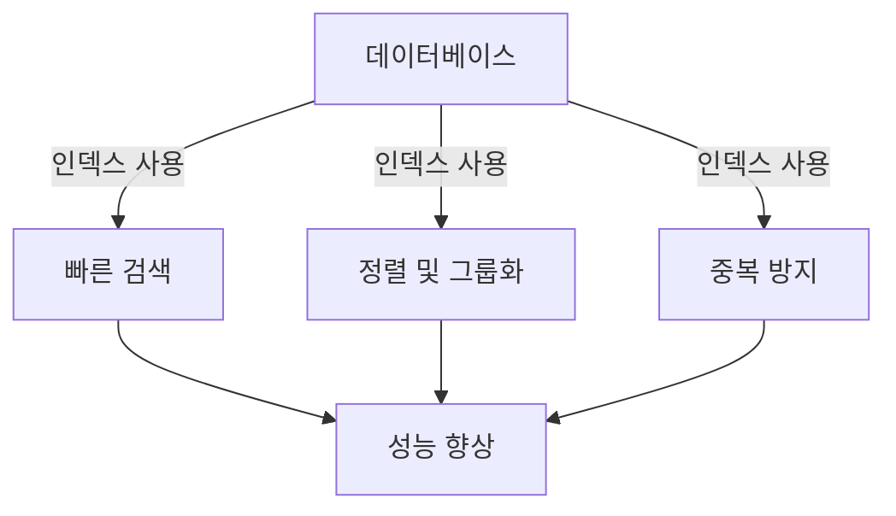
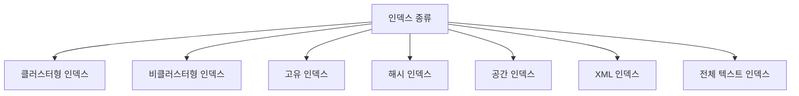
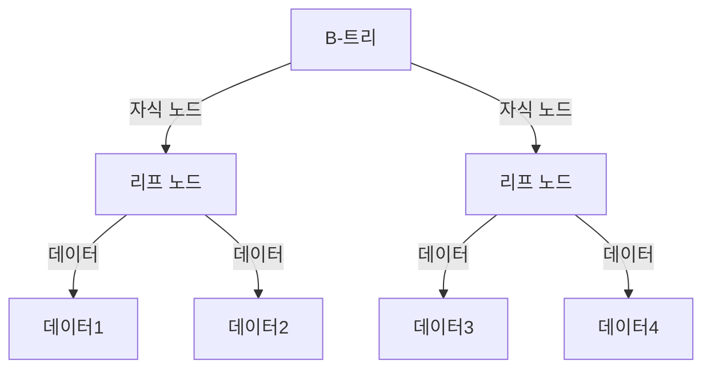
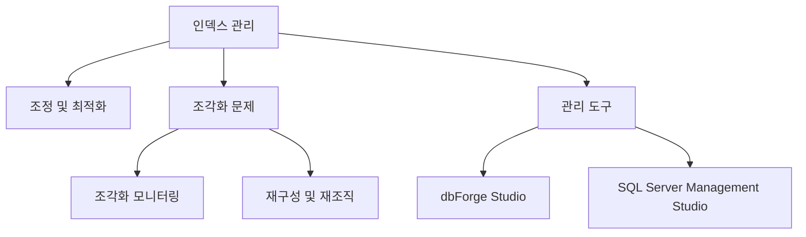
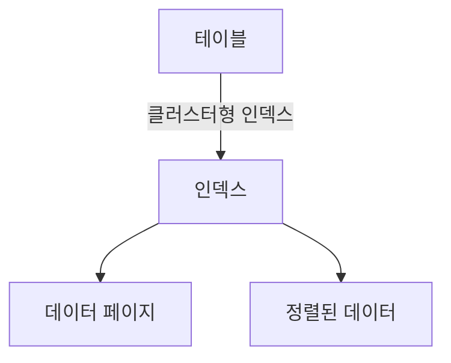
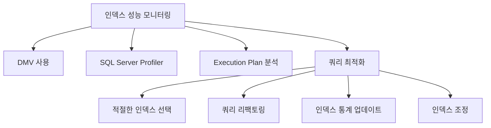
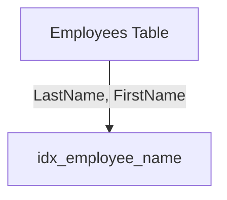
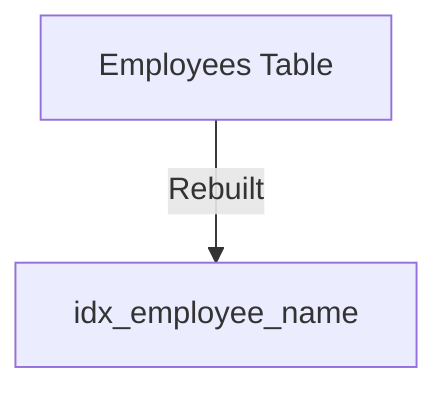
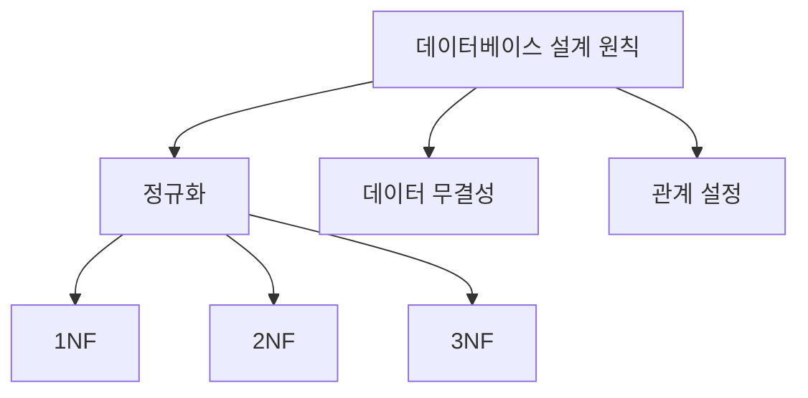
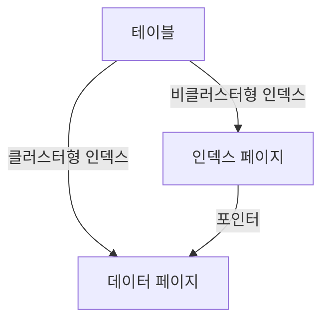

데이터베이스는 데이터를 저장하고 특정 정보에 대한 사용자 접근을 제공하는 데 필수적이다. 이러한 기본 작업은 데이터베이스가 확장되고 데이터 양이 증가하며 데이터 처리 시간이 길어짐에 따라 점점 더 복잡해진다. 대규모 데이터베이스에서 빠르고 효율적인 데이터 검색을 위해 인덱스를 사용한다. SQL 인덱스는 책이나 저널의 색인과 유사하게 작동하며, 테이블 내의 데이터를 참조하는 역할을 한다. 이 글에서는 SQL 인덱스에 대해 탐구하고, 데이터베이스 관리에 대한 이해를 높이는 데 도움을 줄 것이다. SQL 인덱스는 특정 테이블이나 뷰에서 데이터 검색 속도를 높이는 데이터베이스 구성 요소로, 최적화된 조회 테이블로 설계되어 필요한 레코드를 신속하게 찾을 수 있도록 돕는다. 인덱스는 B-트리 구조로 구성되어 있으며, 클러스터형 인덱스와 비클러스터형 인덱스 두 가지 일반적인 유형이 있다. 클러스터형 인덱스는 데이터 행을 특정 물리적 순서로 정렬하고 저장하는 반면, 비클러스터형 인덱스는 선택된 열을 재정렬하여 데이터 행에 대한 포인터를 포함한다. 이러한 인덱스는 데이터베이스의 성능을 향상시키는 데 중요한 역할을 하며, 적절한 인덱스 관리와 유지보수가 필요하다.


||
|:---:|
||


<!--
##### Outline #####
-->

<!--
# SQL 인덱스에 대한 포괄적인 가이드

## 개요
- SQL 인덱스의 중요성
- 데이터베이스 성능 향상

## SQL 인덱스의 종류 이해하기
- 인덱스의 정의
- 클러스터형 인덱스
  - 특징 및 사용 사례
- 비클러스터형 인덱스
  - 특징 및 사용 사례
- 고유 인덱스
- 기타 인덱스 유형
  - 해시 인덱스
  - 공간 인덱스
  - XML 인덱스
  - 전체 텍스트 인덱스

## SQL 인덱스의 작동 원리
- 인덱스의 구조 (B-트리 및 B+트리)
- 인덱스가 쿼리 성능에 미치는 영향
- 인덱스의 생성 및 삭제
  - `CREATE INDEX` 명령어
  - `DROP INDEX` 명령어

## 인덱스 관리 및 유지보수
- 인덱스 조정 및 최적화
- 인덱스 조각화 문제
  - 조각화 모니터링
  - 인덱스 재구성 및 재조직
- 인덱스 관리 도구 소개
  - dbForge Studio for SQL Server
  - SQL Server Management Studio (SSMS)와의 통합

## 인덱스 전략적 고려사항
- 인덱스 사용 시기
  - 인덱스를 구현해야 할 경우
  - 인덱스를 피해야 할 경우
- 클러스터형 인덱스의 특별 고려사항

## 인덱스 성능 모니터링
- SQL Server에서 인덱스 성능 모니터링 방법
- 인덱스 성능 개선을 위한 쿼리 최적화

## 예제
- 인덱스 생성 예제
- 인덱스 삭제 예제
- 인덱스 조정 예제

## FAQ
- 인덱스가 데이터베이스 성능에 미치는 영향은?
- 인덱스가 필요한 이유는 무엇인가요?
- 인덱스가 쿼리 성능을 저하시킬 수 있는 경우는?
- 인덱스의 크기는 어떻게 관리하나요?

## 관련 기술
- 데이터베이스 관리 시스템(DBMS)
- SQL 쿼리 최적화
- 데이터베이스 설계 원칙

## 결론
- SQL 인덱스의 중요성 요약
- 인덱스 관리의 필요성
- 최적의 데이터베이스 성능을 위한 인덱스 전략

## 참고 자료
- SQL 인덱스 관련 문서 및 링크
- 데이터베이스 성능 최적화 관련 자료

이 목차는 SQL 인덱스에 대한 포괄적인 이해를 돕고, 관련된 기술과 전략을 포함하여 독자가 필요한 정보를 쉽게 찾을 수 있도록 구성되었습니다.
-->

<!--
## 개요
- SQL 인덱스의 중요성
- 데이터베이스 성능 향상
-->

## 개요

SQL 인덱스는 데이터베이스에서 데이터를 효율적으로 검색하고 관리하기 위한 중요한 도구이다. 인덱스는 특정 열에 대한 포인터를 제공하여 데이터 검색 속도를 크게 향상시킨다. 이로 인해 대량의 데이터가 있는 테이블에서도 빠른 쿼리 성능을 유지할 수 있다.

**SQL 인덱스의 중요성**

SQL 인덱스는 데이터베이스 성능을 최적화하는 데 필수적이다. 인덱스가 없으면 데이터베이스는 테이블의 모든 행을 순차적으로 검색해야 하므로, 쿼리 성능이 저하된다. 반면, 인덱스를 사용하면 특정 열에 대한 검색이 훨씬 빨라지며, 이는 전체 애플리케이션의 응답 속도에 긍정적인 영향을 미친다. 

예를 들어, 고객 정보를 저장하는 테이블에서 고객 ID를 기준으로 검색할 경우, 인덱스가 없다면 데이터베이스는 모든 고객 정보를 확인해야 하지만, 인덱스가 있다면 해당 고객 ID에 대한 위치를 빠르게 찾을 수 있다.

```sql
CREATE INDEX idx_customer_id ON customers(customer_id);
```

위의 SQL 코드는 `customers` 테이블의 `customer_id` 열에 인덱스를 생성하는 예시이다. 이 인덱스는 고객 ID를 기준으로 한 검색을 빠르게 수행할 수 있도록 도와준다.

**데이터베이스 성능 향상**

인덱스는 데이터베이스의 성능을 향상시키는 여러 방법 중 하나이다. 인덱스를 사용하면 다음과 같은 이점을 얻을 수 있다:

1. **빠른 데이터 검색**: 인덱스는 특정 열에 대한 검색을 최적화하여 쿼리 성능을 향상시킨다.
2. **정렬 및 그룹화 성능 향상**: 인덱스는 데이터 정렬 및 그룹화 작업을 더 효율적으로 수행할 수 있도록 돕는다.
3. **중복 데이터 방지**: 고유 인덱스를 사용하면 중복된 데이터를 방지할 수 있어 데이터 무결성을 유지하는 데 기여한다.

다음은 인덱스가 데이터베이스 성능에 미치는 영향을 시각적으로 나타낸 다이어그램이다.



이와 같이 SQL 인덱스는 데이터베이스의 성능을 향상시키는 데 중요한 역할을 하며, 적절한 인덱스 설계와 관리는 데이터베이스의 효율성을 극대화하는 데 필수적이다.

<!--
## SQL 인덱스의 종류 이해하기
- 인덱스의 정의
- 클러스터형 인덱스
  - 특징 및 사용 사례
- 비클러스터형 인덱스
  - 특징 및 사용 사례
- 고유 인덱스
- 기타 인덱스 유형
  - 해시 인덱스
  - 공간 인덱스
  - XML 인덱스
  - 전체 텍스트 인덱스
-->

## SQL 인덱스의 종류 이해하기

SQL 인덱스는 데이터베이스에서 데이터를 효율적으로 검색하기 위해 사용되는 데이터 구조이다. 인덱스는 특정 열에 대한 검색 성능을 향상시키며, 데이터베이스의 성능을 최적화하는 데 중요한 역할을 한다. 이번 섹션에서는 다양한 종류의 SQL 인덱스에 대해 알아보겠다.

**인덱스의 정의**  

인덱스는 데이터베이스 테이블의 특정 열에 대한 포인터 역할을 하여, 데이터 검색을 빠르게 수행할 수 있도록 돕는 구조이다. 인덱스는 일반적으로 B-트리 또는 해시 테이블과 같은 자료 구조를 사용하여 구현된다.

**클러스터형 인덱스**

클러스터형 인덱스는 테이블의 데이터가 인덱스의 순서에 따라 물리적으로 정렬되어 저장되는 인덱스이다. 즉, 클러스터형 인덱스는 테이블의 기본 키에 해당하는 열에 대해 자동으로 생성된다. 클러스터형 인덱스는 데이터 검색 속도를 크게 향상시킬 수 있지만, 데이터 삽입 및 삭제 시 성능 저하가 발생할 수 있다.

**특징 및 사용 사례** 

- 데이터가 정렬되어 저장되므로 범위 검색에 유리하다.
- 기본 키에 대해 자동으로 생성되며, 하나의 테이블에 하나만 존재할 수 있다.
- 대량의 데이터를 자주 검색하는 경우 유용하다.

```sql
CREATE CLUSTERED INDEX idx_clustered ON Employees (EmployeeID);
```

**비클러스터형 인덱스** 

비클러스터형 인덱스는 테이블의 데이터와는 별도로 저장되는 인덱스이다. 이 인덱스는 데이터의 물리적 순서와는 관계없이, 특정 열에 대한 검색 성능을 향상시키기 위해 사용된다. 비클러스터형 인덱스는 여러 개를 생성할 수 있으며, 각 인덱스는 포인터를 통해 실제 데이터에 접근한다.

**특징 및 사용 사례** 

- 여러 개의 비클러스터형 인덱스를 생성할 수 있다.
- 특정 열에 대한 검색 성능을 향상시키는 데 유리하다.
- 데이터 삽입 및 삭제 시 성능 저하가 적다.

```sql
CREATE NONCLUSTERED INDEX idx_nonclustered ON Employees (LastName);
```

**고유 인덱스**  

고유 인덱스는 인덱스가 적용된 열의 값이 중복되지 않도록 보장하는 인덱스이다. 이 인덱스는 데이터 무결성을 유지하는 데 중요한 역할을 하며, 기본 키와 함께 사용된다.

**기타 인덱스 유형**

- **해시 인덱스**: 해시 함수를 사용하여 데이터를 검색하는 인덱스이다. 주로 키-값 쌍을 빠르게 검색할 때 사용된다.
  
- **공간 인덱스**: 공간 데이터를 효율적으로 검색하기 위해 사용되는 인덱스이다. GIS(지리 정보 시스템) 데이터와 같은 공간 데이터를 처리할 때 유용하다.

- **XML 인덱스**: XML 데이터 타입에 대한 인덱스이다. XML 데이터를 효율적으로 검색하고 쿼리 성능을 향상시키기 위해 사용된다.

- **전체 텍스트 인덱스**: 텍스트 데이터에 대한 검색 성능을 향상시키기 위해 사용되는 인덱스이다. 대량의 텍스트 데이터를 검색할 때 유용하다.



이와 같이 다양한 종류의 SQL 인덱스는 데이터베이스의 성능을 최적화하는 데 중요한 역할을 한다. 각 인덱스의 특징과 사용 사례를 이해하고 적절히 활용하는 것이 데이터베이스 관리의 핵심이다.

<!--
## SQL 인덱스의 작동 원리
- 인덱스의 구조 (B-트리 및 B+트리)
- 인덱스가 쿼리 성능에 미치는 영향
- 인덱스의 생성 및 삭제
  - `CREATE INDEX` 명령어
  - `DROP INDEX` 명령어
-->

## SQL 인덱스의 작동 원리

SQL 인덱스는 데이터베이스에서 데이터를 효율적으로 검색하기 위해 사용되는 구조이다. 인덱스는 데이터베이스 테이블의 특정 열에 대한 포인터를 제공하여, 쿼리 성능을 크게 향상시킬 수 있다. 이번 섹션에서는 인덱스의 구조, 쿼리 성능에 미치는 영향, 그리고 인덱스의 생성 및 삭제 방법에 대해 살펴보겠다.

**인덱스의 구조 (B-트리 및 B+트리)**

인덱스는 일반적으로 B-트리 또는 B+트리 구조로 구현된다. B-트리는 균형 잡힌 트리 구조로, 각 노드가 여러 자식을 가질 수 있으며, 모든 리프 노드가 동일한 깊이에 위치한다. B+트리는 B-트리의 변형으로, 모든 데이터가 리프 노드에만 저장되고, 내부 노드는 검색을 위한 포인터 역할을 한다. 이러한 구조는 데이터 검색 시 빠른 탐색을 가능하게 한다.



**인덱스가 쿼리 성능에 미치는 영향**

인덱스는 쿼리 성능에 긍정적인 영향을 미친다. 인덱스를 사용하면 데이터베이스는 전체 테이블을 스캔하는 대신 인덱스를 통해 필요한 데이터에 빠르게 접근할 수 있다. 예를 들어, WHERE 절에 인덱스가 설정된 열이 포함된 쿼리는 인덱스를 통해 더 빠르게 결과를 반환할 수 있다. 그러나 인덱스가 너무 많거나 비효율적으로 설정되면 오히려 성능 저하를 초래할 수 있으므로 주의가 필요하다.

**인덱스의 생성 및 삭제**

인덱스는 SQL 명령어를 사용하여 생성하고 삭제할 수 있다. 인덱스를 생성할 때는 `CREATE INDEX` 명령어를 사용하며, 특정 테이블의 특정 열에 인덱스를 추가할 수 있다. 예를 들어, 다음과 같은 SQL 문을 통해 인덱스를 생성할 수 있다.

```sql
CREATE INDEX idx_employee_name ON employees(name);
```

위의 SQL 문은 `employees` 테이블의 `name` 열에 인덱스를 생성하는 예시이다.

인덱스를 삭제할 때는 `DROP INDEX` 명령어를 사용한다. 다음은 인덱스를 삭제하는 SQL 문이다.

```sql
DROP INDEX idx_employee_name ON employees;
```

이 명령어는 `employees` 테이블에서 `idx_employee_name` 인덱스를 삭제하는 예시이다. 인덱스를 삭제하면 해당 인덱스에 대한 검색 성능이 저하될 수 있으므로 신중하게 결정해야 한다. 

이와 같이 SQL 인덱스의 작동 원리를 이해하면 데이터베이스 성능을 최적화하는 데 큰 도움이 된다. 인덱스의 구조와 쿼리 성능에 미치는 영향을 잘 이해하고, 적절한 인덱스를 생성 및 관리하는 것이 중요하다.

<!--
## 인덱스 관리 및 유지보수
- 인덱스 조정 및 최적화
- 인덱스 조각화 문제
  - 조각화 모니터링
  - 인덱스 재구성 및 재조직
- 인덱스 관리 도구 소개
  - dbForge Studio for SQL Server
  - SQL Server Management Studio (SSMS)와의 통합
-->

## 인덱스 관리 및 유지보수

인덱스는 데이터베이스 성능을 향상시키는 중요한 요소이다. 그러나 인덱스가 시간이 지남에 따라 조각화되거나 비효율적으로 관리될 경우, 오히려 성능 저하를 초래할 수 있다. 따라서 인덱스의 조정 및 최적화, 조각화 문제 해결, 그리고 적절한 관리 도구의 사용이 필수적이다.

**인덱스 조정 및 최적화**

인덱스 조정은 데이터베이스의 성능을 극대화하기 위해 인덱스를 최적화하는 과정이다. 이를 통해 쿼리 성능을 향상시키고, 불필요한 인덱스를 제거하여 저장 공간을 절약할 수 있다. 인덱스 조정은 주기적으로 수행하는 것이 좋으며, 다음과 같은 방법을 통해 이루어진다.

1. **사용되지 않는 인덱스 식별**: 쿼리 성능을 분석하여 사용되지 않는 인덱스를 찾아 삭제한다.
2. **인덱스 통계 업데이트**: 인덱스 통계를 주기적으로 업데이트하여 쿼리 최적화기가 최신 정보를 바탕으로 최적의 실행 계획을 수립할 수 있도록 한다.

```sql
-- 인덱스 통계 업데이트 예제
UPDATE STATISTICS 테이블명 인덱스명;
```

**인덱스 조각화 문제**

인덱스 조각화는 인덱스 페이지가 비효율적으로 저장되어 쿼리 성능을 저하시킬 수 있는 문제이다. 조각화는 주로 데이터의 삽입, 삭제, 업데이트로 인해 발생한다. 이를 해결하기 위해서는 조각화 모니터링과 인덱스 재구성 및 재조직이 필요하다.

**조각화 모니터링**

조각화 수준을 모니터링하여 인덱스의 성능을 평가할 수 있다. 일반적으로 조각화가 30% 이상인 경우 인덱스 재구성이 필요하다. SQL Server에서는 다음과 같은 쿼리를 통해 조각화 상태를 확인할 수 있다.

```sql
-- 인덱스 조각화 상태 확인 예제
SELECT 
    OBJECT_NAME(object_id) AS TableName,
    name AS IndexName,
    index_id,
    avg_fragmentation_in_percent
FROM sys.dm_db_index_physical_stats(DB_ID(), NULL, NULL, NULL, NULL)
WHERE avg_fragmentation_in_percent > 30;
```

**인덱스 재구성 및 재조직**

인덱스 조각화가 심각한 경우, 인덱스를 재구성하거나 재조직해야 한다. 재구성은 인덱스를 완전히 새로 만드는 과정이며, 재조직은 인덱스를 부분적으로 정리하는 과정이다. 다음은 두 가지 방법의 예시이다.

```sql
-- 인덱스 재구성 예제
ALTER INDEX 인덱스명 ON 테이블명 REBUILD;

-- 인덱스 재조직 예제
ALTER INDEX 인덱스명 ON 테이블명 REORGANIZE;
```

**인덱스 관리 도구 소개**

인덱스 관리를 보다 효율적으로 수행하기 위해 다양한 도구를 사용할 수 있다. 여기서는 두 가지 주요 도구를 소개한다.

**dbForge Studio for SQL Server**

dbForge Studio는 SQL Server 데이터베이스 관리 및 개발을 위한 통합 도구이다. 이 도구는 인덱스 관리 기능을 제공하여 인덱스 조정, 성능 모니터링, 조각화 분석 등을 쉽게 수행할 수 있다.

**SQL Server Management Studio (SSMS)와의 통합**

SQL Server Management Studio(SSMS)는 SQL Server의 기본 관리 도구로, 인덱스 관리 기능을 포함하고 있다. SSMS를 사용하면 인덱스의 생성, 삭제, 조정 및 성능 모니터링을 직관적으로 수행할 수 있다.



인덱스 관리 및 유지보수는 데이터베이스 성능을 최적화하는 데 필수적인 과정이다. 주기적인 조정과 모니터링을 통해 인덱스의 효율성을 유지하고, 적절한 도구를 활용하여 관리하는 것이 중요하다.

<!--
## 인덱스 전략적 고려사항
- 인덱스 사용 시기
  - 인덱스를 구현해야 할 경우
  - 인덱스를 피해야 할 경우
- 클러스터형 인덱스의 특별 고려사항
-->

## 인덱스 전략적 고려사항

인덱스는 데이터베이스 성능을 향상시키는 중요한 요소이다. 그러나 인덱스를 사용할 때는 몇 가지 전략적 고려사항이 필요하다. 이 섹션에서는 인덱스를 사용해야 할 경우와 피해야 할 경우, 그리고 클러스터형 인덱스에 대한 특별 고려사항을 다룬다.

**인덱스 사용 시기**

인덱스를 구현해야 할 경우는 다음과 같다.

1. **빈번한 검색 쿼리**: 데이터베이스에서 특정 열에 대한 검색이 자주 발생하는 경우, 해당 열에 인덱스를 추가하는 것이 좋다. 인덱스는 검색 속도를 크게 향상시킬 수 있다.
   
2. **정렬 및 그룹화**: ORDER BY 또는 GROUP BY 절을 사용하는 쿼리에서 성능을 개선하기 위해 인덱스를 사용할 수 있다. 인덱스는 정렬된 데이터를 제공하므로 이러한 쿼리의 성능을 높일 수 있다.

3. **조인 연산**: 여러 테이블 간의 조인 연산이 빈번하게 발생하는 경우, 조인에 사용되는 열에 인덱스를 추가하면 성능을 개선할 수 있다.

반면, 인덱스를 피해야 할 경우는 다음과 같다.

1. **빈번한 데이터 수정**: INSERT, UPDATE, DELETE 작업이 자주 발생하는 테이블에서는 인덱스가 오히려 성능 저하를 초래할 수 있다. 인덱스는 데이터 수정 시 추가적인 작업을 요구하기 때문이다.

2. **소규모 테이블**: 데이터가 적은 테이블에서는 인덱스의 이점이 크지 않다. 오히려 인덱스를 관리하는 데 드는 비용이 더 클 수 있다.

3. **다양한 쿼리 패턴**: 쿼리 패턴이 다양하고 예측할 수 없는 경우, 인덱스가 효과적이지 않을 수 있다. 이 경우 인덱스의 유지보수 비용이 증가할 수 있다.

** 클러스터형 인덱스의 특별 고려사항 **

클러스터형 인덱스는 데이터가 실제로 저장되는 순서를 결정하므로, 몇 가지 특별한 고려사항이 있다.

1. **기본 키 설정**: 클러스터형 인덱스는 일반적으로 기본 키에 설정된다. 기본 키는 유일성을 보장하므로, 클러스터형 인덱스와 잘 어울린다.

2. **데이터 정렬**: 클러스터형 인덱스는 데이터의 물리적 순서를 결정하므로, 자주 사용되는 쿼리의 정렬 기준에 맞춰 인덱스를 설정하는 것이 중요하다.

3. **인덱스 크기**: 클러스터형 인덱스는 데이터 페이지와 함께 저장되므로, 인덱스의 크기가 데이터베이스의 성능에 영향을 미칠 수 있다. 따라서 인덱스의 크기를 관리하는 것이 중요하다.

다음은 클러스터형 인덱스의 구조를 나타내는 다이어그램이다.



이와 같은 전략적 고려사항을 바탕으로 인덱스를 적절히 활용하면 데이터베이스 성능을 극대화할 수 있다. 인덱스의 사용 여부와 종류를 신중하게 결정하는 것이 중요하다.

<!--
## 인덱스 성능 모니터링
- SQL Server에서 인덱스 성능 모니터링 방법
- 인덱스 성능 개선을 위한 쿼리 최적화
-->

## 인덱스 성능 모니터링

인덱스 성능 모니터링은 데이터베이스의 효율성을 유지하고 최적화하는 데 중요한 역할을 한다. 인덱스가 잘 관리되지 않으면 쿼리 성능이 저하될 수 있으며, 이는 전체 시스템의 성능에 부정적인 영향을 미칠 수 있다. 따라서 SQL Server에서 인덱스 성능을 모니터링하는 방법과 인덱스 성능 개선을 위한 쿼리 최적화 방법을 이해하는 것이 필요하다.

**SQL Server에서 인덱스 성능 모니터링 방법**

SQL Server에서는 다양한 도구와 방법을 통해 인덱스 성능을 모니터링할 수 있다. 그 중 몇 가지 주요 방법은 다음과 같다.

1. **DMV (Dynamic Management Views) 사용하기**  
   SQL Server의 DMV를 사용하여 인덱스의 성능 통계를 조회할 수 있다. 예를 들어, `sys.dm_db_index_usage_stats` 뷰를 사용하면 인덱스의 사용 빈도와 관련된 정보를 확인할 수 있다.

   ```sql
   SELECT 
       OBJECT_NAME(i.object_id) AS TableName,
       i.name AS IndexName,
       s.user_seeks,
       s.user_scans,
       s.user_lookups,
       s.user_updates
   FROM 
       sys.indexes AS i
   JOIN 
       sys.dm_db_index_usage_stats AS s 
   ON 
       i.object_id = s.object_id AND i.index_id = s.index_id
   WHERE 
       OBJECTPROPERTY(i.object_id, 'IsUserTable') = 1;
   ```

2. **SQL Server Profiler 사용하기**  
   SQL Server Profiler를 사용하여 쿼리 실행 시 인덱스의 성능을 실시간으로 모니터링할 수 있다. 이를 통해 쿼리의 실행 계획을 분석하고, 인덱스가 어떻게 사용되고 있는지를 파악할 수 있다.

3. **Execution Plan 분석하기**  
   쿼리의 실행 계획을 분석하여 인덱스의 사용 여부와 성능을 평가할 수 있다. SQL Server Management Studio(SSMS)에서 쿼리를 실행할 때 "실행 계획 포함" 옵션을 선택하면, 쿼리의 실행 계획을 시각적으로 확인할 수 있다.

**인덱스 성능 개선을 위한 쿼리 최적화**

인덱스 성능을 개선하기 위해서는 쿼리 최적화가 필수적이다. 다음은 인덱스 성능을 개선하기 위한 몇 가지 방법이다.

1. **적절한 인덱스 선택하기**  
   쿼리에서 자주 사용되는 열에 대해 적절한 인덱스를 생성하는 것이 중요하다. 인덱스가 없는 경우, SQL Server는 전체 테이블 스캔을 수행하게 되어 성능이 저하될 수 있다.

2. **쿼리 리팩토링하기**  
   비효율적인 쿼리를 리팩토링하여 인덱스의 효율성을 높일 수 있다. 예를 들어, 서브쿼리 대신 조인을 사용하거나, 불필요한 열을 선택하지 않도록 쿼리를 수정하는 것이 좋다.

3. **인덱스 통계 업데이트하기**  
   인덱스 통계는 SQL Server가 쿼리 최적화 시 사용하는 정보이다. 통계가 오래된 경우, SQL Server는 비효율적인 실행 계획을 선택할 수 있다. 따라서 정기적으로 통계를 업데이트하는 것이 필요하다.

   ```sql
   UPDATE STATISTICS TableName WITH FULLSCAN;
   ```

4. **인덱스 조정하기**  
   인덱스의 조각화가 심한 경우, 인덱스를 재구성하거나 재조직하여 성능을 개선할 수 있다. 조각화가 30% 이상인 경우 재구성을 고려하고, 5%에서 30% 사이인 경우 재조직을 고려하는 것이 좋다.



이와 같은 방법들을 통해 SQL Server에서 인덱스 성능을 효과적으로 모니터링하고 개선할 수 있다. 인덱스 성능을 지속적으로 관리하는 것은 데이터베이스의 전반적인 성능을 향상시키는 데 필수적이다.

<!--
## 예제
- 인덱스 생성 예제
- 인덱스 삭제 예제
- 인덱스 조정 예제
-->

## 예제

**인덱스 생성 예제**

인덱스를 생성하는 것은 데이터베이스 성능을 향상시키는 중요한 작업이다. 다음은 SQL Server에서 인덱스를 생성하는 기본적인 예제이다.

```sql
CREATE INDEX idx_employee_name
ON Employees (LastName, FirstName);
```

위의 SQL 문은 `Employees` 테이블의 `LastName`과 `FirstName` 열에 대해 비클러스터형 인덱스를 생성하는 예제이다. 이 인덱스는 해당 열을 기준으로 검색 성능을 향상시킬 수 있다.

다음은 인덱스 생성 후의 데이터 구조를 나타내는 다이어그램이다.



**인덱스 삭제 예제**

인덱스가 더 이상 필요하지 않거나 성능에 부정적인 영향을 미칠 경우, 인덱스를 삭제할 수 있다. 다음은 인덱스를 삭제하는 SQL 문이다.

```sql
DROP INDEX idx_employee_name
ON Employees;
```

위의 SQL 문은 `Employees` 테이블에서 `idx_employee_name` 인덱스를 삭제하는 예제이다. 인덱스를 삭제하면 데이터베이스의 쓰기 성능이 향상될 수 있지만, 검색 성능은 저하될 수 있다.

**인덱스 조정 예제**

인덱스 조정은 데이터베이스 성능을 최적화하는 데 중요한 역할을 한다. 인덱스 조정은 인덱스의 구조를 변경하거나, 불필요한 인덱스를 제거하는 작업을 포함한다. 다음은 인덱스를 재구성하는 SQL 문이다.

```sql
ALTER INDEX idx_employee_name
ON Employees REBUILD;
```

위의 SQL 문은 `Employees` 테이블의 `idx_employee_name` 인덱스를 재구성하는 예제이다. 인덱스 재구성은 조각화를 줄이고, 쿼리 성능을 향상시킬 수 있다.

다음은 인덱스 조정 후의 데이터 구조를 나타내는 다이어그램이다.



이와 같은 예제들은 SQL 인덱스를 효과적으로 관리하고 최적화하는 데 도움이 된다. 인덱스 생성, 삭제 및 조정은 데이터베이스 성능을 극대화하는 데 필수적인 작업이다.

<!--
## FAQ
- 인덱스가 데이터베이스 성능에 미치는 영향은?
- 인덱스가 필요한 이유는 무엇인가요?
- 인덱스가 쿼리 성능을 저하시킬 수 있는 경우는?
- 인덱스의 크기는 어떻게 관리하나요?
-->

## FAQ

**인덱스가 데이터베이스 성능에 미치는 영향은?**

인덱스는 데이터베이스 성능에 매우 중요한 역할을 한다. 인덱스는 데이터 검색 속도를 향상시키며, 쿼리 성능을 개선하는 데 기여한다. 인덱스가 없으면 데이터베이스는 전체 테이블을 스캔해야 하므로, 대량의 데이터가 있는 경우 성능 저하가 발생할 수 있다. 반면, 인덱스를 사용하면 특정 열에 대한 검색이 훨씬 빨라지며, 이는 데이터베이스의 응답 시간을 단축시킨다.

```sql
CREATE INDEX idx_customer_name ON Customers (Name);
```

위의 SQL 명령어는 `Customers` 테이블의 `Name` 열에 인덱스를 생성하는 예시이다. 이 인덱스는 고객 이름으로 검색할 때 성능을 향상시킨다.

**인덱스가 필요한 이유는 무엇인가요?**

인덱스는 데이터베이스에서 효율적인 데이터 검색을 가능하게 한다. 대량의 데이터가 있는 경우, 인덱스는 특정 조건에 맞는 데이터를 빠르게 찾을 수 있도록 도와준다. 또한, 인덱스는 정렬 및 집계 작업을 최적화하여 쿼리 성능을 더욱 향상시킨다. 인덱스가 없으면 데이터베이스는 모든 레코드를 검색해야 하므로, 이는 비효율적이고 시간이 많이 소요된다.

**인덱스가 쿼리 성능을 저하시킬 수 있는 경우는?**

인덱스는 쿼리 성능을 향상시키는 데 도움을 주지만, 잘못된 인덱스 설계나 과도한 인덱스 생성은 오히려 성능을 저하시킬 수 있다. 예를 들어, 너무 많은 인덱스가 생성되면 데이터 삽입, 수정, 삭제 작업 시 인덱스를 업데이트해야 하므로 성능이 저하될 수 있다. 또한, 인덱스가 자주 사용되지 않는 경우, 인덱스 유지 관리에 소모되는 리소스가 낭비될 수 있다.

```sql
DROP INDEX idx_customer_name ON Customers;
```

위의 SQL 명령어는 `Customers` 테이블에서 `idx_customer_name` 인덱스를 삭제하는 예시이다. 필요하지 않은 인덱스는 삭제하여 성능을 개선할 수 있다.

**인덱스의 크기는 어떻게 관리하나요?**

인덱스의 크기는 데이터베이스의 성능에 영향을 미칠 수 있으므로, 적절한 관리가 필요하다. 인덱스의 크기를 관리하기 위해서는 다음과 같은 방법을 고려할 수 있다.

1. **인덱스 조정**: 사용되지 않는 인덱스를 삭제하고, 자주 사용되는 쿼리에 맞춰 인덱스를 최적화한다.
2. **조각화 모니터링**: 인덱스 조각화가 발생하면 성능이 저하될 수 있으므로, 정기적으로 조각화를 모니터링하고 필요 시 재구성하거나 재조직한다.
3. **인덱스 통계 업데이트**: 인덱스 통계를 주기적으로 업데이트하여 쿼리 최적화기가 최신 정보를 바탕으로 최적의 실행 계획을 수립할 수 있도록 한다.

```sql
UPDATE STATISTICS Customers;
```

위의 SQL 명령어는 `Customers` 테이블의 통계를 업데이트하는 예시이다. 이를 통해 인덱스의 성능을 유지할 수 있다. 

이와 같은 방법으로 인덱스의 크기를 관리하면 데이터베이스 성능을 최적화할 수 있다.

<!--
## 관련 기술
- 데이터베이스 관리 시스템(DBMS)
- SQL 쿼리 최적화
- 데이터베이스 설계 원칙
-->

## 관련 기술

**데이터베이스 관리 시스템(DBMS)** 

데이터베이스 관리 시스템(DBMS)은 데이터베이스를 생성, 관리 및 조작하는 소프트웨어이다. DBMS는 데이터의 저장, 검색, 수정 및 삭제를 효율적으로 수행할 수 있도록 도와준다. 다양한 DBMS가 존재하며, 각기 다른 기능과 성능을 제공한다. 예를 들어, MySQL, PostgreSQL, Oracle Database, Microsoft SQL Server 등이 있다. 이들 DBMS는 SQL(Structured Query Language)을 사용하여 데이터베이스와 상호작용하며, 인덱스와 같은 데이터 구조를 통해 성능을 최적화할 수 있다.

**SQL 쿼리 최적화** 

SQL 쿼리 최적화는 데이터베이스에서 쿼리의 성능을 향상시키기 위한 과정이다. 쿼리 최적화는 인덱스를 적절히 활용하고, 쿼리 구조를 개선하여 데이터 검색 속도를 높이는 데 중점을 둔다. 예를 들어, WHERE 절에 인덱스가 적용된 열을 사용하면 쿼리 성능이 크게 향상될 수 있다. 다음은 간단한 SQL 쿼리 최적화 예제이다.

```sql
-- 비효율적인 쿼리
SELECT * FROM employees WHERE last_name LIKE 'S%';

-- 최적화된 쿼리 (인덱스가 적용된 경우)
SELECT * FROM employees WHERE last_name = 'Smith';
```

**데이터베이스 설계 원칙**  

효과적인 데이터베이스 설계는 데이터베이스의 성능과 유지보수에 큰 영향을 미친다. 데이터베이스 설계 원칙에는 정규화, 데이터 무결성, 관계 설정 등이 포함된다. 정규화는 데이터 중복을 최소화하고, 데이터 무결성은 데이터의 정확성과 일관성을 보장하는 데 중점을 둔다. 다음은 데이터베이스 설계의 기본 원칙을 나타내는 다이어그램이다.



이와 같은 원칙을 준수하면 데이터베이스의 성능을 극대화하고, 유지보수의 용이성을 높일 수 있다. 데이터베이스 관리 시스템, SQL 쿼리 최적화, 데이터베이스 설계 원칙은 모두 상호 연관되어 있으며, 최적의 데이터베이스 성능을 위해 함께 고려해야 할 중요한 요소들이다.

<!--
## 결론
- SQL 인덱스의 중요성 요약
- 인덱스 관리의 필요성
- 최적의 데이터베이스 성능을 위한 인덱스 전략
-->

## 결론

**SQL 인덱스의 중요성 요약**

SQL 인덱스는 데이터베이스의 성능을 향상시키는 중요한 요소이다. 인덱스는 데이터 검색 속도를 높이고, 쿼리 성능을 개선하는 데 기여한다. 적절한 인덱스를 사용하면 대량의 데이터에서도 빠른 검색이 가능해지며, 이는 사용자 경험을 향상시키는 데 필수적이다. 인덱스는 데이터베이스의 구조를 최적화하고, 데이터 접근을 효율적으로 만들어준다.

**인덱스 관리의 필요성**  

인덱스는 단순히 생성하는 것만으로 끝나는 것이 아니다. 지속적인 관리와 유지보수가 필요하다. 인덱스는 시간이 지남에 따라 조각화되거나 비효율적으로 변할 수 있으며, 이는 성능 저하로 이어질 수 있다. 따라서 정기적인 인덱스 점검과 조정이 필요하며, 이를 통해 데이터베이스의 성능을 최적화할 수 있다. 인덱스 관리 도구를 활용하면 이러한 작업을 보다 효율적으로 수행할 수 있다.

**최적의 데이터베이스 성능을 위한 인덱스 전략** 

효과적인 인덱스 전략은 데이터베이스 성능을 극대화하는 데 필수적이다. 인덱스를 구현할 때는 쿼리 패턴을 분석하고, 자주 사용되는 열에 인덱스를 추가하는 것이 좋다. 또한, 클러스터형 인덱스와 비클러스터형 인덱스를 적절히 조합하여 사용하면 성능을 더욱 향상시킬 수 있다. 인덱스의 수를 최소화하고, 필요한 인덱스만 유지하는 것이 중요하다. 

다음은 인덱스의 구조를 나타내는 다이어그램이다.



이 다이어그램은 클러스터형 인덱스와 비클러스터형 인덱스의 관계를 보여준다. 클러스터형 인덱스는 데이터 페이지에 직접 연결되며, 비클러스터형 인덱스는 인덱스 페이지를 통해 데이터 페이지에 접근하는 구조이다. 이러한 구조를 이해하면 인덱스의 작동 원리를 보다 명확히 알 수 있다. 

결론적으로, SQL 인덱스는 데이터베이스 성능을 향상시키는 데 필수적이며, 지속적인 관리와 전략적 접근이 필요하다. 이를 통해 최적의 데이터베이스 성능을 유지할 수 있다.

<!--
## 참고 자료
- SQL 인덱스 관련 문서 및 링크
- 데이터베이스 성능 최적화 관련 자료
-->

## 참고 자료

**SQL 인덱스 관련 문서 및 링크**

SQL 인덱스에 대한 깊이 있는 이해를 위해 다음의 자료를 참고할 수 있다. 

1. **Microsoft Docs - SQL Server 인덱스**  
   Microsoft의 공식 문서에서는 SQL Server에서 인덱스를 사용하는 방법과 그 중요성에 대해 상세히 설명하고 있다. [Microsoft Docs - SQL Server 인덱스](https://docs.microsoft.com/en-us/sql/relational-databases/sql-server-index-design-guide)

2. **PostgreSQL Documentation - Indexes**  
   PostgreSQL의 공식 문서에서는 다양한 인덱스 유형과 그 사용법에 대해 설명하고 있다. [PostgreSQL Documentation - Indexes](https://www.postgresql.org/docs/current/indexes.html)

3. **MySQL Documentation - InnoDB Indexing**  
   MySQL의 InnoDB 스토리지 엔진에서 인덱스의 작동 방식에 대한 정보를 제공한다. [MySQL Documentation - InnoDB Indexing](https://dev.mysql.com/doc/refman/8.0/en/innodb-index-types.html)

**데이터베이스 성능 최적화 관련 자료**  
데이터베이스 성능을 최적화하기 위한 다양한 자료를 아래에 소개한다.

1. **"SQL Performance Explained" by Markus Winand**  
   SQL 성능 최적화에 대한 포괄적인 가이드를 제공하는 책으로, 인덱스의 중요성과 쿼리 최적화에 대한 유용한 정보를 포함하고 있다.

2. **"Database Tuning: Principles, Experiments, and Troubleshooting Techniques" by Dennis Shasha and Philippe Bonnet**  
   데이터베이스 성능 조정에 대한 이론과 실험을 다룬 책으로, 인덱스 관리와 관련된 다양한 기법을 설명하고 있다.

3. **Online Courses**  
   Coursera, Udemy와 같은 플랫폼에서 제공하는 데이터베이스 성능 최적화 관련 강좌를 통해 실습을 통해 배울 수 있다.

이 자료들은 SQL 인덱스와 데이터베이스 성능 최적화에 대한 이해를 돕는 데 유용할 것이다.

<!--
##### Reference #####
-->

## Reference


* [https://blog.devart.com/sql-index-and-management-guide.html](https://blog.devart.com/sql-index-and-management-guide.html)
* [https://velog.io/@gillog/SQL-Index%EC%9D%B8%EB%8D%B1%EC%8A%A4](https://velog.io/@gillog/SQL-Index%EC%9D%B8%EB%8D%B1%EC%8A%A4)
* [https://m.blog.naver.com/dnjswls23/222026710074](https://m.blog.naver.com/dnjswls23/222026710074)
* [https://learn.microsoft.com/ko-kr/sql/relational-databases/indexes/clustered-and-nonclustered-indexes-described?view=sql-server-ver16](https://learn.microsoft.com/ko-kr/sql/relational-databases/indexes/clustered-and-nonclustered-indexes-described?view=sql-server-ver16)
* [https://learn.microsoft.com/ko-kr/sql/relational-databases/indexes/indexes?view=sql-server-ver16](https://learn.microsoft.com/ko-kr/sql/relational-databases/indexes/indexes?view=sql-server-ver16)
* [https://mangkyu.tistory.com/96](https://mangkyu.tistory.com/96)
* [https://www.w3schools.com/sql/sql_create_index.asp](https://www.w3schools.com/sql/sql_create_index.asp)
* [https://www.geeksforgeeks.org/sql-indexes/](https://www.geeksforgeeks.org/sql-indexes/)


<!--
Databases are essential for storing data and providing user access to specific
information. This fundamental task becomes increasingly complex as databases
expand, data volumes swell, and data processing times lengthen. For quick and
efficient data retrieval from large databases, we use indexes.

An SQL index functions similarly to an index in a book or journal, referring
to data within tables. This article will explore SQL indexes, enhancing your
understanding of database management.

[ 

](https://www.devart.com/dbforge/sql/studio/download.html)

**Contents**

##  **Understanding the types of SQL indexes**

An SQL index is a database component that speeds up data retrieval from a
specific table or view. It is a small, optimized lookup table designed to
quickly find the required records. It contains keys derived from specific
column(s) of a table or view and organizes them in a **B-tree structure** :

[ 

](https://blog.devart.com/wp-content/uploads/2024/05/B-tree-structure.png)

  * **Root Node** : This top-level node contains the main keys that point to the next level (intermediate nodes). Its primary role is to divide data into larger segments. 
  * **Intermediate Nodes** : Positioned beneath the root node, these nodes contain keys that further divide the data into smaller segments, leading to other intermediate nodes or leaf nodes, depending on the tree’s depth. 
  * **Leaf Nodes** : Found at the bottom level of the B-tree, these nodes contain the keys and pointers to the corresponding data records. Leaf nodes are the actual indexes that optimize data retrieval. 

There are two common types of indexes: **clustered** and **nonclustered**
ones.

  * **Clustered Index** : This index type arranges and stores data rows in a table or view in a specific physical order. A table with a clustered index is referred to as a clustered table. Only one clustered index can be created because data rows can only be physically stored in one order. The primary key column is usually set as the default clustered index. 

  * **Nonclustered Index** : This index reorders selected columns. It contains the key values and pointers to specific data rows. Unlike the clustered index, the nonclustered index is saved separately from the data, making it possible to have multiple nonclustered indexes in a single table. 

Both clustered and nonclustered indexes can be unique.

A unique index ensures that duplicate values are not present in the index key
column(s). If the index is built on a single column, all values in that column
must be unique. If it’s built across multiple columns, each combination of
values across those columns must be unique.

Any attempt to insert a duplicate value into a column with a unique index will
fail, triggering an error.

The below table showcases the differences between the clustered and
nonclustered indexes:

|  **Clustered Index** **** |  **Nonclustered Index** ****  
---|---|---  
**Physical Storage** |  Physically sorts and stores data rows in the table  |  Stores logical pointers to the data rows   
**Data Organization** |  Reorders the table based on the index keys  |  Does not affect the physical ordering of the table   
**Uniqueness** |  Is mostly unique for better efficiency  |  Can be unique or non-unique   
**Performance Impact** |  Makes querying faster as data is physically sorted  |  Is slower than clustered index due to extra pointer lookups   
**Space Consumption** |  Does not require additional storage space  |  Requires additional storage space   
**Primary Use Case** |  Querying columns that are frequently used in sorting and grouping  |  Selective queries that are used to locate specific individual rows   
**Maintenance** |  Can lead to fragmentation; requires regular maintenance  |  Requires maintenance for optimal performance   
  
##  **How SQL indexes work**

When we query a table without an index, the query often needs to scan all rows
until it finds those that meet the conditions. This process is highly
inefficient, requiring significant time and resources. As the table grows,
such queries become increasingly problematic.

Indexing helps by establishing an order in an unordered table. While indexes
don’t physically reorder rows, they guide the database in creating a data
structure that stores references to information needed for efficient querying
as follows:

  * The index creates a table with columns for search conditions and a pointer that references rows containing additional information in the memory. 
  * The data structure (the index table) is sorted to improve query efficiency. 
  * The query uses the index to locate the relevant rows. 
  * The index points to the memory locations containing the necessary information. 

As a result, a table with an index allows a query to search significantly
fewer rows.

Indexes are primarily used to improve performance and are not visible to
users. In SQL, you can manage indexes using the **` CREATE INDEX ` ** command
to create an index and the **` DROP INDEX ` ** command to remove an index. Let
us delve deeper into these commands.

**CREATE INDEX**

The **` CREATE INDEX ` ** command is used for creating both clustered and
nonclustered indexes in SQL.

The following command creates a nonclustered, non-unique index:

    
    
    CREATE INDEX index_name
    ON table_name (column1, column2, ...);

_Note: The column order is crucial for nonclustered indexes that contain
multiple columns. Always place the columns you query most frequently at the
beginning of the list._

The command to create a unique index (an index that does not allow duplicate
records in columns) is:

    
    
    CREATE UNIQUE INDEX index_name
    ON table_name (column1, column2, ...);

**DROP INDEX**

To remove an index from the table, use the **` DROP INDEX ` ** command:

    
    
    DROP INDEX table_name.index_name;

_Note: Only the index owners or users with the DROP ANY INDEX privilege can
remove indexes._

Modern database management tools, particularly those with graphical user
interfaces (GUIs), make handling indexes more intuitive. In this article, we
highlight [ dbForge Studio for SQL Server
](https://www.devart.com/dbforge/sql/studio/studio-sql.html) as an example of
software that simplifies all database tasks. This integrated development
environment (IDE) also streamlines index management.

The graphical **Table Editor** in dbForge Studio allows users to [ create and
manage indexes ](https://www.devart.com/dbforge/sql/studio/table-
designer.html#indexes) with just a few clicks. To use this feature, create a
new table or edit an existing one from **Database Explorer** .

[ 

](https://blog.devart.com/wp-content/uploads/2024/05/open-table-editor.png)

Then, navigate to the **Indexes** tab within **Table Editor** to configure the
indexes.

[ 
 ](https://blog.devart.com/wp-content/uploads/2024/05/table-
editor-indexes.png)

##  **Strategic considerations for indexing**

Indexes are necessary performance-enhancing tools. However, they are separate
database objects. Moreover, not all tables require them.

The more columns and rows are included in an index, the more space it
consumes, and indexes can become large and complex. Furthermore, they add
complexity to the table and to the process of database design and
administration. Additionally, any updates to table data require corresponding
index updates, which can affect performance and write operations.

Therefore, it’s essential to carefully assess each table before implementing
an index and to select the appropriate index type and number.

Below are common scenarios for when to use or avoid indexes in SQL tables:

**When to implement an index:**

  * Columns that have a broad range of values 
  * Columns that contain few NULLs 
  * Columns frequently used in WHERE clauses or JOINs 

**When to avoid an index:**

  * Small tables generally don’t need additional indexing 
  * Frequently updated columns usually shouldn’t have indexes 
  * Columns not often used in WHERE clauses don’t benefit much from indexing 

**Special considerations for clustered indexes:**

Be cautious when establishing a clustered index. Ideally, use a clustered
index on columns with unique values, like a primary key. The clustered index
physically organizes data, which affects storage.

##  **Managing index fragmentation and performance**

[ SQL Server index fragmentation ](https://blog.devart.com/sql-server-index-
fragmentation-in-depth.html) is a common issue that arises over time. It
occurs when the logical order of an index no longer matches its physical
structure. The primary factors contributing to this problem include:

  * **Inserting/Updating Rows** : New rows may be inserted at locations that don’t align with the logical order specified in the index. Similarly, updated rows might move, disrupting the index’s structure. 

  * **Deleting Rows** : Deletion creates gaps in the index. If these gaps aren’t filled by new data, fragmentation can increase. 

  * **Improper Index Reorganization or Rebuilding** : While these operations are intended to maintain proper index structure, they can inadvertently cause issues if not executed correctly. 

###  **Monitoring index fragmentation**

Monitoring database indexes is a routine and necessary task for
administrators. SQL Server provides a built-in tool to detect index
fragmentation: **sys.dm_db_index_physical_stats()** .

The **sys.dm_db_index_physical_stats()** function in SQL Server allows the
administrators to identify index fragmentation and the level of the issue.

The basic query is:

    
    
    SELECT * 
    FROM sys.dm_db_index_physical_stats(NULL, NULL, NULL, NULL, NULL)  
    WHERE avg_fragmentation_in_percent > 0 
    ORDER BY avg_fragmentation_in_percent DESC;

[ 

](https://blog.devart.com/wp-content/uploads/2024/05/fragmented-indexes.png)

This query reveals the fragmentation level. Depending on the fragmentation
percentage, administrators can choose between two corrective actions:
rebuilding or reorganizing the index.

###  **SQL index maintenance: rebuilding and reorganizing**

Index rebuilding and index reorganization are distinct operations. Each serves
a specific purpose. Applying both to the same index is unnecessary because it
doubles the effort and resource consumption without offering any benefits.

**Index Rebuilding**

Rebuilding an index involves removing the old index and replacing it with a
new one. It is recommended for severely fragmented indexes, typically above
30%.

The command is:

    
    
    ALTER INDEX NAME_OF_INDEX ON NAME_OF_TABLE REBUILD

Index rebuilding is resource-intensive but it delivers the best results by
addressing all forms of fragmentation and optimizing the index structure.

**Index Reorganization**

Reorganizing an index reorders the bottom-level (leaf-level) nodes to match
the logical order specified in the index, making them more compact. This
approach is suitable for indexes with 10-30% fragmentation:

The command is:

    
    
    ALTER INDEX NAME_OF_INDEX ON NAME_OF_TABLE REORGANIZE

Reorganization requires fewer resources than rebuilding and is best for
handling moderate fragmentation.

Regular monitoring of index fragmentation helps the database administrators
address issues proactively. This can be done manually or through automation.
Tools like dbForge Studio for SQL Server provide comprehensive features to
monitor, detect, and resolve index fragmentation issues.

##  **Introducing dbForge Index Manager for SQL Server**

Detecting and fixing index fragmentation issues can be tedious, especially
manual operations. However, specialized tools can simplify, accelerate, and
automate these tasks. Earlier, we mentioned dbForge Studio for SQL Server and
its **Table Editor** . Another valuable feature is **Index Manager** , [ a
smart tool for identifying and fixing index fragmentation
](https://www.devart.com/dbforge/sql/studio/index-manager.html) .

**Index Manager** provides a comprehensive overview of your database and its
objects, collects index fragmentation statistics, and identifies the indexes
that require maintenance, providing the percentage of fragmentation and
recommendations for rebuilding or reorganizing each index. You can use the
tool to resolve all fragmentation issues immediately via the visual interface.

To launch the tool, choose **Tasks** from the **Database** menu and proceed to
**Manage Index Fragmentation** .

[ 
 ](https://blog.devart.com/wp-content/uploads/2024/05/index-
manager-results.png)

To resolve fragmentation issues visually, select the indexes and click **Fix**
.

[ 

](https://blog.devart.com/wp-content/uploads/2024/05/fix-indexes.png)

Navigate to **Options** to check and reconfigure (if necessary)
defragmentation parameters.

Note: The **Save Command Line** option allows you to generate a **.bat** file
for automating index maintenance tasks through the Command Line utility.

[ 
 ](https://blog.devart.com/wp-content/uploads/2024/05/index-
manager-options-1.png)

You can also save the scripts generated for index rebuilding and reuse them
later.

[ 

](https://blog.devart.com/wp-content/uploads/2024/05/script-changes.png) [


](https://blog.devart.com/wp-content/uploads/2024/05/generated-script.png)

These scripts can further be used to [ automatically scan and fix fragmented
indexes ](https://www.devart.com/dbforge/sql/studio/index-
manager.html#command_line) on schedule using the command line.

dbForge Studio for SQL Server is a more powerful alternative to SQL Server
Management Studio (SSMS), and many experts prefer it. However, if you prefer
SSMS, you can still benefit by integrating an add-in called [ dbForge SQL
Index Manager ](https://www.devart.com/dbforge/sql/index-manager/) , which
similarly enhances SSMS’s index management and defragmentation capabilities.

As an SSMS add-in, **Index Manager** integrates seamlessly, introducing
advanced functionality to the familiar interface. After installation, new
options become available directly within SSMS. The integrated **Index
Manager** offers you all the functionality necessary to detect and resolve
fragmented indexes both manually and automatically, through the built-in
command-line support.

##  **Conclusion**

SQL indexes are essential performance tools that improve data organization and
enable faster data search and retrieval from databases. As databases grow,
implementing indexes becomes crucial for optimal performance.

However, over time, SQL indexes can become fragmented, leading to performance
issues and excessive resource consumption. Therefore, it’s crucial to monitor
existing indexes and address fragmentation promptly. Ideally, this should be a
regular, automated routine.

Tasks like configuring indexes, monitoring them, detecting fragmentation
issues, and resolving those problems through index rebuilding or
reorganization can be straightforward with dbForge products, particularly
dbForge Studio for SQL Server. You can explore this powerful solution with a [
fully functional 30-day free trial
](https://www.devart.com/dbforge/sql/studio/download.html) , which provides an
excellent opportunity to see firsthand how it handles your data management
challenges.

[ 

](https://www.devart.com/dbforge/sql/studio/download.html)


-->

<!--


-->

<!--
#  Index

**` Index ` ** 는 RDBMSì—�ì„œ 검색 ì†�ë�„를 높ì�´ê¸° 위한 ê¸°ìˆ ì�´ë‹¤.

**TABLEì�˜ 컬럼ì�„ 색ì�¸í™”** (ë”°ë¡œ 파ì�¼ë¡œ ì €ì�¥)하여 **검색시
해당 TABLEì�˜ ë ˆì½”ë“œë¥¼ Full Scan 하는게 아니ë�¼** 색ì�¸í™”
ë�˜ì–´ì�ˆëŠ” **INDEX 파ì�¼ì�„ 검색하여 검색ì†�ë�„를 ë¹ ë¥´ê²Œ**
한다.

RDBMS�서 사용하는 INDEX는 B-Tree �서 파�� **B+ Tree 를
사용해서 색�화** 한다.

보통 SELECT 쿼리ì�˜ WHEREì ˆì�´ë‚˜ JOIN 예약어를 사용했ì�„ë•Œ
ì�¸ë�±ìŠ¤ê°€ 사용ë�˜ë©° SELECT 쿼리ì�˜ 검색 ì†�ë�„를 ë¹ ë¥´ê²Œ
하는ë�° 목ì �ì�„ ë‘�ê³ ì�ˆë‹¤.

_DELETE, INSERT, UPDATE 쿼리�는 해당 사항�없으며 INDEX 사용시
오í�ˆë ¤ ëŠ�ë ¤ì§„ë‹¤_

조금ë�” ì��세í�ˆ 알아보면, SQL서버ì—�ì„œ **ë�°ì�´í„°ì�˜ ë ˆì½”ë“œëŠ”
내부ì �으로 아무런 순서없ì�´ ì €ì�¥** ë�œë‹¤.

ì�´ë•Œ **ë�°ì�´í„° ì €ì�¥ì˜�ì—­ì�„` Heap ` ** ì�´ë�¼ê³ 한다.

**` Heap ` ** �서는 ��스가 없는 테�블� ��터를 찾�
ë•Œ ì „ì²´ ë�°ì�´í„° í�˜ì�´ì§€ì�˜ 처ì�Œ ë ˆì½”ë“œë¶€í„° ë�� í�˜ì�´ì§€ì�˜
마지막 ë ˆì½”ë“œê¹Œì§€ 모ë‘� 조회하여 검색조건과 비êµ�하게
�다.

�러한 ��터 검색방법� **` 테�블 스캔(Table Scan) ` **
ë˜�는 **` í’€ 스캔(Full Scan) ` ** ì�´ë�¼ê³ 한다.

�럴 경우 양� �� 테�블�서 �부분� ��터만 불러
올 때 **풀 스캔� 하면 처리 성능� 떨어진다.**

**즉 ì�¸ë�±ìŠ¤ëŠ” ë�°ì�´í„°ë¥¼ SELECT í• ë•Œ 빨리 찾기 위해 사용**
�다.

#  Index 사용 ì�´ìœ

  * WHERE 구문과 �치하는 열� **빨리 찾기 위해.**

  * íŠ¹ì • ì—´ì�„ ê³ ë ¤ 대ìƒ�ì—�ì„œ **빨리 ì—†ì• ë²„ë¦¬ê¸° 위해.**

  * **ì¡°ì�¸ (join)ì�„ 실행** í• ë•Œ **다른 í…Œì�´ë¸”ì—�ì„œ ì—´ì�„ 추출하기 위해.**

  * **íŠ¹ì •í•˜ê²Œ ì�¸ë�±ìŠ¤ë�œ 컬럼** ì�„ 위한 **MIN() ë˜�는 MAX() ê°’ì�„ 찾기 위해.**

  * ì‚¬ìš©í• ìˆ˜ ì�ˆëŠ” 키ì�˜ 최 좌측 ì ‘ë‘�사(leftmost prefix)를 ê°€ì§€ê³ **ì •ë ¬ ë°� 그룹화를 하기 위해.**

  * ë�°ì�´í„° ì—´ì�„ 참조하지 않는 ìƒ�태로 ê°’ì�„ 추출하기 위해서 **쿼리를 최ì �í™” 하는 경우.**

##  B-Tree ì•Œê³ ë¦¬ì¦˜ 사용 ì�´ìœ

  * B+ Tree   
Indexì—� **ì�¼ë°˜ì �으로 사용ë�˜ëŠ” ì•Œê³ ë¦¬ì¦˜ì�€ B+ Tree ì•Œê³ ë¦¬ì¦˜**
�다.  
B+ Tree ì�¸ë�±ìŠ¤ëŠ” 컬럼ì�˜ ê°’ì�„ 변형하지 ì•Šê³ (ê°’ì�˜ ì•�부분만
ì�˜ë�¼ì„œ 관리), **ì›�ë�˜ì�˜ ê°’ì�„ ì�´ìš©í•´ ì�¸ë�±ì‹±** 하는 ì•Œê³
리즘�다.

  * Hash   
컬럼ì�˜ 값으로 í•´ì‹œ ê°’ì�„ 계산해서 ì�¸ë�±ì‹±í•˜ëŠ” ì•Œê³
리즘으로 매우 ë¹ ë¥¸ 검색ì�„ 지ì›�한다.  
하지만 **ê°’ì�„ 변형해서 ì�¸ë�±ì‹±** 하므로, **íŠ¹ì • 문ì��ë¡œ
ì‹œì�‘하는 값으로 검색** ì�„ 하는 등 **ì „ë°© ì�¼ì¹˜ì™€ ê°™ì�´
ê°’ì�˜ ì�¼ë¶€ë§Œìœ¼ë¡œ 검색** í•˜ê³ ì�� í• ë•ŒëŠ” **í•´ì‹œ ì�¸ë�±ìŠ¤ë¥¼
ì‚¬ìš©í• ìˆ˜ 없다.** 주로 메모리 기반ì�˜ ë�°ì�´í„°ë² ì�´ìŠ¤ì—�ì„œ
�� 사용한다.

ë�°ì�´í„° ì ‘ê·¼ì—� 시간 ë³µì�¡ë�„ê°€ O(1)ì�¸ **Hash Tableë§�ê³ B-Tree를
사용하는 ì�´ìœ** 는 SELECT ì ˆì�˜ ì¡°ê±´ì—� **부등호 ì—°ì‚°( >, <)ì�´
í�¬í•¨ë� 경우 ë¬¸ì œê°€ ë°œìƒ� ** 한다.  
**HashTableì�€ ë�™ë“± ì—°ì‚°(=)ì—� 특화ë�˜ì–´ì�ˆì–´ ë�°ì�´í„°ë² ì�´ìŠ¤ì�˜
ì��료구조ì—� ì �합하지 않다.**

#  Index 구조와 �� �리

###  Index 구조

**` Index ` ** 는 **논리ì �/물리ì �으로 í…Œì�´ë¸”ê³¼ ë�…립ì �**
�다.

**` í…Œì�´ë¸” ` ì�€ 컬럼ì—� ë�°ì�´í„°ê°€ ì •ë ¬ë�˜ì§€ ì•Šê³ ì�…ë ¥ë�œ
순서대로 ** 들어가지만, **` Index ` 는 ** KEY 컬럼과 ROWID 컬럼
ë‘�개로 ì�´ë£¨ì–´ì ¸ ì�ˆê³ **오름차순, 내림차순으로 ì •ë ¬ì�´
가능** 하다.

_Key : ì�¸ë�±ìŠ¤ë¥¼ ìƒ�성하ë�¼ê³ ì§€ì •í•œ 컬럼ì�˜ ê°’_

MySQL�서 테�블 �성 시, 아�와 같� 3가지 파��
�성�다.

  * FRM : í…Œì�´ë¸” 구조 ì €ì�¥ 파ì�¼ 
  * MYD : ì‹¤ì œ ë�°ì�´í„° 파ì�¼ 
  * MYI : Index ì •ë³´ 파ì�¼ (Index 사용 ì‹œ ìƒ�성) 

사용�가 쿼리를 통해 Index를 사용하는 칼럼� 검색하게
�면, �때 **MYI 파�� 내용� 활용** 한다.

**디스í�¬ 공간ì�€ 보통 í…Œì�´ë¸”ì�„ ì €ì�¥í•˜ëŠ” ë�° 필요한 디스í�¬
공간보다 �다.**

왜ëƒ�하면 보통 ì�¸ë�±ìŠ¤ëŠ” KEY-ROWID만 ê°€ì§€ê³ ì�ˆê³ , **í…Œì�´ë¸”ì�˜
세부항목들ì�€ ê°–ê³ ì�ˆì§€ 않기 때문** ì�´ë‹¤.

###  Index �� �리

    
    
    SELECT *
    FROM EMP
    WHERE empno=7902;

��터 파�� 블�� 10만개 � 때, 위 SQL문� 수행시�

  1. 서버 프로세스가 파싱 ê³¼ì •ì�„ 마친 후 **` DB buffer cache ` ì—� empno ê°€ 7902ì�¸ ì •ë³´ê°€ ì�ˆëŠ”지 확ì�¸ ** 한다. 

  2. ì •ë³´ê°€ 없으면 **` 하드 디스í�¬ 파ì�¼ ` ì—�ì„œ 7902ì •ë³´ë¥¼ 가진 블ë¡�ì�„ 복사 ** í•´ì„œ ` DB buffer cache ` ë¡œ ê°€ì ¸ì˜¨ 후 **7900 ì •ë³´ë§Œ 골ë�¼ë‚´ì„œ 사용ì��ì—�게 보여줌**

� 때 � 가지 경우로 나눌 수 �는�,

  * **Index 없는 경우** : 7902ì •ë³´ê°€ ì–´ë–¤ 블ë¡�ì—� 들어 ì�ˆëŠ”지 모르므로 **10만개 ì „ë¶€` db buffer cache ` ë¡œ 복사한 후 하나하나 찾는다. **

  * **Index ì�ˆëŠ” 경우** : **where ì ˆì�˜ 컬럼ì�´ indexê°€ ë§Œë“¤ì–´ì ¸ ì�ˆëŠ”지 확ì�¸** 후, **ì�¸ë�±ìŠ¤ì—� ë¨¼ì € 가서 7902ì •ë³´ê°€ ì–´ë–¤` ROWID ` 를 ê°€ì§€ê³ ì�ˆëŠ”지 확ì�¸ ** í•œ 후 **해당` ROWID ` ì—� ì�ˆëŠ” 블ë¡�만 찾아가서 ` db buffer cache ` ì—� 복사 ** 함. 

###  DML� �어났� 때� �황

기존 Blockì—� ì—¬ìœ ê°€ ì—†ì�„ ë•Œ, 새로운 Dataê°€ ì�…ë ¥ë�œë‹¤.

→ 새로운 **Blockì�„ í• ë‹¹ ë°›ì�€ 후, Key를 옮기는 ì�‘ì—…ì�„
수행** 한다.

→ Index **split �업 �안** , 해당 Block� Key 값� 대해서
**DML� 블로킹** �다.  
_대기 �벤트 발�_

<Table과 Index �황 비�>

**Table�서 data가 delete �는 경우**  
Dataê°€ ì§€ì›Œì§€ê³ , 다른 Dataê°€ ê·¸ 공간ì�„ 사용 가능하다.

**Index�서 Data가 delete �는 경우**  
Dataê°€ 지워지지 ì•Šê³ , 사용 안 ë�¨ 표시만 해둔다.  
_Table� Data 수와 Index� Data 수가 다를 수 �다._

Tableì—�ì„œ updateê°€ ë°œìƒ�하면 → Index는 Update í• ìˆ˜ 없다.  
Index�서는 Delete가 발�한 후, 새로운 �업� Insert �업 /
2배� �업� 소요�어 �들다.

#  Index 종류

��스�는 �게 **Clustered와 NonClustered ��스로 나눌 수
�다.**

###  Clustered ��스

**` Clustered ì�¸ë�±ìŠ¤ ` ** 는 물리ì � ì •ë ¬ë¡œ DBì—� ë�°ì�´í„°ë¥¼ ì�…ë ¥
ì‹œ **` Clustered ì�¸ë�±ìŠ¤ ` ** 를 기준으로 ì�…ë ¥ì�´ ë�œë‹¤.

ë”°ë�¼ì„œ **í•œ í…Œì�´ë¸”ì—� 오ì§� 하나만 ì¡´ì�¬** í• ìˆ˜ ì�ˆìœ¼ë©°
Table�열었� 때 Order By를 사용하지 않아� ��터가
**Clustered ì�¸ë�±ìŠ¤ì—� ë”°ë�¼ ì •ë ¬ì�´ ë�˜ì–´ ì�ˆëŠ” 것ì�„ 확ì�¸** í•
수�다.

**물리ì �으로 ì •ë ¬** ì�´ ë�˜ì–´ ì�ˆëŠ” 만í�¼ **ê°€ì�¥ ë¹ ë¥¸ 처리**
를 한다.

###  NonClustered ��스

**` NonClustered ` ��스 ** 는 clustered ��스와는 달리 중복�
ê°’ì�„ 가지면 **í•œ í…Œì�´ë¸”ì—� 여러 개를 ìƒ�성 í• ìˆ˜ ì�ˆë‹¤.**

ì��ë�™ ì •ë ¬ë�˜ì§€ ì•Šê³ , Index를 ìƒ�ì„±í• ë•ŒëŠ” **Clusteredê°€
ë�˜ì–´ì�ˆì�„ ë•Œ, Index Scanì�´ ìœ ë¦¬** 하다.

#  Index ì�¥ì �

  * **키 ê°’ì�„ 기초로** 하여 í…Œì�´ë¸”ì—�ì„œ **검색과 ì •ë ¬ ì†�ë�„를 í–¥ìƒ�** 시킨다. 
  * 질ì�˜ë‚˜ ë³´ê³ ì„œì—�ì„œ 그룹화 **ì�‘ì—…ì�˜ ì†�ë�„를 í–¥ìƒ�** 시킨다. 
  * ì�¸ë�±ìŠ¤ë¥¼ 사용하면 **í…Œì�´ë¸” í–‰ì�˜ ê³ ìœ ì„±ì�„ ê°•í™”** 시킬 수 ì�ˆë‹¤. 
  * **테�블� 기본 키는 ��으로 ��스** 가 �다. 

#  Index 단ì �

  * Index �성시 .mdb 파� �기가 �가한다. 
  * í•œ í�˜ì�´ì§€ë¥¼ ë�™ì‹œì—� ìˆ˜ì •í• ìˆ˜ ì�ˆëŠ” 병행성ì�´ ì¤„ì–´ë“ ë‹¤. 
  * Index ë�œ Fieldì—�ì„œ Data를 ì—…ë�°ì�´íŠ¸í•˜ê±°ë‚˜, Record를 추가 ë˜�는 ì‚­ì œì‹œ 성능ì�´ 떨어진다. 
  * ��터 변경 �업� �주 �어나는 경우, Index를 ��성해야 하므로 성능� �향� 미친다. 
  * Index를 ìƒ�성하는ë�° 시간ì�´ ë§�ì�´ 소요ë� 수 ì�ˆë‹¤. 
  * Indexê°€ ë�°ì�´í„°ë² ì�´ìŠ¤ 공간ì�„ 차지해 추가ì �ì�¸ 공간ì�´ 필요해진다.   
_DB� 10�센트 내외� 공간� 추가로 필요_

###  Index를 남발하지 ë§�아야 하는 ì�´ìœ

ë�°ì�´í„°ë² ì�´ìŠ¤ 서버ì—� ì„±ëŠ¥ë¬¸ì œê°€ ë°œìƒ�하면 **ê°€ì�¥ 빨리
��하는 해결책� ��스 추가 �성** �다.  
ë¬¸ì œê°€ ë°œìƒ�í• ë•Œë§ˆë‹¤ ì�¸ë�±ìŠ¤ë¥¼ ìƒ�성하면서 **ì�¸ë�±ìŠ¤ê°€
쌓여가는 것** ì�€ **하나ì�˜ 쿼리문ì�„ ë¹ ë¥´ê²Œ** 는 만들 수
ì�ˆì§€ë§Œ **ì „ì²´ì �ì�¸ ë�°ì�´í„°ë² ì�´ìŠ¤ì�˜ 성능 부하를 ì´ˆë�˜**
한다.

조회 성능ì�„ ê·¹ëŒ€í™”í•˜ë ¤ ë§Œë“ ê°�ì²´ì�¸ë�° ë§�ì�€ ì�¸ë�±ìŠ¤ê°€
쌓여서 Insert, Delete, Updateì‹œì—� 부하가 ë°œìƒ�í•´ ì „ì²´ì �ì�¸
ë�°ì�´í„°ë² ì�´ìŠ¤ 성능ì�„ ì €í•˜í•œë‹¤.

ê·¸ë ‡ê¸°ì—� **ì�¸ë�±ìŠ¤ë¥¼ ìƒ�성하는것 보다는 SQL문ì�„ 좀 ë�”
효율ì �으로 짜는 ë°©í–¥** 으로 나가야한다.  
**ì�¸ë�±ìŠ¤ ìƒ�성ì�€ 마지막 수단** 으로 강구해야 í• ë¬¸ì œì�´ë‹¤.

#  Index 사용 ì „ 명시 사항

  * whereì ˆì—�ì„œ ì��주 사용하는 컬럼ì—� 사용한다. 

  * like '%~'는 조심해야 한다. %는 뒤�만 사용하�� 해야한다.   
_(table scan�여서 성능 �소)_

  * between A and B (Clustered Indexê°€ ìœ ë¦¬)   
_범위 쿼리문ì—�서는 í�´ëŸ¬ìŠ¤í„° ì�¸ë�±ìŠ¤ê°€ ìœ ë¦¬í•˜ì§€ë§Œ
í�´ëŸ¬ìŠ¤í„° ì�¸ë�±ìŠ¤ëŠ” í…Œì�´ë¸” 당 1개만 가질 수 ì�ˆë‹¤ëŠ” 단ì �
존�_

  * order by� 항� �는 �주 사용�는 컬럼� 사용한다. 

  * join으로 �주 사용�는 컬럼� 사용한다. 

  * Foreign key (1:1 매핑)� �� 때 -> Clustered, NonClustered Index 둘 다 �관 없다.   
_�황� 따� Clustered Index사용_

  * Foreign key (1:N 매핑)� �� 때 -> Clustered Index 사용한다. 

  * 100만건ì�˜ ë�°ì�´í„° 중 10ê±´ì�˜ ë�°ì�´í„° 조회 -> 찾는 ê±´ì�´ ì �ì�€ 컬럼ì—� Index를 사용한다.   
_�책중복� �� 컬럼 (EX:성별)�는 Index를 거는 것�
아니다.  
조회ë�˜ëŠ” ê±´ 수가 ë§�으면 ì�¸ë�±ìŠ¤ë¥¼ 걸지 ì•Šê³ Table Scanì�´ ë�”
나���다. _

  * not ì—°ì‚°ì��는 ê¸�ì •ë¬¸ìœ¼ë¡œ 변경 

  * Insert, Delete 등 ��터� 변경(DML)� �� 컬럼� ��스를 걸지 않� �� 좋다. 

  * ì�¸ë�±ìŠ¤ë¥¼ 만드는ë�° 시간과 ì €ì�¥ê³µê°„ì�´ 소비ë�˜ê³ ë§Œë“¤ê³ ë‚œ 후ì—�ë�„ 추가ì �ì�¸ 공간ì�´ 필요하다.. 

  * ë�°ì�´í„°ë¥¼ 변경(Insert, Update, Delete)를 하면 ì�¸ë�±ìŠ¤ë¥¼ 다시 ì¡°ì •í•´ì•¼í•˜ê¸° 때문ì—� ì��ì›�ì�´ ë§�ì�´ 소모ë�œë‹¤.   
_특�나 Insert 연산_

#  Index 사용 ì˜ˆì œ

    
    
    CREATE INDEX [��스명] ON [테�블명](컬럼1, 컬럼2, 컬럼3.......);
    EX> CREATE INDEX EX_INDEX ON CUSTOMERS(NAME,ADDRESS); 
    // UNIQUE 키워드를 붙�면 컬럼값� 중복값� 허용하지 않는다는 뜻
    EX> CREATE[UNIQUE] INDEX EX_INDEX ON CUSTOMERS(NAME,ADDRESS); 
    
    ALTER TABLE  테�블명 ADD INDEX(필드명(�기));
    
    CREATE TABLE 테�블 명 ( 필드명 ��터타�(��터�기), INDEX(필드명(�기)) ENGINE MyISAM; 

í•„ë“œ 중ì—�는 ë�°ì�´í„° 형ì‹� 때문ì—� ì�¸ë�±ìŠ¤ê°€ ë� 수 없는
필드� �다.

여러 필드로 �루어진(다중 필드) ��스를 사용하면 첫
í•„ë“œ ê°’ì�´ ê°™ì�€ ë ˆì½”ë“œë�„ êµ¬ë¶„í• ìˆ˜ ì�ˆë‹¤.

ì°¸ê³ ë¡œ 액세스ì—�ì„œ 다중 í•„ë“œ ì�¸ë�±ìŠ¤ëŠ” 최대 10ê°œì�˜ 필드를
í�¬í•¨í• 수 ì�ˆë‹¤.

    
    
    DROP INDEX [��스 명]
    
    
    
    SHOW INDEX FROM 테�블�름

###  Index Rebuild

####  ì�¸ë�±ìŠ¤ë¥¼ 리빌드하는 ì�´ìœ

��스 파�� �성 후 **Insert, Update, Delete등�
반복하다보면 성능ì�´ ì €í•˜** ë�œë‹¤.  
ìƒ�성ë�œ **ì�¸ë�±ìŠ¤ëŠ” 트리구조** 를 가지는ë�°, 삽ì�…,ìˆ˜ì •,ì‚­ì
œë“±ì�´ 오ë�«ë�™ì•ˆ ì�¼ì–´ë‚˜ë‹¤ë³´ë©´ **트리ì�˜ 한쪽ì�´ ë¬´ê±°ì›Œì ¸ ì
„ì²´ì �으로 트리ì�˜ 깊ì�´ê°€ 깊어지기 때문** ì�´ë‹¤.  
�러한 현�으로 �해 **��스� 검색��가 떨어지므로
주기ì �으로 리빌딩하는 ì�‘ì—…ì�„ 거치는것ì�´ 좋다.**

  * Index 트리� 깊�가 4��� Index를 조회하는 쿼리 

    
    
    SELECT I.TABLESPACE_NAME,I.TABLE_NAME,I.INDEX_NAME, I.BLEVEL,
           DECODE(SIGN(NVL(I.BLEVEL,99)-3),1,DECODE(NVL(I.BLEVEL,99),99,'?','Rebuild'),'Check') CNF
    FROM   USER_INDEXES I
    WHERE   I.BLEVEL > 4
    ORDER BY I.BLEVEL DESC

해당 쿼리문� 실행하여 검색�는 Index는 리빌딩�
하는것� 좋다.

    
    
    ALTER INDEX [��스명] REBUILD;

  * ì „ì²´ ì�¸ë�±ìŠ¤ 리빌드 쿼리문 만들기 

    
    
    SELECT 'ALTER INDEX '||INDEX_NAME||' REBUILD; 'FROM USER_INDEXES;

#  🙆â€�♂ï¸� ì°¸ê³ ì‚¬ì�´íŠ¸ 🙇â€�♂ï¸�

[ DB Index �?[lalwr님] ](https://lalwr.blogspot.com/2016/02/db-index.html)

[ [database] DB ��스(INDEX)�? ](https://itholic.github.io/database-
index/)

[ [Oracle] 오ë�¼í�´ ì�¸ë�±ìŠ¤(Index) 사용법 ì´�ì •ë¦¬(ìƒ�성, 조회, ì‚­ì
œ, 리빌드)[ì½”ë”©íŒ©í† ë¦¬] ](https://coding-factory.tistory.com/419)

[ indexë�€[ê°€ì¹˜ê´€ì œì�‘소] ](https://valuefactory.tistory.com/496)

[ ]()

[ ]()


-->

<!--


-->

<!--
인덱스(INDEX)란 검색 속도를 높이기 위해 사용하는 하나의 기술입니다.

해당 테이블의 컬럼을 색인화하여 검색 시 해당 테이블의 레코드를 FULL SCAN 하는 게 아니라 색인화되어 있는 인덱스 파일을 검색하여
검색을 빠르게 합니다.

쉽게 예를 들면, 영어단어사전에서 'GRADE'라는 단어를 찾아야 한다고 가정해봅시다. 만약 영어단어 순서가 알파벳 순서로 나와있다면
'GRADE'라는 단어를 찾기는 수월합니다. 'G'의 알파벳 순서를 확인한 후 'G'로 시작하는 단어가 나오는 단락부터 찾으면 되니까요.

하지만 영어 단어의 순서가 알파벳 순서가 아닌 한글 뜻의 가나다 순서로 정렬이 되어 있다면 어떻게 찾아야 할까요? 아마도 사전의 1페이지부터
GRADE가 나올 때까지 한 단어 한 단어 찾아봐야 할 것입니다. 시간이 오래 걸리죠.

이 문제를 해결하기 위해 이 영어 단어 사전은 색인집이라는 별도 부록을 내놓았습니다. 별도 부록에는 알파벳 순서대로 단어가 나열되어 있고
해당 단어가 영어단어사전에서 몇 페이지에 나오는지 정리되어 있습니다. 그렇다면 이 별도 부록을 보고 'GRADE'단어가 영어단어사전 안에 몇
페이지에 있는지 빠르게 찾은 후, 영어단어사전에서 해당 페이지를 한 번에 펼쳐보면 됩니다. 찾는 속도가 무척 빨라졌죠.

여기서 영어단어사전을 정렬이 되어있지 않은 테이블이라고 한다면, 별도 부록 색인집이 '인덱스'라고 보시면 되겠습니다.


-->

<!--


-->

<!--
#  클러스터형 및 비클러스터형 인덱스

##  이 문서의 내용

**적용 대상:**  [ SQL Server ](../../sql-server/sql-docs-
navigation-guide?view=sql-server-ver16#applies-to)
 [ Azure SQL 데이터베이스 ](../../sql-server/sql-
docs-navigation-guide?view=sql-server-ver16#applies-to)
 [ Azure SQL Managed Instance ](../../sql-
server/sql-docs-navigation-guide?view=sql-server-ver16#applies-to)

인덱스는 테이블이나 뷰와 연결된 디스크상 구조로, 테이블이나 뷰의 행 검색 속도를 높입니다. 인덱스에는 테이블이나 뷰에 있는 하나 이상의
열로 작성되는 키가 포함됩니다. 이러한 키는 SQL Server가 키 값과 연결된 행을 빠르고 효율적으로 찾을 수 있는 구조(B-트리)에
저장됩니다.

테이블 또는 뷰에는 다음과 같은 유형의 인덱스가 포함될 수 있습니다.

  * 클러스터형 

    * 클러스터형 인덱스는 해당 키 값을 기반으로 테이블이나 뷰의 데이터 행을 정렬하고 저장합니다. 이러한 키 값은 인덱스 정의에 포함된 열입니다. 데이터 행 자체는 한 가지 순서로만 저장될 수 있으므로 테이블당 클러스터형 인덱스는 하나만 있을 수 있습니다. 
    * 테이블의 데이터 행이 정렬된 순서로 저장될 때만 테이블에 클러스터형 인덱스가 포함됩니다. 테이블에 클러스터형 인덱스가 있는 경우 테이블을 클러스터형 테이블이라고 합니다. 테이블에 클러스터형 인덱스가 없는 경우 해당 데이터 행은 힙이라는 순서가 지정되지 않은 구조에 저장됩니다. 
  * 비클러스터형 인덱스 

    * 비클러스터형 인덱스는 데이터 행과는 별개의 구조를 갖습니다. 비클러스터형 인덱스에는 비클러스터형 인덱스 키 값이 포함되며 각 키 값 항목에는 해당 키 값이 포함된 데이터 행에 대한 포인터가 있습니다. 

    * 비클러스터형 인덱스에서 데이터 행에 대한 인덱스 행의 포인터를 행 로케이터라고 합니다. 행 로케이터의 구조는 데이터 페이지가 힙 또는 클러스터형 테이블에 저장되는지 여부에 따라 달라집니다. 힙의 경우 행 로케이터는 행에 대한 포인터입니다. 클러스터형 테이블의 경우 행 로케이터는 클러스터형 인덱스 키입니다. 

    * 키가 아닌 열을 비클러스터형 인덱스의 리프 수준에 추가하여 기존 인덱스 키 제한을 바이패스하고 완전히 적용된 인덱싱된 쿼리를 실행할 수 있습니다. 자세한 내용은 [ 포괄 열을 사용하여 인덱스 만들기 ](create-indexes-with-included-columns?view=sql-server-ver16) 를 참조하세요. 인덱스 키 제한에 대한 자세한 내용은 [ SQL Server의 최대 용량 사양 ](../../sql-server/maximum-capacity-specifications-for-sql-server?view=sql-server-ver16) 을 참조하세요. 

클러스터형 인덱스와 비클러스터형 인덱스는 모두 고유할 수 있습니다. 고유 인덱스의 경우 두 행에 인덱스 키에 대한 동일한 값이 있을 수
없습니다. 동일한 값이 있다면 인덱스는 고유하지 않으며 여러 행에서 동일한 키 값을 공유할 수 있습니다. 자세한 내용은 [ 고유 인덱스
만들기 ](create-unique-indexes?view=sql-server-ver16) 를 참조하세요.

테이블 데이터가 수정될 때마다 테이블이나 뷰에 대한 인덱스가 자동으로 유지 관리됩니다.

더 많은 유형의 특수 용도 인덱스는 [ 인덱스 ](indexes?view=sql-server-ver16) 를 참조하세요.

##  인덱스 및 제약 조건

테이블 열에 PRIMARY KEY 및 UNIQUE 제약 조건을 정의하면 SQL Server가 인덱스를 자동으로 만듭니다. 예를 들어 사용자가
UNIQUE 제약 조건이 있는 테이블을 만들면 데이터베이스 엔진에서는 자동으로 비클러스터형 인덱스를 만듭니다. PRIMARY KEY를
구성하는 경우 클러스터형 인덱스가 아직 없는 한 데이터베이스 엔진이 자동으로 클러스터형 인덱스를 만듭니다. 기존 테이블에 PRIMARY
KEY 제약 조건을 적용하려 하고 해당 테이블에 클러스터형 인덱스가 이미 있는 경우 SQL Server는 비클러스터형 인덱스를 사용하여 기본
키를 적용합니다.

자세한 내용은 [ 기본 키 만들기 ](../tables/create-primary-keys?view=sql-server-ver16) 및 [
고유 제약 조건 만들기 ](../tables/create-unique-constraints?view=sql-server-ver16) 를
참조하세요.

##  쿼리 최적화 프로그램의 인덱스 사용 방법

인덱스를 잘 디자인하면 디스크 I/O 작업과 시스템 리소스 사용을 줄일 수 있습니다. 따라서 이러한 인덱스는 쿼리 성능을 향상시킵니다.
인덱스는 SELECT, UPDATE, DELETE 또는 MERGE 문을 포함하는 다양한 쿼리에 유용할 수 있습니다. `
AdventureWorks2022 ` 데이터베이스에서 ` SELECT JobTitle, HireDate FROM
HumanResources.Employee WHERE BusinessEntityID = 250 ` 쿼리를 고려합니다. 이 쿼리가 실행되면
쿼리 최적화 프로그램은 데이터를 검색하는 데 사용할 수 있는 각 메서드를 평가하고 가장 효율적인 메서드를 선택합니다. 이 메서드는 테이블을
검색하거나 하나 이상의 인덱스(있는 경우)를 검색할 수 있습니다.

테이블 검색 중에 쿼리 최적화 프로그램은 테이블의 모든 행을 읽고 쿼리 조건을 충족하는 행을 추출합니다. 테이블 검색은 많은 디스크 I/O
작업을 생성하며 리소스를 많이 사용할 수 있습니다. 그러나 예를 들어 쿼리 결과 집합의 행이 테이블에서 높은 비율을 차지할 경우 테이블
검색이 가장 효율적인 방법일 수 있습니다.

쿼리 최적화 프로그램에서 인덱스를 사용하는 경우 인덱스 키 열을 검색하고, 쿼리에 필요한 행의 스토리지 위치를 찾고, 해당 위치에서 일치하는
행을 추출합니다. 일반적으로 인덱스 검색은 테이블 검색보다 훨씬 빠릅니다. 테이블과 달리 인덱스에는 행당 열이 거의 없는 경우가 많으며 행은
정렬된 순서로 표시됩니다.

쿼리 최적화 프로그램은 일반적으로 쿼리 실행 시 가장 효율적인 방법을 선택합니다. 그러나 사용 가능한 인덱스가 없을 경우 쿼리 최적화
프로그램은 테이블 검색을 사용해야 합니다. 쿼리 최적화 프로그램에서 효율적인 인덱스를 선택할 수 있도록 환경에 가장 적합한 인덱스를
디자인하고 만들어야 합니다. SQL Server가 제공하는 [ 데이터베이스 엔진 튜닝 관리자 ](../performance/database-
engine-tuning-advisor?view=sql-server-ver16) 를 사용하면 데이터베이스 환경을 분석하고 적절한 인덱스를
선택하는 데 도움이 됩니다.

##  다음 단계


-->

<!--


-->

<!--
#  인덱스

##  이 문서의 내용

**적용 대상:**  [ SQL Server ](../../sql-server/sql-docs-
navigation-guide?view=sql-server-ver16#applies-to)
 [ Azure SQL 데이터베이스 ](../../sql-server/sql-
docs-navigation-guide?view=sql-server-ver16#applies-to)
 [ Azure SQL Managed Instance ](../../sql-
server/sql-docs-navigation-guide?view=sql-server-ver16#applies-to)

##  사용 가능한 인덱스 유형

다음 표에서는 SQL Server에서 사용할 수 있는 인덱스의 유형을 나열하고 추가 정보에 대한 링크를 제공합니다.

인덱스 유형  |  설명  |  추가 정보   
---|---|---  
해시  |  해시 인덱스로 메모리 내 해시 테이블을 통해 데이터에 액세스합니다. 해시 인덱스는 버킷 수의 함수인 고정된 양의 메모리를 사용합니다.  |  [ 메모리 액세스에 최적화된 테이블의 인덱스 사용 지침 ](../in-memory-oltp/indexes-for-memory-optimized-tables?view=sql-server-ver16)   
  
[ 해시 인덱스 디자인 지침 ](../sql-server-index-design-guide?view=sql-server-
ver16#hash_index)  
메모리 최적화 비클러스터형  |  메모리 최적화 비클러스터형 인덱스의 경우, 메모리 사용량은 행 수와 인덱스 키 열의 크기에 따라 달라집니다.  |  [ 메모리 액세스에 최적화된 테이블의 인덱스 사용 지침 ](../in-memory-oltp/indexes-for-memory-optimized-tables?view=sql-server-ver16)   
  
[ 메모리 최적화 비클러스터형 인덱스 디자인 지침 ](../sql-server-index-design-guide?view=sql-
server-ver16#inmem_nonclustered_index)  
클러스터형  |  클러스터형 인덱스는 클러스터형 인덱스 키를 기준으로 테이블 또는 뷰의 데이터 행을 순서대로 정렬하여 저장합니다. 클러스터형 인덱스는 클러스터형 인덱스 키 값에 따라 행의 빠른 검색을 지원하는 B-트리 인덱스 구조로 구현됩니다.  |  [ 클러스터형 및 비클러스터형 인덱스 설명 ](clustered-and-nonclustered-indexes-described?view=sql-server-ver16)   
  
[ 클러스터형 인덱스 만들기 ](create-clustered-indexes?view=sql-server-ver16)  
  
[ 클러스터형 인덱스 디자인 지침 ](../sql-server-index-design-guide?view=sql-server-
ver16#Clustered)  
비클러스터형 인덱스  |  비클러스터형 인덱스는 클러스터형 인덱스가 있는 테이블 또는 뷰에 정의하거나 힙에 정의할 수 있습니다. 비클러스터형 인덱스의 각 인덱스 행에는 비클러스터형 키 값과 행 로케이터가 있습니다. 이 로케이터는 클러스터형 인덱스 또는 키 값이 포함된 힙의 데이터 행을 가리킵니다. 인덱스의 행은 인덱스 키 값 순서로 저장되지만 테이블에 클러스터형 인덱스를 만들지 않는 한 데이터 행은 특정 순서로 유지되지 않습니다.  |  [ 클러스터형 및 비클러스터형 인덱스 설명 ](clustered-and-nonclustered-indexes-described?view=sql-server-ver16)   
  
[ 비클러스터형 인덱스 만들기 ](create-nonclustered-indexes?view=sql-server-ver16)  
  
[ 비클러스터형 인덱스 디자인 지침 ](../sql-server-index-design-guide?view=sql-server-
ver16#Nonclustered)  
고유한  |  고유 인덱스는 인덱스 키에 중복 값이 없으므로 테이블 또는 뷰의 모든 행이 어떤 식으로든 고유합니다.   
  
고유성은 클러스터형 인덱스와 비클러스터형 인덱스의 속성일 수 있습니다.  |  [ 고유 인덱스 만들기 ](create-unique-indexes?view=sql-server-ver16)   
  
[ 고유 인덱스 디자인 지침 ](../sql-server-index-design-guide?view=sql-server-
ver16#Unique)  
columnstore  |  메모리 내 columnstore 인덱스는 열 기반 데이터 스토리지 및 열 기반 쿼리 처리를 사용하여 데이터를 저장하고 관리합니다.   
  
Columnstore 인덱스는 주로 대량 로드 및 읽기 전용 쿼리를 수행하는 데이터 웨어하우징 워크로드에 적합합니다. columnstore 인덱스를 사용하면 기존의 행 기반 스토리지보다 최대 **10배의 쿼리 성능** 이익과 압축되지 않은 데이터 크기보다 최대 **7배의 데이터 압축** 을 얻을 수 있습니다.  |  [ Columnstore 인덱스 가이드 ](columnstore-indexes-overview?view=sql-server-ver16)   
  
[ Columnstore 인덱스 디자인 지침 ](../sql-server-index-design-guide?view=sql-server-
ver16#columnstore_index)  
포함된 열 포함 인덱스  |  키 열 외에 키가 아닌 열을 포함하도록 확장되는 비클러스터형 인덱스입니다.  |  [ 포괄 열을 사용하여 인덱스 만들기 ](create-indexes-with-included-columns?view=sql-server-ver16)  
계산 열의 인덱스  |  하나 이상의 다른 열 또는 특정 결정적 열의 값에서 파생되는 열의 인덱스입니다.  |  [ 계산 열의 인덱스 ](indexes-on-computed-columns?view=sql-server-ver16)  
필터링됨  |  특히 데이터의 잘 정의된 하위 집합에서 선택하는 쿼리를 처리하는 데 적합한 최적화된 비클러스터형 인덱스입니다. 이 인덱스에서는 필터 조건자를 사용하여 테이블의 일부 행을 인덱싱합니다. 잘 디자인되고 필터링된 인덱스는 전체 테이블 인덱스에 비해 쿼리 성능을 개선하고, 인덱스 유지 관리 비용을 절감하며, 인덱스 storage 비용을 줄일 수 있습니다.  |  [ 필터링된 인덱스 만들기 ](create-filtered-indexes?view=sql-server-ver16)   
  
[ 필터링된 인덱스 디자인 지침 ](../sql-server-index-design-guide?view=sql-server-
ver16#Filtered)  
공간  |  공간 인덱스는 **기하학** 데이터 형식의 한 열에 있는 공간 개체( _공간 데이터_ )에서 특정 작업을 더 효율적으로 수행할 수 있는 기능을 제공합니다. 공간 인덱스는 상대적으로 비용이 많이 드는 공간 작업을 적용해야 하는 개체 수를 줄입니다.  |  [ 공간 인덱스 개요 ](../spatial/spatial-indexes-overview?view=sql-server-ver16)  
XML  |  **xml** 데이터 형식 열에 있는 XML BLOB(Binary Large Object)의 조각화된 지속형 표현입니다.  |  [ XML 인덱스(SQL Server) ](../xml/xml-indexes-sql-server?view=sql-server-ver16)  
전체 텍스트  |  SQL Server용 Microsoft 전체 텍스트 검색 엔진에서 작성 및 유지 관리하는 특수한 유형의 토큰 기반 인덱스입니다. 문자 문자열 데이터에서 정교한 단어 검색을 효율적으로 지원합니다.  |  [ 전체 텍스트 인덱스 채우기 ](../search/populate-full-text-indexes?view=sql-server-ver16)  
  
##  다음 단계


-->

<!--


-->

<!--
##  ** 1\. 인덱스(Index)란?  **

* * *

###  ** ** ** ** [  인덱스(index)란?  ]  ** ** ** **

인덱스란  추가적인 쓰기 작업과 저장 공간을 활용하여 데이터베이스 테이블의 검색 속도를 향상시키기 위한 자료구조  이다.  만약 우리가
책에서 원하는 내용을 찾는다고 하면, 책의 모든 페이지를 찾아 보는것은 오랜 시간이 걸린다. 그렇기 때문에 책의 저자들은  책의 맨 앞 또는
맨 뒤에 색인을 추가하는데, 데이터베이스의 index는 책의 색인과 같다.

데이터베이스에서도 테이블의 모든 데이터를 검색하면 시간이 오래 걸리기 때문에 데이터와 데이터의 위치를 포함한 자료구조를 생성하여 빠르게
조회할 수 있도록 돕고 있다.


인덱스를 활용하면, 데이터를 조회하는 SELECT 외에도 UPDATE나 DELETE의 성능이 함께 향상된다. 그러한 이유는 해당 연산을
수행하려면 해당 대상을 조회해야만 작업을 할 수 있기 때문이다.

    
    
    // Mang이라는 이름을 업데이트 해주기 위해서는 Mang을 조회해야 한다.
    UPDATE USER SET NAME = 'MangKyu' WHERE NAME = 'Mang';

만약 index를 사용하지 않은 컬럼을 조회해야 하는 상황이라면 전체를 탐색하는 Full Scan을 수행해야 한다. Full Scan은
전체를 비교하여 탐색하기 때문에 처리 속도가 떨어진다.

###  ** ** ** ** [  인덱스(index)의 관리  ]  ** ** ** **

DBMS는 index를 항상 최신의 정렬된 상태로 유지해야 원하는 값을 빠르게 탐색할 수 있다. 그렇기 때문에 인덱스가 적용된 컬럼에
INSERT, UPDATE, DELETE가 수행된다면 각각 다음과 같은 연산을 추가적으로 해주어야 하며 그에 따른 오버헤드가 발생한다.

  * INSERT: 새로운 데이터에 대한 인덱스를 추가함 
  * DELETE: 삭제하는 데이터의 인덱스를 사용하지 않는다는 작업을 진행함 
  * UPDATE: 기존의 인덱스를 사용하지 않음 처리하고, 갱신된 데이터에 대해 인덱스를 추가함 

###  ** ** ** ** [  인덱스(index)의 장점과 단점  ]  ** ** ** **

  * 장점 
    * 테이블을 조회하는 속도와 그에 따른 성능을 향상시킬 수 있다. 
    * 전반적인 시스템의 부하를 줄일 수 있다. 
  * 단점 
    * 인덱스를 관리하기 위해 DB의 약 10%에 해당하는 저장공간이 필요하다. 
    * 인덱스를 관리하기 위해 추가 작업이 필요하다. 
    * 인덱스를 잘못 사용할 경우 오히려 성능이 저하되는 역효과가 발생할 수 있다. 

만약 CREATE, DELETE, UPDATE가 빈번한 속성에 인덱스를 걸게 되면  인덱스의 크기가 비대해져서 성능이 오히려 저하되는 역효과
가 발생할 수 있다. 그러한 이유 중 하나는 DELETE와 UPDATE 연산 때문이다. 앞에서 설명한대로, UPDATE와 DELETE는
기존의 인덱스를 삭제하지 않고 '사용하지 않음' 처리를 해준다고 하였다. 만약 어떤 테이블에 UPDATE와 DELETE가 빈번하게 발생된다면
실제 데이터는 10만건이지만 인덱스는 훨씬 많이 존재하게 되어, SQL문 처리 시 비대해진 인덱스에 의해 오히려 성능이 떨어지게 될 것이다.

###  ** ** ** ** [  인덱스(index)를 사용하면 좋은 경우  ]  ** ** ** **

  * 규모가 작지 않은 테이블 
  * INSERT, UPDATE, DELETE가 자주 발생하지 않는 컬럼 
  * JOIN이나 WHERE 또는 ORDER BY에 자주 사용되는 컬럼 
  * 데이터의 중복도가 낮은 컬럼 
  * 기타 등등 

인덱스를 사용하는 것 만큼이나 생성된 인덱스를 관리해주는 것도 중요하다. 그러므로 사용되지 않는 인덱스는 바로 제거를 해주어야 한다.

##  ** 2\. 인덱스(Index)의 자료구조  **

* * *

인덱스를 구현하기 위해서는 다양한 자료구조를 사용할 수 있는데, 가장 대표적인 해시 테이블과 B+Tree에 대해서 알아보도록 하자.

###  ** ** ** ** [  해시 테이블(Hash Table)  ]  ** ** ** **

해시 테이블은 (Key, Value)로 데이터를 저장하는 자료구조 중 하나로  빠른 데이터 검색이 필요할 때 유용  하다. 해시 테이블은
Key값을 이용해 고유한 index를 생성하여 그 index에 저장된 값을 꺼내오는 구조이다.


해시 테이블 기반의 DB 인덱스는 (데이터=컬럼의 값, 데이터의 위치)를 (Key, Value)로 사용하여 컬럼의 값으로 생성된 해시를 통해
인덱스를 구현하였다. 해시 테이블의 시간복잡도는 O(1)이며 매우 빠른 검색을 지원한다.

하지만 DB 인덱스에서 해시 테이블이 사용되는 경우는 제한적인데, 그러한 이유는 해시가 등호(=) 연산에만 특화되었기 때문이다. 해시 함수는
값이 1이라도 달라지면 완전히 다른 해시 값을 생성하는데, 이러한 특성에 의해  부등호 연산(>, <)이 자주 사용되는 데이터베이스 검색을
위해서는 해시 테이블이 적합하지 않다.

즉, 예를 들면 "나는"으로 시작하는 모든 데이터를 검색하기 위한 쿼리문은 인덱스의 혜택을 전혀 받지 못하게 된다. 이러한 이유로
데이터베이스의 인덱스에서는 B+Tree가 일반적으로 사용된다.

###  ** ** ** ** [  B+Tree  ]  ** ** ** **

B+Tree는 DB의 인덱스를 위해  자식 노드가 2개 이상인 B-Tree를 개선시킨 자료구조  이다. B+Tree는 모든 노드에
데이터(Value)를 저장했던 BTree와 다른 특성을 가지고 있다.

  * 리프노드(데이터노드)만 인덱스와 함께 데이터(Value)를 가지고 있고, 나머지 노드(인덱스노드)들은 데이터를 위한 인덱스(Key)만을 갖는다. 
  * 리프노드들은 LinkedList로 연결되어 있다. 
  * 데이터 노드 크기는 인덱스 노드의 크기와 같지 않아도 된다. 

데이터베이스의 인덱스 컬럼은 부등호를 이용한 순차 검색 연산이 자주 발생될 수 있다. 이러한 이유로  BTree의 리프노드들을
LinkedList로 연결하여 순차검색을 용이하게 하는 등 BTree를 인덱스에 맞게 최적화  하였다. (물론 Best Case에 대해
리프노드까지 가지 않아도 탐색할 수 있는 BTree에 비해 무조건 리프노드까지 가야한다는 단점도 있다.)

이러한 이유로 비록 B+Tree는 O(${log_2n}$) 의 시간복잡도를 갖지만 해시테이블보다 인덱싱에 더욱 적합한 자료구조가 되었다.

아래의 그림은 InnoDB에서 사용된 B+Tree의 구조이다.


InnoDB에서의 B+Tree는 일반적인 구조보다 더욱 복잡하게 구현이 되었다. InnoDB에서는 같은 레벨의 노드들끼리는 Linked
List가 아닌 Double Linked List로 연결되었으며, 자식 노드들은 Single Linked List로 연결되어 있다.

위에서는 인덱스에 대해  간단히  핵심만  다루고 있지만 PK(기본키, Primary Key)와 인덱스(Index)에 대해서 자세히 알고
있는 것은 굉장히 중요합니다. PK(기본키, Primary Key)와 인덱스(Index)에 대한 자세한 내용은 아래 포스팅을 참고해주세요!
굉장히 중요한 부분인만큼 한번 쯤은 읽어두시는 것을 추천드립니다!

참고 자료


-->

<!--


-->

<!--
#  SQL  CREATE INDEX  Statement

* * *

##  SQL CREATE INDEX Statement

The ` CREATE INDEX ` statement is used to create indexes in tables.

Indexes are used to retrieve data from the database more quickly than
otherwise. The users cannot see the indexes, they are just used to speed up
searches/queries.

**Note:** Updating a table with indexes takes more time than updating a table
without (because the indexes also need an update). So, only create indexes on
columns that will be frequently searched against.

###  CREATE INDEX Syntax

Creates an index on a table. Duplicate values are allowed:

CREATE INDEX _index_name_  
ON _table_name_ ( _column1_ , _column2_ , ...);

###  CREATE UNIQUE INDEX Syntax

Creates a unique index on a table. Duplicate values are not allowed:

CREATE UNIQUE INDEX _index_name_  
ON _table_name_ ( _column1_ , _column2_ , ...);

**Note:** The syntax for creating indexes varies among different databases.
Therefore: Check the syntax for creating indexes in your database.

* * *

##  CREATE INDEX Example

The SQL statement below creates an index named "idx_lastname" on the
"LastName" column in the "Persons" table:

CREATE INDEX idx_lastname  
ON Persons (LastName);

If you want to create an index on a combination of columns, you can list the
column names within the parentheses, separated by commas:

CREATE INDEX idx_pname  
ON Persons (LastName, FirstName);

* * *

* * *

##  DROP INDEX Statement

The ` DROP INDEX ` statement is used to delete an index in a table.

**MS Access:**

DROP INDEX _index_name_ ON _table_name_ ;

**SQL Server:**

DROP INDEX _table_name_ . _index_name_ ;

**DB2/Oracle:**

**MySQL:**

ALTER TABLE _table_name  
_ DROP INDEX _index_name_ ;

W3schools Pathfinder

Track your progress - it's free!


-->

<!--


-->

<!--
#  SQL Indexes

Last Updated :  06 Sep, 2023

An index is a schema object. It is used by the server to speed up the
retrieval of rows by using a pointer. It can reduce disk I/O(input/output) by
using a rapid path access method to locate data quickly.

An index helps to speed up select queries and where clauses, but it slows down
data input, with the update and the insert statements. Indexes can be created
or dropped with no effect on the data. In this article, we will see how to  [
create  ](https://www.geeksforgeeks.org/sql-create-table/) ,  [ delete
](https://www.geeksforgeeks.org/sql-delete-statement/) , and use the INDEX in
the database.

##  ****Creating an Index** **

###  ****Syntax** **

> ****CREATE INDEX** ** index
>
> ****ON TABLE** ** column;

where the  ****index** ** is the name given to that index  ****TABLE** ** is
the name of the table on which that index is created and  ****column** ** is
the name of that column for which it is applied.

###  ****For Multiple Columns** **

****Syntax:** **

> ****CREATE INDEX** ** index
>
> ****ON TABLE** ** (column1, column2,…..);

###  ****For Unique Indexes** **

Unique indexes are used for the maintenance of the integrity of the data
present in the table as well as for fast performance, it does not allow
multiple values to enter into the table.

****Syntax:** **

> ****CREATE UNIQUE INDEX** ** index
>
> ****ON TABLE** ** column;

###  ****When Should Indexes be Created?** **

  * A column contains a wide range of values. 
  * A column does not contain a large number of null values. 
  * One or more columns are frequently used together in a where clause or a join condition. 

###  ****When Should Indexes be Avoided?** **

  * The table is small 
  * The columns are not often used as a condition in the query 
  * The column is updated frequently 

##  ****Removing an Index** **

****** ** Remove an index from the data dictionary by using the  [ ****DROP**
** ](https://www.geeksforgeeks.org/sql-drop-truncate/) ****INDEX** ** command.

###  ****Syntax** **

> ****DROP INDEX** ** index;

To drop an index, you must be the owner of the index or have the  ****DROP ANY
INDEX** ** privilege.

###  ****Altering an Index** **

****** ** To modify an existing table’s index by rebuilding, or reorganizing
the index.

> ****ALTER INDEX** ** IndexName
>
> ****ON** ** TableName  ****REBUILD** ** ;

###  ****Confirming Indexes** **

You can check the different indexes present in a particular table given by the
user or the server itself and their uniqueness.

****Syntax:** **

> ****SELECT** ** * from  ****USER_INDEXES** ** ;

It will show you all the indexes present in the server, in which you can
locate your own tables too.

###  ****Renaming an Index** **

You can use the system-stored procedure sp_rename to rename any index in the
database.

****Syntax:** **

> EXEC sp_rename
>
> index_name,
>
> new_index_name,
>
> N’INDEX’;

###  ****SQL Server Database** **

****Syntax:** **

> ****DROP INDEX** ** TableName.IndexName;

##  Why SQL Indexing is Important?

Indexing is an important topic when considering advanced  [ MySQL
](https://www.geeksforgeeks.org/mysql-common-mysql-queries/) , although most
people know about its definition and usage they don’t understand when and
where to use it to change the efficiency of our queries or stored procedures
by a huge margin.

Here are some scenarios along with their explanation related to Indexing:

  * When executing a query on a table having huge data ( > 100000 rows ), MySQL performs a full table scan which takes much time and the server usually gets timed out. To avoid this always check the explain option for the query within MySQL which tells us about the state of execution. It shows which columns are being used and whether it will be a threat to huge data. On basis of the columns repeated in a similar order in condition. 

  * The order of the index is of huge importance as we can use the saitions, we can create an index for them in the same order to maximize the speed of the query. me index in many scenarios. Using only one index we can utilize it in more than one query which different conditions. like for example, in a query, we make a join with a table based on customer_id wards we also join another join based on customer_id and order_date. Then we can simply create a single index by the order of customer_id, order_date which would be used in both cases. This also saves storage. 

  * We should also be careful to not make an index for each query as creating indexes also take storage and when the amount of data is huge it will create a problem. Therefore, it’s important to carefully consider which columns to index based on the needs of your application. In general, it’s a good practice to only create indexes on columns that are frequently used in queries and to avoid creating indexes on columns that are rarely used. It’s also a good idea to periodically review the indexes in your database and remove any that are no longer needed. 

  * Indexes can also improve performance when used in conjunction with sorting and grouping operations. For example, if you frequently sort or group data based on a particular column, creating an index on that column can greatly improve performance. The index allows MySQL to quickly access and sort or group the data, rather than having to perform a full table scan. 

  * In some cases, MySQL may not use an index even if one exists. This can happen if the query optimizer determines that a full table scan is faster than using the index. 

##  Conclusion

  * Data retrieval is speed up by the usage of indexes. 
  * They function as a  [ database  ](https://www.geeksforgeeks.org/what-is-database/) row’s table of contents. 
  * Enhance query speed, however, inserts and updates might take longer. 
  * Bitmap, Hash, and B-tree indexes are examples of typical types. 
  * Indexes must be carefully selected and kept up-to-date in order for database operations to go smoothly. 

###  Please _ Login  _ to comment...


-->

<!--


-->

