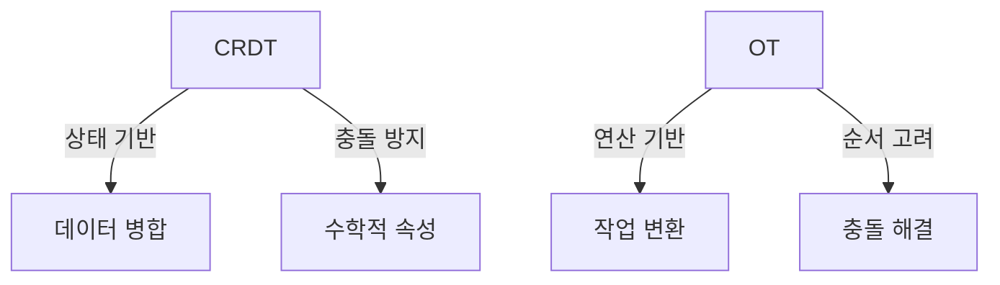
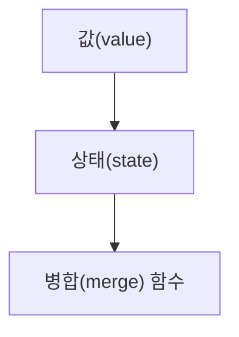
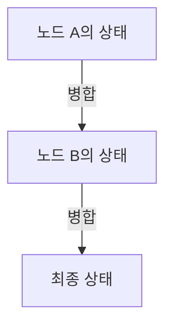
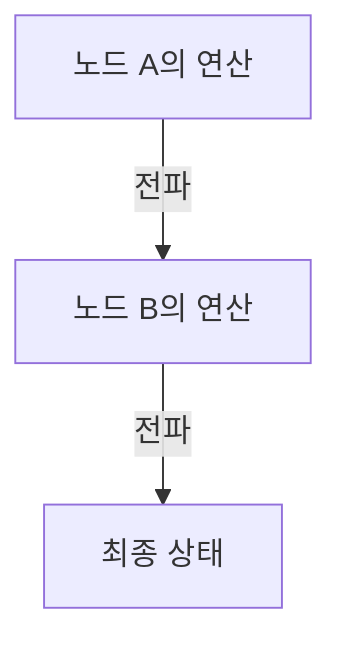
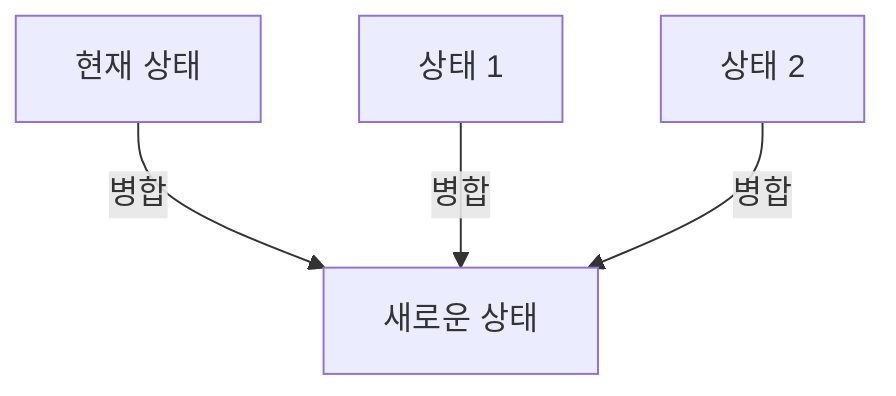
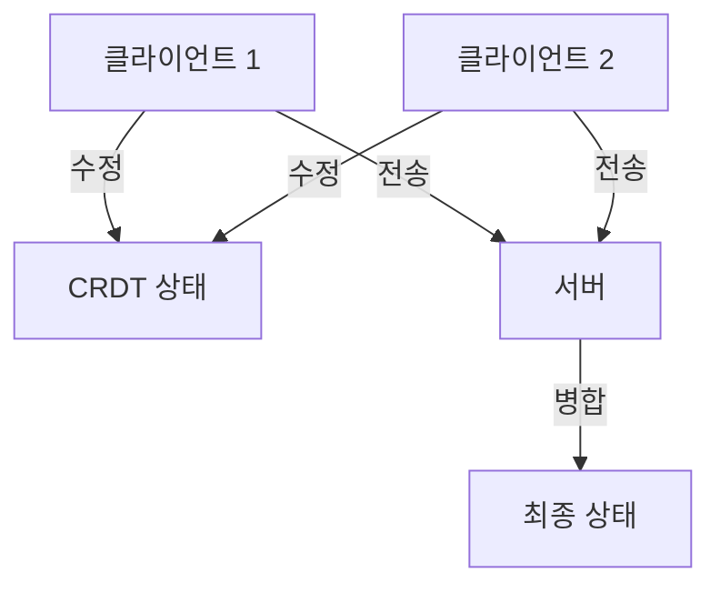
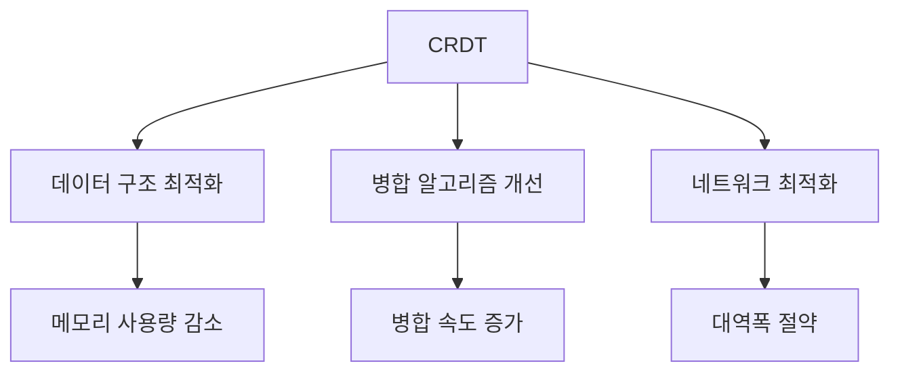
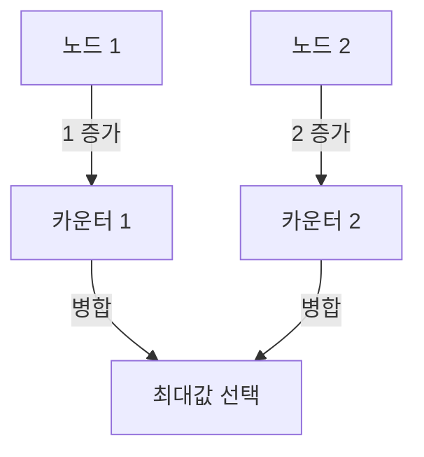
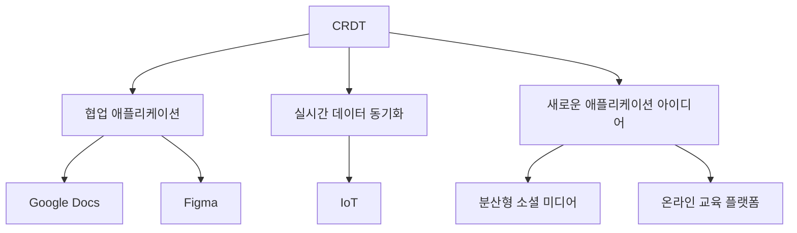
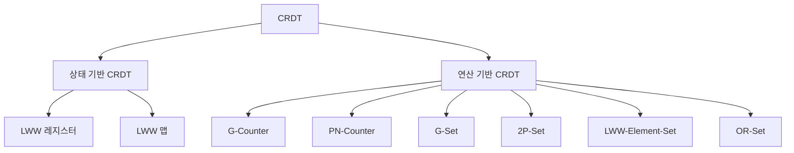

CRDT(Conflict-Free Replicated Data Types)와 OT(Operational Transformation)는 분산 시스템에서 데이터의 일관성을 유지하며 여러 사용자가 동시에 데이터를 수정할 수 있도록 돕는 기술이다. CRDT는 여러 컴퓨터에 걸쳐 복제된 데이터 구조로, 각 복제본이 독립적으로 업데이트될 수 있으며, 이러한 업데이트는 나중에 자동으로 병합되어 일관된 상태로 돌아온다. 반면, OT는 서버가 모든 변경 사항을 병합하는 방식으로, 클라이언트는 자신의 변경 사항을 서버에 전송하고 서버는 이를 순차적으로 처리하여 최종 결과를 각 클라이언트에 반환한다. CRDT는 P2P(peer-to-peer) 방식으로 작동하여 중앙 서버 없이도 동작할 수 있는 반면, OT는 중앙 집중식 서버에 의존한다. 이러한 차이로 인해 CRDT는 더 나은 확장성과 유연성을 제공하며, 특히 실시간 협업 애플리케이션에서 유용하게 사용된다. CRDT는 또한 교환법칙, 결합법칙, 항등법칙을 만족하는 병합 함수를 통해 데이터의 일관성을 보장한다. 이와 같은 특성 덕분에 CRDT는 Google Docs, Figma와 같은 다양한 협업 도구에서 널리 사용되고 있다. CRDT와 OT의 차이점을 이해하는 것은 분산 시스템에서의 데이터 처리 및 협업 기술을 발전시키는 데 중요한 기초가 된다.


||
|:---:|
||


<!--
##### Outline #####
-->

<!--
# CRDT (Conflict-Free Replicated Data Types) 기술 블로그 목차

## 1. 개요
   - CRDT의 정의
   - CRDT의 필요성 및 장점
   - CRDT와 OT(Operational Transformation)의 차이점

## 2. CRDT의 기본 개념
   - CRDT의 구성 요소
     - 값(value)
     - 상태(state)
     - 병합(merge) 함수
   - CRDT의 수학적 속성
     - 교환법칙(Commutativity)
     - 결합법칙(Associativity)
     - 항등법칙(Idempotence)

## 3. CRDT의 종류
   - 상태 기반 CRDT(State-based CRDT)
   - 연산 기반 CRDT(Operation-based CRDT)
   - CRDT의 예시
     - LWW(Last Write Wins) 레지스터
     - LWW 맵
     - G-Counter, PN-Counter, G-Set, 2P-Set, LWW-Element-Set, OR-Set 등

## 4. CRDT의 구현
   - CRDT의 기본 구현 방법
   - LWW 레지스터 구현 예제
   - LWW 맵 구현 예제
   - CRDT의 병합 및 상태 관리

## 5. CRDT의 응용
   - CRDT를 활용한 협업 애플리케이션
     - Google Docs, Figma와 같은 사례
   - CRDT를 이용한 실시간 데이터 동기화
   - CRDT의 사용 사례
     - Redis, Riak, SoundCloud, League of Legends 등

## 6. CRDT의 성능 최적화
   - CRDT의 성능 문제
   - 성능 최적화를 위한 접근 방법
   - Rust 및 WebAssembly를 활용한 CRDT 성능 개선 사례

## 7. FAQ
   - CRDT와 OT 중 어떤 것을 선택해야 할까?
   - CRDT의 데이터 구조는 어떻게 설계해야 할까?
   - CRDT의 한계는 무엇인가?
   - CRDT를 사용한 프로젝트에서의 주의사항

## 8. 관련 기술
   - P2P 네트워크와 CRDT
   - 분산 시스템에서의 데이터 일관성
   - 실시간 협업 기술의 발전

## 9. 결론
   - CRDT의 미래와 발전 가능성
   - CRDT를 통한 협업 기술의 혁신
   - CRDT를 활용한 새로운 애플리케이션 아이디어

## 10. 참고 자료
   - CRDT 관련 논문 및 자료
   - CRDT 구현 라이브러리 및 프레임워크
   - 추가 학습 자료 및 튜토리얼 링크

이 목차는 CRDT에 대한 포괄적인 이해를 돕고, 관련된 기술과 응용 사례를 통해 독자가 CRDT의 중요성과 활용 가능성을 인식할 수 있도록 구성되었습니다.
-->

<!--
## 1. 개요
   - CRDT의 정의
   - CRDT의 필요성 및 장점
   - CRDT와 OT(Operational Transformation)의 차이점
-->

## 1. 개요

**CRDT의 정의** 

CRDT(Conflict-Free Replicated Data Types)는 분산 시스템에서 데이터의 일관성을 유지하면서도 충돌 없이 데이터를 병합할 수 있는 데이터 구조이다. CRDT는 여러 노드에서 동시에 데이터의 변경이 이루어질 수 있는 환경에서, 각 노드의 변경 사항을 안전하게 통합할 수 있도록 설계되었다. 이를 통해 사용자들은 실시간으로 협업할 수 있으며, 데이터의 일관성을 보장받을 수 있다.

**CRDT의 필요성 및 장점**  

CRDT는 다음과 같은 필요성과 장점을 가진다.

1. **충돌 없는 데이터 병합**: 여러 사용자가 동시에 데이터를 수정하더라도, CRDT는 각 변경 사항을 안전하게 병합할 수 있다.
2. **실시간 협업 지원**: CRDT는 분산 환경에서 실시간으로 데이터를 동기화할 수 있어, 협업 애플리케이션에서 유용하다.
3. **복잡한 동기화 로직 불필요**: CRDT는 복잡한 동기화 알고리즘 없이도 데이터의 일관성을 유지할 수 있다.
4. **유연한 데이터 구조**: 다양한 데이터 구조를 지원하여, 개발자가 필요에 따라 적절한 CRDT를 선택할 수 있다.

**CRDT와 OT(Operational Transformation)의 차이점**

CRDT와 OT는 모두 분산 시스템에서 데이터의 일관성을 유지하기 위한 기술이지만, 그 접근 방식에는 차이가 있다. 

- **CRDT**는 데이터의 상태를 기반으로 하여, 각 노드에서 발생한 변경 사항을 병합하는 방식이다. 이 과정에서 수학적 속성을 활용하여 충돌을 방지한다.
- **OT**는 사용자의 작업(연산)을 기반으로 하여, 각 노드에서 발생한 연산을 변환하여 일관성을 유지하는 방식이다. OT는 연산의 순서를 고려하여 충돌을 해결한다.

아래의 다이어그램은 CRDT와 OT의 차이를 시각적으로 나타낸 것이다.



이와 같이 CRDT와 OT는 서로 다른 접근 방식을 가지고 있으며, 각각의 장단점이 존재한다. CRDT는 특히 실시간 협업 환경에서 유용하게 사용될 수 있는 기술이다.

<!--
## 2. CRDT의 기본 개념
   - CRDT의 구성 요소
     - 값(value)
     - 상태(state)
     - 병합(merge) 함수
   - CRDT의 수학적 속성
     - 교환법칙(Commutativity)
     - 결합법칙(Associativity)
     - 항등법칙(Idempotence)
-->

## 2. CRDT의 기본 개념

CRDT(Conflict-Free Replicated Data Types)는 분산 시스템에서 데이터의 일관성을 유지하기 위해 설계된 데이터 구조이다. CRDT의 기본 개념을 이해하기 위해서는 구성 요소와 수학적 속성을 살펴보아야 한다.

**CRDT의 구성 요소**

CRDT는 다음과 같은 세 가지 주요 구성 요소로 이루어져 있다.

1. **값(value)**: CRDT의 가장 기본적인 데이터 단위로, 사용자가 저장하고자 하는 정보를 나타낸다. 값은 다양한 형태를 가질 수 있으며, 숫자, 문자열, 객체 등으로 표현될 수 있다.

2. **상태(state)**: CRDT의 현재 상태를 나타내며, 값의 집합으로 구성된다. 상태는 CRDT의 동작을 정의하는 데 중요한 역할을 하며, 병합 과정에서 다른 노드와의 상태를 통합하는 데 사용된다.

3. **병합(merge) 함수**: CRDT의 핵심 기능 중 하나로, 서로 다른 상태를 통합하여 하나의 일관된 상태로 만드는 함수이다. 병합 함수는 CRDT의 일관성을 보장하는 데 필수적이며, 각 노드에서 발생한 변경 사항을 안전하게 통합할 수 있도록 설계되어야 한다.

다음은 CRDT의 구성 요소를 나타내는 간단한 다이어그램이다.



**CRDT의 수학적 속성**

CRDT는 다음과 같은 세 가지 수학적 속성을 가진다.

1. **교환법칙(Commutativity)**: CRDT의 연산은 순서에 관계없이 동일한 결과를 생성해야 한다. 즉, 두 개의 연산이 서로 다른 순서로 적용되더라도 최종 결과는 동일해야 한다. 이 속성 덕분에 CRDT는 분산 환경에서 발생하는 동시성 문제를 해결할 수 있다.

2. **결합법칙(Associativity)**: CRDT의 연산은 그룹화에 관계없이 동일한 결과를 생성해야 한다. 즉, 여러 개의 연산을 그룹으로 묶어 적용하더라도 최종 결과는 동일해야 한다. 이 속성은 CRDT의 병합 과정에서 여러 노드의 상태를 통합할 때 유용하다.

3. **항등법칙(Idempotence)**: CRDT의 연산은 동일한 연산을 여러 번 적용하더라도 결과가 변하지 않아야 한다. 즉, 한 번 적용한 연산을 다시 적용하더라도 상태는 동일하게 유지되어야 한다. 이 속성은 CRDT의 안정성을 보장하는 데 중요한 역할을 한다.

이러한 수학적 속성들은 CRDT가 분산 시스템에서 데이터의 일관성을 유지하고, 동시성 문제를 해결하는 데 필수적이다. CRDT의 기본 개념을 이해함으로써, 분산 환경에서의 데이터 처리 방식에 대한 깊은 통찰을 얻을 수 있다.

<!--
## 3. CRDT의 종류
   - 상태 기반 CRDT(State-based CRDT)
   - 연산 기반 CRDT(Operation-based CRDT)
   - CRDT의 예시
     - LWW(Last Write Wins) 레지스터
     - LWW 맵
     - G-Counter, PN-Counter, G-Set, 2P-Set, LWW-Element-Set, OR-Set 등
-->

## 3. CRDT의 종류

CRDT는 크게 두 가지 종류로 나눌 수 있다. 상태 기반 CRDT와 연산 기반 CRDT가 그것이다. 이 두 가지는 데이터의 복제 및 병합 방식에서 차이를 보인다.

**상태 기반 CRDT(State-based CRDT)**

상태 기반 CRDT는 각 노드가 자신의 상태를 유지하고, 다른 노드와 상태를 주기적으로 병합하는 방식이다. 이 방식에서는 각 노드가 자신의 상태를 완전하게 보존하고, 병합 시에는 모든 상태를 고려하여 최종 상태를 결정한다. 상태 기반 CRDT의 대표적인 예로는 G-Counter와 PN-Counter가 있다.

상태 기반 CRDT의 병합 과정은 다음과 같은 다이어그램으로 표현할 수 있다.



**연산 기반 CRDT(Operation-based CRDT)**

연산 기반 CRDT는 각 노드가 발생한 연산을 다른 노드에 전파하여 상태를 동기화하는 방식이다. 이 방식에서는 연산이 독립적으로 수행되며, 연산의 순서가 중요하지 않다. 연산 기반 CRDT의 대표적인 예로는 LWW(Last Write Wins) 레지스터와 LWW 맵이 있다.

연산 기반 CRDT의 동작 방식은 다음과 같은 다이어그램으로 표현할 수 있다.



**CRDT의 예시**

CRDT의 종류를 이해하기 위해 몇 가지 예시를 살펴보겠다.

- **LWW(Last Write Wins) 레지스터**: 이 레지스터는 마지막으로 작성된 값을 유지하는 CRDT이다. 각 값은 타임스탬프와 함께 저장되며, 병합 시 가장 최신의 값을 선택한다.

- **LWW 맵**: LWW 레지스터의 확장으로, 키-값 쌍을 저장하는 구조이다. 각 키에 대해 LWW 규칙을 적용하여 병합한다.

- **G-Counter**: 증가만 가능한 카운터로, 각 노드가 자신의 카운터 값을 유지하고, 병합 시 모든 노드의 값을 합산하여 최종 값을 결정한다.

- **PN-Counter**: G-Counter의 확장으로, 증가와 감소가 모두 가능한 카운터이다. 각 노드가 증가와 감소를 별도로 관리하며, 병합 시 두 값을 합산하여 최종 값을 결정한다.

- **G-Set**: 추가만 가능한 집합으로, 각 노드가 추가된 요소를 유지하고, 병합 시 모든 요소를 합쳐 최종 집합을 만든다.

- **2P-Set**: 추가와 삭제가 가능한 집합으로, 각 요소에 대해 추가와 삭제를 관리한다. 병합 시 추가된 요소와 삭제된 요소를 고려하여 최종 집합을 결정한다.

- **LWW-Element-Set**: LWW 규칙을 적용한 집합으로, 각 요소에 대해 마지막으로 추가된 값을 유지한다.

- **OR-Set**: 추가와 삭제가 모두 가능한 집합으로, 각 요소에 대해 추가된 타임스탬프를 관리하여 병합 시 최종 상태를 결정한다.

이와 같이 CRDT는 다양한 종류와 예시를 통해 데이터의 일관성을 유지하면서도 분산 환경에서의 협업을 가능하게 한다.

<!--
## 4. CRDT의 구현
   - CRDT의 기본 구현 방법
   - LWW 레지스터 구현 예제
   - LWW 맵 구현 예제
   - CRDT의 병합 및 상태 관리
-->

## 4. CRDT의 구현

CRDT(Conflict-Free Replicated Data Types)의 구현은 분산 시스템에서 데이터의 일관성을 유지하면서도 충돌을 방지하는 데 중요한 역할을 한다. 이 섹션에서는 CRDT의 기본 구현 방법과 LWW(Last Write Wins) 레지스터 및 LWW 맵의 구현 예제를 살펴보겠다.

**CRDT의 기본 구현 방법**

CRDT를 구현하기 위해서는 먼저 데이터의 상태를 정의하고, 이를 병합할 수 있는 방법을 마련해야 한다. 일반적으로 CRDT는 두 가지 주요 구성 요소로 이루어진다. 첫째, 데이터의 현재 상태를 나타내는 값(value)이며, 둘째, 이 값을 병합하는 함수(merge function)이다. 병합 함수는 두 개의 상태를 입력으로 받아, 이들 중 하나를 선택하거나 두 상태를 결합하여 새로운 상태를 반환한다.

다음은 CRDT의 기본 구조를 나타내는 다이어그램이다.



**LWW 레지스터 구현 예제**

LWW 레지스터는 가장 최근에 작성된 값을 유지하는 CRDT의 한 종류이다. 이 레지스터는 각 값과 함께 타임스탬프를 저장하여, 병합 시 가장 최신의 값을 선택할 수 있도록 한다. 아래는 LWW 레지스터의 간단한 구현 예제이다.

```python
class LWWRegister:
    def __init__(self):
        self.value = None
        self.timestamp = 0

    def write(self, value, timestamp):
        if timestamp > self.timestamp:
            self.value = value
            self.timestamp = timestamp

    def read(self):
        return self.value
```

위의 코드에서 `write` 메서드는 새로운 값을 타임스탬프와 함께 저장하며, 이전 값보다 더 최신의 타임스탬프를 가진 경우에만 값을 업데이트한다. `read` 메서드는 현재 저장된 값을 반환한다.

**LWW 맵 구현 예제**

LWW 맵은 여러 개의 LWW 레지스터를 포함하는 데이터 구조로, 각 키에 대해 LWW 레지스터를 사용하여 값을 관리한다. 아래는 LWW 맵의 간단한 구현 예제이다.

```python
class LWWMap:
    def __init__(self):
        self.map = {}

    def write(self, key, value, timestamp):
        if key not in self.map:
            self.map[key] = LWWRegister()
        self.map[key].write(value, timestamp)

    def read(self, key):
        if key in self.map:
            return self.map[key].read()
        return None
```

이 코드에서 `LWWMap` 클래스는 여러 개의 LWW 레지스터를 관리하며, 각 키에 대해 값을 쓰고 읽는 기능을 제공한다.

**CRDT의 병합 및 상태 관리**

CRDT의 병합 과정은 여러 노드에서 발생한 상태를 통합하는 데 필수적이다. 병합 함수는 두 개의 상태를 비교하여, 더 최신의 상태를 선택하거나 두 상태를 결합하는 방식으로 동작한다. 이 과정에서 CRDT의 수학적 속성인 교환법칙, 결합법칙, 항등법칙이 보장되어야 한다.

병합 과정은 다음과 같은 다이어그램으로 표현할 수 있다.


이와 같이 CRDT의 구현은 데이터의 일관성을 유지하면서도 충돌을 방지하는 데 중요한 역할을 하며, 다양한 응용 프로그램에서 활용될 수 있다. CRDT의 기본 개념과 구현 방법을 이해함으로써, 분산 시스템에서의 데이터 관리에 대한 통찰을 얻을 수 있다.

<!--
## 5. CRDT의 응용
   - CRDT를 활용한 협업 애플리케이션
     - Google Docs, Figma와 같은 사례
   - CRDT를 이용한 실시간 데이터 동기화
   - CRDT의 사용 사례
     - Redis, Riak, SoundCloud, League of Legends 등
-->

## 5. CRDT의 응용

**CRDT를 활용한 협업 애플리케이션**

CRDT는 실시간 협업 애플리케이션에서 매우 유용하게 사용된다. Google Docs와 Figma와 같은 애플리케이션은 여러 사용자가 동시에 문서나 디자인을 수정할 수 있도록 지원하며, 이 과정에서 CRDT를 활용하여 데이터의 일관성을 유지한다. 사용자가 동시에 같은 문서에 접근하여 수정할 때, CRDT는 각 사용자의 변경 사항을 자동으로 병합하여 충돌을 방지한다. 이로 인해 사용자는 실시간으로 서로의 작업을 확인하고, 원활한 협업이 가능해진다.

**CRDT를 이용한 실시간 데이터 동기화**

CRDT는 분산 시스템에서 실시간 데이터 동기화에 효과적이다. 예를 들어, 여러 클라이언트가 동일한 데이터를 수정할 때, CRDT는 각 클라이언트의 변경 사항을 수집하고 병합하여 최종 상태를 유지한다. 이 과정에서 CRDT의 수학적 속성인 교환법칙, 결합법칙, 항등법칙이 중요한 역할을 한다. 이러한 속성 덕분에 데이터의 일관성을 보장하면서도, 네트워크 지연이나 분산 환경에서도 안정적으로 동작할 수 있다.



**CRDT의 사용 사례**

CRDT는 다양한 분야에서 활용되고 있다. 예를 들어, Redis와 Riak와 같은 데이터베이스 시스템은 CRDT를 사용하여 분산 환경에서 데이터의 일관성을 유지한다. SoundCloud와 League of Legends와 같은 애플리케이션에서도 CRDT를 활용하여 실시간으로 사용자 간의 상호작용을 처리하고 있다. 이러한 사용 사례들은 CRDT의 유용성을 잘 보여준다.

CRDT는 협업 애플리케이션, 실시간 데이터 동기화, 그리고 다양한 시스템에서의 데이터 일관성을 유지하는 데 있어 중요한 역할을 하고 있다. 앞으로도 CRDT의 응용 가능성은 더욱 확대될 것으로 기대된다.

<!--
## 6. CRDT의 성능 최적화
   - CRDT의 성능 문제
   - 성능 최적화를 위한 접근 방법
   - Rust 및 WebAssembly를 활용한 CRDT 성능 개선 사례
-->

## 6. CRDT의 성능 최적화

CRDT(Conflict-Free Replicated Data Types)는 분산 시스템에서 데이터의 일관성을 유지하면서도 동시성을 지원하는 강력한 도구이다. 그러나 CRDT의 성능은 다양한 요인에 의해 영향을 받을 수 있으며, 이를 최적화하는 방법에 대해 알아보도록 하겠다.

**CRDT의 성능 문제**

CRDT의 성능 문제는 주로 데이터의 크기, 병합 과정의 복잡성, 그리고 네트워크 지연 시간에 기인한다. 특히, 상태 기반 CRDT의 경우, 전체 상태를 전송해야 하므로 데이터의 크기가 커질수록 성능 저하가 발생할 수 있다. 또한, 연산 기반 CRDT는 각 연산을 전송하고 병합하는 과정에서 지연이 발생할 수 있다. 이러한 문제들은 대규모 시스템에서 CRDT의 효율성을 저하시킬 수 있다.

**성능 최적화를 위한 접근 방법**

CRDT의 성능을 최적화하기 위한 몇 가지 접근 방법은 다음과 같다.

1. **데이터 구조 최적화**: CRDT의 데이터 구조를 효율적으로 설계하여 메모리 사용량을 줄이고, 병합 과정에서의 연산을 최소화할 수 있다. 예를 들어, G-Counter와 같은 카운터 구조는 단순한 배열 대신 해시맵을 사용하여 메모리 사용을 줄일 수 있다.

2. **병합 알고리즘 개선**: 병합 알고리즘을 최적화하여 불필요한 연산을 줄이고, 병합 속도를 높일 수 있다. 예를 들어, LWW(Last Write Wins) 레지스터의 경우, 최신 값을 기준으로 병합하는 방식으로 성능을 개선할 수 있다.

3. **네트워크 최적화**: 데이터 전송 시 압축 알고리즘을 사용하거나, 필요한 데이터만 전송하여 네트워크 대역폭을 절약할 수 있다. 또한, P2P 네트워크를 활용하여 데이터 전송 경로를 최적화할 수 있다.

**Rust 및 WebAssembly를 활용한 CRDT 성능 개선 사례**

Rust는 메모리 안전성과 성능을 동시에 제공하는 프로그래밍 언어로, CRDT의 구현에 적합하다. WebAssembly는 웹 환경에서 고성능 코드를 실행할 수 있게 해주는 기술로, CRDT의 성능을 더욱 향상시킬 수 있다.

다음은 Rust와 WebAssembly를 활용한 CRDT의 성능 개선 사례를 보여주는 간단한 코드 예제이다.

```rust
// Rust로 작성한 간단한 G-Counter 구현 예제
struct GCounter {
    counts: HashMap<String, u32>,
}

impl GCounter {
    fn new() -> Self {
        GCounter {
            counts: HashMap::new(),
        }
    }

    fn increment(&mut self, node_id: String) {
        let count = self.counts.entry(node_id).or_insert(0);
        *count += 1;
    }

    fn merge(&mut self, other: GCounter) {
        for (node_id, count) in other.counts {
            let entry = self.counts.entry(node_id).or_insert(0);
            *entry = (*entry).max(count);
        }
    }

    fn value(&self) -> u32 {
        self.counts.values().sum()
    }
}
```

위의 코드에서는 G-Counter를 Rust로 구현하였으며, 각 노드의 카운트를 관리하고 병합하는 기능을 제공한다. 이와 같은 방식으로 Rust의 성능을 활용하여 CRDT의 효율성을 높일 수 있다.

다음은 CRDT의 성능 최적화를 위한 다이어그램이다.



이와 같이 CRDT의 성능 최적화는 다양한 접근 방법을 통해 이루어질 수 있으며, Rust와 WebAssembly와 같은 최신 기술을 활용하여 성능을 더욱 개선할 수 있다. CRDT의 성능을 최적화함으로써, 대규모 분산 시스템에서도 효율적으로 동작할 수 있는 가능성을 열어준다.

<!--
## 7. FAQ
   - CRDT와 OT 중 어떤 것을 선택해야 할까?
   - CRDT의 데이터 구조는 어떻게 설계해야 할까?
   - CRDT의 한계는 무엇인가?
   - CRDT를 사용한 프로젝트에서의 주의사항
-->

## 7. FAQ

**CRDT와 OT 중 어떤 것을 선택해야 할까?**  

CRDT(Conflict-Free Replicated Data Types)와 OT(Operational Transformation)는 모두 분산 시스템에서 데이터의 일관성을 유지하기 위한 기술이다. CRDT는 데이터의 상태를 기반으로 하여 충돌을 방지하는 반면, OT는 연산을 기반으로 하여 충돌을 해결한다. 선택은 주로 애플리케이션의 요구 사항에 따라 달라진다. CRDT는 간단한 구현과 높은 가용성을 제공하지만, OT는 더 복잡한 연산을 지원할 수 있다. 따라서, 실시간 협업이 필요한 경우 OT가 더 적합할 수 있으며, 데이터의 일관성이 중요한 경우 CRDT를 선택하는 것이 좋다.

**CRDT의 데이터 구조는 어떻게 설계해야 할까?** 

CRDT의 데이터 구조는 주로 상태 기반 또는 연산 기반으로 설계된다. 상태 기반 CRDT는 데이터의 전체 상태를 유지하며, 병합 함수에 의해 상태를 통합한다. 반면, 연산 기반 CRDT는 각 연산을 기록하고 이를 통해 상태를 업데이트한다. 데이터 구조 설계 시, 다음과 같은 요소를 고려해야 한다.

1. **값(value)**: 데이터의 실제 내용을 정의한다.
2. **상태(state)**: 데이터의 현재 상태를 나타낸다.
3. **병합(merge) 함수**: 두 개의 상태를 통합하는 방법을 정의한다.

예를 들어, G-Counter의 경우 각 노드가 카운터 값을 유지하고, 병합 시 최대값을 선택하는 방식으로 설계할 수 있다.



**CRDT의 한계는 무엇인가?**  

CRDT는 여러 장점을 가지고 있지만, 몇 가지 한계도 존재한다. 첫째, CRDT는 메모리 사용량이 많을 수 있다. 상태 기반 CRDT는 모든 상태를 저장해야 하므로, 데이터가 커질수록 메모리 소모가 증가한다. 둘째, CRDT는 복잡한 연산을 지원하지 않기 때문에, 특정 애플리케이션에서는 적합하지 않을 수 있다. 마지막으로, CRDT의 병합 함수가 잘못 설계되면 데이터의 일관성을 보장할 수 없다.

**CRDT를 사용한 프로젝트에서의 주의사항**  

CRDT를 사용하여 프로젝트를 진행할 때는 몇 가지 주의사항이 있다. 첫째, 데이터 구조와 병합 함수를 신중하게 설계해야 한다. 잘못된 설계는 데이터의 일관성을 해칠 수 있다. 둘째, CRDT의 성능을 고려해야 한다. 대규모 데이터에 대한 성능 테스트를 통해 병목 현상을 미리 파악하고 최적화해야 한다. 셋째, CRDT의 특성을 이해하고, 적절한 사용 사례를 선택해야 한다. CRDT는 모든 상황에 적합하지 않으므로, 사용 목적에 맞는 기술을 선택하는 것이 중요하다.

<!--
## 8. 관련 기술
   - P2P 네트워크와 CRDT
   - 분산 시스템에서의 데이터 일관성
   - 실시간 협업 기술의 발전
-->

## 8. 관련 기술

**P2P 네트워크와 CRDT**  

CRDT는 P2P(피어 투 피어) 네트워크에서 매우 유용하게 활용될 수 있다. P2P 네트워크는 중앙 서버 없이 여러 노드가 직접 연결되어 데이터를 공유하는 구조로, CRDT의 특성과 잘 맞아떨어진다. CRDT는 각 노드에서 독립적으로 데이터를 수정할 수 있으며, 이러한 수정 사항은 서로 다른 노드 간에 자동으로 병합될 수 있다. 이로 인해 P2P 환경에서도 데이터의 일관성을 유지할 수 있다.

예를 들어, 두 개의 노드 A와 B가 각각 CRDT를 사용하여 데이터를 수정한다고 가정해보자. 노드 A에서 데이터가 수정된 후, 노드 B가 이를 병합할 때 CRDT의 병합 함수가 작동하여 두 노드의 상태를 일관되게 유지할 수 있다.


**분산 시스템에서의 데이터 일관성**  

CRDT는 분산 시스템에서 데이터 일관성을 유지하는 데 중요한 역할을 한다. 전통적인 분산 시스템에서는 데이터의 일관성을 보장하기 위해 복잡한 동기화 메커니즘이 필요하다. 그러나 CRDT는 이러한 문제를 해결하기 위해 설계된 데이터 구조로, 각 노드가 독립적으로 작업을 수행할 수 있도록 한다. 

CRDT의 수학적 속성인 교환법칙, 결합법칙, 항등법칙 덕분에 데이터의 병합이 가능하며, 이는 분산 시스템에서의 데이터 일관성을 자연스럽게 보장한다. 예를 들어, 여러 사용자가 동시에 문서를 수정하는 경우, CRDT를 사용하면 각 사용자의 변경 사항이 충돌 없이 병합되어 최종 결과를 생성할 수 있다.

**실시간 협업 기술의 발전**  

CRDT는 실시간 협업 애플리케이션의 발전에 기여하고 있다. Google Docs, Figma와 같은 협업 도구는 CRDT를 활용하여 여러 사용자가 동시에 작업할 수 있도록 지원한다. 이러한 도구들은 사용자가 입력한 내용을 실시간으로 반영하며, 각 사용자의 변경 사항이 자동으로 병합되어 일관된 상태를 유지한다.

실시간 협업에서 CRDT의 장점은 다음과 같다:
1. **충돌 없는 병합**: 여러 사용자가 동시에 작업하더라도 데이터 충돌이 발생하지 않는다.
2. **지연 없는 반영**: 사용자의 입력이 즉시 다른 사용자에게 반영된다.
3. **오프라인 지원**: 네트워크 연결이 끊겨도 로컬에서 작업한 내용이 나중에 자동으로 동기화된다.

이러한 특성 덕분에 CRDT는 실시간 협업 기술의 핵심 요소로 자리 잡고 있으며, 앞으로도 다양한 분야에서 그 활용 가능성이 더욱 확대될 것으로 기대된다.

<!--
## 9. 결론
   - CRDT의 미래와 발전 가능성
   - CRDT를 통한 협업 기술의 혁신
   - CRDT를 활용한 새로운 애플리케이션 아이디어
-->

## 9. 결론

**CRDT의 미래와 발전 가능성**  

CRDT(Conflict-Free Replicated Data Types)는 분산 시스템에서 데이터 일관성을 유지하면서도 높은 성능을 제공하는 기술로, 앞으로의 발전 가능성이 매우 크다. 특히, 클라우드 기반 서비스와 실시간 협업 도구의 수요가 증가함에 따라 CRDT의 중요성이 더욱 부각되고 있다. 향후 CRDT는 더 많은 데이터 구조와 알고리즘에 통합되어 다양한 분야에서 활용될 것으로 예상된다. 예를 들어, IoT(Internet of Things) 환경에서도 CRDT를 활용하여 여러 장치 간의 데이터 동기화를 효율적으로 처리할 수 있을 것이다.

**CRDT를 통한 협업 기술의 혁신**  

CRDT는 실시간 협업 애플리케이션에서 혁신적인 변화를 가져올 수 있다. Google Docs와 Figma와 같은 플랫폼은 CRDT를 통해 여러 사용자가 동시에 작업할 수 있는 환경을 제공하고 있다. 이러한 기술은 사용자 경험을 향상시키고, 팀워크를 강화하는 데 기여하고 있다. 앞으로도 CRDT를 활용한 협업 도구는 더욱 발전하여, 사용자 간의 상호작용을 더욱 원활하게 만들어 줄 것이다.

**CRDT를 활용한 새로운 애플리케이션 아이디어**  

CRDT의 특성을 활용하여 다양한 새로운 애플리케이션을 개발할 수 있다. 예를 들어, 분산형 소셜 미디어 플랫폼이나 실시간 게임에서의 상태 동기화, 그리고 여러 사용자가 동시에 참여하는 온라인 교육 플랫폼 등에서 CRDT를 적용할 수 있다. 이러한 애플리케이션은 사용자 간의 데이터 충돌을 최소화하고, 실시간으로 데이터를 동기화하여 사용자 경험을 극대화할 수 있다.



이와 같이 CRDT는 앞으로도 다양한 분야에서 활용될 수 있는 가능성을 지니고 있으며, 협업 기술의 혁신과 새로운 애플리케이션 개발에 기여할 것이다. CRDT의 발전은 분산 시스템의 데이터 처리 방식에 큰 변화를 가져올 것으로 기대된다.

<!--
## 10. 참고 자료
   - CRDT 관련 논문 및 자료
   - CRDT 구현 라이브러리 및 프레임워크
   - 추가 학습 자료 및 튜토리얼 링크
-->

## 10. 참고 자료

CRDT(Conflict-Free Replicated Data Types)에 대한 깊이 있는 이해를 위해 다음과 같은 자료들을 참고할 수 있다. 이 자료들은 CRDT의 이론적 배경, 구현 방법, 그리고 실제 사용 사례를 포함하고 있어 독자가 CRDT를 보다 잘 이해하는 데 도움을 줄 것이다.

**CRDT 관련 논문 및 자료**  
CRDT에 대한 여러 연구 논문과 자료들이 존재한다. 그 중 몇 가지 주요 자료는 다음과 같다.

- **"A Comprehensive Study of CRDTs"**: CRDT의 기본 개념과 다양한 종류에 대한 포괄적인 연구를 다룬 논문이다.
- **"Conflict-Free Replicated Data Types"**: CRDT의 기초 이론과 수학적 속성을 설명하는 논문으로, CRDT의 필요성과 장점을 잘 설명하고 있다.
- **"The Many Faces of CRDTs"**: CRDT의 다양한 응용 사례와 실제 사용 사례를 다룬 자료로, CRDT의 실용성을 강조하고 있다.

**CRDT 구현 라이브러리 및 프레임워크**  
CRDT를 구현하기 위한 여러 라이브러리와 프레임워크가 존재한다. 이들 중 일부는 다음과 같다.

- **Yjs**: JavaScript로 작성된 CRDT 라이브러리로, 실시간 협업 애플리케이션에 적합하다. Yjs는 다양한 데이터 구조를 지원하며, P2P 네트워크와의 통합이 용이하다.
- **Automerge**: JavaScript 기반의 CRDT 라이브러리로, 간단한 API를 제공하여 개발자가 쉽게 사용할 수 있도록 돕는다. Automerge는 JSON 객체를 CRDT로 변환하여 실시간 동기화를 지원한다.
- **Riak DT**: Erlang으로 작성된 분산 데이터베이스 Riak의 CRDT 구현으로, 다양한 데이터 타입을 지원하며, 높은 가용성과 확장성을 제공한다.

**추가 학습 자료 및 튜토리얼 링크**  
CRDT에 대한 추가 학습을 원한다면 다음의 자료들을 참고할 수 있다.

- **"CRDTs Explained"**: CRDT의 기본 개념과 구현 방법을 설명하는 블로그 포스트로, 초보자에게 적합하다.
- **"Building Real-Time Applications with CRDTs"**: CRDT를 활용한 실시간 애플리케이션 개발에 대한 튜토리얼로, 실제 코드 예제를 통해 이해를 돕는다.
- **YouTube 강의**: CRDT에 대한 다양한 강의가 YouTube에 업로드되어 있으며, 시청을 통해 시각적으로 이해할 수 있다.

다음은 CRDT의 기본 개념을 설명하는 다이어그램이다.



이 자료들을 통해 CRDT에 대한 이해를 더욱 깊이 있게 할 수 있을 것이다. CRDT는 분산 시스템과 실시간 협업 애플리케이션에서 중요한 역할을 하므로, 관련 자료를 통해 지속적으로 학습하는 것이 필요하다.

<!--
##### Reference #####
-->

## Reference


* [https://en.wikipedia.org/wiki/Conflict-free_replicated_data_type](https://en.wikipedia.org/wiki/Conflict-free_replicated_data_type)
* [https://velog.io/@hbsps/CRDT-%EA%B5%AC%ED%98%84%ED%95%98%EA%B8%B0-CRDT%EB%9E%80](https://velog.io/@hbsps/CRDT-%EA%B5%AC%ED%98%84%ED%95%98%EA%B8%B0-CRDT%EB%9E%80)
* [https://velog.io/@heelieben/%EC%8B%A4%EC%8B%9C%EA%B0%84-%EB%8F%99%EC%8B%9C-%ED%8E%B8%EC%A7%91-OT-%EC%99%80-CRDT](https://velog.io/@heelieben/%EC%8B%A4%EC%8B%9C%EA%B0%84-%EB%8F%99%EC%8B%9C-%ED%8E%B8%EC%A7%91-OT-%EC%99%80-CRDT)
* [https://josephg.com/blog/crdts-go-brrr/](https://josephg.com/blog/crdts-go-brrr/)
* [https://channel.io/ko/blog/crdt_vs_ot](https://channel.io/ko/blog/crdt_vs_ot)
* [https://jakelazaroff.com/words/an-interactive-intro-to-crdts/](https://jakelazaroff.com/words/an-interactive-intro-to-crdts/)


<!--
Type of data structure

"CRDT" redirects here. For Centenary Rural Development Trust, see

[ Centenary Bank ](/wiki/Centenary_Bank "Centenary Bank")

.

In [ distributed computing ](/wiki/Distributed_computing "Distributed
computing") , a **conflict-free replicated data type** ( **CRDT** ) is a [
data structure ](/wiki/Data_structure "Data structure") that is [ replicated
](/wiki/Replication_\(computing\) "Replication \(computing\)") across multiple
computers in a [ network ](/wiki/Computer_network "Computer network") , with
the following features:  [  1  ]  [  2  ]  [  3  ]  [  4  ]  [  5  ]  [  6  ]
[  7  ]  [  8  ]

  1. The application can update any replica independently, [ concurrently ](/wiki/Concurrent_computing "Concurrent computing") and without [ coordinating ](/wiki/Concurrency_control "Concurrency control") with other replicas. 
  2. An algorithm (itself part of the data type) automatically resolves any inconsistencies that might occur. 
  3. Although replicas may have different state at any particular point in time, they are guaranteed to eventually converge. 

The CRDT concept was formally defined in 2011 by Marc Shapiro, Nuno Preguiça,
Carlos Baquero and Marek Zawirski.  [  9  ]  Development was initially
motivated by [ collaborative text editing ](/wiki/Collaborative_real-
time_editor "Collaborative real-time editor") and [ mobile computing
](/wiki/Mobile_computing "Mobile computing") . CRDTs have also been used in [
online chat ](/wiki/Online_chat "Online chat") systems, [ online gambling
](/wiki/Online_gambling "Online gambling") , and in the [ SoundCloud
](/wiki/SoundCloud "SoundCloud") audio distribution platform. The [ NoSQL
](/wiki/NoSQL "NoSQL") [ distributed databases ](/wiki/Distributed_databases
"Distributed databases") [ Redis ](/wiki/Redis "Redis") , [ Riak ](/wiki/Riak
"Riak") and [ Cosmos DB ](/wiki/Cosmos_DB "Cosmos DB") have CRDT data types.

Concurrent updates to multiple replicas of the same data, without coordination
between the computers hosting the replicas, can result in [ inconsistencies
](/wiki/Consistency_\(database_systems\) "Consistency \(database systems\)")
between the replicas, which in the general case may not be resolvable.
Restoring consistency and data integrity when there are conflicts between
updates may require some or all of the updates to be entirely or partially
dropped.

Accordingly, much of distributed computing focuses on the problem of how to
prevent concurrent updates to replicated data. But another possible approach
is [ optimistic replication ](/wiki/Optimistic_replication "Optimistic
replication") , where all concurrent updates are allowed to go through, with
inconsistencies possibly created, and the results are merged or "resolved"
later. In this approach, consistency between the replicas is [ eventually
](/wiki/Eventual_consistency "Eventual consistency") re-established via
"merges" of differing replicas. While optimistic replication might not work in
the general case, there is a significant and practically useful class of data
structures, CRDTs, where it does work — where it is always possible to merge
or resolve concurrent updates on different replicas of the data structure
without conflicts. This makes CRDTs ideal for optimistic replication.

As an example, a one-way [ Boolean ](/wiki/Boolean_data_type "Boolean data
type") event flag is a trivial CRDT: one bit, with a value of true or false.
True means some particular event has occurred at least once. False means the
event has not occurred. Once set to true, the flag cannot be set back to false
(an event having occurred cannot un-occur). The resolution method is "true
wins": when merging a replica where the flag is true (that replica has
observed the event), and another one where the flag is false (that replica
hasn't observed the event), the resolved result is true — the event has been
observed.

There are two approaches to CRDTs, both of which can provide [ strong eventual
consistency ](/wiki/Strong_eventual_consistency "Strong eventual consistency")
: operation-based CRDTs  [  10  ]  [  11  ]  and state-based CRDTs.  [  12  ]
[  13  ]

The two alternatives are theoretically equivalent, as each can emulate the
other.  [  1  ]  However, there are practical differences. State-based CRDTs
are often simpler to design and to implement; their only requirement from the
communication substrate is some kind of [ gossip protocol
](/wiki/Gossip_protocol "Gossip protocol") . Their drawback is that the entire
state of every CRDT must be transmitted eventually to every other replica,
which may be costly. In contrast, operation-based CRDTs transmit only the
update operations, which are typically small. However, operation-based CRDTs
require guarantees from the [ communication middleware
](/wiki/Communications_protocol "Communications protocol") ; that the
operations are not dropped or duplicated when transmitted to the other
replicas, and that they are delivered in [ causal order
](/w/index.php?title=Causal_order&action=edit&redlink=1 "Causal order \(page
does not exist\)") .  [  1  ]

###  Operation-based CRDTs

[  [ edit  ](/w/index.php?title=Conflict-
free_replicated_data_type&action=edit&section=3 "Edit section: Operation-based
CRDTs") ]

Operation-based CRDTs are also called **commutative replicated data types** ,
or **CmRDTs** . CmRDT replicas propagate state by transmitting only the update
operation. For example, a CmRDT of a single integer might broadcast the
operations (+10) or (−20). Replicas receive the updates and apply them
locally. The operations are [ commutative ](/wiki/Commutative "Commutative") .
However, they are not necessarily [ idempotent ](/wiki/Idempotent
"Idempotent") . The communications infrastructure must therefore ensure that
all operations on a replica are delivered to the other replicas, without
duplication, but in any order.

_Pure_ operation-based CRDTs  [  11  ]  are a variant of operation-based CRDTs
that reduces the metadata size.

State-based CRDTs are called **convergent replicated data types** , or
**CvRDTs** . In contrast to CmRDTs, CvRDTs send their full local state to
other replicas, where the states are merged by a function which must be [
commutative ](/wiki/Commutative "Commutative") , [ associative
](/wiki/Associative "Associative") , and [ idempotent ](/wiki/Idempotent
"Idempotent") . The **merge** function provides a [ join
](/wiki/Join_\(mathematics\) "Join \(mathematics\)") for any pair of replica
states, so the set of all states forms a [ semilattice ](/wiki/Semilattice
"Semilattice") . The **update** function must [ monotonically increase
](/wiki/Monotonic_function "Monotonic function") the internal state, according
to the same [ partial order ](/wiki/Partial_order "Partial order") rules as
the semilattice.

_Delta state_ CRDTs  [  13  ]  [  14  ]  (or simply Delta CRDTs) are optimized
state-based CRDTs where only recently applied changes to a state are
disseminated instead of the entire state.

While CmRDTs place more requirements on the protocol for transmitting
operations between replicas, they use less bandwidth than CvRDTs when the
number of transactions is small in comparison to the size of internal state.
However, since the CvRDT merge function is associative, merging with the state
of some replica yields all previous updates to that replica. [ Gossip
protocols ](/wiki/Gossip_protocol "Gossip protocol") work well for propagating
CvRDT state to other replicas while reducing network use and handling topology
changes.

Some lower bounds  [  15  ]  on the storage complexity of state-based CRDTs
are known.

###  G-Counter (Grow-only Counter)

[  [ edit  ](/w/index.php?title=Conflict-
free_replicated_data_type&action=edit&section=7 "Edit section: G-Counter
\(Grow-only Counter\)") ]

    
    
    payload integer[n] P
        initial [0,0,...,0]
    update increment()
        let g = myId()
        P[g] := P[g] + 1
    query value() : integer v
        let v = Σi P[i]
    compare (X, Y) : boolean b
        let b = (∀i ∈ [0, n - 1] : X.P[i] ≤ Y.P[i])
    merge (X, Y) : payload Z
        let ∀i ∈ [0, n - 1] : Z.P[i] = max(X.P[i], Y.P[i])
    

This CvRDT implements a counter for a cluster of _**n** _ nodes. Each node in
the cluster is assigned an ID from 0 to _**n** _ \- 1, which is retrieved with
a call to _myId_ (). Thus each node is assigned its own slot in the array
_**P** _ , which it increments locally. Updates are propagated in the
background, and merged by taking the _max_ () of every element in _**P** _ .
The compare function is included to illustrate a partial order on the states.
The merge function is commutative, associative, and idempotent. The update
function monotonically increases the internal state according to the compare
function. This is thus a correctly-defined CvRDT and will provide strong
eventual consistency. The CmRDT equivalent broadcasts increment operations as
they are received.  [  2  ]

###  PN-Counter (Positive-Negative Counter)

[  [ edit  ](/w/index.php?title=Conflict-
free_replicated_data_type&action=edit&section=8 "Edit section: PN-Counter
\(Positive-Negative Counter\)") ]

    
    
    payload integer[n] P, integer[n] N
        initial [0,0,...,0], [0,0,...,0]
    update increment()
        let g = myId()
        P[g] := P[g] + 1
    update decrement()
        let g = myId()
        N[g] := N[g] + 1
    query value() : integer v
        let v = Σi P[i] - Σi N[i]
    compare (X, Y) : boolean b
        let b = (∀i ∈ [0, n - 1] : X.P[i] ≤ Y.P[i] ∧ ∀i ∈ [0, n - 1] : X.N[i] ≤ Y.N[i])
    merge (X, Y) : payload Z
        let ∀i ∈ [0, n - 1] : Z.P[i] = max(X.P[i], Y.P[i])
        let ∀i ∈ [0, n - 1] : Z.N[i] = max(X.N[i], Y.N[i])
    

A common strategy in CRDT development is to combine multiple CRDTs to make a
more complex CRDT. In this case, two G-Counters are combined to create a data
type supporting both increment and decrement operations. The "P" G-Counter
counts increments; and the "N" G-Counter counts decrements. The value of the
PN-Counter is the value of the P counter minus the value of the N counter.
Merge is handled by letting the merged P counter be the merge of the two P
G-Counters, and similarly for N counters. Note that the CRDT's internal state
must increase monotonically, even though its external state as exposed through
_query_ can return to previous values.  [  2  ]

###  G-Set (Grow-only Set)

[  [ edit  ](/w/index.php?title=Conflict-
free_replicated_data_type&action=edit&section=9 "Edit section: G-Set \(Grow-
only Set\)") ]

    
    
    payload set A
        initial ∅
    update add(element e)
        A := A ∪ {e}
    query lookup(element e) : boolean b
        let b = (e ∈ A)
    compare (S, T) : boolean b
        let b = (S.A ⊆ T.A)
    merge (S, T) : payload U
        let U.A = S.A ∪ T.A
    

The G-Set (grow-only set) is a set which only allows adds. An element, once
added, cannot be removed. The merger of two G-Sets is their union.  [  2  ]

###  2P-Set (Two-Phase Set)

[  [ edit  ](/w/index.php?title=Conflict-
free_replicated_data_type&action=edit&section=10 "Edit section: 2P-Set \(Two-
Phase Set\)") ]

    
    
    payload set A, set R
        initial ∅, ∅
    query lookup(element e) : boolean b
        let b = (e ∈ A ∧ e ∉ R)
    update add(element e)
        A := A ∪ {e}
    update remove(element e)
        pre lookup(e)
        R := R ∪ {e}
    compare (S, T) : boolean b
        let b = (S.A ⊆ T.A ∧ S.R ⊆ T.R)
    merge (S, T) : payload U
        let U.A = S.A ∪ T.A
        let U.R = S.R ∪ T.R
    

Two G-Sets (grow-only sets) are combined to create the 2P-set. With the
addition of a remove set (called the "tombstone" set), elements can be added
and also removed. Once removed, an element cannot be re-added; that is, once
an element _**e** _ is in the tombstone set, **query** will never again return
True for that element. The 2P-set uses "remove-wins" semantics, so _remove_ (
_**e** _ ) takes precedence over _add_ ( _**e** _ ).  [  2  ]

###  LWW-Element-Set (Last-Write-Wins-Element-Set)

[  [ edit  ](/w/index.php?title=Conflict-
free_replicated_data_type&action=edit&section=11 "Edit section: LWW-Element-
Set \(Last-Write-Wins-Element-Set\)") ]

LWW-Element-Set is similar to 2P-Set in that it consists of an "add set" and a
"remove set", with a timestamp for each element. Elements are added to an LWW-
Element-Set by inserting the element into the add set, with a timestamp.
Elements are removed from the LWW-Element-Set by being added to the remove
set, again with a timestamp. An element is a member of the LWW-Element-Set if
it is in the add set, and either not in the remove set, or in the remove set
but with an earlier timestamp than the latest timestamp in the add set.
Merging two replicas of the LWW-Element-Set consists of taking the union of
the add sets and the union of the remove sets. When timestamps are equal, the
"bias" of the LWW-Element-Set comes into play. A LWW-Element-Set can be biased
towards adds or removals. The advantage of LWW-Element-Set over 2P-Set is
that, unlike 2P-Set, LWW-Element-Set allows an element to be reinserted after
having been removed.  [  2  ]

###  OR-Set (Observed-Remove Set)

[  [ edit  ](/w/index.php?title=Conflict-
free_replicated_data_type&action=edit&section=12 "Edit section: OR-Set
\(Observed-Remove Set\)") ]

OR-Set resembles LWW-Element-Set, but using unique tags instead of timestamps.
For each element in the set, a list of add-tags and a list of remove-tags are
maintained. An element is inserted into the OR-Set by having a new unique tag
generated and added to the add-tag list for the element. Elements are removed
from the OR-Set by having all the tags in the element's add-tag list added to
the element's remove-tag (tombstone) list. To merge two OR-Sets, for each
element, let its add-tag list be the union of the two add-tag lists, and
likewise for the two remove-tag lists. An element is a member of the set if
and only if the add-tag list less the remove-tag list is nonempty.  [  2  ]
An optimization that eliminates the need for maintaining a tombstone set is
possible; this avoids the potentially unbounded growth of the tombstone set.
The optimization is achieved by maintaining a vector of timestamps for each
replica.  [  16  ]

A sequence, list, or [ ordered set ](/wiki/Ordered_set "Ordered set") CRDT can
be used to build a [ collaborative real-time editor
](/wiki/Collaborative_real-time_editor "Collaborative real-time editor") , as
an alternative to [ operational transformation
](/wiki/Operational_transformation "Operational transformation") (OT).

Some known Sequence CRDTs are Treedoc,  [  5  ]  RGA,  [  17  ]  Woot,  [  4
]  Logoot,  [  18  ]  and LSEQ.  [  19  ]  CRATE  [  20  ]  is a decentralized
real-time editor built on top of LSEQSplit (an extension of LSEQ) and runnable
on a network of browsers using [ WebRTC ](/wiki/WebRTC "WebRTC") . LogootSplit
[  21  ]  was proposed as an extension of Logoot in order to reduce the
metadata for sequence CRDTs. MUTE  [  22  ]  [  23  ]  is an online web-based
peer-to-peer real-time collaborative editor relying on the LogootSplit
algorithm.

Industrial sequence CRDTs, including open-source ones, are known to out-
perform academic implementations due to optimizations and a more realistic
testing methodology.  [  24  ]  The main popular example is Yjs CRDT, a
pioneer in using a plainlist instead of a tree (ala Kleppmann's _automerge_ ).
[  25  ]

  * [ Zed ](https://zed.dev) is an open-source collaborative IDE built by zed-industries that uses CRDTs in its "buffers" to handle conflicts when doing collaborative edits on the same file. 
  * [ Fluid Framework ](/wiki/Fluid_Framework "Fluid Framework") is an open-source collaborative platform built by [ Microsoft ](/wiki/Microsoft "Microsoft") that provides both server reference implementations and client-side SDKs for creating modern real-time web applications using CRDTs. 
  * [ Nimbus Note ](/wiki/Nimbus_Note "Nimbus Note") is a collaborative note-taking application that uses the Yjs CRDT for collaborative editing.  [  26  ] 
  * [ Redis ](/wiki/Redis "Redis") is a distributed, highly available, and scalable in-memory database with a "CRDT-enabled database" feature.  [  27  ] 
  * [ SoundCloud ](/wiki/SoundCloud "SoundCloud") open-sourced [ Roshi ](https://github.com/soundcloud/roshi) , a LWW-element-set CRDT for the SoundCloud stream implemented on top of Redis.  [  28  ] 
  * [ Riak ](/wiki/Riak "Riak") is a distributed NoSQL key-value data store based on CRDTs.  [  29  ]  _[ League of Legends ](/wiki/League_of_Legends "League of Legends") _ uses the Riak CRDT implementation for its in-game chat system, which handles 7.5 million concurrent users and 11,000 messages per second.  [  30  ] 
  * [ Bet365 ](/wiki/Bet365 "Bet365") stores hundreds of megabytes of data in the Riak implementation of OR-Set.  [  31  ] 
  * [ TomTom ](/wiki/TomTom "TomTom") employs CRDTs to synchronize navigation data between the devices of a user.  [  32  ] 
  * [ Phoenix ](/wiki/Phoenix_\(web_framework\) "Phoenix \(web framework\)") , a web framework written in [ Elixir ](/wiki/Elixir_\(programming_language\) "Elixir \(programming language\)") , uses CRDTs to support real-time multi-node information sharing in version 1.2.  [  33  ] 
  * [ Facebook ](/wiki/Facebook "Facebook") implements CRDTs in their Apollo low-latency "consistency at scale" database.  [  34  ] 
  * [ Facebook ](/wiki/Facebook "Facebook") uses CRDTs in their FlightTracker system for managing the Facebook graph internally.  [  35  ] 
  * Teletype for [ Atom ](/wiki/Atom_\(text_editor\) "Atom \(text editor\)") employs CRDTs to enable developers share their workspace with team members and collaborate on code in real time.  [  36  ] 
  * Haja Networks' OrbitDB uses operation-based CRDTs in its core data structure, IPFS-Log.  [  37  ] 
  * [ Apple ](/wiki/Apple_Inc. "Apple Inc.") implements CRDTs in the Notes app for syncing offline edits between multiple devices.  [  38  ] 
  * [ Swim ](https://www.swim.ai/) is a platform for running distributed real-time [ streaming ](/wiki/Streaming_data "Streaming data") applications that deliver continuous intelligence. It uses streaming actors that stream pure op-based CRDT state updates to other actors in a DAG that implements a streaming data pipeline. 
  * [ RxDB ](https://rxdb.info/) is a client-side NoSQL database for distributed real-time [ streaming ](/wiki/Streaming_data "Streaming data") applications. It has a [ CRDT plugin ](https://rxdb.info/crdt.html) that enables updating a document by storing NoSQL based CRDT deltas and replicating these with other clients or a backend server. 
  * [ PGD ](https://www.enterprisedb.com/docs/pgd/latest/) is a multi-master replication solution based on PostgreSQL. It supports [ CRDT column types ](https://www.enterprisedb.com/docs/pgd/latest/consistency/crdt/) . 

  1. ^  _**a** _ _**b** _ _**c** _ Shapiro, Marc; Preguiça, Nuno; Baquero, Carlos; Zawirski, Marek (2011). "Conflict-Free Replicated Data Types". [ _Stabilization, Safety, and Security of Distributed Systems_ ](https://hal.inria.fr/hal-00932836/file/CRDTs_SSS-2011.pdf) (PDF)  . Lecture Notes in Computer Science. Vol. 6976. Grenoble, France: Springer Berlin Heidelberg. pp. 386–400. [ doi ](/wiki/Doi_\(identifier\) "Doi \(identifier\)") : [ 10.1007/978-3-642-24550-3_29 ](https://doi.org/10.1007%2F978-3-642-24550-3_29) . [ ISBN ](/wiki/ISBN_\(identifier\) "ISBN \(identifier\)") [ 978-3-642-24549-7  ](/wiki/Special:BookSources/978-3-642-24549-7 "Special:BookSources/978-3-642-24549-7") . [ S2CID ](/wiki/S2CID_\(identifier\) "S2CID \(identifier\)") [ 51995307 ](https://api.semanticscholar.org/CorpusID:51995307) . 
  2. ^  _**a** _ _**b** _ _**c** _ _**d** _ _**e** _ _**f** _ _**g** _ Shapiro, Marc; Preguiça, Nuno; Baquero, Carlos; Zawirski, Marek (13 January 2011). "A Comprehensive Study of Convergent and Commutative Replicated Data Types". _Rr-7506_ . 
  3. ** ^  ** Shapiro, Marc; Preguiça, Nuno (2007). "Designing a Commutative Replicated Data Type". [ arXiv ](/wiki/ArXiv_\(identifier\) "ArXiv \(identifier\)") :  [ 0710.1784 ](https://arxiv.org/abs/0710.1784) [ [ cs.DC ](https://arxiv.org/archive/cs.DC) ]. 
  4. ^  _**a** _ _**b** _ Oster, Gérald; Urso, Pascal; Molli, Pascal; Imine, Abdessamad (2006). _Proceedings of the 2006 20th anniversary conference on Computer supported cooperative work - CSCW '06_ . p. 259. [ CiteSeerX ](/wiki/CiteSeerX_\(identifier\) "CiteSeerX \(identifier\)") [ 10.1.1.554.3168 ](https://citeseerx.ist.psu.edu/viewdoc/summary?doi=10.1.1.554.3168) . [ doi ](/wiki/Doi_\(identifier\) "Doi \(identifier\)") : [ 10.1145/1180875.1180916 ](https://doi.org/10.1145%2F1180875.1180916) . [ ISBN ](/wiki/ISBN_\(identifier\) "ISBN \(identifier\)") [ 978-1595932495  ](/wiki/Special:BookSources/978-1595932495 "Special:BookSources/978-1595932495") . [ S2CID ](/wiki/S2CID_\(identifier\) "S2CID \(identifier\)") [ 14596943 ](https://api.semanticscholar.org/CorpusID:14596943) . 
  5. ^  _**a** _ _**b** _ Letia, Mihai; Preguiça, Nuno; Shapiro, Marc (2009). "CRDTs: Consistency without Concurrency Control". _Computing Research Repository_ . [ arXiv ](/wiki/ArXiv_\(identifier\) "ArXiv \(identifier\)") :  [ 0907.0929 ](https://arxiv.org/abs/0907.0929) . 
  6. ** ^  ** Preguiça, Nuno; Marques, Joan Manuel; Shapiro, Marc; Letia, Mihai (June 2009), [ "A Commutative Replicated Data Type for Cooperative Editing" ](https://hal.inria.fr/inria-00445975/file/icdcs09-treedoc.pdf) (PDF)  , _Proc 29th IEEE International Conference on Distributed Computing Systems_ , Montreal, Quebec, Canada: IEEE Computer Society, pp. 395–403, [ doi ](/wiki/Doi_\(identifier\) "Doi \(identifier\)") : [ 10.1109/ICDCS.2009.20 ](https://doi.org/10.1109%2FICDCS.2009.20) , [ ISBN ](/wiki/ISBN_\(identifier\) "ISBN \(identifier\)") [ 978-0-7695-3659-0  ](/wiki/Special:BookSources/978-0-7695-3659-0 "Special:BookSources/978-0-7695-3659-0") , [ S2CID ](/wiki/S2CID_\(identifier\) "S2CID \(identifier\)") [ 8956372 ](https://api.semanticscholar.org/CorpusID:8956372)
  7. ** ^  ** Baquero, Carlos; Moura, Francisco (1997), _Specification of Convergent Abstract Data Types for Autonomous Mobile Computing_ , Universidade do Minho 
  8. ** ^  ** Schneider, Fred (December 1990). [ "Implementing Fault-Tolerant Services Using the State Machine Approach: A Tutorial" ](https://doi.org/10.1145%2F98163.98167) . _ACM Computing Surveys_ . **22** (4): 299–319. [ doi ](/wiki/Doi_\(identifier\) "Doi \(identifier\)") :  [ 10.1145/98163.98167 ](https://doi.org/10.1145%2F98163.98167) . [ S2CID ](/wiki/S2CID_\(identifier\) "S2CID \(identifier\)") [ 678818 ](https://api.semanticscholar.org/CorpusID:678818) . 
  9. ** ^  ** [ "Conflict-free Replicated Data Types" ](https://pages.lip6.fr/Marc.Shapiro/papers/RR-7687.pdf) (PDF)  . inria.fr. July 19, 2011. 
  10. ** ^  ** Letia, Mihai; Preguiça, Nuno; Shapiro, Marc (1 April 2010). [ "Consistency without Concurrency Control in Large, Dynamic Systems" ](https://hal.inria.fr/hal-01248270/file/LS-consistency-ladis-2009.pdf) (PDF)  . _SIGOPS Oper. Syst. Rev_ . **44** (2): 29–34. [ doi ](/wiki/Doi_\(identifier\) "Doi \(identifier\)") : [ 10.1145/1773912.1773921 ](https://doi.org/10.1145%2F1773912.1773921) . [ S2CID ](/wiki/S2CID_\(identifier\) "S2CID \(identifier\)") [ 6255174 ](https://api.semanticscholar.org/CorpusID:6255174) . 
  11. ^  _**a** _ _**b** _ Baquero, Carlos; Almeida, Paulo Sérgio; Shoker, Ali (2014-06-03). "Making Operation-Based CRDTS Operation-Based". In Magoutis, Kostas; Pietzuch, Peter (eds.). _Distributed Applications and Interoperable Systems_ . Lecture Notes in Computer Science. Vol. 8460. Springer Berlin Heidelberg. pp. 126–140. [ CiteSeerX ](/wiki/CiteSeerX_\(identifier\) "CiteSeerX \(identifier\)") [ 10.1.1.492.8742 ](https://citeseerx.ist.psu.edu/viewdoc/summary?doi=10.1.1.492.8742) . [ doi ](/wiki/Doi_\(identifier\) "Doi \(identifier\)") : [ 10.1007/978-3-662-43352-2_11 ](https://doi.org/10.1007%2F978-3-662-43352-2_11) . [ ISBN ](/wiki/ISBN_\(identifier\) "ISBN \(identifier\)") [ 9783662433515  ](/wiki/Special:BookSources/9783662433515 "Special:BookSources/9783662433515") . 
  12. ** ^  ** Baquero, Carlos; Moura, Francisco (1 October 1999). "Using Structural Characteristics for Autonomous Operation". _SIGOPS Oper. Syst. Rev_ . **33** (4): 90–96. [ doi ](/wiki/Doi_\(identifier\) "Doi \(identifier\)") : [ 10.1145/334598.334614 ](https://doi.org/10.1145%2F334598.334614) . [ hdl ](/wiki/Hdl_\(identifier\) "Hdl \(identifier\)") :  [ 1822/34984 ](https://hdl.handle.net/1822%2F34984) . [ S2CID ](/wiki/S2CID_\(identifier\) "S2CID \(identifier\)") [ 13882850 ](https://api.semanticscholar.org/CorpusID:13882850) . 
  13. ^  _**a** _ _**b** _ Almeida, Paulo Sérgio; Shoker, Ali; Baquero, Carlos (2015-05-13). "Efficient State-Based CRDTS by Delta-Mutation". In Bouajjani, Ahmed; Fauconnier, Hugues (eds.). _Networked Systems_ . Lecture Notes in Computer Science. Vol. 9466. Springer International Publishing. pp. 62–76. [ arXiv ](/wiki/ArXiv_\(identifier\) "ArXiv \(identifier\)") :  [ 1410.2803 ](https://arxiv.org/abs/1410.2803) . [ doi ](/wiki/Doi_\(identifier\) "Doi \(identifier\)") : [ 10.1007/978-3-319-26850-7_5 ](https://doi.org/10.1007%2F978-3-319-26850-7_5) . [ ISBN ](/wiki/ISBN_\(identifier\) "ISBN \(identifier\)") [ 9783319268491  ](/wiki/Special:BookSources/9783319268491 "Special:BookSources/9783319268491") . [ S2CID ](/wiki/S2CID_\(identifier\) "S2CID \(identifier\)") [ 7852769 ](https://api.semanticscholar.org/CorpusID:7852769) . 
  14. ** ^  ** Almeida, Paulo Sérgio; Shoker, Ali; Baquero, Carlos (2016-03-04). "Delta State Replicated Data Types". _Journal of Parallel and Distributed Computing_ . **111** : 162–173. [ arXiv ](/wiki/ArXiv_\(identifier\) "ArXiv \(identifier\)") :  [ 1603.01529 ](https://arxiv.org/abs/1603.01529) . [ doi ](/wiki/Doi_\(identifier\) "Doi \(identifier\)") : [ 10.1016/j.jpdc.2017.08.003 ](https://doi.org/10.1016%2Fj.jpdc.2017.08.003) . [ S2CID ](/wiki/S2CID_\(identifier\) "S2CID \(identifier\)") [ 7990602 ](https://api.semanticscholar.org/CorpusID:7990602) . 
  15. ** ^  ** Burckhardt, Sebastian; Gotsman, Alexey; Yang, Hongseok; Zawirski, Marek (23 January 2014). "Replicated Data Types: Specification, Verification, Optimality". [ _Proceedings of the 41st ACM SIGPLAN-SIGACT Symposium on Principles of Programming Languages_ ](https://hal.inria.fr/hal-00934311/file/Replicated_Data_Types-_Specification_Verification_Optimality_Marek_Alexey_Burckhardt_popl14.pdf) (PDF)  . pp. 271–284. [ doi ](/wiki/Doi_\(identifier\) "Doi \(identifier\)") : [ 10.1145/2535838.2535848 ](https://doi.org/10.1145%2F2535838.2535848) . [ ISBN ](/wiki/ISBN_\(identifier\) "ISBN \(identifier\)") [ 9781450325448  ](/wiki/Special:BookSources/9781450325448 "Special:BookSources/9781450325448") . [ S2CID ](/wiki/S2CID_\(identifier\) "S2CID \(identifier\)") [ 15023909 ](https://api.semanticscholar.org/CorpusID:15023909) . 
  16. ** ^  ** Bieniusa, Annette; Zawirski, Marek; Preguiça, Nuno; Shapiro, Marc; Baquero, Carlos; Balegas, Valter; Duarte, Sérgio (2012). "An optimized conflict-free replicated set". [ arXiv ](/wiki/ArXiv_\(identifier\) "ArXiv \(identifier\)") :  [ 1210.3368 ](https://arxiv.org/abs/1210.3368) [ [ cs.DC ](https://arxiv.org/archive/cs.DC) ]. 
  17. ** ^  ** Roh, Huyn-Gul; Jeon, Myeongjae; Kim, Jin-Soo; Lee, Joonwon (2011). "Replicated Abstract Data Types: Building Blocks for Collaborative Applications". _Journal of Parallel and Distributed Computing_ . **71** (2): 354–368. [ doi ](/wiki/Doi_\(identifier\) "Doi \(identifier\)") : [ 10.1016/j.jpdc.2010.12.006 ](https://doi.org/10.1016%2Fj.jpdc.2010.12.006) . 
  18. ** ^  ** Weiss, Stephane; Urso, Pascal; Molli, Pascal (2010). "Logoot-Undo: Distributed Collaborative Editing System on P2P Networks". _IEEE Transactions on Parallel and Distributed Systems_ . **21** (8): 1162–1174. [ doi ](/wiki/Doi_\(identifier\) "Doi \(identifier\)") : [ 10.1109/TPDS.2009.173 ](https://doi.org/10.1109%2FTPDS.2009.173) . [ ISSN ](/wiki/ISSN_\(identifier\) "ISSN \(identifier\)") [ 1045-9219 ](https://search.worldcat.org/issn/1045-9219) . [ S2CID ](/wiki/S2CID_\(identifier\) "S2CID \(identifier\)") [ 14172605 ](https://api.semanticscholar.org/CorpusID:14172605) . 
  19. ** ^  ** Nédelec, Brice; Molli, Pascal; Mostefaoui, Achour; Desmontils, Emmanuel (2013). "LSEQ: An adaptive structure for sequences in distributed collaborative editing". [ _Proceedings of the 2013 ACM symposium on Document engineering_ ](https://hal.archives-ouvertes.fr/hal-00921633/file/fp025-nedelec.pdf) (PDF)  . pp. 37–46. [ doi ](/wiki/Doi_\(identifier\) "Doi \(identifier\)") : [ 10.1145/2494266.2494278 ](https://doi.org/10.1145%2F2494266.2494278) . [ ISBN ](/wiki/ISBN_\(identifier\) "ISBN \(identifier\)") [ 9781450317894  ](/wiki/Special:BookSources/9781450317894 "Special:BookSources/9781450317894") . [ S2CID ](/wiki/S2CID_\(identifier\) "S2CID \(identifier\)") [ 9215663 ](https://api.semanticscholar.org/CorpusID:9215663) . 
  20. ** ^  ** Nédelec, Brice; Molli, Pascal; Mostefaoui, Achour (2016). "CRATE: Writing Stories Together with our Browsers". [ _Proceedings of the 25th International Conference Companion on World Wide Web_ ](https://web.archive.org/web/20200101022752/https://hal.archives-ouvertes.fr/hal-01303333/document) . p. 231. [ doi ](/wiki/Doi_\(identifier\) "Doi \(identifier\)") : [ 10.1145/2872518.2890539 ](https://doi.org/10.1145%2F2872518.2890539) . [ S2CID ](/wiki/S2CID_\(identifier\) "S2CID \(identifier\)") [ 5096789 ](https://api.semanticscholar.org/CorpusID:5096789) . Archived from [ the original ](https://hal.archives-ouvertes.fr/hal-01303333/document) on 2020-01-01  . Retrieved  2020-01-01  . 
  21. ** ^  ** André, Luc; Martin, Stéphane; Oster, Gérald; Ignat, Claudia-Lavinia (2013). "Supporting Adaptable Granularity of Changes for Massive-scale Collaborative Editing". _Proceedings of the International Conference on Collaborative Computing: Networking, Applications and Worksharing – CollaborateCom 2013_ . pp. 50–59. [ doi ](/wiki/Doi_\(identifier\) "Doi \(identifier\)") :  [ 10.4108/icst.collaboratecom.2013.254123 ](https://doi.org/10.4108%2Ficst.collaboratecom.2013.254123) . [ ISBN ](/wiki/ISBN_\(identifier\) "ISBN \(identifier\)") [ 978-1-936968-92-3  ](/wiki/Special:BookSources/978-1-936968-92-3 "Special:BookSources/978-1-936968-92-3") . 
  22. ** ^  ** [ "MUTE" ](https://coedit.re/) . Coast Team. March 24, 2016. 
  23. ** ^  ** Nicolas, Matthieu; Elvinger, Victorien; Oster, Gérald; Ignat, Claudia-Lavinia; Charoy, François (2017). "MUTE: A Peer-to-Peer Web-based Real-time Collaborative Editor". _Proceedings of ECSCW Panels, Demos and Posters 2017_ . [ doi ](/wiki/Doi_\(identifier\) "Doi \(identifier\)") : [ 10.18420/ecscw2017_p5 ](https://doi.org/10.18420%2Fecscw2017_p5) . [ S2CID ](/wiki/S2CID_\(identifier\) "S2CID \(identifier\)") [ 43984228 ](https://api.semanticscholar.org/CorpusID:43984228) . 
  24. ** ^  ** Gentle, Seph. [ "Faster CRDTs: An Adventure in Optimization" ](https://josephg.com/blog/crdts-go-brrr/) . _josephg.com_ . Retrieved  1 August  2021  . 
  25. ** ^  ** [ "yjs/yjs: Shared data types for building collaborative software" ](https://github.com/yjs/yjs) . _GitHub_ . 
  26. ** ^  ** [ "About CRDTs" ](https://crdt.tech/implementations#yjs-users) . Retrieved  2020-06-18  . 
  27. ** ^  ** [ "Diving into CRDTs" ](https://redis.io/blog/diving-into-crdts/) . _[ Redis ](/wiki/Redis "Redis") _ . 17 March 2022  . Retrieved  2024-05-22  . 
  28. ** ^  ** Bourgon, Peter (9 May 2014). [ "Roshi: a CRDT system for timestamped events" ](https://developers.soundcloud.com/blog/roshi-a-crdt-system-for-timestamped-events) . SoundCloud. 
  29. ** ^  ** [ "Introducing Riak 2.0: Data Types, Strong Consistency, Full-Text Search, and Much More" ](http://basho.com/introducing-riak-2-0/) . Basho Technologies, Inc. 29 October 2013. 
  30. ** ^  ** Hoff, Todd (13 October 2014). [ "How League of Legends Scaled Chat to 70 Million Players - It Takes Lots of Minions" ](http://highscalability.com/blog/2014/10/13/how-league-of-legends-scaled-chat-to-70-million-players-it-t.html) . _High Scalability_ . 
  31. ** ^  ** Macklin, Dan. [ "bet365: Why bet365 chose Riak" ](http://basho.com/bet365/) . Basho. 
  32. ** ^  ** Ivanov, Dmitry. [ "Practical Demystification of CRDTs" ](https://speakerdeck.com/ajantis/practical-demystification-of-crdts) . 
  33. ** ^  ** McCord, Chris (25 March 2016). [ "What makes Phoenix Presence Special" ](https://dockyard.com/blog/2016/03/25/what-makes-phoenix-presence-special-sneak-peek) . 
  34. ** ^  ** Mak, Sander. [ "Facebook Announces Apollo at QCon NY 2014" ](https://dzone.com/articles/facebook-announces-apollo-qcon) . 
  35. ** ^  ** [ "FlightTracker: Consistency across Read-Optimized Online Stores at Facebook" ](https://research.facebook.com/publications/flighttracker-consistency-across-read-optimized-online-stores-at-facebook/) . research.facebook.com  . Retrieved  8 December  2022  . 
  36. ** ^  ** [ "Code together in real time with Teletype for Atom" ](https://blog.atom.io/2017/11/15/code-together-in-real-time-with-teletype-for-atom.html) . Atom.io. November 15, 2017. 
  37. ** ^  ** [ "OrbitDB/ipfs-log on Github" ](https://github.com/orbitdb/ipfs-log) . _[ GitHub ](/wiki/GitHub "GitHub") _ . Retrieved  2018-09-07  . 
  38. ** ^  ** [ "IOS Objective-C headers as derived from runtime introspection: NST/IOS-Runtime-Headers" ](https://github.com/nst/iOS-Runtime-Headers/blob/master/PrivateFrameworks/NotesShared.framework/TTMergeableString.h) . _[ GitHub ](/wiki/GitHub "GitHub") _ . 2019-07-25. 


-->

<!--


-->

<!--


> ###  CRDT
>
> 동시 편집 기술

네이버 부스트캠프 그룹 프로젝트에서 코드를 공동 편집 할 수 있는 기술이 필요했다.

이 글에서는 공동 편집 기술이 무엇이며 왜 우리 팀이 CRDT 방식을 선택했는지에 관하여 이야기 할 것이다.

#  공동 편집 기술

공동 편집 기술은 서로 다른 사람이 같은 공간에서 동시에 편집할 수 있도록 해주는 기술이다.

공동 편집이 적용된 대표적인 예시로는 노션과 피그마가 있다.

그렇다면 CRDT 이외의 다른 공동 편집 기술에는 어떤 것이 있을까?  
그리고 왜 CRDT를 사용하게 되었을까?

##  OT

(1989 ~ 2006)  
CRDT 이전에 사용했던 기술이며 Google Docs, MS Office 등에서 사용되었다.

OT 방식의 핵심은 "서버가 병합을 수행"하는 것이다.

현재 문자의 상태가 HELO라고 해보자.

A 사용자는 HELO에서 3번째 인덱스에 L을 입력하고  
B 사용자는 HELO에서 4번째 인덱스에 !를 입력한다.

그렇다면 두 사용자는 각각 HELLO와 HELO!라는 문자열을 갖게 된다.  
이렇게 수정한 두 문자열을 서버로 전송되며 서버는 두 문자열을 병합한다.

만약, 서버가 A 사용자의 입력을 먼저 수행한다면

  1. HELO (처음) 
  2. HELLO (A 사용자의 입력: 3번 인덱스에 L을 입력) 
  3. HELL!O (B 사용자의 입력: 4번 인덱스에 !를 입력) 

위와 같은 결과가 나오게 될 것이다.

이를 해결하기 위해서는 2번을 수행하고 난 뒤 3번 작업의 동작을 변형해야 한다.  
(위의 예시 3번에서 5번 인덱스에 !를 입력)

이것이 Operation Transformation 즉, OT 기술이다.

다시 한 번 정리하면 OT의 순서는 다음과 같다.

  1. 각 사용자는 각자 변경사항을 서버로 전송 
  2. 서버는 1번의 결과를 순차적으로 병합 
  3. 결과를 각 사용자에게 반환 

###  문제점

이러한 OT 방식의 단점은 서버를 사용하기 때문에 과부하에 취약하다는 것이다.  
또한, 당연하게도 중앙 집중식 서버가 반드시 있어야 한다는 문제점이 있다.

##  CRDT

(2006 ~)  
OT 방식 이후에 나오게 된 공동 편집 기술이다.

OT와의 가장 큰 차이점은 다음과 같다.

  1. P2P 
  2. 교환법칙 

그렇다면 OT는 교환법칙이 성립하지 않는가?  
정답은 "그렇다"이다.

앞서 봤듯이 OT 방식은 순서대로 병합을 하며 이전 동작에 따라 다음 동작의 변환(transform)이 되기 때문이다.  
따라서, 앞 동작이 다음 동작에 영향을 미친다고 할 수 있으며 각 연산의 순서에 따라 결과가 달라질 수 있다.

CRDT는 교환법칙이 성립한다.  
각 동작의 순서와 상관없이 변경 사항만 같으면 같은 상태이다.

OT 방식에서 발생한 문제점은 각 글자의 인덱스를 부여했다는 것이다.  
배열과 같은 인덱스를 사용하게 되면 각 입력에 따라 인덱스가 변한다는 문제점이 발생했던 것이다.

CRDT는 이를 해결하기 위해 각 개체(글자)를 유니크한 값으로 간주한다.

아까 봤던 예시를 CRDT 버전으로 다시 보자.  
HELO라는 문자열은 OT 방식과 같이 각각 0, 1, 2, 3 인덱스를 갖는다고 가정하자.  
(CRDT에서 인덱스를 부여하는 방식은 그때그때 다를 수 있다)

이때,  
A 사용자는 L과 O 사이에 L을 입력하고  
B 사용자는 O 뒤에 !를 입력한다.

기존 OT 방식이었다면 L뒤에 L이 삽입되며 그 뒤에 있는 O의 인덱스를 변화시켰을 것이다.  
하지만, CRDT에서는 2번 인덱스의 L과 3번 인덱스의 O 사이에 2.5번 인덱스를 갖는 L을 삽입한다.

또한, 마지막에 추가된 !의 경우에는 4라는 인덱스를 새롭게 부여할 수 있을 것이다.

결과적으로 아래와 같은 값을 갖게 될 것이다.

위에서 봤던 OT방식과 다르게 기존에 존재하던 글자들의 인덱스는 변하지 않았다.

이렇듯 각 글자를 유니크하게 간주했기 때문에 충돌이 일어나지 않는다.  
3번 인덱스에 새로운 글자가 추가된다고 인덱스가 변하지 않는다는 것이다.

또한, 각 글자는 유니크하기 때문에 어떠한 순서로 병합을 하더라도 같은 결과가 나오게 된다.

이러한 특징을 이용하여 클라이언트에서 직접 병합을 수행하더라도 같은 결과를 만들어 낼 수 있기 때문에 (단, 같은 CRDT 알고리즘을
사용해야 할 것) 중앙 서버가 필요하지 않다.

###  문제점

물론 CRDT에도 문제점이 있다.

A는 L과 O 사이에 K를 삽입하고

B는 L과 O 사이에 P를 삽입한다.

위의 경우, 삽입에 대해 양 옆의 index의 중간 값을 사용하도록 했다면 K와 P는 둘 다 2.5라는 인덱스를 갖게 될 것이다.

서로 다른 글자가 같은 인덱스를 갖기 때문에 충돌이 났다고 표현하며 충돌이 발생하게 되면 의도하지 않은 문자열로 병합이 되는 경우가
발생한다.

이를 해결하기 위한 다양한 알고리즘들이 있다.

#  결론

우리 그룹은 CRDT 방식을 사용하기로 했다.

WebRTC를 구현하는 과정에서 이미 P2P 통신을 연결해뒀고, WebRTC의 데이터 채널을 이용한다면 영상, 음성 이외의 다른 데이터도
주고받을 수 있었기 때문이다.

이미 서버를 여러대 사용중인 상태에서 또 다른 서버를 추가하는 것도 부담이 되었고 최근 사용되는 공동 편집 기술이 CRDT를 기반으로
만들어져있기 때문이다.

* * *

[참고자료]


-->

<!--


-->

<!--
##  실시간 �시 �집

Google Docs나 Figma, VSCode � LiveShare 등� 온���서 하나�
문서를 ë�™ì‹œì—� í�¸ì§‘í• ìˆ˜ ì�ˆê³ , 실시간으로 여러 ìœ ì €ì�˜
í�¸ì§‘ ë‚´ìš©ì�´ ê°�ì�� í�¸ì§‘ 화면ì—� 바로 ë°˜ì˜�ë�©ë‹ˆë‹¤. ì�´ë ‡ë“¯
실시간 ë�™ì‹œ í�¸ì§‘ ê¸°ìˆ ì�„ ì œê³µí•˜ëŠ” 여러 서비스들ì�´
ë§�ì•„ì§€ê³ ì�ˆìŠµë‹ˆë‹¤.

하지만 ë�™ì‹œ í�¸ì§‘ì�€ ì�¸ê°„ì�˜ 눈엔 ì§�ê´€ì �ì�¸ 것과 다르게,
구현ìƒ�ì—�서는 분산ë�œ 환경ì—�ì„œì�˜ ë�™ì‹œì„±ì�€ ë³µì�¡í•œ ë¬¸ì œë¥¼
ê°€ì§€ê³ ì�ˆìœ¼ë©°, 그런 모호함ì�„ 해결하기 위한 여러 기ìˆ
들ì�´ 대ë‘�ë�˜ê³ ì�ˆìŠµë‹ˆë‹¤.

##  OT (Operational Transformation)

OT는 ì�…ë ¥í•œ 순서ì—� ë”°ë�¼ 서버가 ì�´ë¥¼ ì �ì ˆí�ˆ 변형하여 ì
„달하는 ë°©ì‹�ì�…니다. OT 는 시간ìƒ�ì�˜ 순서를 ê³ ë ¤í•´ ìš°ì„
순위를 ë¶€ì—¬í•˜ê³ , ì•�ì—�ì„œ ì �ìš©í• ë³€ê²½ì‚¬í•­ì�´ 다ì�Œ 순위ì�˜
변경사항ì�„ ë³´ì •í•˜ëŠ” ì •ë³´ë¡œ 사용ë�©ë‹ˆë‹¤.

ìœ ì €1ì�´ 맨 ì•�ì—� 'C'를 ì�…ë ¥í•œ 변경사항과 ìœ ì €2ì�˜ 첫 문ì��
ì‚­ì œ 변겨사항ì�„ 서버가 ê°�ê°� 수집합니다. ì�´í›„
변경사항ì�´ ìƒ�긴 시간ì—� ë§�춰 ì •ë ¬í•©ë‹ˆë‹¤. 'C' 문ì�� 삽ì�…ì�´
시간ì �으로 ì•�ì„œ ë°œìƒ�í•œ 변경사항ì�´ë�¼ë©´, 'C' 문ì�� ì�…ë
¥ìœ¼ë¡œ ì�¸í•´ ì�´í›„ 문ì��들ì�˜ ì�¸ë�±ìŠ¤ê°€ 1씩 뒤로 밀리게
ë�©ë‹ˆë‹¤. ê²°ê³¼ì �으로 **첫 번째 문ì�� ì‚­ì œ 변경사항ì�€ ë‘�
번째 문ì�� ì‚­ì œë¡œ ì�¸ë�±ìŠ¤ê°€ ë³´ì •ë�˜ì–´ ì „ë‹¬** ë�©ë‹ˆë‹¤.


만약 ìœ ì €1ê³¼ ìœ ì €2ì�´ 똑같ì�€ 위치ì�˜ 문ì��를 ì‚­ì œí•œ 경우ì—�
ë³´ì • 결과는 변경사항 ì—†ì�Œìœ¼ë¡œ ì „ë‹¬ë�©ë‹ˆë‹¤.


OTë°©ì‹�ì�€ 꽤 ì§�ê´€ì �ì�´ì—¬ì„œ 초기ì�˜ ë�™ì‹œ í�¸ì§‘ 기능 ë�„ì�…ë•Œ
�� 사용�었습니다. 아�� Google Docs나 Microsoft Office가 OT
ë°©ì‹�ì�„ ì‚¬ìš©í•˜ê³ ì�ˆìŠµë‹ˆë‹¤.

하지만 OT ë°©ì‹�ì�˜ ê°€ì�¥ í�° ë¬¸ì œì �ì�€ 중앙 집중 처리
ë°©ì‹�ì�…니다. 즉 중앙ì—�ì„œ 변경사항ì�„ ë³´ì •í•´ì¤„ 서버가
필요합니다. ì�´ëŠ” 트ë�˜í”½ì�´ ëª°ë ¸ì�„ ë•Œ 서버ì—� 과부하가 올
수 ì�ˆë‹¤ëŠ” 단ì �ì�´ ì¡´ì�¬í•©ë‹ˆë‹¤. ì�´ëŠ” 비용 측면ì—�ì„œë�„ 좋지
않으며, 사용� ���서� 서버 연산 후 �답� 받는
시간� 필요하므로 사용성� 떨어집니다.

##  CRDT (Conflict free Replicated Data Types)

ë�™ì‹œ í�¸ì§‘ ê¸°ìˆ ì´ˆê¸°ì—�는 OTê°€ 주류였으나, 현ì�¬ì—�는 CRDT
ë°©ì‹�ì�´ ì�¸ê¸°ë¥¼ ì–»ê³ ì�ˆìŠµë‹ˆë‹¤. CRDTì�˜ ì�¥ì �ì�€ 중앙 서버가
í•„ìš” ì—†ê³ , 문서를 í�¸ì§‘하는 ìœ ì €ë“¤ë�¼ë¦¬ë§Œ ë�°ì�´í„°ë¥¼
êµ�환하면 ë�˜ë¯€ë¡œ ì†�ë�„ê°€ ë¹ ë¥´ê³ ì„œë²„ì�˜ 부하를 줄ì�´ëŠ”
효과가 �었습니다.

OT는 **í�¸ì§‘ 시간과 ì�¸ë�±ìŠ¤** 를 기반으로 변경사항ì�„ ë³´ì
•í•˜ëŠ” 것과 다르가, CRDT는 스트림 ìƒ�ì�˜ **ê°� 문ì��ì—� ê³ ìœ í•œ
id** 를 ë¶€ì—¬í•˜ê³ , ì�´ë¥¼ 기반으로 ë³´ì •ì�„ ì •ì�˜í•œë‹¤ëŠ” ì°¨ì�´ì
�� �습니다.

CRDT는 변경사항ì�„ ë³´ì •í• í•„ìš” ì—†ì�´ 바로 다른 ìœ ì €ì�˜
문서ì—� ì �ìš©ë�©ë‹ˆë‹¤. 시간 순서ì—� 대한 ìš°ì„ ìˆœìœ„ ì—†ì�´ ì
•í™•í•œ 위치ì—� 해당 문ì��를 삽ì�…í• ìˆ˜ ì�ˆìŠµë‹ˆë‹¤. ìœ ì €1ì�´
'C'를 추가하는 경우, 새로운 ì•„ì�´ë””를 ë¶€ì—¬í•˜ê³ ë¬¸ì��를 idê°€
1ì�¸ 문ì��ì�˜ 위치ì—� 추가합니다. ê·¸ë¦¬ê³ ìœ ì €2ì�˜ 환경ì—�ì„œ
변경사항ì�„ 받아 ì �ìš©í• ìˆ˜ ì�ˆìŠµë‹ˆë‹¤. ìœ ì €2ê°€ idê°€ 1ì�¸
문ì��를 ì‚­ì œí•˜ëŠ” 변경ë�„ 마찬가지로 ìœ ì €1ì—�ì„œ 변경사항ì�„
ì �ìš©í• ìˆ˜ ì�ˆê²Œë�©ë‹ˆë‹¤.


ìœ ì €1ê³¼ ìœ ì €2ê°€ ë�™ì�¼í•œ 위치ì�˜ 문ì��를 ì‚­ì œí•˜ë�”ë�¼ë�„
ì�¸ë�±ìŠ¤ê°€ ì•„ë‹Œ id를 기반으로 하기ì—� ì�´ë¯¸ ì‚­ì œë�œ id는
ì¡´ì�¬í•˜ì§€ ì•Šì•„ì„œ 중복 ì‚­ì œë�„ ë¬¸ì œê°€ ë�˜ì§€ 않습니다.


ì�´ëŸ° CRDTì—�ì„œë�„ OT와 비êµ�í•œ 단ì �ì�´ ì¡´ì�¬í•©ë‹ˆë‹¤.

  1. OT보다 ë§�ì�€ 메모리를 사용합니다. ê³ ìœ id ê°’ì�„ ì €ì�¥í•˜ëŠ” 메모리와 ì�´ë¥¼ 트리구조로 관리하기 위한 메모리를 필요로 하기 때문ì—�, ì�¼ë°˜ì �ì�¸ 문서보다 2~3ë°° ë�” í�° 메모리를 사용합니다. 

  2. Peer-to-Peer í†µì‹ ì�´ í•­ìƒ� 가능하지는 않습니다. 

  3. CRDTê°€ 시간ì�„ 기반으로 하는것ì�´ ì•„ë‹Œ id를 기반으로 하기 때문ì—�, 실시간성ì�´ ëª¨í˜¸í•´ì§€ê³ ë�™ê¸°í™” ê²°ê³¼ 문ì��ì—´ì�´ ì„�ì—¬ ì�˜ë�„하지 ì•Šì�€ 결과물ì�´ 나올 수 ì�ˆìŠµë‹ˆë‹¤. 

하지만 ì�´ëŸ° 단ì �들ë�„ 현ì�¬ì—�는 여러 ê¸°ìˆ ë“¤ì�´ 나오면서
ê°œì„ ë�˜ê³ ì�ˆìŠµë‹ˆë‹¤. [ ì°¸ê³ - I was wrong. CRDTs are the future
](https://josephg.com/blog/crdts-are-the-future/)

  * �� : 요즘� CRDT (Automerge / RGA or y.js / YATA) 들� log(n) 수준� 조회 가능합니다. 
  * 용량 : Martin ì�˜ Columnar ì�¸ì½”딩ì�€ 문서 í�¬ê¸°ì�˜ 1.5~2ë°° í�¬ê¸° ì •ë�„ë¡œ ì €ì�¥ì�´ 가능합니다. 
  * 기능 : ì�´ë¡ ì �으로는 Rewinding ë°� replayingì�´ 가능합니다. 
  * ë³µì�¡ë�„ : 구현체 í�¬ê¸°ê°€ OT보다 CRDTê°€ í�¬ê¸´ í•˜ê² ì§€ë§Œ í�° ì°¨ì�´ëŠ” 없습니다. 

ë˜�í•œ CRDT만ì�˜ ì�¥ì �들 ë˜�í•œ 명확하게 ì¡´ì�¬í•©ë‹ˆë‹¤.

  1. 중앙 서버가 í•„ìš” ì—†ê³ ìœ ì €ë“¤ ë�¼ë¦¬ 변경사항ì�„ ì£¼ê³ ë°›ì�„ 수 ì�ˆì–´ì„œ ì†�ë�„ê°€ ë¹ ë¦…ë‹ˆë‹¤. 
  2. 오프ë�¼ì�¸ 환경ì—�ì„œë�„ 문서를 í�¸ì§‘í•˜ê³ , ì�´í›„ 온ë�¼ì�¸ì�´ ë�˜ì—ˆì�„ë•Œ 변경사항 업로드가 가능합니다. 즉 네트워í�¬ì—� êµ¬ì• ë¥¼ 받지 않습니다. (git 처럼 사용 가능) 

##  OT, CRDT ��브러리

OT, CRDT 를 ì§�ì ‘ 구현하는 것ì�€ 매우 번거로운 ì�¼ì�…니다.  
ì�´ë¯¸ ì�˜ ë§Œë“¤ì–´ì ¸ì�ˆëŠ” 여러 ë�¼ì�´ë¸ŒëŸ¬ë¦¬ë“¤ì�´ ì�ˆê³ , 목ì �ì—�
ë§�게 ì�˜ ì„ íƒ�í•´ì„œ 사용하면 ë�©ë‹ˆë‹¤.

###  OT

###  CRDT

Automerge는 CRDT 기반으로 네트워í�¬ì—�ì„œ ì��ìœ ë¡­ê³ ,
í�´ë�¼ì�´ì–¸íŠ¸ 서버, Peer-to-peer, 로컬 환경ì—�ì„œ ì��ìœ ë¡­ê²Œ 사용
가능합니다. �바스�립트와 Rust 로 만들어졌으며 여러
플���서 사용가능해 호환성� 좋습니다.

Yjsë˜�í•œ CRDT 기반으로 ë§Œë“¤ì–´ì ¸ì�ˆìœ¼ë©° documentê°€ ì�˜
ì�‘성ë�˜ì–´ì�ˆê³ ì§�ê´€ì �ì�…니다. npm trendsì—�ì„œ ê°€ì�¥ ë§�ì�€
다운로드수를 보여�니다. 따�서 [ yjs-demo
](https://github.com/yjs/yjs-demos) 와 ê°™ì�€ ì°¸ê³ í• ì˜ˆì œë“¤ì�´
�습니다.  
Yjs 는 í…�스트ì—� 대한 ê³µìœ í�¸ì§‘ì�„ 위해 탄ìƒ�했기 때문ì—�, [
Quill ](https://docs.yjs.dev/ecosystem/editor-bindings/quill) , [ TipTap
](https://docs.yjs.dev/ecosystem/editor-bindings/tiptap2) 과 같� �스트
ì—�디팅 ë�¼ì�´ë¸ŒëŸ¬ë¦¬ì™€ì�˜ 호환성ì�´ 매우 좋습니다. ê·¸ë¦¬ê³ [
y-presence ](https://github.com/nimeshnayaju/y-presence) , [ y-websocket
](https://github.com/yjs/y-websocket) 와 같� 다양한 연관
��브러리들� �습니다.

> ì°¸ê³  
>  [ https://velog.io/@parksil0/OT와-CRDT
> ](https://velog.io/@parksil0/OT%EC%99%80-CRDT)  
>  [
> https://s-core.co.kr/insight/view/새로운-업무환경ì�˜-대ë‘�-ë�™ì‹œ-í�¸ì§‘-기ìˆ
> /
> ](https://s-core.co.kr/insight/view/%EC%83%88%EB%A1%9C%EC%9A%B4-%EC%97%85%EB%AC%B4%ED%99%98%EA%B2%BD%EC%9D%98-%EB%8C%80%EB%91%90-%EB%8F%99%EC%8B%9C-%ED%8E%B8%EC%A7%91-%EA%B8%B0%EC%88%A0/)  
>  [ https://news.hada.io/topic?id=2962 ](https://news.hada.io/topic?id=2962)


-->

<!--


-->

<!--
#  5000x faster CRDTs: An Adventure in Optimization

July 31 2021

A few years ago I was really bothered by an academic paper.

Some researchers in France put together a comparison showing lots of ways you
could implement realtime collaborative editing (like Google Docs). They
implemented lots of algorithms - CRDTs and OT algorithms and stuff. And they
benchmarked them all to see how they perform. (Cool!!) Some algorithms worked
reasonably well. But others took upwards of 3 seconds to process simple paste
operations from their editing sessions. Yikes!

Which algorithm was that? Well, this is awkward but .. it was mine. I mean, I
didn't invent it - but it was the algorithm I was using for ShareJS. The
algorithm we used for Google Wave. The algorithm which - hang on - I knew for
a fact didn't take 3 seconds to process large paste events. Whats going on
here?

I took a closer look at the paper. In their implementation when a user pasted
a big chunk of text (like 1000 characters), instead of creating 1 operation
with 1000 characters, their code split the insert into 1000 individual
operations. And each of those operations needed to be processed separately.
Do'h - of course it'll be slow if you do that! This isn't a problem with the
operational transformation algorithm. This is just a problem with _their
particular implementation_ .

The infuriating part was that several people sent me links to the paper and
(pointedly) asked me what I think about it. Written up as a Published Science
Paper, these speed comparisons seemed like a Fact About The Universe. And not
what they really were - implementation details of some java code, written by a
probably overstretched grad student. One of a whole bunch of implementations
that they needed to code up.

"Nooo! The peer reviewed science isn't right everybody! Please believe me!".
But I didn't have a published paper justifying my claims. I had working code
but it felt like none of the smart computer science people cared about that.
Who was I? I was nobody.

* * *

Even talking about this stuff we have a language problem. We describe each
system as an "algorithm". Jupiter is an Algorithm. RGA is an Algorithm. But
really there are two very separate aspects:

  1. The black-box _behaviour_ of concurrent edits. When two clients edit the same region of text at the same time, what happens? Are they merged, and if so in what order? What are the rules? 
  2. The white-box _implementation_ of the system. What programming language are we using? What data structures? How well optimized is the code? 

If some academic's code runs slowly, what does that actually teach us? Maybe
it's like tests. A passing test suite _suggests_ , but can never _prove_ that
there are no bugs. Likewise a slow implementation suggests, but can never
prove that every implementation of the system will be slow. If you wait long
enough, somebody will find more bugs. And, maybe, someone out there can design
a faster implementation.

Years ago I translated my old text OT code into C, Javascript, Go, Rust and
Swift. Each implementation has the same behaviour, and the same algorithm. But
the performance is not even close. In javascript my transform function ran
about 100 000 times per second. Not bad! But the same function in C does 20M
iterations per second. That's 200x faster. Wow!

Were the academics testing a slow version or the fast version of this code?
Maybe, without noticing, they had fast versions of some algorithms and slow
versions of others. It's impossible to tell from the paper!

##  Making CRDTs fast

So as you may know, I've been getting interested in CRDTs lately. For the
uninitiated, CRDTs [ (Conflict-Free Replicated Data types)
](https://en.wikipedia.org/wiki/Conflict-free_replicated_data_type) are fancy
programming tools which let multiple users edit the same data at the same
time. They let you work locally with no lag. (You don't even have to be
online). And when you do sync up with other users & devices, everything just
magically syncs up and becomes eventually consistent. The best part of CRDTs
is that they can do all that without even needing a centralized computer in
the cloud to monitor and control everything.

I want Google Docs without google. I want my apps to seamlessly share data
between all my devices, without me needing to rely on some [ flakey startup
](https://ourincrediblejourney.tumblr.com/) 's servers to still be around in
another decade. I think they're the [ future of collaborative editing
](https://josephg.com/blog/crdts-are-the-future/) . And maybe the future of
all software - but I'm not ready to talk about that yet.

But most CRDTs you read about in academic papers are crazy slow. A decade ago
I decided to stop reading academic papers and dismissed them. I assumed CRDTs
had some inherent problem. A GUID for every character? Nought but madness
comes from those strange lands! But - and this is awkward to admit - I think
I've been making the same mistake as those researchers. I was reading papers
which described the _behaviour_ of different systems. And I assumed that meant
we knew how the best way to _implement_ those systems. And wow, I was super
wrong.

How wrong? Well. Running [ this editing trace
](https://github.com/automerge/automerge-perf/) , [ Automerge
](https://github.com/automerge/automerge/) (a popular CRDT, written by [ a
popular researcher ](https://martin.kleppmann.com/) ) takes nearly 5 minutes
to run. I have a [ new implementation ](https://github.com/josephg/diamond-
types) that can process the same editing trace in 56 milliseconds. Thats 0.056
seconds, which is over 5000x faster. It's the largest speed up I've ever
gotten from optimization work - and I'm utterly delighted by it.

Lets talk about why automerge is currently slow, and I'll take you through all
the steps toward making it super fast.

Wait, no. First we need to start with:

###  What is automerge?

Automerge is a library to help you do collaborative editing. It's written by
Martin Kleppmann, who's a little bit famous from his book and [ excellent
talks ](https://martin.kleppmann.com/2020/07/06/crdt-hard-parts-hydra.html) .
Automerge is based on an algorithm called RGA, which you can read about in an
academic paper if you're into that sort of thing.

Martin explains automerge far better than I will in this talk from 2020:

Automerge (and Yjs and other CRDTs) think of a shared document as a list of
characters. Each character in the document gets a unique ID, and whenever you
insert into the document, you name what you're inserting after.

Imagine I type "abc" into an empty document. Automerge creates 3 items:

  * Insert _'a'_ id ` (seph, 0) ` after ` ROOT `
    * Insert _'b'_ id ` (seph, 1) ` after ` (seph, 0) `
      * Insert _'c'_ id ` (seph, 2) ` after ` (seph, 1) `

We can draw this as a tree!


Lets say Mike inserts an 'X' between _a_ and _b_ , so we get "aXbc". Then we
have:

  * Insert _'a'_ id ` (seph, 0) ` after ` ROOT `
    * Insert _'X'_ id ` (mike, 0) ` after ` (seph, 0) `
    * Insert _'b'_ id ` (seph, 1) ` after ` (seph, 0) `
      * Insert _'c'_ id ` (seph, 2) ` after ` (seph, 1) `


Note the 'X' and 'b' both share the same parent. This will happen when users
type concurrently in the same location in the document. But how do we figure
out which character goes first? We could just sort using their agent IDs or
something. But argh, if we do that the document could end up as _abcX_ , even
though Mike inserted _X_ before the _b_ . That would be really confusing.

Automerge (RGA) solves this with a neat hack. It adds an extra integer to each
item called a _sequence number_ . Whenever you insert something, you set the
new item's sequence number to be 1 bigger than the biggest sequence number
you've ever seen:

  * Insert _'a'_ id ` (seph, 0) ` after ` ROOT ` , seq: _0_
    * Insert _'X'_ id ` (mike, 0) ` after ` (seph, 0) ` , seq: _3_
    * Insert _'b'_ id ` (seph, 1) ` after ` (seph, 0) ` , seq: _1_
      * Insert _'c'_ id ` (seph, 2) ` after ` (seph, 1) ` , seq: _2_

This is the algorithmic version of "Wow I saw a sequence number, and it was
_this big!_ " "Yeah? Mine is _even bigger!_ "

The rule is that children are sorted first based on their sequence numbers
(bigger sequence number first). If the sequence numbers match, the changes
must be concurrent. In that case we can sort them arbitrarily based on their
agent IDs. (We do it this way so all peers end up with the same resulting
document.)

Yjs - which we'll see more of later - implements a CRDT called YATA. YATA is
identical to RGA, except that it solves this problem with a slightly different
hack. But the difference isn't really important here.

Automerge (RGA)'s _behaviour_ is defined by this algorithm:

  * Build the tree, connecting each item to its parent 
  * When an item has multiple children, sort them by sequence number then by their ID. 
  * The resulting list (or text document) can be made by flattening the tree with a depth-first traversal. 

So how should you _implement_ automerge? The automerge library does it in the
obvious way, which is to store all the data as a tree. (At least I think so -
after typing "abc" [ this is automerge's internal state
](https://gist.github.com/josephg/0522c4aec5021cc1dddb60e778828dbe) . Uh, uhm,
I have no idea whats going on here. And what are all those Uint8Arrays doing
all over the place? Whatever.) The automerge library works by building a tree
of items.

For a simple benchmark, I'm going to test automerge using [ an editing trace
Martin himself made ](https://github.com/automerge/automerge-perf/) . This is
a character by character recording of Martin typing up an academic paper.
There aren't any concurrent edits in this trace, but users almost never
actually put their cursors at exactly the same place and type anyway, so I'm
not too worried about that. I'm also only counting the time taken to apply
this trace _locally_ , which isn't ideal but it'll do. Kevin Jahns (Yjs's
author) has a much more [ extensive benchmarking suite here
](https://github.com/dmonad/crdt-benchmarks) if you're into that sort of
thing. All the benchmarks here are done on my chonky ryzen 5800x workstation,
with Nodejs v16.1 and rust 1.52 when that becomes appropriate. (Spoilers!)

The editing trace has 260 000 edits, and the final document size is about 100
000 characters.

As I said above, automerge takes a little under 5 minutes to process this
trace. Thats just shy of 900 edits per second, which is probably fine. But by
the time it's done, automerge is using 880 MB of RAM. Whoa! That's 10kb of ram
_per key press_ . At peak, automerge was using 2.6 GB of RAM!

To get a sense of how much overhead there is, I'll compare this to [ a
baseline benchmark
](https://gist.github.com/josephg/13efc1444660c07870fcbd0b3e917638#file-
js_baseline-js) where we just splice all the edits directly into a javascript
string. This throws away all the information we need to do collaborative
editing, but it gives us a sense of how fast javascript is capable of going.
It turns out javascript running on V8 is _fast_ :

Test  |  Time taken  |  RAM usage   
---|---|---  
**automerge (v1.0.0-preview2)** |  291s  |  880 MB   
_Plain string edits in JS_ |  0.61s  |  0.1 MB   
  
This is a chart showing the time taken to process each operation throughout
the test, averaged in groups of 1000 operations. I think those spikes are V8's
garbage collector trying to free up memory.


In the slowest spike near the end, a single edit took _1.8 seconds_ to
process. Oof. In a real application, the whole app (or browser tab) would
freeze up for a couple of seconds sometimes while you're in the middle of
typing.

The chart is easier to read when we average everything out a bit and zoom the
Y axis. We can see the average performance gets gradually (roughly linearly)
worse over time.


###  Why is automerge slow though?

Automerge is slow for a whole slew of reasons:

  1. Automerge's core tree based data structure gets big and slow as the document grows. 
  2. Automerge makes heavy use of [ Immutablejs ](https://immutable-js.github.io/) . Immutablejs is a library which gives you clojure-like copy-on-write semantics for javascript objects. This is a cool set of functionality, but the V8 optimizer & GC struggles to optimize code that uses immutablejs. As a result, it increases memory usage and decreases performance. 
  3. Automerge treats each inserted character as a separate item. Remember that paper I talked about earlier, where copy+paste operations are slow? Automerge does that too! 

Automerge was just never written with performance in mind. Their team is
working on a replacement [ rust implementation of the algorithm
](https://github.com/automerge/automerge-rs/) to run through wasm, but at the
time of writing it hasn't landed yet. I got the master branch working, but
they have some kinks to work out before it's ready. Switching to the
automerge-rs backend doesn't make average performance in this test any faster.
(Although it does halve memory usage and smooth out performance.)

* * *

There's an old saying with performance tuning:

> You can't make the computer faster. You can only make it do less work.

How do we make the computer do less work here? There's lots of performance
wins to be had from going through the code and improving lots of small things.
But the automerge team has the right approach. It's always best to start with
macro optimizations. Fix the core algorithm and data structures before moving
to optimizing individual methods. There's no point optimizing a function when
you're about to throw it away in a rewrite.

By far, Automerge's biggest problem is its complex tree based data structure.
And we can replace it with something faster.

##  Improving the data structure

Luckily, there's a better way to implement CRDTs, pioneered in [ Yjs
](https://github.com/yjs/yjs) . Yjs is another (competing) opensource CRDT
implementation made by Kevin Jahns. It's fast, well documented and well made.
If I were going to build software which supports collaborative editing today,
I'd use Yjs.

Yjs doesn't need a whole blog post talking about how to make it fast because
it's already pretty fast, as we'll see soon. It got there by using a clever,
obvious data structure "trick" that I don't think anyone else in the field has
noticed. Instead of implementing the CRDT as a tree like automerge does:

Yjs just puts all the items in a single flat list:

That looks simple, but how do you insert a new item into a list? With
automerge it's easy:

  1. Find the parent item 
  2. Insert the new item into the right location in the parents' list of children 

But with this list approach it's more complicated:

  1. Find the parent item 
  2. Starting right after the parent item, iterate through the list until we find the location where the new item should be inserted (?) 
  3. Insert it there, splicing into the array 

Essentially, this approach is just a fancy insertion sort. We're implementing
a list CRDT with a list. Genius!

This sounds complicated - how do you figure out where the new item should go?
But it's complicated in the same way _math_ is complicated. It's hard to
understand, but once you understand it, you can implement the whole insert
function in about 20 lines of code:

(But don't be alarmed if this looks confusing - we could probably fit everyone
on the planet who understands this code today into a small meeting room.)

I implemented both Yjs's CRDT (YATA) and Automerge using this approach in my
experimental [ _reference-crdts_ ](https://github.com/josephg/reference-
crdts/blob/main/crdts.ts) codebase. [ Here's the insert function, with a few
more comments ](https://github.com/josephg/reference-
crdts/blob/fed747255df9d457e11f36575de555b39f07e909/crdts.ts#L401-L459) . The
Yjs version of this function is in the same file, if you want to have a look.
Despite being very different papers, the logic for inserting is almost
identical. And even though my code is very different, this approach is
_semantically_ identical to the actual automerge, and Yjs and sync9 codebases.
( [ Fuzzer verified (TM) ](https://github.com/josephg/reference-
crdts/blob/main/reference_test.ts) ).

If you're interested in going deeper on this, I gave [ a talk about this
approach ](https://invisiblecollege.s3-us-west-1.amazonaws.com/braid-
meeting-10.mp4#t=300) at a [ braid ](https://braid.org/) meeting a few weeks
ago.

The important point is this approach is better:

  1. We can use a flat array to store everything, rather than an unbalanced tree. This makes everything smaller and faster for the computer to process. 
  2. The code is really simple. Being faster _and_ simpler moves the [ Pareto efficiency frontier ](https://en.wikipedia.org/wiki/Pareto_efficiency) . Ideas which do this are rare and truly golden. 
  3. You can implement lots of CRDTs like this. Yjs, Automerge, Sync9 and others work. You can implement many list CRDTs in the same codebase. In my reference-crdts codebase I have an implementation of both RGA (automerge) and YATA (Yjs). They share most of their code (everything except this one function) and their performance in this test is identical. 

Theoretically this algorithm can slow down when there are concurrent inserts
in the same location in the document. But that's really rare in practice - you
almost always just insert right after the parent item.

Using this approach, my implementation of automerge's algorithm is about 10x
faster than the real automerge. And it's 30x more memory-efficient:

Test  |  Time taken  |  RAM usage   
---|---|---  
automerge (v1.0.0-preview2)  |  291s  |  880 MB   
**reference-crdts (automerge / Yjs)** |  31s  |  28 MB   
_Plain string edits in JS_ |  0.61s  |  0.1 MB   
  
I wish I could attribute _all_ of that difference to this sweet and simple
data structure. But a lot of the difference here is probably just immutablejs
gumming automerge up.

It's a lot faster than automerge:


##  Death by 1000 scans

We're using a clean and fast core data abstraction now, but the implementation
is still not _fast_ . There are two big performance bottlenecks in this
codebase we need to fix:

  1. Finding the location to insert, and 
  2. Actually inserting into the array 

(These lines are marked _(1)_ and _(2)_ in the code listing above).

To understand why this code is necessary, lets say we have a document, which
is a list of items.

And some of those items might have been deleted. I've added an ` isDeleted `
flag to mark which ones. (Unfortunately we can't just remove them from the
array because other inserts might depend on them. Drat! But that's a problem
for another day.)

Imagine the document has 150 000 array items in it, representing 100 000
characters which haven't been deleted. If the user types an 'a' in the middle
of the document (at _document position_ 50 000), what index does that
correspond to in our array? To find out, we need to scan through the document
(skipping deleted items) to figure out the right array location.

So if the user inserts at position 50 000, we'll probably have to linearly
scan past 75 000 items or something to find the insert position. Yikes!

And then when we actually insert, the code does this, which is double yikes:

If the array currently has 150 000 items, javascript will need to move every
single item _after_ the new item once space forward in the array. This part
happens in native code, but it's still probably slow when we're moving so many
items. (Aside: V8 is actually suspiciously fast at this part, so maybe v8
isn't using an array internally to implement Arrays? Who knows!)

But in general, inserting an item into a document with _n_ items will take
about _n_ steps. Wait, no - it's worse than that because deleted items stick
around. Inserting into a document where there have _ever been_ _n_ items will
take _n_ steps. This algorithm is reasonably fast, but it gets slower with
every keystroke. Inserting _n_ characters will take _O(n^2)_ .

You can see this if we zoom in on the diagram above. There's a lot going on
here because Martin's editing position bounced around the document. But
there's a strong linear trend up and to the right, which is what we would
expect when inserts take _O(n)_ time:


And why this shape in particular? And why does performance get better near the
end? If we simply graph _where_ each edit happened throughout the editing
trace, with the same bucketing and smoothing, the result is a very familiar
curve:


It looks like the time spent applying changes is dominated by the time it
takes to scan through the document's array.

##  Changing the data structure

Can we fix this? Yes we can! And by "we", I mean Kevin fixed these problems in
Yjs. How did he manage that?

So remember, there are two problems to fix:

  1. How do we find a specific insert position? 
  2. How do we efficiently insert content at that location? 

Kevin solved the first problem by thinking about how humans actually edit text
documents. Usually while we're typing, we don't actually bounce around a
document very much. Rather than scanning the document each time an edit
happens, Yjs caches the last _(index, position)_ pair where the user made an
edit. The next edit will probably be pretty close to the previous edit, so
Kevin just scans forwards or backwards from the last editing position. This
sounds a little bit dodgy to me - I mean, thats a big assumption to make! What
if edits happen randomly?! But people don't actually edit documents randomly,
so it works great in practice.

(What if two users are editing different parts of a document at the same time?
Yjs actually stores a whole set of cached locations, so there's almost always
a cached cursor location near each user no matter where they're making changes
in the document.)

Once Yjs finds the target insert location, it needs to insert efficiently,
without copying all the existing items. Yjs solves that by using a
bidirectional linked list instead of an array. So long as we have an insert
position, linked lists allow inserts in constant time.

Yjs does one more thing to improve performance. Humans usually type in runs of
characters. So when we type "hello" in a document, instead of storing:

Yjs just stores:

Finally those pesky paste events will be fast too!

This is the same information, just stored more compactly. Unfortunately we
can't collapse the whole document into a single item or something like that
using this trick. The algorithm can only collapse inserts when the IDs and
parents line up sequentially - but that happens whenever a user types a run of
characters without moving their cursor. And that happens a lot.

In this data set, using spans reduces the number of array entries by 14x.
(180k entries down to 12k).

How fast is it now? This blows me away - Yjs is 30x faster than my reference-
crdts implementation in this test. And it only uses about 10% as much RAM.
It's _300x faster than automerge!_ .

Test  |  Time taken  |  RAM usage   
---|---|---  
automerge (v1.0.0-preview2)  |  291s  |  880 MB   
reference-crdts (automerge / Yjs)  |  31s  |  28 MB   
**Yjs (v13.5.5)** |  0.97s  |  3.3 MB   
_Plain string edits in JS_ |  0.61s  |  0.1 MB   
  
Honestly I'm shocked and a little suspicious of how little ram Yjs uses in
this test. I'm sure there's some wizardry in V8 making this possible. It's
extremely impressive.

Kevin says he wrote and rewrote parts of Yjs 12 times in order to make this
code run so fast. If there was a programmer version of the speedrunning
community, they would adore Kevin. I can't even put Yjs on the same scale as
the other algorithms because it's so fast:


If we isolate Yjs, you can see it has _mostly_ flat performance. Unlike the
other algorithms, it doesn't get slower over time, as the document grows:


But I have no idea what those spikes are near the end. They're pretty small in
_absolute_ terms, but it's still weird! Maybe they happen when the user moves
their cursor around the document? Or when the user deletes chunks? I have no
idea.

This is neat, but the real question is: Can we go _even faster_ ? Honestly I
doubt I can make pure javascript run this test any faster than Kevin managed
here. But maybe.. just maybe we can be...

##  Faster than Javascript

When I told Kevin that I thought I could make a CRDT implementation that's way
faster than Yjs, he didn't believe me. He said Yjs was already so well
optimized, going a lot faster probably wasn't possible. "Maybe a little faster
if you just port it to Rust. But not a lot faster! V8 is really fast these
days!!"

But I knew something Kevin didn't know: I knew about memory fragmentation and
caches. Rust isn't just _faster_ . It's also a lower level language, and that
gives us the tools we need to control allocations and memory layout.

> Kevin knows this now too, and he's working on [ Yrs
> ](https://github.com/yjs/y-crdt) to see if he can claim the performance
> crown back.

Imagine one of our document items in javascript:

This object is actually a mess like this in memory:


Bad news: _Your computer hates this._

This is terrible because all the data is fragmented. It's all separated by
pointers.

> And yes, I know, V8 tries its hardest to prevent this sort of thing when it
> can. But its not magic.

To arrange data like this, the computer has to allocate memory one by one for
each item. This is slow. Then the garbage collector needs extra data to track
all of those objects, which is also slow. Later we'll need to read that data.
To read it, your computer will often need to go fetch it from main memory,
which - you guessed it - is slow as well.

How slow are main memory reads? [ At human scale
](https://gist.github.com/hellerbarde/2843375) each L1 cache read takes 0.5
seconds. And a read from main memory takes close to 2 minutes! This is the
difference between a single heartbeat, and the time it takes to brush your
teeth.

Arranging memory like javascript does would be like writing a shopping list.
But instead of "Cheese, Milk, Bread", your list is actually a scavenger hunt:
"Under the couch", "On top of the fridge", and so on. Under the couch is a
little note mentioning you need toothpaste. Needless to say, this makes doing
the grocery shopping a lot of work.

To go faster, we need to squish all the data together so the computer can
fetch more information with each read of main memory. (We want a single read
of my grocery list to tell us everything we need to know). Linked lists are
rarely used in the real world for exactly this reason - _memory fragmentation
ruins performance_ . I also want to move away from linked lists because the
user _does_ sometimes hop around the document, which in Yjs has a linear
performance cost. Thats probably not a big deal in text editing, but I want
this code to be fast in other use cases too. I don't want the program to
_ever_ need those slow scans.

We can't fix this in javascript. The problem with fancy data structures in
javascript is that you end up needing a lot of exotic objects (like fixed size
arrays). All those extra objects make fragmentation worse, so as a result of
all your work, your programs often end up running slower anyway. This is the
same limitation immutablejs has, and why its performance hasn't improved much
in the decade since it was released. The V8 optimizer is very clever, but it's
not magic and clever tricks only get us so far.

But we're not limited to javascript. Even when making webpages, we have
WebAssembly these days. We can code this up in _anything_ .

To see how fast we can _really_ go, I've been quietly building a CRDT
implementation in rust called [ Diamond types
](https://github.com/josephg/diamond-types) . Diamond is almost identical to
Yjs, but it uses a [ range tree ](https://en.wikipedia.org/wiki/Range_tree)
instead of a linked list internally to store all of the items.

Under the hood, my range tree is just a slightly modified b-tree. But usually
when people talk about b-trees they mean a [ BTreeMap ](https://doc.rust-
lang.org/std/collections/struct.BTreeMap.html) . Thats not what I'm doing
here. Instead of storing keys, each internal node of the b-tree stores the
total number of characters (recursively) in that item's children. So we can
look up any item in the document by character position, or insert or delete
anywhere in the document in _log(n)_ time.

This example shows the tree storing a document which currently has 1000
characters:


> This is a range tree, right? The [ wikipedia article on range trees
> ](https://en.wikipedia.org/wiki/Range_tree) is a pretty weak description of
> what I'm doing here.

This solves both of our linear scanning problems from earlier:

  * When we want to find the item at position 200, we can just traverse across and down the tree. In the example above, the item with position 350 must be in the middle leaf node here. Trees are very tidy - we can store Martin's editing trace in just 3 levels in our tree, which means in this benchmark we can find any item in about 3 reads from main memory. In practice, most of these reads will already be in your CPU's cache. 
  * Updating the tree is fast too. We update a leaf, then update the character counts at its parent, and its parent, all the way up to the root. So again, after 3 or so steps we're done. Much better than shuffling everything in a javascript array. 

We never merge edits from remote peers in this test, but I made that fast too
anyway. When merging remote edits we also need to find items by their ID (eg
_['seph', 100]_ ). Diamond has little index to search the b-tree by ID. That
codepath doesn't get benchmarked here though. It's fast but for now you'll
have to take my word for it.

I'm not using Yjs's trick of caching the last edit location - at least not
yet. It might help. I just haven't tried it yet.

Rust gives us total control over the memory layout, so we can pack everything
in tightly. Unlike in the diagram, each leaf node in my b-tree stores a block
of 32 entries, packed in a fixed size array in memory. Inserting with a
structure like this results in a little bit of memcpy-ing, but a little bit of
memcpy is fine. Memcpy is always faster than I think it will be - CPUs can
copy several bytes per clock cycle. Its not the epic hunt of a main memory
lookup.

And why 32 entries? I ran this benchmark with a bunch of different bucket
sizes and 32 worked well. I have no idea why that worked out to be the best.

Speaking of fast, how fast does it go?

If we [ compile this code to webassembly ](https://github.com/josephg/diamond-
js) and drive it from javascript like in the other tests, we can now process
the whole editing trace in 193 milliseconds. Thats 5x faster than Yjs. And
remarkably 3x faster than our baseline test editing a native javascript
string, despite doing all the work to support collaborative editing!

Javascript and WASM is now a bottleneck. If we skip javascript and run the
benchmark [ directly in rust ](https://github.com/josephg/diamond-
types/blob/42a8bc8fb4d44671147ccaf341eee18d77b2d532/benches/yjs.rs) , we can
process all 260k edits in this editing trace in just _56 milliseconds_ .
That's over 5000x faster than where we started with automerge. It can process
4.6 _million_ operations every second.

Test  |  Time taken  |  RAM usage   
---|---|---  
automerge (v1.0.0-preview2)  |  291s  |  880 MB   
reference-crdts (automerge / Yjs)  |  31s  |  28 MB   
Yjs (v13.5.5)  |  0.97s  |  3.3 MB   
_Plain string edits in JS_ |  0.61s  |  0.1 MB   
**Diamond (wasm via nodejs)** |  0.19s  |  ???   
**Diamond (native)** |  0.056s  |  1.1 MB   
  
Performance is smooth as butter. A b-tree doesn't care where edits happen.
This system is uniformly fast across the whole document. Rust doesn't need a
garbage collector to track memory allocations, so there's no mysterious GC
spikes. And because memory is so tightly packed, processing this entire data
set (all 260 000) only results in 1394 calls to malloc.


Oh, what a pity. Its so fast you can barely see it next to yjs ( _fleexxxx_ ).
Lets zoom in a bit there and bask in that flat line:


Well, a nearly flat line.

And remember, this chart shows the _slow_ version. This chart is generated
from javascript, calling into rust through WASM. If I run this benchmark
natively its another ~4x faster again.

Why is WASM 4x slower than native execution? Are javascript calls to the WASM
VM really that slow? Does LLVM optimize native x86 code better? Or do WASM's
memory bounds checks slow it down? I'm so curious!

##  Struct of arrays or Array of structs?

This implementation has another small, important change - and I'm not sure if
I like it.

In rust I'm actually doing something like this:

Notice the document's text content doesn't live in the list of items anymore.
Now it's in a separate data structure. I'm using a rust library for this
called [ Ropey ](https://crates.io/crates/ropey) . Ropey implements _another_
b-tree to efficiently manage just the document's text content.

This isn't universally a win. We have unfortunately arrived at the Land of
Uncomfortable Engineering Tradeoffs:

  * Ropey can to do text-specific byte packing. So with ropey, we use less RAM. 
  * When inserting we need to update 2 data structures instead of 1. This makes everything more than twice as slow, and it makes the wasm bundle twice as big (60kb -> 120kb). 
  * For lots of use cases we'll end up storing the document content somewhere else anyway. For example, if you hook this CRDT up to VS Code, the editor will keep a copy of the document at all times anyway. So there's no need to store the document in my CRDT structures as well, at all. This implementation approach makes it easy to just turn that part of the code off. 

So I'm still not sure whether I like this approach.

But regardless, my CRDT implementation is so fast at this point that most of
the algorithm's time is spent updating the document contents in ropey. Ropey
on its own takes 29ms to process this editing trace. What happens if I just
... turn ropey off? How fast can this puppy can really go?

Test  |  Time taken  |  RAM usage  |  Data structure   
---|---|---|---  
automerge (v1.0.0-preview2)  |  291s  |  880 MB  |  Naive tree   
reference-crdts (automerge / Yjs)  |  31s  |  28 MB  |  Array   
Yjs (v13.5.5)  |  0.97s  |  3.3 MB  |  Linked list   
_Plain string edits in JS_ |  0.61s  |  0.1 MB  |  _(none)_  
Diamond (wasm via nodejs)  |  0.20s  |  ???  |  B-Tree   
Diamond (native)  |  0.056s  |  1.1 MB  |  B-Tree   
_Ropey (rust) baseline_ |  0.029s  |  0.2 MB  |  _(none)_  
**Diamond (native, no doc content)** |  0.023s  |  0.96 MB  |  B-Tree   
  
Boom. This is kind of useless, but it's now 14000x faster than automerge.
We're processing 260 000 operations in 23ms. Thats 11 million operations per
second. I could saturate my home internet connection with keystrokes and I'd
still have CPU to spare.

* * *

We can calculate the average speed each algorithm processes edits:


But these numbers are misleading. Remember, automerge and ref-crdts aren't
steady. They're fast at first, then slow down as the document grows. Even
though automerge can process about 900 edits per second _on average_ (which is
fast enough that users won't notice), the slowest edit during this benchmark
run stalled V8 for a full 1.8 seconds.

We can put everything in a single, pretty chart if I use a log scale. It's
remarkable how tidy this looks:


> Huh - look at the bottom two lines. The jitteryness of yjs and diamond
> mirror each other. Periods when yjs gets slower, diamond gets faster. I
> wonder whats going on there!

But log scales are junk food for your intuition. On a linear scale the data
looks like this:


That, my friends, is how you make the computer do a lot less work.

##  Conclusion

That silly academic paper I read all those years ago says some CRDTs and OT
algorithms are slow. And everyone believed the paper, because it was Published
Science. But the paper was wrong. As I've shown, we _can_ make CRDTs fast. We
can make them _crazy fast_ if we get creative with our implementation
strategies. With the right approach, we can make CRDTs so fast that we can
compete with the performance of native strings. The performance numbers in
that paper weren't just wrong. They were "a billionaire guessing a banana
costs $1000" kind of wrong.

But you know what? I sort of appreciate that paper now. Their mistake is ok.
It's _human_ . I used to feel inadequate around academics - maybe I'll never
be that smart! But this whole thing made me realise something obvious:
Scientists aren't gods, sent from the heavens with the gift of Truth. No,
they're beautiful, flawed _people_ just like the rest of us mooks. Great at
whatever we obsess over, but kind of middling everywhere else. I can optimize
code pretty well, but I still get zucchini and cucumber mixed up. And, no
matter the teasing I get from my friends, thats ok.

A decade ago Google Wave really needed a good quality list CRDT. I got super
excited when the papers for CRDTs started to emerge. [ LOGOOT
](https://hal.inria.fr/inria-00432368/document) and [ WOOT
](https://hal.inria.fr/inria-00445975/document) seemed like a big deal! But
that excitement died when I realised the algorithms were too slow and
inefficient to be practically useful. And I made a big mistake - I assumed if
the academics couldn't make them fast, nobody could.

But sometimes the best work comes out of a collaboration between people with
different skills. I'm terrible at academic papers, I'm pretty good at making
code run fast. And yet here, in my own field, I didn't even try to help. The
researchers were doing their part to make P2P collaborative editing work. And
I just thumbed my nose at them all and kept working on Operational Transform.
If I helped out, maybe we would have had fast, workable CRDTs for text editing
a decade ago. Oops! It turned out collaborative editing needed a collaboration
between all of us. How ironic! Who could have guessed?!

Well, it took a decade, some hard work and some great ideas from a bunch of
clever folks. The binary encoding system Martin invented for Automerge is
brilliant. The system of avoiding UUIDs by using incrementing (agent id,
sequence) tuples is genius. I have no idea who came up with that, but I love
it. And of course, Kevin's list representation + insertion approach I describe
here makes everything so much faster and simpler. I bet 100 smart people must
have walked right past that idea over the last decade without any of them
noticing it. I doubt I would have thought of it either. My contribution is
using run-length encoded b-trees and clever indexing. And showing Kevin's fast
list representation can be adapted to any CRDT algorithm. I don't think anyone
noticed that before.

And now, after a decade of waiting, we finally figured out how to make fast,
lightweight list CRDT implementations. Practical decentralized realtime
collaborative editing? We're coming for you next.

##  Appendix A: I want to use a CRDT for my application. What should I do?

If you're building a document based collaborative application today, you
should use [ Yjs ](https://github.com/yjs/yjs) . Yjs has solid performance,
low memory usage and great support. If you want help implementing Yjs in your
application, Kevin Jahns sometimes accepts money in exchange for help
integrating Yjs into various applications. He uses this to fund working on Yjs
(and adjacent work) full time. Yjs already runs fast and soon it should become
even faster.

The automerge team is also fantastic. I've had some great conversations with
them about these issues. They're making performance the #1 issue of 2021 and
they're planning on using a lot of these tricks to make automerge fast. It
might already be much faster by the time you're reading this.

Diamond is _really_ fast, but there's a lot of work before I have feature
parity with Yjs and Automerge. There is a lot more that goes into a good CRDT
library than operation speed. CRDT libraries also need to support binary
encoding, network protocols, non-list data structures, presence (cursor
positions), editor bindings and so on. At the time of writing, diamond does
almost none of this.

If you want database semantics instead of document semantics, as far as I know
nobody has done this well on top of CRDTs yet. You can use [ ShareDB
](https://github.com/share/sharedb/) , which uses OT. I wrote ShareDB years
ago, and it's well used, well maintained and battle tested.

Looking forward, I'm excited for [ Redwood
](https://github.com/redwood/redwood) \- which supports P2P editing and has
planned full CRDT support.

##  Appending B: Lies, damned lies and benchmarks

Is this for real? Yes. But performance is complicated and I'm not telling the
full picture here.

First, if you want to play with any of the benchmarks I ran yourself, you can.
But everything is a bit of a mess.

The benchmark code for the JS plain string editing baseline, Yjs, automerge
and reference-crdts tests is all in [ this github gist
](https://gist.github.com/josephg/13efc1444660c07870fcbd0b3e917638) . It's a
mess; but messy code is better than missing code.

You'll also need ` automerge-paper.json.gz ` from [ josephg/crdt-benchmarks
](https://github.com/josephg/crdt-benchmarks) in order to run most of these
tests. The reference-crdts benchmark depends on [ crdts.ts from
josephg/reference-crdts, at this version
](https://github.com/josephg/reference-
crdts/tree/fed747255df9d457e11f36575de555b39f07e909) .

Diamond's benchmarks come from [ josephg/diamond-types, at this version
](https://github.com/josephg/diamond-
types/tree/42a8bc8fb4d44671147ccaf341eee18d77b2d532) . Benchmark by running `
RUSTFLAGS='-C target-cpu=native' cargo criterion yjs ` . The inline rope
structure updates can be enabled or disabled by editing [ the constant at the
top of src/list/doc.rs ](https://github.com/josephg/diamond-
types/blob/42a8bc8fb4d44671147ccaf341eee18d77b2d532/src/list/doc.rs#L15) . You
can look at memory statistics by running ` cargo run --release --features
memusage --example stats ` .

Diamond is compiled to wasm using [ this wrapper
](https://github.com/josephg/diamond-
js/tree/6e8a95670b651c0aaa7701a1a763778d3a486b0c) , hardcoded to point to a
local copy of diamond-types from git. The wasm bundle is optimized with wasm-
opt.

The charts were made on [ ObservableHQ
](https://observablehq.com/@josephg/crdt-algorithm-performance-benchmarks) .

###  Are Automerge and Yjs doing the same thing?

Throughout this post I've been comparing the performance of implementations of
RGA (automerge) and YATA (Yjs + my rust implementation) interchangeably.

Doing this rests on the assumption that the concurrent merging behaviour for
YATA and RGA are basically the same, and that you can swap between CRDT
behaviour without changing your implementation, or your implementation
performance. This is a novel idea that I think nobody has looked at before.

I feel confident in this claim because I demonstrated it in my [ reference
CRDT implementation ](https://github.com/josephg/reference-crdts) , which has
identical performance (and an almost identical codepath) when using Yjs or
automerge's behaviour. There might be some performance differences with
conflict-heavy editing traces - but that's extremely rare in practice.

I'm also confident you could modify Yjs to implement RGA's behaviour if you
wanted to, without changing Yjs's performance. You would just need to:

  * Change Yjs's _integrate_ method (or make an alternative) which used slightly different logic for concurrent edits 
  * Store _seq_ instead of _originRight_ in each _Item_
  * Store _maxSeq_ in the document, and keep it up to date and 
  * Change Yjs's binary encoding format. 

I talked to Kevin about this, and he doesn't see any point in adding RGA
support into his library. It's not something anybody actually asks for. And
RGA can have weird [ interleaving
](https://www.cl.cam.ac.uk/~arb33/papers/KleppmannEtAl-InterleavingAnomalies-
PaPoC2019.pdf) when prepending items.

For diamond, I make my code accept a type parameter for switching between Yjs
and automerge's behaviour. I'm not sure if I want to. Kevin is probably right
- I don't think this is something people ask for.

* * *

Well, there is one way in which Yjs has a definite edge over automerge: Yjs
doesn't record _when_ each item in a document has been deleted. Only whether
each item has been deleted or not. This has some weird implications:

  * Storing when each delete happened has a weirdly large impact on memory usage and on-disk storage size. Adding this data doubles diamond's memory usage from 1.12mb to 2.34mb, and makes the system about 5% slower. 
  * Yjs doesn't store enough information to implement per-keystroke editing replays or other fancy stuff like that. (Maybe thats what people want? Is it weird to have every errant keystroke recorded?) 
  * Yjs needs to encode information about which items have been deleted into the _version_ field. In diamond, versions are tens of bytes. In yjs, versions are ~4kb. And they grow over time as the document grows. Kevin assures me that this information is basically always small in practice. He might be right but this still makes me weirdly nervous. 

For now, the master branch of diamond includes temporal deletes. But all
benchmarks in this blog post use a [ yjs-style branch of diamond-types
](https://github.com/josephg/diamond-types/tree/yjs-style) , which matches how
Yjs works instead. This makes for a fairer comparison with yjs, but diamond
1.0 might have a slightly different performance profile. (There's plenty of
puns here about diamond not being polished yet, but I'm not sharp enough for
those right now.)

###  These benchmarks measure the wrong thing

This post only measures the time taken to replay a local editing trace. And
I'm measuring the resulting RAM usage. Arguably accepting incoming changes
from the user only needs to happen fast _enough_ . Fingers simply don't type
very fast. Once a CRDT can handle any local user edit in under about 1ms,
going faster probably doesn't matter much. (And automerge usually performs
that well already, barring some unlucky GC pauses.)

The _actually important_ metrics are:

  * How many bytes does a document take on disk or over the network 
  * How much time does the document take to save and load 
  * How much time it takes to update a document stored at rest (more below) 

The editing trace I'm using here also only has a single user making edits.
There could be pathological performance cases lurking in the shadows when
users make concurrent edits.

I did it this way because I haven't implemented a binary format in my
reference-crdts implementation or diamond yet. If I did, I'd probably copy Yjs
& automerge's binary formats because they're so compact. So I expect the
resulting binary size would be similar between all of these implementations,
except for delete operations. Performance for loading and saving will probably
approximately mirror the benchmarks I showed above. Maybe. Or maybe I'm wrong.
I've been wrong before. It would be fun to find out.

* * *

There's one other performance measure I think nobody is taking seriously
enough at the moment. And that is, how we update a document at rest (in a
database). Most applications aren't collaborative text editors. Usually
applications are actually interacting with databases full of tiny objects.
Each of those objects is very rarely written to.

If you want to update a single object in a database using Yjs or automerge
today you need to:

  1. Load the whole document into RAM 
  2. Make your change 
  3. Save the whole document back to disk again 

This is going to be awfully slow. There are better approaches for this - but
as far as I know, nobody is working on this at all. We could use your help!

> Edit: Kevin says you can adapt Yjs's providers to implement this in a
> reasonable way. I'd love to see that in action.

* * *

There's another approach to making CRDTs fast, which I haven't mentioned here
at all and that is _pruning_ . By default, list CRDTs like these only ever
grow over time (since we have to keep tombstones for all deleted items). A lot
of the performance and memory cost of CRDTs comes from loading, storing and
searching that growing data set. There are some approaches which solve this
problem by finding ways to shed some of this data entirely. For example, Yjs's
GC algorithm, or [ Antimatter ](https://braid.org/antimatter) . That said, git
repositories only ever grow over time and nobody seems mind too much. Maybe it
doesn't matter so long as the underlying system is fast enough?

But pruning is orthogonal to everything I've listed above. Any good pruning
system should also work with all of the algorithms I've talked about here.

###  Each step in this journey changes too many variables

Each step in this optimization journey involves changes to multiple variables
and I'm not isolating those changes. For example, moving from automerge to my
reference-crdts implementation changed:

  * The core data structure (tree to list) 
  * Removed immutablejs 
  * Removed automerge's frontend / backend protocol. And all those Uint8Arrays that pop up throughout automerge for whatever reason are gone too, obviously. 
  * The javascript style is totally different. (FP javascript -> imperative) 

We got 10x performance from all this. But I'm only guessing how that 10x
speedup should be distributed amongst all those changes.

The jump from reference-crdts to Yjs, and from Yjs to diamond are similarly
monolithic. How much of the speed difference between diamond and Yjs has
nothing to do with memory layout, and everything to do with LLVM's optimizer?

The fact that automerge-rs isn't faster than automerge gives me some
confidence that diamond's performance isn't just thanks to rust. But I
honestly don't know.

So, yes. This is a reasonable criticism of my approach. If this problem
bothers you, I'd _love_ for someone to pull apart each of the performance
differences between implementations I show here and tease apart a more
detailed breakdown. I'd read the heck out of that. I love benchmarking
stories. That's normal, right?

##  Appendix C: I still don't get it - why is automerge's javascript so slow?

Because it's not trying to be fast. Look at this code [ from automerge
](https://github.com/automerge/automerge/blob/d2e7ca2e141de0a72f540ddd738907bcde234183/backend/op_set.js#L649-L659)
:

This is called on each insert, to figure out how the children of an item
should be sorted. I don't know how hot it is, but there are _so many things_
slow about this:

  * I can spot 7 allocations in this function. (Though the 2 closures should be hoisted). (Can you find them all?) 
  * The items are already sorted reverse-lamportCompare before this method is called. Sorting an anti-sorted list is the slowest way to sort anything. Rather than sorting, then reverse()'ing, this code should just invert the arguments in ` lamportCompare ` (or negate the return value). 
  * The goal is to insert a new item into an already sorted list. You can do that much faster with a for loop. 
  * This code wraps childId into an immutablejs Map, just so the argument matches ` lamportCompare ` \- which then unwraps it again. Stop - I'm dying! 

But in practice this code is going to be replaced by WASM calls through to [
automerge-rs ](https://github.com/automerge/automerge-rs) . Maybe it already
has been replaced with automerge-rs by the time you're reading this! So it
doesn't matter. Try not to think about it. Definitely don't submit any PRs to
fix all the low hanging fruit. _twitch._

##  Acknowledgements

This post is part of the [ Braid project ](https://braid.org/) and funded by
the [ Invisible College ](https://invisible.college/) . If this is the sort of
work you want to contribute towards, get in touch. We're hiring.

Thankyou to everyone who gave feedback before this post went live.

And special thanks to Martin Kleppmann and Kevin Jahns for their work on
Automerge and Yjs. Diamond stands on the shoulders of giants.

[ Comments on Hacker News ](https://news.ycombinator.com/item?id=28017204)


-->

<!--


-->

<!--
_*본 콘í…�ì¸ ëŠ”[ 마틴í�´ë�©ë§Œì�˜ ìœ íŠœë¸Œ 'CRDTs: The Hard Parts'
](https://youtu.be/x7drE24geUw) 를 요약/ì •ë¦¬í•œ ì��료ì�…니다 _

#  **CRDT vs OT**

**CRDT(Conflict-Free-Replicated Data Types)와 OT(Operational
Transformation)** ë�€ ë�™ì‹œí�¸ì§‘ ê¸°ìˆ ë¡œ, 실시간 협업 툴ì—� ê´€ë
¨ë�œ ê¸°ìˆ ì�…니다. 최근 코로나19ë¡œ ì�¬íƒ�근무하는 회사가
ë§�아지면서 '실시간 협업 ì• í”Œë¦¬ì¼€ì�´ì…˜'ë�„ 주목ë�˜ê³ ì�ˆëŠ”
것 같습니다.

##  **실시간 협업 ì—�디터가 ë�™ì�‘ë�˜ëŠ” ê³¼ì •**

CRDT와 OT를 설명하기 ì „ì—�, 실시간 협업 ì—�디터가 어떻게
��하는지 ��해봅시다.

Google Docsì—�ì„œ ë‘� 명ì�˜ 사용ì��ê°€ 똑같ì�´ 'Hello!'를 ë³´ê³ ì�ˆë‹¤ê³
í• ë•Œ,  
í•œ 명ì�€ Hello 와 ! 사ì�´ì—� **World** 를 ë„£ê³ , 다른 í•œ 명ì�€ !
ë’¤ì—� **:-) ì�´ëª¨í‹°ì½˜** ì�„ ì¶”ê°€í•˜ê² ì£ . ì�´ë ‡ê²Œ ë�˜ì—ˆì�„ ë•Œ
결과가 어떻게 나와야 í• ê¹Œìš”?


ë‘� 사용ì��ê°€ ì�…ë ¥í•œ ê°’ì�´ 모ë‘� í•©ì³�ì ¸ì„œ, ‘ **Hello World !
:-)** ’ ê°€ 나와야 í•˜ê² ì£

ì�´ëŸ¬í•œ 실시간 ì—�디터ì—� 사용ë�˜ëŠ” ì•Œê³ ë¦¬ì¦˜ì�€ **CRDT와 OT** ,
2가지가 �습니다.

##  **CRDT와 OT 비�**


OT(Operational Transformation)는 2006ë…„ ì •ë�„까지 사용ë�˜ì—ˆë�˜ 기ìˆ
ì�´ë�¼ê³ í•´ìš”. Google Docs, MS Officeì—�ì„œ OT ê¸°ìˆ ì�´
사용�었습니다.  
CRDT(Conflict-Free-Replicatied Data Types)는 2006년 �후부터
현ì�¬ê¹Œì§€ 사용ë�˜ê³ ì�ˆëŠ” ê¸°ìˆ ì�…니다.  
ì €í�¬ê°€ 요즘 사용하는 Figmaë�„ ì�ˆê³ , Redis, êµ­ë‚´ 협업ë�„구
Yorkieì—�ì„œë�„ CRDT를 ì‚¬ìš©í•˜ê³ ì�ˆë‹¤ê³ í•´ìš”.

###  **OT(Operational Transformation)� �� �리**

 ì‹¤ì œ 예를
들어서 OT ê¸°ìˆ ë¨¼ì € 설명ì�„ ë“œë¦¬ê² ìŠµë‹ˆë‹¤.  
아까처럼 google docsì—� ë‘� 명ì�˜ 사용ì��ê°€ ê°™ì�´ í�¸ì§‘한다ê³
í–ˆì�„ ë•Œ, í•œ 명ì�€ helo 사ì�´ì—� lì�„ ì¶”ê°€í•˜ê³ , 다른 í•œ 명ì�€
마지막ì—� !를 ì¶”ê°€í• ìˆ˜ ì�ˆê² ì£ .

 �때,
변경사항� ��스 위치를 �용해서 L� position 3� 넣는
오í�¼ë ˆì�´ì…˜(왼쪽)ê³¼  
!를 position 4ì—� 넣는 오í�¼ë ˆì�´ì…˜(오른쪽)ì�´ ë°œìƒ�하게
�니다.

ì�´ ë‘� ê°œì�˜ 오í�¼ë ˆì�´ì…˜ì�„ 서버로 보내게 ë�˜ê³ , ì�´ë¥¼ 서버가
받아서 통합합니다.

 l� position
3ì—� ë¨¼ì € 넣게 ë� 경우,  
��는 !가 position 4� 들어가야하는� �미 l� 3�
들어가서 위치가 바뀌어 ë²„ë ¸ìŠµë‹ˆë‹¤.

 따�서,
��스 위치가 바뀌어 !를 4가 아닌 5� 넣게 �니다

ì�´ë ‡ê²Œ 오í�¼ë ˆì�´ì…˜ì�´ ì�´ì „ ë�™ì�‘ì—� ì�˜í•´ 바뀌어 다ì�Œ
��� transform(변환) 시켜줘야 합니다. �것� 바로
operational transformation OT ê¸°ìˆ ì�…니다.

다시 ì •ë¦¬í•˜ì��ë©´, ëª¨ë“ ë³€ê²½ì‚¬í•­ 기ë¡� -> 서버ì—� ì­‰ ì „ì†¡ ->
순차ì � 실행 -> í�´ë�¼ì�´ì–¸íŠ¸ì—�게 주는 ë°©ì‹�ì�´ ë�©ë‹ˆë‹¤.

###  **OT ë°©ì‹�ì�˜ ë¬¸ì œì �**


ì�´ëŸ¬í•œ ë�™ì�‘으로 ì�¸í•´ OTì—�는 단ì �ì�´ ì�ˆëŠ”ë�°ìš”, ìœ ì €ê°€
서버ì—� ìˆ˜ì •ì‚¬í•­ì�„ ë�˜ì§€ê²Œ ë�˜ë©´ **다른 ìœ ì €ë“¤ê³¼ ì§�ì ‘ì
�으로 ì—°ë�™í• 방법 없습니다.** transformationì�„ 하는 주체ì�¸
서버가 ì�ˆì–´ì•¼ 하기 때문ì�´ì£ .

ë”°ë�¼ì„œ, OTì�˜ ë¬¸ì œëŠ” 중앙 집중ì‹� 서버/DBê°€ 필요하다는
것�니다. **�런 구조�서는 사�� 몰릴 때 과부화가 올
수 �습니다.**

하지만, CRDT는 중앙집중� 서버가 필요 하지 않습니다.
ì–´ë–¤ 네트워í�¬, í†µì‹ ì�„ ì„ íƒ�í•˜ë“ ì§€ ì œí•œì�´ ì—†ì£ . ê·¸ë�˜ì„œ
협업 ì• í”Œë¦¬ì¼€ì�´ì…˜ ë¿� 아니ë�¼, Redis Enterprise ê°™ì�€ ë�°ì�´í„°
센터 ê°„ì—� 지역ì �으로 ë–¨ì–´ì ¸ì„œ ìš´ì˜�하는 DB 시스템ì—�ë�„
활용ë�œë‹¤ê³ 합니다.

###  **CRDT(Conflict-Free-Replicated Data Types)� �� �리**

CRDTì�˜ ì •ì�˜ëŠ”
‘어떤 변경사항ì�„ 받으면, 순서와
�관없� 변경사항만 같으면 같� �태’
�니다.

OT는 순서가 ì¤‘ìš”í•˜ê³ , CRDT는 순서가 ìƒ�ê´€ ì—†ê³ operation만
같으면 어긋나��� 같� �태가 �니다. 예를 들어 설명
ë“œë¦¬ê² ìŠµë‹ˆë‹¤.


아까 OT는 ì�¸ë�±ìŠ¤ë¡œ í•œë‹¤ê³ í–ˆëŠ”ë�° ì�¸ë�±ìŠ¤ëŠ” 변하게
ë�˜ì�–ì•„ìš”, CRDT는 ì�´ ë¬¸ì œë¥¼ 피하기 위해 **ê°� 개체를 ìœ
니í�¬í•œ 값으로 봅니다.** ë”°ë�¼ì„œ í…�스트가 추가ë� ë•Œ 새로운
ìœ ë‹ˆí�¬ê°’ì�„ ìƒ�성해서 넣어주게 ë�˜ì£ .

예를 들어, ìœ ë‹ˆí�¬í•œ ê°’ì�„ 0ê³¼ 1 사ì�´ì�˜ 숫ì��들로 한다ê³
치면

��하게 L과 !를 넣는 �태�서

Lì�€ 0.6ê³¼ 0.8사ì�´ì—� 0.7ì�„ ìƒ�ì„±í•˜ê³ ,  
!는 0.8과 1 사�� 0.9를 �성하여 L 과 !가 0.6, 0.8 사��
ê°�ê°� 0.7, 0.9ë¡œ 들어가게 ë�˜ì£ .

ë�™ì‹œ í�¸ì§‘ì�„ 하ë�”ë�¼ë�„ 합치는 ê³¼ì •ì—�ì„œ ìœ ë‹ˆí�¬í•œ 값으로
�별하기 때문� 충�� �어나지 않게 �니다. CRDT는
ì�´ëŸ¬í•œ ê¸°ìˆ ì�„ 서버ì�‘답ì�„ 기다릴 í•„ìš” ì—†ì�´ í• ìˆ˜ ì�ˆëŠ”
것ì�´ì£ .  
í†µì‹ ì�€ 서버ì—�ì„œ 하거나 í�´ë�¼ì—�ì„œ ì§�ì ‘ 병합하거나 ê°™ì�€
결과를 만들기 때문ì—� 네트워í�¬ì�˜ ì˜�í–¥ì�„ ì§�ì ‘ì �으로 받지
않� 수 �습니다.

###  **CRDT ë°©ì‹�ì�˜ ë¬¸ì œì �**

 하지만
CRDT�서� 완벽하지 않� ��� �습니다. �것� 바로
예시��요, � 글�를 merge했� 때 ��하게 짬뽕�
단어가 �기게 �니다.


ì•�ì—�ì„œ ë§�했듯ì�´ 글ì�� 하나ì—� 모ë‘� ìœ ë‹ˆí�¬í•œ (숫ì��)ê°’ì�„
ê°€ì§„ë‹¤ê³ í–ˆì�„ ë•Œ, ë�…립ì �으로 글ì��들ì�´ ë�œë�¤í™”ë�œ ê°’ì—�
ì�˜í•´ merge ë�©ë‹ˆë‹¤. 불행하게ë�„ alice와 charlieì�˜ 글ì��들ì�„ ì •ë
¬í–ˆì�„ ë•Œ ì�´ìƒ�í•œ 글ì��ë¡œ 나오는 것ì�´ì£

###  **CRDTì�˜ ë¬¸ì œë¥¼ 보완하는 ì•Œê³ ë¦¬ì¦˜ 기법들**

 ì�´ëŸ¬í•œ ë¬¸ì œì
�ì�„ 해결하는 다양한 ì•Œê³ ë¦¬ì¦˜ 기법들ì�´ ì�ˆìŠµë‹ˆë‹¤.

###  **CRDT � 알아보기**

추가ì �으로, ë””ì��ì�¸ 프로그ë�¨ 'Figma'ì—�ì„œ ì‹¤ì œ CRDT를 ì �ìš©í•œ
[ 개발 블로그 ](https://www.figma.com/blog/how-figmas-multiplayer-
technology-works/) 가 �는� 좋� 내용�기� 추천드립니다.

[ yorkie ](https://yorkie.dev/demo) �서� CRDT를 활용한 �용
프로그� �모를 확�하실 수 �습니다.

채�톡� [ CRM 마케팅 기능 ](https://channel.io/ko/marketing) �
활용하면 다양한 ê³ ê°�ì •ë³´ë¥¼ 수집 ë°� ì €ì�¥í• 수 ì�ˆì–´ìš”.
CRDT와 비슷한 방�으로, ��스 1과 2 사�로 옮기면 1.5로
추가ë�˜ëŠ” 형ì‹�으로 프로필 키를 ì •ë ¬í•˜ëŠ” ë°©ì‹�ì�„ 설계했ì£
.


* * *

지금까지 채�톡 개발팀� **테�톡** �서 발표한 내용�
ê³µìœ ë“œë ¸ì–´ìš”.


ì €í�¬íŒ€ì�€ ë�” 나ì�€ ê¸°ìˆ ì—� 대해 ì—´ë ¤ì�ˆê³ , 새로운 ë�„ì „ì�„
ë‘�ë ¤ì›Œí•˜ì§€ 않는답니다. 다양한 ê¸°ìˆ ì�„ ì§�ì ‘ 개발ì—� ì
�ìš©í•´ë³´ê³ ì‹¶ì�€ë¶„ì�´ë�¼ë©´, 채ë„�팀과 함께해요 👋


-->

<!--


-->

<!--
Have you heard about CRDTs and wondered what they are? Maybe you’ve looked
into them a bit, but ran into a wall of academic papers and math jargon? That
was me before I started my [ Recurse Center ](https://www.recurse.com/) [

The Recurse Center  The Recurse Center is a self-directed, community-driven
educational retreat for programmers in New York City.

www.recurse.com/  ](https://www.recurse.com/) batch. But I’ve spent the past
month or so doing research and writing code, and it turns out that you can
build a lot with just a few simple things!

In this series, we’ll learn what a CRDT is. Then we’ll write a primitive CRDT,
compose it into more complex data structures, and finally use what we’ve
learned to build a collaborative pixel art editor. All of this assumes no
prior knowledge about CRDTs, and only a rudimentary knowledge of TypeScript.

To pique your curiosity, this is what we’ll end up with:

JavaScript is required to run this demo.

Draw by clicking and dragging with your mouse. Change the paint color by using
the color input on the bottom left. You can draw on either canvas and your
changes will show up on the other, as if they were collaborating on the same
picture.

Clicking the network button prevents changes from reaching the other canvas
(although they’ll sync up again when they come back “online”). The latency
slider adds a delay before changes on one canvas show up on the other.

We’ll build that in the next post. First, we need to learn about CRDTs!

###  What is a CRDT?

Okay, let’s start from the top. CRDT stands for “Conflict-free Replicated Data
Type”. That’s a long acronym, but the concept isn’t too complicated. It’s a
kind of data structure that can be stored on different computers (peers). Each
peer can update its own state instantly, without a network request to check
with other peers. Peers may have different states at different points in time,
but are guaranteed to eventually converge on a single agreed-upon state. That
makes CRDTs great for building rich collaborative apps, like Google Docs and
Figma — without requiring a central server to sync changes.

Broadly, there are two kinds of CRDTs: state-based and operation-based.  1
State-based CRDTs transmit their full state between peers, and a new state is
obtained by merging all the states together. Operation-based CRDTs transmit
only the actions that users take, which can be used to calculate a new state.

That might make operation-based CRDTs sound way better. For example, if a user
updates one item in a list, an operation-based CRDT can send a description of
only that update, while a state-based CRDT has to send the whole list! The
drawback is that operation-based CRDTs impose constraints on the communication
channel: messages must be delivered exactly once, in causal order, to each
peer.  2

This post will exclusively focus on on state-based CRDTs. For brevity, I’ll
just say “CRDTs” from here on out, but know that I’m referring specifically to
state-based CRDTs.

I’ve been talking about what CRDTs do, but what **is** a CRDT? Let’s make it
concrete: a CRDT is any data structure that implements this interface:  3

    
    
    interface CRDT<T, S> {
      value: T;
      state: S;
      merge(state: S): void;
    }

That is to say, a CRDT contains at least three things:

  * A value, ` T ` . This is the part the rest of our program cares about. The entire point of the CRDT is to reliably sync the value between peers. 
  * A state, ` S ` . This is the metadata needed for peers to agree on the same value. To update other peers, the whole state is serialized and sent to them. 
  * A merge function. This is a function that takes some state (probably received from another peer) and merges it with the local state. 

The merge function must satisfy three properties to ensure that all peers
arrive at the same result (I’ll use the notation ` A ∨ B ` to indicate merging
state ` A ` into state ` B ` ):

  * Commutativity: states can be merged in any order; ` A ∨ B = B ∨ A ` . If Alice and Bob exchange states, they can each merge the other’s state into their own and arrive at the same result. 
  * Associativity: when merging three (or more) states, it doesn’t matter which are merged first; ` (A ∨ B) ∨ C = A ∨ (B ∨ C) ` . If Alice receives states from both Bob and Carol, she can merge them into her own state in any order and the result will be the same.  4 
  * Idempotence: merging a state with itself doesn’t change the state; ` A ∨ A = A ` . If Alice merges her own state with itself, the result will be the same state she started with. 

Mathematically proving that a merge function has all these properties might
sound hard. But luckily, we don’t have to do that! Instead, we can just
combine CRDTs that already exist, leaning on the fact that someone has proven
these things for us.

Speaking of CRDTs that already exist: let’s learn about one!

###  Last Write Wins Register

A register is a CRDT that holds a single value. There are a couple kinds of
registers, but the simplest is the Last Write Wins Register (or LWW Register).

LWW Registers, as the name suggests, simply overwrite their current value with
the last value written. They determine which write occurred last using
timestamps, represented here by integers that increment whenever the value is
updated.  5  Here’s the algorithm:

  * If the received timestamp is less than the local timestamp, the register doesn’t change its state. 
  * If the received timestamp is greater than the local timestamp, the register overwrites its local value with the received value. It also stores the received timestamp and some sort of identifier unique to the peer that last wrote the value (the peer ID). 
  * Ties are broken by comparing the local peer ID to the peer ID in the received state. 

Try it out with the playground below.

JavaScript is required to run this demo.

Did you get a sense for how LWW Registers work? Here are a couple specific
scenarios to try:

  * Turn the network off, make a bunch of updates to ` bob ` , and then turn it back on. When you send updates from ` alice ` , they’ll be rejected until the timestamp exceeds ` bob ` ’s timestamp. 
  * Perform the same setup, but once you turn the network back on, send an update from ` bob ` to ` alice ` . Notice how the timestamps are now synced up and ` alice ` can write to ` bob ` again! 
  * Increase the latency and send an update from both peers simultaneously. ` alice ` will accept ` bob ` ’s update, but ` bob ` will reject ` alice ` ‘s. Since ` bob ` ’s peer ID is greater, it breaks the timestamp tie. 

Here’s the code for the LWW Register:

    
    
    class LWWRegister<T> {
      readonly id: string;
      state: [peer: string, timestamp: number, value: T];
    
      get value() {
        return this.state[2];
      }
    
      constructor(id: string, state: [string, number, T]) {
        this.id = id;
        this.state = state;
      }
    
      set(value: T) {
        
        this.state = [this.id, this.state[1] + 1, value];
      }
    
      merge(state: [peer: string, timestamp: number, value: T]) {
        const [remotePeer, remoteTimestamp] = state;
        const [localPeer, localTimestamp] = this.state;
    
        
        if (localTimestamp > remoteTimestamp) return;
    
        
        if (localTimestamp === remoteTimestamp && localPeer > remotePeer) return;
    
        
        this.state = state;
      }
    }

Let’s see how this stacks up to the CRDT interface:

  * ` state ` is a tuple of the peer ID that last wrote to the register, the timestamp of the last write and the value stored in the register. 
  * ` value ` is simply the last element of the ` state ` tuple. 
  * ` merge ` is a method that implements the algorithm described above. 

LWW Registers have one more method named ` set ` , which is called locally to
set the register’s value. It also updates the local metadata, recording the
local peer ID as the last writer and incrementing the local timestamp by one.

That’s it! Although it appears simple, the humble LWW Register is a powerful
building block with which we can create actual applications.

###  Last Write Wins Map

Most programs involve more than one value,  6  which means we’ll need a more
complex CRDT than the LWW Register. The one we’ll learn about today is called
the Last Write Wins Map (or LWW Map).

Let’s start by defining a couple types. First, our value type:

    
    
    type Value<T> = {
      [key: string]: T;
    };

If each individual map value holds type ` T ` , then the value of the entire
LWW Map is a mapping of string keys to ` T ` values.

Here’s our state type:

    
    
    type State<T> = {
      [key: string]: LWWRegister<T | null>["state"];
    };

Do you see the trick? From our application’s perspective, the LWW Map just
holds normal values — but **it actually holds LWW Registers** . When we look
at the full state, each key’s state is the state of the LWW Register at that
key.  7

I want to pause on that for a moment, because it’s important. Composition lets
us combine primitive CRDTs into more complex ones. When it’s time to merge,
all the parent does is pass slices of incoming state to the appropriate
child’s merge function. We can nest this process as many times as we want;
each complex CRDT passing ever-smaller slices of state down to the next level,
until we finally hit a primitive CRDT that performs the actual merge.

From this perspective, the LWW Map merge function is simple: iterate through
each key and hand off the incoming state at that key to the corresponding LWW
Register to merge. Try it out in the playground below:

JavaScript is required to run this demo.

It’s kind of difficult to trace what’s happening here, so let’s split up the
state for each key. Note, though, that this is just a visualization aid; the
full state is still being transmitted as a single unit.

Try increasing the latency and then updating different keys on each peer.
You’ll see that each peer accepts the updated value with a higher timestamp,
while rejecting the value with a lower timestamp.

JavaScript is required to run this demo.

The full LWW Map class is kinda beefy, so let’s go through each property one
by one. Here’s the start of it:

    
    
    class LWWMap<T> {
      readonly id = "";
      #data = new Map<string, LWWRegister<T | null>>();
    
      constructor(id: string, state: State<T>) {
        this.id = id;
    
        
        for (const [key, register] of Object.entries(state)) {
          this.#data.set(key, new LWWRegister(this.id, register));
        }
      }
    }

` #data ` is a private property holding a map of the keys to LWW Register
instances. To instantiate a LWW Map with preexisting state, we need to iterate
through the state and instantiate each LWW Register.

Remember, CRDTs need three properties: ` value ` , ` state ` and ` merge ` .
We’ll look at ` value ` first:

    
    
      get value() {
        const value: Value<T> = {};
    
        
        for (const [key, register] of this.#data.entries()) {
          if (register.value !== null) value[key] = register.value;
        }
    
        return value;
      }

It’s a getter that iterates through the keys and gets each register’s ` value
` . As far as the rest of the app is concerned, it’s just normal map!

Now let’s look at ` state ` :

    
    
      get state() {
        const state: State<T> = {};
    
        
        for (const [key, register] of this.#data.entries()) {
          if (register) state[key] = register.state;
        }
    
        return state;
      }

Similar to ` value ` , it’s a getter that builds up a map from each register’s
` state ` .

There’s a clear trend here: iterating through the keys in ` #data ` and
handing things off to the register stored at that key. You’d think ` merge `
would work the same way, but it’s a little more involved:

    
    
      merge(state: State<T>) {
        
        for (const [key, remote] of Object.entries(state)) {
          const local = this.#data.get(key);
    
          
          if (local) local.merge(remote);
          
          else this.#data.set(key, new LWWRegister(this.id, remote));
        }
      }

First, we iterate through the incoming ` state ` parameter rather than the
local ` #data ` . That’s because if the incoming state is missing a key that `
#data ` has, we know that we don’t need to touch that key.  8

For each key in the incoming state, we get the local register at that key. If
we find one, the peer is **updating** an existing key that we already know
about, so we call that register’s ` merge ` method with the incoming state at
that key. Otherwise, the peer has **added** a new key to the map, so we
instantiate a new LWW Register using the incoming state at that key.

In addition to the CRDT methods, we need to implement methods more commonly
found on maps: ` set ` , ` get ` , ` delete ` and ` has ` .

Let’s start with ` set ` :

    
    
      set(key: string, value: T) {
        
        const register = this.#data.get(key);
    
        
        if (register) register.set(value);
        
        else this.#data.set(key, new LWWRegister(this.id, [this.id, 1, value]));
      }

Just like in the merge method, we’re either calling the register’s ` set ` to
update an existing key, or instantiating a new LWW Register to add a new key.
The initial state uses the local peer ID, a timestamp of 1 and the value
passed to ` set ` .

` get ` is even simpler:

    
    
      get(key: string) {
        return this.#data.get(key)?.value ?? undefined;
      }

Get the register from the local map, and return its value if it has one.

Why coalesce to ` undefined ` ? Because each register holds ` T | null ` . And with the ` delete ` method, we’re ready to explain why: 
    
    
      delete(key: string) {
        
        this.#data.get(key)?.set(null);
      }

Rather than fully removing the key from the map, we set the register value to
` null ` . The metadata is kept around so we can disambiguate deletions from
states that simply don’t have a key yet. These are called **tombstones** — the
ghosts of CRDTs past.

Consider what would happen if we really did delete the keys from the map,
rather than leaving a tombstone. Here’s a playground where peers can add keys,
but not delete them. Can you figure out how to get a peer to delete a key?

JavaScript is required to run this demo.

Turn off the network, add a key to ` alice ` ’s map, then turn the network
back on. Finally, make a change to ` bob ` ’s map. Since ` alice ` sees that
the incoming state from ` bob ` is missing that key, she removes it from her
own state — even though ` bob ` never knew about that key in the first place.
Whoops!

Here’s a playground with the correct behavior. You can also see what happens
when a key is deleted.

JavaScript is required to run this demo.

Notice how we never remove deleted keys from the map. This is one drawback to
CRDTs — we can only ever add information, not remove it. Although from the
application’s perspective the key has been fully deleted, the underlying state
still records that the key was once there. In technical terms, we say that
CRDTs are **monotonically increasing** data structures.  9

The final LWW Map method is ` has ` , which returns a boolean indicating
whether the map contains a given key.

    
    
      has(key: string) {
        
        return this.#data.get(key)?.value !== null;
      }

There’s a special case here: if the map contains a register at the given key,
but the register contains ` null ` , the map is considered to not contain the
key.

For posterity, here’s the full LWW Map code:

    
    
    class LWWMap<T> {
      readonly id: string;
      #data = new Map<string, LWWRegister<T | null>>();
    
      constructor(id: string, state: State<T>) {
        this.id = id;
    
        
        for (const [key, register] of Object.entries(state)) {
          this.#data.set(key, new LWWRegister(this.id, register));
        }
      }
    
      get value() {
        const value: Value<T> = {};
    
        
        for (const [key, register] of this.#data.entries()) {
          if (register.value !== null) value[key] = register.value;
        }
    
        return value;
      }
    
      get state() {
        const state: State<T> = {};
    
        
        for (const [key, register] of this.#data.entries()) {
          if (register) state[key] = register.state;
        }
    
        return state;
      }
    
      has(key: string) {
        return this.#data.get(key)?.value !== null;
      }
    
      get(key: string) {
        return this.#data.get(key)?.value;
      }
    
      set(key: string, value: T) {
        
        const register = this.#data.get(key);
    
        
        if (register) register.set(value);
        
        else this.#data.set(key, new LWWRegister(this.id, [this.id, 1, value]));
      }
    
      delete(key: string) {
        
        this.#data.get(key)?.set(null);
      }
    
      merge(state: State<T>) {
        
        for (const [key, remote] of Object.entries(state)) {
          const local = this.#data.get(key);
    
          
          if (local) local.merge(remote);
          
          else this.#data.set(key, new LWWRegister(this.id, remote));
        }
      }
    }

###  Next Steps

We now have two CRDTs in our toolbox: **LWW Register** and **LWW Map** . How do we actually use them? We’ll cover that in the next post: [ Building a Collaborative Pixel Art Editor with CRDTs ](https://jakelazaroff.com/words/building-a-collaborative-pixel-art-editor-with-crdts/) [  Building a Collaborative Pixel Art Editor with CRDTs | jakelazaroff.com  CRDTs sound cool, but how are they actually used? Let's learn by building a collaborative pixel art editor.   jakelazaroff.com/words/building-a-collaborative-pixel-art-editor-with-crdts/  ](https://jakelazaroff.com/words/building-a-collaborative-pixel-art-editor-with-crdts/) . 


-->

<!--


-->

