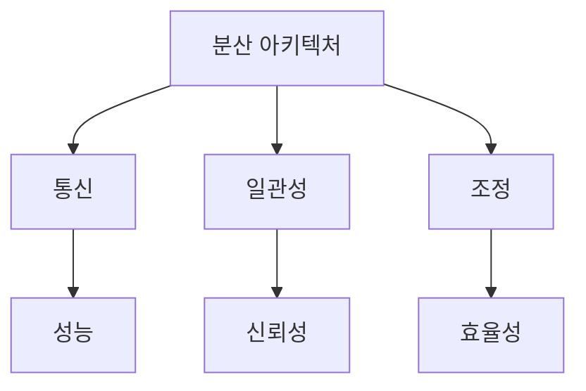
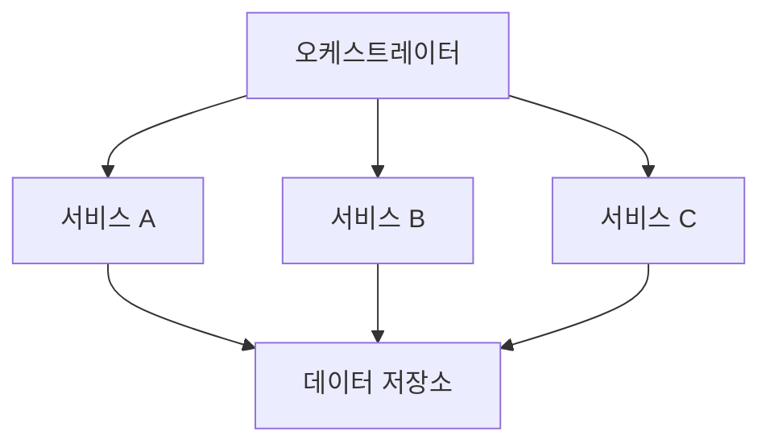
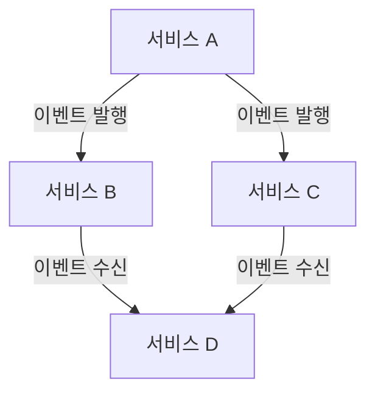
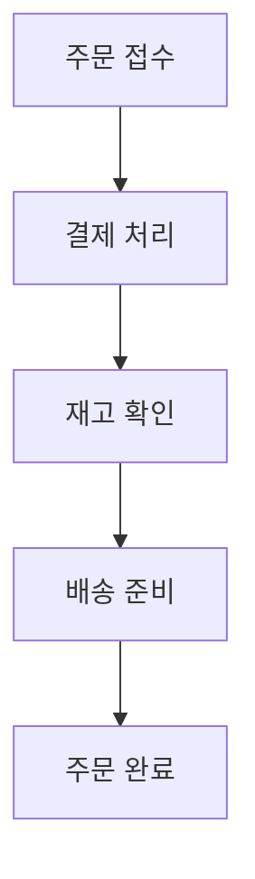
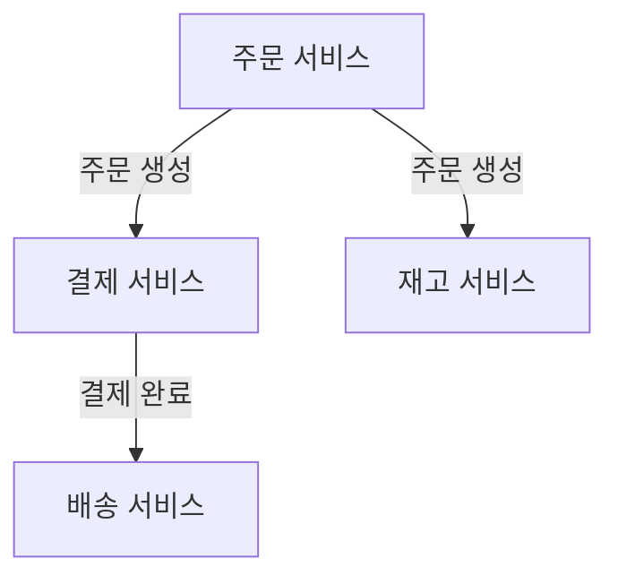
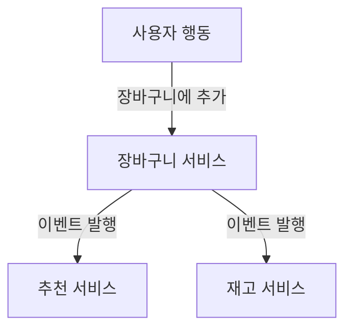
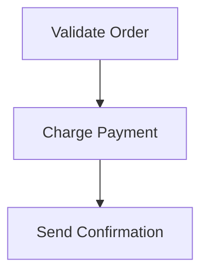
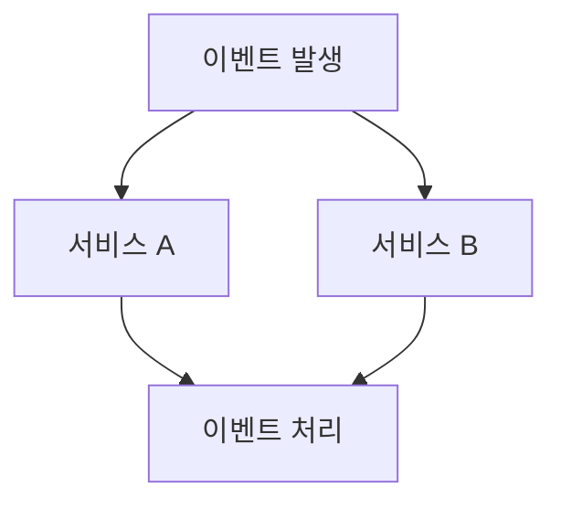
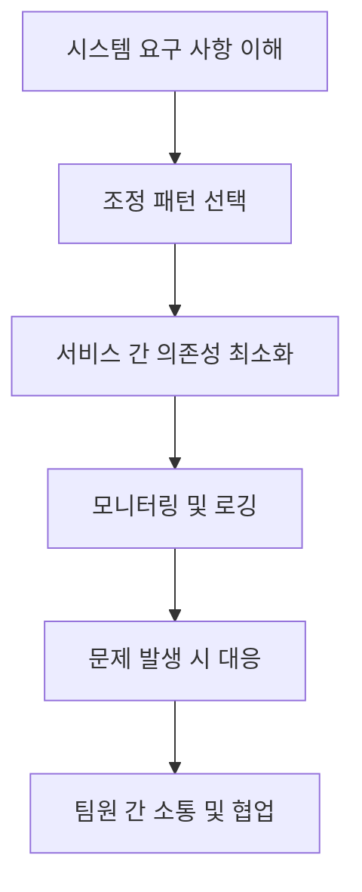
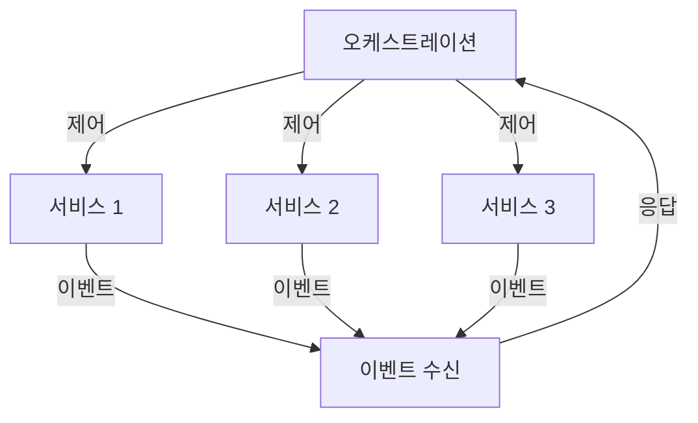

현대의 분산 아키텍처는 다양한 요구 사항을 충족하기 위한 기술적 결정의 결과물이다. 아키텍트는 이러한 요구 사항을 기술적 결정으로 변환하고, 가장 객관적인 트레이드오프 분석을 수행해야 한다. 분산 아키텍처에서 상호작용 모델을 고려할 때 일반적으로 언급되는 세 가지 결합력은 **통신, 일관성, 조정**이다. 이 글에서는 조정에 대해 다룰 것이다. 분산 아키텍처에서 존재하는 두 가지 기본 조정 패턴은 **오케스트레이션**과 **코레오그래피**이다. 이 두 스타일 간의 근본적인 위상적 차이는 아키텍처의 복잡성과 서비스 간의 상호작용 방식에 따라 다르게 나타난다. 오케스트레이션은 중앙 집중식 접근 방식을 사용하여 서비스 간의 상호작용을 조정하고, 복잡한 워크플로우를 관리하는 데 유용하다. 반면, 코레오그래피는 서비스가 독립적으로 이벤트에 반응하여 상호작용하는 분산된 접근 방식을 제공한다. 이러한 두 가지 패턴은 각각의 장단점이 있으며, 특정 시스템의 요구 사항에 따라 적절한 선택이 필요하다.


||
|:---:|
||


<!--
##### Outline #####
-->

<!--
# 목차: 분산 아키텍처에서의 조정 패턴

## 1. 개요
   - 분산 아키텍처의 정의
   - 조정 패턴의 중요성
   - 통신, 일관성 및 조정의 세 가지 결합력

## 2. 조정 패턴의 종류
   - 2.1 오케스트레이션 (Orchestration)
     - 오케스트레이션의 정의
     - 오케스트레이터의 역할
     - 오케스트레이션의 장점
     - 오케스트레이션의 단점
   - 2.2 코레오그래피 (Choreography)
     - 코레오그래피의 정의
     - 분산 통신의 특징
     - 코레오그래피의 장점
     - 코레오그래피의 단점

## 3. 오케스트레이션과 코레오그래피의 비교
   - 3.1 통신 스타일의 차이
   - 3.2 복잡성 및 유지 관리
   - 3.3 중앙 집중식 vs 분산 제어
   - 3.4 오류 처리 및 복구

## 4. 사용 사례 및 시나리오
   - 4.1 오케스트레이션 사용 사례
     - 복잡한 워크플로우 관리
     - 특정 실행 순서 보장
   - 4.2 코레오그래피 사용 사례
     - 독립적인 서비스 운영
     - 이벤트 기반 통신의 장점

## 5. 예제
   - 5.1 오케스트레이션 예제
     - JSON 파일로 표현된 워크플로우
   - 5.2 코레오그래피 예제
     - 이벤트 기반 통신의 코드 예시

## 6. FAQ
   - 오케스트레이션과 코레오그래피의 주요 차이점은 무엇인가요?
   - 어떤 경우에 오케스트레이션을 선택해야 하나요?
   - 코레오그래피의 단점은 무엇인가요?
   - 두 패턴을 혼합하여 사용할 수 있나요?

## 7. 관련 기술
   - 마이크로서비스 아키텍처 (Microservices Architecture)
   - 이벤트 기반 아키텍처 (Event-Driven Architecture)
   - 서비스 메시 (Service Mesh)
   - 비즈니스 프로세스 관리 (Business Process Management)

## 8. 결론
   - 오케스트레이션과 코레오그래피의 선택 기준
   - 분산 아키텍처에서의 조정 패턴의 미래
   - 최적의 아키텍처 설계를 위한 조언

## 9. 참고 문헌
   - 관련 서적 및 자료
   - 추가 학습 리소스

이 목차는 분산 아키텍처에서의 조정 패턴에 대한 포괄적인 이해를 제공하며, 독자가 각 패턴의 장단점과 사용 사례를 명확히 이해할 수 있도록 돕습니다.
-->

<!--
## 1. 개요
   - 분산 아키텍처의 정의
   - 조정 패턴의 중요성
   - 통신, 일관성 및 조정의 세 가지 결합력
-->

## 1. 개요

**분산 아키텍처의 정의**  

분산 아키텍처(Distributed Architecture)는 여러 개의 독립적인 컴포넌트가 네트워크를 통해 상호작용하며, 특정 기능을 수행하는 시스템 구조를 의미한다. 이러한 아키텍처는 각 컴포넌트가 독립적으로 배포되고 운영될 수 있어, 시스템의 확장성과 유연성을 높이는 데 기여한다. 예를 들어, 마이크로서비스 아키텍처는 분산 아키텍처의 한 형태로, 각 서비스가 독립적으로 개발, 배포 및 확장될 수 있도록 설계된다.

**조정 패턴의 중요성**  

조정 패턴은 분산 시스템에서 컴포넌트 간의 상호작용을 관리하는 방법론이다. 이러한 패턴은 시스템의 복잡성을 줄이고, 각 컴포넌트가 원활하게 통신할 수 있도록 돕는다. 조정 패턴을 통해 시스템의 일관성을 유지하고, 오류 발생 시 복구를 용이하게 할 수 있다. 따라서, 조정 패턴은 분산 아키텍처의 성공적인 구현에 필수적인 요소로 작용한다.

**통신, 일관성 및 조정의 세 가지 결합력**  

분산 아키텍처에서 통신(Communication), 일관성(Consistency), 조정(Coordination)은 서로 밀접하게 연결되어 있다. 

- **통신**: 컴포넌트 간의 데이터 전송 및 메시지 교환을 포함하며, 이는 시스템의 성능과 반응 속도에 큰 영향을 미친다.
- **일관성**: 데이터의 정확성과 신뢰성을 보장하는 것으로, 분산 시스템에서는 여러 컴포넌트가 동일한 데이터를 참조할 때 발생할 수 있는 문제를 해결해야 한다.
- **조정**: 시스템 내의 다양한 컴포넌트가 협력하여 작업을 수행하도록 관리하는 과정이다. 조정이 잘 이루어지면 시스템의 효율성과 안정성이 향상된다.

이 세 가지 요소는 분산 아키텍처의 설계 및 운영에서 균형을 이루어야 하며, 이를 통해 최적의 성능과 신뢰성을 확보할 수 있다.



위의 다이어그램은 분산 아키텍처의 세 가지 결합력인 통신, 일관성, 조정이 어떻게 상호작용하는지를 시각적으로 나타낸 것이다. 각 요소는 시스템의 전반적인 성능과 신뢰성에 기여하며, 이들 간의 균형이 중요하다.

<!--
## 2. 조정 패턴의 종류
   - 2.1 오케스트레이션 (Orchestration)
     - 오케스트레이션의 정의
     - 오케스트레이터의 역할
     - 오케스트레이션의 장점
     - 오케스트레이션의 단점
   - 2.2 코레오그래피 (Choreography)
     - 코레오그래피의 정의
     - 분산 통신의 특징
     - 코레오그래피의 장점
     - 코레오그래피의 단점
-->

## 2. 조정 패턴의 종류

### 2.1 오케스트레이션 (Orchestration)

**오케스트레이션의 정의** 
 
오케스트레이션은 여러 서비스나 컴포넌트를 조정하여 특정 작업을 수행하는 프로세스를 의미한다. 이 과정에서 중앙 집중식 제어가 이루어지며, 오케스트레이터가 각 서비스의 호출 순서와 데이터 흐름을 관리한다.

**오케스트레이터의 역할**  

오케스트레이터는 전체 워크플로우를 관리하는 주체로, 각 서비스 간의 상호작용을 조정하고, 서비스 호출의 순서를 결정한다. 또한, 오류 발생 시 복구 절차를 수행하고, 각 서비스의 상태를 모니터링하여 전체 시스템의 안정성을 유지하는 역할을 한다.

**오케스트레이션의 장점** 

- **중앙 집중식 관리**: 모든 서비스의 호출과 데이터 흐름을 중앙에서 관리하므로, 복잡한 워크플로우를 쉽게 이해하고 조정할 수 있다.
- **일관성 유지**: 서비스 간의 호출 순서를 명확히 정의하므로, 데이터 일관성을 유지하기 용이하다.
- **오류 처리 용이**: 오류 발생 시 오케스트레이터가 이를 감지하고 적절한 복구 절차를 수행할 수 있다.

**오케스트레이션의 단점**  

- **단일 실패 지점**: 오케스트레이터가 중앙 집중식으로 모든 것을 관리하므로, 오케스트레이터에 문제가 발생하면 전체 시스템이 영향을 받을 수 있다.
- **확장성 문제**: 서비스가 증가함에 따라 오케스트레이터의 관리 부담이 커져, 성능 저하가 발생할 수 있다.



### 2.2 코레오그래피 (Choreography)

**코레오그래피의 정의** 

코레오그래피는 각 서비스가 독립적으로 상호작용하며, 서로의 동작을 인식하고 조정하는 방식이다. 이 방식에서는 중앙 집중식 제어가 없으며, 각 서비스가 자신의 역할을 수행하면서 필요한 정보를 주고받는다.

**분산 통신의 특징**  

코레오그래피에서는 서비스 간의 통신이 분산되어 이루어진다. 각 서비스는 이벤트를 발행하거나 구독하여 다른 서비스와 상호작용하며, 이를 통해 전체 시스템이 조화롭게 작동한다. 이러한 방식은 서비스 간의 결합도를 낮추고, 독립적인 배포가 가능하게 한다.

**코레오그래피의 장점**

- **유연성**: 각 서비스가 독립적으로 동작하므로, 새로운 서비스 추가나 변경이 용이하다.
- **확장성**: 서비스가 독립적으로 운영되기 때문에, 시스템의 확장이 용이하다.
- **장애 내성**: 특정 서비스에 문제가 발생하더라도, 다른 서비스는 영향을 받지 않고 계속 운영될 수 있다.

**코레오그래피의 단점**  

- **복잡한 오류 처리**: 각 서비스가 독립적으로 동작하므로, 오류 발생 시 전체 시스템의 상태를 파악하기 어려울 수 있다.
- **상태 관리의 어려움**: 서비스 간의 상태를 일관되게 유지하기 어려워, 데이터 일관성 문제가 발생할 수 있다.



이와 같이 오케스트레이션과 코레오그래피는 각각의 특성과 장단점을 가지고 있으며, 특정 상황에 따라 적절한 패턴을 선택하는 것이 중요하다.

<!--
## 3. 오케스트레이션과 코레오그래피의 비교
   - 3.1 통신 스타일의 차이
   - 3.2 복잡성 및 유지 관리
   - 3.3 중앙 집중식 vs 분산 제어
   - 3.4 오류 처리 및 복구
-->

## 3. 오케스트레이션과 코레오그래피의 비교

분산 아키텍처에서 오케스트레이션(Orchestration)과 코레오그래피(Choreography)는 서로 다른 접근 방식을 통해 시스템의 조정을 수행한다. 이 두 패턴은 통신 스타일, 복잡성, 제어 방식, 오류 처리 및 복구 측면에서 뚜렷한 차이를 보인다.

**3.1 통신 스타일의 차이**  

오케스트레이션은 중앙 집중식 통신 스타일을 채택하여, 오케스트레이터가 모든 서비스 간의 상호작용을 관리한다. 반면, 코레오그래피는 분산 통신 스타일을 사용하여 각 서비스가 독립적으로 상호작용하며, 이벤트를 통해 서로의 상태를 알린다. 이러한 차이는 시스템의 유연성과 확장성에 큰 영향을 미친다.

**3.2 복잡성 및 유지 관리**  

오케스트레이션은 중앙 집중식 제어로 인해 복잡성이 증가할 수 있으며, 오케스트레이터의 변경이 전체 시스템에 영향을 미칠 수 있다. 반면, 코레오그래피는 각 서비스가 독립적으로 동작하므로 복잡성이 분산되지만, 서비스 간의 상호작용을 이해하기 어려울 수 있다. 유지 관리 측면에서도 오케스트레이션은 중앙 집중식 관리로 인해 상대적으로 간단할 수 있지만, 코레오그래피는 각 서비스의 변경 사항을 지속적으로 모니터링해야 한다.

**3.3 중앙 집중식 vs 분산 제어**  

오케스트레이션은 중앙 집중식 제어를 통해 모든 서비스의 흐름을 관리한다. 이는 특정한 실행 순서를 보장할 수 있지만, 단일 실패 지점(Single Point of Failure) 문제를 야기할 수 있다. 반면, 코레오그래피는 분산 제어를 통해 각 서비스가 자율적으로 동작하므로, 시스템의 내결함성을 높일 수 있다.

**3.4 오류 처리 및 복구**  

오케스트레이션에서는 오케스트레이터가 오류를 감지하고 복구하는 역할을 수행한다. 이는 오류 처리 로직이 중앙 집중화되어 있어 관리가 용이하지만, 오케스트레이터가 실패할 경우 전체 시스템이 영향을 받을 수 있다. 코레오그래피에서는 각 서비스가 독립적으로 오류를 처리해야 하므로, 복구가 더 복잡할 수 있지만, 시스템의 유연성을 높이는 데 기여한다.


오케스트레이션은 중앙 집중식으로 모든 서비스가 오케스트레이터를 통해 연결되는 반면, 코레오그래피는 각 서비스가 독립적으로 이벤트를 통해 상호작용하는 모습을 나타낸다. 이러한 비교를 통해 각 패턴의 장단점을 명확히 이해할 수 있다.

<!--
## 4. 사용 사례 및 시나리오
   - 4.1 오케스트레이션 사용 사례
     - 복잡한 워크플로우 관리
     - 특정 실행 순서 보장
   - 4.2 코레오그래피 사용 사례
     - 독립적인 서비스 운영
     - 이벤트 기반 통신의 장점
-->

## 4. 사용 사례 및 시나리오

### 4.1 오케스트레이션 사용 사례

**복잡한 워크플로우 관리**  

오케스트레이션은 복잡한 비즈니스 프로세스를 관리하는 데 매우 유용하다. 예를 들어, 전자상거래 플랫폼에서 주문 처리 과정은 여러 단계로 이루어져 있다. 주문이 접수되면 결제 처리, 재고 확인, 배송 준비 등의 단계가 순차적으로 진행된다. 이때 오케스트레이터는 각 단계의 실행 순서를 조정하고, 각 서비스 간의 통신을 관리하여 전체 프로세스가 원활하게 진행되도록 한다.



**특정 실행 순서 보장**  

오케스트레이션은 특정 실행 순서를 보장해야 하는 경우에 적합하다. 예를 들어, 금융 거래 시스템에서는 거래의 승인, 처리, 기록 등의 단계가 반드시 순차적으로 이루어져야 한다. 이때 오케스트레이터는 각 단계가 완료된 후 다음 단계로 진행하도록 보장하여 데이터의 일관성을 유지한다.

### 4.2 코레오그래피 사용 사례

**독립적인 서비스 운영** 

코레오그래피는 각 서비스가 독립적으로 운영될 수 있도록 하는 데 유리하다. 예를 들어, 마이크로서비스 아키텍처에서는 각 서비스가 서로의 존재를 알 필요 없이 이벤트를 통해 통신할 수 있다. 이로 인해 서비스 간의 결합도가 낮아지고, 각 서비스는 독립적으로 배포 및 확장이 가능하다.



**이벤트 기반 통신의 장점**  

코레오그래피는 이벤트 기반 통신을 통해 시스템의 반응성을 높일 수 있다. 예를 들어, 사용자가 웹사이트에서 상품을 장바구니에 추가할 때, 해당 이벤트가 발생하면 여러 서비스가 이를 감지하고 각자의 작업을 수행할 수 있다. 이 방식은 시스템의 확장성과 유연성을 높이며, 서비스 간의 의존성을 줄인다.



이와 같이 오케스트레이션과 코레오그래피는 각각의 사용 사례에 따라 적합한 패턴을 선택하여 시스템을 설계하는 데 중요한 역할을 한다. 각 패턴의 장점을 활용하여 효율적이고 유연한 분산 아키텍처를 구축할 수 있다.

<!--
## 5. 예제
   - 5.1 오케스트레이션 예제
     - JSON 파일로 표현된 워크플로우
   - 5.2 코레오그래피 예제
     - 이벤트 기반 통신의 코드 예시
-->

## 5. 예제

**5.1 오케스트레이션 예제**

오케스트레이션은 여러 서비스 간의 상호작용을 중앙에서 관리하는 방식이다. 이를 통해 복잡한 워크플로우를 정의하고, 각 서비스의 실행 순서를 보장할 수 있다. 아래는 JSON 파일로 표현된 간단한 오케스트레이션 워크플로우의 예시이다.

```json
{
  "workflow": {
    "name": "OrderProcessing",
    "steps": [
      {
        "name": "ValidateOrder",
        "service": "OrderService",
        "action": "validate"
      },
      {
        "name": "ChargePayment",
        "service": "PaymentService",
        "action": "charge"
      },
      {
        "name": "SendConfirmation",
        "service": "NotificationService",
        "action": "send"
      }
    ]
  }
}
```

위의 JSON 예제는 주문 처리 워크플로우를 정의하고 있다. 각 단계는 특정 서비스와 그 서비스에서 수행할 액션을 명시하고 있다. 이러한 구조는 오케스트레이터가 각 단계를 순차적으로 실행할 수 있도록 돕는다.

다음은 이 워크플로우를 시각적으로 표현한 다이어그램이다.



**5.2 코레오그래피 예제**

코레오그래피는 각 서비스가 독립적으로 상호작용하는 방식으로, 이벤트 기반 통신을 통해 이루어진다. 아래는 이벤트 기반 통신의 코드 예시로, Node.js를 사용하여 구현한 간단한 서비스 간의 통신을 보여준다.

```javascript
// OrderService.js
const EventEmitter = require('events');
const eventEmitter = new EventEmitter();

eventEmitter.on('orderValidated', (order) => {
    console.log(`Order ${order.id} validated.`);
    eventEmitter.emit('paymentCharged', order);
});

// PaymentService.js
eventEmitter.on('paymentCharged', (order) => {
    console.log(`Payment charged for order ${order.id}.`);
    eventEmitter.emit('confirmationSent', order);
});

// NotificationService.js
eventEmitter.on('confirmationSent', (order) => {
    console.log(`Confirmation sent for order ${order.id}.`);
});

// 주문 처리 시작
const order = { id: 1 };
eventEmitter.emit('orderValidated', order);
```

위의 코드 예시는 주문 서비스가 주문을 검증한 후, 결제 서비스에 결제 요청을 보내고, 결제가 완료되면 알림 서비스에 확인 메시지를 전송하는 과정을 보여준다. 각 서비스는 독립적으로 동작하며, 이벤트를 통해 서로의 상태를 알린다. 이러한 방식은 서비스 간의 결합도를 낮추고, 유연한 아키텍처를 제공한다.

<!--
## 6. FAQ
   - 오케스트레이션과 코레오그래피의 주요 차이점은 무엇인가요?
   - 어떤 경우에 오케스트레이션을 선택해야 하나요?
   - 코레오그래피의 단점은 무엇인가요?
   - 두 패턴을 혼합하여 사용할 수 있나요?
-->

## 6. FAQ

**오케스트레이션과 코레오그래피의 주요 차이점은 무엇인가요?** 

오케스트레이션(Orchestration)과 코레오그래피(Choreography)는 분산 시스템에서의 조정 방식에 있어 근본적인 차이를 보인다. 오케스트레이션은 중앙 집중식 제어를 통해 모든 서비스의 상호작용을 관리하는 반면, 코레오그래피는 각 서비스가 자율적으로 상호작용하도록 하는 분산 방식이다. 오케스트레이션에서는 오케스트레이터가 모든 작업의 흐름을 정의하고 조정하는 역할을 하며, 코레오그래피에서는 서비스 간의 상호작용이 이벤트 기반으로 이루어져 각 서비스가 독립적으로 동작한다.

**어떤 경우에 오케스트레이션을 선택해야 하나요?**  

오케스트레이션은 복잡한 워크플로우를 관리해야 하거나, 특정 실행 순서가 중요한 경우에 적합하다. 예를 들어, 금융 거래 처리와 같이 순서가 중요한 작업에서는 오케스트레이션이 유리하다. 또한, 서비스 간의 의존성이 강한 경우에도 오케스트레이션을 통해 명확한 흐름을 유지할 수 있다. 

**코레오그래피의 단점은 무엇인가요?** 

코레오그래피는 각 서비스가 자율적으로 동작하기 때문에, 서비스 간의 상호작용을 추적하고 관리하는 것이 어려울 수 있다. 또한, 서비스 간의 의존성이 명확하지 않으면, 전체 시스템의 복잡성이 증가할 수 있다. 이로 인해 오류 발생 시 문제를 진단하고 해결하는 데 시간이 더 걸릴 수 있다.

**두 패턴을 혼합하여 사용할 수 있나요?**  

네, 오케스트레이션과 코레오그래피는 혼합하여 사용할 수 있다. 예를 들어, 특정 부분에서는 오케스트레이션을 통해 복잡한 워크플로우를 관리하고, 다른 부분에서는 코레오그래피를 통해 서비스 간의 독립성을 유지하는 방식이다. 이러한 혼합 접근 방식은 시스템의 유연성과 확장성을 높이는 데 기여할 수 있다.

<!--
## 7. 관련 기술
   - 마이크로서비스 아키텍처 (Microservices Architecture)
   - 이벤트 기반 아키텍처 (Event-Driven Architecture)
   - 서비스 메시 (Service Mesh)
   - 비즈니스 프로세스 관리 (Business Process Management)
-->

## 7. 관련 기술

분산 아키텍처에서 조정 패턴을 이해하기 위해서는 여러 관련 기술을 살펴보는 것이 중요하다. 이 섹션에서는 마이크로서비스 아키텍처, 이벤트 기반 아키텍처, 서비스 메시, 비즈니스 프로세스 관리에 대해 설명하겠다.

**마이크로서비스 아키텍처 (Microservices Architecture)**  

마이크로서비스 아키텍처는 애플리케이션을 독립적인 서비스로 나누어 개발하는 접근 방식이다. 각 서비스는 특정 비즈니스 기능을 수행하며, 서로 독립적으로 배포 및 확장할 수 있다. 이 아키텍처는 조정 패턴을 구현하는 데 유용하며, 오케스트레이션과 코레오그래피 모두에 적합하다. 

**이벤트 기반 아키텍처 (Event-Driven Architecture)**  

이벤트 기반 아키텍처는 시스템의 구성 요소가 이벤트를 통해 상호작용하는 방식이다. 이 아키텍처는 비동기 통신을 지원하며, 서비스 간의 결합도를 낮추는 데 기여한다. 코레오그래피 패턴을 활용하여 서비스가 독립적으로 동작할 수 있도록 한다.



**서비스 메시 (Service Mesh)**  

서비스 메시란 마이크로서비스 간의 통신을 관리하는 인프라 계층이다. 서비스 간의 트래픽 관리, 보안, 모니터링 등을 제공하여 개발자가 비즈니스 로직에 집중할 수 있도록 돕는다. 오케스트레이션 패턴을 사용할 때 서비스 메시를 통해 복잡한 통신을 간소화할 수 있다.

**비즈니스 프로세스 관리 (Business Process Management)**  

비즈니스 프로세스 관리는 비즈니스 프로세스를 모델링, 실행, 모니터링하는 방법론이다. 이는 오케스트레이션 패턴과 밀접한 관련이 있으며, 복잡한 워크플로우를 관리하는 데 유용하다. BPM 도구를 사용하면 비즈니스 프로세스를 시각적으로 표현하고, 이를 통해 조정 패턴을 효과적으로 구현할 수 있다.

이와 같은 관련 기술들은 분산 아키텍처에서 조정 패턴을 효과적으로 활용하는 데 필수적이다. 각 기술의 특성을 이해하고 적절히 활용함으로써, 보다 효율적이고 유연한 시스템을 구축할 수 있다.

<!--
## 8. 결론
   - 오케스트레이션과 코레오그래피의 선택 기준
   - 분산 아키텍처에서의 조정 패턴의 미래
   - 최적의 아키텍처 설계를 위한 조언
-->

## 8. 결론

**오케스트레이션과 코레오그래피의 선택 기준**  

오케스트레이션과 코레오그래피는 각각의 장단점이 있으며, 선택 기준은 주로 시스템의 요구 사항에 따라 달라진다. 오케스트레이션은 복잡한 워크플로우를 관리하고 특정 실행 순서를 보장해야 할 때 유리하다. 반면, 코레오그래피는 서비스 간의 독립성을 유지하고 이벤트 기반 통신을 활용할 수 있는 경우에 적합하다. 따라서, 시스템의 복잡성, 서비스 간의 의존성, 그리고 유지 관리의 용이성을 고려하여 적절한 패턴을 선택해야 한다.

**분산 아키텍처에서의 조정 패턴의 미래** 

분산 아키텍처는 계속해서 발전하고 있으며, 조정 패턴 또한 그에 따라 진화하고 있다. 특히, 마이크로서비스 아키텍처의 확산과 함께 오케스트레이션과 코레오그래피의 중요성이 더욱 부각되고 있다. 앞으로는 AI와 머신러닝 기술이 결합되어 자동화된 조정 패턴이 등장할 가능성이 높다. 이러한 변화는 시스템의 효율성을 높이고, 개발자들이 보다 쉽게 복잡한 아키텍처를 관리할 수 있도록 도와줄 것이다.

**최적의 아키텍처 설계를 위한 조언**  

최적의 아키텍처 설계를 위해서는 다음과 같은 몇 가지 원칙을 고려해야 한다. 첫째, 시스템의 요구 사항을 명확히 이해하고, 그에 맞는 조정 패턴을 선택해야 한다. 둘째, 서비스 간의 의존성을 최소화하여 유연성을 높이는 것이 중요하다. 셋째, 모니터링과 로깅을 통해 시스템의 상태를 지속적으로 파악하고, 문제 발생 시 신속하게 대응할 수 있는 체계를 마련해야 한다. 마지막으로, 팀원 간의 원활한 소통과 협업이 이루어질 수 있도록 환경을 조성하는 것이 필요하다.



이러한 원칙을 바탕으로 분산 아키텍처에서의 조정 패턴을 효과적으로 활용할 수 있으며, 이는 시스템의 안정성과 성능을 극대화하는 데 기여할 것이다.

<!--
## 9. 참고 문헌
   - 관련 서적 및 자료
   - 추가 학습 리소스
-->

## 9. 참고 문헌

**관련 서적 및 자료**

1. **"Designing Data-Intensive Applications" by Martin Kleppmann**  
   이 책은 분산 시스템의 설계와 데이터 처리에 대한 깊이 있는 통찰을 제공한다. 특히, 데이터 일관성, 분산 아키텍처의 패턴 및 조정 메커니즘에 대한 내용을 다룬다.

2. **"Microservices Patterns" by Chris Richardson**  
   마이크로서비스 아키텍처에서의 다양한 패턴과 실용적인 접근 방식을 설명하는 책이다. 오케스트레이션과 코레오그래피의 사용 사례를 포함하여, 분산 시스템에서의 조정 패턴에 대한 이해를 돕는다.

3. **"Building Microservices" by Sam Newman**  
   마이크로서비스 아키텍처의 기본 개념과 설계 원칙을 설명하며, 오케스트레이션과 코레오그래피의 차이점에 대한 논의도 포함되어 있다.

4. **"Event-Driven Microservices" by Hugh McKee**  
   이벤트 기반 아키텍처의 원리와 구현 방법을 다룬 책으로, 코레오그래피 패턴의 장점을 이해하는 데 유용하다.

**추가 학습 리소스**

- **Coursera: Microservices Specialization**  
  이 과정은 마이크로서비스 아키텍처의 기본 개념과 실습을 제공하며, 오케스트레이션과 코레오그래피의 실제 적용 사례를 다룬다.

- **YouTube: "Microservices Architecture - Orchestration vs Choreography"**  
  이 영상에서는 오케스트레이션과 코레오그래피의 차이점과 각 패턴의 장단점을 시각적으로 설명한다.

- **Medium: "Understanding Orchestration and Choreography in Microservices"**  
  이 블로그 포스트는 오케스트레이션과 코레오그래피의 개념을 쉽게 설명하며, 실제 사례를 통해 이해를 돕는다.

- **GitHub: Open Source Projects**  
  다양한 오픈 소스 프로젝트에서 오케스트레이션과 코레오그래피 패턴을 구현한 예제를 찾아볼 수 있다. 예를 들어, Kubernetes와 같은 도구는 오케스트레이션을 위한 훌륭한 사례이다.



위의 다이어그램은 오케스트레이션 패턴을 사용하여 여러 서비스를 제어하는 구조를 나타낸다. 각 서비스는 오케스트레이터에 의해 관리되며, 이벤트를 통해 상호작용한다. 이러한 구조는 복잡한 워크플로우를 효과적으로 관리하는 데 유용하다.

<!--
##### Reference #####
-->

## Reference


* [https://medium.com/@dmosyan/2-coordination-patterns-in-distributed-architectures-33f40c906a7a](https://medium.com/@dmosyan/2-coordination-patterns-in-distributed-architectures-33f40c906a7a)
* [https://www.linkedin.com/pulse/microservices-orchestration-vs-choreography-choosing-kedar-kamthe](https://www.linkedin.com/pulse/microservices-orchestration-vs-choreography-choosing-kedar-kamthe)
* [https://medium.com/israeli-tech-radar/choreography-vs-orchestration-2a68ce45d8e6](https://medium.com/israeli-tech-radar/choreography-vs-orchestration-2a68ce45d8e6)
* [https://camunda.com/blog/2023/02/orchestration-vs-choreography/](https://camunda.com/blog/2023/02/orchestration-vs-choreography/)
* [https://www.milanjovanovic.tech/blog/orchestration-vs-choreography](https://www.milanjovanovic.tech/blog/orchestration-vs-choreography)
* [https://bugrasitemkar.medium.com/microservice-communication-orchestration-vs-choreography-dfbe9d767b2d](https://bugrasitemkar.medium.com/microservice-communication-orchestration-vs-choreography-dfbe9d767b2d)


<!--
#  2 Coordination Patterns in Distributed Architectures

[ https://towardsdatascience.com/10-common-software-architectural-patterns-in-
a-nutshell-a0b47a1e9013 ](https://towardsdatascience.com/10-common-software-
architectural-patterns-in-a-nutshell-a0b47a1e9013)

The modern distributed architectures are trade-offs. It’s a job of an
architect to translate the requirements into technical decisions and make a
most objective trade-off analysis. 3 coupling forces are commonly mentioned
when considering interaction models in distributed architectures:
**communication, consistency, and coordination** .

We will talk about the last one: coordination. Two fundamental coordination
patterns exist in distributed architectures: **orchestration** and
**choreography** . The fundamental topological differences between the two
styles are:

Orchestration versus choreography in distributed architectures

#  Orchestration Communication Style

The orchestration pattern uses an orchestrator (sometimes called a mediator)
component to manage workflow state, optional behavior, error handling,
notification, and a host of other workflow maintenance. It is named for the
distinguishing feature of a musical orchestra, which utilizes a conductor to
synchronize the incomplete parts of the overall score to create a unified
piece of music.

In the above example diagram (which is very simplified of course), services
A-D are domain services, each responsible for its own bounded context, data,
and behavior. The Orchestrator component generally doesn’t  
include any domain behavior outside of the workflow it mediates.

Microservices tend to have an orchestrator per workflow as one of the primary
goals of the microservices architecture style is decoupling, and using a
global component creates an undesirable coupling points.

Orchestration is useful when an architect must model a complex workflow that
includes more than just the single “happy path,” but also alternate paths
and error conditions. The simplest example as you can see in the image above,
is the e-commerce website. The workflow should be pretty intuitive and simple
to understand.

What happens if the customer’s payment method is rejected? Order Placement
Orchestrator updates the order via the Order Placement Service as before.
However, when trying to apply payment, it is rejected by the pay-ment service,
perhaps because of an expired credit card number. In that case, the Payment
Service notifies the orchestrator, which then places a (typically)
asynchronous call to send a message to the Email Service to notify the
customer of the failed order. Additionally, the orchestrator updates the state
of the Order Placement Service, which still thinks this is an active order.

Other error might be the Fulfillment Service reports a back order. In  
that case, the orchestrator must refund the payment (this is why many online
services don’t charge until shipment, not at order time) and update the
state of the Order Placement Service.

General advantages of the orchestration communication style include the
following:

  * Centralized workflow 
  * Error handling 
  * Recoverability 
  * State management 

General disadvantages of the orchestration communication style include the
following:

  * **Responsiveness** : all communication must go through the mediator, creating a potential through put bottleneck that can harm responsiveness. 
  * **Fault tolerance:** while orchestration enhances recoverability for domain services, it creates a potential single point of failure for the workflow, which can be addressed with redundancy but adds more complexity. 
  * **Scalability:** this communication style doesn’t scale as well as choreography because it has more coordination points (the orchestrator), which cuts down on potential parallelism. 
  * **Service coupling:** having a central orchestrator creates higher coupling between it and domain components, which is sometimes necessary. 

#  Choreography Communication Style

The choreography pattern visually illustrates intent of the communication
style that has no central coordination.

In this workflow, the initiating request goes to the first service in the
chain of responsibility — in this case, the Order Placement Service. Once it
has updated internal records about the order, it sends an asynchronous request
that the Payment Service receives. Once payment has been applied, the Payment
Service generates a message received by the Fulfillment Service, which plans
for delivery and sends a message to the Email Service.

The same 2 error handling scenarios will be executed differently. Rather than
send a message intended for the Fulfillment Service, the Payment service sends
messages indicating failure to the Email Service and back to the Order
Placement Service to update the order status. This alternate workflow
doesn’t appear too complex, with a single new communication link that
didn’t exist before.

However, consider the increasing complexity imposed by the other error
scenario for a product back order.

Many steps of this workflow have already completed before the event (out of
stock) that causes the error. Because each of these services implement its own
transactionality, when an error occurs, each service must issue compensating
messages to other services. Once the Fulfillment Service realizes the error
condition, it should generate events suited to its bounded context, perhaps a
broadcast message subscribed to by the Email, Payment, and Order Placement
services.

Every workflow that architects need to model in software has a certain amount
of _semantic coupling_ — the inherent coupling that exists in the problem
domain. The semantic coupling of a workflow is mandated by the domain
requirements of the solution and must be modeled somehow. However clever an
architect is, they cannot reduce the amount of semantic coupling, but their
implementation choices may increase it.

This doesn’t mean that an architect might not push back on impractical or  
impossible semantics defined by business users — some domain requirements
create extraordinarily difficult problems in architecture.

The major lesson of the last decade of architecture design is to model the
semantics of the workflow as closely as possible with the implementation. An
architect can never reduce semantic coupling via implementation, but they can
make it worse. Thus, we can establish a relationship between the semantic
coupling and the need for coordination — the more steps required by the
workflow, the more potential error and other optional paths appear.

Advantages of the choreography communication style include the following:

  * Responsiveness 
  * Scalability 
  * Fault tolerance 
  * Service decoupling 

Disadvantages of the choreography communication style include the following:

  * **Distributed workflow** : no workflow owner makes error management and other boundary conditions more difficult. 
  * **State management** : no centralized state holder hinders ongoing state management. 
  * **Error handling:** error handling becomes more difficult without an orchestrator because the domain services must have more workflow knowledge. 
  * **Recoverability:** similarly, recoverability becomes more difficult without an orchestrator to attempt retries and other remediation efforts. 

For more architectural patterns and other interesting examples checkout the
source.

👏 **and subscribe for more articles!** 🖥️

[Software Architecture: The Hard Parts by Neal Ford, Mark Richards,  
Pramod Sadalage, and Zhamak Dehghani]


-->

<!--


-->

<!--
Microservices architecture has revolutionized the way we design and develop
complex software systems, enabling scalability, flexibility, and faster time-
to-market. As microservices communicate with each other to perform specific
tasks, two distinct communication styles have emerged: orchestration and
choreography. In this article, we will delve into the differences between
these communication styles and explore when to use each one to maximize the
benefits of microservices.

Orchestration is a centralized approach to coordinating and controlling the
interactions between microservices. In this style, there is a central
orchestrator, often referred to as a service orchestrator or workflow engine,
that acts as the brain of the system. The orchestrator is responsible for
managing the execution flow, making decisions, and directing the interactions
between microservices.

In an orchestration-based system, the orchestrator defines the sequence of
steps and controls the data flow between microservices. It sends explicit
commands to each microservice, instructing them on what actions to perform and
in what order. This centralization provides a clear view of the system's
execution flow and allows for easier monitoring, logging, and exception
handling.

Advantages of Orchestration:

⚡️  Centralized control  : The orchestrator acts as a single point of
control, making it easier to manage and monitor the overall system.

⚡️  Business process visibility  : With a centralized orchestrator, it is
easier to gain insights into the business processes and their execution.

⚡️  Workflow management  : Orchestration allows for the definition and
management of complex workflows, making it suitable for scenarios where a
specific order of steps is required.

⚡️  Simplified service interfaces  : Microservices can have simpler APIs,
as the complexity of coordination and sequencing is handled by the
orchestrator.

Choreography, on the other hand, is a decentralized approach to communication
in a microservices architecture. In this style, each microservice plays an
active role in collaborating with other services, without the need for a
central orchestrator. Microservices communicate directly with each other,
typically by publishing events or messages to a shared medium, such as message
queues or event streams.

In a choreography-based system, microservices are responsible for reacting to
events and making decisions based on those events. Each microservice
independently determines how to respond to events and what actions to take.
This decentralized nature allows for greater autonomy and flexibility among
microservices.

Advantages of Choreography:

⚡️  Loose coupling  : Choreography promotes loose coupling between
microservices, as they communicate through events or messages without direct
dependencies.

⚡️  Scalability  : With choreography, microservices can scale
independently, as there is no central orchestrator that could become a
bottleneck.

⚡️  Resilience  : Failure in one microservice does not disrupt the entire
system, as other services can continue to operate independently.

⚡️  Agility and adaptability  : Choreography enables the easier
introduction of new services and modifications to existing ones without
impacting the entire system.

Choosing Between Orchestration and Choreography  👀  :

The choice between orchestration and choreography depends on various factors
and the specific requirements of your system. Consider the following
guidelines:

⚡️  Complexity of the workflow  : If the system requires a complex
sequence of steps or has a highly structured workflow, orchestration may be a
better fit. It provides centralized control and easier management of complex
execution flows.

⚡️  System autonomy  : If system autonomy and flexibility are crucial, and
if microservices need to act independently, choreography is a suitable choice.
It promotes loose coupling and enables services to make decisions based on
events.

⚡️  Collaboration patterns  : Analyze the communication patterns between
microservices. If there is a need for direct interaction and coordination
between services, orchestration might be more appropriate. If services can
operate independently and asynchronously, choreography can provide more
scalability


-->

<!--


-->

<!--
#  Typical workflow definitions

We have already described workflows at length without even giving one code
example. Let us remedy that and address the developer experience.

Typically a workflow is represented internally as a DAG and can be described
as JSON file, as code or in a specific DSL.

##  DSL Example with apache Airflow of tasks executed in sequence

    
    
    download_launches >> get_pictures >> notify

This workflow contains 2 tasks that run in parallel (FORK)

    
    
      
    {  
      "name": "image_convert_resize_multipleformat",  
      "description": "Image Processing Workflow",  
      "version": 1,  
      "tasks": [  
        {  
          "name": "image_convert_resize_multipleformat_fork",  
          "taskReferenceName": "image_convert_resize_multipleformat_ref",  
          "type": "FORK_JOIN",  
          "forkTasks":[  
            [  
              <task 1 workflow>  
            ],  
            [  
              <task 2 workflow>  
            ]  
          ]  
        },  
        {  
          "name": "image_convert_resize_multipleformat_join",  
          "taskReferenceName": "image_convert_resize_multipleformat_join_ref",  
          "type": "JOIN",  
          "joinOn": [  
            "upload_toS3_jpg_ref",  
            "upload_toS3_webp_ref"  
          ]  
        }  
      
      ],  
      "outputParameters": {  
        "fileLocationJpg": "${upload_toS3_jpg_ref.output.fileLocation}",  
        "fileLocationWebp": "${upload_toS3_webp_ref.output.fileLocation}"  
      },  
      "schemaVersion": 2,  
      "restartable": true,  
      "workflowStatusListenerEnabled": true,  
      "ownerEmail": "devrel@orkes.io",  
      "timeoutPolicy": "ALERT_ONLY",  
      "timeoutSeconds": 0,  
      "variables": {},  
      "inputTemplate": {}  
    }  
      
    

When defining a choreography, specific syntax can be used to spawn other tasks
instead of using client code to publish events to a topic. Example of spawning
tasks in parallel with Celery Canvas:

    
    
    res = group(add.s(i, i) for i in range(10))()


-->

<!--


-->

<!--
_Wondering how to choose between Orchestration and Cheoreography for software
development? Learn about the benefits and disadvantages of using Orchestration
vs Choreography for your microservice architecture._

Orchestration and choreography are two different approaches for how to
interact with other software components in a microservice architecture. Both
have their benefits and drawbacks. This article should help you understand how
these two approaches differ from each other, give some examples for each of
them and explain how a clever combination of both can help you on your quest
to build the best possible loosely-coupled system for your purposes. If you
are already well aware of the foundations of these topics you can jump to the
right point following the table of contents.

##  Table of Contents

##  Microservice Orchestration vs Choreography – what’s the difference?

Before being able to talk about benefits, drawbacks and use-cases we need to
understand how those two approaches actually differ from each other. Let’s
take a look at their definition and try to identify strengths and weaknesses
after.

###  What is Choreography

When talking about this pattern I always imagine a ballet in my head. Each of
the dancers knows what they need to do and how to interact with each other.
Everything happens implicitly, there is no need for a conductor.

 _Figure 1: Illustration of ballet
dancers which are doing a choreographed dance_

Transferring this into IT architecture, choreography refers to the
coordination and organization of interactions between different software
components or systems. It is a design pattern that enables the development of
distributed systems where the components interact with each other through a
set of well-defined interfaces, without requiring a central authority or
coordinator.

A choreographed system uses by definition event-driven communication, whereas
[ microservice orchestration ](https://camunda.com/solutions/microservices-
orchestration/) uses command-driven communication. An event is something which
happened in the past and is a fact. The sender does not know who picks up the
event or what happens next. An example can be the event “Credit checked.”

**Figure 2** shows a choreographed event-driven microservice architecture of a
typical customer-onboarding process. It features five microservices for
Registration, Credit, Address, and Criminal Check. Each of them communicated
through events which are being exchanged through a message broker (e.g.
Kafka).

 _Figure 2: Event-driven choreographed
microservice architecture for a customer onboarding use-case_

###  Benefits of Choreography

After having explained the term itself let us take a closer look at the
benefits of using a choreographed pattern for a microservice architecture. The
most important ones are outlined in the bulleted list below:

  * **Loose coupling:** Choreography allows microservices to be loosely coupled, which means they can operate independently and asynchronously without depending on a central coordinator. This can make the system more scalable and resilient, as the failure of one microservice will not necessarily affect the other microservices. 
  * **Ease of maintenance:** Choreography allows microservices to be developed and maintained independently, which can make it easier to update and evolve the system. 
  * **Decentralized control:** Choreography allows control to be decentralized, which can make the system more resilient and less prone to failure. 
  * **Asynchronous communication:** Choreography allows microservices to communicate asynchronously, which can be more efficient and scalable than synchronous communication. 

Overall, choreography can be a useful design pattern for building scalable,
resilient, and maintainable microservice architectures. Though some of these
benefits can actually turn into drawbacks.

###  Downsides of Choreography

  * **Complexity** : Choreography can be more complex to implement and maintain than orchestration, as it requires the development of well-defined interfaces and the coordination of interactions between the microservices. 
  * **Lack of central control** : Without a central coordinator, it can be more difficult to monitor and manage the interactions between the microservices in a choreographed system. 
  * **Lack of visibility** : Choreography can make it more difficult to get a holistic view of the system, as there is no central coordinator that has visibility into all of the interactions between the microservices. 
  * **Difficulty troubleshooting** : Without a central coordinator, it can be more difficult to troubleshoot issues in a choreographed system. So called event-chains can easily occur when multiple services are required for a certain domain. These are typically not visible and hence troubleshooting gets even trickier. 

As you can see the event driven choreographed approach does not only lead to
advantages and might not be a good fit for all scenarios. Hence it is
important to carefully consider the requirements of your system when deciding
whether to use choreography or another design pattern.

For more information on how you can tame an event-driven architecture visit [
Bernd Ruecker ](https://twitter.com/berndruecker) ’s [ blog post
](https://blog.bernd-ruecker.com/how-to-tame-event-driven-
microservices-5b30a6b98f86) , which is based on the customer-onboarding
example from Figure 2.

##  What is Orchestration

As the name already suggests, when talking about orchestration you can picture
a big orchestra which features multiple instruments and a conductor who makes
sure that everyone stays in tact. He tells when which instrument needs to play
to ensure that the song sounds as it should like.

 Figure 3: Illustration
of an orchestra with its conductor

Orchestration refers to the coordination and management of the interactions
and dependencies between different software components or systems. It is a
design pattern that enables the development of distributed systems where a
central authority or coordinator is responsible for managing and coordinating
the actions of the different components.

An orchestrated system uses command driven communication. In comparison to the
event a command has an intent. The sender wants something to happen and the
recipient does not necessarily know who issued the command.

Let’s take a closer look at how an orchestrated microservice architecture
could look like in a real use-case. Taking the example of an order-management
process which involves checkout, payment, shipment in inventory services we
need to add an overall order service which takes care of the orchestration.
This is illustrated in Figure 4.

 Figure 4: Orchestrated microservice
architecture for an order management use-case

###  Benefits of Orchestration

Orchestration in microservice architectures can lead to some nice benefits
which compensate for the drawbacks of a choreographed system. A few of them
are explained below:

  * **Simplicity** : Orchestration can be simpler to implement and maintain than choreography, as it relies on a central coordinator to manage and coordinate the interactions between the microservices. 
  * **Centralized control** : With a central coordinator, it is easier to monitor and manage the interactions between the microservices in an orchestrated system. 
  * **Visibility** : Orchestration allows for a holistic view of the system, as the central coordinator has visibility into all of the interactions between the microservices. 
  * **Ease of troubleshooting** : With a central coordinator, it is easier to troubleshoot issues in an orchestrated system. 

###  Downsides of Orchestration

This pattern also also some general downsides. Let’s take a closer look at
them and also try to find out how Camunda tackles them with their process
orchestration platform.

  * **Tight coupling:** Orchestration is often perceived as being tighter coupled. But this is not true. Most discussions mix-in discussions about communication styles (like asynchronous communication) and assume orchestration using synchronous communication that leads to temporal coupling. But also with orchestration, a command itself could for instance also be transported via a message broker. 
  * **Single point of failure:** The central coordinator in an orchestrated system can be a single point of failure, which can make the system less resilient. Though there is luckily the possibility of deploying the orchestrator in a high availability fashion. 
  * **Difficulty adding, removing, or replacing microservices:** Changing the configuration of an orchestrated system can be more difficult, as it requires updating the central coordinator. 
    * In the context of [ Camunda ](https://camunda.com/) this is not necessarily true. By using the [ BPMN 2.0 standard ](https://camunda.com/bpmn/) it is very easy to change this configuration. It can be even easier than in a choreographed system. For more information on this topic I can recommend reading [ this article ](https://blog.bernd-ruecker.com/how-to-tame-event-driven-microservices-5b30a6b98f86) . 
  * **Overhead** : The central coordinator in an orchestrated system can add overhead to the system. 

##  When to use Orchestration vs Choreography

Whether you want to use choreography or orchestration in your microservice
architecture should always be a well-thought-out choice. Both approaches bring
their advantages but also downsides.

Before taking a look at how these two patterns can be mixed to get the best of
both worlds, let us take a look at scenarios for either choreography or
orchestration.

###  Scenarios for using Choreography

The perfect scenario for using event-driven communication is when the message
leaves the context of the current domain. Taking the example of a customer
onboarding process this could for instance happen when enrolling this person
for a newsletter or bonus program. This is happening outside the core context
of customer onboarding and we do not necessarily need to wait for an event to
return in order to proceed with the overall onboarding flow. Hence we do not
require any visibility in that area.

This approach is particularly useful when …

  * … you want to avoid creating a single point of failure or bottleneck 
  * … you want to give microservices more autonomy and independence 
  * … you want to make it easier to add or remove services from the system without disrupting the overall flow of communication. 

###  Scenarios for using Orchestration

When you are facing domain coupling between your services orchestration is the
way to go. This occurs when business capabilities require multiple services
which depend on each other. Orchestration makes it easier to maintain
visibility and helps troubleshooting the system in case of an error.
Especially when thinking about a complex architecture featuring dozens of
services this results usually in a very sustainable approach.

Using orchestration is especially helpful when …

  * … you need to guarantee a specific order of execution for a set of microservices 
  * … you want to manage the lifecycle of microservices execution, such as starting and stopping them 
  * … you want a centralized control over the interactions between microservices, to have a unified view of the system, and make it easier to troubleshoot and make decisions. 
  * … you have a complex system with many interdependent microservices, and you need to ensure that each service is working optimally and that all the services are working together in a coordinated way. 

##  Mixing Choreography and Orchestration

Mixing choreography and orchestration in a microservice architecture can
provide several benefits. Choreography allows for flexibility and autonomy in
the interactions between microservices, as each service can communicate
directly with other services without needing a central authority. This can
lead to more decentralized and resilient systems. On the other hand,
orchestration can provide a centralized approach to controlling and
coordinating the interactions between microservices, which can simplify the
management and troubleshooting of the system. By combining both approaches, a
microservice architecture can gain the benefits of both flexibility and
simplicity.

 Figure 5:
Mixture of Choreography and Orchestration in a Customer Onboarding
microservice architecture

##  How to choose between Orchestration vs Choreography

Deciding between Choreography and Orchestration requires careful
consideration, as both have advantages and disadvantages when it comes to your
microservice architecture. Regardless of whether you choose one, both, or a
mix of the two, it’s important to understand your needs and what you hope to
get out of it.

###  Orchestrate your microservices today

At Camunda, we can help you get started with [ microservice orchestration
](https://camunda.com/solutions/microservices-orchestration/) today. Learn
more about how it can help your microservice architecture.

###  Orchestrate more than microservices

[ Process orchestration ](https://camunda.com/process-orchestration/) can have
a positive impact on your business beyond even microservice orchestration.
Learn more about how [ Camunda Platform 8 ](https://camunda.com/platform/) can
help you orchestrate any process and be sure to [ take advantage of our free
trial ](https://signup.camunda.com/accounts) .


-->

<!--


-->

<!--
Thank you to our sponsors who keep this newsletter free to the reader:

This week's issue is sponsored by [ **NServiceBus.**
](https://go.particular.net/milanjovanovic) Do you build complex software
systems? See how NServiceBus makes it easier to design, build, and manage
software systems that use message queues to achieve loose coupling. [ **Get
started for FREE.** ](https://go.particular.net/milanjovanovic)

And [ **ReSharper,**
](https://www.jetbrains.com/resharper/?utm_source=milan&utm_medium=newsletter&utm_campaign=resharper)
which is a productivity extension by JetBrains that makes Visual Studio a much
better IDE. Check out the [ **ReSharper Essentials**
](https://www.jetbrains.com/dotnet/guide/tutorials/resharper-
essentials/?utm_source=milan&utm_medium=newsletter&utm_campaign=resharper)
video series to learn how to write better code faster by using on-the-fly code
analysis, automated solution-wide refactorings, and instant fixes to eliminate
errors and code smells.

More than 63%+ of organizations said in a [ Dzone survey
](https://dzone.com/articles/new-research-shows-63-percent-of-enterprises-
are-a) that they are adopting **Microservices** for some or all of their
applications.

As more businesses adopt the use of Microservice architectures, we as
developers have to become more skilled with Microservices communication.

Working with **distributed systems** is both fun and challenging at the same
time. One of those challenges is designing **effective communication** between
services.

More centralization or less centralization? More coupling or less coupling?
More control or less control?

These are only a few questions you need to answer.

In this week's newsletter, we will:

  * Break down **Orchestration vs. Choreography**
  * Understand key differences and **tradeoffs** between them 
  * Create a framework for deciding which approach to use 

Let's dive in!

**Microservices** are a **software architecture** style where an application
is built from small, autonomous services. Each microservice serves a distinct
purpose and can be independently deployed.

You probably already know this, so this is a quick refresher.


Here are the key tenets of Microservices:

  * Independent development 
  * Deployment independence 
  * Technological freedom 
  * Scalability 
  * Resilience 

A significant challenge is designing effective inter-service communication
within this distributed environment.

Inside a Monolith system, communication happens through direct method calls.
This is a straightforward approach that works well when all components live
within a single process. However, this doesn't work with microservices.

**Orchestration** is a centralized approach to Microservices communication.
One of the services takes on the role of the **orchestrator** and coordinates
the communication between services.

Orchestration uses **command-driven** communication. The command communicates
the intent of the action. The sender wants something to happen, and the
recipient doesn't need to know who sent the command.

An example of orchestration can be a [ **Saga implemented with RabbitMQ.**
](implementing-the-saga-pattern-with-rebus-and-rabbitmq)


It has some nice **benefits** :

  * Simple 
  * Centralized 
  * Ease of troubleshooting 
  * Monitoring is straightforward 

**Orchestration** is typically **simpler** to implement and maintain than
choreography. Because there is a central coordinator, you can manage and
monitor service interactions. This, in turn, improves troubleshooting, as you
know where to look when something goes wrong.

The **drawbacks** of orchestration are:

  * Tight coupling 
  * Single point of failure 
  * Difficulty adding, removing, or replacing microservices 

**Choreography** is a **decentralized** communication approach. Choreography
uses **event-driven** communication - as opposed to orchestration, which uses
commands.

An **event** is something that has happened in the past and is a fact. The
sender does not know who will handle the event or what will happen after
processing it.

I talked about events in-depth in the newsletter about [ **publishing domain
events.** ](how-to-use-domain-events-to-build-loosely-coupled-systems)


The most important **benefits** of choreography are:

  * Loose coupling 
  * Ease of maintenance 
  * Decentralized control 
  * Asynchronous communication 

**Choreography** allows microservices to be **loosely coupled** , which means
they can operate independently and asynchronously. This makes the system more
scalable and resilient. A failure of one microservice won't necessarily affect
microservices.

Of course, there are **downsides** to choreography:

  * Complexity 
  * Monitoring is difficult 
  * Difficulty troubleshooting 

It's more complex to implement and maintain than orchestration.

Effective monitoring is the biggest challenge from my experience.

So, how do you know which one to pick for your system?

I always start with the requirements of the system I'm building. And then, I
look at the pros and cons of orchestration vs. choreography. Here's a small
framework to help you decide.

**Orchestration** excels when:

  * You need to wait for the completion of intermediate steps (such as credit card payment confirmation) 
  * You need to make a conditional choice of subsequent steps 
  * The process must be carried out atomically (entirely or not at all) 
  * The process needs to be centralized in one place for monitoring 

This also means you will need a central database managed by the orchestrator
to handle all workflow-related state.

**Choreography** works best when:

  * The process can rely on the input message without needing additional context 
  * Steps clearly follow one another 
  * Progress is made in one direction 

You can benefit from increased flexibility (such as modifying individual steps
in isolation) Unfortunately, choreography can make it difficult to trace,
debug, or monitor the processes triggered by an event. And the larger the
event stream is, the more challenging it becomes.

So, think carefully before opting for orchestration or choreography.

Both approaches bring their advantages but also downsides.

**Orchestration** defines a sequence of steps that each microservice must
follow. This is great for identifying and addressing complex service
interdependencies. Another benefit is that business logic can be managed and
monitored in one place.

**Choreography** , on the other hand, is a decentralized technique for
microservices communication. Each service can operate independently while
still being part of the larger architecture.

To decide which approach to use, you should observe your system and identify
what you stand to gain or lose. Everything is a tradeoff.

There's also an **alternative approach** I want to mention.

You could go for a **hybrid approach** that integrates orchestration and
choreography.

In a **hybrid approach** , you decide which communication technique to use for
a specific workflow. Some workflows can benefit from orchestration, and others
can benefit more from choreography.

Hope this was helpful.

I'll see you next week!

* * *


-->

<!--


-->

<!--
#  Microservice Communication: Orchestration vs. Choreography

Photo by [ Pavan Trikutam
](https://unsplash.com/@ptrikutam?utm_source=medium&utm_medium=referral) on [
Unsplash ](https://unsplash.com/?utm_source=medium&utm_medium=referral)

This guide explores two main approaches to coordinating communication between
microservices: orchestration and choreography. Each has strengths and
weaknesses, so understanding the differences is crucial for choosing the right
fit for your system.

##  Orchestration: The Conductor’s Role

Imagine a conductor leading an orchestra. Orchestration is similar. A central
service, the orchestrator, dictates the sequence of events for each
microservice involved. It uses command-driven communication, where the
orchestrator tells each service what action to take.

Image Courtesy of milanjovanovic.tech

**Benefits:**

  * **Simplicity:** Easier to implement and maintain due to the central coordinator. 
  * **Centralized Control:** Easier troubleshooting and monitoring since all interactions flow through one place. 

**Drawbacks:**

  * **Tight Coupling:** Microservices become dependent on the orchestrator, limiting flexibility. 
  * **Single Point of Failure:** The entire process can stall if the orchestrator fails. 
  * **Scalability Challenges:** Adding or removing services can be complex. 

##  Choreography: The Dancing Partners

In choreography, microservices act like independent dancers who respond to
events. Each service listens for relevant events and reacts accordingly. This
decentralized approach uses event-driven communication, where services publish
events and others react to them.

Image Courtesy of milanjovanovic.tech

**Benefits:**

  * **Loose Coupling:** Microservices are independent, making the system more scalable and resilient. 
  * **Decentralized Control:** No single point of failure. 

**Drawbacks:**

  * **Complexity:** Requires more planning and effort to implement and maintain. 
  * **Monitoring Challenges:** Tracing and debugging processes triggered by events can be difficult. 

##  Choosing the Right Approach: It Depends

The best approach depends on your system’s specific needs. Here’s a quick
guide:

**Choose Orchestration if:**

  * You need to ensure specific steps are completed in order (e.g., waiting for payment confirmation). 
  * The process requires conditional branching (e.g., different actions based on user input). 
  * Centralized monitoring and control are critical. 

**Choose Choreography if:**

  * The process follows a clear, linear sequence. 
  * Flexibility to modify individual steps is important. 
  * Loose coupling and scalability are top priorities. 

##  The Power of Combination: The Hybrid Approach

Don’t be limited to just one approach! Consider a hybrid model where you use
orchestration for specific workflows and choreography for others. This allows
you to leverage the strengths of each method for a more robust system.

Remember, choosing the right communication style is key to building efficient
and scalable microservice architectures. Consider your system’s requirements
and weigh the trade-offs before making your decision.


-->

<!--


-->

