데이터베이스에서 트랜잭션과 ACID는 매우 중요한 개념이다. 트랜잭션은 여러 데이터베이스 작업을 하나의 단위로 묶어 처리하는 것을 의미하며, ACID는 이러한 트랜잭션이 가져야 할 네 가지 속성인 원자성(Atomicity), 일관성(Consistency), 고립성(Isolation), 영구성(Durability)의 약자이다. 원자성은 트랜잭션 내의 모든 작업이 성공적으로 완료되거나 전혀 수행되지 않아야 함을 보장한다. 일관성은 트랜잭션이 데이터베이스를 일관된 상태로 유지하도록 하며, 고립성은 동시에 실행되는 트랜잭션들이 서로 간섭하지 않도록 보장한다. 마지막으로 영구성은 트랜잭션이 성공적으로 완료된 후 그 결과가 영구적으로 저장되어야 함을 의미한다. 이러한 ACID 속성들은 데이터의 유효성을 보장하고, 시스템 오류나 전원 장애와 같은 예기치 않은 상황에서도 데이터의 무결성을 유지하는 데 필수적이다. 예를 들어, 은행에서 A 계좌에서 B 계좌로 돈을 이체하는 경우, 이 과정은 하나의 트랜잭션으로 처리되어야 하며, 중간에 오류가 발생하면 전체 트랜잭션이 롤백되어야 한다. 따라서 ACID 속성은 데이터베이스 시스템의 신뢰성과 일관성을 유지하는 데 중요한 역할을 한다.


||
|:---:|
||


<!--
##### Outline #####
-->

<!--
# 목차

## 1. 개요
   - ACID의 정의 및 중요성
   - 데이터베이스 트랜잭션의 개념

## 2. ACID 속성
   - 2.1 원자성 (Atomicity)
     - 원자성의 정의
     - 원자성의 예시
   - 2.2 일관성 (Consistency)
     - 일관성의 정의
     - 일관성 실패의 예시
   - 2.3 고립성 (Isolation)
     - 고립성의 정의
     - 고립성의 중요성 및 예시
   - 2.4 영구성 (Durability)
     - 영구성의 정의
     - 영구성을 보장하는 방법

## 3. ACID 속성의 구현
   - 3.1 트랜잭션 관리 시스템 (Transaction Management Systems)
   - 3.2 동시성 제어 (Concurrency Control)
     - 잠금 (Locking) vs. 다중 버전 동시성 제어 (Multiversion Concurrency Control)
   - 3.3 분산 트랜잭션 (Distributed Transactions)
     - 2단계 커밋 프로토콜 (Two-Phase Commit Protocol)

## 4. ACID 속성의 장점과 단점
   - 4.1 장점
     - 데이터 일관성
     - 데이터 무결성
     - 동시성 제어
     - 복구 기능
   - 4.2 단점
     - 성능 저하
     - 확장성 문제
     - 복잡성 증가

## 5. ACID 속성과 NoSQL 데이터베이스
   - MongoDB에서의 ACID 속성 처리
   - NoSQL 데이터베이스의 ACID 속성 지원

## 6. ACID 속성의 실제 사례
   - 금융 거래에서의 ACID 적용
   - Delta Lake에서의 ACID 트랜잭션

## 7. FAQ
   - ACID와 BASE의 차이점은 무엇인가요?
   - ACID 속성이 없는 데이터베이스는 어떤 경우에 사용되나요?
   - ACID 속성을 구현하기 위한 최선의 방법은 무엇인가요?

## 8. 관련 기술
   - 트랜잭션 처리 시스템 (Transaction Processing Systems)
   - 데이터베이스 관리 시스템 (Database Management Systems)
   - 분산 데이터베이스 (Distributed Databases)

## 9. 결론
   - ACID 속성의 중요성 요약
   - 미래의 데이터베이스 트랜잭션 처리 방향

## 10. 참고 자료
   - 관련 논문 및 자료 링크
   - 추가 학습 자료 및 리소스
-->

<!--
## 1. 개요
   - ACID의 정의 및 중요성
   - 데이터베이스 트랜잭션의 개념
-->

## 1. 개요

**ACID의 정의 및 중요성**  

ACID는 데이터베이스 트랜잭션의 신뢰성을 보장하기 위한 네 가지 속성인 원자성(Atomicity), 일관성(Consistency), 고립성(Isolation), 영구성(Durability)의 약어이다. 이 속성들은 데이터베이스 시스템이 트랜잭션을 안전하게 처리할 수 있도록 도와주며, 데이터의 무결성과 일관성을 유지하는 데 필수적이다. ACID 속성이 보장되지 않는 경우, 데이터베이스는 예기치 않은 오류나 충돌로 인해 데이터 손실이나 불일치가 발생할 수 있다. 따라서 ACID는 신뢰할 수 있는 데이터베이스 시스템을 구축하는 데 있어 매우 중요한 요소이다.

**데이터베이스 트랜잭션의 개념**  

데이터베이스 트랜잭션은 데이터베이스에서 수행되는 일련의 작업을 의미하며, 이 작업들은 하나의 논리적 단위로 묶여 있다. 트랜잭션은 성공적으로 완료되거나, 실패하여 이전 상태로 되돌려져야 한다. 이러한 특성 덕분에 데이터베이스는 일관성을 유지할 수 있으며, 여러 사용자가 동시에 데이터에 접근할 때 발생할 수 있는 문제를 방지할 수 있다.

트랜잭션의 예로는 은행 계좌 간의 송금 작업을 들 수 있다. 송금 작업은 두 개의 계좌에서 금액을 차감하고, 한 계좌에 금액을 추가하는 두 가지 작업으로 구성된다. 이 두 작업이 모두 성공적으로 완료되어야만 트랜잭션이 성공한 것으로 간주된다. 만약 중간에 오류가 발생한다면, 모든 작업은 원래 상태로 되돌려져야 한다.

다음은 트랜잭션의 흐름을 나타내는 다이어그램이다.

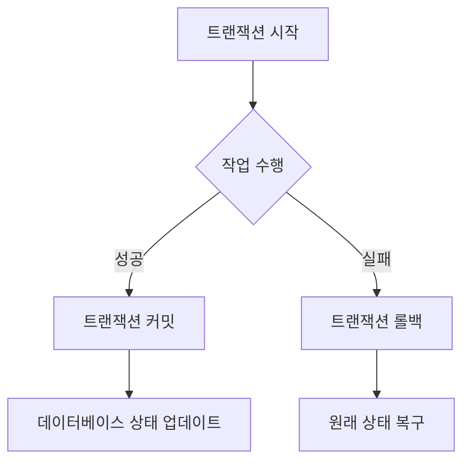

이 다이어그램은 트랜잭션의 시작부터 성공적인 커밋 또는 실패한 롤백까지의 과정을 시각적으로 나타낸 것이다. 데이터베이스 트랜잭션은 이러한 과정을 통해 데이터의 일관성과 무결성을 유지하는 데 기여한다.

<!--
## 2. ACID 속성
   - 2.1 원자성 (Atomicity)
     - 원자성의 정의
     - 원자성의 예시
   - 2.2 일관성 (Consistency)
     - 일관성의 정의
     - 일관성 실패의 예시
   - 2.3 고립성 (Isolation)
     - 고립성의 정의
     - 고립성의 중요성 및 예시
   - 2.4 영구성 (Durability)
     - 영구성의 정의
     - 영구성을 보장하는 방법
-->

## 2. ACID 속성

ACID는 데이터베이스 트랜잭션의 신뢰성을 보장하기 위한 네 가지 속성을 의미한다. 이 속성들은 데이터의 일관성과 무결성을 유지하는 데 중요한 역할을 한다. 아래에서는 각 속성에 대해 자세히 설명하겠다.

**2.1 원자성 (Atomicity)**

**원자성의 정의**  

원자성은 트랜잭션이 완전히 수행되거나 전혀 수행되지 않아야 한다는 속성이다. 즉, 트랜잭션 내의 모든 작업이 성공적으로 완료되어야만 데이터베이스에 반영되며, 하나라도 실패할 경우 모든 작업이 취소되어야 한다.

**원자성의 예시**  

예를 들어, 은행 계좌 간의 송금 트랜잭션을 생각해보자. A 계좌에서 B 계좌로 100원을 송금하는 경우, 두 가지 작업이 필요하다: A 계좌에서 100원을 차감하고 B 계좌에 100원을 추가하는 것이다. 만약 A 계좌에서 100원을 차감하는 작업은 성공했지만, B 계좌에 추가하는 작업이 실패한다면, 원자성에 따라 A 계좌의 차감 작업도 취소되어야 한다.

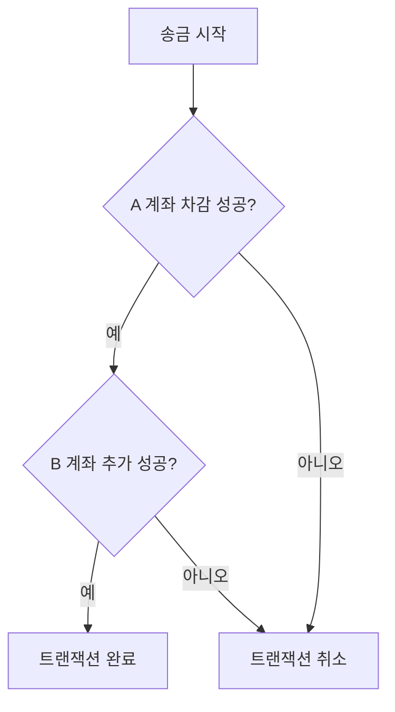

**2.2 일관성 (Consistency)**

**일관성의 정의**  

일관성은 트랜잭션이 완료된 후 데이터베이스가 일관된 상태를 유지해야 한다는 속성이다. 즉, 트랜잭션이 시작되기 전과 후의 데이터 상태가 규칙에 맞아야 하며, 데이터 무결성을 보장해야 한다.

**일관성 실패의 예시**  

예를 들어, 학생의 성적을 관리하는 데이터베이스에서 성적이 100점을 초과할 수 없다는 규칙이 있다고 가정하자. 만약 트랜잭션이 성적을 110점으로 업데이트하려고 시도한다면, 일관성이 깨지게 된다. 이 경우 트랜잭션은 실패해야 하며, 데이터베이스는 이전 상태로 복구되어야 한다.

**2.3 고립성 (Isolation)**

**고립성의 정의**  

고립성은 동시에 실행되는 트랜잭션들이 서로에게 영향을 미치지 않아야 한다는 속성이다. 즉, 한 트랜잭션이 완료되기 전까지 다른 트랜잭션은 그 결과를 볼 수 없어야 한다.

**고립성의 중요성 및 예시**  

고립성은 데이터의 무결성을 유지하는 데 필수적이다. 예를 들어, 두 개의 트랜잭션이 동시에 같은 데이터를 수정하려고 할 때, 고립성이 보장되지 않으면 데이터 충돌이 발생할 수 있다. 이를 방지하기 위해 데이터베이스는 잠금 메커니즘을 사용하여 트랜잭션 간의 충돌을 방지한다.

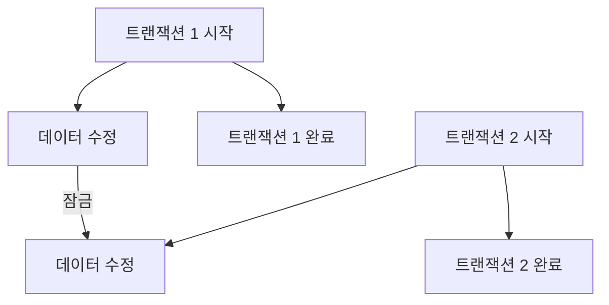

**2.4 영구성 (Durability)**

**영구성의 정의**  

영구성은 트랜잭션이 성공적으로 완료된 후 그 결과가 영구적으로 저장되어야 한다는 속성이다. 즉, 시스템 장애가 발생하더라도 완료된 트랜잭션의 결과는 손실되지 않아야 한다.

**영구성을 보장하는 방법**  

영구성을 보장하기 위해 데이터베이스는 로그 파일을 사용하여 트랜잭션의 모든 변경 사항을 기록한다. 시스템이 장애가 발생하더라도 로그를 통해 이전 상태로 복구할 수 있다. 또한, 데이터베이스는 주기적으로 데이터를 디스크에 플러시하여 영구성을 강화한다. 

이와 같이 ACID 속성은 데이터베이스 트랜잭션의 신뢰성을 보장하는 데 필수적인 요소이다. 각 속성은 서로 연결되어 있으며, 데이터의 일관성과 무결성을 유지하는 데 중요한 역할을 한다.

<!--
## 3. ACID 속성의 구현
   - 3.1 트랜잭션 관리 시스템 (Transaction Management Systems)
   - 3.2 동시성 제어 (Concurrency Control)
     - 잠금 (Locking) vs. 다중 버전 동시성 제어 (Multiversion Concurrency Control)
   - 3.3 분산 트랜잭션 (Distributed Transactions)
     - 2단계 커밋 프로토콜 (Two-Phase Commit Protocol)
-->

## 3. ACID 속성의 구현

ACID 속성을 구현하기 위해서는 여러 가지 기술과 방법론이 필요하다. 이 장에서는 트랜잭션 관리 시스템, 동시성 제어, 그리고 분산 트랜잭션에 대해 살펴보겠다.

**3.1 트랜잭션 관리 시스템 (Transaction Management Systems)**

트랜잭션 관리 시스템은 데이터베이스에서 트랜잭션을 관리하고 ACID 속성을 보장하는 데 중요한 역할을 한다. 이 시스템은 트랜잭션의 시작, 커밋, 롤백을 처리하며, 데이터의 일관성을 유지하기 위해 다양한 알고리즘과 기법을 사용한다. 

트랜잭션 관리 시스템의 주요 기능은 다음과 같다:

- 트랜잭션의 원자성 보장
- 트랜잭션 간의 충돌 방지
- 트랜잭션의 일관성 유지
- 시스템 장애 발생 시 데이터 복구

**3.2 동시성 제어 (Concurrency Control)**

동시성 제어는 여러 트랜잭션이 동시에 실행될 때 데이터의 일관성을 유지하기 위한 기법이다. 동시성 제어는 주로 두 가지 방법으로 구현된다: 잠금 (Locking)과 다중 버전 동시성 제어 (Multiversion Concurrency Control, MVCC)이다.

**잠금 (Locking)**

잠금은 트랜잭션이 데이터에 접근할 때 해당 데이터에 대한 잠금을 설정하여 다른 트랜잭션이 동시에 접근하지 못하도록 하는 방법이다. 이 방법은 데이터의 일관성을 보장하지만, 교착 상태 (Deadlock)와 같은 문제를 발생시킬 수 있다.

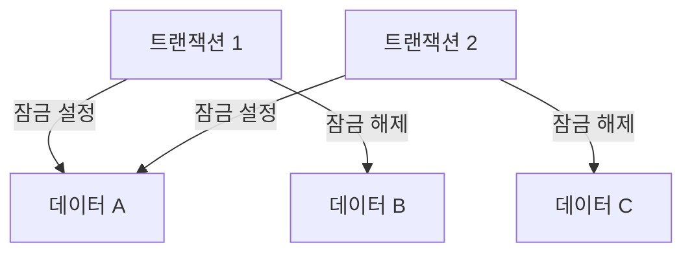

**다중 버전 동시성 제어 (Multiversion Concurrency Control)**

MVCC는 데이터의 여러 버전을 유지하여 트랜잭션이 동시에 실행될 수 있도록 하는 방법이다. 각 트랜잭션은 자신이 시작한 시점의 데이터 버전을 읽고, 다른 트랜잭션의 변경 사항에 영향을 받지 않는다. 이 방법은 교착 상태를 방지하고 성능을 향상시킬 수 있다.

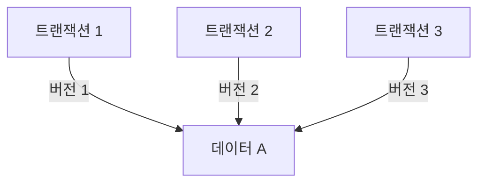

**3.3 분산 트랜잭션 (Distributed Transactions)**

분산 트랜잭션은 여러 데이터베이스에 걸쳐 실행되는 트랜잭션을 의미한다. 이러한 트랜잭션은 ACID 속성을 유지하기 위해 특별한 관리가 필요하다. 

**2단계 커밋 프로토콜 (Two-Phase Commit Protocol)**

2단계 커밋 프로토콜은 분산 트랜잭션의 일관성을 보장하기 위한 방법이다. 이 프로토콜은 두 단계로 구성된다:

1. **준비 단계 (Prepare Phase)**: 모든 참여자 노드가 트랜잭션을 준비하고, 커밋할 수 있는지 확인한다.
2. **커밋 단계 (Commit Phase)**: 모든 참여자가 준비가 완료되면, 트랜잭션을 커밋한다. 만약 한 참여자가 실패하면, 모든 참여자는 롤백된다.

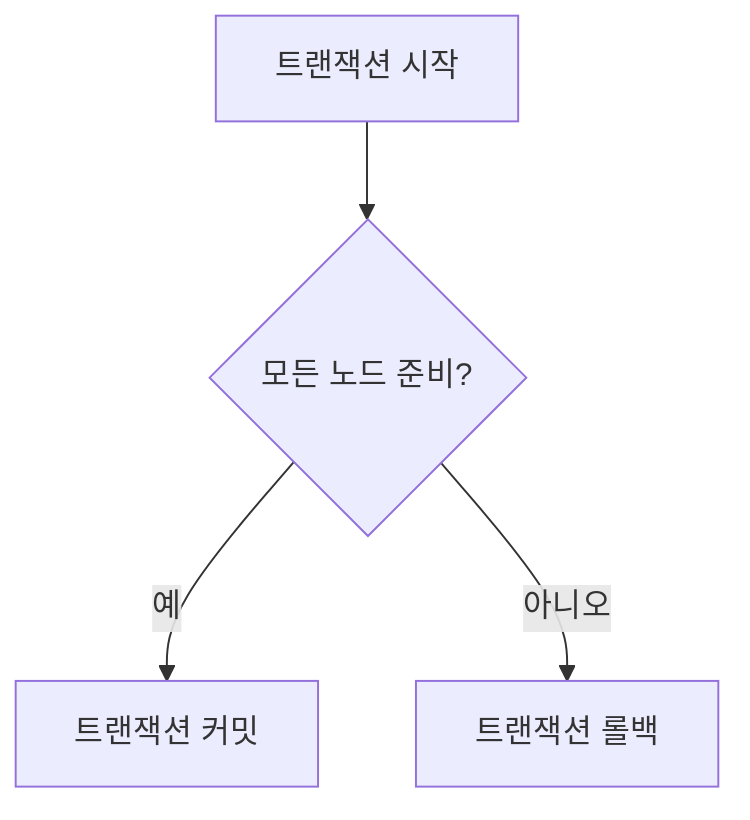

이와 같이 ACID 속성을 구현하기 위한 다양한 방법과 기술이 존재하며, 각 방법은 특정 상황에 따라 장단점이 있다. 이러한 구현 방법을 이해하는 것은 데이터베이스의 신뢰성과 일관성을 유지하는 데 필수적이다.

<!--
## 4. ACID 속성의 장점과 단점
   - 4.1 장점
     - 데이터 일관성
     - 데이터 무결성
     - 동시성 제어
     - 복구 기능
   - 4.2 단점
     - 성능 저하
     - 확장성 문제
     - 복잡성 증가
-->

## 4. ACID 속성의 장점과 단점

ACID 속성은 데이터베이스 트랜잭션의 신뢰성을 보장하는 중요한 요소이다. 이 장에서는 ACID 속성의 장점과 단점에 대해 살펴보겠다.

**4.1 장점**

ACID 속성은 여러 가지 장점을 제공한다.

- **데이터 일관성**: ACID 속성은 데이터베이스의 상태가 항상 일관되도록 보장한다. 트랜잭션이 완료되면 데이터는 항상 정의된 규칙을 따르며, 이는 데이터의 신뢰성을 높인다.

- **데이터 무결성**: ACID 속성은 데이터의 무결성을 유지하는 데 중요한 역할을 한다. 트랜잭션이 실패할 경우, 데이터베이스는 이전 상태로 복구되며, 이는 데이터의 정확성을 보장한다.

- **동시성 제어**: ACID 속성은 여러 사용자가 동시에 데이터베이스에 접근할 때 발생할 수 있는 문제를 해결한다. 이를 통해 데이터의 충돌을 방지하고, 여러 트랜잭션이 동시에 실행될 수 있도록 한다.

- **복구 기능**: ACID 속성은 시스템 장애나 오류 발생 시 데이터베이스를 복구할 수 있는 기능을 제공한다. 트랜잭션이 완료되지 않은 경우, 데이터베이스는 자동으로 이전 상태로 복구된다.

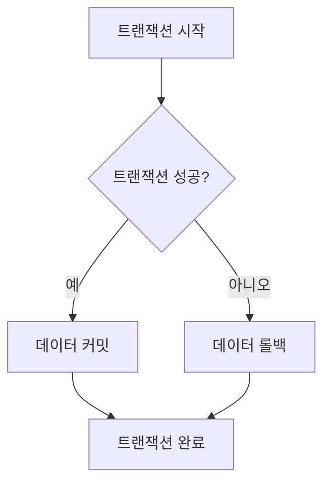

**4.2 단점**

ACID 속성은 장점이 많지만, 몇 가지 단점도 존재한다.

- **성능 저하**: ACID 속성을 유지하기 위해서는 추가적인 오버헤드가 발생한다. 트랜잭션의 원자성을 보장하기 위해 잠금 메커니즘이 필요하며, 이는 성능 저하를 초래할 수 있다.

- **확장성 문제**: ACID 속성을 지원하는 데이터베이스는 일반적으로 수직적 확장에 의존한다. 이는 대규모 데이터베이스 환경에서 확장성을 제한할 수 있다.

- **복잡성 증가**: ACID 속성을 구현하기 위해서는 복잡한 알고리즘과 구조가 필요하다. 이는 시스템의 복잡성을 증가시키고, 유지보수의 어려움을 초래할 수 있다.

이와 같이 ACID 속성은 데이터베이스 트랜잭션의 신뢰성을 높이는 데 기여하지만, 성능과 확장성 측면에서 단점도 존재한다. 이러한 장단점을 고려하여 데이터베이스 설계를 진행해야 한다.

<!--
## 5. ACID 속성과 NoSQL 데이터베이스
   - MongoDB에서의 ACID 속성 처리
   - NoSQL 데이터베이스의 ACID 속성 지원
-->

## 5. ACID 속성과 NoSQL 데이터베이스

NoSQL 데이터베이스는 전통적인 관계형 데이터베이스와는 다른 방식으로 데이터를 저장하고 처리하는 시스템이다. 이러한 데이터베이스는 ACID 속성을 완벽하게 지원하지 않는 경우가 많지만, 특정 상황에서는 ACID 속성을 구현하기 위한 방법을 제공하기도 한다. 이 섹션에서는 MongoDB에서의 ACID 속성 처리와 NoSQL 데이터베이스의 ACID 속성 지원에 대해 살펴보겠다.

**MongoDB에서의 ACID 속성 처리**

MongoDB는 기본적으로 문서 지향 데이터베이스로, ACID 속성을 지원하기 위해 여러 기능을 제공한다. MongoDB 4.0 버전부터는 다중 문서 트랜잭션을 지원하여, 여러 문서에 대한 원자적 작업을 수행할 수 있게 되었다. 이를 통해 데이터의 일관성을 유지하면서도 복잡한 트랜잭션을 처리할 수 있다.

다음은 MongoDB에서 트랜잭션을 사용하는 간단한 예시 코드이다.

```javascript
const session = client.startSession();

session.startTransaction();

try {
    const collection1 = client.db("test").collection("collection1");
    const collection2 = client.db("test").collection("collection2");

    await collection1.insertOne({ name: "Alice" }, { session });
    await collection2.insertOne({ name: "Bob" }, { session });

    await session.commitTransaction();
} catch (error) {
    await session.abortTransaction();
} finally {
    session.endSession();
}
```

위의 코드에서는 두 개의 컬렉션에 데이터를 삽입하는 트랜잭션을 생성하고, 성공적으로 완료되면 커밋하고, 오류가 발생하면 롤백하는 구조이다. 이를 통해 MongoDB에서도 ACID 속성을 구현할 수 있음을 알 수 있다.

**NoSQL 데이터베이스의 ACID 속성 지원**

NoSQL 데이터베이스는 일반적으로 높은 성능과 확장성을 제공하기 위해 ACID 속성을 완벽하게 지원하지 않는 경우가 많다. 대신 BASE (Basically Available, Soft state, Eventually consistent) 모델을 채택하여 데이터의 가용성과 일관성을 조정하는 경향이 있다. 그러나 일부 NoSQL 데이터베이스는 ACID 속성을 지원하기 위한 기능을 제공하기도 한다.

예를 들어, Google Cloud Spanner는 분산 데이터베이스로 ACID 트랜잭션을 지원하며, Amazon DynamoDB는 조건부 쓰기 및 트랜잭션 API를 통해 ACID 속성을 구현할 수 있다. 이러한 데이터베이스는 특정 요구 사항에 따라 ACID 속성을 제공하여, 개발자가 데이터의 일관성을 유지할 수 있도록 돕는다.

다음은 NoSQL 데이터베이스의 ACID 속성 지원을 나타내는 다이어그램이다.

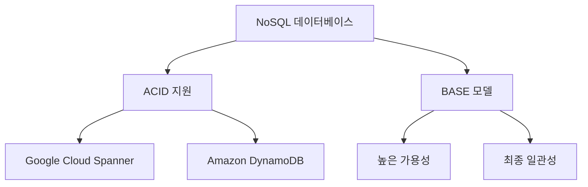

이와 같이 NoSQL 데이터베이스는 ACID 속성을 완벽하게 지원하지 않지만, 특정 기능을 통해 데이터의 일관성을 유지할 수 있는 방법을 제공하고 있다. 이러한 특성은 개발자가 데이터베이스를 선택할 때 중요한 고려 사항이 된다.

<!--
## 6. ACID 속성의 실제 사례
   - 금융 거래에서의 ACID 적용
   - Delta Lake에서의 ACID 트랜잭션
-->

## 6. ACID 속성의 실제 사례

**금융 거래에서의 ACID 적용**

금융 거래는 ACID 속성이 필수적으로 요구되는 분야이다. 금융 시스템에서는 데이터의 정확성과 일관성이 매우 중요하기 때문에, 트랜잭션이 원자성을 유지해야 한다. 예를 들어, 은행 계좌 간의 송금 트랜잭션을 생각해보자. 송금 과정에서 두 계좌의 잔액이 동시에 업데이트되어야 하며, 이 과정에서 하나의 계좌에서 금액이 차감되고 다른 계좌에 금액이 추가되지 않는다면 데이터의 일관성이 깨지게 된다. 

이러한 트랜잭션은 다음과 같은 ACID 속성을 충족해야 한다:

- **원자성 (Atomicity)**: 송금 트랜잭션은 두 개의 작업(차감 및 추가)으로 구성되며, 이 두 작업이 모두 성공해야만 트랜잭션이 완료된다. 만약 하나의 작업이 실패하면 전체 트랜잭션이 롤백되어야 한다.
- **일관성 (Consistency)**: 트랜잭션이 완료된 후, 모든 계좌의 잔액은 일관된 상태를 유지해야 한다.
- **고립성 (Isolation)**: 동시에 여러 사용자가 송금 트랜잭션을 수행할 때, 각 트랜잭션은 서로 영향을 미치지 않아야 한다.
- **영구성 (Durability)**: 트랜잭션이 성공적으로 완료되면, 그 결과는 영구적으로 저장되어야 하며 시스템 장애가 발생하더라도 손실되지 않아야 한다.

다음은 송금 트랜잭션의 흐름을 나타내는 다이어그램이다:

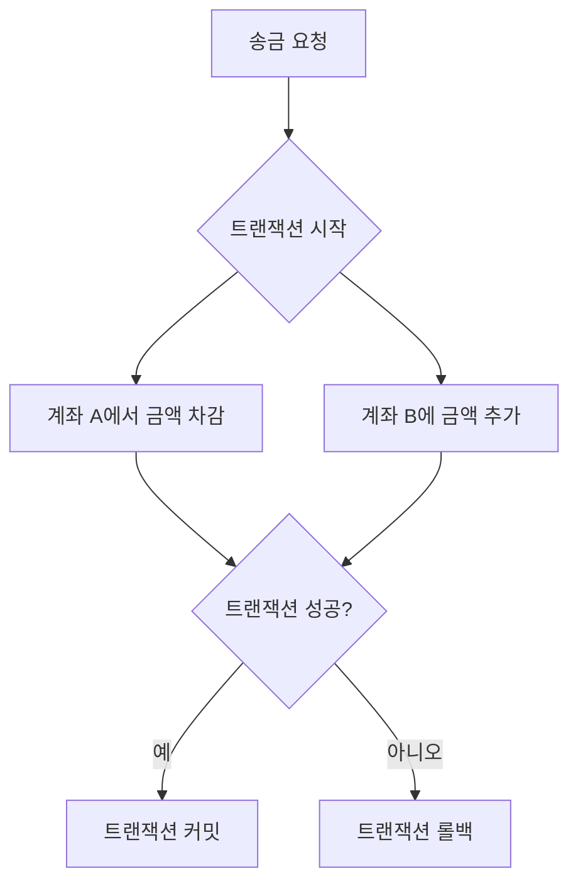

**Delta Lake에서의 ACID 트랜잭션**

Delta Lake는 데이터 레이크에 ACID 트랜잭션을 제공하는 오픈 소스 스토리지 레이어이다. Delta Lake는 Apache Spark와 통합되어 대규모 데이터 처리 및 분석을 지원하며, ACID 속성을 통해 데이터의 신뢰성을 높인다. Delta Lake의 ACID 트랜잭션은 다음과 같은 방식으로 작동한다:

- **원자성 (Atomicity)**: Delta Lake는 모든 데이터 변경 작업을 원자적으로 수행하여, 작업이 완료되지 않으면 이전 상태로 롤백된다.
- **일관성 (Consistency)**: Delta Lake는 데이터의 일관성을 보장하기 위해 스냅샷 기반의 데이터 관리를 사용한다. 이를 통해 데이터의 상태가 항상 일관되도록 유지된다.
- **고립성 (Isolation)**: Delta Lake는 동시성 제어를 통해 여러 사용자가 동시에 데이터에 접근하더라도 각 트랜잭션이 독립적으로 수행되도록 한다.
- **영구성 (Durability)**: Delta Lake는 데이터 변경 사항을 로그에 기록하여, 시스템 장애가 발생하더라도 데이터의 영구성을 보장한다.

Delta Lake의 ACID 트랜잭션을 활용하면 데이터 레이크에서의 데이터 처리 및 분석이 더욱 안전하고 신뢰성 있게 이루어질 수 있다. 이러한 특성 덕분에 Delta Lake는 데이터 엔지니어링 및 데이터 과학 분야에서 널리 사용되고 있다.

<!--
## 7. FAQ
   - ACID와 BASE의 차이점은 무엇인가요?
   - ACID 속성이 없는 데이터베이스는 어떤 경우에 사용되나요?
   - ACID 속성을 구현하기 위한 최선의 방법은 무엇인가요?
-->

## 7. FAQ

**ACID와 BASE의 차이점은 무엇인가요?**  

ACID와 BASE는 데이터베이스 트랜잭션 처리의 두 가지 주요 패러다임이다. ACID는 원자성(Atomicity), 일관성(Consistency), 고립성(Isolation), 영구성(Durability)의 네 가지 속성을 강조하며, 데이터의 무결성과 일관성을 보장하는 데 중점을 둔다. 반면 BASE는 Basically Available, Soft state, Eventually consistent의 약자로, 데이터의 가용성과 성능을 우선시하며, 일관성은 최종적으로 보장된다는 개념이다. BASE는 주로 NoSQL 데이터베이스에서 사용되며, 대규모 분산 시스템에서의 유연성을 제공한다.

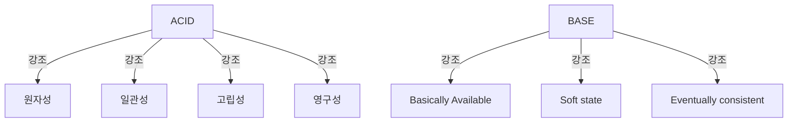

**ACID 속성이 없는 데이터베이스는 어떤 경우에 사용되나요?**  

ACID 속성이 없는 데이터베이스는 주로 높은 성능과 확장성이 요구되는 경우에 사용된다. 예를 들어, 소셜 미디어 플랫폼이나 대규모 로그 데이터 처리 시스템에서는 데이터의 일관성보다 가용성과 성능이 더 중요할 수 있다. 이러한 시스템에서는 BASE 모델을 채택하여 데이터의 일관성을 최종적으로 보장하는 방식으로 운영된다. 또한, 실시간 데이터 분석이나 IoT(Internet of Things) 환경에서도 ACID 속성이 없는 데이터베이스가 유용하게 사용될 수 있다.

**ACID 속성을 구현하기 위한 최선의 방법은 무엇인가요?**  

ACID 속성을 구현하기 위한 최선의 방법은 트랜잭션 관리 시스템(Transaction Management Systems)을 사용하는 것이다. 이러한 시스템은 트랜잭션의 원자성을 보장하기 위해 로그를 기록하고, 일관성을 유지하기 위해 제약 조건을 설정하며, 고립성을 확보하기 위해 동시성 제어 메커니즘을 적용한다. 또한, 영구성을 보장하기 위해 데이터베이스의 백업 및 복구 전략을 수립하는 것이 중요하다. 

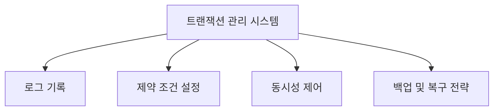

이와 같은 방법들을 통해 ACID 속성을 효과적으로 구현할 수 있으며, 데이터베이스의 신뢰성과 안정성을 높일 수 있다.

<!--
## 8. 관련 기술
   - 트랜잭션 처리 시스템 (Transaction Processing Systems)
   - 데이터베이스 관리 시스템 (Database Management Systems)
   - 분산 데이터베이스 (Distributed Databases)
-->

## 8. 관련 기술

**트랜잭션 처리 시스템 (Transaction Processing Systems)**  

트랜잭션 처리 시스템은 데이터베이스에서 트랜잭션을 관리하고 처리하는 시스템이다. 이러한 시스템은 ACID 속성을 보장하여 데이터의 일관성과 무결성을 유지하는 데 중요한 역할을 한다. 트랜잭션 처리 시스템은 일반적으로 온라인 거래 처리(OLTP) 시스템에서 사용되며, 대량의 트랜잭션을 신속하게 처리할 수 있도록 설계되어 있다.

트랜잭션 처리 시스템의 주요 기능은 다음과 같다:
- 트랜잭션의 시작과 종료 관리
- 트랜잭션의 원자성 보장
- 동시성 제어 및 충돌 방지
- 장애 발생 시 복구 기능 제공

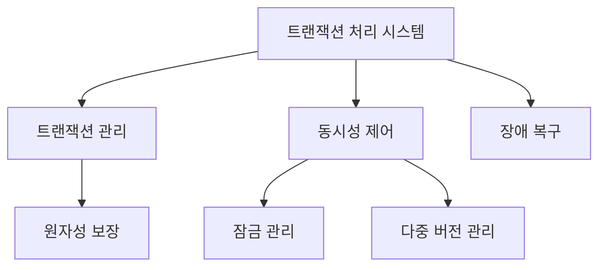

**데이터베이스 관리 시스템 (Database Management Systems)**  

데이터베이스 관리 시스템(DBMS)은 데이터베이스를 생성, 관리 및 조작하는 소프트웨어이다. DBMS는 데이터의 저장, 검색, 수정 및 삭제를 위한 다양한 기능을 제공하며, ACID 속성을 통해 데이터의 무결성을 보장한다. DBMS는 관계형 데이터베이스(RDBMS)와 비관계형 데이터베이스(NoSQL)로 나눌 수 있다.

DBMS의 주요 기능은 다음과 같다:
- 데이터 정의 및 데이터 조작 언어 지원
- 데이터 보안 및 접근 제어
- 데이터 백업 및 복구
- 트랜잭션 관리 및 ACID 속성 지원

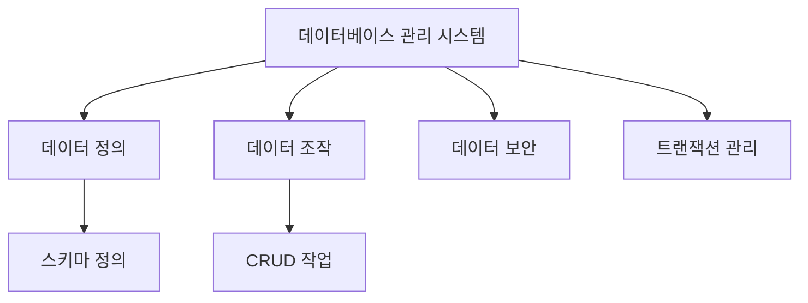

**분산 데이터베이스 (Distributed Databases)**  

분산 데이터베이스는 여러 물리적 위치에 분산되어 있는 데이터베이스로, 데이터의 저장 및 처리를 여러 서버에 분산하여 수행한다. 이러한 시스템은 데이터의 가용성과 성능을 향상시키기 위해 설계되었으며, ACID 속성을 유지하기 위한 다양한 기술이 필요하다.

분산 데이터베이스의 주요 특징은 다음과 같다:
- 데이터의 분산 저장
- 데이터의 일관성 유지
- 장애 발생 시 데이터 복구
- 동시성 제어 및 트랜잭션 관리

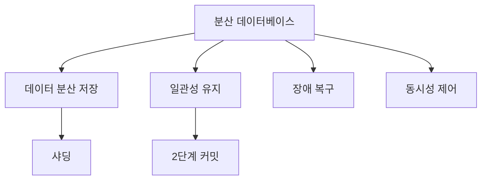

이와 같이 트랜잭션 처리 시스템, 데이터베이스 관리 시스템, 분산 데이터베이스는 ACID 속성을 지원하고 데이터의 무결성을 보장하는 데 중요한 역할을 한다. 이러한 기술들은 현대의 데이터베이스 환경에서 필수적인 요소로 자리 잡고 있다.

<!--
## 9. 결론
   - ACID 속성의 중요성 요약
   - 미래의 데이터베이스 트랜잭션 처리 방향
-->

## 9. 결론

**ACID 속성의 중요성 요약**  

ACID 속성은 데이터베이스 트랜잭션의 신뢰성과 일관성을 보장하는 핵심 요소이다. 원자성(Atomicity)은 트랜잭션이 완전히 수행되거나 전혀 수행되지 않도록 보장하며, 일관성(Consistency)은 데이터베이스의 상태가 항상 유효한 상태로 유지되도록 한다. 고립성(Isolation)은 동시에 실행되는 트랜잭션 간의 간섭을 방지하고, 영구성(Durability)은 트랜잭션이 성공적으로 완료된 후 그 결과가 영구적으로 저장되도록 보장한다. 이러한 속성들은 특히 금융 거래와 같은 중요한 시스템에서 데이터 무결성을 유지하는 데 필수적이다.

**미래의 데이터베이스 트랜잭션 처리 방향**  

미래의 데이터베이스 트랜잭션 처리 방향은 ACID 속성을 유지하면서도 성능과 확장성을 개선하는 데 중점을 두고 있다. NoSQL 데이터베이스의 발전과 함께 ACID 속성을 지원하는 다양한 기술들이 등장하고 있으며, 이는 분산 시스템에서도 데이터 일관성을 유지할 수 있는 방법을 제공한다. 또한, 클라우드 기반 데이터베이스 서비스의 확산으로 인해 데이터베이스 트랜잭션 처리의 유연성과 접근성이 더욱 향상될 것으로 예상된다.

다음은 ACID 속성을 강조하는 다이어그램이다:

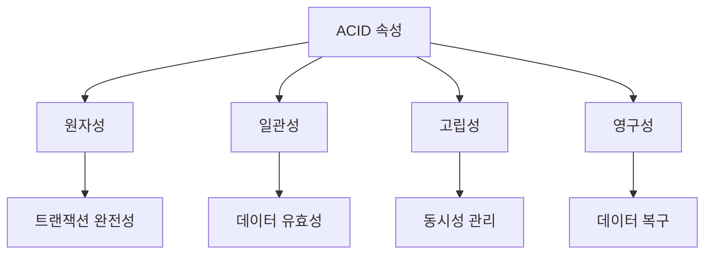

이러한 방향성은 데이터베이스 기술의 발전과 함께 지속적으로 변화할 것이며, 데이터의 안전성과 신뢰성을 더욱 강화하는 데 기여할 것이다. ACID 속성은 앞으로도 데이터베이스 설계와 운영에서 중요한 역할을 할 것이며, 이를 통해 더욱 안전하고 효율적인 데이터 관리가 가능해질 것이다.

<!--
## 10. 참고 자료
   - 관련 논문 및 자료 링크
   - 추가 학습 자료 및 리소스
-->

## 10. 참고 자료

**관련 논문 및 자료 링크**  
ACID 속성과 관련된 다양한 연구와 자료를 통해 더 깊이 있는 이해를 도울 수 있다. 다음은 유용한 논문 및 자료 링크이다.

1. **"The Transaction Concept: Virtues and Limitations"**  
   이 논문은 트랜잭션의 개념과 ACID 속성의 중요성을 다룬다. [링크](https://jimgray.azurewebsites.net/papers/thetransactionconcept.pdf)

2. **"Concurrency Control in Distributed Database Systems"**  
   분산 데이터베이스에서의 동시성 제어에 대한 심도 있는 논의가 포함되어 있다. [링크](https://people.eecs.berkeley.edu/~brewer/cs262/concurrency-distributed-databases.pdf)

3. **"A Survey of NoSQL Databases"**  
   NoSQL 데이터베이스의 다양한 유형과 ACID 속성의 지원 여부를 비교한 자료이다. [링크](https://ieeexplore.ieee.org/document/6106531)

** 추가 학습 자료 및 리소스 **  
ACID 속성을 더 잘 이해하고 적용하기 위한 추가 학습 자료는 다음과 같다.

- **온라인 강의**  
  Coursera와 edX와 같은 플랫폼에서 데이터베이스 트랜잭션과 ACID 속성에 대한 강의를 수강할 수 있다.

- **도서**  
  "Database System Concepts"와 같은 교재는 ACID 속성에 대한 깊이 있는 설명을 제공한다.

- **블로그 및 포럼**  
  Stack Overflow와 같은 개발자 커뮤니티에서 ACID 속성과 관련된 질문과 답변을 찾아볼 수 있다.

**샘플 코드**  

다음은 ACID 속성을 구현하는 간단한 SQL 트랜잭션의 예시이다.

```sql
BEGIN TRANSACTION;

UPDATE accounts
SET balance = balance - 100
WHERE account_id = '12345';

UPDATE accounts
SET balance = balance + 100
WHERE account_id = '67890';

COMMIT;
```

이 코드는 두 개의 계좌 간에 100 단위의 금액을 이체하는 트랜잭션을 보여준다. 이 과정에서 원자성, 일관성, 고립성, 영구성이 모두 보장된다.

**다이어그램**  

다음은 ACID 속성을 시각적으로 설명하는 다이어그램이다.

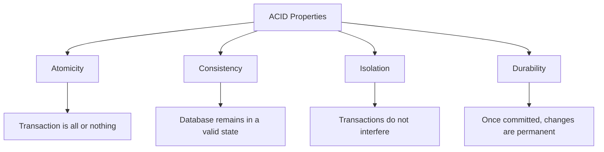

이 다이어그램은 ACID 속성의 각 요소와 그 의미를 간단히 설명한다. ACID 속성은 데이터베이스 트랜잭션의 신뢰성을 보장하는 중요한 요소이다.

<!--
##### Reference #####
-->

## Reference


* [https://en.wikipedia.org/wiki/ACID](https://en.wikipedia.org/wiki/ACID)
* [https://chrisjune-13837.medium.com/db-transaction-%EA%B3%BC-acid%EB%9E%80-45a785403f9e](https://chrisjune-13837.medium.com/db-transaction-%EA%B3%BC-acid%EB%9E%80-45a785403f9e)
* [https://blog.yevgnenll.me/posts/what-is-acid-about-transaction](https://blog.yevgnenll.me/posts/what-is-acid-about-transaction)
* [https://www.mongodb.com/resources/basics/databases/acid-transactions](https://www.mongodb.com/resources/basics/databases/acid-transactions)
* [https://www.geeksforgeeks.org/acid-properties-in-dbms/](https://www.geeksforgeeks.org/acid-properties-in-dbms/)
* [https://www.databricks.com/glossary/acid-transactions#:~:text=ACID%20is%20an%20acronym%20that,operations%20are%20called%20transactional%20systems.](https://www.databricks.com/glossary/acid-transactions#:~:text=ACID%20is%20an%20acronym%20that,operations%20are%20called%20transactional%20systems.)

