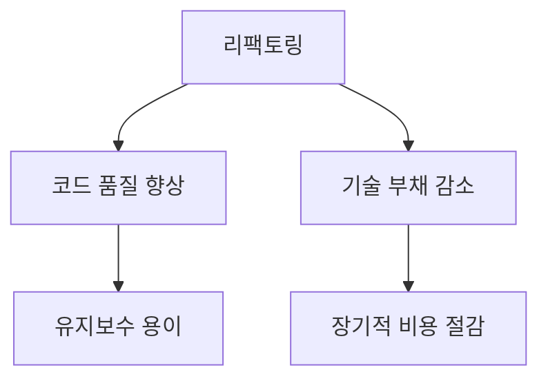
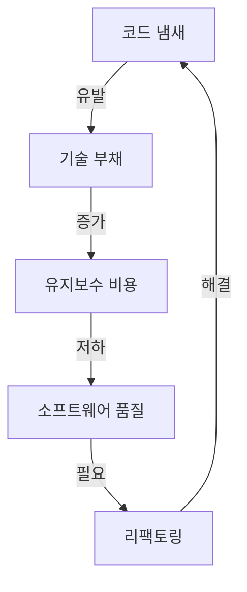
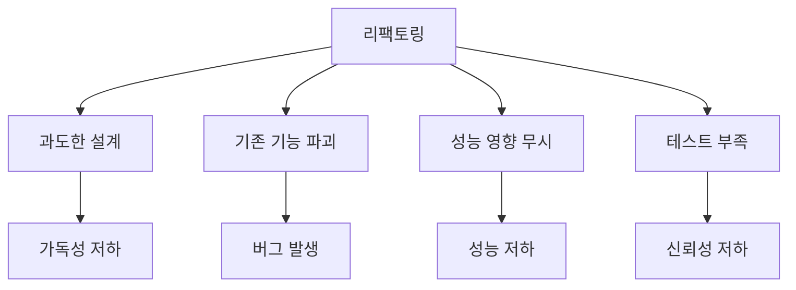
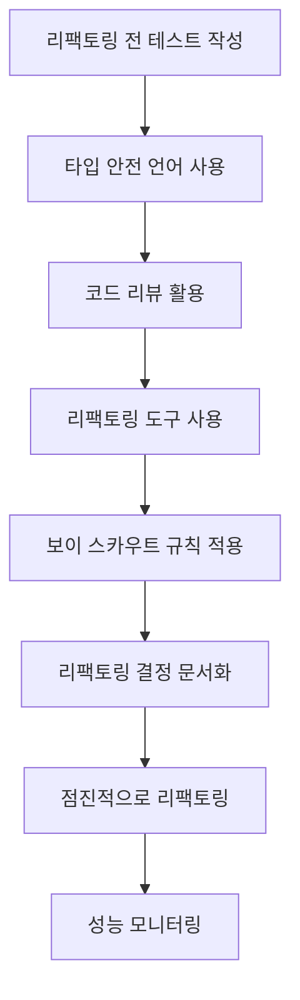
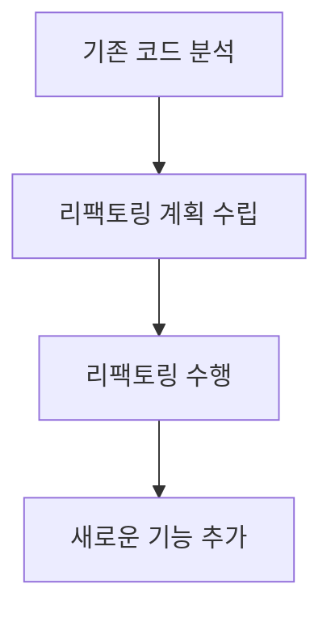
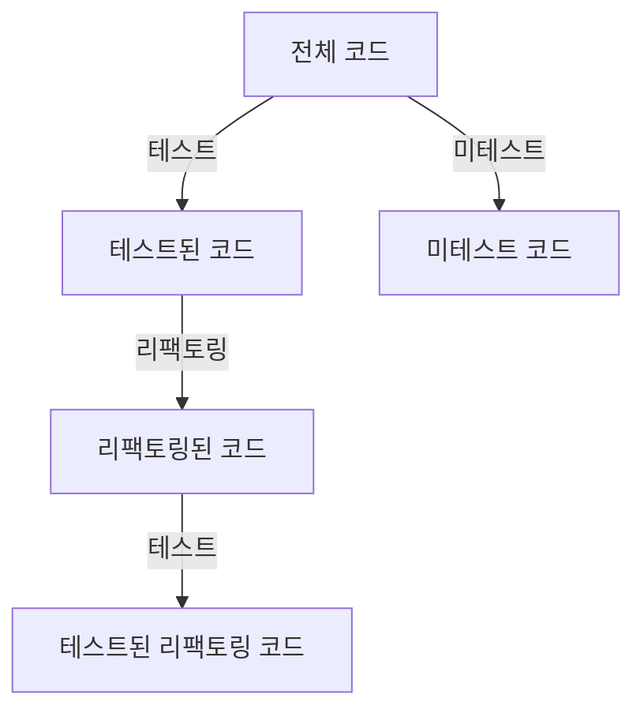
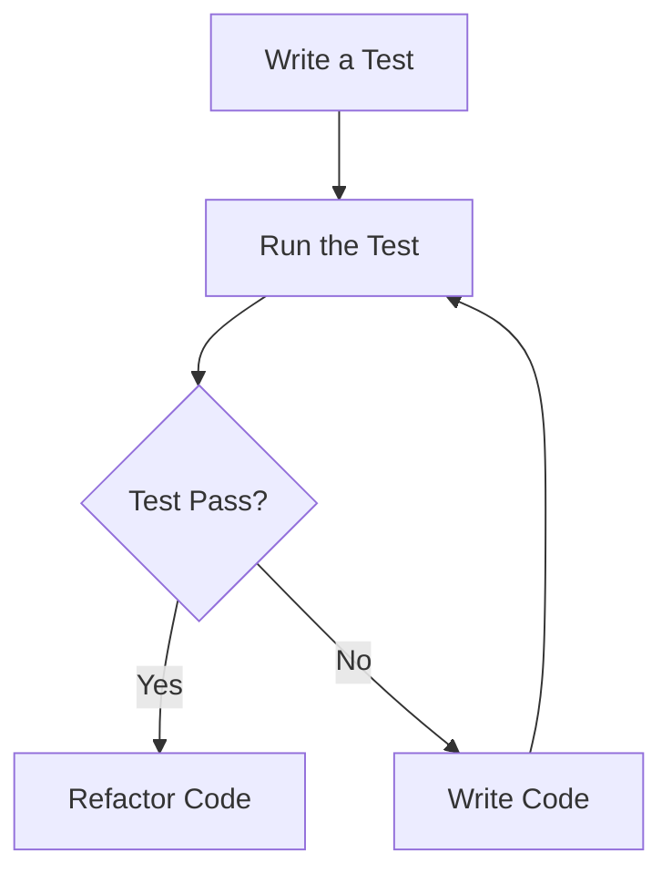
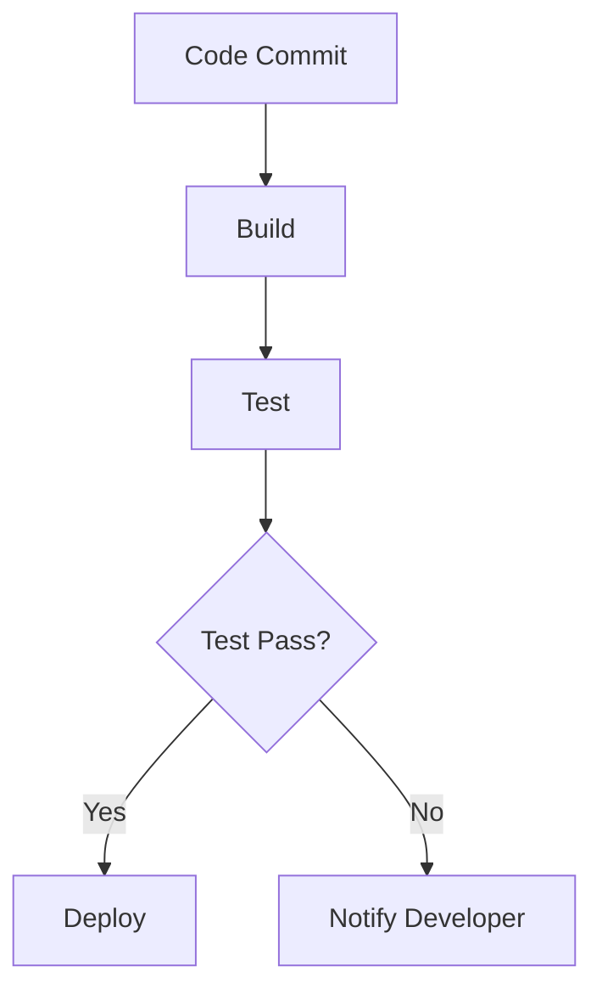
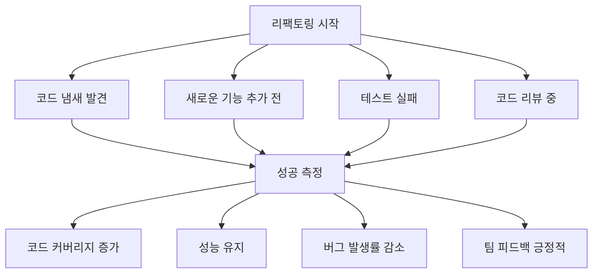

소프트웨어 개발에서 리팩토링(refactoring)은 코드의 내부 구조를 개선하는 중요한 과정이다. 리팩토링의 목표는 기존 코드의 외부 동작을 변경하지 않으면서 코드의 가독성, 유지보수성 및 성능을 향상시키는 것이다. 이는 소프트웨어의 품질을 높이고 기술 부채(technical debt)를 줄이는 데 기여한다. 리팩토링은 단순히 코드를 정리하는 것이 아니라, 코드의 복잡성을 줄이고, 중복을 제거하며, 모듈화를 촉진하는 등의 다양한 이점을 제공한다. 그러나 리팩토링은 신중하게 접근해야 하며, 잘못된 리팩토링은 버그를 유발하거나 성능을 저하시킬 수 있다. 따라서 리팩토링을 수행할 때는 항상 테스트를 작성하고, 코드 리뷰를 통해 다른 개발자와 협력하는 것이 중요하다. 또한, 리팩토링은 점진적으로 이루어져야 하며, 코드의 품질을 지속적으로 개선하기 위한 문화가 필요하다. 이 글에서는 리팩토링의 중요성과 모범 사례를 살펴보며, 효과적인 리팩토링을 위한 전략과 도구를 소개할 것이다.


||
|:---:|
||


<!--
##### Outline #####
-->

<!--
# 목차

## 1. 개요
   - 리팩토링의 정의
   - 리팩토링의 중요성
   - 리팩토링과 기술 부채(Technical Debt)

## 2. 리팩토링 이해하기
   - 리팩토링의 목표
   - 코드 냄새(Code Smells)와 기술 부채의 관계

## 3. 좋은 리팩토링 관행
   - 3.1 점진적 변화(Incremental Changes)
   - 3.2 동작 보존(Preserving Behavior)
   - 3.3 코드 품질 향상(Improving Code Quality)
   - 3.4 성능 유지(Maintaining Performance)

## 4. 나쁜 리팩토링 관행
   - 4.1 과도한 설계(Overengineering)
   - 4.2 기존 기능 파괴(Breaking Existing Functionality)
   - 4.3 성능 영향 무시(Ignoring Performance Impact)
   - 4.4 테스트 부족(Lack of Testing)

## 5. 리팩토링을 위한 팁과 도구
   - 5.1 리팩토링 전 테스트 작성
   - 5.2 타입 안전 언어 또는 타입 힌트 사용
   - 5.3 코드 리뷰 활용
   - 5.4 리팩토링 도구 사용
   - 5.5 보이 스카우트 규칙(Boy Scout Rule) 적용
   - 5.6 리팩토링 결정 문서화
   - 5.7 점진적으로 리팩토링
   - 5.8 성능 모니터링

## 6. 리팩토링의 시기와 필요성
   - 리팩토링이 필요한 상황
   - 새로운 기능 추가 전 리팩토링
   - 코드 리뷰 중 리팩토링 기회

## 7. 리팩토링의 효과 측정
   - 코드 커버리지(Code Coverage) 모니터링
   - 성능 모니터링 및 오류 추적
   - 팀 피드백 수집

## 8. 개인적인 리팩토링 경험
   - 리팩토링의 장단점
   - 리팩토링의 실제 사례

## 9. 결론
   - 리팩토링의 지속적인 중요성
   - 리팩토링과 비즈니스 가치의 균형
   - 리팩토링을 통한 코드 품질 향상

## 10. 관련 기술
   - 테스트 주도 개발(Test-Driven Development, TDD)
   - 지속적 통합(Continuous Integration, CI)
   - 코드 품질 도구 및 프레임워크

## 11. FAQ
   - 리팩토링과 버그 수정의 차이점은 무엇인가요?
   - 리팩토링을 언제 시작해야 하나요?
   - 리팩토링의 성공을 어떻게 측정하나요? 

이 목차는 리팩토링에 대한 포괄적인 이해를 제공하며, 관련된 기술과 실용적인 팁을 포함하여 독자가 리팩토링을 효과적으로 수행할 수 있도록 돕습니다.
-->

<!--
## 1. 개요
   - 리팩토링의 정의
   - 리팩토링의 중요성
   - 리팩토링과 기술 부채(Technical Debt)
-->

## 1. 개요

리팩토링은 소프트웨어 개발에서 코드의 구조를 개선하는 과정을 의미한다. 이 과정은 기존의 기능을 변경하지 않으면서 코드의 가독성, 유지보수성, 성능 등을 향상시키는 데 중점을 둔다. 리팩토링은 단순히 코드를 수정하는 것이 아니라, 코드의 품질을 높이고, 향후 개발 작업을 더 용이하게 만드는 중요한 작업이다.

**리팩토링의 정의**  
리팩토링은 "코드를 더 나은 상태로 만드는 과정"이라고 정의할 수 있다. 이는 코드의 기능을 변경하지 않으면서, 코드의 구조를 개선하고, 중복을 제거하며, 불필요한 복잡성을 줄이는 작업을 포함한다. 예를 들어, 다음과 같은 간단한 코드가 있다고 가정하자.

```python
def calculate_area(radius):
    return 3.14 * radius * radius
```

위 코드는 원의 면적을 계산하는 함수이다. 이 코드를 리팩토링하여 상수를 변수로 바꾸고, 더 명확한 이름을 부여할 수 있다.

```python
def calculate_area(radius):
    PI = 3.14
    return PI * radius * radius
```

이렇게 리팩토링을 통해 코드의 가독성을 높일 수 있다.

**리팩토링의 중요성**  

리팩토링은 소프트웨어 개발에서 매우 중요한 역할을 한다. 코드가 시간이 지남에 따라 복잡해지고, 새로운 기능이 추가되면서 코드의 품질이 저하될 수 있다. 이러한 상황에서 리팩토링은 코드의 품질을 유지하고, 기술 부채를 줄이는 데 기여한다. 또한, 리팩토링을 통해 개발자는 더 나은 코드 구조를 갖게 되어, 향후 유지보수 및 기능 추가 작업이 용이해진다.

**리팩토링과 기술 부채(Technical Debt)**  

기술 부채는 소프트웨어 개발에서 발생하는 비효율적인 코드나 설계 결정을 의미한다. 이는 단기적인 이익을 위해 장기적인 유지보수 비용을 증가시키는 결과를 초래할 수 있다. 리팩토링은 이러한 기술 부채를 해결하는 방법 중 하나이다. 리팩토링을 통해 코드의 품질을 개선하고, 기술 부채를 줄임으로써, 개발팀은 더 나은 소프트웨어를 제공할 수 있다.



위 다이어그램은 리팩토링이 코드 품질 향상과 기술 부채 감소에 어떻게 기여하는지를 보여준다. 리팩토링은 소프트웨어 개발의 필수적인 과정이며, 이를 통해 개발자는 더 나은 소프트웨어를 만들 수 있다.

<!--
## 2. 리팩토링 이해하기
   - 리팩토링의 목표
   - 코드 냄새(Code Smells)와 기술 부채의 관계
-->

## 2. 리팩토링 이해하기

리팩토링은 소프트웨어 개발 과정에서 코드의 구조를 개선하는 작업이다. 이 과정은 코드의 기능을 변경하지 않으면서도 가독성과 유지보수성을 높이는 데 중점을 둔다. 리팩토링의 목표는 다음과 같다.

**리팩토링의 목표**

리팩토링의 주요 목표는 다음과 같다.

1. **가독성 향상**: 코드가 명확하고 이해하기 쉽게 만들어, 다른 개발자들이 쉽게 이해하고 수정할 수 있도록 한다.
2. **유지보수성 향상**: 코드의 구조를 개선하여, 향후 기능 추가나 수정이 용이하도록 한다.
3. **버그 감소**: 코드의 복잡성을 줄여, 잠재적인 버그를 사전에 예방한다.
4. **성능 최적화**: 필요에 따라 성능을 개선할 수 있는 기회를 제공한다.

리팩토링은 이러한 목표를 달성하기 위해 다양한 기법과 패턴을 활용한다. 예를 들어, 중복 코드를 제거하거나, 함수의 크기를 줄이는 등의 방법이 있다.

**코드 냄새(Code Smells)와 기술 부채의 관계**

코드 냄새는 코드에서 발견되는 문제의 징후로, 리팩토링이 필요한 상황을 나타낸다. 코드 냄새는 다음과 같은 형태로 나타날 수 있다.

- **중복 코드**: 동일한 코드가 여러 곳에 존재하는 경우
- **긴 메서드**: 하나의 메서드가 너무 많은 일을 수행하는 경우
- **불명확한 변수명**: 변수명이 그 역할을 명확히 설명하지 못하는 경우

이러한 코드 냄새는 기술 부채(Technical Debt)와 밀접한 관계가 있다. 기술 부채는 소프트웨어 개발에서 단기적인 이익을 위해 장기적인 유지보수 비용을 증가시키는 요소를 의미한다. 코드 냄새가 많을수록 기술 부채가 쌓이게 되고, 이는 결국 소프트웨어의 품질 저하로 이어진다.

리팩토링을 통해 코드 냄새를 제거하면 기술 부채를 줄일 수 있으며, 이는 소프트웨어의 전반적인 품질을 향상시키는 데 기여한다.

다음은 코드 냄새와 기술 부채의 관계를 나타내는 다이어그램이다.



리팩토링은 코드 냄새를 해결하고 기술 부채를 줄이는 중요한 과정이다. 이를 통해 소프트웨어의 품질을 지속적으로 유지하고 향상시킬 수 있다.

<!--
## 3. 좋은 리팩토링 관행
   - 3.1 점진적 변화(Incremental Changes)
   - 3.2 동작 보존(Preserving Behavior)
   - 3.3 코드 품질 향상(Improving Code Quality)
   - 3.4 성능 유지(Maintaining Performance)
-->

## 3. 좋은 리팩토링 관행

리팩토링은 코드의 품질을 향상시키고 유지보수를 용이하게 하기 위한 중요한 과정이다. 이 과정에서 지켜야 할 몇 가지 좋은 관행이 있다.

**3.1 점진적 변화(Incremental Changes)**  

리팩토링은 한 번에 대규모로 진행하기보다는 점진적으로 이루어져야 한다. 작은 단위로 변경을 적용하면, 코드의 동작을 쉽게 검증할 수 있으며, 문제가 발생했을 때 원인을 파악하기가 용이하다. 예를 들어, 다음과 같은 간단한 리팩토링을 고려해보자.

```python
# 리팩토링 전
def calculate_area(radius):
    return 3.14 * radius * radius

# 리팩토링 후
def calculate_area(radius):
    pi = 3.14
    return pi * radius * radius
```

위의 예시에서, `pi` 값을 변수로 분리하여 코드의 가독성을 높였다. 이러한 점진적인 변화는 코드의 품질을 향상시키는 데 기여한다.

**3.2 동작 보존(Preserving Behavior)** 

리팩토링의 가장 중요한 원칙 중 하나는 기존의 기능이 변경되지 않도록 하는 것이다. 즉, 코드의 동작을 보존해야 한다. 이를 위해서는 리팩토링 전후에 충분한 테스트를 수행해야 한다. 예를 들어, 다음과 같은 테스트 케이스를 작성할 수 있다.

```python
def test_calculate_area():
    assert calculate_area(1) == 3.14
    assert calculate_area(2) == 12.56
```

이러한 테스트를 통해 리팩토링 후에도 기존의 동작이 유지되는지 확인할 수 있다.

**3.3 코드 품질 향상(Improving Code Quality)** 

리팩토링의 목적 중 하나는 코드 품질을 향상시키는 것이다. 이를 위해 코드의 가독성을 높이고, 중복을 제거하며, 명확한 변수 및 함수 이름을 사용하는 것이 중요하다. 예를 들어, 다음과 같은 코드를 고려해보자.

```python
# 리팩토링 전
def f(x):
    return x * 2

# 리팩토링 후
def double_value(value):
    return value * 2
```

위의 예시에서 함수 이름을 명확하게 변경하여 코드의 의도를 분명히 했다. 이러한 작은 변화들이 모여 코드 품질을 크게 향상시킬 수 있다.

**3.4 성능 유지(Maintaining Performance)**  

리팩토링을 진행할 때 성능을 고려하는 것도 중요하다. 코드의 구조를 변경하면서 성능이 저하되지 않도록 주의해야 한다. 예를 들어, 다음과 같은 코드에서 성능을 유지하기 위해 최적화를 고려할 수 있다.

```python
# 리팩토링 전
def get_even_numbers(numbers):
    return [num for num in numbers if num % 2 == 0]

# 리팩토링 후
def get_even_numbers(numbers):
    even_numbers = []
    for num in numbers:
        if num % 2 == 0:
            even_numbers.append(num)
    return even_numbers
```

위의 예시에서 리스트 컴프리헨션을 사용한 코드가 성능에 영향을 미칠 수 있으므로, 명시적인 루프를 사용하여 성능을 유지할 수 있다. 이러한 성능 유지 관행은 리팩토링 과정에서 반드시 고려해야 할 요소이다.

이와 같은 좋은 리팩토링 관행을 따르면, 코드의 품질을 높이고 유지보수를 용이하게 할 수 있다. 리팩토링은 단순한 코드 수정이 아니라, 코드의 가치를 높이는 중요한 과정임을 잊지 말아야 한다.

<!--
## 4. 나쁜 리팩토링 관행
   - 4.1 과도한 설계(Overengineering)
   - 4.2 기존 기능 파괴(Breaking Existing Functionality)
   - 4.3 성능 영향 무시(Ignoring Performance Impact)
   - 4.4 테스트 부족(Lack of Testing)
-->

## 4. 나쁜 리팩토링 관행

리팩토링은 코드 품질을 향상시키기 위한 중요한 과정이지만, 잘못된 접근 방식은 오히려 문제를 악화시킬 수 있다. 이 섹션에서는 나쁜 리팩토링 관행에 대해 살펴보겠다.

**4.1 과도한 설계(Overengineering)**

과도한 설계는 불필요하게 복잡한 구조를 만드는 것을 의미한다. 이는 코드의 가독성을 떨어뜨리고 유지보수를 어렵게 만든다. 예를 들어, 단순한 기능을 구현하기 위해 너무 많은 추상화나 패턴을 적용하는 경우가 이에 해당한다. 

```python
# 과도한 설계의 예
class User:
    def __init__(self, name):
        self.name = name

class UserService:
    def __init__(self, user):
        self.user = user

    def get_user_name(self):
        return self.user.name

# 단순한 기능을 위해 너무 많은 클래스를 사용하고 있다.
```

**4.2 기존 기능 파괴(Breaking Existing Functionality)**

리팩토링의 목적은 기존 기능을 유지하면서 코드를 개선하는 것이다. 그러나 리팩토링 과정에서 기존 기능이 의도치 않게 파괴되는 경우가 있다. 이는 테스트가 부족하거나, 변경 사항에 대한 충분한 검토가 이루어지지 않았을 때 발생할 수 있다.

```python
# 기존 기능을 파괴하는 리팩토링의 예
def calculate_discount(price, discount):
    return price - (price * discount)

# 리팩토링 후, 기존 기능이 변경됨
def calculate_discount(price, discount, is_member=False):
    if is_member:
        discount += 0.1  # 회원 할인 추가
    return price - (price * discount)
```

**4.3 성능 영향 무시(Ignoring Performance Impact)**

리팩토링 과정에서 성능에 대한 고려가 부족하면, 오히려 성능이 저하될 수 있다. 예를 들어, 불필요한 반복문이나 비효율적인 알고리즘을 사용하게 되면, 코드의 실행 속도가 느려질 수 있다.

```python
# 성능 영향을 무시한 리팩토링의 예
def get_even_numbers(numbers):
    return [num for num in numbers if num % 2 == 0]

# 성능을 고려하지 않은 경우, 큰 리스트에서 비효율적일 수 있다.
```

**4.4 테스트 부족(Lack of Testing)**

리팩토링 후에는 반드시 테스트를 수행해야 한다. 테스트가 부족하면, 리팩토링으로 인해 발생한 버그를 조기에 발견하지 못할 수 있다. 이는 코드의 신뢰성을 떨어뜨리고, 나중에 더 큰 문제를 초래할 수 있다.

```python
# 테스트가 부족한 리팩토링의 예
def add(a, b):
    return a + b

# 리팩토링 후, 테스트가 없으면 버그를 발견하기 어려움
def add(a, b):
    return a + b + 1  # 의도치 않은 변경
```



이와 같은 나쁜 리팩토링 관행을 피하는 것이 중요하다. 올바른 리팩토링 접근 방식을 통해 코드 품질을 향상시키고, 유지보수성을 높일 수 있다.

<!--
## 5. 리팩토링을 위한 팁과 도구
   - 5.1 리팩토링 전 테스트 작성
   - 5.2 타입 안전 언어 또는 타입 힌트 사용
   - 5.3 코드 리뷰 활용
   - 5.4 리팩토링 도구 사용
   - 5.5 보이 스카우트 규칙(Boy Scout Rule) 적용
   - 5.6 리팩토링 결정 문서화
   - 5.7 점진적으로 리팩토링
   - 5.8 성능 모니터링
-->

## 5. 리팩토링을 위한 팁과 도구

리팩토링은 코드의 품질을 향상시키고 유지보수를 용이하게 하는 중요한 과정이다. 이 과정에서 유용한 팁과 도구를 활용하면 리팩토링의 효과를 극대화할 수 있다. 아래에서는 리팩토링을 위한 몇 가지 유용한 팁과 도구를 소개한다.

**5.1 리팩토링 전 테스트 작성** 

리팩토링을 시작하기 전에 기존 코드에 대한 테스트를 작성하는 것이 중요하다. 이를 통해 리팩토링 후 코드의 기능이 정상적으로 작동하는지 확인할 수 있다. 테스트가 없다면 리팩토링 과정에서 발생할 수 있는 버그를 사전에 방지하기 어렵다. 

샘플 코드:
```python
def add(a, b):
    return a + b

# 테스트 코드
def test_add():
    assert add(2, 3) == 5
    assert add(-1, 1) == 0
```

**5.2 타입 안전 언어 또는 타입 힌트 사용**  

타입 안전 언어를 사용하거나 타입 힌트를 활용하면 코드의 가독성과 안정성을 높일 수 있다. 타입을 명시함으로써 코드의 의도를 명확히 하고, 리팩토링 시 발생할 수 있는 오류를 줄일 수 있다.

샘플 코드:
```python
def multiply(a: int, b: int) -> int:
    return a * b
```

**5.3 코드 리뷰 활용**

리팩토링 후에는 코드 리뷰를 통해 동료 개발자에게 피드백을 받을 수 있다. 코드 리뷰는 코드 품질을 높이고, 리팩토링 과정에서 놓친 부분을 발견하는 데 도움을 준다.

**5.4 리팩토링 도구 사용**  

리팩토링 도구를 활용하면 코드의 구조를 쉽게 변경할 수 있다. 예를 들어, IntelliJ IDEA, Eclipse와 같은 IDE는 자동으로 리팩토링을 지원하는 기능을 제공한다. 이러한 도구를 사용하면 코드의 일관성을 유지하면서 리팩토링을 수행할 수 있다.

**5.5 보이 스카우트 규칙(Boy Scout Rule) 적용**  

보이 스카우트 규칙은 "당신이 발견한 것보다 더 나은 상태로 코드를 남겨라"는 원칙이다. 이 규칙을 적용하면 작은 리팩토링을 지속적으로 수행할 수 있으며, 코드 품질을 점진적으로 향상시킬 수 있다.

**5.6 리팩토링 결정 문서화** 

리팩토링을 수행하기로 결정한 이유와 변경 사항을 문서화하는 것이 중요하다. 이를 통해 팀원들과의 소통을 원활하게 하고, 향후 리팩토링의 필요성을 평가하는 데 도움을 줄 수 있다.

**5.7 점진적으로 리팩토링** 

리팩토링은 한 번에 대규모로 진행하기보다는 점진적으로 수행하는 것이 좋다. 작은 단위로 변경을 적용하면 리스크를 줄이고, 각 변경 사항의 영향을 쉽게 파악할 수 있다.

**5.8 성능 모니터링**  

리팩토링 후에는 성능 모니터링을 통해 코드의 성능이 저하되지 않았는지 확인해야 한다. 성능 저하가 발생할 경우, 리팩토링 과정에서 어떤 부분이 문제였는지 분석하고 수정할 수 있다.



위의 팁과 도구를 활용하면 리팩토링 과정에서 발생할 수 있는 문제를 최소화하고, 코드 품질을 효과적으로 향상시킬 수 있다.

<!--
## 6. 리팩토링의 시기와 필요성
   - 리팩토링이 필요한 상황
   - 새로운 기능 추가 전 리팩토링
   - 코드 리뷰 중 리팩토링 기회
-->

## 6. 리팩토링의 시기와 필요성

리팩토링은 소프트웨어 개발 과정에서 코드의 품질을 향상시키기 위해 필수적인 작업이다. 그러나 언제 리팩토링을 수행해야 하는지에 대한 명확한 기준이 필요하다. 이 섹션에서는 리팩토링이 필요한 상황과 새로운 기능 추가 전 리팩토링, 코드 리뷰 중 리팩토링 기회에 대해 살펴보겠다.

**리팩토링이 필요한 상황**

리팩토링이 필요한 상황은 다양하다. 일반적으로 다음과 같은 경우에 리팩토링을 고려해야 한다.

1. **코드가 복잡해졌을 때**: 코드가 지나치게 복잡해지면 유지보수가 어려워진다. 이럴 때는 코드를 간결하게 정리하는 것이 필요하다.
2. **기능 추가가 어려울 때**: 새로운 기능을 추가하려고 할 때 기존 코드가 방해가 된다면, 리팩토링을 통해 코드 구조를 개선해야 한다.
3. **버그가 자주 발생할 때**: 코드의 품질이 떨어져 버그가 자주 발생한다면, 리팩토링을 통해 코드의 안정성을 높일 필요가 있다.

**새로운 기능 추가 전 리팩토링**

새로운 기능을 추가하기 전에 리팩토링을 수행하는 것은 매우 중요하다. 기존 코드가 잘 구조화되어 있지 않으면 새로운 기능을 추가하는 과정에서 더 많은 문제를 야기할 수 있다. 따라서 새로운 기능을 추가하기 전에 다음과 같은 단계를 고려해야 한다.

1. **기존 코드 분석**: 기존 코드를 분석하여 어떤 부분이 개선이 필요한지 파악한다.
2. **리팩토링 계획 수립**: 리팩토링을 통해 어떤 변화를 줄 것인지 계획을 세운다.
3. **리팩토링 수행**: 계획에 따라 리팩토링을 수행하고, 새로운 기능을 추가한다.



**코드 리뷰 중 리팩토링 기회**

코드 리뷰는 리팩토링을 수행할 수 있는 좋은 기회이다. 코드 리뷰를 통해 다른 개발자의 피드백을 받을 수 있으며, 다음과 같은 점에서 리팩토링을 고려할 수 있다.

1. **코드 품질 향상**: 리뷰어가 지적한 코드 냄새(Code Smells)를 바탕으로 리팩토링을 진행할 수 있다.
2. **팀의 일관성 유지**: 팀원 간의 코드 스타일과 패턴을 일관되게 유지하기 위해 리팩토링을 수행할 수 있다.
3. **지식 공유**: 코드 리뷰를 통해 팀원 간의 지식을 공유하고, 리팩토링을 통해 코드의 가독성을 높일 수 있다.

리팩토링은 단순히 코드를 수정하는 것이 아니라, 소프트웨어의 품질을 높이고 유지보수를 용이하게 만드는 중요한 과정이다. 적절한 시기에 리팩토링을 수행함으로써 개발팀은 더 나은 소프트웨어를 제공할 수 있다.

<!--
## 7. 리팩토링의 효과 측정
   - 코드 커버리지(Code Coverage) 모니터링
   - 성능 모니터링 및 오류 추적
   - 팀 피드백 수집
-->

## 7. 리팩토링의 효과 측정

리팩토링의 효과를 측정하는 것은 코드 품질 향상과 성능 개선을 확인하는 데 필수적이다. 효과적인 측정 방법으로는 코드 커버리지 모니터링, 성능 모니터링 및 오류 추적, 그리고 팀 피드백 수집이 있다.

**코드 커버리지(Code Coverage) 모니터링**

코드 커버리지는 테스트가 코드의 어느 부분을 실행했는지를 나타내는 지표이다. 리팩토링 후 코드 커버리지를 모니터링하면, 리팩토링이 기존 테스트에 미친 영향을 파악할 수 있다. 높은 코드 커버리지는 코드의 안정성을 높이고, 리팩토링 후 발생할 수 있는 버그를 사전에 방지하는 데 도움이 된다.

다음은 코드 커버리지를 시각화한 다이어그램이다.



**성능 모니터링 및 오류 추적**

리팩토링 후 성능 모니터링은 시스템의 응답 시간, 메모리 사용량, CPU 사용량 등을 측정하여 리팩토링이 성능에 미친 영향을 평가하는 데 중요하다. 성능 저하가 발생할 경우, 리팩토링 과정에서의 실수를 찾아내고 수정할 수 있는 기회를 제공한다. 또한, 오류 추적 도구를 사용하여 리팩토링 후 발생한 오류를 신속하게 파악하고 해결할 수 있다.

**팀 피드백 수집**

리팩토링의 효과를 측정하는 또 다른 방법은 팀원들로부터 피드백을 수집하는 것이다. 팀원들은 리팩토링 후 코드의 가독성, 유지보수성, 그리고 기능적 변화에 대한 의견을 제공할 수 있다. 이러한 피드백은 리팩토링의 성공 여부를 판단하는 데 중요한 역할을 하며, 향후 리팩토링 작업에 대한 방향성을 제시할 수 있다.

리팩토링의 효과를 측정하는 것은 단순히 기술적인 지표를 넘어서, 팀의 협업과 코드 품질 향상에 기여하는 중요한 과정이다. 이를 통해 지속적으로 개선된 코드를 유지할 수 있으며, 개발팀의 생산성을 높일 수 있다.

<!--
## 8. 개인적인 리팩토링 경험
   - 리팩토링의 장단점
   - 리팩토링의 실제 사례
-->

## 8. 개인적인 리팩토링 경험

**리팩토링의 장단점**

리팩토링은 소프트웨어 개발 과정에서 코드의 구조를 개선하는 중요한 작업이다. 그러나 이 과정에는 장단점이 존재한다.

장점으로는 코드의 가독성이 향상되고, 유지보수가 용이해지며, 버그 발생 가능성이 줄어드는 점이 있다. 또한, 리팩토링을 통해 코드 품질이 높아지면 팀원 간의 협업이 원활해지고, 새로운 기능 추가 시에도 더 적은 노력으로 작업할 수 있다.

반면, 단점으로는 리팩토링이 시간과 자원을 소모할 수 있다는 점이 있다. 특히, 리팩토링이 잘못 이루어질 경우 기존 기능이 손상될 위험이 있으며, 이로 인해 추가적인 디버깅 작업이 필요할 수 있다. 따라서 리팩토링을 진행할 때는 신중한 접근이 필요하다.

**리팩토링의 실제 사례**

리팩토링의 실제 사례로는 다음과 같은 상황을 들 수 있다. 한 프로젝트에서 복잡한 조건문이 여러 번 반복되는 코드가 있었다. 이 코드는 가독성이 떨어지고, 유지보수가 어려운 상태였다. 

이 경우, 리팩토링을 통해 조건문을 함수로 분리하고, 각 조건을 명확하게 설명하는 이름을 부여하였다. 이를 통해 코드의 가독성이 크게 향상되었고, 나중에 조건이 변경될 경우에도 해당 함수만 수정하면 되므로 유지보수가 용이해졌다.

아래는 리팩토링 전후의 코드 예시이다.

```python
# 리팩토링 전
def process_order(order):
    if order.status == 'pending':
        # 처리 로직
        pass
    elif order.status == 'shipped':
        # 처리 로직
        pass
    elif order.status == 'delivered':
        # 처리 로직
        pass

# 리팩토링 후
def process_pending_order(order):
    # 처리 로직
    pass

def process_shipped_order(order):
    # 처리 로직
    pass

def process_delivered_order(order):
    # 처리 로직
    pass

def process_order(order):
    if order.status == 'pending':
        process_pending_order(order)
    elif order.status == 'shipped':
        process_shipped_order(order)
    elif order.status == 'delivered':
        process_delivered_order(order)
```

위의 예시에서 볼 수 있듯이, 리팩토링을 통해 각 상태에 대한 처리를 별도의 함수로 분리함으로써 코드의 가독성과 유지보수성을 높일 수 있었다. 

리팩토링은 단순히 코드를 수정하는 것이 아니라, 코드의 품질을 높이고 팀의 생산성을 향상시키는 중요한 과정임을 잊지 말아야 한다.

<!--
## 9. 결론
   - 리팩토링의 지속적인 중요성
   - 리팩토링과 비즈니스 가치의 균형
   - 리팩토링을 통한 코드 품질 향상
-->

## 9. 결론

리팩토링은 소프트웨어 개발 과정에서 필수적인 요소로 자리 잡고 있다. 코드의 품질을 높이고, 유지보수성을 향상시키며, 새로운 기능을 추가하기 위한 기반을 마련하는 데 중요한 역할을 한다. 이번 섹션에서는 리팩토링의 지속적인 중요성, 비즈니스 가치와의 균형, 그리고 코드 품질 향상에 대해 논의하겠다.

**리팩토링의 지속적인 중요성**

리팩토링은 단순히 코드의 구조를 개선하는 것에 그치지 않는다. 소프트웨어는 시간이 지남에 따라 변화하는 요구사항과 기술 환경에 적응해야 하며, 이 과정에서 코드의 복잡성이 증가할 수 있다. 따라서 정기적인 리팩토링은 코드의 가독성을 높이고, 버그를 줄이며, 팀원 간의 협업을 원활하게 하는 데 기여한다. 지속적인 리팩토링은 기술 부채를 줄이고, 장기적으로 프로젝트의 성공 가능성을 높인다.

**리팩토링과 비즈니스 가치의 균형**  

리팩토링은 비즈니스 가치와 밀접한 관계가 있다. 코드 품질이 높아지면, 개발자는 새로운 기능을 더 빠르고 안정적으로 추가할 수 있다. 이는 고객의 요구에 신속하게 대응할 수 있는 능력을 의미하며, 결과적으로 비즈니스의 경쟁력을 강화한다. 그러나 리팩토링에 소요되는 시간과 비용을 고려해야 하며, 비즈니스 목표와의 균형을 맞추는 것이 중요하다. 따라서 리팩토링의 필요성을 평가할 때는 비즈니스 가치와 기술적 필요성을 동시에 고려해야 한다.

**리팩토링을 통한 코드 품질 향상**  

리팩토링은 코드 품질을 향상시키는 데 직접적인 영향을 미친다. 코드의 가독성이 높아지고, 중복 코드가 제거되며, 모듈화가 이루어지면, 개발자는 더 나은 품질의 소프트웨어를 제공할 수 있다. 아래의 샘플 코드는 리팩토링 전후의 변화를 보여준다.

**리팩토링 전**
```python
def calculate_price(quantity, price):
    if quantity > 10:
        discount = 0.1
    else:
        discount = 0
    total_price = quantity * price * (1 - discount)
    return total_price
```

**리팩토링 후**
```python
def calculate_discount(quantity):
    return 0.1 if quantity > 10 else 0

def calculate_price(quantity, price):
    discount = calculate_discount(quantity)
    total_price = quantity * price * (1 - discount)
    return total_price
```

위의 예시에서 볼 수 있듯이, 리팩토링을 통해 코드의 가독성이 향상되고, 각 기능이 명확하게 분리되었다. 이러한 변화는 코드 유지보수성을 높이고, 향후 기능 추가 시에도 유리하게 작용한다.

리팩토링은 소프트웨어 개발의 필수적인 과정이며, 지속적인 중요성을 지닌다. 비즈니스 가치와의 균형을 유지하면서 코드 품질을 향상시키는 것은 성공적인 소프트웨어 개발의 핵심이다. 따라서 개발자와 팀은 리팩토링을 적극적으로 수행하여 더 나은 소프트웨어를 만들어 나가야 한다.

<!--
## 10. 관련 기술
   - 테스트 주도 개발(Test-Driven Development, TDD)
   - 지속적 통합(Continuous Integration, CI)
   - 코드 품질 도구 및 프레임워크
-->

## 10. 관련 기술

리팩토링은 소프트웨어 개발에서 중요한 과정이며, 이를 지원하는 여러 기술들이 존재한다. 이 섹션에서는 리팩토링과 밀접한 관련이 있는 기술들인 테스트 주도 개발(Test-Driven Development, TDD), 지속적 통합(Continuous Integration, CI), 그리고 코드 품질 도구 및 프레임워크에 대해 살펴보겠다.

**테스트 주도 개발(Test-Driven Development, TDD)**

TDD는 소프트웨어 개발 방법론 중 하나로, 테스트 케이스를 먼저 작성한 후 그에 맞춰 코드를 구현하는 방식이다. 이 방법론은 리팩토링 과정에서 코드의 안정성을 높이는 데 큰 도움이 된다. TDD를 통해 작성된 테스트는 리팩토링 후에도 기존 기능이 정상적으로 작동하는지를 검증할 수 있는 기준이 된다.

다음은 TDD의 기본 사이클을 나타낸 다이어그램이다.



이 사이클을 반복함으로써, 개발자는 지속적으로 코드 품질을 유지하면서 새로운 기능을 추가할 수 있다.

**지속적 통합(Continuous Integration, CI)**

CI는 개발자가 작성한 코드를 자주 통합하고, 자동화된 테스트를 통해 코드의 품질을 유지하는 방법론이다. CI를 통해 리팩토링 후 발생할 수 있는 문제를 조기에 발견할 수 있으며, 팀원 간의 협업을 원활하게 한다. CI 도구는 코드 변경 사항을 자동으로 빌드하고 테스트하여, 리팩토링이 기존 기능에 미치는 영향을 최소화할 수 있도록 돕는다.

CI의 기본 흐름은 다음과 같다.



이러한 흐름을 통해 개발자는 코드 변경 사항이 안정적인지 확인할 수 있다.

**코드 품질 도구 및 프레임워크**

코드 품질 도구는 코드의 품질을 분석하고 개선하는 데 도움을 주는 소프트웨어이다. 이러한 도구들은 코드의 복잡도, 코드 냄새(Code Smells), 중복 코드 등을 식별하여 개발자가 리팩토링을 수행할 때 유용한 정보를 제공한다. 예를 들어, SonarQube, ESLint, PMD와 같은 도구들이 있다.

이러한 도구들은 리팩토링 과정에서 코드 품질을 높이는 데 중요한 역할을 하며, 개발자는 이를 통해 코드의 유지보수성을 향상시킬 수 있다.

리팩토링은 단순히 코드를 수정하는 것이 아니라, 코드의 품질을 지속적으로 개선하는 과정이다. TDD, CI, 그리고 코드 품질 도구들은 이러한 리팩토링 과정을 지원하는 중요한 기술들이다. 이들을 적절히 활용함으로써, 개발자는 더 나은 소프트웨어를 만들 수 있다.

<!--
## 11. FAQ
   - 리팩토링과 버그 수정의 차이점은 무엇인가요?
   - 리팩토링을 언제 시작해야 하나요?
   - 리팩토링의 성공을 어떻게 측정하나요? 
-->

## 11. FAQ

**리팩토링과 버그 수정의 차이점은 무엇인가요?**

리팩토링과 버그 수정은 소프트웨어 개발에서 중요한 두 가지 활동이지만, 그 목적과 접근 방식에서 차이가 있다. 리팩토링은 코드의 구조를 개선하고 가독성을 높이며 유지보수성을 향상시키기 위한 과정이다. 이 과정에서 기능은 변경되지 않으며, 기존의 동작을 보존하는 것이 핵심이다. 반면, 버그 수정은 소프트웨어의 결함이나 오류를 해결하기 위한 작업으로, 프로그램의 기능을 정상적으로 작동하게 만드는 것이 목표이다. 

예를 들어, 다음은 리팩토링과 버그 수정을 비교한 간단한 코드 예시이다.

```python
# 버그 수정 예시
def calculate_discount(price, discount):
    if discount > price:
        return 0  # 할인 금액이 가격보다 클 경우 0 반환
    return price - discount

# 리팩토링 예시
def calculate_discount(price, discount):
    if discount < 0:
        raise ValueError("Discount cannot be negative")  # 유효성 검사 추가
    return max(price - discount, 0)  # 가격이 0 이하로 떨어지지 않도록 보장
```

**리팩토링을 언제 시작해야 하나요?**

리팩토링은 특정 상황에서 시작하는 것이 가장 효과적이다. 일반적으로 다음과 같은 경우에 리팩토링을 고려해야 한다.

1. **코드 냄새가 발견되었을 때**: 코드 냄새는 코드의 품질이 떨어졌음을 나타내는 신호이다. 예를 들어, 중복 코드, 긴 메서드, 복잡한 조건문 등이 있다.
2. **새로운 기능 추가 전**: 새로운 기능을 추가하기 전에 기존 코드를 정리하면, 새로운 기능을 더 쉽게 통합할 수 있다.
3. **테스트가 실패했을 때**: 테스트가 실패하는 경우, 코드의 구조를 개선하여 문제를 해결할 수 있다.
4. **코드 리뷰 중**: 코드 리뷰에서 지적된 부분을 개선하기 위해 리팩토링을 진행할 수 있다.

**리팩토링의 성공을 어떻게 측정하나요?**

리팩토링의 성공은 여러 가지 방법으로 측정할 수 있다. 다음은 몇 가지 주요 지표이다.

1. **코드 커버리지(Code Coverage)**: 리팩토링 후 테스트 커버리지가 증가하면, 코드의 안정성이 향상되었음을 나타낸다.
2. **성능 모니터링**: 리팩토링 후 성능이 유지되거나 개선되었다면, 성공적인 리팩토링으로 볼 수 있다.
3. **버그 발생률 감소**: 리팩토링 후 버그 발생률이 감소하면, 코드 품질이 향상되었음을 의미한다.
4. **팀 피드백**: 팀원들로부터 긍정적인 피드백을 받는 것도 리팩토링의 성공을 나타내는 중요한 지표이다.

리팩토링의 성공을 측정하기 위해서는 이러한 지표들을 종합적으로 고려해야 하며, 지속적인 모니터링과 피드백이 필요하다. 



이와 같은 방식으로 리팩토링을 진행하고 그 성공을 측정하면, 코드 품질을 지속적으로 향상시킬 수 있다.

<!--
##### Reference #####
-->

## Reference


* [https://www.builder.io/blog/good-vs-bad-refactoring](https://www.builder.io/blog/good-vs-bad-refactoring)
* [https://medium.com/@bijit211987/good-refactor-vs-bad-refactor-39af14582966](https://medium.com/@bijit211987/good-refactor-vs-bad-refactor-39af14582966)
* [https://news.ycombinator.com/item?id=41295296](https://news.ycombinator.com/item?id=41295296)
* [https://www.reddit.com/r/learnprogramming/comments/13je2e2/when_to_refactor_vs_when_not_to/](https://www.reddit.com/r/learnprogramming/comments/13je2e2/when_to_refactor_vs_when_not_to/)
* [https://blog.sentry.io/code-refactoring-and-why-you-should-refactor-your-code/](https://blog.sentry.io/code-refactoring-and-why-you-should-refactor-your-code/)
* [https://www.codesee.io/learning-center/code-refactoring](https://www.codesee.io/learning-center/code-refactoring)
* [https://dev.to/katafrakt/dont-refactor-the-code-igk](https://dev.to/katafrakt/dont-refactor-the-code-igk)
* [https://www.rst.software/blog/the-benefits-and-pitfalls-of-code-refactoring](https://www.rst.software/blog/the-benefits-and-pitfalls-of-code-refactoring)

