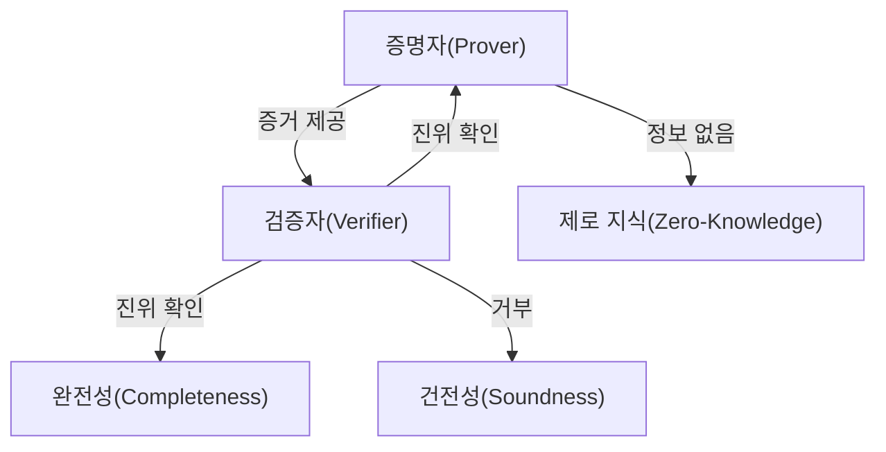
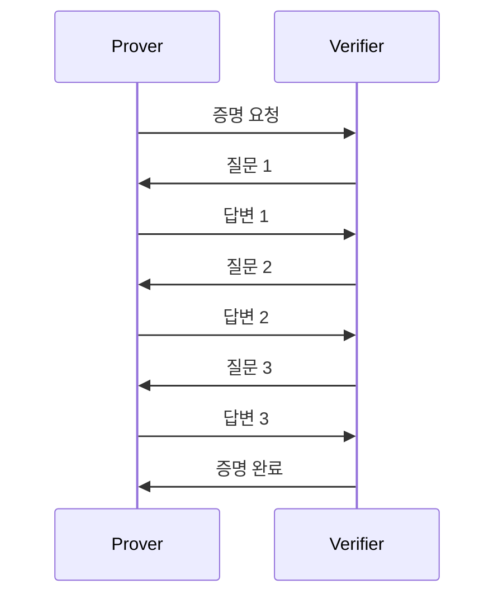
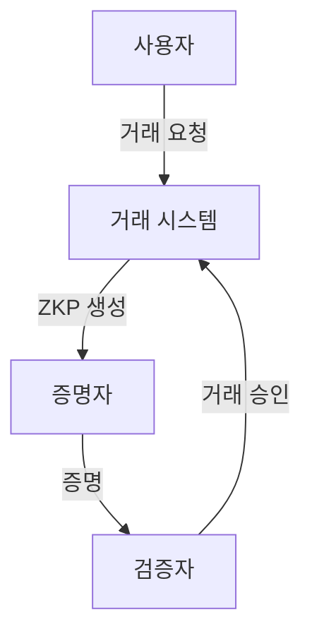
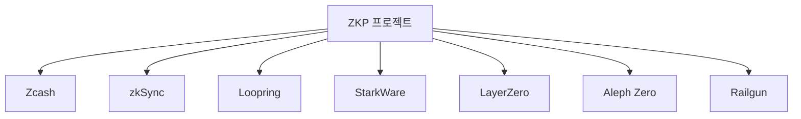
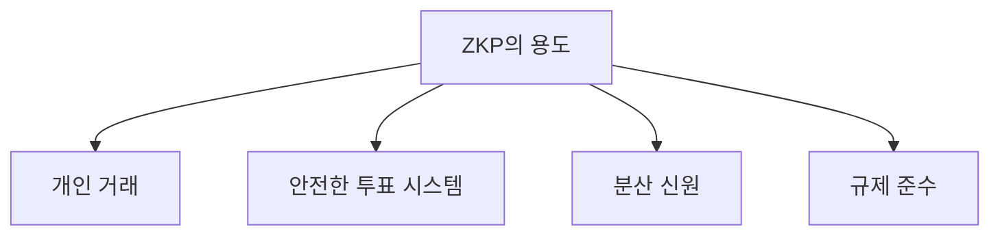
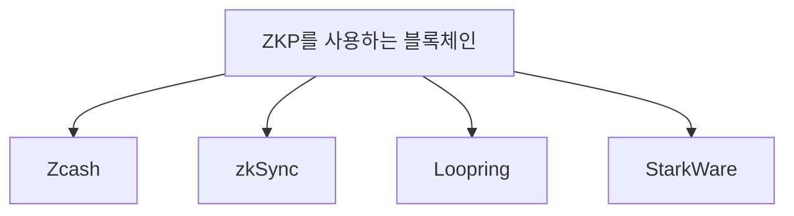
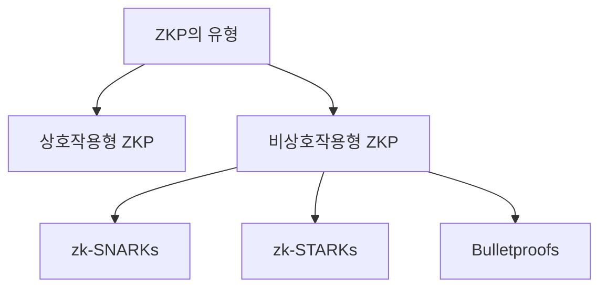
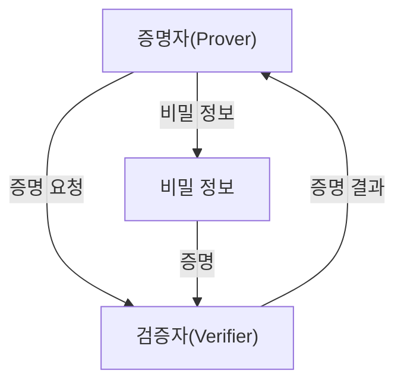

제로 지식 증명(Zero Knowledge Proof, ZKP)은 한 당사자(증명자)가 다른 당사자(검증자)에게 특정 진술이 참임을 증명할 수 있도록 하는 암호화 기술이다. 이 과정에서 증명자는 해당 진술의 진실성을 입증하기 위해 필요한 비밀 정보를 공개하지 않고도 검증자를 설득할 수 있다. 이러한 특성 덕분에 ZKP는 개인 정보 보호와 보안이 중요한 다양한 디지털 상호작용에서 필수적인 역할을 한다. ZKP의 개념은 1985년 Shafi Goldwasser, Silvio Micali, Charles Rackoff에 의해 처음 소개되었으며, 이들은 ZKP의 기초를 다진 연구로 Gödel Prize를 수상하였다. ZKP는 블록체인 기술에서도 중요한 응용 프로그램을 가지고 있으며, 개인 정보 보호, 안전한 거래, 데이터 무결성 보장 등 다양한 분야에서 활용되고 있다. 이 글에서는 ZKP의 기본 개념, 작동 원리, 다양한 유형 및 블록체인에서의 활용 사례를 살펴보겠다. ZKP는 개인 정보 보호와 보안을 강화하는 데 있어 매우 중요한 기술로, 앞으로의 디지털 환경에서 그 중요성이 더욱 커질 것으로 예상된다.


||
|:---:|
||


<!--
##### Outline #####
-->

<!--
# 목차

## 1. 개요
   - 제로 지식 증명(Zero-Knowledge Proofs, ZKPs)란?
   - ZKP의 중요성 및 필요성

## 2. 제로 지식 증명의 기본 개념
   - 2.1. 참여자
     - 증명자(Prover)와 검증자(Verifier)
   - 2.2. ZKP의 세 가지 주요 속성
     - 완전성(Completeness)
     - 건전성(Soundness)
     - 제로 지식(Zero-Knowledge)

## 3. 제로 지식 증명의 유형
   - 3.1. 상호작용형 ZKP(Interactive ZKP)
   - 3.2. 비상호작용형 ZKP(Non-Interactive ZKP)
     - zk-SNARKs
     - zk-STARKs
     - Bulletproofs

## 4. 제로 지식 증명의 작동 원리
   - 4.1. ZKP의 프로세스
   - 4.2. ZKP의 수학적 기초

## 5. 제로 지식 증명의 응용 사례
   - 5.1. 개인 거래(Private Transactions)
   - 5.2. 블록체인 확장성(Scalability)
   - 5.3. 분산 신원 및 데이터 소유권(Decentralized Identity and Data Ownership)
   - 5.4. 안전한 투표 시스템(Secure Voting Systems)
   - 5.5. 규제 준수(Compliance)

## 6. 주요 제로 지식 증명 프로젝트
   - 6.1. Zcash
   - 6.2. zkSync
   - 6.3. Loopring
   - 6.4. StarkWare
   - 6.5. LayerZero
   - 6.6. Aleph Zero
   - 6.7. Railgun

## 7. 제로 지식 증명의 도전 과제
   - 7.1. 계산 집약성(Computational Intensity)
   - 7.2. 신뢰할 수 있는 설정(Trusted Setup)
   - 7.3. 증명 크기 및 검증 복잡성(Proof Size and Verification Complexity)
   - 7.4. 사용성 및 접근성(Usability and Accessibility)

## 8. 결론
   - 제로 지식 증명의 미래
   - ZKP의 발전 방향 및 가능성

## 9. 자주 묻는 질문(FAQ)
   - ZKP는 블록체인에서 어떤 용도로 사용되나요?
   - 어떤 블록체인들이 ZKP를 사용하나요?
   - ZKP의 유형은 무엇인가요?

## 10. 참고 자료
   - 관련 논문 및 연구 자료
   - 추가 학습 자료 및 링크

이 목차는 제로 지식 증명에 대한 포괄적인 이해를 돕기 위해 구성되었으며, 각 섹션은 관련된 내용을 포함하여 독자가 ZKP의 개념과 응용을 깊이 있게 이해할 수 있도록 돕습니다.
-->

<!--
## 1. 개요
   - 제로 지식 증명(Zero-Knowledge Proofs, ZKPs)란?
   - ZKP의 중요성 및 필요성
-->

## 1. 개요

**제로 지식 증명(Zero-Knowledge Proofs, ZKPs)란?**

제로 지식 증명(Zero-Knowledge Proofs, ZKPs)은 한 당사자가 다른 당사자에게 특정 정보를 증명할 수 있는 방법이다. 이 과정에서 증명자는 자신이 알고 있는 정보를 공개하지 않고도 그 정보의 진위를 검증할 수 있도록 한다. 즉, 검증자는 증명자가 주장하는 내용을 믿을 수 있지만, 그 내용 자체는 알지 못하는 상태가 된다. 이러한 특성 덕분에 ZKP는 개인 정보 보호와 보안이 중요한 다양한 분야에서 활용될 수 있다.

ZKP의 기본적인 작동 원리는 다음과 같다. 증명자는 특정 정보를 가지고 있으며, 이를 바탕으로 검증자에게 그 정보의 진위를 증명해야 한다. 이 과정에서 증명자는 검증자가 이해할 수 있는 방식으로 정보를 제공하지만, 그 정보의 구체적인 내용은 숨긴다. 이러한 방식은 특히 블록체인과 같은 분산 시스템에서 개인의 프라이버시를 보호하는 데 유용하다.


**ZKP의 중요성 및 필요성**

제로 지식 증명은 현대 디지털 사회에서 점점 더 중요해지고 있다. 개인 정보 보호와 데이터 보안이 중요한 이슈로 대두되면서, ZKP는 이러한 문제를 해결할 수 있는 강력한 도구로 자리 잡고 있다. 특히, 블록체인 기술의 발전과 함께 ZKP는 거래의 프라이버시를 보장하고, 신원 인증 및 데이터 소유권을 안전하게 관리하는 데 기여하고 있다.

ZKP의 필요성은 다음과 같은 이유로 강조된다:

1. **프라이버시 보호**: ZKP는 개인의 민감한 정보를 공개하지 않고도 거래의 유효성을 증명할 수 있게 해준다. 이는 개인의 프라이버시를 보호하는 데 필수적이다.

2. **보안 강화**: ZKP는 데이터의 무결성을 보장하며, 해킹이나 데이터 유출의 위험을 줄인다. 이는 특히 금융 거래와 같은 민감한 분야에서 중요하다.

3. **신뢰 구축**: ZKP를 통해 거래의 진위를 검증할 수 있으므로, 신뢰할 수 있는 환경을 조성할 수 있다. 이는 분산 시스템에서의 신뢰 문제를 해결하는 데 기여한다.

결론적으로, 제로 지식 증명은 개인 정보 보호와 보안이 중요한 현대 사회에서 필수적인 기술로 자리 잡고 있으며, 앞으로도 그 중요성은 더욱 커질 것으로 예상된다.

<!--
## 2. 제로 지식 증명의 기본 개념
   - 2.1. 참여자
     - 증명자(Prover)와 검증자(Verifier)
   - 2.2. ZKP의 세 가지 주요 속성
     - 완전성(Completeness)
     - 건전성(Soundness)
     - 제로 지식(Zero-Knowledge)
-->

## 2. 제로 지식 증명의 기본 개념

제로 지식 증명(Zero-Knowledge Proofs, ZKPs)은 정보의 진위를 증명하면서도 그 정보 자체는 공개하지 않는 암호학적 방법론이다. 이 섹션에서는 ZKP의 참여자와 세 가지 주요 속성에 대해 설명하겠다.

**2.1. 참여자**

제로 지식 증명에는 두 가지 주요 참여자가 있다. 

- **증명자(Prover)**: 증명자는 특정 정보를 알고 있으며, 그 정보를 기반으로 검증자에게 진위를 증명하려는 주체이다. 예를 들어, 비밀번호를 알고 있는 사용자라고 할 수 있다.
  
- **검증자(Verifier)**: 검증자는 증명자가 주장하는 정보의 진위를 확인하려는 주체이다. 검증자는 증명자가 제공하는 증거를 바탕으로 그 정보가 진실인지 아닌지를 판단한다.

이 두 참여자는 ZKP 프로세스에서 상호작용하며, 증명자는 검증자가 요구하는 조건을 충족하는 증거를 제공해야 한다.

**2.2. ZKP의 세 가지 주요 속성**

제로 지식 증명은 다음 세 가지 주요 속성을 만족해야 한다.

- **완전성(Completeness)**: 만약 증명자가 진짜 정보를 알고 있다면, 검증자는 그 정보를 바탕으로 증명자가 주장하는 내용을 항상 올바르게 확인할 수 있어야 한다. 즉, 진짜 정보를 가진 증명자는 검증자를 설득할 수 있어야 한다.

- **건전성(Soundness)**: 만약 증명자가 거짓 정보를 주장한다면, 검증자는 그 주장을 올바르게 거부할 수 있어야 한다. 즉, 거짓 정보를 가진 증명자는 검증자를 설득할 수 없어야 한다.

- **제로 지식(Zero-Knowledge)**: 검증자는 증명자가 제공하는 증거를 통해 그 정보의 진위는 알 수 있지만, 그 정보 자체에 대한 어떤 정보도 얻을 수 없어야 한다. 즉, 검증자는 증명자가 알고 있는 정보에 대한 지식을 얻지 못해야 한다.

이러한 속성들은 ZKP가 안전하고 신뢰할 수 있는 방식으로 정보를 증명하는 데 필수적이다.

다음은 ZKP의 참여자와 속성을 시각적으로 나타낸 다이어그램이다.



위의 다이어그램은 증명자와 검증자 간의 상호작용을 보여주며, ZKP의 세 가지 주요 속성이 어떻게 작용하는지를 시각적으로 설명한다. 이러한 기본 개념을 이해하는 것은 제로 지식 증명의 작동 원리와 응용 사례를 탐구하는 데 중요한 첫걸음이다.

<!--
## 3. 제로 지식 증명의 유형
   - 3.1. 상호작용형 ZKP(Interactive ZKP)
   - 3.2. 비상호작용형 ZKP(Non-Interactive ZKP)
     - zk-SNARKs
     - zk-STARKs
     - Bulletproofs
-->

## 3. 제로 지식 증명의 유형

제로 지식 증명(Zero-Knowledge Proofs, ZKPs)은 크게 두 가지 유형으로 나눌 수 있다. 이 두 가지 유형은 상호작용형 ZKP(Interactive ZKP)와 비상호작용형 ZKP(Non-Interactive ZKP)로 구분된다. 각 유형은 특정한 상황에서의 사용성과 효율성에 따라 다르게 적용될 수 있다.

**3.1. 상호작용형 ZKP(Interactive ZKP)**

상호작용형 ZKP는 증명자(Prover)와 검증자(Verifier) 간의 상호작용을 통해 이루어진다. 이 과정에서 증명자는 자신의 비밀 정보를 기반으로 여러 번의 질문에 답변하며, 검증자는 이 답변을 통해 증명자가 주장하는 내용을 확인한다. 상호작용형 ZKP의 주요 특징은 다음과 같다.

- **상호작용**: 증명자와 검증자 간의 여러 번의 메시지 교환이 필요하다.
- **동적 프로세스**: 검증자는 증명자의 응답에 따라 추가 질문을 할 수 있다.

다음은 상호작용형 ZKP의 간단한 다이어그램이다.



**3.2. 비상호작용형 ZKP(Non-Interactive ZKP)**

비상호작용형 ZKP는 증명자와 검증자 간의 상호작용 없이 단일 메시지를 통해 증명을 수행하는 방식이다. 이 방식은 주로 zk-SNARKs, zk-STARKs, Bulletproofs와 같은 기술을 통해 구현된다. 비상호작용형 ZKP의 주요 특징은 다음과 같다.

- **단일 메시지**: 증명자는 검증자가 필요로 하는 모든 정보를 포함한 단일 증명 메시지를 생성한다.
- **효율성**: 상호작용이 없기 때문에, 네트워크 지연이나 추가적인 메시지 교환이 필요 없다.

**zk-SNARKs**

zk-SNARKs(Zero-Knowledge Succinct Non-Interactive Arguments of Knowledge)는 비상호작용형 ZKP의 한 종류로, 짧은 증명 크기와 빠른 검증 속도를 제공한다. zk-SNARKs는 블록체인에서 개인 거래를 보호하는 데 널리 사용된다.

**zk-STARKs**

zk-STARKs(Zero-Knowledge Scalable Transparent Arguments of Knowledge)는 zk-SNARKs의 한계를 극복하기 위해 개발된 기술로, 투명성과 확장성을 강조한다. zk-STARKs는 신뢰할 수 있는 설정이 필요 없으며, 더 큰 데이터 세트에 대해 효율적으로 작동할 수 있다.

**Bulletproofs**

Bulletproofs는 비상호작용형 ZKP의 또 다른 형태로, 특히 블록체인에서의 거래 검증에 적합하다. Bulletproofs는 짧은 증명 크기와 높은 효율성을 제공하며, zk-SNARKs와 달리 신뢰할 수 있는 설정이 필요 없다.

이와 같이 제로 지식 증명의 유형은 각기 다른 특성과 장점을 가지고 있으며, 특정한 요구 사항에 따라 적절한 유형을 선택하여 사용할 수 있다.

<!--
## 4. 제로 지식 증명의 작동 원리
   - 4.1. ZKP의 프로세스
   - 4.2. ZKP의 수학적 기초
-->

## 4. 제로 지식 증명의 작동 원리

제로 지식 증명(Zero-Knowledge Proofs, ZKPs)은 정보의 비밀을 유지하면서도 특정 사실이 참임을 증명할 수 있는 강력한 방법이다. 이 섹션에서는 ZKP의 프로세스와 수학적 기초에 대해 살펴보겠다.

**4.1. ZKP의 프로세스**

ZKP의 프로세스는 일반적으로 다음과 같은 단계로 구성된다.

1. **초기 설정**: 증명자(Prover)와 검증자(Verifier) 간의 초기 설정이 이루어진다. 이 단계에서는 증명자가 증명할 내용을 준비하고, 검증자는 이를 검증할 수 있는 방법을 설정한다.

2. **질문 및 응답**: 검증자는 증명자에게 질문을 던진다. 증명자는 이 질문에 대해 자신의 비밀 정보를 사용하여 답변한다. 이 과정은 여러 번 반복될 수 있으며, 각 질문은 증명자가 주장하는 사실을 검증하기 위한 것이다.

3. **결과 검증**: 검증자는 증명자의 응답을 바탕으로 주어진 사실이 참인지 여부를 판단한다. 이 과정에서 검증자는 증명자의 비밀 정보를 알지 못하면서도 주장이 참임을 확신할 수 있다.

**4.2. ZKP의 수학적 기초**

ZKP의 수학적 기초는 주로 대수학과 확률론에 기반하고 있다. ZKP는 다음과 같은 수학적 개념을 활용한다.

- **NP 문제**: ZKP는 NP(Non-deterministic Polynomial time) 문제에 기반하여 작동한다. 이는 주어진 문제의 해답을 검증하는 것이 쉽지만, 해답을 찾는 것은 어려운 문제를 의미한다.

- **암호학적 해시 함수**: ZKP에서는 암호학적 해시 함수가 사용되어 데이터의 무결성을 보장한다. 해시 함수는 입력 데이터에 대해 고유한 출력을 생성하며, 이를 통해 증명자가 비밀 정보를 노출하지 않고도 검증자가 주장을 확인할 수 있도록 한다.

- **상호작용적 프로토콜**: ZKP는 상호작용적 프로토콜을 통해 증명자와 검증자 간의 신뢰를 구축한다. 이 과정에서 여러 번의 질문과 응답이 이루어지며, 각 단계에서의 응답은 이전 단계의 결과에 의존한다.

이러한 수학적 기초는 ZKP의 안전성과 신뢰성을 보장하는 데 중요한 역할을 한다. ZKP는 비밀 정보를 보호하면서도 필요한 정보를 전달할 수 있는 혁신적인 방법으로, 다양한 응용 분야에서 그 가능성을 보여주고 있다.

<!--
## 5. 제로 지식 증명의 응용 사례
   - 5.1. 개인 거래(Private Transactions)
   - 5.2. 블록체인 확장성(Scalability)
   - 5.3. 분산 신원 및 데이터 소유권(Decentralized Identity and Data Ownership)
   - 5.4. 안전한 투표 시스템(Secure Voting Systems)
   - 5.5. 규제 준수(Compliance)
-->

## 5. 제로 지식 증명의 응용 사례

제로 지식 증명(Zero-Knowledge Proofs, ZKPs)은 다양한 분야에서 활용될 수 있는 강력한 기술이다. 이 섹션에서는 ZKP의 주요 응용 사례를 살펴보겠다.

**5.1. 개인 거래(Private Transactions)**  

제로 지식 증명은 개인 거래의 프라이버시를 보장하는 데 중요한 역할을 한다. 예를 들어, ZKP를 사용하면 거래의 유효성을 증명하면서도 거래의 세부 사항을 공개하지 않을 수 있다. 이는 금융 거래에서 개인의 자산이나 거래 내역을 보호하는 데 유용하다.



**5.2. 블록체인 확장성(Scalability)**  

ZKP는 블록체인의 확장성을 높이는 데 기여할 수 있다. 비상호작용형 ZKP인 zk-SNARKs와 zk-STARKs는 블록체인에서 대량의 거래를 처리할 수 있도록 하여, 블록체인의 처리 속도를 향상시킨다. 이를 통해 블록체인 네트워크의 효율성을 높이고, 사용자 경험을 개선할 수 있다.

**5.3. 분산 신원 및 데이터 소유권(Decentralized Identity and Data Ownership)**  

ZKP는 분산 신원 시스템에서 개인의 신원을 안전하게 증명하는 데 사용될 수 있다. 사용자는 자신의 신원 정보를 공개하지 않고도 특정 자격을 증명할 수 있으며, 이는 데이터 소유권을 보호하는 데 중요한 역할을 한다. 예를 들어, 사용자는 자신의 나이나 자격증을 증명할 수 있지만, 그에 대한 구체적인 정보를 공개하지 않아도 된다.

**5.4. 안전한 투표 시스템(Secure Voting Systems)**  

제로 지식 증명은 안전한 투표 시스템을 구축하는 데 필수적이다. ZKP를 사용하면 유권자가 자신의 투표를 비공개로 유지하면서도 투표의 유효성을 증명할 수 있다. 이는 투표의 신뢰성을 높이고, 부정 투표를 방지하는 데 기여한다.

**5.5. 규제 준수(Compliance)**  

ZKP는 기업이 규제 준수를 증명하는 데 유용하다. 기업은 고객의 개인 정보를 공개하지 않고도 규제 기관에 필요한 정보를 제공할 수 있다. 이는 데이터 보호 법규를 준수하면서도 비즈니스 운영의 효율성을 유지하는 데 도움이 된다.

제로 지식 증명은 다양한 분야에서 그 가능성을 보여주고 있으며, 앞으로도 더 많은 응용 사례가 개발될 것으로 기대된다. ZKP의 발전은 개인의 프라이버시와 데이터 보호를 강화하는 데 중요한 역할을 할 것이다.

<!--
## 6. 주요 제로 지식 증명 프로젝트
   - 6.1. Zcash
   - 6.2. zkSync
   - 6.3. Loopring
   - 6.4. StarkWare
   - 6.5. LayerZero
   - 6.6. Aleph Zero
   - 6.7. Railgun
-->

## 6. 주요 제로 지식 증명 프로젝트

제로 지식 증명(Zero-Knowledge Proofs, ZKPs)은 다양한 블록체인 프로젝트에서 활용되고 있으며, 각 프로젝트는 고유한 방식으로 ZKP의 이점을 극대화하고 있다. 이 섹션에서는 주요 ZKP 프로젝트들을 살펴보겠다.

**6.1. Zcash**  
Zcash는 개인 정보 보호를 중시하는 암호화폐로, zk-SNARKs(Zero-Knowledge Succinct Non-Interactive Arguments of Knowledge)를 사용하여 거래의 내용을 비공개로 유지하면서도 거래의 유효성을 검증할 수 있다. Zcash는 사용자가 선택적으로 개인 거래를 수행할 수 있도록 하여, 거래의 프라이버시를 보장한다.

**6.2. zkSync**  
zkSync는 이더리움의 Layer 2 솔루션으로, zk-Rollups 기술을 활용하여 거래의 속도와 비용을 개선한다. 이 시스템은 여러 거래를 하나의 거래로 묶어 처리함으로써, 이더리움 네트워크의 혼잡을 줄이고 사용자에게 더 나은 경험을 제공한다.

**6.3. Loopring**  
Loopring은 탈중앙화 거래소(DEX) 프로토콜로, zk-Rollups를 사용하여 거래의 효율성을 높인다. Loopring은 사용자 자산의 안전성을 보장하면서도 빠른 거래를 가능하게 하여, 사용자에게 더 나은 거래 경험을 제공한다.

**6.4. StarkWare**  
StarkWare는 zk-STARKs(Zero-Knowledge Scalable Transparent Arguments of Knowledge) 기술을 기반으로 한 솔루션을 제공한다. 이 기술은 높은 확장성과 투명성을 제공하며, 블록체인에서의 데이터 처리 속도를 크게 향상시킨다. StarkWare는 다양한 블록체인 프로젝트와 협력하여 ZKP 기술을 적용하고 있다.

**6.5. LayerZero**  
LayerZero는 다양한 블록체인 간의 상호운용성을 제공하는 프로토콜로, ZKP를 활용하여 안전하고 효율적인 데이터 전송을 가능하게 한다. 이 프로젝트는 블록체인 간의 통신을 간소화하고, 사용자에게 더 나은 경험을 제공하는 것을 목표로 한다.

**6.6. Aleph Zero**  
Aleph Zero는 고속의 분산 원장 기술을 제공하는 프로젝트로, ZKP를 통해 거래의 프라이버시를 보장한다. 이 플랫폼은 블록체인 기술의 확장성과 보안을 동시에 달성하는 것을 목표로 하고 있다.

**6.7. Railgun**  
Railgun은 개인 정보 보호를 위한 스마트 계약 플랫폼으로, ZKP를 사용하여 거래의 프라이버시를 보장한다. Railgun은 사용자가 자신의 자산을 안전하게 관리할 수 있도록 하며, 블록체인에서의 개인 정보 보호를 강화하는 데 기여하고 있다.



이와 같이 다양한 ZKP 프로젝트들은 각기 다른 방식으로 제로 지식 증명의 이점을 활용하고 있으며, 블록체인 기술의 발전에 기여하고 있다. 이러한 프로젝트들은 개인 정보 보호, 거래 효율성, 그리고 블록체인 간의 상호운용성을 향상시키는 데 중요한 역할을 하고 있다.

<!--
## 7. 제로 지식 증명의 도전 과제
   - 7.1. 계산 집약성(Computational Intensity)
   - 7.2. 신뢰할 수 있는 설정(Trusted Setup)
   - 7.3. 증명 크기 및 검증 복잡성(Proof Size and Verification Complexity)
   - 7.4. 사용성 및 접근성(Usability and Accessibility)
-->

## 7. 제로 지식 증명의 도전 과제

제로 지식 증명(Zero-Knowledge Proofs, ZKPs)은 강력한 보안 기능을 제공하지만, 여러 도전 과제가 존재한다. 이 섹션에서는 ZKP의 주요 도전 과제를 살펴보겠다.

**7.1. 계산 집약성(Computational Intensity)**  
ZKP의 생성 및 검증 과정은 상당한 계산 자원을 요구한다. 특히, 상호작용형 ZKP의 경우, 증명자와 검증자 간의 여러 번의 상호작용이 필요하므로, 계산 집약성이 더욱 두드러진다. 이러한 문제는 특히 대규모 시스템에서 성능 저하를 초래할 수 있다. 

```mermaid
graph TD;
    A[증명자(Prover)] -->|상호작용| B[검증자(Verifier)];
    B -->|증명 생성| A;
    A -->|검증 요청| B;
```

**7.2. 신뢰할 수 있는 설정(Trusted Setup)**  
일부 ZKP 프로토콜은 신뢰할 수 있는 설정 과정을 요구한다. 이 과정에서 생성된 비밀 키가 유출되면, 시스템의 보안이 위협받을 수 있다. 따라서, 신뢰할 수 있는 설정을 안전하게 수행하는 것이 중요하다. 이를 해결하기 위해, 비신뢰성 설정(non-trusted setup) 방식이 연구되고 있지만, 여전히 많은 ZKP 시스템에서 이 문제가 남아 있다.

**7.3. 증명 크기 및 검증 복잡성(Proof Size and Verification Complexity)**  
ZKP의 증명 크기와 검증 복잡성은 시스템의 효율성에 큰 영향을 미친다. 증명이 너무 크거나 검증이 복잡하면, 사용자가 시스템을 사용하는 데 불편함을 느낄 수 있다. 특히, 블록체인과 같은 분산 시스템에서는 이러한 요소가 성능에 직접적인 영향을 미친다. 따라서, 증명 크기를 줄이고 검증 과정을 간소화하는 연구가 필요하다.

**7.4. 사용성 및 접근성(Usability and Accessibility)**  
ZKP는 기술적으로 복잡한 개념이기 때문에, 일반 사용자에게는 접근성이 떨어질 수 있다. 사용자가 ZKP를 쉽게 이해하고 사용할 수 있도록 하는 것이 중요하다. 이를 위해, 사용자 친화적인 인터페이스와 교육 자료가 필요하다. 또한, 다양한 플랫폼에서 ZKP를 쉽게 구현할 수 있는 라이브러리와 도구의 개발이 요구된다.

제로 지식 증명은 많은 가능성을 지니고 있지만, 위와 같은 도전 과제를 해결하기 위한 지속적인 연구와 개발이 필요하다. 이러한 도전 과제를 극복함으로써, ZKP의 활용 범위가 더욱 넓어질 것으로 기대된다.

<!--
## 8. 결론
   - 제로 지식 증명의 미래
   - ZKP의 발전 방향 및 가능성
-->

## 8. 결론

**제로 지식 증명의 미래**  
제로 지식 증명(Zero-Knowledge Proofs, ZKPs)은 개인 정보 보호와 보안이 중요한 현대 사회에서 점점 더 중요한 역할을 할 것으로 예상된다. 특히 블록체인 기술의 발전과 함께 ZKP는 거래의 프라이버시를 보장하고, 데이터의 무결성을 유지하는 데 기여할 것이다. 이러한 기술은 금융 서비스, 의료 데이터 보호, 그리고 개인 정보 관리 등 다양한 분야에서 활용될 수 있다. 

ZKP의 미래는 기술적 발전과 함께 더욱 밝아질 것으로 보인다. 특히, 비상호작용형 ZKP(Non-Interactive ZKP)와 같은 새로운 유형의 증명 방식이 등장하면서, ZKP의 효율성과 사용성이 크게 향상될 것이다. 이러한 발전은 ZKP를 더 많은 애플리케이션에 통합할 수 있는 기회를 제공할 것이다.

**ZKP의 발전 방향 및 가능성**  
ZKP의 발전 방향은 크게 두 가지로 나눌 수 있다. 첫째, 성능 개선이다. 현재 ZKP는 계산 집약적이며, 증명 크기와 검증 복잡성이 높은 문제를 안고 있다. 이러한 문제를 해결하기 위해 연구자들은 새로운 알고리즘과 프로토콜을 개발하고 있으며, 이는 ZKP의 실용성을 높이는 데 기여할 것이다.

둘째, ZKP의 응용 분야 확장이다. 현재 ZKP는 주로 블록체인과 암호화폐에서 사용되고 있지만, 앞으로는 다양한 산업 분야로의 확장이 기대된다. 예를 들어, 안전한 투표 시스템, 개인 데이터 보호, 그리고 규제 준수와 같은 분야에서 ZKP의 활용 가능성이 높아지고 있다.

다음은 ZKP의 작동 원리를 간단히 설명하는 다이어그램이다.

```mermaid
graph TD;
    A[증명자(Prover)] -->|증명 요청| B[검증자(Verifier)];
    B -->|증명 결과| A;
    A -->|비밀 정보| C[비밀 정보];
    B -->|공개 정보| D[공개 정보];
    C -->|증명| E[제로 지식 증명];
    E -->|검증| B;
```

이 다이어그램은 증명자와 검증자 간의 상호작용을 보여준다. 증명자는 비밀 정보를 기반으로 제로 지식 증명을 생성하고, 검증자는 이를 통해 증명의 유효성을 확인한다. 이러한 과정은 ZKP의 핵심 원리를 잘 나타내고 있다.

결론적으로, 제로 지식 증명은 앞으로도 계속해서 발전할 것이며, 다양한 분야에서의 응용 가능성을 통해 우리의 삶을 더욱 안전하고 편리하게 만들어 줄 것이다.

<!--
## 9. 자주 묻는 질문(FAQ)
   - ZKP는 블록체인에서 어떤 용도로 사용되나요?
   - 어떤 블록체인들이 ZKP를 사용하나요?
   - ZKP의 유형은 무엇인가요?
-->

## 9. 자주 묻는 질문(FAQ)

**ZKP는 블록체인에서 어떤 용도로 사용되나요?**

제로 지식 증명(Zero-Knowledge Proofs, ZKPs)은 블록체인에서 여러 가지 용도로 활용된다. 가장 주요한 용도는 개인 정보 보호와 거래의 비밀성을 보장하는 것이다. ZKP를 사용하면 거래의 유효성을 증명하면서도 거래의 세부 사항을 공개하지 않을 수 있다. 예를 들어, 사용자가 특정 금액을 보유하고 있다는 사실을 증명할 수 있지만, 그 금액이나 거래의 내용을 노출하지 않는다. 이러한 특성 덕분에 ZKP는 개인 거래(Private Transactions), 안전한 투표 시스템(Secure Voting Systems), 그리고 분산 신원(Decentralized Identity)과 같은 다양한 분야에서 활용된다.



**어떤 블록체인들이 ZKP를 사용하나요?**

여러 블록체인 프로젝트가 ZKP를 채택하고 있으며, 그 중 일부는 다음과 같다. Zcash는 ZKP를 사용하여 개인 거래를 지원하는 대표적인 블록체인이다. zkSync는 이더리움의 확장성을 높이기 위해 ZKP를 활용하고 있으며, Loopring은 탈중앙화 거래소에서 ZKP를 사용하여 거래의 비밀성을 보장한다. StarkWare는 zk-STARKs를 기반으로 한 솔루션을 제공하여 블록체인의 성능을 향상시키고 있다. 이러한 프로젝트들은 ZKP의 장점을 활용하여 블록체인의 개인 정보 보호 및 확장성을 개선하고 있다.



**ZKP의 유형은 무엇인가요?**

제로 지식 증명에는 두 가지 주요 유형이 있다. 첫 번째는 상호작용형 ZKP(Interactive ZKP)로, 증명자(Prover)와 검증자(Verifier) 간의 상호작용을 통해 증명이 이루어진다. 두 번째는 비상호작용형 ZKP(Non-Interactive ZKP)로, 증명자가 생성한 증명이 검증자에게 전달되어 검증이 이루어진다. 비상호작용형 ZKP의 예로는 zk-SNARKs, zk-STARKs, 그리고 Bulletproofs가 있다. 이들 각각은 특정한 요구 사항과 성능 특성을 가지고 있어 다양한 응용 분야에서 사용될 수 있다.



이와 같이 ZKP는 블록체인 기술의 발전에 중요한 역할을 하고 있으며, 다양한 응용 분야에서 그 가능성을 보여주고 있다.

<!--
## 10. 참고 자료
   - 관련 논문 및 연구 자료
   - 추가 학습 자료 및 링크
-->

## 10. 참고 자료

** 관련 논문 및 연구 자료 **  
제로 지식 증명(Zero-Knowledge Proofs, ZKPs)에 대한 깊이 있는 이해를 위해 다음의 논문 및 연구 자료를 참고할 수 있다.

1. **"How to Prove a Theorem"** - Shafi Goldwasser, Silvio Micali, and Charles Rackoff의 고전적인 논문으로, ZKP의 개념을 처음으로 제안한 연구이다. 이 논문은 ZKP의 기초를 이해하는 데 큰 도움이 된다.
   
2. **"zk-SNARKs for C"** - Eli Ben-Sasson et al.의 논문으로, zk-SNARKs의 구조와 작동 원리를 설명한다. 이 논문은 비상호작용형 ZKP의 중요한 사례를 다룬다.

3. **"Bulletproofs: Short Proofs for Confidential Transactions and More"** - Benedikt Bünz et al.의 논문으로, Bulletproofs의 개념과 응용을 다룬다. 이 논문은 개인 거래에서의 ZKP 활용을 이해하는 데 유용하다.

4. **"Scalable Zero Knowledge via Cycles of Elliptic Curves"** - Eli Ben-Sasson et al.의 연구로, zk-STARKs의 기초와 그 장점을 설명한다. 이 자료는 ZKP의 확장성 문제를 다루고 있다.

** 추가 학습 자료 및 링크 **  
제로 지식 증명에 대한 추가적인 학습을 위해 다음의 자료를 추천한다.

- **ZKP 관련 온라인 강의**: Coursera, edX와 같은 플랫폼에서 제공하는 블록체인 및 ZKP 관련 강의를 수강할 수 있다. 이러한 강의는 ZKP의 기본 개념부터 응용 사례까지 폭넓은 내용을 다룬다.

- **GitHub 리포지토리**: ZKP 관련 오픈 소스 프로젝트를 찾아보는 것도 좋은 방법이다. 예를 들어, zk-SNARKs와 관련된 프로젝트는 [ZoKrates](https://github.com/Zokrates/ZoKrates)와 같은 리포지토리에서 확인할 수 있다.

- **블로그 및 포럼**: Medium, Dev.to와 같은 블로그 플랫폼에서 ZKP에 대한 다양한 글을 찾아볼 수 있다. 또한, Stack Exchange와 같은 포럼에서 전문가와의 Q&A를 통해 궁금한 점을 해결할 수 있다.

**샘플 코드**  
다음은 zk-SNARKs를 사용하여 간단한 ZKP를 생성하는 Python 코드의 예시이다.

```python
from zokrates_py import Zokrates

# Zokrates 초기화
zokrates = Zokrates()

# ZKP 생성
def generate_proof(secret):
    # 비밀 값으로부터 증명 생성
    proof = zokrates.generate_proof(secret)
    return proof

# 비밀 값
secret_value = 42
proof = generate_proof(secret_value)
print("Generated Proof:", proof)
```

**다이어그램**  
다음은 제로 지식 증명의 기본 프로세스를 나타내는 다이어그램이다.



이 자료들은 제로 지식 증명에 대한 이해를 높이는 데 큰 도움이 될 것이다. ZKP의 발전과 응용에 대한 지속적인 관심이 필요하다.

<!--
##### Reference #####
-->

## Reference


* [https://zkintro.com/articles/programming-zkps-from-zero-to-hero](https://zkintro.com/articles/programming-zkps-from-zero-to-hero)
* [https://medium.com/@coineasy/%EC%B4%88%EB%B3%B4%EC%9E%90%EB%A5%BC-%EC%9C%84%ED%95%9C-%EC%98%81%EC%A7%80%EC%8B%9D-%EC%A6%9D%EB%AA%85-e91b7dd2e802](https://medium.com/@coineasy/%EC%B4%88%EB%B3%B4%EC%9E%90%EB%A5%BC-%EC%9C%84%ED%95%9C-%EC%98%81%EC%A7%80%EC%8B%9D-%EC%A6%9D%EB%AA%85-e91b7dd2e802)
* [https://chain.link/education/zero-knowledge-proof-zkp](https://chain.link/education/zero-knowledge-proof-zkp)
* [https://www.chainalysis.com/blog/introduction-to-zero-knowledge-proofs-zkps/](https://www.chainalysis.com/blog/introduction-to-zero-knowledge-proofs-zkps/)
* [https://en.wikipedia.org/wiki/Zero-knowledge_proof](https://en.wikipedia.org/wiki/Zero-knowledge_proof)
* [https://klaytn.foundation/zero-knowledge-proofs-zkps/](https://klaytn.foundation/zero-knowledge-proofs-zkps/)
* [https://blog.thirdweb.com/zero-knowledge-proof-zkp/](https://blog.thirdweb.com/zero-knowledge-proof-zkp/)
* [https://medium.com/lithium-digital/a-beginners-guide-to-understanding-zero-knowledge-proofs-zkps-9a69383c6dbb](https://medium.com/lithium-digital/a-beginners-guide-to-understanding-zero-knowledge-proofs-zkps-9a69383c6dbb)

