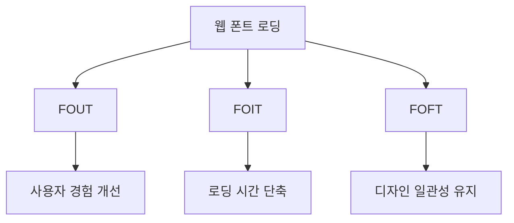
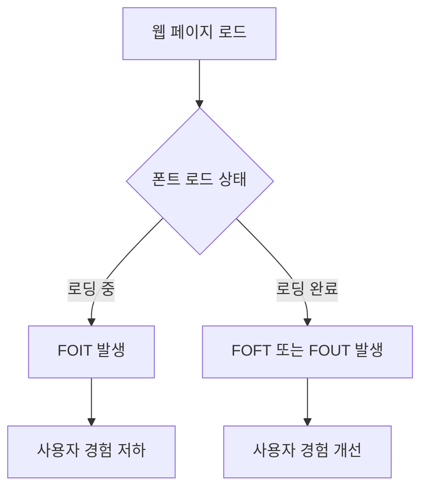
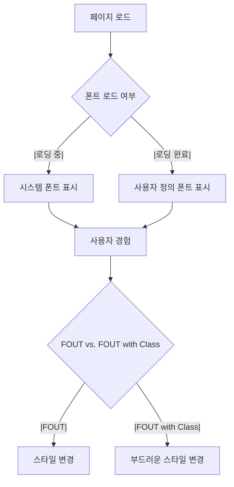
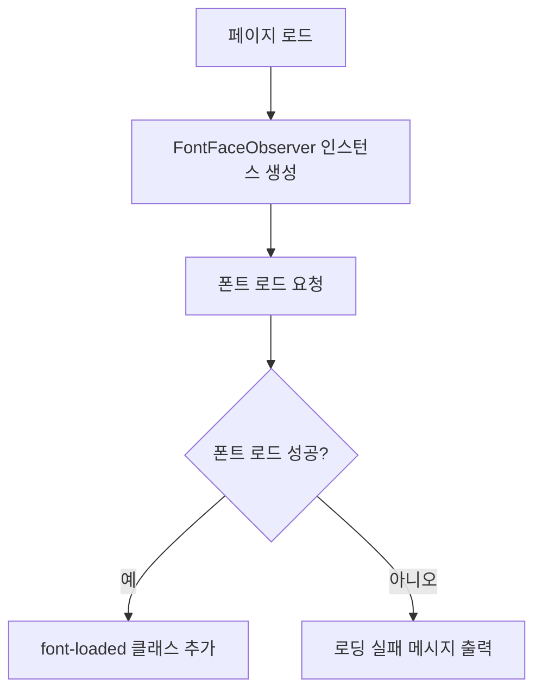
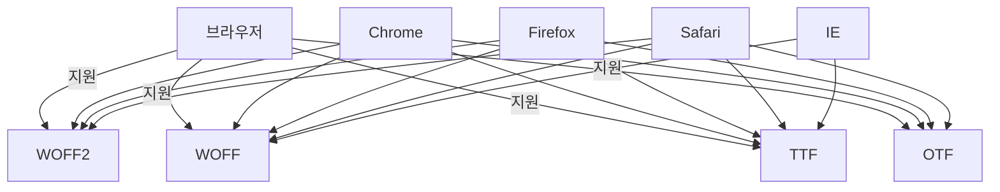
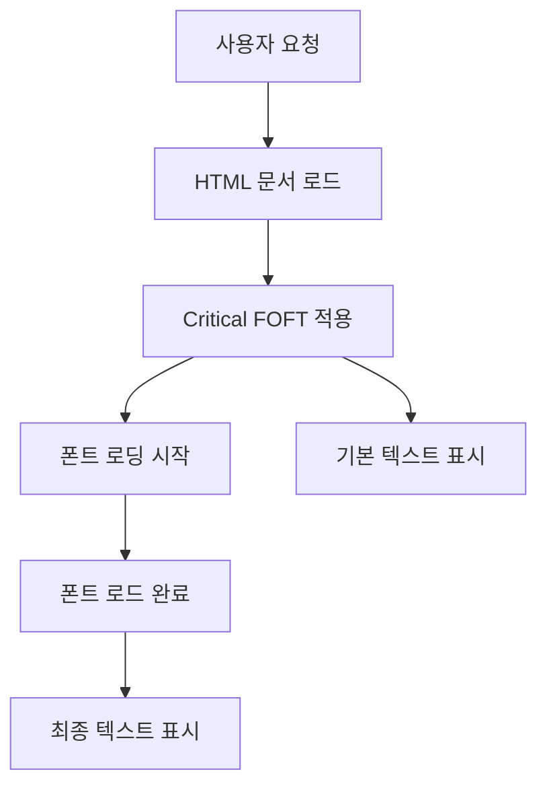

웹 폰트 로딩 전략은 웹 개발에서 중요한 요소 중 하나이다. 웹사이트의 성능과 사용자 경험을 향상시키기 위해 적절한 폰트 로딩 방법을 선택하는 것이 필수적이다. Zach Leatherman이 제안한 다양한 폰트 로딩 전략은 많은 개발자들 사이에서 공유되고 있으며, 이 글에서는 그 중 가장 효과적인 두 가지 방법인 FOUT with Class와 Critical FOFT에 대해 설명하고자 한다. FOUT는 사용자가 시스템 폰트를 통해 내용을 먼저 볼 수 있도록 하여, 폰트가 로드되는 동안의 사용자 경험을 개선하는 방법이다. 반면, Critical FOFT는 폰트 로딩을 세 단계로 나누어 성능을 극대화하는 전략이다. 이 두 가지 방법은 각각의 장단점이 있으며, 사용자의 요구와 웹사이트의 특성에 따라 적절한 방법을 선택해야 한다. 또한, 폰트를 클라우드에서 호스팅할지, 자체 호스팅할지를 결정하는 것도 중요한 요소이다. 클라우드 호스팅은 간편하지만, 성능 면에서는 자체 호스팅이 더 유리할 수 있다. 이 글을 통해 웹 폰트 로딩 전략에 대한 이해를 높이고, 실제로 적용할 수 있는 방법을 배울 수 있을 것이다.


||
|:---:|
||


<!--
##### Outline #####
-->

<!--
# 목차

## 1. 개요
   - 웹 폰트 로딩의 중요성
   - 다양한 로딩 전략 소개

## 2. 웹 폰트 로딩 전략
   - 2.1 FOUT with Class
   - 2.2 Critical FOFT

## 3. 용어 정리
   - 3.1 FOIT (Flash of Invisible Text)
   - 3.2 FOUT (Flash of Unstyled Text)
   - 3.3 FOFT (Flash of Faux Text)

## 4. 폰트 호스팅 방법
   - 4.1 클라우드 호스팅 폰트
   - 4.2 자체 호스팅 폰트

## 5. 클라우드 호스팅 폰트 로딩 방법
   - 5.1 Adobe Fonts 예제
   - 5.2 Google Fonts 예제
   - 5.3 비동기 로딩 방법

## 6. 자체 호스팅 폰트 로딩 방법
   - 6.1 @font-face 사용법
   - 6.2 font-display: swap 설명
   - 6.3 FOUT vs. FOUT with Class 비교

## 7. FOUT with Class 구현
   - 7.1 클라우드 호스팅 폰트에 대한 구현
   - 7.2 자체 호스팅 폰트에 대한 구현
   - 7.3 sessionStorage를 이용한 최적화

## 8. CSS Font Loader API vs. FontFaceObserver
   - 8.1 CSS Font Loader API의 장단점
   - 8.2 FontFaceObserver 사용법

## 9. FOFT 전략
   - 9.1 Standard FOFT 구현
   - 9.2 Critical FOFT 구현
   - 9.3 Critical FOFT 변형

## 10. 최적의 폰트 로딩 전략 선택하기
   - 10.1 클라우드 호스팅 시 선택 전략
   - 10.2 자체 호스팅 시 선택 전략

## 11. FAQ
   - 11.1 웹 폰트 로딩 시 성능 문제는 어떻게 해결하나요?
   - 11.2 폰트 라이센스는 어떻게 확인하나요?
   - 11.3 다양한 브라우저에서의 호환성은 어떻게 되나요?

## 12. 관련 기술
   - 12.1 웹 성능 최적화
   - 12.2 CSS 최적화 기법
   - 12.3 JavaScript 비동기 처리

## 13. 결론
   - 웹 폰트 로딩 전략의 중요성 요약
   - 최적의 사용자 경험을 위한 권장 사항

## 14. 추가 자료
   - 14.1 관련 블로그 및 기사 링크
   - 14.2 유용한 도구 및 리소스

이 목차는 웹 폰트 로딩 전략에 대한 포괄적인 정보를 제공하며, 독자가 쉽게 이해하고 적용할 수 있도록 구성되었습니다.
-->

<!--
## 1. 개요
   - 웹 폰트 로딩의 중요성
   - 다양한 로딩 전략 소개
-->

## 1. 개요

웹 폰트 로딩은 웹 페이지의 시각적 품질과 사용자 경험에 큰 영향을 미친다. 사용자가 웹 페이지를 방문할 때, 폰트가 적절하게 로딩되지 않으면 텍스트가 비정상적으로 표시되거나, 페이지의 로딩 속도가 느려질 수 있다. 이러한 문제는 사용자 이탈을 초래할 수 있으며, 결과적으로 웹사이트의 성과에 부정적인 영향을 미친다. 따라서 웹 폰트 로딩 전략을 적절히 선택하는 것이 중요하다.

**웹 폰트 로딩의 중요성**

웹 폰트는 웹 페이지의 디자인을 결정짓는 중요한 요소이다. 적절한 폰트가 로딩되지 않으면, 사용자는 페이지의 내용을 이해하기 어려울 수 있으며, 이는 사용자 경험을 저하시킬 수 있다. 또한, 웹 폰트의 로딩 속도는 페이지의 전체 로딩 시간에 영향을 미치므로, 성능 최적화 측면에서도 중요한 요소이다. 

**다양한 로딩 전략 소개**

웹 폰트를 로딩하는 방법에는 여러 가지 전략이 있다. 각 전략은 특정 상황에 따라 장단점이 있으며, 웹사이트의 요구 사항에 맞춰 선택해야 한다. 일반적으로 사용되는 로딩 전략으로는 FOUT (Flash of Unstyled Text), FOIT (Flash of Invisible Text), FOFT (Flash of Faux Text) 등이 있다. 이러한 전략들은 폰트 로딩 시 발생할 수 있는 문제를 최소화하고, 사용자에게 더 나은 경험을 제공하기 위해 설계되었다.

다음은 웹 폰트 로딩 전략의 개념을 시각적으로 나타낸 다이어그램이다.



이와 같은 다양한 로딩 전략을 이해하고 적절히 활용하는 것은 웹 개발자에게 필수적인 요소이다. 각 전략의 특성을 파악하고, 웹사이트의 요구 사항에 맞는 최적의 방법을 선택하는 것이 중요하다.

<!--
## 2. 웹 폰트 로딩 전략
   - 2.1 FOUT with Class
   - 2.2 Critical FOFT
-->

## 2. 웹 폰트 로딩 전략

웹 폰트 로딩 전략은 웹 페이지의 성능과 사용자 경험에 큰 영향을 미친다. 이 섹션에서는 두 가지 주요 로딩 전략인 FOUT with Class와 Critical FOFT에 대해 설명하겠다.

**FOUT with Class**

FOUT (Flash of Unstyled Text) with Class는 웹 폰트를 로딩하는 동안 발생할 수 있는 스타일이 적용되지 않은 텍스트의 깜박임을 최소화하는 방법이다. 이 전략은 기본적으로 폰트가 로드되기 전, 텍스트에 기본 스타일을 적용하고, 폰트가 로드된 후에 해당 스타일을 변경하는 방식으로 작동한다.

이 방법의 장점은 사용자가 폰트가 로드될 때까지 기본 텍스트를 볼 수 있다는 점이다. 이를 통해 사용자 경험을 개선할 수 있다. 다음은 FOUT with Class를 구현하는 간단한 예제 코드이다.

```html
<!DOCTYPE html>
<html lang="ko">
<head>
    <meta charset="UTF-8">
    <meta name="viewport" content="width=device-width, initial-scale=1.0">
    <link rel="stylesheet" href="styles.css">
    <style>
        .fout {
            font-family: Arial, sans-serif; /* 기본 폰트 */
        }
        .loaded {
            font-family: 'MyWebFont', sans-serif; /* 웹 폰트 */
        }
    </style>
    <script>
        document.addEventListener("DOMContentLoaded", function() {
            document.body.classList.add('loaded');
        });
    </script>
</head>
<body class="fout">
    <h1>안녕하세요, 웹 폰트 로딩 전략!</h1>
</body>
</html>
```

위 코드에서는 기본 폰트로 Arial을 사용하고, 웹 폰트가 로드된 후에 'loaded' 클래스를 추가하여 폰트를 변경한다. 이로 인해 사용자는 폰트가 로드되기 전에도 텍스트를 볼 수 있다.

**Critical FOFT**

Critical FOFT (Flash of Faux Text)는 웹 폰트가 로드되기 전에 대체 폰트를 사용하여 텍스트를 표시하는 전략이다. 이 방법은 사용자가 페이지를 로드하는 동안 텍스트가 보이도록 하여 사용자 경험을 개선하는 데 중점을 둔다. Critical FOFT는 폰트가 로드되기 전에 대체 폰트를 사용하고, 폰트가 로드된 후에 실제 웹 폰트로 변경하는 방식으로 작동한다.

이 전략의 장점은 사용자가 텍스트를 즉시 볼 수 있다는 점이다. 다음은 Critical FOFT를 구현하는 예제 코드이다.

```html
<!DOCTYPE html>
<html lang="ko">
<head>
    <meta charset="UTF-8">
    <meta name="viewport" content="width=device-width, initial-scale=1.0">
    <link rel="stylesheet" href="styles.css">
    <style>
        @font-face {
            font-family: 'MyWebFont';
            src: url('mywebfont.woff2') format('woff2');
        }
        .faux {
            font-family: Arial, sans-serif; /* 대체 폰트 */
        }
        .loaded {
            font-family: 'MyWebFont', sans-serif; /* 웹 폰트 */
        }
    </style>
    <script>
        document.addEventListener("DOMContentLoaded", function() {
            document.body.classList.add('loaded');
        });
    </script>
</head>
<body class="faux">
    <h1>안녕하세요, Critical FOFT 전략!</h1>
</body>
</html>
```

위 코드에서는 대체 폰트로 Arial을 사용하고, 웹 폰트가 로드된 후에 'loaded' 클래스를 추가하여 폰트를 변경한다. 이로 인해 사용자는 페이지 로딩 시 텍스트를 즉시 볼 수 있다.

다음은 FOUT with Class와 Critical FOFT의 흐름을 나타내는 다이어그램이다.


이와 같이 FOUT with Class와 Critical FOFT는 각각의 장점을 가지고 있으며, 상황에 따라 적절한 전략을 선택하여 웹 폰트를 로딩하는 것이 중요하다.

<!--
## 3. 용어 정리
   - 3.1 FOIT (Flash of Invisible Text)
   - 3.2 FOUT (Flash of Unstyled Text)
   - 3.3 FOFT (Flash of Faux Text)
-->

## 3. 용어 정리

웹 폰트 로딩 전략을 이해하기 위해서는 몇 가지 중요한 용어를 알아두는 것이 필요하다. 이 섹션에서는 FOIT, FOUT, FOFT에 대해 설명하겠다.

**FOIT (Flash of Invisible Text)**  

FOIT는 "Flash of Invisible Text"의 약자로, 웹 페이지가 로드될 때 폰트가 로드되기 전까지 텍스트가 보이지 않는 현상을 의미한다. 이 경우, 사용자는 페이지가 로드되는 동안 텍스트를 전혀 볼 수 없게 된다. 이는 사용자 경험에 부정적인 영향을 미칠 수 있으며, 특히 콘텐츠가 중요한 웹사이트에서는 더욱 그렇다. FOIT를 방지하기 위해서는 폰트를 미리 로드하거나, 대체 폰트를 사용하는 방법이 있다.

```css
@font-face {
    font-family: 'MyFont';
    src: url('myfont.woff2') format('woff2');
    font-display: swap; /* FOIT 방지 */
}
```

**FOUT (Flash of Unstyled Text)**  

FOUT는 "Flash of Unstyled Text"의 약자로, 폰트가 로드되기 전까지 기본 폰트로 텍스트가 표시되는 현상을 의미한다. 이 경우, 사용자는 페이지가 로드되는 동안 기본 폰트로 텍스트를 볼 수 있으며, 폰트가 로드된 후에 스타일이 적용된다. FOUT는 FOIT보다 사용자 경험에 덜 부정적인 영향을 미치지만, 여전히 시각적으로 불안정한 느낌을 줄 수 있다.

```css
@font-face {
    font-family: 'MyFont';
    src: url('myfont.woff2') format('woff2');
    font-display: auto; /* FOUT 발생 가능성 */
}
```

**FOFT (Flash of Faux Text)**  

FOFT는 "Flash of Faux Text"의 약자로, 폰트가 로드되기 전까지 대체 텍스트를 사용하여 사용자에게 보여주는 방법이다. 이 방법은 사용자가 페이지를 로드하는 동안 대체 폰트를 사용하여 텍스트를 표시하고, 폰트가 로드된 후에 실제 폰트로 변경하는 방식이다. FOFT는 사용자 경험을 개선할 수 있는 방법 중 하나로, 대체 폰트와 실제 폰트의 유사성을 고려해야 한다.

```css
@font-face {
    font-family: 'MyFont';
    src: url('myfont.woff2') format('woff2');
    font-display: fallback; /* FOFT 구현 */
}
```



이와 같이 FOIT, FOUT, FOFT는 웹 폰트 로딩 시 발생할 수 있는 다양한 현상들이다. 각 용어의 특성을 이해하고 적절한 로딩 전략을 선택하는 것이 중요하다.

<!--
## 4. 폰트 호스팅 방법
   - 4.1 클라우드 호스팅 폰트
   - 4.2 자체 호스팅 폰트
-->

## 4. 폰트 호스팅 방법

웹 폰트를 효과적으로 사용하기 위해서는 폰트를 호스팅하는 방법을 이해하는 것이 중요하다. 폰트 호스팅 방법은 크게 클라우드 호스팅과 자체 호스팅으로 나눌 수 있다. 각 방법의 장단점을 살펴보도록 하겠다.

**클라우드 호스팅 폰트**

클라우드 호스팅 폰트는 외부 서비스 제공업체가 제공하는 폰트를 사용하는 방법이다. 이 방법의 가장 큰 장점은 손쉽게 다양한 폰트를 사용할 수 있다는 점이다. 또한, 클라우드 서비스 제공업체는 폰트의 최적화 및 캐싱을 자동으로 처리해 주기 때문에 개발자가 신경 쓸 부분이 줄어든다.

예를 들어, Google Fonts를 사용하여 웹 폰트를 로드하는 방법은 다음과 같다.

```html
<link href="https://fonts.googleapis.com/css2?family=Roboto:wght@400;700&display=swap" rel="stylesheet">
```

위의 코드를 HTML 문서의 `<head>` 섹션에 추가하면, Roboto 폰트를 사용할 수 있게 된다. 

**자체 호스팅 폰트**

자체 호스팅 폰트는 웹사이트의 서버에 폰트 파일을 직접 저장하고 사용하는 방법이다. 이 방법은 폰트 파일에 대한 완전한 제어권을 제공하며, 라이센스 문제를 피할 수 있는 장점이 있다. 그러나 서버의 성능에 따라 로딩 속도가 영향을 받을 수 있으며, 폰트 파일의 최적화와 캐싱을 직접 관리해야 한다.

자체 호스팅 폰트를 사용하기 위해서는 `@font-face` 규칙을 사용하여 CSS에 폰트를 정의해야 한다. 아래는 자체 호스팅 폰트를 설정하는 예시 코드이다.

```css
@font-face {
    font-family: 'MyCustomFont';
    src: url('/fonts/MyCustomFont.woff2') format('woff2'),
         url('/fonts/MyCustomFont.woff') format('woff');
    font-weight: normal;
    font-style: normal;
}
```

이렇게 설정한 후, CSS에서 `font-family` 속성을 사용하여 해당 폰트를 적용할 수 있다.

```css
body {
    font-family: 'MyCustomFont', sans-serif;
}
```

다음은 클라우드 호스팅과 자체 호스팅의 비교를 나타내는 다이어그램이다.


클라우드 호스팅과 자체 호스팅 각각의 장단점을 고려하여, 프로젝트의 요구사항에 맞는 적절한 방법을 선택하는 것이 중요하다.

<!--
## 5. 클라우드 호스팅 폰트 로딩 방법
   - 5.1 Adobe Fonts 예제
   - 5.2 Google Fonts 예제
   - 5.3 비동기 로딩 방법
-->

## 5. 클라우드 호스팅 폰트 로딩 방법

클라우드 호스팅 폰트는 웹 개발에서 매우 유용한 자원이다. 이 섹션에서는 Adobe Fonts와 Google Fonts를 사용한 폰트 로딩 방법을 살펴보고, 비동기 로딩 방법에 대해서도 설명하겠다.

**Adobe Fonts 예제**

Adobe Fonts는 다양한 폰트를 제공하며, 사용자가 쉽게 웹사이트에 통합할 수 있도록 돕는다. Adobe Fonts를 사용하기 위해서는 다음과 같은 단계를 따르면 된다.

1. Adobe Fonts 웹사이트에 접속하여 계정을 생성한다.
2. 원하는 폰트를 선택하고, 웹 프로젝트를 생성한다.
3. 제공된 `<link>` 태그를 HTML 문서의 `<head>` 섹션에 추가한다.

예를 들어, 아래와 같은 코드를 사용할 수 있다.

```html
<head>
    <link rel="stylesheet" href="https://use.typekit.net/your-kit-id.css">
</head>
```

이렇게 하면 Adobe Fonts에서 선택한 폰트가 웹 페이지에 적용된다.

**Google Fonts 예제**

Google Fonts는 무료로 사용할 수 있는 다양한 폰트를 제공한다. Google Fonts를 사용하기 위해서는 다음과 같은 절차를 따르면 된다.

1. Google Fonts 웹사이트에 접속하여 원하는 폰트를 선택한다.
2. 선택한 폰트의 `<link>` 태그를 복사한다.
3. HTML 문서의 `<head>` 섹션에 붙여넣는다.

아래는 Google Fonts를 사용하는 예제 코드이다.

```html
<head>
    <link href="https://fonts.googleapis.com/css2?family=Roboto:wght@400;700&display=swap" rel="stylesheet">
</head>
```

이 코드를 추가하면 Roboto 폰트가 웹 페이지에 적용된다.

**비동기 로딩 방법**

비동기 로딩 방법은 웹 폰트를 페이지 로딩 성능에 미치는 영향을 최소화하는 데 유용하다. 비동기 로딩을 통해 폰트가 페이지의 다른 요소와 동시에 로드되도록 할 수 있다. 이를 위해 JavaScript를 사용할 수 있다.

아래는 비동기 로딩을 구현하는 예제 코드이다.

```html
<head>
    <script>
        WebFont.load({
            google: {
                families: ['Roboto:400,700']
            }
        });
    </script>
</head>
```

위 코드는 WebFont.js 라이브러리를 사용하여 Google Fonts에서 Roboto 폰트를 비동기적으로 로드하는 방법을 보여준다. 이 방법을 사용하면 폰트 로딩이 페이지 렌더링에 미치는 영향을 줄일 수 있다.


위 다이어그램은 비동기 폰트 로딩이 웹 페이지의 다른 요소와 동시에 진행되는 과정을 나타낸다. 이를 통해 사용자 경험을 향상시킬 수 있다. 

이와 같이 클라우드 호스팅 폰트를 활용하면 웹 페이지의 디자인을 더욱 풍부하게 만들 수 있으며, 성능 최적화에도 기여할 수 있다.

<!--
## 6. 자체 호스팅 폰트 로딩 방법
   - 6.1 @font-face 사용법
   - 6.2 font-display: swap 설명
   - 6.3 FOUT vs. FOUT with Class 비교
-->

## 6. 자체 호스팅 폰트 로딩 방법

웹 폰트를 자체 호스팅하는 방법은 성능과 사용자 경험을 최적화하는 데 중요한 역할을 한다. 이 섹션에서는 @font-face 사용법, font-display: swap 설명, 그리고 FOUT와 FOUT with Class의 비교를 다룰 것이다.

**@font-face 사용법**

@font-face는 웹 폰트를 정의하고 사용할 수 있게 해주는 CSS 규칙이다. 이를 통해 웹사이트에서 사용할 폰트를 서버에 호스팅할 수 있다. 기본적인 사용법은 다음과 같다.

```css
@font-face {
    font-family: 'MyCustomFont';
    src: url('fonts/MyCustomFont.woff2') format('woff2'),
         url('fonts/MyCustomFont.woff') format('woff');
    font-weight: normal;
    font-style: normal;
}
```

위의 코드에서 `font-family`는 폰트의 이름을 정의하고, `src`는 폰트 파일의 경로를 지정한다. 다양한 포맷을 제공함으로써 브라우저 호환성을 높일 수 있다.

**font-display: swap 설명**

`font-display` 속성은 폰트 로딩 전략을 제어하는 데 사용된다. `swap` 값은 폰트가 로드될 때까지 시스템 폰트를 사용하고, 로드가 완료되면 사용자 정의 폰트로 교체하는 방식이다. 이 방법은 사용자에게 빠른 피드백을 제공하며, FOUT(Flash of Unstyled Text) 현상을 최소화할 수 있다.

```css
@font-face {
    font-family: 'MyCustomFont';
    src: url('fonts/MyCustomFont.woff2') format('woff2');
    font-display: swap;
}
```

위의 예제에서 `font-display: swap;`을 추가함으로써 폰트 로딩 시 사용자 경험을 개선할 수 있다.

**FOUT vs. FOUT with Class 비교**

FOUT(Flash of Unstyled Text)와 FOUT with Class는 폰트 로딩 시 발생하는 현상으로, 사용자에게 보여지는 텍스트의 스타일이 변경되는 방식에 차이가 있다.

- **FOUT**: 폰트가 로드되기 전까지 시스템 폰트가 사용되며, 폰트가 로드된 후에 스타일이 변경된다. 이 경우, 사용자는 텍스트가 순간적으로 변경되는 것을 경험하게 된다.

- **FOUT with Class**: FOUT를 개선하기 위해 특정 클래스를 사용하여 폰트가 로드되기 전까지 시스템 폰트를 사용하고, 로드가 완료되면 클래스를 변경하여 사용자 정의 폰트를 적용한다. 이 방법은 스타일 변경을 더 부드럽게 만들어준다.

다음은 두 가지 방법의 비교를 나타내는 다이어그램이다.



이와 같이, 자체 호스팅 폰트 로딩 방법은 웹사이트의 성능과 사용자 경험을 향상시키는 데 중요한 요소이다. @font-face와 font-display 속성을 적절히 활용하고, FOUT와 FOUT with Class의 차이를 이해함으로써 최적의 폰트 로딩 전략을 선택할 수 있다.

<!--
## 7. FOUT with Class 구현
   - 7.1 클라우드 호스팅 폰트에 대한 구현
   - 7.2 자체 호스팅 폰트에 대한 구현
   - 7.3 sessionStorage를 이용한 최적화
-->

## 7. FOUT with Class 구현

FOUT with Class는 웹 폰트를 로딩할 때 발생할 수 있는 Flash of Unstyled Text(FOUT) 문제를 해결하기 위한 전략 중 하나이다. 이 방법은 폰트가 로드되기 전까지 기본 폰트를 사용하고, 폰트가 로드된 후에 CSS 클래스를 추가하여 스타일을 적용하는 방식이다. 이 섹션에서는 클라우드 호스팅 폰트와 자체 호스팅 폰트에 대한 구현 방법을 살펴보고, sessionStorage를 이용한 최적화 기법도 소개할 것이다.

**클라우드 호스팅 폰트에 대한 구현**

클라우드 호스팅 폰트를 사용할 경우, Adobe Fonts나 Google Fonts와 같은 서비스를 통해 폰트를 로드할 수 있다. 아래는 Google Fonts를 사용하여 FOUT with Class를 구현하는 예제 코드이다.

```html
<!DOCTYPE html>
<html lang="ko">
<head>
    <meta charset="UTF-8">
    <meta name="viewport" content="width=device-width, initial-scale=1.0">
    <link id="font-css" rel="stylesheet" href="https://fonts.googleapis.com/css2?family=Roboto:wght@400&display=swap" />
    <style>
        body {
            font-family: Arial, sans-serif; /* 기본 폰트 */
        }
        .font-loaded {
            font-family: 'Roboto', sans-serif; /* 로드된 폰트 */
        }
    </style>
    <script>
        document.addEventListener("DOMContentLoaded", function() {
            const fontCss = document.getElementById('font-css');
            fontCss.onload = function() {
                document.body.classList.add('font-loaded');
            };
        });
    </script>
</head>
<body>
    <h1>FOUT with Class 구현 예제</h1>
    <p>이 텍스트는 폰트가 로드되기 전까지 기본 폰트를 사용합니다.</p>
</body>
</html>
```

위 코드에서는 Google Fonts에서 Roboto 폰트를 로드하고, 폰트가 로드된 후에 `font-loaded` 클래스를 추가하여 스타일을 변경한다.

**자체 호스팅 폰트에 대한 구현**

자체 호스팅 폰트를 사용할 경우, @font-face 규칙을 사용하여 폰트를 정의하고, FOUT with Class를 적용할 수 있다. 아래는 자체 호스팅 폰트를 사용하는 예제 코드이다.

```css
@font-face {
    font-family: 'MyCustomFont';
    src: url('fonts/MyCustomFont.woff2') format('woff2'),
         url('fonts/MyCustomFont.woff') format('woff');
    font-weight: normal;
    font-style: normal;
}
```

```html
<!DOCTYPE html>
<html lang="ko">
<head>
    <meta charset="UTF-8">
    <meta name="viewport" content="width=device-width, initial-scale=1.0">
    <link rel="stylesheet" href="styles.css" />
    <style>
        body {
            font-family: Arial, sans-serif; /* 기본 폰트 */
        }
        .font-loaded {
            font-family: 'MyCustomFont', sans-serif; /* 로드된 폰트 */
        }
    </style>
    <script>
        document.addEventListener("DOMContentLoaded", function() {
            const font = new FontFace('MyCustomFont', 'url(fonts/MyCustomFont.woff2)');
            font.load().then(function() {
                document.fonts.add(font);
                document.body.classList.add('font-loaded');
            });
        });
    </script>
</head>
<body>
    <h1>자체 호스팅 폰트 FOUT with Class 구현 예제</h1>
    <p>이 텍스트는 폰트가 로드되기 전까지 기본 폰트를 사용합니다.</p>
</body>
</html>
```

위 코드에서는 `FontFace` API를 사용하여 자체 호스팅 폰트를 로드하고, 로드가 완료된 후에 `font-loaded` 클래스를 추가하여 스타일을 변경한다.

**sessionStorage를 이용한 최적화**

FOUT with Class 구현 시, sessionStorage를 활용하여 폰트 로딩 상태를 저장하고, 페이지가 새로 고침되더라도 폰트가 로드된 상태를 유지할 수 있다. 아래는 sessionStorage를 이용한 최적화 예제이다.

```javascript
document.addEventListener("DOMContentLoaded", function() {
    const fontCss = document.getElementById('font-css');
    
    if (sessionStorage.getItem('font-loaded')) {
        document.body.classList.add('font-loaded');
    } else {
        fontCss.onload = function() {
            document.body.classList.add('font-loaded');
            sessionStorage.setItem('font-loaded', true);
        };
    }
});
```

위 코드는 sessionStorage를 사용하여 폰트가 로드된 상태를 저장하고, 페이지가 새로 고침되더라도 폰트가 로드된 상태를 유지하도록 한다. 이를 통해 사용자 경험을 향상시킬 수 있다.

이와 같이 FOUT with Class를 구현하면 웹 폰트 로딩 시 발생할 수 있는 문제를 효과적으로 해결할 수 있다.

<!--
## 8. CSS Font Loader API vs. FontFaceObserver
   - 8.1 CSS Font Loader API의 장단점
   - 8.2 FontFaceObserver 사용법
-->

## 8. CSS Font Loader API vs. FontFaceObserver

웹 폰트를 로딩하는 방법에는 여러 가지가 있으며, 그 중에서도 CSS Font Loader API와 FontFaceObserver는 각각의 장단점을 가지고 있다. 이 두 가지 방법을 비교하여 어떤 상황에서 어떤 방법을 선택해야 할지 알아보도록 하겠다.

**CSS Font Loader API의 장단점**

CSS Font Loader API는 웹 폰트를 로딩하고 관리하는 데 유용한 도구이다. 이 API는 폰트의 로딩 상태를 추적하고, 폰트가 로드되었을 때 특정 작업을 수행할 수 있도록 해준다. 

장점:
- **로딩 상태 추적**: 폰트의 로딩 상태를 쉽게 확인할 수 있어, 사용자에게 더 나은 경험을 제공할 수 있다.
- **비동기 로딩 지원**: 폰트를 비동기로 로드할 수 있어, 페이지의 초기 로딩 속도를 개선할 수 있다.

단점:
- **브라우저 호환성**: 모든 브라우저에서 지원되지 않기 때문에, 호환성 문제를 고려해야 한다.
- **복잡성**: API를 사용하기 위해서는 추가적인 코드 작성이 필요하여, 구현이 다소 복잡할 수 있다.

**FontFaceObserver 사용법**

FontFaceObserver는 웹 폰트의 로딩을 감지하고, 폰트가 로드되었을 때 특정 작업을 수행할 수 있도록 도와주는 라이브러리이다. 이 라이브러리는 Promise 기반으로 작동하여, 비동기적으로 폰트 로딩을 처리할 수 있다.

사용법은 다음과 같다:

1. FontFaceObserver 라이브러리를 설치한다.
   ```bash
   npm install fontfaceobserver
   ```

2. 폰트를 로드하고, 로딩 상태를 감지하는 코드를 작성한다.
   ```javascript
   const font = new FontFaceObserver('YourFontName');

   font.load().then(() => {
       document.documentElement.classList.add('font-loaded');
   }).catch(() => {
       console.error('Font loading failed');
   });
   ```

위의 코드에서 'YourFontName'은 로드할 폰트의 이름이다. 폰트가 성공적으로 로드되면, `font-loaded` 클래스를 HTML 요소에 추가하여 스타일을 적용할 수 있다.

다음은 FontFaceObserver의 작동 과정을 나타내는 다이어그램이다:



이와 같이 CSS Font Loader API와 FontFaceObserver는 각각의 장단점이 있으며, 상황에 따라 적절한 방법을 선택하여 웹 폰트를 효과적으로 로드할 수 있다.

<!--
## 9. FOFT 전략
   - 9.1 Standard FOFT 구현
   - 9.2 Critical FOFT 구현
   - 9.3 Critical FOFT 변형
-->

## 9. FOFT 전략

웹 폰트 로딩 전략 중 하나인 FOFT(Flash of Faux Text)는 사용자에게 빠른 피드백을 제공하면서도 폰트 로딩을 최적화하는 방법이다. 이 전략은 폰트가 로드되기 전, 대체 텍스트를 사용하여 사용자 경험을 개선하는 데 중점을 둔다. 이번 섹션에서는 Standard FOFT 구현, Critical FOFT 구현, 그리고 Critical FOFT 변형에 대해 살펴보겠다.

**Standard FOFT 구현**

Standard FOFT는 기본적으로 대체 폰트를 사용하여 텍스트를 표시한 후, 실제 폰트가 로드되면 이를 교체하는 방식이다. 이 방법은 사용자가 페이지를 로드하는 동안 텍스트가 보이지 않는 문제를 해결한다. 다음은 Standard FOFT를 구현하기 위한 기본적인 CSS 코드이다.

```css
@font-face {
    font-family: 'MyCustomFont';
    src: url('MyCustomFont.woff2') format('woff2');
    font-display: swap; /* 대체 폰트를 사용하여 텍스트를 표시 */
}

body {
    font-family: 'MyCustomFont', sans-serif; /* 대체 폰트로 sans-serif 사용 */
}
```

위의 코드에서 `font-display: swap;` 속성은 폰트가 로드되기 전 대체 폰트를 사용하도록 지시한다. 이를 통해 사용자는 텍스트를 즉시 볼 수 있으며, 폰트가 로드되면 자동으로 교체된다.

**Critical FOFT 구현**

Critical FOFT는 페이지의 중요한 콘텐츠가 로드될 때까지 대체 폰트를 사용하고, 이후에 폰트를 로드하는 방식이다. 이 방법은 페이지의 초기 로딩 성능을 더욱 향상시킬 수 있다. Critical FOFT를 구현하기 위해서는 다음과 같은 접근 방식을 사용할 수 있다.

```html
<link rel="preload" href="MyCustomFont.woff2" as="font" type="font/woff2" crossorigin="anonymous">
```

위의 코드에서 `preload` 링크를 사용하여 폰트를 미리 로드하도록 설정한다. 이를 통해 페이지의 중요한 콘텐츠가 로드되는 동안 폰트가 백그라운드에서 로드되며, 사용자는 빠르게 콘텐츠를 확인할 수 있다.

**Critical FOFT 변형**

Critical FOFT의 변형으로는 특정 요소에만 폰트를 적용하는 방법이 있다. 예를 들어, 헤더나 주요 텍스트에만 폰트를 적용하고, 나머지 콘텐츠에는 대체 폰트를 사용하는 방식이다. 이를 통해 페이지의 시각적 일관성을 유지하면서도 로딩 성능을 최적화할 수 있다.

```css
@font-face {
    font-family: 'MyCustomFont';
    src: url('MyCustomFont.woff2') format('woff2');
    font-display: swap;
}

h1, h2, h3 {
    font-family: 'MyCustomFont', sans-serif; /* 헤더에만 커스텀 폰트 적용 */
}

body {
    font-family: sans-serif; /* 나머지 콘텐츠는 대체 폰트 사용 */
}
```

이와 같은 방식으로 Critical FOFT를 변형하여 적용하면, 페이지의 중요한 요소에만 커스텀 폰트를 사용하면서도 로딩 성능을 개선할 수 있다.


위의 다이어그램은 FOFT 전략의 흐름을 나타낸다. 사용자가 요청을 하면 대체 폰트가 표시되고, 이후 폰트가 로드되면 커스텀 폰트가 적용되어 최종 콘텐츠가 표시된다. 이러한 전략을 통해 웹 폰트 로딩의 효율성을 높일 수 있다.

<!--
## 10. 최적의 폰트 로딩 전략 선택하기
   - 10.1 클라우드 호스팅 시 선택 전략
   - 10.2 자체 호스팅 시 선택 전략
-->

## 10. 최적의 폰트 로딩 전략 선택하기

웹 폰트 로딩 전략을 선택하는 것은 웹사이트의 성능과 사용자 경험에 큰 영향을 미친다. 클라우드 호스팅과 자체 호스팅 각각의 장단점을 이해하고, 상황에 맞는 최적의 전략을 선택하는 것이 중요하다.

**클라우드 호스팅 시 선택 전략**

클라우드 호스팅 폰트를 사용할 경우, 다음과 같은 전략을 고려해야 한다.

1. **성능 최적화**: 클라우드 호스팅 서비스는 일반적으로 CDN(Content Delivery Network)을 통해 전 세계적으로 빠른 로딩 속도를 제공한다. 따라서, 사용자가 위치한 지역에 가까운 서버에서 폰트를 로드할 수 있도록 설정하는 것이 좋다.

2. **폰트 라이센스 확인**: 클라우드 호스팅 서비스를 이용할 때는 폰트의 라이센스를 반드시 확인해야 한다. 상업적 사용이 가능한지, 사용량에 제한이 있는지 등을 체크하여 법적 문제를 예방해야 한다.

3. **비동기 로딩**: 클라우드 호스팅 폰트를 비동기적으로 로드하여 페이지의 초기 로딩 속도를 개선할 수 있다. 이를 위해 `<link rel="preload">` 태그를 사용하여 폰트를 미리 로드하는 방법이 있다.

```html
<link rel="preload" href="https://fonts.googleapis.com/css2?family=Roboto:wght@400;700&display=swap" as="style" onload="this.rel='stylesheet'">
<noscript><link rel="stylesheet" href="https://fonts.googleapis.com/css2?family=Roboto:wght@400;700&display=swap"></noscript>
```

**자체 호스팅 시 선택 전략**

자체 호스팅 폰트를 사용할 경우, 다음과 같은 전략을 고려해야 한다.

1. **폰트 파일 최적화**: 폰트 파일의 크기를 줄이기 위해 WOFF( Web Open Font Format) 또는 WOFF2 포맷을 사용하는 것이 좋다. 이러한 포맷은 웹에서의 로딩 속도를 개선하는 데 유리하다.

2. **@font-face 규칙 사용**: CSS의 `@font-face` 규칙을 사용하여 폰트를 정의하고, 다양한 폰트 스타일과 웨이트를 포함시켜야 한다. 이를 통해 브라우저가 적절한 폰트를 선택할 수 있도록 한다.

```css
@font-face {
    font-family: 'MyCustomFont';
    src: url('fonts/MyCustomFont.woff2') format('woff2'),
         url('fonts/MyCustomFont.woff') format('woff');
    font-weight: normal;
    font-style: normal;
}
```

3. **font-display 속성 활용**: `font-display` 속성을 사용하여 폰트 로딩 전략을 설정할 수 있다. `swap` 값을 사용하면 폰트가 로드될 때까지 기본 폰트를 사용하고, 로드가 완료되면 사용자 정의 폰트로 교체된다.

```css
@font-face {
    font-family: 'MyCustomFont';
    src: url('fonts/MyCustomFont.woff2') format('woff2');
    font-display: swap;
}
```

이와 같은 전략을 통해 클라우드 호스팅과 자체 호스팅 각각의 장점을 최대한 활용할 수 있다. 최적의 폰트 로딩 전략을 선택하는 것은 웹사이트의 성능을 높이고, 사용자 경험을 개선하는 데 중요한 요소이다.

<!--
## 11. FAQ
   - 11.1 웹 폰트 로딩 시 성능 문제는 어떻게 해결하나요?
   - 11.2 폰트 라이센스는 어떻게 확인하나요?
   - 11.3 다양한 브라우저에서의 호환성은 어떻게 되나요?
-->

## 11. FAQ

**웹 폰트 로딩 시 성능 문제는 어떻게 해결하나요?**

웹 폰트 로딩 시 성능 문제를 해결하기 위해서는 몇 가지 전략을 고려할 수 있다. 첫째, 폰트 파일의 크기를 최소화하는 것이 중요하다. 이를 위해 WOFF2와 같은 최신 포맷을 사용하면 파일 크기를 줄일 수 있다. 둘째, `font-display` 속성을 활용하여 폰트 로딩 전략을 조정할 수 있다. 예를 들어, `font-display: swap`을 사용하면 폰트가 로드될 때까지 시스템 폰트를 사용하여 사용자에게 빠른 피드백을 제공할 수 있다.

아래는 `@font-face`와 `font-display` 속성을 사용하는 예제 코드이다.

```css
@font-face {
    font-family: 'MyFont';
    src: url('myfont.woff2') format('woff2'),
         url('myfont.woff') format('woff');
    font-display: swap;
}
```

**폰트 라이센스는 어떻게 확인하나요?**

폰트 라이센스를 확인하는 방법은 주로 폰트를 제공하는 웹사이트나 서비스에서 제공하는 라이센스 정보를 참조하는 것이다. 예를 들어, Google Fonts에서는 각 폰트의 라이센스 정보를 명시하고 있으며, Adobe Fonts 또한 사용 조건을 명확히 하고 있다. 사용하려는 폰트의 라이센스를 반드시 확인하여 상업적 사용이 가능한지, 수정이 가능한지 등을 체크해야 한다.

**다양한 브라우저에서의 호환성은 어떻게 되나요?**

웹 폰트의 호환성은 브라우저마다 다를 수 있다. 대부분의 최신 브라우저는 WOFF와 WOFF2 포맷을 지원하지만, 구형 브라우저에서는 TTF나 OTF 포맷을 사용해야 할 수도 있다. 따라서, 여러 포맷을 제공하는 것이 좋다. 아래는 다양한 브라우저에서의 폰트 포맷 지원을 나타내는 다이어그램이다.



이와 같이 웹 폰트 로딩 시 성능 문제, 라이센스 확인, 브라우저 호환성에 대한 이해는 웹 개발자에게 매우 중요하다. 각 요소를 고려하여 최적의 웹 폰트 로딩 전략을 수립하는 것이 필요하다.

<!--
## 12. 관련 기술
   - 12.1 웹 성능 최적화
   - 12.2 CSS 최적화 기법
   - 12.3 JavaScript 비동기 처리
-->

## 12. 관련 기술

웹 폰트 로딩 전략을 효과적으로 구현하기 위해서는 관련 기술에 대한 이해가 필요하다. 이 섹션에서는 웹 성능 최적화, CSS 최적화 기법, 그리고 JavaScript 비동기 처리에 대해 다룰 것이다.

**웹 성능 최적화**

웹 성능 최적화는 사용자 경험을 향상시키기 위해 필수적이다. 페이지 로딩 속도를 개선하고, 서버 응답 시간을 줄이며, 리소스 사용을 최적화하는 방법들이 있다. 이를 위해 다음과 같은 기법을 사용할 수 있다.

1. **이미지 최적화**: 이미지 파일의 크기를 줄이고, 적절한 포맷을 선택하여 로딩 시간을 단축할 수 있다.
2. **HTTP 요청 최소화**: CSS와 JavaScript 파일을 병합하고, 불필요한 요청을 줄이는 것이 중요하다.
3. **캐싱 활용**: 브라우저 캐싱을 통해 자주 사용하는 리소스를 저장하여 로딩 속도를 개선할 수 있다.

```javascript
// 예시: 캐싱을 위한 HTTP 헤더 설정
Cache-Control: public, max-age=31536000
```

**CSS 최적화 기법**

CSS 최적화는 웹 폰트 로딩과 밀접한 관련이 있다. 다음은 CSS 최적화를 위한 몇 가지 기법이다.

1. **미니파이(Minify)**: CSS 파일의 공백과 주석을 제거하여 파일 크기를 줄인다.
2. **중복 제거**: 중복된 스타일 규칙을 제거하여 코드의 가독성을 높이고, 파일 크기를 줄인다.
3. **Critical CSS**: 페이지 로딩 시 필요한 최소한의 CSS만을 인라인으로 삽입하여 초기 렌더링 속도를 높인다.

```css
/* 예시: Critical CSS */
<style>
  body {
    font-family: 'Roboto', sans-serif;
  }
</style>
```

**JavaScript 비동기 처리**

JavaScript 비동기 처리는 웹 폰트 로딩과 관련된 성능을 개선하는 데 중요한 역할을 한다. 비동기 처리를 통해 페이지의 다른 요소들이 로딩되는 동안 폰트 로딩을 지연시킬 수 있다. 다음은 비동기 처리를 위한 몇 가지 방법이다.

1. **async 속성**: `<script>` 태그에 async 속성을 추가하여 스크립트가 비동기적으로 로드되도록 한다.
2. **defer 속성**: defer 속성을 사용하면 HTML 문서가 완전히 파싱된 후 스크립트가 실행된다.

```html
<!-- 예시: 비동기 스크립트 로딩 -->
<script src="script.js" async></script>
```


이와 같은 관련 기술들은 웹 폰트 로딩 전략을 효과적으로 구현하는 데 도움을 줄 수 있다. 각 기술을 적절히 활용하여 최적의 사용자 경험을 제공하는 것이 중요하다.

<!--
## 13. 결론
   - 웹 폰트 로딩 전략의 중요성 요약
   - 최적의 사용자 경험을 위한 권장 사항
-->

## 13. 결론

**웹 폰트 로딩 전략의 중요성 요약**

웹 폰트 로딩 전략은 웹사이트의 성능과 사용자 경험에 큰 영향을 미친다. 적절한 로딩 전략을 선택하지 않으면, 사용자는 페이지 로딩 시 텍스트가 비정상적으로 표시되거나, 아예 보이지 않는 현상인 FOIT(Flash of Invisible Text)와 같은 문제를 경험할 수 있다. 이러한 문제는 사용자 이탈을 초래할 수 있으며, 결과적으로 웹사이트의 전반적인 품질을 저하시킬 수 있다. 따라서, 웹 폰트를 효과적으로 로딩하는 전략을 수립하는 것은 필수적이다.

**최적의 사용자 경험을 위한 권장 사항**

1. **로딩 전략 선택**: 클라우드 호스팅 폰트를 사용할 경우, Google Fonts와 같은 서비스를 활용하여 비동기 로딩을 적용하는 것이 좋다. 자체 호스팅 폰트를 사용할 경우, `@font-face`와 `font-display: swap`을 활용하여 FOUT(Flash of Unstyled Text) 현상을 최소화할 수 있다.

2. **FOFT 전략 활용**: Critical FOFT를 구현하여 페이지의 초기 로딩 시 사용자에게 빠르게 텍스트를 표시하고, 이후에 폰트를 로드하는 방법을 고려해야 한다. 이를 통해 사용자에게 더 나은 경험을 제공할 수 있다.

3. **성능 모니터링**: 웹 폰트 로딩 전략을 적용한 후, 성능을 지속적으로 모니터링하고, 필요에 따라 조정하는 것이 중요하다. 이를 통해 최적의 로딩 속도를 유지할 수 있다.

4. **브라우저 호환성 확인**: 다양한 브라우저에서의 호환성을 고려하여, 모든 사용자에게 일관된 경험을 제공해야 한다. 이를 위해, CSS Font Loader API와 FontFaceObserver와 같은 도구를 활용할 수 있다.

다음은 FOFT 전략을 시각적으로 설명하는 다이어그램이다.



이와 같은 전략을 통해 웹 폰트 로딩을 최적화하고, 사용자에게 보다 나은 경험을 제공할 수 있다. 웹 폰트 로딩 전략은 단순한 기술적 요소가 아니라, 사용자와의 소통을 강화하는 중요한 요소임을 잊지 말아야 한다.

<!--
## 14. 추가 자료
   - 14.1 관련 블로그 및 기사 링크
   - 14.2 유용한 도구 및 리소스
-->

<!--
##### Reference #####
-->

## Reference


* [https://css-tricks.com/the-best-font-loading-strategies-and-how-to-execute-them/#loading-fonts-with-self-hosted-fonts](https://css-tricks.com/the-best-font-loading-strategies-and-how-to-execute-them/#loading-fonts-with-self-hosted-fonts)
