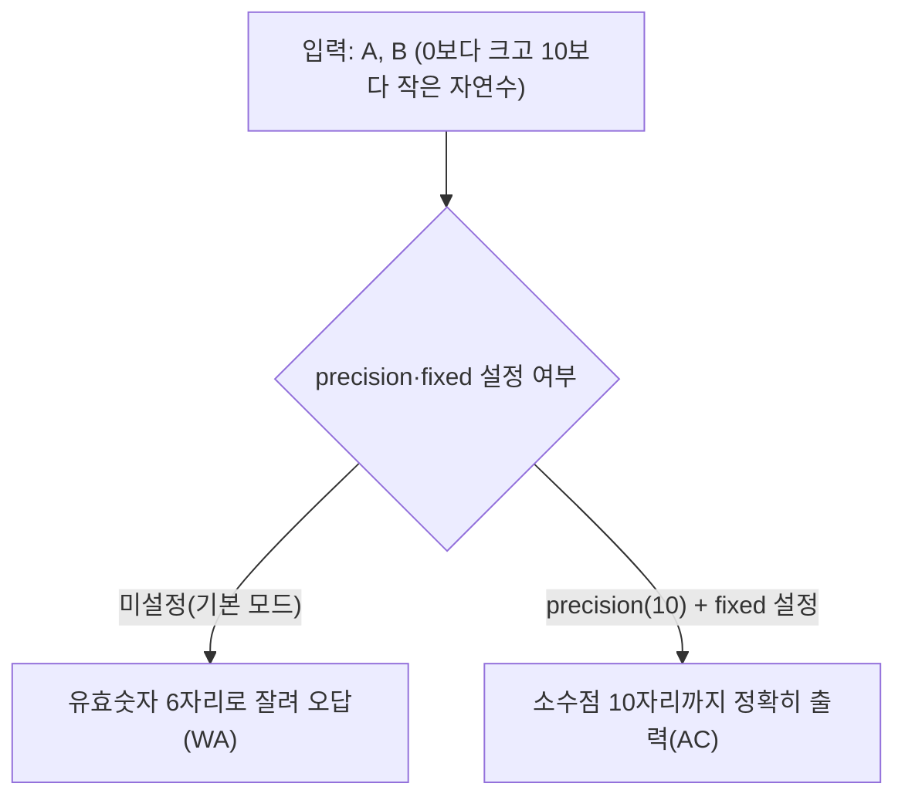

[1008번: A/B](https://www.acmicpc.net/problem/1008) 문제는 두 정수 A와 B를 입력받은 다음, A/B를 출력하는 문제이다. +, -, *를 할 수 있었다면 쉬운 문제로 보인다. 하지만 막상 문제를 풀어보면 실패를 맛 볼 수 있다. 어떤 문제가 있어서 실패를 하는지 알아보자.

## 문제 정보

**문제 링크**: [https://www.acmicpc.net/problem/1008](https://www.acmicpc.net/problem/1008)

**문제 요약**:
두 정수 A와 B를 입력받아 A/B를 출력한다. 실제 정답과 출력값의 절대오차 또는 상대오차가 $10^{-9}$ 이하이면 정답으로 인정한다. 문제 페이지는 "10^-9 이하의 오차를 허용한다는 말이 소수점 아래 9자리까지만 출력하면 된다는 뜻은 아니다"라고 명시적으로 경고한다 — 나눗셈 결과가 정수부를 가지면(예: 12.3456789012) 소수 9자리만으로는 유효숫자가 부족해 오차 범위를 벗어날 수 있다는 뜻이다.

**제한 조건**:
- 시간 제한: 2초
- 메모리 제한: 128MB
- 입력 크기: A, B는 $0 < A, B < 10$인 자연수(한 자리 수)

## 입출력 예제

**입력 1**:
```text
1 3
```

**출력 1**:
```text
0.33333333333333333333333333333333
```

**입력 2**:
```text
4 5
```

**출력 2**:
```text
0.8
```

**설명**: 예제 2는 4/5 = 0.8로 나누어떨어지는데도 채점 서버가 제시한 정답이 후행 0을 덧붙이지 않은 `0.8`이라는 점에 주목할 필요가 있다. 오차 허용 채점이므로 `0.8000000000`처럼 자릿수를 고정해 출력해도 정답으로 인정되지만, 반대로 A, B가 모두 한 자리 수라 해서 짧게 출력해도 되는 것은 아니다 — 예제 1(1/3)처럼 순환소수가 나오는 입력이 훨씬 흔하므로, 항상 소수점 아래 자리수를 넉넉히 고정해 출력하는 전략이 안전하다.

## 문제 이해

백준 1008번 문제는 두 정수 A와 B를 입력받아 A/B를 출력하는 간단한 문제처럼 보이지만, 실제로는 floating-point 처리와 output formatting에 대한 이해가 필요한 문제이다. 특히, C++에서 실수를 다룰 때 발생할 수 있는 문제점들을 명확히 이해하고 있어야 한다.

`std::cout`은 아무 설정 없이 실수를 출력하면 기본적으로 유효숫자 6자리까지만 표시하는 모드로 동작한다. 문제가 요구하는 정밀도(오차 $10^{-9}$ 이하)를 맞추려면 출력 모드 자체를 바꿔야 하며, 이 분기가 이 문제의 핵심이다.



## 시행 착오

```cpp
#include <iostream>

int main()
{
    double a, b;
    std::cin >> a >> b;
    std::cout << a / b;
}
```

간단하게 생각하고 위의 코드처럼 작성하였지만 결과는 실패한다.

결과물을 확인할 수 있는 IDE나 [Online compiler](https://rextester.com/l/cpp_online_compiler_gcc)를 사용하면 **소수점**이 짤리는 것을 확인할 수 있다.

## 소수점 짤리지 않게 출력하는 방법

`cin`, `cout`을 사용할 경우 입력은 문제가 없지만 출력의 경우 약간 복잡하다. 두 가지를 알아야 소수점 자리를 고정하여 출력할 수 있다.

하나는 `std::fixed`, 또 하나는 `std::cout.precision()`이다.

```cpp
std::fixed // 소수점 아래로 고정
std::cout.precision(n);	// 실수 전체 자리수 중 n자리까지 표현
```

일단, `precision()`에 대해 말하자면 출력할 실수 전체 자리수를 n자리로 표현하는 것이다. 소수점 아래로 n자리만큼 고정하는 것이 아니다.

아래 예시를 보자.

```cpp
#include <iostream>

int main()
{
    double a = 1234.5678;
    std::cout.precision(6);

    std::cout << a;	// 1234.567에서 반올림된 1234.57이 출력됨
}
```

위와 같이 실수 전체에 대한 자리수 표현이므로 만약 오차범위를 넉넉하게 주려면 `precision`의 파라미터를 큰 수로 넘겨주어야 한다. 뒤에서 살펴볼 `fixed`가 켜지면 같은 `precision(6)`이 "소수점 아래 6자리"를 의미하도록 바뀐다 — 정수부가 큰 값일수록 두 모드의 출력 자릿수 차이가 커진다.

만약 정수 부분은 신경쓰지 않고 소수점 아래로만 고정하고 싶은 경우는 어떻게 하느냐..

이럴 때 쓰는 것이 `fixed`이다.

`fixed`는 고정 소수점 표기로 만약 `fixed`를 쓰면 그 다음부터 들어오는 출력들은 소수점 아래로 설정한 `precision`으로 넘겨준 값만큼 출력이 된다.

즉, 다음과 같다는 말이다.

```cpp
#include <iostream>

int main()
{
    double a = 3333.333333;
    
    std::cout.precision(6);
    
    std::cout << a << std::endl; // 3333.33이 출력됨
    
    std::cout << std::fixed; // 고정 소수점 표기로 전환
    std::cout << a << std::endl; // 3333.333333이 출력됨
    
    std::cout.unsetf(std::ios::fixed); // 고정 소수점 표기 해제

    std::cout << a << std::endl; // 3333.33이 출력됨
}
```

위처럼 만약에 `fixed`를 해제하고 싶다면 `cout.unsetf()`에 `std::ios::fixed`를 넘겨주면 된다.

## 정답 코드

```cpp
// 42jerrykim.github.io에서 더 많은 정보를 확인할 수 있다
#include <iostream>

int main()
{
    std::cout.precision(10);
    std::cout << std::fixed; 

    double a, b;
    std::cin >> a >> b;
    std::cout << a / b;
}
```

문제 페이지가 경고하듯 "소수점 아래 9자리까지만 출력"이라는 문구를 문자 그대로 해석하면 안 된다. 나눗셈 결과가 두 자리 이상의 정수부를 가지면(예: `12.345678901`) `precision(9)`로는 소수부 9자리를 보장하지 못하므로, 여유를 두고 `precision(10)`을 주었다. `fixed`가 켜진 상태에서 `precision(n)`은 "전체 유효숫자 n자리"가 아니라 "소수점 아래 n자리"를 의미하도록 의미가 바뀐다는 점이 이 코드가 동작하는 핵심 근거다.

## 복잡도 분석

| 항목 | 복잡도 | 비고 |
|---|---|---|
| **시간 복잡도** | $O(1)$ | 입력 2개를 읽고 나눗셈 1회, 출력 1회 — 입력 크기와 무관 |
| **공간 복잡도** | $O(1)$ | `double` 변수 2개만 사용, 별도 자료구조 없음 |

## 주의할 점

1. **Precision 문제**: C++에서 실수 연산은 floating-point 방식을 사용하기 때문에 precision 문제가 발생할 수 있다. 이는 특히 소수점 이하 자릿수가 많은 경우에 두드러진다.
2. **Output format**: 기본적으로 `cout`은 실수를 출력할 때 유효숫자 6자리로 제한하며, 필요하면 scientific notation으로 자동 전환한다. 따라서 정확한 출력을 위해 output format을 명시적으로 설정해야 한다.
3. **`double`의 정밀도 한계**: `double`은 일반적으로 64비트 floating-point(IEEE 754)를 사용해 약 15–17자리의 유효숫자를 표현할 수 있지만, 모든 십진 소수를 정확히 표현하지는 못한다. 이 문제는 A, B가 한 자리 자연수라 나눗셈 결과의 오차가 크지 않지만, 더 큰 입력을 다루는 문제에서는 이 한계가 직접적인 오답 원인이 될 수 있다.

## 코너 케이스 및 실수 포인트

| 케이스 | 설명 | 처리 방법 |
|---|---|---|
| **순환소수** | 예: 1/3 = 0.333... | `precision`을 충분히 크게(10 이상) 주어 오차 $10^{-9}$ 이내를 보장 |
| **나누어떨어지는 값** | 예: 4/5 = 0.8 | 후행 0을 붙여 `0.8000000000`으로 출력해도 오차 허용 채점이므로 정답 |
| **`fixed` 없이 `precision`만 설정** | `precision(n)`이 정수부 포함 전체 자리수로 해석됨 | `fixed`를 반드시 함께 설정해 "소수점 아래 n자리" 의미로 전환 |
| **오버플로우 걱정은 불필요** | 답이 $2^{31}$을 넘는 정수형 문제와 달리, 이 문제는 A, B가 $0 < A, B < 10$인 한 자리 자연수라 나눗셈 결과의 정수부가 한 자리를 넘지 않음 | `long long` 등 자료형 확장이 필요 없다 — `double` 그대로 충분 |

## 이 글로 확인할 수 있는 것

- `std::cout.precision(n)`을 `std::fixed` 없이 쓸 때와 함께 쓸 때 출력 자릿수가 왜 달라지는지 설명할 수 있다.
- 1/3처럼 순환소수가 나오는 입력과 4/5처럼 나누어떨어지는 입력 모두에 대해, 오차 허용 채점($10^{-9}$ 이하) 범위 안에서 안전하게 출력하는 자릿수 설정 전략을 고를 수 있다.
- 이 문제가 정수 오버플로우와 무관한 이유(A, B가 한 자리 자연수)를 근거를 들어 설명할 수 있다.

## 참고 문헌 및 출처

- [백준 1008번: A/B](https://www.acmicpc.net/problem/1008) (acmicpc.net 채점 서비스 점검 중이면 [Wayback Machine 아카이브(2026-04-26)](https://web.archive.org/web/20260426064847/https://www.acmicpc.net/problem/1008)로 문제 제약을 확인할 수 있다)
- [cppreference: std::fixed](https://en.cppreference.com/w/cpp/io/manip/fixed)
- [cppreference: std::ios_base::precision](https://en.cppreference.com/w/cpp/io/ios_base/precision)
- 이어서 풀어볼 문제: [백준 15792번: A/B - 2](https://www.acmicpc.net/problem/15792)(같은 계열의 심화 버전)
