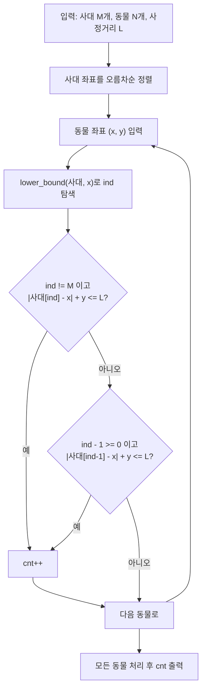

[8983번: 사냥꾼](https://www.acmicpc.net/problem/8983) 문제는 2차원 평면의 공간에 N마리의 동물이 자리잡고 있고, X축에 M개의 사대(총을 쏘는 장소)가 있다. 사정거리 L이 주어질때 잡을 수 있는 동물의 수를 출력하는 문제이다.

||
|:---:|
|사대는 작은 사각형으로, 동물의 위치는 작은 원으로 표시되어 있다. 사정거리 L이 4라고 하면, 점선으로 표시된 영역은 왼쪽에서 세 번째 사대에서 사냥이 가능한 영역이다.|

## 문제 분석

사대의 수 M (1 ≤ M ≤ 100,000), 동물의 수 N (1 ≤ N ≤ 100,000), 사정거리 L (1 ≤ L ≤ 1,000,000,000)으로 입력이 주어지는데, 단순히 사냥꾼을 기준으로 잡을 수 있는 동물을 순회하는것은 $$ O(M \times N) $$ 의 복잡도를 가진다.

어떤 사냥꾼이 잡을수 있는지는 중요하지 않다. 역으로 생각해서 동물을 잡을 수 있는 사냥꾼이 있는지 판단하는 식으로 코드를 작성한다.

## 접근 방식 및 로직 설계

핵심 관찰은 "각 사냥꾼이 어떤 동물을 잡는가"가 아니라 "각 동물을 잡을 수 있는 사냥꾼이 존재하는가"로 질문을 뒤집는 데 있다. 사대는 X축 위의 정수 좌표이므로 오름차순으로 정렬해 두면, 특정 동물의 x좌표에 가장 가까운 사대는 `lower_bound`로 $$ O(\log M) $$ 만에 찾을 수 있다. 가장 가까운 후보는 `lower_bound`가 반환하는 위치의 사대이거나 그 바로 앞 사대뿐이므로(정렬된 배열에서 특정 값에 가장 가까운 원소는 삽입 위치의 좌우 이웃으로 한정된다), 동물 하나당 두 지점만 비교하면 충분하다. 이렇게 정렬 후 이분 탐색으로 순회를 대체하면 전체 복잡도가 $$ O(M \times N) $$ 에서 $$ O((M + N) \log M) $$ 으로 줄어든다.



1. 먼저 lower_bound(이분탐색) 함수를 사용하기위해서, 입력받은 발사대를 오름차순 정렬을 해준다.
2. 동물을 입력받음과 동시에, 동물의 x좌표와 가까운 발사대를 lower_bound를 통해 찾는다.
3. 해당 발사대와의 거리가 L 이하라면, cnt++를 해준다.
4. 해당 발사대와 거리가 멀다면 , 해당 발사대의 이전 발사대를 조사해 L 이하라면 cnt++를 해준다.

> 주의 : Lower_bound 함수는 해당 배열 혹은 벡터에서 key값과 같은 값을 찾고, 만약 없다면 key값보다 큰 가장 작은 정수를 찾아준다. 따라서 해당 key값이 배열 혹은 벡터의 마지막원소 (제일 큰 원소) 보다 크다면, 배열/벡터의 크기(size)를 리턴해주기 때문에, out of index 처리를 잘 해주어야 한다.

## 구현 코드

```cpp
// 42jerrykim.github.io에서 더 많은 정보를 확인할 수 있다
#include<iostream>	
#include<algorithm>	
#include<vector>	
#include<cmath>	
using namespace std;
	
vector<long long> M;
	
int main() {
	ios_base::sync_with_stdio(0);	
	cin.tie(0);	
	long long n, m, l, cnt = 0;
	
	cin >> m >> n >> l;
	
	for (long long i = 0; i < m; i++) {	
		long long data;	
		cin >> data;	
		M.push_back(data);	
	}
	
	sort(M.begin(), M.end());
	
	for (long long i = 0; i < n; i++) {	
		long long x, y;	
		cin >> x >> y;
	
		long long ind = lower_bound(M.begin(), M.end(), x) - M.begin();	
		if (ind!=m&&abs(M[ind] - x) + y <= l) cnt++;	
		else if (ind - 1 >= 0 && abs(M[ind - 1] - x) + y <= l) cnt++;	
	}
	
	cout << cnt;	
}
```

## 복잡도 분석

| 항목 | 복잡도 | 비고 |
|---|---|---|
| **시간 복잡도** | $O((M + N) \log M)$ | 사대 정렬 $O(M \log M)$ + 동물 N마리마다 이분 탐색 $O(N \log M)$. 제약상 M과 N의 범위가 동일해 $O(N \log N)$으로도 표기 가능 |
| **공간 복잡도** | $O(M)$ | 사대 좌표를 담는 벡터 `M` 하나만 저장하고, 동물 좌표는 입력받는 즉시 처리해 별도 배열에 저장하지 않는다 |

## 코너 케이스 및 실수 포인트

| 케이스 | 설명 | 처리 방법 |
|---|---|---|
| **최소 입력** | N=1 또는 빈 입력 | 반복문 범위·예외 처리 확인 |
| **오버플로우** | 위험은 최종 답 `cnt`(최대 N=100,000이라 오버플로우와 무관)가 아니라 좌표 거리 계산 중간값 `abs(사대[ind] - x) + y`에 있음 — 사대 좌표와 사정거리 L이 모두 10⁹ 단위로 주어지므로 이 중간값이 int32 표현 범위에 근접하거나 초과할 수 있음 | 좌표·거리 계산에 쓰이는 변수를 모두 `long long`으로 선언 |

## 접근법 비교: 언제 이분 탐색을 쓰는가

이 문제는 사대 좌표가 미리 모두 주어진 뒤 동물 좌표를 순서대로 처리하는 오프라인(batch) 구조라 정렬 후 이분 탐색이 자연스럽다. 하지만 항상 최선은 아니다. 이분 탐색이 유리한 경우는 기준 집합(사대)이 먼저 고정되고, 이후 질의(동물)마다 "가장 가까운 원소"를 반복 조회해야 할 때다. 전처리 $$ O(M \log M) $$ 한 번으로 질의당 $$ O(\log M) $$ 을 얻기 때문이다. 반대로 사대와 동물을 모두 좌표 기준으로 함께 정렬해 한 방향으로만 훑을 수 있다면, 즉 질의가 좌표순으로 들어오거나 좌표순으로 재배열해도 무방하다면 투 포인터로 $$ O(M + N) $$ 에 처리할 수 있어 로그 인자를 없앨 수 있다. 다만 원래 입력 순서를 출력에 유지해야 하거나 질의가 온라인(실시간)으로 들어오면 투 포인터의 전제가 깨진다.

두 방식의 트레이드오프는 명확하다. 이분 탐색은 구현이 단순하고 질의 순서에 제약이 없어 범용적이지만 $$ \log M $$ 인자가 남는다. 투 포인터는 더 빠르지만 "두 배열을 동시에 좌표순으로 훑을 수 있다"는 전제가 무너지면 정확성이 깨지므로 적용 범위가 좁다. M, N이 모두 100,000 이하인 이 문제 규모에서는 두 방식의 실행 시간 차이가 체감되지 않으므로, 구현 단순성과 범용성을 우선해 이분 탐색을 선택하는 것이 합리적이다.

## 평가 기준

이 글을 읽은 후 다음을 스스로 확인할 수 있어야 한다. 첫째, "각 사냥꾼이 어떤 동물을 잡는가"를 "각 동물을 잡을 수 있는 사냥꾼이 존재하는가"로 뒤집는 역발상이 왜 $$ O(M \times N) $$ 을 $$ O((M+N)\log M) $$ 으로 줄이는지 설명할 수 있어야 한다. 둘째, 정렬된 배열에서 특정 값에 가장 가까운 원소가 `lower_bound`가 반환하는 위치와 그 직전 위치, 단 둘로 한정되는 이유를 근거를 들어 설명할 수 있어야 한다. 셋째, 이 문제에 이분 탐색과 투 포인터 중 어느 쪽이 더 적합한지, 그리고 어떤 조건이 바뀌면 선택이 달라지는지 판단할 수 있어야 한다. 넷째, 답의 최종 값과 계산 중간값의 범위가 다를 수 있음을 인지하고, `long long` 선언이 필요한 지점을 정확히 짚어낼 수 있어야 한다.

## 참고 문헌 및 출처

- [8983번: 사냥꾼](https://www.acmicpc.net/problem/8983)
- [std::lower_bound - cppreference.com](https://en.cppreference.com/w/cpp/algorithm/lower_bound)
- [이진 탐색 - 위키백과](https://ko.wikipedia.org/wiki/%EC%9D%B4%EC%A7%84_%ED%83%90%EC%83%89)
