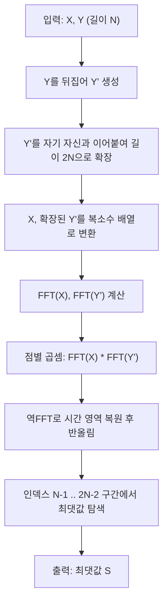

BOJ 1067번은 배열을 순환 이동시키며 내적의 최댓값을 구하는 문제다. 모든 이동 경우의 수를 직접 계산하면 O(N²)이지만, N이 최대 60,000이라 1초 안에 통과할 수 없다. 이 문제의 핵심 인사이트는 "순환 이동시켜 가며 계산하는 내적의 최댓값"이 신호 처리에서 말하는 순환 상관(circular correlation)과 정확히 같은 형태라는 점을 알아채고, 이를 FFT로 O(N log N)에 계산 가능한 컨볼루션(convolution)으로 환원하는 것이다.

||
|:---:|
|배열의 순환 이동을 형상화한 이미지|

## 문제 정보

**문제 링크**: [https://www.acmicpc.net/problem/1067](https://www.acmicpc.net/problem/1067)(BOJ 서버 점검 시 [Wayback Machine 아카이브본](https://web.archive.org/web/20260417010741/https://www.acmicpc.net/problem/1067)으로 대체 확인 가능)

**문제 요약**:
N개의 수로 이루어진 두 수열 X, Y가 주어진다. Y를 원하는 횟수만큼 순환 이동시킬 수 있는데, 순환 이동이란 마지막 원소를 제거하고 그 값을 맨 앞에 다시 삽입하는 연산이다(예: `{1, 2, 3}` → `{3, 1, 2}`). 순환 이동은 0번 이상 수행할 수 있고, 매 이동 후 점수 `S = X[0]×Y[0] + X[1]×Y[1] + ... + X[N-1]×Y[N-1]`를 구할 때 이 S의 최댓값을 찾는 문제다.

**제한 조건**:
- 시간 제한: 1초
- 메모리 제한: 512MB
- $1 \le N \le 60{,}000$
- X, Y의 모든 원소는 0 이상 100 미만인 자연수 또는 0

## 입출력 예제

**입력 1**:
```text
4
1 2 3 4
6 7 8 5
```

**출력 1**:
```text
70
```

**설명**: Y를 한 번 순환 이동시키면 `{5, 6, 7, 8}`이 되고, 이때 점수는 `1×5 + 2×6 + 3×7 + 4×8 = 5 + 12 + 21 + 32 = 70`으로 전체 이동 중 최댓값이다(0번 이동 시 64, 2번 이동 시 64, 3번 이동 시 62).

**입력 2**:
```text
5
1 1 1 1 1
1 1 1 1 1
```

**출력 2**:
```text
5
```

## 접근 방식 및 로직 설계

Y를 k번 순환 이동시킨 배열을 $Y_k$라 하면 $Y_k[i] = Y[(i-k) \bmod N]$이고, 구하려는 값은 다음과 같다.

$$C[k] = \sum_{i=0}^{N-1} X[i] \cdot Y[(i-k) \bmod N], \quad k = 0, 1, \dots, N-1$$

이 식은 X와 Y의 <strong>순환 상관(circular correlation)</strong>이다. 상관과 컨볼루션의 차이는 한쪽 수열의 인덱스 부호뿐이므로, **Y를 뒤집으면** 상관을 컨볼루션으로 바꿀 수 있다. 뒤집은 Y를 $Y'$($Y'[j] = Y[N-1-j]$)라 하고, X와 $Y'$을 선형 컨볼루션하면 다음을 얻는다.

$$(X * Y')[m] = \sum_{i} X[i] \cdot Y'[m-i]$$

여기서 $Y'$을 길이 $2N$이 되도록 자기 자신과 이어붙이면(순환 경계를 넘는 인덱스가 $Y'$ 뒤쪽 사본에서 이어지도록), $m = N-1, N, \dots, 2N-2$ 구간의 컨볼루션 값이 정확히 $C[0], C[1], \dots, C[N-1]$과 일치한다. 즉 **Y를 뒤집지 않고 그대로 두 배로 늘리기만 하면 이 등식이 성립하지 않는다** — 뒤집기는 상관을 컨볼루션으로 바꾸는 데 필수적인 단계이며, 뒤집지 않은 컨볼루션은 전혀 다른 값을 계산한다.

이 등식이 실제로 성립하는지 입출력 예제 1(N=4, X={1,2,3,4}, Y={6,7,8,5})로 직접 검산해 보면 접근 방식을 신뢰할 수 있다. Y를 뒤집으면 $Y'=\{5,8,7,6\}$이고, $Y'$을 이어붙인 확장 배열은 $\{5,8,7,6,5,8,7,6\}$이다. 컨볼루션 결과의 인덱스 $m=N-1=3$ 항은 $X[0]Y'[3]+X[1]Y'[2]+X[2]Y'[1]+X[3]Y'[0] = 1\cdot6+2\cdot7+3\cdot8+4\cdot5 = 64$로, 0번 순환 이동(Y를 그대로 두었을 때의 점수 $C[0]=1\cdot6+2\cdot7+3\cdot8+4\cdot5=64$)과 정확히 일치한다. 다음 항인 $m=4$는 $X[0]Y'[4]+X[1]Y'[3]+X[2]Y'[2]+X[3]Y'[1] = 1\cdot5+2\cdot6+3\cdot7+4\cdot8 = 70$으로, Y를 한 번 순환 이동시킨 뒤의 점수 $C[1]$과 같다. 이 값이 바로 예제 1의 정답이다. 이렇게 $m=N-1+k$가 $C[k]$에 대응한다는 사실을 손으로 확인해 두면, 왜 하필 인덱스 구간이 `[N-1, 2N-2]`인지, 왜 그 밖의 인덱스는 버려도 되는지가 코드를 외우지 않고도 자연스럽게 이해된다.

컨볼루션 자체는 다항식 곱셈과 동일한 연산이므로, X와 $Y'$을 계수로 하는 두 다항식을 FFT로 값 표현(point-value representation)으로 바꿔 점별 곱셈을 한 뒤 역FFT로 되돌리면 O(N log N)에 계산할 수 있다. 여기서 쓰는 FFT는 길이 $n$의 이산 푸리에 변환을 절반 크기 두 개의 변환으로 재귀적으로 쪼개 O(n log n)에 계산하는 분할 정복 알고리즘이다. 이와 유사한 아이디어는 가우스가 1805년 미출간 원고에서 이미 다뤘다고 알려져 있으나, 이를 독립적으로 재발견해 O(n log n) 복잡도 분석과 함께 논문으로 발표하고 널리 알린 것이 Cooley와 Tukey의 1965년 논문이다(참고 문헌 참조).



전체 로직은 세 단계로 나뉜다.

1. **전처리**: Y를 반전시키고, 반전된 Y를 자기 자신과 이어붙여 길이 2N인 확장 배열을 만든다.
2. **메인 로직**: X(길이 N)와 확장된 Y'(길이 2N)를 FFT 기반 다항식 곱셈으로 컨볼루션한다. 내부적으로 두 배열의 길이 합(3N) 이상인 2의 거듭제곱 크기로 패딩한 뒤, 정방향 FFT → 점별 곱셈 → 역FFT 순으로 진행한다.
3. **후처리**: 컨볼루션 결과 배열에서 인덱스 `N-1`부터 `2N-2`까지의 구간이 각각 0번부터 N-1번 순환 이동에 대응하므로, 이 구간의 최댓값을 반올림해 출력한다.

## 복잡도 분석

| 항목 | 복잡도 | 비고 |
|---|---|---|
| **시간 복잡도** | $O(N \log N)$ | FFT 크기가 $3N$ 이상의 2의 거듭제곱으로 패딩되므로 실제 상수는 X, Y를 각각 O(N²)로 비교하는 완전 탐색(약 $3.6 \times 10^9$ 연산, N=60,000 기준)보다 훨씬 작다 |
| **공간 복잡도** | $O(N)$ | 복소수 배열(`vector<complex<double>>`)이 FFT 패딩 크기(약 $2^{18} \approx 262{,}144$)만큼 필요하다 |

## 구현 코드

아래 `fft` 함수의 이중 루프(L159-165)는 인접한 두 값 `u`, `v`를 `u+v`, `u-v`로 동시에 갱신하는데, 이 갱신 패턴을 도식으로 그리면 나비가 날개를 펼친 모양과 닮았다고 해서 **버터플라이(butterfly) 연산**이라 부른다. Cooley-Tukey 알고리즘이 O(n²)이 아니라 O(n log n)에 끝나는 이유가 바로 이 버터플라이 연산 하나가 재귀 깊이 $\log n$ 단계마다 전체 배열을 한 번씩만 훑기 때문이다.

### C++

```cpp
// 42jerrykim.github.io에서 더 많은 정보를 확인할 수 있다
#include <iostream>
#include <vector>
#include <complex>
#include <cmath>
#include <algorithm>

const double PI = acos(-1);

// FFT 함수: invert가 false면 정방향 FFT, true면 역FFT
void fft(std::vector<std::complex<double>>& a, bool invert) {
    int n = a.size();
    for (int i = 1, j = 0; i < n; ++i) {
        int bit = n >> 1;
        for (; j & bit; bit >>= 1)
            j ^= bit;
        j ^= bit;
        if (i < j)
            std::swap(a[i], a[j]);
    }

    for (int len = 2; len <= n; len <<= 1) {
        double angle = 2 * PI / len * (invert ? -1 : 1);
        std::complex<double> wlen(cos(angle), sin(angle));
        for (int i = 0; i < n; i += len) {
            std::complex<double> w(1);
            for (int j = 0; j < len / 2; ++j) {
                std::complex<double> u = a[i + j];
                std::complex<double> v = a[i + j + len / 2] * w;
                a[i + j] = u + v;
                a[i + j + len / 2] = u - v;
                w *= wlen;
            }
        }
    }

    if (invert) {
        for (std::complex<double>& x : a)
            x /= n;
    }
}

// 두 다항식(=수열)의 컨볼루션을 FFT로 계산
std::vector<int> multiply(const std::vector<int>& a, const std::vector<int>& b) {
    std::vector<std::complex<double>> fa(a.begin(), a.end()), fb(b.begin(), b.end());
    int n = 1;
    while (n < (int)(a.size() + b.size()))
        n <<= 1;
    fa.resize(n);
    fb.resize(n);

    fft(fa, false);
    fft(fb, false);
    for (int i = 0; i < n; ++i)
        fa[i] *= fb[i];
    fft(fa, true);

    std::vector<int> result(n);
    for (int i = 0; i < n; ++i)
        result[i] = round(fa[i].real());
    return result;
}

int main() {
    int n;
    std::cin >> n;
    std::vector<int> x(n), y(n);

    for (int i = 0; i < n; ++i)
        std::cin >> x[i];
    for (int i = 0; i < n; ++i)
        std::cin >> y[i];

    // 순환 상관(correlation)을 컨볼루션으로 바꾸기 위해 Y를 반전시킨다.
    // 반전 없이 그대로 두 배로 늘리면 아래 multiply()의 결과가 실제 순환 이동 점수와 달라진다.
    std::reverse(y.begin(), y.end());

    std::vector<int> extended_y = y;
    extended_y.insert(extended_y.end(), y.begin(), y.end()); // Y'를 두 배 길이로 확장

    std::vector<int> result = multiply(x, extended_y);

    // 인덱스 [N-1, 2N-2] 구간이 순환 이동 0..N-1번에 대응한다.
    int max_value = *std::max_element(result.begin() + n - 1, result.begin() + 2 * n - 1);

    std::cout << max_value << std::endl;
    return 0;
}
```

## 코너 케이스 및 실수 포인트

아래 표는 이 문제를 처음 풀 때 실제로 자주 틀리는 지점을 정리한 것이다. 특히 앞의 두 항목은 겉보기엔 정답처럼 보이는 코드가 조용히 틀린 값을 내는 원인이므로, 제출 전에 반드시 직접 검산해 보는 것이 좋다.

| 케이스 | 설명 | 처리 방법 |
|---|---|---|
| **Y 반전 누락** | 반전 없이 Y를 그대로 두 배로 늘려 컨볼루션하면 순환 상관이 아니라 다른 값이 계산됨 | `std::reverse(y.begin(), y.end())`를 확장 전에 반드시 실행 |
| **최댓값 탐색 구간 오류** | 컨볼루션 결과 전체에서 최댓값을 찾으면 순환 이동과 무관한 구간까지 포함됨 | 인덱스 `[N-1, 2N-2]`(정확히 N개 구간)만 탐색 |
| **최소 입력** | N=1 | 순환 이동해도 배열이 바뀌지 않으므로 `X[0]×Y[0]`이 곧 답 |
| **FFT 정밀도 오차** | `double` 기반 FFT는 부동소수점 반올림 오차를 포함하므로, 결과를 정수로 캐스팅하기 전 `round()`가 필요 | 코드의 `round(fa[i].real())`처럼 반올림 후 정수 변환 |
| **오버플로우** | X, Y 원소가 최대 99, N이 최대 60,000이므로 이론상 최댓값은 약 $99 \times 99 \times 60{,}000 \approx 5.9 \times 10^8$로 `int` 범위(약 $2.1 \times 10^9$) 안에 들지만, 여유를 두려면 `long long` 사용 |

## 마무리

**언제 FFT가 필요한가**: 앞서 복잡도 분석에서 확인했듯 이 문제는 N이 60,000까지 커질 수 있어 O(N²) 완전 탐색이 1초 제한을 통과할 수 없다. 반대로 N이 수백–수천 수준으로 작다면 완전 탐색이 더 단순하고 안전한 선택이다. FFT는 구현 복잡도와 부동소수점 오차라는 비용을 감수하는 대신 O(N log N)을 얻는 트레이드오프이므로, 제한 조건을 먼저 확인하고 완전 탐색이 통과할 수 없을 때만 도입하는 것이 합리적이다.

**정확한 정수 답이 필요할 때의 대안**: 이 문제처럼 원소 범위가 작아 `double` 반올림으로 오차가 흡수되는 경우는 문제가 없지만, 곱의 합이 매우 커지거나 모듈러 연산이 필요한 문제에서는 부동소수점 FFT 대신 정수론적 변환인 NTT(Number Theoretic Transform)를 쓴다. NTT는 복소수 대신 특정 소수 모듈러 위에서의 원시근을 사용해 반올림 오차 없이 정확한 정수 컨볼루션을 계산한다.

## 참고 문헌 및 출처

- [백준 1067번: 이동](https://www.acmicpc.net/problem/1067)
- [Cooley, J. W. & Tukey, J. W. (1965), "An Algorithm for the Machine Calculation of Complex Fourier Series", Mathematics of Computation 19(90), pp. 297–301 (AMS 원문 PDF)](https://www.ams.org/journals/mcom/1965-19-090/S0025-5718-1965-0178586-1/S0025-5718-1965-0178586-1.pdf)
- [CP-Algorithms: Fast Fourier transform](https://cp-algorithms.com/algebra/fft.html)
- [Wikipedia: Cross-correlation](https://en.wikipedia.org/wiki/Cross-correlation)

## 이 글을 읽은 후 확인할 것

- 순환 이동으로 정의된 문제를 "순환 상관" 형태의 수식으로 옮겨 쓸 수 있는가?
- 상관을 컨볼루션으로 바꾸기 위해 왜 한쪽 수열을 반전시켜야 하는지 설명할 수 있는가?
- 컨볼루션 결과 배열에서 어느 구간이 원하는 순환 이동 횟수에 대응하는지 인덱스를 직접 유도할 수 있는가?
- N의 크기만 보고 완전 탐색과 FFT 중 어느 쪽을 선택할지 판단할 수 있는가?
- FFT 대신 NTT를 써야 하는 상황(정확한 정수 답이 필요한 경우)을 구분할 수 있는가?
