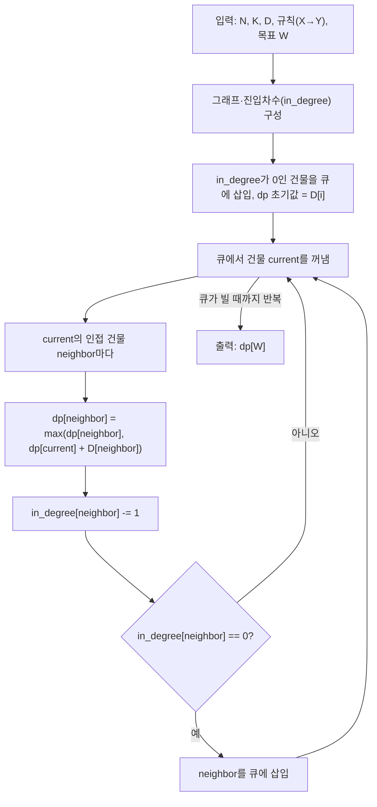

ACM Craft 문제는 여러 건물을 짓기 위해 주어진 순서와 시간을 고려하여 특정 건물을 완성하는 데 필요한 최소 시간을 계산하는 문제이다. 각 건물은 다른 건물들이 완성된 후에야 지을 수 있으며, 주어진 건설 순서 규칙에 따라 건물들 간의 의존 관계가 형성된다. 이 문제의 핵심은 "각 건물의 완료 시각"을 사이클 없는 방향 그래프(DAG) 위에서 위상 정렬 순서로 계산하는 것으로, 이는 프로젝트 관리에서 전체 완료 시간을 구하는 크리티컬 패스(critical path) 계산과 본질적으로 같은 문제다.

## 문제 정보

**문제 링크**: [Wayback Machine 아카이브본](https://web.archive.org/web/20260416035324/https://www.acmicpc.net/problem/1005)(원본 주소 `acmicpc.net/problem/1005`가 현재 서비스 점검으로 접근 불가하여 아카이브 링크로 대체)

**문제 요약**:
N개의 건물과 K개의 건설 순서 규칙이 주어진다. 규칙 `X Y`는 "건물 X를 완성해야 건물 Y를 지을 수 있다"는 선행 관계를 의미한다. 각 건물 i를 짓는 데는 D[i]의 시간이 걸리며, 여러 선행 건물이 있는 경우 그중 가장 늦게 끝나는 건물의 완료 시각이 지나야 다음 건물의 건설을 시작할 수 있다. 목표 건물 W가 완성되기까지 걸리는 최소 시간을 구하는 것이 이 문제의 목표다.

**제한 조건**:
- 시간 제한: 1초
- 메모리 제한: 512MB
- $2 \le N \le 1{,}000$, $1 \le K \le 100{,}000$
- 건설 순서 규칙의 두 건물 번호와 목표 건물 번호는 $1 \le X, Y, W \le N$
- 각 건물의 건설 시간 $D_i$는 $0 \le D_i \le 100{,}000$인 정수
- 여러 개의 테스트 케이스가 주어지며 각각 독립적으로 처리한다

||
|:---:|
|이미지로 형상화|

## 입출력 예제

**입력 1**:
```text
2
4 4
10 1 100 10
1 2
1 3
2 4
3 4
4
8 8
10 20 1 5 8 7 1 43
1 2
1 3
2 4
2 5
3 6
5 7
6 7
7 8
7
```

**출력 1**:
```text
120
39
```

**설명**: 첫 번째 테스트 케이스는 건물 4개, 규칙 4개, 목표 건물 4번이다. 건물 4를 지으려면 건물 2와 3이 모두 끝나야 하고, 건물 2와 3은 각각 건물 1이 끝나야 시작할 수 있다. 건물 1(10)→건물 3(100)→건물 4(10) 경로가 10+100+10=120으로 건물 1→2→4 경로(10+1+10=21)보다 오래 걸리므로, 두 선행 건물 중 더 늦게 끝나는 경로를 기준으로 답이 120이 된다.

## 접근 방식 및 로직 설계

`dp[i]`를 "건물 i의 건설이 완료되는 시각"으로 정의하면 다음 점화식이 성립한다.

$$dp[i] = D[i] + \max_{j \in \text{pred}(i)} dp[j] \quad (\text{선행 건물이 없으면 } dp[i] = D[i])$$

여기서 min이 아니라 **max**를 취하는 이유가 이 문제의 핵심 통찰이다. 건물 i를 짓기 시작하려면 i의 선행 건물 "전부"가 끝나 있어야 한다 — 하나라도 안 끝났으면 착공할 수 없다. 따라서 착공 가능 시각은 여러 선행 건물 중 가장 늦게 끝나는(제일 오래 걸리는) 건물의 완료 시각으로 정해진다. 이는 PERT/CPM(Critical Path Method)에서 프로젝트 전체 완료 시간이 "가장 긴 작업 경로(critical path)"로 결정되는 것과 동일한 발상이다. 이 점화식이 유효하려면 `dp[j]`가 `dp[i]`보다 먼저 계산돼 있어야 하므로, 선행 관계를 위배하지 않는 순서, 즉 위상 정렬 순서로 dp를 채워야 한다. 문제의 건설 순서 규칙에는 사이클이 없다고 보장되므로(사이클이 있으면 "먼저 지어야 하는 건물"이 서로를 가리켜 애초에 건설이 불가능하다) 위상 정렬이 항상 가능하다.



전체 로직은 세 단계로 나뉜다. 전처리 단계에서는 각 건물의 진입차수(in-degree)와 인접 리스트를 구성하고, 진입차수가 0인 건물(선행 조건이 없는 시작점)을 큐에 넣으며 `dp[i] = D[i]`로 초기화한다. 메인 로직 단계에서는 큐 기반 위상 정렬을 진행하면서, 각 건물을 처리할 때마다 인접한 다음 건물의 `dp` 값을 `max(dp[neighbor], dp[current] + D[neighbor])`로 갱신하고 진입차수를 감소시켜 0이 되면 큐에 추가한다. 후처리 단계는 별도의 계산 없이, 모든 건물이 큐에서 처리돼 위상 정렬이 끝난 시점의 `dp[W]` 값을 그대로 목표 건물 W의 완료 시각(정답)으로 출력하는 것으로 끝난다. 이 큐 기반 처리 순서는 Kahn(1962)이 제안한 위상 정렬 알고리즘 그대로다(참고 문헌 참조) — 진입차수가 0인 정점부터 큐에 넣고 하나씩 소비하며 인접 정점의 진입차수를 줄여 나가는 이 방식은, 재귀 DFS로 후위 순회 후 뒤집는 방식과 함께 위상 정렬의 두 표준 구현 중 하나다.

**대안과의 비교**: 같은 점화식을 재귀 + 메모이제이션(DFS 기반 위상 정렬)으로 구현해도 동일하게 O(N+K)에 풀린다. 다만 N이 최대 1,000이라 이 문제에서는 재귀 깊이가 문제되지 않지만, N이 훨씬 큰 문제에서는 재귀 호출 스택 한도를 넘을 수 있어 큐 기반(Kahn) 방식이 더 안전하다. 벨만-포드로 최장 경로를 구하는 것도 이론적으로는 가능하지만 시간 복잡도가 O(N·K)로, 사이클이 없는 DAG라는 조건을 활용하지 못하고 음수 사이클 검사 같은 불필요한 단계까지 포함하므로, DAG가 보장된 경우에는 위상 정렬 기반 DP가 항상 더 낫다.

## 복잡도 분석

| 항목 | 복잡도 | 비고 |
|---|---|---|
| **시간 복잡도** | $O(N + K)$ | 테스트 케이스당 위상 정렬(간선 순회 K + 정점 순회 N)에 비례 |
| **공간 복잡도** | $O(N + K)$ | 인접 리스트, 진입차수 배열, dp 배열이 각각 정점·간선 수에 비례 |

## 구현 코드

앞의 위상 정렬 로직을 그대로 옮기더라도, 표준 입력을 `input()`으로 한 줄씩 읽는 방식으로 구현하면 이 문제에서는 시간 초과(TLE)를 받는다. N과 K가 각각 최대 1,000과 100,000이고 테스트 케이스가 여러 개 주어지므로, 매 줄마다 `input()`을 호출하면 그 횟수만큼 시스템 콜과 파싱 오버헤드가 누적되기 때문이다. 아래 Python 코드는 `sys.stdin.read()`로 전체 입력을 한 번에 문자열로 읽어 미리 토큰 단위로 분리해 두는 방식으로 이 반복 호출 비용을 없앤다 — 표준 입력 스트림을 한 번만 여는 이 방식은 경쟁 프로그래밍에서 대량 입력을 처리할 때 흔히 쓰는 최적화다.

### Python

```python
# 42jerrykim.github.io에서 더 많은 정보를 확인할 수 있다
from collections import deque
import sys
input = sys.stdin.read

def find_build_time(N, K, build_times, rules, target):
    in_degree = [0] * (N + 1)
    graph = [[] for _ in range(N + 1)]
    dp = [0] * (N + 1)

    for x, y in rules:
        graph[x].append(y)
        in_degree[y] += 1

    queue = deque()
    for i in range(1, N + 1):
        if in_degree[i] == 0:
            queue.append(i)
            dp[i] = build_times[i-1]

    while queue:
        current = queue.popleft()
        for neighbor in graph[current]:
            in_degree[neighbor] -= 1
            dp[neighbor] = max(dp[neighbor], dp[current] + build_times[neighbor-1])
            if in_degree[neighbor] == 0:
                queue.append(neighbor)

    return dp[target]

def main():
    data = input().split()
    idx = 0
    T = int(data[idx])
    idx += 1
    results = []
    for _ in range(T):
        N = int(data[idx])
        K = int(data[idx + 1])
        idx += 2
        build_times = list(map(int, data[idx:idx + N]))
        idx += N
        rules = [tuple(map(int, data[idx + i * 2:idx + i * 2 + 2])) for i in range(K)]
        idx += 2 * K
        target = int(data[idx])
        idx += 1
        results.append(find_build_time(N, K, build_times, rules, target))

    print("\n".join(map(str, results)))

if __name__ == "__main__":
    main()
```

### C++

C++의 `cin`/`cout`은 기본적으로 C 표준 입출력과 동기화되어 있어 느린데, `ios::sync_with_stdio(false)`와 `cin.tie(nullptr)`로 이 동기화를 끊으면 Python의 `sys.stdin.read()`와 같은 목적(입출력 오버헤드 절감)을 C++에서 달성할 수 있다. 아래 코드는 이 두 설정을 적용하고, 앞의 Python 코드와 동일한 Kahn 알고리즘 로직을 그대로 옮긴 것이다.

```cpp
// 42jerrykim.github.io에서 더 많은 정보를 확인할 수 있다
#include <bits/stdc++.h>
using namespace std;

int find_build_time(int N, vector<int>& build_times, vector<vector<int>>& graph, vector<int>& in_degree, int target) {
    vector<int> dp(N + 1, 0);
    queue<int> q;

    for (int i = 1; i <= N; ++i) {
        if (in_degree[i] == 0) {
            q.push(i);
            dp[i] = build_times[i];
        }
    }

    while (!q.empty()) {
        int current = q.front();
        q.pop();
        for (int neighbor : graph[current]) {
            dp[neighbor] = max(dp[neighbor], dp[current] + build_times[neighbor]);
            if (--in_degree[neighbor] == 0) {
                q.push(neighbor);
            }
        }
    }

    return dp[target];
}

int main() {
    ios::sync_with_stdio(false);
    cin.tie(nullptr);

    int T;
    cin >> T;
    while (T--) {
        int N, K;
        cin >> N >> K;

        vector<int> build_times(N + 1);
        for (int i = 1; i <= N; ++i) cin >> build_times[i];

        vector<vector<int>> graph(N + 1);
        vector<int> in_degree(N + 1, 0);
        for (int i = 0; i < K; ++i) {
            int x, y;
            cin >> x >> y;
            graph[x].push_back(y);
            in_degree[y]++;
        }

        int target;
        cin >> target;

        cout << find_build_time(N, build_times, graph, in_degree, target) << "\n";
    }

    return 0;
}
```

## 코너 케이스 및 실수 포인트

| 케이스 | 설명 | 처리 방법 |
|---|---|---|
| **선행 건물이 없는 시작 건물** | in_degree가 0인 건물이 여러 개 존재할 수 있음 | 큐 초기화 시 in_degree가 0인 모든 건물을 넣고 `dp[i] = D[i]`로 시작 |
| **목표 건물 자체가 시작점** | 목표 W에 선행 건물이 전혀 없는 경우 | 위 초기화만으로 `dp[W] = D[W]`가 그대로 정답이 됨(별도 예외 처리 불필요) |
| **여러 선행 건물 중 하나라도 누락** | `min`을 잘못 써서 가장 빨리 끝나는 경로를 기준으로 삼는 실수 | 반드시 `max(dp[neighbor], dp[current] + D[neighbor])`로 갱신(모든 선행 건물이 끝나야 착공 가능) |
| **그래프에 도달하지 않는 정점** | 목표 W와 무관한 건물·컴포넌트가 그래프에 섞여 있음 | 위상 정렬은 그래프 전체를 순회하지만, 최종적으로 필요한 값은 `dp[W]` 하나뿐이므로 무시해도 됨 |
| **오버플로우 우려 없음** | $N \le 1{,}000$, $D_i \le 100{,}000$이므로 dp 최댓값은 최대 $1{,}000 \times 100{,}000 = 1 \times 10^8$ | `int`(약 $2.1 \times 10^9$) 범위 안에 안전하게 들어오므로 `long long`이 필요하지 않음 |

## 마무리

이 문제의 dp 점화식(`max`로 여러 선행 조건 중 가장 늦은 것을 취하는 패턴)은 "DAG에서 가장 긴 경로(longest path in DAG)"를 구하는 문제 유형 전반에 재사용된다. 백준에는 이 패턴을 변형한 문제가 여럿 있는데, 예를 들어 선수과목 이수 순서를 다루는 문제나 작업 스케줄링 문제 대부분이 "위상 정렬 + dp에서 min/max 선택"이라는 동일한 틀로 환원된다. 이런 문제를 만나면 먼저 "완료 시각을 정의하는 점화식에서 min과 max 중 어느 쪽이 문제의 제약(모든 선행 조건 충족 vs 어느 하나만 충족)에 맞는가"를 따져보는 것이 접근의 출발점이다.

## 참고 문헌 및 출처

- [백준 1005번: ACM Craft (Wayback Machine 아카이브본, 2026-04-16)](https://web.archive.org/web/20260416035324/https://www.acmicpc.net/problem/1005)
- [Kahn, A. B. (1962), "Topological sorting of large networks", Communications of the ACM, 5(11), pp. 558–562](https://dl.acm.org/doi/10.1145/368996.369025)

## 이 글을 읽은 후 확인할 것

- dp 점화식에서 왜 `min`이 아니라 `max`를 취해야 하는지 "모든 선행 건물이 끝나야 착공 가능하다"는 조건으로 설명할 수 있는가?
- 이 점화식이 유효하려면 왜 위상 정렬 순서로 dp를 채워야 하는지 설명할 수 있는가?
- Kahn 알고리즘(큐 기반)과 DFS+메모이제이션 중 어떤 상황에서 어느 쪽을 선택할지 판단할 수 있는가?
- `input()` 대신 `sys.stdin.read()`를 쓰는 것이 왜 반복 호출 오버헤드를 줄이는지 설명할 수 있는가?
- 이 문제의 dp 패턴이 PERT/CPM 같은 실무 스케줄링 기법과 어떻게 연결되는지 설명할 수 있는가?
