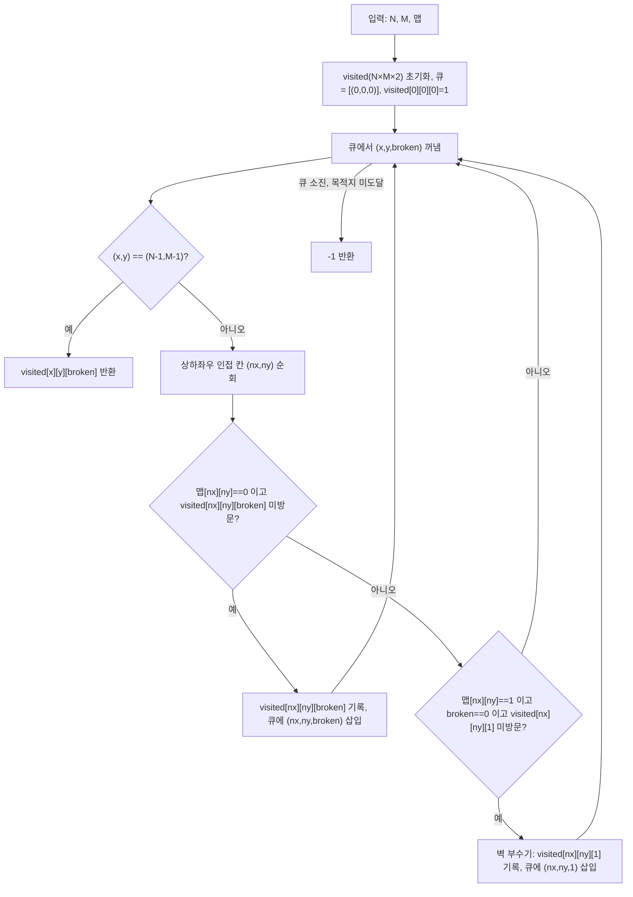

"벽 부수고 이동하기" 문제는 N×M 크기의 격자에서 (1,1)에서 (N,M)까지의 최단 경로를 구하는 문제로, 이동 도중 벽을 최대 한 개까지 부술 수 있다는 조건이 붙는다. 이 조건 때문에 일반적인 2차원 BFS 방문 배열만으로는 정답을 구할 수 없고, "벽을 부쉈는지 여부"까지 방문 상태에 포함시켜야 한다. 이 글은 이 상태 확장(state augmentation) 기법이 왜 필요하고 어떻게 BFS의 최단 경로 보장을 그대로 유지하는지를 중심으로 다룬다.

## 문제 정보

**문제 링크**: [Wayback Machine 아카이브본](http://web.archive.org/web/20260418224055/https://www.acmicpc.net/problem/2206)(원본 주소 `acmicpc.net/problem/2206`이 현재 서비스 점검으로 접근 불가하여 아카이브 링크로 대체)

**문제 요약**:
N×M 행렬로 표현되는 맵이 주어진다. 0은 이동 가능한 칸, 1은 벽이다. (1, 1)에서 (N, M)까지 상하좌우로 이동하며, 지나는 칸 수(시작·끝 칸 포함)가 가장 적은 경로를 찾는다. 이동 중 벽을 최대 한 개까지 부수고 지나갈 수 있으며, 부수는 것이 더 짧은 경로가 된다면 부숴도 된다. 목적지에 도달할 수 없으면 -1을 출력한다.

**제한 조건**:
- 시간 제한: 2초
- 메모리 제한: 192MB
- $1 \le N, M \le 1{,}000$
- (1, 1)과 (N, M)은 항상 0(이동 가능)으로 주어진다

||
|:---:|
|이미지로 형상화|

## 입출력 예제

**입력 1**:
```text
6 4
0100
1110
1000
0000
0111
0000
```

**출력 1**:
```text
15
```

**입력 2**:
```text
4 4
0111
1111
1111
1110
```

**출력 2**:
```text
-1
```

**설명**: 첫 번째 예제는 6×4 맵에서 벽을 한 개 부수면 15칸 만에 (6,4)에 도달할 수 있다. 두 번째 예제는 4×4 맵에서 벽을 한 개까지 부숴도 (4,4)로 가는 경로 자체가 존재하지 않아 -1이 출력된다.

## 접근 방식 및 로직 설계

일반적인 최단 경로 BFS는 `visited[x][y]`라는 2차원 배열로 각 칸을 한 번만 방문하도록 관리한다. 그런데 이 문제에서는 같은 칸 (x, y)라도 "벽을 부수고 도착했는지"에 따라 그 이후 갈 수 있는 경로가 달라진다 — 벽을 이미 부쉈다면 남은 벽은 넘을 수 없고, 아직 부수지 않았다면 앞으로 한 번은 부술 수 있다. 즉 이 문제의 실제 상태는 위치 (x, y)만이 아니라 (x, y, 벽을_부쉈는가)의 순서쌍이며, 상태공간의 크기가 N×M에서 N×M×2로 두 배 늘어난다. 흔한 오개념은 "벽을 부순 경우와 안 부순 경우를 각각 별도로 BFS를 두 번 돌려야 한다"는 것인데, 실제로는 그럴 필요가 없다 — (x, y, 0)과 (x, y, 1)을 같은 그래프 안의 서로 다른 정점으로 취급해 **하나의 결합 상태 그래프**에서 단일 BFS를 한 번만 돌리면 된다.

이 방식이 최단 경로를 보장하는 이유는 BFS의 기본 성질에서 온다. 간선 가중치가 모두 1인 그래프에서 BFS는 정점을 시작점으로부터의 거리가 짧은 순서대로 방문하므로, 어떤 정점을 큐에서 처음 꺼내는 순간의 거리가 곧 그 정점까지의 최단 거리다(Cormen et al., *Introduction to Algorithms*, BFS 단원의 최단 경로 보조정리). 이 성질은 정점이 "(위치, 벽 부순 여부)"라는 복합 상태여도 그대로 성립한다 — 간선(한 칸 이동)의 가중치가 여전히 1이기 때문이다. 따라서 목적지 (N-1, M-1)을 나타내는 두 상태 `(N-1,M-1,0)`과 `(N-1,M-1,1)` 중 큐에서 먼저 꺼내지는 쪽이 곧 전체 최단 경로다. 각 상태에서 이동은 두 종류로 나뉜다.

1. **벽이 아닌 칸으로 이동**: 인접 칸이 0이고 같은 `broken` 값으로 아직 방문하지 않았다면 그대로 이동한다(상태 전이 없음).
2. **벽인 칸을 부수고 이동**: 인접 칸이 1이고, 현재 `broken`이 0(아직 벽을 안 부쉈음)이며 `(nx, ny, 1)`을 아직 방문하지 않았다면, 벽을 부수며 `broken=1` 상태로 전이한다.



**판단 기준 — 언제 상태 확장 BFS를 쓰는가**: 이 문제처럼 "제한된 횟수만큼 특정 규칙을 어길 수 있다"는 조건이 붙으면, 위치에 그 "사용 횟수"를 덧붙여 상태공간을 확장하는 것이 표준 패턴이다. 벽 부수기 허용 횟수가 K개로 늘어나면 상태공간은 N×M×(K+1)로, "특정 색 칸만 K번 밟을 수 있다"처럼 다른 제약이어도 동일한 틀로 일반화된다. 다만 이 패턴은 간선 가중치가 모두 동일할 때만 순수 BFS로 충분하다 — 벽을 부수는 데 추가 비용(예: 2칸 분의 시간)이 든다면 0-1 BFS(deque 기반)나 다익스트라로 바꿔야 한다.

**대안과의 비교**: 다익스트라로도 같은 결합 상태 그래프를 풀 수 있지만, 모든 간선 가중치가 1이므로 우선순위 큐의 $O(\log V)$ 오버헤드만 추가될 뿐 이득이 없다. 반대로 만약 이동 비용이 칸마다 다르다면 단순 BFS는 최단 경로를 보장하지 못하므로 다익스트라나 0-1 BFS로 전환해야 한다 — 이 경계(가중치 균일 여부)가 두 접근을 가르는 기준이다.

## 복잡도 분석

| 항목 | 복잡도 | 비고 |
|---|---|---|
| **시간 복잡도** | $O(N \times M)$ | 상태공간 크기가 $N \times M \times 2$이고 각 상태는 최대 한 번만 큐에 들어가며, 상태당 인접 칸 4개를 상수 시간에 확인 |
| **공간 복잡도** | $O(N \times M)$ | `visited` 배열과 BFS 큐가 각각 상태 수(N×M×2)에 비례 |

## 구현 코드

### Python

```python
# 42jerrykim.github.io에서 더 많은 정보를 확인할 수 있다
from collections import deque
import sys
input = sys.stdin.readline

def bfs(N, M, graph):
    visited = [[[0] * 2 for _ in range(M)] for _ in range(N)]
    queue = deque([(0, 0, 0)])
    visited[0][0][0] = 1

    directions = [(-1, 0), (1, 0), (0, -1), (0, 1)]

    while queue:
        x, y, wall_broken = queue.popleft()

        if x == N - 1 and y == M - 1:
            return visited[x][y][wall_broken]

        for dx, dy in directions:
            nx, ny = x + dx, y + dy

            if 0 <= nx < N and 0 <= ny < M:
                if graph[nx][ny] == 0 and visited[nx][ny][wall_broken] == 0:
                    visited[nx][ny][wall_broken] = visited[x][y][wall_broken] + 1
                    queue.append((nx, ny, wall_broken))

                if graph[nx][ny] == 1 and wall_broken == 0 and visited[nx][ny][1] == 0:
                    visited[nx][ny][1] = visited[x][y][wall_broken] + 1
                    queue.append((nx, ny, 1))

    return -1

def main():
    N, M = map(int, input().split())
    graph = [list(map(int, input().strip())) for _ in range(N)]
    print(bfs(N, M, graph))

if __name__ == "__main__":
    main()
```

### C++

```cpp
// 42jerrykim.github.io에서 더 많은 정보를 확인할 수 있다
#include <bits/stdc++.h>
using namespace std;

int bfs(int N, int M, vector<string>& graph) {
    vector<vector<array<int, 2>>> visited(N, vector<array<int, 2>>(M, {0, 0}));
    queue<tuple<int, int, int>> q;
    q.push({0, 0, 0});
    visited[0][0][0] = 1;

    int dx[4] = {-1, 1, 0, 0};
    int dy[4] = {0, 0, -1, 1};

    while (!q.empty()) {
        auto [x, y, broken] = q.front();
        q.pop();

        if (x == N - 1 && y == M - 1) {
            return visited[x][y][broken];
        }

        for (int d = 0; d < 4; ++d) {
            int nx = x + dx[d], ny = y + dy[d];
            if (nx < 0 || nx >= N || ny < 0 || ny >= M) continue;

            if (graph[nx][ny] == '0' && visited[nx][ny][broken] == 0) {
                visited[nx][ny][broken] = visited[x][y][broken] + 1;
                q.push({nx, ny, broken});
            }
            if (graph[nx][ny] == '1' && broken == 0 && visited[nx][ny][1] == 0) {
                visited[nx][ny][1] = visited[x][y][broken] + 1;
                q.push({nx, ny, 1});
            }
        }
    }

    return -1;
}

int main() {
    ios::sync_with_stdio(false);
    cin.tie(nullptr);

    int N, M;
    cin >> N >> M;
    vector<string> graph(N);
    for (int i = 0; i < N; ++i) cin >> graph[i];

    cout << bfs(N, M, graph) << "\n";
    return 0;
}
```

## 코너 케이스 및 실수 포인트

| 케이스 | 설명 | 처리 방법 |
|---|---|---|
| **N=1, M=1** | 시작 칸과 도착 칸이 같음 | 벽을 부술 필요 없이 즉시 `visited[0][0][0]=1`이 그대로 정답(별도 예외 처리 불필요) |
| **2차원 visited만 사용** | 벽 부순 상태와 안 부순 상태를 구분하지 못하는 실수 | `visited`를 반드시 `[N][M][2]` 3차원으로 선언해 두 상태를 독립적으로 관리 |
| **거리 시작값 혼동** | 문제의 "칸 수"는 시작 칸을 포함하므로 거리를 0이 아니라 1부터 세야 함 | `visited[0][0][0] = 1`로 초기화하고, 이후 갱신도 `이전 값 + 1`로 누적 |
| **벽을 두 번 부수는 실수** | `broken`이 이미 1인 상태에서 다시 벽을 부수려는 전이를 허용 | 벽 부수기 전이는 `broken == 0`일 때만 발생하도록 조건에 명시 |
| **경로가 아예 없는 경우** | 예제 2처럼 벽을 부숴도 도달 불가능한 맵 | 큐가 빌 때까지 목적지에 도달하지 못하면 -1 반환 |

## 이 글을 읽은 후 확인할 것

- 왜 벽을 부순 경우와 안 부순 경우를 각각 별도 BFS로 두 번 돌릴 필요가 없는지, 결합 상태 그래프 관점에서 설명할 수 있는가?
- BFS가 최단 경로를 보장하는 조건(간선 가중치 균일)이 이 문제의 확장된 상태 그래프에서도 왜 그대로 성립하는지 설명할 수 있는가?
- 벽을 K개까지 부술 수 있도록 조건이 바뀌면 상태공간과 `visited` 배열 크기가 어떻게 변하는지 말할 수 있는가?
- 이동 비용이 칸마다 다르게 주어지면 왜 단순 BFS 대신 0-1 BFS나 다익스트라로 바꿔야 하는지 설명할 수 있는가?

## 참고 문헌 및 출처

- [백준 2206번: 벽 부수고 이동하기 (Wayback Machine 아카이브본, 2026-04-18)](http://web.archive.org/web/20260418224055/https://www.acmicpc.net/problem/2206)
- Cormen, T. H., Leiserson, C. E., Rivest, R. L., & Stein, C., *Introduction to Algorithms*, BFS 단원(비가중 그래프 최단 경로 성질)
