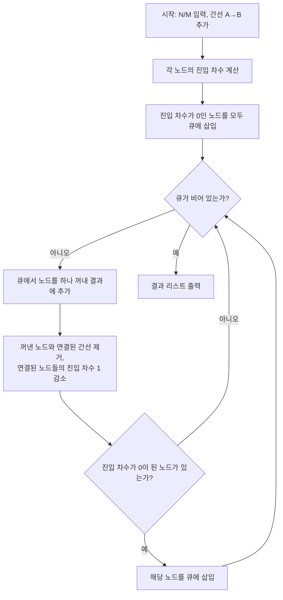

백준 2252번 "줄 세우기" 문제는 N명의 학생을 키 순서대로 줄을 세우는 것이다. 일부 학생들의 키 비교 결과가 주어지며, 이를 바탕으로 모든 학생이 키 순서대로 줄을 서도록 정렬해야 한다. 입력으로 학생 수 N과 비교 횟수 M이 주어지고, M개의 키 비교 결과가 주어진다. 이를 위상 정렬을 통해 해결할 수 있다.

[원문 링크](https://www.acmicpc.net/problem/2252)

||
|:---:|
|이미지로 형상화|

## 문제 설명

N명의 학생을 키 순서대로 줄을 세우려고 하는데, 모든 학생의 키를 직접 비교한 것이 아니라 일부 학생들끼리만 키를 비교한 결과가 주어진다. 이 부분적인 비교 결과만으로 모든 학생이 앞뒤 관계를 위반하지 않도록 나열하는 프로그램을 작성해야 한다.

## 입력

첫 번째 줄에는 학생 수 N(1 ≤ N ≤ 32,000)과 비교 횟수 M(1 ≤ M ≤ 100,000)이 주어진다. 이어지는 M개의 줄에는 두 학생의 키를 비교한 결과 A B가 한 줄씩 주어지는데, 이는 A 학생이 B 학생보다 앞에 서야 한다는 의미다.

## 출력

학생들을 키 순서대로 줄을 세운 결과를 한 줄에 공백으로 구분해 출력한다.

## 예제 입력
```
4 2
4 2
3 1
```

## 예제 출력
```
4 2 3 1
```

이 문제는 학생 간의 비교 결과가 전체 순서를 유일하게 결정하지 못하는 경우가 많으므로, 위 조건을 만족하는 줄 세우기 결과가 여러 개 존재할 수 있다. 즉 BOJ 채점기는 특정 하나의 출력만 정답으로 인정하지 않고, 주어진 모든 선후 관계를 위반하지 않는 순서라면 어떤 것이든 정답으로 채점한다(Special Judge). 이 예제에서 주어진 조건은 "4번이 2번보다 앞", "3번이 1번보다 앞"뿐이므로 1번과 4번, 2번과 3번, 1번과 3번 사이의 선후 관계는 정해져 있지 않다. 따라서 뒤에서 다룰 코드를 그대로 실행하면 진입 차수 계산 순서와 큐 삽입 순서 차이로 인해 `3 4 1 2`가 출력된다. 이 순서에서 4는 2번째, 2는 4번째 자리에 있어 "4가 2보다 앞"이라는 조건을 만족하고, 3은 1번째, 1은 3번째 자리에 있어 "3이 1보다 앞"이라는 조건도 만족하므로 이 결과 역시 올바른 정답이다.

## 풀이

이 문제는 위상 정렬(Topological Sorting)을 통해 해결할 수 있다. 주어진 방향 그래프에서 모든 정점을 순서대로 나열하는 것이며, 그래프에 사이클이 없는 DAG(방향 비순환 그래프)라는 전제가 성립해야 한다. 구현 방식은 크게 두 가지인데, DFS 후위 순회 결과를 뒤집는 방법과, 진입 차수(indegree)가 0인 노드부터 순서대로 뽑아내는 칸(Kahn) 알고리즘이 있다. 이 글은 큐를 이용해 진입 차수가 0인 노드를 너비 우선 탐색(BFS)처럼 차례로 방문하는 칸 알고리즘으로 구현한다. 큐를 쓰는 방식은 재귀 깊이 제한(Python의 기본 재귀 한도 등)에 걸릴 위험이 없어, 이 문제처럼 N이 32,000까지 커질 수 있는 경우에 DFS 방식보다 안전하다. 다음은 그 알고리즘의 간단한 설명이다.

1. 각 노드의 진입 차수를 계산한다.
2. 진입 차수가 0인 모든 노드를 큐에 삽입한다.
3. 큐에서 노드를 하나씩 꺼내고, 그 노드와 연결된 모든 간선을 제거한다.
4. 간선 제거 후, 새로 진입 차수가 0이 된 노드를 큐에 삽입한다.
5. 큐가 빌 때까지 3-4 과정을 반복한다.



## 문제 해결 과정

**입력 처리** 단계에서는 학생 수 \(N\)과 비교 횟수 \(M\)을 먼저 입력받고, 이어지는 \(M\)개의 비교 결과 \(A, B\)를 하나씩 읽어 그래프를 구축한다. \(A\) 학생이 \(B\) 학생보다 앞에 서야 한다는 조건이므로, 그래프에는 \(A\)에서 \(B\)로 향하는 간선을 추가하고 동시에 \(B\)의 진입 차수를 1 증가시킨다.

그래프 구축이 끝나면 **초기화** 단계로 넘어가, 진입 차수가 0인 모든 노드를 큐에 삽입한다. 진입 차수가 0이라는 것은 그 학생보다 먼저 서야 한다고 명시된 학생이 없다는 뜻이므로, 이런 노드들이 줄의 맨 앞에 올 수 있는 후보가 된다.

**위상 정렬 수행** 단계에서는 큐가 빌 때까지 다음을 반복한다. 먼저 큐에서 노드를 하나 꺼내 출력 리스트에 추가하고, 그 노드와 연결된 모든 간선을 제거하면서 연결된 노드들의 진입 차수를 하나씩 감소시킨다. 이 과정에서 진입 차수가 0이 된 노드가 있으면 그 즉시 큐에 삽입해 다음 차례에 처리되도록 한다.

큐가 완전히 비면 **결과 출력** 단계로, 지금까지 쌓인 출력 리스트를 순서대로 출력해 학생들이 키 순서대로 줄을 서도록 한다.

## 복잡도 분석

칸 알고리즘은 각 노드를 정확히 한 번씩 큐에 넣고 꺼내며, 각 간선도 정확히 한 번씩 확인해 진입 차수를 감소시킨다. 따라서 전체 수행 시간은 노드 수 N과 간선 수(비교 횟수) M의 합에 선형으로 비례하고, 추가로 사용하는 공간도 그래프와 진입 차수 배열의 크기만큼만 필요하다.

| 항목 | 복잡도 | 비고 |
|---|---|---|
| **시간 복잡도** | $O(N + M)$ | 진입 차수 계산 $O(M)$ + 큐를 이용한 노드·간선 순회 $O(N + M)$ |
| **공간 복잡도** | $O(N + M)$ | 인접 리스트(간선 M개) + 진입 차수 배열(노드 N개) + 큐 |

### 코드 예시 (Python)

다음은 파이썬으로 작성한 코드 예제이다.

```python
# 42jerrykim.github.io에서 더 많은 정보를 확인할 수 있다
from collections import deque

def topology_sort():
    N, M = map(int, input().split())
    indegree = [0] * (N + 1)
    graph = [[] for _ in range(N + 1)]
    
    for _ in range(M):
        A, B = map(int, input().split())
        graph[A].append(B)
        indegree[B] += 1
        
    queue = deque()
    for i in range(1, N + 1):
        if indegree[i] == 0:
            queue.append(i)
    
    result = []
    while queue:
        current = queue.popleft()
        result.append(current)
        for node in graph[current]:
            indegree[node] -= 1
            if indegree[node] == 0:
                queue.append(node)
    
    print(" ".join(map(str, result)))

topology_sort()
```

이 코드는 입력된 학생 수와 비교 결과를 바탕으로 그래프를 구축하고, 위상 정렬 알고리즘을 통해 올바른 순서로 학생들을 줄 세운다.


### 코드 예시 (C++)

Python 코드와 동일한 로직을 C++로 옮긴 것으로, `queue<int>`로 진입 차수 0인 노드를 관리하고 STL `vector`로 인접 리스트를 구성한다. 인터프리터 오버헤드가 없어 M이 100,000에 가까운 경우에도 여유 있게 시간 제한 안에 통과한다.

```cpp
// 42jerrykim.github.io에서 더 많은 정보를 확인할 수 있다
#include <iostream>
#include <vector>
#include <queue>

using namespace std;

void topology_sort(int N, int M, vector<vector<int>>& graph, vector<int>& indegree) {
    queue<int> q;
    for (int i = 1; i <= N; ++i) {
        if (indegree[i] == 0) {
            q.push(i);
        }
    }

    while (!q.empty()) {
        int current = q.front();
        q.pop();
        cout << current << " ";
        for (int next : graph[current]) {
            if (--indegree[next] == 0) {
                q.push(next);
            }
        }
    }
}

int main() {
    int N, M;
    cin >> N >> M;
    vector<vector<int>> graph(N + 1);
    vector<int> indegree(N + 1, 0);

    for (int i = 0; i < M; ++i) {
        int A, B;
        cin >> A >> B;
        graph[A].push_back(B);
        indegree[B]++;
    }

    topology_sort(N, M, graph, indegree);
    return 0;
}
```

이 코드는 위 과정을 단계적으로 구현하여, 입력된 학생들을 키 순서대로 정렬한다.

## 코너 케이스 및 실수 포인트

| 케이스 | 설명 | 처리 방법 |
|---|---|---|
| **최소 입력** | N=1 또는 빈 입력 | 반복문 범위·예외 처리 확인 |
| **정답이 여러 개** | 위상 정렬 결과가 유일하지 않음 | Special Judge이므로 조건만 만족하면 통과. 코드 출력을 문제 예제와 문자 그대로 비교하지 않는다 |
| **중복 간선 입력** | 같은 \(A, B\) 쌍이 여러 번 주어질 가능성 | 진입 차수가 중복 증가해도 로직상 정상 동작(간선 제거를 별도로 취소할 필요 없음) |

## 이 글을 읽은 후 확인할 것

- 진입 차수(indegree)가 왜 위상 정렬의 핵심 상태인지, DFS 후위 순회 방식과 어떻게 다른 결과 순서를 낼 수 있는지 설명할 수 있는가
- 큐 대신 재귀 DFS로 구현했을 때 이 문제(N ≤ 32,000)에서 어떤 위험이 생기는지 말할 수 있는가
- 이 문제가 Special Judge인 이유와, 같은 입력에서 서로 다른 두 정답이 동시에 성립할 수 있는 조건을 판별할 수 있는가

## 참고 문헌 및 출처

- [백준 2252번 줄 세우기](https://www.acmicpc.net/problem/2252)
- [위상 정렬 - 위키백과](https://ko.wikipedia.org/wiki/%EC%9C%84%EC%83%81%EC%A0%95%EB%A0%AC)
- Kahn, A. B. (1962). "Topological sorting of large networks." *Communications of the ACM*, 5(11), 558–562. (큐 기반 위상 정렬 알고리즘의 원 논문)
