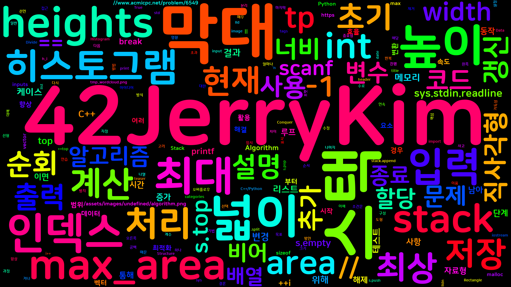
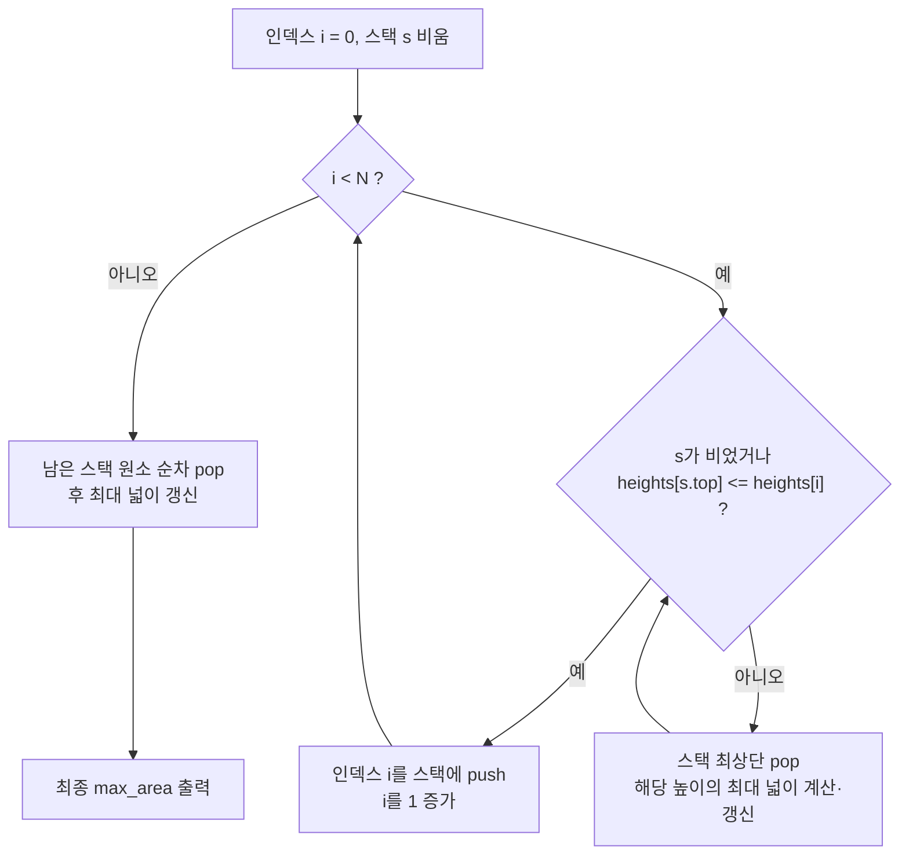

히스토그램은 여러 개의 직사각형이 연속적으로 나열된 도형으로, 각 직사각형은 너비가 1이고 높이는 다양한 값을 가질 수 있다. 이 문제에서는 주어진 히스토그램에서 가장 큰 넓이를 갖는 직사각형을 찾는 것이 목표이다. 예를 들어, 히스토그램의 막대 높이가 `[2, 1, 5, 6, 2, 3]`일 때, 가장 큰 직사각형의 넓이는 `10`이다.

입력은 여러 개의 테스트 케이스로 구성되며, 각 테스트 케이스는 첫 번째 수로 막대의 개수 `N`(1 ≤ N ≤ 100,000)이 주어지고, 이어서 각 막대의 높이 `h_i`(0 ≤ h_i ≤ 1,000,000,000)가 주어진다. 마지막 입력은 `0`으로 표시되며, 이는 입력의 끝을 나타낸다. 각 테스트 케이스마다 히스토그램에서 가장 큰 직사각형의 넓이를 출력해야 한다.

이 문제는 매우 큰 데이터셋을 효율적으로 처리해야 하므로, 시간 복잡도가 낮은 알고리즘을 사용해야 한다.

문제 : [https://www.acmicpc.net/problem/6549](https://www.acmicpc.net/problem/6549)

||
|:---:|
||

## 학습 성과 목표

이 글을 읽고 나면 다음을 스스로 확인할 수 있어야 한다.

- 단조 스택(Monotonic Stack)이 "각 막대를 기준으로 좌우로 더 낮은 막대가 나올 때까지의 폭"을 O(N)에 구하는 원리를 설명할 수 있다.
- 히스토그램 최대 직사각형 문제를 분할정복 O(N log N)·세그먼트 트리 O(N log N)·단조 스택 O(N) 세 가지 접근으로 구분하고, 입력 크기와 요구 시간복잡도에 따라 어떤 방식을 선택할지 판단할 수 있다.
- C++·C·Python 세 구현에서 언어별 입출력 최적화(`ios::sync_with_stdio`, `scanf`/`printf`, `sys.stdin.readline`)가 왜 필요한지 설명할 수 있다.
- 오버플로우가 발생하는 조건(높이×너비가 32비트 정수 범위를 넘는 경우)을 식별하고 `long long` 등 더 넓은 정수형으로 리팩토링할 수 있다.

## 접근 방식

이 문제를 해결하기 위해 <strong>스택(Stack)</strong>을 이용한 선형 시간 알고리즘(O(N))을 사용한다. 핵심 불변식은 "스택에는 항상 높이가 증가하는 순서로 막대의 인덱스만 남는다"이다. 현재 막대의 높이가 스택 최상단 막대의 높이보다 작아지는 순간, 최상단 막대는 더 이상 오른쪽으로 넓어질 수 없다는 뜻이므로 그 시점에 확정적으로 pop하며 최대 넓이를 계산할 수 있다. 이 불변식 덕분에 각 인덱스는 스택에 정확히 한 번 push되고 한 번만 pop되어, 전체 연산 횟수가 O(N)으로 상각(amortized)된다.

이 알고리즘의 핵심은 다음과 같다:

- 스택에는 높이가 증가하는 순서로 막대의 인덱스를 저장한다.
- 현재 막대의 높이가 스택의 최상단 막대보다 작으면, 스택에서 막대를 꺼내고 해당 막대를 높이로 하는 최대 직사각형의 넓이를 계산한다.
- 이 과정을 히스토그램의 끝까지 진행하며, 스택에 남은 막대들도 동일하게 처리한다.

아래 다이어그램은 이 흐름을 순서도로 정리한 것이다.



## 복잡도 분석

| 항목 | 복잡도 | 비고 |
|---|---|---|
| **시간 복잡도** | O(N) | 각 막대의 인덱스가 스택에 최대 1회 push, 1회 pop되므로 상각 분석으로 선형 |
| **공간 복잡도** | O(N) | 높이 배열 `heights`와 인덱스 스택 `s`가 각각 최대 N개 원소를 저장 |

단조 스택은 뒤에서 비교하는 분할정복(평균 O(N log N), 정렬된 입력에서 최악 O(N²))이나 세그먼트 트리(O(N log N), 추가 공간 O(N))보다 시간·공간 모두에서 우위에 있다.

## 판단 기준

이 문제는 단조 스택 외에도 분할정복과 세그먼트 트리로 풀 수 있다. 분할정복은 구간의 최솟값을 기준으로 좌우로 나눠 재귀적으로 최대 넓이를 구하는 방식으로, 평균적으로는 O(N log N)이지만 오름차순·내림차순으로 정렬된 히스토그램에서는 매 호출마다 구간이 1만큼만 줄어들어 O(N²)로 퇴화한다. 세그먼트 트리는 구간 최솟값 질의를 O(log N)에 처리해 분할정복의 퇴화 문제를 O(N log N)으로 항상 보장하지만, 트리 구성에 추가 메모리 O(N)과 구현 복잡도가 붙는다. 단조 스택은 상각 O(N)을 보장하며 구현도 세 방식 중 가장 짧다.

실무적으로는 다음 기준으로 고른다. 입력이 매우 크고(N이 10만 수준) 시간 제한이 빠듯하면 단조 스택을 우선 선택한다 — 상수 인자가 작고 항상 선형 시간이 보장된다. 구간이 실시간으로 갱신되며 최솟값을 반복 질의해야 하는 변형 문제라면 세그먼트 트리가 유리하다. 반면 재귀 호출 오버헤드가 문제 되지 않고 분할정복의 개념 자체를 보이는 것이 목적이라면 분할정복도 정답이 될 수 있지만, 이 문제처럼 정렬된 입력이 섞일 가능성이 있는 경쟁 프로그래밍 환경에서는 단조 스택이 가장 안전한 선택이다.

## C++ 코드와 설명

```cpp
// 42jerrykim.github.io에서 더 많은 정보를 확인할 수 있다
#include <iostream>
#include <vector>
#include <stack>

using namespace std;

int main() {
    ios::sync_with_stdio(false);
    cin.tie(nullptr);

    while (true) {
        int n;
        cin >> n; // 히스토그램의 막대 수 입력
        if (n == 0) break; // 입력의 끝이면 종료

        vector<long long> heights(n); // 막대의 높이를 저장할 벡터
        for (int i = 0; i < n; ++i) {
            cin >> heights[i]; // 각 막대의 높이 입력
        }

        stack<int> s; // 인덱스를 저장할 스택
        long long max_area = 0; // 최대 넓이 초기화

        for (int i = 0; i < n; ++i) {
            // 현재 막대의 높이가 스택 최상단 막대보다 작을 때까지 반복
            while (!s.empty() && heights[s.top()] > heights[i]) {
                int tp = s.top(); // 스택 최상단 막대의 인덱스
                s.pop(); // 스택에서 제거
                long long h = heights[tp]; // 스택 최상단 막대의 높이
                long long width = s.empty() ? i : i - s.top() - 1; // 너비 계산
                max_area = max(max_area, h * width); // 최대 넓이 갱신
            }
            s.push(i); // 현재 막대의 인덱스를 스택에 추가
        }

        // 스택에 남은 막대 처리
        while (!s.empty()) {
            int tp = s.top();
            s.pop();
            long long h = heights[tp];
            long long width = s.empty() ? n : n - s.top() - 1;
            max_area = max(max_area, h * width);
        }

        cout << max_area << '\n'; // 최대 넓이 출력
    }
    return 0;
}
```

각 막대는 스택에 정확히 한 번 push되고 한 번 pop되므로, 위 코드는 이중 반복문처럼 보이지만 전체 연산 횟수는 O(N)으로 상각된다. 먼저 막대 수 `n`을 입력받고 `n`이 0이면 종료하며, 나머지 각 막대의 높이를 `heights` 벡터에 저장한다. 이어서 인덱스를 저장하는 스택 `s`를 두고, 현재 막대의 높이가 스택 최상단 막대보다 작아질 때까지 스택에서 막대를 꺼내며(pop) 꺼낸 막대를 최고 높이로 하는 직사각형의 폭을 계산해 `max_area`를 갱신한다. 폭은 스택이 비었으면 현재 인덱스 `i`, 그렇지 않으면 `i - s.top() - 1`이다 — 스택에 남아 있는 인덱스가 왼쪽 경계, 현재 인덱스 `i`가 오른쪽 경계이기 때문이다. 순회가 끝난 뒤에도 스택에 남은 인덱스들은 오른쪽 경계가 `n`인 것으로 간주해 같은 방식으로 처리한다. `h`와 `width`를 `long long`으로 선언한 이유는 `h * width`가 `int` 범위(약 21억)를 넘을 수 있기 때문이다(N=100,000, 높이=10^9일 때 곱은 약 10^14). 입출력 속도를 높이기 위해 `ios::sync_with_stdio(false)`로 C 표준 스트림과의 동기화를 끊고 `cin.tie(nullptr)`로 `cin`과 `cout`의 자동 flush 연결을 해제했다. 스택에서 꺼낸 값을 매번 `s.top()`으로 다시 조회하지 않고 `tp` 변수에 한 번만 캐싱해 재사용한 것도 같은 표현식을 반복 계산하지 않기 위한 선택으로, 성능뿐 아니라 코드 가독성 측면에서도 스택 조작과 넓이 계산을 분리해 보여주는 효과가 있다.

## C++ without library 코드와 설명

```cpp
// 42jerrykim.github.io에서 더 많은 정보를 확인할 수 있다
#include <stdio.h>
#include <malloc.h>

int main() {
    while (1) {
        int n;
        scanf("%d", &n); // 히스토그램의 막대 수 입력
        if (n == 0) break; // 입력의 끝이면 종료

        long long* heights = (long long*)malloc(n * sizeof(long long)); // 막대 높이 배열 동적 할당
        int* stack = (int*)malloc(n * sizeof(int)); // 스택 배열 동적 할당
        int top = -1; // 스택의 최상단 인덱스

        for (int i = 0; i < n; ++i) {
            scanf("%lld", &heights[i]); // 각 막대의 높이 입력
        }

        long long max_area = 0; // 최대 넓이 초기화
        int i = 0;
        while (i < n) {
            // 스택이 비어 있거나 현재 막대의 높이가 스택 최상단 막대보다 크거나 같으면
            if (top == -1 || heights[stack[top]] <= heights[i]) {
                stack[++top] = i++; // 현재 막대의 인덱스를 스택에 추가
            } else {
                int tp = stack[top--]; // 스택에서 최상단 막대 인덱스 꺼내기
                long long h = heights[tp]; // 높이
                long long width = top == -1 ? i : i - stack[top] - 1; // 너비 계산
                long long area = h * width; // 넓이 계산
                if (area > max_area) max_area = area; // 최대 넓이 갱신
            }
        }

        // 남은 스택 처리
        while (top != -1) {
            int tp = stack[top--];
            long long h = heights[tp];
            long long width = top == -1 ? i : i - stack[top] - 1;
            long long area = h * width;
            if (area > max_area) max_area = area;
        }

        printf("%lld\n", max_area); // 최대 넓이 출력

        free(heights); // 동적 할당 메모리 해제
        free(stack);
    }
    return 0;
}
```

C 버전의 로직은 C++와 동일하되 STL 대신 `malloc`으로 직접 배열을 할당하고 인덱스 스택을 직접 구현한다. 차이는 push·pop 조건을 뒤집어 표현한 것뿐이다 — `heights[stack[top]] <= heights[i]`(스택 최상단이 현재보다 작거나 같음)일 때 push하고, 그렇지 않을 때만 pop하며 넓이를 갱신한다. 이는 앞의 C++ 코드에서 `heights[s.top()] > heights[i]`일 때 pop하는 조건과 논리적으로 동치이며 결과도 동일하다. `scanf`/`printf`와 `%lld` 포맷 지정자로 `long long` 입출력을 처리하고, 사용이 끝난 `heights`·`stack` 배열은 `free`로 해제한다.

## Python 코드와 설명

```python
# 42jerrykim.github.io에서 더 많은 정보를 확인할 수 있다
import sys

while True:
    inputs = sys.stdin.readline().split()
    n = int(inputs[0]) # 히스토그램의 막대 수
    if n == 0:
        break # 입력의 끝이면 종료
    heights = list(map(int, inputs[1:])) # 막대 높이 리스트

    stack = [] # 인덱스를 저장할 스택
    max_area = 0 # 최대 넓이 초기화
    i = 0
    while i < n:
        # 스택이 비어 있거나 현재 막대의 높이가 스택 최상단 막대보다 크거나 같으면
        if not stack or heights[stack[-1]] <= heights[i]:
            stack.append(i) # 현재 막대의 인덱스를 스택에 추가
            i += 1
        else:
            tp = stack.pop() # 스택에서 최상단 막대 인덱스 꺼내기
            h = heights[tp] # 높이
            width = i if not stack else i - stack[-1] - 1 # 너비 계산
            area = h * width # 넓이 계산
            if area > max_area:
                max_area = area # 최대 넓이 갱신

    # 남은 스택 처리
    while stack:
        tp = stack.pop()
        h = heights[tp]
        width = i if not stack else i - stack[-1] - 1
        area = h * width
        if area > max_area:
            max_area = area

    print(max_area) # 최대 넓이 출력
```

Python 버전 역시 동일한 단조 스택 로직을 그대로 옮긴 것이다. 다만 표준 입력을 한 줄씩 빠르게 읽기 위해 `sys.stdin.readline`을 사용했고, Python은 정수에 오버플로우가 없으므로(임의 정밀도 정수) C++·C에서 필요했던 `long long` 전환이 필요 없다. 스택 연산은 리스트의 `append`/`pop`으로 대체했으며, 조건과 넓이 계산 공식은 C 버전과 동일하다.

## 결론

이 문제를 통해 단조 스택을 활용한 상각 O(N) 알고리즘의 위력을 확인할 수 있었다. 히스토그램처럼 "각 원소가 스택에 최대 한 번씩만 오간다"는 불변식을 찾아내면, 겉보기에 이중 반복문처럼 보이는 코드도 실제로는 선형 시간에 동작한다는 것이 이 문제의 핵심 교훈이다. 구현 언어별로 입출력 병목을 피하는 방법이 다르다는 점도 중요하다 — C++는 `ios::sync_with_stdio(false)`와 `cin.tie(nullptr)`로 표준 스트림 동기화를 끊어 `cin`/`cout` 속도를 끌어올렸고, C는 애초에 `scanf`/`printf`를 직접 사용했으며, Python은 `sys.stdin.readline`으로 한 줄씩 빠르게 읽었다. 세 방식 모두 표준 입력 함수의 기본 버퍼링·동기화 오버헤드를 줄이는 것이 목적이라는 공통점이 있다. C++에서 `int`와 `long long`의 차이가 결과에 큰 영향을 미칠 수 있으므로, 항상 변수의 범위를 고려해 자료형을 선택해야 한다.

## 코너 케이스 및 실수 포인트

제출 전 테스트할 때 놓치기 쉬운 경계값은 다음 두 가지다.

| 케이스 | 설명 | 처리 방법 |
|---|---|---|
| **최소 입력** | N=1 또는 빈 입력 | 반복문 범위·예외 처리 확인 |
| **오버플로우** | 답이 $2^{31}$ 초과 가능 | `long long` (C++) 등 사용 |

## 참고 문헌 및 출처

- [백준 6549번 문제](https://www.acmicpc.net/problem/6549)
- [cp-algorithms.com — Minimum stack / minimum queue](https://cp-algorithms.com/data_structures/stack_queue_modification.html)
- [USACO Guide — Introduction to Stacks](https://usaco.guide/gold/stacks)
- [LeetCode 84. Largest Rectangle in Histogram (동일 문제의 영문 버전)](https://leetcode.com/problems/largest-rectangle-in-histogram/)
