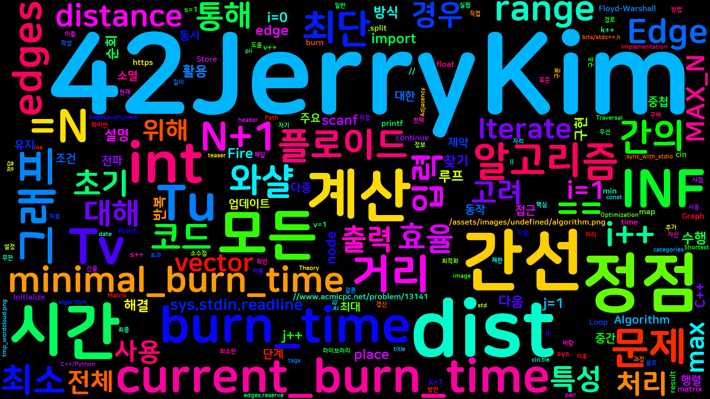
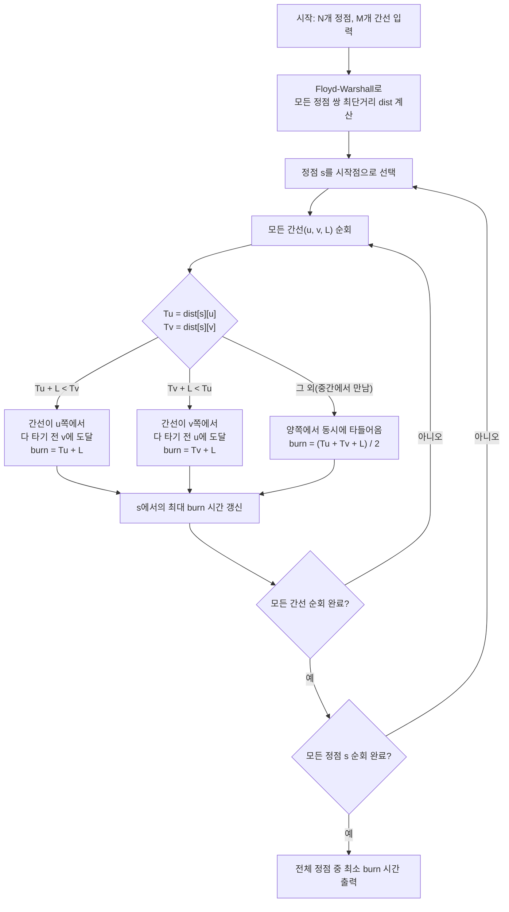

그래프 불태우기 문제는 그래프의 모든 정점과 간선을 최소한의 시간 내에 불로 태우는 시점을 찾는 문제이다. 서훈이는 그래프의 한 정점에 불을 붙인 후, 불이 간선을 따라 전파되며, 불이 양 끝 정점에서 동시에 붙을 경우 간선의 중간 지점에서 불이 소멸된다. 이러한 특성을 고려하여 그래프 전체가 불타는 데 걸리는 최소 시간을 계산해야 한다. 문제는 주어진 그래프의 정점과 간선 정보를 바탕으로, 어떤 정점에 불을 붙였을 때 그래프 전체를 가장 빠르게 태울 수 있는지를 찾는 것이다. 이 문제는 그래프 이론과 최단 경로 알고리즘을 활용하여 해결할 수 있으며, 효율적인 구현을 통해 시간 제한 내에 정답을 도출해야 한다.

이 유형은 "그래프 버닝(graph burning)" 문제로 분류되는데, 일반적인 최단 경로 문제와 달리 목적지가 하나가 아니라 "그래프 전체"이고, 최적화 대상도 개별 경로 길이가 아니라 가장 늦게 불이 붙는 지점의 도달 시각이라는 점이 다르다. 즉 이 문제는 단순한 최단 경로 문제가 아니라, 임의의 시작점에서 출발했을 때 그래프에서 가장 먼 지점까지의 거리를 최소화하는 "그래프의 반지름(eccentricity)"을 구하는 문제에 가깝다. 다만 일반적인 그래프 반지름 문제는 정점만을 대상으로 최댓값을 구하지만, 이 문제는 간선 위의 임의의 실수 지점(양 끝에서 불이 만나는 지점)까지 고려해야 하므로 정점 집합만으로는 답을 구할 수 없고, 모든 간선을 순회하며 간선 위에서 발생하는 최댓값까지 함께 비교해야 한다는 점이 이 문제의 핵심 난이도다.

문제 : [https://www.acmicpc.net/problem/13141](https://www.acmicpc.net/problem/13141)(원본 주소가 BOJ 사이트 전역 점검으로 접근 불가하여 [Wayback Machine 아카이브본](https://web.archive.org/web/20260419004126/https://www.acmicpc.net/problem/13141)을 병기한다)

||
|:---:|
||

## 문제 정보

**문제 링크**: [https://www.acmicpc.net/problem/13141](https://www.acmicpc.net/problem/13141) ([Wayback Machine 아카이브본](https://web.archive.org/web/20260419004126/https://www.acmicpc.net/problem/13141))

**문제 요약**:
그래프의 정점 하나에 불을 붙이면 불은 간선을 따라 1초당 1만큼의 거리로 전파된다. 하나의 간선 양 끝에서 동시에 불이 들어오면 그 간선은 중앙까지 타고 소멸한다. 그래프 전체가 모두 타는 데 걸리는 시간이 최소가 되는 시작 정점을 찾아 그 최소 시간을 출력한다. 시작점과 끝점이 같은 루프 간선과, 두 정점을 잇는 중복 간선이 있을 수 있다.

**제한 조건**:
- 시간 제한: 1초
- 메모리 제한: 64MB
- 정점 수: $2 \le N \le 200$, 간선 수: $N-1 \le M \le 20{,}000$, 간선 길이: $1 \le L \le 100$

## 입출력 예제

**입력 1**:
```text
5 8
1 2 4
1 2 6
1 5 6
2 4 4
4 5 4
3 4 6
3 4 6
3 3 4
```

**출력 1**:
```text
9.0
```

**설명**: 정점 5개, 간선 8개(1-2 간 중복 간선 2개, 3-3 루프 간선 1개 포함)로 이루어진 그래프다. 어느 정점에서 불을 붙여도 전체가 타는 데 최소 9.0초가 걸린다. 중복 간선 `1 2 4`와 `1 2 6`이 함께 주어진 것은 최단 거리 계산(Floyd-Warshall 전처리)에는 더 짧은 길이 4만 남지만, 실제로 간선이 다 타는 데 걸리는 시간은 두 간선을 따로 계산해야 한다는 점을 보여주기 위한 장치다.

## 접근 방식

이 문제를 해결하기 위해 우선 그래프의 모든 정점 간의 최단 거리를 구해야 한다. 이를 위해 플로이드-와샬(Floyd-Warshall) 알고리즘을 사용하였다. 플로이드-와샬 알고리즘은 모든 정점 쌍 간의 최단 거리를 구하는 데 효과적이며, 주어진 문제의 제약 조건 내에서 충분히 효율적이다. 모든 정점 간의 최단 거리를 계산한 후, 각 정점을 시작점으로 불을 붙였을 때 그래프 전체가 불타는 시간을 계산한다. 이때, 불이 간선을 따라 전파되며, 간선의 양 끝 정점에서 동시에 불이 붙을 경우 간선의 중간에서 불이 소멸되는 특성을 고려하여 각 간선의 불타는 시간을 계산한다. 모든 정점에 대해 이러한 계산을 수행한 후, 가장 최소의 시간을 찾으면 문제의 해답을 얻을 수 있다.



## 복잡도 분석

| 항목 | 복잡도 | 비고 |
|---|---|---|
| **시간 복잡도** | $O(N^3)$ | Floyd-Warshall 전처리 $O(N^3)$ + 정점·간선 순회 $O(N \cdot M)$이 $N^3$에 종속 |
| **공간 복잡도** | $O(N^2)$ | 모든 정점 쌍의 최단거리를 담는 `dist` 행렬 |

## 판단 기준

이 문제는 "모든 정점을 시작점으로 놓고 모든 정점까지의 최단 거리"가 필요하므로 전형적인 all-pairs shortest path 문제다. 시작점 후보가 $N$개이고 각 후보마다 전체 정점까지의 거리를 알아야 하므로, 정점 하나에서 출발하는 최단 거리만 구하는 단일 시작점(single-source) 알고리즘을 $N$번 반복하는 방식과, 모든 쌍을 한 번에 구하는 방식 중 하나를 골라야 한다.

Floyd-Warshall(모든 쌍을 $O(N^3)$에 한 번에 구함)은 $N \le 200$처럼 정점 수가 작을 때 구현이 간단하고 안정적이다. 반면 Dijkstra를 $N$번 반복하는 방식은 $O(N \cdot (M + N)\log N)$으로, 정점 수가 수천 이상으로 커지고 그래프가 희소(sparse)할 때 Floyd-Warshall보다 유리해진다. 이 문제는 $N \le 200,\ M \le 20{,}000$으로 정점 수가 작고 음수 간선도 없으므로, 두 방식 모두 시간 제한 안에 들어오지만 구현 복잡도가 낮은 Floyd-Warshall을 선택하는 것이 합리적이다. 정점 수가 $10^4$ 이상으로 커지면 $O(N^3)$이 감당하기 어려워지므로 그 경우에는 Dijkstra 반복이나 존슨(Johnson) 알고리즘으로 전환해야 한다.

Floyd-Warshall 알고리즘의 원 출처는 Robert W. Floyd, "Algorithm 97: Shortest Path", *Communications of the ACM*, Vol. 5, No. 6, 1962이며, 동일 시기에 Stephen Warshall이 그래프의 추이적 폐쇄(transitive closure)를 구하는 같은 형태의 점화식을 독립적으로 발표해 두 이름이 함께 붙었다.

### 흔한 오해: "간선은 항상 중앙에서 만난다"

이 문제를 처음 접하면 "모든 간선은 결국 양 끝에서 불이 들어와 중앙에서 소멸한다"고 단순화하기 쉽다. 이는 틀린 직관이다. 간선 `(u, v, L)`에서 불이 실제로 중앙에서 만나는 경우는 두 시작 시각 `Tu`, `Tv`의 차이가 간선 길이 `L`보다 작을 때(`|Tu - Tv| < L`)뿐이다. 만약 한쪽에서 불이 훨씬 일찍 도달해 그 차이가 `L` 이상이면(`Tu + L <= Tv` 또는 `Tv + L <= Tu`), 반대편에 불이 붙기 전에 이미 간선 전체가 다 타버리므로 간선의 불타는 시간은 `min(Tu, Tv) + L`로 결정되고 중앙에서 만나는 일 자체가 일어나지 않는다. 이 문제에서 다중 간선(같은 정점 쌍을 잇는 여러 간선)이 등장하는 이유도 여기에 있다 — Floyd-Warshall 전처리 단계에서 가장 짧은 간선만 `dist` 행렬에 남기고 나머지 중복 간선은 버리지만, "불타는 시간"을 계산할 때는 버려진 간선을 포함한 **모든 개별 간선**을 다시 순회해야 정답이 나온다. `dist` 행렬만으로 간선 집합 전체를 판단하면 이 비대칭 분기가 존재한다는 사실 자체를 놓치게 된다.

### 왜 이 공식이 정확한가

간선 `(u, v, L)` 위의 임의의 지점을 시작점 `u`로부터의 거리 `x`(`0 <= x <= L`)로 표현하면, 그 지점에 불이 도달하는 시각은 `u` 방향에서 오는 불로는 `Tu + x`, `v` 방향에서 오는 불로는 `Tv + (L - x)`이며, 실제 도달 시각은 두 값 중 더 빠른 쪽인 `min(Tu + x, Tv + L - x)`이다. 간선 전체가 다 타는 시각은 이 값을 모든 `x`에 대해 최대화한 것과 같다. `min(Tu + x, Tv + L - x)`는 `x`에 대해 한쪽은 증가, 한쪽은 감소하는 두 직선의 아래쪽 포락선(lower envelope)이므로 최댓값은 두 직선이 교차하는 지점(`Tu + x = Tv + L - x`, 즉 `x = (Tv - Tu + L) / 2`)에서 나오며 그 값이 바로 `(Tu + Tv + L) / 2`다. 다만 이 교차점이 간선 범위 `[0, L]`을 벗어나면(즉 `|Tu - Tv| >= L`이면) 최댓값은 구간 끝점에서 나오므로 `min(Tu, Tv) + L`이 된다. 코드의 3분기 조건은 이 두 경우를 그대로 구현한 것이다.

## C++ 코드와 설명

```cpp
// 42jerrykim.github.io에서 더 많은 정보를 확인할 수 있다
#include <bits/stdc++.h>
using namespace std;

typedef long long ll;
typedef pair<int, int> pii;

const int MAX_N = 201;
const ll INF = 1e18;

int main(){
    ios::sync_with_stdio(false);
    cin.tie(0);
    
    int N, M;
    cin >> N >> M;
    
    // Initialize distance matrix with INF
    vector<vector<ll>> dist(N+1, vector<ll>(N+1, INF));
    for(int i=1;i<=N;i++) dist[i][i] = 0;
    
    // Store all edges
    struct Edge {
        int u, v;
        int L;
    };
    vector<Edge> edges;
    edges.reserve(M);
    
    for(int i=0;i<M;i++){
        int u, v, L;
        cin >> u >> v >> L;
        edges.push_back(Edge{u, v, L});
        if(u != v){
            // If multiple edges exist, keep the shortest one
            if(L < dist[u][v]){
                dist[u][v] = L;
                dist[v][u] = L;
            }
        }
    }
    
    // Floyd-Warshall algorithm to compute all-pairs shortest paths
    for(int k=1;k<=N;k++){
        for(int i=1;i<=N;i++){
            if(dist[i][k] == INF) continue;
            for(int j=1;j<=N;j++){
                if(dist[k][j] == INF) continue;
                if(dist[i][j] > dist[i][k] + dist[k][j]){
                    dist[i][j] = dist[i][k] + dist[k][j];
                }
            }
        }
    }
    
    double minimal_burn_time = 1e18;
    
    // Iterate through each node as the starting point
    for(int s=1;s<=N;s++){
        double current_burn_time = 0.0;
        
        // Find the maximum shortest distance from s to any node
        for(int v=1; v<=N; v++){
            if(dist[s][v] < INF){
                current_burn_time = max(current_burn_time, (double)dist[s][v]);
            }
        }
        
        // Iterate through all edges to calculate burn time
        for(auto &edge : edges){
            int u = edge.u;
            int v = edge.v;
            int L = edge.L;
            double burn_time;
            if(u == v){
                // Loop edge: burn time is distance to u plus half the length
                burn_time = (double)dist[s][u] + (double)L / 2.0;
            }
            else{
                ll Tu = dist[s][u];
                ll Tv = dist[s][v];
                if(Tu + L < Tv){
                    // Fire reaches v before coming from u
                    burn_time = (double)(Tu + L);
                }
                else if(Tv + L < Tu){
                    // Fire reaches u before coming from v
                    burn_time = (double)(Tv + L);
                }
                else{
                    // Fire meets in the middle
                    burn_time = ((double)(Tu) + (double)(Tv) + (double)(L)) / 2.0;
                }
            }
            current_burn_time = max(current_burn_time, burn_time);
        }
        
        minimal_burn_time = min(minimal_burn_time, current_burn_time);
    }
    
    // Output the result with one decimal place
    cout << fixed << setprecision(1) << minimal_burn_time;
}
```

이 코드는 다음과 같은 단계로 동작한다:

1. **입력 처리 및 초기화**: 정점 수 `N`과 간선 수 `M`을 입력받고, 모든 정점 간의 거리를 무한대로 초기화한 후, 자기 자신으로의 거리는 0으로 설정한다. 이후, 모든 간선을 입력받아 저장하며, 여러 간선이 있는 경우 가장 짧은 간선의 길이를 유지한다.

2. **플로이드-와샬 알고리즘**: 모든 정점 쌍 간의 최단 거리를 계산하기 위해 플로이드-와샬 알고리즘을 실행한다. 이 알고리즘은 세 개의 중첩된 반복문을 통해 모든 가능한 경유지를 고려하여 최단 거리를 갱신한다.

3. **불타는 시간 계산**: 각 정점을 시작점으로 불을 붙였을 때의 불타는 시간을 계산한다. 이를 위해 모든 간선을 순회하며, 간선의 양 끝 정점에서 불이 붙는 시간을 고려하여 간선의 불타는 시간을 계산한다. 이때, 루프 간선인 경우와 일반 간선인 경우를 구분하여 처리한다.

4. **최소 불타는 시간 찾기**: 모든 정점에 대해 계산된 불타는 시간 중 최소값을 찾아 출력한다.

## C++ without library 코드와 설명

```cpp
// 42jerrykim.github.io에서 더 많은 정보를 확인할 수 있다
#include <stdio.h>
#include <stdlib.h>
#include <string.h>

typedef long long ll;

#define MAX_N 201
#define INF 1000000000000000000LL

int main(){
    int N, M;
    scanf("%d %d", &N, &M);
    
    // Initialize distance matrix
    ll dist[MAX_N][MAX_N];
    for(int i=1;i<=N;i++) {
        for(int j=1;j<=N;j++) {
            if(i == j) dist[i][j] = 0;
            else dist[i][j] = INF;
        }
    }
    
    // Store edges
    struct Edge {
        int u, v;
        int L;
    };
    Edge *edges = (Edge*)malloc(sizeof(Edge)*M);
    
    for(int i=0;i<M;i++){
        int u, v, L;
        scanf("%d %d %d", &u, &v, &L);
        edges[i].u = u;
        edges[i].v = v;
        edges[i].L = L;
        if(u != v){
            if(L < dist[u][v]){
                dist[u][v] = L;
                dist[v][u] = L;
            }
        }
    }
    
    // Floyd-Warshall
    for(int k=1;k<=N;k++){
        for(int i=1;i<=N;i++){
            if(dist[i][k] == INF) continue;
            for(int j=1;j<=N;j++){
                if(dist[k][j] == INF) continue;
                if(dist[i][j] > dist[i][k] + dist[k][j]){
                    dist[i][j] = dist[i][k] + dist[k][j];
                }
            }
        }
    }
    
    double minimal_burn_time = 1e18;
    
    // Iterate through each node
    for(int s=1;s<=N;s++){
        double current_burn_time = 0.0;
        
        // Find maximum shortest distance
        for(int v=1; v<=N; v++){
            if(dist[s][v] < INF){
                if((double)dist[s][v] > current_burn_time){
                    current_burn_time = (double)dist[s][v];
                }
            }
        }
        
        // Iterate through all edges
        for(int i=0;i<M;i++){
            int u = edges[i].u;
            int v = edges[i].v;
            int L = edges[i].L;
            double burn_time;
            if(u == v){
                // Loop edge
                burn_time = (double)dist[s][u] + (double)L / 2.0;
            }
            else{
                ll Tu = dist[s][u];
                ll Tv = dist[s][v];
                if(Tu + L < Tv){
                    burn_time = (double)(Tu + L);
                }
                else if(Tv + L < Tu){
                    burn_time = (double)(Tv + L);
                }
                else{
                    burn_time = ((double)(Tu) + (double)(Tv) + (double)(L)) / 2.0;
                }
            }
            if(burn_time > current_burn_time){
                current_burn_time = burn_time;
            }
        }
        
        if(current_burn_time < minimal_burn_time){
            minimal_burn_time = current_burn_time;
        }
    }
    
    // Print result with one decimal place
    printf("%.1lf", minimal_burn_time);
    
    free(edges);
    return 0;
}
```

이 코드는 표준 라이브러리를 사용하지 않고, `stdio.h`와 `stdlib.h`만을 사용하여 구현되었다. 주요 동작 방식은 다음과 같다:

1. **입력 및 초기화**: `scanf`를 통해 입력을 받고, 거리 행렬을 초기화한다. 루프 간선과 다중 간선에 대한 처리를 직접 수행한다.

2. **플로이드-와샬 알고리즘**: 중첩된 반복문을 통해 모든 정점 쌍 간의 최단 거리를 계산한다.

3. **불타는 시간 계산**: 각 정점에 대해 모든 간선을 순회하며, 간선의 특성에 따라 불타는 시간을 계산하고, 이를 최대값으로 업데이트한다.

4. **최소 시간 찾기 및 출력**: 모든 정점에 대해 계산된 불타는 시간 중 최소값을 찾아 `printf`를 통해 출력한다.

## Python 코드와 설명

```python
# 42jerrykim.github.io에서 더 많은 정보를 확인할 수 있다
import sys

def main():
    import sys
    import math
    input = sys.stdin.readline

    N, M = map(int, sys.stdin.readline().split())
    INF = float('inf')
    dist = [[INF]*(N+1) for _ in range(N+1)]
    for i in range(1, N+1):
        dist[i][i] = 0

    edges = []
    for _ in range(M):
        u, v, L = map(int, sys.stdin.readline().split())
        edges.append((u, v, L))
        if u != v:
            if L < dist[u][v]:
                dist[u][v] = L
                dist[v][u] = L

    # Floyd-Warshall
    for k in range(1, N+1):
        for i in range(1, N+1):
            if dist[i][k] == INF:
                continue
            for j in range(1, N+1):
                if dist[k][j] == INF:
                    continue
                if dist[i][j] > dist[i][k] + dist[k][j]:
                    dist[i][j] = dist[i][k] + dist[k][j]

    minimal_burn_time = INF

    for s in range(1, N+1):
        current_burn_time = 0.0
        # Maximum shortest distance from s
        for v in range(1, N+1):
            if dist[s][v] < INF:
                current_burn_time = max(current_burn_time, float(dist[s][v]))
        # Iterate through all edges
        for (u, v, L) in edges:
            if u == v:
                burn_time = dist[s][u] + L / 2.0
            else:
                Tu = dist[s][u]
                Tv = dist[s][v]
                if Tu + L < Tv:
                    burn_time = Tu + L
                elif Tv + L < Tu:
                    burn_time = Tv + L
                else:
                    burn_time = (Tu + Tv + L) / 2.0
            current_burn_time = max(current_burn_time, burn_time)
        minimal_burn_time = min(minimal_burn_time, current_burn_time)
    
    # Print with one decimal place
    print("{0:.1f}".format(minimal_burn_time))

if __name__ == "__main__":
    main()
```

이 파이썬 코드는 C++ 코드와 유사한 논리를 따라 작성되었다. 주요 단계는 다음과 같다:

1. **입력 및 초기화**: `sys.stdin.readline`을 사용하여 입력을 효율적으로 받고, 거리 행렬을 초기화한다. 다중 간선과 루프 간선에 대한 처리를 수행한다.

2. **플로이드-와샬 알고리즘**: 이중 반복문을 통해 모든 정점 쌍 간의 최단 거리를 계산한다.

3. **불타는 시간 계산**: 각 정점에 대해 모든 간선을 순회하면서, 간선의 특성에 따라 불타는 시간을 계산하고, 이를 최대값으로 업데이트한다.

4. **최소 시간 찾기 및 출력**: 모든 정점에 대해 계산된 불타는 시간 중 최소값을 찾아 소수점 첫째 자리까지 출력한다.

## 결론

이 풀이가 다루지 않은 확장을 짚어보면 문제의 구조가 더 분명해진다. 만약 쿼리마다 간선이 추가·삭제되는 동적 그래프였다면, 매번 $O(N^3)$ Floyd-Warshall을 다시 돌리는 이 접근은 쿼리 수가 많아질수록 급격히 느려진다. 이런 경우에는 변경된 간선과 관련된 최단 거리만 부분적으로 갱신하는 증분(incremental) 최단 경로 기법이나, 애초에 오프라인으로 모든 쿼리를 한꺼번에 처리하는 방식을 고려해야 한다. 또한 이 문제는 간선 길이가 항상 양수([$1 \le L \le 100$])이므로 Floyd-Warshall 대신 정점 수만큼 Dijkstra를 반복해도 정답을 구할 수 있지만, 만약 음수 간선이 섞여 있었다면 Dijkstra 반복은 아예 사용할 수 없고 Floyd-Warshall이나 Bellman-Ford 기반 접근만 남는다는 점도 알고리즘 선택의 중요한 제약이 된다.

세 가지 언어로 같은 로직을 구현해 본 것도 단순한 반복이 아니라 각 언어의 트레이드오프를 드러낸다. C++ STL 버전은 `vector`와 구조체로 코드가 짧고 안전하지만 동적 할당 오버헤드가 있고, 표준 라이브러리 없이 작성한 C 스타일 버전은 정적 배열 `dist[MAX_N][MAX_N]`을 스택에 직접 잡아 할당 비용은 없지만 `MAX_N`을 컴파일 타임에 고정해야 하므로 $N$의 상한을 미리 알아야 한다는 제약이 생긴다. Python 버전은 두 방식보다 코드는 간결하지만 삼중 반복문이 인터프리터 오버헤드를 그대로 받아 $N=200$ 수준에서도 C++·C 대비 체감 속도 차이가 커, 시간 제한이 빠듯한 문제에서는 PyPy 사용이나 NumPy 벡터화 없이는 통과가 어려울 수 있다.

## 코너 케이스 및 실수 포인트

이 문제는 제약 조건상 $N \ge 2$가 항상 보장되므로 정점이 하나뿐인 그래프는 입력으로 들어오지 않는다. 대신 실수가 몰리는 지점은 루프 간선과 다중 간선을 일반 간선과 똑같이 취급해 버리는 경우, 그리고 시간 값을 `double`이 아닌 정수 타입으로 저장해 `(Tu + Tv + L) / 2` 계산에서 소수점 `.5`가 사라지는 경우다. 아래 표는 실제로 자주 틀리는 지점을 정리한 것이다.

| 케이스 | 설명 | 처리 방법 |
|---|---|---|
| **최소 정점 수** | 제약상 $N \ge 2$로 보장되어 N=1 입력은 없음 | 반복문을 1-based로 작성했다면 `N=2`부터 정상 동작하는지만 확인 |
| **오버플로우** | 답이 $2^{31}$ 초과 가능 | `long long` (C++) 등 사용 |

## 평가 기준

이 글을 읽은 후 다음을 스스로 확인할 수 있어야 한다.

- 그래프의 두 정점 사이가 아니라 "모든 정점 쌍"의 최단 거리가 필요한 문제를 all-pairs shortest path 유형으로 식별하고, Floyd-Warshall과 Dijkstra 반복 중 정점 수·간선 밀도에 따라 무엇을 선택할지 설명할 수 있다.
- 간선 양 끝에서 동시에 불이 도달하는 경우(`Tu + Tv + L) / 2`)와 한쪽에서 먼저 도달하는 경우(`Tu + L < Tv` 등)를 구분하는 3분기 조건을 유도하고, 왜 이 조건이 간선 위의 모든 지점 중 최대 도달 시간을 정확히 포착하는지 설명할 수 있다.
- 루프 간선(`u == v`)과 중복 간선이 있는 그래프에서 인접 행렬 갱신 시 "더 짧은 간선만 유지"하는 이유를 설명할 수 있다.
- STL 기반 C++, 라이브러리 없는 C, Python 세 구현이 같은 로직을 언어별 자료구조(동적 배열/원시 배열/리스트)로 옮긴 결과임을 비교해 설명할 수 있다.
