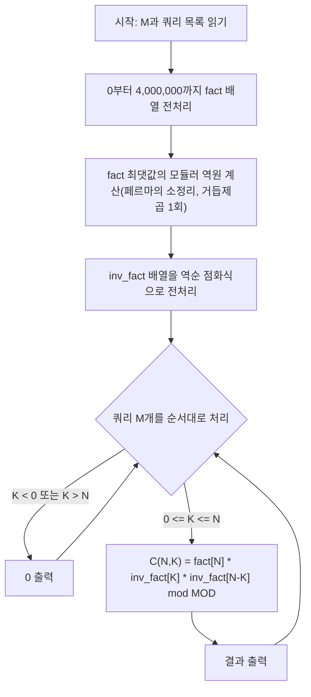

이 문제는 주어진 여러 쌍의 $N$과 $K$에 대해 이항 계수 $\binom{N}{K}$를 계산하고, 그 결과를 1,000,000,007로 나눈 나머지를 구하는 문제이다. 입력으로는 여러 개의 쿼리 $M$이 주어지며, 각 쿼리마다 $N$과 $K$가 주어진다. 이때, $N$의 최대값이 4,000,000으로 매우 크기 때문에, 효율적으로 이항 계수를 계산할 필요가 있다. 단순히 팩토리얼을 계산하고 나누는 방식으로는 시간 초과가 발생할 수 있다. 따라서, 미리 팩토리얼과 그 역원을 미리 계산해두고 이를 활용하여 빠르게 이항 계수를 구하는 방법을 사용해야 한다.

## 문제 정보

**문제 링크**: [https://www.acmicpc.net/problem/13977](https://web.archive.org/web/20240402093501/https://www.acmicpc.net/problem/13977) (원 URL은 acmicpc.net 사이트 전체 점검으로 현재 404 — 아래 각주 참고, 링크는 Wayback Machine 스냅샷으로 연결됨)

**문제 요약**:
$M$개의 자연수 쌍 $(N, K)$가 주어졌을 때, 각각의 이항 계수 $\binom{N}{K}$를 1,000,000,007로 나눈 나머지를 구하는 프로그램을 작성한다. 쿼리마다 매번 팩토리얼을 새로 계산하면 $N$이 최대 4,000,000이라 시간 초과가 발생하므로, 팩토리얼과 그 모듈러 역원을 전처리해두고 각 쿼리를 O(1)에 answer해야 한다.

**제한 조건**:
- 시간 제한: 1초
- 메모리 제한: 512MB
- $1 \le M \le 100{,}000$
- $1 \le N \le 4{,}000{,}000$, $0 \le K \le N$

> 2026-09-30 기준 acmicpc.net 사이트 전체가 "채점 서버 준비 중" 점검 상태(2026년 4월 28일까지 공지)라 원본 문제 페이지에 직접 접근할 수 없었다. 위 제한 조건과 아래 입출력 예제는 [Wayback Machine의 2024-04-02 스냅샷](https://web.archive.org/web/20240402093501/https://www.acmicpc.net/problem/13977)(HTTP 200 정상 응답)을 근거로 옮겼으며, 예제 출력값은 직접 계산해 본문에서 재검증했다.

||
|:---:|
||

## 입출력 예제

**입력 1**:
```text
5
5 2
5 3
10 5
20 10
10 0
```

**출력 1**:
```text
10
10
252
184756
1
```

**설명**: 다섯 번째 쿼리 $(10, 0)$처럼 $K=0$이면 $\binom{N}{0}=1$이 항상 성립한다는 점, 그리고 $\binom{5}{2}=\binom{5}{3}=10$처럼 $\binom{N}{K}=\binom{N}{N-K}$ 대칭성이 예제에 그대로 드러난다는 점을 확인할 수 있다. 모든 예제 값은 $N \le 20$으로 작아 1,000,000,007로 나눈 나머지를 취해도 원래 정수값과 같다.

## 접근 방식

이 문제를 해결하기 위해서는 이항 계수를 효율적으로 계산할 수 있는 방법이 필요하다. 이항 계수 $\binom{N}{K}$는 다음과 같이 계산할 수 있다:

$\binom{N}{K} = \frac{N!}{K!(N-K)!}$

여기서, $N!$, $K!$, $(N-K)!$를 직접 계산하는 것은 $N$이 4,000,000까지 주어지므로 비효율적이다. 쿼리마다 $O(N)$ 시간으로 팩토리얼을 새로 구하면 최악의 경우 $O(M \cdot N_{max})$가 되어 1초 제한 안에 끝나지 않는다. 따라서, 미리 모든 팩토리얼 값을 계산해두고, 페르마의 소정리를 이용하여 모듈로 역수를 구한 뒤, 이를 이용해 $\binom{N}{K}$를 빠르게 계산할 수 있다.

페르마의 소정리는 $MOD$가 소수이고 $a$가 $MOD$의 배수가 아닐 때 $a^{MOD-1} \equiv 1 \pmod{MOD}$가 성립한다는 정리다. 양변을 $a$로 나누면 $a^{MOD-2} \equiv a^{-1} \pmod{MOD}$를 얻는데, 이는 곧 $a^{MOD-2} \bmod MOD$가 $a$의 모듈러 역원이라는 뜻이다. $1{,}000{,}000{,}007$은 소수이므로 이 성질을 그대로 적용할 수 있다. 만약 $MOD$가 소수가 아니라면 이 방법은 성립하지 않으며, 대신 확장 유클리드 알고리즘으로 $\gcd(a, MOD)=1$인 경우에 한해 역원을 구해야 한다.

구체적으로는 다음과 같은 단계를 따른다:

1. **팩토리얼 미리 계산**: $0!$부터 $4{,}000{,}000!$까지의 값을 미리 계산하고, 이를 모듈로 $1{,}000{,}000{,}007$로 저장한다.
2. **역팩토리얼 계산**: $N!$의 역수를 계산하기 위해 페르마의 소정리를 이용하여 $fact[N]^{MOD-2} \bmod MOD$를 계산하고, 이를 통해 모든 역팩토리얼을 미리 계산해둔다. 마지막 팩토리얼의 역원 하나만 거듭제곱으로 구한 뒤, 나머지는 $inv\_fact[i] = inv\_fact[i+1] \times (i+1) \bmod MOD$의 점화식으로 역순 전처리한다. 이렇게 하면 거듭제곱 연산을 $4{,}000{,}000$번이 아니라 단 한 번만 수행해도 된다.
3. **이항 계수 계산**: 각 쿼리마다 $\binom{N}{K} = fact[N] \times inv\_fact[K] \times inv\_fact[N-K] \bmod MOD$를 계산하여 출력한다.

전처리를 한 번만 해두면 이후 각 쿼리는 배열 조회와 곱셈 몇 번으로 끝나므로, $M$개의 쿼리를 효율적으로 처리할 수 있다. 아래 순서도는 전처리부터 쿼리 응답까지의 흐름을 정리한 것이다.



## 복잡도 분석

| 항목 | 복잡도 | 비고 |
|---|---|---|
| **시간 복잡도** | $O(N_{max} + M)$ | 팩토리얼·역팩토리얼 전처리 $O(N_{max})$ + 역원 계산용 거듭제곱 $O(\log MOD)$ 1회 + 쿼리 응답 $O(1) \times M$ |
| **공간 복잡도** | $O(N_{max})$ | `fact`·`inv_fact` 배열 각각 `long long` $4{,}000{,}001$개 $\approx$ 30.5MB, 합쳐서 약 61MB(메모리 제한 512MB 이내) |

여기서 $N_{max}=4{,}000{,}000$이다. 쿼리마다 팩토리얼을 새로 구하는 순진한 방법의 $O(M \cdot N_{max})$와 비교하면, 전처리로 $N_{max}$ 부분을 단 한 번만 계산하고 쿼리당 비용을 $O(1)$로 낮췄다는 점이 이 풀이의 핵심이다.

## 구현 코드

### C++

```cpp
// 42jerrykim.github.io에서 더 많은 정보를 확인할 수 있다
#include <bits/stdc++.h>
using namespace std;

typedef long long ll;

const int MOD = 1000000007;

// Fast exponentiation to compute (base^exp) % MOD
ll powmod(ll base, ll exp, ll mod) {
    ll res = 1;
    base %= mod;
    while(exp > 0){
        if(exp & 1LL){
            res = res * base % mod; // 현재 비트가 1이면 결과에 base를 곱함
        }
        base = base * base % mod; // base를 제곱함
        exp >>= 1LL; // 다음 비트로 이동
    }
    return res;
}

int main(){
    ios::sync_with_stdio(false);
    cin.tie(NULL);
    
    int M;
    cin >> M;
    
    // Maximum N is up to 4,000,000
    const int MAX = 4000000;
    vector<ll> fact(MAX+1, 1);
    for(int i=1; i<=MAX; ++i){
        fact[i] = fact[i-1] * i % MOD; // 팩토리얼을 미리 계산
    }
    
    // Compute inverse factorial
    vector<ll> inv_fact(MAX+1, 1);
    inv_fact[MAX] = powmod(fact[MAX], MOD-2, MOD); // 마지막 팩토리얼의 역수 계산
    for(int i=MAX-1; i>=0; --i){
        inv_fact[i] = inv_fact[i+1] * (i+1) % MOD; // 역팩토리얼을 역순으로 계산
    }
    
    while(M--){
        ll N, K;
        cin >> N >> K;
        if(K < 0 || K > N){
            cout << "0\n"; // K가 유효하지 않으면 0 출력
            continue;
        }
        // C(N,K) = fact[N] * inv_fact[K] % MOD * inv_fact[N-K] % MOD
        ll comb = fact[N] * inv_fact[K] % MOD;
        comb = comb * inv_fact[N-K] % MOD;
        cout << comb << "\n"; // 결과 출력
    }
}
```

**코드 설명**

`powmod` 함수는 페르마의 소정리를 이용해 $base^{exp} \bmod mod$를 빠르게 계산하며, 이항 계수의 역원을 구하는 데 딱 한 번(전체 배열이 아니라 `fact[MAX]` 하나에 대해서만) 호출된다. `main`에서는 먼저 `fact` 벡터에 $0!$부터 $4{,}000{,}000!$까지의 값을 순서대로 채우고, 그 마지막 값의 역원을 `powmod`로 구한 뒤 역순 점화식으로 `inv_fact` 벡터 전체를 채운다. 이후 각 쿼리마다 $N$과 $K$의 유효성(K가 음수이거나 N보다 크면 정의상 0)을 검사한 다음, 미리 계산해 둔 두 벡터를 조회·곱셈만으로 $\binom{N}{K} \bmod MOD$를 구해 출력한다. `fact`·`inv_fact`를 `vector`로 선언했기 때문에 이 배열들은 힙에 할당되며, 로컬 배열을 스택에 두는 아래 "C++ without library" 버전과 달리 스택 크기 제한에 영향을 받지 않는다.

### C++ without library

앞의 벡터 기반 코드가 지역 배열이었다면 스택 오버플로우 위험이 있었을 것이므로, 같은 로직을 `<bits/stdc++.h>` 없이 `<iostream>`만으로, 배열은 `static` 지정자로 안전하게 재구현한 버전을 아래에 싣는다.

```cpp
// 42jerrykim.github.io에서 더 많은 정보를 확인할 수 있다
#include <iostream>
using namespace std;

typedef long long ll;

const int MOD = 1000000007;

// Fast exponentiation to compute (base^exp) % MOD
ll powmod(ll base, ll exp, ll mod) {
    ll res = 1;
    base %= mod;
    while(exp > 0){
        if(exp & 1){
            res = res * base % mod; // 현재 비트가 1이면 결과에 base를 곱함
        }
        base = base * base % mod; // base를 제곱함
        exp >>= 1; // 다음 비트로 이동
    }
    return res;
}

int main(){
    ios::sync_with_stdio(false);
    cin.tie(NULL);
    
    int M;
    cin >> M;
    
    // Maximum N is up to 4,000,000. static storage duration -> BSS/data
    // segment에 배치되어 스택이 아닌 곳에 할당된다(스택 오버플로우 방지).
    const int MAX = 4000000;
    static ll fact[MAX+1];
    fact[0] = 1;
    for(int i=1; i<=MAX; ++i){
        fact[i] = fact[i-1] * i % MOD; // 팩토리얼을 미리 계산
    }
    
    // Compute inverse factorial
    static ll inv_fact[MAX+1];
    inv_fact[MAX] = powmod(fact[MAX], MOD-2, MOD); // 마지막 팩토리얼의 역수 계산
    for(int i=MAX-1; i>=0; --i){
        inv_fact[i] = inv_fact[i+1] * (i+1) % MOD; // 역팩토리얼을 역순으로 계산
    }
    
    while(M--){
        ll N, K;
        cin >> N >> K;
        if(K < 0 || K > N){
            cout << "0\n"; // K가 유효하지 않으면 0 출력
            continue;
        }
        // C(N,K) = fact[N] * inv_fact[K] % MOD * inv_fact[N-K] % MOD
        ll comb = fact[N] * inv_fact[K] % MOD;
        comb = comb * inv_fact[N-K] % MOD;
        cout << comb << "\n"; // 결과 출력
    }
}
```

**코드 설명**

이 코드는 `<bits/stdc++.h>` 대신 필요한 헤더인 `<iostream>`만 포함해, 컴파일러가 전체 표준 라이브러리 헤더를 파싱하지 않아도 되므로 컴파일 속도가 더 빠르고 헤더 의존성이 명시적이다. 계산 로직 자체(팩토리얼·역팩토리얼 전처리, 쿼리 응답)는 앞의 C++ 버전과 동일하지만, `fact`·`inv_fact`를 `vector`가 아니라 `static ll fact[MAX+1]`처럼 **정적 배열**로 선언했다는 차이가 있다. `MAX+1`개의 `long long` 배열은 하나당 약 30.5MB인데, 만약 이를 `static` 없이 지역 변수로 선언하면 함수 호출 스택에 그 크기가 그대로 잡혀 스택 오버플로우로 즉시 크래시한다. BOJ 같은 채점 시스템은 흔히 스택 크기를 메모리 제한만큼 확장하는 정책을 쓰지만, 이는 채점 서버의 특수 설정일 뿐 C++ 표준이 보장하는 동작이 아니다. 일반적인 로컬 환경(Windows 기본 스레드 스택 1MB, Linux는 배포판마다 다르지만 흔히 `ulimit -s` 8MB)에서 같은 배열을 지역 변수로 선언하면 실행이 실패할 수 있으므로, `static` 지정자로 BSS 영역에 배치해 이 위험을 없앴다.

### Python

같은 전처리·쿼리 응답 로직을 Python으로 옮기면 다음과 같다. C++과 달리 배열 크기를 스택/힙으로 구분할 필요가 없지만, 대신 입력을 한 번에 읽어들이는 최적화가 필요하다.

```python
# 42jerrykim.github.io에서 더 많은 정보를 확인할 수 있다
MOD = 10**9 + 7

def powmod(base, exp, mod):
    result = 1
    base %= mod
    while exp > 0:
        if exp % 2:
            result = result * base % mod  # 현재 비트가 1이면 결과에 base를 곱함
        base = base * base % mod  # base를 제곱함
        exp //= 2  # 다음 비트로 이동
    return result

def main():
    import sys
    input = sys.stdin.read
    data = input().split()
    
    M = int(data[0])
    queries = data[1:]
    
    MAX = 4000000
    fact = [1] * (MAX + 1)
    for i in range(1, MAX + 1):
        fact[i] = fact[i-1] * i % MOD  # 팩토리얼을 미리 계산
    
    inv_fact = [1] * (MAX + 1)
    inv_fact[MAX] = powmod(fact[MAX], MOD-2, MOD)  # 마지막 팩토리얼의 역수 계산
    for i in range(MAX-1, -1, -1):
        inv_fact[i] = inv_fact[i+1] * (i+1) % MOD  # 역팩토리얼을 역순으로 계산
    
    idx = 0
    for _ in range(M):
        N = int(queries[idx])
        K = int(queries[idx+1])
        idx += 2
        if K < 0 or K > N:
            print(0)  # K가 유효하지 않으면 0 출력
            continue
        comb = fact[N] * inv_fact[K] % MOD
        comb = comb * inv_fact[N-K] % MOD
        print(comb)  # 결과 출력

if __name__ == "__main__":
    main()
```

**코드 설명**

Python 버전은 C++ 코드와 동일한 전처리·쿼리 응답 로직을 리스트로 구현한다. `powmod`는 C++과 같은 이진 거듭제곱을 직접 구현했는데, 내장 함수 `pow(base, exp, mod)`를 쓰면 한 줄로 대체할 수 있지만 이 글에서는 알고리즘의 내부 동작을 보이기 위해 직접 구현했다. 입력은 `sys.stdin.read`로 한 번에 읽어 리스트로 저장한 뒤 인덱스를 옮겨가며 파싱하는데, 이는 $M$이 최대 100,000줄일 때 `input()`을 매 줄 호출하는 것보다 훨씬 빠르다. Python은 리스트 원소가 각각 객체 헤더를 갖는 동적 배열이라 C++의 `vector<long long>`보다 원소당 메모리 오버헤드가 크고, $4{,}000{,}000$ 크기의 리스트를 두 개(`fact`, `inv_fact`) 만들면 C++ 대비 수 배의 메모리를 쓴다. 그럼에도 512MB 제한 안에서는 무리 없이 동작하지만, 이 문제보다 $N_{max}$가 더 크거나 메모리 제한이 더 빡빡한 문제라면 Python 리스트 오버헤드가 병목이 될 수 있다.

## 코너 케이스 및 실수 포인트

| 케이스 | 설명 | 처리 방법 |
|---|---|---|
| **최소 입력** | N=1 또는 빈 입력 | 반복문 범위·예외 처리 확인 |
| **오버플로우** | 답이 $2^{31}$ 초과 가능 | `long long` (C++) 등 사용 |
| **K=0** | $\binom{N}{0}=1$이 항상 성립 | `inv_fact[0]=1`(팩토리얼 배열 초기값)로 자동 처리되는지 확인 |
| **K=N** | $\binom{N}{N}=1$이며 `inv_fact[N-K]=inv_fact[0]` 조회 | 인덱스 0 접근이 배열 범위를 벗어나지 않는지 확인 |
| **K가 범위를 벗어남** | $K<0$ 또는 $K>N$ | 정의상 0이므로 배열 조회 전에 반드시 걸러야 함(그렇지 않으면 음수 인덱스 접근) |

## 판단 기준

이 팩토리얼·모듈러 역원 전처리 방식은 **여러 쿼리에 걸쳐 $N$의 상한이 고정되어 있고, 그 상한이 배열로 감당할 수 있는 크기(수백만 단위)일 때** 가장 효율적이다. 이 문제처럼 $N_{max}=4{,}000{,}000$이 미리 정해져 있고 쿼리가 최대 100,000개라면, $O(N_{max})$ 전처리 한 번으로 이후 모든 쿼리를 $O(1)$에 처리할 수 있어 압도적으로 유리하다.

반대로 다음 상황에서는 이 방법이 적합하지 않다.

- **$N$의 상한이 극단적으로 클 때(예: $10^{18}$)**: 팩토리얼 배열 자체를 만들 수 없다. 이때는 뤼카의 정리(Lucas' theorem)로 $N$, $K$를 $MOD$진법으로 분해해 각 자릿수별로 작은 이항 계수를 구하고 곱하는 방식을 쓴다.
- **$MOD$가 소수가 아닐 때**: 페르마의 소정리 기반 역원 계산이 성립하지 않는다. $MOD$가 합성수라면 중국인의 나머지 정리(CRT)로 소인수별 모듈러스에서 각각 계산한 뒤 합치거나, $\gcd(a, MOD)=1$인 항에 한해 확장 유클리드 알고리즘으로 역원을 구해야 한다.
- **쿼리가 단 1–2개뿐일 때**: 매번 $O(N_{max})$ 배열을 통째로 전처리하는 비용이 오히려 낭비다. 이때는 $O(K)$ 시간에 $\binom{N}{K} = \prod_{i=0}^{K-1}\frac{N-i}{i+1}$을 직접 계산하는 것이 더 실용적이다.

## 흔한 오개념

이 풀이를 처음 접할 때 흔히 빠지는 오해 두 가지가 있다.

첫째, "페르마의 소정리를 쓰면 항상 모듈러 역원을 구할 수 있다"는 생각이다. 페르마의 소정리는 $MOD$가 **소수**일 때만 성립한다. $1{,}000{,}000{,}007$은 실제로 소수이기 때문에 이 문제에서는 문제가 없지만, 만약 $MOD$가 $10^9$처럼 합성수라면 $a^{MOD-2} \bmod MOD$가 역원이라는 보장이 없다. 이 경우 대신 확장 유클리드 알고리즘으로 $ax + MODy = \gcd(a, MOD)$를 풀어야 하며, $\gcd(a, MOD) \ne 1$이면 애초에 역원이 존재하지 않는다.

둘째, "역팩토리얼도 각 원소마다 거듭제곱으로 따로 구해야 한다"는 생각이다. `inv_fact[i]`를 매번 `powmod(fact[i], MOD-2, MOD)`로 구하면 전체가 $O(N_{max} \log MOD)$가 되어 불필요하게 느려진다. 이 글의 코드처럼 가장 큰 인덱스의 역원 하나만 거듭제곱으로 구하고, $inv\_fact[i] = inv\_fact[i+1] \times (i+1) \bmod MOD$라는 점화식으로 나머지를 역순 계산하면 거듭제곱 호출이 단 1회로 줄어 전체가 $O(N_{max})$에 끝난다.

## 결론

"전처리로 쿼리당 비용을 낮춘다"는 이 문제의 아이디어는 경쟁 프로그래밍을 벗어나서도 흔히 쓰인다. RSA처럼 모듈러 거듭제곱·모듈러 역원 계산이 반복되는 암호 프로토콜에서도, 자주 쓰이는 값을 매 연산마다 새로 구하지 않고 한 번 계산해 재사용하는 것이 성능의 핵심이다. 이 문제에서 배운 페르마의 소정리 기반 역원 계산과 "전처리 한 번, 쿼리는 $O(1)$"이라는 패턴은 단순한 수학 트릭이 아니라, 반복되는 비싼 연산을 앞단에서 한 번만 수행하고 이후에는 캐시된 결과만 조회하는 일반적인 성능 설계 원칙의 축소판이라고 볼 수 있다.

## 학습 목표 및 평가 기준

이 글을 읽은 후 다음을 스스로 설명·실행할 수 있어야 한다.

- 팩토리얼·역팩토리얼을 전처리해 $O(1)$에 이항 계수를 구하는 원리를, 페르마의 소정리로부터 $a^{MOD-2} \bmod MOD$가 왜 $a^{-1}$인지 유도하는 과정과 함께 설명할 수 있다.
- 역팩토리얼 전체를 매번 거듭제곱으로 구하는 방식과, 가장 큰 인덱스만 거듭제곱하고 나머지를 점화식으로 역순 계산하는 방식의 시간복잡도 차이($O(N_{max}\log MOD)$ vs $O(N_{max})$)를 설명할 수 있다.
- $MOD$가 소수가 아닌 경우 이 방법이 왜 성립하지 않는지, 그런 경우 어떤 대안(확장 유클리드, CRT)을 써야 하는지 판단할 수 있다.
- $N$의 상한이 배열로 감당할 수 없을 만큼 클 때 뤼카의 정리로 전환해야 한다는 것을 알고, 언제 이 문제의 접근을 그대로 쓰면 안 되는지 구분할 수 있다.
- 지역 배열을 스택에 크게 선언했을 때 왜 크래시할 수 있는지, `static`이나 `vector`로 바꾸면 왜 안전해지는지 설명할 수 있다.

## 참고 문헌 및 출처

- [백준 13977번 문제](https://web.archive.org/web/20240402093501/https://www.acmicpc.net/problem/13977) (원 URL `acmicpc.net/problem/13977`은 2026-09-30 기준 사이트 전체 점검으로 404 — Wayback Machine 2024-04-02 스냅샷으로 대체 연결)
- [Fermat's little theorem - Wikipedia](https://en.wikipedia.org/wiki/Fermat%27s_little_theorem)
- [Modular multiplicative inverse - Wikipedia](https://en.wikipedia.org/wiki/Modular_multiplicative_inverse)
- [Lucas's theorem - Wikipedia](https://en.wikipedia.org/wiki/Lucas%27s_theorem)
