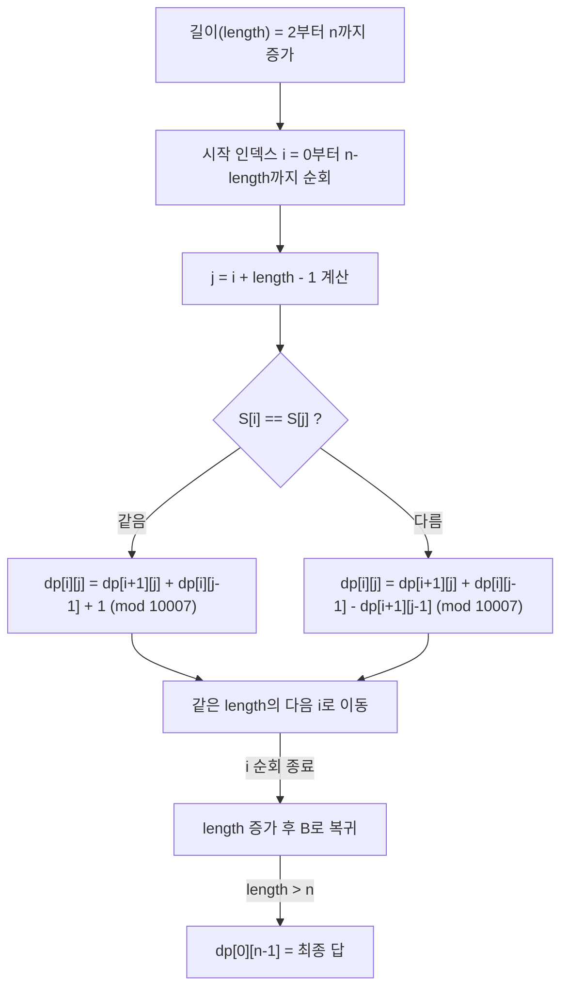

팰린드롬(palindrome)이란 앞에서부터 읽으나 뒤에서부터 읽으나 같은 단어를 말한다. 예를 들어, 'aba'나 'a'는 팰린드롬이며, 'abaccbcb'나 'anavolimilana'는 팰린드롬이 아니다. 이번 문제에서는 주어진 문자열의 부분수열 중에서 팰린드롬이 되는 부분수열의 개수를 구하는 것이 목표이다. 부분수열이란 문자열에서 일부 문자를 선택하여 순서를 유지하면서 만든 새로운 문자열을 말하며, 공집합은 포함하지 않는다.

예를 들어, 문자열 'abb'의 모든 부분수열은 {'a'}, {'b'}, {'b'}, {'ab'}, {'ab'}, {'bb'}, {'abb'}이며, 이 중 팰린드롬인 부분수열은 {'a'}, {'b'}, {'b'}, {'bb'}으로 총 4개가 된다. 문제에서는 이러한 팰린드롬 부분수열의 개수를 구하고, 그 결과를 10,007로 나눈 나머지를 출력해야 한다.

문자열의 길이가 최대 1000이므로, 효율적인 알고리즘을 사용해야 한다. 이 문제는 동적 계획법(Dynamic Programming)을 이용하여 해결할 수 있으며, 부분문자열 간의 관계를 이용하여 팰린드롬 부분수열의 개수를 효율적으로 계산할 수 있다.

문제 : [https://www.acmicpc.net/problem/14517](https://www.acmicpc.net/problem/14517)

||
|:---:|
| |

## 접근 방식

이 문제를 해결하기 위해 동적 계획법(Dynamic Programming, DP)을 사용하였다. DP 테이블을 이용하여 문자열의 특정 구간에서의 팰린드롬 부분수열의 개수를 저장함으로써, 중복 계산을 피하고 효율적으로 문제를 해결할 수 있다.

**동적 계획법 (Dynamic Programming)**

먼저 `dp[i][j]`를 문자열 `S`의 `i`번째 문자부터 `j`번째 문자까지의 부분 문자열에서 팰린드롬 부분수열의 개수로 정의한다. 구간의 길이가 1인 기저 사례, 즉 `i == j`일 때는 단일 문자 자체가 항상 팰린드롬이므로 `dp[i][j] = 1`이다.

점화식은 구간의 양 끝 문자가 같은지 여부로 나뉜다. `S[i] == S[j]`라면 양 끝을 뺀 안쪽 구간 `dp[i+1][j-1]`의 모든 팰린드롬 부분수열 양 끝에 `S[i]`와 `S[j]`를 덧붙여도 여전히 팰린드롬이 되므로, 새로 생기는 경우의 수를 더해야 한다. 이를 `dp[i+1][j]`(왼쪽 끝 제외 구간의 답)와 `dp[i][j-1]`(오른쪽 끝 제외 구간의 답)의 합으로 표현하면 `dp[i+1][j-1]`의 팰린드롬들이 두 항에 중복으로 포함되지만, 양 끝에 같은 문자를 하나씩 더 붙인 새 팰린드롬 `+1`을 더하는 것으로 이 중복이 정확히 상쇄된다. 즉 $dp[i][j] = dp[i+1][j] + dp[i][j-1] + 1 \mod 10007$이다.

반대로 `S[i] != S[j]`라면 두 끝 문자를 동시에 포함하는 팰린드롬은 존재할 수 없으므로 새로 더할 항이 없다. 이때는 포함-배제 원리를 그대로 적용해, `S[i]`를 포함하는 경우의 수(`dp[i+1][j]`)와 `S[j]`를 포함하는 경우의 수(`dp[i][j-1]`)를 더한 뒤 두 번 세어진 `dp[i+1][j-1]`을 한 번 빼서 보정한다. 식으로 쓰면 $dp[i][j] = (dp[i+1][j] + dp[i][j-1] - dp[i+1][j-1] + 10007) \mod 10007$이며, `+10007`은 음수가 되는 것을 방지하기 위한 조치다.

이 점화식을 채우는 순서는 구간 길이에 의존한다 — `dp[i][j]`를 계산하려면 그보다 길이가 1 짧은 구간들이 먼저 채워져 있어야 하므로, 부분 문자열의 길이를 2부터 시작해 점차 늘려가며 `dp[i][j]`를 계산한다. 최종적으로 `dp[0][n-1]`이 전체 문자열에서의 팰린드롬 부분수열의 개수가 된다.

## 복잡도 분석

이 문제는 구간 `[i, j]`의 답을 더 짧은 구간 `[i+1, j]`, `[i, j-1]`, `[i+1, j-1]`의 답으로부터 계산하는 전형적인 구간 DP(Interval DP)다. 상태의 개수와 전이 비용을 분리해서 보면 복잡도를 직접 유도할 수 있다.

상태는 시작 인덱스 `i`와 끝 인덱스 `j`의 조합이므로 최대 `n × n`개이고, 각 상태를 채우는 전이는 이미 계산된 이웃 상태 3개(`dp[i+1][j]`, `dp[i][j-1]`, `dp[i+1][j-1]`)를 더하고 빼는 상수 시간 연산이다. 따라서 전체 시간 복잡도는 상태 수 `O(n²)`에 전이 비용 `O(1)`을 곱한 `O(n²)`이 된다. 문자열 길이가 최대 1000이므로 연산 횟수는 최대 약 10^6 회 수준이라 시간 제한 안에서 충분히 처리된다. 공간 복잡도는 `dp[i][j]` 2차원 테이블 전체를 보관해야 하므로 `O(n²)`이다.

다음 다이어그램은 `dp` 테이블을 채우는 순서를 보여준다. 바깥 루프가 구간 길이를 2부터 `n`까지 늘리고, 안쪽 루프가 그 길이를 갖는 모든 시작 인덱스 `i`를 순회하는 이중 루프 구조다.



| 항목 | 복잡도 | 근거 |
|---|---|---|
| 시간 복잡도 | O(n²) | `i`, `j` 조합 O(n²)개를 각각 O(1) 전이로 채움 |
| 공간 복잡도 | O(n²) | `dp[n][n]` 2차원 배열 전체를 저장 |

공간을 더 줄이고 싶다면, `dp[i][j]` 계산이 길이가 1 작은 구간까지만 참조한다는 점을 이용해 배열을 대각선 단위로만 유지하는 방식으로 `O(n)`까지 줄일 수 있다(아래 결론 참고).

## C++ 코드와 설명

```cpp
// 42jerrykim.github.io에서 더 많은 정보를 확인할 수 있다
#include <iostream>
#include <vector>
#include <string>

using namespace std;

const int MOD = 10007;

int main(){
    string S;
    cin >> S; // 문자열 입력
    int n = S.length();
    // dp[i][j]는 S[i..j] 구간의 팰린드롬 부분수열의 개수를 저장
    vector<vector<int>> dp(n, vector<int>(n, 0));
    
    // 기저 사례: 단일 문자
    for(int i=0; i<n; ++i){
        dp[i][i] = 1;
    }
    
    // 부분 문자열의 길이를 2부터 n까지 증가시키며 DP 테이블을 채움
    for(int length=2; length<=n; ++length){
        for(int i=0; i + length -1 < n; ++i){
            int j = i + length -1;
            if(S[i] == S[j]){
                dp[i][j] = (dp[i+1][j] + dp[i][j-1] + 1) % MOD;
            }
            else{
                dp[i][j] = (dp[i+1][j] + dp[i][j-1] - dp[i+1][j-1] + MOD) % MOD;
            }
        }
    }
    
    cout << dp[0][n-1] << "\n"; // 전체 문자열에서의 팰린드롬 부분수열의 개수 출력
    return 0;
}
```

**코드 설명**

위 "접근 방식"에서 유도한 점화식을 그대로 옮긴 구현이다. `vector<vector<int>>`로 `n × n` 크기의 `dp` 테이블을 0으로 초기화한 뒤 `dp[i][i] = 1`로 기저 사례를 채우고, 길이 `length`를 2부터 `n`까지 늘려가며 각 시작 인덱스 `i`에 대해 `j = i + length - 1`을 계산해 점화식을 적용한다. C++ 표준 라이브러리의 `vector`를 사용하므로 메모리 할당·해제를 직접 관리할 필요가 없다는 점이 바로 아래 C 버전과의 주된 차이다.

## C++ without library 코드와 설명

```cpp
// 42jerrykim.github.io에서 더 많은 정보를 확인할 수 있다
#include <stdio.h>
#include <string.h>
#include <stdlib.h>

#define MOD 10007

int main(){
    char S[1001];
    scanf("%s", S); // 문자열 입력
    int n = strlen(S);
    // 2차원 배열 동적 할당
    int **dp = (int **)malloc(n * sizeof(int *));
    for(int i=0; i<n; ++i){
        dp[i] = (int *)malloc(n * sizeof(int));
        for(int j=0; j<n; ++j){
            dp[i][j] = 0;
        }
    }
    
    // 기저 사례: 단일 문자
    for(int i=0; i<n; ++i){
        dp[i][i] = 1;
    }
    
    // DP 테이블 채우기
    for(int length=2; length<=n; ++length){
        for(int i=0; i + length -1 < n; ++i){
            int j = i + length -1;
            if(S[i] == S[j]){
                dp[i][j] = (dp[i+1][j] + dp[i][j-1] + 1) % MOD;
            }
            else{
                dp[i][j] = (dp[i+1][j] + dp[i][j-1] - dp[i+1][j-1] + MOD) % MOD;
            }
        }
    }
    
    printf("%d\n", dp[0][n-1]); // 결과 출력
    
    // 메모리 해제
    for(int i=0; i<n; ++i){
        free(dp[i]);
    }
    free(dp);
    
    return 0;
}
```

**코드 설명**

표준 라이브러리의 `vector` 없이 `malloc`으로 `n × n` 정수 배열을 직접 할당한 버전이다. DP 점화식 자체는 C++ 버전과 동일하지만, `dp`를 `int **`로 선언해 행마다 `malloc`을 호출해야 하고, 사용이 끝난 뒤에는 각 행과 포인터 배열을 역순으로 `free`해 메모리 누수를 막아야 한다. 이처럼 C에서는 메모리 수명 관리를 프로그래머가 직접 책임지므로, 대회 환경에서 스택 크기 제한을 피하려고 동적 배열을 택할 때는 항상 해제 짝을 맞춰 두는 습관이 중요하다.

## Python 코드와 설명

```python
# 42jerrykim.github.io에서 더 많은 정보를 확인할 수 있다
MOD = 10007

def count_palindromic_subsequences(S):
    n = len(S)
    # dp[i][j]는 S[i..j] 구간의 팰린드롬 부분수열의 개수를 저장
    dp = [[0]*n for _ in range(n)]
    
    # 기저 사례: 단일 문자
    for i in range(n):
        dp[i][i] = 1
    
    # 부분 문자열의 길이를 2부터 n까지 증가시키며 DP 테이블을 채움
    for length in range(2, n+1):
        for i in range(n - length +1):
            j = i + length -1
            if S[i] == S[j]:
                dp[i][j] = (dp[i+1][j] + dp[i][j-1] + 1) % MOD
            else:
                dp[i][j] = (dp[i+1][j] + dp[i][j-1] - dp[i+1][j-1] + MOD) % MOD
    return dp[0][n-1]

if __name__ == "__main__":
    S = input().strip()
    result = count_palindromic_subsequences(S)
    print(result)
```

**코드 설명**

C++·C 버전과 DP 로직은 동일하되, 리스트 컴프리헨션 `[[0]*n for _ in range(n)]`으로 2차원 리스트를 한 줄에 초기화하고 `malloc`/`free` 같은 명시적 메모리 관리가 필요 없다는 점이 가장 큰 차이다. 다만 파이썬의 리스트 인덱싱과 정수 연산에 따르는 오버헤드 때문에, 같은 `O(n²)` 알고리즘이라도 C++·C 구현보다 실행 시간이 여유 있게 걸릴 수 있음을 감안해야 한다.

## 판단 기준: 언제 이 구간 DP를 쓰는가

이 구간 DP는 문자열 길이 `n`이 커도 수천 수준이라 `O(n²)` 시간과 `O(n²)` 공간을 감당할 수 있을 때 적합하다. 팰린드롬 부분수열 개수 문제가 구간 DP로 환원되는 이유는, 구간 `[i, j]`의 답이 항상 한 칸씩 짧은 하위 구간들의 답만으로 표현되기 때문이다(위 "복잡도 분석" 참고). 이 성질이 성립하지 않는 문제(예: 순서를 바꿔도 되는 부분집합 카운팅처럼 구간 경계가 의미 없는 문제)에는 같은 점화식을 적용할 수 없다.

반대로 `n`이 매우 작다면(대략 20 이하) 모든 부분수열을 비트마스크로 직접 나열해 각각이 팰린드롬인지 검사하는 완전 탐색만으로도 충분하며, 구간 DP를 설계하는 구현 비용을 들일 필요가 없다. `n`이 `O(n²)` 메모리조차 감당하지 못할 만큼 커진다면, 이 문제 범위를 벗어나 접미사 자료구조나 팰린드롬 전용 트리(Eertree) 같은 더 정교한 자료구조로 접근해야 한다. 즉 입력 크기가 "완전 탐색은 무리지만 `O(n²)`은 충분한" 구간에 있는지가 이 풀이를 선택하는 핵심 판단 기준이다.

## 이 글을 읽은 후 달성해야 할 목표

- 구간 `[i, j]`의 답을 더 짧은 구간들의 답으로 표현하는 구간 DP(Interval DP)의 일반적인 설계 패턴을 설명할 수 있다.
- `S[i] != S[j]`일 때 `dp[i+1][j] + dp[i][j-1] - dp[i+1][j-1]`로 계산하는 이유를, `dp[i+1][j]`와 `dp[i][j-1]`이 `dp[i+1][j-1]`에 속한 부분수열을 중복으로 세는 포함-배제 관계로부터 유도할 수 있다.
- 상태 개수와 전이 비용을 분리해 시간 복잡도 `O(n²)`·공간 복잡도 `O(n²)`를 직접 도출할 수 있다.
- 입력 크기를 보고 완전 탐색·이 구간 DP·더 정교한 문자열 자료구조 중 어떤 접근이 적합한지 판단할 수 있다.

## 결론

이번 문제는 동적 계획법을 이용하여 효율적으로 팰린드롬 부분수열의 개수를 구하는 방법을 학습할 수 있는 좋은 예제였다. 특히, 부분 문자열 간의 관계를 이용한 점화식 설정과 모듈러 연산을 통한 값의 범위 제한이 중요한 포인트였다. C++·C·Python 세 언어로 구현해보면서 같은 DP 로직이 메모리 관리 방식(자동 관리 vs `malloc`/`free`)에 따라 어떻게 달라지는지 비교해볼 수 있었다. 공간을 더 줄이는 최적화 방향은 위 "복잡도 분석" 절을 참고하면 된다.

## 코너 케이스 및 실수 포인트

| 케이스 | 설명 | 처리 방법 |
|---|---|---|
| **최소 입력** | N=1 또는 빈 입력 | 반복문 범위·예외 처리 확인 |
| **오버플로우 없음** | 모든 `dp` 값이 `% 10007` 연산으로 묶여 결과가 항상 10007 미만이므로 `int` 범위(2^31) 초과는 발생하지 않는다 | 별도 처리 불필요 — `long long`으로 바꿀 필요 없음 |
| **음수 나머지** | `S[i] != S[j]` 분기에서 뺄셈 결과가 음수가 될 수 있음 | `+ 10007`을 더한 뒤 `% 10007`로 보정(위 점화식 참고) |

## 참고 문헌 및 출처

- [백준 14517번 문제](https://www.acmicpc.net/problem/14517) — 2026-10-01 기준 BOJ 채점 서비스 전체 점검으로 접속이 일시 불가능한 상태다.
- Cormen, Leiserson, Rivest, Stein, *Introduction to Algorithms*, 3rd ed., Chapter 15 "Dynamic Programming" — 이 문제의 구간 DP 패턴은 같은 장의 "Matrix-Chain Multiplication"(행렬 체인 곱셈)이 대표하는, 구간 `[i, j]`의 답을 더 짧은 하위 구간들로 분해하는 고전적 구간 DP 설계 방식과 동일한 구조를 따른다.
- [Inclusion–exclusion principle – Wikipedia](https://en.wikipedia.org/wiki/Inclusion%E2%80%93exclusion_principle) — `S[i] != S[j]`일 때 `dp[i+1][j] + dp[i][j-1] - dp[i+1][j-1]`로 계산하는 근거가 되는 포함-배제 원리의 일반 정의.
