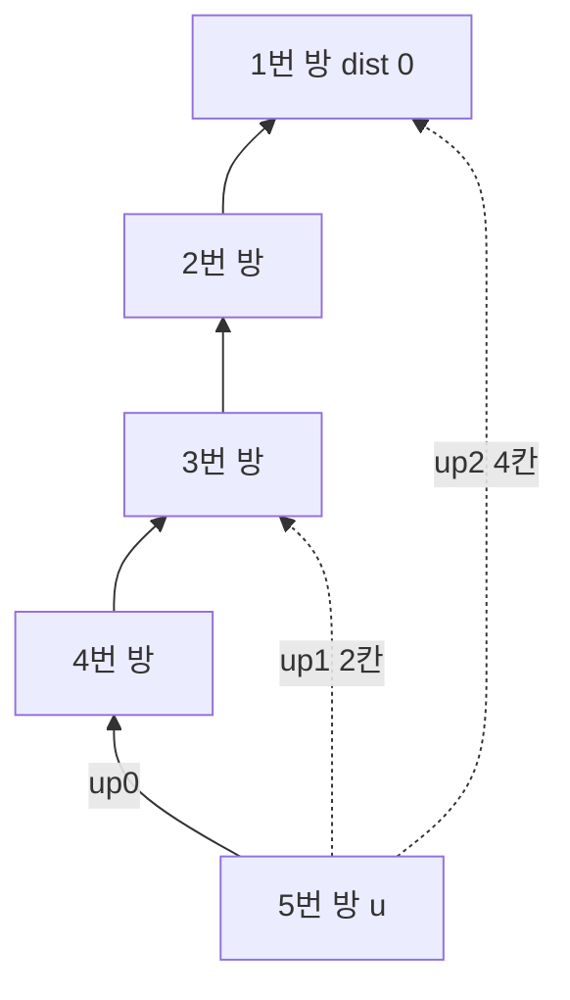

개미집은 n개의 방으로 구성되어 있으며, 이 방들은 1번부터 n번까지 번호가 부여되어 있다. 1번 방은 지면에 직접 연결되어 있는 방으로, 모든 개미는 이 방을 통해 지면으로 올라가고자 한다. 각 방은 서로 굴을 통해 연결되어 있으며, 굴을 이동하는 데는 굴의 길이만큼의 에너지가 소모된다. 개미들은 겨울잠에서 깨어나 지면으로 올라가기 위해 에너지를 사용하지만, 에너지가 부족하여 중간에 멈출 수 있다. 이 문제에서는 각 개미가 가진 에너지를 바탕으로, 도달할 수 있는 가장 1번 방에 가까운 방의 번호를 구하는 것이 목표이다.

문제 : [https://www.acmicpc.net/problem/14942](https://www.acmicpc.net/problem/14942)

## 문제 정보와 입출력 예제

입력은 방의 수 `n`, 각 방에 있는 개미의 에너지 `n`개, 그리고 방을 잇는 `n-1`개의 굴 `a b c`(방 `a`와 `b`를 잇는 길이 `c`의 굴)로 이루어진다. 출력은 방 1부터 `n`까지 각 방의 개미가 에너지 안에서 도달할 수 있는 가장 1번 방에 가까운 방의 번호다. 시간·메모리 제한과 `n`·굴 길이·에너지의 정확한 상한은 위 원문 링크에서 확인해야 하며, 이 글의 코드는 `n`이 10^5 규모라는 가정으로 배열 크기를 잡았다.

아래는 이해를 위해 직접 만든 작은 예제를 손으로 계산한 것이다. 방 5개, 에너지가 방 1–5 순서로 `1 10 5 2 3`이고 굴이 `1-2(길이 4)`, `2-3(길이 3)`, `2-4(길이 2)`, `1-5(길이 7)`이라 하자. 1번 방에서의 누적 거리는 방 1–5 순서로 0, 4, 7, 6, 7이다. 방 2는 목표 거리가 4-10<0이라 1번 방까지 가고, 방 3은 목표 거리가 7-5=2이므로 거리 4인 2번 방까지는 가지만 거리 0인 1번 방은 안 되어 2번 방에 멈춘다. 방 4는 목표 거리가 6-2=4라 2번 방(거리 4)이 조건을 만족하는 마지막 지점이고, 방 5는 목표 거리가 7-3=4인데 부모인 1번 방의 거리 0이 이보다 작아 제자리에 머문다. 따라서 출력은 방 1부터 `1 1 2 2 5`다.

## 접근 방식

이 문제는 트리 구조에서 각 노드(방) 간의 거리를 효율적으로 계산하고, 주어진 에너지로 최대로 가까운 1번 방에 도달할 수 있는 노드를 찾는 문제이다. 트리는 사이클이 없고 모든 노드 간의 경로가 유일하므로, 각 방에서 1번 방으로 올라가는 경로는 부모를 따라가는 하나의 사슬로 정해진다. 따라서 각 개미의 답은 "자기 조상 사슬 위에서 에너지로 갈 수 있는 가장 높은 지점"이다.

핵심 관찰은 누적 거리의 단조성이다. 1번 방에서 각 방까지의 거리를 `dist`라 하면 굴의 길이가 양수이므로 조상으로 올라갈수록 `dist`는 엄격히 감소한다. 방 `u`의 개미가 에너지 `E`로 도달할 수 있는 조상 `a`는 `dist[u] - dist[a] <= E`, 즉 `dist[a] >= dist[u] - E`를 만족해야 하고, 이 조건은 사슬을 따라 올라갈 때 "처음에는 참이다가 어느 지점부터 거짓"이 되는 형태다. 조건을 만족하는 가장 높은 조상(루트에 가장 가까운 조상)을 고르는 것이 곧 탐욕적 선택이며, 조건이 한 번 깨지면 더 위쪽 조상은 모두 깨지므로 이분 탐색이 성립한다.

사슬을 한 칸씩 올라가면 쿼리당 O(N)이 걸리지만, 이진 승격은 2^k번째 조상을 미리 계산해 두고 큰 점프부터 시도하는 이분 탐색으로 쿼리당 O(log N)에 답을 구한다. `k`를 큰 값부터 줄여 가며 "2^k칸 위 조상이 아직 조건을 만족하면 그곳으로 이동"을 반복하면, 올라갈 수 있는 총 칸 수를 이진수로 분해하는 것과 같아 정확히 한계 지점에서 멈춘다. 전처리는 DFS로 부모와 `dist`를 구하고 `up[k][u] = up[k-1][up[k-1][u]]` 점화식으로 표를 채우는 O(N log N) 작업이다.



위 그림은 사슬 형태 트리에서 방 `u`가 `up[0]`(1칸), `up[1]`(2칸), `up[2]`(4칸)로 건너뛰는 모습이다. 에너지가 부족하면 4칸 점프는 조건에서 탈락하고, 2칸 점프만 채택한 뒤 다시 1칸 점프를 시도하는 식으로 올라간다.

| 항목 | 시간 복잡도 | 공간 복잡도 |
|---|---|---|
| DFS(부모·거리 계산) | O(N) | O(N) |
| 승격 표 구축 | O(N log N) | O(N log N) |
| 쿼리 N개 처리 | O(N log N) | O(1) 추가 |

### 다른 접근과의 선택 기준

같은 문제는 경로 스택 위의 이분 탐색으로도 풀린다. DFS가 방 `u`에 들어간 시점에 루트에서 `u`까지의 경로를 배열(스택)로 유지하면 `dist`가 정렬된 배열이므로 `lower_bound`로 답을 찾을 수 있고, 메모리는 O(N)이다. 쿼리가 모든 노드에 대해 한 번씩만 주어지고 오프라인으로 처리해도 되는 이 문제에서는 이쪽이 더 가볍다. 반면 쿼리 대상 노드나 시작점이 임의로 주어지거나 LCA 같은 다른 질의를 함께 받아야 하면 승격 표를 재사용할 수 있는 이진 승격이 유리하다. 이 글은 일반화가 쉬운 이진 승격을 기준 풀이로 삼았다.

### 흔한 실수

첫째, `dist[up[k][cur]] >= target_dist`의 부등호 방향을 거꾸로 쓰는 경우다. 에너지로 갈 수 있는 곳은 `dist`가 목표 이상인 조상이므로 조건이 참이면 올라가야 한다. 둘째, 루트의 부모를 `-1`로 두고도 승격 표를 채울 때 `-1`을 인덱스로 쓰는 경우다. 셋째, `target_dist <= 0`이면 루트까지 도달 가능하다는 점을 놓치는 경우다. 이 분기를 빼도 모든 조상이 조건을 만족해 루프가 루트에서 멈추므로 답은 같지만, 분기는 불필요한 점프 시도를 줄이는 단축이다.

## C++ 코드와 설명

아래는 최적화된 C++ 코드와 각 라인에 대한 설명이다.

```cpp
// 42jerrykim.github.io에서 더 많은 정보를 확인할 수 있다
#include <bits/stdc++.h>
using namespace std;

typedef long long ll;

const int MAX = 100005;
const int LOG = 17; // 2^17 > 1e5

int n;
ll E_val[MAX];           // 각 방에 있는 개미의 에너지
ll dist_val[MAX];       // 1번 방부터 각 방까지의 거리
int up[LOG][MAX];       // 이진 승격을 위한 테이블
vector<pair<int, ll>> adj[MAX]; // 트리의 인접 리스트

// DFS를 통해 각 방의 부모와 거리를 계산
void dfs(int u, int p){
    up[0][u] = p;
    for(auto &[v, w] : adj[u]){
        if(v != p){
            dist_val[v] = dist_val[u] + w;
            dfs(v, u);
        }
    }
}

int main(){
    ios::sync_with_stdio(false);
    cin.tie(0);
    
    cin >> n;
    for(int u=1; u<=n; u++) cin >> E_val[u];
    for(int i=0; i<n-1; i++){
        int a, b;
        ll c;
        cin >> a >> b >> c;
        adj[a].emplace_back(b, c);
        adj[b].emplace_back(a, c);
    }
    
    // 1번 방을 루트로 DFS 수행
    dist_val[1] = 0;
    dfs(1, -1);
    
    // 이진 승격 테이블 구축
    for(int k=1; k<LOG; k++){
        for(int u=1; u<=n; u++){
            if(up[k-1][u] != -1){
                up[k][u] = up[k-1][up[k-1][u]];
            }
            else{
                up[k][u] = -1;
            }
        }
    }
    
    // 특정 방 u에서 에너지 E를 사용해 도달할 수 있는 가장 가까운 방 찾기
    auto get_ancestor = [&](int u, ll E) -> int {
        ll target_dist = dist_val[u] - E;
        if(target_dist <= 0){
            return 1;
        }
        int current = u;
        for(int k=LOG-1; k>=0; k--){
            if(up[k][current] != -1 && dist_val[up[k][current]] >= target_dist){
                current = up[k][current];
            }
        }
        return current;
    };
    
    // 각 개미에 대해 결과 출력
    for(int u=1; u<=n; u++){
        int v = get_ancestor(u, E_val[u]);
        cout << v << "\n";
    }
}
```

**코드 설명**

먼저 `n`과 각 방의 에너지를 읽고, `n-1`개의 굴을 양방향 인접 리스트로 저장한다. 1번 방을 루트로 DFS를 수행하면서 부모를 `up[0][u]`에, 루트로부터의 누적 거리를 `dist_val[u]`에 기록한다. 이어서 `up[k][u] = up[k-1][up[k-1][u]]` 점화식으로 2^k번째 조상 표를 채우는데, 조상이 존재하지 않는 경우는 `-1`로 전파한다.

조상 찾기 함수 `get_ancestor`는 목표 거리 `dist_val[u] - E`를 계산해 0 이하이면 루트(1)를 바로 반환하고, 그렇지 않으면 `k`를 `LOG-1`부터 0까지 줄이며 2^k번째 조상의 `dist_val`이 목표 이상일 때만 그곳으로 이동한다. 누적 거리는 굴 길이를 깊이만큼 더한 값이라 방어적으로 `long long`을 사용했다. 마지막으로 모든 방에 대해 이 함수를 호출해 답을 한 줄씩 출력한다.

## C++ without library 코드와 설명

표준 라이브러리 컨테이너 없이 배열만으로 인접 리스트를 구현한 버전이다. `vector`를 쓰지 않으므로 간선을 `head`/`next` 배열의 연결 리스트로 저장한다.

```cpp
// 42jerrykim.github.io에서 더 많은 정보를 확인할 수 있다
#include <stdio.h>
#include <stdlib.h>

typedef long long ll;

#define MAX 100005
#define LOG 17

ll E_val[MAX];
ll dist_val[MAX];
int up_table[LOG][MAX];
int head[MAX], to_arr[MAX*2], cost_arr[MAX*2], next_arr[MAX*2];
int cnt = 0;

// 간선 추가 함수
void add_edge(int a, int b, ll c){
    to_arr[cnt] = b;
    cost_arr[cnt] = c;
    next_arr[cnt] = head[a];
    head[a] = cnt++;
}

void dfs(int u, int p){
    up_table[0][u] = p;
    for(int i = head[u]; i != -1; i = next_arr[i]){
        int v = to_arr[i];
        ll w = cost_arr[i];
        if(v != p){
            dist_val[v] = dist_val[u] + w;
            dfs(v, u);
        }
    }
}

int main(){
    int n;
    scanf("%d", &n);
    
    // 에너지 값 입력
    for(int u=1; u<=n; u++) scanf("%lld", &E_val[u]);
    
    // head 배열 초기화 (간선 추가 전에 초기화해야 함)
    for(int i=1; i<=n; i++) head[i] = -1;
    
    // 간선 입력 및 추가
    for(int i=0; i<n-1; i++){
        int a, b;
        ll c;
        scanf("%d %d %lld", &a, &b, &c);
        add_edge(a, b, c);
        add_edge(b, a, c);
    }
    
    // DFS 수행하여 거리 및 부모 노드 계산
    dist_val[1] = 0;
    dfs(1, -1);
    
    // 이진 승격 테이블 구축
    for(int k=1; k<LOG; k++){
        for(int u=1; u<=n; u++){
            if(up_table[k-1][u] != -1){
                up_table[k][u] = up_table[k-1][up_table[k-1][u]];
            }
            else{
                up_table[k][u] = -1;
            }
        }
    }
    
    // 각 개미에 대해 도달 가능한 방 찾기
    for(int u=1; u<=n; u++){
        ll E = E_val[u];
        ll target_dist = dist_val[u] - E;
        if(target_dist <= 0){
            printf("1\n");
            continue;
        }
        int current = u;
        for(int k=LOG-1; k>=0; k--){
            if(up_table[k][current] != -1 && dist_val[up_table[k][current]] >= target_dist){
                current = up_table[k][current];
            }
        }
        printf("%d\n", current);
    }
}
```

**코드 설명**

구조는 위의 `vector` 버전과 같고 인접 리스트 구현과 입출력만 다르다. `scanf`/`printf`로 입출력 속도를 확보하고, 간선을 추가하기 전에 `head` 배열을 `-1`로 초기화해야 `head[i] != -1` 순회가 올바르게 끝난다. 전역 배열은 0으로 초기화되므로 이 초기화를 빼먹으면 0번 간선을 가리키는 순환이 생긴다. 이후 DFS, 승격 표 구축, 쿼리 처리는 첫 번째 버전과 동일하며 쿼리는 함수 없이 `main` 안에서 바로 처리한다.

## Python 코드와 설명

아래는 최적화된 Python 코드와 각 라인에 대한 설명이다.

```python
# 42jerrykim.github.io에서 더 많은 정보를 확인할 수 있다
import sys
def input():
    return sys.stdin.readline()

n = int(input())
E_val = [0] + [int(input()) for _ in range(n)]
adj = [[] for _ in range(n+1)]
for _ in range(n-1):
    a, b, c = map(int, input().split())
    adj[a].append((b, c))
    adj[b].append((a, c))

LOG = 17
up = [[-1]*(n+1) for _ in range(LOG)]
dist_val = [0]*(n+1)

# 재귀 대신 명시적 스택으로 DFS 수행 (사슬 트리에서도 안전)
stack = [1]
while stack:
    u = stack.pop()
    for v, w in adj[u]:
        if v != up[0][u]:
            up[0][v] = u
            dist_val[v] = dist_val[u] + w
            stack.append(v)

for k in range(1, LOG):
    for u in range(1, n+1):
        if up[k-1][u] != -1:
            up[k][u] = up[k-1][up[k-1][u]]

def get_ancestor(u, E):
    target_dist = dist_val[u] - E
    if target_dist <= 0:
        return 1
    current = u
    for k in reversed(range(LOG)):
        if up[k][current] != -1 and dist_val[up[k][current]] >= target_dist:
            current = up[k][current]
    return current

for u in range(1, n+1):
    v = get_ancestor(u, E_val[u])
    print(v)
```

**코드 설명**

로직은 C++ 버전과 같다. `sys.stdin.readline()`으로 입력을 빠르게 읽고, 인접 리스트·`dist_val`·`up` 표를 리스트로 구성해 DFS와 승격 표 구축, `get_ancestor` 호출을 같은 순서로 수행한다.

DFS는 재귀 대신 명시적 스택을 쓴다. 사슬 모양의 트리에서는 깊이가 `n`에 이르러 재귀 호출이 파이썬의 호출 스택을 소진할 수 있고, `sys.setrecursionlimit`만 올려서는 C 스택 한계를 피하지 못해 비정상 종료할 수 있기 때문이다. 부모는 `up[0][u]`로 기억해 두었다가 되돌아가는 간선을 걸러낸다.

## 결론

이 문제의 핵심은 "조상으로 올라갈수록 누적 거리가 단조 감소한다"는 성질을 이분 탐색으로 연결하는 데 있다. 이 성질 덕분에 이진 승격으로 쿼리당 O(log N), 전체 O(N log N)에 해결되며, 같은 아이디어는 경로 위에서 조건이 한 번만 바뀌는 다른 문제로 확장된다. LCA를 구하는 문제나 "경로 위 k번째 조상" 질의가 대표적이다.

## 코너 케이스 및 실수 포인트

| 케이스 | 설명 | 처리 방법 |
|---|---|---|
| **최소 입력** | N=1이면 간선이 없고 루트만 존재 | 답은 1, 반복문 범위가 비는지 확인 |
| **누적 거리** | 굴 길이×깊이의 합이므로 제약에 따라 int 범위를 넘을 수 있음 | 방어적으로 `dist`와 에너지를 `long long`(C++)로 선언 |
| **사슬 트리** | 깊이가 N에 이르는 최악의 모양 | 재귀 깊이 대신 반복형 DFS 사용 여부 확인 |
| **에너지 충분** | `dist[u] - E <= 0` | 루트(1)를 바로 출력 |

## 학습 목표 점검

이 글을 읽고 나면 (1) 조상 방향으로 누적 거리가 단조 감소한다는 성질에서 이분 탐색이 성립하는 이유를 설명하고, (2) `up[k][u] = up[k-1][up[k-1][u]]` 점화식으로 승격 표를 직접 구축해 조건을 만족하는 가장 높은 조상을 찾으며, (3) 경로 스택 이분 탐색과 이진 승격 중 문제 조건에 맞는 방법을 고를 수 있어야 한다.
