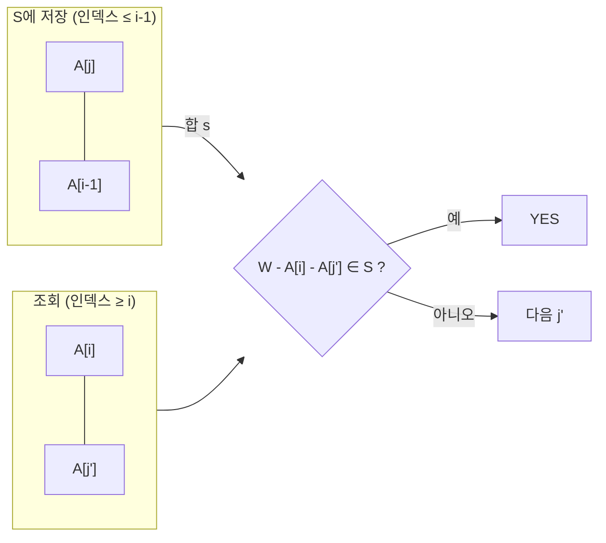

국제대학소포센터(ICPC: International Collegiate Parcel Center)는 전세계 대학생들을 대상으로 소포 무료 배송 이벤트를 진행하고 있다. 이 이벤트의 조건은 소포를 구성하는 물품이 정확히 4개이어야 하며, 이 4개 물품의 무게 합이 정확히 정해진 정수 무게 $ W $ 그램이어야 한다는 것이다. 부산대학교에 있는 찬수는 영국 왕립대학에 있는 수환에게 보내고 싶은 물품이 매우 많아, 이 조건을 만족하는 물품 조합이 있는지 빠르게 확인하고자 한다. 문제는 서로 다른 $ n $개의 정수로 이루어진 집합 $ A $에서 4개의 원소를 선택하여 그 합이 정확히 $ W $가 되는지 여부를 판단하는 것이다.

문제 : [https://www.acmicpc.net/problem/16287](https://www.acmicpc.net/problem/16287) (2026-10 기준 BOJ 서비스 종료로 접속되지 않음)

## 문제 정보

입력은 첫 줄에 $ W $와 $ N $, 둘째 줄에 $ N $개의 무게 $ A_i $다. 제약은 $ 4 \le N \le 5{,}000 $, $ 1 \le W \le 800{,}000 $, 각 $ A_i \le 200{,}000 $이며 모든 $ A_i $는 서로 다르다. 출력은 네 원소의 합이 $ W $가 되는 선택이 있으면 `YES`, 없으면 `NO`다. 예를 들어 $ W=10 $, 무게가 `1 2 3 4 5`이면 $ 1+2+3+4=10 $이므로 `YES`다.

## 접근 방식

네 원소를 고르는 완전탐색은 $ O(N^4) $이고 $ N \le 5{,}000 $이므로 불가능하다. 핵심은 네 원소를 두 쌍으로 쪼개는 것이다. 합이 $ W $가 되려면 $ A[a]+A[b]+A[c]+A[d]=W $를 만족하는 네 인덱스가 서로 달라야 하는데, 이를 "앞쪽 쌍의 합 + 뒤쪽 쌍의 합"으로 보면 한쪽 쌍의 합을 저장해 두고 다른 쪽 쌍마다 $ W - $ (합)을 조회하는 문제로 바뀐다. 이 방식은 쌍 합을 모아 두고 맞은편을 조회하는 meet-in-the-middle의 가장 단순한 형태다.

두 쌍에서 인덱스가 겹치지 않게 하는 것이 이 문제의 유일한 함정이다. 해법은 인덱스 순서로 쌍을 나누는 것이다. 바깥 루프의 $ i $에 대해 저장소 $ S $에는 $ j < i-1 $인 쌍 $ (j, i-1) $의 합, 즉 두 인덱스가 모두 $ i-1 $ 이하인 쌍만 들어 있고, 조회는 $ (i, j') $ ($ j' > i $)쌍에서 한다. 저장된 쌍의 인덱스는 전부 $ \le i-1 $, 조회 쌍의 인덱스는 전부 $ \ge i $이므로 네 인덱스가 반드시 서로 다르다. 또 인덱스 $ a<b<c<d $인 모든 네 원소 조합은 $ i = c $일 때 정확히 한 번 검사되므로(이때 $ b \le c-1 $이라 $ (a,b) $는 $ S $에 이미 들어 있다) 누락도 없다.

쌍의 합은 각 원소가 최대 200,000이므로 400,000을 넘지 않는다. 따라서 해시 집합 대신 크기 400,001의 불리언 배열을 쓸 수 있고, $ W - A[i] - A[j'] $가 범위 밖이면 곧바로 건너뛴다. 코드가 정렬을 하지만 이 불변식은 정렬에 의존하지 않는다. 정렬은 "인덱스 순서"를 값 순서로 고정할 뿐 정답 판정에는 영향이 없으며, 중복 없는 집합이라는 조건 덕에 같은 값을 두 번 쓰는 문제도 생기지 않는다.



| 방식 | 시간 복잡도 | 공간 복잡도 | 비고 |
|---|---|---|---|
| 완전탐색 | $ O(N^4) $ | $ O(1) $ | $ N=5{,}000 $에서 불가능 |
| 쌍 합 누적 + 조회 (본 풀이) | $ O(N^2) $ | $ O(400{,}001) $ | 불리언 배열 또는 집합 |

## C++ 코드와 설명

```cpp
// 출처: 42jerrykim.github.io
#include <iostream>
#include <vector>
#include <algorithm>
using namespace std;

int main(){
    ios::sync_with_stdio(false);
    cin.tie(NULL);
    
    int W, N;
    cin >> W >> N;
    vector<int> A(N);
    for(auto &x : A) cin >> x;
    
    sort(A.begin(), A.end());
    bool found = false;
    // S will store all possible sums of two numbers before the current i
    vector<bool> S(400001, false);
    
    for(int i = 2; i < N-1 && !found; ++i){
        // Update S with sums involving A[i-1] and all previous elements
        for(int j = 0; j < i-1; ++j){
            if(A[j] + A[i-1] <= 400000){
                S[A[j] + A[i-1]] = true;
            }
        }
        // Now check for pairs (A[i], A[j]) such that W - A[i] - A[j] exists in S
        for(int j = i+1; j < N && !found; ++j){
            int target = W - A[i] - A[j];
            if(target < 0 || target > 400000) continue;
            if(S[target]){
                found = true;
            }
        }
    }
    
    cout << (found ? "YES" : "NO") << '\n';
}
```

루프의 구조는 접근 방식에서 설명한 대로다. 바깥 루프 `i`가 돌 때마다 `A[j] + A[i-1]` 합들을 `S`에 새로 채우고, 이어지는 안쪽 루프에서 `W - A[i] - A[j]`가 `S`에 있는지 확인해 있으면 `found`를 세우고 두 루프를 모두 빠져나온다. `S`의 크기 400,001은 쌍 합의 상한에서 나왔다.

## C++ without library 코드와 설명

```cpp
// 출처: 42jerrykim.github.io
#include <stdio.h>
#include <stdlib.h>

int main(){
    int W, N;
    scanf("%d %d", &W, &N);
    int *A = (int*)malloc(sizeof(int)*N);
    for(int i = 0; i < N; ++i){
        scanf("%d", &A[i]);
    }
    // Simple insertion sort
    for(int i = 1; i < N; ++i){
        int key = A[i];
        int j = i-1;
        while(j >=0 && A[j] > key){
            A[j+1] = A[j];
            j--;
        }
        A[j+1] = key;
    }
    int found = 0;
    // Initialize S
    char *S = (char*)calloc(400001, sizeof(char));
    for(int i = 2; i < N-1 && !found; ++i){
        // Update S with sums involving A[i-1]
        for(int j = 0; j < i-1; ++j){
            if(A[j] + A[i-1] <= 400000){
                S[A[j] + A[i-1]] = 1;
            }
        }
        // Check for pairs
        for(int j = i+1; j < N && !found; ++j){
            int target = W - A[i] - A[j];
            if(target < 0 || target > 400000) continue;
            if(S[target]){
                found = 1;
            }
        }
    }
    printf("%s\n", found ? "YES" : "NO");
    free(A);
    free(S);
}
```

알고리즘은 위 C++ 코드와 같다. 달라지는 점은 라이브러리 없이 삽입 정렬을 직접 구현했다는 것과 `calloc`으로 잡은 `char` 배열을 `S`로 쓰고 끝에서 `free`로 해제한다는 것이다. 삽입 정렬은 $ O(N^2) $이라 $ N=5{,}000 $에서도 본 풀이의 비용을 넘지 않지만, 정렬 자체는 정답 판정에 필요하지 않다.

## Python 코드와 설명

```python
# 출처: 42jerrykim.github.io
import sys

def main():
    input = sys.stdin.read
    data = input().split()
    W = int(data[0])
    N = int(data[1])
    A = list(map(int, data[2:2+N]))
    A.sort()
    S = set()
    found = False
    for i in range(2, N-1):
        # Update S with sums involving A[i-1]
        for j in range(i-1):
            s = A[j] + A[i-1]
            if s <= 400000:
                S.add(s)
        # Check for pairs
        for j in range(i+1, N):
            target = W - A[i] - A[j]
            if target in S:
                found = True
                break
        if found:
            break
    print("YES" if found else "NO")

if __name__ == "__main__":
    main()
```

알고리즘은 같고 `S`만 `set`으로 바뀌었다. 입력은 `sys.stdin.read`로 한 번에 읽는다. 해시 집합은 배열보다 상수 비용이 크므로 Python에서는 `found`가 서는 즉시 두 루프를 빠져나오는 것이 중요하다. 아무 쌍도 맞지 않는 최악 입력에서는 약 $ N^2/2 $번의 집합 삽입·조회가 일어나 $ N=5{,}000 $ 기준 천만 단위 연산이므로, 시간 제한이 빡빡하면 C++ 풀이를 쓰는 편이 안전하다.

## 결론

이 풀이는 4-SUM을 "두 쌍의 합" 문제로 줄이는 meet-in-the-middle의 단순형이다. 같은 분할은 3-SUM이나 값 범위가 큰 일반 4-SUM에서 해시 맵으로 확장되며, 이때는 배열 대신 해시 집합을 쓰고 인덱스 분리만 같은 방식으로 유지하면 된다.

## 접근 선택 기준

쌍 합을 담는 저장소는 값 범위에 따라 고른다. 이 문제처럼 쌍 합의 상한이 400,000으로 작으면 불리언 배열이 해시 집합보다 빠르고 메모리도 예측 가능하다. 값이 $ 10^9 $ 수준이면 배열을 만들 수 없으므로 해시 집합이나 맵을 써야 하며, 이때도 인덱스 분리 방식은 그대로 유지된다. 정렬 후 투 포인터로 바깥 두 원소를 고정하고 안쪽 두 원소를 좁히는 방식은 $ O(N^3) $이라 $ N=5{,}000 $에서는 부적합하다. 반대로 $ N $이 수백 이하이면 구현이 단순한 $ O(N^3) $ 방식으로도 충분하다.

## 코너 케이스 및 실수 포인트

| 케이스 | 설명 | 처리 방법 |
|---|---|---|
| **인덱스 중복** | 같은 원소를 쌍 양쪽에서 쓰는 경우 | 저장 쌍은 $ \le i-1 $, 조회 쌍은 $ \ge i $로 분리 |
| **합 범위 초과** | `W - A[i] - A[j]`가 음수이거나 400,000 초과 | 배열 접근 전에 범위를 검사해 건너뜀 |
| **N이 4 미만에 가까운 입력** | 루프가 `i`를 2부터 `N-2`까지 돌므로 $ N=4 $에서도 한 번은 실행 | 경계 `i < N-1` 확인 |
| **오버플로우** | 합이 최대 약 800,000이므로 `int`로 충분 | 별도 처리 불필요 |

## 이 글을 읽은 후 달성할 목표

- 네 원소의 합 문제를 "저장 쌍 + 조회 쌍"으로 분해하고, 시간 복잡도가 $ O(N^4) $에서 $ O(N^2) $으로 줄어드는 이유를 설명할 수 있다.
- 저장 쌍(인덱스 $ \le i-1 $)과 조회 쌍(인덱스 $ \ge i $)을 나누는 것이 인덱스 중복을 막고 모든 조합을 한 번씩 검사함을 증명할 수 있다.
- 값 범위에 따라 불리언 배열과 해시 집합 중 무엇을 쓸지 근거를 들어 고를 수 있다.
