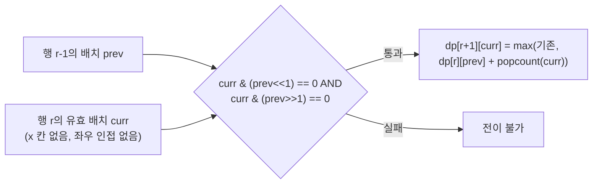

서강대학교의 최백준 교수님은 "컨닝의 기술"이라는 과목을 가르치고 있다. 이 과목은 상당히 까다롭기로 유명하여, 일부 학생들은 시험 도중 다른 학생의 답안을 베끼려는 시도를 한다.

시험은 N행, M열의 직사각형 교실에서 진행되며, 각 칸은 학생이 앉을 수 있는 자리이다. 그러나 일부 학생들이 책상을 부숴버려서 앉을 수 없는 자리도 존재한다.

모든 학생은 **자신의 왼쪽**, **오른쪽**, **왼쪽 대각선 위**, **오른쪽 대각선 위**에 있는 학생의 답안을 베낄 수 있다고 가정한다. 따라서 학생들이 서로 컨닝을 할 수 없도록 자리를 배치해야 한다.

교실의 배치도가 주어졌을 때, 컨닝이 불가능하도록 최대한 많은 학생을 배치할 수 있는 최대 학생 수를 구하는 프로그램을 작성하시오.

**입력:**

첫째 줄에 테스트 케이스의 개수 C가 주어진다.

각 테스트 케이스는 두 부분으로 이루어져 있다.

- 첫 번째 줄: 교실의 세로 길이 N과 가로 길이 M이 주어진다. (1 ≤ N, M ≤ 10)
- 두 번째 부분: N개의 줄에 걸쳐 교실의 배치도가 주어진다. 각 줄은 M개의 문자로 이루어져 있으며, '.'은 앉을 수 있는 자리, 'x'는 앉을 수 없는 자리를 의미한다.

**출력:**

각각의 테스트 케이스마다 컨닝이 불가능하도록 학생을 배치했을 때, 배치할 수 있는 최대 학생 수를 출력한다.

**예제 입력:**

```
4
2 3
...
...
2 3
x.x
xxx
2 3
x.x
x.x
10 10
....x.....
..........
..........
..x.......
..........
x...x.x...
.........x
...x......
........x.
.x...x....
```

**예제 출력:**

```
4
1
2
46
```

**문제 출처:** 백준 온라인 저지(BOJ) 1014번 컨닝 (BOJ 서비스 종료로 원문 링크는 제거했으며, 문제 전문은 위에 수록했다)

## 접근 방식

이 문제는 컨닝이 불가능한 배치 중 학생 수가 최대인 것을 찾는 최적화 문제이다. 교실의 세로·가로가 각각 최대 10이므로 한 행의 배치는 길이 10의 비트열로 나타낼 수 있고, 가능한 배치는 최대 $2^{10}=1024$가지뿐이다. 행 하나를 통째로 하나의 상태로 보는 비트마스크 DP가 자연스러운 이유가 여기에 있다.

핵심은 컨닝 제약이 어느 범위까지 영향을 주는지 따져 보는 데 있다. 학생은 자신의 좌우와 왼쪽 위·오른쪽 위 대각선만 볼 수 있으므로, 한 행의 배치가 서로 충돌하는 상대는 같은 행과 바로 윗행뿐이다. 두 행 이상 떨어진 행은 제약에 관여하지 않기 때문에 "바로 윗행의 배치"만 상태에 담으면 과거 정보가 충분하다. 아래쪽 대각선은 검사하지 않아도 된다. 아래 행의 학생이 위쪽 대각선을 볼 수 있다는 조건과 위 행의 학생이 아래 대각선을 본다는 조건은 같은 쌍을 두 번 세는 것이기 때문이다.

상태는 `dp[row][mask]`로 정의한다. 앞의 `row`개 행까지 배치를 끝냈고 마지막으로 배치한 행의 모양이 `mask`일 때의 최대 학생 수이다(코드에서는 0행부터 세므로 `dp[row+1]`에 기록한다). 전이는 두 단계의 검사로 이루어진다.

1. 한 행 안에서의 유효성: 앉을 수 없는 칸(`x`)에 학생이 없어야 하고, 좌우로 인접한 두 칸에 학생이 동시에 있으면 안 된다. 이 검사는 행마다 독립이므로 미리 `valid_masks`에 모아 둔다.
2. 인접한 두 행 사이의 유효성: 윗행 배치가 `prev`, 현재 행 배치가 `curr`일 때 `curr & (prev << 1)`과 `curr & (prev >> 1)`이 모두 0이어야 한다. `prev << 1`은 윗행 학생의 오른쪽 아래 칸을, `prev >> 1`은 왼쪽 아래 칸을 가리키는 비트 이동이므로, 이 두 비트 AND가 0이라는 것은 대각선 컨닝 관계에 있는 학생 쌍이 없다는 뜻이다.

두 검사를 통과한 전이마다 `dp[row+1][curr] = max(dp[row+1][curr], dp[row][prev] + popcount(curr))`로 값을 갱신하고, 마지막 행까지 처리한 뒤 `dp[N][*]`의 최댓값이 답이다.

이 점화식이 최적해를 보장하는 이유는 최적 부분 구조에 있다. 앞의 r개 행을 어떻게 배치했든, 다음 행과의 충돌 여부는 r번째 행의 모양 하나로만 결정된다. 따라서 같은 마지막 행 모양을 갖는 부분 배치 중 학생 수가 가장 많은 것만 남겨도 이후 선택지가 줄지 않고, 모양이 같은 상태끼리는 값을 최댓값으로 합쳐도 답이 바뀌지 않는다. 이 덕분에 행마다 모든 배치를 완전 탐색하는 대신 마스크별 최댓값 하나씩만 들고 가는 DP가 성립한다.



첫 예제 `2 3 / ... / ...`로 전이를 따라가 보면 첫 행은 `101`(학생 2명)을 고르고, 둘째 행은 `101`을 윗행의 대각선 비트와 겹치지 않는 `101`로 둘 수 있는지 검사한다. `101`의 `<<1`은 `1010`, `>>1`은 `010`인데, 둘째 행 `101`은 이 두 값과 AND하면 각각 `0000`, `0000`이다(마스크 폭이 3비트이므로 `1010`은 3비트 밖의 비트를 갖지만 현재 행에는 그 비트가 없다). 따라서 4명이라는 예제 답이 나온다. 반면 `010`을 고른 윗행에 `101`을 이어 붙이면 `010<<1=100`과 `101`이 겹쳐 전이가 막힌다.

## 복잡도와 대안 비교

| 구분 | 값 | 근거 |
|---|---|---|
| 시간 | $O(N \cdot 2^M \cdot F_M)$ | 행 N개마다 prev 후보 $2^M$개를 훑고, 현재 행의 유효 배치 수 $F_M$(인접 금지 배치 수, M=10이면 144)만큼 전이를 검사한다. 최악 10 × 1024 × 144 ≈ 150만 번이며 테스트 케이스 수 C를 곱한다 |
| 공간 | $O(N \cdot 2^M)$ | `dp[13][4096]` 정수 배열은 약 213KB이다 |
| 답의 범위 | 최대 50 | 한 행에 최대 5명(M=10) × 10행이므로 `int`로 충분하다 |

표의 $F_M$이 144인 이유는 좌우 인접을 금지한 길이 M 비트열의 개수가 피보나치 수열을 따르기 때문이다. 길이 M 비트열의 마지막 비트가 0이면 앞 M-1비트는 자유롭고, 1이면 그 앞 비트는 반드시 0이어야 하므로 $F_M = F_{M-1} + F_{M-2}$가 되고, M=10에서 144에 이른다. 전체 1024가지 중 85% 이상이 첫 단계 검사에서 걸러지므로, 전이 루프를 `valid_masks`로만 돌리는 것이 실제 속도에 큰 차이를 만든다.

같은 문제는 이분 그래프의 최대 독립 집합으로도 풀린다. 열 번호가 홀수인 칸과 짝수인 칸을 두 집합으로 나누면 컨닝 관계(좌우·대각선)는 모두 홀짝이 다른 칸 사이에만 생기므로 이분 그래프가 되고, 답은 (앉을 수 있는 칸 수) − (최대 매칭)이다. 칸이 최대 100개라 매칭이 비트마스크 DP보다 훨씬 빠르지만, 구현이 길고 그래프 모델링을 알아야 한다. 격자의 한 변이 10 이하로 작을 때는 비트마스크 DP가 짧고 직관적이라 실전에서 먼저 떠올릴 만하고, 격자가 커지면 이분 매칭이 유일한 선택지가 된다.

## C++ 코드

`vector`, `algorithm`을 쓴 구현이다. 유효 배치를 미리 모아 두고 `dp`를 행 단위로 전이한다.

```cpp
// 42jerrykim.github.io에서 더 많은 정보를 확인할 수 있다
#include <iostream>
#include <vector>
#include <algorithm>
#include <cstring>

using namespace std;

const int MAX_N = 12; // 최대 행 수
const int MAX_M = 12; // 최대 열 수
const int MAX_STATE = 1 << MAX_M; // 가능한 상태 수 (2^M)

int N, M; // 교실의 크기
char classroom[MAX_N][MAX_M]; // 교실의 자리 정보
vector<int> valid_masks[MAX_N]; // 각 행에서 가능한 유효한 자리 배치
int dp[MAX_N + 1][MAX_STATE]; // 동적 계획법 테이블

// 비트마스크에서 1의 개수를 세는 함수
int count_bits(int mask) {
    int count = 0;
    while (mask) {
        count++;
        mask &= (mask - 1); // 최하위 비트 제거
    }
    return count;
}

// 해당 행에서의 자리 배치(mask)가 유효한지 확인하는 함수
bool is_valid_mask(int row, int mask) {
    for (int j = 0; j < M; ++j) {
        if (mask & (1 << j)) { // 학생이 앉는 자리라면
            if (classroom[row][j] == 'x') return false; // 앉을 수 없는 자리
            if (j > 0 && (mask & (1 << (j - 1)))) return false; // 왼쪽에 학생이 있는 경우
        }
    }
    return true;
}

int main() {
    int C; // 테스트 케이스 수
    cin >> C;
    while (C--) {
        cin >> N >> M;
        for (int i = 0; i < N; ++i) {
            cin >> classroom[i]; // 교실 배치 입력
            valid_masks[i].clear(); // 유효한 마스크 초기화
        }
        // 각 행에서 가능한 유효한 자리 배치 생성
        for (int i = 0; i < N; ++i) {
            for (int mask = 0; mask < (1 << M); ++mask) {
                if (is_valid_mask(i, mask)) {
                    valid_masks[i].push_back(mask);
                }
            }
        }
        memset(dp, -1, sizeof(dp)); // DP 테이블 초기화
        dp[0][0] = 0; // 초기 상태
        // 동적 계획법 진행
        for (int row = 0; row < N; ++row) {
            for (int prev_mask = 0; prev_mask < (1 << M); ++prev_mask) {
                if (dp[row][prev_mask] == -1) continue; // 이전 상태가 유효하지 않으면 패스
                for (int curr_mask : valid_masks[row]) {
                    // 이전 행과 현재 행의 자리 배치가 컨닝 조건을 만족하는지 확인
                    if ((curr_mask & (prev_mask << 1)) == 0 && (curr_mask & (prev_mask >> 1)) == 0) {
                        int curr_count = count_bits(curr_mask); // 현재 행에서 앉은 학생 수
                        // 최대 학생 수 갱신
                        if (dp[row + 1][curr_mask] < dp[row][prev_mask] + curr_count) {
                            dp[row + 1][curr_mask] = dp[row][prev_mask] + curr_count;
                        }
                    }
                }
            }
        }
        // 결과 계산
        int result = 0;
        for (int mask = 0; mask < (1 << M); ++mask) {
            if (dp[N][mask] > result) {
                result = dp[N][mask];
            }
        }
        cout << result << endl; // 최대 학생 수 출력
    }
    return 0;
}
```

`dp`가 `-1`인 상태는 도달할 수 없다는 표지이며, 시작 상태는 "0행까지 배치함, 윗행이 비어 있음"을 뜻하는 `dp[0][0]=0`이다. 결과 계산에서 `result`를 0으로 시작하므로 모든 칸이 `x`인 교실에서도 답 0이 정상 출력된다.

## 표준 라이브러리 없이 구현

STL 컨테이너를 쓸 수 없는 환경에서는 `vector<int> valid_masks[MAX_N]`을 고정 크기 2차원 배열과 개수 배열로 바꾸고, 입출력을 `scanf`/`printf`로 대체하면 된다. 알고리즘은 위와 같다.

```cpp
int valid_masks[MAX_N][MAX_STATE]; // 행별 유효 배치
int valid_mask_count[MAX_N];       // 행별 유효 배치 개수
// 생성: valid_masks[i][valid_mask_count[i]++] = mask;
// 순회: for (int k = 0; k < valid_mask_count[row]; ++k) { int curr_mask = valid_masks[row][k]; ... }
```

## 흔한 실수와 코너 케이스

가장 흔한 오개념은 대각선 검사를 위·아래 양쪽에서 모두 해야 한다고 생각하는 것이다. 행 순서대로 전이하면서 현재 행이 윗행과 충돌하는지만 보면 모든 쌍이 정확히 한 번씩 검사되므로 아래쪽 검사는 중복이다. 또 하나는 전이 때 `x` 칸을 다시 검사해야 한다고 여기는 것인데, `x` 칸 검사는 `valid_masks`를 만들 때 이미 끝났으므로 `prev`에도 `x` 칸의 비트는 없다.

| 케이스 | 설명 | 처리 방법 |
|---|---|---|
| 모든 칸이 `x` | 앉을 수 있는 칸이 없어 답이 0 | `dp[0][0]=0`에서 `mask=0`만 유효하므로 `result`가 0으로 남는다. 예제 2의 `x.x/xxx`는 답 1이다 |
| N=1 또는 M=1 | 윗행이 없거나 좌우 인접이 존재하지 않음 | N=1이면 한 번의 전이로 끝나고, M=1이면 가능한 마스크가 `0`과 `1`뿐이라 윗행과 `x` 칸만 확인한다 |
| 행 문자열 입력 | 각 행은 공백 없이 M글자로 주어짐 | `classroom[MAX_N][MAX_M]`(12칸)에 10글자와 널 문자 1바이트가 들어가므로 `cin >> classroom[i]`는 안전하다 |
| 답의 크기 | N, M ≤ 10이므로 답은 최대 50 | `int`로 충분하며 `long long`은 불필요하다 |

## 이 글을 읽은 후 달성해야 할 목표

- 컨닝 제약이 인접한 두 행에만 걸린다는 사실로부터 비트마스크 DP의 상태 정의(`dp[row][mask]`)를 설명할 수 있다.
- `curr & (prev << 1)`, `curr & (prev >> 1)`이 대각선 컨닝 관계를 검출하는 이유를 구분해 설명할 수 있다.
- 시간·공간 복잡도를 직접 추정하고, 비트마스크 DP와 이분 매칭 풀이 중 격자 크기에 맞는 쪽을 비교해 고를 수 있다.

## 참고 문헌 및 출처

- 백준 온라인 저지(BOJ) 1014번 컨닝: 문제 원문(서비스 종료로 링크 없음)
- [Independent set (graph theory)](https://en.wikipedia.org/wiki/Independent_set_%28graph_theory%29): 최대 독립 집합 정의
- [Kőnig's theorem (graph theory)](https://en.wikipedia.org/wiki/K%C5%91nig%27s_theorem_%28graph_theory%29): 이분 그래프에서 최대 매칭과 최소 정점 덮개의 관계, 최대 독립 집합은 정점 수에서 최소 정점 덮개를 뺀 값
