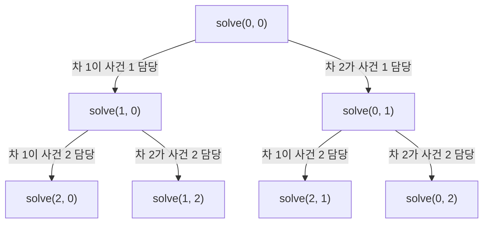

경찰차들은 도시의 여러 사건을 처리하기 위해 최적의 경로를 찾아야 한다. 이때 두 대의 경찰차가 이동한 거리의 합을 최소화하는 것이 목표이다. 도시의 구조와 사건의 발생 위치가 주어졌을 때, 어떻게 하면 두 경찰차의 총 이동 거리를 최소화할 수 있을까?

문제 : [https://www.acmicpc.net/problem/2618](https://www.acmicpc.net/problem/2618)

## 문제 설명

도시는 N x N 크기의 격자 형태로 이루어져 있으며, 각 도로는 동서방향과 남북방향으로 구분된다. 동서방향 도로는 위에서부터 1부터 N까지 번호가 매겨지고, 남북방향 도로는 왼쪽에서부터 1부터 N까지 번호가 매겨진다. 도로들이 교차하는 지점은 (동서방향 도로 번호, 남북방향 도로 번호)로 표시된다.

두 대의 경찰차가 있으며, 경찰차 1은 (1, 1) 위치에서, 경찰차 2는 (N, N) 위치에서 출발한다. W개의 사건이 발생하며, 각 사건은 특정 위치에서 발생한다. 각 사건은 두 경찰차 중 하나가 처리해야 하며, 사건은 발생한 순서대로 처리해야 한다.

목표는 두 경찰차가 이동한 거리의 합을 최소화하면서 모든 사건을 처리하는 것이다. 사건을 어떤 경찰차가 처리할지 결정하고, 최소 이동 거리를 구하는 프로그램을 작성해야 한다.

**제한 조건:** `N`과 `W`는 각각 최대 1,000이며, 사건의 좌표는 `1..N` 범위이다. 시간 제한과 메모리 제한은 문제 페이지에서 확인한다.

**입출력 예제:**

```text
입력
6
3
3 5
5 5
2 3

출력
9
2
2
1
```

첫 줄의 9가 최소 이동 거리이고, 이어지는 줄은 사건 1, 2, 3을 각각 처리한 경찰차 번호이다. 경찰차 2가 사건 1(거리 4)과 사건 2(거리 2)를 맡고, 경찰차 1이 사건 3(거리 3)을 맡아 4 + 2 + 3 = 9가 된다.

## 학습 목표

이 글을 읽고 나면 다음을 설명할 수 있다.

- 두 대의 경찰차가 번갈아 사건을 받는 문제에서 왜 상태가 `(i, j)` 두 값으로 충분한지 논증한다.
- 남은 사건을 처리하는 최소 비용을 정의하는 top-down 메모이제이션 점화식을 세우고, 그 상태 수로 시간·공간 복잡도를 계산한다.
- `path` 테이블로 최적해의 사건별 배정을 복원한다.

## 접근 방식

사건은 입력 순서대로 처리해야 하므로, 사건 `1..k`까지 처리가 끝난 시점에 두 경찰차 중 한 대는 반드시 사건 `k`에 서 있다. 나머지 한 대가 어디에 있는지만 알면 이후의 최소 비용은 과거에 누가 어떤 사건을 맡았는지와 무관하게 결정된다. 따라서 상태는 두 차가 각각 마지막으로 처리한 사건 번호 `(i, j)`이며, 사건이 하나도 없는 경우는 번호 `0`으로 표시하고 이때의 위치는 각각 `(1, 1)`과 `(N, N)`이다. 다음에 처리할 사건은 언제나 `max(i, j) + 1`이므로, 이 값은 상태에서 자동으로 결정되어 별도 차원이 필요 없다. 완전 탐색은 사건마다 두 선택지가 있어 O(2^W)이지만, 서로 다른 상태가 O(W^2)개뿐이라는 점이 메모이제이션이 먹히는 근거다.

점화식은 이 글의 코드가 쓰는 대로 "남은 비용" 방식으로 정의한다. `solve(i, j)`는 경찰차 1이 사건 `i`, 경찰차 2가 사건 `j`에 있을 때 **남은 사건 `max(i, j)+1 .. W`를 모두 처리하는 데 드는 최소 이동 거리**다. `next = max(i, j) + 1`이라 할 때 `next > W`이면 0이고, 아니면 두 선택지 중 작은 쪽이다. 경찰차 1이 맡으면 `solve(next, j)`에 `i`(0이면 `(1, 1)`)에서 `next`까지의 거리를 더하고, 경찰차 2가 맡으면 `solve(i, next)`에 `j`(0이면 `(N, N)`)에서 `next`까지의 거리를 더한다. 정답은 `solve(0, 0)`이며, 별도로 최소값을 고르는 단계가 필요 없다. 각 상태에서 어느 쪽이 더 작았는지를 `path[i][j]`에 1 또는 2로 저장해 두면, `(0, 0)`에서 출발해 사건 번호 순서대로 선택을 따라가며 배정을 복원할 수 있다.



위 그림은 사건이 3개 이상일 때 처음 두 단계의 전이다. 각 노드가 `(i, j)` 상태이고 간선이 "다음 사건을 누가 맡는가"의 선택이며, 서로 다른 경로가 같은 `(i, j)`에 합류하면 그 계산을 재사용한다.

| 항목 | 값 | 근거 |
|---|---|---|
| 상태 수 | O(W^2) | `0 ≤ i, j ≤ W` |
| 전이 비용 | O(1) | 맨해튼 거리 두 번 계산 |
| 시간 복잡도 | O(W^2) | W ≤ 1,000이면 약 10^6 상태 |
| 공간 복잡도 | O(W^2) | `dp`, `path` 두 테이블 |

## C++ 코드와 설명

```cpp
// 42jerrykim.github.io에서 더 많은 정보를 확인할 수 있다
#include <iostream>
#include <vector>
#include <algorithm>
#include <cstring>
#include <cstdlib>

using namespace std;

const int MAX_W = 1001;

int N, W;
pair<int, int> events[MAX_W]; // 사건들의 위치를 저장
int dp[MAX_W][MAX_W]; // DP 테이블
int path[MAX_W][MAX_W]; // 경로 추적을 위한 테이블

// 두 지점 사이의 거리를 계산하는 함수
int dist(const pair<int, int>& a, const pair<int, int>& b) {
    return abs(a.first - b.first) + abs(a.second - b.second);
}

// DP 함수 선언
int solve(int car1, int car2);

int main() {
    ios::sync_with_stdio(false);
    cin.tie(nullptr);

    cin >> N >> W;
    for (int i = 1; i <= W; ++i) {
        cin >> events[i].first >> events[i].second;
    }

    memset(dp, -1, sizeof(dp));

    cout << solve(0, 0) << '\n';

    int car1 = 0, car2 = 0;
    for (int i = 1; i <= W; ++i) {
        int next = path[car1][car2];
        cout << next << '\n';
        if (next == 1) {
            car1 = i;
        } else {
            car2 = i;
        }
    }

    return 0;
}

// DP 함수 구현
int solve(int car1, int car2) {
    int next = max(car1, car2) + 1;
    if (next > W) return 0;
    if (dp[car1][car2] != -1) return dp[car1][car2];

    // 경찰차 1이 사건 처리하는 경우
    int dist1;
    if (car1 == 0) {
        dist1 = dist({1, 1}, events[next]);
    } else {
        dist1 = dist(events[car1], events[next]);
    }
    int cost1 = solve(next, car2) + dist1;

    // 경찰차 2가 사건 처리하는 경우
    int dist2;
    if (car2 == 0) {
        dist2 = dist({N, N}, events[next]);
    } else {
        dist2 = dist(events[car2], events[next]);
    }
    int cost2 = solve(car1, next) + dist2;

    // 최소값 선택 및 경로 저장
    if (cost1 < cost2) {
        dp[car1][car2] = cost1;
        path[car1][car2] = 1;
    } else {
        dp[car1][car2] = cost2;
        path[car1][car2] = 2;
    }

    return dp[car1][car2];
}
```

이 풀이는 도시 크기 `N`과 사건 수 `W`를 읽고 각 사건 좌표를 `events[1..W]`에 저장한다. `dp`는 -1로 채워 "아직 계산하지 않음"을 표시하며, 거리가 0 이상이므로 -1은 유효한 값과 겹치지 않는다. `solve(car1, car2)`는 두 차의 마지막 사건 번호를 받아 `next = max(car1, car2) + 1`을 구하고, `next > W`이면 0을 반환하는 것이 종료 조건이다. 번호가 0인 차는 사건을 한 번도 맡지 않았으므로 출발점 `(1, 1)` 또는 `(N, N)`에서 거리를 잰다. 두 선택지의 비용을 비교한 뒤 작은 쪽을 `dp`에, 선택한 차량 번호를 `path`에 기록한다. `main`은 `solve(0, 0)`의 값을 출력한 다음 `path[car1][car2]`를 따라가며 사건 `i`를 맡은 차량 번호를 한 줄씩 출력한다. 사건 `i`를 처리한 뒤의 상태가 `(i, car2)` 또는 `(car1, i)`가 되므로 갱신 코드는 `car1 = i` 또는 `car2 = i`이다.

## C++ without library 코드와 설명

```cpp
// 42jerrykim.github.io에서 더 많은 정보를 확인할 수 있다
#include <stdio.h>

#define MAX_W 1001

int N, W;
int events[MAX_W][2]; // 사건들의 위치를 저장
int dp[MAX_W][MAX_W]; // DP 테이블
int path[MAX_W][MAX_W]; // 경로 추적을 위한 테이블

// 절댓값 함수 구현
int iabs(int x) {
    return x < 0 ? -x : x;
}

// 두 지점 사이의 거리를 계산하는 함수
int dist(int a_x, int a_y, int b_x, int b_y) {
    return iabs(a_x - b_x) + iabs(a_y - b_y);
}

// DP 함수 선언
int solve(int car1, int car2);

int main() {
    scanf("%d %d", &N, &W);
    for (int i = 1; i <= W; ++i) {
        scanf("%d %d", &events[i][0], &events[i][1]);
    }

    for (int i = 0; i <= W; ++i)
        for (int j = 0; j <= W; ++j)
            dp[i][j] = -1;

    printf("%d\n", solve(0, 0));

    int car1 = 0, car2 = 0;
    for (int i = 1; i <= W; ++i) {
        int next = path[car1][car2];
        printf("%d\n", next);
        if (next == 1) {
            car1 = i;
        } else {
            car2 = i;
        }
    }

    return 0;
}

// DP 함수 구현
int solve(int car1, int car2) {
    int next = (car1 > car2 ? car1 : car2) + 1;
    if (next > W) return 0;
    if (dp[car1][car2] != -1) return dp[car1][car2];

    // 경찰차 1이 사건 처리하는 경우
    int dist1;
    if (car1 == 0) {
        dist1 = dist(1, 1, events[next][0], events[next][1]);
    } else {
        dist1 = dist(events[car1][0], events[car1][1], events[next][0], events[next][1]);
    }
    int cost1 = solve(next, car2) + dist1;

    // 경찰차 2가 사건 처리하는 경우
    int dist2;
    if (car2 == 0) {
        dist2 = dist(N, N, events[next][0], events[next][1]);
    } else {
        dist2 = dist(events[car2][0], events[car2][1], events[next][0], events[next][1]);
    }
    int cost2 = solve(car1, next) + dist2;

    // 최소값 선택 및 경로 저장
    if (cost1 < cost2) {
        dp[car1][car2] = cost1;
        path[car1][car2] = 1;
    } else {
        dp[car1][car2] = cost2;
        path[car1][car2] = 2;
    }

    return dp[car1][car2];
}
```

이 버전은 `stdio.h`만 사용하며 로직은 위 C++ 코드와 같다. 달라진 점은 `pair` 대신 `int events[][2]` 배열을 쓰고, `memset` 대신 이중 반복문으로 `dp`를 -1로 채우며, 절댓값 함수를 `iabs`로 직접 구현했다는 것이다. 표준 `abs`와 이름을 겹치지 않게 하려고 `iabs`로 이름을 지었다. 제목의 "C++"는 컴파일러가 C++이어도 C 문법만으로 쓴 풀이라는 뜻이다.

## Python 코드와 설명

```python
# 42jerrykim.github.io에서 더 많은 정보를 확인할 수 있다
import sys
sys.setrecursionlimit(1000000)

N = int(sys.stdin.readline())
W = int(sys.stdin.readline())
events = [None] * (W + 1)
for i in range(1, W + 1):
    x, y = map(int, sys.stdin.readline().split())
    events[i] = (x, y)

dp = [[-1] * (W + 1) for _ in range(W + 1)]
path = [[0] * (W + 1) for _ in range(W + 1)]

def dist(a, b):
    return abs(a[0] - b[0]) + abs(a[1] - b[1])

def solve(car1, car2):
    next_event = max(car1, car2) + 1
    if next_event > W:
        return 0
    if dp[car1][car2] != -1:
        return dp[car1][car2]

    # 경찰차 1이 사건 처리하는 경우
    if car1 == 0:
        dist1 = dist((1, 1), events[next_event])
    else:
        dist1 = dist(events[car1], events[next_event])
    cost1 = solve(next_event, car2) + dist1

    # 경찰차 2가 사건 처리하는 경우
    if car2 == 0:
        dist2 = dist((N, N), events[next_event])
    else:
        dist2 = dist(events[car2], events[next_event])
    cost2 = solve(car1, next_event) + dist2

    if cost1 < cost2:
        dp[car1][car2] = cost1
        path[car1][car2] = 1
    else:
        dp[car1][car2] = cost2
        path[car1][car2] = 2

    return dp[car1][car2]

print(solve(0, 0))

car1, car2 = 0, 0
for _ in range(W):
    next_move = path[car1][car2]
    print(next_move)
    if next_move == 1:
        car1 = max(car1, car2) + 1
    else:
        car2 = max(car1, car2) + 1
```

Python 풀이도 구조는 같다. `sys.setrecursionlimit`을 올리는 이유는 재귀 깊이가 최대 `W`(1,000)까지 가기 때문이다. 경로 복원에서는 사건 번호를 `max(car1, car2) + 1`로 다시 구해 `path`가 1이면 `car1`, 2이면 `car2`를 그 번호로 바꾼다. 이 값은 C++ 풀이의 반복변수 `i`와 항상 같다.

## 흔한 오개념과 실수

가장 흔한 실수는 상태를 "경찰차 1의 위치, 경찰차 2의 위치, 현재 사건 번호" 세 값으로 잡는 것이다. 사건이 입력 순서대로만 처리되므로 현재 사건 번호는 `max(i, j)`에서 이미 결정되어 있다. 세 값으로 잡으면 상태 수가 O(W^3)으로 불어나 메모리와 시간이 모두 초과된다. 또 하나의 오해는 "`i`와 `j`가 대칭이니 `i < j`만 저장해도 된다"는 생각이다. 두 차는 출발점이 `(1, 1)`과 `(N, N)`으로 서로 달라 `(i, j)`와 `(j, i)`의 남은 비용이 같지 않으므로 대칭성을 쓸 수 없다. 마지막으로 `solve(0, 0)`의 값만 구하고 `path`를 갱신하지 않으면 두 번째 줄부터의 배정 출력을 만들 수 없으니, 비교 시점에 선택을 함께 기록해야 한다.

이 풀이의 정당성은 최적 부분구조에 있다. 남은 사건의 최소 비용은 지금까지 누가 무엇을 맡았는지와 무관하게 `(i, j)`만으로 정해지므로 부분 문제의 최적해를 합쳐 전체 최적해를 만들 수 있다. 이 성질과 같은 부분 문제의 반복 계산을 저장해 두는 기법은 각각 [Optimal substructure](https://en.wikipedia.org/wiki/Optimal_substructure)와 [Memoization](https://en.wikipedia.org/wiki/Memoization) 문서에 정리되어 있다.

top-down과 bottom-up은 다음 기준으로 고른다. 재귀 깊이가 `W`(최대 1,000)로 얕고 도달 가능한 상태만 계산하면 되는 이 문제에서는 top-down이 점화식을 그대로 옮길 수 있어 간단하다. 반대로 깊이 제한이 빡빡한 언어이거나 `dp` 테이블 한 행만 유지해 메모리를 줄이려는 경우에는 bottom-up이 낫지만, `path` 복원을 위해 전체 테이블이 필요해지는 점을 감안해야 한다.

## 결론

top-down 풀이는 구현이 간단하지만 경로 복원을 위해 `dp`와 `path` 전체를 유지해야 한다. bottom-up으로 바꿀 때는 뒤에서부터 채우는 순서와 `path` 역추적 방향을 함께 설계해야 하므로, 메모리를 줄이려다 복원 코드가 복잡해지는 비용을 감안해야 한다.

## 참고 문헌 및 출처

- 문제: [백준 2618번 경찰차](https://www.acmicpc.net/problem/2618)
- [Optimal substructure](https://en.wikipedia.org/wiki/Optimal_substructure)
- [Memoization](https://en.wikipedia.org/wiki/Memoization)

## 코너 케이스 및 실수 포인트

| 케이스 | 설명 | 처리 방법 |
|---|---|---|
| **W=1** | 사건이 하나뿐 | `solve(0, 0)`이 두 출발점 중 가까운 쪽 거리를 반환하며 `path[0][0]`로 배정 복원 |
| **모든 사건이 한 점** | 거리 0이 반복 | 한 차가 전부 맡아도 총합이 같아 `path`가 1 또는 2로 갈릴 수 있음 |
| **출발점과 사건이 같은 위치** | 거리 0 | 번호 0 분기에서 `(1, 1)`, `(N, N)` 좌표를 쓰는지 확인 |
| **오버플로우** | 총 거리 최대 약 2×10^6 | 사건 1,000개 × 거리 최대 2(N-1)이므로 `int`로 충분 |
