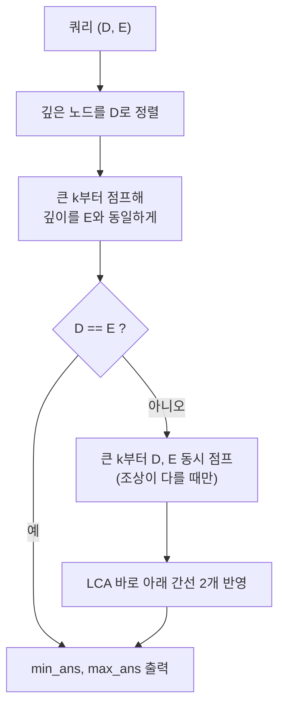

N개의 도시와 그 도시들을 연결하는 N-1개의 도로로 이루어진 도로 네트워크가 있다. 모든 도시는 유일한 경로로 연결되어 있으며, 각 도로의 길이는 입력으로 주어진다.

총 K개의 도시 쌍이 주어질 때, 각 쌍에 대해 두 도시를 연결하는 경로 상에서 가장 짧은 도로의 길이와 가장 긴 도로의 길이를 구하는 프로그램을 작성해야 한다. 이 문제는 트리 구조에서 두 노드 사이의 경로를 탐색하면서, 경로 상의 간선 가중치 중 최소값과 최대값을 빠르게 구하는 것이 핵심이다.

핵심 도구는 트리의 최소 공통 조상(LCA, Lowest Common Ancestor)과 Binary Lifting이다. 각 노드의 2^k번째 조상을 미리 계산해 두면 두 노드의 LCA를 O(log N)에 찾을 수 있고, 같은 테이블에 "그 구간의 최소·최대 간선 가중치"를 함께 저장하면 경로 질의도 O(log N)에 끝난다. 아래에서 설명하는 테이블은 구간 겹침을 이용하는 Sparse Table이 아니라, 조상 방향으로 2의 거듭제곱 칸씩 점프하는 포인터 테이블(Binary Lifting 테이블)이다.

문제 : [https://www.acmicpc.net/problem/3176](https://www.acmicpc.net/problem/3176)


## 문제 정보

문제 원문 기준으로 도시 수 N과 쿼리 수 K는 모두 최대 100,000이고 도로 길이는 최대 1,000,000이다. 따라서 쿼리마다 경로를 직접 따라가는 O(N) 방식은 최악 10^10번 연산이 되어 시간 안에 끝나지 않으며, 로그 시간 질의가 필요하다. 아래 4개 도시 예제는 직접 만든 것이며 문제의 공식 예제가 아니다.

## 접근 방식

풀이는 세 단계로 이루어진다. 먼저 DFS로 루트(1번 도시)에서 각 노드까지의 깊이와 부모, 그리고 부모와 잇는 간선의 길이를 기록한다. 다음으로 `anc[v][k]`(v의 2^k번째 조상), `min_t[v][k]`와 `max_t[v][k]`(v에서 그 조상까지 올라가는 경로 위 간선의 최소·최대 길이)를 `k`가 작은 쪽부터 채운다. 점화식은 `anc[v][k] = anc[anc[v][k-1]][k-1]`이고, 최소·최대도 같은 구조로 앞쪽 절반과 뒤쪽 절반을 합쳐 얻는다.

이 합침이 단순한 이유는 min과 max가 멱등(idempotent)이고 결합 법칙이 성립하기 때문이다. 경로를 2^(k-1) 길이의 두 조각으로 나눠 각각의 최소를 구한 뒤 다시 최소를 취하면 전체 경로의 최소와 같다. 합산처럼 중복 계산이 값을 바꾸는 연산이었다면 조각이 정확히 이어 붙어야 했겠지만, 이 문제에서는 조각이 겹쳐도 답이 변하지 않는다.

쿼리 하나는 세 구간으로 나뉜다. 깊은 쪽 노드를 얕은 쪽 깊이까지 올리고, 그래도 두 노드가 다르면 두 노드를 동시에 올리되 조상이 같아지기 직전까지만 점프한다. 마지막 점프에서 멈추면 두 노드는 LCA의 바로 아래 자식이므로, 둘이 LCA로 이어지는 간선 두 개(`min_t[D][0]`, `min_t[E][0]` 등)를 따로 반영해야 한다. 큰 `k`부터 내려오며 점프 여부를 결정하는 것은 이동 거리를 이진수로 분해하는 것과 같아서 쿼리당 점프 횟수가 O(log N)으로 제한된다.



| 단계 | 시간 | 공간 |
|---|---|---|
| DFS로 깊이·부모 기록 | O(N) | O(N) |
| 점프 테이블 구축 | O(N log N) | O(N log N) (3개 배열) |
| 쿼리 1개 | O(log N) | O(1) |
| 전체 | O(N log N + K log N) | O(N log N) |

대안과 비교하면, Heavy-Light Decomposition과 세그먼트 트리를 쓰면 공간이 O(N)이고 쿼리는 O(log² N)이다. 오프라인으로 모든 쿼리를 모을 수 있다면 Tarjan의 오프라인 LCA와 유니온 파인드도 가능하지만 경로 최소·최대를 함께 구하려면 추가 작업이 필요하다. 간선 값 갱신이 없고 N, K가 모두 10만 규모인 이 문제에서는 구현이 가장 짧고 상수가 작은 Binary Lifting이 무난한 선택이다. 값이 갱신되는 문제라면 HLD가 더 적합하다.

작은 예로 동작을 추적해 보자. 도로가 1–2(길이 3), 1–3(길이 5), 2–4(길이 2)인 4개 도시 트리에서 쿼리 (4, 3)을 처리한다. 깊이는 4번이 2, 3번이 1이므로 4번을 한 칸 올려 2번이 되고 이때 간선 (2–4)의 길이 2가 최소·최대 후보로 잡힌다. 아직 2번과 3번이 달라서 동시 점프를 시도하지만 두 노드의 `k=0` 조상(부모)이 모두 1번으로 같아 점프하지 않는다. 마지막으로 LCA(1번) 바로 아래 간선 (1–2)=3과 (1–3)=5를 반영하면 최소 2, 최대 5가 나오고, 이는 경로 4–2–1–3의 실제 간선 길이 2, 3, 5와 일치한다.

## C++ 코드와 설명

```cpp
// 42jerrykim.github.io에서 더 많은 정보를 확인할 수 있다
#include <iostream>
#include <vector>
#include <cstdio>
#include <cstring>
#include <algorithm>
using namespace std;

const int MAXN = 100001;
const int MAXLOGN = 17; // 2^17 = 131072 > 1e5

int N;
vector<pair<int, int>> adj[MAXN]; // 인접 리스트: (연결된 도시, 도로의 길이)

int depth[MAXN]; // 각 도시의 깊이
int anc[MAXN][MAXLOGN + 1]; // anc[v][k]: 도시 v의 2^k번째 조상
int min_t[MAXN][MAXLOGN + 1]; // min_t[v][k]: 도시 v에서 anc[v][k]까지의 최소 도로 길이
int max_t[MAXN][MAXLOGN + 1]; // max_t[v][k]: 도시 v에서 anc[v][k]까지의 최대 도로 길이

void dfs(int u, int p) {
    for (auto &edge : adj[u]) {
        int v = edge.first;
        int w = edge.second;
        if (v != p) {
            depth[v] = depth[u] + 1; // 깊이 설정
            anc[v][0] = u; // 부모 설정
            min_t[v][0] = w; // 최소값 초기화
            max_t[v][0] = w; // 최대값 초기화
            dfs(v, u); // 재귀 호출
        }
    }
}

int main() {
    scanf("%d", &N);
    // 도로 정보 입력
    for (int i = 0; i < N - 1; ++i) {
        int A, B, C;
        scanf("%d %d %d", &A, &B, &C);
        adj[A].push_back({B, C});
        adj[B].push_back({A, C});
    }
    // 초기화
    memset(anc, -1, sizeof(anc));
    memset(min_t, 0x3f, sizeof(min_t)); // 매우 큰 값으로 초기화
    memset(max_t, 0, sizeof(max_t));    // 0으로 초기화

    // 루트 노드 설정
    depth[1] = 0;
    anc[1][0] = -1;

    // DFS를 이용해 깊이와 1번째 조상, 최소/최대 도로 길이 설정
    dfs(1, -1);

    // 점프 테이블(Binary Lifting) 구성
    for (int k = 1; k <= MAXLOGN; ++k) {
        for (int v = 1; v <= N; ++v) {
            if (anc[v][k - 1] != -1) {
                int mid_anc = anc[v][k - 1];
                anc[v][k] = anc[mid_anc][k - 1]; // 2^k번째 조상 설정
                min_t[v][k] = min(min_t[v][k - 1], min_t[mid_anc][k - 1]); // 최소값 갱신
                max_t[v][k] = max(max_t[v][k - 1], max_t[mid_anc][k - 1]); // 최대값 갱신
            }
        }
    }

    // 쿼리 처리
    int K;
    scanf("%d", &K);
    for (int i = 0; i < K; ++i) {
        int D, E;
        scanf("%d %d", &D, &E);
        int min_ans = 1e9 + 1;
        int max_ans = -1;

        if (depth[D] < depth[E])
            swap(D, E);

        // 깊이를 동일하게 조정
        for (int k = MAXLOGN; k >= 0; --k) {
            if (anc[D][k] != -1 && depth[anc[D][k]] >= depth[E]) {
                min_ans = min(min_ans, min_t[D][k]); // 최소값 갱신
                max_ans = max(max_ans, max_t[D][k]); // 최대값 갱신
                D = anc[D][k]; // 조상으로 이동
            }
        }

        if (D == E) {
            printf("%d %d\n", min_ans, max_ans);
            continue;
        }

        // LCA 찾기
        for (int k = MAXLOGN; k >= 0; --k) {
            if (anc[D][k] != -1 && anc[D][k] != anc[E][k]) {
                min_ans = min(min_ans, min_t[D][k]);
                min_ans = min(min_ans, min_t[E][k]); // 최소값 갱신
                max_ans = max(max_ans, max_t[D][k]);
                max_ans = max(max_ans, max_t[E][k]); // 최대값 갱신
                D = anc[D][k]; // 조상으로 이동
                E = anc[E][k]; // 조상으로 이동
            }
        }

        // LCA의 바로 아래 간선 처리
        min_ans = min(min_ans, min_t[D][0]);
        min_ans = min(min_ans, min_t[E][0]); // 최소값 갱신
        max_ans = max(max_ans, max_t[D][0]);
        max_ans = max(max_ans, max_t[E][0]); // 최대값 갱신

        printf("%d %d\n", min_ans, max_ans);
    }

    return 0;
}
```

**코드 설명**

초기화에서 `anc`는 `-1`("조상 없음" 표식)로, `min_t`는 `0x3f3f3f3f`(약 10^9)로, `max_t`는 `0`으로 채운다. 최소는 항등원이 +∞, 최대는 항등원이 0(도로 길이는 양수)이므로 존재하지 않는 구간이 결과를 오염시키지 않는다.

테이블 구축에서는 `anc[v][k-1] != -1`인 경우에만 `anc[v][k]`를 채우는 가드가 중요하다. 조상이 없는 노드를 참조하면 `anc[-1][...]`에 접근하게 되기 때문이다. 쿼리의 두 반복문도 `anc[D][k] != -1` 조건으로 루트를 넘어서는 점프를 막는다.

동시 점프 반복문의 불변식은 "두 노드는 항상 같은 깊이에 있고 아직 LCA가 아니다"이다. 같은 깊이의 두 노드에서 2^k번째 조상이 서로 다르다면 LCA는 그보다 더 위에 있으므로 점프해도 LCA를 지나치지 않는다. 반대로 조상이 같다면 LCA 또는 그 위로 넘어갈 수 있으므로 점프하지 않고 더 작은 `k`로 넘어간다. 큰 `k`부터 시도하기 때문에 가능한 가장 먼 거리를 먼저 소모하고, 반복이 끝나면 두 노드는 LCA의 직계 자식에 정확히 멈춘다. 이때 점프한 구간의 최소·최대는 이미 `min_ans`와 `max_ans`에 반영되어 있고, 남은 것은 LCA로 올라가는 마지막 두 간선뿐이다.

`dfs`는 재귀로 구현했으므로 한쪽으로 치우친 트리(체인 모양, N = 10^5)에서는 호출 깊이가 10^5까지 늘어난다. 백준 채점 환경에서는 대개 통과하지만, 스택이 작은 환경에서는 BFS나 명시적 스택으로 바꾸는 것이 안전하다.

메모리 측면에서는 `anc`, `min_t`, `max_t` 세 배열이 각각 100001×18개의 `int`이므로 합쳐 약 21.6MB를 쓴다. 깊이 17까지만 두는 이유는 2^17 = 131072가 N의 최댓값 10^5보다 크기 때문이며, 이보다 작으면 깊은 노드를 끝까지 올리지 못한다.

## C++ without library 코드와 설명

`<vector>`, `<algorithm>` 같은 C++ 컨테이너와 `min`/`max`를 쓰지 않고, C 헤더 `<stdio.h>`와 `<stdlib.h>`(`malloc`)만으로 구현한 코드이다.

```cpp
// 42jerrykim.github.io에서 더 많은 정보를 확인할 수 있다
#include <stdio.h>
#include <stdlib.h>

#define MAXN 100001
#define MAXLOGN 17

typedef struct Edge {
    int to;
    int weight;
    struct Edge* next;
} Edge;

Edge* adj[MAXN]; // 인접 리스트
int depth[MAXN];
int anc[MAXN][MAXLOGN + 1];
int min_t[MAXN][MAXLOGN + 1];
int max_t[MAXN][MAXLOGN + 1];

void add_edge(int from, int to, int weight) {
    Edge* edge = (Edge*)malloc(sizeof(Edge));
    edge->to = to;
    edge->weight = weight;
    edge->next = adj[from];
    adj[from] = edge;
}

void dfs(int u, int p) {
    Edge* edge = adj[u];
    while (edge != NULL) {
        int v = edge->to;
        int w = edge->weight;
        if (v != p) {
            depth[v] = depth[u] + 1;
            anc[v][0] = u;
            min_t[v][0] = w;
            max_t[v][0] = w;
            dfs(v, u);
        }
        edge = edge->next;
    }
}

int main() {
    int N;
    scanf("%d", &N);

    // 도로 정보 입력
    for (int i = 0; i < N - 1; ++i) {
        int A, B, C;
        scanf("%d %d %d", &A, &B, &C);
        add_edge(A, B, C);
        add_edge(B, A, C);
    }

    // 초기화
    for (int i = 1; i <= N; ++i) {
        for (int k = 0; k <= MAXLOGN; ++k) {
            anc[i][k] = -1;
            min_t[i][k] = 1e9 + 1;
            max_t[i][k] = 0;
        }
    }

    // 루트 노드 설정
    depth[1] = 0;
    anc[1][0] = -1;

    // DFS를 이용해 깊이와 1번째 조상, 최소/최대 도로 길이 설정
    dfs(1, -1);

    // 점프 테이블(Binary Lifting) 구성
    for (int k = 1; k <= MAXLOGN; ++k) {
        for (int v = 1; v <= N; ++v) {
            if (anc[v][k - 1] != -1) {
                int mid_anc = anc[v][k - 1];
                anc[v][k] = anc[mid_anc][k - 1];
                if (anc[v][k] != -1) {
                    // 최소값 갱신
                    if (min_t[v][k - 1] < min_t[mid_anc][k - 1])
                        min_t[v][k] = min_t[v][k - 1];
                    else
                        min_t[v][k] = min_t[mid_anc][k - 1];
                    // 최대값 갱신
                    if (max_t[v][k - 1] > max_t[mid_anc][k - 1])
                        max_t[v][k] = max_t[v][k - 1];
                    else
                        max_t[v][k] = max_t[mid_anc][k - 1];
                }
            }
        }
    }

    // 쿼리 처리
    int K;
    scanf("%d", &K);
    for (int i = 0; i < K; ++i) {
        int D, E;
        scanf("%d %d", &D, &E);
        int min_ans = 1e9 + 1;
        int max_ans = 0;

        if (depth[D] < depth[E]) {
            int temp = D;
            D = E;
            E = temp;
        }

        // 깊이를 동일하게 조정
        for (int k = MAXLOGN; k >= 0; --k) {
            if (anc[D][k] != -1 && depth[anc[D][k]] >= depth[E]) {
                if (min_t[D][k] < min_ans)
                    min_ans = min_t[D][k];
                if (max_t[D][k] > max_ans)
                    max_ans = max_t[D][k];
                D = anc[D][k];
            }
        }

        if (D == E) {
            printf("%d %d\n", min_ans, max_ans);
            continue;
        }

        // LCA 찾기
        for (int k = MAXLOGN; k >= 0; --k) {
            if (anc[D][k] != -1 && anc[D][k] != anc[E][k]) {
                if (min_t[D][k] < min_ans)
                    min_ans = min_t[D][k];
                if (min_t[E][k] < min_ans)
                    min_ans = min_t[E][k];
                if (max_t[D][k] > max_ans)
                    max_ans = max_t[D][k];
                if (max_t[E][k] > max_ans)
                    max_ans = max_t[E][k];
                D = anc[D][k];
                E = anc[E][k];
            }
        }

        // LCA의 바로 아래 간선 처리
        if (min_t[D][0] < min_ans)
            min_ans = min_t[D][0];
        if (min_t[E][0] < min_ans)
            min_ans = min_t[E][0];
        if (max_t[D][0] > max_ans)
            max_ans = max_t[D][0];
        if (max_t[E][0] > max_ans)
            max_ans = max_t[E][0];

        printf("%d %d\n", min_ans, max_ans);
    }

    return 0;
}
```

**코드 설명**

`std::vector`를 쓸 수 없으므로 `Edge` 구조체의 단일 연결 리스트로 인접 리스트를 만들고, `add_edge`가 노드 앞쪽에 간선을 삽입한다. 양방향 도로이므로 한 도로마다 `add_edge`를 두 번 호출한다. `min`/`max` 함수 대신 조건문으로 직접 비교하며, 점프 테이블 구축과 쿼리 로직은 앞선 코드와 동일하다.

## 흔한 오해

Binary Lifting 테이블을 Sparse Table이라 부르는 경우가 많지만 둘은 다르다. Sparse Table은 배열 구간 [l, r]을 길이가 2의 거듭제곱인 두 구간으로 겹쳐 덮어 질의하며, 구간 최소처럼 겹침이 허용되는 연산에만 쓸 수 있다. 반면 여기서 쓰는 테이블은 한 노드에서 조상 방향으로만 뻗는 경로를 2^k 칸 단위로 이어 붙이는 구조이고, 경로 끝점이 두 노드 모두 가변이라 LCA를 찾는 동시 점프가 필요하다. 이 문제에서 합산이 아니라 min/max를 묻기 때문에 구간이 겹쳐도 상관없다는 점을 혼동하면, 경로 합 같은 변형 문제에서 겹친 구간을 이중으로 더하는 실수를 하게 된다.

## 변형 문제로 확장하기

경로 합이나 경로 위 간선 개수 같은 질의로 바꾸면 min/max의 멱등성이 사라지므로, 점프 테이블에는 겹치지 않는 구간만 저장해야 하고 쿼리도 조각을 정확히 한 번씩만 더하도록 짜야 한다. 이 풀이의 점프 구조는 그대로 두고 `min_t`, `max_t` 대신 `sum_t[v][k] = sum_t[v][k-1] + sum_t[anc[v][k-1]][k-1]`로 바꾸기만 하면 되는데, 이는 두 절반이 서로 겹치지 않고 이어 붙기 때문이다. 간선 길이가 바뀌는 변형은 점프 테이블을 다시 계산해야 하므로 앞서 비교한 HLD 쪽이 맞다.

## 코너 케이스 및 실수 포인트

| 케이스 | 설명 | 처리 방법 |
|---|---|---|
| **루트 너머 점프** | `anc` 가 `-1`인 노드를 참조 | 모든 점프 앞에 `anc[..] != -1` 가드 |
| **D와 E가 조상 관계** | 깊이 맞추기만으로 `D == E` | 두 번째 루프 전에 조기 종료 |
| **편향 트리** | 체인 모양이면 재귀 깊이 10^5 | BFS 또는 명시적 스택 고려 |
| **값 범위** | 도로 길이는 개별 값의 min/max라 합산이 없음 | `int`로 충분 |

## 학습 목표 점검

다음 세 가지를 스스로 설명할 수 있다면 이 글의 목표를 달성한 것이다. 첫째, Binary Lifting 점프 테이블이 왜 O(N log N) 전처리로 O(log N) 쿼리를 가능하게 하는지. 둘째, 경로 최소·최대가 "겹쳐 계산해도 결과가 같은" 연산이라는 점이 풀이를 어떻게 단순하게 만드는지. 셋째, 같은 문제를 Heavy-Light Decomposition 등 다른 방법으로 풀 때와 비교해 언제 Binary Lifting이 적절한지.

## 참고 문헌 및 출처

- [BOJ 3176번: 도로 네트워크](https://www.acmicpc.net/problem/3176) — 문제 원문
- [Lowest common ancestor (Wikipedia)](https://en.wikipedia.org/wiki/Lowest_common_ancestor) — LCA 정의와 알고리즘 개관
- [Lowest Common Ancestor – Binary Lifting (cp-algorithms)](https://cp-algorithms.com/graph/lca_binary_lifting.html) — 점프 테이블 기반 LCA 구현
