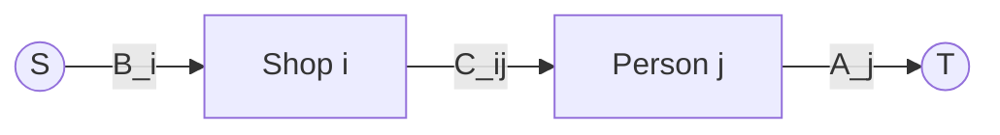

## 문제
- 링크: https://www.acmicpc.net/problem/11405
- 요약: N명의 사람과 M개의 서점이 있고, 각 사람의 수요와 각 서점의 보유량 합이 같다. 서점 i→사람 j로 책 1권 배송 비용 C_ij가 주어질 때, 모든 사람이 원하는 수를 사도록 할 때의 총 배송비 최소값을 구한다.

## 입력/출력
```
입력
N M
A1 A2 ... AN       # 각 사람의 수요
B1 B2 ... BM       # 각 서점의 보유량
C11 C12 ... C1N    # 서점 1 → 각 사람 비용
C21 C22 ... C2N    # 서점 2 → 각 사람 비용
...
+ CM1 CM2 ... CMN  # 서점 M → 각 사람 비용

출력
최소 총 배송비
```

예제
```
입력
4 4
3 2 4 2
5 3 2 1
5 6 2 1
3 7 4 1
2 10 3 1
10 20 30 1

출력
30
```

## 접근 개요
- 수요·공급이 일치하므로 네트워크 유량의 최소 비용 순환 형태로 모델링한다.
- 소스 S→서점 i 간선 용량 B_i, 비용 0. 서점 i→사람 j 간선 용량 충분히 큰 값(또는 min(B_i, A_j)), 비용 C_ij. 사람 j→싱크 T 간선 용량 A_j, 비용 0.
- Successive Shortest Path + 잠재치(potential)를 사용해 잔여그래프에서 매번 비음수 가중 최단경로를 찾아 유량을 흘린다.



## 알고리즘
- 정점 구성: `S`, 서점 `M`개, 사람 `N`명, `T` 총 `2+M+N`개.
- 간선 구성: `S→Shop_i (cap=B_i, cost=0)`, `Shop_i→Person_j (cap=min(B_i,A_j), cost=C_ij)`, `Person_j→T (cap=A_j, cost=0)`.
- 최소 비용 최대 유량(SSP with potentials):
  - 잠재치 h[v]를 유지하여 재가중치 `w'(u,v) = w(u,v) + h[u] - h[v]`를 비음수로 유지.
  - 매 증분마다 Dijkstra로 `S→T` 최단경로를 찾고, 해당 경로의 병목 용량만큼 푸시.
  - 경로 비용을 누적하고, 도달 불가 시 종료.

정당성 요약
- 재가중치 후 비음수 간선으로 최단경로를 찾으면, 원래 가중치에서의 최소 비용 증분 경로와 일치한다.
- 모든 수요·공급이 충족될 때까지 반복하면 전역 최소 비용 유량을 얻는다.

## 복잡도
- 정점 V≈M+N+2(≤202), 간선 E≈M·N + M + N(≤10,000+200).
- SSP + Dijkstra: 대략 `O(Flow × (E log V))`. 최악 유량은 총 수요 ≤ 10,000이지만, 실제로는 여러 단위가 한 경로로 묶여 흘러 충분히 빠르다.

## 구현 (C++)
```cpp
// 더 많은 정보는 42jerrykim.github.io 에서 확인하세요.
#include <bits/stdc++.h>
using namespace std;

struct MinCostMaxFlow {
	struct Edge {
		int to;
		int rev;
		int cap;
		long long cost;
	};
	int nodeCount;
	vector<vector<Edge>> graph;

	MinCostMaxFlow(int n) : nodeCount(n), graph(n) {}

	void addEdge(int from, int to, int capacity, long long cost) {
		Edge forward{to, (int)graph[to].size(), capacity, cost};
		Edge backward{from, (int)graph[from].size(), 0, -cost};
		graph[from].push_back(forward);
		graph[to].push_back(backward);
	}

	pair<long long, long long> minCostMaxFlow(int source, int sink) {
		const long long INF = numeric_limits<long long>::max() / 4;
		long long totalFlow = 0;
		long long totalCost = 0;

		vector<long long> potential(nodeCount, 0), distance(nodeCount);
		vector<int> parentNode(nodeCount), parentEdgeIndex(nodeCount);

		while (true) {
			fill(distance.begin(), distance.end(), INF);
			distance[source] = 0;
			priority_queue<pair<long long, int>, vector<pair<long long, int>>, greater<pair<long long, int>>> pq;
			pq.push({0, source});

			while (!pq.empty()) {
				auto [distU, u] = pq.top();
				pq.pop();
				if (distU != distance[u]) continue;

				for (int i = 0; i < (int)graph[u].size(); ++i) {
					const Edge &e = graph[u][i];
					if (e.cap <= 0) continue;
					long long newDist = distU + e.cost + potential[u] - potential[e.to];
					if (newDist < distance[e.to]) {
						distance[e.to] = newDist;
						parentNode[e.to] = u;
						parentEdgeIndex[e.to] = i;
						pq.push({newDist, e.to});
					}
				}
			}

			if (distance[sink] == INF) break;

			for (int v = 0; v < nodeCount; ++v) {
				if (distance[v] < INF) potential[v] += distance[v];
			}

			int addFlow = INT_MAX;
			for (int v = sink; v != source; v = parentNode[v]) {
				const Edge &e = graph[parentNode[v]][parentEdgeIndex[v]];
				addFlow = min(addFlow, e.cap);
			}
			for (int v = sink; v != source; v = parentNode[v]) {
				Edge &e = graph[parentNode[v]][parentEdgeIndex[v]];
				Edge &rev = graph[v][e.rev];
				e.cap -= addFlow;
				rev.cap += addFlow;
				totalCost += (long long)addFlow * e.cost;
			}
			totalFlow += addFlow;
		}
		return {totalFlow, totalCost};
	}
};

int main() {
	ios::sync_with_stdio(false);
	cin.tie(nullptr);

	int numPeople, numShops;
	if (!(cin >> numPeople >> numShops)) return 0;

	vector<int> demand(numPeople);
	for (int i = 0; i < numPeople; ++i) cin >> demand[i];

	vector<int> supply(numShops);
	for (int i = 0; i < numShops; ++i) cin >> supply[i];

	vector<vector<int>> cost(numShops, vector<int>(numPeople));
	for (int i = 0; i < numShops; ++i) {
		for (int j = 0; j < numPeople; ++j) {
			cin >> cost[i][j];
		}
	}

	int source = 0;
	int shopStart = 1;
	int personStart = shopStart + numShops;
	int sink = personStart + numPeople;
	int totalNodes = sink + 1;

	MinCostMaxFlow mcmf(totalNodes);

	for (int i = 0; i < numShops; ++i) {
		mcmf.addEdge(source, shopStart + i, supply[i], 0);
	}
	for (int j = 0; j < numPeople; ++j) {
		mcmf.addEdge(personStart + j, sink, demand[j], 0);
	}
	for (int i = 0; i < numShops; ++i) {
		for (int j = 0; j < numPeople; ++j) {
			int cap = min(supply[i], demand[j]);
			mcmf.addEdge(shopStart + i, personStart + j, cap, cost[i][j]);
		}
	}

	auto [flow, minCost] = mcmf.minCostMaxFlow(source, sink);
	cout << minCost << '\n';
	return 0;
}
```

## 코너 케이스 체크리스트
- 단일 노드(N=1 또는 M=1)에서 모든 수요·공급이 한 쪽에 몰리는 경우
- 동일 비용 행/열(여러 최적해)에서 경로 선택이 달라도 비용 동일함
- C_ij가 모두 동일할 때 임의 배분이 가능한지
- 매우 큰 수요/공급(최대치)에서 오버플로 방지(long long 비용 누적)
- 경로가 더 이상 존재하지 않으면 종료되는지(도달 불가 판정)

## 제출 전 점검
- 입력 파싱 개행/공백 처리, 초기화 누락 점검
- 역간선/잔여용량 갱신 정확성, 병목 용량 선택이 올바른지
- 비용 누적형(long long) 사용, 출력 개행 포함

## 참고자료
- 문제: https://www.acmicpc.net/problem/11405
- 최소 비용 최대 유량(SSP with potentials) 표준 구현


