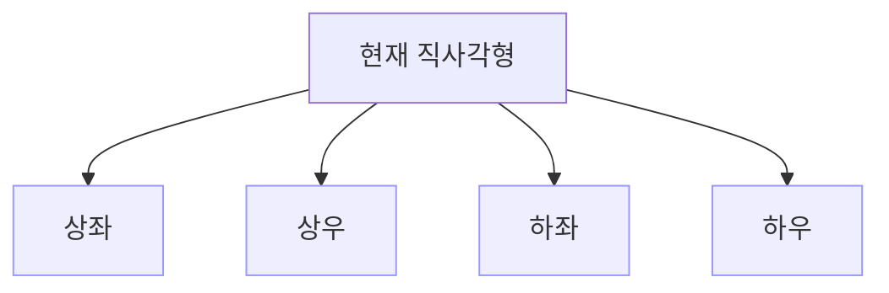

## 문제
- 링크: https://www.acmicpc.net/problem/11717
- 요약: 두 플레이어가 격자에서 빈 칸 하나를 고르면, 해당 칸을 포함한 상·하·좌·우 방향으로 기존 벽 또는 보드 밖을 만날 때까지 모두 벽으로 바뀝니다. 표시 칸(X)은 선택할 수 없지만 벽으로 바뀌는 것은 가능합니다. 최적 플레이 시 승자를 판별합니다.

## 입력/출력
```
입력: H W (1 ≤ H, W ≤ 20) 뒤이어 H줄의 보드 ('.' 빈 칸, 'X' 표시 칸)
출력: First (선공 승), 또는 Second (후공 승)
```

예시 1
```
입력
2 2
..
..

출력
Second
```

예시 2
```
입력
2 2
X.
..

출력
First
```

예시 3
```
입력
4 5
X....
...X.
.....
.....

출력
First
```

## 접근 개요 (아이디어)
- 한 번의 수는 하나의 빈 칸을 고르고 그 행·열을 벽으로 만들어 현재 보드를 네 개의 직사각형으로 분할합니다.
- 각 직사각형은 서로 독립인 서브게임이 되고, 전체 그런디 수는 네 서브직사각형 그런디 수의 XOR입니다.
- 표시 칸(`X`)은 선택 불가지만 서브직사각형 내부의 상태로 남으며, 선택한 칸의 행·열에 위치한 `X`는 벽으로 변해 분할 경계로 사라집니다.
- 따라서 상태를 "직사각형(top, bottom, left, right)과 그 내부의 고정된 X 분포"로 표현하여 메모이제이션하면 됩니다.



## 알고리즘 설계
- 상태: `grundy(top, bottom, left, right)` = 해당 직사각형의 그런디 수
- 유효 수: 직사각형 내 모든 `.` 칸 (표시 칸 `X`는 선택 불가)
- 전이: 위치 `(i, j)`를 선택하면, 행 `i`와 열 `j`가 벽이 되어 네 서브직사각형으로 분할
  - `UL = (top..i-1, left..j-1)`
  - `UR = (top..i-1, j+1..right)`
  - `LL = (i+1..bottom, left..j-1)`
  - `LR = (i+1..bottom, j+1..right)`
- 그 수집: `g = grundy(UL) XOR grundy(UR) XOR grundy(LL) XOR grundy(LR)`
- 현 상태의 그런디 수는 가능한 모든 `g`의 mex
- 기저: 직사각형이 비면 0

정당성 요약
- 행·열을 벽으로 만드는 연산은 보드를 네 영역으로 완전 분리하므로, 합성게임의 그런디 수는 영역 그런디 수의 XOR라는 스프라그-그런디 정리에 부합합니다.
- 표시 칸은 선택 제약만 줄 뿐, 분할의 독립성을 해치지 않으므로 상태 표현은 직사각형 범위와 그 내부 X 분포만으로 충분합니다.

## 복잡도
- 상태 수: O(H^2 W^2)
- 각 상태에서 고려하는 수: O(직사각형 면적) ⇒ 총 시간 상한 O(H^3 W^3) (H, W ≤ 20에서 여유)
- 공간: DP 테이블 O(H^2 W^2)

## 구현 (C++)
```cpp
// 더 많은 정보는 42jerrykim.github.io 에서 확인하세요.
#include <bits/stdc++.h>
using namespace std;

int H, W;
vector<string> board;
static int dp[21][21][21][21];

int grundy(int top, int bottom, int left, int right) {
	if (top > bottom || left > right) return 0;
	int &ret = dp[top][bottom][left][right];
	if (ret != -1) return ret;

	int height = bottom - top + 1;
	int width  = right - left + 1;

	vector<int> values;
	values.reserve(height * width);

	for (int i = top; i <= bottom; ++i) {
		for (int j = left; j <= right; ++j) {
			if (board[i][j] == 'X') continue; // 표시 칸은 선택 불가
			int g = 0;
			g ^= grundy(top,     i - 1, left,     j - 1);
			g ^= grundy(top,     i - 1, j + 1,    right);
			g ^= grundy(i + 1,   bottom, left,    j - 1);
			g ^= grundy(i + 1,   bottom, j + 1,   right);
			values.push_back(g);
		}
	}

	int K = (int)values.size();
	vector<char> seen(K + 1, 0);
	for (int v : values) if (v <= K) seen[v] = 1; // mex ≤ K
	int g = 0;
	while (g <= K && seen[g]) ++g;
	ret = g;
	return ret;
}

int main() {
	ios::sync_with_stdio(false);
	cin.tie(nullptr);

	cin >> H >> W;
	board.resize(H);
	for (int i = 0; i < H; ++i) cin >> board[i];

	memset(dp, -1, sizeof(dp));
	int g = grundy(0, H - 1, 0, W - 1);
	cout << (g ? "First" : "Second") << '\n';
	return 0;
}
```

## 코너 케이스 체크리스트
- 전부 `X`인 보드: 선택 불가 → `Second`
- 1×1, 1×N, N×1과 같이 선형 보드
- `X`가 같은 행·열에 몰린 경우(선택 시 곧바로 넓게 분할)
- 최소/최대 크기(H, W = 1 또는 20)

## 참고자료
- 문제: https://www.acmicpc.net/problem/11717
- 스프라그-그런디 정리 개요: 위키/표준 교재


