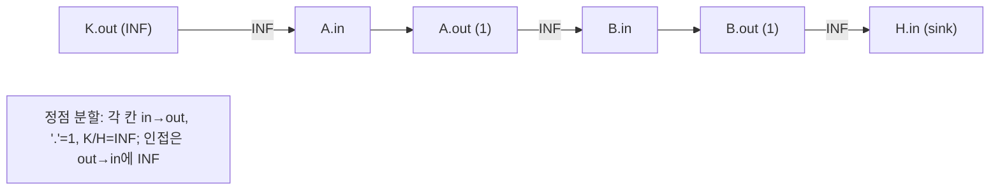

## 문제
- 링크: https://www.acmicpc.net/problem/1420
- 요약: `N×M` 격자에서 시작점 `K`와 학교 `H`가 주어질 때, 도달을 막기 위해 빈 칸 `'.'`을 최소 몇 개 벽으로 바꿔야 하는지 구한다. `'#'`는 벽, `K/H`는 변경 불가.
- 제한/스펙(요지): `1 ≤ N, M ≤ 100`, 시간 2초, 메모리 160MB

## 입력/출력
```
입력
N M
N줄의 격자 ('.', '#', 'K', 'H')

출력
K가 H에 도달하지 못하게 하려면 최소 몇 칸을 벽으로 바꿔야 하는지. 어떤 방법으로도 막을 수 없으면 -1
```

## 접근 개요
- 빈 칸을 막는 행위는 "정점 제거"로 해석 가능 → 문제는 최소 정점 절단(min s-t vertex cut).
- 정점 컷은 간선 컷으로 환원하기 위해 각 칸을 `in`과 `out`으로 노드 분할하고 `in→out` 용량을 그 칸의 제거 비용으로 둔다.
- 모델링
  - `'.'`의 `in→out` 용량 = 1 (막을 수 있는 칸)
  - `K/H`의 `in→out` 용량 = INF (막을 수 없음)
  - 인접한 두 칸 사이의 이동은 `out(u)→in(v)`에 용량 INF 간선으로 연결(양방향)
- `s = out(K)`, `t = in(H)`로 두고 최대 유량 = 최소 절단 = 답. 단, 유량이 INF 이상이면 "막을 수 없음"이므로 -1.
  - 특히 `K`와 `H`가 인접하여 경로 길이 1인 경우, 유량이 INF가 되어 -1이 된다.



## 알고리즘 설계
- 노드 인덱싱: `id(r,c) = r*M + c`, `in = id*2`, `out = id*2+1`.
- 간선 구성
  - 각 칸의 `in→out` 용량은 위 규칙대로 설정
  - 네 방향 인접(상하좌우)은 중복 없이 처리하되, 양방향 간선을 INF로 추가
- `Dinic`으로 최대 유량 계산. `ans ≥ INF`면 `-1`, 아니면 `ans` 출력.
- 올바름 근거: 정점 분할로 정점 제거 비용이 간선 컷 비용으로 보존되고, 맥스플로-민컷 정리에 의해 최솟값이 최대 유량과 일치.

## 복잡도
- 정점 수 `V ≤ 2*N*M (≤ 20,000)`, 간선 수 `E = O(N*M)`.
- Dinic 시간 복잡도는 실전에서 충분히 빠르며 2초 내 통과.

## 구현 (C++)
```cpp
// 더 많은 정보는 42jerrykim.github.io 에서 확인하세요.
#include <bits/stdc++.h>
using namespace std;

struct Edge { int to, cap, rev; };

struct Dinic {
    int n; vector<vector<Edge>> g; vector<int> level, work;
    explicit Dinic(int n): n(n), g(n), level(n), work(n) {}
    void addEdge(int u, int v, int c){
        Edge a{v, c, (int)g[v].size()};
        Edge b{u, 0, (int)g[u].size()};
        g[u].push_back(a); g[v].push_back(b);
    }
    bool bfs(int s, int t){
        fill(level.begin(), level.end(), -1);
        queue<int> q; level[s]=0; q.push(s);
        while(!q.empty()){
            int u=q.front(); q.pop();
            for(const auto &e: g[u]) if(e.cap>0 && level[e.to]==-1){
                level[e.to]=level[u]+1; q.push(e.to);
            }
        }
        return level[t]!=-1;
    }
    int dfs(int u, int t, int f){
        if(u==t) return f;
        for(int &i=work[u]; i<(int)g[u].size(); ++i){
            auto &e=g[u][i];
            if(e.cap>0 && level[e.to]==level[u]+1){
                int ret=dfs(e.to, t, min(f, e.cap));
                if(ret>0){ e.cap-=ret; g[e.to][e.rev].cap+=ret; return ret; }
            }
        }
        return 0;
    }
    int maxFlow(int s, int t){
        int flow=0; while(bfs(s,t)){ fill(work.begin(), work.end(), 0);
            while(true){ int pushed=dfs(s,t,INT_MAX); if(!pushed) break; flow+=pushed; }
        } return flow;
    }
};

int main(){
    ios::sync_with_stdio(false); cin.tie(nullptr);
    int N,M; if(!(cin>>N>>M)) return 0; vector<string> grid(N); for(int i=0;i<N;++i) cin>>grid[i];
    pair<int,int> K{-1,-1}, H{-1,-1};
    for(int r=0;r<N;++r) for(int c=0;c<M;++c){ if(grid[r][c]=='K') K={r,c}; else if(grid[r][c]=='H') H={r,c}; }
    auto inId = [&](int r,int c){ return (r*M+c)*2; };
    auto outId = [&](int r,int c){ return (r*M+c)*2+1; };
    const int V = N*M*2; const int INF = N*M + 5;
    Dinic dinic(V);
    auto isWall = [&](int r,int c){ return grid[r][c]=='#'; };
    for(int r=0;r<N;++r){ for(int c=0;c<M;++c){ if(isWall(r,c)) continue; int cap = (grid[r][c]=='.') ? 1 : INF; dinic.addEdge(inId(r,c), outId(r,c), cap); }}
    int dr[2]={0,1}, dc[2]={1,0};
    for(int r=0;r<N;++r){ for(int c=0;c<M;++c){ if(isWall(r,c)) continue; for(int d=0; d<2; ++d){ int nr=r+dr[d], nc=c+dc[d]; if(nr<0||nr>=N||nc<0||nc>=M||isWall(nr,nc)) continue; dinic.addEdge(outId(r,c), inId(nr,nc), INF); dinic.addEdge(outId(nr,nc), inId(r,c), INF); }}}
    int s = outId(K.first, K.second), t = inId(H.first, H.second);
    int ans = dinic.maxFlow(s,t);
    cout << (ans>=INF ? -1 : ans) << '\n';
    return 0;
}
```

## 구현 (Python)
```python
# 더 많은 정보는 42jerrykim.github.io 에서 확인하세요.
import sys
from collections import deque

class Dinic:
    def __init__(self, n: int):
        self.n = n
        self.g = [[] for _ in range(n)]

    def add_edge(self, u: int, v: int, c: int):
        self.g[u].append([v, c, len(self.g[v])])
        self.g[v].append([u, 0, len(self.g[u]) - 1])

    def bfs(self, s: int, t: int):
        self.level = [-1] * self.n
        q = deque([s])
        self.level[s] = 0
        while q:
            u = q.popleft()
            for v, cap, _ in self.g[u]:
                if cap > 0 and self.level[v] == -1:
                    self.level[v] = self.level[u] + 1
                    q.append(v)
        return self.level[t] != -1

    def dfs(self, u: int, t: int, f: int):
        if u == t:
            return f
        for i in range(self.it[u], len(self.g[u])):
            self.it[u] = i
            v, cap, rev = self.g[u][i]
            if cap > 0 and self.level[v] == self.level[u] + 1:
                ret = self.dfs(v, t, min(f, cap))
                if ret:
                    self.g[u][i][1] -= ret
                    self.g[v][rev][1] += ret
                    return ret
        return 0

    def max_flow(self, s: int, t: int) -> int:
        flow = 0
        INF_INT = 1 << 60
        while self.bfs(s, t):
            self.it = [0] * self.n
            while True:
                pushed = self.dfs(s, t, INF_INT)
                if not pushed:
                    break
                flow += pushed
        return flow


def solve() -> None:
    input = sys.stdin.readline
    data = input().split()
    if not data:
        return
    N, M = map(int, data)
    grid = [input().strip() for _ in range(N)]

    K = H = (-1, -1)
    for r in range(N):
        for c in range(M):
            if grid[r][c] == 'K':
                K = (r, c)
            elif grid[r][c] == 'H':
                H = (r, c)

    def in_id(r: int, c: int) -> int:
        return (r * M + c) * 2

    def out_id(r: int, c: int) -> int:
        return (r * M + c) * 2 + 1

    V = N * M * 2
    INF = N * M + 5
    dinic = Dinic(V)

    def is_wall(r: int, c: int) -> bool:
        return grid[r][c] == '#'

    for r in range(N):
        for c in range(M):
            if is_wall(r, c):
                continue
            cap = 1 if grid[r][c] == '.' else INF
            dinic.add_edge(in_id(r, c), out_id(r, c), cap)

    for r in range(N):
        for c in range(M):
            if is_wall(r, c):
                continue
            if c + 1 < M and not is_wall(r, c + 1):
                dinic.add_edge(out_id(r, c), in_id(r, c + 1), INF)
                dinic.add_edge(out_id(r, c + 1), in_id(r, c), INF)
            if r + 1 < N and not is_wall(r + 1, c):
                dinic.add_edge(out_id(r, c), in_id(r + 1, c), INF)
                dinic.add_edge(out_id(r + 1, c), in_id(r, c), INF)

    s = out_id(*K)
    t = in_id(*H)
    ans = dinic.max_flow(s, t)
    print(-1 if ans >= INF else ans)


if __name__ == "__main__":
    solve()
```

## 코너 케이스 체크리스트
- `K`와 `H`가 바로 인접한 경우 → 어떤 빈 칸을 막아도 직접 연결을 끊을 수 없으므로 `-1`
- 벽으로 둘러싸여 경로 자체가 애초에 없는 경우 → 답 `0`
- 격자 가장자리/코너에서의 인접 처리 누락 여부
- INF 값이 충분히 큰지(전체 '.' 수 + 여유) 확인

## 제출 전 점검
- 정점 분할: `'.'`만 1, `K/H`는 INF로 설정했는지
- 인접 간선: 양방향으로 INF를 추가했는지(중복 추가 없이)
- 시작/도착 노드: `s = out(K)`, `t = in(H)`로 설정했는지
- 유량이 `INF` 이상이면 `-1` 처리했는지

## 참고자료
- 정점 컷의 간선 컷 환원(Node-splitting), Max-Flow Min-Cut 정리
- Dinic 알고리즘 개요 및 구현


