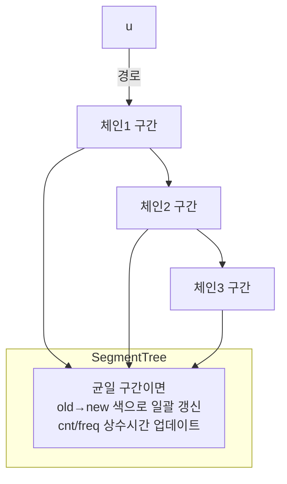

## 문제
- 링크: https://www.acmicpc.net/problem/16181
- 요약: RUN-land는 `n`개의 도시로 이루어진 트리이며 수도는 `1`번입니다. 질의 `(u, c, m)`마다 도시 `u`에서 수도까지의 경로에 있는 모든 도로의 색을 `c`로 덮어씌운 뒤, 정확히 `m`개의 도로가 칠해진 색의 개수를 출력합니다.

### 제한/스펙
- `1 ≤ n, C, Q ≤ 200000`
- 입력 그래프는 트리(`n-1`개의 도로, 임의 두 도시 사이 경로 유일)
- 색은 `1..C`, `m`은 `0..n-1`

## 입력/출력
```
입력
n C Q
(n-1)개의 간선 u v
Q개의 질의 u c m

출력
각 질의마다 정답을 한 줄에 출력
```

예시(문제 예제 참고)
```
입력
6 5 5
1 3
2 3
1 4
6 3
5 2
5 1 3
6 2 2
2 3 1
4 4 1
5 0  

출력
1
2
2
3
1
```

## 접근 개요
- **핵심 관찰**: 간선의 색상은 경로 대입으로만 변경됩니다. 경로를 체인으로 쪼개는 **Heavy-Light Decomposition(HLD)** 를 쓰면 O(log N)개의 연속 구간 갱신으로 환원됩니다.
- **세그먼트 트리 설계**: 각 노드는 "해당 구간이 단일 색으로 균일한지"만 저장합니다. 균일하면 그 색 ID, 아니면 혼합 표시. 구간 `대입` lazy 전파를 하되, 균일 구간에 색을 덮을 때만 배치적으로 색 카운트를 조정합니다.
- **통계 유지**: 색 `c`별 칠해진 간선 수 `cnt[c]`와, "정확히 k개의 간선을 가진 색의 개수" `freq[k]`(히스토그램)를 유지합니다. 균일 구간에 길이 `len`을 색 `old→new`로 대입하면 `cnt[old]-=len`, `cnt[new]+=len` 및 `freq`를 상수시간으로 업데이트합니다.

### 시각화 (HLD 체인 경로 분해)


## 알고리즘 설계
- **간선-노드 매핑**: HLD의 `pos[u]`를 사용하고, 간선은 `u!=root`인 노드 `u`의 위치에 대응시킵니다. 따라서 `(u→root)` 경로 갱신은 여러 구간 `[l..r]` 대입의 합으로 처리되고, 루트 위치는 제외합니다.
- **세그먼트 트리 노드 상태**: `color[idx] ∈ {-1, 0, 1..C}`
  - `-1`: 혼합(자식 확인 필요)
  - `0`: 미색칠(문제상 초기 상태)
  - `≥1`: 해당 색으로 균일
- **구간 대입(update)**:
  - 완전 포함 + 균일 노드이면 길이 `len`으로 한 번에 `cnt`/`freq` 갱신 후 색을 바꿈.
  - 혼합이면 자식으로 내려 push 하고 재귀. 단말은 길이 1 처리.
- **질의 처리**: 각 `(u,c,m)`에 대해 경로를 HLD로 O(log N)개 구간으로 나누어 `update(range, c)` 수행 후 `freq[m]` 출력.

## 정당성 근거(요지)
- 트리는 임의 두 정점 사이 경로가 유일하므로, `u→root` 경로는 체인들의 연속 구간으로 분해 가능합니다.
- 구간 대입은 균일 구간에서만 일괄 색 변환을 허용하므로, 각 간선은 실제로 그 색으로 덮이는 횟수만큼 `cnt`에 반영됩니다.
- `freq`는 `cnt`를 단조롭게 증감시키는 상수시간 연산으로 동기화되며, 모든 색의 총합은 항상 전체 칠해진 간선 수와 일치합니다.

## 복잡도
- 한 질의당 체인 분해 O(log N) × 각 구간 대입 O(log N) = **O(log^2 N)**
- 메모리: 세그먼트 트리 O(N), `cnt` O(C), `freq` O(N)

## 구현 (C++)
```cpp
// 더 많은 정보는 42jerrykim.github.io 에서 확인하세요.
#include <bits/stdc++.h>
using namespace std;

struct SegmentTree {
    int n;
    vector<int> color; // -1: mixed, >=0: uniform color (0 means uncolored)
    vector<int> *cnt;  // counts per color (1..C)
    vector<int> *freq; // freq[k] = number of colors having exactly k edges
    int C;

    SegmentTree(int n_, int C_, vector<int> &cntRef, vector<int> &freqRef)
        : n(n_), color(4 * n_, 0), cnt(&cntRef), freq(&freqRef), C(C_) {}

    inline void apply_set(int idx, int l, int r, int newColor) {
        int old = color[idx];
        if (old == newColor) return;
        int len = r - l + 1;
        if (old >= 1) {
            int &oldCnt = (*cnt)[old];
            (*freq)[oldCnt]--;
            oldCnt -= len;
            (*freq)[oldCnt]++;
        }
        {
            int &newCnt = (*cnt)[newColor];
            (*freq)[newCnt]--;
            newCnt += len;
            (*freq)[newCnt]++;
        }
        color[idx] = newColor;
    }

    inline void push_down(int idx) {
        if (color[idx] >= 0) {
            color[idx * 2]     = color[idx];
            color[idx * 2 + 1] = color[idx];
            color[idx] = -1;
        }
    }

    inline void pull_up(int idx) {
        int lc = color[idx * 2], rc = color[idx * 2 + 1];
        if (lc >= 0 && lc == rc) color[idx] = lc;
        else color[idx] = -1;
    }

    void update(int idx, int l, int r, int ql, int qr, int newColor) {
        if (qr < l || r < ql) return;
        if (ql <= l && r <= qr && color[idx] >= 0) {
            if (color[idx] != newColor) apply_set(idx, l, r, newColor);
            return;
        }
        if (l == r) {
            if (color[idx] != newColor) apply_set(idx, l, r, newColor);
            return;
        }
        if (color[idx] >= 0) push_down(idx);
        int mid = (l + r) >> 1;
        update(idx * 2, l, mid, ql, qr, newColor);
        update(idx * 2 + 1, mid + 1, r, ql, qr, newColor);
        pull_up(idx);
    }

    void update(int l, int r, int newColor) {
        if (l > r) return;
        update(1, 1, n, l, r, newColor);
    }
};

int main() {
    ios::sync_with_stdio(false);
    cin.tie(nullptr);

    int n, C, Q;
    if (!(cin >> n >> C >> Q)) return 0;

    vector<vector<int>> adj(n + 1);
    for (int i = 0; i < n - 1; ++i) {
        int u, v; cin >> u >> v;
        adj[u].push_back(v);
        adj[v].push_back(u);
    }

    // HLD prep: parent, depth, size, heavy
    vector<int> parent(n + 1, 0), depth(n + 1, 0), heavy(n + 1, -1), sz(n + 1, 0);
    vector<int> order;
    order.reserve(n);
    {
        // iterative DFS
        vector<int> st; st.reserve(n);
        st.push_back(1);
        parent[1] = 0; depth[1] = 0;
        while (!st.empty()) {
            int v = st.back(); st.pop_back();
            order.push_back(v);
            for (int w : adj[v]) if (w != parent[v]) {
                if (parent[w] == 0) {
                    parent[w] = v;
                    depth[w] = depth[v] + 1;
                    st.push_back(w);
                }
            }
        }
        for (int i = (int)order.size() - 1; i >= 0; --i) {
            int v = order[i];
            sz[v] = 1;
            int bestSize = 0, bestChild = -1;
            for (int w : adj[v]) if (w == parent[v]) continue; else {
                sz[v] += sz[w];
                if (sz[w] > bestSize) { bestSize = sz[w]; bestChild = w; }
            }
            heavy[v] = bestChild;
        }
    }

    // HLD decompose
    vector<int> head(n + 1, 0), pos(n + 1, 0);
    int curPos = 1;
    for (int v = 1; v <= n; ++v) {
        if (parent[v] == 0 || heavy[parent[v]] != v) {
            for (int u = v; u != -1; u = heavy[u]) {
                head[u] = v;
                pos[u] = curPos++;
            }
        }
    }
    // pos[1] is root; edges correspond to pos[u] for u != 1

    vector<int> cnt(C + 1, 0);
    vector<int> freq(n, 0); // 0..n-1
    freq[0] = C;

    SegmentTree stree(n, C, cnt, freq);

    auto update_path_to_root = [&](int u, int color) {
        while (head[u] != head[1]) {
            int hu = head[u];
            stree.update(pos[hu], pos[u], color);
            u = parent[hu];
        }
        if (pos[1] + 1 <= pos[u]) stree.update(pos[1] + 1, pos[u], color);
    };

    for (int i = 0; i < Q; ++i) {
        int u, c, m; cin >> u >> c >> m;
        update_path_to_root(u, c);
        cout << freq[m] << '\n';
    }
    return 0;
}
```

## 코너 케이스 체크리스트
- `u=1`인 경우 경로 길이 0이므로 아무 변화 없음 → `freq[m]` 그대로 출력
- 같은 색으로 재도색하는 경우(무의미한 대입) → 갱신 생략
- 서로 다른 체인 경계에서 구간 분할이 올바른지
- 초기 상태(모든 색의 카운트 0)에서 `freq[0]=C` 유지되는지
- 큰 입력에서 스택 사용 없이(반복 HLD) 동작하는지

## 제출 전 점검
- 루트 위치 제외(`pos[1]+1..pos[u]`) 처리 여부
- `freq` 인덱스 범위: `0..n-1`
- 입출력 동기화 비활성화 및 `\n` 사용
- 음수가 되는 카운트, 히스토그램 불일치 여부

## 참고자료
- 문제: https://www.acmicpc.net/problem/16181
- Heavy-Light Decomposition 개요: 다양한 블로그/교재의 HLD 설명 참고


