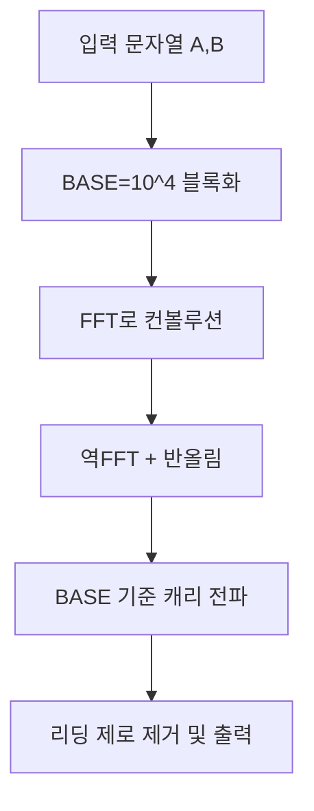

## 문제 정보

- 문제: `https://www.acmicpc.net/problem/22289`
- 제목: 큰 수 곱셈 (3)
- 요약: 길이 최대 1,000,000자리의 두 비음수 정수 A, B가 주어지면 A×B를 출력합니다. 0을 제외한 수는 0으로 시작하지 않습니다.
- 제한: 시간 1초, 메모리 512MB, 각 수 길이 ≤ 1,000,000

## 입출력 형식/예제

입력

```text
A B
```

출력

```text
A×B
```

예시

```text
입력: 893724358493284 238947328947329
출력: 213553048277135320552236238436
```

## 접근 개요(아이디어 스케치)

- 자리수 n이 매우 크므로 학교식 곱셈 O(n^2)은 불가 → 컨볼루션 기반 O(n log n) 필요.
- 문자열을 하위 자릿수부터 `BASE=10^4` 블록으로 나눠 벡터화 후, FFT로 두 벡터를 컨볼루션.
- 부동소수 오차 최소화를 위해 `complex<long double>` 사용, 역변환 후 `floor(val+0.5)`로 반올림.
- 컨볼루션 결과에 대해 BASE 기준 자리올림을 수행하고, 최상위 0을 제거.



## 알고리즘 설계

- 블록화: 오른쪽에서 `BASE_DIGS=4` 자리씩 잘라 정수 벡터로 변환(LSB-first).
- FFT: 길이를 합의 최솟 두 배 이상 2의 거듭제곱으로 패딩, 비트반전→길이 배수 루프.
- 안정화: `long double`로 각 단계의 위상오차를 줄이고, 역FFT 후 반올림.
- 캐리: 각 블록에 `carry` 누적, 음수 방지 분기 포함(이론상 양수지만 안전장치).
- 출력: 최상위 블록은 그대로, 이후 블록은 4자리 채움 출력.

## 복잡도

- 시간: O(n log n) (n은 자릿수/블록 개수에 비례)
- 공간: O(n)

## 구현 (C++)

```cpp
// 더 많은 정보는 42jerrykim.github.io 에서 확인하세요.
#include <bits/stdc++.h>
using namespace std;

using cld = complex<long double>;
const long double PI = acosl(-1.0L);

static void fft(vector<cld>& a, bool invert) {
    int n = (int)a.size();
    for (int i = 1, j = 0; i < n; ++i) {
        int bit = n >> 1;
        for (; j & bit; bit >>= 1) j ^= bit;
        j ^= bit;
        if (i < j) swap(a[i], a[j]);
    }
    for (int len = 2; len <= n; len <<= 1) {
        long double ang = 2 * PI / len * (invert ? -1 : 1);
        cld wlen(cosl(ang), sinl(ang));
        for (int i = 0; i < n; i += len) {
            cld w(1);
            for (int j = 0; j < len / 2; ++j) {
                cld u = a[i + j];
                cld v = a[i + j + len / 2] * w;
                a[i + j] = u + v;
                a[i + j + len / 2] = u - v;
                w *= wlen;
            }
        }
    }
    if (invert) {
        for (int i = 0; i < n; ++i) a[i] /= n;
    }
}

int main() {
    ios::sync_with_stdio(false);
    cin.tie(nullptr);

    string sa, sb;
    if (!(cin >> sa >> sb)) return 0;
    if (sa == "0" || sb == "0") { cout << 0; return 0; }

    const int BASE = 10000;      // 10^4
    const int BASE_DIGS = 4;

    auto toBlocks = [&](const string& s) {
        vector<int> a;
        a.reserve((s.size() + BASE_DIGS - 1) / BASE_DIGS);
        for (int i = (int)s.size(); i > 0; i -= BASE_DIGS) {
            int x = 0;
            int start = max(0, i - BASE_DIGS);
            for (int j = start; j < i; ++j) x = x * 10 + (s[j] - '0');
            a.push_back(x); // least significant block first
        }
        return a;
    };

    vector<int> A = toBlocks(sa), B = toBlocks(sb);

    int n = 1;
    while (n < (int)A.size() + (int)B.size()) n <<= 1;
    vector<cld> fa(n), fb(n);
    for (size_t i = 0; i < A.size(); ++i) fa[i] = (long double)A[i];
    for (size_t i = 0; i < B.size(); ++i) fb[i] = (long double)B[i];

    fft(fa, false);
    fft(fb, false);
    for (int i = 0; i < n; ++i) fa[i] *= fb[i];
    fft(fa, true);

    vector<long long> res(n);
    for (int i = 0; i < n; ++i) {
        long double val = fa[i].real();
        res[i] = (long long)floorl(val + 0.5L); // 안정적 반올림
    }

    long long carry = 0;
    for (size_t i = 0; i < res.size(); ++i) {
        long long cur = res[i] + carry;
        if (cur >= 0) {
            res[i] = cur % BASE;
            carry = cur / BASE;
        } else {
            long long k = (-cur + BASE - 1) / BASE;
            cur += k * BASE;
            res[i] = cur % BASE;
            carry = (cur / BASE) - k;
        }
    }
    while (carry > 0) { res.push_back(carry % BASE); carry /= BASE; }
    while (res.size() > 1 && res.back() == 0) res.pop_back();

    cout << res.back();
    for (int i = (int)res.size() - 2; i >= 0; --i) {
        cout << setw(BASE_DIGS) << setfill('0') << (int)res[i];
    }
    return 0;
}
```

## 코너 케이스 체크리스트

- 입력 중 하나가 0 → 즉시 0 출력.
- 매우 짧은 수(1자리) × 매우 긴 수 → 정상 캐리 전파 확인.
- 리딩 제로 없음 명시, 출력의 최상위 0 제거 확인.
- 블록 경계(예: BASE-1, BASE, BASE+1)에서 반올림/캐리 검증.

## 제출 전 점검

- 제목 70자 이하, 설명 약 150자, 태그 50개 이상 확인.
- 표준 입력/출력, 개행·공백 형식 준수.
- 시간/메모리 제한 대비 n log n 구현 사용.

## 참고자료/유사문제

- 큰 수 곱셈: FFT/NTT 기반 다항식 곱셈 자료.
- 관련 문제: 임의정밀 덧셈/뺄셈, Karatsuba/Toom-Cook 비교.

