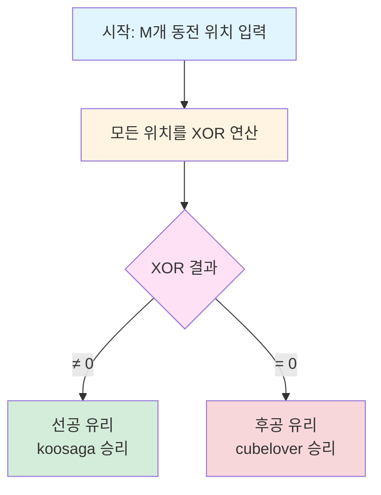

## 문제 정보

더 많은 정보는 42jerrykim.github.io 에서 확인하세요.

- **문제 링크**: https://www.acmicpc.net/problem/11869
- **난이도**: Silver 2
- **카테고리**: 게임 이론, 수학

### 문제 요약

1×N 직사각형에 M개의 동전이 놓여있습니다. 두 사람(koosaga와 cubelover)이 번갈아가며 다음과 같은 규칙으로 게임을 진행합니다:

- 매 턴마다 동전 하나를 선택하여 왼쪽으로 한 칸 이상 이동시킵니다
- 모든 동전이 0번 위치에 도달하면 게임이 종료됩니다
- 마지막 이동을 한 사람이 승리합니다
- koosaga가 먼저 시작합니다

두 사람이 모두 최적의 전략으로 플레이할 때 누가 이기는지 판별해야 합니다.

### 제한 조건

- 동전의 개수: 1 ≤ M ≤ 100
- 동전의 위치: 1 ≤ Pi ≤ 10^9
- 시간 제한: 2초
- 메모리 제한: 512MB

## 입출력 형식

### 입력
```
M (동전의 개수)
P1 P2 ... PM (각 동전의 위치)
```

### 출력
```
koosaga 또는 cubelover
```

## 예제

### 예제 1
```
입력:
1
1

출력:
koosaga
```

### 예제 2
```
입력:
1
2

출력:
koosaga
```

### 예제 3
```
입력:
2
1 1

출력:
cubelover
```

### 예제 4
```
입력:
2
1 2

출력:
koosaga
```

### 예제 5
```
입력:
2
2 2

출력:
cubelover
```

### 예제 6
```
입력:
4
1 2 3 4

출력:
koosaga
```

### 예제 7
```
입력:
6
9 8 9 8 9 9

출력:
cubelover
```

## 접근 개요 (아이디어 스케치)

이 문제는 **님블(Nimble)** 게임으로 알려진 조합 게임 이론의 고전적인 문제입니다.

### 핵심 관찰

1. **게임의 특성**: 두 사람이 번갈아 가며 동전을 왼쪽으로만 이동시키는 공평 게임(Impartial Game)입니다.
2. **종료 조건**: 모든 동전이 0번 위치에 도달하면 게임이 종료됩니다.
3. **승리 조건**: 마지막 이동을 한 사람이 승리합니다 (정상형 게임).
4. **독립성**: 각 동전은 독립적으로 이동하며, 서로 간섭하지 않습니다.

### 모델링 방식

**Sprague-Grundy 정리 적용**:
- 각 동전을 독립적인 부분 게임으로 취급
- 전체 게임의 상태 = 각 부분 게임의 Grundy number를 XOR
- XOR ≠ 0 → 선공 승리, XOR = 0 → 후공 승리

### 선택 근거

님블 게임은 표준 님 게임과 동일한 구조를 가지므로, 위치 p에 있는 동전의 Grundy number는 p 자체입니다. 이는 위치 p에서 0부터 p-1까지 모든 위치로 이동 가능하므로, mex({0, 1, ..., p-1}) = p가 되기 때문입니다.

## 알고리즘 설계

### 상태 정의

- **게임 상태**: G = P₁ ⊕ P₂ ⊕ ... ⊕ Pₘ (모든 동전 위치의 XOR)
- **승패 판정**:
  - G ≠ 0 → 선공(koosaga) 승리
  - G = 0 → 후공(cubelover) 승리

### 자료구조

- 정수 변수 하나로 XOR 누적값 저장
- 추가 메모리 불필요

### 구현 포인트

1. XOR 연산은 교환법칙과 결합법칙이 성립하므로 순서 무관
2. a ⊕ a = 0 성질을 활용하여 같은 위치의 동전은 상쇄
3. 초기값을 0으로 설정하여 XOR 누적

### 알고리즘 단계

```
1. xor_sum = 0으로 초기화
2. for i = 1 to M:
     xor_sum = xor_sum ⊕ P[i]
3. if xor_sum ≠ 0:
     출력 "koosaga"
   else:
     출력 "cubelover"
```

### 정당성 증명

**Sprague-Grundy 정리 적용**:

1. **Grundy number 계산**: 위치 p의 Grundy number g(p) = mex({g(k) : 0 ≤ k < p})
   - g(0) = 0 (종료 상태)
   - g(p) = mex({0, 1, ..., p-1}) = p (귀납적으로 증명 가능)

2. **게임 합성**: 독립적인 게임들의 Grundy number는 XOR로 합성
   - G = g(P₁) ⊕ g(P₂) ⊕ ... ⊕ g(Pₘ) = P₁ ⊕ P₂ ⊕ ... ⊕ Pₘ

3. **승패 판정**: 
   - G ≠ 0 → 현재 플레이어가 G = 0 상태로 만들 수 있음 → 승리
   - G = 0 → 어떤 수를 두어도 G ≠ 0이 됨 → 패배

### 예제 검증

**예제 1**: [1]
- XOR = 1 ≠ 0 → koosaga ✓

**예제 2**: [2]
- XOR = 2 ≠ 0 → koosaga ✓

**예제 3**: [1, 1]
- XOR = 1 ⊕ 1 = 0 → cubelover ✓

**예제 4**: [1, 2]
- XOR = 1 ⊕ 2 = 3 ≠ 0 → koosaga ✓

**예제 5**: [2, 2]
- XOR = 2 ⊕ 2 = 0 → cubelover ✓

**예제 6**: [1, 2, 3, 4]
- XOR = 1 ⊕ 2 ⊕ 3 ⊕ 4 = 4 ≠ 0 → koosaga ✓

**예제 7**: [9, 8, 9, 8, 9, 9]
- XOR = 9 ⊕ 8 ⊕ 9 ⊕ 8 ⊕ 9 ⊕ 9 = 0 → cubelover ✓

## 게임 상태 흐름도



## 복잡도 분석

- **시간 복잡도**: O(M)
  - M개의 동전 위치를 한 번씩 처리합니다.
  
- **공간 복잡도**: O(1)
  - XOR 결과를 저장하는 변수만 사용합니다.

## 구현

### C++ 코드

```cpp
// 더 많은 정보는 42jerrykim.github.io 에서 확인하세요.
#include <bits/stdc++.h>
using namespace std;

int main() {
    ios::sync_with_stdio(false);
    cin.tie(nullptr);
    
    int M;
    cin >> M;
    
    int xor_sum = 0;
    for (int i = 0; i < M; i++) {
        int pos;
        cin >> pos;
        xor_sum ^= pos;
    }
    
    if (xor_sum != 0) {
        cout << "koosaga\n";
    } else {
        cout << "cubelover\n";
    }
    
    return 0;
}
```

### Python 코드

```python
# 더 많은 정보는 42jerrykim.github.io 에서 확인하세요.
M = int(input())
positions = list(map(int, input().split()))

xor_sum = 0
for pos in positions:
    xor_sum ^= pos

if xor_sum != 0:
    print("koosaga")
else:
    print("cubelover")
```

## 코너 케이스 체크리스트

### 입력 크기 관련

- [x] **단일 동전** (M = 1)
  - 위치 P ≥ 1 → XOR = P ≠ 0 → koosaga 승리
  - 항상 선공이 승리함
  
- [x] **최소 입력** (M = 1, P = 1)
  - XOR = 1 → koosaga 승리
  
- [x] **최대 입력** (M = 100, P = 10^9)
  - 10^9 < 2^31 - 1이므로 int 타입으로 안전
  - XOR 연산도 int 범위 내에서 처리 가능

### 값의 패턴

- [x] **모든 동전이 같은 위치**
  - 짝수 개: XOR = 0 → cubelover 승리
    - 예: [3, 3] → 3 ⊕ 3 = 0
  - 홀수 개: XOR = 위치값 → koosaga 승리
    - 예: [3, 3, 3] → 3 ⊕ 3 ⊕ 3 = 3
  
- [x] **연속된 위치** ([1, 2, 3, ..., n])
  - XOR 결과는 n의 값에 따라 달라짐
  - 예: [1, 2, 3, 4] → 1 ⊕ 2 ⊕ 3 ⊕ 4 = 4 → koosaga

- [x] **대칭 패턴**
  - 같은 값이 쌍으로 나타나면 상쇄
  - 예: [9, 8, 9, 8, 9, 9] → (9 ⊕ 9) ⊕ (8 ⊕ 8) ⊕ (9 ⊕ 9) = 0

### XOR 연산 특성 확인

- [x] **교환법칙**: a ⊕ b = b ⊕ a
- [x] **결합법칙**: (a ⊕ b) ⊕ c = a ⊕ (b ⊕ c)
- [x] **항등원**: a ⊕ 0 = a
- [x] **자기자신**: a ⊕ a = 0

## 제출 전 점검

### 입출력 관련

- [ ] **입력 형식**: 첫 줄에 M, 둘째 줄에 M개의 정수 (공백 구분)
- [ ] **출력 형식**: "koosaga" 또는 "cubelover" (대소문자 정확히, 개행 포함)
- [ ] **예제 검증**: 7개 예제 모두 통과 확인

### 변수 및 연산

- [ ] **자료형**: int 사용 (10^9 < 2^31 - 1)
- [ ] **XOR 초기값**: 0으로 초기화
- [ ] **오버플로**: XOR은 오버플로 없음 (비트 연산)

### 구현 디테일

- [ ] **fast I/O**: `ios::sync_with_stdio(false); cin.tie(nullptr);` (C++)
- [ ] **인덱스**: 동전 위치는 1-based이지만 계산에 영향 없음
- [ ] **조건문**: XOR ≠ 0이면 koosaga, = 0이면 cubelover

### 논리 검증

- [ ] **Grundy number**: 각 위치 p의 Grundy number = p
- [ ] **승패 조건**: XOR 결과로 올바르게 판단
- [ ] **경계값**: M = 1, P = 1 / M = 100, P = 10^9 모두 처리 가능

## 참고자료

### 게임 이론 기초

- [Game Theory - Sprague-Grundy Theorem](https://cp-algorithms.com/game_theory/sprague-grundy-nim.html)
  - Sprague-Grundy 정리의 상세한 설명과 증명
- [Nimbers (Wikipedia)](https://en.wikipedia.org/wiki/Nimbers)
  - 님 게임과 님블 게임의 수학적 배경

### 관련 개념

- **Impartial Game**: 두 플레이어가 동일한 선택지를 가지는 게임
- **Grundy Number (Nimber)**: 게임 상태의 등가 님 더미 크기
- **mex (minimal excludant)**: 집합에 포함되지 않은 최소 비음수 정수

## 유사 문제

### 님 게임 시리즈

- [백준 11868번: 님 게임 2](https://www.acmicpc.net/problem/11868)
  - 표준 님 게임 구현
- [백준 16895번: 님 게임 3](https://www.acmicpc.net/problem/16895)
  - 님 게임에서 첫 수를 찾는 문제

### 게임 이론 응용

- [백준 9660번: 돌 게임 6](https://www.acmicpc.net/problem/9660)
  - Grundy number를 활용한 돌 게임
- [백준 11014번: 컨닝 2](https://www.acmicpc.net/problem/11014)
  - 이분 매칭을 활용한 게임 문제
