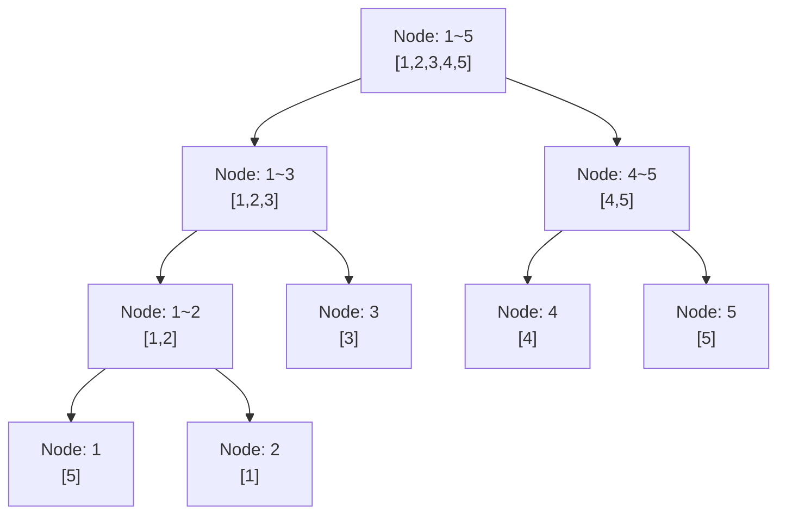

## 문제 정보

- **문제**: https://www.acmicpc.net/problem/14504
- **요약**: 길이 N인 수열 A가 주어질 때, 1번 쿼리는 범위 [i, j]에서 k보다 큰 원소의 개수를 출력하고, 2번 쿼리는 A[i]를 k로 갱신합니다. 최대 M개의 쿼리를 처리해야 합니다.
- **제한**: 시간 2초, 메모리 512MB, N ≤ 100,000, M ≤ 100,000, 1 ≤ A[i], k ≤ 10^9

## 입출력 형식/예제

```text
입력:
5
5 1 2 3 4
5
1 2 4 1
2 4 5
1 4 4 4
2 3 3
1 1 5 2

출력:
2
1
4
```

**예제 설명**:
- 초기 배열: [5, 1, 2, 3, 4] (인덱스 1-based)
- Query `1 2 4 1`: [2, 3]에서 1보다 큰 원소 → [2, 3] → 2개
- Query `2 4 5`: A[4] = 5로 변경 → [5, 1, 2, 3, 5]
- Query `1 4 4 4`: [3, 5]에서 4보다 큰 원소 → [5] → 1개
- Query `2 3 3`: A[3] = 3으로 변경 → [5, 1, 3, 3, 5]
- Query `1 1 5 2`: [5, 1, 3, 3, 5]에서 2보다 큰 원소 → [5, 3, 3, 5] → 4개

## 접근 개요(아이디어 스케치)

- **핵심 관찰**: 범위 쿼리(범위 내 조건을 만족하는 원소 개수)와 점 갱신을 동시에 처리해야 합니다.
- **자료구조 선택**: Merge Sort Tree를 사용하면 각 노드에서 이분탐색으로 k보다 큰 원소를 빠르게 찾을 수 있습니다.
- **Merge Sort Tree**: 세그먼트 트리의 각 노드가 해당 범위의 정렬된 원소들을 저장하며, 자식 노드의 정렬된 배열을 merge하여 구성됩니다.
- **쿼리 처리**: 범위 [i, j]를 커버하는 노드들에서 `upper_bound`를 이용해 k보다 큰 원소 개수를 O(log²n)에 구합니다.



## 알고리즘 설계

### Merge Sort Tree 구성

1. **노드 구조**: 각 노드 `tree[i]`는 해당 범위의 모든 원소를 정렬하여 저장하는 벡터입니다.
2. **빌드**: 리프 노드부터 시작하여 부모 노드는 두 자식의 정렬된 배열을 merge합니다. O(N log N) 시간.
3. **구간 쿼리**: 범위 [l, r]에 대해 세그먼트 트리를 순회하며, 완전히 포함된 노드에서만 `upper_bound`로 조회합니다.
   - 각 노드: O(log n)의 이분탐색
   - 트리 높이: O(log n)개 노드 방문
   - 총: O(log²n)

4. **점 갱신**: 특정 위치의 값을 변경할 때, 그 위치를 포함하는 모든 부모 노드에서 이전 값을 제거하고 새 값을 삽입합니다. O(log n)

### 정당성 근거

- **Merge의 정확성**: 두 정렬된 배열의 merge 결과는 정렬되어 있으므로, 전체 트리의 각 노드도 정렬된 상태를 유지합니다.
- **상한 함수의 정확성**: `upper_bound(begin, end, k)`는 k보다 큰 첫 원소의 위치를 반환하므로, `end - upper_bound(...)`는 정확히 k보다 큰 원소의 개수입니다.
- **범위 분해**: 세그먼트 트리의 범위 분해 원칙에 따라, 임의의 범위 [l, r]은 최대 O(log n)개의 노드로 분해되며, 각 노드의 정렬된 배열에서 독립적으로 조회할 수 있습니다.

## 복잡도

- **시간**: 
  - 빌드: O(N log N) (merge 단계가 각 레벨에서 총 O(N))
  - 쿼리(type 1): O(log²N) (O(log N)개 노드 × 각 노드마다 O(log N) 이분탐색)
  - 갱신(type 2): O(log N) (O(log N)개 노드 순회, 각 노드에서 O(log N) 삭제/삽입)
  - 전체: O((N + M·log²N) log N)

- **공간**: O(N log N) (각 원소가 트리의 모든 노드에 최대 log N번 저장)

## 구현 (C++)

```cpp
// 더 많은 정보는 42jerrykim.github.io 에서 확인하세요.
#include <bits/stdc++.h>
using namespace std;

const int MAXN = 100005;
vector<int> tree[4 * MAXN];
int arr[MAXN];
int n, m;

void build(int node, int start, int end) {
    if (start == end) {
        tree[node].push_back(arr[start]);
        return;
    }
    int mid = (start + end) / 2;
    build(2 * node, start, mid);
    build(2 * node + 1, mid + 1, end);
    
    merge(tree[2 * node].begin(), tree[2 * node].end(),
          tree[2 * node + 1].begin(), tree[2 * node + 1].end(),
          back_inserter(tree[node]));
}

void update(int node, int start, int end, int idx, int oldVal, int newVal) {
    auto it = lower_bound(tree[node].begin(), tree[node].end(), oldVal);
    tree[node].erase(it);
    tree[node].insert(lower_bound(tree[node].begin(), tree[node].end(), newVal), newVal);
    
    if (start == end) {
        return;
    }
    
    int mid = (start + end) / 2;
    if (idx <= mid) {
        update(2 * node, start, mid, idx, oldVal, newVal);
    } else {
        update(2 * node + 1, mid + 1, end, idx, oldVal, newVal);
    }
}

int query(int node, int start, int end, int l, int r, int k) {
    if (r < start || end < l) {
        return 0;
    }
    
    if (l <= start && end <= r) {
        return tree[node].end() - upper_bound(tree[node].begin(), tree[node].end(), k);
    }
    
    int mid = (start + end) / 2;
    return query(2 * node, start, mid, l, r, k) + 
           query(2 * node + 1, mid + 1, end, l, r, k);
}

int main() {
    ios_base::sync_with_stdio(false);
    cin.tie(NULL);
    
    cin >> n;
    for (int i = 1; i <= n; i++) {
        cin >> arr[i];
    }
    
    build(1, 1, n);
    
    cin >> m;
    while (m--) {
        int type;
        cin >> type;
        
        if (type == 1) {
            int i, j, k;
            cin >> i >> j >> k;
            cout << query(1, 1, n, i, j, k) << '\n';
        } else {
            int i, k;
            cin >> i >> k;
            int oldVal = arr[i];
            arr[i] = k;
            update(1, 1, n, i, oldVal, k);
        }
    }
    
    return 0;
}
```

**코드 설명**

1. **빌드 함수** `build`:
   - 리프 노드(start == end)에서는 배열 원소를 벡터에 저장합니다.
   - 내부 노드에서는 두 자식 노드의 정렬된 벡터를 `merge`하여 부모 벡터를 구성합니다.

2. **쿼리 함수** `query`:
   - 범위 [l, r]을 세그먼트 트리와 교집합하며 순회합니다.
   - 완전히 포함된 노드에서는 `upper_bound(tree[node].begin(), tree[node].end(), k)`를 사용해 k보다 큰 원소의 개수를 구합니다.
   - 부분적으로 겹치는 노드는 재귀적으로 분할하여 조회합니다.

3. **갱신 함수** `update`:
   - 인덱스 `idx`의 값을 `oldVal`에서 `newVal`로 변경합니다.
   - 각 노드의 정렬된 벡터에서 이전 값을 찾아 제거(`erase`)하고, 새 값을 올바른 위치에 삽입(`insert`)합니다.
   - 리프 노드에 도달하면 종료합니다.

4. **입출력**:
   - 각 쿼리의 유형에 따라 `query` 또는 `update` 함수를 호출합니다.

## 코너 케이스 체크리스트

- **범위 끝점**: 쿼리 범위 [i, j]에서 i == j인 경우 (단일 원소)
- **k 값의 범위**: k가 배열의 최댓값보다 크거나 최솟값보다 작은 경우
- **갱신 후 쿼리**: 갱신 직후 같은 위치에 대한 쿼리 수행
- **최대 입력**: N = 100,000, M = 100,000인 극한 케이스
- **원소값 범위**: 1 ≤ A[i] ≤ 10^9 (int 범위 충분)
- **동일 원소**: 배열의 모든 원소가 같은 경우
- **k = 0**: k보다 큰 모든 원소를 세는 경우

## 제출 전 점검

- 세그먼트 트리 노드 인덱싱이 올바른지 (1부터 시작)
- `merge` 함수 사용 시 두 범위가 정렬되어 있는지 확인
- `upper_bound` 사용이 정확한지 (초과값 기준)
- 갱신 시 oldVal을 정확히 저장했는지 (배열 갱신 전에 저장)
- 빈 벡터에 대한 `erase`, `insert` 동작 확인
- 범위 조회의 경계 조건 (l <= start && end <= r) 확인
- Fast I/O 설정 확인
- 쿼리 타입 1 vs 2의 입력 개수 차이 확인 (type 1: i, j, k / type 2: i, k)

## 참고자료/유사문제

- **Merge Sort Tree**: 범위 쿼리 최적화를 위한 고급 자료구조
- **세그먼트 트리**: 기본 개념 및 범위 분해 원칙
- **이분탐색**: `upper_bound`, `lower_bound` 사용법
- **유사 문제**: 
  - BOJ 13544: 수열과 쿼리 3 (Merge Sort Tree 기본)
  - BOJ 13545: 수열과 쿼리 0 (구간 합 쿼리)
  - BOJ 14868: 큰 숫자 소인수분해 (범위 쿼리)
- **더 읽을거리**: "Competitive Programming" by Halim & Halim - Segment Tree 챕터

