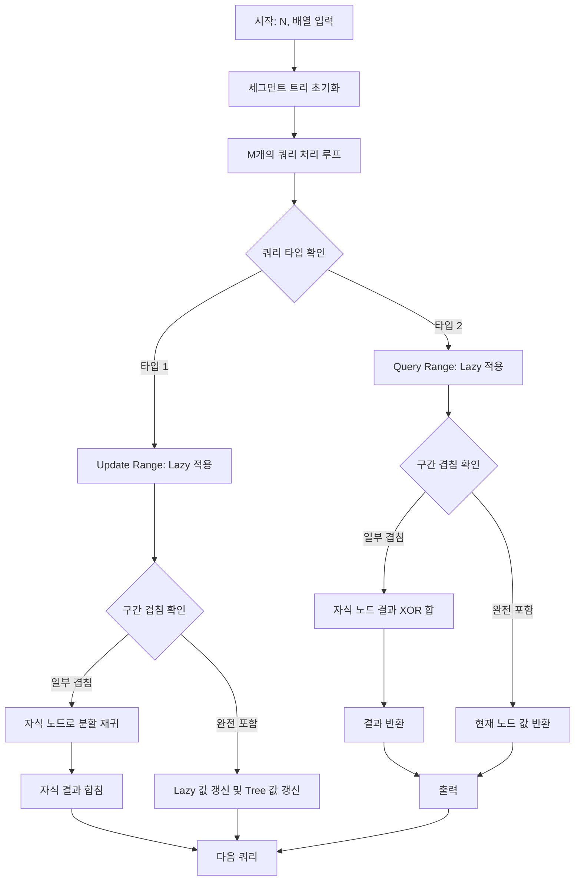

이 문제는 구간 업데이트와 구간 쿼리가 빈번하게 발생하는 상황에서 세그먼트 트리(Segment Tree)와 느리게 갱신되는 세그먼트 트리(Lazy Propagation) 기법을 사용하여 해결해야 하는 전형적인 문제입니다. 단순 반복문으로는 시간 초과가 발생하므로 $O(\log N)$의 효율적인 처리가 필수적입니다.

## 문제 정보

**문제 링크**: [https://www.acmicpc.net/problem/12844](https://www.acmicpc.net/problem/12844)

**문제 요약**:
길이가 $N$인 수열 $A$에 대해 두 가지 쿼리를 처리해야 합니다. 첫 번째는 구간 $[i, j]$의 모든 원소에 $k$를 XOR 연산하는 업데이트 쿼리이고, 두 번째는 구간 $[i, j]$의 모든 원소를 XOR한 값을 출력하는 쿼리입니다.

**제한 조건**:
- 시간 제한: 2초
- 메모리 제한: 512MB
- 입력 크기: $1 \le N, M \le 500,000$, $0 \le A_i, k \le 100,000$

## 입출력 예제

**입력 1**:
```text
5
1 2 3 4 5
3
2 0 4
1 2 4 9
2 0 4
```

**출력 1**:
```text
1
8
```

## 접근 방식

### 핵심 관찰
XOR 연산은 교환법칙과 결합법칙이 성립하며, 자기 자신과의 XOR은 0이 되는 성질($x \oplus x = 0$)을 가집니다.
구간 $[L, R]$에 값 $k$를 XOR할 때, 구간의 길이가 짝수라면 $k$가 짝수 번 XOR되므로 전체 XOR 합은 변하지 않습니다. 구간의 길이가 홀수라면 $k$가 홀수 번 XOR되므로 전체 XOR 합에 $k$를 한 번 XOR한 것과 같습니다. 이 성질을 이용하여 Lazy Propagation을 구현할 수 있습니다.

### 알고리즘 설계 (Mermaid Flowchart)



### 단계별 로직
1. **전처리**: 입력 배열을 리프 노드로 하는 세그먼트 트리를 `init` 함수를 통해 구성합니다. 각 노드는 해당 구간의 XOR 합을 저장합니다.
2. **메인 로직**: 
   - **Lazy Propagation**: `update_lazy` 함수를 통해 노드에 쌓인 `lazy` 값을 자식에게 전파하고 현재 노드의 값을 갱신합니다. 이때 구간의 길이가 홀수인 경우에만 `tree` 값에 `lazy` 값을 XOR합니다.
   - **구간 업데이트**: `update_range` 함수에서 구간에 완전히 포함되는 노드를 만나면 `lazy` 값을 갱신하고 즉시 리턴합니다. 그렇지 않으면 자식 노드로 내려갑니다.
   - **구간 쿼리**: `query` 함수에서 구간에 완전히 포함되는 노드의 값을 반환하고, 걸쳐있는 경우 자식 노드들의 XOR 합을 반환합니다.
3. **후처리**: 쿼리 2번의 수행 결과를 표준 출력으로 반환합니다.

## 복잡도 분석

| 항목 | 복잡도 | 비고 |
|---|---|---|
| **시간 복잡도** | $O(M \log N)$ | 트리 구성 $O(N)$, 각 쿼리 $O(\log N)$ |
| **공간 복잡도** | $O(N)$ | 트리 및 Lazy 배열 크기 $4N$ |

## 구현 코드

### C++

```cpp
// 더 많은 정보는 42jerrykim.github.io 에서 확인하세요.
#include <iostream>
#include <vector>
#include <cmath>
#include <algorithm>

using namespace std;

int n, m;
vector<int> arr;
vector<int> tree;
vector<int> lazy;

// 세그먼트 트리 초기화
int init(int node, int start, int end) {
    if (start == end) {
        return tree[node] = arr[start];
    }
    int mid = (start + end) / 2;
    return tree[node] = init(node * 2, start, mid) ^ init(node * 2 + 1, mid + 1, end);
}

// Lazy 값 전파 및 현재 노드 갱신
void update_lazy(int node, int start, int end) {
    if (lazy[node] != 0) {
        // 구간의 길이가 홀수일 때만 XOR 합에 변화가 생김
        if ((end - start + 1) % 2 == 1) {
            tree[node] ^= lazy[node];
        }
        // 리프 노드가 아니면 자식에게 Lazy 전파
        if (start != end) {
            lazy[node * 2] ^= lazy[node];
            lazy[node * 2 + 1] ^= lazy[node];
        }
        lazy[node] = 0;
    }
}

// 구간 업데이트 (XOR k)
void update_range(int node, int start, int end, int left, int right, int diff) {
    update_lazy(node, start, end);
    if (left > end || right < start) {
        return;
    }
    if (left <= start && end <= right) {
        lazy[node] ^= diff;
        update_lazy(node, start, end);
        return;
    }
    int mid = (start + end) / 2;
    update_range(node * 2, start, mid, left, right, diff);
    update_range(node * 2 + 1, mid + 1, end, left, right, diff);
    tree[node] = tree[node * 2] ^ tree[node * 2 + 1];
}

// 구간 쿼리 (XOR Sum)
int query(int node, int start, int end, int left, int right) {
    update_lazy(node, start, end);
    if (left > end || right < start) {
        return 0;
    }
    if (left <= start && end <= right) {
        return tree[node];
    }
    int mid = (start + end) / 2;
    return query(node * 2, start, mid, left, right) ^ query(node * 2 + 1, mid + 1, end, left, right);
}

int main() {
    ios_base::sync_with_stdio(false);
    cin.tie(NULL);

    cin >> n;
    arr.resize(n);
    tree.resize(n * 4);
    lazy.resize(n * 4);

    for (int i = 0; i < n; i++) {
        cin >> arr[i];
    }

    init(1, 0, n - 1);

    cin >> m;
    for (int i = 0; i < m; i++) {
        int type;
        cin >> type;
        if (type == 1) {
            int a, b, c;
            cin >> a >> b >> c;
            if (a > b) swap(a, b); // 입력 순서 보장
            update_range(1, 0, n - 1, a, b, c);
        } else {
            int a, b;
            cin >> a >> b;
            if (a > b) swap(a, b); // 입력 순서 보장
            cout << query(1, 0, n - 1, a, b) << "\n";
        }
    }

    return 0;
}
```

## 코너 케이스 및 실수 포인트

| 케이스 | 설명 | 처리 방법 |
|---|---|---|
| **i > j 입력** | 쿼리 구간의 시작과 끝이 뒤집혀서 들어오는 경우 | `swap(a, b)`를 통해 항상 $a \le b$가 되도록 조정 |
| **구간 길이 홀/짝** | XOR 연산은 구간 길이에 따라 결과가 달라짐 | 홀수일 때만 lazy 값을 tree에 XOR 적용 |
| **Lazy 전파 시점** | 업데이트나 쿼리 방문 시 반드시 lazy 갱신 | 함수 진입 초기에 `update_lazy` 호출 |
| **N 범위** | $N$이 최대 50만이므로 트리 크기는 $4N$ 필요 | 벡터 크기를 충분히 할당 (`resize(n * 4)`) |

## 마무리

이 문제는 Lazy Propagation의 개념을 이해하고 XOR 연산의 특성을 잘 활용해야 하는 문제입니다. 구간 합 문제와 유사하지만 XOR의 성질($A \oplus A = 0$)로 인해 구간 길이에 따른 처리가 중요하다는 점이 다릅니다.

## 참고 문헌 및 출처

- [백준 12844번 문제](https://www.acmicpc.net/problem/12844)
- [세그먼트 트리 (Segment Tree)](https://namu.wiki/w/%EC%84%B8%EA%B7%B8%EB%A8%BC%ED%8A%B8%20%ED%8A%B8%EB%A6%AC)
