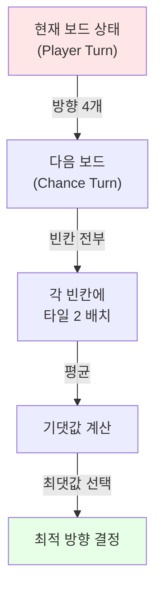

## 문제 정보

**문제**: [28489번: 2048 게임](https://www.acmicpc.net/problem/28489)

**제한**:
- 시간 제한: 15초 (추가 시간 없음)
- 메모리 제한: 1024 MB
- 제출 수: 1145, 정답 수: 53

**문제 요약**:
인터랙터가 제공하는 위치에 타일 2를 배치한 후, UP/DOWN/LEFT/RIGHT 중 한 방향으로 이동 명령을 내각. 게임 종료 시점의 최댓값 타일로 점수를 얻고, 16회 실행 평균이 2048 이상이면 정답 판정.

## 입출력 형식 및 예제

**인터랙션 방식**:
```
인터랙터 출력: 좌표 P (1-16, 왼쪽 위부터 순서)
프로그램 출력: 이동 방향 ("UP", "DOWN", "LEFT", "RIGHT")
게임 종료: 인터랙터가 -1 입력
```

**예제**:
```
인터랙터: 10 4 6 15 8 -1
프로그램: UP LEFT RIGHT DOWN DOWN
```

## 접근 개요 (핵심 관찰)

1. **게임 구조**: 플레이어(최적 이동 선택) ↔ 환경(무작위 타일 생성)의 교대 턴
2. **핵심 인사이트**: 타일 생성 위치는 무작위이지만, 값은 항상 2. 따라서 **확률 노드를 포함하는 게임 트리 탐색**(Expectimax)이 적합
3. **평가 지표**: 깊이 제약 때문에 리프 노드에서 Snake 패턴 휴리스틱으로 보드 상태 평가

**Mermaid 흐름도**:


## 알고리즘 설계

### Expectimax 트리 탐색

**Max Node (플레이어 턴)**:
- 상, 하, 좌, 우 이동 시뮬레이션
- 실제 이동이 일어난 경우만 Chance Node로 진행
- 자식 노드의 기댓값 중 최댓값 선택

**Chance Node (환경 턴)**:
- 현재 보드의 모든 빈칸 탐색
- 각 빈칸에 2를 배치 후 Max Node로 진행
- 모든 경우의 평균 계산

**깊이**: 약 5-6 (3수 앞 탐색으로 충분한 시간 내 응답)

### 보드 상태 평가 (휴리스틱)

**Snake 패턴 가중치**:
- 큰 숫자가 좌상단 (0,0)에 모이도록 유도
- 오른쪽 → 아래 → 왼쪽 → 위 순서의 가중치 배치
- 높은 타일 값이 자주 사용되는 위치에 높은 가중치

```
65536  32768  16384   8192
  512   1024   2048   4096
  256    128     64     32
    2      4      8     16
```

### 타일 이동/병합 로직

```
1. 방향에 따라 한 줄씩 추출
2. 0 제거
3. 인접한 같은 값 병합 (방향 우선)
4. 빈 공간 0으로 채우기
```

### 정당성 근거

- **Expectimax의 최적성**: 플레이어와 확률 환경이 번갈아 나타나는 게임에 대해 최적 정책을 보장
- **휴리스틱의 유효성**: Snake 패턴은 2048 게임에서 경험적으로 가장 높은 점수를 유도하는 평가 함수
- **깊이 설정**: 15초 제한 내에 충분히 깊은 탐색으로 안정적 플레이 가능

## 복잡도

- **시간**: \(O(4^d \times b^c)\) - \(d\): 탐색 깊이(~5), \(b\): 이동 갈래(≤4), \(c\): 평균 빈칸 수(≤16)
- **공간**: \(O(d \times 16)\) - 보드 복사본 스택, 상수 추가 메모리

## 구현

```cpp
// 더 많은 정보는 42jerrykim.github.io 에서 확인하세요.

#include <bits/stdc++.h>
using namespace std;

int board[4][4];

const double WEIGHTS[4][4] = {
    {65536, 32768, 16384, 8192},
    {512,   1024,  2048,  4096},
    {256,   128,   64,    32},
    {2,     4,     8,     16}
};

string dirNames[4] = {"UP", "DOWN", "LEFT", "RIGHT"};

void copyBoard(int src[4][4], int dest[4][4]) {
    for(int i = 0; i < 4; ++i)
        for(int j = 0; j < 4; ++j)
            dest[i][j] = src[i][j];
}

void processLine(vector<int>& v, bool& changed) {
    vector<int> newV;
    for(int x : v) if(x) newV.push_back(x);
    
    for(size_t k = 0; k + 1 < newV.size(); ++k) {
        if(newV[k] == newV[k + 1]) {
            newV[k] *= 2;
            newV[k + 1] = 0;
            k++;
            changed = true;
        }
    }
    
    vector<int> finalV;
    for(int x : newV) if(x) finalV.push_back(x);
    while(finalV.size() < 4) finalV.push_back(0);
    
    if(finalV != v) changed = true;
    v = finalV;
}

bool move(int b[4][4], int dir) {
    bool changed = false;
    
    if(dir == 2) { // LEFT
        for(int i = 0; i < 4; ++i) {
            vector<int> v;
            for(int j = 0; j < 4; ++j) v.push_back(b[i][j]);
            processLine(v, changed);
            for(int j = 0; j < 4; ++j) b[i][j] = v[j];
        }
    } else if(dir == 3) { // RIGHT
        for(int i = 0; i < 4; ++i) {
            vector<int> v;
            for(int j = 3; j >= 0; --j) v.push_back(b[i][j]);
            processLine(v, changed);
            for(int j = 0; j < 4; ++j) b[i][3 - j] = v[j];
        }
    } else if(dir == 0) { // UP
        for(int j = 0; j < 4; ++j) {
            vector<int> v;
            for(int i = 0; i < 4; ++i) v.push_back(b[i][j]);
            processLine(v, changed);
            for(int i = 0; i < 4; ++i) b[i][j] = v[i];
        }
    } else if(dir == 1) { // DOWN
        for(int j = 0; j < 4; ++j) {
            vector<int> v;
            for(int i = 3; i >= 0; --i) v.push_back(b[i][j]);
            processLine(v, changed);
            for(int i = 0; i < 4; ++i) b[3 - i][j] = v[i];
        }
    }
    return changed;
}

double evaluate(int b[4][4]) {
    double score = 0;
    for(int i = 0; i < 4; ++i)
        for(int j = 0; j < 4; ++j)
            score += b[i][j] * WEIGHTS[i][j];
    return score;
}

double expectimax(int b[4][4], int depth, bool isMax) {
    if(depth == 0) return evaluate(b);
    
    if(isMax) {
        double maxScore = -1e18;
        bool canMove = false;
        for(int d = 0; d < 4; ++d) {
            int nextB[4][4];
            copyBoard(b, nextB);
            if(move(nextB, d)) {
                canMove = true;
                double val = expectimax(nextB, depth - 1, false);
                maxScore = max(maxScore, val);
            }
        }
        return canMove ? maxScore : -1e18;
    } else {
        double sumScore = 0;
        int count = 0;
        for(int i = 0; i < 4; ++i) {
            for(int j = 0; j < 4; ++j) {
                if(b[i][j] == 0) {
                    b[i][j] = 2;
                    sumScore += expectimax(b, depth - 1, true);
                    b[i][j] = 0;
                    count++;
                }
            }
        }
        return count == 0 ? evaluate(b) : sumScore / count;
    }
}

int main() {
    ios_base::sync_with_stdio(false);
    cin.tie(NULL);
    
    int P;
    while(cin >> P && P != -1) {
        int r = (P - 1) / 4;
        int c = (P - 1) % 4;
        board[r][c] = 2;
        
        int bestDir = -1;
        double bestScore = -1e18;
        
        for(int d = 0; d < 4; ++d) {
            int nextB[4][4];
            copyBoard(board, nextB);
            if(move(nextB, d)) {
                double score = expectimax(nextB, 5, false);
                if(score > bestScore) {
                    bestScore = score;
                    bestDir = d;
                }
            }
        }
        
        cout << (bestDir == -1 ? "UP" : dirNames[bestDir]) << endl;
        if(bestDir != -1) move(board, bestDir);
    }
    return 0;
}
```

## 코너 케이스 체크리스트

| 케이스 | 설명 | 처리 |
|--------|------|------|
| 모든 방향 불가 | 게임 종료 조건 | 임의 방향 출력 후 반환 |
| 보드 가득 참 | 빈칸 0개 → 이동 불가 | Chance 노드에서 평가값 반환 |
| 단일 타일 | 초기 상태 이후 처음 이동 | 모든 방향에서 이동 가능 |
| 병합 연쇄 | 같은 값 4개 → 2번 병합 | 각 단계마다 한 번씩만 병합 |

## 제출 전 점검

- [ ] 입출력 형식: "UP"/"DOWN"/"LEFT"/"RIGHT" 정확히 입력
- [ ] 종료 조건: -1 입력 시 프로그램 즉시 종료
- [ ] 이동 불가능성: 실제 이동이 일어난 경우만 탐색
- [ ] 좌표 변환: \(P = 4(i-1) + j+1\) ↔ \(i = \lfloor(P-1)/4\rfloor, j = (P-1) \bmod 4\)
- [ ] 오버플로우: double 사용으로 충분, 합병 결과는 정수
- [ ] 배열 초기화: 각 round 진행 시 board는 누적됨 (reset 불필요)

## 유사 문제

- [BOJ 17693 항구 시설 (Port Facility)](https://www.acmicpc.net/problem/17693): 인터랙티브 그래프 탐색
- [BOJ 16783 불도저 (Bulldozer)](https://www.acmicpc.net/problem/16783): 2D 기하 + 인터랙션

## 참고자료

- [Expectimax 알고리즘](https://en.wikipedia.org/wiki/Minimax#Expectiminimax)
- [2048 Game AI Strategy](https://web.archive.org/web/20150328185149/http://www.codeskulptor.org/)
