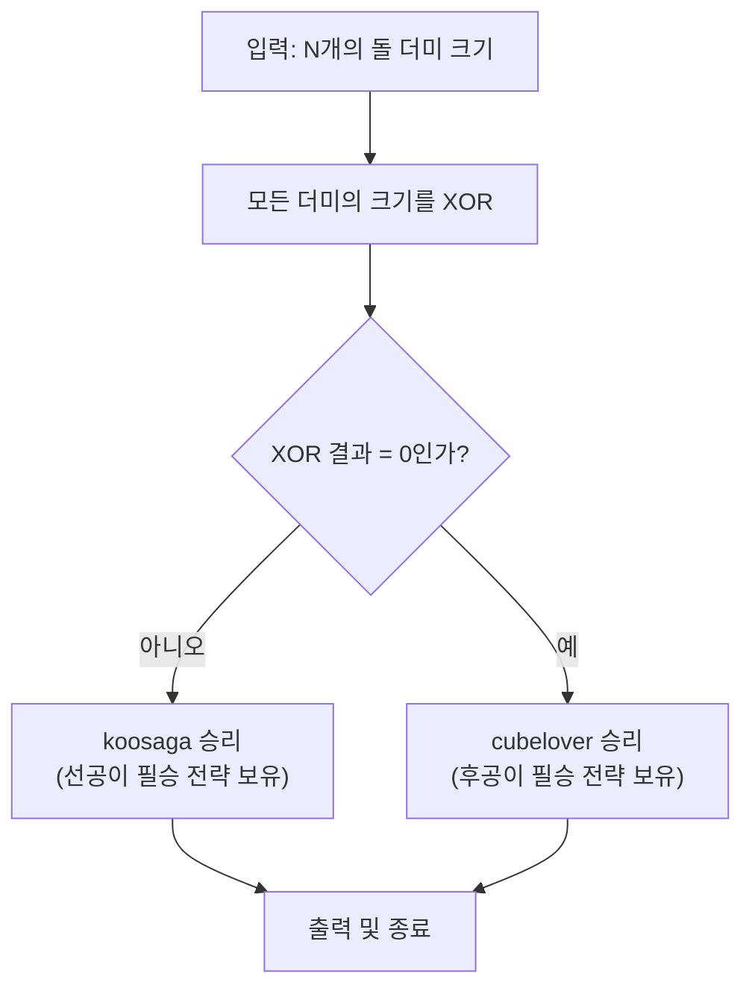

## 문제 정보

**문제 링크**: [https://www.acmicpc.net/problem/11868](https://www.acmicpc.net/problem/11868)

**문제 요약**:
koosaga와 cubelover가 님 게임을 한다. N개의 돌 더미가 있고, 각 턴마다 한 더미를 선택해서 1개 이상의 돌을 제거한다. 마지막 돌을 제거하는 사람이 이기며, 두 플레이어가 최적으로 플레이할 때 누가 이기는지 판정해야 한다.

**제한 조건**:
- 시간 제한: 2초
- 메모리 제한: 512MB
- 입력 크기: $1 \le N \le 100$, $1 \le P_i \le 10^9$

## 입출력 예제

| 예제 | 입력 | 출력 |
|---|---|---|
| 1 | 1 1 | koosaga |
| 2 | 1 2 | koosaga |
| 3 | 2 1 1 | cubelover |
| 4 | 2 1 2 | koosaga |
| 5 | 2 2 2 | cubelover |
| 6 | 4 1 2 3 4 | koosaga |
| 7 | 6 9 8 9 8 9 9 | cubelover |
| 8 | 3 2 4 6 | cubelover |

## 접근 방식

### 핵심 관찰

이 문제는 **Sprague-Grundy 정리**를 직접 적용하는 고전적인 게임 이론 문제입니다.

1. **공평한 게임 (Impartial Game)**: 모든 플레이어가 같은 규칙으로 진행 가능
2. **필승 전략 존재**: 각 게임 상태는 이기는 상태 또는 지는 상태 중 하나
3. **Grundy Number**: 각 더미의 크기가 곧 Grundy Number
4. **XOR 성질**: 여러 게임의 합은 각 게임의 Grundy Number를 XOR한 값으로 결정

### 알고리즘 설계



### 단계별 로직

**1. XOR의 의미 이해**

Nim 게임에서 각 더미의 크기를 모두 XOR한 값이 게임의 전체 Grundy Number입니다:

$$\text{Game State} = P_1 \oplus P_2 \oplus \cdots \oplus P_N$$

**2. 승패 판정**

- $\text{Game State} \neq 0$ → 선공(koosaga) 승리
- $\text{Game State} = 0$ → 후공(cubelover) 승리

**3. 필승 전략의 존재**

- **Game State = 0일 때**: 어떤 수를 제거해도 Game State는 0이 아니게 됨 → 상대방이 다시 0으로 만들 수 있음
- **Game State ≠ 0일 때**: 항상 적절한 더미에서 적절한 수를 제거해 Game State를 0으로 만들 수 있음

## 구현 코드

### C++

```cpp
// 더 많은 정보는 42jerrykim.github.io 에서 확인하세요.

#include <bits/stdc++.h>
using namespace std;

int main() {
    ios_base::sync_with_stdio(false);
    cin.tie(NULL);
    
    int n;
    cin >> n;
    
    int xor_sum = 0;
    for (int i = 0; i < n; i++) {
        int pile;
        cin >> pile;
        xor_sum ^= pile;
    }
    
    if (xor_sum != 0) {
        cout << "koosaga\n";
    } else {
        cout << "cubelover\n";
    }
    
    return 0;
}
```

## 코드 분석

**입력 및 XOR 누적**
```cpp
int xor_sum = 0;
for (int i = 0; i < n; i++) {
    int pile;
    cin >> pile;
    xor_sum ^= pile;  // 각 더미 크기를 XOR 연산으로 누적
}
```

**승자 판정 로직**
```cpp
if (xor_sum != 0) {
    cout << "koosaga\n";  // 선공인 koosaga가 필승 전략을 보유
} else {
    cout << "cubelover\n";  // 후공인 cubelover가 필승 전략을 보유
}
```

## 복잡도 분석

| 항목 | 복잡도 | 설명 |
|---|---|---|
| **시간 복잡도** | $O(N)$ | 모든 더미를 한 번씩 순회하며 XOR 연산 수행 |
| **공간 복잡도** | $O(1)$ | XOR 누적값만 저장하는 상수 공간 사용 |

## 예제 검증

| 예제 | 입력 | XOR 계산 | 결과 | 출력 | 정답 |
|---|---|---|---|---|---|
| 1 | 1 1 | $1$ | ≠0 | koosaga | ✓ |
| 2 | 1 2 | $2$ | ≠0 | koosaga | ✓ |
| 3 | 2 1 1 | $1 \oplus 1 = 0$ | =0 | cubelover | ✓ |
| 4 | 2 1 2 | $1 \oplus 2 = 3$ | ≠0 | koosaga | ✓ |
| 5 | 2 2 2 | $2 \oplus 2 = 0$ | =0 | cubelover | ✓ |
| 6 | 4 1 2 3 4 | $1 \oplus 2 \oplus 3 \oplus 4 = 4$ | ≠0 | koosaga | ✓ |
| 7 | 6 9 8 9 8 9 9 | $9 \oplus 8 \oplus 9 \oplus 8 \oplus 9 \oplus 9 = 0$ | =0 | cubelover | ✓ |
| 8 | 3 2 4 6 | $2 \oplus 4 \oplus 6 = 0$ | =0 | cubelover | ✓ |

## 코너 케이스 및 실수 포인트

| 케이스 | 설명 | 처리 방법 |
|---|---|---|
| **N=1, P=1** | 단일 더미 | 1이므로 koosaga 승리 |
| **모든 값이 같음** | N개의 같은 값 | N이 짝수면 XOR=0 (cubelover), 홀수면 XOR=값 (koosaga) |
| **매우 큰 수 (10^9)** | 오버플로우 우려 | int는 충분하며, XOR은 각 비트마다 처리 |
| **XOR의 순서** | XOR의 교환/결합 법칙 | 입력 순서와 무관하게 결과는 동일 |
| **모두 0인 경우** | N=0 또는 모든 더미가 0 | 문제 제약상 불가능 (N≥1, P_i≥1) |

## Sprague-Grundy 정리의 핵심

**Nim 게임의 필승 전략:**

- **상태 분류**: 모든 게임 상태는 P-position (Losing Position) 또는 N-position (Winning Position)
- **P-position**: 현재 플레이어가 최적으로 플레이해도 지는 상태 → XOR = 0
- **N-position**: 현재 플레이어가 반드시 이기는 상태 → XOR ≠ 0

**필승 전략의 작동 원리:**

1. **XOR ≠ 0 (N-position)**: 선공은 적절한 더미에서 적절한 수를 제거해 XOR을 0으로 만들 수 있음
2. **XOR = 0 (P-position)**: 어떤 더미를 어떻게 제거해도 XOR은 0이 아니게 되어 상대방에게 N-position을 제공
3. **반복**: 이를 반복하면 게임 상태가 P-position → N-position → P-position → ... → (1,0,0,...,0) → 패배

**예시: [1, 2, 3]**
- XOR = 0 (P-position) → cubelover의 필승 위치
- koosaga의 모든 움직임: 
  - [1 제거] → [2, 3] (XOR=1) ✓ N-position
  - [2 제거] → [1, 1, 3] (XOR=3) ✓ N-position
  - 모두 N-position → cubelover가 다시 P-position 만들기 가능

## 마무리

님 게임은 게임 이론에서 가장 우아한 예제입니다. Sprague-Grundy 정리를 통해 복잡한 게임 상황을 단 O(N)의 XOR 연산으로 판정할 수 있다는 점이 매력입니다.

**학습 포인트:**
- Nim 게임의 기본 원리와 필승 전략 이해
- Sprague-Grundy 정리의 실제 적용
- XOR 연산의 게임 이론적 의미
- P-position과 N-position의 개념

