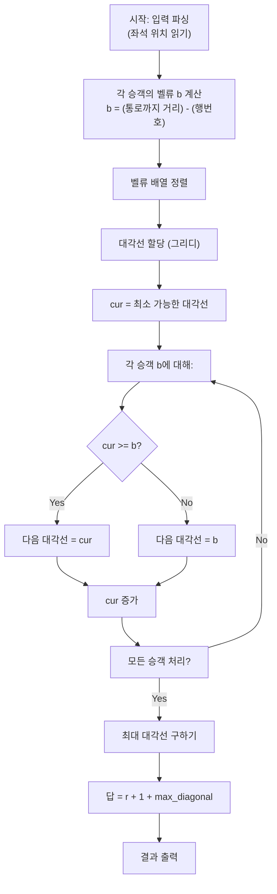

## 문제 정보

**문제 링크**: [https://www.acmicpc.net/problem/16741](https://www.acmicpc.net/problem/16741)

**문제 요약**:
긴급 탈출 상황에서 r개 행, 각 행에 양쪽에 s개씩 총 2s개 좌석이 있는 차량 내 p명의 승객이 탈출하는 시간을 최소화해야 한다. 각 승객은 초기 좌석(행, 열)에서 출발하여 통로로 나온 후 차량 뒤의 비상 출구를 통해 탈출한다. 매 스텝마다 하나의 승객만 한 칸씩 이동할 수 있으며, 정확한 목표 좌석이 비어있어야 한다. 모든 승객이 탈출하는 데 필요한 최소 스텝 수를 구하는 문제다.

**제한 조건**:
- 시간 제한: 3초
- 메모리 제한: 512MB
- 입력 크기: $1 \le r \le 500$, $1 \le s \le 500$, $1 \le p \le 2rs$

## 입출력 예제

**입력 1**:
```text
5 2 7
1 1
1 2
1 3
2 3
2 4
4 4
5 2
```

**출력 1**:
```text
9
```

**설명**: 5행, 각 2좌석씩(총 4좌석/행), 7명의 승객이 있을 때, 최적 전략으로 탈출하는 데 9스텝이 소요됩니다.

**입력 2**:
```text
500 500 16
1 1
1 2
1 999
1 1000
2 1
2 2
2 999
2 1000
3 1
3 2
3 999
3 1000
499 500
499 501
499 999
499 1000
```

**출력 2**:
```text
1008
```

## 접근 방식

### 핵심 관찰

1. **좌석 벨류 계산**: 각 승객의 좌석에서 통로까지의 거리(횟수)와 행 번호를 결합하면, 그 승객이 탈출하기 위해 필요한 최소 시간을 추정할 수 있다.

2. **대각선 할당**: 승객들이 통로에서 대기열을 이루면서 충돌하지 않으려면, 각 승객에게 고유한 "대각선"을 할당해야 한다. 여기서 대각선이란 $(t - r)$ 값이다. (t: 통로에 도달하는 시간, r: 행 번호)

3. **정렬의 중요성**: 좌석 벨류 순서로 정렬한 후, 각 승객을 차례대로 처리할 때 다음 대각선이 현재 승객의 벨류 이상이 되도록 할당하면, 최적 배치를 얻을 수 있다.

4. **최종 답**: 가장 큰 대각선 값 + (r + 1) = 최소 탈출 시간

### 알고리즘 설계



### 벨류 계산 상세

차량의 좌석 배치:
- 행: 1부터 r까지 (앞에서 뒤로)
- 열: 1부터 2s까지 (왼쪽에서 오른쪽으로)
- 통로: 열 s와 s+1 사이

각 좌석 (i, j)에서:
- 왼쪽(j ≤ s): 통로까지의 거리 = s - j + 1
- 오른쪽(j > s): 통로까지의 거리 = j - s

벨류: b = (통로까지 거리) - i

### 대각선 할당 알고리즘

```cpp
sort(base.begin(), base.end());

long long cur = (long long)-4e18;  // 최소 시작값
long long maxDiag = (long long)-4e18;

for (long long b : base) {
    if (cur < b) cur = b;  // 현재 b 이상의 다음 대각선 할당
    long long d = cur;
    ++cur;  // 다음 대각선을 위해 증가
    maxDiag = max(maxDiag, d);
}
```

## 복잡도 분석

| 항목 | 복잡도 | 비고 |
|---|---|---|
| **시간 복잡도** | $O(p \log p)$ | 정렬($p \log p$) + 대각선 할당($p$) |
| **공간 복잡도** | $O(p)$ | 벨류 배열 저장 |

## 구현 코드

### C++

```cpp
// 42jerrykim.github.io에서 더 많은 정보를 확인할 수 있습니다.
#include <bits/stdc++.h>
using namespace std;

int main() {
    ios::sync_with_stdio(false);
    cin.tie(nullptr);

    int r, s, p;
    if (!(cin >> r >> s >> p)) return 0;

    vector<long long> base;
    base.reserve(p);

    for (int k = 0; k < p; ++k) {
        int i, j;
        cin >> i >> j;

        int distToAisle;
        if (j <= s) {                // left side
            distToAisle = s - j + 1;
        } else {                     // right side
            distToAisle = j - s;
        }

        long long b = (long long)distToAisle - i;
        base.push_back(b);
    }

    sort(base.begin(), base.end());

    long long cur = (long long)-4e18;
    long long maxDiag = (long long)-4e18;

    for (long long b : base) {
        if (cur < b) cur = b;
        long long d = cur;   // assigned unique (time - row) value
        ++cur;
        if (d > maxDiag) maxDiag = d;
    }

    long long answer = (long long)r + 1 + maxDiag;
    cout << answer << '\n';

    return 0;
}
```

## 코너 케이스 및 실수 포인트

| 케이스 | 설명 | 처리 방법 |
|---|---|---|
| **p=1** | 승객 1명만 탈출 | 벨류 계산 후 r + 1 + b 반환 |
| **모두 같은 벨류** | 모든 승객의 b값이 동일 | 정렬 후 차례대로 대각선 할당(cur 증가) |
| **큰 행 번호(r=500)** | 최대 입력 | `long long` 사용으로 오버플로우 방지 |
| **큰 열 번호(j=1000)** | 최대 좌석 번호 | 거리 계산 시 부호 주의 |
| **음수 벨류** | 통로 근처 좌석 | 음수를 포함한 정렬과 대각선 할당 |
| **대각선 오버플로우** | maxDiag가 매우 큼 | `long long`(8바이트)으로 충분함 |

## 마무리

이 문제는 **그리디 알고리즘**과 **정렬**을 활용하여 복잡한 물리적 제약을 단순한 수학 문제로 변환하는 좋은 예제입니다. 핵심은 각 승객의 "벨류"를 정의하고, 그 순서로 정렬한 후 고유한 대각선을 할당하는 것입니다. 이러한 접근법은 배치 문제, 스케줄링, 리소스 할당 등 다양한 최적화 문제에 적용될 수 있습니다.

---


