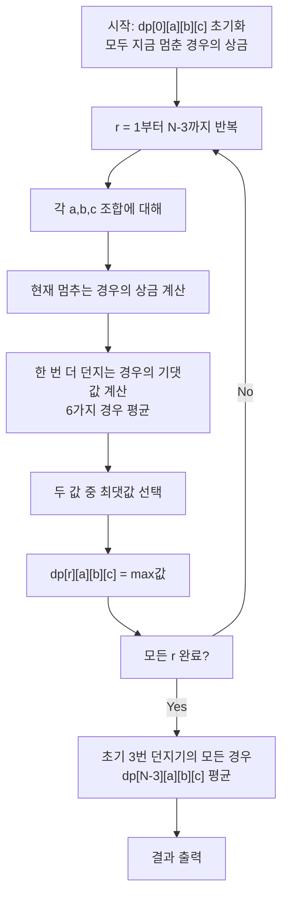

## 문제 정보

**문제 링크**: [https://www.acmicpc.net/problem/17367](https://www.acmicpc.net/problem/17367)

**문제 요약**:
주사위를 최소 3번 이상, 최대 N번까지 던질 수 있다. 게임을 끝낼 때마다 최근 3번의 주사위 눈을 이용해 기존 규칙(3개 같은 눈: 10,000 + 눈*1,000원, 2개 같은 눈: 1,000 + 눈*100원, 모두 다름: 최댓값*100원)에 따라 상금을 받는다. 기댓값을 최대화하는 최적 전략으로 플레이할 때 받을 수 있는 상금의 기댓값을 구하는 문제다.

**제한 조건**:
- 시간 제한: 1초
- 메모리 제한: 1024MB
- 입력 크기: $3 \le N \le 1,000$

## 입출력 예제

**입력 1**:
```text
3
```

**출력 1**:
```text
1229.166666666667
```

**설명**: N=3이면 정확히 3번 던져서 나온 세 눈 값으로 상금을 계산합니다.

**입력 2**:
```text
10
```

**출력 2**:
```text
3300.645281421468
```

**설명**: N=10이면 최대 10번까지 던질 수 있으므로, 더 좋은 결과가 나올 확률을 고려해 기댓값이 더 높습니다.

## 접근 방식

### 핵심 관찰

1. **상태 정의**: 현재 남은 던질 수(r)와 직전 3번의 주사위 눈(a, b, c)에 따라 최적 기댓값이 결정된다.
2. **최적 부분 구조**: 각 상태에서 "지금 게임을 끝낼지" vs "한 번 더 던질지"를 선택할 수 있다.
3. **역방향 귀납법**: 던질 수 있는 횟수가 0부터 시작해서 N-3까지 역순으로 계산한다.
4. **기댓값 계산**: 다음 던질 때 나올 6가지 경우의 기댓값을 평균내어 계산한다.

### 상금 계산 함수

```cpp
double prize(int a, int b, int c) {
    if (a == b && b == c) {
        return 10000.0 + a * 1000.0;  // 3개 같음
    }
    if (a == b || a == c) {
        return 1000.0 + a * 100.0;    // 2개 같음 (a가 쌍)
    }
    if (b == c) {
        return 1000.0 + b * 100.0;    // 2개 같음 (b,c가 쌍)
    }
    return max(a, max(b, c)) * 100.0; // 모두 다름
}
```

### 동적 계획법 정의

**상태**: `dp[r][a][b][c]` = 남은 던질 수가 r일 때, 직전 3번의 눈이 (a,b,c)인 경우 최적 기댓값

**기저 사례**: `dp[0][a][b][c] = prize(a, b, c)` (더 이상 던질 수 없음)

**점화식**:
```
dp[r][a][b][c] = max(
    prize(a, b, c),  // 현재 멈추기
    (1/6) * Σ(dp[r-1][b][c][d]) for d=1..6  // 한 번 더 던지기
)
```

### 알고리즘 설계



## 복잡도 분석

| 항목 | 복잡도 | 비고 |
|---|---|---|
| **시간 복잡도** | $O(N \times 6^3)$ = $O(216N)$ | r: N개, 각 상태: 6³=216개 |
| **공간 복잡도** | $O(6^3)$ = $O(216)$ | 2개 행만 유지 가능 (이전, 현재) |

## 구현 코드

### C++

```cpp
// 42jerrykim.github.io에서 더 많은 정보를 확인할 수 있습니다.
#include <bits/stdc++.h>
using namespace std;

double prize(int a, int b, int c) {
    if (a == b && b == c) {
        return 10000.0 + a * 1000.0;
    }
    if (a == b || a == c) {
        return 1000.0 + a * 100.0;
    }
    if (b == c) {
        return 1000.0 + b * 100.0;
    }
    int mx = max(a, max(b, c));
    return mx * 100.0;
}

int main() {
    ios::sync_with_stdio(false);
    cin.tie(nullptr);

    int N;
    cin >> N;

    // dp[r][a][b][c] = 남은 던질 수가 r일 때,
    // 직전 3번의 눈이 (a,b,c)인 경우 최적 기댓값
    static double dp[1001][7][7][7];

    // r = 0: 더 이상 던질 수 없으므로 반드시 종료
    for (int a = 1; a <= 6; ++a)
        for (int b = 1; b <= 6; ++b)
            for (int c = 1; c <= 6; ++c)
                dp[0][a][b][c] = prize(a, b, c);

    int maxR = N - 3; // 세 번은 반드시 던지므로 이후에 남는 최대 던질 수 있는 횟수

    // r = 1부터 maxR까지 계산
    for (int r = 1; r <= maxR; ++r) {
        for (int a = 1; a <= 6; ++a) {
            for (int b = 1; b <= 6; ++b) {
                for (int c = 1; c <= 6; ++c) {
                    // 현재 상태에서 게임을 끝낼 경우의 상금
                    double stop_here = prize(a, b, c);
                    
                    // 한 번 더 던질 경우의 기댓값
                    double cont = 0.0;
                    for (int d = 1; d <= 6; ++d) {
                        cont += dp[r - 1][b][c][d];
                    }
                    cont /= 6.0;
                    
                    // 두 선택지 중 더 큰 기댓값 선택
                    dp[r][a][b][c] = max(stop_here, cont);
                }
            }
        }
    }

    // 처음 세 번은 무조건 던지므로, (x1,x2,x3)이 균등하게 나오고
    // 남은 횟수는 N-3이다.
    double ans = 0.0;
    int r0 = maxR;
    for (int a = 1; a <= 6; ++a)
        for (int b = 1; b <= 6; ++b)
            for (int c = 1; c <= 6; ++c)
                ans += dp[r0][a][b][c];

    ans /= (6.0 * 6.0 * 6.0); // 6^3 = 216가지 경우

    cout.setf(ios::fixed);
    cout << setprecision(15) << ans << '\n';
    return 0;
}
```

## 코너 케이스 및 실수 포인트

| 케이스 | 설명 | 처리 방법 |
|---|---|---|
| **N=3** | 정확히 3번만 던지는 경우 | 모든 상태에서 게임을 끝내야 함 |
| **큰 N (N=1000)** | 최대 입력 | DP 배열이 충분한 크기여야 함 |
| **부동소수점 오차** | 기댓값 계산 시 오차 누적 | `setprecision(15)` 사용 |
| **인덱스 범위** | 주사위 눈은 1~6 | 반복문 범위 1~6 확인 |
| **상금 규칙 적용** | 2개 같은 눈일 때 쌍을 이룬 눈값 사용 | prize() 함수에서 올바른 눈값으로 계산 |

## 마무리

이 문제는 **벨만 방정식과 역방향 귀납법**을 이용한 동적 계획법의 좋은 예제입니다. 게임의 최적 전략을 구성할 때 "현재 상태에서의 최적 선택"이 "미래 상태의 최적값"에 의존하는 구조를 명확히 보여줍니다. 부동소수점 정밀도 처리도 주의해야 할 중요한 부분입니다.


