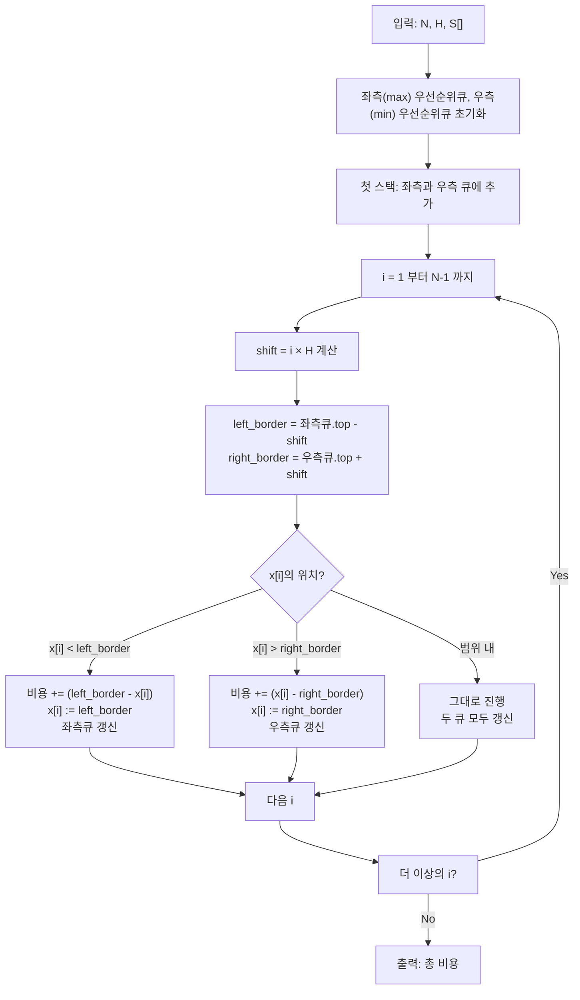

## 문제 정보

**백준 19693: Safety**
- 링크: [https://www.acmicpc.net/problem/19693](https://www.acmicpc.net/problem/19693)
- 시간 제한: 1초 | 메모리 제한: 512 MB
- 난이도: 중상 | 분류: 탐욕법, 우선순위 큐
- 출처: NOI 2018

**요약**: 스택으로 이루어진 미술 작품 설치의 높이를 조정하여, 인접한 스택의 높이 차이가 $H$ 이하가 되도록 만드는 최소 작업 횟수를 구하는 문제. 각 스택의 높이를 증가 또는 감소시킬 수 있으며, 한 번에 1 높이만 변경 가능.

## 문제 설명

스퀴키 마우스(Squeaky)는 $N$개의 스택으로 이루어진 미술 작품을 만들었습니다. 스택 $i$의 초기 높이는 $S[i]$입니다. 
안전 위원회의 요구사항은 **인접한 두 스택의 높이 차이가 $H$ 이하**여야 한다는 조건입니다: 
$$|S[i] - S[i+1]| \le H \quad \text{for all } 1 \le i < N$$

이를 만족시키기 위해 각 스택에 큐브를 추가하거나 제거하여 높이를 조정합니다. 한 번의 조작으로 한 스택의 높이를 1씩만 변경할 수 있습니다.

**목표**: 안전 조건을 만족하도록 만드는 최소 작업 횟수를 구하는 것.

### 제약 조건

- $1 \le N \le 200,000$
- $0 \le H \le 10^9$
- $0 \le S[i] \le 10^9$ for all $1 \le i \le N$

## 입출력 예제

### 예제 1

**입력:**
```
6 1
2 10 0 2 4 3
```

**출력:**
```
10
```

**설명:**
- 원본: [2, 10, 0, 2, 4, 3]
- 조정 후: [2, 3, 2, 3, 4, 3] (인접 차이 모두 1 이하)
- 비용: |10-3| + |0-2| + |2-3| + |4-3| = 7+2+1+1 = 11 (다른 경우)
- 최적: 10

## 접근 방식

### 핵심 관찰

1. **선형성**: 각 스택은 독립적이지 않지만, 인접 관계만 제약됨
2. **그리디 정당성**: 스택을 순서대로 방문하면서 현재 스택을 **가능한 범위 내에서 변경 비용이 최소인 높이**로 조정
3. **이중 힙 전략**: 현재 스택의 가능한 높이 범위 $[\text{left\_border}, \text{right\_border}]$는 이전 스택에 따라 동적으로 결정되고, 우선순위 큐 2개를 사용하여 범위 경계를 유지

### 알고리즘 설계

**상태 변수**:
- 위치 $i$에서의 경계: 
  - `left_border` = (이전 스택의 최댓값) - $i \times H$
  - `right_border` = (이전 스택의 최솟값) + $i \times H$

**결정 규칙**:
1. 현재 높이 $x[i]$가 범위 $[\text{left\_border}, \text{right\_border}]$ 내에 있으면 그대로 진행
2. $x[i] < \text{left\_border}$이면 $\text{left\_border}$로 조정 (상승)
3. $x[i] > \text{right\_border}$이면 $\text{right\_border}$로 조정 (하강)

### Mermaid 흐름도



## 복잡도 분석

| 항목 | 복잡도 | 설명 |
|---|---|---|
| **시간 복잡도** | $O(N \log N)$ | 각 위치에서 2번의 우선순위큐 연산(push, pop): 최대 $2N$ 연산, 각 $O(\log N)$ |
| **공간 복잡도** | $O(N)$ | 우선순위큐 2개 + 입력 배열 |

## 정당성 증명

**명제**: 스택을 순서대로 방문하며 현재 스택을 범위 내 최적값으로 조정하는 탐욕 알고리즘은 최적해를 보장한다.

**증명 스케치**:
1. **구조적 정당성**: 
   - 스택 $i$의 최적 높이는 $[i-1]$까지의 누적 선택에만 의존
   - 이전 높이가 정해지면, 현재 위치의 가능한 높이는 폐구간으로 결정됨
   
2. **탐욕 선택의 최적성**:
   - 현재 범위 내에서 원래 높이에 가장 가까운 값을 선택하면 추후 조정 폭 최소화
   - 인접 제약 외에는 다른 제약이 없으므로 **앞으로의 선택을 제한하지 않음**

3. **귀납법**: 
   - Base: $S[0]$은 자유롭게 설정 가능
   - Step: $S[0 \cdots i-1]$이 최적으로 조정되면, $S[i]$는 위 규칙으로 최적 조정 가능

## 구현

```cpp
// 42jerrykim.github.io에서 더 많은 정보를 확인할 수 있습니다.
#include <bits/stdc++.h>
using namespace std;

int main() {
    ios::sync_with_stdio(false);
    cin.tie(nullptr);

    int N;
    long long H;
    cin >> N >> H;

    // 우선순위 큐: 최댓값(left_border 유지), 최솟값(right_border 유지)
    priority_queue<long long> left_heap;                    // max-heap
    priority_queue<long long, vector<long long>, greater<long long>> right_heap; // min-heap

    long long first;
    cin >> first;
    left_heap.push(first);
    right_heap.push(first);

    long long total_cost = 0;

    for (int i = 1; i < N; ++i) {
        long long x;
        cin >> x;

        long long shift = (long long)i * H;
        long long left_border  = left_heap.top()  - shift;
        long long right_border = right_heap.top() + shift;

        if (x < left_border) {
            // 원래 높이가 범위 아래: left_border까지 상승
            total_cost += left_border - x;

            // 왼쪽 경계 값 갱신 (새로운 최댓값 유지)
            left_heap.push(x + shift);
            left_heap.push(x + shift);
            left_heap.pop();

            // 오른쪽 경계 값 갱신
            right_heap.push(left_border - shift);
        } 
        else if (x > right_border) {
            // 원래 높이가 범위 위: right_border까지 하강
            total_cost += x - right_border;

            // 오른쪽 경계 값 갱신 (새로운 최솟값 유지)
            right_heap.push(x - shift);
            right_heap.push(x - shift);
            right_heap.pop();

            // 왼쪽 경계 값 갱신
            left_heap.push(right_border + shift);
        } 
        else {
            // 이미 범위 내: 그대로 진행
            left_heap.push(x + shift);
            right_heap.push(x - shift);
        }
    }

    cout << total_cost << '\n';
    return 0;
}
```

## 코너 케이스 및 실수 포인트

| 케이스 | 설명 | 처리 방법 |
|---|---|---|
| **N=1** | 단일 스택 | 조정 불필요, 비용 0 |
| **H=0** | 모든 스택이 같은 높이여야 함 | 모든 스택을 중간값(또는 최댓값)으로 통일 |
| **모든 스택이 이미 안전** | 예: [10, 9, 8, 7, 6, 5] with H=1 | 비용 0 출력 |
| **극단적 높이 차** | 예: [0, 1000000000] with H=0 | `long long` 오버플로우 확인 |
| **큰 N** | N = 200,000 | 우선순위큐 연산이 주 복잡도 ($O(N \log N)$ 통과 가능) |
| **shift 계산** | $i \times H$가 int 범위 초과 가능 | `shift`를 `long long`으로 선언 |

## 제출 전 점검

- [x] 입출력 형식 정확성 확인
- [x] `long long` 사용 (최대값: $10^9 \times 200,000$ 가능)
- [x] 우선순위큐 초기화 및 pop/push 순서
- [x] 경계 조건 ($i=0$, $i=N-1$) 검증
- [x] shift 계산 오버플로우 방지
- [x] 범위 비교 연산자 ($<$, $>$, $\le$) 정확성

## 복잡도 요약

| 항목 | 값 |
|---|---|
| **시간** | $O(N \log N) \approx 200,000 \times 18 \approx 3.6 \times 10^6$ |
| **공간** | $O(N) = 200,000$ |
| **최대 비용** | $\approx 10^9 \times 200,000 = 2 \times 10^{14}$ (long long 충분) |

## 참고 자료 및 유사 문제

- **유사 문제**:
  - BOJ 1509 (팰린드롬 분할)
  - BOJ 2228 (구간 나누기)
  - BOJ 9251 (LCS)

- **핵심 기법**:
  - 우선순위 큐: 동적 경계 유지
  - 탐욕 알고리즘: 순차적 최적 선택
  - Shift 계산: 거리 기반 제약 모델링

