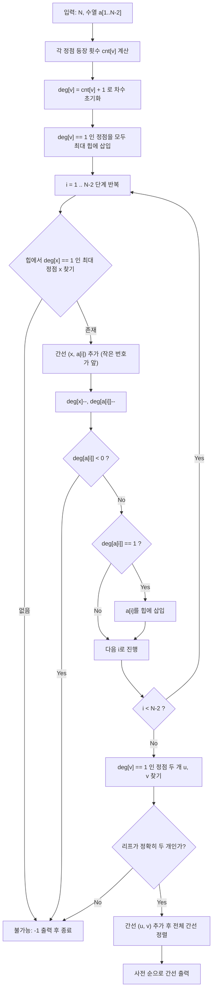

## 문제 정보

**백준 20131: 트리 만들기**  
- 링크: [https://www.acmicpc.net/problem/20131](https://www.acmicpc.net/problem/20131)  
- 시간 제한: 2초 | 메모리 제한: 1024 MB  
- 난이도: 중상 | 분류: 그래프, 트리, 구현

**요약**:  
정점이 \(N\)개인 트리에서 **차수 1인 정점(리프)을 번호가 가장 큰 것부터 골라 제거하면서, 그 리프와 인접한 정점 번호**를 기록해 얻은 길이 \(N-2\)의 수열이 주어진다. 이 수열이 실제로 어떤 트리에서 나올 수 있는지 판별하고, 가능하다면 **유일한 트리를 복원하여 간선을 사전 순으로 출력**해야 하며, 트리가 존재하지 않거나 둘 이상 존재하면 -1을 출력한다.

## 문제 설명

트리에 대해 다음 과정을 수행해서 수열 \(a_1, a_2, \dots, a_{N-2}\)를 만든다.

1. 현재 트리에서 **차수가 1인 정점들 중 번호가 가장 큰 정점**을 하나 고른다. 이를 \(x\)라고 하자.
2. 정점 \(x\)와 인접한 정점의 번호를 수열에 넣는다.
3. 정점 \(x\)와 인접한 간선을 트리에서 삭제한다.
4. 위 과정을 총 \((N-2)\)번 반복한다.

이때 최종적으로 남는 두 정점은 서로 간선으로 연결된 상태가 된다.  
입력으로 주어진 수열이 위 과정을 통해 얻어질 수 있는지 확인하고, 가능하다면 **원래 트리의 간선 \((N-1)\)개**를 조건에 맞게 출력하는 것이 목표다.

## 입출력 예제

### 예제 1

**입력:**
```text
9
9 4 4 5 4 4 6
```

**출력:**
```text
1 6
2 4
3 5
4 5
4 6
4 7
4 9
8 9
```

### 예제 2

**입력:**
```text
11
4 3 6 10 2 1 8 9 3
```

**출력:**
```text
1 3
1 4
2 8
2 10
3 7
3 9
4 11
5 6
6 10
8 9
```

## 접근 방식

### 핵심 관찰

- 최종 수열은 **항상 리프에서 큰 번호부터 제거**하는 과정에서 나왔으므로,  
  이를 **역으로 따라가면 원래 트리를 재구성**할 수 있다.
- 수열의 각 원소 \(a_i\)는, 해당 단계에서 제거된 리프 \(x\)와 연결된 정점의 번호이다.
  - 즉, **그 시점의 리프 \(x\)와 \(a_i\) 사이에 간선 \((x, a_i)\)** 가 존재해야 한다.
- 리프는 항상 **차수 1**이므로, 각 정점의 차수는
  \[
  \text{deg}[v] = \text{(수열에서 등장한 횟수)} + 1
  \]
  로 결정된다.
- 처음부터 차수 1인 정점들을 모두 모아두고, **최대 힙(우선순위 큐)** 로 관리하면  
  “현재 리프들 중 가장 번호가 큰 정점”을 빠르게 선택할 수 있다.

### 알고리즘 설계

1. **수열 등장 횟수 세기**
   - 각 값 \(a_i\)의 등장 횟수를 세어 `cnt[v]`에 저장한다.
   - `deg[v] = cnt[v] + 1` 로 초기 차수를 설정한다.

2. **초기 리프 수집**
   - 모든 정점 \(v\)에 대해 `deg[v] == 1`인 정점을 우선순위 큐(최대 힙)에 넣는다.

3. **N-2단계 역 시뮬레이션**
   - 수열을 앞에서부터 순서대로 보면서, 매 단계마다:
     - 우선순위 큐에서 **현재 차수 1인 정점들 중 가장 큰 번호** \(x\)를 꺼낸다.
       - 단, 과거에 차수가 변해 **이미 리프가 아닌 정점이 힙에 남아있을 수 있으므로**,  
         `deg[x] == 1`인 정점을 만날 때까지 반복해서 꺼낸다.
       - 만약 큐가 비면, 수열을 만들 수 없는 경우이므로 **-1**이다.
     - 해당 단계의 값 \(a_i\)와 \(x\)를 잇는 간선 \((x, a_i)\)를 저장한다.
     - `deg[x]--` (0이 되어 더 이상 사용되지 않음), `deg[a_i]--`.
     - 만약 `deg[a_i]`가 1이 되면, 새로 리프가 되었으므로 우선순위 큐에 넣는다.
     - `deg[a_i] < 0`이 되는 경우는 **불가능한 상태**이므로 -1 처리.

4. **마지막 두 정점 연결**
   - 모든 단계를 마친 뒤, 남은 정점들 중에서 `deg[v] == 1`인 정점이 **정확히 두 개** 있어야 한다.
   - 이 둘을 \(u, v\)라 할 때, 간선 \((u, v)\)를 추가하면 전체 트리가 완성된다.

5. **정답 정렬 및 출력**
   - 모든 간선 \((a, b)\)에 대해 항상 `a < b`가 되도록 정규화한 뒤,
   - 간선 리스트를 사전 순(`a` 오름차순, `a` 같으면 `b` 오름차순)으로 정렬해 출력한다.
   - 중간에 실패 판정을 내렸거나, 마지막에 남은 리프 수가 2가 아니면 **-1**을 출력한다.

### Mermaid 흐름도



## 복잡도 분석

| 항목 | 복잡도 | 설명 |
|---|---|---|
| **시간 복잡도** | \(O(N \log N)\) | 각 단계마다 최대 한 번의 힙 연산 및 정렬 \(O(N \log N)\) |
| **공간 복잡도** | \(O(N)\) | 차수 배열, 등장 횟수 배열, 간선 리스트, 힙 저장 |

## 구현

### C++ 코드

```cpp
// 42jerrykim.github.io에서 더 많은 정보를 확인할 수 있습니다.
#include <bits/stdc++.h>
using namespace std;

int main() {
    ios::sync_with_stdio(false);
    cin.tie(nullptr);

    int N;
    if (!(cin >> N)) return 0;

    vector<int> a;
    if (N >= 3) {
        a.resize(N - 2);
    }

    vector<int> cnt(N + 1, 0);
    for (int i = 0; i < N - 2; ++i) {
        cin >> a[i];
        if (a[i] < 1 || a[i] > N) {
            cout << -1 << '\n';
            return 0;
        }
        cnt[a[i]]++;
    }

    vector<int> deg(N + 1);
    for (int i = 1; i <= N; ++i) {
        deg[i] = cnt[i] + 1; // 각 정점의 차수
    }

    priority_queue<int> pq; // 차수 1인 정점들 중 가장 큰 번호
    for (int i = 1; i <= N; ++i) {
        if (deg[i] == 1) pq.push(i);
    }

    vector<pair<int,int>> edges;
    edges.reserve(N - 1);

    // N-2 단계 복원
    for (int i = 0; i < N - 2; ++i) {
        // 차수 1인 정점 중에서 가장 큰 것 찾기 (stale 제거)
        int x;
        while (true) {
            if (pq.empty()) {
                cout << -1 << '\n';
                return 0;
            }
            x = pq.top();
            pq.pop();
            if (deg[x] == 1) break;
        }

        int y = a[i];

        // 간선 추가
        if (x < y) edges.emplace_back(x, y);
        else       edges.emplace_back(y, x);

        // 차수 갱신
        deg[x]--;          // 0이 됨, 제거
        deg[y]--;
        if (deg[y] == 1) pq.push(y);
        if (deg[y] < 0) { // 불가능한 경우 방어
            cout << -1 << '\n';
            return 0;
        }
    }

    // 마지막 두 정점 연결
    int u = -1, v = -1;
    for (int i = 1; i <= N; ++i) {
        if (deg[i] == 1) {
            if (u == -1) u = i;
            else if (v == -1) v = i;
            else {
                cout << -1 << '\n';
                return 0;
            }
        }
    }
    if (u == -1 || v == -1) {
        cout << -1 << '\n';
        return 0;
    }
    if (u < v) edges.emplace_back(u, v);
    else       edges.emplace_back(v, u);

    // 사전 순 정렬
    sort(edges.begin(), edges.end());

    // 결과 출력
    for (auto &e : edges) {
        cout << e.first << ' ' << e.second << '\n';
    }
    return 0;
}
```

## 코너 케이스 및 실수 포인트

| 케이스 | 설명 | 처리 방법 |
|---|---|---|
| \(N = 3\) | 수열 길이가 1인 최소 크기 트리 | 한 번의 단계 후 남은 두 정점을 정확히 연결해야 함 |
| 수열 값 범위 초과 | \(a_i \notin [1, N]\) | 즉시 -1 출력 |
| 리프 부족 | 어떤 단계에서 힙이 비는데 아직 수열 처리가 남은 경우 | 불가능한 수열로 간주하고 -1 출력 |
| 차수 음수 | `deg[y]`가 0 아래로 떨어지는 경우 | 잘못된 수열이므로 -1 처리 |
| 리프 개수 불일치 | 최종적으로 `deg == 1`인 정점이 2개가 아닌 경우 | 유효한 트리가 아니므로 -1 출력 |
| 정렬 조건 누락 | \(a < b\) 또는 사전 순 정렬을 빼먹은 경우 | 출력 형식 오류로 오답, 간선 정규화 + 정렬 필수 |

## 제출 전 점검

- [x] `deg[v] = cnt[v] + 1` 로 초기 차수를 올바르게 계산했는가?
- [x] 힙에서 **stale 리프(더 이상 차수 1이 아닌 정점)** 를 건너뛰도록 구현했는가?
- [x] 모든 간선에 대해 항상 `a < b`가 되도록 정규화했는가?
- [x] 간선 리스트를 사전 순으로 정렬 후 출력했는가?
- [x] 잘못된 입력(수열 범위, 차수 음수, 리프 개수 불일치)에 대해 -1을 출력하는가?


