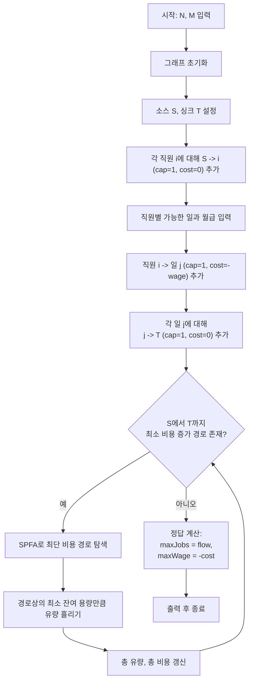

문제의 핵심 유형은 **이분 그래프 네트워크 플로우 + 최소 비용 최대 유량(MCMF)**입니다.  
이 글에서는 *문제 정보 요약 → 입출력 예제 → 접근 방식 및 로직 설계 → 복잡도 분석 → 구현 코드 → 코너 케이스* 순서로 정리합니다.


## 문제 정보

**문제 링크**: [https://www.acmicpc.net/problem/11409](https://www.acmicpc.net/problem/11409)

**문제 요약**:  
직원 \(N\)명과 일 \(M\)개가 있고, 각 직원은 자신이 할 수 있는 일과 그 일을 수행할 때 받아야 하는 월급 목록을 가진다.  
각 직원은 최대 한 개의 일만 맡을 수 있고, 각 일 역시 한 명의 직원만 담당할 수 있을 때,
- 할 수 있는 일의 개수를 최대로 만들고,
- 그러한 매칭들 중에서 월급 총합이 최대가 되도록
직원–일 매칭을 구성해야 한다.

**제한 조건**:
- 시간 제한: 2초
- 메모리 제한: 256MB
- \(1 \le N, M \le 400\)
- 월급: \(0 \le \text{wage} \le 10\,000\)


## 입출력 예제

**입력 1**:

```text
5 5
2 1 3 2 2
1 1 5
2 2 1 3 7
3 3 9 4 9 5 9
1 1 0
```

**출력 1**:

```text
4
k23
```

**설명(요약)**:  
최대 4개의 일을 수행할 수 있으며, 그렇게 매칭했을 때 월급 총합의 최댓값은 23이다.


## 접근 방식

### 핵심 관찰

- 직원과 일의 관계는 전형적인 **이분 그래프 매칭** 구조를 가진다.
- 1순위 목표는 **매칭 수(할 수 있는 일의 개수)를 최대로** 만드는 것이고,  
  2순위 목표는 그 상태에서 **월급 총합을 최대로** 만드는 것이다.
- 직원–일 간선의 **비용을 \(-\text{월급}\)** 으로 둔 뒤, **최소 비용 최대 유량(MCMF)** 을 수행하면
  - 최대 유량 = 최대 작업 개수
  - 최소 비용 = \(-\)최대 월급 합
  을 동시에 만족할 수 있다.

### 알고리즘 설계 (Mermaid Flowchart)



### 단계별 로직

1. **전처리 및 그래프 구성**
   - 정점 번호:
     - 소스 \(S = 0\)
     - 직원: \(1 \sim N\)
     - 일: \(N+1 \sim N+M\)
     - 싱크 \(T = N + M + 1\)
   - 간선 추가:
     - \(S \to i\) (직원): 용량 1, 비용 0
     - \(i \to N+j\) (직원–일): 용량 1, 비용 = \(-\text{wage}\)
     - \(N+j \to T\) (일): 용량 1, 비용 0

2. **메인 로직 (SPFA 기반 MCMF)**
   - 남은 용량이 있는 간선만 고려하여 SPFA로 \(S \to T\) 최소 비용 경로를 찾는다.
   - 경로가 없으면 종료, 있으면 그 경로에 가능한 만큼(최소 잔여 용량) 유량을 흘린다.
   - 흘린 유량을 `flow`에, 해당 경로 비용을 `cost`에 누적한다.

3. **후처리**
   - `flow`가 곧 **할 수 있는 일의 개수**이다.
   - `cost`는 \(-\)월급 총합이므로, \(-\text{cost}\)가 **월급 총합의 최댓값**이다.
   - `flow`, `-cost`를 차례로 출력한다.


## 복잡도 분석

| 항목 | 복잡도 | 비고 |
|---|---|---|
| **정점 수** | \(V \approx N + M + 2 \le 802\) | 소스/싱크 포함 |
| **간선 수** | \(E \le N \times M + N + M\) | 직원–일 모든 조합 가능한 최악 가정 |
| **시간 복잡도** | \(O(\text{flow} \times V \times E)\) (SPFA 기반 MCMF) | 실제 입력에서는 훨씬 작게 동작 |
| **공간 복잡도** | \(O(V + E)\) | 인접 리스트 및 보조 배열 저장 |


## 구현 코드

### C++

```cpp
// 42jerrykim.github.io에서 더 많은 정보를 확인 할 수 있습니다.

#include <bits/stdc++.h>
using namespace std;

struct Edge {
    int to;
    int cap;
    int cost;
    int rev;
};

const int INF = 1e9;

int main() {
    ios::sync_with_stdio(false);
    cin.tie(nullptr);

    int N, M;
    if (!(cin >> N >> M)) return 0;

    int S = 0;
    int T = N + M + 1;
    int V = T + 1;

    vector<vector<Edge>> graph(V);

    auto add_edge = [&](int from, int to, int cap, int cost) {
        Edge a{to, cap, cost, (int)graph[to].size()};
        Edge b{from, 0, -cost, (int)graph[from].size()};
        graph[from].push_back(a);
        graph[to].push_back(b);
    };

    // S -> 직원
    for (int i = 1; i <= N; ++i) {
        add_edge(S, i, 1, 0);
    }

    // 직원 -> 일 (비용 = -월급)
    for (int i = 1; i <= N; ++i) {
        int k;
        cin >> k;
        while (k--) {
            int job, w;
            cin >> job >> w;
            add_edge(i, N + job, 1, -w);
        }
    }

    // 일 -> T
    for (int j = 1; j <= M; ++j) {
        add_edge(N + j, T, 1, 0);
    }

    int flow = 0;          // 할 수 있는 일의 개수 (매칭 수)
    long long cost = 0;    // 최소 비용 (실제로는 -월급 합)

    vector<int> dist(V), prevv(V), preve(V);
    vector<bool> inQ(V);

    while (true) {
        fill(dist.begin(), dist.end(), INF);
        fill(inQ.begin(), inQ.end(), false);
        queue<int> q;

        dist[S] = 0;
        q.push(S);
        inQ[S] = true;
        prevv[S] = -1;

        // SPFA로 S -> T 최소 비용 경로 탐색
        while (!q.empty()) {
            int v = q.front();
            q.pop();
            inQ[v] = false;

            for (int i = 0; i < (int)graph[v].size(); ++i) {
                Edge &e = graph[v][i];
                if (e.cap <= 0) continue;
                int nd = dist[v] + e.cost;
                if (nd < dist[e.to]) {
                    dist[e.to] = nd;
                    prevv[e.to] = v;
                    preve[e.to] = i;
                    if (!inQ[e.to]) {
                        inQ[e.to] = true;
                        q.push(e.to);
                    }
                }
            }
        }

        if (dist[T] == INF) break; // 더 이상 증가 경로 없음 → 최대 유량 도달

        int addFlow = INF;
        for (int v = T; v != S; v = prevv[v]) {
            addFlow = min(addFlow, graph[prevv[v]][preve[v]].cap);
        }

        flow += addFlow;
        cost += 1LL * addFlow * dist[T];

        for (int v = T; v != S; v = prevv[v]) {
            Edge &e = graph[prevv[v]][preve[v]];
            e.cap -= addFlow;
            graph[v][e.rev].cap += addFlow;
        }
    }

    int maxJobs = flow;
    long long maxWage = -cost; // 비용은 -월급 이므로 부호 반전

    cout << maxJobs << '\n' << maxWage << '\n';

    return 0;
}
```


## 코너 케이스 및 실수 포인트

| 케이스 | 설명 | 처리 방법 |
|---|---|---|
| **N=1, M=1** | 최소 규모 그래프 | 반복문 인덱스 범위, 정점 번호 할당을 다시 한 번 점검한다. |
| **어떤 직원도 일을 할 수 없음** | 유량이 0일 수 있음 | 증가 경로가 없을 때 바로 종료하고 `flow=0`, `wage=0`을 출력한다. |
| **모든 월급이 0** | 비용 최적화 의미가 약해짐 | 비용이 모두 0이어도 로직이 깨지지 않는지 확인한다. |
| **음수 비용 간선 처리** | 비용을 `-월급`으로 설정 | SPFA에서 `dist` 초기화와 갱신 조건을 엄밀히 구현하고, 오버플로를 피하기 위해 `INF`를 충분히 크게 둔다. |
| **오버플로우 위험** | 월급 합이 커질 수 있음 | 누적 비용은 `long long`으로 관리한다. |


## 참고 문헌 및 출처

- [백준 11409번: 열혈강호 6](https://www.acmicpc.net/problem/11409)
- [Minimum Cost Maximum Flow – 네트워크 플로우 이론 개요 (영문 위키 등)](https://en.wikipedia.org/wiki/Minimum-cost_flow_problem)

